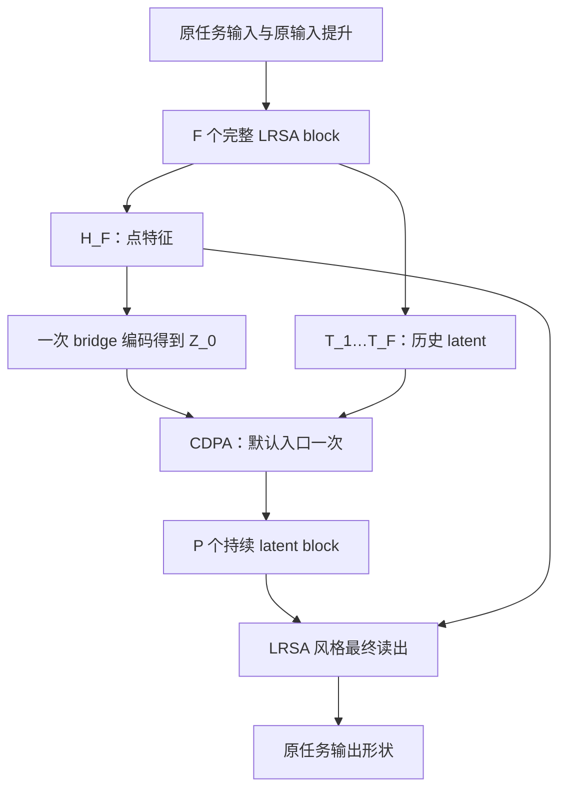

# CDPA 神经算子：基于 Transolver 的完整修改计划 v1.2

日期：2026-09-13。用途：交给 Codex 在 Transolver 仓库执行模型修改。

v1.1 已补充用户指定的 CUDA 12.8 / PyTorch 2.11 环境、八任务依赖核查、来源批处理与逐层 CDPA 的完整成本、LRSA 实测对照及全对话约束复核。v1.2 在此基础上增加数学理论附件和第14节的理论—架构映射，不改变模型公式、默认2+6、entry主实验、依赖候选或验收范围。随附中文理论稿、英文LaTeX/PDF和NumPy公式核查；这些不是新模型代码，也不要求执行额外真实训练。

**当前交付的是设计与执行计划，不是已经完成的模型代码。** 本文已基于论文、本聊天已确认设计和三个官方仓库的可读取源码核对；尚未修改这些仓库，也没有下载或使用真实训练数据。

## 0. 执行规则与任务范围

### 0.1 必须遵守的设计决定

1. 基仓库是 `thuml/Transolver`。原 Transolver 模型及原启动脚本继续可用，新模型另设名称、配置、输出目录与 checkpoint。
2. 只改变模型架构及必要的模型选择、参数转发、检查点兼容接入。不改变数据读取、字段选择、划分、采样、归一化、目标定义、损失、评价指标、训练/测试时间循环、优化器和调度器调用语义。
3. 主实验：Darcy、Elasticity、Airfoil、Pipe、Navier–Stokes、Plasticity、ShapeNet-Car、AirfRANS。它们是六个标准 PDE 基准加两个工业任务，不要全部标为专名 PDEBench 数据库。
4. 默认两个完整 LRSA 风格 block，后接一次过渡编码、一次入口 CDPA、六个 IPOT 风格 persistent latent block，最后使用 LRSA 风格的输入点特征条件读出。
5. 规则索引网格：使用 LRSA 风格的后置 ConvFFN。非结构化点：使用逐点 FFN。不要继续使用 Transolver 的卷积式分片投影，不要在 latent 序列上沿编号做卷积。
6. 前段历史取每个 LRSA block 的 **latent FFN1 → self-attention → latent FFN2 之后、up-attention 之前** 的完整 latent 表示。
7. 新机制统一称 **CDPA（Cross-Depth Physics Attention，跨深度物理注意力）**，就是已确定的 Cross 版本。不得加入 CDPA-Slice、Gram 校正层或已放弃方案。
8. 首版所有前段、过渡、后段 latent 数一致。不同数据集允许采用不同 M。
9. 前段数量、总深度和 CDPA 模式必须可配置。默认总深度 8，支持前段 0–6；总深度还可增大。比例在每次训练启动前确定，不在单次训练过程中动态删增层。
10. `cdpa_mode=entry` 为主结果；`off` 和 `every_block` 必须实现并完成无数据验证，用于后续消融，但不自动启动训练扫描。
11. 稀疏 Darcy 只在附录记录：**除非用户另外明确要求，不实现、不接数据、不写训练入口、不将其列为本次验收条件。** 递增 latent 数同样只记录，当前不实现。
12. 当前无真实数据。验收采用静态源码审查、真实接口的合成张量、数学参考实现、前反向、原损失连接、checkpoint 往返。不得下载数据，不得将合成检查称为真实数据训练成功。
13. 不引入自定义 CUDA/Triton kernel；attention 使用 PyTorch SDPA。不得为迁移模块引入整套 Lightning、Hydra、torch-scatter 等新的训练框架依赖。
14. 以本聊天已确定设计优先。本文明确标为“实现级默认”的细节是为消除实现歧义而补齐，不应称为原论文统一配置或用户此前逐项指定。

### 0.2 本次实现边界

| 必须实现 | 只记录，不执行 |
|---|---|
| 八个现有任务的模型接入 | Darcy 稀疏系数观测 → 完整解场 |
| 总深度及阶段比例配置 | 后段 latent 数随深度递增 |
| CDPA off / entry / every_block | CDPA-Slice |
| 无数据验收工具与独立模型计时工具 | 新的物理残差损失、守恒约束或校正层 |
| 当前 NS 10→10 协议兼容 | 未取得长轨迹数据的 NS 10→20/40 实验 |
| 当前 Plasticity 时间条件接口兼容 | 改成 IPOT 式时空展平或跨时间 latent 推进 |

“可运行配置”不等于“必须执行所有训练”。本次编码交付无需进行真实训练或大规模超参数搜索。

## 1. 参考来源、版本和必须处理的源码差异

### 1.1 审查快照

| 仓库 | 审查 commit | 用途 |
|---|---|---|
| [thuml/Transolver](https://github.com/thuml/Transolver) | `75e0f67643806a81cd1d3f6adc88dd8c02416fe7` | 数据、训练/评估入口、输入提升、任务接口 |
| [Adversarr/LRSA-Operator](https://github.com/Adversarr/LRSA-Operator) | `47b03f8c8c8da30bbcc0737b008dc4548f9cb98e` | 前段 down/latent/up、点域 FFN/ConvFFN、最终读出 |
| [7tl7qns7ch/IPOT](https://github.com/7tl7qns7ch/IPOT) | `18c177846267505ee9503445a146dfd7dee34c41` | 过渡编码、持续 latent processor、GEGLU、未来坐标读出 |

执行前记录用户实际 checkout 的 commit、工作区已有修改及 AGENTS.md。若版本不同，审查相关文件差异再移植，不强制 reset 用户工作区，不覆盖已有工作。

论文依据：

- [Transolver](https://arxiv.org/pdf/2402.02366v2)：附录 B.1/B.3、Table 8、NS 任务说明。
- [LinearNO](https://arxiv.org/html/2511.06294v3)：Table 8、Table 11；用于配置和研究动机，不移植其数据入口。
- [LRSA](https://arxiv.org/html/2604.03582v1)：§3.4、Eq. 8–10、Table 9、Table 11。
- [IPOT](https://arxiv.org/html/2312.10975v1)：编码/processor/decoder、Table 4–5、附录 Attention 定义。
- 用户上传的 `kimi k3(4).pdf`：§2.2、式 8–10；CDPA 借鉴其跨深度评分和聚合，不照搬其 residual replacement。

### 1.2 不得机械复制的内容

| 已核对的事实 | 本计划的处理 |
|---|---|
| LRSA 各任务 YAML 的 M、latent width、层数等与论文及已定配置有差异 | 明确使用本文配置；不整份导入 YAML |
| LRSA 完整 block 有两次 latent FFN | 两次都保留，不缩成 down→SA→up |
| LRSA 结构化 `dwconv` 实际是 `Conv2d(d,d,3,padding=1)`，无 `groups=d` | 使用普通通道混合 3×3 卷积，按真实成本计算 |
| LRSA 原仓库不同任务是否启用 ConvFFN 并不统一 | 本模型按已商定设计，对五个结构网格任务统一使用这种 ConvFFN；这是新模型选择 |
| LRSA 可选 RoPE、attention gate、不同 latent width 等 | 首版不启用这些未约定扩展；Q/K norm 与 FFN 参数明确配置 |
| LRSA 结构/非结构模型 reset 调用不一致 | 新包统一初始化，不能依赖整模型构造器的偶然调用顺序 |
| IPOT processor 把同一 attention/FFN 对象重复放进 ModuleList，`weight_tie_layers=False` 也未阻止共享 | 后段各 block 独立实例化，测试参数对象及存储独立 |
| IPOT processor 的实际 PreNorm 调用与论文 Q/K/V 均归一化的表达存在差异 | 后段采用论文一致的 pre-LN self-attention：Q/K/V 都来自同一 LN(Z) |
| IPOT encoder 默认加入可学习 query residual；定义了 encoder_ff，但 forward 没有使用 | bridge 保留 query residual + cross-attention；不注册永远不用的 encoder_ff，不暗中增加一次 FFN |
| IPOT 某些 mask 参数未实际使用 | 不依赖这些参数声称完成 masking；当前主版按无 padding 的单图/定长 batch 实现 |
| Transolver 位置编码存在 `.cuda()` 和未注册 tensor | 新适配器保留数值定义，改为输入 device 感知或 registered buffer；不改原模型 |
| 工业原模型把所有 `.x` unsqueeze 成一个样本，忽略多图 batch | 新适配器首版支持原有 batch=1；遇多图明确报错，禁止混合不同模拟样本 |
| 标准 eval 部分使用 `strict=False` | 新模型分支严格校验 checkpoint 与架构；原模型分支保持原行为 |

这些差异应在实现后的 `REFERENCE_AUDIT.md` 中逐项说明：采用了什么、没有采用什么、原因和源码位置。不能把所有代码/论文差异都简单称为作者 bug。

## 2. 模型的唯一计算规格

### 2.1 符号与默认结构

- B：batch size；N：当前输入节点数；d：隐藏宽度；h：头数；d_h=d/h。
- L：含 latent self-attention 的总处理 block 数，默认 8。
- F：前段完整 LRSA block 数，默认 2。
- P=L−F：后段 persistent latent block 数，默认 6，必须至少 1。
- M：整个模型统一 latent 数。
- H_0：保留 Transolver 输入提升语义后得到的 `[B,N,d]` 点特征。
- H_F：前段最终点特征，保存至最终 decoder；F=0 时就是 H_0。
- T_i：第 i 个前段 block 的历史 latent，形状 `[B,M,d]`。

结构：



桥接、CDPA、最终读出另外计数。不得称新模型只有八个 attention 操作，也不得把整个 NS rollout 解释为只执行一次 bridge。

### 2.2 输入提升与位置/时间条件

输入提升保留对应 Transolver wrapper 的原数学语义，包括坐标是否被 reference-distance 替换/追加、fx=None 时的 placeholder、Plasticity 时间嵌入、最终输出通道。

参数只为实际会执行的路径注册：Elasticity/Airfoil/Pipe及两个工业wrapper的fx=None路径保留placeholder；Darcy/NS/Plasticity固定提供fx，不注册闲置placeholder。仅Time_Input=True时注册时间投影。固定任务收到违反其fx/时间合同的输入时明确报错，不靠备用但永远不训练的参数兜底。

移植输入提升时只做 device-aware、稳定模块路径等工程修正。不得同时换成 LRSA 的位置 embedding、额外 Fourier 编码或几何网络，否则改变了研究变量。

### 2.3 完整 LRSA 风格前段 block

前段第 i 层输入 H，顺序必须是：

1. `Hn = PointNorm_i(H)`，保存 H 作为该 block 的点残差。
2. 使用独立可学习 queries `P_i[M,h,d_h]` 下采样。queries 直接作为 Q 的参数，不强行再增加 W_Q；K/V 来自 Hn 的独立投影。该 down 输出不额外加 queries 残差。
3. `Z = Z + FFN_in_i(Norm_in_i(Z))`。
4. `Z = Z + SelfAttention_i(Norm_sa_i(Z))`，Q/K/V 使用归一化 latent。
5. `T_i = Z + FFN_out_i(Norm_out_i(Z))`。
6. **此处保存 T_i**，不 detach；不保存 token attention 矩阵。
7. `DeltaH = Up_i(query=Hn, context=Norm_up_latent_i(T_i))`。Up 的 Q 来自 block 入口点特征，K/V 来自 T_i；down/up 参数独立。
8. `U = H + DeltaH`。
9. `H_next = U + PointFFN_i(PointFFNNorm_i(U))`，或结构网格版本的 ConvFFN。

每层有两次 latent FFN、一次 latent SA、一次点域 FFN；缓存历史不能导致任何一项被删除。各前段层的 learned queries、投影、norm、FFN 均独立。

### 2.4 规则网格 ConvFFN

结构化任务为 Darcy、Airfoil、Pipe、NS、Plasticity；Elasticity、ShapeNet-Car、AirfRANS 使用逐点 FFN。

遵循 LRSA 模块的计算次序：

```text
外层点特征 Norm
→ [B,N,d] 按已有 H,W 转为 [B,d,H,W]
→ 普通 Conv2d(d,d,kernel_size=3,stride=1,padding=1,groups=1)
→ 转回 channels-last
→ LayerNorm(d,eps=1e-6)
→ Linear(d,hidden,bias=False)
→ 激活
→ Linear(hidden,d,bias=True)
→ 按原节点顺序返回 [B,N,d]
→ 外部残差相加
```

不使用 depthwise convolution；不新增池化、下采样、重排、周期 padding 或多尺度卷积。H/W 来自原任务构造参数，检查 `N==H*W`，禁止通过 `sqrt(N)` 猜测。

Airfoil/Pipe 是规则索引组织的弯曲物理网格，不能按物理坐标重新排序。Plasticity 保留原空间索引与时间条件，不改成 3D 时空卷积。

F=0 时没有前段卷积，但主版最终 LRSA 读出仍按任务使用一次 ConvFFN；不能把 F=0 称作完全没有点域卷积的原始 IPOT。

### 2.5 Bridge：一次进入 persistent latent

设独立可学习查询为 Q_0∈R^{M×d}，广播 batch：

\[
Z_0 = Q_0 + \operatorname{CrossAttn}(\operatorname{LN}(Q_0),\operatorname{LN}(H_F),\operatorname{LN}(H_F)).
\]

这是本计划明确采用的 IPOT encoder 代码路径：有 query residual，没有额外 encoder FFN。实现中不得定义不参与 forward 的 encoder_ff。Q/K/V/O 投影及 norms 独立于前段和 decoder。

Bridge 不依赖 F≥1：F=0 时直接编码 H_0。所有后段 token 数均为 M。

### 2.6 IPOT 风格后段 block

每个 block 独立实例化，采用：

\[
A=Z+\operatorname{MHA}(\operatorname{LN}_1(Z),\operatorname{LN}_1(Z),\operatorname{LN}_1(Z)),
\]
\[
Z'=A+\operatorname{GEGLUFFN}(\operatorname{LN}_2(A)).
\]

GEGLU 的明确尺寸：`Linear(d, 2*r*d) → split(value,gate) → value*GELU(gate) → Linear(r*d,d)`，首版 r=2。不要把第一层输出 `4d` 错当作最终隐藏宽度 `4d`。

没有新的 point-to-latent、latent-to-point、空间卷积、latent 编号位置编码，也没有跨真实时间的状态缓存。后段每层只执行一次 SA+FFN；不按 LRSA 又加第二次 latent FFN。

### 2.7 首版最终 decoder：LRSA 风格输入特征条件读出

后段最终输出记为 Z_P。以保存的 H_F 构造 query：

\[
\Delta H=\operatorname{Up}(Q=\operatorname{Norm}(H_F)W_Q^{up},
K=\operatorname{Norm}_z(Z_P)W_K^{up},
V=\operatorname{Norm}_z(Z_P)W_V^{up}),
\]
\[
H_D=H_F+\Delta H,
\quad H_{out}=H_D+\operatorname{PointFFN/ConvFFN}(\operatorname{Norm}(H_D)),
\]
\[
\hat u=\operatorname{Linear}_{out}(\operatorname{LN}_{out}(H_{out})).
\]

最终 Up 是独立模块，不共享 bridge/front up 权重。使用 H_F，不是 H_0，也不是未经定义的“输出特征”。模型不读取标签或真实未来场。

该读出包含一次 up、一次隐藏点特征 residual 和一次 point FFN/ConvFFN；没有再增加 down 或 latent SA。H_F 的旁路使已有点特征可绕过最后的 latent 瓶颈，不保证这些特征无损保存了全部原输入；必须与 CDPA 收益分别归因。

主版 decoder 仅面向输入输出节点一一对应的八个任务。仅有相同 N 并不足以支持任意另一套输出位置。

### 2.8 表达能力假设与研究结论的边界

本模型检验的假设是：少量完整点域更新形成不同的latent历史，CDPA在token对齐后选择这些历史，能否以较少N规模计算取得可比精度。CDPA不是“从单次压缩中恢复所有信息”的数学保证，也不保证等价于任意多次重新压缩。

对后段而言，可访问的信息来自 `(Z_0,T_1,...,T_F)`；新增后段历史是此前这些表示的函数，并未重新观察点域。every_block增加的是不同深度变换后的可访问路径，不能凭此声称获得了新的输入观测。首版最终decoder还访问H_F，因此整模型不是只依赖最终latent的严格信息瓶颈，但该点域旁路也不保证无损。

更精确地，最终单个输出点只直接访问局部H_F：点版本为该点，规则网格版本为最终一次3×3 ConvFFN的邻域。off在该点的预测是 `(H_F|邻域,Z_0)` 的函数。因此即使完整H_F保留所有信息，后段的全局访问仍可能受bridge限制；CDPA可在不再遍历全部N点的情况下补充历史统计量。相关条件命题见理论附件§5–7；不得将其写成所有PDE上严格改善误差或全模型函数类必然包含的结论。

应把off/entry/every_block、不同F与matched LRSA的误差—成本比较作为未来实证问题。保持零初始化depth scorer的既定定义；若训练表现不佳，不在首版暗中加入identity偏置、gate或新损失来改变机制。

## 3. CDPA 的精确公式、数值和历史规则

### 3.1 单个历史来源的 Cross 对齐

当前 Z[B,M,d]、历史 T_s[B,M,d]。同一次融合中共享投影：

\[
Q=\operatorname{LN}_q(Z)W_Q,
\quad K_s=\operatorname{LN}_{kv}(T_s)W_K,
\quad V_s=\operatorname{LN}_{kv}(T_s)W_V,
\]
\[
R_s=\operatorname{ConcatHeads}\left[\operatorname{softmax}_{history\ token}
\left(QK_s^\top/\sqrt{d_h}\right)V_s\right]W_O+b_O.
\]

- 历史来源共享 LN_kv、W_Q、W_K、W_V、W_O；Q 只需计算一次。
- 每个来源独立在其历史 token 轴做 softmax。不能直接把所有历史拼成 S*M 个 token，再做一个普通 softmax 来代替。
- R_s 是完成 W_O 后的对齐结果；不在 R_s 外加 Z 或 T_s 残差。
- b_O是§4.3已明确的输出投影bias，广播到各token，同一次融合由来源共享；上式显式补出它不改变已有out_bias=True设置。
- 当前候选 R_0=Z，严格恒等，不通过 Cross，也不施加 W_O。
- 同时实现逐来源参考路径与来源批处理/分块路径：当前 Q 只算一次；把每组 k 个来源折叠到 batch，Q/K/V 形状为 `[B*k,h,M,d_h]`，每份 K/V 的序列长度仍为 M。不能把 key 长度改成 k*M。
- `cdpa_source_chunk_size=1` 是逐来源路径；`0` 表示一次处理当前所有历史；正整数 k 表示每组最多 k 个来源。首版运行默认 0，作为待远端计时的执行起点，不声称一定最快。两条路径共享同一套参数和数学；dropout=0 下必须通过输出及梯度一致性检查。
- 不把 identity 候选 R_0 放进历史 Cross 批处理。每个 R_s 完成 W_O 后，再进入统一的深度 softmax；不能分别对每个 chunk 做深度融合后平均。
- Q 的 expand/reshape 可能实际分配连续副本；history stack 也会分配临时内存。不得把这些算作零开销。来源批处理减少 SDPA 调用与 Python 循环，不减少 MAC；一次 SDPA API 调用也不等于一个 CUDA kernel。

### 3.2 多个历史的深度融合

\[
e_{b,m,s}=w^\top\operatorname{RMSNorm}_{depth}(R_{s,b,m}),
\quad \alpha_{b,m,s}=\operatorname{softmax}_{source}(e_{b,m,s}),
\]
\[
\widetilde Z_{b,m}=\sum_{s=0}^{S}\alpha_{b,m,s}R_{s,b,m}.
\]

约束：

1. 权重是 `[B,M,S+1]`，每个当前 token 独立选择来源，不是整张样本只有一组权重。
2. RMSNorm 仅用于评分，value 是 RAW R_s，不对 values 额外归一化。
3. 评分向量 w[d] 全零初始化，因此初始权重为 1/(S+1)；默认两份历史时为 1/3。
4. 不给当前候选额外正偏置、不加 gate、不另算 `Z+fused`。后段 block 自己的 SA/FFN residual 保留。
5. 同一位置对所有来源使用同一个 w 和 depth RMSNorm；不同后段 CDPA 位置参数独立。
6. depth RMS 均方、评分、softmax、加权累加用 FP32；返回前转回 Z.dtype。不能用 detach 或 no_grad 来实现 FP32 路径。
7. LN/depth RMSNorm eps=1e-6；depth RMSNorm 有可学习 scale、无 bias，scale 初始化 1。
8. 主版 attention/dropout 均为 0；不开启额外 depth embedding、Slot Attention 式迭代竞争或 GRU。

“物理”来自被处理的 PDE latent；当前 CDPA 不包含显式 PDE 残差、守恒约束或物理方程评分，不能宣称已具备这些性质。

### 3.3 默认 entry 模式

只在后段第一个 block 前调用一次：`CDPA(Z_0,[T_1,...,T_F])`。

后续不增长 CDPA 历史。F=0 时没有历史，融合严格等于 identity，且不创建永远不使用的 CDPA 参数。

### 3.4 补充 every_block 模式

这是本次必须实现的可选模式，不改变默认主结果。第 j 个后段 block 前：

| j | 当前 identity | Cross 历史 |
|---|---|---|
| 1 | Z_0 | T_1…T_F |
| 2 | Z_1 | T_1…T_F、Z_0 |
| 3 | Z_2 | T_1…T_F、Z_0、Z_1 |
| j | Z_{j-1} | T_1…T_F、Z_0…Z_{j-2} |

Z_j 是第 j 个完整后段 SA+FFN 的输出。当前 Z_{j-1} 不能同时占一个 Cross 历史席位；它已通过 R_0 参与。不能加入未来结果、SA/FFN 中间状态或另存 CDPA 的融合结果。

**把 bridge 原始 Z_0 作为以后层的初始历史来源，是本次补齐的明确实现约定。**它使首次压缩表示一直可访问，但不声称与原始 Block AttnRes 的 residual-sum 缓存等价。

```python
current = bridge(H_front)                 # raw Z0
history = [] if mode == 'off' else list(front_latents)
for j, block in enumerate(latent_blocks):
    previous = current
    active = mode == 'every_block' or (mode == 'entry' and j == 0)
    if active and history:
        block_input = cdpa_at[j](previous, tuple(history))
    else:
        block_input = previous
    current = block(block_input)
    if mode == 'every_block' and j + 1 < len(latent_blocks):
        history.append(previous)
output = decoder(H_front, current)
```

F=0/every_block 时第一个位置不创建 CDPA，第二个位置开始可以访问 Z_0。所有历史列表只存在于本次 forward 内，不保存在跨调用可变成员中。训练历史保留计算图，不 detach。若以后使用 activation checkpoint，必须传入 immutable tuple 快照，不能捕获仍在增长的列表。

### 3.5 和 AttnRes 的边界

原始 AttnRes 对同一 token 身份沿深度加权；Block AttnRes 保存块内 residual branches 的累计量。CDPA 对不同压缩生成的 latent 先进行 token 对齐，再对完整表示作深度融合。它是借鉴 AttnRes 的新机制，不是它的逐字复刻。

### 3.6 历史存储与复用的边界

- 历史仅保存原始 `[B,M,d]` 张量引用，不保存 attention 矩阵，不额外 clone，不搬到 CPU，不 detach；跨深度信息必须能反传到前段。
- 单次 CDPA 内共享 LN_kv/K/V/O，因此可以合并来源投影；Q/LN_q 只计算一次。**不同 CDPA 位置参数独立，不允许复用其他位置已经投影的 K/V，连可学习 LN 后的历史也不能直接跨位置复用。** 更不能跨样本、forward 或 optimizer step 复用。
- `off` 不收集 CDPA 历史；`entry` 只保存前段 T，在融合后不再建立后段历史；`every_block` 按第3.4节增长，只保存还有消费者的状态。可释放不再使用的 Python 引用，但训练 autograd 仍可能保留反向所需张量，不能据此宣称激活已全部释放。
- 不增加缓存权重投影、跨层参数共享或截断历史等会改变实验定义的机制。在线深度 softmax、activation checkpoint 等若将来实现，另作等价性和速度评估，不作为本次必须实现的主路径。

## 4. 配置系统与首版数值

### 4.1 不使用硬编码阶段切分

共享核心使用类型明确的配置对象；沿用标准入口已有 `--n-layers` 作为 L，新增 `--front-blocks` 作为 F，不同时提供第二个会冲突的 rear-depth 数值来源。记录 P=L−F。

| 项目 | 首版值/语义 |
|---|---|
| `total_blocks` / `--n-layers` | 8；显式可改大 |
| `front_blocks` / `--front-blocks` | 2；至少覆盖 0,1,2,3,4,5,6 |
| `latent_blocks` | 派生 L−F，不独立覆盖 |
| `cdpa_mode` / `--cdpa-mode` | `entry`；支持 `off`、`every_block` |
| `cdpa_source_chunk_size` / `--cdpa-source-chunk-size` | 0；所有历史折叠 batch。1 为逐来源参考；k>1 为分块，必须为非负整数 |
| `num_latents` / `--slice_num` | 按任务表；保留旧参数名作为模型接口兼容项，内部统一叫 num_latents |
| `d_model` / `--n-hidden` | 按任务表 |
| `num_heads` / `--n-heads` | 按任务表 |
| `front_ffn_ratio` / `--mlp_ratio` | 2，作用于两次 front latent FFN、前段及最终 point FFN/ConvFFN |
| `latent_ffn_ratio` / `--latent-ffn-ratio` | 2，只作用于后段 GEGLU |
| `dropout` | 0 |
| `decoder_mode` | 本次固定 `feature`；不接入稀疏模式分支 |
| `latent_schedule` | 本次不存在；只接受标量 M |

有效性检查在模型创建时完成：L≥1、0≤F<L、d%h=0、M≥1、ratio>0、结构化 N=H×W。不能把 F 的上限硬编码成 6；只需满足约束，从而扩大总深度后继续适用。L=8 时必须全面兼容 F=0–6；F=7 也可按同一规则工作，P=0 不支持。

`--n-layers 12 --front-blocks 2` 表示 2+10，不是仍硬编码后段6。无效配置不静默修正。

配置优先级：显式启动脚本/CLI参数 → 新模型默认配置。不要从旧 parser 的默认值猜测用户主动覆盖；新启动脚本显式写出全部核心结构值。标准旧参数名保持，新增 flags 对旧 Transolver 分支不起作用。工业入口没有这些原参数时，仅为新模型添加同义参数。

每次启动记录完整 resolved config，包括派生 P、八任务名、网格形状、norm/FFN/初始化、CDPA位置/历史规则版本、基仓库commit、精度、数据配置路径、训练预算。新训练将其存到独立运行目录的 `architecture.json`；重载时核对，不通过文件名推断模型结构。**eval/resume必须先读取已有sidecar并与请求配置比较，禁止先用当前参数覆盖它再校验。** 已有训练目录的配置不同则报错或要求使用新的显式run目录，不静默覆盖；本次不新增原仓库没有的训练resume机制。

sidecar 明确分成模型语义与运行信息两类：M/F/L/d/h、norm、FFN、CDPA模式/历史规则等属于架构校验；source chunk size、device、运行 dtype、SDPA backend、计时配置属于运行信息，应记录但不因改变它们而拒绝相同权重的推理。精度/执行路径改变后的数值差异仍应如实记录，不能忽略真正的架构不匹配。

### 4.2 各任务初始架构

| 任务 | d | h | 统一 M | F | P | 点域 FFN | unified_pos / ref |
|---|---:|---:|---:|---:|---:|---|---|
| Darcy |128|8|64|2|6|ConvFFN|1 / 8 |
| Elasticity |128|8|64|2|6|Point FFN|0 |
| Airfoil |128|4|64|2|6|ConvFFN|0 |
| Pipe |128|4|32|2|6|ConvFFN|0 |
| NS |256|8|64|2|6|ConvFFN|1 / 8 |
| Plasticity |128|8|64|2|6|ConvFFN|0，保留 Time_Input |
| ShapeNet-Car |256|8|64|2|6|Point FFN|0 |
| AirfRANS |256|8|64|2|6|Point FFN|1 / 8 |

M、d、h、2+6 来自本聊天已确认的起点。NS 用64、Pipe用32、工业用64；不被 LRSA 当前 YAML 或原 Transolver defaults 静默覆盖。主版不宣称这些是新模型已验证的最优超参数。

### 4.3 为实现补齐的统一默认

为避免把 LRSA 当前各任务不同且部分矛盾的 YAML 混进主版，以下数值作为**本计划补齐的工程起点**，可配置并记录，但不是论文统一规定：

- 前段及最终读出的外层/latent norm：RMSNorm，eps1e-6；scale1，无 bias。
- LRSA down、latent SA、up 的 per-head Q/K norm：使用同类 RMSNorm，沿 d_h，保留标准 d_h^(-1/2) 缩放；每处独立 norm 参数。
- 前段两个 latent FFN及非结构点 FFN：plain `Linear(d,2d,bias=True)→GELU→Linear(2d,d,bias=True)`，无门控；这属于 LRSA 原模块可配置的合法实例，不照搬各任务 gate presets。
- ConvFFN：遵照第2.4节，hidden=2d；内层固定 LayerNorm，有 bias；两层 Linear 的 bias 按该节。
- LRSA 投影统一 Q/K/V 无 bias、O 有 bias；down 没有 Q 投影。属于显式起始配置。
- Bridge/后段：LayerNorm eps1e-6、Q/K/V 无 bias、O 有 bias；后段 GEGLU 两个 Linear 有 bias；不增加 per-head QK norm。
- CDPA：LN_q/LN_kv，Q/K/V 无 bias、O 有 bias；不额外加 per-head QK norm，保持已定公式。
- RoPE=false、attention gate=false、mass weighting=false、causal=false。

参考对齐测试必须用上述相同配置构造原 LRSA 模块，不拿参数不同的默认 YAML 直接比较误差。不要称“移植的是原训练 preset 的逐位复现”；移植的是来源清楚的 block 结构和显式配置。

### 4.4 初始化

为结构/非结构模型采用一致路径：普通 Linear 使用 `trunc_normal_(std=0.02)`、bias0；Conv2d 使用 PyTorch 默认 Kaiming uniform 初始化；norm scale1/bias0。特殊参数最后单独处理：

- 每个前段 query `[M,h,d_h]` 展为 `[M,d]`，orthogonal 初始化；M>d 时仍采用 PyTorch 矩阵初始化语义，不声称所有行互相正交。
- bridge Q_0：normal(std0.02)。
- CDPA depth scorer w：严格 zero。
- placeholder、输入提升和时间嵌入保持各 wrapper 已定义的兼容语义。

初始化只执行一次，禁止 wrapper 构造结束后再递归覆盖已经初始化的 CDPA 或 learned queries。默认不增加与深度有关的残差缩放；不能出现除以 F、导致 F=0 报错的公式。

### 4.5 保持当前 Transolver 实际训练配置

| 任务 | Epochs | Batch | Optimizer | lr 参数 | 保持的关键设置 |
|---|---:|---:|---|---:|---|
| Darcy |500|4|AdamW|1e-3|weight_decay1e-5、原clip、OneCycle、rL2+0.1梯度项 |
| Elasticity |500|1|AdamW|1e-3|CosineAnnealing，按epoch step |
| Airfoil |500|4|AdamW|1e-3|原clip、OneCycle |
| Pipe |500|**8**|AdamW|1e-3|按当前启动脚本，不能套论文batch4 |
| NS |500|2|AdamW|1e-3|10帧teacher forcing训练、10帧自回归测试 |
| Plasticity |500|8|AdamW|1e-3|每batch20次时间条件调用/参数更新，原scheduler节奏 |
| ShapeNet-Car |200|1|Adam|1e-3|reg=.5，原fold，原评估 |
| AirfRANS |**398**|1|Adam|1e-3|按当前params.yaml，原抽样/验证/评价 |

Pipe batch8和AirfRANS398是本轮源码核查对此前“论文/建议值4、400”的纠正；用户当前要求跟原仓库实际训练保持一致，因此采用脚本值。若执行时用户本地已有合法不同训练配置，不覆盖它；报告差异并对新模型/原模型使用同一协议。

lr参数在OneCycle中作为max_lr，不能称训练全程恒定1e-3。各任务优化器/scheduler/clip/损失按原代码保持；不要因 LRSA 论文用不同训练epoch、AirfRANS lr3e-4而自动替换。

## 5. 八任务数据契约与模型适配器

本节描述“真实数据经过现有loader后，模型应该接收什么”。执行测试不需要这些真实文件存在。

### 5.1 六标准任务

共同外部调用保留 `Model(...).forward(x, fx, T=None)`，输出保持 `[B,N,C_out]`。`fx=None` 合法，不能强制所有任务都具有输入物理场。

| 任务 | 原始字段/形状 | 模型输入 | 模型输出 |
|---|---|---|---|
| Darcy | 两个piececonst_r421...mat；coeff/sol `[S,421,421]` | x[B,7225,2]，fx[B,7225,1] | [B,7225,1] |
| Elasticity | XY.npy `[972,2,S]`；sigma.npy `[972,S]` | x[B,972,2]，fx=None | [B,972,1] |
| Airfoil | NACA_Cylinder_X/Y.npy `[S,221,51]`；Q `[S,C,221,51]`取Q[:,4] | x[B,11271,2]，fx=None | [B,11271,1] |
| Pipe | Pipe_X/Y.npy `[S,129,129]`；Q取Q[:,0] | x[B,16641,2]，fx=None | [B,16641,1] |
| NS | `u[S,64,64,20]` | x[B,4096,2]，fx[B,4096,10] | [B,4096,1] |
| Plasticity | input[S,101]；output[S,101,31,20,4] | x[B,3131,2]，fx[B,3131,1]，T[B,1] | [B,3131,4] |

原始文件详细名称与路径以六个 exp_*.py 为准；无需为了测试创建同名假文件。

必须保留：

- Darcy：下采样步长5；训练集拟合的normalizer；输出反标准化后原物理损失；原零边界及梯度项处理。
- Elasticity：原轴交换/点序，不规则972点不能reshape成图像。
- Airfoil/Pipe：保留已有物理坐标和网格索引，不另作几何重采样；Pipe现有坐标normalizer不变。
- Plasticity：原标签transpose为 `[S,101,31,4,20]`；空间点数3131，不是62620；T是输入条件，不能把预测的变形后位置作为已知query。
- 原 `.squeeze(-1)` 等下游操作仍可使用，scalar输出不能自行消掉最后一维。

### 5.2 输入提升维度必须与基仓库一致

| 任务 | 原位置处理 | stem实际输入宽度 |
|---|---|---:|
| Darcy | 64维reference距离**替换**原2维坐标，再拼fx1 |65 |
| NS | 同上，再拼10帧 |74 |
| Elasticity | 原xy，fx=None，加placeholder语义 |2 |
| Airfoil | 原xy |2 |
| Pipe | 原xy |2 |
| Plasticity | 原xy+条件1，另加时间embedding |3 |
| ShapeNet-Car | 既有x含xyz/sdf/normal |7 |
| AirfRANS | 64维reference距离**追加**到原x7 |71 |

Darcy/NS reference网格定义保持原 `[0,1]` 域；AirfRANS reference域保持 x∈[-2,4]、y∈[-1.5,1.5]。不要把三者都统一成“拼接原坐标+64维编码”，这会改变输入和checkpoint结构。

### 5.3 NS原训练/测试语义

默认 `NavierStokes_V1e-5_N1200_T20/...mat`，T_in=10、T=10、step=1。

- 训练：逐帧预测，loss累加10帧，每次窗口回填真实y；整batch一次backward/optimizer step。
- 测试：窗口回填预测im；保持原逐步和全序列指标。
- 模型不承担外部时间循环，不能自动变为只编码一次然后跨40个时间步更新latent。
- 合成验证覆盖窗口始终10通道、每步输出1通道、所有CDPA历史每次forward重新创建。
- 10→20/40需要至少30/50帧真值。当前数据和计划不具备该条件，不改变T或伪造长期指标。未来同黏度长轨迹和IPOT不同黏度任务要分别定义。

### 5.4 Plasticity原更新节奏

原代码每个batch对20个时间点分别前向、backward、optimizer step；scheduler的调用频率与optimizer不同，仍按原文件保留。时间随机顺序/对应label索引不能改变。模型只实现一次时间条件映射，不能把这些调用改成autoregressive rollout。

### 5.5 ShapeNet-Car

接口保持 `forward((cfd_data, geom_data)) → [N,4]`。

- `cfd_data.x[N,7] = [xyz3,sdf1,normal3]`。
- 标签 `[velocity3,pressure1]`；surf[N]用于外部损失/指标。
- 原Transolver不使用geom_data；新模型不增加geometry encoder，不改变loader返回tuple。
- 训练表面压力和速度loss的mask/通道选择不变；表面和体积节点的顺序不变。
- 原fold_id=0..8保持，一个run仍是一个fold，不宣称单fold完成九折。
- 体积压力占位等原标签处理保留，模型不借label字段推断输入。

### 5.6 AirfRANS

接口保持 `forward(data) → [N,4]`。

- x[N,7]=[xy2,Uinf2,sdf1,normal2]；pos[N,2]。
- 输出顺序 `[vx,vy,p,nut]`；surf/masks仍由原训练/指标处理。
- 原训练每epoch每样本同步抽样32000节点，验证多次抽样；不在模型内再下采样。
- 原半径图构造即便新模型不使用，也不在本次删除；不能把删数据处理获得的速度算作模型收益。
- 完整评估的反复子集采样、按原idx scatter/平均、表面边界条件后处理保持。
- 训练 `--my_path` 指Dataset目录，评价脚本同名参数指其父目录；保留各自语义，脚本示例明确区分。

### 5.7 工业graph batch与可变N

主版维持原工业batch1。支持每个样本N不同，不能硬编码32000或32186。

若Data.batch/ptr表示多个graph，首版明确抛出可读错误；不要把所有节点当作同一场。无需为了这次架构引入padding/bucketing优化。单图Data或只含全零batch的Batch均须能用。不得通过把一个图拆成多个独立样本降低显存。

## 6. 文件级修改地图

### 6.1 新增共享包和配置

建议统一内部名 `CDPAOperator`（工程名，不替用户决定论文正式模型名）。仓库根新增可editable安装的 `cdpa_operator/` 包，避免三份数学实现逐渐不一致。

```text
cdpa_operator/__init__.py
cdpa_operator/config.py
cdpa_operator/norms.py
cdpa_operator/attention.py
cdpa_operator/ffn.py
cdpa_operator/lrsa.py
cdpa_operator/latent.py
cdpa_operator/cdpa.py
cdpa_operator/readout.py
cdpa_operator/core.py
cdpa_operator/checkpoint.py
cdpa_operator/cli.py
```

- `lrsa.py`提供显式历史返回，不能依赖forward hook抓取不稳定内部变量。
- `latent.py`提供bridge和独立processor block。
- `cdpa.py`仅提供已定机制，无Slice分支。
- `config.py`负责派生P、参数合法性、架构序列化；不读取数据文件。
- `checkpoint.py`负责新模型sidecar和严格校验，不接管整个训练框架。
- 根部最小 `pyproject.toml` 仅声明该包；已有文件则最小合并。核心只依赖支持SDPA的PyTorch，不强制升级已经兼容的环境；不兼容环境按第6.6节处理。

新增八份可读JSON架构预设和八任务新训练/评估脚本。原Transolver脚本保持不动。启动脚本显式指定新模型key、M/d/h/L/F/CDPA及原训练参数，并把用户传入的剩余args放最后，方便覆盖阶段比例。若默认save_name未显式覆盖，自动带上L/F/M/CDPA标识，防止消融覆盖。

### 6.2 标准任务接入

新增：

- `PDE-Solving-StandardBenchmark/model/CDPA_Structured_Mesh_2D.py`
- `PDE-Solving-StandardBenchmark/model/CDPA_Irregular_Mesh.py`

两个模块导出兼容的 `Model`，原constructor的 `space_dim,n_layers,n_hidden,n_head,Time_Input,act,mlp_ratio,fun_dim,out_dim,slice_num,ref,unified_pos,H,W` 按实际适用接收并明确映射；增加新架构参数。不能用吞掉所有kwargs的方式掩盖拼写或配置错误。

最小修改：

- `model_dict.py`：新增两个key，返回模块的旧工厂形式不变。
- 六个 `exp_*.py`：添加新flags；只在新模型分支转发它们；仅新训练写入config；新模型eval先读取既有config、完成严格配置/state校验，绝不覆盖已有sidecar。

不重写六套训练循环。旧模型不接收新kwargs，旧名字/defaults路径不变。原脚本默认某些model字符串已陈旧，新脚本必须显式给合法key，不顺便全局修正旧默认。

### 6.3 工业接入

ShapeNet-Car：

- 新增 `Car-Design-ShapeNetCar/models/CDPA.py`，导出稳定可import的Model。
- `main.py` 增加 `--cfd_model CDPA` 分支及架构参数；训练hparams仍来自原参数。
- `main_evaluation.py` 增加新模型路径/必要import支持，不改数据与指标。
- 原evaluation的 `--nb_epochs` 若将int200读成float200.0造成路径不匹配，可做一处明确的类型兼容修复，记录并验证原模型路径也不受影响。

AirfRANS：

- 新增 `Airfoil-Design-AirfRANS/models/CDPA.py`。
- `main.py` 增加 `--model CDPA` 与架构参数分支；不能落入普通GNN的encoder/decoder构造分支。
- `params.yaml` 新增CDPA key，训练字段复制当前Transolver（含398epochs），原key不变。
- `main_evaluation.py` 将模型选择扩展为可明确选择CDPA，保留默认Transolver；不能停留在硬编码model_names=['Transolver']。
- 允许添加新的save路径选择，防止不同F/M/CDPA模式互相覆盖；不改变指标定义。

### 6.4 冻结与有限例外

冻结：所有dataset模块、manifest/fold/split/采样代码、normalizer、loss utilities、Car/Air train.py主训练循环、Air utils/metrics.py的场重组与边界后处理、原Transolver模型文件/脚本。

六个exp文件同时包含模型创建和训练代码，因此不能要求整个文件hash不变。执行者应记录允许修改的parser/构造/checkpoint区段，并用AST或逐段diff证明数据和循环没变。

允许的有限工程例外：新模型的模型选择/参数传递/输出路径/config旁路、checkpoint严格校验、可信整模型checkpoint的PyTorch版本兼容加载、上述Car epoch参数类型。每个例外在实现报告说明；不借此更换训练协议。

### 6.5 导入与checkpoint

先用 `python -m pip install -e . --no-deps` 安装共享包；从三个原工作目录直接启动脚本仍可import。不要要求用户换到仓库根目录才能运行原命令，也不靠多个同名 `models` 包的偶然sys.path顺序定位核心类。

- 标准任务state_dict：新模型用严格加载，核对完整architecture.json；配置不同立即报错。
- Car保存整个model对象；Air保存整个对象及model列表。共享core类必须定义在稳定包模块中，不定义在__main__或临时函数中。
- 模型保持普通forward返回Tensor，不默认返回调试tuple，避免原train.py失配。
- 对本次自己生成且可信的整模型文件，若当前torch版本要求显式 `weights_only=False`，仅在对应兼容加载处处理；不对未知checkpoint扩大信任范围。
- 新模型与原模型权重不得混用；不能把strict=False加载后大量随机初始化的模型当成已训练模型。

### 6.6 CUDA 12.8 / PyTorch 2.11 环境：本次指定目标

用户已在远端以 torch 2.11、CUDA 12.8、torch_geometric、对应 pyg-lib 完成 Transolver ShapeNet-Car 训练。这是已有真实证据，应优先保留该环境。当前尚未取得远端的 Python、torch patch、PyG、pyg-lib 全部实际版本，不能把以下候选 pins 称为用户已使用的版本。

**原标准 requirements 固定过 torch==1.10.1；不要在该环境重新安装它并降级 torch。** 本次目标明确为 torch 2.11 / cu128，不另行推荐 cu121/cu124 等替代环境。独立核心仍采用基本 SDPA 接口和自实现 RMSNorm，CPU math 路径可用；不引入自定义 CUDA、FlashAttention 包、xFormers、DGL、Lightning 或 Hydra。

#### 6.6.1 各任务真实依赖路径

| 任务组 | 已核对的额外依赖/功能 | 核查要求 |
|---|---|---|
| 六个标准任务 | NumPy、SciPy、einops、timm、Matplotlib、tqdm | scipy.io.loadmat 和原 numpy 数据路径；timm 导入链需要匹配 torchvision |
| ShapeNet-Car | PyG、VTK、scikit-learn，评估还涉及 PyYAML/SciPy | PyG Data/loader、VTK IO、整模型 checkpoint |
| AirfRANS | PyG、PyVista/VTK、PyYAML、seaborn（及 pandas） | radius_graph、点/单元场处理、梯度与线采样 API、整模型/列表 checkpoint |

当前审查源码没有直接 import torch_cluster/torch_scatter/torch_sparse，也没有在六标准实际入口中依赖 h5py/hdf5storage。不能由旧 requirements 或其他神经算子项目的惯例推断为必装。若用户实际 checkout 有额外直接 import，记录具体文件后再补依赖，不重写 loader 来迁就推测的数据格式。

PyG 2.8 的 `radius_graph` 已使用 `torch.ops.pyg.radius`，要求 pyg-lib>=0.6；PyG 2.7 的对应实现仍走 torch_cluster。因此，用户“torch_geometric + 匹配 pyg-lib”的方向成立，**torch-cluster 不是当前选定 PyG 2.8 组合的强制依赖**。只有实际旧版本/额外代码需要时才安装匹配的 legacy 扩展。[PyG 2.8 源码](https://pytorch-geometric.readthedocs.io/en/2.8.0/_modules/torch_geometric/nn/pool.html)、[PyG 2.7 源码](https://pytorch-geometric.readthedocs.io/en/2.7.0/_modules/torch_geometric/nn/pool.html)。

ShapeNet-Car 已训练并不自动验证 AirfRANS：前者部分路径使用已有 CFD edges，后者 `train.py` 与 `utils/metrics.py` 仍会反复调用 radius_graph；还有 PyVista 几何与场后处理。新模型即使不用 edges，本次也保留这些数据/评估处理，不能删除后把节省算作模型收益。

#### 6.6.2 新环境的具体候选组合

以下用于**需要另外建立环境时**，以 Python 3.11、Linux x86_64 为明确起点；不是要求把用户已训练成功的环境全部降级成此表。相关包发布元数据和关键源码已核对，尚未在用户远端联合完成 GPU 验收。

| 类别 | 固定版本 |
|---|---|
| PyTorch / torchvision | `2.11.0+cu128` / `0.26.0+cu128` |
| PyG / pyg-lib | `2.8.0.post1` / `0.6.0+pt211cu128` |
| NumPy / SciPy | `1.26.4` / `1.13.1` |
| timm / einops | `1.0.22` / `0.8.1` |
| PyVista / VTK | `0.46.4` / `9.3.1` |
| scikit-learn / pandas | `1.5.2` / `2.2.3` |
| Matplotlib / seaborn | `3.9.4` / `0.13.2` |
| PyYAML / tqdm / pytest | `6.0.2` / `4.67.1` / `8.3.5` |

官方提供 torch 2.11.0 与 torchvision 0.26.0 的 cu128 配对；timm 的导入链是这里安装 torchvision 的原因，无需 torchaudio。[PyTorch 官方配对](https://pytorch.org/get-started/previous-versions/#v2110)。PyG wheel 页提供对应 `pt211cu128` 二进制；应匹配 Python ABI、操作系统与平台，所选 Linux wheel 还要求满足其 manylinux/glibc 标签。[PyG wheel 索引](https://data.pyg.org/whl/torch-2.11.0+cu128.html)。

配套 requirements 固定 Python 侧直接依赖；constraints 防止解析依赖时替换 torch/torchvision/pyg-lib。它们不是全传递依赖的最终 lock；远端功能检查通过后再 `pip freeze` 保存完整环境。

在新建且已激活的 Python 3.11 环境、解压本交付目录后，按顺序执行：

```bash
python -m pip install "torch==2.11.0+cu128" "torchvision==0.26.0+cu128" --index-url https://download.pytorch.org/whl/cu128
python -m pip install --no-index --only-binary=:all: --no-deps "pyg-lib==0.6.0+pt211cu128" -f https://data.pyg.org/whl/torch-2.11.0+cu128.html
python -m pip install --only-binary=:all: -r requirements-cdpa-cu128.txt -c constraints-cdpa-cu128.txt
python -m pip check
python check_cdpa_environment.py --device cuda --repo /absolute/path/to/Transolver --json-path environment-report.json
python -m pip freeze > requirements-validated-cu128.lock.txt
```

最后一条仅在前面检查通过后执行并作为“已通过检查”的锁定记录。`--only-binary` 找不到匹配 wheel 时直接失败，不静默源码编译或换 CUDA。示例 `/absolute/path/to/Transolver` 需替换成远端实际仓库路径；检查脚本不访问数据集。未来新模型实现后，再于仓库根执行 `python -m pip install -e . --no-deps` 安装共享模型包。

#### 6.6.3 已有工作环境与无数据验收

已有环境先保存 `python -m pip freeze`、`python -m pip check` 和 torch/PyG/CUDA 实际版本，运行随附检查脚本，再补充确实缺失的包；不直接执行新环境整套命令，不运行无约束 `pip install -U`。用户已经存在的合法 torch 2.11 patch/匹配库组合可保留，不能仅为统一文档而破坏工作环境。

CUDA 运行时核对 `torch.version.cuda == "12.8"` 与实际 CUDA 运算；`nvidia-smi` 显示的最高支持版本、系统 nvcc 版本都不能替代这两个检查。驱动能否运行以实际 GPU probe 为准，记录 GPU 型号/驱动，不要求为官方 wheel 额外源码编译。

随附 `check_cdpa_environment.py` 只使用合成张量/临时小文件：检查包导入、timm 旧路径、SciPy mat、PyG batch、CPU/CUDA radius_graph、SDPA 前反向、PyVista/VTK API 与 checkpoint；可选仓库路径只导入安全模块，不直接执行带数据读取副作用的 exp/main 脚本。`--device cpu` 只能给 CPU 结果，明确标记 CUDA 未验证。缺包/缺 GPU 不得用伪模块或静默跳过全部工业路径后宣称完整兼容。

脚本通过意味着这些依赖/API 的无数据检查通过，不意味着八任务真实数据训练成功，更不意味着尚未实现的新模型已经验收。原 loader 对实际文件内容与数据完整性的保证仍需以后有数据时检查。

#### 6.6.4 Torch 2.11 的有限兼容修复

- PyTorch 2.6 起 `torch.load` 的默认 `weights_only` 行为改变。标准 state_dict 使用显式 `weights_only=True`；仅对用户自己生成且可信的 Car/Air 整模型或模型列表，在对应加载处用 `weights_only=False, map_location=device`。不设置全局环境变量绕过所有加载约束。[官方序列化说明](https://docs.pytorch.org/docs/stable/notes/serialization.html)。
- timm 1.0.22 仍兼容 `timm.models.layers.trunc_normal_`；PyVista 0.46.4 仍保留源码使用的 `ptc` 别名。先做功能检查，不凭“新版本也许删除了 API”改写数据/指标代码。
- 保持原训练的 FP32/既有精度行为。AMP、TF32 设置、torch.compile 或强制 SDPA backend 不因升级 torch 自动成为新模型独享优化；性能对比的设置必须一致并记录。
- 原 requirements 文件保留作来源记录，新增本节独立环境说明。核心最低 API 可兼容较早 torch，不等于本次需要再验收另一套 CUDA/torch 环境。

## 7. 执行顺序与每阶段交付

### 步骤1：建立基线审查记录

- 读取用户仓库AGENTS.md、git状态、当前分支；记录baseline commit与已有修改。
- 以本文来源表核查模型/数据接口；可读取/克隆参考源码，但不下载训练数据。
- 记录本地版本与本文快照的相关差异，不擅自reset或强制切版本。
- 写 `docs/CDPA_REFERENCE_AUDIT.md`：三仓库来源、关键差异、选用实现、许可与必要归属说明。
- 写冻结区段清单：数据读取、字段、split、normalizer、loss、时间循环、optimizer/scheduler、指标。
- 先保存用户已经训练成功的 CUDA 12.8 / torch 2.11 环境，按第6.6节检查 CPU/CUDA 的 SDPA、PyG radius_graph 与安全模块导入。没有远端 GPU 访问时，只交付预检工具并记录该项未执行。

验收：完成来源与接口核对后再移植。没有实际数据不阻塞本步骤，不执行原exp脚本的数据加载阶段。

### 步骤2：实现不依赖数据的基本模块

- 配置、norm、标准SDPA、plain FFN/GEGLU、dense ConvFFN。
- LRSA down/mix/up完整block，精确返回history。
- IPOT式bridge与独立后段block、LRSA式final readout。
- 使用小张量验证shape、计算次序、reference parity、参数独立和非方形网格往返。

验收：CPU可导入/构造/前向/反向；没有 `.cuda()` 构造副作用、没有数据路径访问、没有永远不使用的参数。

### 步骤3：实现CDPA与可配置核心

- 先独立实现小张量显式数学reference，再实现SDPA版本，比较输出及关键梯度。
- 实现off/entry/every_block与历史规则，特判无历史且不注册unused模块。
- 组装F/P可变核心；默认2+6；F=0–6和扩展L均可运行。
- 每次forward新建历史列表，保持梯度；默认不返回attention权重。
- 同时实现来源循环/折叠batch/分块执行，证明数学和梯度一致；不得用跨位置投影缓存或拼接S*M softmax替换已定机制。

验收：第8节的数学、时序、无历史、来源交换、梯度及调用次数检查通过。

### 步骤4：标准任务适配与合成合同测试

- 新增结构/非结构wrapper，保留输入提升/placeholder/unified_pos/time路径。
- 在model_dict注册；六个exp只作允许区段修改。
- 加新脚本，显式核心配置与原训练参数。
- 用真实入口shape语义做合成forward/backward和原损失连接；执行NS窗口和Plasticity时间条件检查。

验收：六种任务接口均通过；原字段与原训练循环diff符合冻结清单。不要求真实数据文件存在。

### 步骤5：两个工业任务适配与评估接入

- Car tuple接口和Air Data接口；保持输入字段、reference位置语义、节点序及输出4通道。
- 新增工业模型选择/配置及评估入口，保持原mask/loss/metrics。
- 覆盖单图可变N、非法多图报错、无标签泄漏、checkpoint整对象/列表往返。

验收：不能只在标准任务测试通过就宣称完成；工业独立进程加载/评价模型选择必须可以解析到新类。

### 步骤6：配置矩阵、静态回归与性能工具

- 完成F=0..6、L=8、三种CDPA模式的小模型验证，再检查至少L=12和L=16的代表配置。
- 写纯模型benchmark：参数、MAC/FLOPs口径、前向/训练步延迟、峰值显存；CPU可做功能检查，有GPU才做真实CUDA计时。
- 利用已移植的LRSA block建立仅用于合成性能比较的 `lrsa_matched` 对照，不引入LRSA数据或训练器；实际比较原Transolver、matched LRSA、新模型off/entry/every_block。
- 整理原模型默认路径未改变的静态/导入证据，核对checkpoint严格性与运行目录隔离。
- 不自动启动训练扫描或选择“最好”M。

验收：所有必须CPU测试通过；GPU不可用则明确skip，不能标passed。

### 步骤7：交付可执行说明和真实验证报告

交付新增代码、训练/评估脚本、架构预设、测试、benchmark、引用说明和 `docs/CDPA_IMPLEMENTATION_REPORT.md`。

报告至少包含：

- 改动文件和理由；冻结区域核查结果。
- 最终resolved config；与本文偏差及理由。
- 实际执行的命令、通过/失败/跳过项目和环境。
- CPU合成检查与可选GPU检查的明确区别。
- 未执行真实数据训练、未验证真实文件完整性/收敛/准确率。
- 稀疏Darcy、递增M、CDPA-Slice均未实现的明确声明。

当前请求只授权制定本计划；未来用户将本文交给Codex执行时，上述步骤构成执行范围。不要把“计划写完”当成“实现或测试已经完成”。

## 8. 完全无真实数据的验收规格

### 8.1 静态合同检查

逐个检查六个exp和两个工业入口的diff，证明以下语义没变：

- 文件路径、数据字段、轴交换、下采样/采样、点序、fold/split。
- normalizer拟合与decode的位置、目标通道、loss及权重、mask、梯度项。
- NS训练真值回填/测试预测回填、Plasticity时间循环与参数更新频率。
- optimizer/scheduler/clip、epoch/batch/学习率、指标计算与边界后处理。

原exp有顶层parser/CUDA/data读取，测试不能通过直接import它们而触发真实文件访问。可以AST抽查冻结语句、直接import无副作用的model/core、在测试中按已审查合同构造输入。对需要核对的小段原损失表达，注明来源后在测试使用；不要为可测试性重写整个训练器。

### 8.2 必须的合成输入测试

| 测试 | 具体要求 |
|---|---|
| 小模型CPU前反向 | d32/h4/M4或8；N可取35；各模块输出/梯度有限 |
| 六任务adapter合同 | 逐个覆盖fx=None、fx1、fx10、T[B,1]、out1/out4，不读数据文件 |
| 规则非方形布局 | H=5,W=7，用节点索引验证flatten/restore顺序；N不匹配明确报错 |
| 真实任务N形状 | 至少在CPU用减小d/M验证各真实H/W/N布局；实际d/M全尺寸GPU测试作为可选门槛，分别报告 |
| NS小循环 | 保持输入10通道、每次输出1通道、10次调用构成10帧；分别模拟真实回填和预测回填 |
| Plasticity条件 | B>1、不同样本不同T；时间路径有梯度；固定x/fx改变T可影响输出；无预测反馈 |
| Darcy损失连接 | 用原normalizer/TestLoss及非零合成目标，保持decode和梯度项/边界表达，完成一次backward |
| 工业损失连接 | surf同时含true/false；按原通道与mask形成损失，一次backward |
| 无标签泄漏 | 改data.y不改变eval输出；模型不得读取它；forward前后输入字段不被原地修改 |
| 工业可变N | 至少两个不同N的单图独立调用，输出点序/通道正确；多graph明确报错 |
| 点版本置换 | 同步置换输入位置/特征，输出同置换；规则Conv版本不要求任意点置换等变 |
| 导入目录 | 从三个原子目录分别在新进程import新wrapper，避免root-only成功 |
| checkpoint | 同配置save/load，独立进程eval输出一致；改M/F/L或错误权重严格拒绝 |

不能把减小d/M的真实N形状测试称为“真实配置GPU训练通过”。只在GPU实际可用时执行实际配置的forward/backward；无GPU也应完整完成CPU层面的合同验证。

### 8.3 CDPA数学验收

1. **空历史恒等**：输出等于当前Z；F=0/entry配置无CDPA参数。
2. **均匀初始化**：w=0，输出等于所有RAW候选均值；默认2历史是三者均值，不额外加Z。
3. **两个softmax轴**：source内token轴、token对应的depth轴各自独立；每个[B,M]的depth权重和为1。
4. **参考一致**：在小张量上显式计算QK/softmax/AV/W_O/深度融合，与SDPA版在指定浮点容差内一致，关键梯度一致。
5. **来源交换不变**：历史来源换序，不改变输出；当前R0身份保持。
6. **历史token置换不变**：一个来源内部K/V同步置换，对齐结果不变。
7. **当前token置换等变**：置换Z的token，输出按相同置换变化。
8. **batch独立**：两样本单独运行与batch运行一致，历史不能混样本。
9. **梯度可达**：前段T、bridge、后段、decoder query、depth scorer等活跃路径可反传，不detach。
10. **零w的正确梯度判断**：不要求首步所有参数非零梯度；score-only RMSNorm scale的首步梯度可能按链式法则为0。在w更新后再检查该路径。
11. **每层历史时序**：检查来源ID，不含当前重复、未来状态、中间FFN输出、跨forward历史；首次与后续source数符合第3.4节。
12. **精度**：全零、大/小幅值输入输出和梯度有限；可用GPU时检查FP32/BF16/FP16。depth子图明确关闭autocast并用float32，禁止仅调用`.float()`却让矩阵操作又被autocast降精度。
13. **执行路径等价**：chunk=0、1、2 和大于来源数的值，在dropout=0、同一参数/输入下输出及关键梯度一致；覆盖B>1、S=1/2/5、非整除最后一组，防止来源与样本混轴。无历史不调用SDPA。不存在分别归一化每个chunk再平均的路径。
14. **配置加载边界**：改变source chunk size仍可加载同一权重；改变CDPA模式/F/L等真正架构字段按sidecar严格拒绝。数学reference测试可固定CPU math backend；GPU融合kernel按合理浮点容差检查，不要求逐位一致。

新模型默认不公开返回巨大的N×M或M×M attention矩阵；测试需要权重时只在小张量reference/debug模式获取。避免在正常训练中无条件retain_grad/收集CPU统计。

### 8.4 配置与模块计数验收

- 小模型测试F=0,1,…,6，L=8，分别off/entry/every_block。
- 扩展测试至少L12/F2、L16/F6；边界L1/F0。
- 非法F<0、F≥L、d不被h整除、错误网格N时清楚报错。
- P=L−F个独立后段模块；检查参数id与storage，不能是同一对象重复应用。
- 前段down/up各F次、bridge一次、final-up一次、latent SA总L次。
- 规则任务point ConvFFN共F+1次；任何后段/CDPA模块不得出现Conv1d/2d。
- entry逻辑历史Cross总F份；every_block总PF+P(P−1)/2份；无历史位置不创建模块。逻辑份数与SDPA实际调用数分开检查：chunk=0时每个活跃CDPA位置只调用一次历史SDPA，默认entry为1次、every为6次；不得因批处理把27份来源记成6份计算量。
- off不缓存无用T；entry不建立后段历史；every只缓存有后续消费者的状态。不以缓存优化改变梯度或来源定义。

### 8.5 建议测试文件与命令

建议新增：

```text
tests/test_cdpa_math.py
tests/test_lrsa_reference.py
tests/test_latent_reference.py
tests/test_architecture_configs.py
tests/test_grid_layout.py
tests/test_task_adapters.py
tests/test_temporal_contracts.py
tests/test_checkpoint_roundtrip.py
tests/test_no_data_side_effects.py
tools/benchmark_cdpa.py
tools/check_cdpa_environment.py
requirements-cdpa-cu128.txt
constraints-cdpa-cu128.txt
```

实现后建议运行（本计划并未执行这些尚不存在的测试）：

```bash
python -m pip install -e . --no-deps
python -m pytest tests/test_cdpa_math.py tests/test_lrsa_reference.py tests/test_latent_reference.py
python -m pytest tests/test_architecture_configs.py tests/test_grid_layout.py
python -m pytest tests/test_task_adapters.py tests/test_temporal_contracts.py
python -m pytest tests/test_checkpoint_roundtrip.py tests/test_no_data_side_effects.py
```

核心CPU测试只需torch与pytest。工业全接口测试需要基仓库既有PyG环境；缺依赖时明确列为未完成，不通过伪造PyG模块来假装通过。可以用简单结构对象完成纯wrapper基础合同检查，但要和真正PyG Data的集成测试区分。

当前交付的独立环境脚本可在代码实现之前运行；表中模型测试与benchmark仍待实现。实现时把环境脚本放到tools并保留其无数据行为，不把环境检查成功算作模型数学或八任务adapter已经通过。

不因缺少数据而跳过所有模型测试；不因CPU测试通过而宣称真实CFD解析、训练收敛和精度已验证。

## 9. 效率目标与公平比较

### 9.1 操作计数

F个前段、P个后段，L=F+P；S为所有CDPA调用访问的非identity历史来源总数：

\[
S_{off}=0,\quad S_{entry}=F,\quad S_{every}=PF+\frac{P(P-1)}2.
\]

下式按单样本 MAC 写出，实际batch计算乘B。这里的LRSA是相同宽度/头数/M、同样dense ConvFFN选择的结构对照，不是将不同论文preset直接放在一起比较。

每次attention的QK与AV均计入MAC，暂不计投影/FFN：

\[
C_{LRSA,attn}=2d[2LNM+LM^2],
\]
\[
C_{new,attn}=2d[2(F+1)NM+(L+S)M^2].
\]

相同N/M/d/h条件下，主要attention乘法有优势的条件为：

\[
2(P-1)N>SM.
\]

默认2+6/entry：S=2，比较 `2d(6NM+10M²)` 与 `2d(16NM+8M²)`。2+6/every_block：S=27，后者新模型项变为 `2d(6NM+35M²)`。

N远大于M时，entry的上述attention项约为8层LRSA的37.5%；**这不是端到端延迟比例，也不是预先保证2.67倍加速。** every_block必须单独计时。阶段比例F增加会重新增加N规模计算，不应期待所有F配置都一样快。

默认结构的计数对照：

| 操作 | 8个matched LRSA block | 新模型2+6/entry | 新模型2+6/every_block |
|---|---:|---:|---:|
| N→M down/bridge |8|3|3|
| M→N up/readout |8|3|3|
| latent self-attention |8|8|8|
| 规则任务dense ConvFFN |8|3|3|
| CDPA历史Cross逻辑来源 |0|2|27|
| CDPA历史SDPA调用，chunk=0 |0|1|6|
| CDPA历史SDPA调用，chunk=1 |0|2|27|

卷积从8次降至3次，节省的是5次约9BNd²的dense卷积MAC（还不含相应点FFN），因此大网格上可能显著增强结构优势。最终读出的那一次卷积已计入，不能只算前面两次。真实延迟还取决于卷积/attention实现、内存访问和设备利用率。

### 9.2 CDPA投影成本与深度增长

令A为有历史的活跃CDPA位置数。off时A=0；entry且F>0时A=1；every且F>0时A=P；every且F=0时A=P−1。空历史没有投影参数/计算。各位置只投影一次当前Q，每个历史来源分别做K、V、O：

\[
C_{CDPA,proj}\simeq Md^2(A+3S),\qquad
C_{CDPA,attn}=2SM^2d,
\]
\[
C_{CDPA,norm/depth}=O((A+S)Md).
\]

投影式不含bias逐元素项，全部仍按单样本MAC；多头不额外再乘h，因为d已包含所有头。最后一项表示norm/评分/融合的量级，不能误当成前面矩阵乘法的精确MAC。

- 2+6/entry：A=1、S=2，约 `7Md² + 4M²d`，另加norm/depth。
- 2+6/every_block：A=6、S=27，约 `87Md² + 54M²d`，另加norm/depth。

来源批处理不改变这些成本。固定F增加P时，every历史计算随P²增长，即使每个位置合并成一次SDPA，MAC也不会变回线性。CDPA各位置独立带来的参数增长则是O(A d²)，不是O(S d²)；需要同时报告时间、参数和显存。N较小、d较大或P很深时，投影和调用成本可能抵消部分压缩次数优势，故entry仍是效率优先的主设置。

### 9.3 不能漏计的项目

- down K/V与up Q/O等点域投影。
- F+1次点域FFN/ConvFFN；dense3×3卷积本身约9Nd²/次。
- 前段每层两次latent FFN、后段GEGLU、最终输出projection。
- CDPA的LN/QKV/O/depth评分。来源共享参数不意味着计算免费；不同启用位置各有独立模块。
- H_F点特征驻留约BNd；entry历史约BFMd，every历史约B(F+P)Md；训练还需保存激活计算图。
- bridge含learned-query residual但无FFN，成本统计不要添加一个未实现FFN。

CDPA源内共享QKV/O使单个融合模块参数规模为O(d²)，不随源数线性增大；每层CDPA参数独立时，总参数仍会随启用位置数量增加。

### 9.4 性能测量输出

新工具只用合成张量，不访问数据loader。分别记录：

- 参数量：全部注册参数与requires_grad参数，排查unused参数。
- MAC/FLOPs：声明口径；若1MAC按2FLOPs转换需明确。SDPA常被通用profiler漏计，不能把unsupported操作算0后给总FLOPs。
- forward延迟、forward+backward/optimizer step延迟；warmup后CUDA同步计时，报告中位数及适当分位数。
- 峰值allocated显存，说明是否包括optimizer states/梯度。
- 实际device、dtype、batch、N/M/d/h、F/P、CDPA模式、SDPA backend。
- torch/CUDA/PyG版本、GPU/驱动、source chunk size、逻辑来源数与实际SDPA调用次数、TF32/matmul precision、是否AMP/compile、warmup数量。chunk0/1/小分块使用相同权重比较；参数和数学不变，速度与临时显存可不同。

GPU计时报告至少中位数和p90，使用CUDA events或同步后的可靠计时，统计稳态而非首次初始化；若另测torch.compile，编译耗时和稳态分开。主要公平结果保持原训练精度，不默认打开只用于新模型的AMP/TF32/compile。合成训练步计时应同时说明optimizer及其state是否已初始化。

比较分开：

1. **原任务配置比较**：新模型与原Transolver配置各自运行，真实记录M/heads/FFN差异。
2. **同配置结构比较**：同M/d/h/precision/batch比较，以隔离反复压缩重建和持续latent的影响。

同配置结构比较必须包含一个 `lrsa_matched` 合成性能对照：复用已经移植的完整LRSA block连续运行L次，使用相同stem、输出LN/head、d/h/M及任务pointFFN/ConvFFN。末层block已经up并做点FFN，不再加本模型的bridge/CDPA/final-up。只增加这一薄benchmark组合，不移植LRSA训练器或数据读取，不冒称原论文训练结果复现；也不放宽新模型P≥1来伪装这个对照。

如果比较ConvFFN从L次降至F+1次，对照模型必须确实在各层采用相同点域ConvFFN；不能把原LRSA某任务未启用卷积的运行自动算成L次卷积。Transolver的前置卷积投影也不同，和它比较应按其实际实现计数，不能直接套LRSA公式。真实准确率主baseline仍是原Transolver；matched LRSA在本计划内是结构性能对照，不自动新增一套真实训练实验。

不得把LRSA论文的NS M64计时、Transolver NS M32精度、IPOT M512/不同深度结果直接拼成公平速度结论。不得承诺本模型所有任务准确率更高、参数更少、延迟更低。

合成forward速度不能换算成真实epoch耗时：AirfRANS图构造/采样、Car预处理、NS重复时间调用都会影响整任务时间。原训练逻辑不变时，模型节省是否体现在训练总耗时需未来实测。

## 10. 后续记录：禁止自动进入本次实现

### 10.1 稀疏Darcy（仅记录）

用户已决定该版本：

- 输入为已观测的 `(x_i,a(x_i))`，N_obs可小于N_out。
- 前段保留LRSA压缩/latent处理/重建，但不用空间卷积，使用非结构化点FFN；每次up返回N_obs个观测点。
- bridge与CDPA保留；后段采用IPOT latent处理。
- 最终query来自输出坐标编码phi(y)，不用并不存在的H_F(y)点残差，不使用未观测真实系数。
- 原前后点数相等的decoder不能直接用于任意新输出点；两种读出模式需将来明确区分。

**本次不实现稀疏输入loader、随机mask、插值、坐标decoder、对应损失/脚本/配置/测试。不要以“预留扩展”为由把这些代码加入主分支。未来用户单独授权后再核对IPOT原实验采样率、数据协议与实现细节。**

### 10.2 递增latent数（仅记录）

当前核心只接收一个标量M。未来若引入M_j增长，需要明确新增token如何初始化/映射、CDPA跨不同M对齐、最终up成本以及公平对照。增加token只增加容量，不自动恢复已经丢失的信息。本次不实现schedule、token expansion/resampling或相关训练入口。

### 10.3 NS长时实验（仅记录缺口）

保留原10→10主实验。10→20/40至少需要30/50帧轨迹；IPOT的10→40、10→20、10→10对应ν1e-3、1e-4、1e-5不同数据，不是同一ν的horizon消融。未来需取得适当长轨迹，并区分更长监督训练与超出训练时间范围的外推。

当前不改数据文件、不改T、不移植IPOT跨时间processor、不伪造长期误差。

### 10.4 其他明确不做

CDPA-Slice、校正层、额外PDE残差、latent卷积、跨层参数共享、局部图网络、空间重采样、新几何编码器、任务联合训练、自动超参数搜索均不属于本次范围。

## 11. 交给Codex的启动指令

将本文件放在待修改Transolver仓库中，然后可以发送：

> 请完整阅读 `CDPA_Transolver_Implementation_Plan_v1_2.md`，以本文件已确认设计为准实施主计划；理论附件用于理解与核对公式，不授权新增正交/守恒/校正损失或改动架构。先审查当前仓库及AGENTS.md，保留用户已有修改和已在ShapeNet-Car成功训练的CUDA12.8/torch2.11环境；按第6.6节先检查再补缺失依赖，不盲目升级/降级。只修改新模型和必要接入，保持八个任务的数据、训练、评估协议。实现默认2+6、可配置总深度/前段0–6、CDPA off/entry/every_block及等价的来源批处理/分块路径，完成无真实数据验证。增加合成的matched LRSA性能对照，完整计入CDPA投影、逻辑来源、实际SDPA调用和显存，不预先承诺加速。不下载真实数据，不执行任何稀疏Darcy、递增latent或CDPA-Slice内容。参考LRSA/IPOT源码但处理计划中列出的差异。完成后报告实际改动、已运行验证、跳过项和未验证边界，不把合成测试或环境检查称为真实训练。

## 12. 本计划交付时的状态

| 项目 | 状态 |
|---|---|
| 本聊天关键设计与CDPA公式核对 | 已完成 |
| 三个参考仓库源码与版本核对 | 已完成 |
| 八任务输入/输出、位置/时间接口静态核对 | 已完成 |
| 原训练/评估路径差异核对 | 已完成 |
| 可配置阶段/CDPA历史时序定义 | 已完成 |
| CUDA12.8/torch2.11官方配对、PyG二进制和直接依赖元数据核查 | 已完成；候选组合尚未远端联合验收 |
| 独立无数据环境预检脚本 | 已提供；语法/帮助页及本地缺依赖负向检查通过 |
| 用户现有ShapeNet-Car训练 | 用户报告已成功；本次未在远端复跑 |
| 远端八任务依赖/GPU功能检查 | 待用户远端运行预检；当前执行环境缺torch，不能完成GPU验证 |
| 本文件编写与内容一致性审阅 | 本次交付完成 |
| 新模型代码实现 | 待后续Codex执行 |
| 本计划列出的合成单测和模型计时 | 待实现后执行 |
| 真实数据训练与准确率/端到端效率验证 | 未执行，当前无数据 |
| 稀疏Darcy/递增M/CDPA-Slice | 未实施且不在本次执行范围 |

## 13. v1.1 全对话约束复核清单

这张表用于执行者逐项复核，防止只阅读最近一条消息而遗漏已经确定的设计。它不新增模型分支，也不把尚待实现的项目标成已实现。

| 用户已确定的要求 | 计划对应位置及明确处理 |
|---|---|
| 以Transolver为初始仓库，LRSA/IPOT为block参考 | §1、§6；锁定三个审查commit，核对实际checkout差异 |
| 只改模型，不影响已下载数据的原处理 | §0、§5、§6.4、§8.1；八任务字段/形状/点序/归一化/损失/评估冻结 |
| 不依靠真实数据验收 | §7–8；安全导入、真实接口合成张量、前反向及checkpoint，明确没有真实训练 |
| 前2个完整LRSA block，后6个persistent block | §2；完整前段两次latent FFN/一次SA/down/up/点FFN，后段SA+GEGLU |
| F从0到6兼容，总深度可扩展 | §4.1、§8.4；P=L−F≥1，比例训练启动前确定，不硬编码后段6 |
| 历史来自前段内部latent，不是点特征 | §2.3；最终latent FFN后、up前取T，不改变完整block |
| 首次压缩后只融合一次为主设置 | §3.3；entry访问T1…TF，F=0严格identity，无unused参数 |
| 每个后段block也可访问前段和更早后段 | §3.4；every含T与过去完整Z，含原bridgeZ0、不重复当前、不跨forward |
| 单历史用CDPA-Cross，多历史借鉴AttnRes | §3.1–3.2；来源内Cross对齐→共享token-wise深度评分→RAW value融合 |
| 统一简称CDPA，CDPA-Slice暂不做 | §0、§10；没有Slice或旧校正层分支 |
| 常规正向任务最终query保持LRSA特征条件 | §2.7；H_F作query及点残差，和down解耦；不误称任意输出网格超分辨率已实现 |
| 规则网格采用LRSA卷积方式 | §2.4；dense3×3后置ConvFFN，五任务按原索引恢复；不在latent编号上卷积 |
| 各层M首版一致、任务配置参考已定起点 | §4.2；Pipe32，其余64，宽度/头数逐任务写明；递增M只记录 |
| 原epoch/训练/评估逻辑保持 | §4.5、§5；保留脚本实际Pipe batch8、AirfRANS398epoch及时间循环，不套论文概数 |
| NS包含现有rollout，但长时需核实数据 | §5.3、§10.3；保持10→10自回归测试，不无标签扩成20/40 |
| 稀疏Darcy未来无卷积前段＋IPOT式坐标读出＋CDPA | §10.1；只记设计，禁止本次实现loader/decoder分支/实验 |
| 重点争取计算量/推理延迟等效率收益 | §9；8→3点域往返与卷积、CDPA全部投影/attention计数、实际matched LRSA对照 |
| 每层CDPA的额外开销要控制 | §3.1、§3.6、§9.2；来源共享投影、Q一次、来源批处理、无无效缓存、entry仍为主结果 |
| 不以缓存改变模型数学 | §3.6；跨位置独立参数禁止缓存投影KV；训练历史不detach，不偷减来源 |
| 远端使用CUDA12.8/torch2.11且Car已成功 | §6.6；优先保留工作环境，具体新环境候选+预检，不强制重装旧requirements |

本次相较v1修正：去掉“工业必装torch-cluster”的不准确表述；将来源批处理从以后优化提升为本次等价执行选项；补齐CDPA投影MAC、真实matched LRSA计时对照与checkpoint执行字段例外。没有改动CDPA公式、history定义、初始化、decoder选择或实验排除范围。

## 14. v1.2 数学支持与论文表述边界

完整附件位于同一交付目录：

- `CDPA_Mathematical_Foundations.md`：中文完整理论、假设、证明、来源分级与版本核对。
- `CDPA_Theory_Manuscript.tex`及`.pdf`：可编辑的英文理论节，9页PDF已编译与视觉检查；是一份理论稿，不是已完成实验的投稿论文。
- `check_theory_identities.py`及`theory_identity_checks.json`：只依赖NumPy的小规模代数/导数核查；8项通过，不代表本模型已实现。

### 14.1 理论与固定计算图的对应

| 设计 | 已给出的数学支持 | 结论边界 |
|---|---|---|
| 少数点域往返后进入latent | 正自伴紧逆谱截断；POD与条件解流形宽度；entry误差传播界 | 特定PDE族和范数下的可压缩性，不保证全部任务M64足够 |
| 完整LRSA前段且层间独立 | 冻结路由低秩残差可在不同方向累积；动态query的Jacobian解释 | 相邻层属于相同函数族，不是后层先天容量更大 |
| down/up解耦 | 分离分析与重建方向；与双空间方法的关系 | 当前没有强制双正交、求逆、正交投影或inf-sup条件 |
| 最终LRSA feature decoder | 局部读取H_F、全局只经latent的精确依赖引理 | 不把整H_F旁路当作每点免费访问全部点的全局算子 |
| CDPA-Cross逐历史对齐 | 独立历史token重编号不变、当前token重编号等变 | 不保证学出正确物理对应，不等于最优传输 |
| 共享source投影与深度评分 | 来源置换不变；候选Jacobian及初始化直接梯度路径 | 当前无depth embedding，不识别绝对来源编号 |
| 历史复用 | 局部上下文/bridge盲方向的条件敏感性定理及有限样本严格用途构造 | 冻结前端比较；不声称完整重训练模型类严格包含 |
| w=0与RAW候选融合 | 均匀初始化、凸平方误差恒等式、有限稳定性界 | 初始不是identity；自适应凸权重不保证整个模型非扩张 |
| every_block访问既有Z历史 | 扩展状态依赖及历史成本计数 | 不创造新原始输入观测，不保证每加一层历史就提高精度 |

### 14.2 不得为了理论方便更换设计

不得因为某个文献定理要求线性decoder、无norm、正交基、quadrature权重或外部residual gate，就暗中给当前模型添加/删除这些内容。若未来希望获得新的性质，应另行提出设计变更及实验，而不是在证明中默认它已存在。

本版严格不宣称：固定M/d普适逼近、所有PDE低秩、CDPA压缩无损、所有历史可独立无损保留、所有任务误差必降、PDE守恒/能量稳定、无条件网格一致、全模型函数类严格包含off或保证GPU加速。已有定理必须引用；只换符号不构成新定理。

### 14.3 验收状态与未来诊断

理论命题已进行独立审阅，代数/导数的小张量数值核查已运行，英文PDF已编译。远端CUDA检查、新模型接口测试、真实数据训练及性能仍按第12节列为待执行，不因新增理论升级状态。

POD谱、局部JVP/VJP、目标相关盲方向保留等诊断只是未来可选分析，不增加本次主代码修改的强制任务，不加入新训练损失，也不影响原数据处理。定理分析局部模型输出，外部CFD后处理与全局指标继续保持原代码定义。
