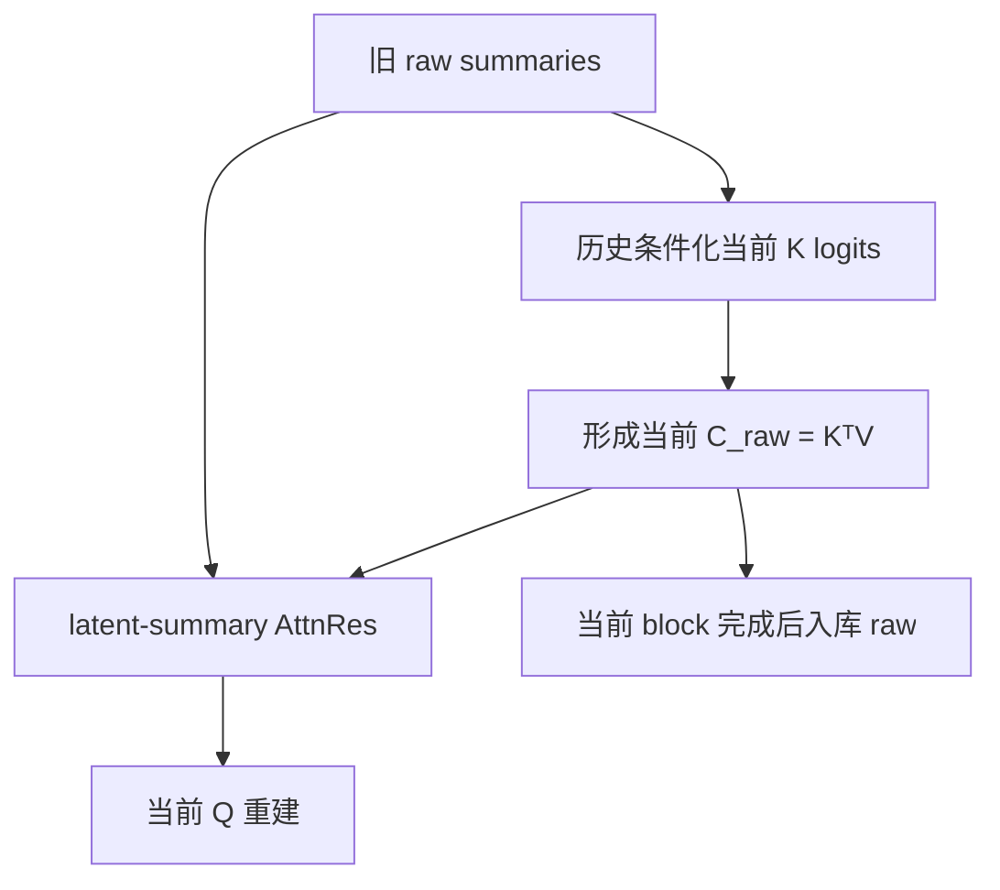

# LinearNO 双创新研究扩展：交给 Codex 的分阶段实施提示词

> 目标仓库：用户正在持续修改的 `hxh5159/Transolver` 实际本地 checkout。  
> 前置成果：已经按 `LinearNO_Codex_Staged_Prompts_hxh_Transolver.md` 完成并验证的纯 LinearNO。  
> 本轮目标：在不破坏任何既有模型、训练、评估、可视化、checkpoint/resume 与实验产物逻辑的前提下，实现两项可独立启用、也可组合启用的研究机制。  
> 本文件是“纯 LinearNO 复现”之后的研究扩展，不替代、也不修改原 L0-L10 基线复现提示词。

---

## 0. 使用方式

1. 先把“总控提示词”交给 Codex。
2. 再只交给它 `R0`，等待报告并人工审查。
3. 每次只授权一个阶段；不得一次性让 Codex 自动执行 R0-R10。
4. 只有前一阶段明确通过后，才使用“接受并进入下一阶段”模板。
5. 若当前实际 checkout 中纯 LinearNO 尚未完成或未通过原基线 parity，R0 必须标记 `BLOCKED`，回到原 LinearNO L0-L10 提示词完成基线；不得在不可信基线上叠加本研究机制。
6. 本文件中的公式、缓存语义、初始化和排除项是首版冻结规格。Codex 不得自行“优化”为另一种架构。

特别说明：用户已经确定保留“历史修正当前压缩方向”这一机制方向，但此前尚未逐项冻结它的所有低层参数化。本文件把首版具体化为提案 `history_conditioned_k_v1`：复用基础 `to_k.weight` 各槽行作 query，全网络共享一套 $U_q^K/U_k^K/U_v^K$，并使用按接收层、按 head 的 `tanh` 零门。R1 必须在写生产代码前逐项复述并冻结这些选择；若用户要改变其中任一项，应先更新本提示词、schema 与测试契约，不能在实现中隐式改动。

阶段状态只能是：

- `PASS`：本阶段全部授权内容和验证均完成；
- `PARTIAL`：实现完成但有明确的未运行项，例如缺真实数据或 GPU；
- `BLOCKED`：前置条件不成立、发现基线不可信，或有必须由用户决定的冲突。

每个阶段结束后必须停止，不得自动进入下一阶段。

---

## 1. 本轮冻结的研究范围

### 1.1 两个正交创新轴

建议采用以下稳定配置字段；若当前仓库已有统一命名规范，可以只调整 CLI 拼写，但配置语义、默认值和 checkpoint 字段不得改变：

```yaml
linearno_latent_attnres: false
linearno_history_k_conditioning: false
linearno_attnres_history_dropout_p: null
```

解析规则：

- `linearno_latent_attnres=false`：不实例化、不执行 latent-history AttnRes 参数或计算；
- `linearno_history_k_conditioning=false`：不实例化、不执行 history-conditioned K 参数或计算；
- AttnRes 开启时，若 dropout 未显式指定，解析为固定的 `0.1`；
- 生产 CLI 中 AttnRes 开启时只允许 `0.1`；`0` 仅能由内部 unit/oracle/parity fixture 直接构造，不暴露为正式 CLI 取值，其他数值必须 fail fast；
- AttnRes 关闭时若用户显式传入其 dropout 参数，应报错，不能静默忽略；
- 两个主开关默认均关闭；旧命令省略新参数必须与显式 `false/false` 完全一致；
- 不得使用 Python `argparse type=bool`；使用明确的 `0/1`、`true/false choices` 或 `BooleanOptionalAction`；
- `--model` 仍只表示模型家族，不得兼任 LinearNO 内部变体或两个创新开关。

四种消融由两个开关直接导出：

| 签名 | latent-summary AttnRes | history-conditioned K | 含义 |
|---|---:|---:|---|
| `A0K0` | 关 | 关 | 当前仓库中已经验证的纯 LinearNO |
| `A1K0` | 开 | 关 | 只启用 LinearNO 专用 latent-history 残差 |
| `A0K1` | 关 | 开 | 只启用历史修正当前压缩 K |
| `A1K1` | 开 | 开 | 两项创新联合 |

`A0K0/A1K0/A0K1/A1K1` 只能是由两个主开关生成的展示签名，不能成为第三份、可能与两个开关冲突的输入真值。

本轮研究深度限定为完整 LinearNO block 数：

$$
L\in\{4,5,6,7,8\}.
$$

应复用当前仓库真正控制完整 block 数的既有字段；不得臆造另一个 `depth` 参数。该范围只约束本轮研究 launcher，不应全局禁止基础模型使用其他层数。

### 1.2 明确不实现的内容

首版禁止顺手加入：

- 原始 CDPA 的“当前表示也进入来源 softmax”；
- 点域第二条 AttnRes 残差；
- relation-aware 来源评分；
- relative-depth bias；
- Block history；
- 多基底重建或扩大当前重建 rank；
- 两步 K 更新或先算当前摘要再回头重算 K；
- 历史条件化 Q、V 或重建 Q；
- 在同一个 K-conditioning 机制内同时条件化压缩 $K$ 与重建 $Q$；联合模式允许 K 修正压缩、A 融合被重建的 latent summary，但 A 不修改基础重建 $Q$ 算子；
- 不同层 rank、温度或粒度的搜索；
- 核相似度/多样性损失；
- “创新摘要”、deflation 或正交约束；
- 恢复同层 latent self-attention；
- Burgers 数据集。

传播核相似度只作为诊断，不进入 loss。此前四数据集曲线来自 **Transolver**，不能当作 LinearNO 已有核相似度的实验证据；本轮必须重新测量 LinearNO。

---

## 2. 固定参考来源与来源边界

### 2.1 参考版本

| 来源 | 固定版本 | 用途 |
|---|---|---|
| 用户目标仓库历史公开快照 | [`hxh5159/Transolver@66bc489`](https://github.com/hxh5159/Transolver/tree/66bc489fa92e9ab1fddd63ee618e1b76e8623f6b) | 只作历史参照；实际本地 checkout 才是可写真值 |
| Transolver 官方仓库 | [`thuml/Transolver@75e0f67`](https://github.com/thuml/Transolver/tree/75e0f67643806a81cd1d3f6adc88dd8c02416fe7) | 原 benchmark 与任务结构参照 |
| LinearNO 论文 | [arXiv:2511.06294v3](https://arxiv.org/html/2511.06294v3) | 基础数学与论文实验协议 |
| LinearNO 官方仓库 | [`HiPRL/LinearNO@3f2b80d`](https://github.com/HiPRL/LinearNO/tree/3f2b80df13c17a09e250f2ebe4d4ecdfd4acf269) | 纯 LinearNO 任务专属实现真值 |
| Attention Residuals | [arXiv:2603.15031v1](https://arxiv.org/abs/2603.15031v1) | 深度来源选择思想 |
| Attention Residuals 官方材料 | [`MoonshotAI/Attention-Residuals@85e2231`](https://github.com/MoonshotAI/Attention-Residuals/tree/85e22310fe5ee860b4a023de312d791de8a5a5e6) | 公式、伪代码与初始化参照 |
| Kimi K3 技术报告 | [arXiv:2607.24653v2, §2.2](https://arxiv.org/html/2607.24653v2#S2.SS2) | Kimi 实际采用 Block AttnRes 的说明 |
| Kimi K3 官方仓库 | [`MoonshotAI/Kimi-K3@3cb39df`](https://github.com/MoonshotAI/Kimi-K3/tree/3cb39dfd32e51c3328e2e4b4af21341247d06c43) | 固定技术报告版本 |

可访问的 `hxh5159/Transolver@66bc489` 公开快照仍未包含生产级 LinearNO；用户所说的纯 LinearNO 已在持续修改的本地 checkout 中完成。因此 Codex 必须先审计当前工作树，不能以公开快照为依据重新建立第二套 LinearNO，更不能覆盖未推送修改。

### 2.2 必须写进报告的来源边界

1. LinearNO 官方只提供基础的非对称 Q/K 线性注意力：Q 沿低秩槽轴归一，K 沿点轴归一，形成 $K^\top V$ 后由 Q 重建；它没有本轮两个历史模块。
2. Kimi/AttnRes 官方对同一 token 位置的不同深度来源做 source-softmax。它不需要“历史内部 token Cross-Attention”，历史对象也不是 LinearNO 的 $K^\top V$。
3. 本轮第一项是 **AttnRes-inspired additive latent-history branch for LinearNO**：历史内部 Cross-Attention、固定零 null source、外部 $\gamma$ 门和 history dropout 都是本项目适配，不是 Kimi 官方实现。
4. 第二项“历史修正压缩 K”在 LinearNO、AttnRes 和 Kimi K3 官方材料中均不存在，是本项目原创设计；必须按本文件的数学契约实现，不得声称“照官方代码复现”。
5. LinearNO Theorem 1 不能自动证明两个新增模块仍满足相同定理。除非另有严格证明，不得把连续映射直觉写成已经由原论文证明的结论。

---

## 3. 冻结的数学与张量契约

### 3.1 纯 LinearNO 基础路径

以 0-index 的第 $\ell$ 个 block 为例。经过该任务原有的 LayerNorm、线性或卷积输入投影并拆分 head 后：

$$
Z_\ell\in\mathbb R^{B\times H\times N\times d_h}.
$$

基础投影为：

$$
L^{Q,0}_\ell=\operatorname{to\_q}_\ell(Z_\ell),\qquad
L^{K,0}_\ell=\operatorname{to\_k}_\ell(Z_\ell),\qquad
V_\ell=\operatorname{to\_v}_\ell(Z_\ell),
$$

其中：

$$
L^{Q,0}_\ell,L^{K,0}_\ell\in
\mathbb R^{B\times H\times N\times M_\ell},
\qquad
V_\ell\in\mathbb R^{B\times H\times N\times d_h}.
$$

纯基线为：

$$
Q_\ell=\operatorname{Softmax}_{M_\ell}
\left(\frac{L^{Q,0}_\ell}{\tau^Q_\ell}\right),
$$

$$
K_\ell=\operatorname{Softmax}_{N}
\left(\frac{L^{K,0}_\ell}{\tau^K_\ell}\right),
$$

$$
C_\ell^{raw}=K_\ell^\top V_\ell
\in\mathbb R^{B\times H\times M_\ell\times d_h},
$$

$$
Y_\ell=Q_\ell C_\ell^{raw}.
$$

必须保留官方任务差异：

- Standard `plain/conv`：$\tau^Q=\tau^K=1$；
- Standard `temp/conv_temp`：沿用当前纯基线中初值和 clamp，官方发布式为初值 `0.5`、clamp `[0.01,1]`；
- AirfRANS：发布类虽注册 temperature，但 forward 不使用；本轮仍按 $\tau=1$，不得借新增机制启用 dead temperature；
- ShapeNet-Car：保留 `tempreature_q/tempreature_k` 的官方拼写、初值和 clamp `[0.1,2]`；实际 $M=\text{key_ratio}\times d_h$，不能把 `key_ratio=1` 错当作 $M=1$；
- 基础 LinearNO 没有 $1/\sqrt{d_h}$ scale；不能因为新增历史 Cross-Attention 使用 scale，就改动基础 Q/K 公式。

### 3.2 创新 A：LinearNO 专用 latent-summary AttnRes

该机制只在 $C_\ell^{raw}$ 形成后、当前 Q 重建前工作。

#### A.1 历史内部 token 对齐

对每个真实历史 $i<\ell$，在每个原 LinearNO head 内独立做 Cross-Attention。首版固定匹配维度：

$$
d_m=d_h.
$$

参数共享固定为：

- 全网络、所有接收层和所有历史来源共享、跨 head 共享：$W_k^A,W_v^A\in\mathbb R^{d_h\times d_h}$；
- 每个接收层 $\ell>0$ 独立、跨 head 共享：$W_{q,\ell}^A,W_{o,\ell}^A\in\mathbb R^{d_h\times d_h}$；
- 四个投影均无 bias；
- 禁止为每条历史边 $i\to\ell$ 创建独立参数。

计算：

$$
Q_\ell^A=C_\ell^{raw}W_{q,\ell}^A,
\quad
K_i^A=C_i^{raw}W_k^A,
\quad
V_i^A=C_i^{raw}W_v^A,
$$

$$
A_{\ell i}
=
\operatorname{Softmax}_{M_i}
\left(
\frac{Q_\ell^A(K_i^A)^\top}{\sqrt{d_h}}
\right),
$$

$$
R_{i\rightarrow\ell}
=
A_{\ell i}V_i^A W_{o,\ell}^A
\in\mathbb R^{B\times H\times M_\ell\times d_h}.
$$

每份历史必须在自己的 $M_i$ 个 token 内单独 softmax。可以把来源维批量执行，但不能把所有历史拼成 $\sum_iM_i$ 个 token 后只做一次统一 softmax。

#### A.2 历史来源选择

每个接收层 $\ell>0$ 独立拥有：

- 一个 last-dimension RMSNorm：沿最后一维归一化、`keepdim=True`、$epsilon=10^{-6}$，只有可学习 scale（初始化为 1），无 bias；
- pseudo-query $w_\ell\in\mathbb R^{d_h}$，严格零初始化；
- 无约束标量门 $\gamma_\ell$，严格零初始化。

简单内容分数为：

$$
s_{\ell i,bhr}
=
w_\ell^\top
\operatorname{RMSNorm}_\ell
\left(R_{i\rightarrow\ell,bhr:}\right).
$$

其中对最后一维向量 $x$：

$$
\operatorname{RMSNorm}_\ell(x)
=
g_\ell\odot\frac{x}{\sqrt{\operatorname{mean}(x^2,\operatorname{dim}=-1,\operatorname{keepdim}=True)+10^{-6}}},
$$

$g_\ell$ 是上述初始化为 1 的 scale，不含可学习 bias。

首版没有 MLP、当前—历史显式关系项、相对深度 bias 或关系感知评分。

追加一个固定 null source：

$$
R_{null}=0,\qquad s_{null}=0.
$$

null source：

- 没有参数；
- train/eval 都始终参加 source-softmax；
- 永不被 history dropout 删除；
- 让每个当前槽可以拒绝全部历史，并提供全 mask 的有限 fallback。

沿“真实历史来源 + null”轴 softmax：

$$
\alpha_{\ell,bhri}
=
\operatorname{Softmax}_{i\in\{0,\ldots,\ell-1,null\}}
(s_{\ell i,bhr}),
$$

$$
H_{\ell,bhr:}
=
\sum_{i<\ell}
\alpha_{\ell,bhri}R_{i\rightarrow\ell,bhr:},
$$

$$
\boxed{
\widetilde C_\ell
=
C_\ell^{raw}+\gamma_\ell H_\ell
},
$$

$$
Y_\ell=Q_\ell\widetilde C_\ell.
$$

这一定义与原 CDPA 的边界必须通过负面测试锁定：

- 当前 $C_\ell^{raw}$ **不进入**第二级 source-softmax；
- 当前摘要在 softmax 外以系数 1 保留；
- $\gamma_\ell$ 只控制历史增量；
- 禁止改成 $F=\alpha_0C_\ell+\sum_i\alpha_iR_i$；
- 禁止改成 $C_\ell+\gamma(F-C_\ell)$；
- 禁止再添加一个 current source，否则会悄悄回到 CDPA 形式。

#### A.3 History dropout

固定首版规则：

- 生产配置和正式实验固定 $p=0.1$，不得按数据集或深度搜索；`p=0` 只允许作为内部数学 oracle/parity 测试覆盖值，不能成为正式训练配置或搜索项；
- 只在训练时启用，eval 完全关闭；
- mask 粒度为 `[B, S_real]`，即“样本 × 真实历史来源”；
- 同一 mask 在 head、当前 latent slot 和通道维广播；
- 每次 forward 重采样；
- 只有一份真实历史时，不删除该唯一历史；null 仍参与 softmax；
- 两份及以上真实历史时独立 Bernoulli mask；
- 在所有历史 Cross-Attention 和评分已经计算后、source-softmax 前将被删来源分数置为 $-\infty$；
- 不做 $1/(1-p)$ inverted scaling；
- 不减少计算量；
- 如果所有真实来源均被 mask，null 权重必须为 1，$H_\ell=0$，不得产生 NaN。

#### A.4 初始化与梯度预期

- $w_\ell=0$ 和 $\gamma_\ell=0$ 必须在任何递归 `apply(init)` 之后再次保证，避免被通用初始化覆盖；
- $\gamma=0$ 时，研究模型在 eval 或关闭 history dropout 的确定性设置中严格退化为同深度 LinearNO；
- 第一次 backward 时，历史 Q/K/V/O、RMSNorm 和 $w$ 的梯度为零是数学预期，$\gamma$ 应获得有限梯度；
- 手工或一次更新后令 $\gamma\neq0$，再要求历史投影、评分参数和历史源层获得有限梯度；
- 历史不得 `detach`。

### 3.3 创新 K：由历史 raw summaries 条件化当前压缩方向

该机制只修改当前 $K_\ell$ 的 logits，不修改 Q、V 或重建。只使用 $i<\ell$ 的历史，禁止使用当前 $C_\ell$，从而避免：

$$
K_\ell\rightarrow C_\ell\rightarrow K_\ell
$$

的循环依赖。

#### K.1 历史方向原型

拼接所有旧 raw summary token：

$$
\mathcal B_\ell
=
\operatorname{Concat}_{i<\ell}C_i^{raw}
\in\mathbb R^{B\times H\times S_\ell\times d_h},
\qquad
S_\ell=\sum_{i<\ell}M_i.
$$

定义参数无关的逐行 LayerNorm：

$$
\operatorname{LN}_0(x)
=
\frac{x-\operatorname{mean}(x,\operatorname{dim}=-1,\operatorname{keepdim}=True)}
{\sqrt{\operatorname{var}(x,\operatorname{dim}=-1,\operatorname{keepdim}=True,\operatorname{unbiased}=False)+10^{-6}}},
$$

不含可学习 weight/bias。

全网络、所有接收层、所有来源和所有 head 共享、且与创新 A 完全不同的一套无 bias 投影：

$$
U_q^K,U_k^K,U_v^K\in\mathbb R^{d_h\times d_h}.
$$

不要另造任意 learned slot query；直接复用当前层基础 `to_k.weight` 的 $M_\ell$ 行作为当前压缩槽的基础方向。官方实现中它为 $W_\ell^{K,base}\in\mathbb R^{M_\ell\times d_h}$，且跨原 LinearNO head 共享：

$$
E_\ell
=
\operatorname{LN}_0(W_\ell^{K,base})U_q^K
\in\mathbb R^{M_\ell\times d_h}.
$$

对历史：

$$
K_{hist}=\operatorname{LN}_0(\mathcal B_\ell)U_k^K,
\qquad
V_{hist}=\operatorname{LN}_0(\mathcal B_\ell)U_v^K.
$$

沿全部旧历史 token bank 做一次 softmax：

$$
A_\ell^K
=
\operatorname{Softmax}_{S_\ell}
\left(
\frac{E_\ell K_{hist}^\top}{\sqrt{d_h}}
\right)
\in\mathbb R^{B\times H\times M_\ell\times S_\ell},
$$

$$
G_\ell=A_\ell^KV_{hist}
\in\mathbb R^{B\times H\times M_\ell\times d_h}.
$$

注意：这里与创新 A 不同。创新 K 有意把所有旧 raw token 组成一个历史集合，只做一次 token-bank softmax；它没有第二级 history-source softmax，也没有 dropout 或 depth embedding。

#### K.2 点 × 槽位的双线性 logit 修正

必须构造真正依赖当前物理点 $n$ 和槽位 $m$ 的修正：

$$
\Delta L^K_{\ell,bhnm}
=
\left\langle
Z_{\ell,bhn:},
G_{\ell,bhm:}
\right\rangle.
$$

然后去掉沿点轴不可辨识的常数：

$$
\Delta L^K_\ell
\leftarrow
\Delta L^K_\ell
-
\operatorname{mean}_{N}
(\Delta L^K_\ell).
$$

禁止实现为只依赖历史的 slot bias $b_{bhm}$ 后广播到所有点，因为：

$$
\operatorname{Softmax}_{N}(L^K_{n m}+b_m)
=
\operatorname{Softmax}_{N}(L^K_{n m}),
$$

这种模块会严格无效。同样，不能简单把同一个历史向量加到每个点后再过线性 `to_k`，因为其历史项仍可能退化为点轴常数。

#### K.3 门、温度与最终 K

每个接收层 $\ell>0$ 有独立的 per-head 原始门：

$$
a_\ell^K\in\mathbb R^{1\times H\times1\times1},
\qquad a_\ell^K=0\ \text{初始化},
$$

$$
\eta_\ell^K=\tanh(a_\ell^K)\in[-1,1].
$$

先在原始 logits 尺度相加，再沿用该官方变体原有温度：

$$
\boxed{
K_\ell
=
\operatorname{Softmax}_{N}
\left(
\frac{
L_\ell^{K,0}
+\eta_\ell^K\Delta L_\ell^K
}{\tau_\ell^K}
\right)
}.
$$

- 无温度变体取 $\tau^K=1$；
- Standard temp/conv_temp、ShapeNet 使用各自原有参数、拼写和 clamp；
- AirfRANS 保持其发布 forward 不使用 temperature；
- Q 仍完全按基础公式计算；
- 第一层没有历史，必须完全 bypass，不应创建或执行无用的接收门；
- 只将门置零；$U_q^K,U_k^K,U_v^K$ 按当前项目普通 Linear 初始化，不能全部零初始化，否则门开启后分支仍可能学习停滞；
- 门为零的第一次 backward 中，内部 K-conditioning 投影梯度为零是预期，门应有有限梯度；门非零后再检查内部参数、当前 $Z$ 和旧历史均有梯度。

### 3.4 两项机制联合时的唯一顺序

进入第 $\ell$ 个 block 时，历史只包含 $0,\ldots,\ell-1$：



严格执行：

1. 计算当前 $Z_\ell,L^{Q,0}_\ell,L^{K,0}_\ell,V_\ell$；
2. 若 K 开启且 $\ell>0$，只用旧 raw history 修正当前 K logits；
3. 计算 Q/K softmax 和当前 $C_\ell^{raw}=K_\ell^\top V_\ell$；
4. 若 A 开启且 $\ell>0$，以当前 raw summary 查询旧 raw histories，得到 $\widetilde C_\ell$；否则 $\widetilde C_\ell=C_\ell^{raw}$；
5. 使用当前 $Q_\ell\widetilde C_\ell$，再执行原输出投影、点域 residual、FFN 和末层 head；
6. 当前 block 完成后，只把 $C_\ell^{raw}$ 加入本次 forward 的历史。

联合模式中，`raw` 的精确定义是 **pre-AttnRes**，不是“完全不受历史影响”：当 K 开启时，$C_\ell^{raw}$ 已经受到更早历史对 K 的条件化，但尚未融合 AttnRes 历史增量。

两项机制：

- 只共享同一份 authoritative raw-history 数据；
- 不共享投影、门或 dropout mask；
- A 的 history dropout 不作用于 K；
- 不允许 K 读取当前 $C_\ell$；
- 不缓存 $\widetilde C_\ell$；
- 不得形成两套语义不同的 raw history。

### 3.5 历史缓存合同

- 每次顶层 `model.forward(...)` 新建局部 context/list，结束即销毁；
- 显式沿 block loop 传递，不得存在 `self.history`、持久 buffer 或跨 forward 的模块可变状态；
- 不跨 batch、样本、NS 物理时间步、Plasticity 时间查询或 AirfRANS ensemble 成员泄漏；
- 不 `detach`，保留梯度连接；
- authoritative cache 只保存 $C_i^{raw}$；
- A/K 的共享历史投影可以作为该次 forward context 的派生缓存，且必须可由 raw 精确重算；
- A 的历史 K/V 投影与 K-conditioning 的历史 K/V 投影是两套不同参数；
- 两创新均关闭时不建立历史、不执行额外投影、不采样随机数；
- 当前模型各层应具有相同 $H,d_h$。若实际审计发现不同宽度，先停止并报告；首版不得静默插入适配器改变规格。

---

## 4. 全阶段通用工程约束

1. 当前实际 checkout 是唯一可写基座。不得 `reset --hard`、`clean`、`checkout --`、rebase、merge 或覆盖用户修改。
2. 先读取仓库中的 `AGENTS.md`、实现状态文档、当前 diff、untracked 文件和已有测试；不能只看公开远端。
3. 保留所有既有模型和 key，包括但不限于 Transolver、纯 LinearNO，以及当前仓库可能已经存在的 CDLNO、KCDNO、MSAR-LNO 或其他研究模型。
4. 保留 seed/deterministic、训练曲线、可视化、checkpoint/resume、RNG 恢复、实验目录、评估修复和 artifact 命名。
5. 不修改 `official_release`、`paper_table8_on_release_model` 等既有协议的含义；两个创新是正交的 architecture spec。研究结果不得冒充 LinearNO 官方结果。
6. Standard、AirfRANS、ShapeNet-Car 是三套任务专属实现；不得用一个近似类抹平输入投影、实际 M、温度、输出头和 checkpoint 差异。
7. 纯基线路径优先保持原类和原 forward；任何创新开启时才构造研究扩展类/模块。`A0K0` 必须走现有纯 LinearNO，而不是带休眠参数的包装模型。
8. 关闭的机制不得留下参数、state_dict key、FLOPs、缓存或 RNG 消耗。
9. 不使用 `strict=False` 吞掉结构不匹配；resume/eval 必须先读取 metadata，再构造模型，最后 `strict=True`。
10. `innovation_spec` 与 `architecture_extension` 只写入 `A1K0/A0K1/A1K1` 研究 checkpoint。`A0K0`（无论显式传入两个 false，还是沿用省略新参数的旧命令）必须保持现有纯 LinearNO checkpoint schema/loader，不新增创新 metadata；其 A0K0 签名只能写在外部 run manifest/目录中。研究 checkpoint 缺少 `innovation_spec` 或字段冲突时必须报错，不能猜测。
11. 若要从 baseline 权重初始化研究模型，另建显式 `init_from_baseline` 流程；它不是 resume，也不得伪装成 strict checkpoint 恢复。
12. 不物化 $N\times N$ 矩阵。纯 LinearNO 仍禁止同层 $M\times M$ self-attention；研究模式只允许标记清楚的“当前 raw summary × 历史 raw summary”跨深度 Cross-Attention，以及 K 模块的 $M\times S$ 历史读取。
13. 不下载数据或未知 checkpoint，不运行完整长训练，不 commit/push/PR，除非用户后续逐项明确授权。
14. 不以一次短程 loss 下降、单 seed 最好值或实现 parity 宣称已经复现/刷新 SOTA。
15. 每阶段只修改授权范围；失败不能通过删除测试、放宽容差、忽略键、静默 fallback 或改变协议掩盖。

---

## 5. 总控提示词

```text
你现在要在我正在持续修改的 hxh5159/Transolver 实际本地 checkout 中，基于已经完成并验证的纯 LinearNO，实现两项研究扩展：

A. LinearNO 专用 latent-summary AttnRes；
K. history-conditioned compression K。

这不是从公开 hxh 快照重新实现 LinearNO。公开 main 的历史快照可能还没有 LinearNO，而我当前本地工作树可能包含尚未 push 的基线实现、可视化、checkpoint/resume、评估修复和其他研究模型。当前 checkout 是唯一可写真值。

开始任何操作前，完整阅读：
1. 本提示词全文；
2. 旧文件 LinearNO_Codex_Staged_Prompts_hxh_Transolver.md；
3. 仓库 AGENTS.md 与 docs/LINEARNO_*、实现状态、测试和当前 diff；
4. LinearNO 论文 v3 与 HiPRL/LinearNO@3f2b80d 的三套任务源码；
5. Attention Residuals v1、官方材料@85e2231；
6. Kimi K3 v2 §2.2 与官方仓库@3cb39df；
7. 当前仓库所有相关模型、factory、CLI、配置、checkpoint、resume、evaluation、visualization 和 launcher。

必须遵守：
- 不 reset/clean/stash/checkout/rebase/merge，不覆盖用户 tracked/untracked 修改；
- 不假定文件路径，以当前仓库搜索和 import/factory 调用链为准；
- 若纯 LinearNO 基线不存在、未完成或未通过旧 L0-L10 的关键 parity，本任务立即 BLOCKED，不能边补基线边实现创新；
- 保留所有旧 Transolver、LinearNO 和其他模型行为；
- 两创新用两个正交开关，默认均关闭，可独立或联合运行；
- A0K0 必须构造原纯 LinearNO，不创建任何创新参数或历史缓存；
- 两创新的公式、初始化、raw-cache 和组合顺序严格以本提示词为准，不自行改成 CDPA、Kimi 原版或其他变体；
- 不增加关系感知评分、Block history、多基底、两步更新、Q/V 条件化、多样性 loss、动态 rank/temperature 等范围外内容；
- 不使用 strict=False；
- 不下载数据/checkpoint，不跑完整训练，不 commit/push，除非我另行授权。

实施采用 R0-R10 单阶段授权。你每次只能执行我明确给出的一个阶段。阶段结束必须停止，按以下格式报告：
A. 实际读取/审计的文件、符号和命令；
B. 本阶段作出的决定及其来源；
C. 修改文件清单和关键 diff；
D. 测试命令、逐项结果与数值证据；
E. 纯 LinearNO、旧 Transolver 和其他既有模型的兼容性证据；
F. 未运行项、风险、阻塞项；
G. 唯一阶段状态：PASS / PARTIAL / BLOCKED。

不要自动进入下一阶段。
```

---

## 6. 分阶段提示词

## R0：当前 checkout、纯基线和官方来源只读审计

```text
现在只执行 R0：当前 checkout、纯 LinearNO 基线和官方来源只读审计。不要修改生产代码、模型、配置、测试或 launcher；只允许新增/更新本任务自己的审计与状态文档。不要运行真实数据/GPU或长训练。

1. 找到真实仓库根目录，读取全部 AGENTS.md。记录但不要改变：
   - pwd、branch、HEAD、HEAD tree、remote；
   - git status --short --branch --untracked-files=all；
   - 当前 tracked/untracked/ignored 相关文件；
   - 当前 diff 与用户已有修改的内容 hash manifest。
   禁止 stash/reset/clean/checkout/rebase/merge。

2. 不依赖文件名猜测，使用 rg --files、rg 符号搜索、import graph/factory 跟踪，定位当前实际的：
   - Standard、AirfRANS、ShapeNet-Car 三套 LinearNO 生产类；
   - plain/temp/conv/conv_temp 及工业任务变体；
   - Q/K/V、K^T V、block loop、末层 head；
   - model registry/factory、CLI/config schema；
   - checkpoint/resume/eval/metadata；
   - tests、docs、launcher；
   - 当前仓库其他模型与 LINEARNO/monitor。
   对每个生产入口画出“命令 -> parser -> factory -> model -> checkpoint/eval”的实际调用链。

3. 读取旧 LinearNO 分阶段提示词与当前 docs/LINEARNO_IMPLEMENTATION_STATUS.md、REPRODUCTION_MATRIX、REPORT 等实际存在文件。核对旧 L0-L10 哪些有证据通过，哪些未完成。若基线缺失或关键 parity 未通过，写明 BLOCKED 并停止；不得在 R0 修复。

4. 在目标仓库外的临时只读目录核对固定官方来源：
   - thuml/Transolver@75e0f67；
   - HiPRL/LinearNO@3f2b80d；
   - LinearNO arXiv v3；
   - Attention Residuals v1 与 MoonshotAI/Attention-Residuals@85e2231；
   - Kimi K3 v2 与 MoonshotAI/Kimi-K3@3cb39df。
   如已有固定 reference clone，复用它；不要 vendor 到目标仓库。普通 tree/blob/源码对照即可，不假设 hxh 与官方有共同 git ancestor。

5. 建立来源台账：哪些是 LinearNO 官方行为、哪些来自 AttnRes/Kimi 的思想、哪些是本项目原创适配。特别声明：
   - A 不是原 CDPA，也不是 Kimi 官方 AttnRes；
   - K-conditioning 没有官方实现；
   - Transolver 的核相似度曲线不是 LinearNO 实验证据。

6. 运行当前已有的无数据 CPU 基线测试，至少覆盖纯 LinearNO 参数/state_dict、逐层 forward、梯度、一次 optimizer step、checkpoint round-trip，以及旧 Transolver 回归。只执行当前测试，不在 R0 为通过测试而改代码。

7. 对当前纯 LinearNO 固定一组小型输入、权重/RNG、逐 block 输出、最终输出、输入梯度、共享参数梯度、state_dict key/shape/count 和 RNG 演化，形成新增机制前的冻结 fixture/hash。三套任务专属模型分别记录。

8. 新建或更新且只用于本研究的：
   - docs/LINEARNO_HISTORY_REFERENCE_AUDIT.md
   - docs/LINEARNO_HISTORY_RESEARCH_MATRIX.md
   - docs/LINEARNO_HISTORY_IMPLEMENTATION_STATUS.md
   不覆盖旧纯 LinearNO 文档。

9. 报告最小安全插入点和受影响调用链，但不要实现。阶段结束后停止。
```

## R1：冻结研究规格、配置/metadata 合同与测试矩阵

```text
R0 已审查通过。现在只执行 R1：把本提示词的数学规格、配置、metadata、测试矩阵和公平比较协议固化为仓库内文档/机器可读 schema/测试 fixture。不要实现 A/K 数学模块，不接任务 launcher，不跑真实数据。

在任何生产代码实施前，先逐项复述并冻结 `history_conditioned_k_v1` 的三项首版具体选择：基础 `to_k.weight` 槽行作 query、全网络共享且与 A 分离的 Uq/Uk/Uv、按接收层和 head 的 tanh 零门。若用户不接受其中任一项，本阶段标记 BLOCKED，先更新本提示词/schema/测试规格，禁止边写代码边自行换设计。

1. 将两个正交字段固定为唯一配置真值：
   linearno_latent_attnres: bool=false
   linearno_history_k_conditioning: bool=false
   linearno_attnres_history_dropout_p: null；仅 A 开时默认解析为0.1。
   feature_signature 只能由它们派生。旧命令缺省与显式 A0K0 等价。

2. 只为 A1K0/A0K1/A1K1 研究模型固化 innovation_spec schema_version=1，至少记录：
   - 实际 research class_path 与基础 LinearNO variant；
   - A/K enabled 和 version；
   - n_layers、H、d_h、actual M、任务变体及温度语义；
   - raw-cache/pre-AttnRes 语义；
   - A 的 per-head Cross、d_m=d_h、history-only source softmax、null、gamma、dropout；
   - K 的 base-to_k row query、all-history token bank、point×slot dot、point-centering、per-head tanh gate；
   - 所有构造超参和代码/配置 schema 版本。

3. checkpoint/resume/eval 规则：
   - 先读 metadata 再构造模型，strict=True；
   - A/K/depth/variant/M/head_dim/schema 不一致时，在加载权重前逐字段报错；
   - 旧 LinearNO checkpoint 无 innovation_spec 时只允许构造纯基线；显式 A0K0 也必须保持同一旧 schema/loader，不向 checkpoint 新增 innovation_spec 或 architecture_extension；
   - 研究 checkpoint 缺 spec 不得猜；
   - A-only、K-only、A+K checkpoint 不得互相冒充；
   - baseline -> research 只能使用以后另行明确的 init_from_baseline，不是 resume。

4. 冻结运行目录标识：
   {task}__{protocol_profile}__L{layers}__A{0|1}K{0|1}__seed{seed}
   不修改 official_release/paper_table8_on_release_model 的数据、objective、metric 含义；只在 A1K0/A0K1/A1K1 研究 checkpoint 中另记录 architecture_extension=linearno_history_v1，防止研究模型冒充官方 LinearNO。A0K0 的展示签名只放外部 run manifest/目录。

5. 建立核心20配置矩阵：4种 A/K × L={4,5,6,7,8}。每项未来必须完成构造、forward、backward、strict checkpoint round-trip。另列八任务 wrapper 的四组合 smoke 与生产闭环矩阵。

6. 写出显式负面测试规格：非法 bool/dropout、给非 LinearNO 开创新、配置/权重错配、strict=False、全历史 mask NaN、跨 forward 泄漏、关闭创新仍有参数/随机数、越界深度等。

7. 冻结公平初始化协议：同一 seed 先产生一份公共 LinearNO 主干初始权重，逐键复制到四种组合；新增模块用独立且记录的 feature seed；DataLoader 使用独立 generator。不能让新增模块的构造顺序改变公共主干初始化。

8. 本阶段可增加 config/schema validator 和不触发新模型构造的测试，但不得让 A/K 开关悄悄走占位模型。更新研究状态文档后停止。
```

## R2：研究核心与 forward-local raw-history context

```text
R1 已审查通过。现在只执行 R2：建立可供两机制使用的研究 LinearNO core 和一次 forward 内的 raw-history context；不实现 A/K 的实际历史运算，不接 benchmark CLI。

1. 优先保持当前纯 LinearNO 类与 forward 原样。新增研究扩展类/子类/组合模块；只有至少一个创新开启时才会在以后由 factory 构造。不要把休眠模块塞进纯基线。

2. 在 Standard plain/temp/conv/conv_temp、AirfRANS、ShapeNet 的实际数学路径中，精确暴露：
   Z、base Q/K logits、Q、K、V、C_raw=K^T V、Q C_raw。
   不改变 softmax 轴、温度、卷积、输出投影、点 residual、FFN、末层 head 或 state_dict 拼写。

3. 建立显式 forward-local context 数据结构。authoritative 项只能是按深度保存的 C_raw；A/K 派生投影字段可选，但 context 不能注册为 parameter/buffer，不能放在 self 上，不能跨 forward 存活或序列化。

4. 当前 block 只能读取进入它之前已有的历史；当前 C_raw 必须在当前 block 完成后入库。第一层历史数为0，第ℓ层恰见ℓ份历史。

5. 研究 core 在两个历史算子均为数学 no-op 时，复制相同主干权重后必须与当前纯 LinearNO 逐 block/final forward、loss、输入梯度、主干参数梯度和一次 optimizer step 一致。纯 A0K0 仍必须走旧类。

6. 测试 context 不detach、两次连续 forward 无泄漏、batch size变化无残留、异常退出后下次 forward仍为空。NS/Plasticity 的跨物理时间语义先写 fixture，不接生产。

7. 不在 R2 引入 M×M attention、history dropout、K 修正或新 gate。更新状态后停止。
```

## R3：独立实现创新 A——latent-summary AttnRes

```text
R2 已审查通过。现在只执行 R3：严格按冻结规格实现和验证创新 A；K-conditioning 保持不存在，不接 benchmark launcher。

1. 在每个原 LinearNO head 内独立计算历史 Cross-Attention，d_m=d_h。Wk_A/Wv_A 全网络共享，Wq_A_l/Wo_A_l 每个接收层独立；投影跨head共享、无bias。每份历史内部独立沿历史token轴softmax，不把所有历史token拼成一次softmax。

2. 对每个对齐结果用接收层独立 RMSNorm 和零初始化 w_l 做简单内容评分。RMSNorm 必须沿最后一维、keepdim、eps=1e-6，只有 scale 无 bias。第二级只在真实历史+固定零null之间做source-softmax；当前C_raw不参加。无relation scorer、MLP、depth bias、block history。

3. 输出严格为 C_tilde=C_raw+gamma_l*H_l，gamma_l为零初始化无约束层标量。不得实现CDPA候选融合或C+gamma(F-C)。重建仍使用当前原Q。

4. history dropout固定语义：p=.1，train only，sample×real-source，广播head/slot/channel；singleton keep；null永不mask；在Cross和评分后、source-softmax前mask；无inverted scaling；全真实来源mask时null=1、H=0；eval不采样。它不节省FLOPs。

5. 只缓存pre-AttnRes C_raw；历史投影可以缓存但必须由共享Wk_A/Wv_A和raw精确重算。不得缓存C_tilde，不detach。

6. 写不调用生产forward的显式数学oracle并验证：
   - 每份A_li沿历史token轴和为1；alpha沿S_real+null来源轴和为1；
   - 历史token K/V同步置换时输出不变；历史来源连同mask置换时H不变；当前latent token置换时输出等变；
   - B>1、H>1不混样本或head；
   - l=0严格baseline；l=1不drop唯一历史，w=0时history/null各1/2；
   - 强制all-mask时finite、null=1、H=0、C_tilde=C_raw；
   - train mask粒度/广播正确，eval确定，无1/(1-p)缩放；
   - raw而非fused入库；梯度测试不能只看总 loss，因为基础残差主干也会向旧层传梯度。令 gamma 非零后，直接从隔离的 H_l 或 A 历史增量对指定旧 C_i_raw 做 autograd.grad/VJP，验证分支梯度有限且非零，并验证不存在 future/current 历史泄漏；
   - Wk/Wv对象全局共享，Q/O/w/gamma按receiver独立，无per-edge O(L^2)参数。

7. 同权重下gamma全0、eval时，研究A模型逐block/final输出与同深度纯LinearNO一致；p=0只可用于内部确定性oracle/parity覆盖，不得暴露为正式实验配置。第一次backward只要求gamma有有限梯度。随后分两步做隔离的branch-specific VJP：仅将gamma设为非零而保持w=0时，要求历史投影、w及指定旧C_raw梯度finite且在非退化fixture中非零，而RMSNorm scale梯度为零是预期；再将gamma和w都设为非零，才要求RMSNorm scale也获得finite且非零梯度。不能用主干总loss梯度冒充历史分支证据。

8. 反查代码中不存在current source、relation-aware scorer、block history、点域第二残差、同层latent self-attention和多样性loss。更新状态后停止。
```

## R4：独立实现创新 K——历史条件化压缩方向

```text
R3 已审查通过。现在只执行 R4：严格按冻结规格实现和验证创新 K；不要把它依赖于A，不接benchmark launcher。

1. 使用此前pre-AttnRes raw summaries，不使用fused历史，不使用当前C。将全部旧raw token组成一个history token bank。LN0 固定沿最后一维、keepdim、unbiased=False、eps=1e-6且无参数；用共享且无bias的Uq_K/Uk_K/Uv_K计算历史方向原型。

2. 当前槽query必须来自本层base to_k.weight的M行，经LN0和Uq_K投影；不得新增任意learned slot query。历史token bank沿总S维做一次softmax，无history source-softmax、dropout、depth embedding。

3. 计算G[B,H,M,d_h]后，以当前Z和G的dot生成Delta[B,H,N,M]，再减去其N轴均值。不得实现为对N广播的slot bias；写一个反例测试证明这种错误bias在softmax_N下严格无效。

4. 每个receiver l>0使用per-head tanh gate，raw gate严格零初始化。combined_logits=base_K_logits+eta*Delta，然后再执行该任务原有tau_K与softmax_N。Q/V完全不改。

5. 正确保留Standard四变体、AirfRANS dead temperature行为、ShapeNet tempreature拼写/clamp和actual M。第一层无历史完全bypass，不创建闲置第一层receiver gate。

6. Uq/Uk/Uv按普通Linear规则初始化，不能零初始化；特殊零门在通用apply(init)后复核。K模块参数、投影缓存、gate和任何mask均不得与A共享。

7. 写独立数学oracle并验证：
   - gate=0严格恢复baseline；gate非零时固定Z、改变history会改变K；
   - K.sum(dim=N)=1，Q.sum(dim=M)=1，数值finite；
   - Delta确实随n和m变化，中心化后mean_N≈0；
   - history token任意联合置换不改变G；非conv路径点置换等变；
   - l层只见l份旧history，无future/current泄漏；
   - B>1/H>1不混合；raw cache无detach；连续forward不串历史；
   - gate=0首步允许只有gate有新增梯度；gate非零后直接从隔离的 Delta L_K（或 eta*Delta 且eta非零）分别对指定旧C_raw、当前Z和Uq/Uk/Uv做autograd.grad/VJP，要求finite且非零。不能以总loss经基础主干到达这些张量的梯度作为K历史分支证据；
   - hook/profiler只出现M×S和N×M，绝无N×N。

8. K-only路径不得构造/调用A模块、history dropout或A投影。反查无Q/V/重建修改、两步更新、block history和point-constant bias。更新状态后停止。
```

## R5：联合集成、2×2 开关、20配置与 checkpoint 闭环

```text
R4 已审查通过。现在只执行 R5：把A/K按唯一顺序集成到完整研究LinearNO，接入内部factory/config/checkpoint，并完成小型合成20配置矩阵；暂不接八任务生产launcher。

1. 联合顺序固定：旧raw -> 修正当前K -> 当前C_raw -> A读取旧raw -> C_tilde -> 当前Q重建 -> 原to_out/点残差/FFN -> 当前C_raw入库。两机制只读共享authoritative raw list，不共享其他参数或mask。

2. factory行为：
   - A0K0构造当前原纯LinearNO类；
   - A1K0只构造A所需参数；
   - A0K1只构造K所需参数；
   - A1K1构造两套参数；
   - 给Transolver或其他模型开启LinearNO专属开关必须fail fast。

3. 只为A1K0/A0K1/A1K1完成innovation_spec/architecture_extension、resolved config、run signature及strict checkpoint/resume/eval重建。A0K0（显式false/false或省略新参数）保持当前纯LinearNO checkpoint schema和原加载路径，不把研究metadata写入旧格式；其签名只进外部run manifest/目录。研究checkpoint必须有完整metadata。禁止strict=False或随机补键。

4. 对4组合×L={4,5,6,7,8}全部执行小型合成：构造、forward、loss、backward、optimizer step、save、全新进程/对象strict reload、eval。断言实际执行完整L个block，末block仍执行attention、FFN、final LN/head。

5. baseline严格回归：旧命令省略开关与显式A0K0的class、state_dict键/shape/value、参数量、forward、梯度、optimizer step、checkpoint和RNG演化一致。

6. 研究门可分解性测试应通过显式复制公共/相关参数完成，不通过互相strict加载不同结构checkpoint：
   - A1K1两门为0，在确定性eval中等于A0K0；
   - 联合模型K门0、A门非0时，其数学输出等于相同参数的A-only reference；
   - 联合模型A门0、K门非0时，其数学输出等于相同参数的K-only reference；
   - 两门非0时两套新增参数都有finite梯度；
   - 当前raw只入库一次，点域residual只执行一次。

7. 注意train模式下A的history dropout会消耗RNG；不要错误声称“研究模块门为0时训练RNG也与baseline相同”。严格数值等价应在eval或使用仅限内部测试的p=0覆盖值的隔离确定性oracle中验证；正式生产/训练配置仍固定p=.1。纯A0K0必须在train/eval都保持旧RNG行为。

8. 做state_dict负面矩阵：baseline/A/K/AK互相错误加载、depth/M/variant/head/schema错配均在load前清楚报错。更新状态后停止。
```

## R6：接入四个静态 Standard PDE 任务

```text
R5 已审查通过。现在只执行 R6：接入Airfoil、Darcy、Elasticity、Pipe四个静态Standard任务。允许为这四个任务所共用的Standard parser/factory/model基础设施做最小必要修改，但本阶段不得改变、启用或声称已经验证NS与Plasticity的任务专属协议/launcher；它们留到R7。也不要修改AirfRANS或ShapeNet的任务专属实现。

1. 复用当前已经验证的任务专属LinearNO variant、actual M、H/W、输入/输出、loss、normalizer、optimizer、scheduler、数据split、seed、checkpoint、可视化和artifact路径。只增加正交architecture字段和研究model构造。

2. 每个任务提供A0K0/A1K0/A0K1/A1K1四个真实可执行的train/resume/eval命令，并支持L=4..8。旧LinearNO命令和目录语义不变；研究目录必须含task/profile/L/A/K/seed。

3. 每个任务先完成无数据config->model->synthetic forward/backward->strict checkpoint->new-process eval闭环。只有RUN_REAL_BATCH=true时运行真实loader一批；只有RUN_MINIRUN=true且MAX_STEPS>0时运行短程。

4. 对plain/temp/conv/conv_temp分别核对基础投影、温度、actual M和zero-gate parity；不能只测plain后假定其余正确。conv路径仍使用原H/W与卷积，不把K模块放到卷积之前。

5. 回归纯LinearNO、旧Transolver、当前其他模型、visualization和resume。A0K0必须继续接受旧纯LinearNO checkpoint；研究checkpoint按innovation_spec strict加载。

6. 记录四任务每个组合/深度的参数量和理论新增张量shape，但不进行完整训练。更新matrix/status后停止。
```

## R7：接入 Navier-Stokes 与 Plasticity

```text
R6 已审查通过。现在只执行 R7：接入Navier-Stokes与Plasticity，继承旧LinearNO提示词中这两项任务的全部特殊训练/评价协议；不要修改其他任务。

1. NS每一次模型调用都只建立“网络深度方向”的新raw history。外部自回归把预测写回下一物理时间步时，绝不能把上一次forward的层历史带入下一次调用。

2. Plasticity每个时间查询/模型调用同样重新建立history；不得把物理时间维误当网络深度来源。保持原坐标、时间embedding、输出shape、loss和调度。

3. history dropout使用的RNG必须纳入当前checkpoint/resume的完整RNG恢复。验证中断前后下一次mask、DataLoader顺序、loss和参数更新连续；不得用恢复后重新seed冒充连续。

4. 分别提供两任务×四组合×L=4..8的准确train/resume/eval命令。旧命令、旧checkpoint、可视化和rollout逻辑不变。

5. 完成合成闭环；真实一批/mini-run仍受RUN_REAL_BATCH、RUN_MINIRUN、MAX_STEPS授权。回归此前全部任务后更新状态并停止。
```

## R8：接入 AirfRANS 与 ShapeNet-Car

```text
R7 已审查通过。现在只执行 R8：接入AirfRANS与ShapeNet-Car，完整继承旧LinearNO L6/L7冻结的任务专属模型、objective/evaluation profile、sampling、ensemble、force metric和checkpoint协议。

AirfRANS：
1. 保持input7、unified reference-distance、preprocess/output、actual M=32、发布forward不使用temperature、随机32k采样、ensemble成员顺序和完整test评估。
2. 每个ensemble成员必须先读自己的model_spec/innovation_spec再构造并strict加载；成员之间不共享forward history。旧Transolver whole-object路径与纯LinearNO路径不变。
3. 正式batch=1/单图可变N合同下验证无跨图或跨成员历史混合。

ShapeNet-Car：
4. 保持input7、actual M=key_ratio*d_h=32、tempreature_q/k拼写和clamp、输出head、fold/split、surface velocity与drag评估修复。
5. 两创新不得改变基础Q/K温度或把Standard的absolute key_ratio语义套进ShapeNet。
6. metadata必须先于模型构造；未知/研究权重不得fallback为Transolver。

共同要求：
7. 为两任务提供四组合×L=4..8准确train/resume/eval命令；完成synthetic/PyG对象forward/backward、strict checkpoint、new-process eval和旧模型回归。
8. 真实loader一批只在RUN_REAL_BATCH=true；mini-run只在RUN_MINIRUN=true且受MAX_STEPS限制。不得下载/伪造同名数据。
9. 更新跨八任务RESEARCH_MATRIX和STATUS后停止。
```

## R9：综合验证、诊断、效率与公平实验清单

```text
R8 已审查通过。现在只执行 R9：综合静态/合成验证、已授权的真实一批/短程实验、诊断和效率测量；不修改生产模型、协议或测试。发现失败应退回对应阶段，不在R9临时改代码。

运行授权默认：
RUN_REAL_BATCH=false
RUN_MINIRUN=false
MAX_STEPS=0
RUN_FULL_TRAIN=false

1. 运行全部unit/oracle/parity/config/checkpoint/旧模型回归，输出按任务、A/K、L、device、dtype的passed/failed/not-run矩阵。任何失败不得通过放宽strict/容差或删测试隐藏。

2. 复核核心20配置及八任务四组合接口；检查A0K0零额外参数/计算/RNG，A/K条件实例化，raw cache时序、无future泄漏和联合唯一顺序。

3. 诊断必须可关闭且默认不保留大张量。记录：
   - A：每层gamma、real/null source权重、来源熵、dropout使用率；
   - K：每层每head eta、||eta Delta||/||base logits||、K熵；
   - LinearNO自身：K压缩相似度、Q重建相似度、P=QK^T完整传播核相似度；
   - 梯度范数与各层raw summary统计。
   不物化N×N。对同一采样点集合上的 P_i=Q_i K_i^T，使用
   <P_i,P_j>_F=tr[(Q_i^T Q_j)(K_j^T K_i)]
   及对应低秩范数计算归一化相似度；必要时只采样点后估计。该P诊断描述当前block自身的压缩/重建路由，不能冒充包含A历史支路后的完整端到端Jacobian。此前Transolver曲线只能作为提出问题的背景，不得混入LinearNO结果。

4. profiler确认：
   - 所有模式无N×N；
   - 纯LinearNO无M×M token attention；
   - A只出现有明确来源标记的current-M × history-M跨深度矩阵；
   - K只出现M×S历史读取和N×M修正；
   - 无同层latent self-attention；
   - history dropout不虚假宣称节省FLOPs。

5. 在相同硬件、batch/N/dtype、warmup、同步和测量窗口下，报告参数总量/新增量、理论MAC/FLOPs、训练峰值显存/吞吐、推理median/p90 latency。分别比较：
   - 同深度A0K0/A1K0/A0K1/A1K1；
   - 增强L=4/5/6/7与纯LinearNO L=8；
   - 纯LinearNO L=8与增强L=8，区分“机制收益”和“浅层效率收益”；
   - 预先声明的参数/FLOPs匹配强对照：只允许对纯LinearNO做统一全局rank/width增大，或增加不读取历史的MLP placebo，以尽量匹配新增参数或计算；这是对照而非创新，不得采用逐层rank/温度设计，也不得在看test后选择匹配方案；
   - accuracy-parameter、accuracy-FLOPs、accuracy-latency Pareto。
   不把低FLOPs自动写成低延迟。

6. 公平训练清单固定同一任务/深度下的数据、split、normalizer、objective、metric、batch、epochs/steps、optimizer、scheduler、precision、checkpoint选择、seed和硬件。至少三个预先声明的paired seeds，报告每次结果、配对差值、mean±std；不能看test后改配置或挑seed。

7. 四组合必须共享同一份主干初始权重；新增模块用记录的feature seed；DataLoader generator独立。history dropout固定p=.1，不按数据集/深度搜索。禁止用test选checkpoint。

8. 生成每个任务可直接执行的完整训练、resume、eval命令和预期产物，但RUN_FULL_TRAIN=false时绝不启动。若用户以后授权完整训练，按任务逐个运行且不再改模型。

9. 复算R0 frozen manifest与git diff，确认未破坏所有旧模型、visualization、checkpoint、resume、evaluation和artifact。更新STATUS与测试报告后停止。
```

## R10：独立只读终审与最终交付

```text
R9 已审查通过。现在只执行R10：从冻结公式和官方来源反向进行独立只读终审，生成最终研究扩展报告；不修改生产代码、测试或配置，不跑完整训练，不添加特性。

1. 逐符号核对基础LinearNO的Q/K softmax轴、actual M、温度、投影、C_raw、最后block和任务wrapper；确认纯基线仍与旧验证结果一致。

2. 逐项反向核对A：
   - 每历史内部token softmax；
   - history-only+null source softmax；
   - current不在source候选；
   - C_raw+gamma H；
   - raw cache、singleton dropout、all-mask null；
   - K/V全局共享、Q/O/w/gamma按receiver；
   - 无relation/depth bias/block history/CDPA退化。

3. 逐项反向核对K：
   - 只读旧pre-AttnRes raw；
   - base to_k rows作slot query；
   - all-history token bank；
   - Z×G生成N×M修正并N轴中心化；
   - per-head tanh zero gate；
   - 先加raw logits再过原temperature；
   - 不改Q/V/reconstruction，无两步更新，无point-constant bias。

4. 核对联合顺序、四模式独立性、20配置、八任务CLI/checkpoint/resume/eval和无跨forward/物理时间泄漏。重跑关键oracle、parity、strict load和旧模型回归。

5. 审查git diff：只含必要源码、测试、配置、launcher和文档；无数据、checkpoint、output、图像缓存、临时clone或wheel。不要在R10执行清理；发现问题列入对应R阶段返修清单。

6. 生成docs/LINEARNO_HISTORY_IMPLEMENTATION_REPORT.md，至少包括：
   - 版本与来源边界；
   - 公式到实现符号映射；
   - 三任务家族差异；
   - A/K/联合数据流；
   - config/checkpoint/CLI；
   - 所有实际测试与not-run；
   - 参数/FLOPs/显存/延迟；
   - 诊断字段；
   - 公平消融与完整训练顺序；
   - 已知风险和论文声明边界。

7. 最终报告必须区分：实现一致性已验证、真实一批已验证、短程训练已验证、完整多seed结果、SOTA是否真的成立。未跑完整实验时不得写“已刷SOTA”。

8. 不commit/push。列出用户最应人工审查的5项，给出PASS/PARTIAL/BLOCKED后停止。
```

---

## 7. 阶段间通用提示词

## 7.1 接受并进入下一阶段

```text
我已审查并接受 R_PREV 的报告与diff。现在只执行 R_NEXT：
- RUN_REAL_BATCH: false
- RUN_MINIRUN: false
- MAX_STEPS: 0
- RUN_FULL_TRAIN: false

继续遵守总控、冻结公式、来源边界和已确认的当前仓库结构。只有我在本次消息中明确改写开关时，才运行相应真实/GPU/短程/完整训练。完成R_NEXT后停止，不自动进入下一阶段。
```

## 7.2 本阶段返修

```text
不要进入下一阶段。仍只在 R__ 范围内修复以下问题：
1. ...
2. ...

修复后重跑本阶段全部相关oracle/parity/checkpoint测试和所有受影响的旧模型回归，更新STATUS，报告新增diff与证据后停止。

如果问题由R10发现，必须回退到对应实施阶段获得明确授权；返修后重新执行R10只读终审。
```

## 7.3 会话恢复

```text
先恢复上下文，不修改代码：完整读取本提示词、旧LinearNO分阶段提示词、docs/LINEARNO_HISTORY_REFERENCE_AUDIT.md、RESEARCH_MATRIX、IMPLEMENTATION_STATUS、旧LinearNO状态文档，以及当前git status/diff。核对当前HEAD/tree、已完成阶段、冻结数学规格、未决问题和用户修改。简要复述状态并等待我明确授权某个R阶段；不要自动继续。
```

## 7.4 缺真实数据或 GPU

```text
当前缺少真实数据和/或GPU。不要下载、生成同名假数据，不能把合成测试写成真实复现。继续完成本阶段允许的源码审计、数学oracle、CPU合成前反向、配置、strict checkpoint、旧模型回归和静态检查；将只能在真实数据/GPU完成的项目标为NOT RUN，并给出以后可直接执行的精确命令。完成当前阶段后停止。
```

## 7.5 R10 后另行授权完整消融训练

```text
R0-R10已经审查通过。现在只运行我明确列出的完整实验，不再改模型、数据协议或评价协议：
- tasks: <明确任务列表>
- protocol_profile/evaluation_spec: <逐任务明确>
- mechanisms: <A0K0/A1K0/A0K1/A1K1>
- layers: <4/5/6/7/8中的明确集合>
- paired seeds: <预声明至少3个本地seed>
- data roots/checksums: <已有路径>
- devices: <GPU列表>

开始前只读preflight：核对HEAD/dirty diff、数据checksum、resolved config、公共主干初始化hash、feature seed、checkpoint/output空间和R9证据。任何配置与RESEARCH_MATRIX不符先停止。

逐run保存原始曲线、final checkpoint及预先规定的validation选择checkpoint；再用独立eval命令从metadata重建并strict加载。不得用test选权重，不得查看test后调参/改seed/改split/改metric。报告每个run、paired差值、mean±std、参数、MAC/FLOPs、峰值显存、吞吐、median/p90延迟及失败恢复记录。完成授权列表后停止。
```

---

## 8. 四组命令必须呈现的最终形式

Codex 在完成当前仓库审计和接线后，必须为每个任务给出真实入口和真实深度字段的完整命令。抽象形式如下，不能把占位符当最终交付：

```bash
# A0K0: 纯 LinearNO
python <task_train_entry> <existing_task_args> \
  --model <existing_linearno_key> \
  --<actual_layers_arg> 6 \
  --linearno_latent_attnres 0 \
  --linearno_history_k_conditioning 0

# A1K0: 仅 latent-summary AttnRes
python <task_train_entry> <existing_task_args> \
  --model <existing_linearno_key> \
  --<actual_layers_arg> 6 \
  --linearno_latent_attnres 1 \
  --linearno_history_k_conditioning 0 \
  --linearno_attnres_history_dropout_p 0.1

# A0K1: 仅 history-conditioned K
python <task_train_entry> <existing_task_args> \
  --model <existing_linearno_key> \
  --<actual_layers_arg> 6 \
  --linearno_latent_attnres 0 \
  --linearno_history_k_conditioning 1

# A1K1: 联合
python <task_train_entry> <existing_task_args> \
  --model <existing_linearno_key> \
  --<actual_layers_arg> 6 \
  --linearno_latent_attnres 1 \
  --linearno_history_k_conditioning 1 \
  --linearno_attnres_history_dropout_p 0.1
```

train/resume/eval 必须使用同一 experiment metadata；eval 不得靠手工重新输入一套可能不同的 A/K/L/M/variant。

---

## 9. 用户审查时最值得看的十项

1. `A0K0` 是否真的构造原纯 LinearNO，而不是带休眠新参数的包装类。
2. A 是否对每份历史单独做 token-softmax，并另做 history+null source-softmax。
3. 当前 $C^{raw}$ 是否在 source-softmax 外以单位主路径保留，而不是重新变成 CDPA。
4. history dropout 是否为 sample×source、singleton keep、null 永不 mask，并且不虚假减少 FLOPs。
5. K 修正是否真正依赖点 $n$ 与槽位 $m$，而不是会被 softmax$_N$ 抵消的广播 bias。
6. K 是否只读取旧 raw histories，且发生在当前 $C^{raw}$ 形成之前，无两步更新或循环依赖。
7. 联合模式入库的是否始终是 pre-AttnRes raw summary；是否有跨 batch/物理时间泄漏。
8. Standard、AirfRANS、ShapeNet 的 actual M、温度和 checkpoint 拼写是否仍各自正确。
9. 四组合和 L=4-8 是否使用同一公共主干初始化、同一训练/评价协议，并分别 strict checkpoint 闭环。
10. 报告是否区分“实现正确”“短程有效”“完整多seed有效”和“真正达到SOTA”，且没有把 Transolver 相似度曲线当成 LinearNO 实验结果。
