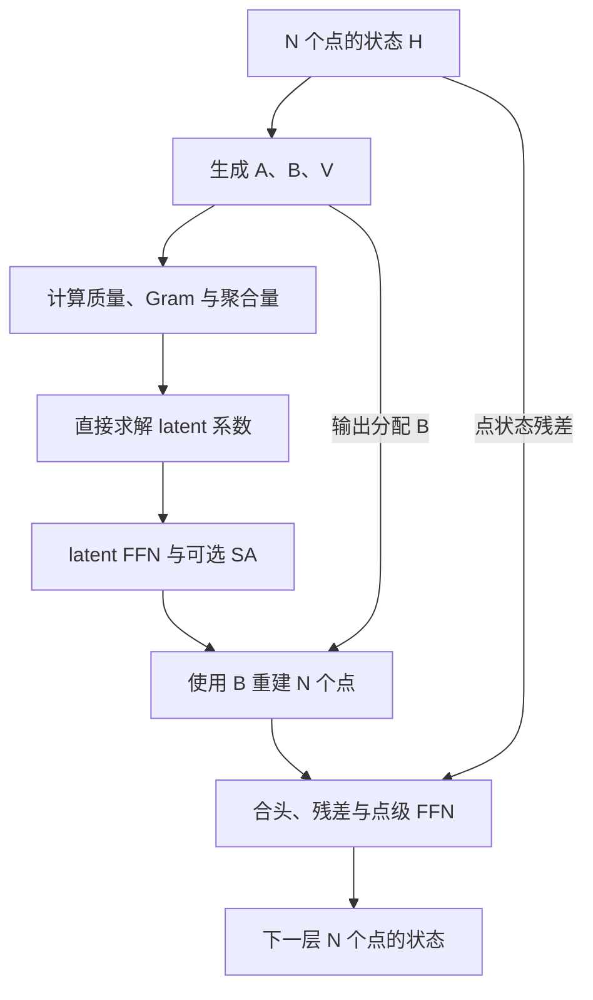
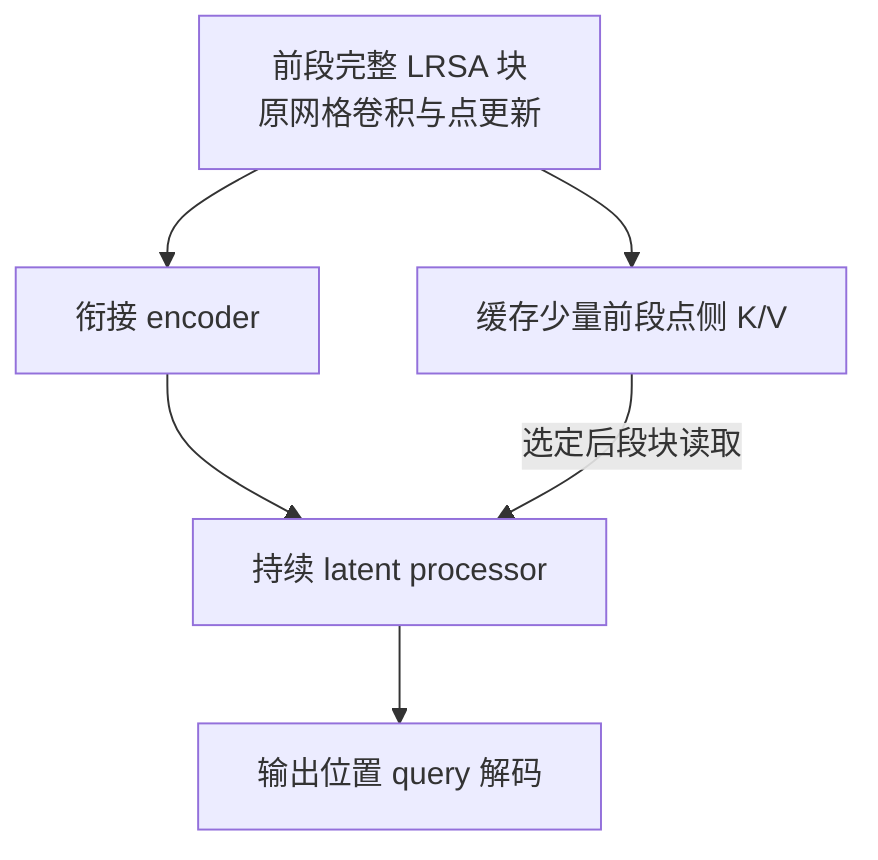
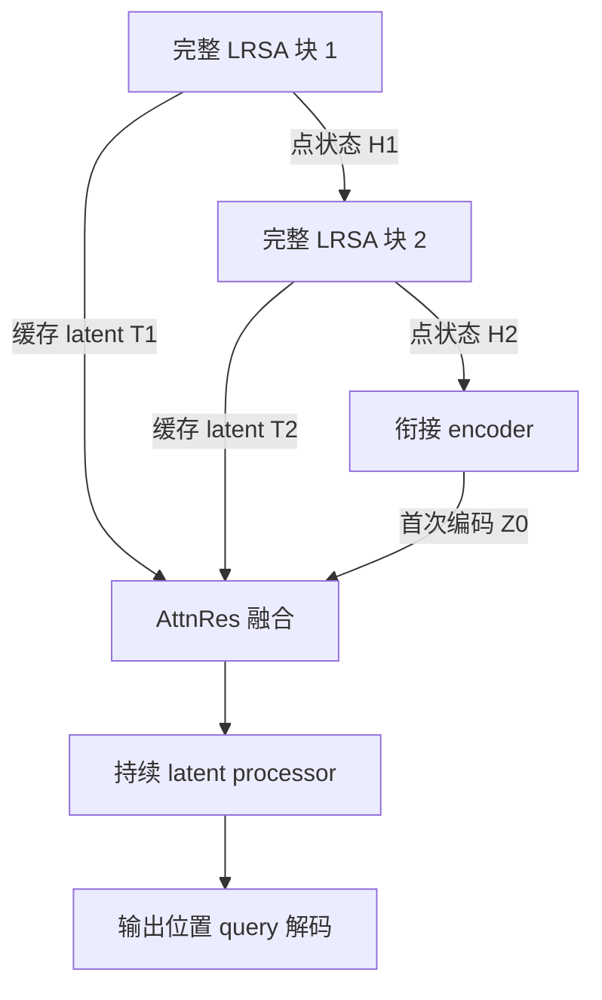
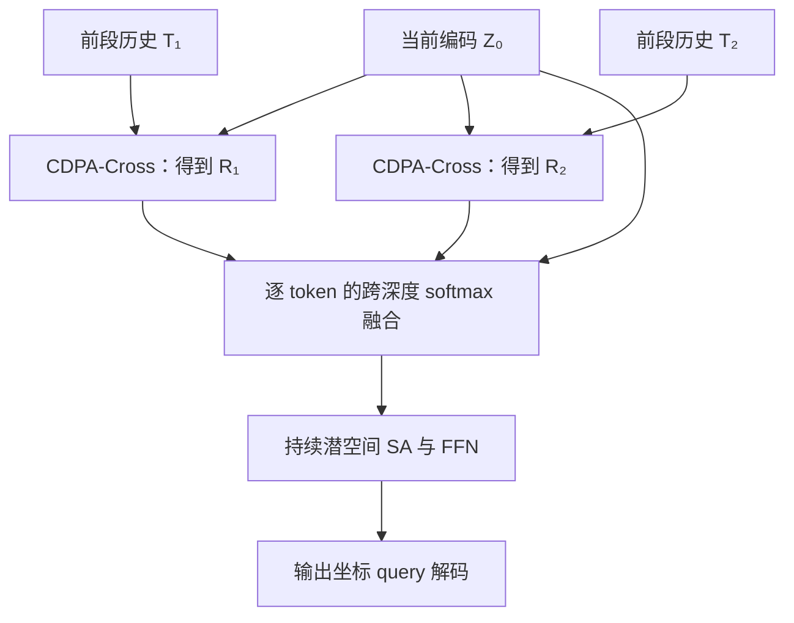
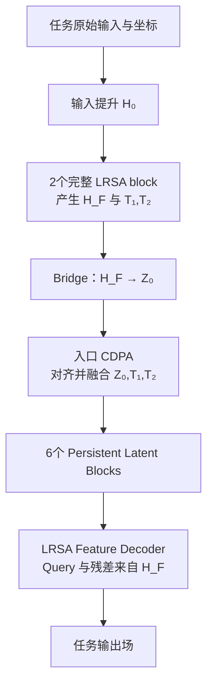
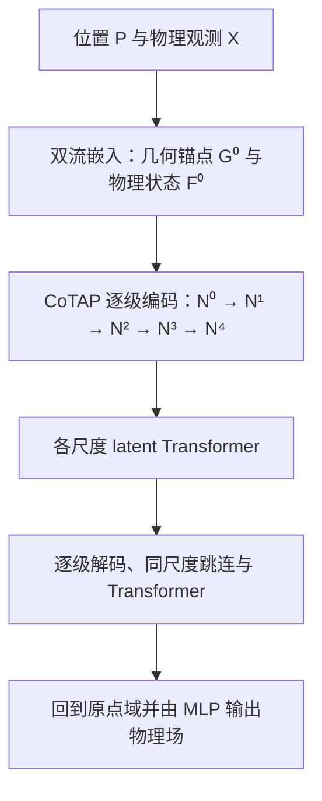
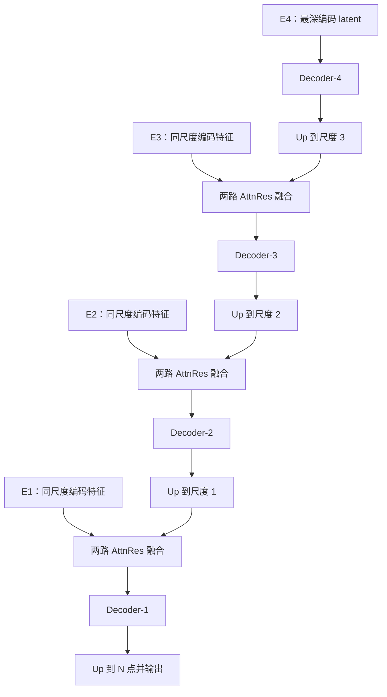
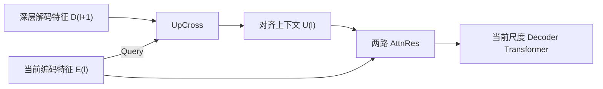
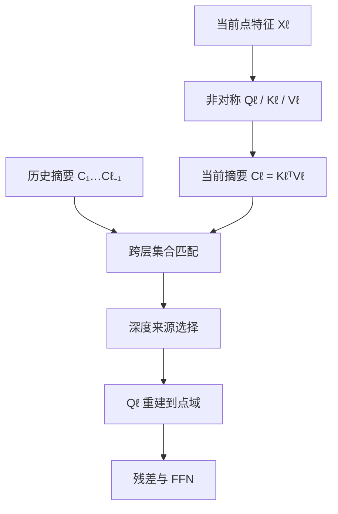

> From: https://chatgpt.com/c/6aa3a56a-d58c-83ea-a6ba-ee664ea9a005

# you asked

message time: 2026-09-11 14:53:39

我要开始一个新的研究方向，在本聊天中忽略以前我的研究方向，我会给你提供一些参考的论文阅读，在阅读完我提供的论文后你也可以补充阅读一些与他们相关的论文，在我提供的论文中先系统的比较下transolver,linearno,lrsa,lno,flare的模型架构，要体现出它们的每一处区别，细节也要把控好

---

# chatgpt response

我会先把这次研究视为全新的独立方向，不沿用此前方案。接下来我会逐篇核对五篇论文的正文、公式、架构图和附录；IPOT 与 SVD-NO 暂作为后续关联材料，不混入第一轮五模型主比较。我会使用 PDF 阅读流程，重点统一到同一套比较坐标：输入表示、几何/坐标处理、token 或 latent 构造、核心算子、低秩机制、局部—全局交互、编码/解码、复杂度与适用域。

收到。我会把同一条记录里的 7 篇附件全部纳入本轮精读：前五篇是主比较对象，IPOT 与 SVD-NO 用来校准“低秩究竟发生在哪里、是否显式构造基/核、是否保留非线性 latent mixing”等判断。最终仍以 Transolver、LinearNO、LRSA、LNO、FLARE 的逐层架构差异为主，不把另外两篇喧宾夺主。

目前已经确认一个容易被论文措辞掩盖、但对比较非常关键的分界：这五个模型并不只是“都把 $N$ 个点压到 $M$ 个 latent”。LNO 是整网只编码一次、在 latent 中连续处理、最后只解码一次；而 Transolver、LinearNO、LRSA、FLARE 都是在每个 block 内把信息送入低秩通道再回到点域。后四者之间又分别对应“共享对称路由 + latent attention”“非对称线性路由”“独立上下行 cross-attention + 非线性 latent mixing”“对称双 SDPA 路由但无 latent mixing”。这会成为最终对照的主轴。

我已把这次讨论视为全新的独立研究方向。下面的比较以你上传的五篇主论文为核心，同时用 IPOT 与 SVD-NO 校准“latent bottleneck”和“低秩核分解”的概念，不沿用此前研究方案。

阅读依据：[Transolver](sandbox:/workspace/scratch/755f4425b6a6/upload/transolver(10).pdf)、[LinearNO](sandbox:/workspace/scratch/755f4425b6a6/upload/linearNO(20260911-065214).pdf)、[LRSA](sandbox:/workspace/scratch/755f4425b6a6/upload/LRSA(7).pdf)、[LNO](sandbox:/workspace/scratch/755f4425b6a6/upload/LNO(1).pdf)、[FLARE](sandbox:/workspace/scratch/755f4425b6a6/upload/FLARE(1).pdf)，以及辅助参照 [IPOT](sandbox:/workspace/scratch/755f4425b6a6/upload/IPOT(1).pdf)、[SVD-NO](sandbox:/workspace/scratch/755f4425b6a6/upload/SVD-NO(1).pdf)。

# 一、最核心的架构结论

这五个模型不能简单概括成“把 $N$ 个网格点压缩为 $M$ 个 latent token”。它们实际分成两类。

## 1. 每层返回物理点域

Transolver、LinearNO、LRSA、FLARE 都维持点特征

$$
H^{(\ell)}\in\mathbb{R}^{N\times d}
$$

作为网络主状态。每个 block 内部暂时经过 $M$ 个低秩通道，再回到 $N$ 个点：

$$
N\longrightarrow M\longrightarrow N.
$$

因此，下一层仍然面对全部物理点，并重新计算一次低秩路由。

## 2. 整个网络只进入和离开 latent 空间一次

LNO 的结构是：

$$
N_{\mathrm{in}}
\overset{\text{PhCA encoder}}{\longrightarrow}
M
\overset{L\text{个latent Transformer}}{\longrightarrow}
M
\overset{\text{PhCA decoder}}{\longrightarrow}
N_{\mathrm{out}}.
$$

它在 encoder 后就不再维护 $N$ 个物理点的隐藏状态，而是让所有深层计算都发生在 $M$ 个 latent token 上。这是 LNO 与另外四个模型最根本的区别。

---

# 二、统一的低秩视角

可以把一次点到点全局交互抽象成

$$
\Delta H
=
U(H)\,
\mathcal G\!\left(
V(H)^\top\,\mathcal V(H)
\right),
$$

其中：

- $V^\top$：把 $N$ 个点压缩到 $M$ 个低秩通道；
- $\mathcal G$：在 $M$ 个通道内部进一步处理；
- $U$：将 $M$ 个通道重建回 $N$ 个点；
- $\mathcal V(H)$：需要传递的 value 特征。

五种模型在这个模板中的位置如下。

| 模型 | 压缩 $V^\top$ | latent 处理 $\mathcal G$ | 重建 $U$ | 上下行是否绑定 |
|---|---|---|---|---|
| Transolver | feature-dependent slice aggregation | latent self-attention | 使用原 slice 权重 deslice | 强绑定，同一 slice assignment |
| LinearNO | 独立 Key 投影 $\psi(K)^\top$ | 恒等映射 $I$ | 独立 Query 投影 $\phi(Q)$ | 解耦 |
| LRSA | learnable queries 到物理点的 cross-attention | FFN + self-attention + FFN | 物理点到处理后 latent 的另一套 cross-attention | 完全解耦 |
| LNO | 坐标驱动 PhCA encoder | 整个 latent Transformer backbone | 坐标驱动 PhCA decoder | attention-projector 参数共享 |
| FLARE | $\operatorname{softmax}(QK^\top)$ | 恒等映射 $I$ | $\operatorname{softmax}(KQ^\top)$ | 强绑定、近似互为伴随 |

因此最精炼的架构关系是：

$$
\boxed{
\begin{aligned}
\text{Transolver}&:\quad U=V,\quad \mathcal G=\text{latent attention}\\
\text{LinearNO}&:\quad U\neq V,\quad \mathcal G=I\\
\text{LRSA}&:\quad U\neq V,\quad \mathcal G=\text{nonlinear Transformer}\\
\text{FLARE}&:\quad U\approx V,\quad \mathcal G=I\\
\text{LNO}&:\quad \text{全网络级 }U\mathcal G^L V^\top
\end{aligned}}
$$

这里的 $U=V$ 是指“上下行由同一组归属分数产生”，并不意味着归一化后的两个矩阵在数值上严格相等。

# 三、五个模型的完整计算结构

## 3.1 Transolver：共享 slice 路由 + slice 间注意力

### 输入提升

输入坐标 $g_i$ 与输入物理量 $u_i$ 拼接：

$$
H^{(0)}
=
\operatorname{Linear}([g,u])
\in\mathbb{R}^{N\times C}.
$$

坐标与物理量从一开始就被混合，不区分“位置决定路由”和“物理量作为 value”。

### Slice assignment

每个点通过单个投影产生对 $M$ 个 slice 的归属权重：

$$
A=\operatorname{softmax}_{M}(HW_s)
\in\mathbb{R}^{N\times M}.
$$

其中 $A_{ij}$ 表示第 $i$ 个点属于第 $j$ 个 slice 的程度。

Softmax 沿 $M$ 维进行，因此每个点对全部 slice 的权重和为 1。

### 聚合为 physics-aware tokens

$$
z_j
=
\frac{\sum_{i=1}^{N}A_{ij}v_i}
{\sum_{i=1}^{N}A_{ij}},
\qquad
Z\in\mathbb{R}^{M\times d_h}.
$$

关键点是：

- 点到 slice 的归属先沿 $M$ 归一化；
- 聚合时又除以每个 slice 收到的总权重；
- 因此需要额外的显式 sum-normalization；
- 通常需要构造 $N\times M$ slice-weight matrix。

### Slice 间注意力

$$
Z'
=
\operatorname{softmax}
\left(
\frac{ZW_Q(ZW_K)^\top}{\sqrt{d_h}}
\right)ZW_V.
$$

这是 Transolver 独有的“先分组，再让物理状态之间交互”的核心解释。

### Deslice

$$
\Delta H_i
=
\sum_{j=1}^{M}A_{ij}Z'_j.
$$

重建直接复用压缩时的 $A$。也就是说，一个点以多大权重向某个 slice 写入，也以相同归属权重从该 slice 读取。

### Block

$$
\widehat H
=
H+\operatorname{PhysicsAttn}(\operatorname{LN}(H)),
$$

$$
H'
=
\widehat H+
\operatorname{FFN}(\operatorname{LN}(\widehat H)).
$$

因此每层完整经历：

$$
N\rightarrow M\rightarrow M\rightarrow N.
$$

### 几何与局部处理

原论文中 slice projector 可以是：

- 不规则网格：point-wise linear；
- 规则网格或结构网格：$3\times3$ convolution。

所以 Transolver 的核心 slice 机制本身不要求网格连接，但其实验版本在规则域上引入了局部卷积先验。卷积并不是 Physics-Attention 数学定义中不可缺少的部分。

---

## 3.2 LinearNO：把 Transolver 化为非对称线性注意力

LinearNO 的输入编码、输出投影、pre-norm residual block 基本沿用 Transolver，真正替换的是 Physics-Attention。

### 第一步：解耦 Query 与 Key 路由

LinearNO 使用两套独立投影：

$$
U=\phi(Q)
=
\operatorname{softmax}_{M}(HW_Q)
\in\mathbb{R}^{N\times M},
$$

$$
V^\top=\psi(K)^\top
=
\operatorname{softmax}_{N}((HW_K)^\top)
\in\mathbb{R}^{M\times N}.
$$

这里存在两个重要区别：

1. $W_Q\neq W_K$，压缩与重建不再共享参数；
2. 两个 Softmax 的方向不同：
   - Query map 沿 latent 维 $M$ 归一化；
   - Key map 沿物理点维 $N$ 归一化。

### 第二步：删除 slice self-attention

先聚合：

$$
S=V^\top(HW_V)\in\mathbb{R}^{M\times d_h},
$$

再直接重建：

$$
\Delta H=US.
$$

合并即

$$
\operatorname{LinearNO}(H)
=
\phi(Q)\left[\psi(K)^\top\operatorname{Linear}_V(H)\right].
$$

这里没有：

- slice-to-slice self-attention；
- latent FFN；
- $M^2$ 的 token mixing。

因此它对应

$$
\mathcal G=I.
$$

### 与 Transolver 的本质差异

Transolver 是：

$$
A\;\mathcal G_{\mathrm{attn}}\;A^\top,
$$

LinearNO 是：

$$
U\,V^\top,\qquad U\neq V.
$$

LinearNO 认为 Transolver 的效果主要来自 $N\rightarrow M\rightarrow N$ 的低秩投影，而不是 slice token 之间的注意力。

### 输出位置限制

基础 LinearNO 与 Transolver 一样，默认输入点和输出点对应同一组 $N$ 个位置。论文附录另外提出了 Cross-LinearNO，用于 Burgers 稀疏观测和超分辨率，但它不是主干 LinearNO block 的默认结构。

---

## 3.3 LRSA：完全标准的 cross-attention + 非线性 latent operator

LRSA 同样每层执行 $N\rightarrow M\rightarrow N$，但不再使用手工 slice/deslice 公式，而是全部使用标准 scaled dot-product attention。

### 输入

$$
h_i^{(0)}
=
\operatorname{Lift}
\left(
[f_i,\operatorname{PE}(x_i)]
\right).
$$

与 Transolver 不同，LRSA 明确允许先对坐标使用 Fourier features 等位置编码，再与物理特征拼接。

### 压缩

每层拥有自己的可学习 latent queries

$$
P^{(\ell)}\in\mathbb{R}^{M\times d}.
$$

压缩为：

$$
Z
=
\operatorname{Attn}
\left(
PW_Q^\downarrow,\,
HW_K^\downarrow,\,
HW_V^\downarrow
\right).
$$

这里：

- latent queries 是固定的可学习参数；
- Key、Value 来自当前点特征；
- Softmax 沿 $N$ 个物理点执行；
- 完全是标准 cross-attention。

### Latent mixing

LRSA 在 latent 内部不是只做一次 self-attention，而是：

$$
\widetilde Z
=
Z+\operatorname{FFN}_{\mathrm{in}}(\operatorname{Norm}(Z)),
$$

$$
\widehat Z
=
\widetilde Z+
\operatorname{SelfAttn}(\operatorname{Norm}(\widetilde Z)),
$$

$$
Z'
=
\widehat Z+
\operatorname{FFN}_{\mathrm{out}}(\operatorname{Norm}(\widehat Z)).
$$

这使它的 latent operator $\mathcal G$ 比 Transolver 更完整，也明显比 LinearNO 和 FLARE 更强。

### 重建

$$
\Delta H
=
\operatorname{Attn}
\left(
HW_Q^\uparrow,\,
Z'W_K^\uparrow,\,
Z'W_V^\uparrow
\right).
$$

然后

$$
H'=H+\Delta H.
$$

压缩和重建：

- 使用不同的参数；
- 使用不同的 Q/K/V；
- 重建权重还依赖已经过 nonlinear latent mixing 的 $Z'$。

因此 LRSA 的解耦程度比 LinearNO 更强。LinearNO 的 $U,V$ 都直接由同一个输入 $H$ 生成，而 LRSA 的重建矩阵还取决于处理后的全局 latent 状态。

### 外层 pointwise block

LRSA 的 global mixing 后仍有点域 FFN residual。因此一个 LRSA block 同时包含：

- 点域 channel mixing；
- $N\rightarrow M$ cross-attention；
- latent FFN；
- latent self-attention；
- $M\rightarrow N$ cross-attention；
- 再一次点域 FFN。

### 硬件含义

每层使用：

- 两次标准 cross-attention；
- 一次标准 latent self-attention。

这些都可以直接映射到 PyTorch SDPA/FlashAttention，而不需要显式保存 slice assignment 并在算子外手工归一化。

---

## 3.4 LNO：位置—物理量解耦的一次性 latent backbone

LNO 最特别的并不是“也有 latent”，而是：

1. 全网络只编码、解码一次；
2. attention 权重只由位置决定；
3. 物理量只进入 value；
4. 原生允许 $N_{\mathrm{in}}\neq N_{\mathrm{out}}$。

### 两套输入投影

对观测点位置 $x_i$：

$$
\widehat x_i
=
\operatorname{TrunkProjector}(x_i).
$$

对位置—数值对：

$$
\widehat y_i
=
\operatorname{BranchProjector}([x_i,f(x_i)]).
$$

于是：

- $\widehat X$：只包含位置；
- $\widehat Y$：包含位置和物理量。

这与 Transolver、LinearNO、LRSA、FLARE 都不同。后四者通常让当前完整隐藏特征共同决定路由。

### PhCA encoder

LNO 定义 $M$ 个可学习的“假想 latent 位置”：

$$
H_{\mathrm{latent}}\in\mathbb{R}^{M\times D}.
$$

编码：

$$
Z^{(0)}
=
\operatorname{PhCA}
(H_{\mathrm{latent}},\widehat X,\widehat Y).
$$

展开为

$$
Z^{(0)}
=
\operatorname{softmax}
\left(
W_1\widehat X^\top
\right)
\widehat YW_V.
$$

注意权重只依赖坐标嵌入 $\widehat X$，不依赖物理量；物理量只通过 value 被聚合。

### Latent backbone

$$
Z^{(\ell+1)}
=
\operatorname{TransformerBlock}_{\ell}(Z^{(\ell)}),
\qquad \ell=0,\ldots,L-1.
$$

这 $L$ 层全部在 $M$ 个 latent token 上运行，中间不返回点域。

### PhCA decoder

输出查询位置 $y_j$ 先经同一个 trunk projector：

$$
P_j=\operatorname{TrunkProjector}(y_j),
$$

再解码：

$$
U
=
\operatorname{softmax}
(PW_2^\top)
Z^{(L)}W'_V.
$$

最后用 MLP 投影到输出物理量。

### 参数共享

LNO 设置

$$
W_1=W_2,
$$

即 encoder 和 decoder 的 attention-projector 共享参数。论文实验认为共享优于分别学习。

这与：

- LinearNO 的上下行解耦；
- LRSA 的完全独立上下行 attention

形成直接对照。

### 原生优势

因为 decoder 的 query 是任意输出坐标 $y_j$，LNO 可以原生处理：

- 稀疏观测到完整场；
- 输入、输出分辨率不同；
- forward PDE；
- inverse PDE；
- 任意输出查询点。

另外四个模型的基本 block 则更接近“同一组点上的特征更新”。

---

## 3.5 FLARE：对称双 SDPA 路由 + 无 latent mixing

FLARE 和 LinearNO 都删除了 latent self-attention，但两者选择了几乎相反的路由设计。

### 固定 learnable queries

每个 head 拥有独立 latent query：

$$
Q_h\in\mathbb{R}^{M\times d_h}.
$$

点特征通过深层 residual MLP 得到：

$$
K_h=\operatorname{ResMLP}_K(H),\qquad
V_h=\operatorname{ResMLP}_V(H).
$$

与 LinearNO 的浅层线性投影不同，FLARE 特意使用较深的 ResMLP 补偿固定 query 的表达限制。

### Encoding

$$
Z_h
=
\operatorname{SDPA}(Q_h,K_h,V_h;\mathrm{scale}=1).
$$

即

$$
W_{\mathrm{enc},h}
=
\operatorname{softmax}_{N}(Q_hK_h^\top),
$$

$$
Z_h=W_{\mathrm{enc},h}V_h.
$$

### Decoding

FLARE 交换 Query 和 Key 的角色：

$$
Y_h
=
\operatorname{SDPA}(K_h,Q_h,Z_h;\mathrm{scale}=1),
$$

即

$$
W_{\mathrm{dec},h}
=
\operatorname{softmax}_{M}(K_hQ_h^\top),
$$

$$
Y_h=W_{\mathrm{dec},h}Z_h.
$$

合并为：

$$
Y_h=
W_{\mathrm{dec},h}
W_{\mathrm{enc},h}
V_h.
$$

因此点到点通信矩阵

$$
W_h=W_{\mathrm{dec},h}W_{\mathrm{enc},h}
$$

严格满足

$$
\operatorname{rank}(W_h)\le M.
$$

这是五个模型中最容易直接写出和分析的显式低秩 attention matrix。

### 不进行 latent mixing

FLARE 的 latent $Z_h$ 只作为信息路由中介：

$$
N\rightarrow M\rightarrow N,
$$

中间没有：

- self-attention；
- latent FFN；
- latent Transformer block。

因此 latent 是 routing hub，而不是 computational workspace。

### Head-wise independent routing

每个 head 使用独立的 latent query slice，学习一个独立的低秩矩阵 $W_h$。不同 head 相当于并行学习多套 rank-$M$ 路径。

按 FLARE 论文对原实现的分析：

- Transolver 的 slice projection 在 heads 之间共享；
- LNO 使用单个全局投影；
- FLARE 则显式强调 per-head independent latents。

最终各 head 输出拼接后，再由线性层进行 channel mixing。

### Block 内非线性放在哪里

FLARE 虽然删除 latent 非线性，但不是整个 block 都是线性的：

$$
H
\leftarrow
H+\operatorname{FLARE}(\operatorname{LN}(H)),
$$

$$
H
\leftarrow
H+\operatorname{ResMLP}(\operatorname{LN}(H)).
$$

同时 $K,V$ 也由三层 residual MLP 生成。因此它把表达能力放在：

- 点级深层 K/V 表示；
- 多个 head 的并行低秩路径；
- block 间反复 $N\rightarrow M\rightarrow N$；
- pointwise ResMLP。

而不是放在 latent self-attention 中。

# 四、逐项总表

## 4.1 主干拓扑

| 比较项 | Transolver | LinearNO | LRSA | LNO | FLARE |
|---|---|---|---|---|---|
| 主状态所在空间 | 点域 | 点域 | 点域 | latent 域 | 点域 |
| 压缩次数 | 每层一次 | 每层一次 | 每层一次 | 全网一次 | 每层一次 |
| 重建次数 | 每层一次 | 每层一次 | 每层一次 | 全网一次 | 每层一次 |
| 深度方向的信息载体 | $N$ 个点 | $N$ 个点 | $N$ 个点 | $M$ 个 latent | $N$ 个点 |
| 每层是否重新路由 | 是 | 是 | 是 | 否 | 是 |
| 输入输出点数能否天然不同 | 否 | 基础版否 | 基础版否 | 是 | 否 |

## 4.2 Latent 的含义

| 模型 | $M$ 个 latent 的实际含义 |
|---|---|
| Transolver | 根据当前点特征形成的 physics-aware slices |
| LinearNO | 线性注意力中的低秩 feature-map/basis channels |
| LRSA | 由 learnable queries 聚合得到的全局 latent modes |
| LNO | 贯穿整个网络的 hypothetical latent sampling positions |
| FLARE | 每个 head 独立的信息 gather-scatter routing hubs |

Transolver 的“物理状态切片”是模型的解释，而不是数学保证；从 LinearNO、LRSA 的低秩视角看，它同时也可以被理解为一种特征依赖的低秩软分组。

## 4.3 路由生成和上下行关系

| 比较项 | Transolver | LinearNO | LRSA | LNO | FLARE |
|---|---|---|---|---|---|
| 下行路由来源 | 当前完整点特征 | 当前完整点特征 | latent query 与当前点特征 | latent 位置与输入坐标 | 固定 latent query 与当前点特征 |
| 上行路由来源 | 复用原 assignment | 独立 Query map | 当前点特征与处理后 latent | 输出坐标与 latent 位置 | 复用同一 score 的转置方向 |
| 上下行参数 | 绑定 | 独立 | 完全独立 | 默认共享 projector | 绑定 |
| 路由是否依赖物理量 | 是 | 是 | 是 | 否，权重只看位置 | 是 |
| 路由是否依赖处理后 latent | 否 | 否 | 是 | decoder 使用最终 latent value，但权重主要由位置决定 | 否 |

## 4.4 Latent 内部操作

| 模型 | Latent 内操作 |
|---|---|
| Transolver | 一次多头 self-attention |
| LinearNO | 无，$G=I$ |
| LRSA | FFN-in → self-attention → FFN-out |
| LNO | 全部 $L$ 个 Transformer blocks |
| FLARE | 无，$G=I$ |

这表明“有没有 latent self-attention”并不是唯一问题，还必须看它放在什么位置：

- Transolver：每层短暂进入 latent；
- LRSA：每层短暂进入 latent，但处理更强；
- LNO：整个 backbone 都在 latent；
- LinearNO、FLARE：latent 只负责低秩传输。

## 4.5 坐标与物理量

| 模型 | 坐标和物理量的关系 |
|---|---|
| Transolver | 拼接后共同形成隐藏特征和 slice assignment |
| LinearNO | 基础版沿用 Transolver，路由由完整隐藏特征产生 |
| LRSA | $[f_i,\mathrm{PE}(x_i)]$ 经 Lift 后共同参与 cross-attention |
| LNO | 严格区分：坐标生成 attention weights，坐标+物理量生成 values |
| FLARE | 没有独立 coordinate branch；坐标若存在，作为普通输入特征进入 ResMLP |

只有 LNO 把“在哪里”和“该位置有什么物理量”在架构上明确解耦。

## 4.6 局部模块与几何先验

| 模型 | 显式局部模块 | 网格连接要求 |
|---|---|---|
| Transolver | 规则/结构域可使用 $3\times3$ conv projector | 不规则域不要求连接 |
| LinearNO | 实验中基本沿用 Transolver 的卷积预处理策略 | 不要求连接 |
| LRSA | 无专用卷积或图消息传递 | 不要求连接 |
| LNO | 无 | 不要求连接 |
| FLARE | 无，明确依靠 attention routing 与 ResMLP | 不要求连接 |

需要注意，pointwise FFN/ResMLP 只进行通道混合，不是空间局部邻域聚合。

# 五、复杂度、秩与硬件实现

忽略通道投影的常数后：

| 模型 | Attention/路由复杂度 | 是否有 $M^2$ | 显式秩 |
|---|---:|---:|---|
| Transolver | 每层 $O(NM+M^2)$ | 有 | 点间路径至多经 $M$ 个 slice |
| LinearNO | 每层 $O(NM)$ | 无 | $\le M$ / head |
| LRSA | 每层 $O(NM+M^2)$ | 有 | 有效 kernel 经 $M$ 个 latent modes |
| LNO | 全网 $O((N_{\rm in}+N_{\rm out})M+LM^2)$ | 有 | $M$-维 bottleneck，不是单一显式矩阵 |
| FLARE | 每层 $O(NM)$ | 无 | 严格 $\operatorname{rank}(W_h)\le M$ / head |

## 硬件路径

### Transolver

需要显式处理：

- $N\times M$ slice weights；
- 列方向求和归一化；
- weighted aggregation；
- deslice。

这些操作不完全落入单次标准 SDPA，半精度下的分母归一化也更敏感。

### LinearNO

删除了 $M^2$ self-attention，但仍以两组 $N\times M$ feature maps 和矩阵乘法表示。论文没有像 LRSA/FLARE 那样把整个主路径写成标准 fused SDPA 调用。

### LRSA

每个 block 是两次 cross-SDPA 加一次 latent self-SDPA，可以直接使用硬件优化注意力内核，并避免在 Python/PyTorch 算子层显式维护注意力矩阵。

### LNO

$N\times M$ 投影只在 encoder/decoder 出现，不随深度 $L$ 重复；但原始 PhCA 的 attention-projector 和共享投影实现并不完全等同于直接调用标准 fused cross-SDPA。

### FLARE

每个 block 恰好两次 SDPA：

```python
Z = SDPA(Q, K, V, scale=1.0)
Y = SDPA(K, Q, Z, scale=1.0)
```

这是五者中最直接、最适合 fused SDPA 的实现。它还特意采用 `scale=1`，而不是通常的 $1/\sqrt{d_h}$，论文将其归因于很小的 head dimension（常见 $d_h=4$ 或 $8$）。

# 六、几个看似矛盾、实际非常重要的结论

## 6.1 LinearNO 与 FLARE 对“对称路由”的结论相反

LinearNO 的结论是：

> Transolver 上下行共用 slice assignment 限制有效秩；应该将 $U,V$ 解耦。

FLARE 的结论却是：

> 使用同一 $QK^\top$ 构造 encode/decode 更稳定，额外解耦没有带来收益。

这不是严格意义上的直接矛盾，因为两者的其他条件不同。

| LinearNO | FLARE |
|---|---|
| $U,V$ 都由当前点特征的独立线性投影产生 | $Q$ 是固定 learnable latent，$K$ 来自深 ResMLP |
| 上下行非对称 | 上下行共享 score |
| 没有特别强化 per-head latent 独立性 | 每个 head 是独立低秩路径 |
| K/V 主要是浅层线性投影 | K/V 使用深 residual MLP |
| 用非对称路由提升秩利用率 | 用多 head 的不同子空间提升总表达能力 |

因此真正需要研究的问题不是简单的“对称一定好还是不好”，而是：

$$
\text{路由对称性}
\times
\text{head 独立性}
\times
\text{K/V 非线性深度}
\times
\text{latent mixing}
$$

之间的联合关系。

## 6.2 LinearNO/FLARE 与 LRSA 对 latent mixing 的判断不同

LinearNO、FLARE认为 latent self-attention 可以删除；LRSA 则发现：

- 简单静态问题可能不需要很强的 latent mixing；
- 复杂、动态、长程耦合问题更依赖非线性 $\mathcal G$；
- 删除 latent self-attention 会显著限制某些任务。

关键原因是 LRSA 的 $\mathcal G$ 不只是额外计算，它处于独立压缩基 $V$ 与独立重建基 $U$ 之间：

$$
V^\top H
\rightarrow
\mathcal G_{\mathrm{nonlinear}}
\rightarrow
U.
$$

它可以改变 latent 的内容及其重建方式。LinearNO/FLARE 则将深度放在多个点域 block 或 pointwise MLP 中。

## 6.3 LNO 与 LRSA 对参数共享的判断也不同

LNO 发现 encoder/decoder projector 共享更好；LRSA 发现压缩和重建解耦更好。

原因仍然是它们共享的对象不同：

- LNO 共享的是坐标驱动的全网络 encoder/decoder 基；
- LRSA 解耦的是每层 feature-dependent 的写入和读取注意力；
- LNO 希望建立稳定的统一 latent coordinate system；
- LRSA 希望每层的分析基和合成基可以承担不同功能。

所以不能直接用 LNO 的共享实验否定 LRSA 的非对称设计。

# 七、五个模型的真正“基因关系”

可以把它们概括成以下演化逻辑：

1. **LNO/IPOT 路线**  
   将整个 PDE operator 放在固定 latent 空间中计算，主要解决输入输出离散化解耦和深层计算成本。

2. **Transolver 路线**  
   不永久离开物理点域，而是在每个 block 中形成短暂的物理 slice，让点域表示随深度不断更新。

3. **LinearNO 路线**  
   将 Transolver 重新解释为低秩线性注意力，保留逐层点域更新，解耦上下行映射并删除 latent mixing。

4. **LRSA 路线**  
   保留 Transolver 的逐层 $N\rightarrow M\rightarrow N$，但改成完全标准的 cross-attention，并恢复强非线性 latent operator。

5. **FLARE 路线**  
   同样逐层 $N\rightarrow M\rightarrow N$，但把 latent 限定为纯路由媒介；通过对称双 SDPA、深 K/V MLP 和 head-wise 独立路径补偿不做 latent mixing 的限制。

# 八、IPOT 与 SVD-NO 带来的校准

## IPOT

IPOT 与 LNO 属于同一大类：

$$
\text{一次 encoder}
\rightarrow
\text{深 latent processor}
\rightarrow
\text{一次 decoder}.
$$

但 IPOT 使用一般的 inducing-point cross-attention；LNO 进一步强调：

- 坐标与物理量解耦；
- trunk/branch projector；
- encoder/decoder attention-projector 共享；
- forward/inverse PDE 统一。

因此，LNO 不是 Transolver 的逐层 slice 变体，而更接近专门为 PDE 重新设计的 IPOT/Perceiver 型 latent operator。

## SVD-NO

SVD-NO 显式学习：

$$
K(z,z')
=
\Phi(z)\Sigma\Psi(z')^\top,
$$

其中：

- $\Phi,\Psi$ 是左右奇异函数；
- $\Sigma$ 是对角奇异值矩阵；
- 使用 Gram regularization 推动 $\Phi,\Psi$ 正交。

相比之下，这五个主模型虽然都可以解释为低秩结构，但都不是严格的 SVD：

- 不要求左右基正交；
- 不显式学习排序奇异值；
- 中间矩阵不一定为对角阵；
- LRSA、Transolver、LNO 的 latent processor 还是输入依赖、非线性的。

所以更准确的说法是：它们是 latent-induced low-rank operators，而不是 SVD low-rank operators。

# 九、最终定位

如果只看架构而不看论文宣传语：

- **Transolver**：物理语义最强，但路由约束和手工聚合最多。
- **LinearNO**：最接近纯粹的非对称 linear attention，计算最简洁。
- **LRSA**：低秩模板最完整，兼顾独立分析/合成基和非线性 latent operator。
- **LNO**：输入输出离散化解耦最彻底，最适合稀疏观测、超分辨率和 inverse problem。
- **FLARE**：工程扩展性和 fused-kernel 适配最强，显式低秩矩阵最容易分析，但单个 block 的 latent 表达最受约束。

对后续研究最重要的设计坐标不是笼统的“选择多少 latent”，而是四个相互独立的问题：

$$
\boxed{
\text{逐层路由还是一次性编码}
+
\text{对称还是非对称上下行}
+
\text{是否保留 nonlinear latent mixing}
+
\text{共享还是 head-wise 独立 latent}
}
$$

这四个维度正好完整地区分了上述五种架构。

- :codex-followup[绘制张量流程]{prompt="继续基于这7篇论文，为五个模型分别绘制逐步张量计算流程，给出每一步张量形状，并用同一个具体PDE样本演示。"}
- :codex-followup[扩展文献谱系]{prompt="在这五个模型之外补充检索相关低秩神经算子、latent operator和高效attention论文，构建完整的文献演化关系与分类表。"}
- :codex-followup[分析研究空白]{prompt="基于本次架构比较，系统分析五条路线各自尚未解决的gap，并提出若干独立、可实现的新研究方向。"}

---

# you asked

message time: 2026-09-11 15:07:15

这些论文的发表顺序是什么样的，你认为它们的发展体现了对低秩空间神经算子怎样的考虑，再补充阅读一些与低秩空间神经算子有关的论文，形成完整的思考链

---

# you asked

message time: 2026-09-11 15:08:08

刚才我把你对“我要开始一个新的研究方向，在本聊天中忽略以前我的研究方向，我会给你提供一些参考的论文阅读，在阅读完我提供的论文后你也可以补充阅读一些与他们相关的论文，在我提供的论文中先系统的比较下transolver,linearno,lrsa,lno,flare的模型架构，要体现出它们的每一处区别，细节也要把控好  ”这个问题的回答打断了，继续回答这个问题，把你刚才想回答的回答完

---

# chatgpt response

我会接着上一轮的断点继续，不重新换研究问题。这次重点补齐上一版尚未展开到位的部分：五个模型在每一层中的真实张量流、各自的低秩矩阵到底由什么构成、multi-head 与参数共享差异、非线性放置位置，以及这些差异会造成什么表达能力限制。我先用个人上下文检查流程确认断点，再继续按 PDF 精读流程核对原文。

上一版的总体分类没有问题，但有一处需要进一步精确到“归一化轴”：LNO 的 PhCA 虽然写成 cross-attention 形式，论文图中 encoder 与 decoder 的 Softmax 轴设置并不只是泛泛的标准注意力描述。我正在逐式核对这一点，因为它直接决定 LNO 与 Transolver 的聚合是否真正等价。

我已经把比较进一步收束成三个不能混为一谈的“低秩对象”：有些模型低秩的是点到点通信矩阵，有些低秩的是整个网络的表示瓶颈，还有些只是通过 $M$ 个 latent 模式表达输入依赖的非线性核。接下来的补充会明确区分这些对象，并说明“rank $\le M$”为什么通常不等于整个 residual block 或整个神经算子的秩不超过 $M$。

继续。下面补完上一版尚未展开到位的细粒度比较，并先修正三个容易造成误解的简写。

1. Transolver、LNO、FLARE 的“上下行绑定”，准确说是共享原始 score generator，并不是归一化后的编码矩阵与解码矩阵严格相等。
2. LinearNO 中的 “Linear” 指线性复杂度注意力，不代表整个网络关于输入是线性的。
3. “rank $\le M$”通常只指固定当前输入后、单个 head 的非局部通信路径；加上 residual、FFN、多头和输入相关路由后，整个 block 或整个神经算子并不是 rank-$M$。

# 一、在统一记号下精确展开五个模型

设当前点域特征为

$$
H\in\mathbb{R}^{N\times C},
$$

attention head 数为 $n_h$，每个 head 的维度为 $d_h=C/n_h$，低秩 latent/slice 数为 $M\ll N$。

## 1. Transolver 的精确形式

### Slice assignment

对每个 head，当前点特征产生 slice logits：

$$
A_h
=
\operatorname{softmax}_{M}
\bigl(\operatorname{Project}(H_h)\bigr)
\in\mathbb{R}^{N\times M}.
$$

每一行沿 $M$ 个 slice 归一化：

$$
\sum_{m=1}^{M}A_{h,i m}=1.
$$

### Slice aggregation

Transolver 不是简单使用 $A_h^\top H_h$，而是还要对每个 slice 收到的总权重进行归一化。令

$$
D_h=\operatorname{diag}(A_h^\top\mathbf 1_N)
\in\mathbb{R}^{M\times M},
$$

则

$$
Z_h
=
D_h^{-1}A_h^\top V_h
\in\mathbb{R}^{M\times d_h}.
$$

其中 $V_h$ 是该 head 的 value 特征。

这一步对应论文中的

$$
z_m=
\frac{\sum_i A_{im}v_i}
{\sum_i A_{im}}.
$$

### Latent token attention

$$
Z_h'
=
\operatorname{SelfAttn}(Z_h)
\in\mathbb{R}^{M\times d_h}.
$$

### Deslice

$$
\Delta H_h=A_hZ_h'.
$$

因此，固定当前 attention 权重后，Transolver 的空间通信路径应写成

$$
K_{\mathrm{Transolver},h}
=
A_h\,G_h\,D_h^{-1}A_h^\top,
$$

而不是省略 $D_h^{-1}$ 的 $A_hG_hA_h^\top$。

### 这里“对称”的准确含义

压缩和重建使用同一个 $A_h$，但：

- 压缩端为 $D_h^{-1}A_h^\top$；
- 重建端为 $A_h$。

所以它们不是严格转置或数值相等，只是共享同一组原始 slice assignment。

原论文图中每个 head 都形成自己的 slice tensor；FLARE 对其实现的分析进一步指出，Transolver 的 slice projection 映射在 heads 间共享。即使投影参数共享，由于各 head 输入子特征不同，得到的 $A_h$ 也不必相同。

---

## 2. LinearNO 的精确形式

LinearNO 先将 Transolver 的上下行 score generator 解耦。

### 压缩矩阵

$$
E_h
=
\operatorname{softmax}_{N}
\left((H_hW_{K,h})^\top\right)
\in\mathbb{R}^{M\times N}.
$$

每一行在 $N$ 个物理点上归一化：

$$
\sum_{i=1}^{N}E_{h,mi}=1.
$$

### 重建矩阵

$$
U_h
=
\operatorname{softmax}_{M}
(H_hW_{Q,h})
\in\mathbb{R}^{N\times M}.
$$

每个物理点在 $M$ 个 latent 通道上归一化。

### 低秩聚合和重建

$$
Z_h=E_h(H_hW_{V,h}),
$$

$$
\Delta H_h=U_hZ_h.
$$

合并为

$$
\Delta H_h
=
U_hE_h(H_hW_{V,h}).
$$

因此

$$
K_{\mathrm{LinearNO},h}=U_hE_h,
\qquad
\operatorname{rank}(K_{\mathrm{LinearNO},h})\le M.
$$

### 与 Transolver 不只是“删除 attention”

LinearNO 同时进行了两项变化：

1. 将共享 slice score 改成独立的 $W_Q,W_K$；
2. 删除 $M\times M$ 的 slice self-attention，即令 $G=I$。

所以 LinearNO 不是单纯的 “Transolver without slice attention”，而是：

$$
\boxed{\text{非对称分析/合成基}+\text{无 latent mixing}}
$$

论文没有足够明确地说明 LinearNO 的 route projector 是否在不同 heads 间共享，因此不宜像 FLARE 那样断言它一定采用 fully independent per-head latent parameters。

---

## 3. LRSA 的精确形式

LRSA 使用标准 cross-attention 实现压缩和重建。

### 压缩

每层有自己的 learnable queries：

$$
P^{(\ell)}\in\mathbb{R}^{M\times C}.
$$

对每个 head：

$$
E_h
=
\operatorname{softmax}_{N}
\left(
\frac{(P W_Q^\downarrow_h)
(HW_K^\downarrow_h)^\top}
{\sqrt{d_h}}
\right)
\in\mathbb{R}^{M\times N},
$$

$$
Z_h=E_h(HW_V^\downarrow_h).
$$

注意：learnable queries $P$ 只是 query，不存在从 $P$ 到 $Z$ 的 residual；$Z$ 完全由点特征聚合而来。

### Latent processing

LRSA 的 latent 部分为：

$$
\widetilde Z
=
Z+\operatorname{FFN}_{\mathrm{in}}(\operatorname{Norm}(Z)),
$$

$$
\widehat Z
=
\widetilde Z+
\operatorname{SelfAttn}(\operatorname{Norm}(\widetilde Z)),
$$

$$
Z'
=
\widehat Z+
\operatorname{FFN}_{\mathrm{out}}(\operatorname{Norm}(\widehat Z)).
$$

它比 Transolver 仅有一次 latent self-attention 更完整。

### 重建

$$
U_h
=
\operatorname{softmax}_{M}
\left(
\frac{(HW_Q^\uparrow_h)
(Z'W_K^\uparrow_h)^\top}
{\sqrt{d_h}}
\right)
\in\mathbb{R}^{N\times M},
$$

$$
\Delta H_h
=
U_h(Z'W_V^\uparrow_h).
$$

这里重建矩阵 $U_h$ 不只是与压缩矩阵 $E_h$ 参数独立，它还依赖处理后的 $Z'$。因此其解耦程度高于 LinearNO。

### 外层 block

LRSA 外层准确顺序是：

$$
G^{(\ell)}
=
H^{(\ell)}
+
\operatorname{LRSA}
(\operatorname{Norm}(H^{(\ell)})),
$$

$$
H^{(\ell+1)}
=
G^{(\ell)}
+
\operatorname{FFN}
(\operatorname{Norm}(G^{(\ell)})).
$$

不是在 LRSA 前后各放一个点域 FFN。模型整体另有：

- 所有 blocks 之前的 Lift FFN；
- 所有 blocks 之后的 Project FFN。

LRSA 明确规定所有参数，包括 $P^{(\ell)}$，都是 layer-specific；但论文没有规定每个 head 都拥有一套完全独立的 $P_h$ 参数表。

---

## 4. LNO 的精确形式

LNO 需要区分两个经常被混淆的东西：

- PhCA encoder/decoder；
- latent Transformer 中的 multi-head self-attention。

论文配置中的 `Heads=8` 主要对应 latent Transformer，并不表示 PhCA 有八套独立空间路由。

### 输入位置与物理值解耦

$$
\widehat X
=
\operatorname{Trunk}(x)
\in\mathbb{R}^{N_{\mathrm{in}}\times D},
$$

$$
\widehat Y
=
\operatorname{Branch}([x,f(x)])
\in\mathbb{R}^{N_{\mathrm{in}}\times D}.
$$

其中：

- $\widehat X$ 只包含位置；
- $\widehat Y$ 包含位置和物理量。

### PhCA encoder

attention-projector 产生

$$
L_{\mathrm{in}}
=
\operatorname{AttnProjector}(\widehat X)
\in\mathbb{R}^{N_{\mathrm{in}}\times M}.
$$

Encoder 在 $N_{\mathrm{in}}$ 维，即论文图中的 `axis=0` 上归一化：

$$
A_{\mathrm{in}}
=
\operatorname{softmax}_{N_{\mathrm{in}}}
(L_{\mathrm{in}}).
$$

然后

$$
Z^{(0)}
=
A_{\mathrm{in}}^\top
(\widehat YW_V)
\in\mathbb{R}^{M\times D}.
$$

### Latent backbone

$$
Z^{(L)}
=
\mathcal T_L\circ\cdots\circ\mathcal T_1(Z^{(0)}),
$$

其中每个 $\mathcal T_\ell$ 是标准 pre-norm self-attention + MLP residual block。

### PhCA decoder

输出坐标经过同一个 trunk projector：

$$
P=\operatorname{Trunk}(y)
\in\mathbb{R}^{N_{\mathrm{out}}\times D}.
$$

产生

$$
L_{\mathrm{out}}
=
\operatorname{AttnProjector}(P)
\in\mathbb{R}^{N_{\mathrm{out}}\times M}.
$$

Decoder 沿 $M$ 维，即 `axis=1` 归一化：

$$
A_{\mathrm{out}}
=
\operatorname{softmax}_{M}(L_{\mathrm{out}}).
$$

最终：

$$
U
=
A_{\mathrm{out}}
(Z^{(L)}W'_V).
$$

### LNO 共享和不共享什么

LNO 共享：

- 输入、输出坐标使用的 trunk projector；
- PhCA encoder 与 decoder 的 attention-projector，即 $W_1=W_2$。

LNO 不共享：

- encoder value projection $W_V$；
- decoder value projection $W'_V$。

即使 $x=y$，编码和解码矩阵也不是严格转置，因为：

- encoder 沿 $N$ 归一化；
- decoder 沿 $M$ 归一化。

共享的是原始 coordinate score generator，而不是最终路由矩阵。

---

## 5. FLARE 的精确形式

FLARE 每层、每个 head 都使用 $M$ 个 latent routes，而不是把总共 $M$ 个 latent 平均分给 heads。

### 参数形状

整体 learnable query 为

$$
Q\in\mathbb{R}^{M\times C},
$$

沿 channel 切分后：

$$
Q_h\in\mathbb{R}^{M\times d_h}.
$$

每个 head 都有 $M$ 个 query 向量，只是每个 query 的 head 子空间维度为 $d_h$。

点特征经不同的深层 ResMLP 得到：

$$
K=\operatorname{ResMLP}_K(H),
\qquad
V=\operatorname{ResMLP}_V(H).
$$

### Encoding

$$
S_h=Q_hK_h^\top\in\mathbb{R}^{M\times N},
$$

$$
W_{\mathrm{enc},h}
=
\operatorname{softmax}_{N}(S_h),
$$

$$
Z_h=W_{\mathrm{enc},h}V_h.
$$

### Decoding

$$
W_{\mathrm{dec},h}
=
\operatorname{softmax}_{M}(S_h^\top)
=
\operatorname{softmax}_{M}(K_hQ_h^\top),
$$

$$
Y_h=W_{\mathrm{dec},h}Z_h.
$$

所以

$$
Y_h
=
W_{\mathrm{dec},h}
W_{\mathrm{enc},h}
V_h.
$$

### 编码与解码不是严格转置

虽然使用同一个 $S_h$，但两边 Softmax 的分母不同，因此：

$$
W_{\mathrm{dec},h}
\neq
W_{\mathrm{enc},h}^\top.
$$

更准确的说法是：二者由同一 score 转置后分别归一化，互为“差一个对角缩放的转置”或 near-adjoint。

FLARE 证明该结构的空间通信矩阵在适当对角相似变换下与半正定矩阵相关，这是其频谱可分析性强于 LinearNO 的重要原因。

# 二、五个模型正好构成一个设计矩阵

|  | 保留 nonlinear latent mixing | 删除 latent mixing |
|---|---|---|
| 上下行 raw score 绑定 | Transolver；LNO | FLARE |
| 上下行独立 | LRSA | LinearNO |

还要加第三个维度：路由发生频率。

| 模型 | 路由频率 |
|---|---|
| Transolver | 每个 block 一次 |
| LinearNO | 每个 block 一次 |
| LRSA | 每个 block 一次 |
| FLARE | 每个 block 一次 |
| LNO | 整个 operator backbone 只编码、解码一次 |

这比简单说“它们都采用低秩 latent”更准确。

# 三、它们低秩的其实不是同一个对象

## 1. Transolver、LinearNO、FLARE

它们最直接限制的是条件化的点到点通信矩阵：

$$
K(H)\in\mathbb{R}^{N\times N}.
$$

固定当前输入和 attention weights 后，每个 head 的空间通信路径因经过 $M$ 个通道而满足 rank 上界。

## 2. LRSA

LRSA 限制的是全局信息必须经 $M$ 个 latent modes 传播：

$$
\kappa(x,y;H)
\approx
\sum_{m,k=1}^{M}
\beta_m(x;H)\,
G_{mk}(H)\,
\alpha_k(y;H).
$$

但由于：

- $G$ 是非线性的；
- reconstruction weights 依赖处理后的 $Z'$；
- attention weights 本身依赖输入；

它更适合称为 conditional separable kernel 或 low-rank communication bottleneck，而不是一个固定 rank-$M$ 线性矩阵。

## 3. LNO

LNO 限制的是整个网络的中间表示空间：

$$
\mathbb{R}^{N_{\mathrm{in}}\times D}
\rightarrow
\mathbb{R}^{M\times D}
\rightarrow
\mathbb{R}^{N_{\mathrm{out}}\times D}.
$$

这是 representation bottleneck。由于中间有深层非线性 Transformer，不能将整个 LNO 简化为单个 rank-$M$ 线性核。

# 四、为什么整个网络并不是 rank-$M$

即使单个 head 的非局部更新为

$$
K_\ell=U_\ell V_\ell^\top,
\qquad
\operatorname{rank}(K_\ell)\le M,
$$

实际 block 是

$$
H_{\ell+1}
=
H_\ell+
K_\ell(H_\ell)H_\ell+
\operatorname{FFN}(\cdot).
$$

其中：

1. $I+K_\ell$ 一般是 full rank；
2. $U_\ell,V_\ell$ 随输入改变；
3. 多个 heads 具有不同的空间矩阵；
4. head 输出经过 channel concat 和线性混合；
5. 多层 $(I+K_L)\cdots(I+K_1)$ 可以产生远高于单层 $M$ 的有效复杂度；
6. Softmax、FFN、LayerNorm 均为非线性。

因此：

> LinearNO 和 FLARE 删除了 block 内的 latent self-attention，不等于它们只能表达线性或 rank-$M$ 的 PDE solution operator。

它们把深度移到了“多次重新路由 + 点域 FFN”中。

# 五、五个模型在哪里放置非线性

| 模型 | 路由前 | Latent 内 | 返回点域后 |
|---|---|---|---|
| Transolver | 线性/可选卷积 projector | self-attention | pointwise FFN |
| LinearNO | Q/K/V 线性投影 + Softmax | 无 | pointwise FFN |
| LRSA | 标准 cross-attention | FFN-in + self-attention + FFN-out | pointwise FFN |
| LNO | trunk/branch MLP | 整个深层 Transformer | 输出 MLP |
| FLARE | 深层 K/V ResMLP | 无 | 深层 pointwise ResMLP |

所以不能只根据“有无 latent attention”判断容量。

FLARE 虽然 $G=I$，但它使用：

- 三层 residual K projector；
- 三层 residual V projector；
- 三层 pointwise ResMLP；
- 多个 head-specific low-rank pathways；
- 每层重新计算路由。

LinearNO 的 K/V 路径则明显更浅，主要依靠非对称 $U,V$ 和 block 深度。

# 六、一次性压缩与逐层低秩校正的根本差别

## LNO：一次性压缩

优点：

- $O(NM)$ 成本只在 encoder/decoder 支付；
- 深度 $L$ 主要产生 $O(LM^2)$ 成本；
- 天然支持 $N_{\mathrm{in}}\neq N_{\mathrm{out}}$；
- 非常适合稀疏观测、inverse problem、任意坐标查询。

风险：

- 输入在第一步没有被压入 latent 的空间细节，后面无法重新从点域获取；
- 没有贯穿深度的点级 identity path；
- 对高频、小尺度和局部异常结构可能形成不可逆 information bottleneck。

## 另外四个模型：逐层低秩校正

每层都保持

$$
H^{(\ell)}\in\mathbb{R}^{N\times C}.
$$

latent 路径只提供全局 correction：

$$
H^{(\ell+1)}
=
H^{(\ell)}+\Delta H^{(\ell)}.
$$

即使 $M$ 很小，原有点级细节仍可通过 residual 保留下来。代价是每一层都要支付 $O(NM)$。

这是 LNO 和其余四者在高频保持、计算复杂度和深度扩展上的核心权衡。

# 七、位置、物理量与路由条件

| 模型 | 路由由什么决定 | 同一网格不同样本的路由是否可变 |
|---|---|---|
| Transolver | 当前坐标—物理联合特征 | 是 |
| LinearNO | 当前隐藏特征的独立 Q/K 投影 | 是 |
| LRSA | 当前点特征、learnable queries、处理后 latent | 是 |
| LNO | 输入/输出坐标 | 固定网格时基本固定 |
| FLARE | 固定 $Q_h$ 与当前特征产生的深层 $K_h$ | 是 |

LNO 的压缩是一种 coordinate-conditioned basis：

- 在固定 Darcy 网格上，不同样本使用相同空间路由；
- 变化的 permeability/solution 值只影响 value；
- 当几何坐标变化时，路由才随几何变化。

而 Transolver、LinearNO、LRSA、FLARE 的路由可以随具体物理场状态变化，因此更接近 input-adaptive kernel。

# 八、multi-head 的差异

## Transolver

- 每个 head 在自己的 channel subspace 内形成 slice 特征；
- 原实现的 slice projection 映射在 heads 间共享；
- 不同 head 的输入子特征不同，所以实际 $A_h$ 仍可以不同。

## LinearNO

- 论文明确采用 Multi-Head LinearNO；
- rank 分析也是逐 head 进行；
- 但论文没有充分说明 route projector 是否跨 head 共享，因此不应额外推断。

## LRSA

- 使用标准 multi-head SDPA；
- learnable query table $P^{(\ell)}$ 是完整 $M\times C$ 表；
- 各 head 通过 Q/K/V channel projection 得到不同子空间；
- 论文没有把 independent per-head latent array 作为独立贡献。

## LNO

- PhCA 是单个全局 coordinate routing matrix；
- `Heads=8` 主要属于 latent Transformer；
- 不存在 FLARE 式的多套并行空间低秩矩阵。

## FLARE

- $Q\in\mathbb{R}^{M\times C}$ 沿通道切成 $Q_h\in\mathbb{R}^{M\times d_h}$；
- 每个 head 都有 $M$ 条路线；
- 每个 head 有不同的 $W_h=W_{\mathrm{dec},h}W_{\mathrm{enc},h}$；
- concat 后的完整多通道层不能简单称为一个 rank-$M$ 标量矩阵。

# 九、标准注意力与硬件实现差异

| 模型 | 每个 block 的标准 SDPA | 自定义/显式路由操作 |
|---|---:|---|
| Transolver | 1 次 $M\times M$ latent SDPA | slice、sum-normalization、deslice |
| LinearNO | 0 次 latent SDPA | 两组 feature map Softmax + 两次矩阵乘法 |
| LRSA | 2 次 cross-SDPA + 1 次 latent self-SDPA | 无特殊聚合 |
| LNO | latent backbone 中有 self-SDPA | 全网前后各一次 PhCA |
| FLARE | 恰好 2 次 cross-SDPA/block | 无 |

LRSA 和 FLARE 可以让 fused SDPA kernel 在计算时不显式保存完整 $N\times M$ attention matrix；但这取决于 dtype 和后端：

- LRSA 论文的 FlashAttention-2 优势主要出现在 FP16/BF16；
- FP32 下 PyTorch 可能退回 cuDNN/math SDPA；
- FLARE 的无融合等价实现仍会显式产生 $M\times N$ 权重。

FLARE 的 K/V ResMLP 和 pointwise ResMLP 都是 $O(N)$，当 $N$ 很大时，它们也可能成为实际延迟瓶颈，不能只看 attention 的 $O(NM)$。

# 十、规则网格、点云与任意输出查询

| 能力 | Transolver | LinearNO | LRSA | LNO | FLARE |
|---|---|---|---|---|---|
| 点集排列等变 | pointwise 版本是 | 是 | 是 | 是 | 是 |
| 不要求 mesh edges | 是 | 是 | 是 | 是 | 是 |
| 显式坐标—数值解耦 | 否 | 基础版否 | 否 | 是 | 否 |
| 原生 $N_{\rm in}\neq N_{\rm out}$ | 否 | 需 Cross-LinearNO | 可在算子层扩展，但默认不充分 | 是 | 否 |
| 可选空间局部卷积 | 有 | 实验中有 | 无 | 无 | 无 |

LRSA 理论上将 reconstruction 写成任意位置 $x$ 上的连续展开，也实验了不同分辨率；但其重建 query 是 $h(x)W_Q^\uparrow$，论文没有像 LNO 那样给出完整、独立的 coordinate-only output decoder。因此：

- 不能简单说 LRSA 完全不能处理新查询点；
- 也不能说它与 LNO 一样原生支持任意输入—输出位置解耦。

# 十一、它们对非均匀采样都存在一个共同细节

这些模型大多使用 Softmax 将离散点视为经验测度样本，但没有显式加入：

- 单元面积；
- 网格体积；
- quadrature weights；
- 局部采样密度修正。

因此在非均匀网格上，“排列等变”不等于“离散化不变”。

理论条件也不同：

- LRSA 的连续解释明确假设 uniform sampling 和简单 quadrature；
- LinearNO 的定理建立在从测度 $\mu_\Omega$ 抽样及有界性条件上；
- Transolver 的证明依赖 slice/domain 映射、平滑性和微分同胚等较强假设；
- LNO 的任意坐标查询能力并不自动保证跨任意采样测度稳定；
- FLARE 主要证明显式低秩通信和频谱性质，没有提供一般非均匀离散收敛保证。

这是比较“低秩空间神经算子”时不能忽略的一层。

# 十二、四组最容易混淆的关系

## LinearNO 不是 FLARE 的非融合版本

共同点：

- 都删除 latent self-attention；
- 都有 rank-$M$ 的双因子空间通信。

区别：

- LinearNO：独立 $U,E$，浅 Q/K/V 投影；
- FLARE：共享原始 score，深 K/V ResMLP，head-wise 路径，双 SDPA；
- LinearNO 追求分析/合成基解耦；
- FLARE 追求 near-adjoint 稳定路由。

## LRSA 不是“每层执行一次 LNO”

LNO：

- coordinate-only route；
- encoder/decoder projector 共享；
- 整个网络一次压缩；
- latent 持续存在。

LRSA：

- feature-conditioned route；
- 上下行完全独立；
- 每层重新压缩；
- latent 只在当前 block 存在；
- 点域 residual 贯穿全网。

## FLARE 不是“Transolver 删除 token attention”

它还同时改变了：

- 手工 slice aggregation → 标准 SDPA；
- 浅层投影 → 深 K/V ResMLP；
- 共享式 head 结构 → 强调 head-wise latent diversity；
- 普通 attention scaling → `scale=1`；
- 物理 slice 解释 → 显式低秩 routing operator 解释。

## LinearNO 不是整体线性神经算子

虽然

$$
U(EV)
$$

在固定 $U,E$ 时是线性的，但 $U,E$ 都由输入经过 Softmax 动态产生，外层还有 FFN、LayerNorm 和 residual。因此 LinearNO 仍然是非线性、输入条件化的神经算子。

# 十三、从数值方法视角理解上下行关系

这是一个有价值但属于进一步推论的解释。

- Transolver、LNO、FLARE 的 score-tied 结构类似使用相关的分析基与合成基，接近 Galerkin 式“同源试验/检验空间”；
- LinearNO、LRSA 的独立上下行更接近 Petrov-Galerkin 或 biorthogonal analysis/synthesis；
- score-tied 通常更稳定、更容易做频谱分析；
- 独立上下行更容易表示非对称、方向性和 non-normal operator，例如对流占优问题。

其中 FLARE 的近伴随结构尤其偏向稳定的 gather-scatter；LinearNO/LRSA 则允许一个 latent mode 以一种方式接收信息，再以另一种方式传播信息。

不过，这只是结构对应关系，不能直接宣称这些模型已经满足 Galerkin 正交性或数值稳定性条件。

# 十四、论文实际配置也揭示了容量分配差异

| 模型 | 典型标准任务配置 |
|---|---|
| Transolver | 8 blocks；$C=128,M=64$，高维输入常用 $C=256,M=32$ |
| LinearNO | 通常沿用 8 blocks、8 heads、$C=128/256,M=64/32$ |
| LRSA | 标准任务多为 8 blocks；$C=128/256$，$M=32/64$ |
| LNO | Darcy 4 latent blocks，其余多为 8；latent size 通常 $M=256$ |
| FLARE | 8 blocks、$C=64$；$M=64/128/256$，8 或 16 heads |

因此原论文误差不能直接当作纯架构控制实验。例如 FLARE 在 Darcy/Airfoil 上通常使用 $M=256$，明显高于 Transolver、LinearNO、LRSA 常用的 $M=32/64$；同时它的 $C=64$ 又更小。比较时需要同时控制：

$$
M,\ C,\ n_h,\ d_h,\ \text{block数},\ \text{MLP深度和参数量}.
$$

# 最终完整定位

如果将五个模型放在同一设计空间中：

- **Transolver**：逐层、feature-conditioned、score-tied、带 latent attention 的物理 slice operator。
- **LinearNO**：逐层、feature-conditioned、上下行独立、无 latent mixing 的线性复杂度 operator。
- **LRSA**：逐层、feature-conditioned、上下行完全独立、带强 nonlinear latent processing 的标准 SDPA operator。
- **LNO**：一次性、coordinate-conditioned、score-tied、整个主干位于 latent 空间的 encoder-processor-decoder。
- **FLARE**：逐层、feature-conditioned、score-tied、无 latent mixing、head-wise 并行且完全由双 SDPA 实现的 routing operator。

最本质的区别可以归结为五个正交问题：

$$
\boxed{
\begin{aligned}
&\text{低秩发生在单层通信还是全网表示？}\\
&\text{分析基与合成基是否共享 score？}\\
&\text{latent 内是否执行非线性算子？}\\
&\text{路由由坐标还是完整物理状态决定？}\\
&\text{表达能力放在 latent、point FFN，还是多 head 路径中？}
\end{aligned}}
$$

核对来源：[Transolver](sandbox:/workspace/scratch/755f4425b6a6/upload/transolver(10).pdf)、[LinearNO](sandbox:/workspace/scratch/755f4425b6a6/upload/linearNO(20260911-065214).pdf)、[LRSA](sandbox:/workspace/scratch/755f4425b6a6/upload/LRSA(7).pdf)、[LNO](sandbox:/workspace/scratch/755f4425b6a6/upload/LNO(1).pdf)、[FLARE](sandbox:/workspace/scratch/755f4425b6a6/upload/FLARE(1).pdf)。

- :codex-followup[比较发表顺序]{prompt="继续整理这7篇论文的首次公开时间、正式发表时间和相互引用关系，并形成低秩空间神经算子的完整发展顺序。"}
- :codex-followup[统一张量演示]{prompt="选择Airfoil或Darcy的具体输入张量，用统一的N、C、M和head设置逐步演示五个模型每一层的张量变化与计算量。"}
- :codex-followup[扩展低秩文献]{prompt="补充阅读更多低秩空间神经算子、Nyström attention、显式SVD核和latent operator论文，并构建完整的技术演化思考链。"}

---

# you asked

message time: 2026-09-11 15:47:16

分析以下问题：问题1：linearno和lrsa都将压缩和重建解耦，但是linearno中使用线性连接而非mixing attention效果更好，但lrsa就发现使用 mixing attention更好。问题2：linearno将压缩与重建解耦，才将transolver的中间的mixing attention换为线性映射，会不会之所以可以使用线性映射，是因为mixing attention换来的表达能力，如果transolver直接将mixing attention换为线性映射一样可以优于原始的transolver吗；问题3：LNO为什么相较于这里的其他模型还可以处理反问题；问题4：这些低秩空间神经算子都或多或少做了一些简化处理（比如：全部都压缩到低秩空间，有的将attention换为线性映射，有的中间不映回原来的点保持再latent空间中的映射，等等，不只我说的这些），你认为，它们的表达能力都来自哪里（模型中的每一个细节，每一个映射或其他处理都要考虑到）

---

# chatgpt response

我会把这四个问题放到同一个因果框架里分析，而不是分别复述论文结论：先区分“上下行路由表达力”“latent 内部 mixing 表达力”“跨层重复路由表达力”和“点域 residual 保真能力”，再判断各论文的消融究竟控制了哪些变量。尤其问题 1、2 不能只比较“有/无 attention”，因为 LinearNO 与 LRSA 同时改变了压缩方式、重建方式、归一化、latent 非线性和硬件实现。接下来我按 PDF 原文的消融与公式逐项核对。

这四个问题可以用一个共同结论串起来：

> 这些模型的“简化”不是单纯删除表达能力，而是在重新分配表达能力：有的把能力放在独立的压缩/重建基，有的放在 latent mixing，有的放在逐层重新路由，有的放在深 K/V MLP、多头和点域 residual 中。

其中最需要先澄清的是：LinearNO 并不是用“一个可学习线性层”替换 Transolver 的 mixing attention，而是直接令中间算子

$$
G=I,
$$

即取消 latent-to-latent mixing。LinearNO 仍然是非线性模型，因为路由矩阵由输入经过 Softmax 动态产生。

# 问题 1：为什么 LinearNO 删除 mixing 更好，而 LRSA 保留 mixing 更好？

## 1. 两篇论文的“无 mixing”并不是同一个消融

### LinearNO

LinearNO 的完整计算是

$$
Y=U(H)\bigl[E(H)V(H)\bigr],
$$

其中

$$
U(H)=\operatorname{softmax}_{M}(HW_Q),
$$

$$
E(H)=\operatorname{softmax}_{N}((HW_K)^\top).
$$

中间没有任何 latent 处理：

$$
G=I.
$$

论文在消融中加回的是 Transolver-style slice self-attention，即比较

$$
UEV
\quad\text{与}\quad
UG(EV).
$$

### LRSA

LRSA 的完整 latent processing 是残差 Transformer：

$$
\widetilde Z
=
Z+\operatorname{FFN}_{\mathrm{in}}(\operatorname{Norm}(Z)),
$$

$$
\widehat Z
=
\widetilde Z+
\operatorname{SelfAttn}(\operatorname{Norm}(\widetilde Z)),
$$

$$
Z'
=
\widehat Z+
\operatorname{FFN}_{\mathrm{out}}(\operatorname{Norm}(\widehat Z)).
$$

LRSA 的 `w/o Intra Attn` 不是令 $G=I$，而是用 MLP 替换 latent processing block。因此它仍保留逐 latent 的非线性 channel mixing，只删除不同 latent token 之间的 self-attention。

所以两篇论文实际比较的是：

| 论文 | 有 mixing | 无 mixing |
|---|---|---|
| LinearNO | 非残差 Transolver-style slice attention | 恒等映射 $I$ |
| LRSA | 残差 FFN + self-attention + FFN | 仍保留 MLP，只删除跨 latent attention |

这两个实验不能直接视为同一变量上的相反结论。

---

## 2. LinearNO 的独立 $U,E$ 已经提供了跨区域通信

Transolver 在没有 latent attention 时，理想化空间矩阵为

$$
K_{\mathrm{tied}}
=
A D_A^{-1}A^\top.
$$

其中 $A\in\mathbb{R}^{N\times M}$ 同时负责：

- 输入点写入哪个 slice；
- 输出点从哪个 slice 读取。

于是

$$
K_{ij}
=
\sum_{m=1}^{M}
\frac{A_{im}A_{jm}}{c_m}.
$$

两个点只有在具有相似 slice membership 时，才能发生较强通信。这是一种非常受限的“同组相似性核”。

Transolver 的 latent attention

$$
G\in\mathbb{R}^{M\times M}
$$

主要是为了允许：

$$
\text{slice }m
\longrightarrow
\text{slice }n.
$$

因此 Transolver 的完整核近似为

$$
K_{\mathrm{Transolver}}
=
A\,G\,D_A^{-1}A^\top.
$$

而 LinearNO 直接使用两套不同的空间因子：

$$
K_{\mathrm{LinearNO}}
=
U(H)E(H).
$$

其中：

- $E_{mj}$：输入点 $j$ 如何写入 mode $m$；
- $U_{im}$：输出点 $i$ 如何读取 mode $m$。

由于 $U$ 与 $E$ 独立，一个输入点可以按一种方式被压缩，输出点再按完全不同的方式读取。即使 $G=I$，也已经能够形成全局、非对称、方向相关的点间通信。

换句话说：

> Transolver 用 $G$ 弥补“分析基和合成基被绑定”的限制；LinearNO 直接解除这个限制，因此 $G$ 的一部分作用变得冗余。

---

## 3. LRSA 的 reconstruction 本身依赖处理后的 latent

LinearNO 的重建矩阵

$$
U(H)=\operatorname{softmax}(HW_Q)
$$

在进入 latent 之前就已经由点特征决定。中间的 $G$ 主要改变 latent values，不会重新决定输出点如何读取这些 values。

LRSA 则不同：

$$
U(H,Z')
=
\operatorname{softmax}
\left(
\frac{(HW_Q^\uparrow)(Z'W_K^\uparrow)^\top}
{\sqrt{d_h}}
\right).
$$

这里 $Z'$ 不仅是 decoder 的 value，也是 decoder 的 key。因此 latent self-attention 会同时改变：

1. latent 中携带的物理内容；
2. latent 之间的关系；
3. 每个点应该从哪些 latent 读取；
4. reconstruction basis 本身。

所以在 LRSA 中，$G$ 的作用不只是“再混一次 token”，而是参与生成新的解码路由。这使它比 LinearNO 中插入的 slice attention 更有价值。

---

## 4. LRSA 的 latent attention 更容易退化成“什么也不做”

LRSA 使用 residual：

$$
Z\leftarrow Z+\operatorname{SelfAttn}(\operatorname{LN}(Z)).
$$

如果某个任务不需要 latent mixing，模型可以把 attention 输出压小，使其近似恒等映射。

Transolver 的原始形式则是：

$$
Z'=\operatorname{Attention}(Z),
$$

没有显式的 latent identity residual。即使 attention 没有学到有价值的 mode interaction，所有 latent values 仍要经过该 attention。这更容易产生：

- 过度平均；
- mode contamination；
- slice 之间的无效传播；
- 有效秩下降；
- 优化噪声。

因此“同样叫 latent attention”，它们在优化上并不等价。

---

## 5. LRSA 的实验显示 mixing 的收益主要出现在复杂动态中

LRSA 的消融结果为：

| 数据集 | Full LRSA | 去掉 latent self-attention |
|---|---:|---:|
| Airfoil | 0.0041 | 0.0043 |
| Darcy | 0.0043 | 0.0045 |
| Elasticity | 0.0033 | 0.0036 |
| Navier-Stokes | 0.0484 | 0.0544 |

可以看出：

- 静态问题上的差异较小；
- Navier-Stokes 上差异更明显。

这支持一种更细致的判断：

- 对平滑、稳态、低有效秩问题，独立 $U,E$ 加逐层重路由可能已经够用；
- 对时间演化、模式耦合、涡结构相互作用，显式 latent mode interaction 更有价值。

但还不能把它当作普遍定律，因为两篇论文的：

- backbone；
- residual；
- latent MLP；
- rank $M$；
- loss；
-参数量；
- 训练随机种子统计

都没有完全对齐。LRSA 的组件消融也没有明确做严格参数量匹配。

## 问题 1 的最终结论

LinearNO 与 LRSA 并不矛盾：

$$
\boxed{
\text{LinearNO：独立 }U,E\text{ 已承担主要空间交互}
}
$$

$$
\boxed{
\text{LRSA：}G\text{ 还会改变 latent 内容和解码路由}
}
$$

此外，LRSA 使用可退化的残差式 mixing，LinearNO 对比的是非残差 Transolver-style mixing。

# 问题 2：LinearNO 是否因为解耦带来了表达能力，才可以删除 mixing？

答案是：**是的，这基本符合 LinearNO 的结构逻辑和消融结果，但只是替代了 mixing 的一部分功能，不是数学上完全等价。**

## 1. LinearNO 已经直接测试了这个问题

LinearNO 的两个消融开关是：

- `Gen.`：是否将压缩与重建解耦；
- `Sim.`：是否删除 slice attention，即令 $G=I$。

六个数据集结果如下：

| 路由 | Latent $G$ | Airfoil | Pipe | Plasticity | NS | Darcy | Elasticity |
|---|---|---:|---:|---:|---:|---:|---:|
| 绑定 | Attention | 0.0067 | 0.0029 | 0.0016 | 0.1261 | 0.0064 | 0.0069 |
| 解耦 | Attention | 0.0054 | 0.0032 | 0.0013 | 0.0711 | 0.0061 | 0.0062 |
| 绑定 | $I$ | 0.0071 | 0.0030 | 0.0015 | 0.1229 | 0.0052 | 0.0064 |
| 解耦 | $I$ | **0.0049** | **0.0024** | **0.0011** | **0.0699** | **0.0050** | **0.0050** |

最后一行就是 LinearNO。

需要注意，论文中“绑定”消融的归一化写法与原始 Transolver 不一定完全 bit-exact，因此最好视为对称路由近似；但整体趋势仍有意义。

---

## 2. Transolver 直接删除 mixing 能不能优于原始 Transolver？

比较第一行与第三行：

| 数据集 | 绑定 + Attention | 绑定 + 无 Attention | 结果 |
|---|---:|---:|---|
| Airfoil | 0.0067 | 0.0071 | 变差 |
| Pipe | 0.0029 | 0.0030 | 变差 |
| Plasticity | 0.0016 | 0.0015 | 改善 |
| NS | 0.1261 | 0.1229 | 改善 |
| Darcy | 0.0064 | 0.0052 | 明显改善 |
| Elasticity | 0.0069 | 0.0064 | 改善 |

也就是说：

$$
\boxed{\text{直接删除 mixing：六个任务中 4 个改善、2 个变差}}
$$

所以答案不是“不能”，而是：

> Transolver 直接删除 slice attention 确实有可能优于原始 Transolver，但不稳定，也不能在所有任务上成立。

Airfoil 很可能需要不同物理区域之间的交互，而绑定 route 在没有 $G$ 时只能形成同源 slice similarity kernel，因此性能下降。

---

## 3. 为什么解耦后删除 mixing 会更稳定？

比较第二行与第四行：

| 数据集 | 解耦 + Attention | 解耦 + $I$ |
|---|---:|---:|
| Airfoil | 0.0054 | **0.0049** |
| Pipe | 0.0032 | **0.0024** |
| Plasticity | 0.0013 | **0.0011** |
| NS | 0.0711 | **0.0699** |
| Darcy | 0.0061 | **0.0050** |
| Elasticity | 0.0062 | **0.0050** |

解耦后删除 mixing 在六个任务上都改善。

原因是解耦把表达能力从

$$
G:\mathbb{R}^{M\times d}\rightarrow\mathbb{R}^{M\times d}
$$

转移到了分析基和合成基：

$$
E(H)\neq U(H)^\top.
$$

### 绑定但无 mixing

$$
K=A D^{-1}A^\top
$$

近似是一个对称、半正定、同源分析/合成核。

### 绑定且有 mixing

$$
K=A G D^{-1}A^\top.
$$

$G$ 可以在已有 latent 子空间内旋转和混合，但左右空间仍然由同一个 $A$ 限制。

### 解耦但无 mixing

$$
K=UE.
$$

此时左右子空间独立，可以表达：

- 非对称传播；
- 上游到下游的方向性；
- 不同输入区域和输出区域的对应；
- non-normal operator；
- 不同的分析基和合成基。

这类自由度往往比在同一个受限子空间里加入 $M\times M$ mixing 更重要。

---

## 4. 解耦不能理论上完全替代 nonlinear $G$

若 $G=W_M$ 只是固定线性矩阵，在不考虑 Softmax 约束时：

$$
U W_M E
$$

可以把 $W_M$ 吸收到 $U$ 或 $E$ 中，因此可能冗余。

但实际模型中：

- $U,E$ 非负；
- $U,E$ 经过不同方向的 Softmax；
- 每行有归一化约束；
- $G(Z)$ 可以是输入相关的 nonlinear self-attention。

所以 nonlinear $G$ 一般不能严格被 $U,E$ 吸收。这正是 LRSA 在复杂动态任务上仍从 $G$ 获益的原因。

另外，如果你所说的“换成线性映射”是指插入一个可学习的

$$
W_M\in\mathbb{R}^{M\times M},
$$

那么这并不是 LinearNO 已经测试的结构。LinearNO 测的是

$$
G=I,
$$

而不是

$$
G=W_M.
$$

“绑定/解耦 × $I$/静态线性 $W_M$/self-attention”应当被当成新的独立消融。

# 问题 3：LNO 为什么更适合处理反问题？

核心原因不是“它一直在 latent 空间里计算”，而是：

$$
\boxed{
\text{LNO 显式解耦了观测位置、观测值和输出查询位置}
}
$$

## 1. LNO 的输入端

对于稀疏观测

$$
\{(x_i,u(x_i))\}_{i=1}^{N_{\mathrm{in}}},
$$

LNO 分别计算：

$$
\widehat X
=
\operatorname{Trunk}(x)
\in\mathbb{R}^{N_{\mathrm{in}}\times D},
$$

$$
\widehat Y
=
\operatorname{Branch}([x,u(x)])
\in\mathbb{R}^{N_{\mathrm{in}}\times D}.
$$

其中：

- $\widehat X$ 只用于决定在哪里采集信息；
- $\widehat Y$ 携带实际观测值。

编码为：

$$
Z^{(0)}
=
A_{\mathrm{enc}}(x)^\top
\widehat YW_V
\in\mathbb{R}^{M\times D}.
$$

无论观测点有多少、位于哪里，都被映射成固定 $M$ 个 latent。

## 2. LNO 的输出端只需要查询坐标

给定任意输出位置

$$
y_j,\qquad j=1,\ldots,N_{\mathrm{out}},
$$

只需：

$$
P=\operatorname{Trunk}(y),
$$

$$
\widehat u(y)
=
\operatorname{MLP}
\left[
A_{\mathrm{dec}}(y)Z^{(L)}W'_V
\right].
$$

它不要求：

$$
N_{\mathrm{out}}=N_{\mathrm{in}},
\qquad
y=x,
\qquad
u(y)\text{ 已知}.
$$

因此可以自然地学习：

$$
\text{稀疏观测集合}
\longrightarrow
\text{另一组位置上的未知函数}.
$$

---

## 3. Forward 和 inverse 在 LNO 中只是函数语义的交换

| 任务 | 输入函数 | 输出函数 |
|---|---|---|
| Forward | 系数场、初值、边界条件 | PDE 解 |
| 初值反演 | 后续时刻的部分解 | 初始场 |
| 系数反演 | 部分解观测 | 系数场 |
| 场重建 | 稀疏或局部解 | 完整解场 |

LNO 不需要数学上反转某个已训练好的 forward network，而是针对 inverse training pairs 重新学习一个监督映射。

---

## 4. LNO 论文实际验证的“反问题”范围需要准确表述

论文真正实验的是 Burgers 方程上的：

$$
\text{局部时空域中的稀疏解观测}
\longrightarrow
\text{完整时空解场}.
$$

采用两阶段：

1. `Completer`：稀疏观测 $\rightarrow$ 中间时间窗内的稠密解；
2. `Propagator`：中间时间窗解 $\rightarrow$ 整个时间域解。

它没有实际验证：

- 未知黏性系数识别；
- 未知 PDE 系数场恢复；
- 方程形式发现；
- 多解后验分布反演。

所以更准确地说，它验证的是：

> 稀疏时空观测下的场补全和双向时间外推，属于广义 inverse/state-reconstruction task。

---

## 5. 其他模型不是理论上不能做反问题

它们只是基础架构不够方便。

- Transolver 的 deslice 使用输入点产生的 $A$，默认只能回到原输入点；
- LinearNO 的 $U(H)$ 由当前输入点特征产生，默认输出仍是同一组点；
- LRSA 的 reconstruction query 和 residual 依赖已有的 $H(y)$；
- FLARE decoder 使用同一组输入点的 $K(H)$。

但经过改造都可以做：

- LinearNO 已在附录提出 Cross-LinearNO；
- LRSA 可把 up-query 改成 coordinate-only query；
- FLARE 可使用 $K_{\mathrm{in}}$ 编码、$K_{\mathrm{out}}(y)$ 解码；
- Transolver 可分别学习 $A_{\mathrm{in}}$ 与 $A_{\mathrm{out}}$。

因此：

$$
\boxed{
\text{LNO 独占的是原生 observation-query decoupling，而不是反问题能力本身}
}
$$

最后，LNO 也不会自动解决反问题的不可适定性。如果不同物理参数产生相同稀疏观测，MSE 训练的模型通常只能学习训练分布下的条件均值，而不是唯一真实解。

# 问题 4：这些模型的表达能力究竟来自哪里？

可以用一个统一 block 表示：

$$
Z_h
=
E_h(H)\,V_h(H),
$$

$$
\widetilde Z_h
=
G_h(Z_h),
$$

$$
\Delta H
=
W_O\operatorname{Concat}_h
\left[D_h(H,\widetilde Z_h)\widetilde Z_h\right],
$$

$$
\widehat H
=
H+\Delta H,
$$

$$
H'
=
\widehat H+
\operatorname{FFN}(\operatorname{Norm}(\widehat H)).
$$

表达能力来自下面每一个环节。

## 1. 原始输入信息

坐标、时间、初边值、系数场、雷诺数、攻角、SDF、法向量和边界标签决定问题是否可辨识。

如果输入没有包含区分两种解所需的信息，后面的 attention 再强也无法恢复。

## 2. Lift/input projector

$$
h_i^{(0)}
=
\operatorname{Lift}([x_i,a_i,\ldots]).
$$

它负责：

- 将不同物理量映射到共同通道空间；
- 形成非线性局部物理特征；
- 为不同 heads 提供不同表示子空间；
- 在第一次低秩压缩前选择和组合信息。

但 pointwise Lift 只做通道变换，不会看邻居。

各模型差异：

- Transolver：较浅的 linear lift；
- LinearNO：基本继承 Transolver；
- LRSA：FFN Lift，并可加入 Fourier positional encoding；
- LNO：coordinate trunk 与 coordinate-value branch 两套 MLP；
- FLARE：两层 ResMLP input projector。

## 3. 坐标编码和局部几何先验

LRSA 的 positional encoding 可增强坐标高频表示。

LNO 的 trunk projector 产生连续坐标 query，是其任意位置解码的主要来源。

Transolver 在结构网格上可使用 $3\times3$ convolution，提供：

- 局部邻域；
- 梯度和高频结构；
- 局部平移先验。

LRSA、LNO、FLARE 的核心模型没有显式空间局部模块。它们的 pointwise MLP 不能替代真正的邻域卷积或图消息传递。

## 4. 路由 score：决定谁与谁通信

- Transolver：当前点特征产生 slice assignment；
- LinearNO：当前点特征独立产生 $U,E$；
- LRSA：learnable queries 与当前点特征匹配，重建还依赖处理后 latent；
- LNO：路由只由坐标决定；
- FLARE：固定 $Q_h$ 与深层 $K_h(H)$ 匹配。

即使 $G=I$，LinearNO 和 FLARE 的核仍随样本、层和当前隐藏状态变化。

## 5. Softmax

Softmax 提供：

- 非线性 gating；
- 不同点或 latent 之间的竞争；
- 归一化；
- 对输入点数变化的幅值稳定性。

同时带来限制：

- 空间权重非负；
- 一次聚合通常是凸组合；
- 可能出现 uniform routing 或 route collapse；
- 非均匀网格上没有显式 quadrature weight。

带符号的物理核主要由 value projection、head output projection和多层组合产生。

## 6. Value projection

路由只决定“从哪里读取”，value 决定“传递什么”。

它可以：

- 重组压力、速度、几何等物理量；
- 形成正负 channel；
- 在压缩前过滤无关信息；
- 让相同空间路由承载完全不同的物理内容。

FLARE 特别依赖深层 $V$-ResMLP；LinearNO 的 $V$ 相对较浅。

## 7. Latent rank $M$

$M$ 决定一个 head 单层能并行维持多少全局空间模式。

- $M$ 太小：边界层、激波、多涡结构可能被合并；
- $M$ 增大：空间模式容量提高；
- 路由塌缩时，名义 $M$ 很大但有效秩仍很低。

LinearNO 通过独立 $U,E$ 提高 mode 利用率；FLARE 通过 head-wise routes 获得多套低秩子空间；LRSA 同时使用独立上下行和 latent mixing。

## 8. Latent mixing $G$

$G$ 决定已经提取的全局模式能否在返回点域前相互作用。

- Transolver：一次 slice self-attention；
- LRSA：残差 FFN + self-attention + FFN；
- LNO：整个深层 Transformer；
- LinearNO、FLARE：$G=I$。

Self-attention 主要增加：

- 输入相关的 $M\times M$ 非对角 mode coupling；
- 不同区域或物理状态之间的条件交互；
- 在一个 block 内表达复杂非线性全局变换的能力。

## 9. Reconstruction

重建不是无关紧要的“还原形状”，而是决定每个输出点如何解释 latent modes。

- Transolver：复用 slice assignment，稳定但受限；
- LinearNO：独立重建基，能够表达非对称传播；
- LRSA：重建基还依赖处理后的 $Z'$，动态性最强；
- LNO：输出坐标决定重建，可查询新位置；
- FLARE：沿同一 score 的反方向 Softmax，形成 near-adjoint gather-scatter。

## 10. Multi-head 与输出投影

不同 heads 可以学习：

- 不同空间尺度；
- 不同边界区域；
- 不同物理变量；
- 不同传播方向；
- 不同低秩子空间。

之后的 $W_O$ 会将各 heads 带符号地重新组合。

因此不能把完整 multi-head block 简化为一个 rank-$M$ 标量矩阵。

## 11. Pointwise FFN/ResMLP

FFN 不做空间传播，但负责：

- 非线性本构关系；
- channel mixing；
- 将全局信息与当前点状态融合；
- 为下一层产生新的 Q/K/V；
- 构造高阶非线性组合。

LinearNO 删除 latent attention 后，表达能力很大一部分来自：

$$
\text{动态低秩传播}
\rightarrow
\text{point FFN}
\rightarrow
\text{再次动态低秩传播}.
$$

FLARE 的补偿更明显：

- K projector：深 ResMLP；
- V projector：深 ResMLP；
- block 后：深 ResMLP；
- 输入、输出端：ResMLP。

## 12. Residual connection

对于 Transolver、LinearNO、LRSA、FLARE：

$$
H_{\ell+1}\approx(I+K_\ell)H_\ell.
$$

即使 $K_\ell$ 是低秩的，

$$
I+K_\ell
$$

一般仍是 full rank。Residual：

- 保留完整点级细节；
- 允许低秩支路只学习全局 correction；
- 防止所有信息永久压入 $M$ 个 modes。

LNO 没有贯穿深层的点域 residual，因此第一次压缩没保留的信息，后面无法重新访问。

## 13. 深度和逐层重新路由

多层并不是重复同一个低秩矩阵：

$$
H^{(L)}
=
(I+K_{L-1})\cdots(I+K_0)H^{(0)}.
$$

每一层：

- 使用不同参数；
- 根据新 $H^{(\ell)}$ 重新计算路由；
- 在前层全局信息基础上再次划分空间模式。

因此多次不同方向的低秩修正，可以产生远高于单层 rank $M$ 的有效复杂度。

## 14. LayerNorm

LayerNorm 不增加空间通信，但决定容量是否能被训练出来：

- 控制 attention logits；
- 稳定不同物理量尺度；
- 改善深层梯度；
- pre-norm 使 residual 保留未经归一化的原始路径。

它提升的是 effective/trainable expressivity，而不是理论函数类。

## 15. 输出 projector/decoder

普通 pointwise output MLP/Linear：

- 将隐藏通道映射为压力、速度、应力；
- 组合不同 heads；
- 产生带符号输出；
- 不新增空间通信。

LNO decoder 不同，它同时承担：

- 从 latent 到输出坐标的空间读取；
- 任意位置插值；
- 最终物理量投影。

## 16. 损失函数

损失不扩大严格 hypothesis class，但决定模型使用哪部分容量。

- Relative $L_2$：更关注整体相对误差，容易由大能量区域主导；
- gradient loss：推动高频、梯度和界面恢复；
- surface/volume 加权：避免表面区域被大量体积点淹没；
- rollout loss：推动动态稳定性；
- LNO inverse MSE：在多解情况下倾向输出条件均值。

所以不能把不同论文的误差差异全部归因于 mixing attention。

# 五个模型的表达能力账本

| 模型 | 主要表达能力来源 | 主动限制/删除 | 补偿机制 |
|---|---|---|---|
| Transolver | 动态 slices、latent attention、多头、点 FFN、逐层重路由、可选卷积 | 上下行 score 绑定，rank-$M$ 路径 | $G$ 的跨 slice mixing、卷积、点域 residual |
| LinearNO | 独立 $U,E$、动态 Softmax、多头、点 FFN、逐层重路由 | 删除 $G$，Q/K/V 较浅 | 非对称分析/合成基、更高有效秩、深度 |
| LRSA | 独立双 cross-attention、强 latent Transformer、动态 decoder、PE、点 FFN | 仍有 rank-$M$ 瓶颈，无显式局部模块 | 单 block 内最强的 mode coupling |
| LNO | trunk/branch MLP、深 latent Transformer、coordinate decoder | 一次性压缩，无深层点域 residual，固定网格时路由不随物理样本变化 | 较大 $M$、深 latent backbone、任意坐标 decoder |
| FLARE | 深 K/V ResMLP、head-wise routes、重复 gather-scatter、深 point ResMLP | $G=I$、固定 $Q$、上下行 score 绑定 | 多头多样性、深 K/V、逐层重新路由 |

最终不能用单一顺序排列五者的表达能力。更合理的比较量是：

$$
\boxed{
M
\times
\text{路由动态性}
\times
\text{上下行自由度}
\times
\text{latent mixing}
\times
\text{head diversity}
\times
\text{channel nonlinear capacity}
\times
\text{depth}
\times
\text{local prior}
}
$$

LinearNO 和 FLARE说明：删除形式上的模块，可能通过减少冗余、过度平滑和优化困难，提高有效表达能力与泛化。

LRSA说明：当任务确实存在强烈的 mode-to-mode nonlinear coupling 时，保留设计良好的残差 latent mixing 仍然有价值。

LNO则说明：表达能力还可以换成输入输出域的灵活性，即牺牲持续点域表示，换取任意 observation-to-query operator。

依据：[LinearNO](sandbox:/workspace/scratch/755f4425b6a6/upload/linearNO(20260911-065214).pdf)、[LRSA](sandbox:/workspace/scratch/755f4425b6a6/upload/LRSA(7).pdf)、[Transolver](sandbox:/workspace/scratch/755f4425b6a6/upload/transolver(10).pdf)、[LNO](sandbox:/workspace/scratch/755f4425b6a6/upload/LNO(1).pdf)、[FLARE](sandbox:/workspace/scratch/755f4425b6a6/upload/FLARE(1).pdf)。

- :codex-followup[设计因果消融]{prompt="基于上述分析设计一个严格控制参数量的2×4因果消融：绑定/解耦路由 × identity/静态线性/MLP/self-attention latent mixing，并给出实现和实验配置。"}
- :codex-followup[提出新型模块]{prompt="综合LinearNO、LRSA和FLARE的优点，设计一种按任务或样本自适应选择latent mixing强度的新低秩空间神经算子。"}
- :codex-followup[扩展反问题架构]{prompt="将Transolver、LinearNO、LRSA和FLARE分别改造成像LNO一样支持稀疏观测到任意输出查询位置的反问题架构，并比较改造难度。"}

---

# you asked

message time: 2026-09-11 16:19:18

1. LinearNO 已在附录提出 Cross-LinearNO； 
2.  LRSA 可把 up-query 改成 coordinate-only query； 
3.  FLARE 可使用 `K_{\mathrm{in}}` 编码、`K_{\mathrm{out}}(y)` 解码； 
4.  Transolver 可分别学习 `A_{\mathrm{in}}` 与 `A_{\mathrm{out}}`。这些丢失论文中已经展示出的改变方式吗，还是你设计的

---

# chatgpt response

我会回到四篇原文逐项核对公式、附录与实验设置，明确标成“论文已实现/论文只提供了组件基础/我提出的外推设计”。其中 Cross-LinearNO 确实来自论文；另外三项我先不凭记忆下结论。PDF 技能用于精确核页与公式。

目前可以先明确一半：第 1 条是 LinearNO 附录 E 的正式结构并有 Burgers 稀疏重建实验；第 3 条不是 FLARE 原文结构。FLARE 原文编码、解码复用同一个 $K(X)$，把信息广播回原输入 token；$K_{\rm in}/K_{\rm out}(y)$ 是我根据其 gather–scatter 形式提出的跨点集推广。其余两条正在做同样的逐式核对。

还有一个需要避免“一刀切”的细节：第 4 条如果只指“把 Transolver 的压缩/重建权重解耦”，LinearNO 主文的 generalization step 已经做过；如果指为不同输入/输出点集构造 $A_{\rm in}(X_{\rm in})$ 与 coordinate-only $A_{\rm out}(Y)$，那仍是我的跨网格设计。下面我会按这两个层次给出归属。

结论：不是四项都由论文展示。若我上次的表述让人感觉它们都已被作者实现、验证，那是不严谨的。准确归属如下。

| 改变方式 | 准确归属 | 论文实际做到的范围 |
|---|---|---|
| 1. Cross-LinearNO | 论文正式提出并实验验证 | LinearNO 附录 E |
| 2. LRSA 使用 coordinate-only up-query | 我的架构扩展建议 | LRSA 只给出 feature-dependent up-query |
| 3. FLARE 使用 $K_{\mathrm{in}}$ 编码、$K_{\mathrm{out}}(y)$ 解码 | 我的跨点集扩展建议 | FLARE 原文编码/解码复用同一个 $K(X)$ |
| 4. Transolver 分别学习 $A_{\mathrm{in}},A_{\mathrm{out}}$ | 需要分两层理解 | 同点集解耦已在 LinearNO 中消融；跨点集版本是我的设计 |

### 1. Cross-LinearNO：论文已有

这是 [LinearNO](sandbox:/workspace/scratch/755f4425b6a6/upload/linearNO(20260911-065214).pdf) 附录 E（PDF 第 13–15 页）正式提出的：

- 输入坐标 $X_K$ 与输出查询坐标 $X_N$ 分开；
- 输入函数只定义在稀疏采样点 $X_K$；
- 查询侧 $H_N$ 只由坐标投影得到；
- Figure 5 给出完整网络；
- Eq. (30) 定义 Cross-LinearNO：
  $$
  \operatorname{CrossLinearNO}(H_N,H_K^{(L)})
  =
  \phi_Q(H_N)
  \left[
  \psi_K(H_K^{(L)})^\top
  V(H_K^{(L)})
  \right].
  $$
- Table 14 在 Burgers 的 $20\%,10\%,5\%,1\%,0.5\%$ 稀疏采样下进行了重建实验。

但这项实验严格说是

$$
X_K\subseteq X_N,\qquad
\text{稀疏场观测}\rightarrow\text{完整场重建},
$$

证明的是输入点与查询点解耦、稀疏重建和超分辨能力，并没有验证未知 PDE 系数识别、源项反演等所有类型的反问题。

### 2. LRSA 的 coordinate-only up-query：是我的设计建议

原始 [LRSA](sandbox:/workspace/scratch/755f4425b6a6/upload/LRSA(7).pdf) 并不是 coordinate-only reconstruction。

PDF 第 3 页 Eq. (1)：

$$
h_i^{(0)}
=
\operatorname{Lift}\big([f_i,\operatorname{PE}(x_i)]\big),
$$

因此点状态 $H$ 同时包含坐标和输入物理量。第 5 页 Eq. (10) 的重建为：

$$
\Delta H
=
\operatorname{Attn}
\left(
HW_Q^\uparrow,\,
Z'W_K^\uparrow,\,
Z'W_V^\uparrow
\right),
\qquad
H'=H+\Delta H.
$$

原版 up-query 是

$$
Q^\uparrow=HW_Q^\uparrow,
$$

并非只从输出坐标 $y$ 产生。

论文确实留下了一个容易混淆的表述：

- 问题设置中写输出可以位于“same points (or query points)”；
- 附录 A 第 12 页 Eq. (15) 说可在任意连续位置 $x$ 重建。

但同一公式仍定义：

$$
q^\uparrow(x)=h(x)W_Q^\uparrow.
$$

也就是说，它要求查询位置已有 $h(x)$。对于“只知道稀疏输入点的观测、希望在新位置 $y$ 输出”的问题，未知位置并没有完整的 $h(y)$。

把它改为

$$
Q_{\mathrm{out}}(y)
=
\rho_{\mathrm{out}}\big(\operatorname{PE}(y)\big)
$$

是我根据 LRSA 的独立 up-cross-attention 提出的扩展。与此同时还必须取消或重新定义原来的 $H+\Delta H$ 残差，因为新输出点上不存在原始点状态 $H(y)$。

所以准确说法是：

> LRSA 的结构使 coordinate-only decoder 很自然，但 LRSA 论文没有实现或验证这个版本。

### 3. FLARE 的 $K_{\mathrm{in}}/K_{\mathrm{out}}(y)$：是我的设计建议

原始 [FLARE](sandbox:/workspace/scratch/755f4425b6a6/upload/FLARE(1).pdf) 第 4 页 Eq. (5)–(9) 使用：

$$
K=K(X),\qquad V=V(X),\qquad Q\in\mathbb R^{M\times C},
$$

编码：

$$
Z_h
=
\operatorname{SDPA}(Q_h,K_h,V_h),
$$

解码：

$$
Y_h
=
\operatorname{SDPA}(K_h,Q_h,Z_h).
$$

同一个 $K_h(X)$ 同时决定：

$$
W_{\mathrm{enc},h}
=
\operatorname{softmax}(Q_hK_h^\top),
$$

以及

$$
W_{\mathrm{dec},h}
=
\operatorname{softmax}(K_hQ_h^\top).
$$

因此原始 FLARE 是

$$
X_{1:N}\rightarrow Z_{1:M}\rightarrow Y_{1:N},
$$

输出仍回到原输入 token。

我提出的 Cross-FLARE 是：

$$
Z
=
\operatorname{softmax}
\left(QK_{\mathrm{in}}(X_{\mathrm{in}})^\top\right)
V_{\mathrm{in}}(X_{\mathrm{in}},f_{\mathrm{in}}),
$$

$$
Y(y)
=
\operatorname{softmax}
\left(K_{\mathrm{out}}(y)Q^\top\right)Z.
$$

该形式不在论文中。

需要补充一个重要细节：FLARE 附录 F 第 20 页确实测试过“编码与解码采用不同 query-key 参数对”，但作者报告没有精度收益。这个消融仍然是同一个输入点集上的 $N\to M\to N$，并不等于：

- $K_{\mathrm{in}}$ 依赖输入观测；
- $K_{\mathrm{out}}$ 只依赖新查询坐标；
- $N_{\mathrm{in}}\neq N_{\mathrm{out}}$。

Cross-FLARE 还会破坏原论文强调的 shared-score/near-adjoint routing，并需要重新设计 FLARE block 中的同点集残差 $X+\operatorname{FLARE}(X)$。

### 4. Transolver 的 $A_{\mathrm{in}}/A_{\mathrm{out}}$：有两种不同含义

原始 [Transolver](sandbox:/workspace/scratch/755f4425b6a6/upload/transolver(10).pdf) 没有独立学习两套路由。其第 4–5 页 Eq. (1)–(4) 是：

$$
W
=
\operatorname{softmax}_M(\operatorname{Project}(H))
\in\mathbb R^{N\times M},
$$

压缩：

$$
Z
=
D_W^{-1}W^\top V,
\qquad
D_W=\operatorname{diag}(W^\top\mathbf 1),
$$

重建：

$$
H'=WZ'.
$$

因此：

$$
A_{\mathrm{in}}=D_W^{-1}W^\top,
\qquad
A_{\mathrm{out}}=W.
$$

二者并不严格互为转置，因为压缩侧有 $D_W^{-1}$ 归一化；但它们由同一个原始 $W$ 决定，因此是 score-tied，而不是独立学习。

不过，“解耦 $A_{\mathrm{in}}$ 和 $A_{\mathrm{out}}$，同时保留 Transolver 的 latent self-attention”并非完全是我的新想法。LinearNO 主文的 generalization step 已经实现了：

$$
A_{\mathrm{out}}=\phi(Q),\qquad
A_{\mathrm{in}}=\psi(K)^\top,
$$

其中 $\phi$ 和 $\psi$ 参数独立，并在 Table 4/Table 10 的“Gen. ✓、Sim. ×”一行保留了中间 slice attention。它可以理解为：

> 同点集、压缩与重建解耦、但仍保留 latent mixing 的 generalized Transolver。

然而，这个实验仍然是

$$
H_{1:N}\rightarrow Z_{1:M}\rightarrow H'_{1:N}.
$$

如果第 4 条具体指：

$$
A_{\mathrm{in}}
=
A_{\mathrm{in}}(X_{\mathrm{in}},f_{\mathrm{in}}),
\qquad
A_{\mathrm{out}}
=
A_{\mathrm{out}}(Y),
\qquad
N_{\mathrm{in}}\neq N_{\mathrm{out}},
$$

即输出路由只由新查询坐标 $Y$ 决定，并用于跨网格或反问题，那么这是我提出的 Cross-Transolver 推广，Transolver 原文和 LinearNO 的保留-attention 消融都没有直接验证。Cross-LinearNO 只验证了对应的 $G=I$ 版本。

所以最严格的归属是：

- Cross-LinearNO：论文已有并验证；
- LRSA coordinate-only decoder：我的建议；
- Cross-FLARE：我的建议；
- 同点集 untied Transolver：LinearNO 已做；
- 跨点集、coordinate-decoded Transolver：我的建议。

因此，目前不能把 LRSA、FLARE、Transolver 都写成“论文已证明能够像 LNO 一样处理反问题”。只能说它们在结构上存在可行的改造路径，其中只有 Cross-LinearNO 已给出直接的跨查询点实验。

- :codex-followup[建立证据等级表]{prompt="把五种模型关于跨网格、稀疏重建和反问题能力整理成“论文已验证、论文公式支持、我们的推演”三级证据表"}
- :codex-followup[推导三个 Cross 版本]{prompt="严格推导 Cross-LRSA、Cross-FLARE 和 Cross-Transolver，列出所有张量维度、残差修改与复杂度"}
- :codex-followup[设计公平验证实验]{prompt="设计实验，对比 LNO、Cross-LinearNO 及三个推演版本在稀疏重建、系数反演和跨网格预测上的能力"}

---

# you asked

message time: 2026-09-11 16:45:00

根据我上面的思考，同时可以补充阅读些其他的论文（你觉得与这些论文相关的），你可以多补充月下独些计算机视觉和大语言模型架构的相关论文，也许可以带来启发（因为这些论文中的线性注意力，使用transformer原语等设计就来自其他领域），你觉得可以得到什么样的研究话题

---

# you asked

message time: 2026-09-11 16:45:44

根据我上面的思考，同时可以补充阅读些其他的论文（你觉得与这些论文相关的），你可以多补充月下独些计算机视觉和大语言模型架构的相关论文，也许可以带来启发（因为这些论文中的线性注意力，使用transformer原语等设计就来自其他领域），你觉得可以有什么设计新架构的方向（低秩神经算子），得到什么样的研究话题

---

# chatgpt response

我会把这次问题当成“架构空间设计”，而不只是罗列相关论文：先把现有五类低秩算子的约束抽象出来，再从视觉模型的 token 压缩/局部—全局混合，以及大模型的 KV 低秩、线性递归和稀疏注意力中寻找可以真正迁移的机制。PDF 技能会用于核对你给出的论文；补充文献只采用论文原文或官方发表页。

---

# you asked

message time: 2026-09-11 16:47:16

根据我上面的思考，同时可以补充阅读些其他的论文（你觉得与这些论文相关的），你可以多补充月下独些计算机视觉和大语言模型架构的相关论文，也许可以带来启发（因为这些论文中的线性注意力，使用transformer原语等设计就来自其他领域），你觉得可以有什么设计新架构的方向（低秩神经算子），得到什么样的研究话题

---

# chatgpt response

我会重点围绕你提出的矛盾来筛选方向：什么时候需要 latent mixing（潜空间混合）、压缩后哪些信息需要保留，以及表达能力应放在路由、潜空间还是重建端。补充阅读后，我会把每个候选题目写成“已有依据—新架构—可检验假设—风险”，明确区分论文结论与我们的设计。

补充检索发现了一个重要的“新颖性排雷”：FLARE++ 已在 2026 年 8 月提出用额外一次注意力生成输入相关的路由查询。因此，“把固定 latent query 改成动态 query”本身已经不够新。更值得追问的是：动态路由之后还剩下什么瓶颈——信息丢失、潜变量重复，还是物理交互不足？这三种问题应当对应不同的架构。

现在有两条比较有力的思路：一条是改变“怎样压缩”——让潜变量通过重建误差纠正加权汇聚中的信息混杂；另一条是改变“哪些信息必须压缩”——让全局低秩通路处理可压缩交互，同时保留少量未汇聚的细节供查询。两者都能回应你的问题，也分别有 LLM 的误差纠正记忆和压缩＋检索式注意力作为借鉴。

另一个重要先例是 ICML 2023 的 Intention：它已经把最小二乘求解写成可堆叠的 Key–Value–Query 模块。所以，“在注意力中加入 Gram 矩阵求逆”不能算我们的新公式。这个方向若要成立，需要进一步回答 PDE 中的具体问题：基底重叠是否让 mixing attention 承担了纠错工作，以及怎样在非均匀采样下稳定地完成这种纠错。

我已把候选方向与几个很接近的先例对照了一遍。“动态 query”“局部＋全局”“正交基”“最小二乘式注意力”都已有相关工作；更值得深入的是：什么信息需要更多压缩容量，什么交互需要额外 mixing，以及怎样用可观测误差来分配这两类计算。

我会区分“适合先验证的科学问题”和“适合发展成完整模型的方向”。前者最贴近你提出的 LinearNO/LRSA 矛盾：mixing 究竟在学习新的交互，还是补偿压缩与重建的不足？后者我更看好按误差分配低秩容量，并为难压缩的信息保留细节通路。下面也会明确哪些设计只是值得测试的模块，还不足以独立成为论文贡献。

我建议把研究重点收敛到两个问题：

1. **低秩表示已经建立后，到底还需要多少 latent mixing？这种需求由什么决定？**
2. **在固定计算预算下，哪些信息值得压缩，哪些信息应当获得更多秩，哪些信息应绕过压缩？**

第一个问题最直接延续你对 LinearNO、LRSA 的思考；第二个问题更适合发展成一套完整的新架构。

补充阅读视觉、语言模型和数值算子方面的相关工作后，我整理出下面六个方向。会分别说明：已有依据、可以怎样设计、真正值得研究的部分，以及哪些做法已经有先例。**以下架构建议是我的设计假设，不是附件论文已经验证的结论，也不能当作已经完成全面查重的原创性保证。**

## 一、先把你的问题提升为一个统一的架构问题

暂时省略多头、归一化和 FFN，把这类模型的一次非局部更新写成：

$$
Z=E(H)V(H),\qquad
Z'=G(Z),\qquad
\Delta H=D(H,Z')Z'.
$$

其中：

- $E$：决定从原始点中提取什么信息，以及怎样形成 latent；
- $G$：决定 latent 之间怎样交互；
- $D$：决定怎样把处理后的信息送回输出位置；
- 点空间残差、局部模块、通道 MLP：提供上述低秩路径之外的表达能力。

你的问题实际上是在追问：

> 当 $E$、$G$、$D$ 的表达能力可以相互补偿时，应该怎样分配计算，而不是默认每个环节都需要同样复杂？

这里有三个非常重要的区分。

**第一，表示容量不等于交互复杂度。**  
可能需要 $M=128$ 个 latent 才能区分输入结构，但它们之间只需要少数几种全局交互。反过来，只有少量 latent，也可能需要复杂的非线性耦合。

**第二，低空间秩不等于低频。**  
例如：

$$
K(x,y)=\sin(kx)\sin(ky)
$$

始终是秩一核，但可以具有任意高的空间频率。因此，“高频区域一定需要高秩”不能直接作为理论前提，需要检验其交互结构究竟是否难以低秩近似。

**第三，低秩分支不等于整个网络低秩。**  
每层保留点空间残差的模型，并没有把所有信息永久压入 latent。只有当后续计算不再访问原始点状态、也没有其他输入相关旁路时，压缩丢失的信息才构成真正不可恢复的瓶颈。

这三个区分，决定了下面的方向为什么值得做。

## 二、跨领域论文提供了哪些真正有用的启发？

下面不是简单推荐阅读，而是把机制与可迁移的研究问题对应起来。

| 相关工作 | 原论文中的关键机制 | 对低秩神经算子的启发与边界 |
|---|---|---|
| [TokenLearner](https://arxiv.org/abs/2106.11297)、[ToMe](https://arxiv.org/abs/2210.09461) | 学习少量内容相关 token；合并 token 并追踪其大小 | 不只是学习压缩权重，还可以研究如何分配表示数量、追踪每个 latent 代表的区域或测度。但普通 token 聚合与合并已经不是新点 |
| [Agent Attention](https://arxiv.org/abs/2312.08874)、[FLatten](https://arxiv.org/abs/2308.00442) | 低成本全局交互配合局部卷积分支 | 全局低秩路径不必承担所有细节；但“低秩＋局部卷积”已有直接先例 |
| [BiFormer](https://arxiv.org/abs/2303.08810)、[Native Sparse Attention](https://arxiv.org/abs/2502.11089) | 先粗粒度路由，再访问选中的细粒度 token | 压缩摘要可以用于决定去哪里读取未压缩的信息，而不必成为所有信息的唯一通道 |
| [Differential Transformer](https://arxiv.org/abs/2410.05258) | 两张归一化注意力图相减 | 可构造显式的有符号传递和公共分量抵消；但注意力相减本身已有先例 |
| [DeltaNet](https://arxiv.org/abs/2406.06484)、[TTT](https://arxiv.org/abs/2407.04620)、[MesaNet](https://arxiv.org/abs/2506.05233) | 用预测误差更新内部状态，或在前向过程中求解回归问题 | 压缩可以是可纠错的过程，而不只是一次加权求和；但不能把顺序相关的因果更新直接搬到无序空间点集 |
| [Intention](https://arxiv.org/abs/2305.10203) | 将最小二乘求解写成可堆叠的 Key–Value–Query 模块 | 是“Gram 矩阵校正编码”的直接先例；单纯在 attention 中加矩阵求逆不构成新公式 |
| [Mixture-of-Depths](https://arxiv.org/abs/2404.02258) | 在固定预算下，动态选择哪些 token 接受计算 | 可以研究固定总预算下的区域秩分配、交互预算分配，而不必让所有区域承担同样计算 |
| [Demystify Mamba in Vision](https://arxiv.org/abs/2405.16605) | 将注意力原语与局部偏置、门控、归一化、整体 block 分开分析 | 效果可能来自整个 block，而不只是 mixer；这尤其适合重新审视 LinearNO 与 LRSA 的不同消融 |
| [DeepSeek-V2：MLA](https://arxiv.org/abs/2405.04434) | 压缩每个 token 的联合 K/V 通道表示 | 提醒我们区分空间压缩与通道压缩。MLA 没有直接减少空间 token 数，其 KV-cache 收益也不能直接转化为神经算子的整场推理收益 |

另外有一个与选题直接相关的新先例：**2026 年 8 月的 [FLARE++](https://arxiv.org/abs/2608.11519)** 已经通过额外一次编码，把 FLARE 的 learned query 模板变成输入条件化的 query。因此，“把 FLARE 的固定 query 改成动态 query”现在不能单独作为主要创新。这里说的是 query 模板动态化，并不是原始 FLARE 的整个路由原本与输入无关。

---

## 三、方向一：把“表示秩”与“交互修正秩”分开

这是最适合从你当前思考直接启动的方向。

### 1. 核心问题

现有比较经常把中间模块设成两种选择：

$$
G=I
\quad\text{或}\quad
G=\text{完整 latent self-attention}.
$$

但中间还有一个很大的设计空间：

> 需要保留很多 latent，不代表所有 latent 都需要进行完整两两交互。

因此，建议显式引入两种预算：

- $M$：表示预算，即保留多少 latent；
- $r$：交互修正预算，即通过多少个方向改变这些 latent 之间的信息交换。

### 2. 一个最小架构

保留解耦的压缩与重建：

$$
Z=E(H)V(H),\qquad Z\in\mathbb R^{M\times d}.
$$

将中间模块设计为：

$$
\boxed{
G(Z)=Z+A_\theta(Z)\big[B_\theta(Z)^\top Z\big]
}
$$

其中：

$$
A_\theta(Z),B_\theta(Z)\in\mathbb R^{M\times r},
\qquad r\ll M.
$$

其含义是：

1. 从 $M$ 个 latent 中提取 $r$ 个交互摘要；
2. 再把这些摘要分发回 $M$ 个 latent；
3. 原 latent 通过恒等路径完整保留。

通道 FFN、归一化和残差另外保留，不和“是否有跨 latent 交互”一起删除。

冻结 $A,B$ 后，中间矩阵为：

$$
G_{\mathrm{mat}}=I+AB^\top.
$$

必须准确理解：

- $AB^\top$ 的秩至多为 $r$；
- $I+AB^\top$ 一般仍然可以是满秩 $M$；
- $D(I+AB^\top)E$ 的空间秩仍至多为 $M$，不是 $M+r$。

所以它增加的是**低秩表示内部的交互修正能力**，不是扩大整个分支的空间秩上界。

### 3. 为什么能回应 LinearNO 与 LRSA？

可以检验一个更细的假设：

> 某些任务主要需要灵活的读写路由，少量甚至没有额外 mixing 就够；另一些任务需要在保留的 latent 之间增加少数关键耦合，而不一定需要完整 self-attention。

进一步把解码器分成：

$$
D=D(H)
\quad\text{与}\quad
D=D(H,Z').
$$

后者中，mixing 不仅改变被重建的值，还改变重建路由。这正是研究 LRSA 时不能忽略的一条路径。

### 4. 怎样才有研究贡献？

仅仅提出 $I+AB^\top$ 不够。它在代数上与低秩残差、线性注意力等已有结构接近。

真正可以形成话题的是：

> **表示容量与交互容量是否应该独立配置？交互预算能否由路由结构、任务和尺度预测？**

建议先扫描：

$$
M\in\{32,64,128\},\qquad
r\in\{0,4,8,16,32\},
$$

再与完整 residual self-attention 对照。

如果“大 $M$、小 $r$”能够稳定形成更好的误差—耗时折中，而且这种现象能被解释，那么这个方向就不只是换模块。

暂定研究题目：

**Decoupling Representation and Interaction Budgets in Low-Rank Neural Operators**

我的判断：**非常适合先做机制实验；单独作为架构论文，仍需要比低秩矩阵分解本身更强的发现。**

---

## 四、方向二：mixing 是否在替压缩过程“纠错”？

这是我认为最有解释力、也最需要谨慎处理已有工作的方向。

### 1. 一个关键假设

latent mixing 可能承担两种不同工作：

1. 学习任务真正需要的跨模式交互；
2. 补偿压缩基底之间的重叠、系数混叠或读写不匹配。

如果第二种工作占很大比例，那么不同模型中 mixing 的收益不同，就不一定说明任务需要的物理交互不同，也可能说明前后两端的表示方式不同。

这是**待检验假设**，不是 LinearNO 或 LRSA 已经证明的解释。

### 2. 一个简单推导

设输入基底为：

$$
\Phi\in\mathbb R^{N\times M},
$$

采样积分权重为：

$$
W=\operatorname{diag}(w_1,\ldots,w_N).
$$

假设某个特征恰好可写为：

$$
V=\Phi C.
$$

如果直接做加权聚合：

$$
Z_{\mathrm{raw}}=\Phi^\top WV,
$$

得到的其实是：

$$
Z_{\mathrm{raw}}
=
\underbrace{\Phi^\top W\Phi}_{\text{Gram 矩阵}}
C.
$$

除非基底在该测度下正交归一，否则得到的不是原系数 $C$，而是被 Gram 矩阵混合后的系数。

于是，中间的某个 mixing 模块可能在学习近似“解开”这种混合。

但也要注意：神经网络可以直接适应这种系数定义，未必需要恢复某种人为规定的“正确系数”。因此，这个推导提供的是一个诊断角度，不是证明必须求逆。

### 3. 可以怎样设计？

借用已有的正则化最小二乘机制：

$$
\boxed{
Z^*
=
(\Phi^\top W\Phi+\lambda I)^{-1}
\Phi^\top WV
}
$$

再独立进行任务映射与输出合成：

$$
\hat H(Y)=\Psi(Y)\,G(Z^*).
$$

其中输入、输出基底可以分别学习；输出基底还可条件化于已知几何或观测摘要。

这里必须明确：**这个回归编码的核心公式，包括加权版本，已有 [Intention](https://arxiv.org/abs/2305.10203) 先例。** 此外，[ONO](https://arxiv.org/abs/2310.12487) 已研究正交注意力，你提供的 [SVD-NO](sandbox:/workspace/scratch/755f4425b6a6/upload/SVD-NO(1).pdf) 已研究分别学习并约束左右基底。因此，不能把“正交双基＋Gram 校正”本身包装成首次提出。

更有价值的研究是：

> **编码基底的条件数、读写基底的匹配程度，能否预测 latent mixing 的边际收益？**

### 4. 从语言模型迁移过来的另一种实现

不直接构造并求解完整 Gram 系统，而是做有限步全点集纠错：

$$
Z^{t+1}
=
Z^t+
\eta_t\left[
\Phi^\top W(V-\Phi Z^t)-\lambda Z^t
\right].
$$

这里：

- $t$ 是内部求解步，不是空间点顺序；
- 每一步对所有输入点并行聚合；
- 使用的是当前可见的隐藏特征 $V$，不是推理时不存在的真实输出；
- 固定 $\Phi$ 时，这是正则化最小二乘的梯度迭代。

这借鉴了 DeltaNet、TTT 一类“根据当前预测误差更新表示”的思想，但避免把无序网格强行变成因果序列。

代价也需要算清楚：

- 显式 Gram 求解大致涉及 $NM^2$ 和 $M^3$ 项；
- 因子化有限步迭代的主要乘法约为 $O(TNMd)$；
- 迭代稳定性需要控制步长和条件数；
- 病态基底可能放大噪声，不能默认求解更精确就预测更好。

### 5. 最关键的实验

做一个交叉消融：

| 编码方式 | 不做跨 latent mixing | 静态混合 | residual self-attention |
|---|---:|---:|---:|
| 普通聚合 | 测试 | 测试 | 测试 |
| 条件改善后的聚合 | 测试 | 测试 | 测试 |
| 有限步纠错编码 | 测试 | 测试 | 测试 |

同时记录基底重叠、条件数、重建误差与任务误差。

如果改善编码后 self-attention 的收益明显下降，支持“mixing 部分承担表示纠错”。如果不下降，说明这一解释不充分，应继续研究任务交互或解码路由。

暂定题目：

**When Is Latent Mixing Necessary? Representation Conditioning in Neural Operators**

我的判断：**科学问题很强；但不能只把 Intention 移植过来，必须做出条件数、离散测度与 mixing 必要性之间的可信联系。**

---

## 五、方向三：误差驱动的区域自适应秩

这是我更看好的完整新架构方向。

### 1. 从“动态权重”走向“动态容量”

附件模型普遍允许压缩权重随输入变化，但单层 latent 数量通常预先指定。

这意味着：

> 内容可以变化，分配给内容的表示容量却往往不变。

可以进一步问：

- 不同样本是否需要相同的 $M$？
- 不同区域是否需要相同的局部表示容量？
- 同一区域在不同层中是否需要相同容量？
- 增加一个 latent，究竟能减少多少任务相关误差？

### 2. 一个可执行的架构

把空间分成几何区域，保留少量全局 latent；每个区域建立局部 latent 集合：

$$
Z_b=E_b(H_b)V_b.
$$

区域 $b$ 使用 $M_b$ 个 latent，在固定预算内分配：

$$
\sum_b \operatorname{Cost}_b(M_b)\leq \mathcal B.
$$

这里应该约束实际计算成本，而不只是 $\sum_b M_b$：不同区域点数不同时，相同 latent 数量并不代表相同 FLOPs。

可以为每个区域设嵌套候选基底：

$$
\Phi_b^{(1)}
\subset
\Phi_b^{(2)}
\subset\cdots\subset
\Phi_b^{(M_{\max})},
$$

根据一个廉价指标决定启用多少个。

指标可以来自：

- 少量探测点上的表示残差；
- 新增基底带来的残差下降；
- 特征的局部差异或矩信息；
- 学到的任务相关误差预测器。

但不能直接把 attention entropy 当成“需要更多秩”的充分指标，也不能每层先计算一个昂贵的完整 SVD，再宣称节省了计算。

### 3. 跨领域启发具体落在哪里？

[ToMe](https://arxiv.org/abs/2210.09461) 提醒我们，合并后应追踪 token 代表的量；[Mixture-of-Depths](https://arxiv.org/abs/2404.02258) 表明，固定总预算与动态分配并不矛盾。

迁移到 PDE 后，可以进一步要求：

- 聚合使用与空间测度相适应的积分权重；
- 合并与拆分不要悄悄改变某片区域的代表权重；
- 更换采样密度后，容量分配应尽量反映物理结构，而不是只反映点密度。

例如，当离散点代表不同面积或体积时，单纯按点数平均和按积分权重聚合不是同一件事。

但“加入质量权重”也不自动等于守恒。合并规则、归一化和输出合成需要一致设计。

### 4. 已有工作与真正的新空间

多尺度、层级压缩、近远场分解已有充分先例：

- [Multipole Graph Neural Operator](https://arxiv.org/abs/2006.09535)；
- [HANO](https://arxiv.org/abs/2210.10890)；
- [LSM](https://proceedings.mlr.press/v202/wu23f/wu23f.pdf)。

所以值得研究的不是“再做一个多尺度网络”，而是：

> **在固定成本下，根据可观测表示误差与任务需求，动态决定不同区域、尺度和样本的有效秩。**

还可以把方向一嵌入这里：每个区域的表示预算 $M_b$ 与交互预算 $r_b$ 分开配置，检验 mixing 是否主要需要发生在粗尺度或跨区域层面。

暂定题目：

**Error-Aware Heterogeneous-Rank Neural Operators**

我的判断：**完整架构潜力较大，但关键难点是误差指标是否可靠，以及动态分配能否带来真实耗时收益。**

---

## 六、方向四：让难以压缩的信息拥有独立通路

方向三仍然在问“怎样更好地压缩”。这个方向进一步问：

> 是否有些信息根本不值得通过同一个低秩瓶颈？

### 1. 先明确与普通 residual 的区别

Transolver、LinearNO、LRSA、FLARE 的点空间残差已经保留原点特征。

但“信息仍存在于本地点”不等于“其他位置能够访问这些细节”。

如果所有非局部通信仍必须经过同一个 $M$-latent 瓶颈，那么本地残差并不能完全解决远处细节无法传递的问题。

这就是增加细节通路的理由。

### 2. 一个残差驱动的双通路

先做低秩表示：

$$
Z=EV,\qquad
\widetilde V=BZ,
$$

定义可观测表示残差：

$$
R=V-\widetilde V.
$$

然后：

$$
\boxed{
\Delta H
=
D\,G(Z)
+
\mathcal S_\theta(H,X,R)
}
$$

其中：

- 第一项负责低成本全局通信；
- 第二项是稀疏细节通信；
- 稀疏通路的候选位置、区域或计算预算受到残差影响。

注意：除非 $B,E$ 确实构成指定内积下的正交投影，否则 $R$ 只能叫表示残差，不能直接叫正交补。

### 3. 与 NSA 的联系

[Native Sparse Attention](https://arxiv.org/abs/2502.11089) 的重要启发不是“压缩得更狠”，而是同时使用压缩摘要和被选中的细粒度内容。

对应到神经算子：

1. 先建立全局摘要；
2. 判断哪些区域的细节值得进一步访问；
3. 对选中的未压缩点或细粒度块进行通信；
4. 保留完整输出点集，不把稠密预测问题变成删点问题。

这样补充的是**细节的跨位置可访问性**，不仅是局部特征保留。

### 4. 什么才可能构成新贡献？

普通“低秩＋局部”已被 Agent Attention、FLatten 和多个神经算子采用；近场稀疏、远场低秩也已有 [MGNO](https://arxiv.org/abs/2006.09535)、[FMMformer](https://arxiv.org/abs/2108.02347) 等先例。

更值得研究的是：

> **让未被低秩表示解释的信息，决定细节通信的预算与位置。**

但这里有两个风险：

- 大残差可能是噪声，不一定是输出所需要的信息；
- 路由、搜索和 gather 的成本可能抵消稀疏计算收益。

若每个查询只访问 $k$ 个候选点，主要通信可近似为：

$$
O(NMd+Nkd),
$$

但必须另计候选搜索成本。先算完整 $N\times N$ 分数再做 top-$k$，并没有解决复杂度问题。

暂定题目：

**Residual-Guided Sparse–Low-Rank Neural Operators**

我的判断：**有机会突破统一低秩瓶颈，但它应被准确称为低秩—稀疏混合算子，而不是整个空间交互仍然严格低秩。**

---

## 七、方向五：点空间与 latent 空间的“按需交换”

这直接回应你关于“每层映回原空间”与“始终留在 latent 空间”的思考。

### 1. 不必只在两个端点之间选择

当前两类设计大致是：

- 每层进行点空间—latent 空间往返；
- 编码一次，在 latent 中深度处理，最后解码。

可以设计第三种：

> 点状态与 latent 状态同时保留，各自更新，但只在部分层交换信息。

例如：

- 点状态 $H$：负责局部变化和细节保存；
- latent 状态 $Z$：负责全局演化；
- 每隔几层才重新读取点信息、更新路由并向点空间写回。

### 2. 为什么可能有价值？

频繁往返的收益可能来自：

- 根据新特征重新分组；
- 让非局部更新与点级非线性交替；
- 让 latent 重新访问之前没提取到的信息。

但如果某几层的路由与表示几乎没变，重复交换可能收益很小。

可以研究：

> **什么时候 latent 表示已经过时，必须重新访问点空间？**

### 3. 实现顺序

我建议先做固定交换间隔，例如每 $1/2/4$ 层交换一次；确认存在好的折中后，再研究数据相关的交换策略。

若 $L$ 层中只有 $J$ 次交换，点—latent 通信项大致由：

$$
O(LNMd)
$$

变为：

$$
O(JNMd).
$$

但点空间 FFN、局部计算以及状态存储仍存在，不能据此宣称整个模型都降低了 $L/J$ 倍成本。

此外，不应为了判断“是否需要交换”，每层又完整计算一次 $N\times M$ 探测。可以考虑小规模探测点、低阶统计或廉价残差指标。

### 4. 创新边界

重复读取输入并非新概念，Perceiver 已有相关设计；持久 latent 表示和 latent rollout 也有 [UPT](https://proceedings.neurips.cc/paper_files/paper/2024/file/2cd36d327f33d47b372d4711edd08de0-Paper-Conference.pdf) 等先例。

因此，研究重点应是：

> **有明确成本与误差依据的双空间交换策略，而不只是多加几次 cross-attention。**

这里还要区分网络深度上的交换与物理时间上的推进，它们不是同一个问题。

暂定题目：

**Multi-Rate Point–Latent Neural Operators**

我的判断：**适合作为效率导向方向，也适合与前三个方向中的一个结合，但不建议一开始就加入复杂控制器。**

---

## 八、方向六：显式区分背景分量与有符号波动分量

这是一个相对轻量的模块方向。

### 1. 可以怎样做？

借鉴 [Differential Transformer](https://arxiv.org/abs/2410.05258)，构造两组逐行归一化的编码权重：

$$
E_+\mathbf 1=E_-\mathbf 1=\mathbf 1.
$$

定义：

$$
Z_\Delta=(E_+-E_-)V,
\qquad
\Delta H_\Delta=DZ_\Delta.
$$

于是：

$$
(E_+-E_-)\mathbf 1=0.
$$

这条分支会消除值场中的空间常量分量。可以让另一条普通分支负责背景与平均水平，让差分分支表达对比、变化和波动。

如果两条编码分支共享同一个 $D$，该条件线性传递的秩仍至多为 $M$；若分别使用独立解码器再相减，秩上界可以达到两条分支之和。

### 2. 为什么值得测试？

它把一种有符号结构直接放进空间传递，而不是完全交给后续通道投影间接构造。

但必须避免两个错误：

- 普通正权重 attention 的整个网络并非不能表达负值或高频，value/output 投影和多头组合本来就能产生符号变化；
- “对常数响应为零”不等于“质量守恒”。

矩阵条件分别是：

$$
K\mathbf 1=0
\quad\text{与}\quad
w^\top K=0,
$$

二者不同。如果要做守恒，需要另行构造与物理变量、测度和边界条件一致的约束。

### 3. 我如何定位它？

适合验证：

> 显式分离背景与波动，是否能以更少 latent 或更少 head 达到相同精度？

必须与相同参数、相近成本的普通多头设计对照。

我的判断：**适合作为辅助模块；单独移植 differential attention，研究贡献通常不够。**

---

## 九、任意输出查询和反问题，应当怎样纳入这些方向？

我建议把它们作为架构接口要求，而不是独立的新颖性来源：

$$
Z=\operatorname{Encode}(X_{\rm obs},a_{\rm obs}),
\qquad
\hat u(Y)=\operatorname{Decode}(Y,Z).
$$

也就是输入观测点集与输出查询点集分离，解码器不能依赖查询位置上未知的真实场值。

但要保持此前讨论的来源边界：

- Cross-LinearNO 已在你提供的 [LinearNO 附录](sandbox:/workspace/scratch/755f4425b6a6/upload/linearNO(20260911-065214).pdf) 中展示；
- LRSA 的 coordinate-only up-query、FLARE 的独立跨点集编码—解码，是我们讨论的扩展，不能写成原论文已展示；
- 任意坐标查询本身还有 [IPOT](https://arxiv.org/abs/2312.10975) 等先例。

更值得加入新研究的是：**稀疏观测和完整输入是否应采用不同容量分配、不同残差通路与不同解码结构。**

尤其要注意，跨点集预测能力不等于逆问题可辨识性。多个真实场可能对应相同观测，这种不确定性不能靠增加 latent mixing 自动消除。

## 十、我建议怎样选题、怎样开始？

综合你目前的问题，我会这样排序：

| 方向 | 最值得回答的问题 | 我的建议定位 |
|---|---|---|
| 表示预算与交互预算分离 | 需要多少 latent，和需要多少 mixing，是否是两回事？ | 最先做的机制实验 |
| 条件感知与纠错编码 | mixing 在学习交互，还是补偿表示问题？ | 最贴近你的原始疑问，理论潜力较强 |
| 误差驱动的异质秩 | 计算容量应当分给什么区域、尺度与样本？ | 优先考虑的完整架构主线 |
| 残差引导的稀疏细节通路 | 哪些信息不应只通过低秩瓶颈？ | 有潜力的另一条主线，工程风险较高 |
| 双空间按需交换 | 什么时候必须重新访问点空间？ | 效率方向或后续扩展 |
| 有符号背景—波动分离 | 能否用结构约束提高表示效率？ | 轻量辅助模块 |

### 第一步：先做一个能真正解释矛盾的统一实验

不要直接比较五篇论文各自最优配置。先固定同一个 backbone，控制：

| 轴 | 对照选项 |
|---|---|
| 压缩与重建 | 共享／解耦 |
| 重建路由 | 只依赖点状态／同时依赖处理后的 latent |
| latent 模块 | 恒等／通道 MLP／静态 token 混合／低秩残差混合／residual self-attention |
| 编码 | 普通聚合／条件改善／有限步纠错 |
| 表示规模 | 扫描 $M$ |

通道 MLP 不等于跨 latent mixing；“恒等连接”也不等于“可学习线性矩阵”。这两点必须在实验命名中分清。

不必一开始把所有组合跑完。先做小型机制实验，确定真正有影响的轴，再扩大到实际 PDE 任务。

### 第二步：让每个方向都有可能被实验否定

例如：

- 校正编码后 mixing 仍然同样有用：说明“表示纠错”不足以解释它；
- 自适应秩不优于固定分配：说明误差指标或动态分配假设不成立；
- 残差稀疏通路只改善隐藏特征重建、不改善最终解：说明保留的信息不够任务相关；
- 减少交换次数反而提高精度：提示频繁重路由可能存在优化或信息干扰问题。

这样的结果同样能帮助形成可靠的架构判断。

### 第三步：同时评价表达、泛化与真实成本

至少应包括：

- 相同数据划分、预处理、训练协议及多随机种子；
- 参数量、训练成本、显存与实测推理时间；
- 场误差之外，考察梯度、边界或任务重要区域；
- 跨分辨率、非均匀重采样和噪声观测；
- 路由、残差估计、排序和稀疏索引的额外耗时。

不规则网格上的“高频表现”也不能通过任意展平后做 FFT 判断，应使用合适的几何或物理度量。

**我的最终建议是：先用“表示几何与 mixing 必要性”建立机制认识，再把最有证据的结论发展成“误差驱动的异质秩架构”。**

这条思考链能够真正延续你的问题：

> 解耦让什么变得不再必要 → 剩余误差究竟来自表示还是交互 → 应增加 latent、增加 mixing，还是读取未压缩细节 → 在固定预算下自动做出选择。

它比单独寻找一种新的 attention 公式更有机会形成连续、可解释的研究主题。

- :codex-followup[展开首选架构]{prompt="把误差驱动的异质秩神经算子展开成完整架构，给出逐层张量形状、所有映射、复杂度与训练方式，并严格区分已有机制和拟议创新。"}
- :codex-followup[设计关键消融]{prompt="围绕 LinearNO 与 LRSA 的 mixing 矛盾，设计一个最小但有解释力的统一消融方案，检验表示条件数、压缩重建解耦和重建路由依赖分别起什么作用。"}
- :codex-followup[进一步筛选选题]{prompt="进一步比较条件感知低秩算子、误差驱动自适应秩、残差引导稀疏低秩三个方向，重点检索最近邻工作并判断各自尚缺少什么才能形成独立论文。"}

---

# you asked

message time: 2026-09-11 19:03:36

我打算在：四、方向二：mixing 是否在替压缩过程“纠错”？ 这方面进行研究，但不考虑”4. 从语言模型迁移过来的另一种实现“，请继续完善此方案，给出完整的方案后还要对其中的每一个设计进行具体的解释，同时先给出一些其中具体的数学原理

---

# chatgpt response

我会把方案限定为显式的正则化最小二乘编码，去掉有限步迭代纠错。先推导“加权聚合为什么不一定得到基底系数”，再据此设计完整模型，并逐项说明编码、重建、正则化和 mixing 对照各自解决什么问题。

我也会使用 Library 文件技能，把完整推导和方案保存成可继续修改的 Markdown 文档。这里需要先把“纠错”定义清楚：普通加权聚合并不天然是错误的；我们要检验的是，在明确的基底和系数定义下，Gram 校正是否能减少后续 mixing 的工作。

推导中找到了一个更直接的切入点：Transolver 的 slice 归一化，可以写成用 Gram 矩阵的“行和对角矩阵”代替完整 Gram 矩阵。这样就能构造一个连续对照：一端是原来的加权聚合，另一端是完整最小二乘求解。它仍然只做一次显式求解，也能更清楚地检验 mixing 是否在补偿这项近似。

关键公式已通过数值核对：新编码能精确退回原聚合端点；同基底重建时，增加校正强度会减轻部分系数方向的衰减。还有两个需要在方案中明确的边界：Gram 求解本身也是一种跨 latent 混合；它新增了 $O(NM^2)$ 的计算，因此研究目标应是分离“解析校正”与“可学习交互”，不能预设删掉 self-attention 后就一定更快。

完整架构已确定。我保留了一个影响公平比较的细节：归一化只用于稳定求解，求解后要恢复原来的 latent 系数，再送进相同的 mixing 模块。否则 self-attention 和 LayerNorm 看到的尺度也变了，就无法判断收益究竟来自 Gram 校正还是坐标变化。实验方案也会分别检验固定基底下的机制和端到端训练中的实际收益。

我建议把这个课题明确为：

> **显式校正低秩编码中的基底重叠，能否降低后续可学习 latent mixing（潜空间混合）的必要性？**

按照你的要求，方案只采用**直接线性系统求解**，不包含有限步迭代、递归纠错或语言模型式的内部状态更新。

完整推导、架构、逐项解释和实验方案已整理成文档：[](sandbox:/workspace/scratch/755f4425b6a6/research_plan/gram_correction_neural_operator_plan.md)。

这次完善后，我建议对上一版做一个关键细化：**以“普通聚合—完整最小二乘”之间的连续校正作为主方案，标准岭回归作为对照。** 这样能与 Transolver 式聚合建立精确联系，研究对象也更清楚。

下面先讲数学原理，再给出完整模型和各项设计的理由。

---

**一、数学起点：聚合得到的是什么？**

先只考虑一个样本、一个注意力头。

| 符号 | 形状 | 含义 |
|---|---|---|
| $V$ | $N\times d$ | 输入点上的值特征 |
| $A$ | $N\times M$ | 输入点到 latent 的软分配，同时视作一组空间基底 |
| $Z$ | $M\times d$ | latent 系数 |
| $B$ | $N\times M$ | 输出重建基底 |
| $W=\operatorname{diag}(w_i)$ | $N\times N$ | 采样积分权重 |

这里 $N$ 是点数，$M\ll N$ 是 latent 数量。令 $w_i>0$、$\sum_iw_i=1$，并定义：

$$
\|R\|_W^2
=
\operatorname{tr}(R^\top WR)
=
\sum_iw_i\|R_i\|_2^2.
$$

均匀采样时可以取 $w_i=1/N$；已有网格面积、体积权重时，应使用相应权重。

### 1. 内积摘要不一定是展开系数

假设输入特征恰好可以写成：

$$
V=AZ_*.
$$

也就是说，$Z_*$ 是在**固定基底 $A$** 下能够重建 $V$ 的系数。

直接聚合得到：

$$
b=A^\top WV.
$$

代入 $V=AZ_*$：

$$
b
=
\underbrace{A^\top WA}_{C}Z_*.
$$

其中：

$$
\boxed{C=A^\top WA}
$$

就是 Gram matrix（格拉姆矩阵），它记录基底之间的加权内积：

- $C_{mm}$：第 $m$ 个基底的大小；
- $C_{mn}$：第 $m,n$ 个基底的重叠程度。

因此，除非 $C=I$，否则：

$$
b\neq Z_*.
$$

**直观地说：当两个 latent 覆盖了很多相同位置时，分别对它们加权求和，会把它们对应的信息混在一起。**

但要特别强调：$b$ 仍然是合法的神经网络特征。不能直接说它“错了”；它只是通常不等于我们指定的展开系数。

### 2. 最小二乘怎样得到系数？

考虑：

$$
Z_{\mathrm{LS}}
=
\arg\min_Z
\frac12\|AZ-V\|_W^2.
$$

它表示：寻找一组 latent 系数，使重建 $AZ$ 尽量接近输入 $V$。

对 $Z$ 求导：

$$
A^\top W(AZ-V)=0.
$$

因此：

$$
CZ=A^\top WV=b.
$$

当 $A$ 满列秩时：

$$
\boxed{Z_{\mathrm{LS}}=C^{-1}b}.
$$

实现时不会真的构造 $C^{-1}$，而是直接求解线性系统 $CZ=b$。

这一步的作用是：**在指定基底下，把内积摘要转换为最小二乘系数。**

### 3. 什么情况下它才是“投影”？

若重建也使用 $A$，则：

$$
\widehat V
=
A(A^\top WA)^{-1}A^\top WV.
$$

记：

$$
P=A(A^\top WA)^{-1}A^\top W,
$$

有：

$$
P^2=P,\qquad P^\top W=WP.
$$

这才是 $W$ 内积下投向 $\operatorname{span}(A)$ 的正交投影。

如果输出使用独立的 $B$：

$$
\widehat V=B(A^\top WA)^{-1}A^\top WV,
$$

它通常只是“输入分析—输出合成”映射。**不能仅因为输入、输出基底独立，就把它称为 Petrov–Galerkin 投影。**

另外，最小二乘式 Key–Value–Query 模块已经有 [Intention](https://arxiv.org/abs/2305.10203) 先例。因此，研究贡献必须落在神经算子中的具体机制和证据上，而不是这个求解公式本身。

---

**二、进一步推导：Transolver 的聚合与 Gram 矩阵有什么关系？**

这一部分是本方案最值得抓住的数学切入点。

### 1. 写出 Transolver 式聚合

设分配矩阵满足：

$$
A_{im}\geq0,\qquad
\sum_{m=1}^M A_{im}=1.
$$

定义每个 latent 接收到的总权重：

$$
s=A^\top w,
\qquad
S=\operatorname{diag}(s).
$$

Transolver 式聚合可以写为：

$$
\boxed{
Z_0=S^{-1}A^\top WV=S^{-1}b
}.
$$

均匀权重下，分子、分母中的 $1/N$ 抵消，就得到原来的 slice 加权平均。

现在注意：

$$
C\mathbf1
=
A^\top WA\mathbf1
=
A^\top W\mathbf1
=
s.
$$

所以：

$$
\boxed{
S=\operatorname{diag}(C\mathbf1)
}.
$$

也就是说，**$S$ 是 Gram 矩阵 $C$ 的“行和对角矩阵”。**

注意它不是 $\operatorname{diag}(C)$：

$$
S_{mm}=\sum_iw_iA_{im},
$$

而：

$$
C_{mm}=\sum_iw_iA_{im}^2.
$$

两者不能混淆。

这种把完整矩阵替换成行和对角矩阵的形式，与数值方法中的 mass lumping（质量矩阵集总）存在严格的代数联系。这里是我们对 Transolver 聚合的推导性解释，不是原论文已经提出的结论。相关数值背景可参考[质量矩阵集总与对偶基研究](https://arxiv.org/abs/2310.13379)。

### 2. 为什么这种聚合可能产生“可校正的衰减”？

仍令 $V=AZ_*$，则：

$$
Z_0=S^{-1}CZ_*.
$$

它与真实展开系数之间，多了：

$$
S^{-1}C.
$$

如果一个后续线性 mixer 想恢复 $Z_*$，它需要补偿：

$$
G_{\mathrm{correction}}=C^{-1}S.
$$

进一步，若任务真正需要的系数映射是 $T$，即目标为：

$$
Y=BTZ_*,
$$

那么普通聚合后的理想 mixer 为：

$$
\boxed{
G_0^*=TC^{-1}S
}.
$$

完整最小二乘之后则只需要：

$$
\boxed{
G_{\mathrm{LS}}^*=T
}.
$$

这就把两种工作分开了：

- $C^{-1}S$：指定表示方式下的系数校正；
- $T$：真正需要学习的任务交互。

**这是固定基底、指定任务下可以严格推导的分解。它还不能证明真实模型里的 self-attention 就是在做这两部分工作。**

### 3. 一个很小的例子

取：

$$
A=
\begin{pmatrix}
1&0\\
1/2&1/2\\
0&1
\end{pmatrix},
\qquad
W=\frac13I.
$$

三个点中，中间点同时属于两个 latent。

此时：

$$
S=\frac12I,
\qquad
C=\frac1{12}
\begin{pmatrix}
5&1\\
1&5
\end{pmatrix}.
$$

指定：

$$
Z_*=
\begin{pmatrix}1\\-1\end{pmatrix},
\qquad
V=AZ_*=
\begin{pmatrix}1\\0\\-1\end{pmatrix}.
$$

普通聚合得到：

$$
Z_0=
\begin{pmatrix}2/3\\-2/3\end{pmatrix}.
$$

重建后：

$$
AZ_0=
\begin{pmatrix}2/3\\0\\-2/3\end{pmatrix}.
$$

结构保留了，但幅度被缩小。完整最小二乘则能恢复 $Z_*$。

这个例子说明：**在表示空间没有丢掉目标方向的情况下，仅仅聚合方式本身，也可能造成后续模块需要补偿的变化。**

---

**三、推荐的核心机制：从普通聚合连续过渡到完整求解**

我不建议第一版直接强制使用完全无正则的 $C^{-1}$。学习得到的基底可能高度重叠，甚至线性相关。

建议引入校正强度：

$$
0\leq\alpha<1,
$$

定义：

$$
\boxed{
C_\alpha=(1-\alpha)S+\alpha C
}
$$

并求解：

$$
\boxed{
Z_\alpha=C_\alpha^{-1}b
}.
$$

它有清晰的端点：

| 设置 | 含义 |
|---|---|
| $\alpha=0$ | 精确回到原来的加权聚合 |
| $0<\alpha<1$ | 部分校正基底重叠造成的变化 |
| $\alpha\to1$ | 满列秩时趋近完整最小二乘 |

**$\alpha$ 控制校正强度，不是迭代次数。整个编码仍然只做一次直接求解。**

### 1. 它对应什么优化问题？

首先可以证明：

$$
S-C\succeq0.
$$

因为对任意向量 $z$：

$$
z^\top(S-C)z
=
\sum_iw_i
\left[
\sum_mA_{im}z_m^2
-
\left(\sum_mA_{im}z_m\right)^2
\right]
\geq0.
$$

括号里就是一个加权方差。

于是，新编码恰好是：

$$
\boxed{
Z_\alpha
=
\arg\min_Z
\left[
\frac12\|AZ-V\|_W^2
+
\frac{1-\alpha}{2}
\operatorname{tr}
\bigl(Z^\top(S-C)Z\bigr)
\right]
}.
$$

第二项还可以解释为：

$$
\operatorname{tr}\bigl(Z^\top(S-C)Z\bigr)
=
\sum_iw_i
\sum_{m<n}
A_{im}A_{in}
\|Z_m-Z_n\|_2^2.
$$

它惩罚：**共同覆盖同一点的两个 latent，给出差异很大的系数。**

因此，更准确的理解是：

- 普通聚合对应较强的重叠感知平滑；
- 增大 $\alpha$，逐渐减弱这种平滑；
- 完整最小二乘尽可能恢复当前基底可以表示的细节。

这也意味着，**$\alpha$ 并非越接近 1 越好**。某些任务需要保留平滑，以抑制噪声或改善泛化。

### 2. 为什么这样设计比直接加 $\lambda I$ 更适合本课题？

标准岭回归：

$$
(C+\lambda I)^{-1}b
$$

当然可以用，但它：

- 没有原聚合的精确端点；
- 正则效果受基底尺度影响；
- 一般会收缩常数分量。

当前设计具有一个特别清楚的实验含义：

> 在保持同一组基底、同一套系数坐标和同一个后续网络时，只改变从集总矩阵到完整 Gram 矩阵的校正程度。

它仍然属于显式正则化最小二乘，只是正则矩阵从 $I$ 换成了由重叠结构决定的 $S-C$。

### 3. 怎样稳定求解？

定义：

$$
Q=S^{-1/2}CS^{-1/2},
$$

$$
L_\alpha=(1-\alpha)I+\alpha Q.
$$

实际计算：

$$
\bar Z
=
\operatorname{Solve}
\left(
L_\alpha,S^{-1/2}b
\right),
$$

再恢复：

$$
\boxed{
Z_\alpha=S^{-1/2}\bar Z
}.
$$

这里有一个必须保留的细节：

> **归一化只用于求解；恢复 $Z_\alpha$ 后，再送进原来的 latent 模块。**

如果直接让 self-attention 接受 $\bar Z$，它看到的系数尺度也变了，就不再是只研究“是否进行了 Gram 校正”。

由于：

$$
0\preceq Q\preceq I,
$$

可以得到：

$$
\boxed{
\kappa_2(L_\alpha)
\leq
\frac1{1-\alpha}
}.
$$

例如：

- $\alpha=0.9$：条件数上界为 10；
- $\alpha=0.95$：上界为 20；
- $\alpha=0.99$：上界为 100。

因此，第一版可以把 $\alpha=0.9$ 作为候选起点，随后扫描；不能直接把它称为最优设置。

### 4. 校正到底增加了什么表达能力？

固定 $A$ 时：

$$
E_\alpha=C_\alpha^{-1}A^\top W,
\qquad
E_0=S^{-1}A^\top W.
$$

两者只差一个可逆的 latent 变换，因此具有相同零空间。

所以它：

- 不增加 latent 数量；
- 不扩大该分支的空间秩；
- 不恢复两种编码共同丢失的信息；
- 改变的是保留信息在 latent 中的表示方式与衰减程度。

当 $A=A(H)$ 随输入变化时，校正矩阵也随输入变化，因此这是一个**输入相关的解析 mixing**。研究目标是减少额外可学习 mixing 的负担，而不是消除一切 mixing。

---

**四、完整模型方案**

建议先使用一个**Transolver 式软分配、独立读写基底的受控原型**。

选择它，是因为上述数学关系与它精确对应。它不是直接把 LinearNO 或 LRSA 改名；三者仍应作为外部基线。

### 1. 输入与整体结构

输入：

$$
X,\quad a(X),\quad \text{已知边界、几何或全局参数}.
$$

先做逐点特征提升：

$$
H^0
=
\operatorname{MLP}_{\mathrm{lift}}
([X,a,\text{已知条件}]).
$$

然后堆叠 $L$ 个 block，最后用逐点输出 MLP 得到目标场。

第一版保留完整点状态，每层重新计算路由。先不加入持续 latent、多尺度、局部分支或自适应秩，以便集中验证当前假设。

### 2. 每个 block 的计算

**步骤①：点级预归一化**

$$
U=\operatorname{LN}(H).
$$

LayerNorm 沿通道计算，不沿空间点归一化。

**步骤②：生成输入分配**

$$
A
=
(1-\varepsilon)
\operatorname{softmax}_M
([U,X]W_A+b_A)
+
\frac{\varepsilon}{M}.
$$

多头实现时，先把路由输出整理成：

$$
[\text{batch},h,N,M],
$$

再在**每个 head 内沿 $M$ 维**做 softmax。

**步骤③：生成独立输出分配**

$$
B
=
(1-\varepsilon)
\operatorname{softmax}_M
([U,X]W_B+b_B)
+
\frac{\varepsilon}{M}.
$$

$W_A$、$W_B$ 独立。

第一版让 $B$ 只依赖当前点状态和坐标，暂时不依赖处理后的 latent。否则改变 mixing 时，重建路由也会同时变化。

**步骤④：生成值特征**

$$
V=UW_V.
$$

各 head 分别处理自己的值特征。

**步骤⑤：计算质量与重叠统计**

$$
s=A^\top w,
\qquad
S=\operatorname{diag}(s),
$$

$$
C=A^\top WA,
\qquad
b=A^\top WV.
$$

每个样本、每层、每个 head 独立计算。

**步骤⑥：直接 Gram 校正**

按前面的标准化方式求解：

$$
C_\alpha Z_\alpha=b.
$$

使用 Cholesky 分解和三角求解，不构造逆矩阵，也没有内部迭代。

**步骤⑦：latent 处理**

为了区分“通道处理”与“跨 latent 交互”，建议使用相同的 FFN 骨架：

$$
Z_1
=
Z_\alpha+
\operatorname{FFN}_{\mathrm{in}}
(\operatorname{LN}(Z_\alpha)),
$$

$$
Z_2
=
Z_1+\mathcal M(\operatorname{LN}(Z_1)),
$$

$$
Z'
=
Z_2+
\operatorname{FFN}_{\mathrm{out}}
(\operatorname{LN}(Z_2)).
$$

其中 $\mathcal M$ 分别取：

- $0$：没有额外跨 latent mixing；
- 静态 token 线性混合；
- self-attention。

另设一个严格的 $Z'=Z_\alpha$ 组，用于数学验证。

**“没有 self-attention”与“整个 latent 模块为恒等”必须分别命名。**

**步骤⑧：重建点特征**

每个 head：

$$
Y_j=B_jZ'_j.
$$

**步骤⑨：合并各 head 并加入点残差**

$$
H'
=
H+
\operatorname{Concat}(Y_1,\ldots,Y_h)W_O.
$$

**步骤⑩：点级 FFN**

$$
H_{\mathrm{next}}
=
H'
+
\operatorname{FFN}_{\mathrm{point}}
(\operatorname{LN}(H')).
$$

最后：

$$
\widehat u
=
\operatorname{MLP}_{\mathrm{out}}(H^L).
$$

### 3. 一个具体张量例子

以下只是建议的原型起点，并非验证过的最优配置：

$$
\text{batch}=2,\ N=4096,\ C_h=128,\ h=4,\ d=32,\ M=64.
$$

| 张量 | 形状 |
|---|---|
| 点状态 $H$ | $2\times4096\times128$ |
| 分配矩阵 $A,B$ | $2\times4\times4096\times64$ |
| 值特征 $V$ | $2\times4\times4096\times32$ |
| 质量 $s$ | $2\times4\times64$ |
| Gram 与求解矩阵 | $2\times4\times64\times64$ |
| latent $Z_\alpha$ | $2\times4\times64\times32$ |
| 合头后的点特征 | $2\times4096\times128$ |

求解对象是每个 head 的 $64\times64$ 矩阵，而不是 $4096\times4096$ 矩阵。

---

**五、每项设计为什么这样选？**

| 设计 | 具体理由 |
|---|---|
| **坐标与已知输入共同进入模型** | 同样的场值在不同位置可能有不同作用；路由需要区分空间位置和输入状态 |
| **输入基底 $A$ 使用 softmax** | 保证非负、每点分配和为 1，使质量矩阵、集总端点和谱分析成立 |
| **加入小的 $\varepsilon/M$** | 保证每个 latent 获得非零质量，避免空 latent；建议从 $\varepsilon=10^{-4}$ 验证，所有对照保持一致 |
| **不直接 clamp 质量 $s$** | 随意截断 $s$ 会破坏 $C\mathbf1=s$ 的精确关系；均匀底座更容易保持理论与实现一致 |
| **使用独立输出基底 $B$** | 允许读取与写回不同空间模式，避免把共享路由的限制误认为 mixing 的必要性 |
| **第一版 $B$ 不依赖 $Z'$** | 把“改变 latent 值”和“改变重建路由”分开；LRSA 风格的动态重建留作后续独立实验 |
| **独立 value 投影 $W_V$** | $A$ 决定从哪里读取，$V$ 决定读取什么；避免把这两类功能绑在一起 |
| **明确使用积分权重 $W$** | 区分物理测度与点密度；非均匀采样时不能无条件把平均视作积分 |
| **分别计算 $S$ 与 $C$** | $S$ 记录总质量，$C$ 记录重叠；这是本课题要分离的两个因素 |
| **采用固定 $\alpha$ 扫描** | 获得可解释的“校正强度—mixing 收益”关系；第一版不让可学习 $\alpha$ 掩盖这种关系 |
| **标准化后求解，再恢复原系数** | 同时满足数值稳定与公平比较，避免 latent 坐标变化成为额外变量 |
| **直接 Cholesky 求解** | 利用小型对称正定系统的结构；数学求解与实际实现一致。[官方接口](https://docs.pytorch.org/docs/2.14/generated/torch.cholesky_solve.html) |
| **保持求解路径可微** | 最终任务损失仍能更新路由和值特征；主训练不对 Gram 或质量统计停止梯度 |
| **各组保留相同通道 FFN** | 避免把减少一般非线性容量误解释为减少跨 latent 交互 |
| **LN 只放在残差支路内** | 保留未经归一化的系数幅度路径；数学合成实验则完全去掉 LN |
| **保留多头与输出投影** | 多组基底能表达不同模式，输出投影负责组合它们；这些容量在对照中保持一致 |
| **保留点空间残差** | 防止全分辨率信息被一层压缩永久抹去，同时允许全局更新与点级非线性交替 |
| **不默认加入隐藏重建损失或正交损失** | 更好重建隐藏特征不一定改善 PDE；强制正交还可能直接消除准备研究的重叠因素 |

其中最后一项尤其重要。

如果训练时额外强制：

$$
A^\top WA\approx I,
$$

那么你研究的“重叠是否导致 mixing 需求”可能被正则项直接抹掉。因此，主实验应当让基底自由学习，**观察并处理它的重叠，而不是先把重叠消除。**

---

**六、怎样把它做成可信的研究，而不是一次模块替换？**

建议分成三个阶段，它们回答不同强度的问题。

### 阶段一：固定基底，验证数学机制

先关闭所有可能吸收校正的部分：

- 不学习 $A,B,V$；
- 不加点残差；
- 不加 LayerNorm、FFN；
- 仅比较编码与规定的 mixer。

设置两类任务：

$$
V=AZ_*,\qquad Y=AZ_*,
$$

以及：

$$
V=AZ_*,\qquad Y=BTZ_*.
$$

第一类只有表示恢复需求；第二类同时存在表示校正与真实交互。

然后改变：

- 基底重叠程度；
- 条件数；
- 噪声水平；
- 任务映射 $T$ 的复杂度。

还要补充“保持物理输入、输出和子空间不变，只改变基底坐标”的实验。否则增加重叠时，可能顺便改变了任务难度。文档中给出了具体的可逆换基构造。

**这一阶段才能严格区分：哪些 mixing 用于校正表示，哪些用于完成任务。**

### 阶段二：冻结真实模型的表示，研究 mixing 收益

从共同 checkpoint 提取并冻结 $A,V,B$，不同组使用完全相同的隐藏特征。

最小核心实验可以先做四组：

| 编码 | 相同 FFN、无 self-attention | 相同 FFN、有 self-attention |
|---|---:|---:|
| $\alpha=0$ | ✓ | ✓ |
| $\alpha=0.9$ | ✓ | ✓ |

然后补充：

- $\alpha=0.5$；
- 静态 token 线性混合；
- 严格恒等 latent 模块；
- 标准 ridge；
- $\operatorname{diag}(C)$ 对角校正。

定义 self-attention 的收益：

$$
\Delta(\alpha)
=
\mathcal L(\alpha,\text{无SA})
-
\mathcal L(\alpha,\text{有SA}).
$$

重点考察：

$$
\Xi=\Delta(0)-\Delta(0.9).
$$

如果：

1. 校正编码本身改善结果；
2. $\Xi>0$；
3. 在控制基底重叠的实验中可重复观察；
4. 不能仅由尺度变化或误差下限解释；

才支持“可学习 mixing 部分承担表示校正”的假设。

还有一个容易遗漏的控制：**Gram 模块使用了 $C(A)$ 这份路由统计，而普通 SA 通常只接收聚合后的 $Z_0$。** 对输入相关基底，应补一个让 learned mixer 也访问 $Q,s$ 的小型对照，区分“解析求解更合适”与“拿到了额外信息”。

### 阶段三：端到端 PDE 验证

最后才让整个模型共同训练。

建议先选：

- 一个相对平滑的椭圆任务，例如 Darcy；
- 一个结构更复杂的任务，例如 Elasticity；

通过后再扩展 Navier–Stokes 等任务。

必须分别报告：

1. 原版 Transolver、LinearNO、LRSA 的外部比较；
2. 同一主干、同一训练协议下的受控消融。

其中：

- $\alpha=0,B=A$：能够精确退回 Transolver 式聚合—处理—重建子模块；
- $\alpha=0,B$ 独立：是我们的解耦聚合原型；
- 后者**不是原版 LinearNO，也不是原版 LRSA**。

这一阶段回答“架构是否有效”，不再能唯一识别每个模块内部在做什么。

---

**七、需要同时记录什么？**

至少把三种误差分开：

1. **求解误差**

$$
\frac{\|C_\alpha Z_\alpha-b\|_F}
{\|b\|_F+\delta}.
$$

用于确认线性系统实现正确。

2. **隐藏表示重建误差**

$$
\|AZ_\alpha-V\|_W.
$$

用于观察校正是否改善当前表示。

3. **最终任务误差**

$$
\|\widehat u-u\|.
$$

用于判断这种表示改变是否适合 PDE。

另外记录：

- $Q$ 的谱与求解矩阵条件数；
- 不同 head 的质量分布；
- 校正前后 self-attention 的边际收益；
- 跨采样密度、非均匀采样和噪声表现；
- Gram、求解、latent 模块及整网的实际耗时。

**不能把第二项改善直接写成第三项一定改善。**

计算上，单 head 的主要成本为：

$$
O(NMd)
\quad\text{聚合与重建},
$$

$$
O(NM^2)
\quad\text{Gram 构造},
$$

$$
O(M^3+M^2d)
\quad\text{分解与求解}.
$$

因此，即使删掉了 $O(M^2d)$ 的 latent self-attention，新增加的 $O(NM^2)$ 也可能更贵。这个方案首先应检验表达与归纳偏置，速度优势需要实测。

---

**八、这个方案可以形成什么贡献？**

最有说服力的贡献组合是：

- **数学解释：**把软聚合解释为一种与基底重叠相关的系数平滑，明确它和最小二乘之间的关系；
- **受控架构：**构造有精确聚合端点、有稳定性界的直接校正模块；
- **机制证据：**通过冻结基底、改变重叠、控制解码器的实验，判断可学习 mixing 是否部分承担该校正；
- **实际验证：**说明在哪些任务、噪声和采样条件下，解析校正与可学习 mixing 应当怎样组合。

与此同时，[Intention](https://arxiv.org/abs/2305.10203)、[ONO](https://arxiv.org/abs/2310.12487)、[SVD-NO](https://arxiv.org/abs/2511.10025) 和 [Galerkin Transformer](https://arxiv.org/abs/2105.14995) 已覆盖最小二乘模块、正交基与变分注意力等相邻思想。**不能把“使用 Gram 求解”“独立双基”或“正交分析”单独作为新颖性主张。**

我建议第一轮就围绕一个可被否定的假设展开：

> **在固定读写表示后，减轻聚合的重叠平滑，会降低某些任务对额外 self-attention 的需求；但真实跨模式交互复杂时，两者仍然互补。**

本轮已完成公式的数值核对，包括聚合端点、标准化求解等价性、变分驻点和谱界；这些检查通过。**尚未进行 PDE 训练，所以目前得到的是数学一致、可实施且可检验的研究方案，而不是性能结论。**

---

# you asked

message time: 2026-09-11 20:08:19

那按照你的计划修改后的模型应该是什么样的，是跟transolver一样反复slice和deslice并且每一层都要计算attention还是像linearno一样变成线性注意力，还是像LNO一样后续不再需要压缩和重建而是直接在潜空间中计算，总之给出完整的对模型架构的描述，说明修改后的模型小教育baseline有什么优势（准确性，计算量，推理延迟，参数量等多方面考虑），先不要修改我的方案只会打我的问题

---

# chatgpt response

我会按现有方案说明：先明确每层的数据流和 attention 的位置，再区分“保留 latent self-attention”与“不保留”的对照版本，比较它们相对 baseline 的精度潜力、计算量、参数量和延迟。

**按现有方案，修改后的模型采用 Transolver 式的逐层“压缩—处理—重建”主干：每一层都从 $N$ 个点压缩到 $M$ 个 latent，再重建回 $N$ 个点。**

区别在于：压缩时加入显式 Gram 校正，并采用独立的输入、输出分配矩阵。

现有方案中，**是否保留 latent self-attention 仍是需要比较的变量**，因此包含两个版本：

- **校正＋SA：**Gram 校正后继续进行 latent self-attention。
- **校正－SA：**Gram 校正后只保留相同的 latent 通道 FFN，不进行 self-attention。

它不是 LNO 的“一次编码、长期在 latent 中计算”，也不是直接变成原版 LinearNO。

下面只解释已经确定的方案，不增加新模块或改变设计。

**一、先明确：它究竟属于哪一类架构？**

| 问题 | 现有方案的答案 |
|---|---|
| 是否始终保留 $N$ 个点的隐藏状态？ | **是** |
| 是否每层重新生成 slice 分配？ | **是** |
| 是否每层都压缩、重建？ | **是** |
| 是否每层重新计算 Gram 矩阵？ | **是**，校正版本需要 |
| 是否每层进行直接线性系统求解？ | **是**，不是仅训练时求一次 |
| 是否计算原始点之间的 $N\times N$ self-attention？ | **否** |
| 是否计算 $M\times M$ latent self-attention？ | **校正＋SA 版本计算；校正－SA 版本不计算** |
| 不使用 SA 后是否完全没有 latent mixing？ | **不是**，Gram 求解本身就包含输入相关的 latent 混合 |
| 是否固定 $M$ 时对 $N$ 保持线性复杂度？ | **是**，但成本高于普通聚合，不能与 LinearNO 的成本等同 |

这里最重要的是区分：

> **每层重新计算压缩和重建路由，与每层是否使用 latent self-attention，是两个不同的问题。**

我们的两个版本都反复压缩和重建，只在中间是否有额外的可学习 self-attention 上不同。

---

**二、完整的数据流是什么？**

设第 $\ell$ 层输入为：

$$
H^\ell\in\mathbb R^{N\times D}.
$$

$N$ 是空间点数，$D$ 是隐藏通道数。

整体流程是：



### 1. 输入提升：先建立点空间状态

输入坐标、已知物理场和其他已知条件：

$$
H^0
=
\operatorname{MLP}_{\mathrm{lift}}
([X,a,\text{已知条件}]).
$$

此时仍然有 $N$ 个点，没有提前把整个输入压缩成 latent。

### 2. 每层先生成新的输入、输出分配

对当前点特征进行归一化：

$$
U^\ell=\operatorname{LN}(H^\ell).
$$

然后分别生成：

$$
A^\ell
=
(1-\varepsilon)
\operatorname{softmax}_M
([U^\ell,X]W_A^\ell+b_A^\ell)
+\frac{\varepsilon}{M},
$$

$$
B^\ell
=
(1-\varepsilon)
\operatorname{softmax}_M
([U^\ell,X]W_B^\ell+b_B^\ell)
+\frac{\varepsilon}{M}.
$$

其中：

- $A^\ell$：决定如何从点空间读取信息；
- $B^\ell$：决定如何把 latent 信息写回点空间；
- 两者分别学习；
- 每个 head 内分别沿 $M$ 维归一化。

**它们都根据当前层更新后的 $H^\ell$ 重新生成，不是第一层算完后一直复用。**

值特征也重新生成：

$$
V^\ell=U^\ell W_V^\ell.
$$

### 3. 每层计算聚合量和基底重叠

对每个 head：

$$
s^\ell=(A^\ell)^\top w,
\qquad
S^\ell=\operatorname{diag}(s^\ell),
$$

$$
C^\ell=(A^\ell)^\top WA^\ell,
$$

$$
b^\ell=(A^\ell)^\top WV^\ell.
$$

它们分别表示：

- $s^\ell$：每个 latent 接收到的总质量；
- $C^\ell$：不同 latent 基底之间的重叠；
- $b^\ell$：尚未校正的内积聚合量。

### 4. 每层进行直接 Gram 校正

求解：

$$
\boxed{
\left[(1-\alpha)S^\ell+\alpha C^\ell\right]
Z_\alpha^\ell=b^\ell
}.
$$

实际实现采用标准化后的 Cholesky 求解，再恢复原始基底下的系数坐标。

这里的结果为：

$$
Z_\alpha^\ell\in\mathbb R^{M\times d}
$$

——这是一个 head 内的 latent 表示。

需要强调：**推理时也要执行这一步。** 因为 $A^\ell$ 随当前输入和当前层特征变化，$C^\ell$ 就不能预先算好，作为一个训练后固定的矩阵使用。

### 5. latent 中的处理：两个版本在这里分开

两个版本都保留相同的通道处理：

$$
Z_1
=
Z_\alpha+
\operatorname{FFN}_{\mathrm{in}}
(\operatorname{LN}(Z_\alpha)).
$$

**校正＋SA：**

$$
Z_2
=
Z_1+\operatorname{SA}(\operatorname{LN}(Z_1)).
$$

**校正－SA：**

$$
Z_2=Z_1.
$$

然后两者都计算：

$$
Z'
=
Z_2+
\operatorname{FFN}_{\mathrm{out}}
(\operatorname{LN}(Z_2)).
$$

所以，校正－SA 版本仍然有：

- Gram 校正带来的跨 latent 混合；
- 每个 latent 内部的通道非线性；
- 残差连接。

它不是简单的“压缩后什么也不做”。

此前方案中的严格 $G=I$ 组，是另外设置的数学验证和消融组，不能与“保留 FFN、去掉 SA”混为一谈。

### 6. 每层重建回原始点空间

对每个 head：

$$
Y_j^\ell=B_j^\ell Z_j'.
$$

合并各 head：

$$
\widetilde H^\ell
=
H^\ell+
\operatorname{Concat}(Y_1^\ell,\ldots,Y_h^\ell)W_O^\ell.
$$

再进行点级 FFN：

$$
H^{\ell+1}
=
\widetilde H^\ell+
\operatorname{FFN}_{\mathrm{point}}
\left(\operatorname{LN}(\widetilde H^\ell)\right).
$$

此时重新得到：

$$
H^{\ell+1}\in\mathbb R^{N\times D}.
$$

下一层再用这些新点特征生成新的 $A,B,V$，重复整个过程。

### 7. 最后一层输出物理场

经过 $L$ 层后：

$$
\widehat u
=
\operatorname{MLP}_{\mathrm{out}}(H^L).
$$

因此，整体结构可以概括为：

$$
\boxed{
\text{点特征提升}
\rightarrow
\left[
\text{重新分配}
\rightarrow
\text{Gram 校正压缩}
\rightarrow
\text{latent 处理}
\rightarrow
\text{重建与点级更新}
\right]^L
\rightarrow
\text{输出场}
}
$$

---

**三、它和 Transolver、LinearNO、LNO 分别有什么结构区别？**

| 维度 | Transolver | LinearNO | LNO | 当前方案 |
|---|---|---|---|---|
| 深层主状态 | 点空间 | 点空间 | latent 空间 | **点空间** |
| 压缩—重建频率 | 每层 | 每层 | 主要在首尾 | **每层** |
| 输入、输出分配 | 共享 slice 权重 | 解耦 | 使用其编码—解码机制 | **独立 $A,B$** |
| 压缩核心 | 质量归一化加权平均 | 双归一化低秩乘法 | 输入到 latent 的编码 | **聚合＋Gram 直接校正** |
| 中间 latent SA | 有 | 无 | 有 | **保留与移除两个版本** |
| 每层显式 Gram 求解 | 无 | 无 | 无 | **有** |
| 是否每层访问更新后的点状态 | 是 | 是 | 不采用同样的逐层往返方式 | **是** |

所以：

- **宏观主干最接近 Transolver。**
- **读写解耦的思想与 LinearNO 相近。**
- **编码计算本身是新的受控 Gram 校正形式。**
- **没有采用 LNO 的长期 latent 主干。**

而且，“校正－SA”虽然固定 $M$ 时仍对 $N$ 线性，但它不等于 LinearNO 的线性注意力实现。

即便完全忽略 latent FFN，当前分支也形如：

$$
Y
=
B
\left[(1-\alpha)S+\alpha C\right]^{-1}
A^\top WV,
$$

其中包含输入相关的矩阵求解；这与普通的两次低秩注意力乘法有明显计算区别。

---

**四、准确性方面，可能有什么优势？**

这里需要区分“结构上确定的变化”与“尚未实测的收益”。

### 1. 更明确地处理基底重叠

普通聚合只利用每个 latent 的总质量。当前方案额外使用：

$$
C=A^\top WA,
$$

处理不同 latent 之间的重叠。

因此，它可能减少以下情况：

> 多个 latent 读取了大量相同信息，导致系数混合与衰减，后续网络不得不再学习补偿。

这是当前方案最直接的潜在准确性优势。

但它并没有增加空间秩，也不能找回固定编码共同丢失的信息。

### 2. 可能降低可学习 mixing 的负担

在校正＋SA 版本中，SA 可以把更多容量用于任务交互，而不必同时学习某些表示校正。

在校正－SA 版本中，如果任务主要需要灵活读写和通道非线性，解析校正可能使额外 SA 变得不那么必要。

但也可能出现：

- 校正有用，SA 仍然同样有用；
- 校正改善隐藏重建，却不改善目标场；
- 更强校正保留了更多噪声，反而降低精度。

所以目前不能说它一定优于任何一个 baseline。

### 3. 相对 LNO，保留了逐层重新组织点特征的能力

由于每层都返回点空间，模型可以：

1. 利用上一层全局信息更新每个点；
2. 对更新后的点特征施加非线性；
3. 重新决定下一层的压缩分配；
4. 继续访问尚未充分提取的点级信息。

这是与一次压缩后主要在 latent 中计算的结构差异。

但这不是“证明 LNO 表达能力更弱”。LNO 的 latent backbone 和解码器也有自身表达能力；我们保留这种逐层访问能力，需要付出重复通信的成本。

---

**五、计算量方面：它没有天然优势，尤其不能认为“去掉 SA 就更省”**

先比较同一个受控主干，避免混入原论文其他结构差异。

下面只列单 head 的主要非局部成本，省略共同投影和 FFN：

| 版本 | 聚合与重建 | Gram 与求解 | latent SA |
|---|---:|---:|---:|
| 未校正＋SA | $O(NMd)$ | 无 | $O(M^2d)$ |
| 校正＋SA | $O(NMd)$ | $O(NM^2+M^3+M^2d)$ | $O(M^2d)$ |
| 校正－SA | $O(NMd)$ | $O(NM^2+M^3+M^2d)$ | 无 |

因此：

- **校正＋SA：**相对相同主干的未校正＋SA，明确增加计算。
- **校正－SA：**虽然删除 SA，但新增 Gram 构造通常不能忽略。

### 一个具体例子

采用前面讨论的：

$$
N=4096,\qquad M=64,\qquad d=32.
$$

按单 head 的主要 FLOPs 估算，乘加计两次：

| 运算 | 约需计算量 |
|---|---:|
| 原有聚合＋重建 | $33.55$ MFLOPs |
| 新增 Gram 构造 | $33.55$ MFLOPs |
| Cholesky 分解 | $0.087$ MFLOPs |
| 两次三角求解 | $0.262$ MFLOPs |
| latent SA 的 $QK^\top$ 与 $AV$ 两次交互乘法 | $0.524$ MFLOPs |

这个例子说明：

> **新增 Gram 构造的计算量，与原有聚合和重建两次乘法相当。**

而且：

$$
\frac{\text{Gram 构造}}
{\text{SA 的两次交互乘法}}
=
\frac{N}{2d}
=
64.
$$

这里的 $64$ 只比较这两类矩阵乘法，**不是说整网慢 64 倍**。SA 投影、FFN、访存等尚未包含。

但它足以说明：在点数很大的任务中，删除一个小 latent 空间上的 SA，未必能抵消新增 Gram 的成本。

### 相对 LNO 呢？

当前方案在 $L$ 层中重复承担点—latent 通信和 Gram 构造；LNO 主要把深层计算放在较小的 latent 空间。

因此，在相近宽度、深度和 latent 数量下，**当前方案通常更难获得 LNO 那样的计算压缩收益**。它选择保留的是逐层点空间更新能力，而不是一次编码后的最低计算成本。

---

**六、参数量会不会更少？**

最确定的结论是：

$$
\boxed{
\text{固定 }\alpha\text{ 的 Gram 校正本身，新增可训练参数为 }0
}
$$

$S,C,b$ 都是从当前输入计算出来的，不是可训练矩阵。

但是，“Gram 模块零参数”不等于“整个新模型参数更少”。

| 比较对象 | 参数量判断 |
|---|---|
| 同一解耦主干：未校正＋SA → 校正＋SA | **参数基本相同** |
| 同一解耦主干：校正＋SA → 校正－SA | **减少被删除的 SA 参数** |
| 原版 Transolver → 当前方案 | **不保证减少**：新增独立输出路由，并且 latent FFN 配置可能不同 |
| 原版 LinearNO → 当前方案 | **没有确定优势**：本方案保留的 latent FFN 等也需要计入 |
| 原版 LRSA/LNO → 当前方案 | 需要按具体宽度、层数和投影实现统计，不能仅凭模块名称判断 |

例如，若独立输出路由直接从 $D+q$ 维输入生成 $hM$ 个 logits，包含偏置，则额外路由参数为：

$$
(D+q+1)hM.
$$

另外，不能把重建后的共同输出投影 $W_O$ 也算作删除 SA 省下的参数：**它在当前两个版本中都仍然存在。**

---

**七、推理延迟和显存可能怎样变化？**

### 推理延迟

目前没有理由承诺更低延迟。

影响包括：

- 每层新增一次 Gram 构造；
- 每个样本、head 都有小矩阵分解和求解；
- 求解区域采用 FP32；
- 这些操作之间存在依赖关系；
- 少量参数并不能抵消上述运行成本。

因此，我对现有方案的判断是：

- **校正＋SA：**相对相同未校正主干，更可能增加延迟。
- **校正－SA：**是否变快取决于点数、宽度、head 数和实现；在大 $N$、小 $M$ 设置中，也很可能仍然更慢。
- **相对 LNO：**重复点—latent 往返通常不利于低延迟。

这些是根据计算结构作出的判断，不是实测结果。

### 显存

新增的主要小矩阵包括：

$$
C,\quad Q,\quad L_\alpha,\quad \text{Cholesky 因子},
$$

规模大致为：

$$
O(hM^2).
$$

但每层仍保留：

- $N\times D$ 点状态；
- $N\times M$ 输入、输出路由；
- 训练反向传播所需中间量。

因此，当前方案没有获得 LNO 那种“深层主要只维护 latent 状态”的存储结构。

删除 SA 可以省去对应模块的一部分中间量，但是否抵消新增求解缓存，需要测量；不能直接推断显存一定下降。

---

**八、对现有方案的整体评价**

| 方面 | 当前方案最可信的判断 |
|---|---|
| 准确性 | 有潜力改善重叠基底下的表示，但尚未证明优于 baseline |
| 可学习交互需求 | 可能减少部分任务对 SA 的需求，是本研究要验证的核心 |
| 表达秩 | 不提高固定低秩分支的空间秩上界 |
| 参数效率 | Gram 校正零新增参数；整网参数是否减少取决于比较对象 |
| 计算量 | 新增 Gram 与直接求解，通常增加主项计算 |
| 推理延迟 | 没有天然优势，较大点数下尤其需要谨慎 |
| 显存 | 增加求解中间量，仍保留每层点状态与路由 |
| 数值可分析性 | 有明确的聚合端点和标准化求解条件数界 |
| 研究解释力 | 能更清楚地分离表示校正与可学习任务交互 |

**所以，按你目前的方案，这是一种“每层反复压缩和重建、带显式 Gram 校正的低秩神经算子”。它的主要潜在优势是更合理地使用已有表示、减少需要学习的代数补偿，以及提高机制可解释性；目前不能把更快、更省计算或总参数更少列为已经成立的优势。**

---

# you asked

message time: 2026-09-11 20:30:22

我的目的是为了在对latent的修正混叠问题进行修正后（我把加入你上述说的修改后的层的新构造起名为校正层）可以在后续的空间中（比如在两层这样的校正层之后）可以不再进行每层分片或不分片的操作而是直接在潜空间中运算（有两种方案，一种是像LNO一样依然在latent空间中每层都做attention计算，第二种是在latent空间中也像linearno或lrsa的消融版本一样做mlp计算（这两个中也要挑一个方式）），因为我的目的就是按照你提出的方向2通过几次对latent软分配的矫正后可以不用反复进行压缩和重建，而是可以直接像LNO一样直接在固定的潜空间中运算，如果上述方案兼容我的想法，就把这个想法补充进去形成完整的方案，如果不兼容，先告诉我原因，并思考可不可以通过适当的调整来适应我的额想法，如果是这样先不用直接产生新方案可以先告诉我修改的想法

---

# chatgpt response

我会先检查两点：校正层得到的系数能否作为后续固定 latent 空间的状态，以及停止压缩—重建后，attention 或 MLP 分别还能完成哪些交互。尤其需要区分“校正了基底重叠”和“已经提取了任务所需的全部信息”，后者不能由前者直接推出。

**你的目标可以实现，Gram 校正与“后续长期在 latent 空间中计算”并不冲突。但现有方案需要调整校正层的输出接口、点空间残差和最终解码方式，才能准确实现你的想法。**

我之前把校正安排在每一层，重点放在“改善每次压缩”。你现在明确的目标则是：

> **用少数前端校正层建立足够好的 latent 表示，随后停止反复压缩—重建，把主要深度计算放在 latent 空间。**

这是一个不同、也更直接面向效率的研究目标。

它属于你说的“可以通过适当调整来适应”的情况。因此，下面先说明兼容性、需要调整的地方，以及 attention/MLP 的选择，不直接改写成完整新方案。

**一、核心机制兼容，但需要修正一个推理前提**

你的设想包含两个命题：

1. Gram 校正能够减轻软分配基底重叠造成的系数串扰。
2. 经过少数校正层后，latent 已经足够完整，可以不再访问点空间。

**第一个有前面的数学依据；第二个是需要实验验证的新假设，不能由第一个直接推出。**

这里的“混叠”，更准确地说是**软基底重叠引起的系数混合与衰减**，不是采样不足导致的频谱混叠。

### 1. 校正的是系数，不是自动把基底变成正交基

现有校正为：

$$
Z_\alpha
=
\left[(1-\alpha)S+\alpha C\right]^{-1}
A^\top WV,
$$

其中：

$$
C=A^\top WA,\qquad
S=\operatorname{diag}(A^\top w).
$$

求解以后，得到的是更接近指定基底下展开系数的 $Z_\alpha$。

但这一步并没有让：

$$
A^\top WA=I.
$$

它也没有直接保证：

- 分片已经覆盖所有任务相关结构；
- latent 数量 $M$ 已经足够；
- 后续处理不再需要其他输入信息。

### 2. 校正不会恢复共同遗漏的信息

固定 $A$ 时：

$$
E_\alpha=
\left[(1-\alpha)S+\alpha C\right]^{-1}A^\top W,
$$

与普通编码：

$$
E_0=S^{-1}A^\top W
$$

具有相同零空间。

也就是说，**如果某个信息方向在 $A^\top WV$ 中已经完全消失，后面的 Gram 求解不能把它找回来。**

因此，你的研究假设应当表述为：

> **校正是否能让有限容量的 latent 表示更适合长期计算，从而减少重新访问点空间的必要性？**

而不是：

> 校正两次以后，信息就一定完整了。

### 3. “两层”可以作为起点，但不是理论上的充分次数

如果两个校正层之间有点级非线性、残差和重新学习的分配，那么第二层确实可能形成更适合任务的表示。

但收益来自整个前端的表示学习，不是“同一个最小二乘问题多修正一次就更充分”。

例如，在固定基底、去掉外围非线性和残差的简化情况下，完整最小二乘重建是投影：

$$
P^2=P.
$$

重复投影不会增加信息。正则化版本重复执行，还可能继续衰减某些方向。

所以，**可以研究两次校正，但应当把校正次数视为结构超参数。**

---

**二、为什么不能直接把“两层原样校正层”接到 latent 主干？**

问题在于：**当前完整校正层的输出仍然是点状态 $H$，不是 latent 状态 $Z$。**

其结构是：

$$
H^{k-1}
\rightarrow
Z_k
\rightarrow
Z_k'
\rightarrow
B_kZ_k'
\rightarrow
\text{点残差与点级 FFN}
\rightarrow
H^k.
$$

如果做完两层后，直接取第二层内部的 $Z_2'$ 作为后续输入，那么：

- 第二层最后的重建没有用于建立后续 latent；
- 第二层点残差的信息没有进入这个 $Z_2'$；
- 第二层最后的点级 FFN 也被跳过。

因此，它并不等价于“完整执行两层现有校正层，再进入 latent”。

这不是根本障碍，但必须把交接位置定义清楚。

### 我更倾向的最小调整

**前面若干层完整往返，最后一个前端层改成只输出 latent 的过渡编码层。**

以你说的“两层”为例：

| 前端部分 | 作用 | 输出 |
|---|---|---|
| 第一次校正 | 压缩、校正、处理、重建、点级更新 | $N$ 个点状态 |
| 第二次校正 | 根据更新后的点状态重新压缩并校正，到 latent 处结束 | $M$ 个 latent |
| 后续主干 | 始终在这 $M$ 个 latent 上计算 | $M$ 个 latent |
| 最终输出 | 一次性解码到目标点 | 物理场 |

准确地说，这是：

> **两次校正编码，其中第一次包含前端重建，第二次负责进入长期 latent 主干。**

这样不会为了“先完成第二层重建”，随后又额外进行第三次编码。

另一种做法当然是保留两层完整校正层，再增加一次入口编码。但那实际是三次编码，计算量也必须按三次计算。就你的目标而言，我更倾向前一种接口调整。

---

**三、停止往返之后，还需要调整哪些地方？**

主要有三处。

### 1. 明确“固定 latent 空间”固定的是什么

建议你的“固定”理解为：

- latent 数量 $M$ 固定；
- 进入主干后不再生成新的点空间分片；
- 不再根据深层点状态重新压缩；
- 深层更新的是 $Z^0,Z^1,\ldots,Z^L$。

但它**不意味着不同输入样本必须共享完全相同的物理分区**。

最后一次编码仍可以根据当前输入生成 $A_*$。只是进入 latent 主干后，不再反复重新生成它。

因此：

$$
\text{输入相关的前端表示}
+
\text{固定接口的 latent 主干}
$$

是兼容的。

LNO、IPOT 已经说明“编码—latent 主干—解码”这种宏观拓扑可行；你的研究价值应当放在**校正能否改善这种拓扑中的入口表示**。[LNO](sandbox:/workspace/scratch/755f4425b6a6/upload/LNO(1).pdf)、[IPOT](https://arxiv.org/abs/2312.10975)

### 2. 最终解码需要与最后一次编码衔接

现有方案每层都有自己的 $B^\ell$。停止逐层重建后，需要明确最终使用哪个输出基底。

最小的调整思路是：

> 在前端交接时生成与最后一次编码相配套的 $B_*$，随后保留它，等 latent 主干完成后再解码一次。

例如：

$$
\widehat H=B_*Z^{L}.
$$

这不要求后续每一层重新计算 $B_*$。

但要准确区分：

- 深层主要计算只发生在 latent 空间；
- 是否只存储 latent。

如果缓存了 $B_*\in\mathbb R^{N\times M}$，仍然保留了与输出点有关的存储。它也可能携带输入相关信息，不能宣称整个输入只通过一个 $M\times d$ 张量传递。

### 3. 原来的点残差不能默默丢掉

之前每层都有：

$$
H_{\mathrm{next}}
=
H+\text{全局更新}+\text{点级非线性更新}.
$$

它承担了保留点级细节的作用。

转入长期 latent 后，后续当然不能继续照搬这个 $N$ 点残差主干。需要明确：

- 哪些信息已经进入 latent；
- 最后一个完整前端点状态是否直接结束使用；
- 是否仅保留一次最终解码用的点状态旁路。

保留一次旁路不会导致深层反复 slice/deslice，但会保留额外的点状态存储；不保留则构成更严格的信息瓶颈。

**这是需要明确选择的接口问题，不能把原方案的点残差优势自动算到新主干上。**

---

**四、两种 latent 主干，哪个更适配？**

### 方案 A：在 latent 中继续使用 attention

这一种与校正编码最直接兼容。

其逻辑是：

1. 前端负责形成和校正表示；
2. 后续 attention 负责不同 latent 之间的任务交互；
3. 最后统一解码。

这不会违背你的研究目标。你想删除的是**反复点—latent 往返**，并不必然要同时删除 latent 内部的 attention。

事实上，这样还能把研究问题分开：

> **先验证校正是否允许停止往返，再验证能否进一步取消 latent attention。**

这是两种不同强度的简化。第一种成立，并不保证第二种也成立。

我更倾向把 **LNO 式 latent attention 主干作为首先验证的版本**，因为它保留了深层跨 latent 通信，可以较干净地检验“不再返回点空间”本身的影响。

### 方案 B：在 latent 中只使用 MLP

可以做，但这里必须先纠正论文对应关系。

**如果在 LinearNO 和 LRSA 之间选择 MLP 分支的参考，我选择 LRSA 的去 intra-attention 消融思路。**

原因是：

- LinearNO 的简化是把中间 $G$ 设为恒等映射，不能称作“LinearNO 的 latent MLP”；
- LRSA 的消融确实描述了用 MLP 替换 latent processing、移除 self-attention。

不过，LRSA 论文并没有把该消融 MLP 的所有实现细节写清楚，不能直接假定它采用了沿 latent 轴混合的 MLP。[LinearNO，第4页](sandbox:/workspace/scratch/755f4425b6a6/upload/linearNO(20260911-065214).pdf)、[LRSA，第5页与第7页](sandbox:/workspace/scratch/755f4425b6a6/upload/LRSA(7).pdf)

**这里最关键的是：MLP 究竟作用在哪个维度？**

| MLP 类型 | 计算含义 | 是否在深层产生跨 latent 交互 |
|---|---|---|
| 逐 latent 的通道 MLP | 每个 latent 单独更新自己的通道 | **否** |
| 沿 latent 轴的 MLP | 用不同 latent 的信息共同更新输出 | **是** |

如果采用普通逐 token FFN：

$$
Z_m^{\ell+1}
=
Z_m^\ell+f_\ell(Z_m^\ell),
$$

那么：

$$
\frac{\partial Z_m^{\ell+1}}
{\partial Z_n^\ell}=0,
\qquad m\neq n.
$$

这意味着进入固定 latent 后，不同 latent 不再新增通信。

整个模型仍然可以具有全局作用——前端编码本来就是全局聚合——但**深层主干不能再根据各 latent 的新状态，建立新的跨 latent 交互**。

所以，LRSA 式逐 token MLP 可以作为第二个版本，但它检验的是更强的假设：

> **前端是否已经完成了足够的跨 latent 信息组织，使后续只做通道非线性也能完成任务？**

如果改用沿 $M$ 轴的 token-mixing MLP，则能保留跨 latent 交互。但那属于额外的适配设计，不能说成已经核实的 LinearNO/LRSA 原文构造。本轮不把它自动加入你的方案。

---

**五、为什么 LinearNO 或 LRSA 的“去 attention”结果不能直接保证你的 MLP 版本有效？**

这是你这个新目标中最需要注意的区别。

它们每层仍有点空间往返。即使没有显式 latent self-attention，仍然可能存在：

$$
Z^{\ell+1}
=
E_{\ell+1}
\left[
\sigma(B_\ell Z^\ell)
\right],
$$

这里暂时省略其他投影和残差。

这条路径包括：

1. 多个 latent 的信息在点空间重建时相遇；
2. 点级非线性 $\sigma$ 对组合后的信息进行处理；
3. 下一层再次聚合成 latent。

**这个过程本身可以产生跨 latent 的间接非线性交互。**

当你停止压缩—重建后，这条交互路径也被删除了。

因此：

- 原模型中“没有 SA，但还有反复往返”；
- 新模型中“没有 SA，也没有反复往返”；

两者的表达能力来源并不相同。

这并不否定纯 MLP 主干，而是说明它必须单独验证，不能直接借用已有消融结论。

---

**六、这样的调整是否更符合你的效率目标？**

**是，明显比“每层都加 Gram 校正”更符合。**

原方案的主要问题是：每层都新增一次

$$
O(NM^2)
$$

的 Gram 构造。

若只有前端 $k$ 次校正，随后有 $J$ 层 latent 计算，那么主要成本分为：

| 部分 | 主要成本，省略 head 等共同系数 |
|---|---|
| 前端校正 | 约 $O(kNM^2+kNMd+kM^3)$ |
| latent attention 主干 | 约 $O(JM^2d+JMd^2)$ |
| 逐 token MLP 主干 | 约 $O(JMd^2)$ |
| 最终解码 | 约 $O(NMd)$ |

还需要计入前端点级网络、投影、输出层等成本。

这种改变把与大点数 $N$ 有关的昂贵操作集中到少量前端层。**真正的效率来源是减少深层访问点空间的次数，而不是假设 Gram 求解比 attention 更便宜。**

不过，相对“一次普通编码＋同样 latent 主干”，你的模型仍然新增了前端校正成本。它需要通过准确性、稳定性，或者更小的 latent 容量证明这笔成本值得。

---

**七、我对兼容性与调整方向的最终判断**

| 你的目标 | 判断 |
|---|---|
| 少数校正层后长期留在 latent 空间 | **可以实现，与校正公式兼容** |
| 两个完整原样校正层直接输出 latent | **不能原样衔接，需要调整最后一层出口** |
| 两次校正就保证不再需要读点空间 | **没有这个数学保证，应作为研究假设** |
| 后续使用 LNO 式 latent attention | **直接适配，适合首先验证** |
| 后续只使用 MLP | **可以研究，但同时删除了深层跨 latent 通信时，假设更强** |
| MLP 在 LinearNO/LRSA 中选参考 | **选 LRSA 去 intra-attention 的思路；LinearNO 的 $G$ 是恒等** |

**我建议的最小调整方向是：保留原来的校正公式，把前端最后一个校正层改为 latent 入口，明确一次性的最终解码与点残差处理，然后分别研究 attention 主干和 LRSA 式 MLP 主干。**

相应地，研究主题也应更准确地变为：

> **校正软分配的系数串扰，能否使低秩表示更适合持续的潜空间计算，从而减少点空间—潜空间之间的反复转换？**

这比原来的“校正能否替代部分 mixing”更贴近你的实际目标。至于是否还能进一步移除 latent attention，应作为第二层问题，而不是校正成功后自动成立的结论。

---

# you asked

message time: 2026-09-11 21:03:34

我希望可以实现直接在后续的latent空间中进行线性映射，也就是linearno的做法，linearno中说明transolver的能力主要来自反复的silce和deslice，我的根本目的是为了设计更高效的slice和deslice，使得更少的slice和deslice就可以获得与transolver,linearno式的slice和deslice一样甚至更好的效果，另外，在这里还可以补充思考一个问题：之所以linearno可以通过slice和deslice完全替代transolver的attention，除了论文本社的分析外，还有一个架构上的原因就是linearno解耦了压缩和重建的过程，我再思考可不可以通过更优的解耦方式/压缩与重建之间更好的关系（比如让两者正交，或是其他的关系，总之要有一定的数学依据），进一步提高压缩和重建的效率（注意由于本方案准备采用transolver风格的slice和deslice方式，所以这里的压缩和重建就是slice和deslice你打算通过其他类型的架构（比如lrsa,ipot风格的）替换压缩/重建的架构），最终目的是以更少的slice和desllice次数换取与transolver或linearno中多次slice和deslice一样甚至更好的效果，对于这个方案的研究还需要考虑以下几点：1.我用更好的slice和deslice替换baseline模型较多的slice和deslice本质上是想要降低计算量/降低推理延迟/训练/推理速度，至少要有一方面效率上的优势，所以在设计模型时要充分考虑这一点，不能时为了减少层数而设计；2.我现在的想法可能是几词slice和deslice后就输出（就是直接减少slice和deslice的次数），还有一种思路是在少数几次slice和deslice之后依然在潜空间中运算，可以考虑以下哪种更合适，或者是不是想要做对比；3.还有一个问题就是在改进的模型后也要考虑改进后的slice和deslice间是像transolver一样做attention运算，还是像linearno一样做线性注意力计算也要考虑清楚；4，始终注意数学原理的解释，想法要合理；5.可以再多阅读一些参考文献，并了解所选取baseline可以使用的数据集的具体格式，一遍估计改进模型的效率优势

---

# chatgpt response

我会把目标按“更少的 slice/deslice，且有真实效率收益”重新审查：先核对 LinearNO 中线性映射的准确含义，再比较有数学依据的读写关系，并结合 Transolver、LinearNO 的代码与数据张量规模估算成本。之前的完整 Gram 求解也会重新评估，不预设它值得保留。

代码核对带来了一个重要修正：这些基线的计算不只在 slice/deslice。规则网格版本还反复执行点空间卷积和 FFN，所以减少往返可能省下这些大开销；但实验也必须区分收益究竟来自更好的分片，还是单纯删掉了卷积和 FFN。另外，严格要求非负软分片的读写映射“互为逆”，会迫使它们趋向相同的硬分区，可能抵消你希望保留的解耦自由度。

目前较合理的路线是：保留独立的 slice/deslice，用有界的小矩阵校正处理分片重叠，再检验它能否减少往返次数。推理时可以复用训练统计，避免每个输入都构造 Gram 矩阵。但这里必须区分两件事：校正能改善系数的表示，不等于已经证明后续只用线性映射就足够；后者需要单独验证。

还有一个会直接影响架构选择的结论：如果最后一次 slice 后只连续做固定的 token 线性映射，那么这些映射可以合并成一个矩阵。因此，“浅层模型的最后一个块加入线性 mixing”和“最后一次编码后留在 latent 中做多层线性计算”，在这种设定下其实是同一个模型。值得检验的是少量往返加一个有效的线性混合，能否保住深层基线的精度。

你的目标已经很明确：**提高每次 slice/deslice 的有效性，用更少的点空间—潜空间往返，在保持精度的同时获得实际效率收益。**

我建议把主方案确定为：

> **保留 Transolver 风格的软分片；独立学习 slice 与 deslice；在小规模 latent 上校正软分片的重叠；主干只保留少量往返；不默认使用 latent self-attention，最后允许加入一个低成本的线性 token mixing。**

但这里有两个必须先讲清楚的地方：

- **改善软分片的系数表示，不等于已经证明可以替代深层重新分片。** 后者正是需要实验回答的研究问题。
- 如果最后一次 slice 后只有连续的固定线性映射，那么“浅层模型”与“长期停留在 latent 的深层线性模型”可能只是同一个函数的不同写法，不应该人为分成两个架构创新。

下面依次说明数学依据、具体架构、效率预算和实验安排。**以下改进是研究设计，尚没有训练结果证明它优于基线。**

---

**先修正此前对 LinearNO 的一个表述：它去掉的是显式 latent mixing，而不是加入一个可学习的 latent 线性矩阵。**

LinearNO 的核心写成：

$$
Y=\phi(Q)\big[\psi(K)^\top V\big].
$$

括号内部得到 latent，随后直接重建，中间的 $G$ 是恒等映射：

$$
G=I.
$$

官方代码也只有 `k.T @ v` 和 `q @ kv`，两者之间没有可学习的 latent mixing 模块。其深度仍然来自多次点空间更新，包括重新生成路由、非线性、残差，以及部分任务中的卷积。[LinearNO 论文](https://arxiv.org/abs/2511.06294)、[官方模型代码](https://github.com/HiPRL/LinearNO/blob/3f2b80df13c17a09e250f2ebe4d4ecdfd4acf269/Standard_PDE_Benchmark/model/LinearAttnNeuralOperator.py)

因此，我们需要区分：

| 选择 | latent 内部做什么 | 在本研究中的定位 |
|---|---|---|
| $G=I$ | 不增加任务混合模块 | 首要版本，检验校正后的读写是否足够 |
| $G(Z)=TZ$ | 可学习的固定 token 线性映射 | 首要对照，也是可选的最终架构 |
| $G(Z)=\operatorname{SA}(Z)$ | 输入相关的 self-attention | 机制对照，检验校正后是否仍需要 attention |

还要注意：**校正矩阵本身已经进行 latent 之间的线性混合。** 因此，“校正后 $G=I$”准确的含义是“不再增加额外的任务 mixing”，不能说整个模块完全没有 latent mixing。

---

**你提出的“解耦可能使 attention 变得不必要”，有合理的架构依据，但它不是无条件成立的等价定理。**

下面先讨论单个 head。设：

- 点数为 $N$，latent 数为 $M$，每个 head 的通道数为 $d$；
- $A,B\in\mathbb R^{N\times M}$ 分别是 slice 和 deslice 的软分配；
- 两者每行经过 softmax，因此 $A\mathbf1=B\mathbf1=\mathbf1$；
- $W=\operatorname{diag}(w)$，$w_i>0,\ \sum_iw_i=1$。

定义：

$$
s=A^\top w,\qquad S=\operatorname{diag}(s),
\qquad E_A=S^{-1}A^\top W.
$$

Transolver 风格的编码为：

$$
Z=E_AV.
$$

绑定读写、不使用 attention 时，空间分支是：

$$
Y=AE_AV.
$$

解耦后则是：

$$
Y=BE_AV.
$$

前者在加权内积下具有自伴、半正定的结构；后者可以表示更一般的非对称空间映射。**区别不是前者没有全局交互——软分配下 $AE_A$ 本来就可以是稠密全局核——而是读写绑定限制了核的结构。**

如果把 attention 的空间混合暂时记为 $G$，冻结当前输入对应的所有矩阵，则：

$$
BGE_A=(BG)E_A.
$$

这说明：**独立的解码器有机会承担原本由部分 latent mixing 完成的工作。** 当 $B,G$ 都是行随机矩阵时，$BG$ 仍然可以作为合法的非负软分配矩阵。

但独立的逐点路由网络是否能表示这个 $BG$，仍取决于它能访问哪些信息、容量是否足够。加入多头、通道映射和非线性后，也不能直接沿用这个简单等式证明完整网络等价。

另外，LinearNO 的 key 沿点轴归一化，而这里保留的是 Transolver 的“沿 latent 轴 softmax，再按列质量归一化”。**我们的解耦版本与原版 LinearNO 思想相关，但并不完全相同。**

---

**关于“让 slice/deslice 正交”：需要先区分几种不同关系，不能直接把正交性设为目标。**

| 关系 | 数学含义 | 对当前软分片是否合适 |
|---|---|---|
| $A^\top WB=0$ | 读写两组基相互正交 | 不合适；非负、归一化条件下甚至不可能整体成立 |
| $A^\top WA$ 接近对角 | 减少读取基自身的重叠 | 有意义，但过强会逼近硬分区 |
| $E_AB=I_M$ | latent 经解码再编码后保持不变 | 对当前非负软分配施加精确条件，会迫使读写趋向相同的硬分区 |
| 有符号分析、合成基满足对偶关系 | 稳定表示某个低维子空间 | 数学上合理，但不能直接等同于原始非负 soft slice |

为什么 $E_AB=I$ 会有问题？对 $m\ne n$：

$$
(E_AB)_{mn}
=
\frac{1}{s_m}\sum_iw_iA_{im}B_{in}=0.
$$

每一项都非负，所以只要 $A_{im}>0$，就必须有 $B_{in}=0$。结合 $B$ 每行和为 1，可以进一步推出 $A,B$ 必须对应相同的硬分区；有限 softmax 的严格正值分配甚至不能精确满足它。

还有一个容易忽略的限制：如果真的实现了 $EB=I$，同时中间没有任务变换，那么

$$
K=BE,\qquad K^2=BE\,BE=BE=K.
$$

**这一冻结的空间分支变成了投影算子。** 投影适合表达和重建子空间，却不是任意 PDE 输入—输出映射。

这不意味着完整残差非线性网络只能做投影，但意味着：**“读写尽可能互逆”未必是最有利于任务表达的关系。**

因此，我建议采用的关系是：

> **读取端尽量获得稳定、低串扰的系数；写入端保留任务所需的独立性。**

它改善的是“分析系数的可靠性与任务合成的分工”，目前还不能宣称解决了 $A,B$ 之间的最优交叉关系。

---

**具体的校正，先从一个可解释的精确版本出发，再设计便宜的近似。**

记：

$$
C=A^\top WA,\qquad b=A^\top WV.
$$

普通 slice 得到：

$$
Z_0=S^{-1}b.
$$

假设当前值特征恰好可以写为 $V=AU$，那么：

$$
Z_0=S^{-1}CU.
$$

除非 $C=S$，否则读出的系数不是 $U$，而是被基底重叠矩阵 $S^{-1}C$ 混合过的系数。这就是本研究中“串扰”的明确数学含义；它不等同于采样理论中的所有混叠现象。

可以定义：

$$
\boxed{
Z_\alpha=
\big[(1-\alpha)S+\alpha C\big]^{-1}b,
\qquad 0\leq\alpha<1.
}
$$

它有三个直接性质：

- $\alpha=0$：退化为原来的质量归一化 slice。
- $\alpha$ 增大：逐步考虑软基之间的重叠。
- 当 $\alpha\to1$ 且 $C$ 可逆：趋近于加权最小二乘系数。

它还是下面优化问题的唯一解：

$$
\min_Z\;
\frac12\|AZ-V\|_W^2
+
\frac{1-\alpha}{2}
\operatorname{tr}\!\left[Z^\top(S-C)Z\right].
$$

这里 $S-C\succeq0$。第二项会抑制高度重叠的 latent 获得差别过大的系数。因此，$\alpha$ 控制的是：**保留平滑、稳健的平均表示，还是更充分地分离重叠基的系数。**

但必须保留两个边界：

1. 这不会增加编码的秩，也不能恢复被编码丢掉的方向。
2. $B$ 独立时，校正并不保证 $E_{\rm corr}B=I$。

它是有数学依据的**读取端校正**，并不是已经证明“所有 attention 都在求这个逆”。

---

**为满足效率目标，我更建议把“训练统计驱动的校正”作为部署候选，把逐输入求解作为机制对照。**

精确版本需要构造 $C$，成本为 $O(NM^2)$，还需要小矩阵求解。虽然它未必昂贵到不可用，但没有必要预先要求每次推理都承担这些操作。

先定义标准化 Gram：

$$
Q=S^{-1/2}CS^{-1/2},
\qquad
u=\sqrt{s}.
$$

由软分配的归一化性质：

$$
0\preceq Q\preceq I,\qquad Qu=u,\qquad u^\top u=1.
$$

精确校正对应：

$$
R_{\rm input}=\big[(1-\alpha)I+\alpha Q\big]^{-1}.
$$

训练时，为每层、每个 head 维护 $Q$ 的移动平均 $\bar Q$，部署时固定：

$$
\bar R=\big[(1-\alpha)I+\alpha\bar Q\big]^{-1}.
$$

训练协方差、推理复用统计的思路已有 ONO 的先例；这里将其用于质量归一化软分片，并加入下面的常数模式处理。[ONO](https://arxiv.org/html/2310.12487v3)

由于不同输入的 $s$ 会变化，直接使用 $\bar R$ 未必保留当前常数模式。可以令：

$$
P=I-uu^\top,\qquad
R_s=uu^\top+P\bar RP.
$$

最终编码为：

$$
\boxed{
Z_{\rm corr}
=
S^{-1/2}R_sS^{-1/2}A^\top WV.
}
$$

实际实现无需构造 $P$。令

$$
\bar b=S^{-1/2}A^\top WV,\qquad
\mu=u^\top\bar b,
$$

依次计算：

$$
r=\bar b-u\mu,\qquad q=\bar Rr,
$$

$$
Z_{\rm corr}
=
S^{-1/2}\big[u\mu+q-u(u^\top q)\big].
$$

这样新增的推理计算主要是：

$$
\boxed{O(M^2d)}
$$

而不是 $O(NM^2)$，也不需要逐输入分解矩阵。

这个设计的每一部分都有明确作用：

| 设计 | 作用 |
|---|---|
| $S^{-1/2}$ 标准化 | 分离 latent 占用量与基底相关性 |
| $\bar R$ | 用训练统计近似重叠校正 |
| 当前输入的 $u=\sqrt{s}$ | 保留当前分片的质量信息 |
| $uu^\top+P\bar RP$ | 精确保留常数模式 |
| 独立 $B$ | 保留任务相关的合成自由 |
| 有界的 $\alpha<1$ | 避免接近奇异的完全逆 |

在上述谱条件下：

$$
I\preceq R_s\preceq\frac{1}{1-\alpha}I.
$$

而且：

$$
\|R_s-R_{\rm input}\|_2
\leq
\frac{\alpha}{(1-\alpha)^2}
\|\bar Q-Q\|_2.
$$

这个界直接说明了它什么时候可能有效：**当前样本的基底重叠结构不能与训练统计偏离太远。**

对常值 $V=\mathbf1c^\top$，还可以得到：

$$
Z_{\rm corr}=\mathbf1c^\top,\qquad
BZ_{\rm corr}=\mathbf1c^\top.
$$

这是该空间分支的常值保持性质，不是完整网络的物理守恒定理。

需要特别诚实地指出：

- 这不是完整的逐样本 Gram 校正：两个输入若具有相同的 $s$、不同的重叠结构，会使用相同的校正。
- 当 $s$ 几乎固定时，它接近一个固定 token 线性层。因此必须与普通可学习 $T$ 比较。
- 它不继承精确版本的全部收缩性质，可能过度放大部分模式。
- 很小的 $s_m$ 仍会带来问题。若设置质量下界，最好在软分配本身加入微小均匀分量，并让对照使用相同处理。
- 训练仍需收集 Gram 统计，所以首要承诺应是**推理成本较低**；训练速度另行验证。

训练前向也应使用同一种统计校正形式，不能训练时全部用精确求解，推理时突然换成固定统计。

---

**完整模型可以这样构造：先用两个校正块作为最小候选，同时保留四块版本。**

设 $H_\ell\in\mathbb R^{N\times D}$ 为点特征。每个校正块依次执行：

$$
X_\ell=\operatorname{LN}(H_\ell),
$$

从 $X_\ell$ 经过基线已有的点映射或局部卷积，生成 $V_\ell$ 和两组独立的路由：

$$
A_\ell=\operatorname{softmax}_M(f^A_\ell(X_\ell)),
$$

$$
B_\ell=\operatorname{softmax}_M(f^B_\ell(X_\ell)).
$$

然后：

$$
Z_\ell=\operatorname{CorrectedSlice}(A_\ell,V_\ell),
$$

$$
\widehat H_\ell
=
H_\ell+
\mathcal O_\ell\!\left(
\operatorname{ConcatHeads}
\left[B_\ell G_\ell(Z_\ell)\right]
\right),
$$

$$
H_{\ell+1}
=
\widehat H_\ell+
\operatorname{FFN}_\ell
\big(\operatorname{LN}(\widehat H_\ell)\big).
$$

其中 $\mathcal O_\ell$ 保留所选基线的输出处理。

**第一轮实验保持这些外围模块一致，只修改读写关系和校正。** 否则同时改变卷积、FFN、宽度、路由，结果将很难归因。

这里每个模块的表达来源不同：

| 部分 | 提供的能力 |
|---|---|
| 输入提升、局部卷积 | 编码坐标、条件、局部几何和局部模式 |
| 输入相关 $A_\ell$ | 根据当前样本选择如何汇聚信息 |
| 校正 | 调整重叠软基下的系数表示 |
| 独立 $B_\ell$ | 将读取的模式用于不同的空间输出组合 |
| 可选 $T$ | 低成本的跨 latent 模式耦合 |
| 点级 FFN | 非线性通道变换 |
| 点级残差 | 保留低秩分支未承载的信息 |
| 下一块重新生成 $A,B$ | 在更新后的特征上重新组织空间表示 |

最后一项尤其关键：**深层模型不只是重复计算同一套分片，它可能在不断改变分片依据。** 校正能否减少这种重新组织的需求，不能由条件数改善直接推出。

对于“直接输出还是持续 latent”，建议按下面方式准确计数：

| 结构 | slice 次数 | deslice 次数 | latent 处理 |
|---|---:|---:|---|
| 两个完整校正块后输出 | 2 | 2 | 每块 $G=I$ |
| 第一块完整往返；第二次编码后做 $T$，最后重建 | 2 | 2 | 一次线性 mixing |
| 两个完整块后，再编码进入 latent，最后重建 | 3 | 3 | 增加了一次往返 |
| 第二次编码后堆叠 latent attention | 2 | 2 | 多层非线性、输入相关处理 |

**我推荐比较前两行，不建议为了制造“持久 latent 阶段”额外加入第三次编码。**

第二行的实现还应保留最后一次编码前的点特征作为最终残差，并在末端进行一次输出处理。它不再逐层更新点空间，但仍可能保存一份点特征或解码路由，因此不能宣称内存从此只剩 $M\times D$。

---

**如果后续只使用固定的 token 线性映射，那么不需要堆叠多层。**

假设：

$$
Z_{\ell+1}=T_\ell Z_\ell.
$$

则：

$$
Z_L=T_{L-1}\cdots T_0Z_0=T_*Z_0.
$$

即使使用同型线性残差：

$$
Z_{\ell+1}=Z_\ell+T_\ell Z_\ell,
$$

也能合并为 $\prod_\ell(I+T_\ell)$。

所以，对你当前强调的纯 token 线性处理：

> **“第二次 slice 后在 latent 中做多层固定线性映射，再 deslice”，等价于“第二个校正块的中间放一个有效矩阵 $T_*$”。**

它并不会自动获得类似 LNO 多层 attention 的深度表达能力。

如果加入 GELU、LayerNorm 或输入相关门控，深度就可能有额外作用，但那已经是“线性 token mixing 加非线性处理”的另一种假设。

视觉领域的 TokenFuser 确实使用过 token 轴线性矩阵，再结合独立的空间重建权重；它比“LinearNO 中有 latent 线性层”这个说法更接近你设想的具体算子。不过原论文还包含 Transformer，不能据此推断纯线性 latent 主干已经被验证充分。[TokenLearner / TokenFuser](https://arxiv.org/pdf/2106.11297)

---

**读写关系还应保留一个很便宜、很有价值的结构对照：绑定分片，加固定的 latent 线性矩阵。**

比较：

$$
AE_AV,\qquad
ATE_AV,\qquad
BE_AV.
$$

它们分别对应：

1. 绑定读写，无额外 mixing；
2. 绑定读写，固定 token mixing；
3. 独立读写，无额外 mixing。

第二种可以理解为有效合成矩阵 $B_{\rm eff}=AT$。若 $T$ 行随机，它仍是软分配；若 $T$ 无约束，则有效合成可以有符号。

实现时应计算：

$$
A\big[T(E_AV)\big],
$$

**不要显式构造 $AT$**，否则会引入 $O(NM^2)$ 的额外工作。

这组对照能直接回答你的架构猜想：究竟是“独立解码”重要，还是一个便宜的固定 latent mixing 就能补足大部分能力？

但它不是完全独立的 $B$，其合成空间仍受 $A$ 限制。并且它不一定减少参数：官方实现的路由权重跨 head 共享，新增路由参数约为 $dM$，而一个共享 $T$ 已有 $M^2$ 个参数；当 $M>d$ 时，后者反而更多。

---

**从实际代码看，减少往返确实存在明显的计算预算空间，但主要收益不能只归因于删掉 attention。**

我核对了两份官方仓库及数据加载代码。下面是单次 forward 的数据格式，尚未下载数据或进行速度实测。

| 数据集 | 点数 $N$ | 单次输入 → 输出 | 原始文件与字段 |
|---|---:|---|---|
| Darcy | $85^2=7,225$ | 坐标 2＋系数 1 → 解 1 | `.mat`：`coeff`,`sol`；原 $421^2$，步长 5 下采样 |
| Airfoil | $221\times51=11,271$ | 坐标 2 → Mach 1 | `NACA_Cylinder_X/Y/Q.npy`，目标 `Q[:,4]` |
| Pipe | $129^2=16,641$ | 坐标 2 → 水平速度 1 | `Pipe_X/Y/Q.npy`，目标 `Q[:,0]` |
| Elasticity | 972 | 坐标 2 → 应力 1 | `Random_UnitCell_XY_10.npy`、`sigma_10.npy` |
| Navier–Stokes | $64^2=4,096$ | 坐标表示＋过去 10 帧 → 下一帧 1 | `.mat`：`u` |
| Plasticity | $101\times31=3,131$ | 坐标 2＋输入 1＋时间条件 → 4 通道 | `.mat`：`input`,`output` |

来源：[Darcy](https://github.com/HiPRL/LinearNO/blob/3f2b80df13c17a09e250f2ebe4d4ecdfd4acf269/Standard_PDE_Benchmark/exp_darcy.py)、[Airfoil](https://github.com/HiPRL/LinearNO/blob/3f2b80df13c17a09e250f2ebe4d4ecdfd4acf269/Standard_PDE_Benchmark/exp_airfoil.py)、[Pipe](https://github.com/HiPRL/LinearNO/blob/3f2b80df13c17a09e250f2ebe4d4ecdfd4acf269/Standard_PDE_Benchmark/exp_pipe.py)、[Elasticity](https://github.com/HiPRL/LinearNO/blob/3f2b80df13c17a09e250f2ebe4d4ecdfd4acf269/Standard_PDE_Benchmark/exp_elas.py)、[NS](https://github.com/HiPRL/LinearNO/blob/3f2b80df13c17a09e250f2ebe4d4ecdfd4acf269/Standard_PDE_Benchmark/exp_ns.py)、[Plasticity](https://github.com/HiPRL/LinearNO/blob/3f2b80df13c17a09e250f2ebe4d4ecdfd4acf269/Standard_PDE_Benchmark/exp_plas.py)。

这些格式对效率评估有几个直接影响：

- NS 完整预测需要调用整个模型 **10 次**；Plasticity 按时间条件调用 **20 次**。要同时报告单次与完整任务延迟。
- Airfoil、Pipe 是曲线结构网格，不能简单等同于均匀笛卡尔网格。
- 现有加载器没有提供物理积分权重。直接设 $W=I/N$ 对应离散经验测度，不能声称已经使用面积或体积积分。
- Darcy/NS 的部分配置使用到参考点的距离表示坐标，输入提升的实际通道数不只是表中的 2。
- 后续大 $N$ 测试可使用 AirfRANS：LinearNO 训练代码每个样本采样 32,000 点，完整网格测试点数可变。[AirfRANS 训练代码](https://github.com/HiPRL/LinearNO/blob/3f2b80df13c17a09e250f2ebe4d4ecdfd4acf269/AirfRANS/train.py)

最重要的代码发现是：

**Transolver 的结构网格版本每块有两个 $3\times3$ 卷积；LinearNO 对应版本每块也有局部卷积、点级输出处理和 FFN。** 因此减少完整块，通常会同时减少大量点空间计算。[Transolver 实现](https://github.com/thuml/Transolver/blob/75e0f67643806a81cd1d3f6adc88dd8c02416fe7/PDE-Solving-StandardBenchmark/model/Physics_Attention.py)、[LinearNO 实现](https://github.com/HiPRL/LinearNO/blob/3f2b80df13c17a09e250f2ebe4d4ecdfd4acf269/Standard_PDE_Benchmark/model/LinearAttnNeuralOperator.py)

以 LinearNO 的点模块配置估算，记总通道 $D=hd$，FFN 扩展比例为 $r$，忽略 softmax、归一化等操作，单块主要 MAC 为：

$$
\text{非卷积版本}:
\quad
N\big[(2+2r)D^2+4DM+Dd\big],
$$

$$
\text{卷积版本}:
\quad
N\big[(11+2r)D^2+4DM+Dd\big].
$$

逐输入 Gram 的额外项约为：

$$
NhM^2,
$$

统计校正的额外项约为：

$$
M^2D.
$$

对应官方常用配置：

| 配置 | 原块 MAC/点 | 完整 Gram 增加 MAC/点 | 相对增加 |
|---|---:|---:|---:|
| 卷积，$D=128,h=8,M=64,r=1$ | 247,808 | 32,768 | 13.2% |
| 非卷积，同样宽度 | 100,352 | 32,768 | 32.7% |
| NS 非卷积，$D=256,h=8,M=32,r=2$ | 434,176 | 8,192 | 1.9% |

这也修正了此前可能过强的成本判断：**不能因为 Gram 比小规模 latent attention 贵，就推断整个块会贵很多倍。** 卷积和点级 FFN 往往才是主要运算。

以 Darcy 为例，保留 LinearNO 的点模块、按上述主项估算：

| 模型预算 | 主干 GMAC |
|---|---:|
| 8 块原始主干 | 14.32 |
| 2 块＋统计校正 | 3.58 |
| 2 块＋逐输入 Gram 校正 | 4.06，尚未计小矩阵求解 |

这些数字排除了输入提升、最终输出、部分逐元素操作等，**不是延迟测试结果，更不代表精度已经相同**。它们说明：只要少量校正块确实保住精度，存在可观的效率空间。

参数量方面，统计矩阵是 buffer，不增加训练参数；两个块相较八个块会减少大量主干参数。但 stem、输出头、独立路由、可选 $T$ 都要计入，不能直接把总参数量写成原来的四分之一。

---

**补充文献对方案的影响，主要是帮助我们划清已有工作与待验证贡献。**

| 文献 | 与本方案最相关的内容 | 对研究定位的影响 |
|---|---|---|
| [Transolver++](https://arxiv.org/html/2502.02414v2) | 分片同质化、逐点温度、Gumbel-Softmax 调整分配 | 单独强调更尖锐、更多样的 slice 已不够构成新贡献 |
| [Transolver-3](https://arxiv.org/html/2602.04940v1) | 将可交换的线性投影移到 latent；分析计算与访存 | 应让基线和新模型共享适用的等价优化 |
| [FLARE++](https://arxiv.org/html/2608.11519v1) | 明确研究更好的动态路由替代部分深度 | “更好路由换更少层”已有直接相关研究 |
| [ONO](https://arxiv.org/html/2310.12487v3) | 协方差统计、基底标准化、推理复用 | 支持统计校正路线，但统计复用本身不是新点 |
| [SVD-NO](https://arxiv.org/html/2511.10025v1) | 分别约束左右基底 | 提醒我们区分各自正交与交叉对偶 |
| [TokenLearner / TokenFuser](https://arxiv.org/pdf/2106.11297) | 少量 token、线性 token mixing、独立空间重建 | 提供直接相关的视觉架构参考 |

尤其是 FLARE++ 已经把路由质量与深度替代联系起来。因此，本研究更有辨识度的问题应是：

> **在保留 Transolver 软分片形式的条件下，对非正交读取系数的校正，是否能降低重复读写的需求？这种收益是否仍然成立于没有 self-attention、只有低成本线性 mixing 的模型？**

---

**实验应分阶段进行，首先验证机制，再讨论最终架构。**

第一阶段只用固定深度，例如 2 块和 4 块，比较：

| 对照 | 要回答的问题 |
|---|---|
| 普通绑定读写，$G=I$ | 没有解耦、没有校正时怎样 |
| 普通独立读写，$G=I$ | 解耦本身贡献多少 |
| 独立读写＋逐输入校正 | 重叠校正是否有效 |
| 独立读写＋统计校正 | 便宜近似能保留多少收益 |
| 独立读写＋自由线性矩阵 | 收益是否只是增加了普通 mixing |
| 绑定读写＋固定 $T$ | 固定 mixing 能否替代解耦 |

比较统计校正与自由矩阵时，应给它们相同的质量归一化、相同的常数模式处理，避免包装不同造成混淆。二者推理主成本一致，但自由矩阵的训练参数更多，需要如实报告。

第二阶段再比较 $G=I$、固定 $T$、self-attention，重点观察：

$$
\text{attention 的收益}
\quad
\text{是否在加入校正后明显下降。}
$$

如果下降，支持“attention 的部分作用与表示校正有关”；如果没有下降，则说明它仍提供重要的任务相关动态交互。单个消融还不能证明 attention 原来就在近似 Gram 逆。

第三阶段才把最佳浅模型与官方 8 层 Transolver、LinearNO 比较。**必须同时保留普通的 2 层、4 层基线**，否则无法判断成果来自校正还是简单删层。

建议先从 Darcy、Elasticity、Pipe 开始：分别覆盖条件场、非规则点集、较大结构网格。随后加入 NS，检查误差在多步预测中的累积；最后用较大网格验证效率随 $N$ 增长的趋势。

最终评价目标可以写成：

$$
\min\;t_{\rm inference}
\quad
\text{s.t.}\quad
\mathcal E_{\rm new}
\leq
\mathcal E_{\rm baseline}+\delta,
$$

其中误差容差 $\delta$ 预先确定。

至少报告任务误差、batch 1 延迟、吞吐、训练时间或达到目标误差的时间、峰值显存、参数与 buffer 大小。比较时固定精度、硬件、编译选项与计时方式；NS、Plasticity 同时报告完整预测耗时。训练损失也要对齐，例如官方 LinearNO 的 Darcy 训练包含梯度损失项。

**我的实际优先级是：先做“独立读写＋校正＋2/4 次往返＋$G=I$”；再判断一个固定 $T$ 是否值得加入。** 只有当校正相较同成本自由 mixing 确有优势，并且少次往返在匹配误差下更快，才能把结论归于“更高效的 slice/deslice”。如果这些证据成立，你得到的就不只是一个浅模型，而是对“低秩神经算子为什么需要反复读写、哪些读写可以省掉”的具体回答。

---

# you asked

message time: 2026-09-11 21:26:37

解释一下上面的架构的一个block到底是什么架构，其中的slice和deslice采用的是什么方式

---

# chatgpt response

上面方案中，一个 block 的核心是：

$$
\boxed{
\text{点特征}
\;\longrightarrow\;
\text{软 slice}
\;\longrightarrow\;
\text{latent 系数校正}
\;\longrightarrow\;
\text{独立软 deslice}
\;\longrightarrow\;
\text{点特征更新}
}
$$

**slice 和 deslice 都保留 Transolver 的加权汇聚、加权重建方式。改变的是：两者使用独立的分配权重，并在中间加入系数校正。主版本不再加入 self-attention。**

下面按 **Transolver 的 block 外壳**，把每一步写完整。上一条借用 LinearNO 点模块计算的成本预算，与这里的具体外壳需要区分。

**1. 输入经过归一化，生成用于分片的特征和值特征。**

设输入为：

$$
H\in\mathbb R^{N\times D},
$$

其中 $N$ 是点数，$D$ 是特征维度。先计算：

$$
X=\operatorname{LN}(H).
$$

然后使用两个映射：

$$
U=P_{\rm route}(X),\qquad V=P_{\rm value}(X).
$$

它们的职责不同：

- $U$：决定每个点如何分配到 latent，以及如何从 latent 读取信息。
- $V$：实际需要被汇聚、处理和重建的特征。

沿用 Transolver 时，规则结构网格上的这两个映射可以保留原来的 $3\times3$ 卷积；不规则点集上保留原来的逐点线性映射。

随后划分成 $h$ 个 head，每个 head 的通道数为 $d=D/h$。以下公式先描述一个 head：

$$
U,V\in\mathbb R^{N\times d}.
$$

**2. slice 使用 Transolver 风格的“软分配＋按分片质量归一化”。**

首先由点特征生成分片权重：

$$
A=\operatorname{softmax}_{M}(UW_A+b_A),
\qquad
A\in\mathbb R^{N\times M}.
$$

这里的 softmax **沿 $M$ 个 latent 的方向计算**，所以：

$$
\sum_{m=1}^{M}A_{im}=1.
$$

$A_{im}$ 表示“第 $i$ 个点，有多大比例被分配给第 $m$ 个 latent”。

接着，对每个 latent 做加权平均：

$$
\boxed{
(Z_0)_m=
\frac{\sum_{i=1}^{N}A_{im}V_i}
{\sum_{i=1}^{N}A_{im}}.
}
$$

这就是普通的 Transolver 风格 slice。

它不是硬分区：一个点可以同时参与多个 latent；也没有用 LRSA/IPOT 的 cross-attention 编码器替换这一步。

需要区分两次归一化：

| 操作 | 归一化对象 | 目的 |
|---|---|---|
| 生成 $A$ 时的 softmax | 同一个点对应的 $M$ 个 latent | 决定这个点如何分配 |
| 汇聚时除以 $\sum_iA_{im}$ | 同一个 latent 接收的所有点 | 得到加权平均，避免点数多的分片仅因规模而幅值更大 |

**3. 对 slice 得到的 latent 系数进行校正。**

这一步输入、输出都在潜空间：

$$
Z_0\in\mathbb R^{M\times d}
\quad\longrightarrow\quad
Z_{\rm corr}\in\mathbb R^{M\times d}.
$$

为什么需要它？如果两个 latent 的软分配高度重叠，它们汇聚的点也高度重叠，得到的系数就可能包含较强的重复和串扰。

按照上一条推荐的统计校正版本，取：

$$
w_i=\frac1N,\qquad
s=A^\top w,\qquad
S=\operatorname{diag}(s),\qquad
u=\sqrt{s}.
$$

由训练统计得到固定的小矩阵 $\bar R$，再结合当前输入的分片质量，构造：

$$
R_s
=
uu^\top+
(I-uu^\top)\bar R(I-uu^\top).
$$

校正为：

$$
\boxed{
Z_{\rm corr}
=
S^{-1/2}R_sS^{1/2}Z_0.
}
$$

这里：

- $\bar R$ 根据训练期间的分片重叠统计得到；
- $s$ 来自当前输入，因此质量归一化仍然随输入变化；
- 常数模式的投影处理用于保留常值特征；
- 实现时不需要显式构造两个 $I-uu^\top$，只需小矩阵乘法和向量运算。

**这一步本身就是一个 latent 线性变换，但它不是 self-attention。** 给定分配和校正矩阵后，它对 $Z_0$ 是线性的；整个 block 因为路由、归一化和 FFN 等操作，仍然是非线性的。

主版本在校正后直接进入 deslice，也就是：

$$
G=I.
$$

此前讨论的可学习 $TZ_{\rm corr}$ 是额外对照，不是这个主版本必需的组成部分。

**4. deslice 仍然是 Transolver 风格的加权重建，但权重独立学习。**

从同一组路由特征 $U$ 生成另一套权重：

$$
B=\operatorname{softmax}_{M}(UW_B+b_B),
\qquad
B\in\mathbb R^{N\times M}.
$$

其中：

$$
W_B\neq W_A
$$

表示两套参数独立学习，并非要求它们数值上必须不同。与 $A$ 一样：

$$
\sum_{m=1}^{M}B_{im}=1.
$$

然后重建点特征：

$$
\boxed{
Y_i=\sum_{m=1}^{M}B_{im}(Z_{\rm corr})_m.
}
$$

矩阵形式就是：

$$
Y=BZ_{\rm corr},
\qquad
Y\in\mathbb R^{N\times d}.
$$

**deslice 不再除以分片质量。** 因为它是在每个点上，对不同 latent 进行组合，而 $B$ 在这个方向上已经归一化。

这里“解耦”的具体含义是：

> $A$ 决定点特征如何被读取到 latent；$B$ 决定 latent 如何被写回各个点。两者由独立参数产生，但保持一致的 latent 编号和通道接口。

原版 Transolver 在重建时复用 $A$，即：

$$
Y_{\rm Transolver}=A Z_{\rm processed}.
$$

当前方案改为：

$$
Y_{\rm new}=B Z_{\rm corr}.
$$

**5. 合并多头，经过输出映射和两次残差更新。**

把所有 head 的 $Y$ 拼接回 $N\times D$，然后：

$$
H_{\rm mid}
=
H+
W_{\rm out}\operatorname{ConcatHeads}(Y).
$$

再进行点级 FFN：

$$
\boxed{
H_{\rm out}
=
H_{\rm mid}
+
\operatorname{FFN}\big(\operatorname{LN}(H_{\rm mid})\big).
}
$$

因此，一个完整 block 可以写成：

$$
\boxed{
\begin{aligned}
X&=\operatorname{LN}(H),\\
U&=P_{\rm route}(X),\qquad V=P_{\rm value}(X),\\
A&=\operatorname{softmax}_M(UW_A+b_A),\\
B&=\operatorname{softmax}_M(UW_B+b_B),\\
Z_0&=\operatorname{MassNormalizedSlice}(A,V),\\
Z_{\rm corr}&=\operatorname{Correction}(A,Z_0),\\
Y&=BZ_{\rm corr},\\
H_{\rm mid}&=H+W_{\rm out}\operatorname{ConcatHeads}(Y),\\
H_{\rm out}&=H_{\rm mid}
+\operatorname{FFN}(\operatorname{LN}(H_{\rm mid})).
\end{aligned}
}
$$

以 Darcy 常用的 $N=7225,D=128,h=8,M=64$ 为例，设 batch size 为 $b$：

| 张量 | 形状 |
|---|---|
| 输入 $H$ | $[b,7225,128]$ |
| 每头路由、值特征 $U,V$ | $[b,8,7225,16]$ |
| slice 权重 $A$ | $[b,8,7225,64]$ |
| deslice 权重 $B$ | $[b,8,7225,64]$ |
| 普通与校正后的 latent | $[b,8,64,16]$ |
| 重建后的多头点特征 | $[b,8,7225,16]$ |
| block 输出 | $[b,7225,128]$ |

最后有一个与研究目标直接相关的准确表述：**当前这个“校正层”校正的是给定 $A$ 后的 latent 系数，不是在一次前向中反复修改 $A$ 的软分配。** $A$ 会通过训练间接改变；下一 block 也会根据更新后的点特征重新生成 $A,B$。因此，目前设计是“软分片＋系数校正＋独立重建”，还不是“显式迭代优化软分配”的模块。

---

# you asked

message time: 2026-09-12 10:11:00

这个校正的方向我暂时放弃，再在前面阅读的论文的基础上补充阅读一篇IPOT的论文，再思考一下几个问题：1.LRSA与IPOT最大的区别就在于LRSA的每层压缩于重建，而IPOT是只压缩和重建以此，问题在于LRSA反复的压缩和重建会带来表达能力怎样的损失，而IPOT一直在潜空间中做注意力计算会造成表达能力的损失吗

---

# chatgpt response

我会先暂停校正方案，重新核对 LRSA 和 IPOT 的信息流，重点区分“压缩丢掉的信息”与“反复重建、重新编码带来的表达能力”，再分析长期停留在潜空间的限制。

我会用 PDF 阅读流程核对架构图和残差路径。这里最关键的是：压缩后，原来的点特征是否仍通过残差保留下来——这会直接改变“反复压缩是否反复丢失信息”的判断。

论文确认了一个关键区别：LRSA 的点特征始终沿残差主干保留，而且重建时还直接用当前点特征作为 query；IPOT 则把后续计算的主状态放在 latent 中。因此，不能把 LRSA 简化为“每层都把全部信息压缩一次”。另外，IPOT 的 token 数少，也不必然意味着总信息维度更低，还要看每个 token 的通道数。

好的，先暂停校正方向。这次比较有一个需要首先纠正的前提：

**LRSA 反复压缩、重建，并不意味着它每层都把全部点信息压缩后丢弃；IPOT 一直在潜空间计算，也不意味着它每层都在进一步损失信息。**

两者更根本的区别是：

> **LRSA 把点特征作为持续保留的主状态，latent 是每层进行全局交互的中间表示；IPOT 把 latent 作为持续保留的主状态，后续计算依赖最初编码得到的信息。**

因此，要分别讨论“全局交互受到什么限制”和“整个模型保留了哪些信息”。下面的架构事实来自论文及代码，关于表达能力的判断则是据此进行的数学分析。

---

**1. 先看真实信息流：LRSA 有两条容易被忽略的点特征通路。**

LRSA 的一个 block 可以概括为：

$$
\begin{aligned}
X_\ell&=\operatorname{Norm}(H_\ell),\\
Z_\ell&=\operatorname{DownAttention}(P_\ell,X_\ell,X_\ell),\\
Z'_\ell&=\operatorname{LatentProcessor}_\ell(Z_\ell),\\
\Delta H_\ell&=\operatorname{UpAttention}(X_\ell,Z'_\ell,Z'_\ell),\\
\widetilde H_\ell&=H_\ell+\Delta H_\ell,\\
H_{\ell+1}&=\widetilde H_\ell+
\operatorname{FFN}\big(\operatorname{Norm}(\widetilde H_\ell)\big).
\end{aligned}
$$

其中：

- $H_\ell\in\mathbb R^{N\times D}$ 始终是点空间主状态。
- $P_\ell$ 是该层的可学习 latent queries（潜在查询）。
- latent 内部包含 FFN、self-attention、FFN，以及对应残差。
- 不同层重新生成自己的 latent 表示。

关键在于下面两条路径。

**第一条是点级残差：**

$$
H_\ell\longrightarrow H_\ell+\Delta H_\ell.
$$

没有进入本层 latent 的信息，仍然可能保留在 $H_\ell$ 中。

**第二条是重建时的 query：**

$$
Q_{\rm up}=X_\ell W_Q^{\uparrow}.
$$

每个点直接根据自己的当前特征，决定从 latent 中读取什么。因此，即使两个输入产生相同的 latent，它们也可能因为点 query 不同而得到不同的全局更新。

所以 LRSA 的全局分支更准确地写成：

$$
\Delta H_\ell
=
D_\ell\!\left(
H_\ell,\,
G_\ell(E_\ell(H_\ell))
\right),
$$

而不是只有：

$$
D_\ell(G_\ell(E_\ell(H_\ell))).
$$

这些结构在论文式（2）、（8）—（10）及官方实现中都有明确体现。[LRSA 论文](https://arxiv.org/html/2604.03582v1)、[点特征残差实现](https://github.com/Adversarr/LRSA-Operator/blob/47b03f8c8c8da30bbcc0737b008dc4548f9cb98e/src/perceiverforpde/modeling/perceiver.py)、[压缩与重建实现](https://github.com/Adversarr/LRSA-Operator/blob/47b03f8c8c8da30bbcc0737b008dc4548f9cb98e/src/perceiverforpde/modeling/layers/attn.py)

IPOT 则是：

$$
Z_0=E(a),\qquad
Z_{\ell+1}=F_\ell(Z_\ell),\qquad
\widehat u(y)=D(y,Z_L).
$$

编码使用可学习 queries 与输入做 cross-attention；中间在 latent 上进行带残差和 FFN 的 self-attention；解码 query 来自输出坐标及其编码。解码器自己的残差来自 query，**不是输入场的点特征残差**。[IPOT 图 1、式（5）—（8）及附录式（12）](https://arxiv.org/html/2312.10975v1)

| 比较项 | LRSA | IPOT |
|---|---|---|
| 持续保留的主状态 | $N\times D$ 点特征 | $M\times d_z$ latent |
| 后续层能否重新读取点特征 | 能 | 标准 processor 不能 |
| latent 是否跨层直接延续 | 每个 block 重新形成 | 持续更新 |
| 重建 query 来自哪里 | 当前点特征 | 输出坐标及其编码 |
| 输入场是否有点级残差通路 | 有 | 标准架构没有这条通路 |
| 低秩表示承担的职责 | 每轮全局信息交换 | 后续任务计算的主要信息载体 |

这里也需要细化“一次重建”：IPOT 对一个最终输出可以只解码一次，但在时序预测中可以每个时间步解码一次，同时继续在 latent 中推进，**不必把解码结果重新编码**。

---

**2. LRSA 的表达限制，首先是“每次全局通信能传递多少信息”，而不是“整个状态只能剩多少信息”。**

为了看清这一点，暂时冻结路由，忽略通道和非线性，把一次全局更新简化为：

$$
K_\ell=B_\ell G_\ell E_\ell,
\qquad
\operatorname{rank}(K_\ell)\le M.
$$

这个条件表示：**该次全局更新受到有限空间模式数量的约束。**

如果某个细小涡结构、局部材料变化或尖锐界面没有被当前 latent 充分区分，它在这一轮向其他位置传递的消息可能就不够准确。

但是，真实主干还有残差：

$$
H_{\ell+1}=(I+K_\ell)H_\ell.
$$

即使 $K_\ell$ 低秩，$I+K_\ell$ 也完全可能满秩。经过多层：

$$
H_L=(I+K_{L-1})\cdots(I+K_0)H_0.
$$

**不能因为每层的全局分支低秩，就说完整网络一直只有 $M$ 个表达方向。**

在这个简化线性模型中，还可以得到：

$$
\operatorname{rank}
\left[
(I+K_{L-1})\cdots(I+K_0)-I
\right]
\le \min(N,LM).
$$

这说明，不同层可以累积不同方向的全局更新，覆盖范围可能超过单层的 $M$ 个方向。它只是可能性和上界，并不保证实际达到。

真实 LRSA 的路由依赖输入，还有多头、FFN 和点 query，因此上述公式用于解释残差的作用，不能直接当成完整非线性网络的秩定理。

同样，**有残差通路也不等于整个模型必然无损或可逆**：训练得到的更新仍可能抵消、覆盖某些信息。

---

**3. LRSA 反复重建、重新压缩，既可能造成不充分的信息传递，也提供了新的表达机会。**

可能的限制主要有三类。

**其一，当前汇聚没有区分开的细节，无法充分参与这一轮全局交互。**

多个不同区域如果被汇聚为相似的 latent 特征，后续 latent attention 只能处理这些汇总结果。这属于当前通信分支的瓶颈。

但这些细节仍可能留在点状态中，下一层可以换一种方式读取。

**其二，跨层的表示传递没有自动的无损保证。**

某层形成的 latent 会被写回点空间，下一层再重新读取。前后编码器、解码器并不要求互逆，所以某种中间表示不一定能完整传递。

不过，LRSA 的目的也不是逐层复原旧 latent。下一层可以主动重组信息，因此“没有保持同一套 latent 系数”不能直接认定为表达损失。

**其三，错误的全局消息可能影响后续路由。**

如果某层给点状态加入了不准确的上下文，后续压缩和重建又依赖这些更新后的特征，误差可能被放大。这是可能发生的学习和传播问题，不是反复往返必然发生的退化。

另一方面，多次往返提供了一种 IPOT 标准 processor 没有的计算过程：

$$
\boxed{
\text{读取全局信息}
\rightarrow
\text{更新每个点}
\rightarrow
\text{逐点非线性加工}
\rightarrow
\text{重新读取全局信息}
}
$$

一个极简例子可以说明它的意义。假设某次编码只保留均值：

$$
E(a)=\frac1N\sum_i a_i.
$$

对于：

$$
a^{(1)}=(1,-1),\qquad a^{(2)}=(0,0),
$$

编码结果都是零。但是它们的均方分别是 1 和 0。

如果保留点状态，模型可以先通过逐点非线性得到 $a_i^2$，下一次汇聚再读取均方。**重复读取点状态，允许模型先改变“要汇聚什么”，再进行汇聚。**

这个例子不表示 IPOT 学不会均方——一个合适的 encoder 完全可以一开始就编码均方。它说明的是：**一次编码遗漏的信息，不能靠后续处理补回来；多次访问点状态则保留了重新提取的机会。**

因此，把 LRSA 的反复往返全部看成负担，会漏掉它的一部分表达能力来源。

---

**4. IPOT 的主要风险是最初的编码是否充分，而不是后续 attention 是否又做了一遍压缩。**

固定输入、输出坐标和其他外部条件后，IPOT 关于输入场 $a$ 的预测可以写成：

$$
\widehat{\mathcal G}(a)=D_Y(F(E(a))).
$$

如果两个输入满足：

$$
E(a_1)=E(a_2),
$$

那么无论中间有多少层 self-attention，都有：

$$
\widehat{\mathcal G}(a_1)
=
\widehat{\mathcal G}(a_2).
$$

如果真实解不同：

$$
\mathcal G(a_1)\ne\mathcal G(a_2),
$$

模型就不可能同时准确预测两者。由三角不等式：

$$
\max_{j=1,2}
\left\|
\widehat{\mathcal G}(a_j)-\mathcal G(a_j)
\right\|
\ge
\frac12
\left\|
\mathcal G(a_1)-\mathcal G(a_2)
\right\|.
$$

这给出了一个明确限制：

> **更深的 latent attention 可以更充分地处理已经编码的信息，但无法重新区分编码器已经混为一谈的输入。**

这里必须固定输出坐标等条件。IPOT 的 decoder 仍直接接收坐标，所以坐标提供的信息并没有全部经过 latent；不能把所有几何信息也一概说成被瓶颈截断。

还要区分“输入信息损失”和“任务所需信息损失”。如果任务只依赖某些统计量，那么 encoder 只保留这些统计量就足够了，不需要复原全部输入点值。

---

**5. 一个非常重要的细节：$M\ll N$，本身不能证明 IPOT 必然丢失输入信息。**

真正的 latent 标量维数是：

$$
r=M d_z.
$$

应该把它与原始输入的独立自由度，或者数据分布的内在维数比较，不能只比较 token 数量。

例如 IPOT 论文中 Darcy 使用：

$$
N=7225,\qquad M=256,\qquad d_z=64.
$$

因此 latent 包含：

$$
256\times64=16384
$$

个标量，比固定网格上单通道系数场的 7225 个标量还多。**它压缩了 token 数量，却不能仅凭维数断言它一定丢掉原始系数场的信息。** 当然，维数足够也不保证 attention 编码器实际上学到了充分表示。[IPOT 附录表 5](https://arxiv.org/html/2312.10975v1)

更严格地，设原始输入自由度为 $p$，网络可微、输出坐标固定、没有额外输入场旁路，则：

$$
J_{\widehat{\mathcal G}}
=
J_DJ_FJ_E,
$$

所以：

$$
\operatorname{rank}(J_{\widehat{\mathcal G}})\le r.
$$

当目标映射需要超过 $r$ 个独立输入变化方向时，这个瓶颈才构成明确的表达限制。

因此，需要同时考虑：

- latent 数量 $M$；
- 通道数 $d_z$；
- encoder 能否有效利用这些通道；
- 任务究竟需要多少独立信息。

---

**6. IPOT 一直在 latent 中做 attention，不会因为“待得久”就必然越来越损失信息。**

其 processor 始终处理：

$$
Z_\ell\in\mathbb R^{M\times d_z}.
$$

每层没有继续减少 $M$ 或 $d_z$，并且包含残差与 FFN。因此，它不是一个不断缩小的瓶颈。

后续层可以在相同状态维度中学习更复杂的非线性关系。甚至把残差分支设为零，就可以保留原来的 latent，这已经说明“每过一层一定丢一些信息”不是架构上的必然结论。

实际可能出现的问题包括：

- token 越来越相似；
- 部分变化方向被网络抑制；
- 有限状态容量无法同时承载所有任务信息；
- 深层计算出现优化或误差传播问题。

但这些需要实验验证，不能简单套用“反复加权平均必然过度平滑”的结论，因为 IPOT 还有输入相关权重、多头、通道投影、非线性和残差。

此外，**固定 latent 大小不等于固定物理基底。** IPOT 每层的 latent 内容、Q/K/V 和 attention 权重都在变化，decoder 也根据坐标和当前 latent 产生输出。

因此，小 latent 也不等于只能输出低频。例如：

$$
u(y)=a\sin(\omega y)+b\cos(\omega y)
$$

即使 $\omega$ 很大，只要频率已知，两个系数也能描述整个高频场。真正困难的是大量彼此独立的细节，而不是“高频”这个标签本身。能生成高频形状，也不代表能保留任意输入中的高频细节。

---

**7. 对时间推进，IPOT 还有一个比“压缩次数”更深的条件：latent 是否足以决定未来。**

IPOT 论文允许初始编码一次，随后反复推进 latent：

$$
Z_0=E(u_0),\qquad
Z_{t+1}=F_{\Delta t}(Z_t).
$$

如果希望它对应真实动力学在编码空间中的演化，需要近似满足：

$$
E(\Phi_{\Delta t}(u))
\approx
F_{\Delta t}(E(u)).
$$

其中 $\Phi_{\Delta t}$ 是真实时间推进。

如果两个物理状态当前编码相同：

$$
E(u_1)=E(u_2),
$$

但经过真实演化后：

$$
E(\Phi_{\Delta t}(u_1))
\ne
E(\Phi_{\Delta t}(u_2)),
$$

就不存在一个仅依赖当前 latent 的确定性更新，能够同时正确处理两者。这叫 latent closure（潜空间闭合）问题。

直观地说：**某些当前看似不重要、被编码忽略的小尺度信息，可能影响未来的大尺度行为。** 此时增加 latent processor 的深度，也无法弥补输入信息的缺失。不过这是一项需要检验的条件，并不是 IPOT 已被证明存在的普遍失败模式。

---

两者的表达能力取舍可以这样判断：

| 问题 | LRSA | IPOT |
|---|---|---|
| 某项细节没有进入当前 latent | 仍可能保留在点状态，供后层读取 | 若最初未编码、也无其他输入旁路，后续不能重新获取 |
| 主要容量限制 | 每轮全局交互的容量 | 持续 latent 状态的容量与编码充分性 |
| 多层计算的主要作用 | 多轮全局读取、点状态更新、重新提取 | 对已有 latent 进行深入非线性处理 |
| 是否必然逐层损失更多信息 | 否 | 否 |
| 主要效率代价 | 每层都要访问、处理大量点 | 编解码集中在边界，深度主要作用于小 latent |
| 同预算下的潜在优势 | 更充分保留点级细节与重新读取机会 | 可以把更多计算用于 latent 容量或处理深度 |

IPOT 自身的 ERA5 消融也显示，latent 数量从 64 增加到 256 时，误差从 $1.45\times10^{-2}$ 降到 $6.87\times10^{-3}$。这说明 latent 容量确实影响结果，但不能单独判断改善来自编码、处理中间状态还是解码，也不能据此与 LRSA 直接比较。[IPOT 表 3](https://arxiv.org/html/2312.10975v1)

**对你当前这个问题，我认为最值得保留的判断是：LRSA 多次往返的意义，在于能反复访问并更新点状态；IPOT 的关键要求，是一次编码形成的表示足以支撑后续任务。** 只有把这两个因素分开，才能判断哪些往返只是计算开销，哪些往返实际承担了不可替代的信息提取。

---

# you asked

message time: 2026-09-12 10:36:19

IPOT一直在潜空间中计算，会不会获得相较于每层都压缩重建效率/推理延迟/参数量上的优势，另外思考一个问题：transolver和linearNO的架构，现在的IPOT和LRSA仓库中对于规则网格的处理有卷积操作吗，无论有没有考虑这样一个问题为IPOT或LRSA在处理规则网格时加入卷积是否会提升表达能力（像transolver或linearNO代码仓库中一样的方式，一样的结构加入卷积）如果这样是不是像IPOT一样一直在潜空间中的效率优势更明显

---

# chatgpt response

我会核对 IPOT 和 LRSA 仓库中规则网格分支的实际实现，再分别比较计算量、推理延迟和参数量。卷积放在编码前、每个点空间块内，还是 latent 内，会产生不同的成本和表达能力，需要分开讨论。

代码里有两个重要细节：IPOT 的公开实现没有空间卷积；LRSA 有卷积分支，但当前推荐训练配置中是 Darcy 启用，并非所有规则网格任务都启用。另外，IPOT 的 latent processor 在深度循环中复用了同一组权重，所以它的参数量优势也包含权重共享的影响，不能全部归因于常驻 latent。

卷积的位置也已核清：Transolver 在压缩前使用两条卷积分支，LinearNO 的卷积版本在生成点侧特征前使用一条共享卷积；LRSA 的 Darcy 分支则在重建后的点空间 FFN 中做卷积。这三种方式作用不同。只在 IPOT 编码端做少量卷积，确实能省下后续的重复卷积，但也少了“全局交互后再处理局部特征”的机会。

**会有优势，尤其是计算量和中间特征的存储成本；但推理延迟、参数量需要分别判断。加入卷积后，如果 IPOT 只在编码端进行少量卷积，而另一模型每层都在点空间卷积，省下的计算通常会更多。**

不过，当前仓库有两个会影响结论的重要细节：

- **IPOT 没有空间卷积；LRSA 已有卷积分支，但当前推荐配置并非所有规则网格任务都启用。**
- **IPOT 的公开代码在 latent processor 的深度循环中共享权重。** 所以它参数少，不能全部归因于“一直在 latent 中计算”。

我重新核对了四个官方仓库。以下区分实际代码、理论成本和可能的表达收益；目前没有进行模型测速。

---

**1. 常驻 latent 的主要优势，是避免每层处理全部 $N$ 个点。**

为了单独比较架构，先假设两种模型具有相同的：

- 点数 $N$、latent 数 $M$，且 $M\ll N$；
- 隐藏维度 $D$；
- latent self-attention 总次数 $L$。

对于 LRSA 式结构，每层都执行：

$$
N\rightarrow M\rightarrow M\rightarrow N.
$$

对于 IPOT 式结构，则是：

$$
N\rightarrow
\underbrace{M\rightarrow M\rightarrow\cdots\rightarrow M}_{L\text{ 次处理}}
\rightarrow N.
$$

只看注意力矩阵乘法的量级，省略共同常数：

$$
C_{\rm LRSA}
=
O\!\left[L(2NMD+M^2D)\right],
$$

$$
C_{\rm IPOT}
=
O\!\left[2NMD+LM^2D\right].
$$

因此，IPOT 避免了约 $L-1$ 轮完整的点—latent 往返。

但收益不止这些矩阵乘法。LRSA 还在每层执行点侧投影、归一化和点级 FFN；在统一隐藏宽度的比较下，这部分包含：

$$
O(LND^2).
$$

IPOT 则将大部分深层处理放在 $M$ 个 latent 上，对应：

$$
O(ND^2+LMD^2).
$$

这才是常驻 latent 很有吸引力的地方：**深度增加时，主要增加的是小规模潜空间计算，而不是整张网格上的计算。**

| 指标 | IPOT 式常驻 latent 的潜在优势 | 需要保留的条件 |
|---|---|---|
| 计算量 | 减少重复跨注意力、点侧投影、点级 FFN | 在宽度、处理深度等条件相近时比较 |
| 训练激活内存 | 深层状态主要为 $M\times D$ | 编解码 attention 的实现仍可能影响峰值 |
| 推理延迟 | 减少对全部点的重复处理和访存 | 不能直接由 FLOPs 推出实际加速倍数 |
| 参数量 | 可减少重复的编解码模块 | token 数变少本身不减少线性层参数 |

这也不代表 IPOT 在相同误差下必然更便宜。如果它需要显著增大 $M$ 或 $D$ 才能弥补一次编码的限制，部分优势会被抵消。

---

**2. 当前 IPOT 与 LRSA 仓库的推理延迟，不能直接当成纯架构对比。**

IPOT 的公开实现用：

```python
sim = einsum(..., q, k)
attn = sim.softmax(...)
out = einsum(..., attn, v)
```

显式形成 attention 矩阵。LRSA 则支持调用 PyTorch SDPA 或 xFormers 的高效注意力实现。[IPOT attention 实现](https://github.com/7tl7qns7ch/IPOT/blob/18c177846267505ee9503445a146dfd7dee34c41/models/ipot/layers.py)、[LRSA attention 实现](https://github.com/Adversarr/LRSA-Operator/blob/47b03f8c8c8da30bbcc0737b008dc4548f9cb98e/src/perceiverforpde/modeling/layers/attn.py)

因此，有可能出现：

> IPOT 理论计算更少，但旧式 attention 实现没有充分兑现延迟优势。

如果要判断“常驻 latent 究竟快多少”，应同时看：

1. 原仓库的实际速度；
2. 使用相同 attention 后端、精度和硬件后的架构对照。

小矩阵的 GPU 利用率、kernel 启动、张量排列和访存，都会影响最终延迟。卷积本身又是 GPU 上优化较充分的操作，因此不能把卷积 FLOPs 的变化直接换算为相同比例的耗时变化。

---

**3. 参数量优势要拆开看，IPOT 当前代码的权重共享尤其重要。**

一个线性层：

$$
Y=XW,\qquad W\in\mathbb R^{D\times D},
$$

无论作用在 $N$ 个点还是 $M$ 个 latent 上，参数量都是：

$$
D^2.
$$

变化的是运行次数和计算量：

$$
ND^2\quad\text{与}\quad MD^2.
$$

所以：

$$
\boxed{\text{token 数减少，不等于该层参数按 }M/N\text{ 减少。}}
$$

IPOT 式结构可以因为只保留一套 encoder、decoder，而少于每层都有 down/up 模块的结构；但当前代码还有另一项因素：

```python
self.processor_self_attn = ...
self.processor_ff = ...

for i in range(self_per_cross_attn):
    self.layers.append([
        self.processor_self_attn,
        self.processor_ff
    ])
```

循环加入的是**同一组模块对象**。因此，processor 多执行几次，计算量增加，但独立参数不随之增加。构造函数中的 `weight_tie_layers` 参数在这份代码中并没有控制这段行为。[IPOT processor 实现](https://github.com/7tl7qns7ch/IPOT/blob/18c177846267505ee9503445a146dfd7dee34c41/models/ipot/ipot_processor.py)

LRSA 则逐层创建独立 block。

因此，参数量至少要拆成：

$$
\text{编解码模块数量}
+
\text{processor 是否共享权重}
+
\text{宽度、FFN 和 latent queries 的配置}.
$$

不能将所有差异都归因于常驻 latent。

---

**4. 四个仓库中的卷积情况，实际是下面这样。**

这里说的是具有空间邻域作用的卷积，例如 $3\times3$ Conv2d，不把逐点 Linear 也算成空间卷积。

| 模型 | 当前公开实现中的空间卷积 | 放置位置 |
|---|---|---|
| Transolver | 结构网格版本有 | 压缩前，两条独立卷积分支分别生成路由特征和值特征 |
| LinearNO | `Conv` 版本有 | 压缩前，一条共享卷积生成后续点侧 Q/K/V 所需特征 |
| IPOT | 当前模型路径没有 | 输入网格展平，结合坐标编码后做 cross-attention |
| LRSA | 有可选结构网格版本 | 完整全局交互结束后，在点空间 FFN 分支中卷积 |

Transolver 的两条分支是：

$$
U=\operatorname{Conv}_{3\times3}^{\rm route}(H),
\qquad
V=\operatorname{Conv}_{3\times3}^{\rm value}(H).
$$

前者影响分片权重，后者提供被汇聚的值。[Transolver 实现](https://github.com/thuml/Transolver/blob/75e0f67643806a81cd1d3f6adc88dd8c02416fe7/PDE-Solving-StandardBenchmark/model/Physics_Attention.py)

LinearNO 的卷积版本则先得到：

$$
U=\operatorname{Conv}_{3\times3}(H),
$$

再从 $U$ 生成点侧 Q/K/V。其官方脚本中，Darcy、Airfoil、Pipe、Plasticity 使用卷积版本；**NS 虽然是规则网格，使用的却是非卷积版本**，Elasticity 也没有卷积。[LinearNO 实现](https://github.com/HiPRL/LinearNO/blob/3f2b80df13c17a09e250f2ebe4d4ecdfd4acf269/Standard_PDE_Benchmark/model/LinearAttnNeuralOperator.py)、[NS 配置脚本](https://github.com/HiPRL/LinearNO/blob/3f2b80df13c17a09e250f2ebe4d4ecdfd4acf269/Standard_PDE_Benchmark/scripts/LinearNO_NS.sh)

IPOT 的网格预处理会展平空间维度，并加入 Fourier 坐标特征，但没有邻域卷积。[IPOT 预处理](https://github.com/7tl7qns7ch/IPOT/blob/18c177846267505ee9503445a146dfd7dee34c41/models/ipot/preprocessings.py)

LRSA 当前推荐训练脚本中：

| 任务 | 是否启用空间卷积 |
|---|---|
| Darcy | 是 |
| NS | 否 |
| Airfoil | 否 |
| Pipe | 否 |
| Plasticity | 否 |
| Elasticity | 否 |

Darcy 脚本调用 `darcy-avoid-overfit.yaml`，其中明确设置 `enable_conv: true`；其他上述任务的当前脚本没有统一启用这一路径。[Darcy 脚本](https://github.com/Adversarr/LRSA-Operator/blob/47b03f8c8c8da30bbcc0737b008dc4548f9cb98e/scripts/training_scripts/darcy.sh)、[Darcy 配置](https://github.com/Adversarr/LRSA-Operator/blob/47b03f8c8c8da30bbcc0737b008dc4548f9cb98e/training/conf/darcy-avoid-overfit.yaml)

LRSA 已有的卷积块可以概括为：

$$
\widetilde H
=
H+\operatorname{LRSA}(\operatorname{Norm}(H)),
$$

$$
H'
=
\widetilde H+
\operatorname{ConvFFN}(\operatorname{Norm}(\widetilde H)),
$$

其中：

$$
\operatorname{ConvFFN}(X)
=
W_2\sigma\!\left(
W_1\operatorname{LN}
\big(\operatorname{Conv}_{3\times3}(X)\big)
\right).
$$

**它的卷积发生在重建之后，和 Transolver、LinearNO 的压缩前卷积不是同一个位置。** 代码中的变量虽然叫 `dwconv`，但没有设置 `groups=D`，实际是普通卷积，不能按 depthwise convolution（逐通道卷积）的低成本来估算。[LRSA 结构网格实现](https://github.com/Adversarr/LRSA-Operator/blob/47b03f8c8c8da30bbcc0737b008dc4548f9cb98e/src/perceiverforpde/modeling/perceiver_structured.py)

---

**5. 加入压缩前卷积，有合理的表达收益，尤其可能改善 IPOT 的一次编码。**

其作用是让编码器读取的对象从：

$$
\text{某个点自身的特征}
$$

变成：

$$
\text{这个点及其邻域的特征}.
$$

例如，在汇聚到 latent 之前，先提取局部变化、界面附近的模式、方向性和梯度相关特征。这样，一次编码就有机会汇聚已经加工过的局部信息。

如果采用接近 Transolver 的双分支方式，可以对 IPOT 的 encoder 写成：

$$
K_{\rm in}=\operatorname{Conv}_{K}(H),
\qquad
V_{\rm in}=\operatorname{Conv}_{V}(H),
$$

$$
Z_0
=
\operatorname{CrossAttn}
(Q_{\rm latent},K_{\rm in},V_{\rm in}).
$$

这里卷积定义在原始网格上，latent query 仍按 IPOT 的方式产生。这是把“路由特征、值特征分别局部化”的思想迁移过来，**没有把 IPOT 改成 Transolver 的 soft slice**。

接近 LinearNO 的方式则是：

$$
U=\operatorname{Conv}_{3\times3}(H),
$$

$$
Z_0
=
\operatorname{CrossAttn}
(Q_{\rm latent},UW_K,UW_V).
$$

两者区别是局部特征是否共享。

对 LRSA，也可以在 down-attention 前做相同处理。但它已有的 Darcy 卷积在重建后，因此：

- **压缩前卷积**：影响编码器读入哪些局部模式；
- **重建后卷积**：让点特征结合全局信息后，再进行局部加工。

这两种作用不能互相等同。如果在现有 LRSA Darcy 模型上再加两条前置卷积，就可能变成每个 block 三个普通 $3\times3$ 卷积，成本需要重新计算。

数学上，在输入输出通道一致时，$3\times3$ 卷积可以通过将非中心位置权重设为零，退化为逐点线性投影。因此，这种替换扩大了局部投影模块可选择的映射集合。

但它不保证测试精度提高，原因包括：

- 更大的参数量可能带来过拟合；
- 局部特征不一定是当前任务缺少的信息；
- 只给 value 加线性卷积，可能仍被后续汇聚抵消，未必产生新的有效统计；
- 固定索引网格上的 $3\times3$ 邻域，其物理尺度随分辨率变化。

**我认为“让 key/路由也感知邻域”比单纯给 value 增加一个线性滤波，更值得认真验证。** 前者能改变“如何汇聚”，而不仅是“汇聚的值经过什么线性处理”。

还有一个结构边界：IPOT 的 learned latent 没有天然的二维物理邻接。不能把 $M$ 个 latent 随意排成 $\sqrt M\times\sqrt M$，再说上面的卷积等同于原网格卷积。

---

**6. 加卷积以后，常驻 latent 能省下多少计算，可以明确估算。**

普通 $D\rightarrow D$ 的 $3\times3$ 卷积，在忽略 bias 时：

$$
P_{\rm conv}=9D^2,
$$

$$
\operatorname{MAC}_{\rm conv}=9ND^2.
$$

以：

$$
N=85^2=7225,\qquad D=128
$$

为例：

| 卷积配置 | 卷积 MAC | 卷积权重参数量 |
|---|---:|---:|
| 一条卷积，执行一次 | 1.065 GMAC | 0.147M |
| 八层，每层一条独立卷积 | 8.523 GMAC | 1.180M |
| 两条卷积，执行一次 | 2.131 GMAC | 0.295M |
| 八层，每层两条独立卷积 | 17.046 GMAC | 2.359M |

这张表只统计卷积，不是整网成本，也不是测速结果。若同一个卷积共享权重、反复执行八次，参数量不会乘八，但计算量仍然乘八。

如果是将已有的同维逐点线性投影替换为卷积，而不是直接新增卷积，那么**净增加**的主要成本应按：

$$
(9-1)ND^2=8ND^2
$$

计算，参数净增加按 $8D^2$ 计算。

所以，如果 LRSA 式模型每层都卷积，而 IPOT 只在编码端卷积一次，确实可以避免大量重复的原网格局部计算。

但“优势更明显”还要分清绝对节省和加速倍数。设原成本为：

$$
C_{\rm LRSA}=A,\qquad C_{\rm IPOT}=B,
$$

每次卷积成本为 $c$，LRSA 做 $L$ 次，IPOT 做 $k$ 次，则：

$$
C'_{\rm LRSA}-C'_{\rm IPOT}
=
(A-B)+(L-k)c.
$$

当 $L>k$ 时，**绝对省下的 MAC 增加了**。

然而成本比：

$$
\frac{A+Lc}{B+kc}
$$

不一定比原来的 $A/B$ 更大。因此不能无条件说相对加速倍数也一定上升，实际延迟更需要测量。

---

**7. 少做卷积省下的计算，对应着少做某种计算过程。**

IPOT 加输入卷积后的过程是：

$$
\text{局部特征提取}
\rightarrow
\text{一次全局编码}
\rightarrow
\text{多层 latent 处理}
\rightarrow
\text{输出}.
$$

逐层回到点空间的模型则可以反复进行：

$$
\text{局部处理}
\rightarrow
\text{全局交互}
\rightarrow
\text{更新局部状态}
\rightarrow
\text{再次局部处理}.
$$

后者的下一次局部卷积，看到的是已经包含全局上下文的新特征。一开始的卷积不能自动替代这种过程。

例如，某个局部模式的处理方式，可能要等模型获得整体边界条件或全局流动状态后才能决定。IPOT 可以尝试在 latent 中完成相应推理，但并没有天然保证它与点空间的反复局部处理等价。

另外，IPOT 若在解码后增加输出卷积：

- 对单个最终输出，可以只运行一次；
- 对逐帧输出的时间预测，输出卷积需要每帧运行；
- 输入端卷积仍可只在初始编码时运行一次。

因此，我认为你的推断成立于一个明确条件下：**少量网格卷积已经提取了足够的局部信息，后续主要依赖全局 latent 计算即可完成任务。** 在这个条件下，常驻 latent 能同时省下反复读写和反复卷积的成本。

值得检验的比较是“少量局部编码＋持续 latent 处理”与“多轮局部—全局交替”，并在相同误差下比较延迟。当前 LRSA 的 Darcy 分支已经提供了后者的一个实际参照；IPOT 的公开实现则提供了前者的无卷积起点。

---

# you asked

message time: 2026-09-12 10:49:46

如果IPOT相较于LRSA起一个额外的修饰词，你觉得一下哪种前缀词或额外的修饰词更合理呢（**Efficient**：最通用，强调 FLOPs、延迟、内存、能耗更低。
例：EfficientNet、EfficientDet、EfficientFormer、EfficientViT、EfficientSAM。

- **Lightweight / Light-weight / Lite**：强调模型小、参数少。
  例：Lite-HRNet、MobileViT 副标题里的 “Light-weight”。
- **Mobile / Edge / On-device / Embedded / IoT**：强调部署场景。
  例：MobileNet、MobileViT、EdgeNeXt、MCUNet。
- **Tiny / Micro / Nano / Compact / Small**：强调极小模型。
  例：TinyViT、MicroNet、CompactNet。
- **Fast / Real-time / Accelerated / Speed**：强调推理速度。
  例：FastViT、FasterNet、YOLO、ThunderNet。
- **Green / Energy-efficient / Low-power**：强调能耗友好。
- **Sparse / Pruned / Quantized / Distilled / Low-rank**：强调压缩/加速技术，不一定是架构名，但常出现在标题。），或者你有更好的其他修饰词

---

# chatgpt response

我会按“这个词是否准确描述架构，而不是提前宣称实验结果”来筛选，并检查候选名称是否已被相近模型大量使用。当前最可能合适的方向不是 `Lite/Tiny/Fast`，而是突出“一次编码后长期驻留 latent”的结构属性。

命名上我建议把“结构事实”和“实验结果”分开：`Persistent-Latent` 描述的是已经确定的计算路径；`Efficient/Fast/Lightweight` 则需要分别用 FLOPs、实测延迟或参数量来证明。这样标题和模型名更不容易被审稿人抓住表述过度的问题。

我最推荐的不是 `Efficient`，而是：

> **Persistent-Latent IPOT，缩写 PL-IPOT**  
> 中文可译为“持续潜空间 IPOT”或“潜空间驻留式 IPOT”。

它最准确地描述了 IPOT 相较 LRSA 的核心结构差异：

$$
\text{Encode once}
\rightarrow
\underbrace{\text{process repeatedly in latent space}}_{\text{主干状态持续驻留}}
\rightarrow
\text{Decode}.
$$

LRSA 则是：

$$
\underbrace{
\text{Compress}
\rightarrow
\text{latent process}
\rightarrow
\text{reconstruct}
}_{\text{每个 block}}
\times L.
$$

LRSA 论文也明确把空间点特征作为主状态，把 latent 当作每层内部的低秩通信媒介；IPOT 则把 latent 作为 processor 的主状态，并使处理深度与输入、输出点数解耦。[LRSA](https://arxiv.org/html/2604.03582v1)、[IPOT](https://arxiv.org/html/2312.10975v1)

候选词可以这样排序：

| 修饰词 | 推荐度 | 适合表达什么 | 主要问题 |
|---|---:|---|---|
| **Persistent-Latent** | 最高 | 主状态持续位于潜空间 | “persistent”要说明是跨网络深度，而不一定是跨时间记忆 |
| **Latent-Core** | 很高 | 主干计算发生在 latent 中 | 没有直接强调只编码、重建一次 |
| **Encode-Once** | 较高 | 只进行一次输入编码 | 可能被误解为 encoder 只有一层 |
| **Depth-Decoupled** | 较高 | 网络深度与点数 $N$ 的计算解耦 | 偏理论描述，作为模型名略生硬 |
| **Efficient** | 有结果后推荐 | FLOPs、显存、延迟等综合效率 | 需要实验支撑，而且含义太宽 |
| **Scalable** | 一般 | 大规模点集上的扩展能力 | LRSA 同样对 $N$ 近线性，区分度有限 |
| **Lightweight/Lite** | 暂不推荐 | 参数量较小 | IPOT 参数少还受 processor 权重共享影响 |
| **Fast/Accelerated** | 暂不推荐 | 推理延迟低 | 必须有统一实现后的实测结果 |
| **Compact/Tiny** | 不推荐 | 极小参数模型 | 不能体现一次编码、持续 latent 的机制 |
| **Low-rank** | 不推荐 | 低秩瓶颈 | LRSA 本身也是低秩模型，无法区分 |
| **Mobile/Edge/Green** | 不推荐 | 部署或能耗 | 需要专门的设备与能耗实验 |

如果希望名称更像一个自然的模型名，我认为下面两个版本最好。

### 方案一：最准确地描述架构

$$
\boxed{\textbf{Persistent-Latent IPOT (PL-IPOT)}}
$$

论文中第一次出现时定义为：

> Persistent-Latent denotes that the pointwise input is encoded once, while the main hidden state remains in the latent space throughout the processor depth and is decoded only at the output boundary.

中文可以写：

> “Persistent-Latent”表示输入场只在网络边界被编码一次，随后主状态持续驻留在潜空间中完成多层计算，最终再映射到输出空间。

为了避免把它理解成时序记忆，可以进一步写成：

> **depth-persistent latent state（跨网络深度持续保留的潜状态）**

### 方案二：更像简洁的架构名

$$
\boxed{\textbf{Latent-Core IPOT (LC-IPOT)}}
$$

这里的 “Latent-Core” 表示：

- encoder 和 decoder 位于网络边界；
- 深层计算核心位于 latent；
- 与 LRSA 的 point-state backbone（点状态主干）形成清楚对比。

这个名字比 `Persistent-Latent` 更顺口，也较少产生“跨时间持久记忆”的歧义。因此：

- **做论文中的机制分类时**：用 `Persistent-Latent`；
- **给具体模型命名时**：可以用 `Latent-Core IPOT`。

`Encode-Once IPOT（EO-IPOT）` 也很直观，但只能强调输入侧：

$$
Z_0=E(a)
$$

没有充分表达后续多层都在 latent 中计算这一特点。时序 IPOT 还可能每个时间步都解码一次，所以 `Encode-Once–Decode-Once` 并不适用于所有任务。

如果必须从你列出的传统前缀中选，我会选择：

$$
\boxed{\textbf{Efficient}}
$$

但应该在实验后再正式使用。例如只有在匹配精度下证明确实降低了推理时间、FLOPs 或峰值显存，才命名为：

> **Efficient Persistent-Latent Operator Transformer**

这里两个词的职责不同：

- `Persistent-Latent` 说明为什么可能更高效；
- `Efficient` 表示实验已经证明效率优势。

还有一个研究定位上的边界：**IPOT 原始架构本身已经是一次编码后持续在 latent 中处理。** 因此 `Persistent-Latent IPOT` 可以作为与 LRSA 对比时的类别名称，但不能单独作为新模型的创新命名。如果你的新模型进一步加入压缩前卷积，那么真正体现新增设计的名称应当是：

> **Locality-Enhanced Persistent-Latent IPOT**

或更简洁地：

> **Locality-Enhanced IPOT（LE-IPOT）**

此时：

- `Locality-Enhanced` 对应你的新增局部卷积编码；
- `Persistent-Latent` 对应继承自 IPOT 的计算拓扑；
- `Efficient` 留到完成效率实验后再放入论文标题。

综合准确性、可解释性和审稿风险，我的最终选择是：

$$
\boxed{\textbf{Persistent-Latent IPOT (PL-IPOT)}}
$$

如果作为你后续新模型的正式名称，并且主要改进确实是卷积增强的一次编码器，则使用：

$$
\boxed{\textbf{Locality-Enhanced Persistent-Latent Operator Transformer}}
$$

会比 `Efficient-IPOT` 更能直接说明模型到底改变了什么。

---

# you asked

message time: 2026-09-12 11:06:00

我现在的打算是在前面几层使用LRSA风格的block（decoder的query暂定保持LRSA形式的，即query与输入点有关，LRSA的设置，总之完全使用LRSA的单个block），在后续的block使用IPOT风格持续在潜空间中计算，同时在decoder部分也保持IPOT的处理方式，即query与输出位置有关，保持其超分辨率的能力，你可以综合这两种模型的优势，说明两个阶段分别有什么功能，由什么优势，两个阶段又分别由什么瓶颈，相较于LRSA的每层压缩和重建会获得什么优势，从上面的命名参考中为这个新模型起一个新名字

---

# chatgpt response

我会把这个模型明确为“前段完整 LRSA 块、一次进入持续潜空间的编码、后段 IPOT 处理与位置查询解码”，重点检查阶段衔接、超分辨率条件，以及它相对全程 LRSA 究竟省掉哪些计算。

这里有一个关键衔接：前面的 LRSA 块既然完整保留，输出仍是点特征，因此进入后段前还需要一次编码。这个模型的合理分工是“先保留点状态做几轮特征更新，再进入持续潜空间做深层计算”；省下的是后段反复访问点空间的成本，但最终编码的信息瓶颈仍然存在。

**这个组合在架构上是兼容的。它的核心价值，是先用少量 LRSA 块充分加工点特征，再把后续深度放到较小的潜空间中。** 前段负责提高“进入潜空间的信息质量”，后段负责降低“继续增加计算深度的成本”。

我建议暂命名为 **S2LNO：Spatial-to-Latent Neural Operator，空间到潜空间神经算子**。这里的 Spatial-to-Latent 强调的是**网络主状态从点空间处理转入持续潜空间处理**。从你之前列出的修饰词中，**Efficient** 最适合它的研究目标；是否正式写进标题，应由相同精度下的效率结果支持。

下面严格按照你现在指定的结构分析：前段保留完整 LRSA block，后段采用 IPOT 的 latent processor，最终采用位置 query 解码。

**首先，两个阶段之间需要一次明确的编码衔接。**

设输入位置为 $X=\{x_i\}_{i=1}^{N_{\mathrm{in}}}$，输入场为 $a(X)$，输出查询位置为 $Y=\{y_j\}_{j=1}^{N_{\mathrm{out}}}$。模型可以写成：

$$
\begin{aligned}
H_0&=\operatorname{Lift}(a(X),X),\\
H_\ell&=\operatorname{LRSAblock}_\ell(H_{\ell-1}),
&&\ell=1,\ldots,k,\\
Z_0&=E_{\mathrm{IPOT}}(H_k,X),\\
Z_{j+1}&=\operatorname{Processor}_{j}(Z_j),
&&j=0,\ldots,r-1,\\
\widehat u(Y)&=D_{\mathrm{IPOT}}(\operatorname{PE}(Y),Z_r).
\end{aligned}
$$

其中：

$$
H_\ell\in\mathbb R^{N_{\mathrm{in}}\times d_p},
\qquad
Z_j\in\mathbb R^{M\times d_z}.
$$

| 部分 | 主状态与操作 | query 来源 |
|---|---|---|
| 前 $k$ 个完整 LRSA 块 | 点特征 → 临时 latent → 点特征 | down 为可学习 latent query；up 为当前点特征 |
| 阶段衔接 encoder | 将最终点特征 $H_k$ 编码为 $Z_0$ | 可学习 latent query |
| 后 $r$ 个 IPOT processor 块 | 持续更新 $M$ 个 latent token | 当前 latent 特征 |
| 最终 IPOT decoder | 从 latent 查询输出场 | 输出位置的编码 $\operatorname{PE}(Y)$ |

这里有一个容易遗漏的细节：**完整 LRSA 块输出的是点特征，所以前段结束后，还要额外编码一次。**

不能直接取最后一个 LRSA 块内部的 latent 作为后段输入，因为这样会绕过该块随后发生的 up-attention 和点级 FFN；它们的更新便无法影响最终结果。那就不再是你指定的“完整使用 LRSA 单个 block”。

因此，对一次最终场输出，整个模型包含：

$$
\boxed{\text{压缩 }k+1\text{ 次，重建 }k+1\text{ 次}}
$$

前 $k$ 次重建发生在输入点集 $X$，最后一次重建发生在输出点集 $Y$。

**前段的功能，是在仍能访问完整点状态时，进行几轮全局信息交互和点特征更新。**

用 $\operatorname{CA}(Q,K,V)$ 表示包含投影的 cross-attention，一个完整 LRSA 块的主要结构可以概括为：

$$
\begin{aligned}
\bar H_\ell&=\operatorname{Norm}(H_\ell),\\
T_\ell&=\operatorname{CA}^{\downarrow}_\ell
(P_\ell,\bar H_\ell,\bar H_\ell),\\
T'_\ell&=G_\ell(T_\ell),\\
U_\ell&=H_\ell+
\operatorname{CA}^{\uparrow}_\ell
(\bar H_\ell,T'_\ell,T'_\ell),\\
H_{\ell+1}&=U_\ell+
\operatorname{FFN}_{p,\ell}(\operatorname{Norm}(U_\ell)).
\end{aligned}
$$

其中 $G_\ell$ 保留 LRSA 原来的 **latent FFN → latent self-attention → latent FFN**，以及相应归一化和残差。这些模块、down/up 投影和 latent query 均按原 LRSA 块的设置保留。[LRSA，§3.4](https://arxiv.org/html/2604.03582v1#S3.SS4)

它有三项直接作用。

- **让后一次读取依赖前一次获得的全局信息。** 第一层完成全局汇聚和回写后，第二层面对的是更新后的点特征。后续 down-attention 因而可以采用不同的读取权重，提取新的任务相关信息。
- **利用点特征决定如何接收全局信息。** up-query 来自当前点状态，因此同一个 latent 信息可以根据不同点的状态，被不同程度地读取。
- **保留再次访问点级细节的机会。** 点残差保留了一条不经过当前 latent 瓶颈的路径。当前 down-attention 没有提取的信息，后续块仍可能从点状态中访问。

因此，前段可以称为 **spatial refinement，点空间特征细化阶段**。这里的“空间细化”指更新点状态；LRSA 的全局注意力本身并非局部算子，普通逐点 FFN 也不等于邻域卷积。

它相较直接使用 IPOT encoder 的潜在优势是：**最终编码器读取的 $H_k$，已经包含若干轮全局上下文和非线性加工。** 这可能让同样大小的 latent 更容易承载预测所需的信息。

但这仍然是待验证的假设。端到端训练并不保证前 $k$ 层一定形成充分表示，也不保证它们比扩大原 IPOT encoder 的容量更划算。

前段的瓶颈也很明确：每一层仍要处理全部 $N_{\mathrm{in}}$ 个点，执行 down/up-attention、点特征投影和点级 FFN。随着 $k$ 增加，计算量、训练激活和访问点状态的开销都会上升。

**后段的功能，是对已经形成的全局表示进行更深的潜空间计算。**

IPOT 风格的 processor 可以写成：

$$
\begin{aligned}
\widetilde Z_j
&=Z_j+\operatorname{SA}_{j}(\operatorname{Norm}(Z_j)),\\
Z_{j+1}
&=\widetilde Z_j+
\operatorname{FFN}_{j}(\operatorname{Norm}(\widetilde Z_j)).
\end{aligned}
$$

这里每层继续做 latent self-attention 和非线性 FFN。固定的是 token 数量 $M$，而 latent 内容、Q/K/V 和注意力权重都会随输入和层状态变化。[IPOT，模型结构](https://arxiv.org/html/2312.10975v1)

它的优势是：**增加后段深度时，不必重新读取和更新全部输入点。**

在固定宽度和 FFN 扩张比例下，每增加一个后段块，主要计算量为：

$$
O(M^2d_z+Md_z^2).
$$

当 $M\ll N_{\mathrm{in}}$ 时，这通常比再增加一个完整 LRSA 块便宜，也减少了大点特征张量的反复读写。

不过，进入后段后，模型也失去了重新访问点状态的机会。把前段和最终编码器合起来记为：

$$
E_{\mathrm{total}}
=
E_{\mathrm{IPOT}}\circ
\operatorname{LRSAblock}_{k}\circ\cdots\circ
\operatorname{LRSAblock}_{1}\circ\operatorname{Lift}.
$$

固定输入、输出坐标和其他条件，如果两个输入满足：

$$
E_{\mathrm{total}}(a_1)=E_{\mathrm{total}}(a_2),
$$

那么后续无论增加多少 latent 层，都有：

$$
\widehat u(a_1,Y)=\widehat u(a_2,Y).
$$

**前段改善的是最终编码可能保留下来的信息，后段无法补回最终编码已经无法区分的信息。**

对于可微网络，还可以从链式法则得到：

$$
\operatorname{rank}
\left(
\frac{\partial \widehat u(Y)}{\partial a(X)}
\right)
\leq Md_z.
$$

这说明整个输入场到输出场的依赖必须经过 $Md_z$ 维 latent 状态。但不能仅凭 $M<N_{\mathrm{in}}$ 就断言一定丢失信息：还要考虑通道数，以及任务实际需要多少独立信息。

两阶段的功能和瓶颈因此可以对应起来：

| 阶段 | 主要功能 | 主要优势 | 主要瓶颈 |
|---|---|---|---|
| 前段 LRSA | 反复读取全局信息，并更新点状态 | 保留点级旁路；根据更新后的特征重新提取信息 | 每层仍承担点空间计算和访存 |
| 后段 IPOT | 在持续 latent 中深化全局表示 | 新增深度的成本主要取决于 $M$ | 无法重新读取最终编码之外的信息 |
| 位置 decoder | 将 latent 表示转换为指定位置的场值 | 输出位置与输入点集可以独立选择 | 查询精度受 latent 信息和解码能力限制 |

**最终保留位置 query，可以保留 IPOT 的输出位置查询能力。**

最终 decoder 的注意力权重可以概括为：

$$
A_{\mathrm{out}}(Y,Z_r)
=
\operatorname{softmax}
\left(
\frac{Q(\operatorname{PE}(Y))K(Z_r)^\top}{\sqrt d}
\right).
$$

虽然 query 只由输出位置构造，但 K/V 来自当前样本的 latent，所以解码仍然依赖输入场。

前段残差在输入点集 $X$ 上完成更新，最终 decoder 在输出点集 $Y$ 上查询，两者没有形状冲突。于是可以保持同一个输入，换用更密集的 $Y$ 输出预测，而不需要为新增输出点提供 LRSA 风格的输入点特征。

这里应当准确区分两件事：

- **结构上支持更密集或不同位置的输出查询。**
- **在这些位置上取得可靠的超分辨率精度。**

前者由位置 decoder 提供；后者需要实验验证。位置 query 本身不保证恢复输入采样无法确定的细节。LRSA 原模型也展示了分辨率泛化，因此新模型更明确的接口优势是**输入与输出点集可以独立选择**，不能笼统表述为“只有新模型支持超分辨率”。[LRSA，分辨率泛化实验](https://arxiv.org/html/2604.03582v1#S4.SS2)

**相较全程 LRSA，最直接的收益是减少后段的跨空间往返，而不是自动获得更强的表达能力。**

先设输入、输出点数相同，均为 $N$，统一宽度为 $D$，所有 latent 大小为 $M$。将总 latent self-attention 次数对齐为：

$$
L=k+r.
$$

忽略常数和不同 FFN 配置后，全程 LRSA 的主要成本为：

$$
C_{\mathrm{LRSA}}
=
O\!\left(
LND^2+LNMD+LMD^2+LM^2D
\right).
$$

你的两阶段模型为：

$$
C_{\mathrm{S2LNO}}
=
O\!\left(
(k+1)ND^2+(k+1)NMD+LMD^2+LM^2D
\right).
$$

主要变化是，点空间相关项的重复次数从 $L$ 降到约 $k+1$。这里的公式是统一宽度下的架构估计；实际 IPOT decoder 的输出维度、LRSA 的 FFN 数量等会改变常数。

例如取 **前段 2 个 LRSA 块，后段 6 个 latent processor 块**：

| 项目 | 8 个完整 LRSA 块 | 2 个 LRSA＋6 个 latent 块 |
|---|---:|---:|
| latent self-attention 次数 | 8 | 8 |
| 压缩次数 | 8 | 3 |
| 重建次数 | 8 | 3 |
| cross-attention 次数 | 16 | 6 |
| attention 模块调用总次数 | 24 | 14 |
| 原 LRSA 点级 FFN 次数 | 8 | 2，另计编解码端处理 |

这个例子中，减少的是 **5 次完整往返**。因为前段之后还需要一次编码，不能将减少量算成 6 次。上述计数也不等于相同参数量或相同精度下的比较。

各项收益应分别判断：

| 指标 | 可以期待的优势 | 需要注意的条件 |
|---|---|---|
| 计算量 | 减少重复的点投影、cross-attention 和点级 FFN | 额外编码、最终解码以及 latent 宽度必须计入 |
| 推理延迟 | 减少大点张量访问和部分串行模块调用 | 实际收益受 attention kernel、batch size 和 GPU 利用率影响 |
| 训练显存 | 后段主要保存较小的 latent 激活 | 前段仍需保存点激活；收益受 checkpoint 和 attention 实现影响 |
| 参数量 | 可省去后续 LRSA 块独立的 down/up 和点级模块 | 参数不随 token 数直接按 $N/M$ 缩小 |
| 准确率 | 同预算下可能把节省的资源用于更合适的 latent 容量或深度 | 同宽同深度下没有必然提升，可能因失去后续点更新而下降 |
| 输出灵活性 | 可在独立的输出点集上查询 | 输出分辨率泛化与输入离散化泛化应分别测试 |

参数比较还有一项实现细节：**当前官方 IPOT processor 在不同深度重复使用同一组 attention 和 FFN 权重。** 若直接沿用代码，这会额外减少参数；这项收益来自权重共享，需要与持续 latent 计算本身区分。[IPOT processor 源码](https://github.com/7tl7qns7ch/IPOT/blob/18c177846267505ee9503445a146dfd7dee34c41/models/ipot/ipot_processor.py)

若前段采用 LRSA 的规则网格卷积版本，后段切换还会减少原网格卷积的重复次数。但同时也减少了后续逐层进行局部邻域加工的机会，不能只计算节省而忽略这部分表达能力的变化。

**尤其不能把模型优势直接解释成“压缩重建少了，因此信息损失一定更少”。** 完整 LRSA 有点残差，而且 up-query 依赖点特征，主状态并没有在每层都被完全替换成低维 latent。你的模型在阶段切换后，反而明确引入了一个整个后段都必须经过的有限维信息瓶颈。

所以，这个设计最值得验证的研究假设是：

> **经过少量完整的点空间交互后，预测所需的信息是否已经足够集中，使后续计算主要在潜空间完成，就能以更低成本达到全程 LRSA 的精度？**

如果成立，前段就为持续 latent 提供了更好的入口；后段则把继续深化表示的成本降下来。相较原始 IPOT，你支付了额外的前段成本；相较全程 LRSA，你省去了大量后段点空间往返。最佳切换深度 $k$ 正是这一方案的核心研究变量。

对于命名，我建议采用：

> **S2LNO — Spatial-to-Latent Neural Operator**  
> **空间到潜空间神经算子**

两个阶段分别称为 **Spatial Refinement** 和 **Persistent Latent Processing**。在效率实验得到支持后，论文标题可以写成：

> **S2LNO: An Efficient Neural Operator via Spatial Refinement and Persistent Latent Processing**

`Efficient` 能覆盖你关注的计算量、延迟和显存；`Lightweight` 更偏参数量，目前不能充分概括这个设计。`Encode-Once` 则不适合作为整网名称，因为前段仍然包含多次编码与重建。

---

# you asked

message time: 2026-09-12 11:28:51

注意我对规则网格准备采用transolver/LinearNO风格的卷积处理。这样上述的效率优势会不会更明显，同时阅读一下此篇论文，我准备引入一种物理残差注意力机制，即在后续潜在空间处理中引入类似于附上的kimi k3报告一样，让潜空间中的block也可以通过kimi k3中的residual attention一样于前面反复的呀所重建的block做交互，从而避免在后续latent block中一次压缩可能造成的不可逆的信息损失

---

# chatgpt response

我会先核对 Kimi 报告中 residual attention 的具体信息通路，再分析它怎样接入你这个两阶段模型。关键是区分两点：规则网格卷积会增加多少可节省的点空间计算，以及后段读取前段信息时，是否真正绕过了最终编码的信息瓶颈。

报告中的机制已经核对清楚：Kimi 的 Attention Residuals 是“同一个 token 在不同深度的表示之间做选择”，并不会自动从少量 latent token 读取大量物理点。你的想法可以沿这个方向扩展，但需要增加空间对齐或读取操作；只连接前面已经压缩过的 latent，仍无法找回所有压缩结果都遗漏的信息。

成本估算显示，只要后段复用已经计算好的点侧 K/V，不重新跑卷积，也不把 latent 重建回点空间，就仍能保留较大的计算节省。不过，这时应称为“潜空间主状态＋只读物理记忆”：每次读取仍有随网格点数增长的成本，不能再沿用纯 IPOT 后段完全不访问点空间的复杂度。

**加入 Transolver／LinearNO 风格的原网格卷积后，你这个两阶段模型通常会获得更大的绝对计算节省。你提出的跨阶段交互也有合理性，但需要对 Kimi 的机制做一次明确适配：Kimi 的 Attention Residuals 沿网络深度选择信息，而你的模型还需要解决“从 $N$ 个物理点向 $M$ 个 latent token 读取信息”的问题。**

适配后，模型可以成为：

> **前段反复更新点特征，后段持续更新 latent，同时选择性读取前段缓存的物理空间信息。**

这可以缓解对最后一次编码的依赖。不过，准确的数学表述应是**保留补充读取信息的路径，绕过单次编码造成的信息遗漏**，不能保证消除所有不可逆信息损失。

**先看卷积为什么会使计算节省更明显。**

这里按你的意思，将卷积放在规则网格上的点特征处理中，采用 stride 为 1、保持网格分辨率的空间卷积。需要区分两种参考结构：

| 参考方式 | 原仓库的主要结构 | 迁移时的对应思路 |
|---|---|---|
| Transolver 风格 | 两条独立空间卷积分支，分别产生分配与被汇聚的特征 | 让压缩的路由特征与 value 特征分别包含邻域信息 |
| LinearNO 风格 | 一条空间卷积产生共享中间特征，再生成不同投影 | 先提取共享邻域特征，再供压缩、重建相关投影使用 |

这些是原网格上的卷积，不能直接对没有规则物理邻接关系的 latent 编号照搬。[Transolver 源码](https://github.com/thuml/Transolver/blob/75e0f67643806a81cd1d3f6adc88dd8c02416fe7/PDE-Solving-StandardBenchmark/model/Physics_Attention.py)、[LinearNO 源码](https://github.com/HiPRL/LinearNO/blob/3f2b80df13c17a09e250f2ebe4d4ecdfd4acf269/Standard_PDE_Benchmark/model/LinearAttnNeuralOperator.py)

设原网格有 $N$ 个点，通道宽度为 $D$。一条普通、全通道的 $3\times3$ 卷积，其主要成本为：

$$
C_{\mathrm{conv}}=9ND^2\quad\text{MAC},
\qquad
P_{\mathrm{conv}}=9D^2
$$

这里忽略 bias，一次乘加记为一个 MAC。

如果全程 LRSA 有 $L$ 个块，每块执行 $c$ 条这样的卷积，而你的模型只在前段及衔接编码处执行共 $q$ 组，那么卷积部分节省：

$$
\boxed{
\Delta C_{\mathrm{conv}}
=
(L-q)c\,9ND^2.
}
$$

例如，仅作预算示例，取：

$$
N=85^2=7225,\qquad D=128,\qquad L=8,\qquad k=2.
$$

保守地假设衔接 encoder 也执行一组卷积，因此 $q=k+1=3$：

| 卷积分支 | 全程 8 次 | 两阶段模型 3 次 | 卷积部分减少 |
|---|---:|---:|---:|
| 每次一条卷积 | 8.523 GMAC | 3.196 GMAC | 5.327 GMAC |
| 每次两条卷积 | 17.046 GMAC | 6.392 GMAC | 10.654 GMAC |

这是卷积分支的总成本；如果卷积替换已有逐点线性投影，计算相对原模型的**净增量**时，应使用 $8ND^2$，避免重复计算被替换的投影。

因此，**当卷积只在少数点空间阶段执行时，避免后段重复卷积会成为一个实质性的效率来源。** 但绝对计算节省增加，不等于实测加速倍率一定增加；延迟还受卷积实现、attention kernel、访存和 batch size 影响。

**再看附件：Kimi 实际使用的是 Attention Residuals，简称 AttnRes。**

我核对了附件第 6 页 §2.2、式（8）—（10），并补充阅读了独立的《Attention Residuals》报告。它的核心是：**让一个 token 在不同深度产生的表示之间进行选择。**[Kimi K3 报告，§2.2](https://arxiv.org/html/2607.24653v2)、[Attention Residuals](https://arxiv.org/pdf/2603.15031)

补回原文省略的 token 索引 $t$，可以写成：

$$
\alpha_{\ell,s,t}
=
\operatorname{softmax}_{s}
\left[
w_\ell^\top\operatorname{RMSNorm}(v_{s,t})
\right],
$$

$$
h_{\ell,t}
=
\sum_s\alpha_{\ell,s,t}v_{s,t}.
$$

其中：

- $w_\ell$：目的层独立学习的 pseudo-query（伪查询向量），不是由当前 hidden state 投影得到的 query。
- $v_{s,t}$：同一个 token 在不同历史来源中的表示；Full AttnRes 使用 embedding 和历史分支输出。
- RMSNorm：用于打分，避免幅值大的来源单纯因为尺度而占据优势。
- softmax：沿历史层或块的维度进行，而非沿空间点维度进行。

实际 Kimi K3 使用 Block AttnRes：将一个块内的分支输出求和，保存块级表示，再让后续模块选择性读取这些历史块。

还有一个重要区别：**原版 AttnRes 替换的是普通残差的累积方式，保存的主要是分支输出；你目前保留完整 LRSA 块，再额外访问其完整点状态，属于受它启发的新适配。**

它对你的启发是“不要让所有历史信息只能通过当前一个状态传递”，但原报告没有证明低秩空间压缩可以无损。

**你的模型不能直接照搬上述公式，因为两个阶段的 token 不对应。**

前段的点状态是：

$$
H_s\in\mathbb R^{N\times d_p},
$$

后段的潜状态是：

$$
Z_j\in\mathbb R^{M\times d_z}.
$$

Kimi 的各层共享同一套 token 位置，因此可以在同一个 $t$ 上聚合历史表示。你的 $N$ 个物理点和 $M$ 个 latent token 没有这样的逐项对应。

即使改为读取前面各 LRSA 块内部的 latent，也不能仅凭形状都为 $M\times d_z$，就认定第 $m$ 个 token 在不同块中具有相同含义：这些块使用不同的可学习 query，latent 编号没有天然的跨层语义对齐。

不同连接方式的作用应分开判断：

| 后段读取什么 | 能提供什么 | 能否补充最后一次编码遗漏的信息 |
|---|---|---|
| $Z_0$ 及其后续层输出 | 改善后段跨深度信息访问 | 无法获得 $Z_0$ 之外的信息 |
| 前段不同块的压缩 latent | 利用多份可能互补的压缩结果 | 有可能，但所有历史 latent 都遗漏的信息仍不可访问 |
| 前段未做空间汇聚的点特征或点侧 K/V | 重新读取物理点信息 | 可以绕过最后一次空间汇聚，但读取有额外成本 |

**如果你的主要目标是缓解最后一次编码的信息遗漏，我更倾向于保留点侧记忆，再让后段读取。**

一个具体、兼容当前两阶段主干的适配如下。以下是针对你的模型提出的设计，并非 Kimi 已经展示的 PDE 架构。



**第一步，保存少量前段点侧记忆。**

选择前段若干深度：

$$
\mathcal S=\{s_1,\ldots,s_S\}.
$$

对这些点状态构造：

$$
K_s=\Phi_{K,s}(H_s,X),
\qquad
V_s=\Phi_{V,s}(H_s,X).
$$

其中 $\Phi_{K,s},\Phi_{V,s}$ 包含需要的归一化、位置处理和投影；你选择的网格卷积结果应尽量复用。

关键实现原则是：

> **同一次前向传播中，记忆 K/V 计算一次，后段共享读取；后段不重新执行这些原网格卷积。**

仅仅缓存 $H_s$，却让每个后段块重新执行不同的 K/V 卷积或点投影，就无法获得同样的节省。若复用衔接 encoder 已经生成的点侧 K/V，还可以避免重复构建最后一份记忆。

缓存应保持正常的梯度连接；“只读记忆”指前向过程中不回写点状态，并不意味着训练时将其 `detach`。

**第二步，用当前 latent 查询每份物理记忆，解决空间对齐问题。**

在选定的后段块 $j$ 中：

$$
Q_j=\operatorname{Norm}(Z_j)W_{Q,j},
$$

$$
R_{j,s}
=
\operatorname{softmax}_{N}
\left(
\frac{Q_jK_s^\top}{\sqrt d}
\right)V_sW_{O,j,s}.
$$

于是：

$$
R_{j,s}\in\mathbb R^{M\times d_z}.
$$

这里所有来源的第 $m$ 行，都是由**同一个当前 latent query** 发起的读取。因此，它们可以在这个 query 对应的位置上进行融合，不必假设不同前段层的 latent 编号已经对齐。

这一步回答：

> 当前这个 latent token，从某个深度保存的物理点特征中，需要读取哪些位置、哪些内容？

**第三步，借鉴 AttnRes，在读取结果之间选择信息来源。**

将当前状态也作为候选：

$$
B_{j,0}=Z_j,
\qquad
B_{j,s}=R_{j,s},\quad s=1,\ldots,S.
$$

对每个 latent token $m$：

$$
\alpha_{j,s,m}
=
\operatorname{softmax}_{s}
\left[
w_j^\top\operatorname{RMSNorm}(B_{j,s,m})
\right],
$$

$$
\bar Z_{j,m}
=
\sum_{s=0}^{S}\alpha_{j,s,m}B_{j,s,m}.
$$

然后继续执行 IPOT 风格的 latent self-attention 和 FFN：

$$
\begin{aligned}
\widetilde Z_j
&=\bar Z_j+\operatorname{SA}_j(\operatorname{Norm}(\bar Z_j)),\\
Z_{j+1}
&=\widetilde Z_j+
\operatorname{FFN}_j(\operatorname{Norm}(\widetilde Z_j)).
\end{aligned}
$$

这一步回答：

> 当前 latent 更应该依赖自身状态、较早的点特征，还是经过更多全局处理的点特征？

这里存在两种不同的 query：

| query | 来源 | 功能 |
|---|---|---|
| $Q_j$ | 当前 latent 特征 | 在每份物理记忆内部选择空间信息 |
| $w_j$ | 当前聚合模块的可学习向量 | 在不同深度来源之间选择信息 |

这样就把**空间读取**与**跨深度选择**分开了。它是一个两级注意力结构，也不同于直接将所有历史点拼接起来做一次普通 cross-attention。

保留多个深度并不意味着获得了更多独立的原始信息——它们都来自同一个输入。潜在收益在于：不同深度提供不同加工程度的特征，使后段更容易读取所需内容。

**这种连接为什么有机会补充最终编码遗漏的信息？**

原模型的后段是：

$$
Z_{j+1}=F_j(Z_j).
$$

因此，两个输入只要得到相同的 $Z_0$，此后的输出就必然相同。

引入记忆后变为：

$$
Z_{j+1}=F_j(Z_j,\mathcal M(a)),
$$

其中：

$$
\mathcal M(a)=\{K_s(a),V_s(a)\}_{s\in\mathcal S}.
$$

现在，即使两个输入的 $Z_0$ 相同，只要记忆仍然不同，而且读取与后续计算保留了这种差异，模型就可能重新区分它们。

一个简单例子是：

$$
E(x_1,x_2)=\frac{x_1+x_2}{2}.
$$

输入 $(1,-1)$ 和 $(0,0)$ 都编码成 0。仅处理这个编码，无法区分二者。

如果记忆保留两个点，并允许按位置相关权重读取：

$$
R=\beta x_1+(1-\beta)x_2,
$$

那么两个输入分别得到：

$$
R_1=2\beta-1,\qquad R_2=0.
$$

当 $\beta\neq 1/2$ 时，它们可以重新被区分。如果读取始终也是均匀平均，缓存再完整也没有帮助。

所以，**有记忆只是必要的信息通路；有效的读取方式同样重要。**

在冻结注意力权重的线性示意下，如果最终编码为 $Ch$，补充读取为 $Rh$，那么编码遗漏的某个方向 $\delta h$ 可以通过记忆重新进入计算，条件是：

$$
C\delta h=0,
\qquad
R\delta h\neq0.
$$

反之，落在所有编码、读取映射共同零空间中的信息，依然无法被利用。

同时需要保留上一轮分析中的限制：只要最终输出仍然仅依赖一个 $M\times d_z$ 的最终 latent，

$$
\widehat u(Y)=D(\operatorname{PE}(Y),Z_r(a)),
$$

固定坐标和其他条件，在可微处仍有：

$$
\boxed{
\operatorname{rank}
\left(
\frac{\partial\widehat u(Y)}{\partial a}
\right)
\leq Md_z.
}
$$

**新机制改善的是“怎样形成最终 latent”，不是取消最终 latent 的有限容量。** 它允许根据逐步形成的任务状态多次读取信息，而不要求第一次 encoder 就一次性提取所有必要内容。

**加入这种读取后，效率优势还在，但复杂度必须重新计算。**

对一份点记忆，统一宽度为 $D$，使用共享的 K/V 投影，并为读取配置 Q/O 投影，主要额外成本约为：

$$
C_{\mathrm{cache}}=2ND^2,
$$

$$
C_{\mathrm{read}}=2NMD+2MD^2.
$$

后段读取 $t$ 次：

$$
\boxed{
C_{\mathrm{extra}}
\approx
2ND^2+t(2NMD+2MD^2).
}
$$

这个估算不含 softmax、归一化等操作，也不包含额外新加的卷积。已有 encoder K/V 能直接复用时，缓存构建的增量还可以减少。读取多份点记忆时，主要读取成本会随来源数增加。

它仍然省去了后段每层的：

- 原网格卷积；
- latent 到点空间的 up-attention；
- 点级 FFN；
- 点状态更新及相应中间激活。

但它重新引入了随 $N$ 增长的点记忆读取成本。因此，后段应称为**“latent 主状态＋只读物理记忆”**，不能继续说后段计算完全与原网格点数无关。

而且，每次读取在数学上仍是一次 $N\rightarrow M$ 汇聚。以 $k=2,r=6$、一份记忆为例：

| 架构 | $N\rightarrow M$ 读取次数 | $M\rightarrow N$ 重建次数 |
|---|---:|---:|
| 8 个完整 LRSA 块 | 8 | 8 |
| 原两阶段模型 | 3 | 3 |
| 两阶段模型＋后段读取 2 次 | 5 | 3 |
| 两阶段模型＋后段每层读取 | 9 | 3 |

最后一种甚至有更多的读取次数，但每次读取复用点侧 K/V，而且没有对应的完整重建和点空间计算，仍可能更便宜。**这也说明，应该优化实际计算与延迟，而不能仅以“压缩次数更少”判断效率。**

继续使用前面的假设配置，并取 $M=64$：

| 新增子路径，一份记忆 | 计算量 |
|---|---:|
| 构建一次点侧 K/V | 0.237 GMAC |
| 一次读取，含 Q/O 投影 | 0.120 GMAC |
| 构建记忆＋读取 2 次 | 0.478 GMAC |
| 构建记忆＋读取 6 次 | 0.960 GMAC |

与前面少执行五组单分支卷积所节省的 **5.327 GMAC** 相比，这个读取预算具有吸引力。即使后段每层读取，也可能保留相当一部分计算优势。但这是子路径估算，不是整网速度结果。

显存方面也有交换：需要让点侧 K/V 在后段持续驻留；SDPA 可以避免显式保存完整注意力矩阵，却不能消除这份记忆。因此，加入记忆后的显存优势通常会小于纯 latent 后段的优势。

**我建议把这项研究拆成两个可分别验证的贡献，而不是直接将所有收益归于 AttnRes。**

首先验证“后段重新读取物理点记忆”是否有效，再验证“选择不同前段深度”是否进一步有效：

| 对照 | 主要回答的问题 |
|---|---|
| 原两阶段模型，无记忆读取 | 单次编码的基线 |
| 只读取最后点状态 $H_k$，普通 cross-attention | 收益是否主要来自重新访问点信息 |
| 读取多份前段点状态，简单融合 | 多深度特征是否提供额外帮助 |
| 多份点状态＋上述 AttnRes 式选择 | 内容相关的跨深度选择是否值得额外成本 |

读取频率可以比较 $t=1,2,r$。结合你的效率目标，我更倾向于**先在少数后段块插入读取，其他块继续纯 latent 计算**；是否需要每层读取，由精度—延迟曲线决定。最终保持 IPOT 的输出位置 query decoder，即可保留独立输出点集的查询接口。

命名上，可以将这个模块称为 **Physical-Space Residual Attention（物理空间残差注意力，PSRA）**。这里的“物理空间”说明记忆来自物理点，“残差”指网络信息路径；目前并没有使用 $\mathcal L(u)-f$ 这样的 PDE 方程残差。

这项机制最准确、也最容易通过实验检验的研究目标是：

> **在避免后段反复重建和原网格卷积的同时，通过对前段物理记忆的选择性读取，降低模型对一次性编码质量的依赖。**

---

# you asked

message time: 2026-09-12 18:31:03

我的目的不是要将点的性质通过类似kimi k3中的attenres结构连接到后续的latent空间中（单词编码的部分），而是要把前面反复压缩重建中的latent空间（即前面LRSA风格的压缩重建block中中间的Latent表示（可以先假设前面LRSA风格的block重复了2次），把这两层中间的latent表示与后续IPOT风格的persistant latent空间中的首次压缩后的表示通过kimi k3中的attenres的形式连接起来，目的是弥补单词压缩可能造成的表达能力损失（参考LinearNO的说法，它认为反复压缩和重建才是表达能力的来源，但如果我不再反复压缩和重建就可以用过attenres把以前不同的压缩方式连接到现在的压缩中（也就是后面IPOT风格的一次性压缩过程中），这样就可以通过单次压缩获得多次压缩的表达能力，这样做还有一个出发点就是与其不断重复压缩重建的过程可不可以通过利用以前的压缩来直接获得多次压缩的优势，而不是再次压缩，而且由于当前压缩和重建是解耦的（且当前设计中重建采用的是IPOT风格的，与输出位置关系更紧密，所以我觉得自然重建的表达能力也相应提高了（因为前面的压缩过程通过attenres获得了多层压缩的能力，所以重建自然要对应提升）））

---

# chatgpt response

明白，是我上一轮把你的意思扩展错了。你要复用的是前两个 LRSA 块内部已经形成的 latent 表示，并用 AttnRes 将它们与后段首次编码的 latent 连接起来。我会按这条信息路径分析它能补充哪些表达能力，以及“复用多次压缩的结果”与“继续做新的压缩重建”之间的区别。

按你这条消息，三份表示是：第一轮 LRSA 的中间 latent、第二轮 LRSA 的中间 latent，以及衔接 encoder 的输出 $Z_0$。这个方案能保持后段不访问物理点的效率优势。还需要区分一个关键点：$Z_0$ 本来就间接依赖前两轮压缩重建；AttnRes 增加的是对历史结果的直接、可选择访问，而“能否因此省去更多后续轮次”正是需要实验验证的假设。

明白，上一轮我把你的意思理解错了。**你要复用的是前段已经计算出的 latent 表示，通过 AttnRes 将不同压缩阶段的信息直接送入后段，整个后段仍然不访问物理点。**

这个方向与两阶段架构兼容，也能保留原先的效率优势。我的判断是：

> **多次压缩产生的表示，可能通过直接复用而持续发挥作用，从而减少继续执行压缩重建的需要。**

这是一个合理、可验证的研究假设。但“能够完全获得继续多轮压缩重建的表达能力”，以及“decoder 的表达能力自然提高”，需要进一步区分。下面按照你的真实方案解释。

**先把信息路径准确固定下来。**

前面两个完整 LRSA 块保持原有计算。记：

$$
\begin{aligned}
T_1&=G_1(E_1(H_0)),&
H_1&=R_1(H_0,T_1),\\
T_2&=G_2(E_2(H_1)),&
H_2&=R_2(H_1,T_2),\\
Z_0&=E_3(H_2).
\end{aligned}
$$

其中：

- $E_1,E_2$：两个 LRSA 块的 down-attention。
- $G_1,G_2$：原 LRSA 的 latent FFN、self-attention 等处理。
- $R_1,R_2$：包含 up-attention、点残差和点级 FFN 的剩余计算。
- $E_3$：进入持续潜空间的衔接 encoder。
- $T_1,T_2$：这里先明确为 **latent mixing 完成后、up-attention 之前**的表示，直接缓存，无须额外计算。

如果希望研究“刚完成压缩的表示”，可以将缓存位置改为 $G_i$ 之前；这是取点位置的消融，不影响下面的主逻辑。

你的直接连接方式是：



**整个网络仍然发生三次压缩、三次重建。AttnRes 复用已有结果，不增加空间压缩次数。**

还有一个对理解创新点很重要的事实：$Z_0$ 本身已经间接依赖前两轮压缩重建：

$$
T_1\longrightarrow H_1
\longrightarrow T_2\longrightarrow H_2
\longrightarrow Z_0.
$$

因此，AttnRes 新增的是：

> **让后段直接访问不同阶段的 latent，而不必要求这些历史信息都经过后续重建、点更新和再次压缩后，仍完整保留在 $Z_0$ 中。**

这比“让一次压缩首次具有多次压缩的信息”更准确，也更接近 Kimi AttnRes 的出发点。

**按 Kimi 的形式，三份 latent 可以怎样连接？**

先设：

$$
T_1,T_2,Z_0\in\mathbb R^{M\times d}.
$$

令三个来源为：

$$
B_1=T_1,\qquad B_2=T_2,\qquad B_3=Z_0.
$$

对每个 latent token $m$，使用可学习伪查询 $w\in\mathbb R^d$：

$$
e_{s,m}
=
w^\top\operatorname{RMSNorm}(B_{s,m}),
$$

$$
\alpha_{s,m}
=
\frac{\exp(e_{s,m})}
{\sum_{q=1}^{3}\exp(e_{q,m})},
$$

$$
\boxed{
U_{0,m}
=
\sum_{s=1}^{3}\alpha_{s,m}B_{s,m}.
}
$$

随后：

$$
U_{j+1}
=
\operatorname{IPOTProcessor}_j(U_j),
\qquad
\widehat u(Y)
=
D_{\mathrm{IPOT}}(\operatorname{PE}(Y),U_r).
$$

这个融合是在**压缩阶段／来源深度**上进行 softmax，不是在物理点或不同 latent token 之间进行注意力。

它沿用了 Kimi 的几个关键设计：

- query 是目的模块的可学习向量；
- 历史表示同时提供 key 和 value；
- RMSNorm 用于打分；
- 根据历史内容，为不同来源分配权重。

但它仍属于适配版本：Kimi 原版聚合历史分支输出或块内分支输出之和，这里聚合的是完整的历史 latent 状态。[Kimi K3，§2.2](https://arxiv.org/html/2607.24653v2)

**这里确实存在合理的表达能力增益。**

不同来源可以保留不同的信息：

| 表示 | 来自什么状态 | 可能提供的互补信息 |
|---|---|---|
| $T_1$ | 初始点特征 $H_0$ | 较早阶段提取的结构与输入特征 |
| $T_2$ | 经第一轮重建、点更新后的 $H_1$ | 根据已有全局上下文重新提取的信息 |
| $Z_0$ | 经两轮完整更新后的 $H_2$ | 更接近后段任务需求的综合表示 |

第二轮压缩面对的是更新后的点特征，所以 $T_2$ 已经包含第一轮重建带来的影响；$Z_0$ 又受到第二轮重建的影响。**复用这些 latent，确实是在复用多轮完整计算的成果。**

但间接依赖不等于直接信息冗余。即使 $T_1$ 影响过 $H_2$，也不能保证 $Z_0$ 能重新恢复 $T_1$。AttnRes 提供的直接连接，可能让这部分信息重新变得可用。

用一个冻结注意力、线性化后的示意可以看得更清楚。将输入向量化为 $a$，记：

$$
T_1=C_1a,\qquad
T_2=C_2a,\qquad
Z_0=C_0a.
$$

只使用 $Z_0$ 时，模型无法区分的输入变化属于：

$$
\ker C_0.
$$

同时保留三份表示时，共同无法区分的变化属于：

$$
\boxed{
\ker C_1\cap\ker C_2\cap\ker C_0.
}
$$

这个交集可能比 $\ker C_0$ 小。

也就是说，某种输入差异虽然没有进入 $Z_0$，却可能已经被 $T_1$ 或 $T_2$ 保存。你不需要再次访问物理点，就可能利用它。

这是这个方向最直接的数学依据。

**不过，“已经拥有多份压缩结果”和“等价于继续执行新的压缩重建”之间，还差一个条件。**

新的 LRSA 块不只是产生另一份摘要，它还会：

1. 根据当前点特征形成新的压缩权重；
2. 处理压缩后的表示；
3. 根据点特征 query 重建；
4. 更新点状态，执行点级非线性或卷积；
5. 让下一轮压缩面对再次变化后的点特征。

历史 latent 复用能够使用**已经提取的信息**。新的 LRSA 块还可能从点残差中提取**所有历史 latent 都没有保存的信息**。

因此，如果存在两个输入：

$$
(T_1(a),T_2(a),Z_0(a))
=
(T_1(b),T_2(b),Z_0(b)),
$$

那么任何只依赖这些历史表示的后段，都无法区分它们。继续访问点状态的 LRSA 则可能区分。

反过来，如果任务所需的信息已经包含在三份历史表示中，确实可能不再需要新的空间读取。

在线性示意中，假设某次新的读取 $C_*a$ 满足：

$$
C_*
=
A_1C_1+A_2C_2+A_0C_0,
$$

那么：

$$
C_*a
=
A_1T_1+A_2T_2+A_0Z_0.
$$

这次读取在信息上就可以由历史结果构造出来，无须再次处理物理点。

但还要注意：普通 AttnRes 实现的是按 token 的 softmax 加权融合，**并不自动实现任意矩阵 $A_1,A_2,A_0$**。后段的 self-attention 和 FFN 可以继续加工融合结果，但最终是否足以替代新的读取，需要验证。

所以，你的核心假设可以更精确地表述为：

> **后续重复压缩所提取的任务相关信息，是否已有相当部分包含在早期多份 latent 中，只是原模型没有直接复用它们？**

如果答案是肯定的，历史复用就有机会用很小的成本替代一部分昂贵往返。

**LinearNO 支持这个问题的研究动机，但没有直接证明上述替代关系。**

LinearNO 的主要证据是：在其考察的模型和实验中，slice/deslice 可以承担重要的全局交互功能，去掉中间 slice attention 仍能得到较好的结果；解耦压缩和重建进一步提高了这种交互的灵活性。[LinearNO，方法与消融](https://arxiv.org/html/2511.06294v3)

这说明压缩、重建映射值得重点研究，但不能直接推导出：

- 表达能力只由压缩重建次数决定；
- 保存几份压缩结果，就等价于继续执行更多轮次；
- AttnRes 一定可以替代这些轮次。

**你提出的研究，实际上是在检验 LinearNO 结论之后的一个新问题：这些有效的压缩结果，能否被更充分地复用？**

**关于 latent 对齐，我会把它视为需要检查的设计条件，而不是否定方案的理由。**

直接融合要求相同编号 $m$ 的向量可以被放在一起比较和组合。但独立 LRSA 块的 latent query 不同，因此：

$$
T_1[m],\quad T_2[m],\quad Z_0[m]
$$

未必天然对应相同的物理区域或特征含义。

这不意味着不能训练。端到端训练可以让各来源逐渐形成适合融合的表示，新增连接也会反向约束它们。

需要准确理解的是：

- 相同形状保证计算合法；
- 联合训练可能学出兼容表示；
- RMSNorm 只处理尺度，不保证 token 或通道语义对齐。

因此，**直接 AttnRes 应当保留为最简主版本**。没有必要因为这个问题就先改变 LRSA query 共享方式，或额外加入另一层 attention。只有当实验显示融合存在问题时，才需要用单独的对齐消融定位原因。

**另外，“入口融合一次”和“后续各层继续复用历史”是两个不同版本。**

按你这条消息最直接的结构，是：

$$
U_0=\operatorname{AttnRes}(T_1,T_2,Z_0),
$$

然后后续只处理 $U_0$。这是一个**利用压缩历史增强入口表示**的版本。

它很简洁，但一旦融合时遗漏某些信息，后续便不能再次从历史中读取。

更接近 Kimi 跨深度访问思想的版本，是保存：

$$
\mathcal M=\{T_1,T_2,Z_0\},
$$

让后续每个或部分块再次选择这些来源，同时保留当前计算状态：

$$
\bar U_j
=
\operatorname{AttnRes}_{w_j}
(T_1,T_2,Z_0,U_j),
$$

$$
U_{j+1}
=
\operatorname{IPOTProcessor}_j(\bar U_j).
$$

首次融合时只使用三份来源，避免将同一个 $Z_0$ 重复列入。

| 版本 | 主要作用 | 限制 |
|---|---|---|
| 入口融合一次 | 改善后段的初始编码 | 后续仍受首次融合结果约束 |
| 后续块继续选择历史 | 不同深度可使用不同的历史信息 | 需要保留少量 latent 缓存，增加轻量聚合 |

两者都不增加物理点读取，也不增加 slice/deslice 次数。

按原版 AttnRes，$w_j$ 是每个目的层的参数。不同层可以学习不同来源偏好，权重也依赖历史内容；但它不是由当前 $U_j$ 生成 query、重新执行空间压缩。这一点在解释机制时应保持一致。

**你的效率目标在这个纯 latent 版本中能够更完整地保留。**

没有额外投影时，对 $S$ 份、每份 $M\times d$ 的表示进行 AttnRes，主要成本为：

$$
O(SMd).
$$

它没有新的 $N$ 相关项，也没有标准 latent attention 的 $M^2d$ 主项。

例如：

$$
M=64,\qquad d=128.
$$

只计算打分和加权求和：

- 一次三来源融合约为 $2\times3Md=49{,}152$ MAC；
- 六个后段块进行融合，首次三个来源、之后各四个来源，约为 $376{,}832$ MAC；
- 两份额外历史 latent 共 $2Md$ 个元素，BF16 下约 **32 KiB／样本**。

归一化、softmax 和训练激活另计，但量级明显小于反复处理原网格。

因此，你上一轮提出的 Transolver／LinearNO 风格卷积仍只在前段和既定编码位置运行，**AttnRes 复用不需要重新执行它们**。这比我上一轮错误理解的物理点记忆读取，更符合你的效率目标。

**最后，你关于 decoder 的判断需要拆成“重建效果”和“decoder 自身容量”。**

更丰富的 latent 确实可能让原 decoder 得到更有用的输入，从而提高预测精度。端到端训练也会让 decoder 适应这种新的表示。

但如果 decoder 的结构、宽度和参数量保持不变：

$$
\widehat u(Y)=D_\theta(\operatorname{PE}(Y),U_r),
$$

则 decoder 自身的参数化能力并没有因为前段加了 AttnRes 而自动扩大。改善的是它所接收的信息，以及整个模型形成输出的方式。

压缩与重建解耦，使 decoder 不必沿用压缩权重；位置 query 则提供独立输出位置查询。这两点都有价值，但**位置 query 并不在一般意义上比点特征 query 表达能力更强**，二者利用的信息条件不同。

所以，这部分可以表述为：

> **历史 latent 融合提高了重建可利用的信息质量；独立的位置查询 decoder 可以学习如何利用这些信息生成输出场。**

而不是“压缩能力提高，所以重建器的容量自然提高”。

我认为最有辨识力的实验，是在同一个两阶段主干上比较：**只用 $Z_0$、三来源平均融合、三来源 AttnRes、后续持续复用历史**。再与增加完整 LRSA 块的结果比较精度、延迟和计算量。

这样能区分收益究竟来自“保留了历史压缩结果”，还是进一步来自“根据内容选择历史来源”，并真正检验你的目标：**能否通过复用已有压缩，减少新的压缩重建，同时维持甚至提高预测精度。**

---

# you asked

message time: 2026-09-12 18:56:30

现在设计的计算方式与attenres具体有什么区别

---

# chatgpt response

我会把当前方案的融合公式和连接位置，与 Kimi 原版 AttnRes 逐项对照。入口融合一次和后续各层复用历史这两个版本，会分别说明。

**当前设计与 AttnRes 的区别，主要在“连接哪些表示、放在哪里、怎样维护历史”；单次融合的计算公式可以完全一样。**

也就是说，我们目前设计的是 **AttnRes 式的 latent 历史融合**，还没有将整个后段的残差结构替换成原版 AttnRes。上一轮我应该把这个区别说得更明确。

**先看相同的部分：单次融合操作。**

把一个 AttnRes 聚合写成：

$$
\mathcal A_w(B_1,\ldots,B_S)_m
=
\sum_{s=1}^{S}
\alpha_{s,m}B_{s,m},
$$

$$
\alpha_{s,m}
=
\operatorname{softmax}_{s}
\left[
w^\top\operatorname{RMSNorm}(B_{s,m})
\right].
$$

这里：

- $w$：目的层的可学习 pseudo-query（伪查询向量）。
- $B_{s,m}$：第 $s$ 个历史来源中，第 $m$ 个 token 的表示。
- RMSNorm：用于计算注意力分数。
- softmax：沿历史来源维度计算。
- value：使用原始 $B_{s,m}$，不是打分时归一化后的向量。

当前方案将：

$$
(B_1,B_2,B_3)=(T_1,T_2,Z_0)
$$

代入这个公式即可。**这一步与原版 AttnRes 使用的是同一种聚合计算。**[Kimi K3，§2.2](https://arxiv.org/html/2607.24653v2)

例如三份表示都是 $[B,64,128]$，堆叠后为：

$$
[B,3,64,128]
\rightarrow
\text{来源分数 }[B,3,64]
\rightarrow
\text{融合结果 }[B,64,128].
$$

它没有计算 $64\times64$ 的 token 间注意力，也没有重新访问物理点。

**真正的区别，可以概括为下面几项。**

| 比较项 | Kimi 的 Block AttnRes | 当前入口融合版 | 当前逐块复用版 |
|---|---|---|---|
| 聚合对象 | embedding、历史块的分支输出之和、当前块的部分和 | $T_1,T_2,Z_0$ | $T_1,T_2,Z_0$ 和当前 $U_j$ |
| 融合位置 | attention、FFN 等子层的输入汇聚处 | 进入后段前一次 | 每个选定 processor 块之前 |
| 与原残差的关系 | 改写跨深度的残差汇聚规则 | 保留 IPOT 原来的 SA、FFN 残差 | 同样保留 IPOT 原来的 SA、FFN 残差 |
| 历史是否持续增加 | 随计算产生新的块级历史 | 不增加 | 固定前段历史不增加，只更新当前状态 |
| 后段早期计算能否被单独重访 | 可以重访保存的分支／块级结果 | 不能 | 目前也不能，只能通过当前状态传递 |
| token 对应关系 | 同一个 token 身份贯穿不同深度 | 独立压缩产生的 latent，需要学出兼容性 | 同左 |

其中有三个区别直接影响模型功能。

**第一，原版主要保存“分支产生的更新”，当前方案保存“完整的中间 latent 状态”。**

普通残差更新是：

$$
h_{\ell+1}=h_\ell+f_\ell(h_\ell).
$$

这里的：

$$
f_\ell(h_\ell)
$$

是该层产生的更新，和已经包含历史信息的 $h_{\ell+1}$ 不是同一个对象。

为看清楚原理，先用 Full AttnRes 表示。设 $v_0$ 为 embedding：

$$
h_\ell
=
\mathcal A_{w_\ell}
(v_0,v_1,\ldots,v_{\ell-1}),
$$

$$
v_\ell=f_\ell(h_\ell).
$$

下一层就可以把新产生的 $v_\ell$ 作为一个独立来源。

Kimi K3 使用的 Block 版本，则把若干分支输出合并成：

$$
b_g=\sum_{\ell\in\mathcal B_g}v_\ell,
$$

再对历史 $b_g$ 和当前块部分和进行选择。[Attention Residuals，§3](https://arxiv.org/pdf/2603.15031)

当前方案保存的：

$$
T_1=G_1(E_1(H_0)),\qquad
T_2=G_2(E_2(H_1))
$$

已经包含压缩、latent FFN、self-attention 以及相应残差的综合结果。

因此，两者选择的对象不同：

- 原版选择的是**哪些历史更新应该参与当前计算**。
- 当前方案选择的是**哪些压缩阶段形成的完整表示应该参与后段计算**。

这并不说明当前方案不合理。它正好对应你希望复用压缩结果的目的，但不能将两类来源视为完全相同。

**第二，原版改变残差汇聚，当前方案保留了 IPOT 块内部的普通残差。**

当前入口融合版是：

$$
U_0=\mathcal A_w(T_1,T_2,Z_0),
$$

然后每个 IPOT processor 继续执行：

$$
V_j
=
U_j+\operatorname{SA}_j(\operatorname{Norm}(U_j)),
$$

$$
U_{j+1}
=
V_j+\operatorname{FFN}_j(\operatorname{Norm}(V_j)).
$$

所以，AttnRes 只改变了后段最初收到什么，后段仍通过普通加法残差传递信息。

即使采用逐块复用版：

$$
\bar U_j
=
\mathcal A_{w_j}(T_1,T_2,Z_0,U_j),
$$

$$
U_{j+1}
=
\operatorname{IPOTProcessor}_j(\bar U_j),
$$

processor 内部的两条加法残差也仍然存在。

原版 AttnRes 则让子层输入本身通过历史选择形成。**SA 和 FFN 可以分别使用自己的聚合参数，选择不同的历史来源。**

当前“每个 processor 前融合一次”的版本，SA 得到融合结果，FFN 得到 SA 普通残差更新后的结果；FFN 并没有再独立选择历史。

需要补充：Block AttnRes 内部仍保留分支求和，不能将原版简单理解成“取消所有加法”。它改写的是整体的历史汇聚规则。

**第三，当前逐块复用版依然不是一个不断扩展的历史库。**

假设后段已经执行了三层，产生：

$$
U_1,\quad U_2,\quad U_3.
$$

按目前的逐块版本，下一层读取的是：

$$
\{T_1,T_2,Z_0,U_3\}.
$$

它不能单独选择“第一层后段 SA 的输出”，也不能直接回到 $U_1$；这些后段历史都被递归地包含在 $U_3$ 中。

原版 AttnRes 会将新的分支输出，或者新的块级分支和，加入可以访问的历史来源。

因此，当前逐块复用版具有：

> **固定的前段压缩历史＋不断更新的当前潜状态。**

原版则具有：

> **随着深度不断产生、可继续被单独选择的历史分支／块表示。**

所以，目前设计主要解决的是**前段压缩结果如何被后段反复利用**，并没有完整解决原版 AttnRes 关注的“后段自身所有历史更新如何被选择性访问”。

**此外，你的迁移还多了一个 latent 对应条件。**

在 Kimi 中，不同层的第 $m$ 个 token 都对应同一个输入 token 身份。

在你的模型中，$T_1[m]$、$T_2[m]$、$Z_0[m]$ 来自不同的可学习压缩过程，没有天然一致的 slot（槽位）含义。

直接融合在计算上合法，也可以通过端到端训练协调表示；但它增加了一个隐含要求：

$$
\text{不同来源的相同 latent 编号，应当适合进行组合。}
$$

RMSNorm 不能完成这种对应，也不能自动统一不同通道的含义。这是迁移到低秩神经算子后需要检查的问题，不是原版同一 token 跨层连接所具有的同等问题。

**从成本看，当前版本也比完整维护后段历史更简单。**

假设有 $r$ 个后段块，只比较历史聚合的成本：

| 方式 | 聚合成本 |
|---|---:|
| 三来源入口融合一次 | $O(3Md)$ |
| 固定历史＋当前状态，逐块融合 | $O(4rMd)$ |
| Full AttnRes，保存各子层历史 | 随子层数呈二次增长 |
| Block AttnRes | 取决于子层数和历史块数 |

这些版本都可以完全在 latent 中执行；区别不在是否重新 slice/deslice，而在**如何组织和更新 latent 历史**。

因此，当前方案最准确的描述是：

> **采用 AttnRes 的聚合算子，对不同压缩阶段的 latent 表示进行融合或持续复用，同时保留原 IPOT processor 的残差结构。**

如果进一步让后段 SA、FFN 的分支输出进入历史库，并由 AttnRes 重新组织它们的输入汇聚，才会更接近**在后段完整采用原版 AttnRes 残差架构**。这是另一项明确的结构变化，不是当前融合公式已经自动实现的功能。

---

# you asked

message time: 2026-09-12 20:41:49

我主要考虑两个问题：1.

| 历史是否持续增加 |
| -------- |

| 随计算产生新的块级历史 |
| ----------- |

| 不增加，对于这点你觉得除了在后续的persistant latent部分中的而首次压缩与前面的过程连接外 |
| ---------------------------------------------------- |

,可不可以在后续的persistant latent空间中也在每层与前面的LRSA风格的block和persistant latent空间中它前面的latent block也进行类似attenres的操作（即除了前面两次的LRSA风格的block外后续的每一个block都对前面的block（无论是LRSA中反复压缩和重建中的block还是在后续persistant latent中前面的latent block中）；2.对于“

| token 对应关系 |
| ---------- |

| 同一个 token 身份贯穿不同深度 |
| ------------------ |

| 独立压缩产生的 latent，需要学出兼容性”我想到了这样的改进：意思上还采用attenres的跨深度范式，但具体实现上我有两种想法（计算过程还不完全，你可以在这基础上补充）：第一种方式是类似于LRSA/IPOT本身的压缩过程，只不过目的不再是压缩而是通过类似于LRSA/IPOT的压缩一样通过注意力计算将前面每一个block(需要通过attenres连接到当前block的block)通过注意力计算汇聚到当前的M个latent token中（压缩是把N个token汇聚到M个latent token中，现在我像采用的跨深度汇聚是把前面每层的M个latent token的信息再汇聚到当前block的M个latent token中，由于被前面有多个block所以在对不同深度层的同时汇聚上可以借鉴attenres的处理方式），第二种方式是像transolver一样的软分配将前面block中的M个latent block中通过软分片（或者叫软分配）到当前block中的M个latent block中，在对多个深度同时汇聚到当前block的处理方式上仍然借鉴kimi k3的处理方式。  以后我不再管这个叫一种attenres而是称为物理跨深度注意力（或者叫物理纵向注意力），总之为了与transolver中的physics attention相对应也称之为一种physics attention，只不过是不同深度间的，你可以根据我的意思给这个操作起一个名字 |
| ---------------------------------------------------------------------------------------------------------------------------------------------------------------------------------------------------------------------------------------------------------------------------------------------------------------------------------------------------------------------------------------------------------------------------------------------------------------------------------------------------------------------------------------------------------------------------------------------------------------------------------------------------- |

---

# chatgpt response

我会按“每个后段块都能访问前段两份 latent，以及此前后段块的表示”来完善连接方式，再分别补全你提出的 cross-attention 对齐和软分配对齐。重点是怎样完成跨来源融合、是否保持 token 置换性质，以及历史增长后的计算成本。

两种方式都能扩展到不断增长的 latent 历史，而且不需要再读取物理点。它们的关键区别是：cross-attention 让每个当前 token 选择历史 token；软分配则先让每个历史 token 在当前目标 token 之间分配，再计算加权均值。还需注意，原版 Transolver 的分配目标是可学习的固定槽位；如果要直接匹配当前 latent 的内容，需要让分配权重也依赖当前表示。

**可以。你提出的两个改动能够组成一个完整的新模块：历史随着后段计算持续增加；读取历史时，先把不同来源的 latent 对齐到当前 token，再决定各个深度贡献多少信息。**

我建议将它命名为：

> **Cross-Depth Physics Attention（CDPA，跨深度物理注意力）**

两种实现分别称为 **CDPA-Cross（交叉注意力对齐）** 和 **CDPA-Slice（软分配对齐）**。“跨深度”比“纵向”更明确地指出这里讨论的是网络深度。下面给出的具体组合是对你方案的补全，并非原论文已经展示的架构。

**首先，你希望的“不断增加历史”可以直接实现。**

前两个完整 LRSA 块仍分别产生：

$$
T_1,\ T_2\in\mathbb R^{M\times d},
$$

衔接 encoder 产生：

$$
U_0=Z_0\in\mathbb R^{M\times d}.
$$

将第 $j$ 个后段块的完整输出记为 $U_j$。那么各块可以访问：

| 后段块 | 当前输入 | 可以使用的全部来源 |
|---|---|---|
| 第 1 块 | $U_0=Z_0$ | $T_1,T_2,Z_0$ |
| 第 2 块 | $U_1$ | $T_1,T_2,Z_0,U_1$ |
| 第 3 块 | $U_2$ | $T_1,T_2,Z_0,U_1,U_2$ |
| 第 $j$ 块 | $U_{j-1}$ | $T_1,T_2,Z_0,U_1,\ldots,U_{j-1}$ |

每完成一个后段块，就将新的 $U_j$ 加入历史。

这样，后续块既可以访问两次 LRSA 中间的压缩表示，也可以重新使用任何此前后段块的处理结果。**历史不再仅通过一个当前状态递归传递。**

这里有两个实现细节：

- $U_0$ 就是 $Z_0$，只作为一个来源，不能重复加入。
- 当前输入 $U_{j-1}$ 已经处于当前 token 系统中，可以直接作为恒等候选；其余历史来源再执行 $M\rightarrow M$ 对齐，省去不必要的自对齐。

以下默认缓存完整 block 输出，符合你“访问前面每个 block”的要求。

**两种方式可以共享同一个外层结构：先对齐来源，再选择深度。**

设历史来源为 $B_s$，当前输入为 $U_{j-1}$。先计算：

$$
R_{j,s}
=
\operatorname{Align}_j(U_{j-1},B_s)
\in\mathbb R^{M\times d}.
$$

两种方案的差别，就在这个 $\operatorname{Align}$ 如何实现。

然后将当前状态作为额外候选：

$$
R_{j,0}=U_{j-1}.
$$

对每个当前 token $m$，做跨深度选择：

$$
e_{j,s,m}
=
w_j^\top\operatorname{RMSNorm}(R_{j,s,m}),
$$

$$
\alpha_{j,s,m}
=
\operatorname{softmax}_{s}(e_{j,s,m}),
$$

$$
\boxed{
\bar U_{j,m}
=
\sum_s\alpha_{j,s,m}R_{j,s,m}.
}
$$

再执行原来的 latent processor：

$$
\begin{aligned}
V_j
&=\bar U_j+
\operatorname{SA}_j(\operatorname{Norm}(\bar U_j)),\\
U_j
&=V_j+
\operatorname{FFN}_j(\operatorname{Norm}(V_j)).
\end{aligned}
$$

最后将 $U_j$ 保存到历史库。

这就形成了一个完整 block：

> **读取并对齐历史 latent → 选择历史深度 → latent self-attention → FFN → 保存新历史。**

当前状态已经参与上面的加权融合，因此这里不再额外无条件加一次 $U_{j-1}$。其后的 SA、FFN 残差仍然保留。

跨深度选择借鉴了 Kimi 的伪查询、RMSNorm 打分和来源维 softmax；但你新增的 token 对齐，使它成为了新的两级机制。[Kimi K3，§2.2](https://arxiv.org/html/2607.24653v2)

**第一种方式：让当前 token 主动查询每个历史来源。**

这最接近你描述的 LRSA／IPOT 风格。为清楚起见，以下使用单头形式；实现时可以采用多头。

由当前状态生成 query：

$$
Q_j=\operatorname{Norm}(U_{j-1})W_{Q,j}.
$$

由历史来源生成 key、value：

$$
K_s=\operatorname{Norm}(B_s)W_K,
\qquad
V_s=\operatorname{Norm}(B_s)W_V.
$$

计算相似度：

$$
L_{j,s}=\frac{Q_jK_s^\top}{\sqrt d}
\in\mathbb R^{M\times M}.
$$

这里 $L_{j,s}[m,i]$ 表示：当前第 $m$ 个 token 对历史第 $i$ 个 token 的匹配程度。

沿历史 token 维度归一化：

$$
A_{j,s}[m,i]
=
\frac{\exp L_{j,s}[m,i]}
{\sum_{n=1}^{M}\exp L_{j,s}[m,n]}.
$$

然后：

$$
\boxed{
R_{j,s}=A_{j,s}V_sW_{O,j}.
}
$$

它与 LRSA／IPOT 压缩操作的主要区别是：

- 原压缩通常使用可学习 latent query，将 $N$ 个点汇聚成 $M$ 个 token。
- 这里使用**当前 latent 内容产生的 query**，将历史的 $M$ 个 token 转换为当前 $M$ 个 token 所需的表示。[LRSA](https://arxiv.org/html/2604.03582v1)、[IPOT](https://arxiv.org/html/2312.10975v1)

我更推荐这里采用当前内容 query，而不是重新放一组独立的可学习 query。因为你的目标是“对齐到当前 token”，当前内容正好可以定义要对齐的目标。

它解决 token 对应问题的依据很清楚。假设某份历史的 token 顺序被任意置换，置换矩阵为 $P$：

$$
K'_s=PK_s,\qquad V'_s=PV_s.
$$

则：

$$
\operatorname{softmax}(Q_jK_s'^\top)V'_s
=
\operatorname{softmax}(Q_jK_s^\top)V_s.
$$

因此，**历史来源可以各自采用不同的 token 编号，读取结果仍然由当前 query 的编号决定。**

这消除了“历史第 $m$ 个 token 必须与当前第 $m$ 个 token 对应”的要求。但它保证的是编号置换性质，实际学习到的对应是否符合有用的物理结构，仍由训练决定。

**第二种方式：让历史 token 向当前目标 token 进行竞争性软分配。**

这里必须区分两种落地方式。

最忠于原 Transolver 的实现是：

$$
S_s[i,m]
=
\operatorname{softmax}_{m}
\left[
\bigl(\phi_R(B_s)W_{\mathrm{slot}}\bigr)_{i,m}/\tau
\right],
$$

其中：

$$
W_{\mathrm{slot}}\in\mathbb R^{d_r\times M}.
$$

然后按照目标槽位接收到的总权重计算均值：

$$
R_s[m]
=
\frac{\sum_iS_s[i,m]\,\phi_V(B_s)[i]}
{\sum_iS_s[i,m]+\varepsilon}.
$$

这对应 Transolver 的“目标槽位维 softmax＋按接收质量归一化”的 slice 原语。[Transolver 源码](https://github.com/thuml/Transolver/blob/75e0f67643806a81cd1d3f6adc88dd8c02416fe7/PDE-Solving-StandardBenchmark/model/Physics_Attention.py)

不过，这里的目标由 $W_{\mathrm{slot}}$ 定义，是一组**可学习的固定槽位**，并不会自动对应任意当前 $U_{j-1}[m]$。

如果你希望严格按照“当前 latent 的内容”进行分配，我建议补全为下面这个版本：

继续使用第一种方式的相似度：

$$
L_{j,s}[m,i]
=
\frac{Q_j[m]^\top K_s[i]}{\sqrt d}.
$$

但首先沿**当前目标 token**维度归一化：

$$
\boxed{
S_{j,s}[i,m]
=
\frac{\exp L_{j,s}[m,i]}
{\sum_{q=1}^{M}\exp L_{j,s}[q,i]}.
}
$$

这意味着，对每个历史 token $i$：

$$
\sum_m S_{j,s}[i,m]=1.
$$

然后计算每个当前目标接收的总分配量：

$$
\mu_{j,s,m}=\sum_iS_{j,s}[i,m],
$$

并形成目标特征：

$$
\boxed{
R_{j,s}[m]
=
\left[
\frac{\sum_iS_{j,s}[i,m]V_s[i]}
{\mu_{j,s,m}+\varepsilon}
\right]W_{O,j}.
}
$$

这样，目标槽位由当前 $Q_j[m]$ 定义，同时保留 Transolver 式的竞争分配与加权均值。

这是对原分配方式的明确修改：**用当前 query 定义目标，替代固定的 `Linear(d, M)` 目标槽位。**

**两种方式的实质区别，是谁在归一化时彼此竞争。**

| 比较项 | CDPA-Cross | 当前内容条件化的 CDPA-Slice |
|---|---|---|
| 第一次 softmax 的维度 | 历史来源 token | 当前目标 token |
| 基本解释 | 每个当前 token 独立选择历史内容 | 每个历史 token 在当前目标间分配 |
| 是否需要接收质量归一化 | 不需要额外做 | 需要 |
| 当前目标之间是否在分配时竞争 | 没有显式竞争 | 有 |
| 对齐依据 | 当前 query | 当前 query |
| 主要矩阵计算量 | $O(M^2d)$ | $O(M^2d)$ |

第一种方式允许多个当前 token 同时高度关注同一个历史 token。

第二种方式先规定一个历史 token 的分配份额总和为 1，因此某些目标获得更多份额时，其他目标获得的份额会减少。它可能鼓励不同目标分工，但**不能保证不发生 token 塌缩**；完全对称的目标仍可能得到相似结果。

两者不是同一个 softmax 简单转置，也不能仅凭都叫 attention 就认为等价。

这类“沿目标槽位归一化，再计算加权均值”的机制也出现在 **Slot Attention** 中。该论文可以为你的第二种方式提供直接的数学与实现参考；你的使用场景则是跨深度 latent 对齐。[Slot Attention，§2.1、算法 1](https://arxiv.org/pdf/2006.15055)

**多份历史应当先分别对齐，再进行跨深度融合。**

无论选择哪种方式，都建议先得到：

$$
R_{j,1},R_{j,2},\ldots
\in\mathbb R^{M\times d},
$$

再计算来源权重 $\alpha_{j,s,m}$。

这样，两级权重分别承担：

$$
\underbrace{\beta_{j,s,m,i}}_{\text{某一历史内部，读取哪些 token}}
\qquad
\underbrace{\alpha_{j,s,m}}_{\text{不同历史之间，采用多少信息}}.
$$

忽略投影，整体可以写成：

$$
\bar U_{j,m}
=
\alpha_{j,0,m}U_{j-1,m}
+
\sum_s\alpha_{j,s,m}
\sum_i\beta_{j,s,m,i}V_{s,i}.
$$

这给新模块提供了清楚的功能分工：

> **token 对齐决定“从这一层读什么”；深度选择决定“这一层值得用多少”。**

它通常不同于把所有历史 token 拼接起来做一次 attention。普通拼接 attention 会让各个深度在同一个 token softmax 中竞争；你的两级结构单独学习深度权重，更容易检查不同历史是否被使用。

对于 CDPA-Slice，各历史来源的 $\mu_{j,s,m}$ 也应分别计算。否则某一深度接收到的分配量会混入另一深度的归一化，两个机制的含义就不再清楚。

另外，虽然深度选择仍可以使用 Kimi 风格的固定可学习 $w_j$，但现在：

$$
R_{j,s}=R_{j,s}(U_{j-1},B_s),
$$

已经依赖当前状态。因此，来源之间的选择也会间接受到当前计算需求影响。

**这两个改动比先前的直接 AttnRes 融合更完整，但成本也发生了实质变化。**

原来的逐 token 深度融合，对一份历史主要只需：

$$
O(Md).
$$

现在先做 $M\rightarrow M$ 对齐，每份历史主要需要：

$$
O(M^2d),
$$

此外还有投影成本。

对 $r$ 个后段块，当前状态直接作为候选，其余历史进行对齐。第 $j$ 块需要对齐 $j+1$ 份历史，总次数为：

$$
\sum_{j=1}^{r}(j+1)
=
\frac{r(r+3)}2.
$$

因此，新增对齐的主要成本随深度增长为：

$$
\boxed{O(r^2M^2d).}
$$

历史表示的存储量则主要为：

$$
O(rMd).
$$

这仍然没有新增物理点数 $N$ 相关的读取，也不会重新运行前段原网格卷积，但不能再沿用先前“AttnRes 几乎只有加权求和成本”的估计。

例如：

$$
r=6,\quad M=64,\quad d=128,
$$

需要对齐历史共 27 次。仅计算 cross-attention 的 $QK^\top$ 与 $AV$，合计约：

$$
0.0283\ \text{GMAC}.
$$

投影、归一化和 softmax 需要另计。作为量级比较，前面假设 $N=7225,D=128$ 时，一条全通道 $3\times3$ 原网格卷积约为 $1.065$ GMAC。因此，在这个小 $M$ 配置下，新增跨深度对齐仍有合理的计算预算。

但如果 $M$ 从 64 增到 256，注意力乘积成本会增加到 16 倍；后段加深也会增加历史对数。实际延迟还可能受大量小矩阵运算和 kernel 启动影响。

为了控制成本，我建议：

- 历史 K/V 投影跨目的层共享，使每份历史产生后可以投影一次、后续复用。
- 每个目的层保留自己的 Q 和输出投影，以适应不同深度的读取需求。
- 历史缓存保持梯度连接。
- 不为每一个“来源层—目的层”组合都单独创建一套完整 Q/K/V 模块。

如果采用**固定目标槽位**的 Transolver 式版本，而且目标槽位与投影跨目的层共享，还可以将每份历史预先映射一次、随后复用。它的成本可能更低，但目标不再随当前 latent 内容变化，应该作为独立版本比较。

**对于两种方案，我更建议先以 CDPA-Cross 建立基线，再用 CDPA-Slice 检验竞争分配是否更合适。**

原因是 CDPA-Cross 的当前 query 对齐含义直接，也容易使用标准 SDPA 实现。第二种方式具有不同的归纳偏置，但不是天然更便宜或更准确。

最有解释力的比较是让两者共享：

- 相同历史来源；
- 相同 Q/K/V 投影形式；
- 相同跨深度选择；
- 相同 latent 数、宽度和后段块数；

**只改变 token 对齐时的归一化方式。**

同时保留“不断增长的历史”和“只使用固定 $T_1,T_2,Z_0$”的对照，才能判断新增后段历史是否真的有用。若只与无跨深度模块的模型比较，还无法分清收益来自历史复用、额外 attention 计算，还是竞争分配。

这类同时沿 token 与网络深度访问表示的总体思想，也可参考 **OmniNet**；因此，新工作的重点应落在你的低秩算子结构、两种对齐方式及其精度—效率结果上。[OmniNet，ICML 2021](https://proceedings.mlr.press/v139/tay21b.html)

**CDPA 目前能够明确解决的是两个结构问题：历史结果可以持续被访问；历史 token 不再必须按编号直接对应。** 后段新产生的表示仍来自已有输入信息，它们增加的是加工结果和可访问路径，不能恢复所有初始压缩表示都遗漏的内容。

名称中的 Physics 可以沿用 Transolver 的表达习惯，说明模块用于物理场潜表示交互；当前设计本身没有引入 PDE 方程残差或守恒约束。你的研究目标可以明确写成：

> **通过内容对齐和深度选择，持续复用不同阶段的物理 latent 表示，以较少的物理空间压缩重建支撑更充分的后段计算。**

---

# you asked

message time: 2026-09-12 21:23:05

我整个模型的架构最终实现的目的应该是计算量/推理延迟还是要小于LRSA的，如果每层都加了CDPA-Cross  后还可不可以保持这个优势，如果还有优势优势还明显吗，如果还是只有persistant latent中的第一次压缩时与前面的block计算一次会不会效率上的优势更明显

---

# chatgpt response

我会按相同的前段层数、后段深度和 latent 大小，比较“每个后段块都加 CDPA-Cross”和“仅后段入口融合一次”的成本，并把规则网格卷积、投影和 attention 都计入。推理延迟会单独讨论，避免把计算量比例直接当成加速比。

估算显示：当点数远大于 latent 数时，每层加入 CDPA-Cross 仍能保留较大的计算量优势；改成只在入口融合一次，虽然显著减少了 CDPA 自身的开销，但整网计算量可能只再降约 1%。延迟上的差别更值得关注：逐个历史层调用 attention，和把同一目标层的历史批量计算，可能有很不同的表现。

**可以。在点数 $N$ 远大于 latent token 数 $M$、后段深度适中的情况下，每层加入 CDPA-Cross，仍然有条件保留相对 LRSA 明显的计算量优势。但推理延迟需要单独验证。**

**只在 persistent latent 阶段入口融合一次，计算量和实现复杂度都会更低；不过，整网计算量的进一步下降可能没有想象中大，延迟上的改善反而可能更值得关注。**

下面按照你当前的架构计算，不改变两个阶段的设计。

---

先明确比较对象。假设 LRSA baseline 有 8 个完整 block，你的模型是：

- 前段：2 个完整 LRSA block，保留其中的 latent 表示 $T_1,T_2$。
- 衔接：将第二个完整 block 输出的点特征再次编码，得到 $Z_0$。
- 后段：6 个 persistent latent block，每个仍保留 self-attention 和 FFN。
- 输出：按照 IPOT 的方式，用输出位置构造 query，最后解码一次。

这里必须计入衔接编码器。因此，你的模型总共有 **3 次点到 latent 的压缩、3 次 latent 到点的重建**；baseline 则各有 8 次。这与 LRSA 的逐块压缩—处理—重建，以及 IPOT 的编码—潜空间处理—解码结构相对应。[LRSA 原文](https://arxiv.org/html/2604.03582v1)，[IPOT 原文](https://arxiv.org/html/2312.10975v1)

CDPA-Cross 增加的是 **$M\rightarrow M$ 的历史读取**，没有重新执行 $N\rightarrow M$ 的点特征压缩。这是效率优势能够保留的基础。

**每层加入 CDPA-Cross，究竟增加多少计算？**

按照我们讨论的“历史持续增加”版本，第 $j$ 个后段 block：

- 对前段的 $T_1,T_2$ 进行对齐；
- 对此前已经产生的、更早的 persistent latent 表示进行对齐；
- 当前输入 $U_{j-1}$ 作为恒等候选直接参与深度融合，不需要再做一次对自己的 cross-attention。

于是，6 个后段 block 分别需要对齐：

$$
2,\ 3,\ 4,\ 5,\ 6,\ 7
$$

份历史，总计：

$$
A=\sum_{j=1}^{6}(j+1)=27.
$$

只在入口融合一次，则只需要把 $T_1,T_2$ 对齐到 $Z_0$，共 **2 次历史对齐**。

但不能据此认为逐层方案让整网开销增加了 $27/2=13.5$ 倍。这个比例只涉及历史对齐的数量，而且还没有考虑投影复用。

设特征宽度为 $d$。一次 $M\rightarrow M$ cross-attention 中，两个主要注意力矩阵乘法的成本是：

$$
QK^\top:\ M^2d,\qquad AV:\ M^2d.
$$

合计为：

$$
2M^2d.
$$

除此之外，还要计算 $Q/K/V/O$ 投影，不能只统计 attention 矩阵乘法。

如果沿用我们之前的设置——**历史 K/V 投影跨目标层共享并缓存，同一目标层复用 Q，输出投影在各来源进入深度门控之前执行**——那么，后段有 $r$ 层时：

$$
A=\frac{r(r+3)}{2},
$$

$$
\boxed{
C_{\mathrm{CDPA,all}}
\approx
2AM^2d+(A+3r+2)Md^2
}
$$

而入口仅融合一次：

$$
\boxed{
C_{\mathrm{CDPA,once}}
\approx
4M^2d+7Md^2.
}
$$

这里使用 MAC，即乘加运算次数，省略归一化、softmax 和深度门控等较小项。

因此，逐层版本的新增开销随深度近似为：

$$
O(r^2M^2d+r^2Md^2).
$$

它确实比一次融合贵，但主要仍发生在 $M$ 个 token 上。LRSA 被省去的点特征投影、点 FFN、压缩和重建，则涉及 $N$ 个点。

真正的判断条件是：

$$
\boxed{
\text{CDPA 新增成本}
<
\text{减少点空间往返及点空间处理所节省的成本}.
}
$$

**在一个具体配置下，这个优势有多大？**

下面给出统一架构预算，**不是论文报告的 FLOPs，也不是实测速度**。假设：

$$
N=85^2=7225,\quad M=64,\quad d=128,
$$

并采用：

- 8 个 LRSA block，对比“2 个 LRSA＋6 个 latent block”；
- 普通 FFN，隐藏层扩张率为 4；
- 点特征与 latent 特征使用相同宽度；
- attention 按标准投影计数；
- 统计主干主要矩阵运算，端点只计 cross-attention，未纳入任务相关输入输出头和端点 FFN。

在这个口径下，一个完整 LRSA block 的成本约为：

$$
C_{\mathrm{LRSA}}
=
12Nd^2+24Md^2+4NMd+2M^2d.
$$

一个后段 latent self-attention＋FFN block 的成本约为：

$$
C_{\mathrm{latent}}
=
12Md^2+2M^2d.
$$

代入后，CDPA 本身的成本为：

| CDPA 使用方式 | 新增成本 |
|---|---:|
| 只在入口融合一次 | 0.0094 GMAC |
| 后段每层融合全部既有历史 | 0.0776 GMAC |

再计入整个主干：

| 点空间卷积配置 | 8 层 LRSA | 你的模型：每层 CDPA | 你的模型：入口一次 CDPA |
|---|---:|---:|---:|
| 不额外加入卷积 | 13.47 GMAC | 4.24 GMAC | 4.17 GMAC |
| 每次压缩前额外加入一条 $3\times3$ 全通道卷积 | 21.99 GMAC | 7.44 GMAC | 7.37 GMAC |
| 用两条 $3\times3$ 全通道卷积替换对应的两个逐点投影 | 28.62 GMAC | 9.92 GMAC | 9.85 GMAC |

后两行分别代表两种卷积接入方式的预算，不能混用：**额外添加卷积按完整卷积成本计，替换已有线性投影则需要扣掉被替换的线性成本。**表中 LRSA 执行 8 组点空间卷积，你的模型按前段两次加衔接编码一次，执行 3 组。

这些数字说明：

1. **在这个配置下，逐层 CDPA 仍保留了明显的计算优势。**相对采用同样卷积处理的 LRSA，主干主要计算量下降约 65%–66%。
2. **入口一次融合更便宜，但整网差距较小。**在有卷积的两种配置下，相对逐层 CDPA，整网计算量只进一步下降约 0.7%–0.9%。
3. 原因是此时 CDPA 的 $M=64$ 很小，主要成本仍然在前段点空间处理。大部分节省已经由“后段不再反复回到点空间”获得。

这里还需要注意比较基准：如果**只给你的模型加卷积，而 baseline 不加**，就不能引用上述 65%–66%。例如，在同一预算中，对比不加额外卷积的 13.47 GMAC baseline，两个卷积版本的逐层 CDPA 模型分别减少约 **45% 和 26%**。

所以，卷积可以增加减少点空间往返所节省的**绝对计算量**，但不意味着相对降幅必然更大。

**推理延迟为什么可能呈现不同的结果？**

计算量低，不一定按相同比例转化为低延迟。这里尤其要关注 CDPA 的实现方式。

在上述 8 层对比中，主干 attention 计算次数可以列成：

| 架构与实现 | Attention 调用次数示意 |
|---|---:|
| 8 个完整 LRSA block | 24 |
| 两阶段模型，不加 CDPA | 14 |
| 入口一次 CDPA，两个来源批量处理 | 15 |
| 每层 CDPA，各层历史来源批量处理 | 20 |
| 每层 CDPA，对每份历史分别调用 | 41 |

这里统计的是 attention 调用，**不是 GPU kernel 的精确数量**，也不能直接用它预测速度。

关键区别在于：同一个目标 block 的多份历史，可以沿“历史来源”这个维度批量处理。因此，27 次来源—目标对齐，可以分布在 6 次批量 attention 调用中完成。

要保留这个实现的数学含义，需要：

- 每份历史内部独立计算 token softmax；
- 再进行跨深度的门控融合。

**不能直接把所有历史沿 token 维拼接，改成一次统一 softmax，然后认为与原来的 CDPA 等价。**

逐层版本更容易受到以下因素影响：

- 多次小矩阵运算的调度开销；
- 历史特征和 K/V 的读取；
- 深度门控、归一化等算子的额外开销；
- 是否重复计算了本来可以缓存的历史 K/V。

因此：

> **逐层 CDPA 在理论计算量上有较大的获胜空间，但需要实现得当，才能把这个空间转化为延迟优势。入口一次融合更容易获得稳定的延迟收益。**

特别是在小 batch 推理中，入口一次方案减少的小算子和依赖步骤，可能比它减少的那不到 1% 的整网 MAC 更有意义。具体幅度必须实测。

**针对你的研究目标，我更建议怎样安排？**

我建议把 **“入口一次 CDPA＋后续持续 latent 计算”作为优先验证的效率版本**，把“每个后段 block 都读取不断增长的历史”作为表达能力增强版本，与它进行直接比较。

这个建议有两个原因：

- 入口一次版本已经能够检验你的核心假设：**复用前面不同压缩过程产生的 latent，能否让后段减少点空间往返，同时维持精度。**
- 逐层版本是否值得保留，取决于它带来的精度提升，是否足以抵偿额外的延迟、历史存储和实现复杂度。

一次融合也有明确限制：历史被融合进当前 $M$ 个 token 后，后续 block 不能再独立查询原始的 $T_1,T_2$；逐层版本则允许不同深度重新选择历史。因此，不能预先断言两者精度相同。

对你而言，最终最有价值的结果是：**在达到 LRSA 相当或更低误差的前提下，哪个版本实际推理更快。**目前的计算预算支持两者都有机会，其中入口一次方案更适合作为首先实现和验证的版本。

---

# you asked

message time: 2026-09-12 21:41:59

好的，我准备实现的是CDPA-Cross，CDPA-Slice 以后再考虑（作为后续补充），现在你仔细阅读slotattention,omninet，kimi k3的论文，确定一个最终计算的方式（在处理单历史block融合时已经准备采用CDPA-Cross  的方式，关键在于如何融合历史的多个block）

---

# chatgpt response

我会重点核对三篇论文对“多个历史 block 如何汇聚”的处理，确定 CDPA-Cross 中跨历史的归一化、权重计算、当前状态的保留方式，以及融合在 block 中的位置；也会明确哪些来自原论文，哪些是针对你模型的设计。

我会使用 PDF 阅读技能核对 Kimi 报告中的公式。当前要区分两个操作：从某一历史 block 中读取哪些 token，以及从多个历史 block 中选择哪些结果。Slot Attention 和 OmniNet 对这两步的组织方式不同，不能只因它们都用了 attention 就直接互换。

三篇论文的方法核对后，我建议采用“每份历史独立对齐，再对每个当前 latent token 做跨历史 softmax”。深度评分使用 Kimi 的可学习向量即可，因为对齐结果已经依赖当前 query，融合权重仍会随样本变化。另外，Kimi 保存的残差分支输出或块内累加量，与我们保存的 latent 表示不同，这部分需要明确写成针对本模型的改造。

我建议把多历史 block 的融合方式最终确定为：

$$
\boxed{
\text{各历史 block 独立做 CDPA-Cross 对齐}
\;\longrightarrow\;
\text{逐 latent token 的跨深度 softmax}
\;\longrightarrow\;
\text{加权融合后进入 latent processor}
}
$$

**跨深度评分采用 Kimi K3 的 AttnRes 式可学习向量；当前 latent 表示也作为一个候选参与融合。**不需要为“多个历史 block 的融合”再增加一套完整的 Transformer。

这套融合规则同时适用于入口一次融合和后续逐层融合。按照上一轮的效率优先建议，**首个实现版本仍建议在 persistent latent 阶段入口调用一次**；下面先以两个历史表示 $T_1,T_2$ 和当前编码结果 $Z_0$ 给出完整定义。

以下完整组合是针对你模型的设计，三篇论文提供的是不同部分的依据，不能把它描述为其中某篇已经提出并验证的架构。

---

先把三篇论文中与这个问题直接相关的计算区分清楚。

| 论文 | 原文怎样汇聚信息 | 对当前方案的作用 |
|---|---|---|
| **Slot Attention** | 输入与 slots 计算匹配，softmax 沿目标 slot 轴进行；再沿输入轴归一化为加权平均，通过 GRU 更新 slots，可附加残差 MLP，并重复迭代 | 提醒我们区分归一化轴，以及不要假设不同 latent 集合具有相同编号对应关系 |
| **OmniNet** | 组织不同深度的全部 token，进行联合 attention；随后对同一 token 位置跨深度做逐通道 max pooling，并与最深层表示建立残差连接 | 支持跨深度复用表示，但其同位置池化不能直接套到独立压缩产生的 latent 上 |
| **Kimi K3 / AttnRes** | 对同一 token 位置的不同历史来源，用可学习向量与归一化后的特征计算分数；沿历史来源维度 softmax，再融合未经此次归一化的值 | 最适合作为“完成对齐以后，多个历史结果如何融合”的直接参考 |

对应原文：[Slot Attention §2.1、Algorithm 1](https://arxiv.org/pdf/2006.15055)，[OmniNet §3.2、公式 4–6](https://proceedings.mlr.press/v139/tay21b/tay21b.pdf)，[Kimi K3 §2.2、公式 8–10](https://arxiv.org/html/2607.24653v2#S2.SS2)。

其中有两个细节必须保留：

- OmniNet 的 max pooling 是**每个通道分别取最大值**，不是为一个 token 选择某一份完整历史向量。
- Kimi 的 Full AttnRes 使用嵌入和残差分支输出；Block AttnRes 使用块内残差分支输出的累加量。**这些来源并不等同于你的 LRSA 中间 latent 表示。**

因此，我们借鉴的是 AttnRes 的深度评分和融合方式；历史来源的定义、跨 latent 对齐和接入位置，都按你的模型重新定义。

下面给出最终计算。

设：

$$
T_1,T_2,Z_0\in\mathbb R^{B\times M\times d},
$$

其中：

- $T_1,T_2$：两个前段 LRSA block 内，完成 latent 处理、尚未重建回点空间的表示；
- $Z_0$：第二个完整 LRSA block 输出点特征后，经衔接编码器压缩得到的表示；
- $B,M,d$：batch size、latent token 数、通道宽度。

这里保留完整的第二个 LRSA block，不能直接用 $T_2$ 代替 $Z_0$，否则会绕过该 block 后面的重建和点空间更新。

**首先，以同一个当前表示查询各份历史。**

下面省略 batch 维度。对第 $h$ 个 attention head：

$$
Q^{(h)}=\operatorname{LN}_{q}(Z_0)W_Q^{(h)},
$$

$$
K_s^{(h)}=\operatorname{LN}_{kv}(T_s)W_K^{(h)},\qquad
V_s^{(h)}=\operatorname{LN}_{kv}(T_s)W_V^{(h)},
\quad s=1,2.
$$

计算：

$$
\beta^{(h)}_{s,m,n}
=
\operatorname{softmax}_{n}
\left(
\frac{Q^{(h)}_m(K^{(h)}_{s,n})^\top}{\sqrt{d_h}}
\right),
$$

$$
R_s
=
\operatorname{ConcatHeads}
\left[
\sum_{n=1}^{M}\beta^{(h)}_{s,m,n}V^{(h)}_{s,n}
\right]W_O.
$$

于是：

$$
R_1,R_2\in\mathbb R^{M\times d}.
$$

**$R_1[m]$ 与 $R_2[m]$ 都是“针对当前第 $m$ 个 latent query，从不同历史中读取的结果”。**它们现在拥有共同的目标索引，才适合逐 token 比较和融合。

具体实现固定为：

- 同一个融合模块的 $W_Q,W_K,W_V,W_O$ 在历史来源之间共享。
- $Q$ 只计算一次。
- 每份历史内部独立执行 softmax。
- 每份 $R_s$ 在进入深度评分前完成 $W_O$ 投影。
- $R_s$ 是读取结果，此处不分别加入 $Z_0$，也不为每份历史再添加 FFN。

这一步解决的是 token 对齐。它不要求 $T_1[m]$ 与 $T_2[m]$ 原本就代表相同区域，也不保证一定学到正确的物理区域对应关系。

**然后，把当前表示加入候选集合。**

定义：

$$
R_0=Z_0.
$$

需要融合的候选变成：

$$
\mathcal R=\{R_0,R_1,R_2\}.
$$

当前表示走恒等路径，不需要对自己再执行一次 CDPA-Cross。

这样，模型可以学习在不同 token 上保留不同程度的当前信息，而不是被迫只从历史中取值。

**接着，对每个当前 token，计算不同来源的分数。**

采用一个可学习向量：

$$
w\in\mathbb R^d.
$$

对每个来源 $s$ 和当前 token $m$：

$$
\boxed{
e_{s,m}
=
w^\top\operatorname{RMSNorm}_{\mathrm{depth}}(R_s[m]).
}
$$

这里的 RMSNorm 沿通道维度进行，并在所有来源之间共享参数。

再沿来源维度执行：

$$
\boxed{
\alpha_{s,m}
=
\frac{\exp(e_{s,m})}
{\sum_{t=0}^{2}\exp(e_{t,m})}.
}
$$

因此：

$$
\alpha_{s,m}\geq 0,\qquad
\sum_{s=0}^{2}\alpha_{s,m}=1.
$$

最终融合为：

$$
\boxed{
Z_{\mathrm{fused}}[m]
=
\alpha_{0,m}Z_0[m]
+
\alpha_{1,m}R_1[m]
+
\alpha_{2,m}R_2[m].
}
$$

**RMSNorm 只用于这一步的评分；加权融合使用 $R_s$ 本身。**

例如，某个当前 token 可以得到：

$$
(\alpha_0,\alpha_1,\alpha_2)=(0.2,0.7,0.1),
$$

另一个 token 则可以得到：

$$
(\alpha_0,\alpha_1,\alpha_2)=(0.6,0.1,0.3).
$$

这表示不同 token 可以选择不同的历史组合。它不是为整个样本学习三个统一权重。

张量层面的定义如下：

| 张量 | 形状 | 运算轴 |
|---|---|---|
| 对齐结果与当前候选 | $[B,3,M,d]$ | 来源维度包含当前、历史 1、历史 2 |
| RMSNorm 后的评分特征 | $[B,3,M,d]$ | 沿最后的通道维度归一化 |
| 深度分数 $e$ | $[B,3,M]$ | 与 $w$ 做通道内积 |
| 深度权重 $\alpha$ | $[B,3,M]$ | 沿大小为 3 的来源维度 softmax |
| 融合结果 | $[B,M,d]$ | 沿来源维度加权求和 |

跨深度权重在多头合并后计算，**每个 token、每个来源产生一个标量权重，作用于整个 $d$ 维向量**。这是首版采用的粒度。

**融合结果随后进入正常的 latent processor。**

入口一次融合版本：

$$
U_0=Z_{\mathrm{fused}},
$$

$$
\widetilde U_\ell
=
U_{\ell-1}
+
\operatorname{SA}_\ell
\left(\operatorname{LN}(U_{\ell-1})\right),
$$

$$
U_\ell
=
\widetilde U_\ell
+
\operatorname{FFN}_\ell
\left(\operatorname{LN}(\widetilde U_\ell)\right).
$$

最后按照 IPOT 风格，用输出坐标构造 query，对最终 latent 表示解码。

这里要明确两种残差的关系：

- CDPA 融合时，当前 $Z_0$ 已作为 $R_0$ 参与来源选择，因此采用的输出就是 $Z_{\mathrm{fused}}$。
- 后续 SA 和 FFN 保留各自正常的残差连接。

当前方案不再把 CDPA 输出定义成 $Z_0+Z_{\mathrm{fused}}$。后者会变成另一种“当前表示始终以单位系数保留，再叠加历史”的架构，和我们现在的来源选择机制不同。



---

为什么我选择这个多历史融合方式，可以从三个数学关系理解。

**第一个关系：它把“历史内部读什么”和“不同历史如何取舍”分开了。**

为了简洁，考虑单 head，并把输出投影吸收到值向量中。某份历史的读取结果为：

$$
R_s[m]=\sum_n\beta_{s,m,n}\widetilde V_s[n].
$$

融合后：

$$
Z_{\mathrm{fused}}[m]
=
\alpha_{0,m}Z_0[m]
+
\sum_{s=1}^{2}\sum_n
\underbrace{\alpha_{s,m}\beta_{s,m,n}}_{\omega_{s,m,n}}
\widetilde V_s[n].
$$

其中：

$$
\boxed{
\omega_{s,m,n}
=
\underbrace{\alpha_{s,m}}_{\text{这份历史应占多少}}
\underbrace{\beta_{s,m,n}}_{\text{在这份历史内部读哪里}}.
}
$$

这就是采用两级归一化的意义：

- 第一级 softmax 沿历史内部的 token 维度；
- 第二级 softmax 沿不同历史来源维度。

它与 Slot Attention 的两步归一化不同。Slot Attention 的第一步让目标 slots 竞争解释输入；这里第一步已经固定为普通 cross-attention，并不引入这种 slots 竞争。

**第二个关系：它与“拼接全部历史再做一次 cross-attention”不等价。**

假设直接拼接历史，内部匹配分数为 $a_{s,m,n}$，则统一 softmax 为：

$$
p_{s,m,n}
=
\frac{\exp(a_{s,m,n})}
{\sum_t\sum_j\exp(a_{t,m,j})}.
$$

它隐含的历史来源权重只能是：

$$
\alpha^{\mathrm{concat}}_{s,m}
=
\operatorname{softmax}_{s}
\left(
\operatorname{LogSumExp}_{n}a_{s,m,n}
\right).
$$

也就是说，拼接方案的“这份历史占多少”，由匹配 logits 的总量决定。

我们的方案则对**已经读取出的内容 $R_s[m]$**进行评分。因此，来源选择不再被上述 LogSumExp 关系唯一确定。

还有一个直接区别：如果给某份历史的所有内部 logits 加上同一个常数，其内部 softmax、读取结果和我们的深度权重都不变；拼接方案中，该来源的总权重却会变化。

这说明两者具有不同的归纳偏置，**不能据此断言我们的方案一定更准确**，但它确实更直接地实现了你提出的“先读取每次压缩的结果，再决定如何利用不同压缩历史”。

**第三个关系：可学习向量 $w$ 固定，并不意味着融合权重是静态的。**

虽然推理时 $w$ 是固定参数，但：

$$
R_s=\operatorname{CrossAttention}(Z_0,T_s)
$$

已经依赖当前状态和对应历史。于是：

$$
\alpha_s
=
\operatorname{softmax}_{s}
\left[
w^\top
\operatorname{RMSNorm}
\bigl(\operatorname{CrossAttention}(Z_0,T_s)\bigr)
\right]
$$

仍然随样本、当前 token 和历史内容变化。

因此，首版无需再为深度融合添加一套“由当前 token 生成 Q、由各历史结果生成 K/V”的完整注意力投影。后者可以增加显式的当前—历史匹配能力，但其必要性需要实验验证。

---

还有几个实现细节，我建议现在就固定下来。

| 设计项 | 首版选择 | 原因 |
|---|---|---|
| 多历史融合 | 逐 token 的深度 softmax 加权和 | 保留多来源贡献，同时控制来源总权重 |
| 深度评分 | $w^\top\mathrm{RMSNorm}(R_s)$ | 对齐已包含当前 query 条件，评分保持轻量 |
| 当前状态 | 作为恒等候选 $R_0$ | 可以学习保留当前编码 |
| 来源独立参数 | 共享 Cross 投影及归一化参数 | 控制参数量，避免为每份历史建立一套大投影 |
| 深度或来源编号偏置 | 首版不引入 | 先验证基于对齐内容的来源选择是否有效 |
| 深度权重 dropout | 设为 0 | 保持明确的归一化加权融合 |
| 额外迭代 | 每次调用完成一轮对齐和融合 | 保持已讨论的计算预算 |
| 数值计算 | 深度评分、softmax 和加权归约用 FP32 | 这部分张量小，便于控制混合精度误差 |
| 历史梯度 | 保留计算图 | 让后段监督通过历史读取路径训练前段表示 |

初始化采用：

$$
w=0,
$$

RMSNorm 的缩放参数初始化为 1，Cross 的投影使用常规非零初始化。此时：

$$
\alpha_{0,m}=\alpha_{1,m}=\alpha_{2,m}=\frac13.
$$

**这是均匀融合初始化，不是恒等初始化。**值路径仍有梯度，深度评分向量也能够学习；当前状态的初始系数就是 $1/3$，需要如实记录。

首版选择它，是为了少引入一个人为的来源偏好。若后续实验发现当前编码在入口融合时被过度削弱，再单独测试当前来源偏置；不把这个尚未验证的稳定化措施混入主结果。

深度 RMSNorm 的作用也应准确表述：它减小特征整体幅度对评分的直接影响，但**不负责保证不同来源的物理单位或语义一致**。兼容性仍由投影、前段网络和端到端训练共同学习。

在融合这一步，非负且归一化的权重满足：

$$
\left\|Z_{\mathrm{fused}}[m]\right\|
\leq
\sum_s\alpha_{s,m}\|R_s[m]\|
\leq
\max_s\|R_s[m]\|.
$$

因此，它不会仅因为来源数量增加，就像直接求和那样自然放大输出幅度。这个界只针对当前融合步骤，不是整个模型的稳定性证明。

**效率方面，多历史门控本身很轻。**有 $S$ 份历史时：

$$
C_{\mathrm{对齐}}
=
O(SM^2d+SMd^2),
$$

$$
C_{\mathrm{深度评分与融合}}
=
O((S+1)Md).
$$

所以，新增成本主要来自已经确定的 CDPA-Cross，跨深度评分并没有再增加一个 $M\times M$ 或 $(SM)\times(SM)$ 的 attention 矩阵。不同历史的 Cross 可以合并到 batch 维度批量处理，同时保留各来源独立的 softmax。

最后，研究结论应落在一个可验证的表述上：

> **通过当前 latent 对历史压缩表示进行查询对齐，再学习逐 token 的跨深度选择，检验能否减少点空间压缩—重建次数，并保持预测精度。**

它可以增加对历史信息的访问路径，但融合后仍只有 $M\times d$ 的状态，不能预先宣称无损，也不能宣称严格等价于多次新的压缩—重建。

首轮最直接的三个对照是：**不使用历史、Cross 对齐后固定均匀融合、Cross 对齐后采用上述可学习深度融合**。这能分别回答“历史是否有用”和“多个历史之间的自适应选择是否有用”，且三者的比较不会被其他结构改动混淆。

---

# you asked

message time: 2026-09-12 21:59:23

好的没有问题就按你提供的建议来，现在我准备通过codex修改代码实现与你讨论的模型了，请给一个推荐的仓库（这个仓库的作用是作为初始仓库，通过修改它实现我跟你讨论的新模
型）

---

# chatgpt response

我会检查候选仓库的实际代码、数据入口和训练脚本，重点比较 LRSA 与 Transolver，判断哪个更适合作为起点实现我们已经确定的两阶段模型和 CDPA-Cross。

我倾向于以 LRSA 仓库为起点：它已经把压缩、latent 处理和重建拆成了独立模块，便于保留前段完整 block，并在同一训练流程下比较原始 LRSA 与新模型。需要新增的主要是衔接编码、CDPA 融合、持续潜空间处理和输出坐标解码接口；后者在现有顶层接口中还没有。

**推荐使用 [Adversarr/LRSA-Operator](https://github.com/Adversarr/LRSA-Operator) 作为初始仓库，在其中新增我们讨论的两阶段 CDPA 模型，并保留原始 LRSA 作为 baseline。**

我检查了实际代码。对你当前的目标，它比从 Transolver 或 IPOT 开始更合适，最主要的原因是：**前段可以直接保留完整 LRSA block，训练和评价流程也可以沿用，便于判断新架构是否真正优于 LRSA。**

具体对应关系如下：

| 你的模型部分 | 仓库已有基础 | 修改方式 |
|---|---|---|
| 前段两个完整 LRSA block | 已有 down-attention、latent 处理、up-attention，以及外层点残差和 FFN | 保留完整计算，额外返回 up-attention 之前的 $T_1,T_2$ |
| 衔接编码器 | 已有独立的 `PerceiverDownProject` | 新建编码器，将第二个完整 block 的点特征压缩成 $Z_0$ |
| CDPA-Cross | 已有标准多头注意力和原生 SDPA 路径 | 新增独立历史对齐、逐 token 深度评分和融合 |
| 后段 persistent latent blocks | 已有 latent self-attention、FFN 等基础模块 | 新建持续潜空间处理模块 |
| 输出位置解码器 | 已有 up-attention 和位置编码基础模块 | 新增由独立输出坐标产生 query 的解码器 |
| 规则网格卷积 | 已有规则网格模型分支 | 按约定新增 Transolver/LinearNO 风格的压缩前卷积 |

压缩、latent attention 和重建的实现集中在 [attn.py](https://github.com/Adversarr/LRSA-Operator/blob/main/src/perceiverforpde/modeling/layers/attn.py)，完整 block 的外层残差与点 FFN 位于 [perceiver.py](https://github.com/Adversarr/LRSA-Operator/blob/main/src/perceiverforpde/modeling/perceiver.py)。这种拆分使我们可以复用前段结构，并单独编排后段。

另外，仓库已有 Darcy、Elasticity、Airfoil/NACA、Pipe、Plasticity、Navier–Stokes 的预处理、训练配置和评价入口，也有 AirfRANS、ShapeNet-Car 的专用代码。标准任务需要先转为其 HDF5 数据格式。[仓库说明](https://github.com/Adversarr/LRSA-Operator)

**我建议三个仓库承担不同作用：**

| 仓库 | 在本项目中的作用 |
|---|---|
| **[LRSA-Operator](https://github.com/Adversarr/LRSA-Operator)** | **唯一主仓库**：模型实现、数据处理、训练、评价及 LRSA 对照 |
| [IPOT](https://github.com/7tl7qns7ch/IPOT) | 参考持续潜空间处理和输出坐标解码方式 |
| [Transolver](https://github.com/thuml/Transolver) | 参考规则网格的压缩前卷积处理 |

选择 Transolver 为主仓库，需要先重新实现你要求保留的完整 LRSA block；选择 IPOT，则需要补建整个前段。以 LRSA 为基础，可以更直接地保留你的主要比较对象。

交给 Codex 时，有四个实际问题需要明确。

1. **保留原始 LRSA，另加新模型类和配置。**  
   让两个模型使用相同的数据划分、归一化、损失和评价代码。这样，精度和延迟差异才更容易归因于架构。

2. **必须新增独立的输出坐标接口。**  
   现有 `PerceiverModel.forward(x, fx, mass)` 默认按输入点形状输出，没有我们需要的独立 `output_coords`。新模型需要同时修改解码 query 和输出形状逻辑；同分辨率训练时，可以默认输出坐标等于输入坐标。

3. **不能把已有卷积开关当成我们要求的卷积。**  
   仓库的规则网格卷积主要位于重建后的点 FFN 中。你要求的是 Transolver/LinearNO 风格的压缩前特征处理，位置和功能不同，需要明确实现。[规则网格模型代码](https://github.com/Adversarr/LRSA-Operator/blob/main/src/perceiverforpde/modeling/perceiver_structured.py)

4. **环境与实际配置需要单独固定。**  
   当前依赖声明使用 PyTorch 2.9 系列，并配置 CUDA 12.8 安装源，还包含 xFormers、Liger、Lightning、Hydra 等依赖。实现时应统一 attention 后端，并按实际配置统计效率；之前用于估算的 $M=64,d=128$ 不能直接当成仓库各任务的默认值。[依赖配置](https://github.com/Adversarr/LRSA-Operator/blob/main/pyproject.toml)

我检查的版本是提交：

```text
47b03f8c8c8da30bbcc0737b008dc4548f9cb98e
```

可以从这个明确版本创建开发分支：

```bash
git clone https://github.com/Adversarr/LRSA-Operator.git
cd LRSA-Operator
git switch -c cdpa-cross 47b03f8c8c8da30bbcc0737b008dc4548f9cb98e
```

这次完成的是仓库和代码结构检查，尚未运行真实训练。后续 Codex 的实现应首先保证：**原始 LRSA 仍可运行，新模型能够完成前向、反向和独立输出坐标解码，再进入真实数据上的精度与效率对比。**

---

# you asked

message time: 2026-09-12 22:09:22

由于数据集比较方便我还是准备使用transolver作为基本仓库进行修改，但你也要仔细浏览LRSA和IPOT原仓库，因为会用到它们的block，同时注意只是修改block要保证依旧可以进行正常的数据读取，我的思考是只要保持transolver原来对下载好的数据的处理方式（也就是不修改处理数据的部分或其他不影响模型架构只影响数据读取的部分），只是调整模型架构就可以在transolver仓库上直接修改，我这样思考有问题吗，注意先不要生成修改计划，我不让你生成修改计划就不要生成。另外补充一个问题：对于规则网格的处理，LRSA和transolver的处理方式一样吗（我指的是卷积部分及卷积后续的接入），这部分我需要调整吗

---

# chatgpt response

你的思路总体可行。我会核对 Transolver 的数据到模型接口，以及 LRSA、IPOT 的 block 输入输出，确认哪些部分可以直接替换；再单独比较 LRSA 和 Transolver 的卷积位置与后续接入方式。本轮只回答这些问题，不生成修改计划。

**你的思路是成立的。可以确定以 Transolver 为基础仓库，保留它对已下载数据的读取、采样、归一化和标签处理，在模型内部实现我们讨论的架构。**使用 LRSA、IPOT 的 block，不要求同时采用它们的数据处理代码。

需要准确区分两件事：**可以把改动限制在模型架构侧，但不能把“只修改 block”理解为只替换原来的 attention 函数、其余模型组织完全不变。**

我核对了三个仓库的相关实现，下面只解释兼容性和卷积差异，不展开修改计划。

---

**保留 Transolver 数据处理，为什么可行？**

数据读取程序负责提供坐标、输入场、时间条件和标签；模型负责把这些输入变成对应的预测。只要新模型满足原来的输入输出约定，内部使用 slice、LRSA cross-attention，还是持续潜空间计算，都不会要求改变原始数据文件格式。

Transolver 不同任务的接口略有区别：

| 任务 | 原模型接口的关键约定 |
|---|---|
| Darcy | 输入坐标与系数场，输出对应节点上的标量场 |
| Elasticity、Airfoil、Pipe | 原脚本可以用 `model(x, None)`，输出对应节点上的标量预测 |
| Navier–Stokes | 输入历史场窗口，每次调用输出下一时刻；外部脚本组织时间推进 |
| Plasticity | 除坐标和输入特征外，还传入时间条件 `T` |
| ShapeNet-Car、AirfRANS | 使用各自的数据对象，输出必须保持原节点顺序、通道含义及表面掩码对应关系 |

这些差异来自实际的[标准任务模型接口](https://github.com/thuml/Transolver/blob/main/PDE-Solving-StandardBenchmark/model/Transolver_Structured_Mesh_2D.py)、[ShapeNet-Car 模型](https://github.com/thuml/Transolver/blob/main/Car-Design-ShapeNetCar/models/Transolver.py)和 [AirfRANS 模型](https://github.com/thuml/Transolver/blob/main/Airfoil-Design-AirfRANS/models/Transolver.py)。

因此，你的想法可以更准确地表述为：

> **保持 Transolver 原有的数据到模型、模型到损失函数的接口，在接口内部替换网络架构。**

这里不仅包括输入输出的形状，还包括坐标与节点顺序、时间条件、预测通道以及输出是否仍处于原来的归一化空间。无需为使用 LRSA 或 IPOT 而重新转换成它们的数据格式。

但两阶段模型确实涉及**网络整体的计算组织**。原 Transolver 的每个 block 基本上都是：

$$
N\text{ 个点特征}\rightarrow N\text{ 个点特征}.
$$

你的模型后段则是：

$$
M\text{ 个 latent}\rightarrow M\text{ 个 latent},
$$

最后才解码到输出点。因此，模型内部的 block 串联方式和最后输出头需要符合这个结构。**这仍然属于模型架构变化，不属于数据读取变化。**

另外，“持续潜空间”目前指的是**一次 forward 内跨网络深度持续计算**，并不意味着自动在 Navier–Stokes 的多个物理时间步之间复用 latent。保持这个区别，原来的时间推进脚本就可以继续承担原来的职责。

输出位置解码器也可以使用原任务已有的坐标进行同节点预测，因此普通训练不需要额外的数据输入。不过，真正评价不同输入、输出分辨率时，仍要提供相应查询坐标与真值；坐标解码器本身不会自动补齐超分辨率评价流程。

**原 LRSA、IPOT 的模块需要接口适配，但这些适配可以留在模型内部。**

例如：

- LRSA 的完整规则网格模型从 $[B,H,W,p]$ 的坐标张量获取网格形状，而 Transolver 通常已经将坐标展平为 $[B,N,p]$，再通过模型的 $H,W$ 参数恢复网格。
- IPOT 原解码器的位置编码路径在直接接收 $[B,N,p]$ 坐标时，会把批次和点维度一起展平；不能未经适配直接用于 Transolver 的逐样本坐标输入。[IPOT 解码器代码](https://github.com/7tl7qns7ch/IPOT/blob/main/models/ipot/ipot_decoder.py)

这些是“模块怎样接收现有张量”的问题，不构成更换数据读取流程的理由。

---

**LRSA 与 Transolver 的规则网格卷积不一样，而且最重要的区别是卷积的位置和用途。**

这里的 LRSA 指其仓库提供的 **StructuredPerceiver / ConvFFN 分支**。并不是所有规则网格任务都自动启用这个分支。

| 对比项 | Transolver 的结构化网格 attention | LRSA 的 StructuredPerceiver |
|---|---|---|
| 卷积位置 | **压缩之前，位于 attention 内部** | **压缩、latent 处理、重建之后，位于点 FFN 分支** |
| 卷积数量 | 两条并行卷积分支 | 一条空间卷积 |
| 两条分支的作用 | 一条生成分片依据，一条提供被汇聚的特征 | 对重建后的点特征进行局部处理 |
| 2D 卷积设置 | 默认 $3\times3$，stride 1，padding 1 | $3\times3$，stride 1，padding 1 |
| 是否是 depthwise convolution（逐通道卷积） | 不是 | **也不是**；虽然变量名叫 `dwconv`，实际未设置逐通道分组 |
| 卷积后紧接的计算 | 分头，然后分别进入分片权重生成和加权汇聚 | LayerNorm → Linear → GELU/SiLU → Linear |
| 是否改变网格分辨率 | 不改变 | 不改变 |
| 外层点 FFN | 普通逐点 MLP | 含卷积的 FFN |

来源：[Transolver Physics Attention](https://github.com/thuml/Transolver/blob/main/PDE-Solving-StandardBenchmark/model/Physics_Attention.py)、[LRSA 结构化网格模型](https://github.com/Adversarr/LRSA-Operator/blob/main/src/perceiverforpde/modeling/perceiver_structured.py)。

具体来看，Transolver 先对当前点特征 $H$ 归一化：

$$
F=\operatorname{LN}(H).
$$

然后执行两条卷积：

$$
X_c=\operatorname{Conv}_{x}(F),\qquad
V_c=\operatorname{Conv}_{v}(F).
$$

第一条分支生成分片权重：

$$
A_{nm}
=
\operatorname{softmax}_{m}
\left(
\frac{L_{\mathrm{slice}}(X_{c,n})}{\tau}
\right).
$$

第二条分支提供被汇聚的值：

$$
T_m=
\frac{\sum_n A_{nm}V_{c,n}}
{\sum_n A_{nm}+\varepsilon}.
$$

随后在 latent 中计算 attention，并使用**同一份 $A$** 完成 deslice，最后才接外层残差和逐点 MLP。

因此，Transolver 的卷积同时影响：

1. **当前点应该如何分片；**
2. **每个分片汇聚到什么内容。**

由于 deslice 复用分片权重，卷积还通过 $A$ 影响当层重建。

LRSA 的卷积顺序则是：

$$
U=
H+\operatorname{LRSA}\bigl(N_{\mathrm{att}}(H)\bigr),
$$

这里的 LRSA 已经完成：

$$
\text{down-attention}
\rightarrow
\text{latent FFN/attention}
\rightarrow
\text{up-attention}.
$$

之后才执行：

$$
H_{\mathrm{next}}
=
U+
L_2\left[
\sigma\left(
L_1\left[
\operatorname{LN}
\left(
\operatorname{Conv}_{3\times3}
\left(N_{\mathrm{ffn}}(U)\right)
\right)
\right]
\right)
\right].
$$

也就是说，**LRSA 的这个卷积分支先接收已经融合全局信息的点特征，再进行局部处理。**卷积前有 FFN 分支的归一化，卷积后还另有 LayerNorm。

它当然会影响下一层的压缩，但不会改变已经完成的当层压缩和重建。

这个区别对你的 CDPA 历史尤其重要：

- $T_i$ 缓存在第 $i$ 个前段 block 的重建之前。
- 如果使用 LRSA 原来的后置 ConvFFN，$T_i$ **尚未包含本层后置卷积的结果**，但可以包含此前各层卷积的影响。
- 如果采用 Transolver 风格的前置卷积，局部处理在本次压缩之前就已经生效，因此会进入本次缓存的 latent。

**所以，你需要调整的是卷积与新压缩模块的接入关系，数据读取不需要因此改变。**

Transolver 的卷积分支原本接的是软分片：一路接 `Linear → slice softmax`，一路参与分片加权平均。LRSA 的压缩则使用可学习 query 查询点特征的 K/V。两者后续算子不同，不能把原连接原样保留，就认为已经变成 LRSA。

按照你此前明确的意图，采用的是 **Transolver 风格的压缩前局部处理，结合 LRSA 风格的压缩与重建**。这是新模型中的组合方式，而不是原 LRSA 规则网格 block 的逐行复制。

如果把 LRSA 原来的整个 StructuredPerceiver block 搬过来，又保留 Transolver 的前置卷积，就会同时存在：

$$
\text{压缩前卷积}
\quad+\quad
\text{重建后 ConvFFN}.
$$

这将增加另一组局部处理及其计算成本，不能把它当成两种卷积实现的等价替换。

还有一个与数据顺序有关的细节：Transolver 的 Airfoil、Pipe 等任务使用的是具有二维索引邻接的**结构化网格**，物理坐标未必均匀。卷积依赖原来的 $H\times W$ 排列。因此，保留你已有的数据处理和展平顺序，恰好有利于保留正确的卷积邻接关系。

---

# you asked

message time: 2026-09-12 23:16:15

好的，那就先采用LRSA的卷积方式吧，IPOT的论文中是不是没有卷积操作，那你觉得对于我这个模型在后续的persistant latent层中有没有必要加入卷积操作

---

# chatgpt response

我会按你现在确定的 LRSA 卷积方式来判断，核对 IPOT 的论文与实现，并区分“有空间邻接关系的网格”与“当前的 latent token 集合”，看后段卷积是否有合理作用。

**可以，规则网格部分就采用 LRSA 的卷积方式：在前段每个完整 block 重建回点空间后，通过含卷积的 FFN 进行局部处理。对于后续 persistent latent 层，我建议首版保留 self-attention＋FFN，不额外加入跨 latent token 的卷积。**

你对 IPOT 的理解是正确的：**IPOT 原论文的模型没有这里所说的 Conv1d、Conv2d、Conv3d 空间卷积模块。**其主体由 cross-attention 编码器、self-attention 潜空间处理器和 cross-attention 解码器组成，配合归一化、FFN 和位置编码；原仓库相应模型代码也没有空间卷积层。[IPOT 原文](https://arxiv.org/html/2312.10975v1)，[模型代码](https://github.com/7tl7qns7ch/IPOT/tree/main/models/ipot)

是否需要给你的后段加入卷积，关键在于：**当前 latent token 之间有没有适合卷积利用的邻接关系。**

**目前，latent 的编号并不代表物理空间邻接。**

前段卷积作用于：

$$
H\in\mathbb R^{B\times H_g\times W_g\times d},
$$

相邻数组位置具有明确的网格邻接关系，因此 $3\times3$ 卷积可以处理局部结构。

压缩后的表示则是：

$$
Z\in\mathbb R^{B\times M\times d}.
$$

这 $M$ 个 token 由可学习 query 对点特征进行汇聚得到。它们可以具有稳定的槽位身份，但：

$$
\text{latent 编号接近}
\;\not\Rightarrow\;
\text{所代表的物理区域相邻}.
$$

例如，$M=64$ 时，虽然可以把它重排成 $8\times8$，但这个重排本身没有建立一个真实的二维空间。此时加入 $3\times3$ 卷积，实际上是在规定：**人工排列中相邻的 latent 应当具有局部交互关系。**

CDPA-Cross 也没有解决这个问题。它将不同历史表示对齐到当前 query，使历史结果可以逐 token 融合；**它没有为当前这些 query 建立二维网格邻接。**

数学上，可以用排列性质说明这种差异。对于不额外加入编号位置偏置的 latent self-attention 和逐 token FFN：

$$
F(PZ)=PF(Z),
$$

其中 $P$ 是 latent token 的排列矩阵。模型的计算关系不依赖某种特定的 token 排序。

固定索引上的局部卷积 $C$ 则通常满足：

$$
C(PZ)\neq PC(Z).
$$

因为打乱编号就改变了卷积邻居。

**这不表示 latent 卷积一定无效。**可学习 query 与卷积可能共同学出有用的组织方式。但那是一个额外的学习假设，目前我们的架构并没有给出它的物理邻接依据。

**采用 LRSA 卷积以后，后段也并不是从“没有局部信息”的表示开始。**

按照你现在确定的位置，信息经过：

$$
H_0
\rightarrow T_1
\rightarrow \mathrm{重建}_1
\rightarrow \mathrm{ConvFFN}_1
\rightarrow H_1,
$$

$$
H_1
\rightarrow T_2
\rightarrow \mathrm{重建}_2
\rightarrow \mathrm{ConvFFN}_2
\rightarrow H_2
\rightarrow Z_0.
$$

因此，进入 CDPA 的三个来源具有不同的处理经历：

| 表示 | 是否包含前段卷积的影响 |
|---|---|
| $T_1$ | 尚未经过第一个 block 的后置卷积 |
| $T_2$ | 可以包含第一次卷积的影响，尚未经过第二次后置卷积 |
| $Z_0$ | 由 $H_2$ 压缩得到，可以包含两次卷积的影响 |

这里缓存位置仍然是 **latent 处理完成、up-attention 之前**，与 [LRSA 原 block 的计算顺序](https://github.com/Adversarr/LRSA-Operator/blob/main/src/perceiverforpde/modeling/perceiver_structured.py)一致。

后段通过 CDPA 融合这些来源，再使用 self-attention 和 FFN 加工它们。因此，你已经拥有：

- 前段真实网格上的局部特征处理；
- 潜空间中的全局交互；
- 跨深度历史信息的选择与复用。

这为首版后段不额外加卷积提供了合理依据，虽然它不能保证压缩已经保留了全部局部细节。

**还要区分两类“latent 卷积”。**

| 操作 | 实际增加的能力 |
|---|---|
| 沿 latent 编号做 kernel size $>1$ 的 Conv1d，或重排成网格后做 Conv2d | 引入基于该排列的邻域混合，但邻接是否合理尚未确定 |
| 每个 latent 上做 $1\times1$ 卷积 | 只是通道线性变换，与逐 token 的 Linear 等价，FFN 已包含这类运算 |

所以，加入 $1\times1$ 卷积不会额外获得物理空间的局部建模能力；加入跨 token 卷积则需要解释邻接关系从哪里来。

从效率上看，直接在小规模 latent 上增加卷积，开销可能并不大。例如，全通道 $k\times k$ 卷积的主要成本为：

$$
O(k^2Md^2).
$$

因此，我并不认为它必然会破坏相对 LRSA 的效率优势。**目前不加入它的主要理由，是其空间假设和额外收益尚不明确，而现有后段已经具备 token 混合与通道非线性。**

将来如果 latent 明确对应某个规则粗网格，或者拥有经过验证的稳定邻接结构，卷积会有更直接的作用依据。在当前表示方式下，不能仅因为输入数据是规则网格，就认为压缩后的 latent 也适合使用同样的空间卷积。

---

# you asked

message time: 2026-09-12 23:22:35

再考虑一个问题：就是latent token数量，你首先下仔细了解transolver,linearno,LRSA,IPOT,LinnearNO的分片数量（根据论文，再哪些数据集上都采用了哪些分片/latent token数，要仔细阅读论文，论文中所有的实验设置都要覆盖到）

---

# chatgpt response

我会以论文及附录为主，逐项整理 Transolver、LinearNO、LRSA 和 IPOT 在各数据集、消融及泛化实验中使用的分片／latent token 数，并区分默认配置、变化范围和论文未明确说明的设置。你提到的 “LinnearNO” 我先按重复的 LinearNO 处理。

已经发现几个容易混淆的设置：LRSA 的 Navier–Stokes 主实验用 32 个 latent，但效率实验用 64 个；Transolver 附录还测试了前四层 64、后四层 32 的多尺度配置。IPOT 多个任务则使用 256 或 512 个 latent，明显高于另外几篇的常见配置。我会把这些例外单独列出。

核对时还发现，LRSA 的配置表与部分结果表不能完全对应：Navier–Stokes 配置表写的是 32 个 latent，但主表误差与消融表中 64 个 latent 的结果相同。我会保留论文明确写出的配置，并标注这些疑点，避免把推测当成确定设置。

我把这四篇论文的正文、附录配置表、分片数消融、效率测试及泛化实验都核对了一遍。**不能简单概括成“Transolver、LinearNO、LRSA 用 32/64，IPOT 用 256/512”**：这只覆盖了部分默认配置，遗漏了若干重要实验，而且 LRSA 的配置表与部分结果表存在对应不清的问题。

你最后写的“LinnearNO”我按重复的 **LinearNO** 处理。下面的页码均指你上传的 PDF 页码。

为避免混淆，以下统一用 $M$ 表示分片数或 latent token 数，并采用三个标记：

- **直接给出的数值**：论文配置表或对应实验明确报告。
- **$M^\dagger$**：对应实验没有重新报告 $M$，按该数据集的总体配置理解；不能视为该实验独立确认了这一数值。
- **未说明**：论文不足以确定，不能用仓库默认值代填。

**一、所有数据集的总体配置**

这张表汇总的是各论文**架构配置表明确报告的 $M$**，不是在消融实验中取得最低误差的 $M$。

| 数据集／任务 | Transolver | LinearNO | LRSA | IPOT |
|---|---:|---:|---:|---:|
| Elasticity | 64 | 64 | 64 | 512 |
| Plasticity | 64 | 64 | 64 | 256 |
| Airfoil | 64 | 64 | 64 | 128 |
| Pipe | 64 | 64 | **32** | — |
| Navier–Stokes | 32 | 32 | **32，见后文疑点** | **512** |
| Darcy | 64 | 64 | **64，见后文疑点** | 256 |
| ShapeNet-Car | 32 | 32 | **64** | — |
| AirfRANS | 32 | 32 | **64** | — |
| Irregular Darcy | — | — | 32 | — |
| Pipe Turbulence | — | — | 32 | — |
| Heat Transfer | — | — | 32 | — |
| Composite | — | — | 32 | — |
| Burgers | — | **256，Cross-LinearNO** | — | 256 |
| Spherical shallow water | — | — | — | 256 |
| ERA5 | — | — | — | 512 |

“—”表示该论文没有报告这一任务的对应配置，不表示模型不能处理该任务。

原文依据分别是：

- **Transolver**：附录 B.3、Table 8，第 16–17 页。[原文](https://arxiv.org/pdf/2402.02366v2)
- **LinearNO**：附录 B、Table 8，第 12 页。[原文](https://arxiv.org/html/2511.06294v3)
- **LRSA**：附录 D.1、Table 9，第 18 页。[原文](https://arxiv.org/html/2604.03582v1)
- **IPOT**：Table 5，第 13 页。[原文](https://arxiv.org/html/2312.10975v1)

这里先补充三个容易忽视的细节。

第一，**IPOT 的 Burgers 出现在附录的数据、架构和训练配置表中，但没有出现在正文 Table 1 的主结果表里**。因此，可以确定它报告了 $M=256$ 的设置，不能说主结果表完整展示了这个任务的性能。

第二，IPOT 对 Navier–Stokes 只给出一套总体架构配置 $M=512$，附录另外比较了三种黏度；**没有分别为三种黏度重列 latent 数量**。

第三，这里的 $M$ 都不能再乘上头数或层数，当成某一层的 latent 序列长度：

| 模型 | $M$ 的具体含义 |
|---|---|
| Transolver | 每个 attention head 内生成的 slice token 数；不同 head 的分片可以不同 |
| LinearNO | 每个 head 内的分片／低秩维度，中间聚合结果具有 $M\times d_h$ 的形状 |
| LRSA | 每个 block 压缩后 latent 序列的长度；多头在通道维组合 |
| IPOT | 持续计算的 latent 序列长度，即可学习查询矩阵 $M\times d_z$ 的第一维 |

例如，**8 个头、$M=64$，不能表述为一个由 512 个全宽 token 构成的 latent 序列**。同样，8 层各有 64 个 latent，也不意味着某一层有 512 个 latent。

**二、四篇论文实际扫描过哪些 $M$**

这里的“六个标准任务”统一指：**Elasticity、Plasticity、Airfoil、Pipe、Navier–Stokes、Darcy**。

| 论文 | 分片数／latent 数消融覆盖的数据集 | 实际测试的全部 $M$ | 完整结果出处 |
|---|---|---|---|
| Transolver | 六个标准任务，全部覆盖 | **1、8、16、32、64、96、128、256、512、1024** | Table 9，第 18 页 |
| LinearNO | 六个标准任务，全部覆盖 | **16、32、48、64、96、128、256** | Table 11，第 14 页 |
| LRSA | 六个标准任务，全部覆盖 | **8、16、32、64、128、256** | Table 12，第 20 页 |
| IPOT | **ERA5** | **64、128、256、512** | Table 3，第 6 页 |

这张表有几个重要区别：

- Transolver 正文 Table 4 只展示 Elasticity、Darcy，但附录扩展到了全部六个标准任务。
- LinearNO 正文 Table 5 只展示部分任务，附录 Table 11 才是完整六任务结果；其中 **48、96** 都不能遗漏。
- LRSA 正文 Figure 5 展示四个任务，附录 Table 12 另外覆盖了 Pipe、Plasticity。
- **IPOT 没有报告在所有任务上系统扫描 $M$**；其明确的 latent 数消融集中在 ERA5。

这些是原论文的扫描范围，**不能把扫描中最好的 $M$ 直接替换成上一张表的默认配置**。[Transolver 消融](https://arxiv.org/pdf/2402.02366v2)、[LinearNO 消融](https://arxiv.org/html/2511.06294v3)、[LRSA 消融](https://arxiv.org/html/2604.03582v1)、[IPOT 消融](https://arxiv.org/html/2312.10975v1)

**三、Transolver：除主配置以外，所有相关实验设置**

Transolver 的主模型均为 **8 层、8 个头**：

- Elasticity、Plasticity、Airfoil、Pipe、Darcy：通道宽度 128，$M=64$。
- Navier–Stokes、ShapeNet-Car、AirfRANS：通道宽度 256，$M=32$。

作者将这一配置解释为性能与效率之间的平衡。因此，**它没有按输入点数 $N$ 设置固定压缩比例 $N/M$**。[Transolver，附录 B.3、Table 8](https://arxiv.org/pdf/2402.02366v2)

除了前述完整的 $M$ 扫描，其他实验如下。

| 实验 | 数据集和变化设置 | 使用的 $M$ | 位置 |
|---|---|---|---|
| 分片数变化的时间／显存测试 | $N=1024$，batch size 为 1 | **1、8、16、32、64、96、128、256、512、1024** | Tables 4、9，第 7、18 页 |
| 固定方块代替可学习分片 | Plasticity、Airfoil、Pipe、NS、Darcy | 使用 **$4\times4$ 大小的规则方块**；总 token 数未明确报告 | Tables 4、9 |
| 跨层多尺度 | 六个标准任务，全部覆盖 | **全 8 层 32；全 8 层 64；前 4 层 64、后 4 层 32** | Table 11、Figure 20，第 22 页 |
| 多尺度方案的效率测试 | $N=1024$，batch size 为 1 | 同上三种设置 | Table 11 |
| Darcy 分辨率扩展 | $85^2、103^2、141^2、211^2、411^2$ | $64^\dagger$ | Figure 8(a)，第 9 页 |
| 与普通 Transformer 的多分辨率比较 | Darcy：$22^2、41^2、58^2、85^2、103^2、141^2、211^2、411^2$ | Transolver 为 $64^\dagger$；普通 Transformer 无分片 $M$ | Table 10，第 18 页 |
| 训练数据量扩展 | Darcy：1000、2000、3000、4000、5000 个训练样本 | $64^\dagger$ | Figure 8(b) |
| 模型深度扩展 | 六个标准任务；8、16、24、32、40 层 | NS 为 $32^\dagger$，其余为 $64^\dagger$；未报告随深度改变 $M$ | Figure 8(c)、Figure 19，第 9、22 页 |
| 注意力分析和 Elasticity 重采样 | Elasticity 保留 50% 点；Darcy 注意力分布统计 | 均为 $64^\dagger$ | Figure 5、Table 5，第 8 页 |
| 分片与重采样可视化 | ShapeNet-Car、Airfoil、Pipe、NS、Darcy | 图注明确分别为 **32、64、64、32、64**；重采样不改变 $M$ | Figures 9–17，第 19–21 页 |
| OOD Reynolds 数与攻角 | AirfRANS，两种 OOD 设置 | 均为 $32^\dagger$ | Table 6；附录 E.3、Tables 12–13 |
| WaterDrop 拉格朗日任务 | 2000 粒子；GNN 消息传递旁并联额外 Transolver 层 | **未说明** | 附录 E.4、Table 14，第 23 页 |
| 三次重复与标准差 | 八个主任务 | 对应主配置，未报告新的 $M$ 设置 | Table 15，第 24 页 |
| 实际任务效率比较 | Elasticity、ShapeNet-Car | 分别为 $64^\dagger、32^\dagger$；图未独立重列计时模型的 $M$ | Figure 6，第 8 页 |
| 输入点数扩展的独立效率测试 | $N=1024、2048、4096、8192、16384、32768$ | **统一计时模型的 $M$ 未单独说明** | 附录 F、Figure 21、Table 16 |
| 其他预测误差图 | 八个主任务的相关展示 | 对应主配置，未另报 $M$ | Figures 1、7、18 |

以上设置均来自上传版的正文和附录。[Transolver 原文](https://arxiv.org/pdf/2402.02366v2)

这里特别强调两点：

**$4\times4$ 规则方块不等于论文明确设置了 $M=16$**。原文描述的是方块大小／形状，没有充分说明总分块数和边缘处理。

**Transolver 已经做过 $64\rightarrow32$ 的跨层 latent 数变化。**但这个多尺度版本仍然在每一层执行 slice/deslice，并没有变成后半段持续在 latent 空间计算。

**四、LinearNO：主配置、结构消融与 Cross-LinearNO**

LinearNO 在前八个共有任务上的总体 $M$、宽度、层数和头数与 Transolver 对应配置相同；额外的 Burgers/Cross-LinearNO 使用：

$$
M=256,\qquad d=96,\qquad h=8,\qquad L=8.
$$

这里的 $M=256$ 不是普通六任务实验的统一设置。[LinearNO，Table 8](https://arxiv.org/html/2511.06294v3)

| 实验 | 数据集和变化设置 | 使用的 $M$ | 位置 |
|---|---|---|---|
| 完整分片数消融 | 六个标准任务 | **16、32、48、64、96、128、256** | Table 11，第 14 页 |
| 与 Transolver 的分片数曲线比较 | Airfoil，两个模型 | 双方均为 **16、32、48、64、96、128、256** | Figure 4(e)，第 7 页 |
| 逐层注意力有效秩 | Airfoil，两个模型，8 层，按 head 平均 | 双方均明确为 **64** | Figure 4(d) |
| Gen/Sim 解耦与去除中间 SA 的组合消融 | 六个标准任务，四种组合 | 按总体配置：NS 为 $32^\dagger$，其余为 $64^\dagger$；各组合未重新列 $M$ | Tables 4、10，第 6、14 页 |
| softmax 归一化轴消融 | Airfoil、Darcy、Elasticity | 均为 $64^\dagger$ | Table 6，第 7 页 |
| 去除 slice-attention 的动机实验 | 六个标准任务，Transolver 及其变体 | 图中未独立报告 $M$；只能参考总体实验设置 | Figure 1，第 1 页 |
| 参数量和 FLOPs 比较 | 六个标准任务，batch size 为 1 | LinearNO 按任务默认配置；表中未重新列 $M$ | Tables 3、9，附录 C |
| OOD Reynolds 数 | AirfRANS | $32^\dagger$ | 附录 D、Tables 12–13 |
| OOD 攻角 | AirfRANS | $32^\dagger$ | 同上 |
| 稀疏输入补全／超分辨率 | Burgers；采样率 **20%、10%、5%、1%、0.5%** | **全部使用 256**；未给各采样率不同的 $M$ | 附录 E、Table 14，第 15 页 |
| Airfoil 权重、误差可视化 | Airfoil | $64^\dagger$；不能把 Figure 4(d) 的明确说明扩写成所有 panel 均单独报告 | Figure 4(a–c) |
| 补充权重可视化 | Darcy、Elasticity、Pipe | 均为 $64^\dagger$ | Figures 6–8，第 17–19 页 |
| 补充预测误差图 | AirfRANS、ShapeNet-Car、NS 及其余标准任务 | 前三者 $32^\dagger$，其余 $64^\dagger$ | Figures 9–10，第 20 页 |

附录 F 是注意力形式之间的推导，没有增加新的数值实验或新的 $M$ 配置。[LinearNO 原文](https://arxiv.org/html/2511.06294v3)

还需要区分两个对象：**LinearNO 自己的配置**，以及 **LinearNO 论文中复现的 Transolver 配置**。论文没有为每张对比表逐模型重列 $M$。可以明确确认双方相同 $M$ 的，是 Figure 4(d) 的 64 和 Figure 4(e) 的七档扫描；其他表不能凭总体配置表就声称每个 baseline run 都被独立说明。

**五、LRSA：尤其要区分精度配置和效率配置**

LRSA 的总体配置没有随层变化的 $M_\ell$：各层使用该任务配置的同一个 $M$。

- 六个标准任务和两个工业任务：8 层。
- Irregular Darcy、Pipe Turbulence、Heat Transfer、Composite：4 层，均为 $M=32$。

它与 Transolver/LinearNO 的主要默认差异是：

$$
\text{Pipe：64}\rightarrow\text{32},\qquad
\text{ShapeNet-Car、AirfRANS：32}\rightarrow\text{64}.
$$

这些数值来自 LRSA 的 Table 9。[LRSA 原文](https://arxiv.org/html/2604.03582v1)

| 实验 | 数据集和变化设置 | 使用的 $M$ | 位置 |
|---|---|---|---|
| 完整 latent rank 消融 | 六个标准任务 | **8、16、32、64、128、256** | Table 12，第 20 页 |
| LRSA 与 Transolver 的 rank 曲线比较 | Airfoil、Darcy、Elasticity、NS | 双方均扫描 **8、16、32、64、128、256** | Figure 5 上部，第 8 页 |
| 零样本分辨率泛化 | Airfoil；训练 $221\times51$，测试 $221\times51、111\times51、221\times26、111\times26$ | $64^\dagger$，该实验未重新列 $M$ | Table 4，第 7 页 |
| 小样本训练 | Darcy、NS；200、600、1000 个训练样本 | 未单独披露；总体配置分别为 64、32，但 NS 存在下述对应疑点 | Table 5，第 7 页 |
| 去除 latent 内部 attention | 六个标准任务 | 未逐项重列 $M$，只能参考总体配置 | Table 12，Components |
| 强制压缩／重建对称 | 六个标准任务 | 未逐项重列 $M$，只能参考总体配置 | 同上 |
| FP32、FP16、BF16 的训练／评估精度消融 | 六个标准任务 | 各行未重列 $M$，不能凭误差相同反推配置 | Table 12 |
| 混合精度准确性展示 | Airfoil、NS、ShapeNet-Car surface | 图中未独立报告 $M$ | Figure 4 左侧 |
| **前向／反向延迟及显存测试** | **NS、Airfoil、ShapeNet-Car** | **LRSA 和 Transolver 全部使用 64** | **Table 11，第 19 页** |
| 五个随机种子重复 | 六个标准任务，LRSA 与 Transolver | 没有重列 $M$；LRSA 可参考总体配置，但保留下述疑点 | Table 10，第 19 页 |
| 预测可视化 | NS、Elasticity、Airfoil、Plasticity | 对应总体配置，图未重列 $M$ | Figure 3，第 5 页 |

LRSA Figure 1 的一维 Poisson/Green 函数低秩示意，是数值低秩性质的展示，不能当成一个额外 LRSA 训练任务的 latent 配置。[LRSA，Figures 1、4–5，Tables 4–5、9–12](https://arxiv.org/html/2604.03582v1)

**效率表的三个设置非常明确：**

| 效率测试数据集 | 输入点数 $N$ | latent 数 $M$ | Batch size |
|---|---:|---:|---:|
| Navier–Stokes | 4096 | **64** | 20 |
| Airfoil | 11271 | **64** | 20 |
| ShapeNet-Car | 32186 | **64** | 8 |

因此，**LRSA 的 NS 效率测试不是按照 Table 9 的 $M=32$ 进行的**。此外，该效率表中的 Transolver 在 ShapeNet-Car 上也使用 64，区别于 Transolver 原论文的主配置 32。[LRSA，Table 11](https://arxiv.org/html/2604.03582v1)

还有三处原文问题，需要保留下来：

1. **NS 配置与结果不能一一对应。**  
   Table 9 写 $M=32$，主结果为 $0.0484$；但 Table 12 中：
   $$
   M=32:\ 0.0691,\qquad M=64:\ 0.0484.
   $$
   这说明不能仅凭配置表，完全确认主结果对应哪次运行；也不能擅自把作者写的 32 改成 64。

2. **Darcy 也有跨表数值差异。**  
   配置表写 $M=64$，主结果为 $0.0043$；rank 表中 $M=32$ 为 $0.00431$，$M=64$ 为 $0.00452$。可能涉及运行差异或配置记录问题，原文没有解释。

3. **NS 的 $M=8$ 误差疑似有指数印刷错误。**  
   Table 12 印为 $1.03\times10^{-2}$，Figure 5 对应曲线却约为 $1.03\times10^{-1}$。这不影响确认“实验测试过 $M=8$”，但不能据此声称 $M=8$ 的准确率最好。[LRSA，Tables 1、9、12 与 Figure 5](https://arxiv.org/html/2604.03582v1)

**六、IPOT：各任务 latent 数与其余实验**

IPOT 的 Table 5 把可学习查询写成“token 数 × 通道宽度”。完整配置如下，避免把后面的 64/128 误读成 token 数。

| 任务 | 可学习查询形状 $M\times d_z$ | Processor 的头数 | Processor block 数 |
|---|---:|---:|---:|
| Burgers | **256 × 64** | 8 | 1 |
| Darcy | **256 × 64** | 8 | 4 |
| Navier–Stokes | **512 × 128** | 4 | 2 |
| Airfoil | **128 × 64** | 4 | 2 |
| Elasticity | **512 × 64** | 4 | 4 |
| Plasticity | **256 × 64** | 2 | 2 |
| Spherical shallow water | **256 × 128** | 8 | 2 |
| ERA5 | **512 × 128** | 8 | 4 |

这里列的是 **processor** 的头数；IPOT 的 encoder、processor、decoder 的头数并不总相同。无论头数如何设置，都不改变第一列定义的 $M$。[IPOT，Table 5，第 13 页](https://arxiv.org/html/2312.10975v1)

| 实验 | 数据集和变化设置 | 使用的 $M$ | 位置 |
|---|---|---|---|
| 主准确率、参数、训练时间、显存比较 | Darcy、NS、Airfoil、Elasticity、Plasticity、ERA5 | 按任务配置依次为 **256、512、128、512、256、512**；结果表未另列 $M$ | Tables 1、5 |
| latent 数消融 | ERA5，$N=16200$ | **64、128、256、512** | Table 3，第 6 页 |
| 去掉 inducing-point 压缩 | ERA5，IPOT w.o ip | 不再保留小规模瓶颈；该实验表列 **$M=N=16200$** | Table 3 |
| 输入规模与推理时间／显存扩展 | ERA5 不同规模，最大到 $N=10^6$ | 分别固定为 **256、512**；另比较无 inducing-point 版本 | Figure 5，第 7 页 |
| 分辨率泛化 | ERA5；训练 $2^\circ$，测试 $4^\circ、1^\circ、0.25^\circ$ | $512^\dagger$；同一预训练模型，未报告随测试分辨率改变 $M$ | Table 2；数据说明 |
| 陆地区域遮挡 | ERA5，Masked land | $512^\dagger$ | Table 2、Figures 4、6 |
| 海域遮挡设置 | ERA5，Masked sea | $512^\dagger$；该设置列在附录数据表，正文 Table 2 没有另列对应定量结果 | Table 4，第 12 页 |
| 稀疏观测可视化 | Darcy；输入保留 **100%、50%、25%** | 均为 $256^\dagger$ | Figure 3，第 7 页 |
| 不规则任务预测可视化 | Airfoil、Elasticity、Plasticity | 分别为 $128^\dagger、512^\dagger、256^\dagger$ | Figure 3 |
| 球面浅水长期预测 | 时间段 0–10、10–20、20–30、30–40 | $256^\dagger$ | Figure 4、Table 7，第 7、14 页 |
| 与 Perceiver IO 比较 | NS，$\nu=10^{-3}、10^{-4}、10^{-5}$ | IPOT 统一参考 $512^\dagger$；未逐黏度重列 | Table 8，第 14 页 |
| Burgers 配置 | 附录列出数据、架构和训练设置 | **256**；正文 Table 1 未展示该任务结果 | Tables 4–6 |

以上覆盖了 IPOT 主文及附录报告的相关实验。[IPOT 原文](https://arxiv.org/html/2312.10975v1)

这里还有两个计数细节：

- ERA5 的 $16200$ 是输入空间点数，不是标准 IPOT 的 latent 数；标准配置是 **512**。
- Figure 5 的无 inducing-point 版本，其序列长度随 $N$ 增长，不能把 Table 3 中的 16200 当成整条效率曲线都固定使用的 token 数。

**七、这些配置对我们当前讨论最有用的信息**

**首先，persistent latent 架构在原论文中确实经常配合更大的 $M$。**在共同任务上：

| 数据集 | LRSA 配置表 $M$ | IPOT 配置表 $M$ | IPOT / LRSA |
|---|---:|---:|---:|
| Elasticity | 64 | 512 | 8 |
| Plasticity | 64 | 256 | 4 |
| Airfoil | 64 | 128 | 2 |
| Darcy | 64 | 256 | 4 |
| Navier–Stokes | 32 | 512 | 16 |

但这**不能证明“一次压缩必须使用更多 latent”**：IPOT 同时使用了不同的宽度、深度、训练设置，部分任务设置也不同。它只能说明，不能直接把原版 LRSA 的 32/64 和原版 IPOT 的效率结论拼接起来。

**其次，$M$ 不应该被当成固定压缩率。**例如 Transolver 中，Elasticity 的 $972$ 个点压到 64，而 ShapeNet-Car 的 $32186$ 个点压到 32；原论文的选择显然不只是根据 $N$ 决定。

**最后，后续讨论我们模型的 token 数时，需要分清三种量：前段每个 LRSA block 的 $M$、后段 persistent latent 的 $M$，以及 CDPA 访问的历史 token 总数。**它们不是同一个计数。前两者决定各阶段的表示规模，第三者还取决于缓存了多少历史 block。原论文的 $M$ 表只能作为参照，不能直接把这些量合并成一个“latent 数”。

---

# you asked

message time: 2026-09-13 00:39:29

我要对新模型进行的实验包括:六个标准pdebench\:Darcy ,Elasticity、Airfoil、Pipe  ,Navier–Stokes  （包含长时rollout,可以参考这几篇论文中已有的实验）,Plasticity  ,两个非结构化不规则网格数据集：ShapeNet-Car、AirfRANS ,在darcy中还打算进行IPOT中进行过的“Darcy：稀疏系数观测 `\rightarrow` 完整解场”的实验，但是在接下来制定修改计划时暂时不哟哪个考虑“Darcy：稀疏系数观测 `\rightarrow` 完整解场”的实验”这个实验，只需考虑其他的实验即可（其他的实验应该是transolver现有的仓库就都包含在内的（了解下transolver论文中有没有做ns方程长时rollout的实验（比如有已有的10帧预测接下来的10帧/20帧/40帧等情况）））。另外需要考虑“根据我前面让你分析过的各模型包含的实验配置，你应当如何设置新模型在我打算使用的数据集上的超参数（尤其各层latent token数，在第一版中我打算保持前面的LRSA风格的block中的latent token的数量和后面persistant latent中的latent token数量一致，后续可能补充在persistant latent中latent token数逐渐增加的实验，我前面忽略了一个问题，现在你在补充了解一下各个模型中的block总数，以便确定新模型的block总数并相应的调整LRSA风格的block数以及后续persistant latent中的block数）。最后还需要考虑一个问题，就是这里面对于大部分问题（除了darcy稀疏重建外，参考IPOT原实验）输入点数和输出点数其实都是一致的，所以可不可以在迁移IPOT的persistant latent部分时可不可以做一定调整，具体为：在处理darcy稀疏重建问题时保持IPOT的原始设定，而处理其他问题时虽然使用IPOT的persistant latent但在重建时调整为LRSA风格的，也就是让重建于输入位置和特征有关（但仍要保持输入和输出解耦，也就是保持LRSA的原始设定），这样可不可以增强处理一般正向求解的能力（也就是说我现在希望改进后的模型有两种形式，对于darcy稀疏重建问题采用IPOT原始设置，对于其他问题按我上述内容修改，你判断下合不合理）

---

# chatgpt response

我会先核对 Transolver 的 Navier–Stokes 预测时间窗和仓库中的 rollout 实现，再结合四篇论文的层数、宽度和 latent 数，给出新模型首版的配置建议，并分析两种 decoder 的适用性。Darcy 稀疏观测任务暂不纳入首版修改范围。

Transolver 的 NS 设置已核实：论文和仓库默认都是前 10 帧预测后 10 帧，测试时逐帧自回归；训练时则用真实下一帧更新输入窗口。默认数据只有 20 帧，不能仅把预测长度改成 20 或 40 就完成有真值的评估。层数方面，你选的八个任务在 Transolver、LinearNO、LRSA 的论文中都用 8 个 block；LRSA 的 4 层设置对应另外四个数据集。

两种 decoder 的区分是合理的。普通正向任务可以用前两层输出的点特征 $H_2$ 构造最终重建 query；若同时保留 LRSA 的 $H_2$ 残差连接，还能让点特征直接绕过最终 latent 瓶颈。它仍只需一次最终重建。我会把“输入相关 query”和“点特征残差通道”的作用分开说明，因为两者带来的表达能力不同。

你的两个 decoder 设定是合理的，也兼容目前的两阶段架构。**我的首版建议是：2 个完整 LRSA block＋一次过渡编码和 CDPA-Cross 融合＋6 个 persistent latent block，最后采用 LRSA 风格的输入特征相关重建。**各阶段的 latent 数保持一致；Darcy 稀疏系数观测任务暂不纳入首版实现。

但需要先明确两个事实：**Transolver 原有 NS 实验是 $10\rightarrow10$，没有直接提供 $10\rightarrow20/40$ 的完整评估条件；最终采用输入相关 decoder 后，模型还会增加一条绕过最终 latent 瓶颈的点特征通道。**后者对解释模型的表达能力很重要。

以下是实验范围、配置和架构判断，不是代码修改步骤。

**1．你的八个主要任务，Transolver 仓库已经覆盖**

严格说，这六个任务应称为“六个标准 PDE benchmark（基准任务）”，避免与专名 **PDEBench** 数据库混淆。它们主要沿用 FNO/Geo-FNO 等工作的数据。

| 任务 | 当前仓库一次模型前向中的空间点数 | 原有预测方式 | 首版纳入 |
|---|---:|---|---|
| Darcy | $85\times85=7225$ | 完整系数场 → 完整解场 | 是 |
| Elasticity | 972 | 材料点几何 → 每点应力 | 是 |
| Airfoil | $221\times51=11271$ | 几何及已有条件 → 每点流场量 | 是 |
| Pipe | $129\times129=16641$ | 管道几何 → 每点速度量 | 是 |
| Navier–Stokes | $64\times64=4096$ | 10 帧历史 → 下一帧，再自回归 | 是 |
| Plasticity | $101\times31=3131$ | 输入条件＋查询时间 → 该时刻的输出 | 是 |
| ShapeNet-Car | 论文配置约 32186 | 对已有体积／表面节点预测物理量 | 是 |
| AirfRANS | 论文配置约 32000 | 对已有流场节点预测物理量 | 是 |
| Darcy 稀疏观测 | 输入点少于输出点 | 稀疏系数观测 → 完整解场 | **后续补充** |

工业任务的实际点数以当前样本和采样设置为准。仓库包含标准任务、ShapeNet-Car、AirfRANS 三套入口，模型接口不同；保留各自的数据读取、节点顺序、表面掩码和训练接口，可以继续使用这些数据。[Transolver 官方仓库](https://github.com/thuml/Transolver)

特别纠正一个可能影响效率估计的细节：**当前 Transolver 的 Plasticity 单次前向不是处理 $3131\times20=62620$ 个时空 token。**它每次处理 3131 个空间点，通过时间条件分别预测 20 个时刻；这些调用也不是 NS 式的预测反馈。因此，迁移模型时要保留时间条件，不能直接照搬 IPOT 对 Plasticity 的时空展平方式。[Plasticity 实验代码](https://github.com/thuml/Transolver/blob/main/PDE-Solving-StandardBenchmark/exp_plas.py)

**2．Transolver 的 NS 到底做了什么 rollout**

原论文附录 B.1 和仓库一致：

$$
\nu=10^{-5},\qquad N=64^2,\qquad T_{\mathrm{in}}=10,\qquad T_{\mathrm{pred}}=10.
$$

数据文件为：

```text
NavierStokes_V1e-5_N1200_T20.mat
```

它包含 20 帧；前 10 帧作输入，后 10 帧作标签。模型每次前向输出一帧，并非一次输出全部未来 10 帧。[Transolver 原论文，第 15 页](https://arxiv.org/pdf/2402.02366v2)、[NS 数据与模型设置](https://github.com/thuml/Transolver/blob/main/PDE-Solving-StandardBenchmark/exp_ns.py)

训练和测试还有一个关键区别：

| 阶段 | 下一次输入窗口如何更新 |
|---|---|
| 训练 | 加入**真实下一帧**，即 teacher forcing（真实历史回填） |
| 测试 | 加入**模型预测帧**，即 autoregressive rollout（自回归滚动预测） |

因此，现有仓库已经包含 **10 步自回归测试**，但不能将它描述为“训练时也展开预测反馈的 10 步 rollout”。

对于更长预测：

| 目标 | 至少需要的完整轨迹长度 | 当前 T20 数据是否足够 |
|---|---:|---|
| 前 10 帧 → 后 10 帧 | 20 帧 | 是 |
| 前 10 帧 → 后 20 帧 | 30 帧 | 否 |
| 前 10 帧 → 后 40 帧 | 50 帧 | 否 |

模型可以继续生成，但没有后续真值就不能评价长期误差。**只把代码里的 `T=10` 改成 20 或 40，不足以构成有效实验。**

IPOT 可以提供参考，不过其三种预测长度对应不同黏度：

| IPOT 的 NS 设置 | 预测任务 |
|---|---|
| $\nu=10^{-3}$ | $10\rightarrow40$ |
| $\nu=10^{-4}$ | $10\rightarrow20$ |
| $\nu=10^{-5}$ | $10\rightarrow10$ |

这不是同一动力学条件下的预测长度消融。IPOT 明确将测试预测范围进一步延长的实验还包括球面浅水方程，不能把它算作 NS 的同类证据。[IPOT，Tables 4、7–8](https://arxiv.org/html/2312.10975v1)

所以，你的实验范围可以这样理解：

- **首版直接覆盖现有 NS $10\rightarrow10$ 自回归实验。**
- $10\rightarrow20/40$ 保留为 NS 长时实验目标，但需要合适的长轨迹数据。
- 如果要研究“超出训练范围的长期外推”，应在同一黏度、同一时间采样间隔下，区分“训练到 10 步、测试到 40 步”和“训练与测试都覆盖 40 步”。

同时，我们目前的 persistent latent 指的是**一次模型前向内部，跨网络深度保持 latent**。沿用 Transolver 外部 rollout 时，每预测下一帧，仍然重新执行整个模型；它没有自动变成 IPOT 那种跨时间持续推进 latent 的时间架构。

**3．四个模型的 block 数，应该怎样对齐**

针对你准备使用的八个任务，论文报告如下：

| 数据集 | Transolver | LinearNO | LRSA | IPOT processor |
|---|---:|---:|---:|---:|
| Darcy | 8 | 8 | 8 | 4 |
| Elasticity | 8 | 8 | 8 | 4 |
| Airfoil | 8 | 8 | 8 | 2 |
| Pipe | 8 | 8 | 8 | 未报告 |
| Navier–Stokes | 8 | 8 | 8 | 2 |
| Plasticity | 8 | 8 | 8 | 2 |
| ShapeNet-Car | 8 | 8 | 8 | 未报告 |
| AirfRANS | 8 | 8 | 8 | 未报告 |

来源分别为各论文的架构配置表：Transolver Table 8、LinearNO Table 8、LRSA Table 9、IPOT Table 5。[Transolver](https://arxiv.org/pdf/2402.02366v2)、[LinearNO](https://arxiv.org/html/2511.06294v3)、[LRSA](https://arxiv.org/html/2604.03582v1)、[IPOT](https://arxiv.org/html/2312.10975v1)

**LRSA 的 4 层配置对应另外四个不规则任务，不包括 ShapeNet-Car、AirfRANS。**不能因为这两个工业数据集也是不规则网格，就套用 4 层。

另外，这里的 block 并不是完全相同的计算单位：

| 模型 | 一个主要 block 包含什么 |
|---|---|
| Transolver | slice → latent attention → deslice，再接点域 FFN 和残差 |
| LinearNO | 解耦的分片聚合／重建及线性运算，再接点域 FFN 和残差 |
| LRSA | down-attention → latent FFN → latent self-attention → latent FFN → up-attention，再接点域 FFN／ConvFFN 和残差 |
| IPOT processor | latent self-attention＋latent FFN，编码器和解码器另外计算 |

因此，“都是 8 层”只能说明某一种深度计数相近，**不能自动说明参数量、FFN 数量和计算量相同**。

**4．新模型首版：建议保持 2＋6，而不是先缩成 2＋2 或 2＋4**

我的建议是：

$$
\boxed{
2\text{ 个完整 LRSA block}
+
6\text{ 个 persistent latent block}
}
$$

另外显式包含：

- 一次从前段点特征进入后段 latent 的过渡编码；
- 一次后段入口的 CDPA-Cross 历史融合；
- 一次最终重建。

用统一符号表示：

$$
H_0
\xrightarrow[\text{保存 }T_1]{\mathrm{LRSA}_1}
H_1
\xrightarrow[\text{保存 }T_2]{\mathrm{LRSA}_2}
H_2,
$$

$$
Z_0=\operatorname{Encoder}(H_2),
$$

$$
\widetilde Z_0
=\operatorname{CDPA\!-\!Cross}(Z_0;T_1,T_2),
$$

$$
Z_6
=
\operatorname{LatentBlock}_6\circ\cdots\circ
\operatorname{LatentBlock}_1(\widetilde Z_0).
$$

这里继续采用已经讨论的**入口融合一次**；后续不在每层重新访问全部历史。

选择 2＋6 的理由是：

1. **保留 8 次 latent 内部 self-attention 混合。**  
   前两层各一次，后段六次。这样主要考察“把反复点域处理改成持续 latent 处理”的影响，减少一开始就大幅削减表达深度的干扰。

2. **最大的节省来自减少点域计算。**  
   从 2＋6 改成 2＋4，只会再减少两个相对便宜的 latent block；点域压缩、重建次数并不继续减少。

3. **前两层可以形成两份不同处理深度的历史。**  
   它们也提供两次点域更新和规则网格局部处理，为 CDPA 提供不同来源。

不过，首版的“总深度 8”应准确记录为 **8 个含 latent self-attention 的处理 block**，不能遗漏额外 encoder、decoder、CDPA 后，宣称整个网络只有 8 个模块。

我建议后段六个 block **参数独立**。IPOT 官方 processor 实现中存在重复应用同一 attention/FFN 模块的参数共享写法；如果直接照搬，会把“持续 latent”和“跨层参数共享”两个因素同时引入。首版先把持续计算结构作为主要变化，也不能直接继承 IPOT 原模型的参数量数字。[IPOT processor 实现](https://github.com/7tl7qns7ch/IPOT/blob/main/models/ipot/ipot_processor.py)

**5．各任务首版超参数建议**

下面是**我为新模型建议的起始配置**，不是论文已经验证过的新模型最优值。

所有任务都满足：

$$
M_{\mathrm{LRSA}_1}
=M_{\mathrm{LRSA}_2}
=M_{\mathrm{bridge}}
=M_{\mathrm{latent},1}
=\cdots
=M_{\mathrm{latent},6}.
$$

| 数据集 | 通道宽度 $d$ | 头数 $h$ | 各阶段统一的 $M$ | 前段 LRSA blocks | 后段 latent blocks |
|---|---:|---:|---:|---:|---:|
| Darcy | 128 | 8 | **64** | 2 | 6 |
| Elasticity | 128 | 8 | **64** | 2 | 6 |
| Airfoil | 128 | 4 | **64** | 2 | 6 |
| Pipe | 128 | 4 | **32** | 2 | 6 |
| Navier–Stokes | 256 | 8 | **64** | 2 | 6 |
| Plasticity | 128 | 8 | **64** | 2 | 6 |
| ShapeNet-Car | 256 | 8 | **64** | 2 | 6 |
| AirfRANS | 256 | 8 | **64** | 2 | 6 |

这组设置主要沿用 LRSA 的宽度、头数和 latent 规模，其中 NS 需要单独解释。

**为什么 NS 首版建议 64，而不是配置表中的 32？**

- 后段不再反复回到点域，持续表示的容量值得适当保留。
- LRSA 的 NS 效率测试明确使用 64。
- LRSA 的 rank 消融表显示，NS 对 $M$ 较敏感；其主结果与配置表还有此前指出的对应疑点。

因此，64 是兼顾效率和容量的起点。**这不代表已经证明 64 足够支撑更长 rollout。**如果之后发现主要瓶颈集中在 NS，128 是有依据的容量对照，而不必首先增加全分辨率 block。

**为什么不直接采用 IPOT 的 256 或 512？**

因为我们的前段已有两次点域更新、历史 latent 融合，而且新 decoder 还保留输入点特征；它并不是原始 IPOT 的同一个信息瓶颈。另一方面，大幅增大 $M$ 会增加：

$$
O(NMd)\quad\text{压缩／重建成本},
\qquad
O(M^2d)\quad\text{后段和 CDPA 成本}.
$$

因此，没有充分理由一开始就照搬 256/512。

其他起始设置建议：

- 前段保留完整 LRSA 的 FFN、残差和规则网格 ConvFFN 结构。
- 后段保留 self-attention＋FFN；若沿用 IPOT 的 GEGLU FFN，隐藏宽度先取 $2d$。
- 后段不额外加入沿 latent 编号的卷积。
- dropout 先取 0，与基仓库常用设置接近。
- attention 使用标准 SDPA 实现；精度比较时，新模型和重跑基线采用一致设置。

其中 FFN 宽度 $2d$ 是起始建议，不是四篇论文统一规定的值。

训练预算方面，首版架构比较建议先沿用 Transolver 的任务预算：

| 任务 | Epochs | Batch size | 优化器 | 学习率配置值 |
|---|---:|---:|---|---:|
| Darcy | 500 | 4 | AdamW | $10^{-3}$ |
| Elasticity | 500 | 1 | AdamW | $10^{-3}$ |
| Airfoil | 500 | 4 | AdamW | $10^{-3}$ |
| Pipe | 500 | 4 | AdamW | $10^{-3}$ |
| NS | 500 | 2 | AdamW | $10^{-3}$ |
| Plasticity | 500 | 8 | AdamW | $10^{-3}$ |
| ShapeNet-Car | 200 | 1 | Adam | $10^{-3}$ |
| AirfRANS | 400 | 1 | Adam | $10^{-3}$ |

标准任务的 AdamW 权重衰减可沿用 $10^{-5}$；调度器、损失、归一化和训练划分继续采用对应 Transolver 入口。OneCycle 中的 $10^{-3}$ 是传入的最大学习率参数，不应误写为整个训练过程恒定的学习率。

这里有两个需要准确记录的差异：

- LRSA 论文的 ShapeNet-Car 使用 **400 epochs**，Transolver 使用 **200 epochs**。若直接比较论文数字，训练预算不同。
- 当前 Transolver AirfRANS 配置文件写的是 **398 epochs**，论文表格写 400。首版如果保留原脚本，就让新模型与重跑基线都用 398，并如实记录；若采用 400，也应对双方统一。[Transolver 配置表](https://arxiv.org/pdf/2402.02366v2)、[AirfRANS 配置文件](https://github.com/thuml/Transolver/blob/main/Airfoil-Design-AirfRANS/params.yaml)

**6．普通正向任务采用 LRSA 风格最终重建，是合理的**

你的判断成立，但判断条件应从“输入输出点数相同”进一步收紧为：

> **输出节点与输入节点有明确的一一对应关系，并且每个输出节点都有可用的输入侧特征。**

仅有 $N_{\mathrm{in}}=N_{\mathrm{out}}$ 不够。例如两套大小相同但位置不同的点集，不能直接按索引复用输入特征。

当前八个任务在 Transolver 的处理方式下，基本满足所需的节点对应关系。Plasticity 对应的是材料参考点身份，并不要求预测的变形后坐标与输入坐标相同。

对于新模型，最终 decoder 的输入应是：

$$
H_2\in\mathbb R^{B\times N\times d},
\qquad
Z_6\in\mathbb R^{B\times M\times d}.
$$

其中 $H_2$ 是两个前段 block 完成后的点特征，已经包含输入位置、任务条件和前段处理结果。

采用 LRSA 风格重建时：

$$
Q=\operatorname{Norm}(H_2)W_Q^\uparrow,
$$

$$
K=\operatorname{Norm}_z(Z_6)W_K^\uparrow,
\qquad
V=\operatorname{Norm}_z(Z_6)W_V^\uparrow,
$$

$$
\Delta H
=
\operatorname{softmax}\!\left(
\frac{QK^\top}{\sqrt{d_h}}
\right)V W_O^\uparrow.
$$

如果保持 LRSA 的完整读出后半段，还包括：

$$
H_D=H_2+\Delta H,
$$

$$
H_{\mathrm{out}}
=
H_D+\operatorname{PointFFN/ConvFFN}
\bigl(\operatorname{Norm}(H_D)\bigr),
$$

$$
\widehat u=\operatorname{OutputProjection}(H_{\mathrm{out}}).
$$

这是一次 **up-attention＋点特征残差＋点域 FFN**，没有因此再增加一次 down-attention 或 latent self-attention。原始 LRSA 的 up-query 也是来自该 block 的输入点特征，而不是直接使用未知输出场。[LRSA，式（10）及实现](https://arxiv.org/html/2604.03582v1)、[LRSA attention 代码](https://github.com/Adversarr/LRSA-Operator/blob/main/src/perceiverforpde/modeling/layers/attn.py)

这里的压缩与重建仍然解耦：

- 编码端的可学习 latent queries 与解码端的输入特征 queries 不同；
- 两端投影参数独立；
- 重建权重不被强制等于压缩权重的转置。

**输入输出节点相同，不等于压缩与重建必须共享权重。**

**7．为什么它可能提高普通正向任务的表达能力**

需要把两种作用分开。

**第一，输入相关 query 提供更灵活的读取方式。**

同一位置，在不同 Darcy 系数场、NS 历史状态或工业流动条件下，可以形成不同的 $Q_i$，进而从 latent 中读取不同内容：

$$
\beta_{ij}
=
\operatorname{softmax}_{j}
\left(
q(H_{2,i})^\top k(Z_{6,j})
\right).
$$

坐标 query 的 decoder 也会通过输入相关的 latent keys 改变注意力权重；因此不能说它“完全不能适应输入”。准确的区别是：**LRSA 风格 decoder 还允许查询端直接由该点的条件特征变化。**

**第二，保留 $H_2$ 残差，提供真正的点特征旁路。**

只改 query，主要改变 latent 值的读取权重；加入

$$
H_D=H_2+\Delta H
$$

才让点特征可以直接绕过最终压缩瓶颈。

模型因此具有如下形式：

$$
\widehat u
=
D\!\left(
H_2,\;
F\bigl(\operatorname{CDPA}(E(H_2),T_1,T_2)\bigr)
\right).
$$

即便两份输入在最终 latent 路径中形成相同或接近的表示，decoder 仍可能利用不同的 $H_2$ 区分它们。这个旁路对局部条件、细节和高频信息有明确的潜在价值。

但这不是“恢复全部丢失信息”的保证：前段本身已经丢掉的信息不会自动回来，最终能否利用旁路也取决于学习结果。

对研究归因尤其要注意：**CDPA 的历史信息收益，与最终 $H_2$ 旁路的收益，是两个不同来源。**后面解释实验结果时，应避免把 decoder 改动带来的提升全部归功于 CDPA。

另外，最终相加发生在相同宽度的隐藏特征空间，不是直接把 Darcy 渗透率数值加到压力解上。

**8．两种 decoder 模式的适用范围与效率**

这两种形式可以共用整体研究框架：

| 模式 | 最终 query 来源 | 点特征残差 | 适用任务 |
|---|---|---|---|
| **输入特征条件解码** | 对应节点的 $H_2$，其中包含位置和任务条件 | 保留 $H_2$ | 首版八个主要任务 |
| **输出坐标解码** | 输出位置编码 $\phi(y)$ | 不添加没有定义的 $H_2(y)$ | 后续 Darcy 稀疏观测 → 完整解场 |

未来的稀疏模式使用：

$$
Q_{\mathrm{out}}(y)=\phi(y)W_Q,
$$

因此可以查询未被观测的输出位置，而不要求这些位置上存在输入系数特征。不能使用未观测位置的真实 $a(y)$ 构造 query，否则改变了任务条件。[IPOT decoder 设计](https://arxiv.org/html/2312.10975v1)

普通模式仍可处理“输入和输出共同变化到另一分辨率、且节点对应”的情况；但它**不自动具有固定稀疏输入、任意密集输出的能力**。

还需预留一个认识：未来稀疏 Darcy 不一定只切换 decoder 就完成适配。当前前段的规则网格 ConvFFN 依赖完整网格；稀疏点输入如何进入该前段，也要另行处理。这个问题本版暂不展开。

采用 LRSA 风格最终读出后，效率优势依然有结构依据：

| 操作 | 8 层 LRSA | 建议的新模型 |
|---|---:|---:|
| 点域 → latent | 8 次 | **3 次：前段 2＋过渡编码 1** |
| latent → 点域 | 8 次 | **3 次：前段 2＋最终重建 1** |
| latent self-attention | 8 次 | **8 次：前段 2＋后段 6** |
| 规则网格 ConvFFN | 8 次 | **3 次：前段 2＋最终读出 1** |
| 历史 latent 的 CDPA-Cross | 0 | **入口一次，访问两份历史** |

在相同 $N,M,d$ 下，只比较 attention 的主要矩阵乘法，忽略共同常数、投影和 FFN：

$$
C_{\mathrm{LRSA}}
\propto d(16NM+8M^2),
$$

$$
C_{\mathrm{new}}
\propto d(6NM+10M^2).
$$

新模型的 $10M^2$ 包括 8 次 latent self-attention，以及对两份历史进行的 CDPA-Cross。当 $N\gg M$：

$$
\frac{C_{\mathrm{new}}}{C_{\mathrm{LRSA}}}
\approx\frac{6}{16}=0.375.
$$

**这个 37.5% 仅是上述 attention 矩阵乘法项的近似比例，不是端到端延迟比例。**完整耗时还包含点域投影、卷积、FFN、归一化、内存访问和 kernel 调度。

你选择的 LRSA 规则网格卷积尤其值得正确计入：其实现中名为 `dwconv` 的层实际是没有设置 `groups=d` 的普通 $3\times3$ 卷积，不能按深度卷积估算成本。把这类处理从 8 次减少到 3 次，可能进一步扩大规则网格任务的效率收益。[LRSA ConvFFN 实现](https://github.com/Adversarr/LRSA-Operator/blob/main/src/perceiverforpde/modeling/perceiver_structured.py)

代价则是最后需要保留一份 $H_2$，增加约 $O(BNd)$ 的点特征驻留空间，并多执行一次最终点域 FFN／ConvFFN。后段六层仍然只更新小规模 latent，效率目标没有被这个 decoder 改动破坏。

后续逐渐增加 persistent latent 数量可以保留为补充实验。但增加 token 数本身不会创造新观测信息；它增加的是表示和计算容量。较大的后段 $M$ 还会进入最终重建的 $NM$ 成本，不能只按“发生在 latent 空间，所以很便宜”来判断。

---

# you asked

message time: 2026-09-13 07:48:10

“还需预留一个认识：未来稀疏 Darcy 不一定只切换 decoder 就完成适配。当前前段的规则网格 ConvFFN 依赖完整网格；稀疏点输入如何进入该前段，也要另行处理。这个问题本版暂不展开。  ”对这个问题的考虑是完全采用IPOT的设计方式，即新模型的前面的部分（LRSA block）不再使用卷积，后面的persistant latent部分则完全采用IPOT原来的设计（当然会前面说明的CDPA-cross仍要保留）。注：在以后的说明中就称CDPA-cross为CDPA，视为我确定的新机制（跨深度物理注意力），至于前面的CDPA-slice版本如果我后面再提起它再补充它的设计和实验。

---

# chatgpt response

明确。**稀疏 Darcy 版本采用无卷积的前段 LRSA block、IPOT 风格的持续 latent 处理和输出坐标解码，并保留 CDPA。**这样就解决了前段依赖完整规则网格的问题。

两种任务模式可以明确为：

| 部分 | 八个主要任务 | 后续稀疏 Darcy |
|---|---|---|
| 前段 LRSA block | 规则网格使用 ConvFFN；非结构化点使用逐点 FFN | **不使用空间卷积，采用非结构化点版本的逐点 FFN** |
| 前段压缩与重建 | 保留完整 LRSA 逻辑 | 同样保留，只在已观测点集合上压缩、重建 |
| 进入后段 | 过渡编码＋CDPA | 过渡编码＋CDPA |
| 后段 persistent latent | 在 latent 中持续计算 | 采用 IPOT 的 latent 处理方式 |
| 最终 decoder | 使用前段点特征构造 query，并保留点特征残差 | **采用 IPOT 输出位置 query，不要求输出位置具有输入特征** |

稀疏 Darcy 的计算关系因此是：

$$
\{(x_i,a(x_i))\}_{i=1}^{N_{\mathrm{obs}}}
\longrightarrow
\text{无卷积 LRSA 前段}
\longrightarrow
\text{过渡编码＋CDPA}
\longrightarrow
\text{IPOT latent 处理}
\longrightarrow
\{\widehat u(y_j)\}_{j=1}^{N_{\mathrm{out}}}.
$$

其中：

- 前段每次重建都返回 **$N_{\mathrm{obs}}$ 个已观测输入点**，不需要补齐完整系数网格。
- 最终 decoder 才根据完整输出坐标 $y_j$，生成 **$N_{\mathrm{out}}$ 个解场值**。
- 不需要使用未观测位置的真实系数 $a(y_j)$。

因此，这个版本在架构上可以自然处理 $N_{\mathrm{obs}}\neq N_{\mathrm{out}}$。整体仍是我们设计的混合模型，其中后段处理和最终读出采用 IPOT 方式。

命名也按你的决定固定：**以后“CDPA”专指已经确定的跨深度物理注意力机制，即此前的 CDPA-Cross。**它继续包含历史 latent 的跨注意力对齐和多历史块融合。CDPA-Slice 不纳入当前设计与实验范围，等你再次提出时再展开。

稀疏 Darcy 的这一架构设定现在已经明确，但仍按你的要求，暂不纳入首版代码修改范围。

---

# you asked

message time: 2026-09-13 08:20:15

准备好以transolver仓库为baseline,制定修改计划，充分考虑我和你以前的对话记录，以我和你讨论的结果为准进行设计，我说几个关键设计（我说的不全或可能有误，应以我和你的对话记录为准）：1.数据的问题，本质只改模型架构，不要影响数据读取，要保证改完后任然可以训练（具体参考我和你的对话内容，同时注意我在修改时并没有实际下载这个仓库所用的数据集，所以核查需要完全基于文件判断，没有数据，我觉得一方面你按我和你讨论过的形式设计可以直接避免数据方面的错误，另一方面你可以直接了解这些数据的格式和其他信息辅助进行核查而不是真的使用下载好的数据，用真的数据运行程序来检查）2. 分阶段的设计，前面的阶段使用LRSA风格的block，后面的persistant latent部分采用IPOT风格的block(并非完全照搬，具体修改参照你我聊天记录，但你应当把这两个模型仓库当作参考仓库（这两个仓库本身的代码可能也有误，所以要检查好后再做参考）以便不要凭空捏造这两种block而是有依据的设计)。同时注意初始设置为两个LRSA风格的block，6个IPOT风格的Latent block，但这应当作为可以在训练中进行调整的内容（可以硬编码，但要，可以做不同比例的实验，从0到6都要兼容，根据你的经验选择一个合适的修改方式）；3.新增的主要机制CDPA（即按你我商定的cross attention风格，以kimi k3 attenres的方式将不同深度连接在当前block的方式），在初始设定中是在后面的persistant latent中第一次压缩时计算一次，但后续每个persistant latent中的block都要可以做CDPA（这个将作为补充的实验），另外block总数也应当可以扩展。4. darcy稀疏数据的模型架构部分暂时不纳入主计划中，可以作为记录，记录如何实现，但不要影响主计划的进行，即除非我特别提出，否则不要执行这部分的修改，计划中一定要说明这一点；5. 切片数对各个数据集暂时按照我刚才与你讨论过的直接参考其他模型架构的结果，初始训练轮次和训练，评估的逻辑与transolver 保持一致。上面可能不全，还是仔细阅读我和你的聊天记录，来制定完整的计划

---

# chatgpt response

我会把已确认的架构整理成可交给 Codex 执行的修改计划，并逐项核对三个仓库的模型接口、数据格式和训练逻辑。重点会明确阶段比例与 CDPA 模式如何配置、没有真实数据时如何验收，以及哪些内容只作后续记录、不得执行。

核对源码后，有几处会写进计划，避免执行时误改：Pipe 原训练脚本的 batch size 是 8；AirfRANS 实际配置是 398 个 epoch；Plasticity 的 20 个时间查询各自更新参数。CDPA 的逐层补充模式也会明确历史入库时机，避免同一个当前状态被重复加权。完整计划会整理成可直接使用的 Markdown 文件。

已把主版和补充实验的边界定清：默认是“总深度 8、前段 2、后段 6、入口 CDPA 一次”，阶段比例和总深度都通过参数调整。逐层 CDPA 的历史会增长，但不会重复存入当前状态；Darcy 稀疏模式和递增 latent 数只写入附录，不进入本次执行清单。参考代码中未使用的参数、意外共享的层，以及 CUDA 写死的位置编码，也会逐项说明如何处理。

完整草稿已写好，正在做最后的一致性审阅。文档包含逐文件修改范围、CDPA 公式与历史时序、八任务的合成输入验收，以及检查点加载和原训练逻辑的保护措施。此前未逐项约定的 FFN、归一化和初始化参数，也已明确标为本版的实现默认，避免与论文配置混淆。

最后审阅补上了三个容易导致执行失败的细节：评估时必须先读取已有架构配置，不能覆盖后再校验；只注册实际会使用的 placeholder 和时间模块；原仓库固定的 PyTorch 1.10.1 不支持 SDPA，因此需要单独的 CDPA 环境检查，避免安装旧 requirements 时降级。以上都已写入计划，数据和训练协议仍保持原样。

完整修改计划已完成，并核对了三个参考仓库的源码与此前确认的设计：

[下载完整修改计划：CDPA_Transolver_Implementation_Plan_v1.md](sandbox:/workspace/scratch/755f4425b6a6/deliverables/CDPA_Transolver_Implementation_Plan_v1.md)

文件包含精确计算公式、逐文件修改范围、执行顺序、八任务接口、无数据验收标准，以及可直接发给 Codex 的启动指令。**目前只完成计划，未修改模型代码、未下载数据。**

计划固定了以下内容：

| 项目 | 确定设置 |
|---|---|
| 默认结构 | **2 个完整 LRSA block＋过渡编码＋入口 CDPA＋6 个持续 latent block＋LRSA 风格最终读出** |
| 阶段比例 | 参数配置；总深度默认 8，前段支持 **0–6**，后段数量自动由两者相减得到 |
| 深度扩展 | 总深度可增加，不把后段固定为 6 |
| CDPA | 实现 `off / entry / every_block`，默认 `entry` |
| latent 数 | 全模型各阶段一致；Pipe 为 **32**，其余七个任务为 **64** |
| 规则网格 | 前段及最终读出使用 LRSA 风格 ConvFFN；后段 latent 不加卷积 |
| 最终重建 | query 来自前段点特征，并保留点特征残差 |
| 后续内容 | 稀疏 Darcy、递增 latent 数、CDPA-Slice **不进入本次执行范围** |

**逐层 CDPA 的历史规则也已消除歧义。**例如第三个后段 block 的当前状态是 $Z_2$，它访问前段历史和 $Z_0,Z_1$；$Z_2$ 只作为当前恒等候选，不再重复作为历史来源。默认 2＋6 时，入口模式共进行 2 次历史对齐，逐层模式共 27 次，效率必须分别测量。

数据部分明确保护原来的读取、采样、归一化、损失和训练循环，特别包括：

- NS：训练真实帧回填，测试预测帧回填，保留现有 $10\rightarrow10$。
- Plasticity：保留时间条件和每个时间查询的参数更新方式。
- 两个工业任务：保留节点顺序、表面掩码、原模型接口及完整评估流程。
- 当前脚本口径：**Pipe batch size 为 8，AirfRANS 为 398 epochs**。

无数据验收包括数学参考对照、八任务合成输入前反向、原损失连接、阶段配置矩阵、CDPA 梯度与历史检查、检查点往返及冻结代码审查。另明确了 **SDPA 需要支持它的 PyTorch 环境，不能沿用原文件中的 PyTorch 1.10.1 固定版本**。

此前没有逐项确定的归一化、FFN 和初始化细节，已在文档中标为“实现级默认”，不会冒充论文原配置。

当前无法完成持久保存，请下载文件留存。

---

# you asked

message time: 2026-09-13 08:48:11

关于环境我在远端使用的时cuda12.8，以及2.11版本的torch，下载依赖时还有“# 1. 装 pyg-lib（匹配 torch 2.11.0+cu128）
pip install -U torch_geometric
pip install pyg-lib -f https://data.pyg.org/whl/torch-2.11.0+cu128.html”这个命令（这个依赖我已经在transolver下car-design-shapenetcar数据集上要整过了可以完成训练，但不知道与其他文件夹下数据训练是否兼容），你可以使用这个依赖也可以使用其他的依赖（但必须基于cuda12.8，总之可以给一个具体的依赖）。 还有关于计算量和推理延迟的设计你和我也有过讨论，你也给出了相应的设计（比如前面对如果后面persistant ;atent中的而每个block都使用CDPA的考虑，你还给出了对应的设计），这些设计被考虑到当前的方案中了吗，除此之外，再完整的检查一下当前计划以及你和我的聊天记录，确保完整详细

---

# chatgpt response

我会按你已验证的 CUDA 12.8＋PyTorch 2.11 环境，核对八个任务实际需要的依赖，再复查计划里的效率设计，尤其是逐层 CDPA 的历史增长、投影共享、缓存和计时口径。核查结果会补入更新版计划，并明确区分已验证的兼容性和仍需远端检查的部分。

你的安装方式有官方依据：PyG 2.8 已把 `radius_graph` 等操作接到 `pyg-lib>=0.6`，所以不能再一概要求额外安装 `torch-cluster`。不过，ShapeNet-Car 训练成功还不能覆盖 AirfRANS 的 PyVista 处理和反复构图路径。我也确认了计划的效率主设计已纳入；这次会补强来源批处理的 SDPA 实现、逐层 CDPA 的投影成本，以及与 LRSA 的实际计时对照。

这次复核有两点需要写得更明确：多份历史可以折叠到 batch 中计算，减少 SDPA 调用次数，但不会减少数学计算量；不同 CDPA 层的投影参数独立，因此不能直接复用上一层算好的 K/V。我会把这两个边界写入计划，并附上不需要数据集的环境检查脚本，方便你在远端验证八个任务涉及的依赖。

完整复核后，主结构仍保持已商定的“2 个 LRSA block＋入口 CDPA＋6 个持续 latent block”。规则网格卷积、最终特征条件读出、可调阶段比例，以及稀疏 Darcy 暂不实施的边界都已保留。这次主要补齐环境和性能验收：候选依赖的版本与直接依赖关系已核查，但远端 GPU 兼容性仍需运行预检脚本确认，不能用 ShapeNet-Car 的成功替代另外七个任务的检查。

已完成复核，并更新为 **v1.1 完整计划**。原来的效率主设计已经纳入；这次进一步补齐了依赖版本、来源批处理、逐层 CDPA 的投影成本，以及可实际计时的 LRSA 对照。

- [完整修改计划 v1.1](sandbox:/workspace/scratch/755f4425b6a6/deliverables/CDPA_v1_1/CDPA_Transolver_Implementation_Plan_v1_1.md)
- [完整交付包 ZIP：计划、依赖清单、环境预检脚本](sandbox:/workspace/scratch/755f4425b6a6/deliverables/CDPA_Transolver_Plan_v1_1.zip)

**关于你的 CUDA 12.8＋torch 2.11 环境**

优先保留你已经完成 ShapeNet-Car 训练的环境，先检查实际版本和缺失依赖，不要求重新安装。

如果另外创建环境，计划中提供了以下具体组合，以及完整的 Python 依赖清单：

| 组件 | 新环境候选版本 |
|---|---|
| Python | 3.11 |
| PyTorch | 2.11.0+cu128 |
| torchvision | 0.26.0+cu128 |
| torch-geometric | 2.8.0.post1 |
| pyg-lib | 0.6.0+pt211cu128 |
| PyVista / VTK | 0.46.4 / 9.3.1 |

PyTorch 与 torchvision 的上述 cu128 配对有官方安装支持；这里安装 torchvision 是因为 timm 的导入链需要它。[PyTorch 官方说明](https://pytorch.org/get-started/previous-versions/#v2110)

你的 pyg-lib 安装方向也成立：**PyG 2.8 的 `radius_graph` 已通过 pyg-lib 实现，因此不能笼统要求必须再安装 torch-cluster。** 对应 torch 2.11/cu128 的二进制包有官方索引。[PyG 2.8 源码](https://pytorch-geometric.readthedocs.io/en/2.8.0/_modules/torch_geometric/nn/pool.html)、[对应 wheel](https://data.pyg.org/whl/torch-2.11.0+cu128.html)

但 ShapeNet-Car 训练成功尚不能覆盖 AirfRANS 的依赖路径：AirfRANS 还有反复调用的半径图构造，以及 PyVista/VTK 场处理。交付包中的脚本可在**不下载数据**的情况下检查这些依赖：

```bash
python check_cdpa_environment.py \
  --device cuda \
  --repo /你的绝对路径/Transolver \
  --json-path environment-report.json
```

候选版本的发布信息和直接依赖关系已经核查，**远端 GPU 联合兼容性仍需运行上述检查确认**。

**关于计算量和推理延迟设计**

默认结构保持：

> 2 个完整 LRSA block → 一次 bridge → 入口 CDPA → 6 个 persistent latent block → LRSA 特征条件读出。

以相同宽度、latent 数和卷积设置的 **8 层 LRSA 结构对照**计算：

| 操作 | LRSA 对照 | 新模型 entry | 新模型 every_block |
|---|---:|---:|---:|
| 点域→latent | 8 次 | 3 次 | 3 次 |
| latent→点域 | 8 次 | 3 次 | 3 次 |
| 规则网格 ConvFFN | 8 次 | 3 次 | 3 次 |
| CDPA 历史对齐 | 0 份 | 2 份 | 27 份 |

这次明确补入了以下执行要求：

- **同次融合共享投影，当前 Q 只计算一次。**
- **支持来源批处理及分块。** 全来源批处理下，entry 的历史 SDPA 调用可合并为 1 次，every_block 合并为 6 次；对应的历史计算量仍然是 2 份和 27 份。
- **禁止错误缓存。** 不同 CDPA 层参数独立，不能直接复用其他层投影后的 K/V；原始历史保留梯度。
- **完整统计投影成本。** 不只计算 $M^2$ attention，还计入 Q/K/V/O、归一化、深度融合及临时内存。
- **加入实际 LRSA 结构计时对照。** 复用已移植 block 做合成性能比较，无需引入 LRSA 的数据读取或训练器。
- **统一性能测量条件。** 精度、batch、TF32、SDPA backend、编译设置一致，分别报告参数、计算量、延迟和显存。

因此，**entry 仍适合作为效率优先的主设置；every_block 保留为表达能力与额外成本的补充实验。** 来源批处理有望改善调用开销，但不能据此提前保证逐层 CDPA 一定更快。

**完整性复核也已写入计划**

新增逐项核对表，覆盖：八任务数据合同、完整 LRSA 前段、后段独立参数、历史提取位置、双层 softmax、零初始化、最终 decoder、规则网格卷积、F/L 配置、各任务 M、原训练预算、NS 时间循环、checkpoint，以及稀疏 Darcy 等暂不实施的边界。

本次只更新计划并提供环境工具，三个参考仓库均未修改。脚本语法、帮助入口和缺依赖时的失败报告已检查；尚未执行远端 GPU 验证、新模型测试或真实训练。

当前无法完成文件的持久保存，请下载交付包留存。

---

# you asked

message time: 2026-09-13 09:06:39

完成了上述检查后再给上面的计划补充一些数学定理的支持（你的参考依据有以下几级：第一级：神经算子，PDE，线性代数，低秩空间等本身的一些相关理。第二级：论前面展示的几篇论文：LRSA，IPOT，LNO，LinearNO,transolver及它们相关的数学原理，第三级：与这个主题类似的其他论文的数学原理（低秩空间神经算子，PDE的相关理论（谱，低秩等）），第四级：适当的选取与pde有关的其他的且发表在ICLR上的论文使用的数学原理）。要利用设计的新模型的架构给出有新意且合理的数学原理支撑。我有几个思考：为什么在LRSA这样压缩重建解耦的block中两个相邻block可以有不同的表达能力；为什么PDE可以在低秩空间，甚至潜在低秩空间中学习；潜在低秩空间（也就是后面的persistant latent空间）中加入CDPA的表达能力要强于不加入（即不增加CDPA这个模块时）。你可以根据已有ICLR论文的经验和本身需要直接复用参考论文呢的一部分定理（但也许需要适当的更换表达方式？你的输出可能被直接用于组织ICLR或其他顶会（有可能时ICML或NeurPIS）的论文理论部分，要注意在形式上严格要求你的输出）

---

# chatgpt response

我会先核对当前计划和已完成检查的边界，再补充可用于论文理论部分的数学框架。重点回答你提出的三个问题，并明确区分已有定理、针对新架构可证明的命题，以及仍需实验验证的假设；尤其会严格检查“加入 CDPA 后表达能力更强”在什么条件下成立。

这项工作我会按深度研究技能整理成带假设、证明和来源说明的理论补充稿。先说明一个关键点：最终 decoder 还能读取 $H_F$ 点特征，因此比较 CDPA 的表达能力时，必须把这条旁路纳入分析，不能只比较“单份 latent”和“多份 latent”。另外，更换已有定理的符号或表述仍需明确引用，不能将其写成新定理。

目前核对出的理论主线更清楚了：椭圆与扩散算子的谱衰减，为“一次编码后在潜空间处理”提供了条件明确的依据；相邻 LRSA 层可以更新不同方向，但不代表后一层天然具有更大的函数类。CDPA 则更适合用“历史是否保留了当前表示未保留、且对目标有用的信息”来分析，而不能直接断言增加模块必然提高精度。这些结论会写成条件明确、附完整证明的命题。

又确认了一个更贴近实际结构的关键点：虽然最终 decoder 保留 $H_F$，但每个输出点直接读取的范围有限——不规则任务是该点特征，规则网格任务是最终卷积的 $3\times3$ 邻域；远距离信息仍需经过 latent。因此，即使完整 $H_F$ 没有丢失输入，CDPA 也可能把 bridge 未保留的远处信息提供给当前输出点。这将作为理论稿的核心条件命题，比笼统声称“恢复全部信息”更准确。

理论稿和证明已完成独立复核，并附了一个保留完整 $H_F$、采用非零均匀池化 bridge 的有限样本例子：同一冻结前端下，局部读出无法通过 bridge 区分的两个输入，可以经历史 CDPA 区分。另有 8 项 NumPy 代数与导数核查通过，英文理论稿已编译为 9 页 PDF。稿中也明确保留限制：这不等于重新训练后的完整 CDPA 模型必然优于 off；LayerNorm、对齐和固定大小融合仍可能丢弃或抵消信息。

---

# you asked

message time: 2026-09-13 09:35:27

继续完成上问题

---

# chatgpt response

我继续完成交付整理：将理论补充与修改计划合并为 v1.2，并附上中文完整证明、英文 LaTeX/PDF 和数值核查结果。模型架构、数据读取及已确定的实验配置保持不变。

已经完成，数学补充已纳入 **v1.2 计划**，并整理成中文完整证明和英文论文理论稿。**模型架构、数据读取和既定实验配置没有改变。**

- [完整计划 v1.2](sandbox:/workspace/scratch/755f4425b6a6/deliverables/CDPA_v1_2/CDPA_Transolver_Implementation_Plan_v1_2.md)
- [中文数学理论与完整证明](sandbox:/workspace/scratch/755f4425b6a6/deliverables/CDPA_v1_2/CDPA_Mathematical_Foundations.md)
- [英文理论稿 PDF，9 页](sandbox:/workspace/scratch/755f4425b6a6/deliverables/CDPA_v1_2/CDPA_Theory_Manuscript.pdf)
- [完整交付包：以上文件、LaTeX、核查脚本及依赖](sandbox:/workspace/scratch/755f4425b6a6/deliverables/CDPA_Transolver_Plan_and_Theory_v1_2.zip)

最值得作为论文核心的结论是：

> **CDPA 可以复用早期压缩产生的全局统计量，补充当前 bridge 和局部 decoder 无法访问的目标相关方向，而不必再次遍历全部点特征。**

这里有明确的成立条件。不能把它扩大成“增加 CDPA 后，所有 PDE 上的表达能力和准确率必然提高”。

下面直接解释你提出的三个问题，以及这次形成的主要定理。

**第一个问题：为什么相邻两个 LRSA block 可以发挥不同作用？**

首先要区分：**相邻 block 的结构容量相同，但学到的函数、观察到的特征和选择的交互方向可以不同。**

对于你的完整 LRSA 前段，每层具有独立参数，并处理上一层更新后的点特征。down 决定提取哪些全局统计量，up 决定把这些统计量写回哪些点；点域残差则把当前层没有充分处理的特征继续传下去。

为了严格解释这一点，可以先分析一个**冻结注意力路由的线性代理**：

$$
h_j=(I+R_j)h_{j-1},
\qquad R_j=B_jK_jC_j.
$$

其中 $C_j$ 表示压缩，$K_j$ 表示潜空间处理，$B_j$ 表示重建。若每个 $R_j$ 的秩至多为 $r_j$，两层复合满足

$$
\operatorname{rank}
\left[(I+R_2)(I+R_1)-I\right]
\le r_1+r_2.
$$

这个上界可以达到。例如：

$$
R_1=
\begin{bmatrix}
a&0\\0&0
\end{bmatrix},
\qquad
R_2=
\begin{bmatrix}
0&0\\0&b
\end{bmatrix}.
$$

两层各自只有一个更新方向，但合起来可以修正两个不同方向。

反过来，去掉残差，仅反复相乘，则

$$
\operatorname{rank}(R_2R_1)
\le \min\{\operatorname{rank}R_1,\operatorname{rank}R_2\}.
$$

这说明：**重复压缩重建的潜在价值，与点域残差保留特征、后续层重新选择方向密切相关。**

但真实 LRSA 还包含输入条件的注意力、FFN、归一化和卷积，不能把完整 block 当作固定低秩矩阵。特别是 up-query 依赖点特征，其导数包含路由变化项，因此不能直接声称“完整 block 的 Jacobian 秩不超过 $M$”。

解耦也不自动意味着正交或双正交。只有另外满足相应代数条件，才能把分析/重建解释成严格的投影；当前方案没有这些约束，理论稿没有假装它们已经存在。

**第二个问题：为什么 PDE 可以在低秩空间，甚至非线性潜空间中学习？**

这部分最稳妥的依据是**谱衰减、解流形可压缩性和非线性重建**，而不是笼统地说“PDE 天然低秩”。

设 $A$ 是正自伴算子，且 $A^{-1}$ 紧，具有特征对

$$
Ae_j=\lambda_j e_j,
\qquad
0<\lambda_1\le\lambda_2\le\cdots.
$$

对于解算子 $S=A^{-1}$，保留前 $m$ 个模态：

$$
S_mf=\sum_{j=1}^{m}
\lambda_j^{-1}\langle f,e_j\rangle e_j.
$$

经典谱理论给出

$$
\boxed{
\|S-S_m\|
=
\inf_{\substack{B\text{为有界线性算子}\\
\operatorname{rank}B\le m}}
\|S-B\|
=
\lambda_{m+1}^{-1}.
}
$$

因此，这类问题确实可以采用：

$$
\text{一次编码}
\;\longrightarrow\;
\text{潜空间对角映射}
\;\longrightarrow\;
\text{一次解码}.
$$

对正时间的热方程，相应误差为

$$
\|e^{-tA}-S_{t,m}\|
=e^{-t\lambda_{m+1}},
\qquad t>0.
$$

这为你的 persistent latent 设计提供了明确的存在性依据：**对于某些 PDE 类，反复返回点域不是数学上的必要条件。**

不过，Darcy 的系数场到解场映射 $a\mapsto u(a)$ 是非线性的，不能直接由某一个固定 $A_a^{-1}$ 的谱衰减推出整个数据集共享同一个快速衰减空间。因此文档还加入了参数化椭圆 PDE 的解流形宽度条件，以及 POD 的平均重建误差公式。

非线性潜空间又是另一回事。考虑移动前沿

$$
u_t(x)=\mathbf 1_{[0,t]}(x).
$$

它的最佳公共 $n$ 维线性近似误差仅按

$$
d_n\asymp n^{-1/2}
$$

衰减，但一个标量 $t$ 就能精确描述整个函数族。这里低维的是**非线性坐标**，不是公共线性输出空间；相应 decoder 在 $L^2$ 中也只有 Hölder 连续性，不能忽略稳定性。

ICLR 2023 的非线性重建论文正是讨论这类区别：固定线性重建与输入条件非线性重建，可以具有不同的逼近效率。[论文](https://arxiv.org/abs/2210.01074)

另外，已有理论证明：一次全局平均，配合足够宽的非线性编码和重建，也可以获得算子普适性。因此，LinearNO 关于反复 slice/deslice 的实验观察，不能被理解为“反复压缩是所有神经算子表达能力的唯一来源”。你的研究应聚焦于**有限宽度、有限 latent 数和计算预算下，怎样更有效地使用压缩结果**。[相关理论](https://link.springer.com/article/10.1007/s00365-025-09718-3)

**第三个问题：加入 CDPA 后，到底能严格证明什么？**

这次最重要的补充，是把最终 decoder 的真实访问范围纳入证明。

虽然最终 decoder 保留了 $H_F$，但对某个输出点 $i$：

- 不规则网格版本直接读取 $H_{F,i}$；
- 规则网格版本经过最终一次 $3\times3$ ConvFFN，直接读取对应邻域；
- 其他远距离信息仍需通过 latent 提供。

记这个邻域为 $\mathcal N_i$，定义

$$
V_i(x)=
\left(
H_F(x)|_{\mathcal N_i},
Z_0(x)
\right).
$$

这里 $x$ 表示整个输入样本。**不加 CDPA 时，无论后段如何计算，该点的预测都只能是 $V_i(x)$ 的函数：**

$$
\widehat u_i^{\mathrm{off}}=f_i(V_i(x)).
$$

由此得到一个严格下界。

如果两个输入满足

$$
V_i(x_+)=V_i(x_-),
$$

但真实目标不同，那么任何使用同一冻结前端和 bridge 的 off 后段都必须对它们输出相同预测。因此

$$
\boxed{
\max_{\pm}
\|\widehat u_i(x_\pm)-u_i(x_\pm)\|
\ge
\frac12\|u_i(x_+)-u_i(x_-)\|.
}
$$

**这个条件不要求整个 $H_F$ 相同。** 即使完整 $H_F$ 保留了输入差异，当前输出点也可能无法通过“局部上下文＋bridge”访问它。

接下来，才是 CDPA 真正对应的条件定理。

设早期历史为 $T_s(x)$，对齐结果为 $R_s(Z_0,T_s)$。对于一个局部读出和 bridge 都看不到的扰动方向 $v$：

$$
DV_i(x_*)v=0,
$$

在既定的零 scorer 初始化 $w=0$ 下，CDPA 的导数满足

$$
\boxed{
DC(x_*)v
=
\frac{1}{S+1}
\sum_{s=1}^{S}
D_{T_s}R_s\;DT_s(x_*)v.
}
$$

这条式子把三个必要环节写得很清楚：

1. 早期历史 $T_s$ 必须仍对该扰动敏感；
2. Cross 对齐不能消掉这个方向；
3. 各历史融合后不能相互抵消，后续 processor 和 decoder 也必须能利用它。

这些条件成立时，**CDPA 输出可以对一个 off 后段必然不敏感的方向产生响应。** 这就是针对当前架构可严格陈述的表达能力支持。

文档还给出了实际 LRSA＋CDPA 模块可实现的有限样本构造：完整 $H_F$ 保留两输入，非零均匀池化 bridge 将远端相反特征抵消；早期历史采用不同压缩权重保留差异，CDPA 将其送到当前输出点。同一冻结前端下，off 的该点最优均方误差为 1，CDPA 可以为 0。

这个构造证明了历史机制**可能严格有用**；它没有证明重新训练 bridge 后的 off 模型仍然无法解决该任务。

**为什么我没有把它写成“CDPA 模型类必然严格包含 off”？**

因为你当前确定的融合机制不支持最常见的直接证明：

> 把新增模块参数置零，就恢复 baseline。

当前候选包含 $R_0=Z$，但没有额外的外部残差。若历史输出全部置零，同时 $w=0$，结果是

$$
C=\frac{Z}{S+1},
$$

并非 $C=Z$。

此外，历史 LN 会精确消掉 token 的通道均值变化，Cross 可能丢弃方向，多历史融合可能相消。历史增加后，输出仍是 $M\times d$，不能说它无损保存了所有历史。

所以，更适合论文的主张是：

> **在固定前端和计算预算下，CDPA 可以通过历史对齐，补充局部读出与当前 bridge 未提供的全局可访问方向；实际精度和效率收益由消融实验验证。**

**关于你要求的四级参考依据**

理论稿已经逐项标明来源和适用范围：

| 层级 | 主要依据 |
|---|---|
| 第一层 | 谱截断、POD、Kolmogorov 宽度、残差秩累积、条件期望、局部 Jacobian |
| 第二层 | LRSA、IPOT、LNO、LinearNO、Transolver 的真实公式和已出现的理论 |
| 第三层 | 连续 attention、参数化椭圆解流形、单次全局平均的算子逼近理论 |
| 第四层 | FNO（ICLR 2021）、非线性重建（ICLR 2023）、抛物 PDE 定量逼近（ICLR 2025） |

其中 ICLR 2025 的理论用于参考“核近似＋非线性处理＋复合误差”的组织方式，没有把当前 block 冒充为满足其假设的 Picard 迭代。[正式论文](https://proceedings.iclr.cc/paper_files/paper/2025/file/d4b6ccf3acd6ccbc1093e093df345ba2-Paper-Conference.pdf)

**已有定理即使更换符号或表述，也必须继续引用原作者。** 本稿将经典结果、针对本架构的条件推导和待实验验证的假设分开；建议论文主文集中展示“局部访问限制—历史对齐—条件方向恢复”这条理论链，其余证明放附录。

本次已完成独立数学复核、**8 项 NumPy 代数与导数核查**以及英文 PDF 编译和排版检查。远端 GPU 验证、新模型实现和真实 PDE 训练仍未执行，理论与数值核查不能替代它们。

当前无法完成文件的持久保存，请下载交付包留存。

---

# you asked

message time: 2026-09-13 10:09:27

给这个新模型确定一个名字，我将用它来命名对应的项目名和github仓库名

---

# chatgpt response

我会根据模型已确定的两阶段结构和 CDPA 机制选一个正式名称，并检索是否有明显重名，兼顾论文标题、项目名和 GitHub 仓库名。

我建议正式确定为 **CDLNO**。

**英文全称：Cross-Depth Latent Neural Operator**  
**中文名称：跨深度潜空间神经算子**

这个名字对应模型的两个核心特点：

- **Cross-Depth（跨深度）**：通过 CDPA 对齐并融合不同深度的 latent 表示，复用前段 LRSA 压缩得到的信息。这是新模型最值得突出的方法贡献。
- **Latent（潜空间）**：后段持续在潜空间中计算，通过减少点空间与潜空间之间的往返来追求效率。

建议统一采用以下命名：

| 用途 | 名称 |
|---|---|
| 模型名、项目展示名 | **CDLNO** |
| GitHub 仓库名 | **`cdlno`** |
| Python 包名 | `cdlno` |
| 模型类名 | `CDLNO` |
| 核心机制名 | **CDPA — Cross-Depth Physics Attention** |

论文中可以这样首次介绍：

> We propose **CDLNO (Cross-Depth Latent Neural Operator)**, which reuses intermediate latent representations through cross-depth physics attention to support persistent latent computation.

**CDLNO 是完整模型，CDPA 是其中的核心机制。** 名称准确表达架构特色，也为后续调整阶段比例、融合频率和 latent 数量保留了空间。

---

# you asked

message time: 2026-09-13 13:25:25

我现在已经吧这个聊天记录导出来给codex看了，然后我把你刚才得出的两版计划（v1_1和v1_2），以及你得到的数学原理依据特逗一并付给codex看了，现在我准备让codex开始修改translover的仓库以实现我的新模型了，我应该怎么跟codex互动，引导它一步一步完成修改在（注意我不希望codex可以一次把项目改好而是一步一步完成修改，每完成一个阶段我可以审查修改内容），给出具体的提示词，告诉我现在如何引导codex一步一步完成修改

---

# chatgpt response

我会先核对 v1_1、v1_2 的实施约束，再整理成可以逐阶段复制给 Codex 的提示词。每个阶段都会明确修改范围、验证方式和停止点，方便你审查后再推进。

核对后，启动提示词里需要明确两点：v1.2 是完整实施依据，理论附件不授权新增结构；正式名称采用 CDLNO，计划中的旧工程名需要统一映射，机制仍叫 CDPA。

我会把 CDPA 单独设为一个审查阶段，并将标准任务的时间接口、ShapeNet-Car、AirfRANS 分开验收。每个任务接入时就检查保存和加载，避免最后才发现兼容问题。我也会按 Library 文件保存技能整理一份可下载的提示词文档。

提示词已拆成 11 个阶段，并补上了“返修”“只读审查”和“恢复上下文”的模板。CDPA 的数学实现、完整模型的历史时序、两个工业任务的接入都有各自的停止点；不会把“随机张量能前向”当作整个项目已经完成。

建议采用 **“一次只授权一个阶段 → Codex 完成并验证 → 你审查 → 明确进入下一阶段”** 的方式。

**现在先发送下面的“总控提示词”和“阶段0”。其余阶段等前一阶段通过后再发送。** 即使 Codex 已经读过全部计划，也要明确：读到完整计划不代表获得一次完成全部修改的授权。

我已把完整提示词整理成文档，包含更详细的验收要求和恢复上下文模板：

[CDLNO_Codex_Staged_Prompts.md](sandbox:/workspace/scratch/755f4425b6a6/deliverables/CDLNO_Codex_Staged_Prompts.md)

当前无法完成持久保存，请下载留存。下面这些提示词也可以直接复制。

---

**一、先发送这条总控提示词**

这条用于明确后续所有阶段共同遵守的规则，尤其要替代 v1.2 第11节原来“一次完成全部实施”的授权方式。

```text
你将基于当前Transolver仓库实现CDLNO，但必须按阶段实施。

我已提供聊天记录、v1_1、v1_2计划及数学附件。请遵守以下持续有效的工作约束：

1. 每轮只执行我明确指定的一个阶段。在该阶段内自行完成必要修改与验证，不必每改一个文件询问；完成后停止，等待我审查和明确指示再进入下一阶段。不得因为已经获得完整计划而自动完成后续阶段。这条约束替代v1.2第11节中一次完成主计划的授权方式。

2. 设计依据的优先级：
我当前及后续明确确认的决定；
聊天记录中较晚确认的决定；
v1.2完整实施计划；
v1.1历史补充。
数学附件用于解释和核对，不授权新增结构、损失或研究功能。区分聊天中的历史讨论、放弃方案和最终决定。

3. 正式模型名为CDLNO，英文全称Cross-Depth Latent Neural Operator；共享包名cdlno，核心类名CDLNO；机制仍称CDPA。计划中的cdpa_operator/CDPAOperator及模型注册名CDPA属于旧工程占位，建立明确命名映射。原入口需要的wrapper仍可导出Model，不要全局替换CDPA机制名称。

4. 默认架构按v1.2执行：
原任务输入提升 → 2个完整LRSA block → IPOT式bridge → 入口CDPA → 6个独立persistent latent block → LRSA式feature decoder。
最终query和点残差来自H_F；规则网格使用LRSA后置dense 3×3 ConvFFN；潜空间不加卷积。
完整的norm、QK norm、FFN、bias和初始化以计划为准。

5. 保持原数据读取、字段、划分、采样、点序、归一化、标签通道、损失、时间循环、优化器/调度器和评价处理。只修改新模型与必要的模型选择、参数转发、独立输出路径及checkpoint接入。原Transolver模型与脚本继续可用。

6. 必须实现可配置L/F，P=L-F；默认2+6，覆盖F=0..6及扩展总深度；CDPA支持off、entry、every_block及等价的来源批处理/分块。entry是默认主设置。各阶段M一致，任务初始配置按v1.2，不被旧parser默认值静默覆盖。

7. 当前无真实数据，不下载数据、不启动真实训练。完成静态审查、合成张量、原损失连接、前反向及checkpoint检查。不要import会在顶层读取数据的exp脚本。明确区分实际通过、失败和未运行，不能把理论或环境检查当成模型验收。

8. 远端环境是CUDA12.8、torch2.11，ShapeNet-Car已有训练成功环境。先检查并保留，不盲目重装或升级/降级。无GPU访问则记录GPU项未运行。新核心使用PyTorch SDPA，不引入自定义CUDA/Triton kernel或整套参考仓库训练框架。

9. 不实现稀疏Darcy、坐标query decoder、递增M、CDPA-Slice、旧校正层、新物理损失、latent卷积、跨真实时间latent缓存、无相应长轨迹标签的NS 10→20/40。不要以预留扩展为由加入这些代码。

10. 读取适用AGENTS.md，保护用户已有修改。不自动commit/push、建PR或训练，不reset或顺便重构无关代码。实质架构或数据协议冲突应列出依据和建议，不自行改变方案。

每阶段结束必须报告：
A. 完成范围；
B. 修改文件、理由和diff摘要；
C. 关键公式/张量形状与代码的对应；
D. 实际验证命令、环境、通过/失败/未运行项；
E. 冻结的数据和训练区域是否变化及证据；
F. 未解决问题，以及我最应该审查的3–5个点。

更新docs/CDLNO_IMPLEMENTATION_STATUS.md记录进展。
最后明确说明“本阶段结束，未执行下一阶段”。
```

**二、阶段0：先检查理解和仓库，不改模型**

建议你现在就发送这一条。这个阶段通过后，再允许 Codex 写实现。

```text
现在只执行阶段0：阅读材料和审查源码，允许写审查文档，不修改模型、训练、数据或依赖配置。

1. 完整阅读实际提供的聊天记录、v1.2、v1.1及数学附件，列出最终设计、已放弃方案、实现默认和理论边界。
2. 检查当前Transolver的AGENTS.md、分支、commit、git status和已有修改。
3. 阅读LRSA/IPOT参考代码，核对v1.2第1.2节的源码差异，记录实际版本、来源和许可。不能仅凭论文名称自行构造block。
4. 建立八任务接口表：输入/输出形状、位置和时间条件、模型构造、损失连接、保存/加载方式。
5. 标明允许修改的区段和必须冻结的数据/训练区段。不要导入会触发数据加载的exp脚本。
6. 只读检查当前环境，不安装或替换依赖。
7. 建立CDLNO命名映射和阶段0—10的执行状态表。

交付：
docs/CDLNO_REFERENCE_AUDIT.md
docs/CDLNO_IMPLEMENTATION_STATUS.md

重点说明计划与实际仓库是否存在冲突、如何处理。
完成后停止，等待我审查。
```

你主要检查三个问题：**架构有没有理解错；八任务接口是否来自实际代码；是否混入以前放弃的方案。**

**三、阶段1：环境、共享包和配置基础**

```text
阶段0已审查通过。现在只执行阶段1：建立环境预检、最小共享包和配置/checkpoint基础协议，不实现block或接入训练入口。

1. 建立可editable安装的cdlno共享包和最小工程配置，避免三个子项目重复实现数学模块。
2. 实现配置对象与合法性检查：0≤F<L，P=L-F且仅派生；不能硬编码F≤6，也不新增独立rear-depth覆盖。
3. 区分架构字段和运行字段，建立architecture.json序列化与比较工具。
4. eval必须先读取已有sidecar再比较，不能先覆盖；改变chunk/device/dtype不应被当作权重结构不兼容。
5. 按v1.2进行无数据环境预检，保留已工作的CUDA12.8/torch2.11环境。必须替换关键依赖时先报告具体冲突。
6. 验证配置往返、非法配置、sidecar不被覆盖，以及从三个原任务工作目录的新进程导入共享包。

不修改数据和训练代码。报告实际检查结果并停止。
```

**四、阶段2：实现 LRSA/IPOT 基本模块**

这一阶段先确认组成模型的基本模块正确，不急着连接整个模型。

```text
阶段1已审查通过。现在只执行阶段2：实现并验证基本模块，不实现CDPA融合、整模型组装或训练接入。

按v1.2第2、4节实现：
norm、SDPA、plain FFN、GEGLU、dense ConvFFN；
完整LRSA前段block；
IPOT式bridge和后段block；
LRSA式最终readout。

重点保持：
- LRSA有两次latent FFN、一次latent SA，down/up独立；
- 历史T取第二次latent FFN后、up前，显式返回；
- 前段down无query residual，bridge有query residual；
- bridge不额外增加encoder FFN；
- 后段各层独立实例化，Q/K/V来自同一LN(Z)；
- ConvFFN为普通groups=1的3×3卷积，不是depthwise；
- 最终readout以H_F作为query及点残差；
- norm、QK norm、bias、初始化严格按计划。

以小张量检查输出、关键梯度、参数独立性、初始化，以及5×7非方形网格的点序恢复。参考代码与计划有明确差异的地方，按已确认公式验证并说明。

报告各模块计算顺序和张量形状，完成后停止。
```

这里值得重点审查：**有没有把完整 LRSA 简化成 `down → attention → up`，遗漏两次 latent FFN 或点域处理。**

**五、阶段3：单独实现 CDPA**

这是最重要的数学审查阶段，建议你在通过前额外进行一次只读代码审查。

```text
阶段2已审查通过。现在只执行阶段3：独立实现CDPA和数学参考测试，不组装整模型。

严格按v1.2第3节和8.3节：
1. 每个历史分别做Cross对齐，softmax只沿该来源的M个token；不能拼成S*M做一次softmax。
2. 同一次融合共享来源投影，当前Q只计算一次。
3. R_0=Z恒等；R_s为完整输出投影后的历史对齐结果，不另加残差。
4. 每个当前token沿来源轴计算深度softmax；RMSNorm仅用于评分，聚合RAW values。
5. w零初始化，初始为候选均值；不能增加外部+Z、gate或当前来源偏置。
6. 深度评分、softmax和累加真正使用FP32，保留梯度。
7. 实现逐来源、全来源折叠batch和分块路径；各chunk最终统一做来源融合。

先写独立显式数学reference，再比较SDPA实现的输出和关键梯度。
覆盖空历史、初始化、两个softmax轴、来源/token置换、batch独立、chunk等价、非整除分块和数值有限性。

不要要求w=0时所有参数首步梯度都非零。
逐项报告验收证据，完成后停止。
```

**六、阶段4：组装 CDLNO，核对历史时序**

```text
阶段3已审查通过。现在只执行阶段4：组装完整可配置CDLNO核心，不接八任务训练入口。

实现默认2+6和off/entry/every_block。

entry仅在第一个后段block前融合前段T。
every第j个后段block前：
当前为Z_{j-1}；
历史为T_1..T_F及Z_0..Z_{j-2}。
保留raw bridge Z_0，不重复当前，不保存融合中间值或SA/FFN中间值，不跨forward缓存，不detach。

F=0/entry无CDPA参数，计算路径等于off；比较时使用相同权重。
不同活跃CDPA位置参数独立，不跨位置缓存投影K/V。

测试L=8、F=0..6、三模式，以及L12/F2、L16/F6、L1/F0和非法配置。

核对：
down/bridge=F+1；
up/readout=F+1；
latent SA=L；
规则ConvFFN=F+1。
默认2+6：entry为2份历史、chunk0一次历史SDPA；every为27份历史、chunk0六次历史SDPA。

检查参数独立、梯度可达、两次forward历史隔离和权重往返。正式输出保持Tensor，不残留大注意力矩阵、retain_grad或CPU调试统计。

给出完整张量流和计数证据，停止。
```

**七、阶段5：先接四个静态标准任务**

```text
阶段4已审查通过。现在只接入Darcy、Elasticity、Airfoil、Pipe。

实现wrapper、模型注册、必要的parser/构造/checkpoint分支，以及对应JSON预设和独立训练/评估脚本。

保持forward(x,fx,T=None)及输出形状；fx=None合法。
Darcy的reference距离替换坐标后拼fx，stem宽65。
Elasticity使用point FFN；另外三个使用ConvFFN。
Airfoil/Pipe保持原索引和物理坐标。
Pipe初始M32，其余M64，其他参数按v1.2。

不改变数据、normalizer、损失或训练循环。
wrapper不能重复初始化已初始化的queries/CDPA；只注册任务实际使用的placeholder/时间参数。

完成合成前反向、真实N布局减小d/M检查、Darcy原损失连接、strict checkpoint和sidecar验证。
对exp冻结区段提供diff/AST核查证据。

新脚本支持用户参数覆盖及独立运行目录。
完成这四个任务后停止。
```

**八、阶段6：单独接 NS 和 Plasticity**

把它们分出来，是因为这里最容易出现“接口没报错，但训练问题已经被改了”。

```text
阶段5已审查通过。现在只接入NS和Plasticity。

NS保持：
输入10通道、每次输出1通道，stem宽74；
训练真值回填，10步loss累加后一次backward/optimizer step；
测试预测回填；
每次forward重建latent/history，不跨真实时间持续缓存；
保留10→10，不实现10→20/40。

Plasticity保持：
空间点数101×31，fx1、T[B,1]、输出4通道；
原时间嵌入和标签轴序；
每batch对20个时间点分别更新参数及原scheduler节奏；
不时空展平，不改成自回归。

增加对应预设、启动脚本和checkpoint接入。
验证NS两种窗口回填、Plasticity的B>1时间条件及梯度、原损失连接、保存加载。
逐段核查原时间循环未变。

报告后停止。
```

**九、阶段7：ShapeNet-Car**

```text
阶段6已审查通过。现在只接入ShapeNet-Car。

保持：
forward((cfd_data,geom_data))→[N,4]；
输入x7和输出[velocity3,pressure1]；
原surf mask、表面/速度损失、节点顺序、fold和评价；
不新增geom encoder，不读取标签。

支持原batch1和可变N单图；PyG全零batch合法，多图明确报错。

完成CDLNO模型选择、参数转发、独立运行目录、训练/评价脚本及整模型checkpoint接入。可信整模型的torch.load兼容仅局部处理，保持原保存协议。

用真实PyG对象构造合成输入，验证原mask损失backward、无标签泄漏、输入不被原地修改、可变N及多图拒绝。
从原工作目录新进程验证整模型保存加载和sidecar。

缺PyG则明确真实PyG集成未完成，不能用伪造模块代替。
完成后停止。
```

**十、阶段8：AirfRANS**

```text
阶段7已审查通过。现在只接入AirfRANS。

保持forward(data)→[N,4]，输入x7及输出[vx,vy,p,nut]。
64维reference距离追加到x7，stem宽71，reference域不变。

训练入口和main_evaluation都必须能选择CDLNO。
params.yaml仅新增对应key，训练字段继承当前Transolver配置。

保留抽样、图构造、验证重复抽样、idx scatter/平均、mask、指标和边界后处理；不删除模型未使用的图处理。
明确训练/评价--my_path的不同语义。

验证真实PyG单图接口、可变N、多图拒绝、原损失backward、无标签泄漏、整模型和模型列表checkpoint的新进程加载。
补齐对应JSON预设和脚本，核查八任务配置清单。

不执行真实数据评价。报告后停止。
```

**十一、阶段9：效率工具与公平对照**

```text
阶段8已审查通过。现在只实现和检查无数据性能工具，不改变模型设计。

比较原Transolver、lrsa_matched、CDLNO off/entry/every_block。
lrsa_matched连续使用L个完整LRSA block，保持相同stem、head、M/d/h和点FFN/ConvFFN；不能多加bridge或final-up。它只是结构性能对照，不是论文训练复现。

分开比较原任务配置和同配置结构。
完整统计投影、FFN、dense卷积、CDPA、历史与临时张量成本；说明MAC/FLOPs口径，不能把profiler未支持的SDPA计为零。

工具报告参数量、前向/训练步延迟、峰值显存、设备/精度/backend、warmup、中位数和p90。
chunk路径用相同权重比较。来源批处理减少调用，不减少MAC。

有GPU先测有限代表配置；没有GPU则完成CPU功能和成本核查，GPU数据标未运行。
不得把估计当实测，不能从forward延迟推导真实epoch时间。

效率不理想时定位并报告，不自行更换公式、decoder或历史规则。
完成后停止。
```

**十二、阶段10：最终综合审查**

```text
阶段9已审查通过。现在只执行最终审查、必要缺陷修复和交付，不新增研究功能、不训练。

1. 对v1.2第0、8、13、14节建立“要求→代码→验证证据→状态”矩阵。
2. 重新检查完整block、CDPA公式、历史时序、参数独立和初始化，不能只复述前阶段报告。
3. 汇总八任务配置、脚本、位置/时间接口和checkpoint，验证三个原工作目录的导入/加载。
4. 对阶段0基线检查冻结的数据、训练和评价区域，区分旧仓库问题与本次回归。
5. 运行约定的最终验收套件；GPU缺失如实标明，不无限扩展测试。
6. 交付README、环境说明、八任务运行示例、消融参数说明、性能工具及CDLNO_IMPLEMENTATION_REPORT.md。

最终分别说明：
架构是否按计划实现；
哪些静态/CPU/PyG/checkpoint/GPU检查实际通过；
真实数据、收敛、精度和端到端效率还有哪些未验证。

提供可审查diff和报告后停止，不自动commit/push或启动训练。
```

---

**十三、每个阶段完成后，你怎么回复**

如果发现问题，用这条返修：

```text
第N阶段暂不通过，不进入下一阶段。

请只修复以下问题：
1. ...
2. ...

说明原因、修改文件及对应计划条款，修复后重跑受影响检查和必要回归，更新报告。
不要借返修改变架构、数据训练协议或实现后续功能。
完成后停止，等待我审查。
```

如果想让 Codex 再检查一次，尤其是阶段2、3、4，可以发送：

```text
请作为代码审查者，只读审查第N阶段的diff、v1.2对应条款和验证证据，不修改代码。

重点寻找数学实现不一致、测试与实现共享同一个错误、softmax轴错误、残差或参数共享错误、梯度断开及接口遗漏。

按严重性列出具体代码位置、原因、复现方式和最小修复建议。
没有发现问题时也要说明审查范围和未验证部分。
```

如果通过，就明确接受，然后粘贴下一阶段：

```text
我已审查并接受第N阶段。
现在只执行第N+1阶段，具体要求如下：
[粘贴下一阶段提示词]

此前的设计约束和冻结范围继续有效。
完成后停止，不自动推进。
```

建议在关键阶段审查通过后，再单独让 Codex 创建一个**仅包含本阶段已审查变更的本地 Git commit**，保留可回溯检查点；不要自动推送。

**你现在的第一步就是发送“总控提示词＋阶段0”。先审查它对需求和真实接口的理解，再允许开始实现。**

---

# you asked

message time: 2026-09-13 14:21:26

好的现在我已经逐步按照你的提示词交给codex进行修改了，现在你在这个聊天中暂时开始u负责整理内容，形成可以汇报的材料，将新模型作为研究内容，附件是一个可参考的形式（注意内容本身与此研究无关，只是参考它汇报的组织形式），后需会参考这种形式生成ppt，现在先不要生成，只是再梳理一下聊天记录，现在这个CDLNO（CDPA机制）的形成过程，最早有一个GRAM矩阵矫正的子昂发由于与新模型没有直接联系就暂时不总结它了，只总结与此新模型有直接关系的部分，仙子啊不用做ppt,只梳理

---

# you asked

message time: 2026-09-13 14:21:44

好的现在我已经逐步按照你的提示词交给codex进行修改了，现在你在这个聊天中暂时开始u负责整理内容，形成可以汇报的材料，将新模型作为研究内容，附件是一个可参考的形式（注意内容本身与此研究无关，只是参考它汇报的组织形式），后需会参考这种形式生成ppt，现在先不要生成，只是再梳理一下聊天记录，现在这个CDLNO（CDPA机制）的形成过程，最早有一个GRAM矩阵矫正的子昂发由于与新模型没有直接联系就暂时不总结它了，只总结与此新模型有直接关系的部分，仙子啊不用做ppt,只梳理

---

# chatgpt response

我会先按 PDF 阅读规范检查参考材料的章节组织、叙事顺序和每部分承担的汇报功能；只借鉴形式，不引入其中与 CDLNO 无关的研究内容。随后我会把聊天中与 CDLNO/CDPA 直接相关的演化过程重新串成一条可汇报的研究逻辑，明确区分“问题观察—方案演化—最终设计—理论依据—实验假设”，并排除早期 Gram 矩阵校正方案。

我已经重新梳理了整个对话。当前适合汇报的主线不是“我们组合了 LRSA、IPOT 和 AttnRes”，而是一个明确的问题驱动过程：

> 反复压缩—重建具有较强表达能力，但会反复产生 $N\leftrightarrow M$ 的点域开销；一次压缩后持续在潜空间计算效率更高，却可能受首次压缩的信息瓶颈限制。CDLNO 的核心问题是：能否通过跨深度复用以前形成的 latent 表示，以更少的压缩—重建次数保留多次压缩的表达能力？

早期 Gram 矩阵校正、校正层等内容与最终模型没有直接联系，汇报中可以完全删除。

---

# 一、参考汇报的组织方式

附件采用的并不是简单的“背景—方法—实验”结构，而是一条连续的研究论证链：

1. 提出核心矛盾；
2. 用相关工作定位问题；
3. 提炼核心技术原语；
4. 给出数学形式；
5. 解释为什么它可能更强；
6. 通过机制分析支撑设计；
7. 暴露原始方案仍存在的问题；
8. 提出完整方法；
9. 形式化研究问题；
10. 总结当前结论、边界和下一步；
11. 将配置、完整实验和额外分析放入附录。

CDLNO 后续也适合采用这种结构。当前还没有真实实验结果，因此应定位为：

> **研究动机与模型设计已经明确，代码正在分阶段实现，实验结论尚待验证。**

不能把理论上的条件性表达能力优势写成已经实证的性能提升。

---

# 二、CDLNO 的形成过程

## 1. 从不同低秩神经算子的差异出发

最初关注的是 Transolver、LinearNO、LRSA、LNO、FLARE 和 IPOT 如何处理点空间与低秩潜空间之间的关系。

它们可以从两个维度理解：

- 是否反复执行点空间与潜空间之间的映射；
- 压缩以后是在点空间还是潜空间继续计算。

| 模型 | 压缩—重建方式 | 中间计算 | 核心特点 |
|---|---|---|---|
| Transolver | 每层 Slice/Deslice | latent token间Physics-Attention | 不断根据更新后的点特征重新分片 |
| LinearNO | 每层重新压缩和重建，二者解耦 | 中间可采用线性映射 | 认为主要表达能力可能来自反复压缩—重建 |
| LRSA | 每层独立Down/Up Cross-Attention | latent self-attention | 压缩与重建解耦，且每层更新点特征 |
| IPOT | 只编码一次、解码一次 | 始终在persistent latent中计算 | 大幅减少与 $N$ 相关的重复计算 |
| LNO | 一次进入latent后持续演化 | latent attention/operator blocks | 将算子求解主要放在固定潜空间 |
| FLARE | 输入编码和输出解码可异构 | latent relation modeling | 强调输入、输出离散之间的关系建模 |

由此形成第一个关键认识：

> 低秩神经算子的主要差异，不只是“注意力如何计算”，更在于何时压缩、压缩多少次、是否返回点空间，以及不同压缩结果是否能够被后续网络继续利用。

---

## 2. 核心矛盾：反复压缩的表达能力与一次压缩的效率

LinearNO 提供了一个重要启发：Transolver 的能力可能不完全来自 latent token 间复杂的 attention，而较大程度来自每层反复进行 Slice 和 Deslice。

反复压缩—重建可能有三种作用：

- 点特征经过上一层更新后，下一层会生成新的压缩权重；
- 不同层可把输入投影到不同的低秩方向；
- 重建回点空间后，局部或逐点非线性再次改变下一次压缩的输入。

因此，相邻两层即使 latent 数量相同，也不会得到完全相同的低秩表示：

$$
T_i=\mathcal E_i(H_i),\qquad
H_{i+1}=H_i+\mathcal D_i(T_i)+\mathcal F_i(\cdot),
$$

下一层计算的是

$$
T_{i+1}=\mathcal E_{i+1}(H_{i+1}),
$$

其中输入特征、压缩参数和注意力参数都已经改变。

但这种表达能力需要代价。若点数为 $N$、latent 数为 $M$，且 $N\gg M$，每层都进行压缩和重建会反复产生 $O(NMd)$ 级计算；规则网格上还会反复执行点域卷积。

IPOT 则走向另一个极端：

$$
H_0 \longrightarrow Z_0
\longrightarrow Z_1\longrightarrow\cdots\longrightarrow Z_P
\longrightarrow \hat u ,
$$

只遍历一次全部输入点，随后一直在 $M$ 个 latent token 中计算，效率更好，但模型的全局信息可能长期受制于第一次编码得到的 $Z_0$。

因此形成 CDLNO 的根本问题：

> 能否保留少量“重新观察点空间”的机会，再将这些不同深度形成的 latent 直接复用到 persistent latent 阶段，从而不必继续反复压缩和重建？

---

# 三、第一步方案：两阶段神经算子

由此产生了两阶段结构。

## 阶段一：少量完整 LRSA block

前端保留少数完整 LRSA block，默认两层。每层包含：

$$
H_i
\rightarrow \text{Down Cross-Attention}
\rightarrow \text{Latent FFN}_1
\rightarrow \text{Latent Self-Attention}
\rightarrow \text{Latent FFN}_2
\rightarrow T_i
\rightarrow \text{Up Cross-Attention}
\rightarrow H_{i+1}.
$$

其中 $T_i$ 保存在第二次 latent FFN 之后、Up-Attention 之前。

这一阶段的功能不是简单预处理，而是：

- 利用输入相关的压缩得到不同全局摘要；
- 通过重建更新点特征；
- 让下一层在新的点表示上重新压缩；
- 为后续阶段产生多份互补的历史 latent：
  $$
  \mathcal T=\{T_1,T_2\}.
  $$

阶段一的瓶颈是仍需访问全部 $N$ 个点，因此层数不能太多。

## 阶段二：IPOT 风格 persistent latent

前端输出 $H_F$ 后，通过一次独立 Bridge 编码：

$$
Z_0=Q_0+
\operatorname{CrossAttn}
\bigl(\operatorname{LN}(Q_0),
      \operatorname{LN}(H_F),
      \operatorname{LN}(H_F)\bigr).
$$

之后采用 $P=6$ 个独立的 IPOT 风格 latent block：

$$
A_j=Z_{j-1}+
\operatorname{MHA}(\operatorname{LN}(Z_{j-1})),
$$

$$
Z_j=A_j+
\operatorname{GEGLU}(\operatorname{LN}(A_j)).
$$

这一阶段不再返回点空间，也不在 latent token 编号上做卷积。

这里最终选择的是 **latent self-attention + GEGLU**，而不是早期考虑的纯线性映射。原因是点数已经从 $N$ 降到 $M$，此时 $O(M^2d)$ 的注意力成本相对可控，同时可以保持 latent token 之间的动态交互。纯线性后段仍可作为未来效率消融，但不属于当前 CDLNO 主结构。

---

# 四、剩余问题：历史 latent 还没有被利用

仅将 LRSA 和 IPOT 串联仍然存在结构缺口：

- 前两层 LRSA 产生了 $T_1,T_2$；
- Bridge 又从 $H_F$ 生成 $Z_0$；
- 如果后段只使用 $Z_0$，前面不同压缩过程形成的全局表示会在完成点更新后被丢弃。

这没有真正回答“能不能复用以前的压缩”，只是把反复压缩截断了。

最初借鉴 Kimi K3 AttnRes 时，需要解决一个本质差异：

- AttnRes 中，同一个 token 身份贯穿不同深度，可以直接进行深度融合；
- CDLNO 中，$T_1,T_2,Z_0$ 来自不同压缩器，它们的第 $m$ 个 latent token 不具有天然的一一对应关系。

因此不能直接对相同索引的 token 做加权求和，必须先对齐 token，再融合深度。

这一步产生了 CDPA。

---

# 五、CDPA：跨深度物理注意力

正式名称：

> **CDPA：Cross-Depth Physics Attention，跨深度物理注意力**

这里的“Physics”表示处理的是 PDE 表示，不代表模块已经显式使用 PDE 残差、守恒方程或能量约束。

## 1. 单历史对齐

当前 persistent latent 为

$$
Z\in\mathbb R^{B\times M\times d},
$$

历史表示为

$$
T_s\in\mathbb R^{B\times M\times d}.
$$

对每个历史来源独立执行 Cross-Attention：

$$
Q=\operatorname{LN}_q(Z)W_Q,
$$

$$
K_s=\operatorname{LN}_{kv}(T_s)W_K,\qquad
V_s=\operatorname{LN}_{kv}(T_s)W_V,
$$

$$
R_s=
\operatorname{Softmax}
\left(
\frac{QK_s^\top}{\sqrt{d_h}}
\right)V_sW_O.
$$

其意义是：由当前 token 主动从某一历史 latent 集合中寻找与自己相关的信息，把不同压缩生成的 token 重新对齐到当前 $M$ 个 token 上。

每个历史来源必须分别在自己的 $M$ 个 token 内做 softmax，不能简单拼成 $SM$ 个 token，因为后者会让来源间竞争和 token 对齐混合为一次普通注意力。

## 2. 多历史深度融合

设置当前恒等候选：

$$
R_0=Z.
$$

对每个当前 token、每个来源计算深度得分：

$$
e_{b,m,s}
=
w^\top
\operatorname{RMSNorm}_{depth}(R_{s,b,m}),
$$

然后沿来源维做 softmax：

$$
\alpha_{b,m,s}
=
\operatorname{Softmax}_{s}(e_{b,m,s}),
$$

最终得到：

$$
\widetilde Z_{b,m}
=
\sum_{s=0}^{S}
\alpha_{b,m,s}R_{s,b,m}.
$$

CDPA 因而具有两级选择：

1. **来源内部的 token 对齐**：当前 token 应读取历史中的哪些 token；
2. **不同深度的来源选择**：当前 token 更需要哪一层历史。

它不是简单残差相加，也不是直接照搬 AttnRes。

## 3. 初始化与稳定性

深度评分向量采用

$$
w=0,
$$

因此初始深度权重为均匀分布：

$$
\alpha_s=\frac{1}{S+1}.
$$

默认两份前段历史时，初始输出是

$$
\widetilde Z=\frac{1}{3}(Z+R_1+R_2).
$$

当前版本不增加额外 $+Z$、门控或 identity bias。深度归一化、评分、softmax 和加权累加使用 FP32，再转回模型 dtype。

---

# 六、为什么默认只在入口使用一次 CDPA

CDPA 曾讨论过两种使用方式。

## Entry CDPA：当前主方案

只在第一个 persistent latent block 前使用：

$$
\widetilde Z_0
=
\operatorname{CDPA}(Z_0,\{T_1,T_2\}).
$$

随后：

$$
Z_1=\mathcal P_1(\widetilde Z_0),\qquad
Z_j=\mathcal P_j(Z_{j-1}).
$$

它直接对应主要研究假设：

> 能否利用历史压缩结果增强首次 persistent encoding，而不用再次遍历全部输入点？

默认 entry 只有两个历史来源，计算和显存相对容易控制。

## Every-block CDPA：补充消融

第 $j$ 个后段 block 可以访问：

$$
\{T_1,\ldots,T_F,Z_0,\ldots,Z_{j-2}\}.
$$

它表达能力更灵活，但历史来源总数为

$$
S_{\mathrm{every}}
=
PF+\frac{P(P-1)}{2}.
$$

默认 $F=2,P=6$ 时为

$$
S_{\mathrm{every}}=27,
$$

成本随 persistent 深度近似二次增长。因此 every-block 被保留为消融，而不是效率优先的主模型。

---

# 七、最终 CDLNO 架构

正式名称：

> **CDLNO：Cross-Depth Latent Neural Operator**  
> **跨深度潜空间神经算子**

完整计算链为：



最终 decoder 为：

$$
\Delta H=
\operatorname{CrossAttn}
\bigl(
Q=\operatorname{Norm}(H_F)W_Q,\,
K=\operatorname{Norm}(Z_P)W_K,\,
V=\operatorname{Norm}(Z_P)W_V
\bigr),
$$

$$
H_D=H_F+\Delta H,
$$

$$
H_{\mathrm{out}}
=
H_D+
\operatorname{PointFFN/ConvFFN}
(\operatorname{Norm}(H_D)),
$$

$$
\hat u=W_{\mathrm{out}}\operatorname{LN}(H_{\mathrm{out}}).
$$

对于当前八个正向问题，输入点和输出点一致，因此采用 LRSA 风格的 feature-conditioned decoder。早期讨论的 IPOT 坐标 query decoder 只保留给未来的稀疏 Darcy、跨网格查询和超分辨率版本，不属于当前主模型。

---

# 八、规则网格与非结构化网格处理

最终决定不是使用 Transolver 的卷积分片，而是使用 **LRSA 风格的后置 ConvFFN**。

规则索引网格任务：

- Darcy；
- Airfoil；
- Pipe；
- Navier–Stokes；
- Plasticity。

每个前段 LRSA block 完成重建后：

$$
[B,N,d]\rightarrow[B,d,H,W]
\rightarrow\operatorname{Conv2d}(d,d,3,\text{padding}=1,\text{groups}=1)
\rightarrow[B,N,d],
$$

再接 LayerNorm 和两层 MLP，并加外部残差。

需要特别说明：

- 这是普通通道混合 $3\times3$ 卷积，不是 depthwise convolution；
- 不改变节点排序；
- 不进行池化或下采样；
- 不在无物理排列意义的 latent token 序列上做卷积。

Elasticity、ShapeNet-Car 和 AirfRANS 使用逐点 FFN。

---

# 九、CDLNO 的理论支撑

## 1. 为什么 PDE 可以进入低维潜空间

对于许多椭圆型和扩散型 PDE，解算子具有平滑或紧致性质。以正自伴算子 $\mathcal L$ 为例：

$$
\mathcal L\phi_k=\lambda_k\phi_k,
\qquad
u=\mathcal L^{-1}f
=
\sum_{k=1}^{\infty}
\frac{\langle f,\phi_k\rangle}{\lambda_k}\phi_k.
$$

高频方向被 $1/\lambda_k$ 衰减，因此截断到前 $M$ 个模态时：

$$
\|u-u_M\|
\leq
\lambda_{M+1}^{-1}\|f\|.
$$

热方程中的高频分量还会按 $e^{-t\lambda_k}$ 更快衰减。这为“许多 PDE 解族具有可压缩表示”提供数学基础。

但不能据此宣称：

- 所有 PDE 都低秩；
- 固定 $M=64$ 对所有任务都充分；
- 激波、移动边界和强湍流天然易于线性低秩表示。

## 2. 为什么相邻 LRSA block 能产生不同表达

不同层具有独立压缩参数，而且下一层输入已经被上一层重建和点域非线性更新：

$$
T_i=\mathcal E_i(H_i),\qquad
T_{i+1}=\mathcal E_{i+1}
\bigl(H_i+\mathcal D_i(T_i)+\mathcal F_i\bigr).
$$

即使每次压缩的瞬时秩均不超过 $M$，不同层所捕捉的方向可以累积。在线性化条件下，多层残差更新的有效方向上限可随不同低秩子空间的并集增长，而不一定始终受限于同一个固定子空间。

## 3. 为什么 CDPA 可能强于不使用 CDPA

不使用 CDPA 时，后段全局信息只来自 Bridge 的 $Z_0$。单个输出点直接访问：

- 自己或局部邻域的 $H_F$；
- 全局 latent $Z_0$。

如果存在输入扰动方向 $v$，满足

$$
D(H_F|_{\mathcal N_i})v=0,
\qquad
DZ_0v=0,
$$

那么不使用 CDPA 的后段在该输出点无法感知这一方向。

如果某一历史表示满足

$$
DT_sv\neq0,
$$

且 Cross 对齐与后续网络没有将这一方向消去，那么

$$
D\,\operatorname{CDPA}(Z_0,\{T_s\})v\neq0.
$$

CDPA 就为后段增加了原 Bridge 未保留的输入敏感性。

这是一个**有条件的表达能力结论**：它说明 CDPA 可以恢复某些 Bridge 盲方向，不等价于证明任何训练结果都优于不使用 CDPA。

---

# 十、效率动机

设点数为 $N$、latent 数为 $M$、宽度为 $d$，总处理深度 $L=8$。

八层 matched LRSA 的主要 attention 乘法约为：

$$
C_{\mathrm{LRSA}}
=
2d\left(2LNM+LM^2\right).
$$

CDLNO 的主要 attention 乘法约为：

$$
C_{\mathrm{CDLNO}}
=
2d\left(2(F+1)NM+(L+S)M^2\right).
$$

默认 $F=2,P=6$，entry CDPA 有 $S=2$：

$$
C_{\mathrm{CDLNO}}
=
2d(6NM+10M^2),
$$

而八层 LRSA 为：

$$
C_{\mathrm{LRSA}}
=
2d(16NM+8M^2).
$$

当 $N\gg M$ 时，主要的 $NM$ 项从 $16NM$ 降至 $6NM$，即降到原来的 $37.5\%$。

| 操作 | 8层 matched LRSA | CDLNO 2+6/entry |
|---|---:|---:|
| N→M压缩 | 8 | 3 |
| M→N重建 | 8 | 3 |
| latent self-attention | 8 | 8 |
| 规则网格ConvFFN | 8 | 3 |
| CDPA历史Cross来源 | 0 | 2 |

这里的“3次”包括两层前段和一次 Bridge/最终读出。

这只是结构计算量分析，尚不能提前宣称：

- 端到端加速 2.67 倍；
- 参数一定更少；
- 训练速度一定更快；
- 所有数据集都获得相同效率收益。

真实延迟还受投影、GEGLU、SDPA实现、内存访问、数据处理和GPU利用率影响。

---

# 十一、当前模型的核心贡献应如何表述

建议将贡献浓缩为三点。

### 贡献一：两阶段低秩算子

提出“少量动态重压缩＋持续潜空间计算”的两阶段框架，在表达能力和 $N$-规模计算之间取得结构性折中。

### 贡献二：CDPA

提出跨深度物理注意力，在不同压缩产生的 latent token 之间先进行语义对齐，再进行逐token深度融合，使 persistent latent 阶段可以重新利用早期全局表示。

### 贡献三：统一的规则/非规则任务适配

在不改变 Transolver 原数据和训练协议的前提下：

- 规则网格使用 LRSA ConvFFN；
- 非结构网格使用 Point FFN；
- 保持同网格正向求解的 feature-conditioned decoder；
- 为未来坐标查询型 decoder 保留清晰但尚未实现的扩展边界。

---

# 十二、待验证的研究假设

当前阶段应明确写成假设，而不是结论。

- **H1：互补历史假设**  
  相邻 LRSA block 的 $T_1,T_2$ 包含 Bridge $Z_0$ 未完整保留的互补全局信息。

- **H2：跨深度对齐假设**  
  Cross-Attention 可以处理不同压缩器产生的 latent token 缺乏固定身份对应的问题。

- **H3：历史复用假设**  
  Entry CDPA 能以少量 $M^2$ 级额外计算，部分替代后续反复执行的 $NM$ 级压缩—重建。

- **H4：两阶段效率假设**  
  在 $N\gg M$ 的规则网格和工业网格任务上，2+6 结构相较八层反复压缩—重建具有更低延迟或计算量。

- **H5：准确率—效率折中假设**  
  CDLNO-entry 的精度应优于同结构的 CDLNO-off，并接近或超过具有更多点域往返的 LRSA/Transolver。

---

# 十三、后续汇报中应设计的关键实验

## 主结果

八个任务：

- Darcy；
- Elasticity；
- Airfoil；
- Pipe；
- Navier–Stokes 10→10；
- Plasticity；
- ShapeNet-Car；
- AirfRANS。

需要同时报告：

- 任务原指标；
- 参数量；
- MAC/FLOPs；
- 推理延迟；
- 训练步延迟；
- 峰值显存。

## 机制消融

最关键的比较不是只和 Transolver 比，而是：

1. 原 Transolver；
2. 八层 matched LRSA；
3. CDLNO-off；
4. CDLNO-entry；
5. CDLNO-every_block。

这个比较分别回答：

- persistent latent 本身带来什么；
- 历史 CDPA 是否有效；
- 每层增加历史是否值得额外成本。

## 阶段比例消融

保持 $L=8$，改变 $F$：

$$
F\in\{0,1,2,3,4,5,6\},
\qquad
P=8-F.
$$

这可以形成一条“准确率—延迟前沿”，直接回答：

> 究竟需要多少次完整压缩—重建，才能获得足够好的 latent 表示？

## CDPA 机制分析

建议记录：

- 不同任务上的来源权重；
- $Z_0,T_1,T_2$ 的表示差异；
- 去掉某一历史后的性能；
- Bridge 对输入扰动不敏感、但历史 latent 仍敏感的样本；
- entry 与 every-block 的收益和成本。

注意来源权重可用于解释，但不能直接当成因果证明。

---

# 十四、当前不纳入汇报主线的内容

以下内容应从 CDLNO 主线中删除或只在“未来工作”一页简要列出：

- Gram 矩阵校正；
- 旧校正层；
- CDPA-Slice；
- 后段 latent 数逐层增加；
- latent 卷积；
- 正交约束或双正交压缩；
- 显式 PDE 残差/守恒损失；
- 稀疏 Darcy 的具体实现；
- IPOT 坐标 query decoder；
- NS 10→20/40；
- 纯线性 persistent processor。

这样可以避免研究故事发散。

---

# 十五、最终汇报主线

后续制作 PPT 时，可以将全文压缩成下面这条叙事链：

> **反复压缩具有表达力，但成本高**  
> $\downarrow$  
> **一次压缩效率高，但存在首次编码瓶颈**  
> $\downarrow$  
> **少量 LRSA block 产生互补的跨深度 latent 历史**  
> $\downarrow$  
> **CDPA 先对齐不同压缩产生的 token，再融合不同深度**  
> $\downarrow$  
> **后续在 persistent latent 中持续计算，不再反复遍历全部点**  
> $\downarrow$  
> **形成 CDLNO：以历史 latent 复用换取更少的压缩—重建**  
> $\downarrow$  
> **通过 off/entry/every-block 与不同 $F$ 验证准确率—效率权衡**

最适合作为汇报中的一句核心表达是：

> **CDLNO 不试图证明一次压缩能够无损替代所有重复压缩，而是研究不同深度已经形成的低秩表示能否被对齐和复用，从而减少重新遍历点空间的必要性。**

---

# you asked

message time: 2026-09-13 15:10:49

现在插入一个问题,LRSA latent block中有两层ffn但ipot的一个block中只有1个ffn 这两者有什么表达能力的区别呢，你推荐统一成一种形式吗

---

# chatgpt response

我的建议是：**当前 CDLNO 不要强行统一**，保持：

- 前端 LRSA block：两次 latent FFN；
- 后端 persistent latent block：一次 GEGLU FFN。

这种不对称与两个阶段的功能差异是一致的，不是结构疏漏。

## 1. 两种 block 的实际计算差异

### LRSA 前端 block

当前 CDLNO 采用的完整 LRSA 过程是：

$$
Z_i^{(0)}=\operatorname{Down}_i(H_i),
$$

$$
Z_i^{(1)}
=
Z_i^{(0)}
+
F_{i,1}\!\left(\operatorname{Norm}_{i,1}(Z_i^{(0)})\right),
$$

$$
Z_i^{(2)}
=
Z_i^{(1)}
+
\operatorname{SA}_i\!\left(\operatorname{Norm}_{i,a}(Z_i^{(1)})\right),
$$

$$
T_i
=
Z_i^{(2)}
+
F_{i,2}\!\left(\operatorname{Norm}_{i,2}(Z_i^{(2)})\right),
$$

随后才执行：

$$
H_{i+1}
=
H_i+\operatorname{Up}_i(H_i,T_i)+\operatorname{PointFFN/ConvFFN}.
$$

两个 FFN 的功能不同：

| 模块 | 位置 | 主要作用 |
|---|---|---|
| $F_{i,1}$ | Down之后、SA之前 | 整理刚刚压缩得到的latent，非线性调整进入attention的Q/K/V表示 |
| $F_{i,2}$ | SA之后、Up之前 | 重新组合完成全局混合的信息，为重建到点空间生成更适合的latent表示 |

因此，第一层 FFN 不只是增加深度。它会改变随后注意力所使用的表示：

$$
Q,K,V
=
W_{Q,K,V}\operatorname{Norm}
\left(Z_i^{(0)}+F_{i,1}(Z_i^{(0)})\right).
$$

第二层 FFN 则不会改变本层已经完成的注意力权重，但会改变传递给 Up-Attention 和 CDPA 历史缓存的 $T_i$。

### IPOT 风格 persistent block

后段采用：

$$
A_j
=
Z_{j-1}
+
\operatorname{SA}_j
\left(\operatorname{LN}_{j,1}(Z_{j-1})\right),
$$

$$
Z_j
=
A_j+
\operatorname{GEGLU}_j
\left(\operatorname{LN}_{j,2}(A_j)\right).
$$

虽然每个 block 只有一个 FFN，但连续两层之间实际是：

$$
\cdots
\rightarrow
\operatorname{GEGLU}_{j-1}
\rightarrow
\operatorname{SA}_{j}
\rightarrow
\operatorname{GEGLU}_{j}
\rightarrow\cdots
$$

也就是说，上一层末尾的 GEGLU 已经承担了下一层 attention 之前的非线性变换。因为 latent 身份持续存在，不需要每一层重新对“刚压缩出来的 latent”做一次预处理。

---

## 2. 为什么 LRSA 更需要第一层 FFN

LRSA 每个 block 都会经历：

$$
H_i\rightarrow Z_i\rightarrow H_{i+1}.
$$

下一层重新从点空间生成一套新的 latent：

$$
Z_{i+1}=\operatorname{Down}_{i+1}(H_{i+1}).
$$

上一层的 latent FFN 结果并不会作为同一组 latent token 直接传入下一层。因此，每次 Down 后得到的都是一次新的压缩结果，第一层 FFN 可以：

- 修正新压缩结果的通道分布；
- 将压缩统计映射到更适合注意力计算的特征空间；
- 为本层 Q/K/V 提供非线性条件化；
- 缓解压缩后立即进行注意力造成的表达限制。

persistent latent 阶段则不存在这种反复重新初始化 latent 的过程，所以不必机械地重复这一步。

---

## 3. 两个 FFN 是否一定表达能力更强

在注意力、维度和 FFN 类型完全相同的理想比较下，增加一个残差 FFN 通常会扩大参数化函数族，因为可以令新增 FFN 输出为零，从而退化回原结构：

$$
Z+F(Z),\qquad F(Z)=0\Rightarrow Z.
$$

但这并不意味着真实任务上一定更好，因为还要考虑：

- 优化难度；
- 归一化位置；
- 参数预算；
- FFN隐藏宽度；
- 是否使用门控；
- latent 是否持续存在；
- 前后是否还有压缩和重建。

尤其当前两者的 FFN 类型并不相同。

在 CDLNO v1.2 中，LRSA 使用普通 FFN：

$$
d\rightarrow 2d\rightarrow d.
$$

单个 FFN 的主要参数/MAC约为：

$$
4d^2.
$$

两个约为：

$$
8d^2.
$$

persistent block 使用比例 $r=2$ 的 GEGLU：

$$
d\rightarrow 4d
\rightarrow
\operatorname{split}(V,G)
\rightarrow
V\odot\operatorname{GELU}(G)
\rightarrow d,
$$

主要参数/MAC约为：

$$
6d^2.
$$

因此当前比较并不是“8 对 4”，而大约是：

$$
\text{LRSA双普通FFN}:8d^2,
\qquad
\text{IPOT单GEGLU}:6d^2.
$$

GEGLU 中的乘性门控本身也具有较强的通道选择能力，所以仅凭 FFN 数量不能认定 LRSA 的非线性容量是 IPOT 的两倍。

---

## 4. 对 CDLNO 的影响

当前这种设计具有明确分工：

### 前端双 FFN

用于提高每次昂贵的 $N\rightarrow M\rightarrow N$ 压缩—重建的利用率。既然前端只保留两层，就应让每次完整 LRSA block 尽可能充分地形成有效历史 $T_1,T_2$。

### 后端单 GEGLU

用于在固定 latent 空间中持续演化。六层之间的信息连续传递，上一层 GEGLU 已经位于下一层 SA 之前；每层再加一个前置 FFN 会产生一定功能重复。

而且 entry 模式下，第一个 persistent block 前已经有：

$$
Z_0
\rightarrow
\operatorname{CDPA}(Z_0,T_1,T_2)
\rightarrow
\operatorname{SA}_1.
$$

CDPA 已经对首次 persistent latent 进行了跨历史对齐和重组，进一步降低了必须在第一层 SA 前增加普通 FFN 的必要性。

---

## 5. 是否统一：最终建议

### 不推荐全部统一成单 FFN

如果删除 LRSA 的第一层 FFN：

$$
\operatorname{Down}\rightarrow\operatorname{SA}
\rightarrow\operatorname{FFN}\rightarrow\operatorname{Up},
$$

会直接改变前端历史 $T_i$ 的形成方式，也削弱“完整 LRSA block”这一明确设计。节省的只是 $M$-规模 FFN，而前端真正昂贵的仍是 Down、Up 和规则网格 ConvFFN，因此效率收益有限。

### 也不推荐后端全部改成双 FFN

若六个 persistent block 都增加一个 FFN，虽然可能增加容量，但会：

- 增加参数量和潜空间计算；
- 削弱 CDLNO 的效率定位；
- 使性能提升难以区分来自 CDPA 还是单纯增加网络容量；
- 偏离当前明确采用的 IPOT 风格 processor。

因此主模型应保持：

$$
\boxed{
\text{Front LRSA: FFN}_1\rightarrow
\text{SA}\rightarrow\text{FFN}_2
}
$$

$$
\boxed{
\text{Persistent: SA}\rightarrow\text{GEGLU}
}
$$

---

## 6. 后续应怎样做消融

不要现在打断 Codex 的主版本实现。等主模型可以运行后，再增加三个消融：

| 版本 | 前端 | 后端 | 回答的问题 |
|---|---|---|---|
| CDLNO-main | 双普通FFN | 单GEGLU | 当前主模型 |
| Front-Single | 去掉pre-attention FFN | 单GEGLU | LRSA新压缩后的预处理是否必要 |
| Rear-Double | 双FFN或增加pre-FFN | 单/双后处理 | persistent latent是否需要额外非线性深度 |
| Parameter-Matched | 调整FFN宽度使参数相同 | 调整FFN宽度 | 排除纯参数量增加的影响 |

其中最重要的是同时比较：

- 测试误差；
- 参数量；
- 单步训练时间；
- 推理延迟；
- peak memory；
- CDPA-entry 相对 off 的收益。

如果 Rear-Double 精度提高但参数匹配后优势消失，就说明收益主要来自增加容量，而不是“双 FFN 更适合 persistent latent”。

**所以当前不需要修改既定 CDLNO：前端双 FFN、后端单 GEGLU 是有功能依据的阶段性非对称设计。**后续将是否统一作为 FFN-layout 消融，比现在强行统一更有研究价值。

---

# you asked

message time: 2026-09-13 15:52:22

## LRSA：论文与代码的区别

论文和代码的主体流程一致：

```
点特征
→ 压缩为少量 latent
→ latent FFN
→ latent 自注意力
→ latent FFN
→ 写回点特征
→ 点域 FFN
```

这说明 LRSA 官方代码不是“缩水版”，核心计算顺序可信。[LRSA 论文 §3.4](https://arxiv.org/html/2604.03582v1#S3.SS4)、[核心实现](https://github.com/Adversarr/LRSA-Operator/blob/main/src/perceiverforpde/modeling/layers/attn.py#L524-L565)

主要区别：

| 项目论文官方代码判断 |                  |                                       |                                            |
| ---------- | ---------------- | ------------------------------------- | ------------------------------------------ |
| Down query | 学习 `P`，再乘 `W_Q`  | 直接学习“乘完之后的 Q”                         | 基本等价的简化，不是 bug，但参数和 checkpoint 不同          |
| 中间 latent  | 公式中清楚存在          | 内部产生后直接使用，只返回点更新                      | 不是 bug，只是不满足 CDLNO 收集 `T_i` 的需求            |
| 最终 decoder | LRSA 每层都立即写回点域   | 最后只有点域 norm/project                   | 不是 bug；CDLNO 才需要额外拆出 final feature decoder |
| 规则网格卷积     | 论文只概括为 point FFN | 代码增加 3×3 ConvFFN                      | 工程实现选择                                     |
| `dwconv`   | —                | 名字像 depthwise conv，实际是普通 dense Conv2d | 命名误导，但不一定是 bug                             |

### LRSA 当前确定的问题

1. 规则网格模型漏掉了初始化调用。

   普通模型构造结束时会调用 `self.reset_parameters()`，规则网格版虽然定义了这个函数，却没有调用。因此模型仍有 PyTorch 默认参数，不会马上崩溃，但配置中的 `init_type` 没有真正完整生效。[结构版](https://github.com/Adversarr/LRSA-Operator/blob/main/src/perceiverforpde/modeling/perceiver_structured.py#L851-L1003)、[普通版](https://github.com/Adversarr/LRSA-Operator/blob/main/src/perceiverforpde/modeling/perceiver.py#L124-L152)
2. 配置声称支持 `init_type="normal"`，实现却没有对应分支。

   真传入 `"normal"` 会落入 `else` 并报 `ValueError`。这是明确的配置 bug。[相关源码](https://github.com/Adversarr/LRSA-Operator/blob/main/src/perceiverforpde/modeling/perceiver.py#L55-L69)
3. 工程兼容性较窄。

   官方包限定 Torch `>=2.9,<2.10`，并依赖 xformers、liger；不能直接当作 CDLNO 在 Torch 2.11 环境下的依赖。[pyproject.toml](https://github.com/Adversarr/LRSA-Operator/blob/main/pyproject.toml)

我的判断：LRSA 的核心 block 可以作为可靠的源码参考，但应独立实现，并补充 `T_i` 返回和统一初始化。没有 `T_i`、没有独立 final decoder 都不是 LRSA 自身漏洞。

## IPOT：论文与代码的区别

论文描述的是：

```
输入点
→ learned-query encoder
→ 多个 latent processor block
→ 坐标 query decoder
```

时间任务则是“只编码初态一次，然后反复推进 latent 并逐步解码”。[IPOT 正式论文](https://ojs.aaai.org/index.php/AAAI/article/view/27766)

### IPOT 当前确定的问题

1. Processor 无法正常构造——致命错误。

   构造器收到的是局部参数 `self_heads_num`，代码却读取没有赋值的 `self.self_heads_num` 和 `self.self_heads_channel`。无论是否显式传 channel，最终都会遇到 `AttributeError`。[Processor 源码](https://github.com/7tl7qns7ch/IPOT/blob/18c177846267505ee9503445a146dfd7dee34c41/models/ipot/ipot_processor.py#L18-L28)

   通俗说：函数拿到了参数，但程序去另一个根本不存在的抽屉里找它。
2. 多个 processor block 实际共用一套参数。

   代码只创建一次 self-attention 和 FFN，然后把同一个对象反复放进列表。因此所谓“6 层”更像“同一层连续执行6次”。`weight_tie_layers=False` 参数完全没有作用。[相关源码](https://github.com/7tl7qns7ch/IPOT/blob/18c177846267505ee9503445a146dfd7dee34c41/models/ipot/ipot_processor.py#L14-L44)

   这和论文中“同一个时间推进算子跨真实时间复用”不是一回事。前者是 processor 内部意外共享，后者是论文有意设计。
3. PreNorm 与论文不一致。

   论文要求 Q、K、V 都先归一化；代码实际是：

```
Q = LN(Z)
K = Z
V = Z
```

   即只洗了 Q，K/V 没洗。[PreNorm 源码](https://github.com/7tl7qns7ch/IPOT/blob/18c177846267505ee9503445a146dfd7dee34c41/models/ipot/layers.py#L30-L44)、[论文 Appendix](https://arxiv.org/html/2312.10975v1#A3)

4. Encoder FFN 是“摆设参数”。

   `encoder_ff` 被创建并计入模型参数，但 forward 从来没调用它，所以它不参与输出，也拿不到有效梯度。[Encoder 源码](https://github.com/7tl7qns7ch/IPOT/blob/18c177846267505ee9503445a146dfd7dee34c41/models/ipot/ipot_encoder.py#L38-L59)
5. 高层 `mask` 参数被静默忽略。

   底层 attention 支持 mask，但 encoder/processor 没有把收到的 mask 继续传下去。用户以为遮住了 padding，实际没有遮。[底层 Attention](https://github.com/7tl7qns7ch/IPOT/blob/18c177846267505ee9503445a146dfd7dee34c41/models/ipot/layers.py#L82-L99)
6. 论文写普通 GELU FFN，代码使用 GEGLU。

   这是结构差异，不一定是错误，但不能声称代码逐字复现论文。

时间递推部分反而是对的：代码确实编码一次，然后重复 processor、逐步 decoder。[EPD 实现](https://github.com/7tl7qns7ch/IPOT/blob/main/models/epd.py#L18-L39)

## 对 CDLNO 的直接判断

- LRSA：可以信任并参考其完整计算顺序；重新实现时修正初始化，并让 front 显式返回 `T_i`。
- IPOT：可以参考论文中的 encoder–latent processor 思想，但不要复制或实例化官方 `IPOTProcessor`。
- CDLNO bridge 按计划使用 `Q0 + CrossAttention`，不加入那个未执行的 encoder FFN。
- CDLNO rear blocks 必须各自独立，并采用对称的完整 pre-LN。
- 不采用 IPOT 的坐标 decoder和跨真实时间 latent 缓存。
- CDLNO final feature decoder 是把 LRSA 的 up-projection 原语拆出来放到最后，不是复制 IPOT decoder。

所以我建议的可信度排序是：

```
LRSA：论文 + 官方源码计算顺序可信
IPOT：论文结构语义可信，官方 processor 代码不可直接使用
CDLNO：最终仍以你的定稿计划为最高实现依据
```

这次仅作只读解释，没有修改文件。**本阶段结束，未执行下一阶段。**

- 确认参考策略
- 深入检查漏洞
- 核对架构映射

  以上是codex在检查代码仓库和论文之间的区别时发现的问题，提供一个prompt，我希望通过词prompt

---

# you asked

message time: 2026-09-13 15:56:11

## LRSA：论文与代码的区别

论文和代码的主体流程一致：

```
点特征
→ 压缩为少量 latent
→ latent FFN
→ latent 自注意力
→ latent FFN
→ 写回点特征
→ 点域 FFN
```

这说明 LRSA 官方代码不是“缩水版”，核心计算顺序可信。[LRSA 论文 §3.4](https://arxiv.org/html/2604.03582v1#S3.SS4)、[核心实现](https://github.com/Adversarr/LRSA-Operator/blob/main/src/perceiverforpde/modeling/layers/attn.py#L524-L565)

主要区别：

| 项目论文官方代码判断 |                  |                                       |                                            |
| ---------- | ---------------- | ------------------------------------- | ------------------------------------------ |
| Down query | 学习 `P`，再乘 `W_Q`  | 直接学习“乘完之后的 Q”                         | 基本等价的简化，不是 bug，但参数和 checkpoint 不同          |
| 中间 latent  | 公式中清楚存在          | 内部产生后直接使用，只返回点更新                      | 不是 bug，只是不满足 CDLNO 收集 `T_i` 的需求            |
| 最终 decoder | LRSA 每层都立即写回点域   | 最后只有点域 norm/project                   | 不是 bug；CDLNO 才需要额外拆出 final feature decoder |
| 规则网格卷积     | 论文只概括为 point FFN | 代码增加 3×3 ConvFFN                      | 工程实现选择                                     |
| `dwconv`   | —                | 名字像 depthwise conv，实际是普通 dense Conv2d | 命名误导，但不一定是 bug                             |

### LRSA 当前确定的问题

1. 规则网格模型漏掉了初始化调用。

   普通模型构造结束时会调用 `self.reset_parameters()`，规则网格版虽然定义了这个函数，却没有调用。因此模型仍有 PyTorch 默认参数，不会马上崩溃，但配置中的 `init_type` 没有真正完整生效。[结构版](https://github.com/Adversarr/LRSA-Operator/blob/main/src/perceiverforpde/modeling/perceiver_structured.py#L851-L1003)、[普通版](https://github.com/Adversarr/LRSA-Operator/blob/main/src/perceiverforpde/modeling/perceiver.py#L124-L152)
2. 配置声称支持 `init_type="normal"`，实现却没有对应分支。

   真传入 `"normal"` 会落入 `else` 并报 `ValueError`。这是明确的配置 bug。[相关源码](https://github.com/Adversarr/LRSA-Operator/blob/main/src/perceiverforpde/modeling/perceiver.py#L55-L69)
3. 工程兼容性较窄。

   官方包限定 Torch `>=2.9,<2.10`，并依赖 xformers、liger；不能直接当作 CDLNO 在 Torch 2.11 环境下的依赖。[pyproject.toml](https://github.com/Adversarr/LRSA-Operator/blob/main/pyproject.toml)

我的判断：LRSA 的核心 block 可以作为可靠的源码参考，但应独立实现，并补充 `T_i` 返回和统一初始化。没有 `T_i`、没有独立 final decoder 都不是 LRSA 自身漏洞。

## IPOT：论文与代码的区别

论文描述的是：

```
输入点
→ learned-query encoder
→ 多个 latent processor block
→ 坐标 query decoder
```

时间任务则是“只编码初态一次，然后反复推进 latent 并逐步解码”。[IPOT 正式论文](https://ojs.aaai.org/index.php/AAAI/article/view/27766)

### IPOT 当前确定的问题

1. Processor 无法正常构造——致命错误。

   构造器收到的是局部参数 `self_heads_num`，代码却读取没有赋值的 `self.self_heads_num` 和 `self.self_heads_channel`。无论是否显式传 channel，最终都会遇到 `AttributeError`。[Processor 源码](https://github.com/7tl7qns7ch/IPOT/blob/18c177846267505ee9503445a146dfd7dee34c41/models/ipot/ipot_processor.py#L18-L28)

   通俗说：函数拿到了参数，但程序去另一个根本不存在的抽屉里找它。
2. 多个 processor block 实际共用一套参数。

   代码只创建一次 self-attention 和 FFN，然后把同一个对象反复放进列表。因此所谓“6 层”更像“同一层连续执行6次”。`weight_tie_layers=False` 参数完全没有作用。[相关源码](https://github.com/7tl7qns7ch/IPOT/blob/18c177846267505ee9503445a146dfd7dee34c41/models/ipot/ipot_processor.py#L14-L44)

   这和论文中“同一个时间推进算子跨真实时间复用”不是一回事。前者是 processor 内部意外共享，后者是论文有意设计。
3. PreNorm 与论文不一致。

   论文要求 Q、K、V 都先归一化；代码实际是：

```
Q = LN(Z)
K = Z
V = Z
```

即只洗了 Q，K/V 没洗。[PreNorm 源码](https://github.com/7tl7qns7ch/IPOT/blob/18c177846267505ee9503445a146dfd7dee34c41/models/ipot/layers.py#L30-L44)、[论文 Appendix](https://arxiv.org/html/2312.10975v1#A3)

4. Encoder FFN 是“摆设参数”。

   `encoder_ff` 被创建并计入模型参数，但 forward 从来没调用它，所以它不参与输出，也拿不到有效梯度。[Encoder 源码](https://github.com/7tl7qns7ch/IPOT/blob/18c177846267505ee9503445a146dfd7dee34c41/models/ipot/ipot_encoder.py#L38-L59)
5. 高层 `mask` 参数被静默忽略。

   底层 attention 支持 mask，但 encoder/processor 没有把收到的 mask 继续传下去。用户以为遮住了 padding，实际没有遮。[底层 Attention](https://github.com/7tl7qns7ch/IPOT/blob/18c177846267505ee9503445a146dfd7dee34c41/models/ipot/layers.py#L82-L99)
6. 论文写普通 GELU FFN，代码使用 GEGLU。

   这是结构差异，不一定是错误，但不能声称代码逐字复现论文。

时间递推部分反而是对的：代码确实编码一次，然后重复 processor、逐步 decoder。[EPD 实现](https://github.com/7tl7qns7ch/IPOT/blob/main/models/epd.py#L18-L39)

## 对 CDLNO 的直接判断

- LRSA：可以信任并参考其完整计算顺序；重新实现时修正初始化，并让 front 显式返回 `T_i`。
- IPOT：可以参考论文中的 encoder–latent processor 思想，但不要复制或实例化官方 `IPOTProcessor`。
- CDLNO bridge 按计划使用 `Q0 + CrossAttention`，不加入那个未执行的 encoder FFN。
- CDLNO rear blocks 必须各自独立，并采用对称的完整 pre-LN。
- 不采用 IPOT 的坐标 decoder和跨真实时间 latent 缓存。
- CDLNO final feature decoder 是把 LRSA 的 up-projection 原语拆出来放到最后，不是复制 IPOT decoder。

所以我建议的可信度排序是：

```
LRSA：论文 + 官方源码计算顺序可信
IPOT：论文结构语义可信，官方 processor 代码不可直接使用
CDLNO：最终仍以你的定稿计划为最高实现依据
```

这次仅作只读解释，没有修改文件。**本阶段结束，未执行下一阶段。**

-  确认参考策略 
-  深入检查漏洞 
- 核对架构映射

  以上是codex在检查代码仓库和论文之间的区别时发现的问题，提供一个prompt，我希望通过此prompt帮助codex执行下一阶段（该阶段1了，且后续即将开始修改模型架构），因为官方仓库（LRSA和IPOT与论文实现不一致，且有错误，所以在参考时可能会有问题，你应该已经理解了我想设计的新的模型架构和完整计算过程，也已经理解了LRSA和IPOT的计算过程，我希望你可以根据论文和你理解的完整计算过程，并根据给你提供的）

---

# you asked

message time: 2026-09-13 15:56:30

## LRSA：论文与代码的区别

论文和代码的主体流程一致：

```
点特征
→ 压缩为少量 latent
→ latent FFN
→ latent 自注意力
→ latent FFN
→ 写回点特征
→ 点域 FFN
```

这说明 LRSA 官方代码不是“缩水版”，核心计算顺序可信。[LRSA 论文 §3.4](https://arxiv.org/html/2604.03582v1#S3.SS4)、[核心实现](https://github.com/Adversarr/LRSA-Operator/blob/main/src/perceiverforpde/modeling/layers/attn.py#L524-L565)

主要区别：

| 项目论文官方代码判断 |                  |                                       |                                            |
| ---------- | ---------------- | ------------------------------------- | ------------------------------------------ |
| Down query | 学习 `P`，再乘 `W_Q`  | 直接学习“乘完之后的 Q”                         | 基本等价的简化，不是 bug，但参数和 checkpoint 不同          |
| 中间 latent  | 公式中清楚存在          | 内部产生后直接使用，只返回点更新                      | 不是 bug，只是不满足 CDLNO 收集 `T_i` 的需求            |
| 最终 decoder | LRSA 每层都立即写回点域   | 最后只有点域 norm/project                   | 不是 bug；CDLNO 才需要额外拆出 final feature decoder |
| 规则网格卷积     | 论文只概括为 point FFN | 代码增加 3×3 ConvFFN                      | 工程实现选择                                     |
| `dwconv`   | —                | 名字像 depthwise conv，实际是普通 dense Conv2d | 命名误导，但不一定是 bug                             |

### LRSA 当前确定的问题

1. 规则网格模型漏掉了初始化调用。

   普通模型构造结束时会调用 `self.reset_parameters()`，规则网格版虽然定义了这个函数，却没有调用。因此模型仍有 PyTorch 默认参数，不会马上崩溃，但配置中的 `init_type` 没有真正完整生效。[结构版](https://github.com/Adversarr/LRSA-Operator/blob/main/src/perceiverforpde/modeling/perceiver_structured.py#L851-L1003)、[普通版](https://github.com/Adversarr/LRSA-Operator/blob/main/src/perceiverforpde/modeling/perceiver.py#L124-L152)
2. 配置声称支持 `init_type="normal"`，实现却没有对应分支。

   真传入 `"normal"` 会落入 `else` 并报 `ValueError`。这是明确的配置 bug。[相关源码](https://github.com/Adversarr/LRSA-Operator/blob/main/src/perceiverforpde/modeling/perceiver.py#L55-L69)
3. 工程兼容性较窄。

   官方包限定 Torch `>=2.9,<2.10`，并依赖 xformers、liger；不能直接当作 CDLNO 在 Torch 2.11 环境下的依赖。[pyproject.toml](https://github.com/Adversarr/LRSA-Operator/blob/main/pyproject.toml)

我的判断：LRSA 的核心 block 可以作为可靠的源码参考，但应独立实现，并补充 `T_i` 返回和统一初始化。没有 `T_i`、没有独立 final decoder 都不是 LRSA 自身漏洞。

## IPOT：论文与代码的区别

论文描述的是：

```
输入点
→ learned-query encoder
→ 多个 latent processor block
→ 坐标 query decoder
```

时间任务则是“只编码初态一次，然后反复推进 latent 并逐步解码”。[IPOT 正式论文](https://ojs.aaai.org/index.php/AAAI/article/view/27766)

### IPOT 当前确定的问题

1. Processor 无法正常构造——致命错误。

   构造器收到的是局部参数 `self_heads_num`，代码却读取没有赋值的 `self.self_heads_num` 和 `self.self_heads_channel`。无论是否显式传 channel，最终都会遇到 `AttributeError`。[Processor 源码](https://github.com/7tl7qns7ch/IPOT/blob/18c177846267505ee9503445a146dfd7dee34c41/models/ipot/ipot_processor.py#L18-L28)

   通俗说：函数拿到了参数，但程序去另一个根本不存在的抽屉里找它。
2. 多个 processor block 实际共用一套参数。

   代码只创建一次 self-attention 和 FFN，然后把同一个对象反复放进列表。因此所谓“6 层”更像“同一层连续执行6次”。`weight_tie_layers=False` 参数完全没有作用。[相关源码](https://github.com/7tl7qns7ch/IPOT/blob/18c177846267505ee9503445a146dfd7dee34c41/models/ipot/ipot_processor.py#L14-L44)

   这和论文中“同一个时间推进算子跨真实时间复用”不是一回事。前者是 processor 内部意外共享，后者是论文有意设计。
3. PreNorm 与论文不一致。

   论文要求 Q、K、V 都先归一化；代码实际是：

```
Q = LN(Z)
K = Z
V = Z
```

即只洗了 Q，K/V 没洗。[PreNorm 源码](https://github.com/7tl7qns7ch/IPOT/blob/18c177846267505ee9503445a146dfd7dee34c41/models/ipot/layers.py#L30-L44)、[论文 Appendix](https://arxiv.org/html/2312.10975v1#A3)

4. Encoder FFN 是“摆设参数”。

   `encoder_ff` 被创建并计入模型参数，但 forward 从来没调用它，所以它不参与输出，也拿不到有效梯度。[Encoder 源码](https://github.com/7tl7qns7ch/IPOT/blob/18c177846267505ee9503445a146dfd7dee34c41/models/ipot/ipot_encoder.py#L38-L59)
5. 高层 `mask` 参数被静默忽略。

   底层 attention 支持 mask，但 encoder/processor 没有把收到的 mask 继续传下去。用户以为遮住了 padding，实际没有遮。[底层 Attention](https://github.com/7tl7qns7ch/IPOT/blob/18c177846267505ee9503445a146dfd7dee34c41/models/ipot/layers.py#L82-L99)
6. 论文写普通 GELU FFN，代码使用 GEGLU。

   这是结构差异，不一定是错误，但不能声称代码逐字复现论文。

时间递推部分反而是对的：代码确实编码一次，然后重复 processor、逐步 decoder。[EPD 实现](https://github.com/7tl7qns7ch/IPOT/blob/main/models/epd.py#L18-L39)

## 对 CDLNO 的直接判断

- LRSA：可以信任并参考其完整计算顺序；重新实现时修正初始化，并让 front 显式返回 `T_i`。
- IPOT：可以参考论文中的 encoder–latent processor 思想，但不要复制或实例化官方 `IPOTProcessor`。
- CDLNO bridge 按计划使用 `Q0 + CrossAttention`，不加入那个未执行的 encoder FFN。
- CDLNO rear blocks 必须各自独立，并采用对称的完整 pre-LN。
- 不采用 IPOT 的坐标 decoder和跨真实时间 latent 缓存。
- CDLNO final feature decoder 是把 LRSA 的 up-projection 原语拆出来放到最后，不是复制 IPOT decoder。

所以我建议的可信度排序是：

```
LRSA：论文 + 官方源码计算顺序可信
IPOT：论文结构语义可信，官方 processor 代码不可直接使用
CDLNO：最终仍以你的定稿计划为最高实现依据
```

这次仅作只读解释，没有修改文件。**本阶段结束，未执行下一阶段。**

-  确认参考策略 
-  深入检查漏洞 
- 核对架构映射

  以上是codex在检查代码仓库和论文之间的区别时发现的问题，提供一个prompt，我希望通过词prompt

## LRSA：论文与代码的区别

论文和代码的主体流程一致：

```
点特征
→ 压缩为少量 latent
→ latent FFN
→ latent 自注意力
→ latent FFN
→ 写回点特征
→ 点域 FFN
```

这说明 LRSA 官方代码不是“缩水版”，核心计算顺序可信。[LRSA 论文 §3.4](https://arxiv.org/html/2604.03582v1#S3.SS4)、[核心实现](https://github.com/Adversarr/LRSA-Operator/blob/main/src/perceiverforpde/modeling/layers/attn.py#L524-L565)

主要区别：

| 项目论文官方代码判断 |                  |                                       |                                            |
| ---------- | ---------------- | ------------------------------------- | ------------------------------------------ |
| Down query | 学习 `P`，再乘 `W_Q`  | 直接学习“乘完之后的 Q”                         | 基本等价的简化，不是 bug，但参数和 checkpoint 不同          |
| 中间 latent  | 公式中清楚存在          | 内部产生后直接使用，只返回点更新                      | 不是 bug，只是不满足 CDLNO 收集 `T_i` 的需求            |
| 最终 decoder | LRSA 每层都立即写回点域   | 最后只有点域 norm/project                   | 不是 bug；CDLNO 才需要额外拆出 final feature decoder |
| 规则网格卷积     | 论文只概括为 point FFN | 代码增加 3×3 ConvFFN                      | 工程实现选择                                     |
| `dwconv`   | —                | 名字像 depthwise conv，实际是普通 dense Conv2d | 命名误导，但不一定是 bug                             |

### LRSA 当前确定的问题

1. 规则网格模型漏掉了初始化调用。

   普通模型构造结束时会调用 `self.reset_parameters()`，规则网格版虽然定义了这个函数，却没有调用。因此模型仍有 PyTorch 默认参数，不会马上崩溃，但配置中的 `init_type` 没有真正完整生效。[结构版](https://github.com/Adversarr/LRSA-Operator/blob/main/src/perceiverforpde/modeling/perceiver_structured.py#L851-L1003)、[普通版](https://github.com/Adversarr/LRSA-Operator/blob/main/src/perceiverforpde/modeling/perceiver.py#L124-L152)
2. 配置声称支持 `init_type="normal"`，实现却没有对应分支。

   真传入 `"normal"` 会落入 `else` 并报 `ValueError`。这是明确的配置 bug。[相关源码](https://github.com/Adversarr/LRSA-Operator/blob/main/src/perceiverforpde/modeling/perceiver.py#L55-L69)
3. 工程兼容性较窄。

   官方包限定 Torch `>=2.9,<2.10`，并依赖 xformers、liger；不能直接当作 CDLNO 在 Torch 2.11 环境下的依赖。[pyproject.toml](https://github.com/Adversarr/LRSA-Operator/blob/main/pyproject.toml)

我的判断：LRSA 的核心 block 可以作为可靠的源码参考，但应独立实现，并补充 `T_i` 返回和统一初始化。没有 `T_i`、没有独立 final decoder 都不是 LRSA 自身漏洞。

## IPOT：论文与代码的区别

论文描述的是：

```
输入点
→ learned-query encoder
→ 多个 latent processor block
→ 坐标 query decoder
```

时间任务则是“只编码初态一次，然后反复推进 latent 并逐步解码”。[IPOT 正式论文](https://ojs.aaai.org/index.php/AAAI/article/view/27766)

### IPOT 当前确定的问题

1. Processor 无法正常构造——致命错误。

   构造器收到的是局部参数 `self_heads_num`，代码却读取没有赋值的 `self.self_heads_num` 和 `self.self_heads_channel`。无论是否显式传 channel，最终都会遇到 `AttributeError`。[Processor 源码](https://github.com/7tl7qns7ch/IPOT/blob/18c177846267505ee9503445a146dfd7dee34c41/models/ipot/ipot_processor.py#L18-L28)

   通俗说：函数拿到了参数，但程序去另一个根本不存在的抽屉里找它。
2. 多个 processor block 实际共用一套参数。

   代码只创建一次 self-attention 和 FFN，然后把同一个对象反复放进列表。因此所谓“6 层”更像“同一层连续执行6次”。`weight_tie_layers=False` 参数完全没有作用。[相关源码](https://github.com/7tl7qns7ch/IPOT/blob/18c177846267505ee9503445a146dfd7dee34c41/models/ipot/ipot_processor.py#L14-L44)

   这和论文中“同一个时间推进算子跨真实时间复用”不是一回事。前者是 processor 内部意外共享，后者是论文有意设计。
3. PreNorm 与论文不一致。

   论文要求 Q、K、V 都先归一化；代码实际是：

```
Q = LN(Z)
K = Z
V = Z
```

即只洗了 Q，K/V 没洗。[PreNorm 源码](https://github.com/7tl7qns7ch/IPOT/blob/18c177846267505ee9503445a146dfd7dee34c41/models/ipot/layers.py#L30-L44)、[论文 Appendix](https://arxiv.org/html/2312.10975v1#A3)

4. Encoder FFN 是“摆设参数”。

   `encoder_ff` 被创建并计入模型参数，但 forward 从来没调用它，所以它不参与输出，也拿不到有效梯度。[Encoder 源码](https://github.com/7tl7qns7ch/IPOT/blob/18c177846267505ee9503445a146dfd7dee34c41/models/ipot/ipot_encoder.py#L38-L59)
5. 高层 `mask` 参数被静默忽略。

   底层 attention 支持 mask，但 encoder/processor 没有把收到的 mask 继续传下去。用户以为遮住了 padding，实际没有遮。[底层 Attention](https://github.com/7tl7qns7ch/IPOT/blob/18c177846267505ee9503445a146dfd7dee34c41/models/ipot/layers.py#L82-L99)
6. 论文写普通 GELU FFN，代码使用 GEGLU。

   这是结构差异，不一定是错误，但不能声称代码逐字复现论文。

时间递推部分反而是对的：代码确实编码一次，然后重复 processor、逐步 decoder。[EPD 实现](https://github.com/7tl7qns7ch/IPOT/blob/main/models/epd.py#L18-L39)

## 对 CDLNO 的直接判断

- LRSA：可以信任并参考其完整计算顺序；重新实现时修正初始化，并让 front 显式返回 `T_i`。
- IPOT：可以参考论文中的 encoder–latent processor 思想，但不要复制或实例化官方 `IPOTProcessor`。
- CDLNO bridge 按计划使用 `Q0 + CrossAttention`，不加入那个未执行的 encoder FFN。
- CDLNO rear blocks 必须各自独立，并采用对称的完整 pre-LN。
- 不采用 IPOT 的坐标 decoder和跨真实时间 latent 缓存。
- CDLNO final feature decoder 是把 LRSA 的 up-projection 原语拆出来放到最后，不是复制 IPOT decoder。

所以我建议的可信度排序是：

```
LRSA：论文 + 官方源码计算顺序可信
IPOT：论文结构语义可信，官方 processor 代码不可直接使用
CDLNO：最终仍以你的定稿计划为最高实现依据
```

这次仅作只读解释，没有修改文件。**本阶段结束，未执行下一阶段。**

-  确认参考策略 
-  深入检查漏洞 
- 核对架构映射

  以上是codex在检查代码仓库和论文之间的区别时发现的问题，提供一个prompt，我希望通过此prompt帮助codex执行下一阶段（该阶段1了，且后续即将开始修改模型架构），因为官方仓库（LRSA和IPOT与论文实现不一致，且有错误，所以在参考时可能会有问题，你应该已经理解了我想设计的新的模型架构和完整计算过程，也已经理解了LRSA和IPOT的计算过程，我希望你可以根据论文和你理解的完整计算过程，并根据给你提供的）

---

# you asked

message time: 2026-09-13 15:59:47

## LRSA：论文与代码的区别

论文和代码的主体流程一致：

```
点特征
→ 压缩为少量 latent
→ latent FFN
→ latent 自注意力
→ latent FFN
→ 写回点特征
→ 点域 FFN
```

这说明 LRSA 官方代码不是“缩水版”，核心计算顺序可信。[LRSA 论文 §3.4](https://arxiv.org/html/2604.03582v1#S3.SS4)、[核心实现](https://github.com/Adversarr/LRSA-Operator/blob/main/src/perceiverforpde/modeling/layers/attn.py#L524-L565)

主要区别：

| 项目论文官方代码判断 |                  |                                       |                                            |
| ---------- | ---------------- | ------------------------------------- | ------------------------------------------ |
| Down query | 学习 `P`，再乘 `W_Q`  | 直接学习“乘完之后的 Q”                         | 基本等价的简化，不是 bug，但参数和 checkpoint 不同          |
| 中间 latent  | 公式中清楚存在          | 内部产生后直接使用，只返回点更新                      | 不是 bug，只是不满足 CDLNO 收集 `T_i` 的需求            |
| 最终 decoder | LRSA 每层都立即写回点域   | 最后只有点域 norm/project                   | 不是 bug；CDLNO 才需要额外拆出 final feature decoder |
| 规则网格卷积     | 论文只概括为 point FFN | 代码增加 3×3 ConvFFN                      | 工程实现选择                                     |
| `dwconv`   | —                | 名字像 depthwise conv，实际是普通 dense Conv2d | 命名误导，但不一定是 bug                             |

### LRSA 当前确定的问题

1. 规则网格模型漏掉了初始化调用。

   普通模型构造结束时会调用 `self.reset_parameters()`，规则网格版虽然定义了这个函数，却没有调用。因此模型仍有 PyTorch 默认参数，不会马上崩溃，但配置中的 `init_type` 没有真正完整生效。[结构版](https://github.com/Adversarr/LRSA-Operator/blob/main/src/perceiverforpde/modeling/perceiver_structured.py#L851-L1003)、[普通版](https://github.com/Adversarr/LRSA-Operator/blob/main/src/perceiverforpde/modeling/perceiver.py#L124-L152)
2. 配置声称支持 `init_type="normal"`，实现却没有对应分支。

   真传入 `"normal"` 会落入 `else` 并报 `ValueError`。这是明确的配置 bug。[相关源码](https://github.com/Adversarr/LRSA-Operator/blob/main/src/perceiverforpde/modeling/perceiver.py#L55-L69)
3. 工程兼容性较窄。

   官方包限定 Torch `>=2.9,<2.10`，并依赖 xformers、liger；不能直接当作 CDLNO 在 Torch 2.11 环境下的依赖。[pyproject.toml](https://github.com/Adversarr/LRSA-Operator/blob/main/pyproject.toml)

我的判断：LRSA 的核心 block 可以作为可靠的源码参考，但应独立实现，并补充 `T_i` 返回和统一初始化。没有 `T_i`、没有独立 final decoder 都不是 LRSA 自身漏洞。

## IPOT：论文与代码的区别

论文描述的是：

```
输入点
→ learned-query encoder
→ 多个 latent processor block
→ 坐标 query decoder
```

时间任务则是“只编码初态一次，然后反复推进 latent 并逐步解码”。[IPOT 正式论文](https://ojs.aaai.org/index.php/AAAI/article/view/27766)

### IPOT 当前确定的问题

1. Processor 无法正常构造——致命错误。

   构造器收到的是局部参数 `self_heads_num`，代码却读取没有赋值的 `self.self_heads_num` 和 `self.self_heads_channel`。无论是否显式传 channel，最终都会遇到 `AttributeError`。[Processor 源码](https://github.com/7tl7qns7ch/IPOT/blob/18c177846267505ee9503445a146dfd7dee34c41/models/ipot/ipot_processor.py#L18-L28)

   通俗说：函数拿到了参数，但程序去另一个根本不存在的抽屉里找它。
2. 多个 processor block 实际共用一套参数。

   代码只创建一次 self-attention 和 FFN，然后把同一个对象反复放进列表。因此所谓“6 层”更像“同一层连续执行6次”。`weight_tie_layers=False` 参数完全没有作用。[相关源码](https://github.com/7tl7qns7ch/IPOT/blob/18c177846267505ee9503445a146dfd7dee34c41/models/ipot/ipot_processor.py#L14-L44)

   这和论文中“同一个时间推进算子跨真实时间复用”不是一回事。前者是 processor 内部意外共享，后者是论文有意设计。
3. PreNorm 与论文不一致。

   论文要求 Q、K、V 都先归一化；代码实际是：

```
Q = LN(Z)
K = Z
V = Z
```

即只洗了 Q，K/V 没洗。[PreNorm 源码](https://github.com/7tl7qns7ch/IPOT/blob/18c177846267505ee9503445a146dfd7dee34c41/models/ipot/layers.py#L30-L44)、[论文 Appendix](https://arxiv.org/html/2312.10975v1#A3)

4. Encoder FFN 是“摆设参数”。

   `encoder_ff` 被创建并计入模型参数，但 forward 从来没调用它，所以它不参与输出，也拿不到有效梯度。[Encoder 源码](https://github.com/7tl7qns7ch/IPOT/blob/18c177846267505ee9503445a146dfd7dee34c41/models/ipot/ipot_encoder.py#L38-L59)
5. 高层 `mask` 参数被静默忽略。

   底层 attention 支持 mask，但 encoder/processor 没有把收到的 mask 继续传下去。用户以为遮住了 padding，实际没有遮。[底层 Attention](https://github.com/7tl7qns7ch/IPOT/blob/18c177846267505ee9503445a146dfd7dee34c41/models/ipot/layers.py#L82-L99)
6. 论文写普通 GELU FFN，代码使用 GEGLU。

   这是结构差异，不一定是错误，但不能声称代码逐字复现论文。

时间递推部分反而是对的：代码确实编码一次，然后重复 processor、逐步 decoder。[EPD 实现](https://github.com/7tl7qns7ch/IPOT/blob/main/models/epd.py#L18-L39)

## 对 CDLNO 的直接判断

- LRSA：可以信任并参考其完整计算顺序；重新实现时修正初始化，并让 front 显式返回 `T_i`。
- IPOT：可以参考论文中的 encoder–latent processor 思想，但不要复制或实例化官方 `IPOTProcessor`。
- CDLNO bridge 按计划使用 `Q0 + CrossAttention`，不加入那个未执行的 encoder FFN。
- CDLNO rear blocks 必须各自独立，并采用对称的完整 pre-LN。
- 不采用 IPOT 的坐标 decoder和跨真实时间 latent 缓存。
- CDLNO final feature decoder 是把 LRSA 的 up-projection 原语拆出来放到最后，不是复制 IPOT decoder。

所以我建议的可信度排序是：

```
LRSA：论文 + 官方源码计算顺序可信
IPOT：论文结构语义可信，官方 processor 代码不可直接使用
CDLNO：最终仍以你的定稿计划为最高实现依据
```

这次仅作只读解释，没有修改文件。**本阶段结束，未执行下一阶段。**

-  确认参考策略 
-  深入检查漏洞 
- 核对架构映射

  以上是codex在检查代码仓库和论文之间的区别时发现的问题，提供一个prompt，我希望通过词prompt

## LRSA：论文与代码的区别

论文和代码的主体流程一致：

```
点特征
→ 压缩为少量 latent
→ latent FFN
→ latent 自注意力
→ latent FFN
→ 写回点特征
→ 点域 FFN
```

这说明 LRSA 官方代码不是“缩水版”，核心计算顺序可信。[LRSA 论文 §3.4](https://arxiv.org/html/2604.03582v1#S3.SS4)、[核心实现](https://github.com/Adversarr/LRSA-Operator/blob/main/src/perceiverforpde/modeling/layers/attn.py#L524-L565)

主要区别：

| 项目论文官方代码判断 |                  |                                       |                                            |
| ---------- | ---------------- | ------------------------------------- | ------------------------------------------ |
| Down query | 学习 `P`，再乘 `W_Q`  | 直接学习“乘完之后的 Q”                         | 基本等价的简化，不是 bug，但参数和 checkpoint 不同          |
| 中间 latent  | 公式中清楚存在          | 内部产生后直接使用，只返回点更新                      | 不是 bug，只是不满足 CDLNO 收集 `T_i` 的需求            |
| 最终 decoder | LRSA 每层都立即写回点域   | 最后只有点域 norm/project                   | 不是 bug；CDLNO 才需要额外拆出 final feature decoder |
| 规则网格卷积     | 论文只概括为 point FFN | 代码增加 3×3 ConvFFN                      | 工程实现选择                                     |
| `dwconv`   | —                | 名字像 depthwise conv，实际是普通 dense Conv2d | 命名误导，但不一定是 bug                             |

### LRSA 当前确定的问题

1. 规则网格模型漏掉了初始化调用。

   普通模型构造结束时会调用 `self.reset_parameters()`，规则网格版虽然定义了这个函数，却没有调用。因此模型仍有 PyTorch 默认参数，不会马上崩溃，但配置中的 `init_type` 没有真正完整生效。[结构版](https://github.com/Adversarr/LRSA-Operator/blob/main/src/perceiverforpde/modeling/perceiver_structured.py#L851-L1003)、[普通版](https://github.com/Adversarr/LRSA-Operator/blob/main/src/perceiverforpde/modeling/perceiver.py#L124-L152)
2. 配置声称支持 `init_type="normal"`，实现却没有对应分支。

   真传入 `"normal"` 会落入 `else` 并报 `ValueError`。这是明确的配置 bug。[相关源码](https://github.com/Adversarr/LRSA-Operator/blob/main/src/perceiverforpde/modeling/perceiver.py#L55-L69)
3. 工程兼容性较窄。

   官方包限定 Torch `>=2.9,<2.10`，并依赖 xformers、liger；不能直接当作 CDLNO 在 Torch 2.11 环境下的依赖。[pyproject.toml](https://github.com/Adversarr/LRSA-Operator/blob/main/pyproject.toml)

我的判断：LRSA 的核心 block 可以作为可靠的源码参考，但应独立实现，并补充 `T_i` 返回和统一初始化。没有 `T_i`、没有独立 final decoder 都不是 LRSA 自身漏洞。

## IPOT：论文与代码的区别

论文描述的是：

```
输入点
→ learned-query encoder
→ 多个 latent processor block
→ 坐标 query decoder
```

时间任务则是“只编码初态一次，然后反复推进 latent 并逐步解码”。[IPOT 正式论文](https://ojs.aaai.org/index.php/AAAI/article/view/27766)

### IPOT 当前确定的问题

1. Processor 无法正常构造——致命错误。

   构造器收到的是局部参数 `self_heads_num`，代码却读取没有赋值的 `self.self_heads_num` 和 `self.self_heads_channel`。无论是否显式传 channel，最终都会遇到 `AttributeError`。[Processor 源码](https://github.com/7tl7qns7ch/IPOT/blob/18c177846267505ee9503445a146dfd7dee34c41/models/ipot/ipot_processor.py#L18-L28)

   通俗说：函数拿到了参数，但程序去另一个根本不存在的抽屉里找它。
2. 多个 processor block 实际共用一套参数。

   代码只创建一次 self-attention 和 FFN，然后把同一个对象反复放进列表。因此所谓“6 层”更像“同一层连续执行6次”。`weight_tie_layers=False` 参数完全没有作用。[相关源码](https://github.com/7tl7qns7ch/IPOT/blob/18c177846267505ee9503445a146dfd7dee34c41/models/ipot/ipot_processor.py#L14-L44)

   这和论文中“同一个时间推进算子跨真实时间复用”不是一回事。前者是 processor 内部意外共享，后者是论文有意设计。
3. PreNorm 与论文不一致。

   论文要求 Q、K、V 都先归一化；代码实际是：

```
Q = LN(Z)
K = Z
V = Z
```

即只洗了 Q，K/V 没洗。[PreNorm 源码](https://github.com/7tl7qns7ch/IPOT/blob/18c177846267505ee9503445a146dfd7dee34c41/models/ipot/layers.py#L30-L44)、[论文 Appendix](https://arxiv.org/html/2312.10975v1#A3)

4. Encoder FFN 是“摆设参数”。

   `encoder_ff` 被创建并计入模型参数，但 forward 从来没调用它，所以它不参与输出，也拿不到有效梯度。[Encoder 源码](https://github.com/7tl7qns7ch/IPOT/blob/18c177846267505ee9503445a146dfd7dee34c41/models/ipot/ipot_encoder.py#L38-L59)
5. 高层 `mask` 参数被静默忽略。

   底层 attention 支持 mask，但 encoder/processor 没有把收到的 mask 继续传下去。用户以为遮住了 padding，实际没有遮。[底层 Attention](https://github.com/7tl7qns7ch/IPOT/blob/18c177846267505ee9503445a146dfd7dee34c41/models/ipot/layers.py#L82-L99)
6. 论文写普通 GELU FFN，代码使用 GEGLU。

   这是结构差异，不一定是错误，但不能声称代码逐字复现论文。

时间递推部分反而是对的：代码确实编码一次，然后重复 processor、逐步 decoder。[EPD 实现](https://github.com/7tl7qns7ch/IPOT/blob/main/models/epd.py#L18-L39)

## 对 CDLNO 的直接判断

- LRSA：可以信任并参考其完整计算顺序；重新实现时修正初始化，并让 front 显式返回 `T_i`。
- IPOT：可以参考论文中的 encoder–latent processor 思想，但不要复制或实例化官方 `IPOTProcessor`。
- CDLNO bridge 按计划使用 `Q0 + CrossAttention`，不加入那个未执行的 encoder FFN。
- CDLNO rear blocks 必须各自独立，并采用对称的完整 pre-LN。
- 不采用 IPOT 的坐标 decoder和跨真实时间 latent 缓存。
- CDLNO final feature decoder 是把 LRSA 的 up-projection 原语拆出来放到最后，不是复制 IPOT decoder。

所以我建议的可信度排序是：

```
LRSA：论文 + 官方源码计算顺序可信
IPOT：论文结构语义可信，官方 processor 代码不可直接使用
CDLNO：最终仍以你的定稿计划为最高实现依据
```

这次仅作只读解释，没有修改文件。**本阶段结束，未执行下一阶段。**

-  确认参考策略 
-  深入检查漏洞 
- 核对架构映射

  以上是codex在检查代码仓库和论文之间的区别时发现的问题，提供一个prompt，我希望通过此prompt帮助codex执行下一阶段（该阶段1了，且后续即将开始修改模型架构），因为官方仓库（LRSA和IPOT与论文实现不一致，且有错误，所以在参考时可能会有问题，你应该已经理解了我想设计的新的模型架构和完整计算过程，也已经理解了LRSA和IPOT的计算过程，我希望你可以根据论文和你理解的完整计算过程，并根据给你提供的codex的检查结果再明确一下上述歧义，让codex更好的理解要设计的模型架构，一方面可以参考官方仓库。但也能依据LRSA，IPOT论文本身和我们讨论出的新模型架构来确定修改方案，这样就可以实现合理可训练，与设计相符的架构，而不是一维照搬官方实现的错误部分，注意：接下来我依旧会使用你给我提供的提示词，接下来该阶段1的提示词了，所以要保证此次生成的提示词与你原来的提示词兼容）

---

# chatgpt response

我会把这条整理成“参考实现歧义的确认补充”，与原来的阶段1提示词一起使用：明确哪些代码行为保留、哪些错误不继承、哪些是 CDLNO 有意作出的设计选择。同时保留阶段边界——这次只确认后续计算规格并完成阶段1基础工作，不提前实现模型 block。

核对时发现审查报告本身有一处误读：它引用的 IPOT commit 中，构造器使用的是局部变量 `self_heads_num`、`self_heads_channel`，不是 `self.self_heads_num`、`self.self_heads_channel`。因此不能据此判定构造器必然报 `AttributeError`。

我会在提示词中要求先修正这类事实判断，再逐项记录 CDLNO 的采用决定。后段仍按已定计划保留 GEGLU，也不会因论文与代码不同而自动补入 Bridge FFN。

可以。**把下面这条作为“参考实现裁决补充”，放在原来的“阶段1提示词”前面，一起发给 Codex。**它明确后续模型的计算规格，但不会提前授权阶段2的 block 实现。

不过，先纠正审查报告中的一处误读：我核对了它引用的 IPOT commit `18c177846267505ee9503445a146dfd7dee34c41`，其中实际写的是：

```python
heads_num=self_heads_num,
heads_channel=self_heads_channel,
```

这两个都是函数的局部参数，并不是 `self.self_heads_num` 或 `self.self_heads_channel`。因此，**不能据此判定构造器必然发生 `AttributeError`**。这不代表整个仓库已通过运行验证，只说明这一条错误判断需要撤回或重新举证。[已核对的源码](sandbox:/workspace/scratch/755f4425b6a6/tmp/ipot_readonly/models/ipot/ipot_processor.py)

另外，IPOT 论文附录的完整 attention block 包含 FFN，并描述了普通 GELU FFN；CDLNO 已确定的“Bridge 不加 FFN、后段采用 GEGLU”属于明确选定的实现，不应为了“与论文一致”而自动改变。[IPOT 附录：Attention blocks](https://arxiv.org/html/2312.10975v1#A3)

下面是可以直接发送的完整提示词。

```text
这是对阶段0审查结果的“参考实现裁决补充”，与此前总控提示词、v1.2计划及接下来原定的阶段1提示词共同生效。

本条不改变阶段编号，不授权提前实现模型block。它的目的是明确论文、参考代码、CDLNO定稿之间的关系，避免后续机械继承代码错误，也避免以“修复参考模型”为由改变已确定的新模型。

一、当前执行范围

现在进入原定阶段1，仅允许：
1. 环境预检；
2. cdlno最小共享包；
3. 配置对象、合法性检查、架构序列化；
4. architecture.json读取、比较、保存基础工具；
5. 对应基础测试；
6. 补充参考审查和架构裁决文档。

本轮不实现LRSA block、IPOT式processor、CDPA或完整模型，不接入八任务训练入口。
下面的计算规格是后续阶段的持续约束，不是要求本轮把它们全部写出来。

二、先校正审查事实，再作采用决定

你之前的审查报告也必须接受源码证据核查，不能把报告本身当作事实来源。

尤其重新检查：
“IPOTProcessor读取未定义self.self_heads_num/self.self_heads_channel，必然AttributeError”。

在commit：
18c177846267505ee9503445a146dfd7dee34c41

已核对的代码实际为：
heads_num=self_heads_num
heads_channel=self_heads_channel

它们是局部参数，并非self属性。请核对你实际工作区的commit、原始代码和是否有本地修改；如果也是上述代码，撤回这一条AttributeError判断并更新审查记录。若你的版本确实不同，提供准确代码或最小复现，不混淆版本。

请将审查项分别标注为：
A. 已确认的代码缺陷；
B. 论文与代码的结构差异；
C. 环境或版本兼容限制；
D. 为CDLNO新增的接口需求；
E. 审查误读或尚待验证。

没有返回T_i、没有独立final decoder，不是LRSA自身的bug。
依赖版本限制，不等于数学实现错误。
论文与代码存在差异，也不自动意味着其中一方错误。
不要由某个公开代码问题推断论文实验无效。

无需重新开展无限范围的漏洞扫描；只复核与CDLNO相关的争议项。

三、参考依据与裁决原则

最终实现依据依次为：
1. 用户最新明确确认的设计；
2. CDLNO v1.2完整计划；
3. 对应论文公式和已核对源码，用于理解原语、说明来源、验证未改变的部分。

不要采用“论文所有细节一律覆盖代码”，也不要采用“代码能运行就一律照搬”。

CDLNO是经过明确裁决的新架构，不是LRSA或IPOT的逐字复现：
- 前段借鉴LRSA完整block；
- Bridge借鉴IPOT learned-query编码；
- 后段采用独立参数、完整pre-LN的latent self-attention与GEGLU；
- 最终读出采用LRSA式feature-conditioned up；
- CDPA是新增机制。

数学附件不授权添加正交约束、PDE损失、校正层或其他结构。

参考仓库保持只读，不修复其整套项目，不直接引入完整LRSA/IPOT包及训练框架。
后续在cdlno共享包中独立实现所需原语，记录必要来源和许可归属。

四、固定LRSA前段的完整计算

以下是计算规格，不是本轮实现任务。

每个前段block输入H，形状[B,N,d]：

Hn = PointNorm(H)
Z  = Down(query=learned_Q, context=Hn)
Z  = Z + FFN_in(Norm_in(Z))
Z  = Z + SelfAttention(Norm_sa(Z))
T  = Z + FFN_out(Norm_out(Z))
DeltaH = Up(query=Hn, context=Norm_up_latent(T))
U = H + DeltaH
H_next = U + PointFFN_or_ConvFFN(PointFFNNorm(U))

要求：
1. 两次latent FFN都保留，参数独立，不能缩成Down→SA→Up。
2. 历史T取第二次latent FFN之后、Up之前；后续通过内部显式返回传给核心，不detach。
3. Down的query直接学习，形状可为[M,h,d_h]，不再增加W_Q_down。
4. Down输出不加learned-query residual。
5. Up的query来自本block入口的归一化点特征Hn；不是latent query，也不是标签。
6. Down和Up独立参数，各前段block之间也独立。
7. 点残差和点FFN/ConvFFN残差都保留。

论文中的P W_Q与代码中直接学习Q，可以作为不同参数化方式理解；不要把它们的优化过程、初始化、checkpoint或任意约束下的函数族都宣称为完全等价。
本模型已明确选择直接学习Q，不再讨论自动补回W_Q。

五、固定Bridge与persistent latent block

Bridge使用独立learned Q0：

Z0 = Q0 + CrossAttention(
    query=LN_q(Q0),
    key=LN_context(H_F),
    value=LN_context(H_F)
)

要求：
- 有query residual；
- 不注册、不调用额外encoder_ff；
- 不因为论文完整attention block含FFN，就自动给Bridge补FFN；
- 参数独立于前段、后段和最终decoder；
- F=0时直接编码H_0。

每个后段block：

Zn = LN_1(Z)
A  = Z + SelfAttention(query=Zn, key=Zn, value=Zn)
Z_next = A + GEGLU_FFN(LN_2(A))

要求：
1. Q/K/V来自同一个归一化张量Zn。
2. 不复用“只归一化query，再把原始Z作为context”的路径。
3. 每层独立实例化attention、FFN和norm。
4. 不把同一模块对象重复放入ModuleList；后续同时检查对象身份和参数存储独立。
5. 每层只有一次后置GEGLU FFN，不为与前段统一而增加第二次FFN。

GEGLU默认r=2：
Linear(d,2*r*d)
→ split为value与gate，两者各r*d
→ value*GELU(gate)
→ Linear(r*d,d)

保留GEGLU是已确认的设计，不是待修复的代码错误。
不要为“忠于论文普通GELU”自动换回plain FFN。
前段双plain FFN、后段单GEGLU的非对称结构维持不变。

persistent只表示同一次forward内沿网络深度持续保留latent，不表示跨真实时间步或跨forward缓存。
不要移植IPOT的跨时间EPD递推来改变Transolver的NS/Plasticity训练协议。

六、固定最终feature decoder和卷积位置

后段输出Z_P，最终读出：

DeltaH = FinalUp(
    query=Norm_q(H_F),
    context=Norm_z(Z_P)
)
H_D = H_F + DeltaH
H_out = H_D + PointFFN_or_ConvFFN(Norm_ffn(H_D))
prediction = OutputLinear(OutputLayerNorm(H_out))

要求：
- query和点残差来自H_F，不是H_0；
- FinalUp独立于Bridge和前段Up；
- 不额外增加Down或latent SA；
- 不使用IPOT的coordinate-only decoder；
- 不读取标签或真实未来场；
- 外部任务forward保持Tensor输出，历史只在模型内部传递。

结构化任务的ConvFFN：
外层点特征Norm
→ 按已知H/W恢复[B,d,H,W]
→ Conv2d(d,d,3,stride=1,padding=1,groups=1)
→ channels-last
→ LayerNorm(d,eps=1e-6)
→ Linear(d,2d,bias=False)
→ GELU
→ Linear(2d,d,bias=True)
→ 恢复[B,N,d]
→ 外部残差

它是dense卷积，不是depthwise。
不用sqrt(N)猜H/W，不重排物理网格，不池化、不下采样，不对latent编号做卷积。

Darcy/Airfoil/Pipe/NS/Plasticity使用ConvFFN；
Elasticity/ShapeNet-Car/AirfRANS使用point FFN。
F=0时，结构任务最终读出仍有一次ConvFFN。

七、norm与初始化不能笼统“统一”

按v1.2第4.3、4.4节分别落实：

1. LRSA前段及最终Up/点FFN的外层norm采用规定的RMSNorm；Down、latent SA和Up包含规定的per-head Q/K RMSNorm。
2. Bridge、persistent block、CDPA采用各自规定的LayerNorm，不额外加入per-head QK norm。
3. ConvFFN内部LayerNorm和最终输出LayerNorm保留。
4. norm eps、投影bias、FFN bias、dropout等按v1.2记录，不套用原仓库不同YAML默认值。
5. 不启用未约定的RoPE、attention gate、mass weighting等功能。

初始化：
- 普通Linear：trunc_normal std=0.02，bias=0；
- Conv2d：PyTorch默认Kaiming uniform；
- norm：scale=1，存在的bias=0；
- front learned query按[M,d]矩阵做orthogonal初始化；
- Bridge Q0：normal std=0.02；
- CDPA深度评分向量w：严格为0。

统一的是初始化责任与调用次序，不是所有参数用同一种分布。
后续wrapper不能再递归初始化并覆盖queries/CDPA。
不要复制LRSA未实现的init_type选项；只暴露实际支持且有明确语义的配置。
不要为修复初始化而引入新初始化算法。

八、CDPA维持原定两级计算，不受参考代码变动影响

单个历史：
R_s = CrossAttention(LN_q(Z), LN_kv(T_s))
每个来源在自己的M个历史token内softmax；
完成多头合并和输出投影，包括约定的输出bias。

当前候选：
R_0 = Z，严格恒等，不经过历史Cross或输出投影。

多来源：
e_s = w · RMSNorm_depth(R_s)
alpha = softmax_source(e)
Z_fused = sum_s alpha_s * R_s

要求：
- 深度权重是[B,M,S+1]；
- RMSNorm只用于评分，聚合RAW values；
- w=0时是全部候选的均值，不是identity初始化；
- 无额外Z+fused、gate或identity bias；
- 深度子图使用FP32并真正控制autocast，保留梯度；
- 同次融合来源间共享投影；不同融合位置参数独立；
- chunk仅改变执行组织，不把来源拼成S*M做一次token softmax；
- 不跨位置缓存已投影K/V。

entry默认只融合T_1..T_F一次。
every_block在第j个后段block前使用T_1..T_F、Z_0..Z_{j-2}，当前Z_{j-1}只作为identity候选。
保留raw Z0，不重复当前、不使用未来或中间状态、不跨forward保留历史。
off及空历史位置不创建永远闲置的CDPA参数。

九、mask与接口边界

当前主版是无padding的定长标准batch及工业单图batch=1。

不要继承“接受attention padding mask但静默忽略”的接口：
- 未支持时不暴露该能力；
- 若兼容接口必须保留该参数，则对不支持的非空值明确报错；
- 不为修复参考仓库mask而新增padding、多图混合、稀疏Darcy或新数据管线。

这里的attention padding mask，与原任务用于损失/评价的surf、边界或目标mask不是一回事。
后者必须保持原有处理，不能删除或拒绝。

十、阶段1实际交付与后续验收安排

先更新docs/CDLNO_REFERENCE_AUDIT.md和STATUS，补一张表：
来源事实
→ CDLNO采用决定
→ 对应计划条款
→ 后续实现模块
→ 验收方式
→ 所属阶段。

然后完成原阶段1的实际范围：
1. 最小cdlno包和工程配置；
2. 配置对象，P=L-F，0≤F<L，不能硬编码F≤6；
3. 仅标量M、feature decoder和既定三种CDPA模式；
4. 区分架构字段与执行字段；
5. architecture.json严格读取/比较/保存；
6. 环境预检和基础测试。

eval先读已有sidecar再校验，不先覆盖；chunk/device/dtype等执行字段变化不应误判为权重不兼容。
不新增原仓库没有的resume机制。

保留CUDA12.8/torch2.11现有工作环境，不直接安装LRSA整套依赖，不为读取参考源码引入xformers/liger或更换训练框架。

后续测试使用独立的小张量数学reference。
仅对未改变且配置一致的原语做源码输出/梯度对齐。
对已明确改变的行为，按CDLNO公式验证，不要求复现错误行为，也不把“与官方输出不同”一概判为失败。

本轮尚未实现的block/CDPA/整模型测试，只能列为后续验收项，不能标记通过。
无数据不阻止基础验证；缺GPU明确标未运行。

完成后报告：
- 哪些审查结论被确认、修正或保留待验证；
- 哪些属于CDLNO有意选择，而非bug修复；
- 本阶段实际修改与验证；
- 哪些模块仍未实现；
- 数据/训练文件是否保持不变。

本阶段结束后停止，不自动执行阶段2，不commit/push或开始训练。
```

这条补充最重要的作用是：**把“参考什么”和“最终实现什么”逐项分开**。后续 Codex 即使发现更多论文—代码差异，也应依据已经确认的 CDLNO 计算规格作出判断，而不是自动改成另一种模型。

---

# you asked

message time: 2026-09-13 16:11:36

另外，IPOT 论文附录把 attention block 描述为“attention 残差＋FFN残差”，所以 CDLNO 的 **Bridge 无 FFN**、后段使用 **GEGLU**，应明确记录为已确认的设计选择，而不是宣称逐字复现论文。[IPOT 附录](https://arxiv.org/html/2312.10975v1#A3)    这句话是什么意思，是说后续的persistant latent实现已经与IPOT论文中的实现不一样了吗

---

# chatgpt response

**是的，严格按论文公式比较，CDLNO 已定的 persistent latent block 是 IPOT 风格的变体，并非逐项一致。主要区别是 FFN 的具体形式。**“Bridge 无 FFN”则属于进入潜空间时的编码模块，与后续 persistent block 是两件事。

可以分开看：

| 部分 | IPOT 论文 | CDLNO 当前定稿 |
|---|---|---|
| 编码器／Bridge | 按完整 attention block 定义，包含 attention 残差和 FFN 残差 | learned-query cross-attention＋query 残差，不接 FFN |
| 后段 attention | 归一化后做 latent self-attention，再加残差 | 保持这种计算方式 |
| 后段 FFN | 两层线性映射之间使用 GELU，再加残差 | 使用 GEGLU FFN，再加残差 |
| 后段计算空间 | 持续在 latent 空间中计算 | 保持一致 |

IPOT 论文附录的结构可以写成：

$$
A=Z+\operatorname{SA}(\operatorname{LN}(Z)),
$$

$$
Z'=A+F_{\mathrm{GELU}}(\operatorname{LN}(A)),
$$

其中普通 FFN 为：

$$
F_{\mathrm{GELU}}(x)
=
W_2\,\operatorname{GELU}(W_1x+b_1)+b_2.
$$

这是论文描述的形式。[IPOT 附录](https://arxiv.org/html/2312.10975v1#A3)

CDLNO 后段则是：

$$
A=Z+\operatorname{SA}(\operatorname{LN}(Z)),
$$

$$
Z'=A+F_{\mathrm{GEGLU}}(\operatorname{LN}(A)),
$$

其中：

$$
F_{\mathrm{GEGLU}}(x)
=
W_o\left[(W_vx+b_v)\odot
\operatorname{GELU}(W_gx+b_g)\right]+b_o.
$$

也就是增加了一个**乘性门控分支**。这一形式来自已核对的 IPOT 官方代码，并已写入我们的 v1.2 计划；隐藏宽度等具体配置采用 CDLNO 的约定。

所以，当前采用依据是：

- **持续潜空间计算、self-attention＋FFN 的残差结构**：依据 IPOT 的架构思想。
- **Q/K/V 都来自归一化 latent**：依据论文公式，避免继承代码中只归一化 Q 的调用方式。
- **GEGLU**：保留代码采用的 FFN 形式。
- **Bridge 不接 FFN**：保留代码实际执行的编码路径。
- **各后段 block 参数独立**：按照 CDLNO 定稿实现。

因此，后续汇报中准确的说法是：

> **CDLNO 采用 IPOT 风格的持续潜空间处理结构，并使用完整 pre-LN self-attention 与 GEGLU FFN 构建后段 block。**

这句话只是把设计来源说清楚，**没有提出新的架构修改，也不需要因此改变当前 Codex 的实施计划。**

---

# you asked

message time: 2026-09-13 16:18:56

“

| 部分IPOT 论文CDLNO 当前定稿 |                                                |                                               |
| ------------------- | ---------------------------------------------- | --------------------------------------------- |
| 编码器／Bridge          | 按完整 attention block 定义，包含 attention 残差和 FFN 残差 | learned-query cross-attention＋query 残差，不接 FFN |
| 后段 attention        | 归一化后做 latent self-attention，再加残差               | 保持这种计算方式                                      |
| 后段 FFN              | 两层线性映射之间使用 GELU，再加残差                           | 使用 GEGLU FFN，再加残差                             |
| 后段计算空间              | 持续在 latent 空间中计算                               | 保持一致”这个表格中两个不一致的地方有什么影响吗，这两个设计是我和你讨论过的吗       |

---

# chatgpt response

我会核对这两项最初写入计划的位置，区分哪些是你明确提出的选择、哪些是我补充的实现细节，再解释它们可能带来的影响。

有影响，而且我需要先把设计来源说准确：**这两项最初是我根据 IPOT 代码补入实施计划的工程选择，并不是你在早期讨论中逐项提出、比较后明确选定的。**我前面直接称它们为“已确认的设计”，没有区分“已写入计划”和“经过单独讨论并确认”，表述不够准确。

我重新核对了最早的 v1 计划：Bridge 无 FFN 已写在 §2.5，后段 GEGLU 写在 §2.6，之后沿用到 v1.1、v1.2。计划本身也说明，实现级默认不能被称作用户此前逐项指定。[最早的实施计划](sandbox:/workspace/scratch/755f4425b6a6/deliverables/CDPA_Transolver_Implementation_Plan_v1.md)

### 1. Bridge 不加 FFN：少了一次进入后段前的非线性加工

先记压缩结果为：

$$
U=Q_0+\operatorname{CrossAttn}
\bigl(\operatorname{LN}(Q_0),\operatorname{LN}(H_F),\operatorname{LN}(H_F)\bigr).
$$

两种选择的区别是：

$$
\text{当前方案：}\quad Z_0=U,
$$

$$
\text{加入FFN：}\quad Z_0=U+F(\operatorname{LN}(U)).
$$

加入的 FFN 在每个 latent token 内进行通道变换，**不会重新访问全部输入点，也不会增加一次压缩或重建**。

它可能影响：

- **送入 CDPA 的 query**：CDPA 根据当前 $Z_0$ 查询历史，先经过 FFN 会改变查询方式。
- **CDPA 的当前候选**：恒等候选 $R_0=Z_0$ 也随之改变。
- **后续注意力的输入表示**：多一次非线性通道加工，可能帮助形成更适合后段处理的特征。
- **参数和计算量**：增加一个 $M$-规模 FFN。

如果 FFN 使用 $d\rightarrow2d\rightarrow d$，忽略 bias 和逐元素操作，增加约：

$$
4d^2\ \text{个权重参数},\qquad
4BMd^2\ \text{MAC}.
$$

这是实际成本，但它只执行一次，且作用于 $M$ 个 token。**删除它不是 CDLNO 减少 $N\leftrightarrow M$ 往返的主要效率来源。**

表达能力上，多一个残差 FFN 可以通过令其输出为零退化回无 FFN 的情况；但增加容量不保证训练后的准确率更高。反过来，我们也没有证据证明省略它不会损失性能。

还有一个边界：FFN 只接收压缩结果 $U$，所以如果两个输入已经被编码成完全相同的 $U$，这个 FFN 无法独自把它们重新区分开来。历史 latent 才可能提供另一条信息来源。

因此，**“代码没有执行 encoder FFN”可以解释我为什么这样写计划，却不能证明“无 FFN 更适合 CDLNO”。**

### 2. 后段 GEGLU：改变非线性形式，同时增加同宽度下的成本

普通 GELU FFN 可以写为：

$$
F(x)=W_o\operatorname{GELU}(W_hx+b_h)+b_o.
$$

GEGLU 则是：

$$
G(x)=W_o\left[
(W_vx+b_v)\odot\operatorname{GELU}(W_gx+b_g)
\right]+b_o.
$$

后者用一个分支产生特征，另一个分支进行输入相关的乘性调制。它改变的是**每个 token 内的通道处理方式**，并没有改变 persistent latent 的计算空间或 self-attention 结构。

在相同隐藏宽度 $rd$ 下：

| FFN | 主要权重参数 | 单次主要 MAC |
|---|---:|---:|
| 普通 GELU | $2rd^2$ | $2BMr d^2$ |
| GEGLU | $3rd^2$ | $3BMr d^2$ |

当前 $r=2$，对应：

$$
\text{普通GELU：}4d^2,\qquad
\text{GEGLU：}6d^2.
$$

所以，**同隐藏宽度下，GEGLU 的 FFN 主体参数和矩阵乘法约多 50%**。这个比例仅指 FFN，不是整个模型。

GEGLU 提供了不同的通道交互方式，可能改善拟合和优化；但当前没有 CDLNO 实验能证明它优于普通 GELU。若以后比较两者，最好同时看相同隐藏宽度和相近参数预算，否则容易把增加容量的收益归因于门控本身。

### 3. 我们究竟讨论并确定了什么？

准确区分如下：

| 内容 | 在本聊天中的来源 |
|---|---|
| 前端 LRSA、后端 persistent latent 两阶段结构 | 你明确提出并多次细化 |
| CDPA 复用历史 latent | 我们共同展开并确定 |
| 主版最终使用 LRSA feature decoder | 你明确提出 |
| Bridge 省略 FFN | 我依据代码实际执行路径补入计划 |
| 后段采用 GEGLU | 我依据代码的 FFN 形式补入计划 |
| 前段双 FFN、后段单 FFN 的区别 | 后来你专门提问，我们进行了讨论；但这不等于你单独确认了上述两项细节 |

我还需要收紧之前的一处解释：**“前面已有 CDPA，因此 Bridge FFN 不太必要”只能是一种设计假设，不能作为已经成立的理由。**CDPA 做跨历史检索和融合，FFN 做通道非线性变换，两者不等价。

这两项都不是 CDLNO 核心机制成立的必要条件。补上 Bridge FFN，或者把后段 GEGLU 改成普通 GELU，都仍然可以保留“两阶段＋CDPA”的研究主线。当前准确的说法应是：**它们已经成为实施计划的默认配置，但最初属于我补充的工程选择，尚未证明是最佳选择，也不应被当作你不能重新讨论的既定要求。**

---

# you asked

message time: 2026-09-13 16:23:47

记住这两个差别，单独生成一个md文件用来记录两者，以便我在后续实验中记得考虑这两个差异

---

# chatgpt response

我会单独生成一份 Markdown 备忘录，记录这两处差异的来源、当前默认、可能影响和后续消融方式，并明确它们暂不改变现有实施计划。我会使用 Library 文件保存技能处理这份备忘录。

已单独记录这两项差异：

1. Bridge 是否增加 FFN。
2. 后段使用普通 GELU FFN 还是 GEGLU。

文档包含设计来源、可能影响、计算成本和后续消融建议，明确标注为**待实验评估的工程选择，不改变当前实施计划**。

[](sandbox:/workspace/scratch/755f4425b6a6/deliverables/CDLNO_IPOT_Bridge_FFN_and_GEGLU_Notes.md)

---

# you asked

message time: 2026-09-13 19:23:11

我注意到前面你提供给我的指导codex修改项目的提示词中阶段5开始是不是需要使用真实的数据进行检查，可是我没有办法下载真实的数据怎么办，可以正常输入这些提示词指导codex完成修改吗

---

# chatgpt response

**可以正常继续使用这些提示词，不需要下载真实数据。阶段5开始的任务接入，原本就按“没有真实数据”设计。**

容易产生误解的是“真实接口”“真实 N 布局”“真实 PyG 对象”这些表述。它们指的是遵循原代码的接口和形状，并不要求使用数据集中的真实样本。

| 提示词中的检查 | 没有真实数据时如何完成 |
|---|---|
| 真实任务接口 | 根据原 loader 和训练代码，构造相同字段、维度及调用方式的合成输入 |
| 真实 N／网格布局 | 使用真实任务的点数、H/W，但坐标和特征由程序生成；必要时减小模型 d/M |
| 原损失连接 | 构造非零合成标签、有效 mask，以及适用的合成归一化统计，检查损失和反向传播 |
| 真实 PyG 对象 | 用 `torch_geometric.data.Data/Batch` 装入合成张量；需要 PyG 依赖，不需要下载数据 |
| checkpoint 检查 | 保存、加载新构造模型的权重或对象，检查输出一致性；不需要预训练 checkpoint |
| 效率工具 | 使用合成输入计时；实际 GPU 延迟需要 GPU，但仍不需要真实数据 |

例如，NS 可以用合成的 `[B,4096,10]` 输入检查每次输出是否为 `[B,4096,1]`，再模拟十次窗口更新。它能验证时间接口和梯度连接，但不能验证真实 NS 预测准确率。

你可以在接下来的阶段5提示词前，补充下面这段，之后各阶段共同遵守：

```text
补充说明：当前没有真实数据，且本轮无法下载数据。此前“无真实数据实施与验收”的约束继续有效，适用于阶段5及之后全部阶段。

请继续完成当前指定阶段，不因缺少真实数据停止可以完成的架构实现和验证。

1. “真实接口”指依据原loader、训练及评价源码得到的字段、形状、点序和调用合同；使用程序生成的合成张量检查，不要求真实样本。
2. “真实N布局”指采用任务实际N/H/W生成合成输入。CPU可减小d/M；实际完整配置检查按资源条件执行，并明确记录。
3. “真实PyG集成”指使用真正的PyG Data/Batch对象承载合成数据，不是要求读取真实工业数据。缺PyG属于依赖问题，应与缺数据分开报告，不能伪造PyG模块。
4. 原normalizer、损失及mask连接检查使用适用的合成统计和标签，保留原计算语义。不要创建同名假数据集文件，也不要修改loader来适应测试。
5. 不直接import会在顶层读取数据的exp脚本。模型模块可以安全导入；数据、训练及评价流程通过源码和diff/AST检查。
6. checkpoint使用本次构造的模型进行保存加载；合成性能测试不读取数据集。
7. 不下载数据、不启动真实训练，不改变数据、损失或训练协议来让检查通过。
8. 报告中区分：静态审查通过、合成前反向通过、PyG集成通过、checkpoint通过、GPU检查通过，以及未运行项。不能将这些结果称为真实数据训练成功。

本补充不改变阶段范围，也不授权提前执行下一阶段。
```

没有数据时，仍然可以完成 CDLNO 的架构实现、八任务接口接入和上述验证。**暂时不能确认的是实际数据文件是否完整兼容、真实训练是否收敛，以及准确率和真实任务总耗时**；这些留到有数据后验证，不应阻塞当前代码实施。

---

# you asked

message time: 2026-09-13 20:29:46

我有了一个新的想法，我将对你一步一步阐述新的想法：首先，对于在persitant latent部分的latent token，因为在里面做自注意力计算时不会再发生压缩和重建的过程，所以在persistant latent中的不同层的block的token是不是对齐的，所以在persistant latent内部是不是可以使用kimi k3风格的attenres，也就是说不是像前面persistant latent中的首次压缩对前面的LRSA block那样只是混合方式借鉴kimi k3，而是可以更多的借鉴kimi k3,这样我的CDPA就可以分为两阶段：第一阶段前面一致讨论的首次压缩，第二阶段persistant latent内部的更多的借鉴kimi k3的attenres；2. 我希望将CDLNO得到的结论进一步升级，比起层间注意力，低秩空间神经算子更需要的是跨层注意力，所以如果在加入前面的残差连接之后我打算尝试把前面的LRSA风格的block中的自注意力计算改为线性映射，把后面persistant latent中的block中的自注意力计算改为mlp（这里再改为线性映射是不是不合适，因为一直在潜空间中），这样改动之后是不是计算量更小，效率/推理延迟/参数等性能优势是不是更明显

---

# chatgpt response

我会先核对 AttnRes 的残差与历史定义，再分析两部分：persistent latent 的 token 对应关系是否支持更直接的跨深度融合，以及去掉 self-attention 后，跨 token 的信息交互还剩在哪里。这次先讨论想法，不改现有方案或代码。

核对 Kimi K3 的公式后，你的第一点有明确依据：persistent latent 的槽位沿深度连续，可以直接做逐 token 的深度融合，省去反复的 Cross 对齐。第二点需要区分：跨深度融合能选择历史，但不会自动产生 token 之间的交互；而“用 MLP 替换 attention”是否更省，也取决于是否保留原有 FFN。

**你的第一点成立，而且能使 CDPA 的设计更贴合两个阶段各自的特点。第二点也值得研究，但要区分“减少 latent 自注意力”和“用跨深度注意力完全替代 latent 之间的交互”。另外，把 self-attention 换成 MLP，并不一定明显降低计算量或参数量。**

下面先分析这两个想法，暂时不替换当前的定稿方案。

**1. Persistent latent 的 token 确实具有沿深度连续的槽位身份，因此可以更直接地采用 AttnRes。**

设进入 persistent 部分的表示为：

$$
E\in\mathbb R^{B\times M\times d}.
$$

普通 latent block 中，自注意力的更新可以写成：

$$
\widetilde Z_m
=
Z_m+
\sum_{n=1}^{M}a_{mn}(Z)V_n.
$$

虽然第 $m$ 个 token 吸收了其他 token 的信息，但结果仍然写回第 $m$ 个位置。后续 FFN 也不会重新分配 token。因此，只要没有增减 token、重新采样或重排，就存在连续的关系：

$$
E_m\longrightarrow Z^{(1)}_m
\longrightarrow Z^{(2)}_m
\longrightarrow\cdots.
$$

这里的“对齐”指的是**同一个计算槽位沿深度被持续更新**。它不要求该槽位在所有层都具有完全相同的物理含义。

这与你前段的情况存在明确区别：

| 位置 | 历史 latent 与当前 latent 的关系 | 合适的跨深度操作 |
|---|---|---|
| 前段 LRSA 历史 → persistent 入口 | 不同压缩器独立产生 latent，相同索引未必对应相同内容 | 先通过 CDPA Cross 对齐，再融合不同来源 |
| Persistent 内部历史 → 后续层 | token 槽位沿计算链连续继承 | 可以直接对同一槽位的深度历史评分、融合 |

因此，你提出的两个阶段可以分别承担：

- **入口 CDPA：整合不同压缩过程形成的表示。**
- **Persistent 内部 CDPA：选择性复用同一 latent 槽位在不同深度形成的表示。**

后者确实不再需要每层进行 $M\rightarrow M$ 的 Cross 对齐。

**2. 如果要更接近 Kimi K3，除了省去 Cross，还要改变“历史存什么”和“残差如何计算”。**

你附上的 Kimi K3 报告 §2.2，以及 AttnRes 原论文，都把深度融合用于重新组织残差流。Full AttnRes 的历史来源是**入口表示和各残差分支的输出**；Block AttnRes 则把若干分支输出累加成块级来源。它并非简单地把此前所有完整 hidden states 混合后，再照常加一遍旧残差。[AttnRes 原论文](https://arxiv.org/pdf/2603.15031)、[官方实现说明](https://github.com/MoonshotAI/Attention-Residuals)

用 CDLNO 的符号，下面是一种与 Full AttnRes 对应的写法。省略 batch 维度，定义入口融合结果：

$$
V_0=E=\operatorname{CDPA}_{\mathrm{Cross}}
\left(Z_{\mathrm{bridge}},\{T_1,T_2\}\right).
$$

第 $\ell$ 个计算分支先读取历史：

$$
s_{\ell,i,m}
=
w_\ell^\top
\operatorname{RMSNorm}_{\ell}(V_{i,m}),
$$

$$
\alpha_{\ell,i,m}
=
\operatorname{softmax}_{i=0,\ldots,\ell-1}
(s_{\ell,i,m}),
$$

$$
U_{\ell,m}
=
\sum_{i=0}^{\ell-1}
\alpha_{\ell,i,m}V_{i,m}.
$$

然后产生一个新的分支输出：

$$
V_\ell
=
F_\ell\!\left(\operatorname{LN}_{\ell}(U_\ell)\right),
$$

并将 $V_\ell$ 纳入后续历史。最后还需要一次输出聚合，使最后一个分支的结果进入 decoder。

这里有三个需要把握的细节：

- **Softmax 沿历史来源维计算**，不同 token 可以选择不同深度。
- $w_\ell$ 是当前深度学习的评分向量；无需为不同历史重新计算 token 间的 $QK^\top$。
- $F_\ell$ 表示一个计算分支。例如 self-attention 或 FFN，不能直接把已经包含完整外层残差的旧 block 当成它。

因此，如果后段仍然是“SA＋FFN”，六个 block 对应十二个这样的计算分支；如果后段只保留一个 FFN，则对应六个分支。两者的历史组织和计算深度也会随之改变。

**这意味着你的想法可以比此前的 CDPA 更深入地借鉴 AttnRes：不仅借鉴混合权重，还借鉴残差流本身的组织方式。**

还有一个与原始动机相关的边界：如果后段所有历史都由已经融合的 $E$ 产生，内部 AttnRes 主要改善的是**后续计算中的历史访问**。它无法重新读取已经在生成 $E$ 时丢失的信息。

如果你以后希望后段持续访问前段的不同压缩结果，可以考虑保留入口 Cross 已经算出的、与当前槽位对齐的 $R_1,R_2$，让它们成为固定历史来源。这样不需要重复 Cross。不过，这是一个额外的历史组织选项；原始、未对齐的 $T_1,T_2$ 不能直接按同一索引混进去。

**3. 前段 LRSA 的 self-attention 换成线性映射，有合理的研究依据。**

前段每个 block 仍然执行：

$$
\text{点域}\rightarrow\text{latent}\rightarrow\text{点域}.
$$

即使去掉 latent self-attention，压缩与重建仍然可以建立点之间的全局联系。用简化的单头表示，设：

$$
A_i(H)\in\mathbb R^{M\times N},
\qquad
B_i(H)\in\mathbb R^{N\times M}
$$

分别表示压缩和重建权重，忽略其他分支时：

$$
\Delta H
=
B_i(H)\big[A_i(H)HW_V\big]W.
$$

其中：

$$
B_i(H)A_i(H)\in\mathbb R^{N\times N}
$$

通常是稠密的。也就是说，**latent 之间没有 self-attention，并不妨碍整个压缩—重建过程产生全局点域交互。**

而且，LRSA 前段仍有两次 latent FFN、点域 FFN／ConvFFN，以及输入相关的压缩重建权重，整个 block 的非线性并未消失。

不过，需要把 LinearNO 的依据说准确：论文的简化步骤是移除中间 slice attention，把中间算子 $G$ 设为恒等映射；完整结构仍然包含值投影等线性变换。因此，“在 LRSA 中额外插入一个 latent 通道线性层”属于借鉴其思路的新变体，并非逐字复现 LinearNO。[LinearNO 方法部分](https://arxiv.org/html/2511.06294v3)

这个方向值得实验，但 LinearNO 的结果还不能保证同样的替换在 CDLNO 前段必然有效。

**4. 后段换成 MLP 时，首先要明确 MLP 沿哪个维度计算。**

对于 $Z\in\mathbb R^{M\times d}$，下面几种操作具有不同的功能：

| 操作 | 示例 | 是否直接交换不同 latent token 的信息 |
|---|---|---|
| 通道线性映射 | $ZW_c$ | 否 |
| 逐 token 通道 MLP | $Z_m\mapsto W_2\sigma(W_1Z_m)$ | 否 |
| Token 线性混合 | $W_tZ$ | 是，混合权重固定 |
| Token-mixing MLP | $\big[W_2\sigma(W_1Z^\top)\big]^\top$ | 是 |
| Self-attention | $\operatorname{softmax}(QK^\top)V$ | 是，混合权重依赖当前输入 |

你目前提到的 MLP，如果是通常 FFN 的含义，就是第二种。

这时有一个可以严格说明的限制：

> 如果后段只有逐 token MLP、逐 token 归一化，以及逐 token 的跨深度融合，那么后段不会产生新的 token 间通信。

设所有历史都由入口 $E$ 产生。由于每一步只读取同一索引 $m$ 的历史，可以对深度归纳得到：

$$
Z^{(j)}_m=g_{j,m}(E_m).
$$

因此在可微处：

$$
\boxed{
\frac{\partial Z^{(j)}_m}{\partial E_n}=0,
\qquad m\neq n.
}
$$

跨深度权重虽然依赖数据，但它选择的是：

$$
\text{同一个 token 的不同深度表示},
$$

并不会自动引入：

$$
\text{其他 token 的当前或历史表示}.
$$

如果额外保留 $Z_{\mathrm{bridge}},R_1,R_2$，上述结论应针对每个槽位的输入束
$(Z_{\mathrm{bridge},m},R_{1,m},R_{2,m})$ 陈述，道理相同。

**这个结论只限制后段 processor，不代表完整 CDLNO 失去全局建模能力。** 前段、Bridge、入口 Cross 已经汇聚全局信息，最终 decoder 也读取多个 latent。因此，逐 token 后段仍然可能取得很好效果，只是它更依赖前段把任务所需的信息组织充分。

如果实验发现完全去掉后段 token 交互会损失精度，token-mixing MLP 可以作为中间选择：保留非注意力的 token 交互。不过它通常与固定的 $M$ 绑定，不能与普通通道 FFN 混为一谈。

**5. “后段一直在 latent 中，所以不能用线性映射”并不成立。**

是否退化成简单线性模型，取决于整段计算中是否还有非线性。

只有在整段都由线性或仿射映射组成，且没有激活、输入相关归一化或门控时，多层才可以合并为：

$$
Z_{\mathrm{out}}
=
Z_{\mathrm{in}}W_{\mathrm{eff}}+b_{\mathrm{eff}}.
$$

你现在的后段原本就包含 GEGLU。如果只是把 SA 换成通道线性映射，仍保留：

$$
\text{线性分支}
+
\text{GEGLU}
+
\text{深度 Softmax 融合},
$$

整体仍然是非线性的。

所以，**后段使用线性分支是可以考虑的；真正需要验证的是跨 token 通信是否不足。** 额外增加一个逐 token MLP，可以增强通道非线性，但无法单独解决这个通信问题。

**6. 效率能否明显提高，关键在于你准备保留几个 FFN。**

当前 rear block 已经有一个 GEGLU：

$$
\text{Self-attention}+\text{GEGLU}.
$$

“把 SA 换成 MLP”如果保留原 GEGLU，实际会变成：

$$
\text{新增 MLP}+\text{原 GEGLU}.
$$

它与“删除 SA，只保留原 GEGLU”是两个不同的实验。

下面按单个样本计算主要矩阵乘加次数，忽略 bias、norm、激活等小项。设 SA 总投影宽度为 $d$，普通 MLP 隐藏宽度为 $2d$，现有 GEGLU 的门控后隐藏宽度也是 $2d$。

| 后段单个 block | 主要参数量 | 主要 MACs |
|---|---:|---:|
| 当前：SA＋GEGLU | $10d^2$ | $10Md^2+2M^2d$ |
| 通道线性＋GEGLU | $7d^2$ | $7Md^2$ |
| 新增普通 MLP＋原 GEGLU | $10d^2$ | $10Md^2$ |
| 删除 SA，仅保留原 GEGLU | $6d^2$ | $6Md^2$ |

表中尚未加入新的深度融合成本；batch 为 $B$ 时，MACs 再乘 $B$。

由此可以看出：

- **线性＋GEGLU**：相较当前后段，主要参数量约减少 30%。
- **仅保留 GEGLU**：主要参数量约减少 40%，计算节省也比较明确。
- **新增 MLP＋原 GEGLU**：主要参数量基本不变，只省去 token 注意力配对的 $2M^2d$。

例如 $M=64,d=256$ 时，配对项只占上述原 block 主要 MACs 的约 **4.8%**。因此，第三种改法还加入深度融合后，计算优势可能很有限。若新增 MLP 使用更大的隐藏宽度，甚至可能更贵。

这些百分比都是**后段 block 的估算**，不能当作整个 CDLNO 的参数或延迟降幅。

直接的深度融合本身比较轻。若后段有 $K$ 个计算分支，Full 历史融合的总工作量约为：

$$
O(BK^2Md),
$$

所需历史表示规模约为：

$$
O(BKMd).
$$

它避免了每层 CDPA Cross 的 $M^2$ 对齐及相关投影，但仍有历史读取、归一化、Softmax 和缓存开销。

因此有两个不同的比较结论：

- 相较“每个后段 block 都做 CDPA Cross”，直接 AttnRes 式融合通常有更明确的算术优势。
- 相较当前“只在入口做一次 CDPA”，新增后段深度融合会增加工作量；是否净加速，要看替换 SA 节省了多少。

对于规则网格，前段和最终 decoder 的 ConvFFN 仍然存在。如果这些点域运算占据主要耗时，后段参数下降很明显，整网推理延迟也未必同比下降。实际速度还需要在相同输入规模、精度和设备下测量。

**7. 你的研究结论可以升级，但目前应升级成一个更明确的假设。**

我把你说的“层间注意力”理解为**层内 latent token 自注意力**，这样便能与“跨深度注意力”区分。

目前更有依据的表述是：

> **在前段已经建立全局低秩表示的条件下，跨深度表示复用能否降低后段对反复 latent self-attention 的依赖，并获得更好的精度—效率折中？**

这比“低秩神经算子更需要跨层注意力”更容易检验，也更符合目前的证据。Kimi 的结果支持深度融合的价值，但其模型仍然保留 token 混合，不能直接作为移除 token 自注意力的依据。

要判断是不是“跨深度机制使 SA 变得不那么必要”，至少需要固定入口 CDPA 和 decoder，比较：

| 后段计算 | 普通残差 | AttnRes 式深度融合 |
|---|---|---|
| SA＋原 FFN | 参照模型 | 检查深度融合本身的收益 |
| 简化后段，例如仅原 FFN | 检查移除 SA 的影响 | 检查深度融合能否补偿这种影响 |

前段 SA→线性应再作为独立因素考察。

如果“简化后段＋普通残差”明显变差，而“简化后段＋跨深度融合”能够恢复精度并减少成本，才会对你想提出的核心观点形成直接支持。若两种简化后段都表现很好，则首先说明该任务上的后段 SA 存在冗余，尚不能把这种冗余归因于 CDPA。

---

# you asked

message time: 2026-09-13 20:44:29

如果像“线性＋GEGLU：相较当前后段，主要参数量约减少 30%。”这样替换后，新的后续的persistant latent中的模型架构是什么样的，再考虑一个问题，一定要使用GEGLUE吗，可不可以替换为其他的非线性

---

# chatgpt response

我会先把“线性＋GEGLU”接入跨深度残差后的完整计算顺序写清楚，再比较其他非线性 FFN 的替换方式和成本。这里会区分线性层与 FFN 各自的作用，避免增加功能重复的计算。

GEGLU 可以替换，但要分清两种改法：把门控中的 GELU 换成 SiLU，得到 SwiGLU，主要参数量不变；把整个门控 FFN 换成普通 GELU-FFN，则在相同隐藏宽度下更省。对你关注的效率目标，后一种更值得优先比较。

**可以这样替换，而且 GEGLU 并不是必需的。** 对你现在强调的效率目标，除了“通道线性映射＋GEGLU”，我建议重点比较“通道线性映射＋普通 GELU-FFN”。后者保留非线性变换，同时进一步减少参数和计算。

先把“替换 self-attention”和“采用 AttnRes 式跨深度残差”这两项改动分别写清楚，再组合起来。

**1. 只把 self-attention 替换为线性映射，单个 block 是什么结构？**

设输入：

$$
Z_{j-1}\in\mathbb R^{B\times M\times d}.
$$

如果暂时沿用普通残差，新的第 $j$ 个 block 为：

$$
\boxed{
Y_j
=
Z_{j-1}
+
\operatorname{Linear}_j
\left(\operatorname{LN}_{j,1}(Z_{j-1})\right)
}
$$

$$
\boxed{
Z_j
=
Y_j+
\operatorname{FFN}_j
\left(\operatorname{LN}_{j,2}(Y_j)\right)
}
$$

其中：

$$
\operatorname{Linear}_j(X)=XW_j+b_j,
\qquad W_j\in\mathbb R^{d\times d}.
$$

这就是两个分支：

| 分支 | 运算 | 输出形状 | 作用 |
|---|---|---|---|
| 第一个分支 | LN → 通道线性投影 → 残差相加 | $B\times M\times d$ | 对每个 latent 的通道特征重新组合 |
| 第二个分支 | LN → 非线性 FFN → 残差相加 | $B\times M\times d$ | 生成更丰富的非线性特征 |

这里的线性层沿 **$d$ 维通道**计算，不沿 $M$ 维 token 计算。因此，没有 $Q/K/V$ 投影，也没有 $M\times M$ 的注意力矩阵。

各个 block 的参数仍然独立，整个后段保持固定的 $M$ 个 latent，不再压缩或重建。

**2. 接入你上一轮提出的 AttnRes 式跨深度机制后，完整后段是什么结构？**

下面用 **Full AttnRes 风格**给出一个明确版本：每个 block 保留“线性分支＋非线性 FFN 分支”，但每个分支都通过跨深度融合读取输入。

它属于你本轮提出的新候选结构，还没有自动替换之前的实现定稿。

设入口 CDPA Cross 的输出为：

$$
E\in\mathbb R^{B\times M\times d}.
$$

后段初始历史为：

$$
\mathcal H_1=[E].
$$

定义一次跨深度读取：

$$
\mathcal D_s(\mathcal H)_m
=
\sum_{i}
\alpha_{s,i,m}H_{i,m},
$$

$$
\alpha_{s,i,m}
=
\operatorname{softmax}_{i}
\left[
w_s^\top\operatorname{RMSNorm}_s(H_{i,m})
\right].
$$

这里沿历史来源 $i$ 做 Softmax；每个 token 单独选择需要的深度信息。

第 $j$ 个 block 的计算顺序为：

**第一步：读取历史，执行线性分支。**

$$
U_j=\mathcal D_{j,\mathrm{linear}}(\mathcal H_j),
$$

$$
A_j=
\operatorname{Linear}_j
\left(\operatorname{LN}_{j,1}(U_j)\right).
$$

$A_j$ 是新产生的**线性分支输出**。

**第二步：把 $A_j$ 纳入历史，再执行非线性分支。**

$$
V_j=
\mathcal D_{j,\mathrm{ffn}}
\left(\mathcal H_j\mathbin{\|}[A_j]\right),
$$

$$
G_j=
\operatorname{FFN}_j
\left(\operatorname{LN}_{j,2}(V_j)\right).
$$

其中 $\|$ 表示追加历史来源。

**第三步：保存两个分支输出。**

$$
\mathcal H_{j+1}
=
\mathcal H_j\mathbin{\|}[A_j,G_j].
$$

后续 block 就能分别读取入口表示、此前的线性分支输出和非线性分支输出。

**第四步：所有 block 完成后，聚合得到 decoder 的 latent 输入。**

$$
Z_{\mathrm{out}}
=
\mathcal D_{\mathrm{out}}(\mathcal H_{P+1}).
$$

当 $P=6$ 时，最终历史包含：

$$
\mathcal H_7=
[E,A_1,G_1,\ldots,A_6,G_6],
$$

共十三个来源，每个来源都是 $B\times M\times d$。

有两个实现细节尤其重要：

- 第一个线性分支读取时只有 $E$，直接令 $U_1=E$ 即可，无需计算单来源 Softmax。
- 以上 $A_j,G_j$ 是分支输出，不再额外执行普通残差中的 $U_j+A_j$、$V_j+G_j$。深度聚合已经承担了残差流的组织功能。

这与 AttnRes 对历史和残差的组织方式对应：历史保存分支输出，通过深度注意力构造下一分支的输入。[AttnRes 官方说明](https://github.com/MoonshotAI/Attention-Residuals)

两个分支虽然都处理通道，但不能直接认定线性分支可以合并进 FFN：它们之间存在归一化、不同的历史读取，而且线性输出本身会被后续层独立访问。它是否值得保留，仍然可以通过消融判断。

**3. GEGLU 到底是什么，为什么可以替换？**

需要先区分：**GEGLU 是一种带乘法门控的结构；GELU 是其中使用的激活函数。**

设送入 FFN 的特征为 $X$，隐藏宽度为 $p$。忽略 bias，完整 GEGLU-FFN 为：

$$
\operatorname{FFN}_{\mathrm{GEGLU}}(X)
=
\left[
(XW_v)\odot\operatorname{GELU}(XW_g)
\right]W_o,
$$

其中：

$$
W_v,W_g\in\mathbb R^{d\times p},
\qquad
W_o\in\mathbb R^{p\times d}.
$$

它先产生两组特征：

- $XW_v$：待传递的内容；
- $\operatorname{GELU}(XW_g)$：随输入变化的通道调制系数。

两者逐元素相乘后，再映射回 $d$ 维。

你当前的设定是 $p=2d$，实际维度变化为：

$$
d
\longrightarrow
(2d\text{ 内容},\,2d\text{ 门控})
\longrightarrow
2d
\longrightarrow
d.
$$

GEGLU 提供显式的乘法调制，但**没有理论要求 CDPA 必须使用这种结构，也没有证据说明它在你的 PDE 数据集上必然优于普通 FFN**。此前采用 GEGLU 是工程选择。

替换可以分为两种。

**第一种：保留门控，只更换门控激活。**

例如使用 SwiGLU：

$$
\operatorname{FFN}_{\mathrm{SwiGLU}}(X)
=
\left[
(XW_v)\odot\operatorname{SiLU}(XW_g)
\right]W_o,
$$

其中：

$$
\operatorname{SiLU}(x)=x\,\operatorname{sigmoid}(x).
$$

它仍然有三组投影矩阵。因此，相同隐藏宽度下，主要参数量与 GEGLU 一致。它适合研究门函数的影响，但不会自动带来明显的计算节省。

**第二种：去掉乘法门控，使用普通非线性 FFN。**

例如：

$$
\boxed{
\operatorname{FFN}_{\mathrm{GELU}}(X)
=
\operatorname{GELU}(XW_1+b_1)W_2+b_2
}
$$

其结构为：

$$
d\longrightarrow p
\longrightarrow\operatorname{GELU}
\longrightarrow d.
$$

这里也可以把 GELU 换成 SiLU 或 ReLU。普通 FFN 只有两组投影矩阵，相同隐藏宽度下比门控 FFN 更省。这种两投影与三投影的差异，也是 GLU 原论文进行等预算比较时需要调整隐藏宽度的原因。[GLU Variants Improve Transformer](https://arxiv.org/html/2002.05202v1)

需要注意，**把整个 GEGLU-FFN 替换成普通 GELU-FFN，不等于直接对输入调用一次 GELU。** 后者连可学习的升维、降维映射也删除了，是更大幅度的简化。

**4. 替换不同 FFN 后，参数和计算会怎样变化？**

对“通道线性＋FFN”的单个后段 block，忽略 bias、norm 和深度融合的小项：

$$
P_{\mathrm{linear}}=d^2,
$$

$$
P_{\mathrm{gated\ FFN}}=3dp,
\qquad
P_{\mathrm{plain\ FFN}}=2dp.
$$

因此：

| 后段单个 block | FFN 隐藏宽度 | 主要参数量 | 相较原 SA＋GEGLU |
|---|---:|---:|---:|
| 原 SA＋GEGLU | $2d$ | $10d^2$ | 参照 |
| 线性＋GEGLU | $2d$ | $7d^2$ | 约减少 30% |
| 线性＋SwiGLU | $2d$ | $7d^2$ | 约减少 30% |
| **线性＋普通 GELU／SiLU-FFN** | **$2d$** | **$5d^2$** | **约减少 50%** |
| 线性＋普通 GELU-FFN | $3d$ | $7d^2$ | 约减少 30% |

这些后段候选的主要投影 MACs 为表中参数量乘以 $BM$。原 SA 还额外包含 $2BM^2d$ 的注意力配对成本。

其中：

$$
\text{GEGLU：}p=2d
\quad\leftrightarrow\quad
\text{普通 GELU-FFN：}p=3d
$$

构成一个近似等参数、等矩阵乘法预算的比较。

上述百分比仅针对后段 block 的主要参数，尚未计入新增跨深度机制，也不能直接解释为整网推理延迟的降幅。

**5. 对你的新变体，我更推荐怎样选择？**

如果优先考虑效率，我倾向于把下面这个结构作为重点候选：

$$
\boxed{
\text{跨深度读取}
\rightarrow
\text{通道线性分支}
\rightarrow
\text{跨深度读取}
\rightarrow
\text{普通 GELU-FFN，隐藏宽度 }2d
}
$$

它保留了三个不同的功能：

- 通道线性分支：产生可独立复用的通道组合；
- GELU-FFN：进行非线性特征变换；
- 跨深度注意力：按当前需要选择历史表示。

同时保留“线性＋GEGLU，隐藏宽度 $2d$”作为参照，再用“普通 GELU-FFN，隐藏宽度 $3d$”区分门控结构和参数预算的影响即可。SwiGLU 可以作为后续选项，不必一开始就扩展很多激活函数。

最后，无论选择 GEGLU、SwiGLU 还是普通 GELU-FFN，只要它们都是逐 token 计算，就都不会新增 latent 之间的通信。**这些替换改变的是通道非线性与计算成本；此前关于后段是否还需要 token 交互的问题，仍需要单独验证。**

---

# you asked

message time: 2026-09-13 21:07:30

线性＋GEGLU  和线性＋普通 GELU／SiLU-FFN  还保留这像自注意力计算一样的token间混合能力吗如果用其中一种替换resistant latent中的注意力计算，你觉得哪种可以把优先尝试，先不要将其视为修改计划，只是回答我的问题

---

# chatgpt response

**如果沿用我们前面定义的“通道线性映射”，这两种结构都不保留 self-attention 那样的 token 间混合能力。GEGLU 的门控也不能补上这种能力。**

这里需要区分“通道之间的混合”和“token 之间的混合”。

设 latent 表示为：

$$
Z\in\mathbb R^{M\times d}.
$$

此前讨论的线性映射是：

$$
Y=ZW,\qquad W\in\mathbb R^{d\times d}.
$$

它重新组合每个 token 内部的 $d$ 个通道。第 $m$ 个输出只读取第 $m$ 个输入：

$$
Y_m=Z_mW.
$$

后面的 GEGLU 或普通 GELU／SiLU-FFN 也是逐 token 执行，因此：

| 结构 | 通道混合 | 通道非线性 | 不同 token 之间的直接混合 |
|---|---|---|---|
| 线性＋GEGLU | 有 | 有，包含乘法门控 | **没有** |
| 线性＋普通 GELU／SiLU-FFN | 有 | 有 | **没有** |
| Self-attention＋FFN | 有 | 有 | **有** |

一个直观的判断方法是：**固定第一个 token，只改变第二个 token。**

- 经过 self-attention，第一个 token 的输出通常会改变。
- 经过上述两种逐 token 结构，第一个 token 的输出不会改变。

GEGLU 的门控来自当前 token 自己的特征，所以它增强的是**该 token 内部的输入相关特征调制**，并没有读取其他 token。

**加入你现在考虑的 AttnRes 式跨深度融合，也不会自动改变这一点。**

它读取的是：

$$
\text{同一个槽位在不同深度的表示},
$$

因此能够选择历史、复用中间特征，但没有直接读取其他槽位。只要后段所有计算都遵循这个规则，后段仍然没有新增的 token 间通信。

不过，**完整 CDLNO 仍然具有全局交互**：前段压缩重建、Bridge、入口 CDPA Cross，以及最终 decoder 都可以汇聚多个点或 latent 的信息。这里失去的是“后段持续计算过程中，latent 之间进一步交换信息”的能力。因此，这两种替换可以有效，但不能视为与原 self-attention 功能等价。

**按照你一直强调的效率目标，我会优先尝试“线性＋普通 GELU-FFN”，隐藏宽度先取 $2d$。**

理由是：

1. **两者都没有 token 混合能力。** 保留 GEGLU 并不能解决移除 self-attention 后的这个缺口。
2. **普通 GELU-FFN 已保留可学习的通道非线性。** 整个后段不会因为线性分支而退化成单个线性变换。
3. **普通 FFN 更省。** 在隐藏宽度均为 $2d$ 时，两种 block 的主要参数分别约为：
   $$
   P_{\text{线性＋GEGLU}}\approx7d^2,
   \qquad
   P_{\text{线性＋GELU-FFN}}\approx5d^2.
   $$
   后者比前者少约 $28.6\%$ 的主要参数及对应投影乘加，但实际延迟还需测量。
4. **暂时没有你的 PDE 实验支持 GEGLU 的额外门控值得这些成本。** 它可能改善精度，但不能预先认定。

GELU 与 SiLU 都可以作为普通 FFN 的激活。我倾向先用 **GELU**，主要是与你前段已有的普通 FFN 保持一致，减少同时改变的因素；这不意味着 GELU 在 PDE 上已经被证明优于 SiLU。

还有一个实验解释上的区别：如果你首先想严格回答“**只删除 self-attention 会怎样**”，那么应先保留原来的 GEGLU，尝试“线性＋GEGLU”，这样只改变一个主要因素。若首先想寻找一个**更高效的完整候选模型**，则优先“线性＋普通 GELU-FFN”更符合你的目标。

如果你要求后段仍然保留 token 间混合，就需要采用作用于 token 维的映射，例如：

$$
Y=W_{\mathrm{token}}Z,
\qquad W_{\mathrm{token}}\in\mathbb R^{M\times M},
$$

或其他 token-mixing 运算。它与此前用于估算“参数减少 30%”的通道线性层属于不同结构，不能直接沿用那个成本结论。

---

# you asked

message time: 2026-09-13 21:33:24

你觉得有没有必要在前面的LRSA风格的block间也加入之前讨论的CDPA(注意不是刚刚说的persistant latent内准备采用的完全kimi k3风格的attenres式注意力计算方法，而是前面已经写入计划的CDPA)，客观分析这样更可能带来性能上的提升还是性能上的下降，给出判断后要有理论支持

---

# chatgpt response

我会按原计划的 CDPA 来分析：先用 Cross 对齐历史 latent，再与当前 latent 做深度融合。重点是前段已有的压缩—重建和点域残差是否让这条新路径变得冗余，以及它可能带来的精度收益能否抵消额外开销。

当前两层前段的设置下，我倾向于先不加，把它留作补充消融。第一层的信息已经通过点域更新进入第二层，后段入口也已经能读取两层历史，所以新增 CDPA 主要是让历史更早参与计算。同时，原 CDPA 初始化为平均融合，并非小幅残差修正；这使收益取决于历史能否提供互补信息，以及 Cross 是否能学好对齐。

**对当前“两个完整 LRSA 前段 block＋入口已有 CDPA”的设置，我倾向于前段先不加 CDPA。它不是必要组件，更适合作为补充消融。**

我的预期是：**精度变化更可能有限、依赖具体任务；还没有充分理由预期稳定提升。计算量和参数量则会明确增加，因此从精度—效率折中看，我更看好前段暂时不加。** 这不等于判断它必然降低精度，下面的理论会同时说明它可能有效和可能无效的条件。

这里讨论的确实是原计划的 CDPA：**历史 latent 先做 Cross 对齐，再与当前 latent 做来源维度的加权融合**。

**1. 先明确：在两个前段 block 之间加入 CDPA，实际增加了什么？**

设第一层历史为 $T_1$，第二层当前 latent 为 $Z_2$。新增操作可以概括为：

$$
R_1=\operatorname{CrossAttention}(Z_2,T_1),
$$

$$
\widetilde Z_2
=
\alpha_0\odot Z_2+\alpha_1\odot R_1,
\qquad
\alpha_0+\alpha_1=1.
$$

其中权重随样本和当前 token 变化，广播到通道维度。

随后，第二个 block 使用融合后的 latent 继续处理并重建回点域。具体放在第二层 latent processor 前还是后，会影响实验结果；以下分析针对两者共有的机制。

前段只有两个 block 时，第一层没有历史可读，**实际上只新增第二层读取 $T_1$ 的一次 Cross**。

**2. 我认为它“必要性较低”的第一个理由：LRSA 前段本来就有信息绕过 latent 瓶颈的路径。**

LRSA 的重建输出通过点域残差写回：

$$
H_1=H_0+\Delta H_1.
$$

第二层重新压缩的是 $H_1$，而不是仅仅接收第一层的 $T_1$。这是 LRSA 原论文明确的计算方式。[LRSA §3.4](https://arxiv.org/html/2604.03582v1#S3.SS4)

因此，不能把前段理解为：

$$
\text{全部信息被压缩成 }T_1
\longrightarrow
\text{再由 }T_1\text{ 决定后续全部计算}.
$$

原始点特征通过 $H_0$ 的残差继续传递；第一层学到的更新也已经写入 $H_1$。第二层同时接触这两部分信息。

这个区别有一个直接的数学依据。考虑残差映射：

$$
F(H)=H+f(H).
$$

如果 $f$ 的 Lipschitz 常数满足 $c<1$，那么：

$$
\begin{aligned}
\|F(H)-F(H')\|
&\ge
\|H-H'\|-\|f(H)-f(H')\|\\
&\ge
(1-c)\|H-H'\|.
\end{aligned}
$$

因此不同输入不会被映射到同一个输出。这也是可逆残差网络所利用的充分条件。[Invertible Residual Networks，ICML 2019](https://proceedings.mlr.press/v97/behrmann19a.html)

**这不是在证明当前 LRSA 可逆**——我们没有对它施加上述约束。它说明的是：**内部有低秩压缩，并不意味着整个带点域残差的 block 必然发生同样的信息丢失。**

所以，前段 CDPA 不能简单以“每次压缩都会丢信息，因此必须加历史连接”为依据。

**3. 第二个理由：当前模型已经在后段入口读取了 $T_1,T_2$。**

现在的入口 CDPA 已经使后续计算能够访问前两次压缩形成的历史。前段再加一次 CDPA，主要新增的是：

> **让第一层历史更早影响第二层点域重建，以及后续 Bridge 的压缩。**

它并非第一次让模型访问 $T_1$。

这种“提前访问”仍然可能有价值。例如，第一层历史先改变第二次写回的点特征，再与第二层点域 ConvFFN 交互，可能形成入口融合无法以同样计算顺序得到的表示。

但当前前段只有两层，而且都带残差，历史传播路径本来就不长。**相比一个很深、只能反复传递单一状态的网络，这里的跨深度捷径需求更弱。**

这是我对其收益预期比较保守的主要原因，而不是认为“多一条连接一定有害”。

**4. 它仍然可能提升精度：历史可以补充第二次压缩遗漏的方向。**

下面给出一个条件性的局部分析。

把当前 latent 和历史对齐结果都看作输入 $x$ 的函数：

$$
Z_2=Z_2(x),
\qquad
R_1=R_1(x).
$$

如果存在某个输入扰动方向 $v$，使得：

$$
J_{Z_2}(x)v=0,
\qquad
J_{R_1}(x)v\neq 0,
$$

那么：

- 当前压缩结果对这个方向不敏感；
- 历史路径仍然对它敏感。

在冻结融合权重的局部分析中，只要历史权重非零，融合结果就可能重新响应这个方向。

这给出了前段 CDPA 有效的一个合理条件：

> **第一层历史包含第二层当前 latent 没有保留、但对任务有用的变化方向，而且 Cross 能把它有效传递过来。**

不过还需要满足两点：

- 该方向确实与预测目标有关；增加对无关扰动的敏感性未必有益。
- Cross 和融合不能把这部分信息进一步丢弃或抵消。

因此，“不同层的 latent 不同”只是可能存在互补性的起点，不能直接推出加 CDPA 就会更准。

同时，融合后仍然只有 $M$ 个 latent token。**它可以改善所保留的信息方向，但不能据此宣称表示容量或秩必然从 $M$ 翻倍到 $2M$。**

**5. 原计划 CDPA 的融合形式，也不能保证“加了至少不变差”。**

这一点与你确定的实现细节直接相关。

原 CDPA 把当前表示作为一个 identity 候选，但最终输出是：

$$
\widetilde Z_2
=
\alpha_0\odot Z_2+\alpha_1\odot R_1.
$$

它没有一个独立、固定保留的外层：

$$
Z_2+\text{小幅历史修正}.
$$

而且评分向量零初始化时：

$$
\alpha_0=\alpha_1=\frac12,
$$

所以初始计算是：

$$
\widetilde Z_2=\frac12(Z_2+R_1).
$$

此时历史 Cross 还没有学好，就已经参与当前表示的构造。

**风险主要是历史内容的方向偏差、尺度比例不匹配和来源竞争。** 不能仅仅把“当前表示乘了 $1/2$”当作问题，因为紧接着的 LN／RMSNorm 可能基本抵消纯幅度缩放。

也不能因为候选中有 $Z_2$，就直接证明开启 CDPA 的模型一定包含原模型：有限 Softmax 权重通常不会把历史权重精确变成零，当前评分结构也没有提供一个普遍保证退回原计算的独立开关。

从实际预测损失出发，可以更明确地说明收益条件。设剩余网络产生的损失为 $\Phi(Z)$，CDPA 引入的变化为：

$$
\Delta
=
\alpha_1\odot(R_1-Z_2).
$$

如果 $\Phi$ 在相关邻域内的梯度是 $L$-Lipschitz，则有：

$$
\Phi(Z_2+\Delta)
\le
\Phi(Z_2)
+
\langle\nabla\Phi(Z_2),\Delta\rangle
+
\frac L2\|\Delta\|^2.
$$

因此，一个充分的改善条件是：

$$
\boxed{
\langle\nabla\Phi(Z_2),\Delta\rangle
<
-\frac L2\|\Delta\|^2.
}
$$

含义是：**历史引入的变化需要足够朝向降低任务损失的方向，才能抵消扰动本身的代价。**

更多历史、更复杂融合、更多参数，都不能自动保证这个条件成立。Cross 对齐和来源评分需要通过训练学会它。

**6. 效率上的代价比较确定，但也不必夸大。**

在当前两个前段 block、相同 latent 宽度 $d$ 的设置下，一次新增历史 Cross 的主要成本约为：

$$
\Delta P\approx4d^2,
$$

$$
\Delta C
\approx
4BMd^2+2BM^2d,
$$

另有归一化、深度评分与融合开销。

它不会增加点域压缩重建次数，也不会增加一次点域 ConvFFN。因此，一般不会抹掉 CDLNO 相较逐层 LRSA 的主要效率优势。

但它确实增加了计算分支和反向图。由于 $T_1$ 本来就为入口 CDPA 保存，新增内存主要来自这些额外计算，不能重复把同一份历史的存储全算一遍。

**如果精度只是持平或小幅波动，这项新增计算就很难成为有吸引力的改进。**

**7. 如果以后把前段 self-attention 改成线性映射，我会提高这项尝试的优先级。**

这与当前完整 LRSA 前段需要分开判断：

| 前段状态 | 我对新增前段 CDPA 的判断 |
|---|---|
| 两个完整 LRSA block，保留 latent SA，入口已有 CDPA | 必要性较低，优先不加 |
| 前段 SA 已替换为通道线性映射 | 潜在价值增加，值得比较 |
| 前段加深，或发现当前压缩明显遗漏有用历史 | 历史复用的动机增强 |

原因是，原 CDPA Cross 本身会让当前 token 读取历史中的多个 token：

$$
R_{1,m}
=
\sum_{n=1}^{M}a_{mn}(Z_2,T_1)V(T_{1,n}).
$$

它不仅做深度来源选择，也包含**跨历史 token 的信息混合**。当你删去前段 SA 后，这条路径可能补充一部分被削弱的交互。

但若这种情况下精度提高，需要区分收益究竟来自：

- 复用了不同压缩历史；
- 还是重新加入了一次注意力型 token 混合。

对当前两个**完整** LRSA 前段，我会选择保留原结构。前段 CDPA 的合理动机应当是“提前复用当前压缩遗漏的任务相关信息”，而不能仅凭“跨深度连接通常有益”来认定它值得加入。

---

# you asked

message time: 2026-09-13 21:57:34

对于之前向你提起的“2. 我希望将CDLNO得到的结论进一步升级，比起层间注意力，低秩空间神经算子更需要的是跨层注意力，所以如果在加入前面的残差连接之后我打算尝试把前面的LRSA风格的block中的自注意力计算改为线性映射”我可不可以直接改为LinearNO风格的恒等映射，但依旧像之前计算层内自注意力一样得到需要计算的量（查询q等），只不过不用来计算层内自注意力，直接用于计算跨层注意力，这样可不可以进一步减少计算量，提高效率，还有现在正式考虑在后续的persistant latent中加入kimi k3风格的attenres,再判单一下合理不合理，如果合理给出加入后的完整构造和计算过程（注意无论加不加入persistant latent中保持原有的架构，即每个block仍做原来的自注意力计算，不改变原来设计的架构），并将上述两点综合考虑，再进行改动后，参数量，计算量，效率是否还有明显优势（相较于LRSA），再考虑一个问题：如果前面的lrsa风格的block改为不再进行注意力计算而是改为恒等映射，那后面的persistant latent处理是否还有参数量/延迟/效率上的优势（就是说后面设计的这个潜空间是否还有优势，而不是可以直接替换成每个block都是LRSA风格的block且中间的atten改为线性映射更有效率上的优势）

---

# chatgpt response

我会把这次的两项改动分开核算：前段移除 latent 自注意力，并考虑把对应投影用于 CDPA；后段保留 self-attention＋FFN，加入 AttnRes 式深度融合。除了与完整 LRSA 比较，我也会比较“所有层都做压缩重建、但移除 latent 自注意力”的版本，判断 persistent latent 是否仍有独立的效率价值。

核算出了一个重要区别：同样是 $M$ 个 token，若把一次 self-attention 换成读取一层历史的 Cross Attention，主要计算量基本不变。当前两层前段中，第一层无历史可读，才可以完整省掉一次注意力。另一方面，即使对照模型也移除 latent 自注意力，它仍需每层处理 $N$ 个点；persistent 阶段省下的点域投影、FFN 和卷积仍然很可观。

在相同宽度、latent 数和 FFN 配置下，算式支持 persistent 阶段仍有独立优势：相较八层都压缩重建、但移除 latent 自注意力的对照，当前候选仍省去了五组点域操作，主干参数也更少。不过，相较我们原来的 CDLNO，这次前段改动只净省一次 latent 自注意力，还要计入新增 AttnRes 的开销。

**这两项可以结合，而且在你目前的 $2+6$ 层设置下，persistent latent 部分仍然有独立的效率价值——即使对照模型也把每层 LRSA 的 latent 自注意力移除了。**

但需要先明确三个结论：

- **前段把 SA 的投影改用于 CDPA，是把计算用途从层内交互转向跨深度交互，Cross 本身并不免费。**
- **后段保留原来的 SA＋GEGLU，再加入 AttnRes，是合理的。** 改变的是残差信息如何聚合，SA 和 FFN 的计算功能都保留。
- 相较完整 LRSA，仍有明显的理论计算优势；**相较我们此前的 CDLNO，这次改动带来的新增节省较小**，主要优势仍来自减少点域压缩重建。

下面给出一个与你这次描述对应的完整候选构造。这里把“前段投影用于跨层注意力”具体理解为：**第二个前段 block 用当前 latent 查询第一层历史 $T_1$，入口 CDPA 继续保留。**

**1. 可以改成恒等映射，但要正确理解“恒等”替换的位置。**

原 LRSA 的 latent SA 子层为：

$$
C\longmapsto C+\operatorname{SA}(\operatorname{Norm}(C)).
$$

移除这个子层，应当得到：

$$
\boxed{C\longmapsto C.}
$$

不能把 SA 模块直接替换成 `Identity`，却保留原来的外层加法，否则会变成：

$$
C+\operatorname{Norm}(C),
$$

这已经不是恒等映射。

同时，你仍然保留 LRSA 原来的两次 latent FFN。因此，这里只是**去掉 latent 内部的 self-attention 子层**，不是把整个 latent processor 都变成恒等映射。它借鉴了 LinearNO 移除中间 slice attention 的思路，但不是完整照搬 LinearNO。[LinearNO 方法部分](https://arxiv.org/html/2511.06294v3)

**2. 可以把投影用于 CDPA，但不能把原来计算好的所有 $Q,K,V$ 原样搬过去。**

原 self-attention 使用：

$$
Q=C_iW_Q,\qquad K=C_iW_K,\qquad V=C_iW_V.
$$

三者都来自当前层的 $C_i$。

改为读取历史 $T_j$ 的 CDPA Cross 后，需要：

$$
Q_i=\operatorname{LN}_{q,i}(C_i)W_{Q,i},
$$

$$
K_{ij}=\operatorname{LN}_{kv,i}(T_j)W_{K,i},
\qquad
V_{ij}=\operatorname{LN}_{kv,i}(T_j)W_{V,i}.
$$

所以：

- 当前层仍然产生 query；
- key、value 改为从历史 latent 产生；
- 不再额外计算当前 latent 的 self-attention；
- 没有历史可读时，不生成这套闲置的 latent mixing 投影。

这里可以沿用此前 SA 的**投影规模或参数预算**，但 $K,V$ 的输入来源已经改变。

此外，第一层过去为 SA 计算的 $K,V$，通常也不能直接供第二层使用：你保存的 $T_1$ 位于第二次 latent FFN 之后，和第一层 SA 原本读取的表示不同；不同融合位置的投影参数也原本独立。

若强制所有后续层共享历史的 $K,V$ 投影，确实可能方便缓存，但那是额外的权重共享设计，不能当成无条件等价的优化。

还有一点：**入口 CDPA 的 query 必须来自 Bridge 输出 $Z_0$**，不能直接使用前段的 query。因此，如果只保留入口 CDPA、前段不做跨层融合，就没有必要提前计算这些前段 query。

**3. 这种转移究竟能省多少？**

相同 $M,d$ 下，一次标准 latent SA 和一次读取单个历史 block 的 Cross，主要成本基本相同：

$$
P_{\mathrm{SA}}\approx P_{\mathrm{Cross}}\approx4d^2,
$$

$$
C_{\mathrm{SA}}\approx C_{\mathrm{Cross}}
\approx4BMd^2+2BM^2d.
$$

因此：

| 前段处理 | 主要结果 |
|---|---|
| SA＋额外 CDPA Cross | 增加一次注意力成本 |
| 删除 SA，改做一次 CDPA Cross | 两者主要成本基本抵消 |
| 删除 SA，没有历史 Cross | 真正省掉一次注意力 |

对于目前两个前段 block：

- 第一层：没有历史，直接跳过 SA 子层；
- 第二层：原来的 SA 换成一次读取 $T_1$ 的 CDPA Cross。

所以前段从“两次 SA”变成“一次历史 Cross”，**净省约一次 latent SA，而不是省掉两次 SA 后免费获得 CDPA。**

**4. 综合后的前段可以这样计算。**

设输入提升后的点特征为：

$$
H_0\in\mathbb R^{B\times N\times d}.
$$

第 $i$ 个前段 block 的计算如下。

首先，使用原 LRSA down-attention 压缩：

$$
S_i=\operatorname{Down}_i(H_{i-1}),
\qquad
S_i\in\mathbb R^{B\times M\times d}.
$$

执行第一次 latent FFN：

$$
C_i
=
S_i+
\operatorname{FFN}_{i,1}(\operatorname{Norm}(S_i)).
$$

原来的 latent self-attention 子层被移除，在这里读取历史：

$$
D_i=
\begin{cases}
C_i, & i=1,\\[2mm]
\operatorname{CDPA}_i(C_i;\,T_1,\ldots,T_{i-1}), & i>1.
\end{cases}
$$

其中 CDPA 保持原计划定义。对每个历史来源：

$$
R_{i,j}
=
\operatorname{Cross}_i(C_i,T_j),
\qquad R_{i,0}=C_i,
$$

$$
\alpha_{i,j,m}
=
\operatorname{softmax}_{j}
\left[
w_i^\top\operatorname{RMSNorm}(R_{i,j,m})
\right],
$$

$$
D_{i,m}
=
\sum_j\alpha_{i,j,m}R_{i,j,m}.
$$

这里已经包含当前 identity 候选 $C_i$，不再额外加一次 $C_i$。

随后执行第二次 latent FFN：

$$
T_i
=
D_i+
\operatorname{FFN}_{i,2}(\operatorname{Norm}(D_i)).
$$

保存 $T_i$，再按原 LRSA 方式写回点域：

$$
U_i
=
H_{i-1}
+
\operatorname{Up}_i
\left(
Q=\operatorname{Norm}(H_{i-1}),
\ \text{context}=\operatorname{Norm}(T_i)
\right),
$$

$$
H_i
=
U_i+
\operatorname{PointFFN/ConvFFN}_i(\operatorname{Norm}(U_i)).
$$

这样保留了：

- 独立的 down/up 投影；
- 两次 latent FFN；
- 点域残差；
- 点域 FFN／规则网格 ConvFFN。

改变的是中间的信息交互对象：**第二层从“当前 latent 之间的 SA”变成“当前 latent 读取历史 latent”。**

对你现在两个前段 block，保存的历史仍然是 $T_1,T_2$，但新的 $T_2$ 已经受到前段 CDPA 的影响。

**5. Bridge 和入口 CDPA 继续保持原有设计。**

先进行一次进入 persistent latent 的压缩：

$$
Z_0
=
Q_0+
\operatorname{CrossAttn}
\left(
\operatorname{LN}(Q_0),
\operatorname{LN}(H_2),
\operatorname{LN}(H_2)
\right).
$$

仍然保留此前的 Bridge 选择：有 query residual，没有额外 FFN。

入口融合为：

$$
\boxed{
E=\operatorname{CDPA}_{\mathrm{entry}}(Z_0;\,T_1,T_2).
}
$$

前段 CDPA 和入口 CDPA 的作用位置不同：

- 前段 CDPA：让历史提前参与点域更新；
- 入口 CDPA：整合不同压缩过程的结果，形成后段的初始表示。

二者可以共存，但两处融合的增益不一定简单相加，因为它们读取的历史存在相关性。

**6. 后段保留 SA＋GEGLU，并加入 AttnRes，构造是合理的。**

这里完全遵守你这次的约束：**后段不改成线性或 MLP-only，每个 block 仍然执行一次原来的 latent self-attention 和一次 GEGLU。**

合理性的基础是：

- token 数量及槽位身份在后段连续；
- SA 负责不同 latent token 之间的信息交换；
- AttnRes 负责同一槽位沿深度的历史选择；
- 两种操作作用于不同维度，功能互补。

下面选用报告中的 **Full AttnRes** 给出明确构造。Kimi K3 实际采用分组的 Block AttnRes；对于这里六个 block、十二个计算分支，Full 形式更直接，也便于先判断机制本身。[AttnRes 官方说明](https://github.com/MoonshotAI/Attention-Residuals)

定义深度读取：

$$
\mathcal D_s(\mathcal V)_m
=
\sum_{v\in\mathcal V}
\operatorname{softmax}_{v}
\left[
w_s^\top\operatorname{RMSNorm}_s(v_m)
\right]v_m.
$$

初始历史：

$$
\mathcal V_1=[E].
$$

第 $j$ 个 persistent block 执行：

$$
U_j=\mathcal D_{j,\mathrm{SA}}(\mathcal V_j),
$$

$$
A_j
=
\operatorname{MHA}_j
\left(
\operatorname{LN}_{j,1}(U_j),
\operatorname{LN}_{j,1}(U_j),
\operatorname{LN}_{j,1}(U_j)
\right),
$$

然后把 SA 分支输出作为新历史，供 FFN 读取：

$$
V_j
=
\mathcal D_{j,\mathrm{FFN}}(\mathcal V_j\mathbin{\|}[A_j]),
$$

$$
G_j=
\operatorname{GEGLU}_j(\operatorname{LN}_{j,2}(V_j)).
$$

更新历史：

$$
\mathcal V_{j+1}
=
\mathcal V_j\mathbin{\|}[A_j,G_j].
$$

六个 block 完成后：

$$
\mathcal V_7
=
[E,A_1,G_1,\ldots,A_6,G_6].
$$

最后读取一次：

$$
Z_{\mathrm{out}}=\mathcal D_{\mathrm{out}}(\mathcal V_7).
$$

这里有两个需要明确的细节：

- 第一处读取只有 $E$，直接返回 $E$，无需计算评分。
- **SA 和 GEGLU 子层保持原功能，普通残差累加方式发生改变。** 使用上述 Full AttnRes 时，不能再未经说明额外执行一次原来的 $Z+\mathrm{SA}$、$Z+\mathrm{FFN}$，否则就是另一种构造。

也就是说，“保留后段原有架构”在这里具体体现为保留 SA、GEGLU、pre-LN 和独立参数；残差聚合机制是这次新增机制所改变的部分。

最终 decoder 仍然使用保存的点特征 $H_2$ 产生 query：

$$
H_D
=
H_2+
\operatorname{Up}_{\mathrm{final}}
\left(
\operatorname{Norm}(H_2),
\operatorname{Norm}(Z_{\mathrm{out}})
\right),
$$

$$
H_{\mathrm{out}}
=
H_D+
\operatorname{PointFFN/ConvFFN}_{\mathrm{final}}
(\operatorname{Norm}(H_D)),
$$

$$
\widehat u
=
\operatorname{Head}(\operatorname{LN}(H_{\mathrm{out}})).
$$

因此，数据接口、最终输入特征条件 decoder，以及每次 forward 重新编码的逻辑都不需要因为这个机制改变。

**7. 即使所有 LRSA 层都移除 SA，persistent 阶段为什么仍然能省计算？**

关键在于：**移除 latent SA，只消除了 $M$ 个 token 上的那部分计算。每层 LRSA 的 $N$ 点处理仍然存在。**

八层 LRSA，即使全部采用恒等 latent mixer，仍然重复八次：

- $N\rightarrow M$ 压缩；
- $M\rightarrow N$ 重建；
- 点域投影；
- 点域 FFN／ConvFFN。

你的新模型只进行三组相应点域操作：

- 两个前段 block；
- 一次 Bridge 与最终 decoder 组成的编码—读出过程。

因此：

| 计算 | 八层完整 LRSA | 八层移除 SA 的 LRSA | 当前新候选 |
|---|---:|---:|---:|
| Down 压缩次数 | 8 | 8 | 3 |
| Up 重建次数 | 8 | 8 | 3 |
| 点域 FFN／ConvFFN 次数 | 8 | 8 | 3 |
| Latent self-attention 次数 | 8 | 0 | 6 |
| 前段历史 Cross | 0 | 0 | 1 |
| 入口历史 Cross 配对 | 0 | 0 | 2 |

最后一行按历史来源计数，不代表必须调用两次 SDPA API。

**当 $N\gg M$ 时，省下五组 $N$ 点操作，通常比在 $M$ 个 latent 上保留六次 SA 更有利。** 对规则网格，减少五次 dense $3\times3$ ConvFFN 会进一步放大这种算术优势。

**8. 按相同配置完整核算，优势仍然存在。**

为了避免拿不同论文的配置直接比较，下面统一使用：

- 总 block 数 8，新模型前后比例 $2+6$；
- 相同 $M,d$；
- LRSA 两个 latent 普通 FFN 的隐藏宽度均为 $2d$；
- 后段 GEGLU 的隐藏宽度为 $2d$；
- 对照的点域处理与新模型一致；
- down query 采用此前确定的直接学习形式。

“恒等 LRSA”指仅移除 latent SA，其他部分保留；**它不是完整 LinearNO 模型。**

按单样本 MAC 计，定义一组点域计算的主要成本：

$$
A_N=(4+c)Nd^2+4NMd,
$$

其中：

$$
c=
\begin{cases}
4, & \text{普通点域 FFN},\\
13, & \text{dense }3\times3\text{ Conv＋点域 FFN}.
\end{cases}
$$

得到：

| 模型 | 主要 MACs |
|---|---:|
| 八层完整 LRSA | $8A_N+120Md^2+16M^2d$ |
| 八层恒等 LRSA | $8A_N+88Md^2$ |
| 八层通道线性 LRSA | $8A_N+96Md^2$ |
| **本轮新候选** | **$3A_N+97Md^2+18M^2d+C_{\mathrm{depth}}$** |

这里已经计入前段新增的一次 Cross、入口的两份历史 Cross，以及后段保留的六次 SA。

相较八层恒等 LRSA，节省为：

$$
\boxed{
5A_N-9Md^2-18M^2d-C_{\mathrm{depth}}.
}
$$

它清楚地显示了取舍：省下 $N$ 点计算，增加部分 $M$ 点计算和深度融合。

当前十二个后段分支，加上最终输出聚合，跳过首个单来源读取后，共读取：

$$
2+3+\cdots+13=90
$$

个历史来源。评分点积和加权求和约为：

$$
180BMd,
$$

另有 RMSNorm、Softmax 与内存读写。其算术量较小，但实际延迟仍取决于实现。

用此前核对的部分输入尺寸代入，得到以下**主要计算量估算**：

| 任务 | 八层完整 LRSA | 八层恒等 LRSA | 本轮新候选 |
|---|---:|---:|---:|
| Elasticity：$N=972,d=128,M=64$ | 1.41 G MACs | 1.37 G | 0.59 G |
| Darcy：$N=7225,d=128,M=64$ | 18.13 G | 18.09 G | 6.86 G |
| NS：$N=4096,d=256,M=64$ | 39.17 G | 39.02 G | 14.92 G |

这些数值不包含共同的输入提升、输出 head，以及 norm、激活和深度融合的小项；NS 按一次 forward 计算，**不是一次完整 rollout，也不是实测延迟**。

在这个对照范围内，即使八层 LRSA 都删除 SA，新候选仍然能显著减少主要矩阵乘法量。

**9. 参数量也仍然有优势，但理由不是“latent token 更少”。**

参数量不随 $N$ 成比例增加，不能直接由点数减少推出参数减少。这里的节省来自：**少了多组独立的 down/up 投影和点域 FFN／卷积权重。**

按同样的配置，忽略 bias、norm 和共同 stem/head，主要 $d^2$ 权重为：

| 模型 | 普通点域 FFN | 规则网格 ConvFFN |
|---|---:|---:|
| 八层完整 LRSA | $184d^2$ | $256d^2$ |
| 八层恒等 LRSA | $152d^2$ | $224d^2$ |
| 八层通道线性 LRSA | $160d^2$ | $232d^2$ |
| **本轮新候选** | **$118d^2$** | **$145d^2$** |

此外，八层对照有约 $8Md$ 的 learned queries，新候选有约 $3Md$；新候选还增加少量 AttnRes 参数。

因此，就主要 $d^2$ 权重而言：

- 相较完整 LRSA：普通点域约少 **35.9%**，规则网格约少 **43.4%**；
- 相较恒等 LRSA：普通点域约少 **22.4%**，规则网格约少 **35.3%**。

这些比例不是整个实际项目模型的最终参数降幅，但已经说明：**在当前匹配配置下，persistent 结构相较“每层都压缩重建但移除 SA”仍然有参数优势。**

如果对照进一步删除 FFN、共享层参数或改变宽度，就需要重新核算，不能继续使用这些比例。

**10. 对这次改动本身，应该保持怎样的预期？**

相较我们此前的 CDLNO，新候选的主要计算差额是：

$$
C_{\mathrm{旧CDLNO}}-C_{\mathrm{新候选}}
=
4Md^2+2M^2d-C_{\mathrm{depth}}.
$$

也就是：前段净省约一次 SA，再支付新增 AttnRes 的成本。

所以我会作如下判断：

- **相较反复执行完整 LRSA：仍有明确、较大的算术优势。**
- **相较反复执行恒等／通道线性 LRSA：当前配置下也仍有明显优势。**
- **相较旧 CDLNO：这次主要是在调整表达能力的分配，不应预期新的大幅提速。** 小算子和历史读取还可能抵消一部分延迟节省。

精度上，新方案是合理候选，但不能提前认定优于八层恒等 LRSA。后者仍有八次输入相关的重新压缩和点域非线性更新；你的方案则用较少的点域更新、历史复用和持续 latent SA 来完成求解。二者的计算路径不同，历史复用不等于自动获得尚未执行的那些压缩结果。

这次设计更适合检验的观点是：

> **前段能否用跨深度历史交互替代部分层内 latent 自注意力，而后段通过“持续 latent 自注意力＋深度历史复用”，减少昂贵的点域往返计算。**

它保留了空间交互与深度交互的分工，也保留了 persistent latent 阶段独立的效率动机。

---

# you asked

message time: 2026-09-13 22:31:47

原 LRSA 的 latent SA 子层为：

```math
C\longmapsto C+\operatorname{SA}(\operatorname{Norm}(C)).
```

移除这个子层，应当得到：

```math
\boxed{C\longmapsto C.}
```

不能把 SA 模块直接替换成 `Identity`，却保留原来的外层加法，否则会变成：

C+Norm(C),    这段话是什么意思，对于“同时，你仍然保留 LRSA 原来的两次 latent FFN。因此，这里只是**去掉 latent 内部的 self-attention 子层**，不是把整个 latent processor 都变成恒等映射。它借鉴了 LinearNO 移除中间 slice attention 的思路，但不是完整照搬 LinearNO。[LinearNO 方法部分](https://arxiv.org/html/2511.06294v3?utm_source=chatgpt.com)  ”可不可以把latent ffn也去掉，只保留相邻压缩和重建，只在中间保留恒等映射

---

# chatgpt response

可以去掉两次 latent FFN，让压缩后的表示直接进入重建。我会先解释“整个残差子层保持恒等”和“把 SA 模块换成 Identity”的区别，再说明这与前段继续保留 CDPA 是否兼容，以及删去 FFN 后还剩哪些表达能力。

**可以把两次 latent FFN 也去掉，让压缩后的 latent 直接进入重建。** 这在结构上是成立的，也更接近你想研究的“压缩—重建本身能承担多少表达能力”这个问题。

但如果还保留前段 CDPA，需要把两件事分清：**“没有层内 SA 和 FFN”可以与 CDPA 共存；“压缩和重建之间完全恒等”则不能同时包含 CDPA。**

**1. 为什么把 SA 换成 `Identity`，不等于关闭这个子层？**

原来的计算有两个部分：

$$
\underbrace{C}_{\text{直接保留的输入}}
+
\underbrace{\operatorname{SA}(\operatorname{Norm}(C))}_{\text{新计算的更新量}}.
$$

假设代码是：

```python
C = C + sa(norm(C))
```

`Identity` 的意思是“收到什么，就返回什么”。这里它收到的输入是 `norm(C)`，所以将 `sa` 换成 `Identity` 后，实际执行的是：

```python
C = C + norm(C)
```

输出当然通常不等于原来的 `C`。

**你想要的是“不再产生这部分更新量”，因此应该跳过整条残差更新语句。** 数学上相当于：

$$
C+0=C.
$$

区别可以概括为：

| 操作 | 实际结果 |
|---|---|
| SA 分支变成恒等函数 | $C+\operatorname{Norm}(C)$ |
| SA 分支输出变成零 | $C$ |
| 跳过整个 SA 残差子层 | $C$，并且省去这部分计算 |

删除 FFN 残差子层时，道理相同。不能只把 FFN 换成 `Identity`，却保留外面的加法。

**2. 两次 latent FFN 都删除后，前段 block 可以是什么结构？**

原 LRSA 的 latent processor 包含三次更新：

$$
S
\rightarrow
S+\operatorname{FFN}_{1}(\operatorname{Norm}(S))
\rightarrow
\text{SA 残差更新}
\rightarrow
\text{FFN}_{2}\text{ 残差更新}.
$$

这与 LRSA 论文中的计算一致。[LRSA §3.4](https://arxiv.org/html/2604.03582v1#S3.SS4)

把这三个子层全部跳过，就得到：

$$
\boxed{
S_i=\operatorname{Down}_i(H_{i-1}),
\qquad
T_i=S_i.
}
$$

随后立即重建：

$$
U_i
=
H_{i-1}
+
\operatorname{Up}_i
\left(
Q=\operatorname{Norm}(H_{i-1}),
\ \mathrm{context}=\operatorname{Norm}(T_i)
\right),
$$

$$
H_i
=
U_i+
\operatorname{PointFFN/ConvFFN}_i(\operatorname{Norm}(U_i)).
$$

也就是：

$$
\boxed{
\text{压缩}
\rightarrow
\text{直接传递 latent}
\rightarrow
\text{重建及点域残差}
\rightarrow
\text{点域 FFN／ConvFFN}.
}
$$

这里恒等的是 **Down 和 Up 之间的显式 latent processor**。

Up 自己需要的归一化、$K/V$ 投影仍然属于重建操作，应当保留。你这里只删除 latent FFN，点域 FFN／ConvFFN以及后段的 SA＋GEGLU都可以继续保留。

这种构造确实更接近 LinearNO 的中间算子 $G=I$ 思路，但由于压缩和重建仍然使用 LRSA 原语，不能直接称为 LinearNO 的同一实现。[LinearNO 简化步骤](https://arxiv.org/html/2511.06294v3)

**3. 如果还要保留前段 CDPA，该如何理解？**

根据你刚才讨论的跨深度设计，可以删除两次 latent FFN 和 SA，同时留下 CDPA：

$$
S_i=\operatorname{Down}_i(H_{i-1}),
$$

$$
T_i=
\operatorname{CDPA}_i
\left(S_i;\,T_1,\ldots,T_{i-1}\right),
$$

然后执行原来的 Up 和点域更新。

对于两个前段 block：

$$
T_1=S_1,
$$

$$
T_2=\operatorname{CDPA}_2(S_2;\,T_1).
$$

第一层没有历史，直接传递；第二层读取第一层历史。

两种候选的区别是：

| 前段候选 | 压缩与重建之间的处理 |
|---|---|
| 严格恒等版本 | 直接传递压缩结果 |
| 保留 CDPA 的版本 | 没有 SA、没有 latent FFN，但进行跨深度融合 |

**如果你希望延续上一轮“把交互转移到跨深度”的想法，第二种更符合那个意图。** 它可以描述为“移除前段层内 latent processor，保留跨深度交互”，但不能称整个中间过程都是恒等映射。

**4. 没有 latent FFN 和 SA，压缩—重建还有表达能力吗？**

有，而且仍然具有全局交互和非线性。

压缩时，每个 latent 汇聚多个输入点：

$$
S_m=\sum_n a_{mn}(H)\,V_n(H).
$$

重建时，每个输出点又读取多个 latent：

$$
\Delta H_i
=
\sum_m b_{im}(H,S)\,V^{\mathrm{up}}_m(S).
$$

所以，输入点 $n$ 的信息仍然可以经过 latent $m$，传递给输出点 $i$。

此外，$a_{mn}$ 和 $b_{im}$ 是输入相关的 Softmax 权重。即使中间直接传递 $S$，**整个 Down–Up 过程仍然不是固定的线性变换**。再加上点域 FFN／ConvFFN和后段 SA＋GEGLU，整个模型更不会退化成线性网络。

因此，删除 latent processor 后，前段的功能会更集中于：

> **自适应地汇聚全局信息，再把这些信息写回各个点。**

更深入的 latent 非线性处理，则主要由后段承担。这种分工在你的两阶段架构中是合理的。

**5. 删除 latent FFN，会失去什么？**

两次 latent FFN 原本不仅改变 latent 的数值，还会影响后续操作：

- 改变送入重建的 value，影响写回点域的内容；
- 改变重建的 key，影响各点选择哪些 latent；
- 如果保留前段 CDPA，还会影响当前 query 和历史表示的内容。

因此，剩下的注意力和点域 FFN虽然仍然提供非线性，但没有定理保证它们能完全补偿被删除的 latent FFN。

可以给出一个明确的表达能力关系：保留 FFN 时，只要把其最后一层投影和 bias 设为零，就可以得到：

$$
S+\operatorname{FFN}(\operatorname{Norm}(S))=S.
$$

所以在其他结构一致时：

$$
\boxed{
\mathcal F_{\text{无 latent FFN}}
\subseteq
\mathcal F_{\text{有 latent FFN}}.
}
$$

也就是说，删除 FFN 并不会增加理论上可表示的函数集合。但它可能通过减少冗余参数、降低优化难度或减少过拟合，让有限训练预算下的表现更好；这需要实验判断。

**6. 效率上能省多少，我是否建议尝试？**

按照之前隐藏宽度为 $2d$ 的普通 FFN：

$$
P_{\mathrm{FFN}}\approx4d^2,
\qquad
C_{\mathrm{FFN}}\approx4BMd^2.
$$

每个前段 block 删除两次 FFN，可以省去：

$$
8d^2\text{ 参数},
\qquad
8BMd^2\text{ MACs}.
$$

两个前段 block 共省去：

$$
\boxed{
16d^2\text{ 参数},
\qquad
16BMd^2\text{ MACs}.
}
$$

这部分节省不需要新增别的计算来换取。但由于 FFN 在 $M$ 个 latent 上执行，而点域投影和卷积作用于更大的 $N$，**整网延迟未必明显下降，不能仅由删了四个 FFN 就推断会大幅加速。**

**我认为这是值得尝试的效率候选，尤其适合检验你现在的分工设想：前段侧重压缩、重建和历史交互，后段承担持续的 latent 自注意力与非线性处理。** 若延续已经讨论的 CDPA，最对应的候选就是：

$$
\boxed{
\operatorname{Down}
\rightarrow
\operatorname{CDPA}\;(\text{空历史时恒等})
\rightarrow
\operatorname{Up},
}
$$

同时保留点域 FFN／ConvFFN，以及后段的 SA＋GEGLU＋AttnRes。其精度是否优于保留两次 latent FFN 的版本，目前还不能预先确定。

---

# you asked

message time: 2026-09-14 00:32:38

先不考虑计算量客观的分析：如果在前面的LRSA风格的block间也加入CDPA，即后面的block也对前面的所有block做CDPA，我还有一种考虑就是为了降低计算量可以直接在相邻的block间做CDPA计算（比如第二个block和第一个block计算一次CDPA，第三个block和第二个block间计算一次CDPA（而不是第3个block和前两个block一起做一个kimi k3混合风格的CDPA）），你觉得后面一种做法合理吗

---

# chatgpt response

相邻连接是合理的，但它会把“直接读取全部历史”改成“由上一层继续传递历史”。我会重点分析这种差别对表达能力的影响。另外，当前前段只有两个 block 时，两种做法完全相同；从第三个 block 开始才有区别。

**后一种做法是合理的，可以作为一个独立候选。即使暂时不考虑计算量，它也有明确的建模逻辑：让每一层接收当前压缩结果，并利用上一层已经积累的历史继续更新。**

但它与全历史 CDPA 的功能不完全相同：

- **全历史 CDPA：当前层可以重新选择不同深度的独立历史。**
- **相邻 CDPA：当前层主要依靠上一层传递过来的历史摘要。**

另外，**当前前段只有两个 block 时，两种做法完全相同。** 从第三个前段 block 开始，才存在你说的区别。

**1. 相邻 CDPA 应该怎样计算？**

用 $C_i$ 表示第 $i$ 层送入 CDPA 前的当前 latent，用 $T_{i-1}$ 表示上一层最终保存的 latent。

先进行 Cross 对齐：

$$
R_i=\operatorname{CrossAttention}_i(C_i,T_{i-1}).
$$

再融合当前与历史两个来源：

$$
\boxed{
\widetilde C_i
=
(1-\beta_i)\odot C_i+\beta_i\odot R_i.
}
$$

其中 $\beta_i$ 仍然来自原 CDPA 的来源评分。只有两个来源时，Softmax 可以等价写成：

$$
\beta_{i,m}
=
\operatorname{sigmoid}
\left(e^{\mathrm{history}}_{i,m}-e^{\mathrm{current}}_{i,m}\right).
$$

所以，**只有一个历史 block，并不意味着取消了来源选择**。模型仍然决定每个当前 token 应当更多保留自己，还是读取上一层历史。

相邻层的压缩器仍然独立，因此 latent 槽位也未必对应。这里仍应保留 Cross 对齐，不能因为两层相邻，就直接把同一索引的 token 相加。

**2. 第三层只读取第二层，是否意味着它完全无法利用第一层？**

不是。关键在于，你保存的 $T_2$ 必须是**已经经过第二层 CDPA 融合，以及该层仍保留的 latent 处理之后的表示**。

于是：

$$
T_2=F_2(C_2,T_1),
$$

$$
T_3=F_3(C_3,T_2)
=
F_3\big(C_3,F_2(C_2,T_1)\big).
$$

第三层依然可以间接受到 $T_1$ 的影响。

它失去的是：

> **绕过第二层的选择，直接重新读取第一层原始历史的机会。**

如果保存的是第二层未经 CDPA 的原始压缩结果，那么就不能再把这条路径解释为“逐层积累历史”。

另外，LRSA 前段还有点域路径：上一层写回的 $H_{i-1}$ 会进入当前层压缩。历史信息并非只沿 latent 链传递，不能把整个前段误写成一条唯一的记忆链。[LRSA §3.4](https://arxiv.org/html/2604.03582v1#S3.SS4)

**3. 相邻方式与全历史方式，为什么不能认为表达功能等价？**

最核心的原因是：**第二层认为值得保留的信息，不一定就是第三层需要的信息。**

为了看清这一点，暂时冻结注意力权重，省略归一化和通道投影。设：

- $A_{21}$：第二层对齐第一层历史；
- $A_{32}$：第三层对齐第二层历史；
- $A_{31}$：第三层直接对齐第一层历史。

通过相邻层传递时，第一层信息的一条路径是：

$$
T_1\longmapsto A_{21}T_1
\longmapsto A_{32}A_{21}T_1.
$$

直接读取时则是：

$$
T_1\longmapsto A_{31}T_1.
$$

一般而言：

$$
\boxed{
A_{32}A_{21}\neq A_{31}.
}
$$

第三层直接读取，可以根据自己的需求重新组织第一层信息；相邻传递则必须接受第二层已经做过的选择。

例如，第一层两个 latent 的差异对第三层有用，但第二层恰好把它们平均成同一种表示，那么第三层沿这条历史路径就无法重新获得原来的差异。全历史方式还可以回到独立保存的 $T_1$ 再读取。

这里限制的是**这条历史传递路径**。如果当前点域重编码重新提供了相关信息，完整模型仍然可能利用它。

**4. 相邻传递会不会逐渐削弱较早历史？**

存在这种可能，但不能说必然发生。

在一个已经对齐、暂时忽略其他变换的简化模型中：

$$
T_i=(1-\beta_i)C_i+\beta_iT_{i-1}.
$$

展开后，较早的 $T_k$ 沿显式历史链传到 $T_i$ 的系数为：

$$
\prod_{r=k+1}^{i}\beta_r.
$$

如果每一步都是 $\beta_r=\tfrac12$，这条路径的系数就是：

$$
2^{-(i-k)}.
$$

它说明：递归传递存在逐层削弱早期贡献的倾向。

但实际 CDPA 中还有可学习投影、数据相关权重、其他非线性和点域残差，因此**不能把这个简化结果当成实际模型必然指数遗忘的证明**。

全历史方式的优势，是当前层可以给某个早期表示重新分配较大的权重，而不用受中间几层权重乘积的限制。直接访问历史与依赖递归摘要之间的区别，也是 AttnRes 的动机之一；不过，该论文并没有直接证明你的两种 CDPA 在 PDE 上的优劣。[AttnRes 原论文](https://arxiv.org/pdf/2603.15031)

**5. 暂时不考虑计算量，相邻方式有什么可能更好的地方？**

它不只是一个节省计算的妥协，还引入了一种明确假设：

> **上一层已经把过去的信息整理成了适合继续处理的状态，当前层主要负责进一步更新它。**

当下面这些条件成立时，这种假设可能很好：

- 前段较浅，相邻层主要进行渐进式更新；
- 不同历史层的信息高度相关，上一层已经保留了重要内容；
- 当前层不需要频繁回到较早层，重新提取另一种统计信息。

此时，全历史中的额外来源可能主要是冗余表示。相邻方式让当前层集中处理“当前状态与最新历史”，**有可能达到相近甚至更好的实际精度**。

但如果不同压缩层形成了明显互补的表示，或者较早历史在后面仍然具有不可替代的作用，那么全历史访问更有价值。

因此，客观上应当区分：

| 比较角度 | 判断 |
|---|---|
| 直接读取历史的灵活性 | 全历史更强 |
| 对“逐层更新”的假设 | 相邻方式更明确 |
| 实际预测精度 | 没有无条件的高低排序 |
| 当前两个前段 block | 两种方式完全一致 |

“输入更多历史”可以提高理想预测器的信息可用性，但实际 CDPA 会把这些来源再次融合成固定大小的 latent，还受到优化和有限容量的限制，因此不能据此证明全历史版本一定更准。

**6. 放到你现在整个 CDLNO 中，相邻前段 CDPA 尤其值得考虑。**

如果其他部分保持上一轮的设计，那么即使前段只连接相邻层，**Bridge 后的入口 CDPA 仍然会读取全部前段历史**：

$$
E=\operatorname{CDPA}_{\mathrm{entry}}(Z_0;\,T_1,\ldots,T_F).
$$

这样就形成了不同阶段的分工：

| 位置 | 历史访问方式 | 主要作用 |
|---|---|---|
| 前段 block 之间 | 相邻历史 | 逐层积累、更新当前表示 |
| Persistent 入口 | 全部前段历史 | 综合不同压缩阶段的信息 |
| Persistent 内部 | AttnRes 式深度历史 | 复用持续 latent 计算中的分支表示 |

因此，**前段改成相邻连接，不等于整个 CDLNO 丧失了对早期压缩结果的直接访问**。它主要限制的是：较早历史能否在某个中间前段 block 写回点域之前，被该 block 直接重新读取。

在这种整体分工下，我认可相邻 CDPA：它是结构上连贯的候选，而不是单纯削弱版的全历史 CDPA。但若你的论文希望强调“每个前段 block 都能重新选择多个不同压缩结果”，全历史方式更直接支撑这个表述；相邻方式对应的研究重点应当是**逐层积累的跨深度记忆，以及入口处的多历史整合**。

---

# you asked

message time: 2026-09-14 09:41:29

现在的CDPA是怎么计算的给出完整的计算过程（可以给一个张量的完整计算例子）

---

# chatgpt response

我会按原先确定的 CDPA 定义展开：对每份历史分别做 Cross 对齐，再把当前表示和对齐后的历史按深度融合。我也会用一个具体的张量例子说明 Softmax 的两个不同作用轴，以及“全部历史”和“仅相邻历史”如何使用同一个计算过程。

数值例子已经核算完成。我把一份历史的两个 token 顺序对调，用它说明 Cross 如何把历史信息汇聚到当前槽位；随后再计算来源权重。例子中，同一次 CDPA 的两个当前 token 会选择不同的历史比例。

**现在讨论的 CDPA，核心计算仍然是：先分别读取、对齐每一份历史 latent，再把当前表示与这些对齐结果按来源融合。**

它包含两次作用维度不同的 Softmax：

1. **历史内部的 token Softmax**：当前 token 应当读取该历史中的哪些 token？
2. **不同历史之间的来源 Softmax**：当前 token 应当采用哪一层的信息，以及保留多少当前表示？

“读取全部历史”和“只读取相邻历史”只改变传入的历史集合，CDPA 内部公式相同。下面讨论的是这个 CDPA，不是后段直接沿槽位进行的 Full AttnRes。

---

**1. 输入、输出分别是什么？**

设当前 latent 为：

$$
Z\in\mathbb R^{B\times M\times d}.
$$

传入 $S$ 份历史：

$$
T_1,\ldots,T_S\in\mathbb R^{B\times M\times d}.
$$

其中：

- $B$：batch size；
- $M$：latent token 数；
- $d$：每个 token 的通道数；
- $S$：本次读取的历史 block 数。

输出保持同样形状：

$$
\widetilde Z\in\mathbb R^{B\times M\times d}.
$$

不同位置可以使用不同的历史集合：

| 使用位置／方式 | 当前表示 | 历史集合 |
|---|---|---|
| Persistent 入口 | Bridge 输出 $Z_0$ | 前段的 $T_1,\ldots,T_F$ |
| 前段全历史候选 | 当前 block 的 latent | 此前全部 block 的历史 |
| 前段相邻候选 | 当前 block 的 latent | 仅上一层 $T_{i-1}$ |

这里传入的是 latent 表示，不是原来的 $N$ 个点特征。

**2. 当前表示生成 Query，每份历史分别生成 Key 和 Value。**

先做逐 token 的 LayerNorm：

$$
\overline Z=\operatorname{LN}_q(Z),
$$

$$
\overline T_s=\operatorname{LN}_{kv}(T_s).
$$

然后投影：

$$
Q=\overline ZW_Q,
$$

$$
K_s=\overline T_sW_K,
\qquad
V_s=\overline T_sW_V.
$$

这些投影的输出形状都是：

$$
[B,M,d].
$$

假设有 $h$ 个注意力头，每头宽度：

$$
d_h=d/h.
$$

拆分多头后：

$$
Q,K_s,V_s\in\mathbb R^{B\times h\times M\times d_h}.
$$

这里有几个明确的共享规则：

- **当前 $Q$ 只计算一次**，供所有历史使用。
- 同一次 CDPA 中，不同历史共用 $W_K,W_V$ 和 $\operatorname{LN}_{kv}$。
- 不同 CDPA 位置的参数独立，例如前段 CDPA 与入口 CDPA 不自动共享参数。
- 当前 $Z$ 在这个阶段只提供 query，不额外对自己做一次 self-attention。

**3. 对每份历史独立做一次 Cross Attention。**

对历史 $T_s$，计算：

$$
L_s=\frac{QK_s^\top}{\sqrt{d_h}},
\qquad
L_s\in\mathbb R^{B\times h\times M\times M}.
$$

这里两个 $M$ 的含义不同：

- 倒数第二维：当前 query token；
- 最后一维：该历史中的 key token。

沿最后一维做 Softmax：

$$
A_{s,b,a,m,n}
=
\frac{\exp(L_{s,b,a,m,n})}
{\sum_{n'=1}^{M}\exp(L_{s,b,a,m,n'})}.
$$

于是，每个当前 token 都得到一组针对该历史 token 的权重：

$$
\sum_n A_{s,b,a,m,n}=1.
$$

用这些权重汇聚 value：

$$
O_s=A_sV_s,
\qquad
O_s\in\mathbb R^{B\times h\times M\times d_h}.
$$

合并多头，再做输出投影：

$$
\boxed{
R_s=\operatorname{ConcatHeads}(O_s)W_O+b_O
}
$$

得到：

$$
R_s\in\mathbb R^{B\times M\times d}.
$$

**$R_s$ 已经以当前 query 的槽位组织信息。** 其中第 $m$ 个 token，表示“历史 $T_s$ 针对当前第 $m$ 个 token 提供的内容”。

这个对齐是软汇聚，不要求历史与当前 token 一一匹配。

不同历史必须分别进行上述 Softmax。不能直接把 $S$ 份历史拼成 $SM$ 个 token，做一次全局 Softmax，再称其为同一个 CDPA。

**4. 把当前表示作为一个额外来源。**

定义：

$$
\boxed{R_0=Z.}
$$

这里必须是原始当前表示：

- 不对 $R_0$ 再做 Cross；
- 不先用 LayerNorm 替换它；
- 不让它经过 $W_O$。

现在共有 $S+1$ 个候选：

$$
R_0,R_1,\ldots,R_S.
$$

将其按来源维度堆叠，可以得到：

$$
R_{\mathrm{stack}}
\in\mathbb R^{B\times M\times(S+1)\times d}.
$$

对于每个当前 token，现在都有：

> 自己的当前表示，以及每一份历史专门为它汇聚的表示。

**5. 对每个当前 token，给不同来源评分。**

先对每个候选的通道做 RMSNorm：

$$
\widehat R_{s,b,m}
=
\gamma\odot
\frac{R_{s,b,m}}
{\sqrt{\frac1d\sum_{c=1}^{d}R_{s,b,m,c}^{\,2}+\epsilon}}.
$$

然后用一个可学习向量：

$$
w\in\mathbb R^d
$$

计算来源分数：

$$
\boxed{
e_{b,m,s}=w^\top\widehat R_{s,b,m}.
}
$$

分数张量形状为：

$$
e\in\mathbb R^{B\times M\times(S+1)}.
$$

注意，这里的 $w$ 和前面 Cross 的 $Q$ 不是同一个东西：

| 量 | 来源 | 用途 |
|---|---|---|
| Cross 的 $Q$ | 当前 latent 经 LN 和投影得到 | 在某份历史内部选择 token |
| 深度评分向量 $w$ | 当前融合位置的可学习参数 | 在当前与不同历史之间选择来源 |

同一个 CDPA 位置的所有 token、所有来源共用 $w$，但由于各自的表示不同，得到的分数也不同。这种 learned pseudo-query（可学习伪查询）的来源评分方式借鉴了 AttnRes。[AttnRes 官方说明](https://github.com/MoonshotAI/Attention-Residuals)

随后沿来源维做第二次 Softmax：

$$
\boxed{
\alpha_{b,m,s}
=
\frac{\exp(e_{b,m,s})}
{\sum_{r=0}^{S}\exp(e_{b,m,r})}.
}
$$

每个当前 token 都有自己的一组来源权重：

$$
\sum_{s=0}^{S}\alpha_{b,m,s}=1.
$$

这些权重是在合并多头之后计算的，每个权重广播到该 token 的全部 $d$ 个通道。

**6. 用来源权重加权原候选，得到输出。**

最后：

$$
\boxed{
\widetilde Z_{b,m}
=
\sum_{s=0}^{S}
\alpha_{b,m,s}R_{s,b,m}.
}
$$

这里加权的是 **RMSNorm 之前的 $R_s$**：

- RMSNorm 用于评分；
- 原候选用于提供最终内容。

因此不是：

$$
\sum_s\alpha_s\operatorname{RMSNorm}(R_s),
$$

也不额外执行：

$$
Z+\widetilde Z.
$$

当前表示已经通过 $R_0=Z$ 参与融合。

两次 Softmax 的区别可以汇总为：

| 计算 | 权重形状 | Softmax 维度 |
|---|---|---|
| 历史内部 Cross | $[B,h,M,M]$ | 单份历史的 token 维 |
| 跨来源融合 | $[B,M,S+1]$ | 当前＋历史的来源维 |

---

**7. 一个从输入到输出的完整数值例子。**

为了方便计算，取：

$$
B=1,\quad M=2,\quad d=4,\quad h=1,\quad S=2.
$$

也就是一个样本、两个当前 token、每个 token 四个通道，读取两份历史。

下面省略 batch 维。

当前表示：

$$
Z=
\begin{bmatrix}
1&-1&1&-1\\
1&1&-1&-1
\end{bmatrix}.
$$

第一份历史故意把 token 顺序对调：

$$
T_1=
\begin{bmatrix}
1&1&-1&-1\\
1&-1&1&-1
\end{bmatrix}.
$$

第二份历史：

$$
T_2=
\begin{bmatrix}
1&-1&1&-1\\
1&-1&-1&1
\end{bmatrix}.
$$

为了展示机制，假设：

$$
W_Q=W_K=W_V=W_O=I_4,\qquad b_O=0.
$$

LayerNorm 的 scale 为 1、bias 为 0，$\epsilon=10^{-6}$。这些输入每行均值为 0、方差为 1，因此 LN 后近似保持原值。以下数值保留四位小数。

**先读取第一份历史。**

因为 $d_h=4$，缩放因子为：

$$
\sqrt{d_h}=2.
$$

所以：

$$
L_1=\frac{QK_1^\top}{2}
\approx
\begin{bmatrix}
0&2\\
2&0
\end{bmatrix}.
$$

逐行 Softmax：

$$
A_1\approx
\begin{bmatrix}
0.1192&0.8808\\
0.8808&0.1192
\end{bmatrix}.
$$

这意味着：

- 当前 token 1 主要读取历史 token 2；
- 当前 token 2 主要读取历史 token 1。

所以它没有直接假定相同索引就对齐。

汇聚 value 得到：

$$
R_1=A_1V_1
\approx
\begin{bmatrix}
1&-0.7616&0.7616&-1\\
1&0.7616&-0.7616&-1
\end{bmatrix}.
$$

例如第一行：

$$
R_{1,1}
=
0.1192\,T_{1,1}
+
0.8808\,T_{1,2}.
$$

**再读取第二份历史。**

$$
L_2=\frac{QK_2^\top}{2}
\approx
\begin{bmatrix}
2&0\\
0&0
\end{bmatrix}.
$$

Softmax 后：

$$
A_2\approx
\begin{bmatrix}
0.8808&0.1192\\
0.5&0.5
\end{bmatrix}.
$$

得到：

$$
R_2=A_2V_2
\approx
\begin{bmatrix}
1&-1&0.7616&-0.7616\\
1&-1&0&0
\end{bmatrix}.
$$

第二个当前 token 对第二份历史的两个 token 给出相同分数，因此读到了它们的平均。

**接下来比较当前与两个历史来源。**

三个候选为：

$$
R_0=Z,\qquad R_1,\qquad R_2.
$$

假设训练后的深度评分向量为：

$$
w=
\begin{bmatrix}
0&1&0&0
\end{bmatrix}^{\top},
$$

深度 RMSNorm 的 scale 为 1。

这个例子中，评分就是取 RMSNorm 后的第二个通道。

例如，对第二个当前 token，三个候选是：

$$
R_{0,2}=[1,1,-1,-1],
$$

$$
R_{1,2}=[1,0.7616,-0.7616,-1],
$$

$$
R_{2,2}=[1,-1,0,0].
$$

它们的分数分别约为：

$$
e_{2,0}=1,
$$

$$
e_{2,1}
=
\frac{0.7616}
{\sqrt{(1+0.7616^2+0.7616^2+1)/4}}
\approx0.8569,
$$

$$
e_{2,2}
=
\frac{-1}{\sqrt{(1+1)/4}}
\approx-1.4142.
$$

两个当前 token 的完整分数及来源权重为：

| 当前 token | 当前来源分数 | 历史 1 分数 | 历史 2 分数 | 来源 Softmax 权重 |
|---|---:|---:|---:|---|
| token 1 | $-1.0000$ | $-0.8569$ | $-1.1251$ | $(0.3293,\,0.3800,\,0.2906)$ |
| token 2 | $1.0000$ | $0.8569$ | $-1.4142$ | $(0.5112,\,0.4430,\,0.0457)$ |

可以看到，两个 token 并没有使用同一组全局历史权重。

**最后加权原候选。**

例如第二个 token：

$$
\begin{aligned}
\widetilde Z_2
\approx{}&
0.5112[1,1,-1,-1]\\
&+0.4430[1,0.7616,-0.7616,-1]\\
&+0.0457[1,-1,0,0].
\end{aligned}
$$

完整输出约为：

$$
\boxed{
\widetilde Z
\approx
\begin{bmatrix}
1&-0.9094&0.8401&-0.9307\\
1&0.8029&-0.8487&-0.9543
\end{bmatrix}.
}
$$

恢复 batch 维后，形状仍然是：

$$
[1,2,4].
$$

第二个 token 几乎不使用历史 2；第一个 token 则比较均衡地使用三个来源。

**8. 初始化、相邻历史和空历史的特殊情况。**

上面的非零 $w$ 是为了展示学习后的来源选择。按原计划，实际初始化为：

$$
w=0.
$$

因此所有来源分数为零：

$$
\alpha_s=\frac1{S+1}.
$$

两份历史时，初始输出为：

$$
\widetilde Z=\frac13(Z+R_1+R_2).
$$

所以它是**均匀融合初始化，不是恒等初始化**。

如果只读取相邻的一份历史，令 $S=1$，同样先计算：

$$
R_1=\operatorname{Cross}(Z,T_{\mathrm{prev}}),
$$

再融合：

$$
\widetilde Z
=
(1-\beta)\odot Z+\beta\odot R_1,
$$

$$
\beta=\operatorname{sigmoid}(e_1-e_0).
$$

若没有历史，$S=0$，则直接返回：

$$
\widetilde Z=Z.
$$

实现时，深度 RMSNorm、评分、来源 Softmax 和最终加权求和使用 FP32，再转回模型 dtype；历史不做 `detach`。如果采用相邻前段连接，保存的历史应是该层完成融合及其保留的 latent 处理后、送入 Up 前的表示，才能让下一层继续利用已经积累的历史。

---

# you asked

message time: 2026-09-14 10:28:05

现在尝试在前面你给我的指导codex修改transolver原仓库为新模型的提示词的基础上加入新的提示词，分别围绕两种情况展开：1. 去掉前面每个LRSA风格block的中间的SA，即在两个ffn间变成恒等映射；2. 去掉前面每个LRSA风格block的中间的两个ffn和SA，即在压缩和重建间只保留恒等映射。我将这两种情况作为补充实验，这两种改动也是要加入到上面指导codex完成的CDLNO项目中的，目的就是为了看CDPA能不能替代层内注意力，应保证加入这两个改动后的仓库可以在三种情况下各个数据集中完成训练评估（即原新模型，上面说明的1，2，我注意到你前面给我讲过因为norm的存在所以不是直接改动就能变成恒等映射，所以仔细参考我们以前的聊天记录然后想象我列举出的两种情况怎么修改），注意：不要破坏已经改出来的新的完整的模型架构，上面增加的两种情况即可以运行对应的训练程序，也不会影响可以继续使用原模型完成训练

---

# chatgpt response

我会先核对之前的分阶段提示词，再补充这两个消融实验的 Codex 提示词。重点是保留原 CDLNO 作为默认模式，准确跳过 SA 或整个 latent processor，并让三种模式通过现有数据入口独立训练、评估和加载权重。

---

# you asked

message time: 2026-09-14 10:43:27

你好

---

# chatgpt response

你好，我在。我接着整理你刚才要的两种前段消融实验提示词，重点保证它们可以独立运行，同时保留完整 CDLNO 的默认行为。

两种消融的边界已经明确：`no_sa` 跳过整个 SA 残差子层；`identity` 则让 Down 的输出直接进入 Up，保留 Up 自己的归一化和投影。我会用文件整理技能把提示词保存成独立 Markdown，沿用原来逐阶段审查的方式，不自动加入近期讨论的其他机制。

提示词已经整理好，并补上了两个容易漏掉的问题：LRSA 原有开关会连带删除第二个 FFN，不能直接用于“只删除 SA”；工业任务的旧整模型 checkpoint 也需要兼容新字段。各阶段都保留无真实数据的检查方式，并要求明确区分合成验证与真实训练结果。

你好！你前面要的两种消融实验提示词已经整理完成：

[](sandbox:/workspace/scratch/755f4425b6a6/deliverables/CDLNO_Front_Latent_Ablation_Codex_Prompts.md)

文档明确区分三种模式：

| 模式 | 前段 Down 与 Up 之间 |
|---|---|
| `full`，默认 | FFN1 → SA → FFN2，各自保留残差 |
| `no_sa` | 保留两个 FFN 残差，完整跳过 SA 子层 |
| `identity` | Down 输出直接传给 Up |

**使用方式：先发送“补充总控”，再发送 A0，审查通过后逐阶段继续。** 补充阶段与原来的阶段 0—10 兼容。

其中已明确要求保留原完整模型、CDPA、后段结构和数据处理，并覆盖旧 checkpoint 兼容、八任务参数传递及无真实数据的合成验证。这里只生成了提示词，没有修改你的项目代码。

---

# you asked

message time: 2026-09-14 11:13:35

“8. 初始化、相邻历史和空历史的特殊情况。


上面的非零 w 是为了展示学习后的来源选择。按原计划，实际初始化为：

w=0.

因此所有来源分数为零：

\alpha_s=\frac1{S+1}.

两份历史时，初始输出为：

\widetilde Z=\frac13(Z+R_1+R_2).

所以它是均匀融合初始化，不是恒等初始化。


如果只读取相邻的一份历史，令 S=1，同样先计算：

R_1=\operatorname{Cross}(Z,T_{\mathrm{prev}}),

再融合：

\widetilde Z
=
(1-\beta)\odot Z+\beta\odot R_1,

\beta=\operatorname{sigmoid}(e_1-e_0).

若没有历史，S=0，则直接返回：


Zsvg=Z.  ”这里是什么意思，前面不是说对所有历史来源还会计算一次softmax吗，为什么这里还说是取平均

---

# chatgpt response

这里的“取平均”，就是**来源 softmax 在 $w=0$ 初始化时的计算结果**。softmax 仍然会计算，只是此时它给每个来源分配的权重恰好相同。

完整过程要区分两次 softmax。

**第一次：在每份历史内部，对齐 latent token。**

对于历史 $T_s$，计算：

$$
R_s=\operatorname{Cross}(Z,T_s).
$$

其中 Cross attention 包含：

$$
A_s=\operatorname{softmax}_{\text{历史 token}}
\left(\frac{QK_s^\top}{\sqrt{d_h}}\right).
$$

这次 softmax 决定：**当前一个 latent token，应该读取这份历史中的哪些 token。**

这里的 $Q,K_s$ 正常计算，因此初始化时，$A_s$ **通常也不是均匀权重**。$w=0$ 不会使这一步变成平均池化。

**第二次：在多个已经对齐的来源之间，选择融合权重。**

将当前表示也作为一个来源：

$$
R_0=Z.
$$

然后，对每个当前 token 分别计算：

$$
e_s=w^\top\operatorname{RMSNorm}(R_s),
\qquad
\alpha_s=\frac{\exp(e_s)}{\sum_{j=0}^{S}\exp(e_j)},
$$

最终：

$$
\widetilde Z=\sum_{s=0}^{S}\alpha_sR_s.
$$

当初始化 $w=0$ 时，无论各个 $R_s$ 的内容有什么区别，都有：

$$
e_0=e_1=\cdots=e_S=0.
$$

所以，softmax 的结果就是：

$$
\alpha_s
=
\frac{\exp(0)}{(S+1)\exp(0)}
=
\frac1{S+1}.
$$

两份历史加上当前表示，共三个来源：

$$
\operatorname{softmax}([0,0,0])
=
\left[\frac13,\frac13,\frac13\right],
$$

自然得到：

$$
\boxed{\widetilde Z=\frac13(Z+R_1+R_2).}
$$

**“平均”描述的是初始化时的权重结果，代码仍然执行来源评分和 softmax。** 随着可训练参数 $w$ 更新，来源分数可以不同，融合就会变成非均匀的加权和，而且不同样本、不同当前 token 可以有不同权重。

你引用的另外两种情况也完全遵循同一个公式：

| 历史数量 | 来源 softmax | $w=0$ 时的输出 |
|---|---|---|
| 两份历史，$S=2$ | 三个来源之间 softmax | $(Z+R_1+R_2)/3$ |
| 一份历史，$S=1$ | 两个来源之间 softmax | $(Z+R_1)/2$ |
| 没有历史，$S=0$ | 唯一来源的权重为 1 | $Z$ |

其中，一份历史时写成 sigmoid，只是两项 softmax 的等价表达：

$$
\alpha_1
=\frac{e^{e_1}}{e^{e_0}+e^{e_1}}
=\operatorname{sigmoid}(e_1-e_0)
=\beta.
$$

因此它也没有改变融合机制。另一个小更正：引用中的 `Zsvg=Z` 是排版错误，应为 $\widetilde Z=Z$。

---

# you asked

message time: 2026-09-14 11:20:11

也就是说在训练过程中（比如训练了500个epoch），在一开始的训练过程中是均匀的，但在训练到第500个epoch时肯定就不均匀了是吗

---

# chatgpt response

**通常会逐渐变成非均匀权重，但不能保证训练到第 500 个 epoch 时一定不均匀。**

更准确地说：

1. **初始化后的第一次前向计算**：因为 $w=0$，各来源分数相同，所以权重严格均匀：
   $$
   \alpha_s=\frac{1}{S+1}.
   $$

2. **开始更新参数之后**：$w$ 会通过反向传播学习。只要更新使不同来源的分数出现差异，权重就会变得不均匀。**这可能在第一次参数更新后的前向计算中就发生，无需等到若干个 epoch。**

3. **训练到第 500 个 epoch**：权重由学到的 $w$ 和当前输入共同决定。可能明显不均匀，也可能接近均匀。例如，各来源提供的信息很相似，或者模型没有学到明显的来源偏好，就可能仍然接近平均融合。

还要注意：**它不是整个模型统一使用一组固定权重。** 对每个样本、每个当前 latent token，都分别计算：

$$
\alpha_{b,m,s}
=
\operatorname{softmax}_{s}
\left(w^\top\operatorname{RMSNorm}(R_{s,b,m})\right).
$$

因此，即使训练完成，同一次前向计算中，也可能有些 token 明显偏向某份历史，而另一些 token 仍接近均匀融合。**我们的设计保证“从均匀融合开始，可以学习来源选择”，并不强制权重必须变得不均匀。**

---

# you asked

message time: 2026-09-14 12:20:19

前面已经让你整理过思路了也给过你一个ppt做参考，现在开始围绕已有的思路制作一个ppt

---

# chatgpt response

我会先重读你提供的汇报参考和 CDLNO 的定稿材料，再制作 PPT。内容会围绕研究动机、架构形成过程、CDPA 计算机制及实验设计展开，并明确区分已确定的方案、补充消融和待验证的结论。

这次会使用演示文稿技能制作可编辑 PPT，并用 PDF 技能检查参考文件和排版。主线采用已经确定的“两层 LRSA 前段＋六层持续潜空间处理＋入口 CDPA”；删除前段 SA 或整个 latent processor 的两种方案放入消融实验，不混入主模型。

参考 PPT 的组织方式很适合这次汇报：先提出问题，再讲相关工作、核心机制、理论解释和实验验证。我会沿用这种顺序及简洁的白底深蓝风格，把模型架构和两级注意力画成可编辑图；目前没有提供新模型的实测结果，因此效果与效率部分会呈现为待验证假设和实验设计。

内容已排成 29 页：主汇报讲清模型形成过程、CDPA 两级计算和实验方案，附录保留张量形状、残差消融及理论边界。你刚才问到的“均匀初始化”也单独做了一页，明确说明它是零分数经过 softmax 的结果，而不是省略 softmax。

初稿已经生成，正在逐页检查。检查中发现几处需要修正：图表权重要显示成百分比，前段公式要准确区分 RMSNorm 与 LayerNorm，架构图的箭头方向和历史旁路也要逐一核对。修正后会交付 PPT 和便于预览的 PDF。

PPT 的文字、表格、图表和架构图都已保留为可编辑对象。现在正在检查导出的 PDF，确认中文字体、公式和图表在另一种格式中也能正常显示；讲者备注中已加入逐页解释和参考来源，方便你汇报时使用。

排版与内容检查已完成，正在保存最终 PPT 和 PDF。共 29 页，包含主汇报、理论与计算细节附录，以及逐页讲者备注。

已完成，共 **29 页**，按参考材料的组织形式，涵盖 CDLNO 形成过程、模型架构、CDPA 计算、理论依据和实验设计。

- [CDLNO_Research_Deck.pptx](sandbox:/workspace/scratch/755f4425b6a6/deliverables/CDLNO_Presentation/CDLNO_Research_Deck.pptx)：可编辑，含逐页讲者备注。
- [CDLNO_Research_Deck.pdf](sandbox:/workspace/scratch/755f4425b6a6/deliverables/CDLNO_Presentation/CDLNO_Research_Deck.pdf)：便于预览。

主模型与补充消融已分开呈现，尚未验证的收益均明确标注为研究假设。

---

# you asked

message time: 2026-09-14 12:57:50

生成一份模型架构的介绍和解释文档，包括动机和具体设计和部分理论支持，导出一份markdown文档

---

# chatgpt response

我会以当前定稿的 CDLNO 为主线，整理研究动机、完整架构、CDPA 计算和理论依据，并单独标明补充消融与尚未纳入主模型的想法，导出为 Markdown 文档。

文档会重点解释：前段为什么保留完整 LRSA block、后段为什么持续在潜空间中计算，以及 CDPA 如何先对齐历史 token、再选择历史来源。理论部分会给出必要条件和简短证明，区分“历史可能补充信息”与“已证明精度一定提高”。

主体已写完，包含完整张量示例、两个 softmax 的分工，以及带条件和证明的理论解释。我正在核对残差、归一化和参数估算，并检查主模型与 `no_sa / identity` 消融是否划分清楚。

已生成：[](sandbox:/workspace/scratch/755f4425b6a6/deliverables/CDLNO_Architecture_and_Theory.md)

包含研究动机、完整架构与公式、CDPA 两级计算、Darcy 张量示例、理论命题与证明、计算和参数分析，以及主模型与补充消融的明确区分。

---

# you asked

message time: 2026-09-14 19:05:00

这个模型还可以怎样提高表达能力，思考这个问题，不要改我整体的模型架构，只是从超参数，非线性激活函数，中间层宽度等细节想想还有没有改动的空间

---

# chatgpt response

我会保持两阶段结构、CDPA 位置和数据接口不变，重点分析 latent 数量、通道与 FFN 宽度、激活函数、注意力归一化等细节，区分增加表示容量的改动和主要改善训练的改动，并给出适合 CDLNO 的尝试顺序。

一个较适合 CDLNO 的方向是优先增加后段 latent FFN 的隐藏宽度：它扩充非线性处理容量，但不增加点域压缩、重建或卷积次数。不过，如果信息没有进入 CDPA 融合结果，仅扩大后段 FFN 无法补回；这时更值得检查 latent 数量，以及历史归一化是否影响了有效信息的读取。

可以，而且 **CDLNO 目前的部分设置只是工程起点，仍有不少细节调整空间**。在保持“两层 LRSA 前段＋入口 CDPA＋六层持续潜空间处理＋特征条件 decoder”不变的前提下，我最看好：

**优先扩大 latent FFN 的隐藏宽度；其次比较同预算的 GEGLU/SwiGLU；若存在压缩容量不足，再适度增加全阶段统一的 latent 数量 $M$。**

这里需要区分：**表示容量更大、训练更容易、测试精度更高，是三个不同结论。** 下面的建议是候选分析，不改变当前定稿。

**1. 最值得优先考虑：扩大已有 latent FFN 的隐藏宽度**

当前设置是：

| 位置 | FFN 类型 | 隐藏宽度 |
|---|---|---:|
| 前段每个 block 的两个 latent FFN | 普通 GELU FFN | $2d$ |
| 后段每个 block 的一个 FFN | GEGLU | value/gate 各 $2d$ |
| 点域 FFN／ConvFFN 中的 MLP | 普通 GELU FFN | $2d$ |

其中，**后段 FFN 的 $2d$ 并不是已经确定的最优宽度**，可以尝试 $3d$，必要时再考虑 $4d$。

设普通 FFN 为：

$$
F(x)=\phi(xW_1+b_1)W_2+b_2,
\qquad
W_1\in\mathbb R^{d\times m}.
$$

这里的 $m$ 决定了一个 token 内可以构造多少个中间非线性特征。固定外部宽度 $d$，增加 $m$ 可以让同一个 latent 表示接受更丰富的通道组合，而不改变 token 数和主干接口。

这还有一个比较直接的数学依据：**保持输入及归一化不变，将新增隐藏单元的输出权重设为零，增宽后的 FFN 就能精确实现原 FFN。** 当前 GEGLU 也有类似性质。因此，这种增宽至少不会排除原来能够实现的函数；但不保证训练后测试误差下降。

我更推荐优先比较：

$$
\boxed{r_{\mathrm{rear}}:2\rightarrow3}
$$

其中 GEGLU 的分支宽度为 $rd$。忽略 bias 和 norm，其参数与主要乘加量为：

$$
\mathrm{Params}_{\mathrm{GEGLU}}\approx3rd^2,
\qquad
\mathrm{MAC}\approx3BMrd^2.
$$

六个后段一起从 $r=2$ 改为 $r=3$，增加：

$$
\Delta\mathrm{Params}\approx18d^2,
\qquad
\Delta\mathrm{MAC}\approx18BMd^2.
$$

当 $d=128$ 时，约增加 **29.5 万参数**。这些计算全部发生在 $M$ 个 latent 上，不增加任何点域压缩、重建或卷积次数。

需要准确理解这个成本：

- 后段 **GEGLU 本身**的主要成本增加 50%。
- 一个后段 **SA＋GEGLU block** 的主要投影权重从 $10d^2$ 增至 $13d^2$，增加 30%。
- 整个模型的参数增幅小于上述两个比例，因为其他模块没有扩大。

**另一项很适合 CDLNO 的细化，是前段两个 FFN 不必采用相同隐藏宽度。**

例如：

$$
m_{\mathrm{front},1}=2d,
\qquad
m_{\mathrm{front},2}=3d.
$$

第二个 FFN 的输出直接成为 $T_i$，同时供 Up 和 CDPA 使用。因此，扩大它可以增加**历史表示形成前的非线性加工容量**。

默认两个前段，这项改动只增加约：

$$
4d^2\ \text{参数},\qquad4BMd^2\ \text{MAC}.
$$

它比扩大六个后段 FFN 更便宜。但“第二个 FFN 更值得扩大”目前只是根据计算位置提出的假设，不能直接认定它比第一个 FFN 重要。两者可以分别比较。

还要注意：**增加 FFN 隐藏宽度不能补回已经从所有可访问表示中消失的信息。** 如果两个输入产生相同的 CDPA 输出和相同的 decoder 局部上下文，再宽的后段 FFN 也无法区分它们。

---

**2. 激活函数：优先比较 GEGLU 与 SwiGLU，不必全网一起替换**

当前后段是：

$$
F_{\mathrm{GEGLU}}(x)
=
\left[(xW_v+b_v)\odot
\mathrm{GELU}(xW_g+b_g)\right]W_o+b_o.
$$

可以只将 gate 分支中的 GELU 换成 SiLU：

$$
F_{\mathrm{SwiGLU}}(x)
=
\left[(xW_v+b_v)\odot
\mathrm{SiLU}(xW_g+b_g)\right]W_o+b_o,
$$

其中：

$$
\mathrm{SiLU}(t)=t\,\sigma(t).
$$

**相同隐藏宽度下，GEGLU 和 SwiGLU 的参数量、主要矩阵乘加量一致。** 因而这是一项比较干净的非线性选择实验。

两者都包含乘性交互：

$$
\text{value 特征}\times\text{输入相关的 gate 特征},
$$

但 gate 的响应曲线和梯度不同，可能影响哪些通道容易激活、负值区间如何响应以及优化过程。原始 GLU 变体论文在 Transformer 任务中观察到部分门控 FFN 的收益，但没有据此建立 SwiGLU 在 PDE 任务中必然优于 GEGLU 的结论。[GLU Variants Improve Transformer](https://arxiv.org/abs/2002.05202)

我的建议是：

| 位置 | 优先比较 | 判断 |
|---|---|---|
| 后段已有 GEGLU | GEGLU ↔ SwiGLU | 最值得先试，保持已有门控结构 |
| 前段普通 FFN | GELU ↔ SiLU | 可作为独立的小成本比较 |
| 点域 FFN／ConvFFN 激活 | GELU ↔ SiLU | 可试，但先与 latent 部分分开 |
| 正弦等周期激活 | 暂不优先 | 与当前 latent 表示和初始化的适配性不明确 |

不建议因为“SIREN 适合高频”就把全部 latent 激活改成正弦。SIREN 的效果与坐标表示、周期激活及专门初始化共同相关，并不是任意 Transformer 中替换一个激活即可继承。[SIREN](https://arxiv.org/abs/2006.09661)

如果比较普通 FFN 和门控 FFN，还需要控制预算：

$$
\mathrm{Params}_{\mathrm{plain}}\approx2dm,
\qquad
\mathrm{Params}_{\mathrm{gated}}\approx3dm.
$$

因此比较当前 **GEGLU，隐藏宽度 $2d$** 时，一个合理的近似等参数对照是：

$$
\boxed{\text{普通 GELU／SiLU-FFN，隐藏宽度 }3d.}
$$

不能将同为 $2d$ 的普通 FFN 与 GEGLU 的差异全部归因于激活函数，因为后者的主要参数更多。

---

**3. 增加 $M$：直接针对压缩和历史表示容量，但成本并非线性统一增长**

你目前大多数任务使用 $M=64$，Pipe 使用 $M=32$。保持前段、Bridge、CDPA 和后段数量一致，可以考虑：

- 原来 $M=64$：先比较 $64\rightarrow96$，再视需要考虑 128。
- Pipe 原来 $M=32$：先比较 $32\rightarrow48$ 或 64。

增加 $M$ 和增加 FFN 宽度解决的是不同问题：

| 调整 | 主要增加什么 |
|---|---|
| 增加 $M$ | 全局信息的存储、聚合和路由位置 |
| 增加 FFN 隐藏宽度 | 已有 latent 内部的非线性加工容量 |
| 增加外部通道 $d$ | 每个 token 的持续表示宽度 |

如果少量 latent 难以同时区分不同流动结构，增加 $M$ 可能比单纯增宽 FFN 有效。反之，如果已有表示足够，但后段不能有效组合它们，增宽 FFN 更合适。

以 $M:64\rightarrow96$ 为例：

| 成本项 | 变化 |
|---|---:|
| 点域压缩／重建中的 $NMd$ | $1.5\times$ |
| latent SA／CDPA 中的 $M^2d$ | $2.25\times$ |
| latent 投影／FFN 中的 $Md^2$ | $1.5\times$ |
| 点域投影、卷积中的 $Nd^2$ | 不因 $M$ 改变 |

所以，**不能把 $M^2$ 的增长直接当作整个后段的增长。** 例如当前一个后段 block 的主要 MAC 约为：

$$
B\left(10Md^2+2M^2d\right).
$$

当 $d=128$、$M:64\rightarrow96$ 时，这部分约增加到 **1.568 倍**，而不是 2.25 倍。

同时，增加 $M$ 并不大量增加投影参数；主要新增的是 learned query 参数。这使它成为一种**参数增幅较小、运行计算增幅较明显**的容量调整。

---

**4. 还有一个值得考虑的细节：只扩大 latent attention 的内部投影宽度**

当前通常采用：

$$
d_{\mathrm{attn}}=d,\qquad d_h=d/h.
$$

但残差流宽度 $d$ 和注意力内部宽度 $d_{\mathrm{attn}}$ 不一定必须相等。例如保持：

$$
Z\in\mathbb R^{B\times M\times128},
$$

让后段注意力内部采用：

$$
Q,K,V\in\mathbb R^{B\times M\times192},
$$

最后经输出投影回到 128 维。

具体为：

$$
W_Q,W_K,W_V\in\mathbb R^{d\times d_{\mathrm{attn}}},
\qquad
W_O\in\mathbb R^{d_{\mathrm{attn}}\times d}.
$$

这样：

- 残差流和 FFN 输入输出仍为 $d$；
- block 数和计算顺序不变；
- 每个注意力头可使用更宽的匹配及取值表示；
- 点域部分不必一起扩大。

主要参数和 MAC 为：

$$
\mathrm{Params}_{\mathrm{SA}}\approx4dd_{\mathrm{attn}},
$$

$$
\mathrm{MAC}_{\mathrm{SA}}
\approx
4BMdd_{\mathrm{attn}}+2BM^2d_{\mathrm{attn}}.
$$

如果只把六个后段的内部宽度从 $d$ 改成 $1.5d$，增加约 $12d^2$ 个主要权重参数。

**这比把整个模型的 $d$ 都扩大更有针对性。** 不过，它仍不能增加残差流的持续存储宽度，也不能保证更宽的 attention 一定胜过更宽的 FFN。我会把它排在 FFN 隐藏宽度和 $M$ 的基础比较之后。

实现上需要明确区分 `model_dim` 与 `attention_inner_dim`，不能只改 head 数而误以为完成了内部增宽。

---

**5. 整体通道数 $d$ 有改动空间，但最容易抵消原来的效率优势**

例如：

$$
d:128\rightarrow192.
$$

在 $N,M$ 固定时：

- 投影、FFN、dense 卷积中的 $d^2$ 项约增加到 **2.25 倍**；
- 注意力矩阵乘加中的 $d$ 项增加到 **1.5 倍**；
- 相同 token 数的特征存储约增加到 **1.5 倍**。

它会同时扩大前段点域、Bridge、CDPA、后段和 decoder，影响范围远大于仅扩宽 latent FFN。

用前面文档中的核心参数粗估说明：

| 结构 | 忽略 query、bias、norm 等后的主要参数 |
|---|---:|
| 当前 CDLNO，逐点 FFN 版本 | $122d^2$ |
| 仅把后段 GEGLU $r:2\to3$ | $140d^2$ |
| 同宽度八层 matched LRSA | $184d^2$ |

后段 FFN 增宽后，仍保留明显的核心参数优势。但是如果把 CDLNO 的整个 $d$ 扩为原来的 1.5 倍：

$$
122(1.5d)^2=274.5d^2,
$$

就已经超过原宽度 matched LRSA 的 $184d^2$。

因此，**阶段化结构更省，并不意味着可以随意增宽后仍保证更省。** 整体 $d$ 可以作为后续容量上限实验，但不是我最推荐的第一处调整。

---

**6. 注意力头数值得小范围比较，但更多 heads 不等于更强**

固定总宽度 $d=128$：

| heads | 每头宽度 |
|---:|---:|
| 4 | 32 |
| 8 | 16 |
| 16 | 8 |

更多头意味着更多独立的注意力权重分布，但每个头进行匹配时的特征空间更窄。

对单头而言：

$$
\operatorname{rank}(QK^\top)\leq d_h.
$$

这是 **softmax 前 logits** 的秩限制，不是 softmax 后注意力矩阵或整个网络的秩限制。增加 heads 时，单头匹配维度减少；是否能由更多头补偿，要看任务。

对于 CDLNO，可以优先比较：

- $d=128$：4 与 8 heads。
- $d=256$：8 与 16 heads。

也可以保持前段 head 数不变，只比较后段 head 数，避免同时改变 Down/Up 的聚合行为。需要保证各分支的总内部宽度定义清楚。

固定内部总宽度时，主要投影参数和注意力矩阵乘加大致不变，但 softmax 开销、显式权重存储和实际 GPU 延迟可能变化，不能称为严格“零成本”调整。

---

**7. 对 CDLNO 尤其值得检查：历史进入 CDPA 前的 LayerNorm**

当前历史投影为：

$$
K_s=\mathrm{LN}(T_s)W_K,
\qquad
V_s=\mathrm{LN}(T_s)W_V.
$$

LayerNorm 存在一个明确的不变性：

$$
\mathrm{LN}(t+c\mathbf1)=\mathrm{LN}(t).
$$

也就是说，如果一个 token 的全部通道增加相同常数，这个变化在该 LN 分支中不可见。RMSNorm 不减去通道均值，一般不具有上述平移不变性。[Root Mean Square Layer Normalization](https://arxiv.org/abs/1910.07467)

因此，一个有针对性的细节消融是：

$$
\boxed{\mathrm{LN}_{kv,\mathrm{CDPA}}
\rightarrow
\mathrm{RMSNorm}_{kv,\mathrm{CDPA}}.}
$$

保持其余 CDPA 公式、来源共享、零初始化和两级 softmax 不变。

它可能改变历史中哪些信息能进入 K/V，特别适合你关心的“历史表示被读取时是否又丢掉某些有用信息”这一问题。

但必须保留三个限制：

1. **隐藏通道均值不自动等于压力、能量或其他物理量。** 是否包含目标相关信息需要验证。
2. RMSNorm 也会归一化幅度，并不是完整保留所有信息。
3. 原模型还有残差和点特征旁路，不能据此判断“使用 LN 的整个模型表达能力更弱”。

我会优先只比较 CDPA 的历史归一化，随后才考虑 Bridge 的 K/V 归一化，而不是一次把整个网络的 LN 全换成 RMSNorm。这个方向的参数和主计算增量很小，但收益不如增加 FFN 宽度那样具有直接的容量解释。

---

**8. 温度、初始化、卷积核也能调，但应正确理解它们的作用**

有些改动看起来增加了灵活性，实际上主要改变优化行为。

例如来源 softmax：

$$
\alpha=\mathrm{softmax}(e/\tau),
\qquad
e_s=w^\top k_s.
$$

如果 $\tau>0$ 是一个共享温度，而 $w$ 本身自由学习，那么：

$$
e_s/\tau=(w/\tau)^\top k_s.
$$

因此，**这个温度可以被吸收到 $w$ 中，未必增加新的函数表达能力**；它主要改变初始化附近的梯度尺度和优化过程。并且 $w=0$ 时，任何有限正温度仍得到均匀来源权重。

类似地，可学习的 Q/K 缩放可以调整注意力尖锐程度，但当前部分模块已有可学习归一化 scale 和投影，新增缩放可能存在参数冗余。QK normalization 的文献支持其作为控制 softmax 饱和的手段，不能直接推导为 PDE 表达能力提升。[Query-Key Normalization for Transformers](https://aclanthology.org/2020.findings-emnlp.379/)

其他细节的判断是：

| 细节 | 是否值得考虑 | 主要限制 |
|---|---|---|
| learned query 初始化尺度、多样性 | 可以检查 | 改善早期分工与优化，不增加参数化函数族；前段已采用正交初始化 |
| 点域 FFN 隐宽 $2d\to3d$ | 有容量空间 | 作用于 $N$ 个点，比 latent 增宽昂贵 |
| dense 卷积核 $3\times3\to5\times5$ | 有局部感受野空间 | 卷积主成本由 $9BNd^2$ 增为 $25BNd^2$，不适合作为首选 |
| dropout、weight decay | 可影响泛化 | 主要属于正则化与训练设置，不能当作表示容量增加 |
| norm 的 $\epsilon$ | 数值异常时值得检查 | 不宜当作主要表达能力创新 |

如果只选择少量候选，我建议先分别比较下面几项：

| 候选 | 唯一主要变化 | 要回答的问题 |
|---|---|---|
| A | 当前默认 | 参照 |
| B | 后段 GEGLU 隐宽 $2d\to3d$ | 后段非线性加工是否不足？ |
| C | 前段第二个 latent FFN 隐宽 $2d\to3d$ | 历史形成前的加工是否不足？ |
| D | 后段 GEGLU→同宽度 SwiGLU | 同容量下，门控非线性是否更合适？ |
| E | 全阶段统一 $M:64\to96$ | 压缩和路由容量是否不足？ |
| F | CDPA 历史 LN→RMSNorm | 历史读取的归一化是否影响有效信息？ |

**如果现在只挑一个，我推荐 B：后段 GEGLU 隐藏宽度从 $2d$ 增加到 $3d$。** 它保留完整计算图，容量增加的数学解释清楚，新增计算集中在 latent 域，也较容易保留 CDLNO 相对于逐层点域更新的效率优势。

---

# you asked

message time: 2026-09-14 20:18:38

这是我在darcy数据集上训练的部分变化过程，可以观察到：现在的实验中在最后的而几个epoch中训练损失几乎没有下降，而且现在的训练最终的结果CDLNO也不如transolver（CDLNO最终的训练损失大于transolver），你觉得应该如何调整模型可以改善这些问题

---

# chatgpt response

我会先检查这段日志中的训练和验证指标、学习率及其变化趋势，再判断更像是学习率后期衰减、表示容量不足，还是 CDPA／读出环节限制了拟合，并据此给出调整顺序。

日志里有两个不同现象：训练损失从第 400 轮的 0.00397 仍降到了最后的 0.00298，但评估误差在后几十轮基本停在 0.009 附近。另外，原 Darcy 脚本实际优化的是“场值损失＋0.1×梯度损失”，打印的 `Train loss` 只包含前一项，所以不能只凭这一列判断模型已经到达容量上限。

我看完了这份日志。**目前最需要区分两个问题：最后几轮为什么几乎不更新，以及为什么 CDLNO 最终没有达到 Transolver 的效果。前者很可能与学习率衰减有关，后者还不能仅凭这份日志归因于表达能力不足。**

我建议先做一个很小的优化诊断，再有针对性地调整模型。就模型本身而言，**优先考虑后段 FFN 增宽、统一增加 $M$，以及检查 CDPA 是否实际带来了收益；暂时不优先更换激活函数。**

**1. 日志实际反映了什么**

附件包含第 38–499 轮，共 462 组记录：

| Epoch | `Train loss` | `Reg` | `rel_err` |
|---:|---:|---:|---:|
| 300 | 0.00830 | 0.08351 | 0.010747 |
| 400 | 0.00397 | 0.06790 | 0.009269 |
| 439 | 0.00332 | 0.06553 | **0.008893** |
| 450 | 0.00316 | 0.06514 | 0.009073 |
| 480 | 0.00300 | 0.06448 | 0.008971 |
| 499 | 0.00298 | 0.06439 | 0.008969 |

这里有三个重要事实：

- **训练并不是很早就完全停滞。** 第 400–499 轮，训练损失仍下降约 **24.9%**；第 450–499 轮仍下降约 **5.7%**。
- **评估收益比训练收益更早进入平台。** 最后几十轮训练损失继续下降，但 `rel_err` 基本停在 0.009 附近。
- 最后 `rel_err` 仅比日志中的最佳值高约 **0.85%（相对变化）**，没有出现明显的末期发散。

因此，我更倾向于把现象描述为：

> **末期更新幅度逐渐变小，同时进一步降低训练误差已经很难转化为评估收益。**

这不是“纯粹欠拟合”的充分证据。你报告的“训练损失仍高于 Transolver”说明当前配置在该训练预算下拟合得不够好，但具体差距还需要结合 Transolver 的同口径日志判断。

---

**2. 首先检查学习率：最后十几轮的平台可能本来就是调度器造成的**

我核对了原 Transolver Darcy 脚本，其使用：

```python
OneCycleLR(
    optimizer,
    max_lr=args.lr,
    epochs=epochs,
    steps_per_epoch=len(train_loader)
)
```

如果你的 CDLNO 保留这一设置，且 `max_lr=1e-3`，PyTorch 默认参数给出的最低学习率是：

$$
\eta_{\min}
=
\frac{10^{-3}}{25\times10^4}
=
4\times10^{-9}.
$$

这个学习率已经非常小。[PyTorch 2.11 OneCycleLR 文档](https://docs.pytorch.org/docs/2.11/generated/torch.optim.lr_scheduler.OneCycleLR.html)

按默认 500 轮调度估算，训练末期大致为：

| 时点 | 条件估算的学习率 |
|---|---:|
| 第 450 轮末 | $4.8\times10^{-5}$ |
| 第 480 轮末 | $7.3\times10^{-6}$ |
| 第 490 轮末 | $1.6\times10^{-6}$ |
| 最后 | 约 $4\times10^{-9}$ |

**这些是根据原配置计算的值，不是你日志中记录的实际学习率。** 但曲线后期波动同步缩小，与这种调度很一致。

所以，最后几轮损失显示为相同的 `0.00298`，可能同时来自：

1. 更新步长已经极小；
2. 日志只打印五位小数。

不能据此认定模型已达到表示容量上限。

一个成本较小的诊断是：**复制现有 checkpoint，保持模型与损失不变，进行约 20–30 轮的小学习率微调，例如从 $10^{-5}$ 开始。** 这是候选诊断值，并非已确定的最佳值。

观察结果后再判断：

| 微调现象 | 更支持的解释 |
|---|---|
| 训练与评估误差都继续下降 | 原训练预算／调度尚未充分发挥当前结构 |
| 训练下降，评估基本不变或变差 | 主要问题已不只是优化停滞，还涉及泛化与归纳偏置 |
| 两者都很难下降 | 再重点检查容量、信息瓶颈和实现问题 |

若保存了 optimizer state，可以保留；若只有模型权重，就应明确记录为重新建立优化器的微调实验。**不要继续使用已经走完的原 OneCycle，也不要把额外训练后的结果直接与只训练 500 轮的 Transolver 当作相同预算比较。**

---

**3. 一个容易忽略的关键：`Train loss` 不是实际优化的全部损失**

如果仍沿用原 Darcy 脚本，实际反向传播的目标为：

$$
\mathcal L
=
\mathcal L_{\mathrm{field}}
+
0.1\mathcal L_{\mathrm{gradient}}.
$$

其中：

- `Train loss` 只打印场值的相对误差；
- `Reg` 是两个方向的相对梯度误差之和；
- `Reg` **不是 weight decay，也不是 PDE 方程残差**。[原 Darcy 训练源码](https://github.com/thuml/Transolver/blob/main/PDE-Solving-StandardBenchmark/exp_darcy.py)

最后一轮对应：

$$
\mathcal L_{\mathrm{field}}=0.00298,
$$

$$
0.1\mathcal L_{\mathrm{gradient}}
=0.1\times0.06439
=0.006439,
$$

所以平均总目标约为：

$$
\boxed{\mathcal L\approx0.009419.}
$$

加权梯度项约占总损失数值的 **68.4%**。但这**不表示它贡献了 68.4% 的参数梯度**；损失值大小与梯度大小不是同一件事。

这意味着，你与 Transolver 比较时，至少应该同时看：

$$
\mathcal L_{\mathrm{field}},\quad
\mathcal L_{\mathrm{gradient}},\quad
\mathcal L_{\mathrm{total}},\quad
\mathrm{rel\_err}.
$$

例如，若 CDLNO 场值训练误差略高，但梯度误差更低，那么问题可能涉及不同的损失折中，而不只是总体拟合能力更差。

**我不建议现在直接降低 0.1 这个系数。** 那可能让打印的训练损失变好，却牺牲梯度预测，也改变了此前与 baseline 保持一致的训练目标。

---

**4. 模型方面，我建议优先尝试以下三个方向**

以下按当前仍为 `full、2+6、entry、d=128、M=64` 分析；附件没有给出实际配置，需要与你本次启动参数对应。

**第一优先：后段 GEGLU 隐藏宽度 $2d\rightarrow3d$**

这是上一轮讨论中较合适的容量调整，目前仍然成立：

$$
Z'
=
A+\operatorname{GEGLUFFN}(\operatorname{LN}(A)).
$$

保持外部 latent 宽度 $d=128$，只把 value/gate 分支各自的宽度从：

$$
256\rightarrow384.
$$

其作用是增加后段对已有 latent 信息进行非线性组合的能力。

六个后段一起调整，主要增加：

$$
18d^2\ \text{参数},
\qquad
18BMd^2\ \text{MAC}.
$$

对于 $d=128$，约增加 **29.5 万参数**，计算仍集中在 $M$ 个 token 上。

我推荐它的原因是：

- 不增加点域往返；
- 不改变 CDPA；
- 不改变局部卷积次数；
- 比整体扩大 $d$ 更容易保留效率优势。

但是，**当前日志并没有证明后段 FFN 一定是瓶颈**。这项实验的价值，是检验“已有表示是否足够，但后段加工能力不足”。

如果训练误差下降明显，而评估仍停在 0.009 附近，就不应继续无止境地增宽后段。

**第二优先：全阶段统一 $M:64\rightarrow96$**

这项调整针对的是另一种可能性：

> 前段历史与 Bridge 的压缩表示不够充分，导致后段即使有六层，也只能处理不够完整的信息。

保持各阶段 $M$ 相同，符合你当前设定。其主要成本变化为：

$$
NMd:\ 1.5\times,
\qquad
M^2d:\ 2.25\times,
\qquad
Md^2:\ 1.5\times.
$$

点域卷积与主要 $Nd^2$ 投影不因 $M$ 增加而改变。

**FFN 增宽与增加 $M$ 最好分别比较。** 如果前者基本无效、后者明显有效，更支持压缩／路由容量是限制因素；反过来，则更支持后段加工不足。

同样不能把增加 $M$ 后的收益直接解释为“原模型丢失了高频”，还需要看具体误差场。

**第三优先：在梯度误差确实对应局部预测不足时，增强现有最终读出的 MLP**

Darcy 原任务不仅要求解场接近，还要求空间梯度接近。若你画出的误差主要集中在系数变化附近、局部梯度区域或边界附近，值得考虑：

$$
\text{final ConvFFN 的 MLP 隐宽： }2d\rightarrow3d.
$$

保持卷积仍为 $3\times3$，不增加新层，只增强最终已有点域模块。

它针对的是：

> 全局 latent 与 $H_F$ 已经提供了信息，但最后一次条件读出和局部非线性处理不够充分。

不过这项调整作用于 $N=7225$ 个点，新增主要 MAC 为：

$$
2BNd^2.
$$

在 $M=64$ 时，它约为“六个后段 GEGLU 从 $2d$ 增至 $3d$”新增 MAC 的 **12.5 倍**，尽管新增参数反而更少。

所以我会根据误差位置再考虑它，**不会因为 `Reg` 数字比较大就直接扩大点域模块**。两个损失的归一化不同，数值大小本身不能证明局部能力不足。

---

**5. 在继续加容量之前，应当知道 CDPA 在这次 Darcy 实验中究竟起了什么作用**

当前最有信息量的对照其实是：

$$
\boxed{\text{相同 2+6 配置：CDPA off 与 entry}}
$$

需要分别训练，而不只是对已经训练好的 entry 模型在推理时突然关闭 CDPA。后者会改变后段输入分布，不能等价地回答“无 CDPA 的模型能训练到什么水平”。

| 对照结果 | 下一步判断 |
|---|---|
| entry 优于 off，但两者都不如 Transolver | CDPA 有帮助，优先检查容量分配和点域处理预算 |
| entry 与 off 基本相同 | 历史可能冗余，也可能未被有效读取，需要检查中间量 |
| entry 明显差于 off | 优先检查融合与优化，再考虑增宽整个模型 |

需要观察的中间量不多：

- 当前来源及历史来源权重的分布，而不只是全局平均；
- $\|R_1\|,\|R_2\|,\|Z_0\|$ 的尺度关系；
- CDPA 的 Q/K/V/O 和评分向量 $w$ 是否获得梯度；
- 历史是否被意外 `detach`，参数是否进入 optimizer。

**不要因为初始化是均匀融合，就直接判断它造成了这次训练失败。** 现在没有来源权重和梯度记录，无法知道训练后是否依然接近均匀，也无法知道均匀融合是否不利。

如果确实发现 entry 弱于 off，并且历史读取可能受归一化影响，再单独比较：

$$
\mathrm{LN}_{kv,\mathrm{CDPA}}
\rightarrow
\mathrm{RMSNorm}_{kv,\mathrm{CDPA}}.
$$

这比直接增加 CDPA 次数更适合作为有针对性的细节实验。**每层都加 CDPA 会增加计算，也不保证能解决当前问题。**

---

**6. 我会怎样安排当前的调整顺序**

结合这份日志，我会把上一次建议稍作收紧：

| 顺序 | 调整或检查 | 目的 |
|---:|---|---|
| 1 | 记录实际学习率、总损失和裁剪前梯度范数；做一次短微调诊断 | 区分末期步长不足与真正的拟合平台 |
| 2 | 同配置训练 `off` 对照 | 确认 CDPA 的实际贡献 |
| 3 | 后段 GEGLU 隐宽 $2d\to3d$ | 检查后段非线性加工容量 |
| 4 | 独立比较统一 $M:64\to96$ | 检查压缩／路由容量 |
| 5 | 根据误差场决定是否增加最终读出 MLP 宽度 | 针对局部梯度预测问题 |
| 6 | 再比较 GEGLU/SwiGLU、局部 LN/RMSNorm | 细化优化与表示方式 |

原 Transolver Darcy 启动脚本还使用较小的梯度裁剪阈值 `0.1`。如果你原样保留，建议记录裁剪前范数和触发频率；**不能仅凭日志直接认定裁剪过强**，但它是比盲目换激活更值得先核对的优化因素。

你此前要求保持原训练协议，因此上述微调和优化参数调整应作为单独诊断记录；主要架构对照仍保持相同训练预算。原脚本逐轮打印的是测试集 `rel_err`，后续系统选超参数最好使用训练集内部固定验证集，避免反复围绕测试集选择模型。

**我的当前判断是：最后几轮的平台本身不值得通过大改模型解决；真正应解决的是评估误差平台及与 Transolver 的差距。若先选一个模型改动，仍选后段 FFN $2d\to3d$；但在投入下一轮完整训练前，先核对实际学习率和 CDPA off 对照，会更有判断价值。**

下一步最有用的材料是这次的完整启动命令／最终配置，以及 Transolver 末期包含 `Train loss、Reg、rel_err` 的同口径日志。这样才能进一步判断应优先增强后段、压缩容量，还是点域读出。

---

# you asked

message time: 2026-09-15 16:22:59

关于我的CDPA架构，你有没有其他考虑，阅读下其他论文，有没有类似的跨层注意力，或跨层连接机制，其中有没有你觉得可以与这个模型联系起来的论文，仔细浏览确定相关论文并说明其中架构的借鉴意义

---

# chatgpt response

我会围绕 CDPA 的三个关键问题筛选论文：不同深度的表示如何对齐、多个历史来源如何选择，以及跨层连接如何保留当前信息并控制成本。会优先读直接相关的原始论文，把可借鉴的设计与需要单独验证的结构改动区分开。

目前最有用的一点是：跨层机制传递的对象并不相同，有的传历史特征，有的传 value，有的只传注意力关系。对 CDLNO，前段独立压缩产生的 latent 需要先匹配；后段保持 token 索引，则可能用更便宜的连接。另一个值得检查的问题是，CDPA 的“选择历史来源”和“控制历史注入强度”是否需要分开处理。

又找到一篇很贴近这个研究动机的论文：NeurIPS 2023 的 NeuTRENO。它从非局部能量和扩散过程解释特征过度平滑，再用早期 value 作为保真锚点。这能为“为什么后续潜空间值得持续访问早期信息”提供更具体的数学依据；但其理论条件需要保留，不能直接推成 CDPA 一定提高 PDE 求解精度。

有。补充阅读这些论文后，我认为 **CDPA 最值得继续研究的，不只是“增加跨层连接”，而是把四件事分别弄清楚：历史表示怎样对齐、怎样选择历史、历史应当注入多强，以及融合之后还能否继续访问历史。**

对你现在的模型，最有参考价值的是 **NeuTRENO、DenseFormer、ResFormer、LayerScale 和 Feature Pyramid Transformer**。另外，重新核对 Attention Residuals 的完整方法后，也发现了几个会影响 CDPA 后续设计的重要细节。

下面涉及的迁移公式都是**候选研究思路**，不视为修改已经确定的 CDLNO 架构。

先把这些论文与 CDPA 的关系放在一起：

| 论文 | 跨层传递或保留什么 | 对 CDLNO 最直接的借鉴意义 |
|---|---|---|
| Feature Pyramid Transformer，ECCV 2020 | 其他层的特征，经目标层 query 检索 | 支持“先对齐历史，再融合来源”的处理 |
| OmniNet，ICML 2021 | 跨深度、跨 token 的表示 | 理解 CDPA 与联合深度—空间注意力的区别 |
| DenseFormer，NeurIPS 2024 | 历史 block 输出的可学习加权和 | 为后段提供成本很低的跨层连接对照 |
| NeuTRENO，NeurIPS 2023 | 初始 value 与当前 value 的差异 | 用非局部扩散与保真项解释历史信息的作用 |
| ResFormer，ACL 2025 | 早期 value | 用当前注意力读取早期内容，避免新增一次 Cross |
| ReZero，UAI 2021；LayerScale，ICCV 2021 | 经可学习尺度控制的残差更新 | 分开控制“历史选择”和“历史注入强度” |
| RealFormer，Findings of ACL 2021 | 前层注意力 logits | 保留历史关系，而非历史内容 |
| Attention Residuals，2026 技术报告 | 子层输出或块内增量之和 | 明确后段历史应保存什么，以及如何进行深度选择 |

**首先，Feature Pyramid Transformer 对 CDPA 的“对齐”部分有直接参考意义。**

它的跨层操作包括：由目标层特征产生 query，从其他层特征产生 key/value，将检索结果返回到目标层的位置布局。之后，将不同来源的结果与原特征拼接，再通过卷积融合。它没有采用 CDPA 的“来源 softmax”。见原论文 §3：[Feature Pyramid Transformer](https://arxiv.org/pdf/2007.09451)。

这与当前 CDPA 的第一步有明确联系：

$$
R_s=\operatorname{CrossAttention}(Z,T_s).
$$

这里输出 $R_s$ 的第 $m$ 行由当前 $Z_m$ 发起查询，因此不同历史最终都被读到当前的 $M$ 个位置上。

对于你前面的 LRSA block，这一步尤其重要：**两个 block 都有 $M$ 个 latent，不意味着相同序号具有相同语义。**

在没有额外序号依赖操作、投影逐 token 共享的条件下，Cross 还有一个有用性质。若 $\Pi$ 重新排列历史 token：

$$
\operatorname{Cross}(Z,\Pi T)
=
\operatorname{Cross}(Z,T).
$$

因为历史的 key 和 value 同步重排，检索结果保持不变。这说明 CDPA 不必依赖历史 latent 的任意编号。

我认为这部分可以成为你研究中很清楚的论述：**前段历史需要匹配式读取；后段同一 latent 序列沿深度演化，则可以研究按对应位置直接连接。** 后者仍需要学习通道语义的兼容性，但不必每次重新解决独立分片的编号问题。

需要注意，FPT 的图像特征有真实空间坐标和尺度关系。不能据此把 CDLNO 的 latent 序号当成二维网格，也不能默认“更深的 latent 就代表更粗的物理尺度”。

**其次，OmniNet 有助于明确：CDPA 的特色是分解检索过程，而不是简单地“增加了一个深度维度”。**

OmniNet 把多个深度的表示组织成联合序列，进行跨 token、跨深度交互，再沿深度池化，并与当前表示建立残差连接。论文也使用高效注意力和分区策略控制成本。它与 CDPA 的“逐历史 Cross，再来源 softmax”不同。见 §3.2：[OmniNet 正式论文](https://proceedings.mlr.press/v139/tay21b/tay21b.pdf)。

这里有一个对你很有价值的数学比较。暂时考虑单头、仅历史来源、公共 value 投影，令 $a_{s,j}$ 表示当前 query 对历史层 $s$ 中 token $j$ 的 logit。

如果直接把历史拼起来做 Cross：

$$
p(s,j)=
\frac{\exp(a_{s,j})}
{\sum_{r,k}\exp(a_{r,k})},
$$

它可以严格分解成：

$$
p(s,j)=p(s)p(j\mid s),
$$

其中：

$$
p(j\mid s)=\operatorname{softmax}_{j}(a_{s,j}),
$$

$$
p(s)=
\operatorname{softmax}_{s}
\left(\log\sum_j\exp(a_{s,j})\right).
$$

这意味着，**两级归一化本身不必比联合归一化表达能力弱。**

你当前 CDPA 真正不同的地方在于，第二级来源评分采用：

$$
e_s=w^\top\operatorname{RMSNorm}(R_s),
$$

而不是上述 log-sum-exp。也就是先读出内容，再判断这份内容是否值得融合。

这给出了一个很具体的研究问题：

> 历史来源的重要性，应当由匹配 logits 的总证据决定，还是由检索后内容的有用程度决定？

这比只比较“有无跨层注意力”更能解释 CDPA 的设计。

效率上也要准确：当前 $M$ 个 query 读取拼接后的 $SM$ 个历史 key，和分别读取 $S$ 份 $M$ 个 key，注意力乘法都具有 $O(SM^2d)$ 量级。**不能仅凭拆成两级，就宣称比拼接 Cross 渐近更快。**

**DenseFormer 最适合回答：跨层信息复用是否一定需要动态注意力。**

DenseFormer 保持 Transformer block 本身，在 block 后增加 Depth-Weighted Average：

$$
X_\ell=B_\ell(Y_{\ell-1}),\qquad
Y_\ell=\sum_{j=0}^{\ell}a_{\ell,j}X_j.
$$

这里 $a_{\ell,j}$ 是直接学习的标量，在不同样本和 token 间共享；不是根据当前输入计算的来源 softmax。初始化取当前层系数为 1，其余为 0，因此初始行为恢复原 Transformer。论文还通过间隔选取历史和降低聚合频率控制开销。见 §3：[DenseFormer](https://arxiv.org/html/2402.02622v2)。

对 CDLNO，我认为它有两种用途。

一种是在入口 CDPA 已经完成 Cross 对齐后，用静态来源权重作对照。这样能够区分：

- 收益来自访问了额外历史；
- 收益来自针对每个样本、每个 latent 动态选择历史。

另一种是在 persistent latent 内部，对已经保持对应索引的历史做直接加权。单次聚合主要是 $O(BSMd)$，不需要额外的 $M\times M$ 注意力。

但要注意，DenseFormer 的直接学习系数与 softmax 权重不是同一种约束：前者不必非负，也不必和为 1。因此严谨比较时，需要区分**输入相关性、权重约束、初始化**这三个变量。

我的判断是：**DenseFormer 很适合作为后段 AttnRes 的必要低成本对照。** 如果静态连接已经取得相近收益，就说明这个任务更需要历史访问通路，而未必需要复杂的逐 token 来源选择。

**NeuTRENO 是这次补充阅读中，最值得与你的数学动机联系起来的一篇。**

它的完整题名是 *Mitigating Over-smoothing in Transformers via Regularized Nonlocal Functionals*。论文从“非局部平滑能量＋参考信号保真项”出发，得到带参考反馈的演化，再构造：

$$
U_\ell
=
A_\ell V_\ell
+
\lambda(V_{\mathrm{ref}}-V_\ell),
$$

其中 $V_{\mathrm{ref}}$ 来自第一层 value。校正加在注意力输出处、输出投影之前。见 §2–3、§5：[NeuTRENO 正式论文](https://proceedings.neurips.cc/paper_files/paper/2023/file/fde1a69a5b6e554b2f1f727197d2651d-Paper-Conference.pdf)。

它提供的新视角是：

> 历史访问不仅用于增加可读取的信息，也可以用于限制当前表示在连续混合中偏离有用参考表示。

不过，它的严格变分推导首先使用对称核；固定注意力矩阵的扩散分析，也不等同于带不同投影、残差和 FFN 的完整 CDLNO。这里的“扩散”描述特征演化，不能直接当成目标 PDE 的物理扩散。

更有意思的是，**你当前 CDPA 本身就可以获得一个相关解释，而且不需要修改模型。**

当前融合为：

$$
C=\alpha_0 Z+\sum_{s=1}^{S}\alpha_sR_s,
\qquad
\sum_{s=0}^{S}\alpha_s=1.
$$

直接整理：

$$
\boxed{
C=Z+\sum_{s=1}^{S}\alpha_s(R_s-Z).
}
$$

因此，它已经可以解释为：**根据当前状态，从多个经对齐的历史参考中获得差分调整。**

还可以给出一个严格但有限的数学表述。冻结本次前向计算得到的 $R_s,\alpha_s$，定义：

$$
\mathcal E(U)
=
\frac12\sum_{s=0}^{S}
\alpha_s\|U-R_s\|^2,
\qquad R_0=Z.
$$

则：

$$
\nabla_U\mathcal E(U)=U-C.
$$

所以 $C$ 是这个冻结二次目标的唯一极小点，也是从 $U=Z$ 出发、步长为 1 的一次梯度下降结果。

这是我们对当前 CDPA 的代数解释，**不是 NeuTRENO 已经证明的 CDPA 定理**。它说明融合在做加权参考协调，不证明整个网络存在统一递减能量，更不证明所有历史信息都被无损保留。

**沿着这个解释，LayerScale 和 ReZero 提出的“更新强度”问题，对当前 CDPA 很重要。**

ReZero 使用：

$$
x_{\ell+1}=x_\ell+\gamma_\ell F_\ell(x_\ell),
\qquad \gamma_\ell(0)=0.
$$

LayerScale 则给残差分支增加逐通道可学习尺度，并采用较小的非零初始化。它们主要改变优化参数化和初始信息通路，不能简单等同于扩大模型函数族。[ReZero](https://proceedings.mlr.press/v161/bachlechner21a.html)、[LayerScale 原论文](https://arxiv.org/pdf/2103.17239)。

你的 CDPA 在 $w=0$ 时：

$$
C=\frac{Z+R_1+R_2}{3}.
$$

这保证了来源均匀，却没有让模型初始时接近“保持当前 $Z$”。这两种初始化追求的是不同目标。

受上述论文启发，一个值得单独研究的最小变体是：

$$
\boxed{
C_\gamma=Z+\gamma\odot(C-Z).
}
$$

其含义很明确：

- $\gamma=1$：恢复当前 CDPA；
- $\gamma=0$：精确跳过该次融合；
- 较小的非零 $\gamma$：保留当前状态，同时逐步引入历史调整。

对于标量 $\gamma$，它还正好对应前面冻结二次目标的一次步长为 $\gamma$ 的更新。

我比较看重这个方向，因为它把两个问题分开了：**$\alpha_s$ 决定向哪些历史参考调整，$\gamma$ 决定调整多少。**

这里也有实际代价：若 $\gamma=0$，CDPA 内部参数经这条分支获得的首步梯度为零，通常先由 $\gamma$ 开始学习；小非零初始化则保留首步内部梯度。因此不能机械照搬深层视觉模型的极小初始化值。

这只是一个值得验证的优化假设，当前 Darcy 日志并不能证明均匀融合就是训练平台的原因。

**ResFormer 为 persistent latent 提供了另一种很便宜的历史保留方式。**

ACL 2025 的 *Value Residual Learning* 在当前 value 中混入首层 value：

$$
\widetilde V_\ell
=
\lambda_{\ell,1}V_{\mathrm{ref}}
+
\lambda_{\ell,2}V_\ell,
$$

然后使用当前注意力矩阵：

$$
U_\ell=A_\ell\widetilde V_\ell.
$$

它既不重新计算历史 Cross，也不对多个来源做 AttnRes 式 softmax。见 §3.2：[Value Residual Learning](https://aclanthology.org/2025.acl-long.1375/)。

它与 NeuTRENO 的区别必须分清：

$$
\underbrace{A_\ell V_\ell+
\lambda(V_{\mathrm{ref}}-V_\ell)}
_{\text{NeuTRENO：输出处差分反馈}}
$$

和：

$$
\underbrace{
A_\ell(\lambda_1V_{\mathrm{ref}}+\lambda_2V_\ell)
}_{\text{ResFormer：当前关系读取早期内容}}
$$

并不等价。后者让历史内容服从当前注意力的组织方式。

这很适合你的后段：token 索引持续存在，各层本来就计算 SA，可以研究让当前 SA 顺便读取早期内容。新增核心操作是 $O(BMd)$ 的 value 加权，而不是再增加一次 $O(BM^2d)$ 的注意力。

但其能力边界也很清楚：如果参考 value 只来自入口融合后的 $C$，它保护的是 **$C$ 已经包含的信息**；入口融合时消失的历史差异，仍无法凭这条连接恢复。

因此它适合作为“后段历史保留”的廉价对照，不能直接代替入口 CDPA 对 $T_1,T_2$ 的访问。论文中的语言模型 KV-cache 收益也不能直接换算成 Darcy 推理收益。

**重新阅读 Attention Residuals 后，我认为还需要特别区分“历史状态”和“历史新增量”。**

原始 Full AttnRes 的来源是输入 embedding 与各个子层的输出 $f_i(h_i)$；Block AttnRes 则聚合块内这些输出的和。它不是简单把所有“已经加完残差的完整状态”保存下来再平均。SA 和 FFN 在这里分别计作子层。见 §3：[Attention Residuals](https://arxiv.org/pdf/2603.15031)。

这对后段很重要。假设普通残差演化写成：

$$
Z_j=Z_0+\sum_{r=1}^{j}\Delta_r.
$$

那么对完整状态加权：

$$
\sum_{j=0}^{L}a_jZ_j
=
\left(\sum_{j=0}^{L}a_j\right)Z_0
+
\sum_{r=1}^{L}
\left(\sum_{j=r}^{L}a_j\right)\Delta_r.
$$

可见，完整状态中重复包含的早期增量，会通过不同历史来源间接重复参与。这不必然有害，但它与直接选择独立增量是不同的参数化。

所以，在 persistent latent 中进一步借鉴 AttnRes 时，一个有解释力的问题是：

> 历史库应该保存完整 block 状态，还是保存各 block／子层新增的信息？

前段 LRSA 的 $T_i$ 是不同压缩过程产生的表示，不能直接相减来定义增量；这个比较主要适用于后段。

此外，AttnRes 的消融发现：由当前状态生成 query 可以进一步改善其语言模型损失，但会增加投影和计算依赖；增加多头深度聚合却没有改善对应实验。这些结果都具有任务条件，不能据此认定 CDPA 应当照搬。[AttnRes §5.3](https://arxiv.org/pdf/2603.15031)。

对当前第二级评分，一个相应候选是：

$$
e_s(m)=
\frac{
[W_z\operatorname{Norm}(Z_m)]^\top
[W_r\operatorname{Norm}(R_{s,m})]
}{\sqrt{r}}.
$$

这里 $r$ 可以小于 $d$，用于控制投影成本。

需要准确地说，当前评分并非完全不依赖 $Z$：$R_s=\operatorname{Cross}(Z,T_s)$ 已经依赖它。新评分只是让来源选择**显式比较当前状态与检索内容**。

还有一个实现陷阱：如果仅写成

$$
e_s=a^\top Z+w^\top R_s,
$$

其中 $a^\top Z$ 对所有来源相同，它会在来源 softmax 中完全抵消，实际上没有增加有效的 query 条件化。

**RealFormer 则提醒我们，“保留历史关系”和“保留历史内容”是两个不同方向。**

它跨层传递 pre-softmax logits：

$$
L_\ell=
\frac{Q_\ell K_\ell^\top}{\sqrt{d_h}}+L_{\ell-1},
\qquad
U_\ell=\operatorname{softmax}(L_\ell)V_\ell.
$$

论文也讨论了累积均值形式。见 §3.2：[RealFormer](https://aclanthology.org/2021.findings-acl.81.pdf)。

它对后段有合理接口，因为各层 $M\times M$ 矩阵的行列索引持续对应；前段独立压缩则不满足直接相加的条件。

不过，我会把它排在 ResFormer、DenseFormer 之后：它不提供丢失的历史 value，而且显式传递 logits 可能影响 fused attention 的使用。新增参数很少，并不意味着推理延迟一定很小。

我也查看了 [Hyper-Connections](https://arxiv.org/html/2409.19606v3) 和 [mHC](https://arxiv.org/html/2512.24880v1)。它们通过多条残差流及流间混合，避免把所有信息立即压进一个状态；这一动机与你相关。但直接迁入会改变当前单一 persistent latent 主通路，因此优先级较低。尤其不能把 mHC 的双随机约束理解成正交、无损传递或 PDE 守恒保证：双随机矩阵仍可能消除不同信息流之间的差异。

就你的当前模型，我会优先关注以下四个问题：

| 优先级 | 值得研究的问题 | 最相关的论文 |
|---|---|---|
| 1 | 当前 CDPA 是否需要独立控制历史注入强度？ | LayerScale、ReZero、NeuTRENO |
| 2 | 第二级来源评分，是否需要更明确地比较当前状态与历史内容？ | AttnRes、FPT |
| 3 | 后段能否用便宜的历史 value／深度加权，获得接近额外 Cross 的收益？ | ResFormer、DenseFormer |
| 4 | 持续历史访问时，完整状态和新增量哪一种更有效？ | AttnRes、DenseFormer |

这些论文也让 CDLNO 的研究主张可以更精确：**前段 CDPA 处理多次独立压缩产生的互补表示；后段跨层连接处理这些信息在潜空间演化中的持续可访问性。** 两者解决的是不同的信息保留问题。是否因此可以减少层内注意力，应由配对消融和相同预算比较来回答，现有论文还不足以支持“跨层注意力普遍比层内注意力更重要”的结论。

---

# you asked

message time: 2026-09-15 17:18:24

我设计CDPA的终极目的是为了通过跨层连接代替层间注意力计算并取得更好的表达能力，首先你举得通过跨层的连接（比如注意力计算）可以获得更好的表达能力吗，有没有可以证明这一点的定理，你可以尝试设计其他的连接方式但中级目的是为了取代跨层注意力获得更好的表达能力，你使用的基本模型可以是我之前研究使用的LRSA，也可以是transolver或LinearNO

---

# chatgpt response

我先把你的目标理解为：用跨层连接替代每个 block 内部的 latent／slice 自注意力，并争取更好的表达能力。我会重点区分“跨层访问在什么条件下严格增加可表达的信息”和“它能否替代层内注意力”这两个问题，检查可用定理，再考虑适合 LRSA、Transolver 或 LinearNO 的连接方式。

目前有两条可以严格支撑这个方向的结论：神经算子的通用逼近并不要求 latent 内自注意力；如果历史保留了当前压缩丢失、且与目标有关的信息，重新访问历史可以严格降低最优预测误差。关键是，不能把这两条结论直接拼成“删掉 SA 后必然更强”。我会把连接方式写具体，说明它保留哪些交互能力，以及怎样验证真正的替代效果。

**我认为这个方向可行，而且可以给出严格的数学支持。最有依据的研究目标是：利用历史压缩中保留的互补信息，替代对当前压缩表示的部分层内混合，在有限计算预算下获得更好的逼近能力。**

我把你最后一句“取代跨层注意力”按前文理解为“取代层内注意力”：也就是去掉 LRSA／Transolver 每个 block 中间的 latent／slice self-attention，用跨深度连接承担相应功能。

这里需要区分三个强度不同的结论：

| 命题 | 能否严格支持 |
|---|---|
| 神经算子不依赖 latent self-attention，也可以具有通用逼近能力 | **有已有定理** |
| 当前压缩丢失了目标相关信息，历史保留了这些信息，访问历史可以提高最优预测能力 | **可以严格证明** |
| 在相同宽度、深度和计算预算下，删除 SA、加入 CDPA 一定优于原 LRSA | **目前不能直接证明，需要额外假设和实验** |

下面给出数学依据，再讨论我认为更适合这个目标的连接方式。

**首先，已有神经算子理论明确支持：层内自注意力不是必要条件。**

Lanthaler、Li 和 Stuart 的论文 *Nonlocality and Nonlinearity Implies Universality in Operator Learning*，证明了一个很简单的 Averaging Neural Operator（ANO，平均神经算子）具有通用逼近能力。

其非局部操作甚至可以只有一次全局平均：

$$
z=
\sigma\left(
\fint_\Omega R(u(x),x)\,dx
\right),
\qquad
\widehat u(y)=Q(z,y).
$$

这里 $R,Q$ 是非线性网络，包含坐标信息。

论文 Theorem 2.1 表明：在有界 Lipschitz 域、连续目标算子、紧输入集，以及规定的光滑非多项式激活等条件下，对任意 $\varepsilon>0$，存在这样的 ANO，使其一致逼近误差不超过 $\varepsilon$。它不需要 latent token 之间的 SA。[原论文 Theorem 2.1、§2.4](https://arxiv.org/html/2304.13221v2)

这对你的研究有很直接的意义：

> 全局依赖可以由压缩／聚合过程提供，复杂非线性可以由编码器、FFN 和解码器提供，层内 SA 并不是算子表达能力唯一的来源。

但不能把这个定理解释成“平均一下就足够”。平均发生在**坐标条件的非线性特征编码之后**，而且所需宽度可以随精度要求增加。

因此，它支持你研究删除 SA 的合理性，却没有证明固定 $M,d,L$ 的模型删除 SA 后一定更好。

**第二，可以严格证明：历史访问能够提供当前层内注意力无法创造的信息。**

下面这个命题最适合作为 CDPA 的核心理论依据之一。

设：

- $Y$：需要预测的目标；
- $Z$：当前压缩表示；
- $H=(T_1,\ldots,T_S)$：可以访问的历史表示；
- $\mathbb E\|Y\|^2<\infty$。

固定这些表示的生成方式，定义允许任意可测预测函数时的最优平方误差：

$$
\mathcal R_Z
=
\inf_f\mathbb E\|Y-f(Z)\|^2,
$$

$$
\mathcal R_{Z,H}
=
\inf_g\mathbb E\|Y-g(Z,H)\|^2.
$$

则有：

$$
\boxed{
\mathcal R_Z-\mathcal R_{Z,H}
=
\mathbb E
\left\|
\mathbb E[Y\mid Z,H]
-
\mathbb E[Y\mid Z]
\right\|^2
\geq 0.
}
$$

这是条件期望作为 $L^2$ 正交投影的直接结果，不是某篇论文已经证明的“CDPA 定理”。

证明只需要将：

$$
Y-\mathbb E[Y\mid Z]
$$

分解成：

$$
Y-\mathbb E[Y\mid Z,H]
+
\mathbb E[Y\mid Z,H]-\mathbb E[Y\mid Z].
$$

两部分在 $L^2$ 中正交，平方期望相加即可。

它给出了非常明确的**严格改善条件**：

$$
\mathbb E[Y\mid Z,H]
\neq
\mathbb E[Y\mid Z]
$$

在正概率事件上成立。

通俗说，就是：

> 历史必须能够改变我们对目标的最佳判断。仅仅“来自不同深度”，还不够。

例如，设 $X_1,X_2$ 为独立标准高斯变量：

$$
Z=X_1,\qquad H=X_2,\qquad Y=X_1+X_2.
$$

只读取 $Z$，最优预测为 $X_1$，最优 MSE 为 1。读取历史后：

$$
\widehat Y=Z+H,
$$

误差为 0。

**这个例子中，一个线性的跨层连接，就胜过任意复杂的 current-only SA／FFN。** 原因不是线性连接本身比注意力复杂，而是它读取了后者没有的信息。

它同时有三个边界：

1. 如果 $H$ 完全由当前 $Z$ 决定，那么这里的信息优势为零。
2. 如果允许 baseline 重新训练编码器，它可能把有用信息直接编码进新的 $Z$。
3. 定理比较的是信息接口的潜力，有限宽度的 CDPA 不一定达到这个最优值。

对于完整 LRSA／CDLNO，还必须考虑点域残差、后续重新压缩和 feature decoder 的旁路，不能把整个模型误当成仅经过一个 $Md$ 维瓶颈。

**第三，在低秩线性模型中，可以进一步精确说明“什么历史有用”。**

考虑：

$$
X\sim\mathcal N(0,I_n),\qquad
Y=KX.
$$

当前压缩和历史压缩分别为：

$$
Z=EX,\qquad H=FX.
$$

定义：

$$
\overline E=
\begin{bmatrix}
E\\F
\end{bmatrix},
\qquad
P_E=E^\dagger E,
\qquad
P_{\overline E}=\overline E^\dagger\overline E.
$$

这里 $P_E$ 是向 $E$ 行空间的正交投影。可以证明：

$$
\mathcal R_E=\|K(I-P_E)\|_F^2,
$$

以及：

$$
\boxed{
\mathcal R_E-\mathcal R_{\overline E}
=
\|K(P_{\overline E}-P_E)\|_F^2.
}
$$

加入历史后能够完全恢复目标的充要条件是：

$$
\boxed{
\ker E\cap\ker F\subseteq\ker K.
}
$$

这给出了比“历史更加丰富”更具体的解释：

- $E$ 丢失的方向位于 $\ker E$；
- 历史 $F$ 可以重新区分其中一部分方向；
- 只有这些方向会影响目标 $KX$，历史才有价值。

所以，**CDPA 应当争取的是“目标相关的互补性”，而不是盲目增加历史数量或强迫不同层完全不同。**

也因此，几份历史融合回同一个 $M\times d$ 后，并不自动获得数倍容量。在线性情形：

$$
C=\sum_s B_sE_sX\in\mathbb R^{m}
$$

仍然满足：

$$
\operatorname{rank}\left(\sum_s B_sE_s\right)\leq m.
$$

它改善的是最终保留了哪些方向，而不必然提高最终表示的线性秩。

**第四，为什么我更推荐从 LRSA 的解耦结构出发研究替代，而不是直接删除 Transolver 的 SA。**

一个简单但有用的线性代数结论是：如果 Down $E$ 和 Up $D$ 都是自由矩阵，那么：

$$
\boxed{
\{DAE:D,A,E\}
=
\{DE:D,E\}
=
\{K:\operatorname{rank}K\leq m\}.
}
$$

证明很直接：将中间固定矩阵 $A$ 吸收到 $D'=DA$ 即可。

这说明，**固定线性 mixing 本身并没有扩大自由解耦低秩因子的函数族**。

真实 SA 的 $A(X)$ 依赖输入，而真实 Down／Up 又受到 softmax、投影维数等约束，所以不能直接吸收。但这个结论至少说明，SA 的价值主要需要从**输入适应性和受限参数化**解释，而不能仅归因于“增加了一次矩阵乘法”。

Transolver 的 tied slice/deslice 还有额外限制。冻结单头分片矩阵 $S$，令：

$$
D_m=\operatorname{diag}(S^\top\mathbf1).
$$

没有中间 mixing 时，其空间核为：

$$
K_0=SD_m^{-1}S^\top.
$$

这个核必定对称、半正定。加入中间注意力 $A$ 后：

$$
K_A=SA D_m^{-1}S^\top,
$$

则可以不对称。

因此，在这个冻结单头模型中，**直接删掉 Transolver 的 mixing，确实可能删除一种空间交互能力**。独立 Down／Up 的 LRSA、LinearNO 不存在同样的必然对称限制。

这只是空间核层面的结论，不是完整网络的函数族排序；但足以解释我的选择：

| 基础模型 | 对这个研究目标的作用 |
|---|---|
| **LRSA** | 最适合检验“跨层连接能否替代已有 SA”，因为 Down／Up 已解耦，且中间 SA 清楚可分离 |
| **LinearNO** | 很重要的高效对照：它已经去掉中间 SA，要检验历史连接能否带来值得其成本的收益 |
| **Transolver** | 适合作迁移验证，但删除 SA 会同时暴露 tied 压缩／重建的限制，解释更复杂 |

另外，LinearNO 的定理主要涉及离散结构向积分核算子的收敛，并不是“删除 SA 后表达能力不变”的一般定理。[LinearNO 方法与附录](https://arxiv.org/html/2511.06294v3)

**第五，如果最终目的是替代 SA，跨层连接最好仍然具有跨 token 读取能力。**

简单的按位置深度融合：

$$
\widetilde Z_{\ell,m}
=
\sum_{s<\ell}\alpha_{\ell,s,m}Z_{s,m}
$$

可以复用历史，但如果评分也只依赖对应位置，那么第 $m$ 个输出无法直接读取其他位置的历史 token。

这与：

$$
R_{\ell,s,m}
=
\sum_{j=1}^{M}
a_{\ell,s,m,j}T_{s,j}
$$

不同。后者同时具备：

- 跨深度读取；
- 跨 token 交互。

**如果要承担被删除 SA 的功能，我更看重后一类连接。**

但不能因此说 Cross 一定比 SA 强。例如历史全部是常量，而当前有两个独立变化的 token，那么读取常量历史的 Cross 无法让第一个 token 得知第二个 token；SA 却可以直接计算两者均值。

所以，它们通常是互补的函数类，不存在无条件的强弱排序。

**第六，我建议考虑一种更贴近“替代而且高效”的候选：可缓存的核化跨深度读取。**

直接用一次完整 Cross 替代一次 SA，主要计算量往往相近；如果读取很多历史，甚至更贵。因此，可以保留跨 token 读取，但改变其实现。

下面是一个新的候选连接，**不是你已经确定的 CDPA 实现**。它借鉴核化线性注意力的计算重排，而不是宣称发明了线性注意力。[Transformers are RNNs，ICML 2020](https://proceedings.mlr.press/v119/katharopoulos20a/katharopoulos20a.pdf)

以一个 LRSA block 为载体，保留原来的两次 latent FFN、Down、Up 和点域 FFN。

先计算：

$$
S_\ell=\operatorname{Down}_\ell(X_\ell),
$$

$$
U_\ell=S_\ell+
\operatorname{FFN}_{1,\ell}
(\operatorname{Norm}(S_\ell)).
$$

原本接下来的 SA 子层整体移除，由历史读取代替。

对每份历史 $T_s\in\mathbb R^{M\times d}$，产生非负特征：

$$
K_s=\phi(\operatorname{Norm}(T_s)W_{k,s})
\in\mathbb R^{M\times r}.
$$

其中 $r$ 是核特征维数，$\phi$ 可取正值映射。将历史写成两份缓存：

$$
\mathcal M_s=K_s^\top T_s\in\mathbb R^{r\times d},
$$

$$
b_s=K_s^\top\mathbf1\in\mathbb R^r.
$$

当前层生成：

$$
Q_\ell=
\phi(\operatorname{Norm}(U_\ell)W_{q,\ell})
\in\mathbb R^{M\times r}.
$$

读取历史：

$$
\boxed{
R_{\ell s}
=
\frac{Q_\ell\mathcal M_s}
{Q_\ell b_s+\varepsilon}.
}
$$

分母按 token 广播到通道。

展开其中一个 token：

$$
R_{\ell s,m}
=
\frac{
\sum_j
\langle q_{\ell,m},k_{s,j}\rangle T_{s,j}
}{
\sum_j
\langle q_{\ell,m},k_{s,j}\rangle+\varepsilon
}.
$$

可见，它仍然让当前 token 读取历史中的所有 token，但不显式构造 $M\times M$ 矩阵。

然后沿用 CDPA 的来源选择思想：

$$
C_\ell=
\alpha_{\ell,0}U_\ell+
\sum_{s<\ell}\alpha_{\ell,s}R_{\ell s},
$$

再以可控制的强度更新：

$$
\widehat U_\ell
=
U_\ell+\gamma_\ell\odot(C_\ell-U_\ell).
$$

最后保留：

$$
T_\ell=
\widehat U_\ell+
\operatorname{FFN}_{2,\ell}
(\operatorname{Norm}(\widehat U_\ell)),
$$

以及原 LRSA 的 Up、点域残差和 PointFFN／ConvFFN。

第一层没有历史时，该历史子层直接返回 $U_\ell$。整个 block 仍然通过 Down／Up 做全局交互，并不是一个逐点网络。

这个连接有三个值得考虑的特点：

- **读取适应当前输入。** 空间匹配由当前 query 和历史 key 决定。
- **历史写入可以复用。** 同一份 $\mathcal M_s,b_s$ 在一次 forward 中生成后，可以被多个后续层读取。
- **仍然处理独立 latent 的匹配。** 同步重排历史 key/value 不改变读取结果，不依赖历史 token 的任意序号。

缓存只在当前样本的 forward 内使用，训练时保留梯度，不是跨样本或跨真实时间缓存。

它也有明确的能力代价：核特征维数 $r$ 限制了每次读取的匹配秩；$\mathcal M_s,b_s$ 是压缩后的历史摘要，可能丢失信息。因此，前面信息定理中的“历史”，在这里必须指**实际可读取的缓存**，不能仍然假定完整 $T_s$ 都可访问。

这是一种需要验证的效率—表达折中，不是与 softmax Cross 完全等价的重写。

**第七，这种替代有计算优势的可能，但需要按完整模型计算。**

在简化的单头记号、attention 内宽等于 $d$ 时，普通 SA 的主要乘加量约为：

$$
4BMd^2+2BM^2d.
$$

上述候选若不额外设置 value／output 通道投影，将通道变换交给保留的 FFN，写入当前历史、生成 query 并读取 $S$ 份历史的主要乘加量约为：

$$
(3+S)BMdr,
$$

另有来源评分、归一化和逐元素操作。

例如：

$$
M=64,\quad d=128,\quad r=16,\quad S=2,
$$

上述主要矩阵乘法约为原 SA 的 $1/8$。相应 query/key 投影参数约为 $2dr$，而标准 SA 四个投影约为 $4d^2$。

但这只是**被替换子层**的估算：

- LRSA 的 Down／Up 和点域 ConvFFN 仍然存在；
- 大 $N$ 时，它们可能主导总成本；
- 历史数量增长、缓存访问和额外小算子会影响实际延迟；
- 如果增加 value／output 投影，也要重新计入成本。

因此，不能把“子层乘法减少约八倍”写成“整个模型推理快八倍”。

我更倾向先保持两次 latent FFN，因为这样能清楚研究：**是否可以将层内空间匹配的预算，转移给跨深度信息读取。** 同时删除 FFN 会把非线性容量变化混进来，结论更难解释。

**最后，你真正需要建立的是两条相互衔接的证据，而不是一个过强的一般定理。**

第一条是理论证据：

> 当历史缓存保留了当前压缩遗漏的目标相关信息时，历史访问能够降低仅依赖当前表示的最优预测误差；非局部聚合与非线性本身足以支撑算子通用逼近，latent SA 并非必要组成部分。

第二条是有限预算下的替代证据：

| 对照 | 回答的问题 |
|---|---|
| 原 LRSA | 层内 SA 的原始效果 |
| LRSA 去掉 SA | 删除 SA 实际损失了多少 |
| 原 LRSA＋历史连接 | 历史与 SA 是否互补 |
| 去掉 SA＋历史连接 | 历史能否实际替代 SA |

如果第四种优于第二种，只能说明历史有用；如果第四种在相同训练条件下还优于第一种，并具有相当或更低的参数、计算或延迟，才能有力支持你的终极目标。

**我推荐以 LRSA 为主要研究载体，以 LinearNO 为重要效率对照。研究重点放在“跨压缩视图的互补信息能否替代单视图内的反复 mixing”，比预先主张“跨层注意力普遍强于层内注意力”更容易形成严谨、可验证的贡献。**

---

# you asked

message time: 2026-09-15 18:33:59

我觉得你这个设计可以，如果按照你这个设计，如果只保留LRSA风格的block，每个block中间删除其他attention计算只保留ffn连接，但是与之前不同，每个LRSA block都与之前的层做你设计的计算，而不是像原来的CDLNO中的CDPA一样只在一个层汇聚起来，在这种设计下参数量和计算量和原来的LRSA比会怎么样（推理延迟和训练时长呢），你还要考虑下：像我这样改每个block中只保留ffn合理吗，还是在删除注意力机制后有其他的改动或保留方法

---

# chatgpt response

我会按“全部采用 LRSA block，保留每层 Down／Up，删除中间 SA，并在每层读取此前历史”的结构核算。会把 latent 子层的节省与整个模型的节省分开，也会检查两次 FFN 的保留方式是否合理。

核算发现一个重要区别：新结构的参数量可以明显减少，但因为每层仍保留完整的 Down、Up 和点域卷积，整体计算量的节省可能很小。例如按 8 层、$M=64,d=128,r=16$ 估算，Darcy 的 $85\times85$ 网格上，主干参数约减少 12%，主要乘加量却只减少约 0.2%。因此不能沿用原来 persistent latent 方案的速度优势判断。

**这个改法合理。我建议保留原来的两次 latent FFN，把新的跨深度读取放在两次 FFN 之间，完整删除原来的 latent SA 子层。**

但重新核算后，有一个重要结论：**参数量可以明显下降，整个模型的计算量却可能只小幅下降，推理延迟和训练时长不保证缩短。** 因为现在每一层都保留了作用于 $N$ 个点的 Down、Up 和点域 FFN／卷积，原 CDLNO 持续在潜空间计算所节省的那部分成本，已经不存在了。

下面按你刚才认可的“可缓存的核化跨深度读取”计算。

**先明确一个 block 的结构。**

第 $\ell$ 层依次执行：

$$
S_\ell=\operatorname{Down}_\ell
\bigl(\operatorname{Norm}(X_\ell)\bigr),
$$

$$
U_\ell=S_\ell+
\operatorname{FFN}_{1,\ell}
\bigl(\operatorname{Norm}(S_\ell)\bigr),
$$

$$
\widehat U_\ell
=
\operatorname{HistoryUpdate}_\ell
\left(U_\ell,\{T_s\}_{s<\ell}\right),
$$

$$
T_\ell=
\widehat U_\ell+
\operatorname{FFN}_{2,\ell}
\bigl(\operatorname{Norm}(\widehat U_\ell)\bigr).
$$

然后用 LRSA 的 Up 写回点域，执行点域残差与 PointFFN／ConvFFN。

历史读取仍然采用前面给出的公式：

$$
K_s=\phi(\operatorname{Norm}(T_s)W_{k,s}),
\qquad
\mathcal M_s=K_s^\top T_s,
\qquad
b_s=K_s^\top\mathbf1,
$$

$$
Q_\ell=\phi(\operatorname{Norm}(U_\ell)W_{q,\ell}),
$$

$$
R_{\ell s}
=
\frac{Q_\ell\mathcal M_s}
{Q_\ell b_s+\varepsilon}.
$$

随后进行来源选择与融合。

所以，准确的说法是：

> **每个 block 删除当前 latent 之间的 self-attention，保留两个 FFN，并用跨深度、跨 token 的历史读取替代原来的中间交互。**

整个 block 并非只剩 FFN：Down、Up 仍然是注意力，新历史读取也仍然具有跨 token 混合能力。LRSA 原本的压缩—处理—重建结构可见[论文 §3.4](https://arxiv.org/html/2604.03582v1#S3.SS4)。

第一层没有历史，直接令 $\widehat U_1=U_1$；最后一层输出的 $T_L$ 没有后续读取者，因此不必再生成历史缓存。

---

**参数量方面，优势比较明确。**

先使用一个便于与你已有设计比较的受控配置：

- 总层数 $L$；
- 点特征、latent 特征和 attention 内宽均为 $d$；
- 每层 $M$ 个 latent；
- 两个 latent FFN 的隐藏宽度均为 $2d$；
- 点域普通 FFN 的隐藏宽度为 $2d$；
- 核特征维数为 $r$；
- 新机制没有额外的 value／output 通道投影。

以下统计主要权重和 learned query，忽略 bias、norm、来源评分及门控的小量参数，也不包含共同的输入／输出头。

| 原 LRSA 单个 block 的部分 | 主要参数量 |
|---|---:|
| Down 的 K、V、输出投影 | $3d^2$ |
| Up 的 Q、K、V、输出投影 | $4d^2$ |
| 两个 latent FFN | $8d^2$ |
| latent SA | $4d^2$ |
| 点域 FFN | $4d^2$ |
| learned Down query | $Md$ |

因此，普通点域版本为：

$$
P_{\mathrm{LRSA}}
\simeq L(23d^2+Md).
$$

LRSA 风格的规则网格 ConvFFN 还包含普通 dense $3\times3$ 卷积，额外增加 $9d^2$，因此为：

$$
P_{\mathrm{LRSA,conv}}
\simeq L(32d^2+Md).
$$

新模型删除所有 SA，减少：

$$
4Ld^2.
$$

历史写入端有 $L-1$ 个 key 投影，读取端有 $L-1$ 个 query 投影，增加：

$$
2(L-1)dr.
$$

所以：

$$
\boxed{
P_{\mathrm{new}}
\simeq
P_{\mathrm{LRSA}}
-
4Ld^2
+
2(L-1)dr.
}
$$

例如：

$$
L=8,\quad M=64,\quad d=128,\quad r=16,
$$

得到：

| 点域处理 | 原 LRSA 主干主要参数 | 新模型 | 减少 |
|---|---:|---:|---:|
| 普通 PointFFN | 3.080 M | 2.585 M | **16.1%** |
| dense ConvFFN | 4.260 M | 3.764 M | **11.6%** |

两种情况下都减少约 **49.6 万个主要参数**。

这些数字依赖上述配置，不是 LRSA 所有官方实验的统一参数量。官方配置允许点宽、latent 宽度、attention 内宽和 FFN 宽度分别设置。

**这里还有一个决定缓存是否有效的条件：key 投影必须属于历史的生产层。** 即同一份历史只计算一次 $K_s,\mathcal M_s,b_s$，之后被不同层的 query 读取。如果每个接收层都重新投影全部历史，上述参数和计算估算就不成立。

---

**计算量方面，需要特别区分“被替换部分”和“整个主干”。**

以 MAC，即一次乘加为计数单位。常见 FLOPs 口径约为其两倍，下降比例不变。

原来全部 $L$ 次 SA 的主要计算为：

$$
C_{\mathrm{SA}}
=
BL(4Md^2+2M^2d).
$$

新结构读取全部历史时，读取次数为：

$$
1+2+\cdots+(L-1)
=
\frac{L(L-1)}2.
$$

历史写入和 query 投影可以复用，但每个接收层对每份历史的读取仍然要计算。因此：

$$
\boxed{
C_{\mathrm{history}}
\simeq
BMdr\frac{(L-1)(L+6)}2.
}
$$

这个公式包含：

- $L-1$ 次历史 key 投影；
- $L-1$ 次历史摘要写入；
- $L-1$ 次当前 query 投影；
- $L(L-1)/2$ 次历史读取。

不包含归一化、除法、来源 softmax 和融合等逐元素计算。

在上述 $L=8,M=64,d=128,r=16$ 的例子中：

| 被替换的部分 | 主要计算量，$B=1$ |
|---|---:|
| 原来的 8 次 SA | 41.94 M MAC |
| 新的全部跨深度读取 | 6.42 M MAC |
| 减少比例 | **84.7%** |

**但是，这个 84.7% 不能用于整个模型。**

完整 LRSA 主干还有大量 $N$ 点计算。上述统一宽度配置中，普通点域版本约为：

$$
C_{\mathrm{LRSA}}
=
BL\left(
8Nd^2+15Md^2+4NMd+2M^2d
\right).
$$

新模型约为：

$$
C_{\mathrm{new}}
=
BL\left(
8Nd^2+11Md^2+4NMd
\right)
+
BMdr\frac{(L-1)(L+6)}2.
$$

规则网格版本，两者都再增加：

$$
9BLNd^2
$$

的 dense $3\times3$ 卷积计算。

依然使用 $L=8,M=64,d=128,r=16,B=1$，得到：

| 点数 $N$ | 点域模块 | 原主干 GMAC | 新主干 GMAC | 下降 |
|---:|---|---:|---:|---:|
| 1,024 | PointFFN | 1.476 | 1.441 | **2.41%** |
| 4,096 | PointFFN | 5.503 | 5.467 | **0.65%** |
| 4,096 | ConvFFN | 10.335 | 10.299 | **0.34%** |
| 7,225，即 $85^2$ | ConvFFN | 18.127 | 18.092 | **0.20%** |
| 32,768 | PointFFN | 43.084 | 43.048 | **0.08%** |

这些是按公式计算的主要乘加量，**不是 GPU 实测结果**。

参数减少较多、计算减少很少，并不矛盾：删除的 SA 权重只作用于 $M$ 个 latent；保留的点域投影和卷积权重，每层都作用于大量 $N$ 点。

我还核对了参考仓库的 [Darcy 配置](sandbox:/workspace/scratch/755f4425b6a6/tmp/lrsa_operator_readonly/training/conf/model/darcy.yaml)。其中采用点宽 128、latent 宽 64、attention 内宽 128、$M=32$，FFN 比上述例子更窄。按这份配置、$r=16,N=85^2$ 重新计算：

| 参考仓库 Darcy 配置下的主干 | 原 LRSA | 新结构 |
|---|---:|---:|
| 主要参数量 | 2.392 M | 2.144 M |
| 主要计算量 | 14.2238 GMAC | 14.2149 GMAC |

也就是参数约减少 **10.4%**，主要乘加量只减少约 **0.062%**。这进一步说明，不能仅根据 latent 子层的节省判断整网加速。

---

**推理延迟和训练时长，我的判断会比参数量更保守。**

| 指标 | 当前设计下的判断 |
|---|---|
| 模型权重大小 | 可以明确减少 |
| 优化器参数状态 | 随参数量减少 |
| 主要矩阵乘法 | 在适当 $r,L$ 下减少，但大 $N$ 时整网降幅很小 |
| 推理延迟 | **不保证下降，可能接近，也可能上升** |
| 单 step／单 epoch 训练时长 | **不保证缩短** |
| 达到指定误差的总训练时长 | 还取决于收敛速度，无法提前确定 |
| 训练峰值显存 | 不保证随参数量同比下降 |

原因主要有两点。

第一，LRSA 的原 SA 可以使用 fused SDPA；新机制增加了特征映射、历史矩阵读取、除法、来源归一化及融合。小 $M,r$ 下，这些操作可能受到 kernel 调度和内存访问限制。特别是逐历史使用 Python 循环时，少做乘法不一定更快。

第二，训练需要将多个后续层的梯度传回历史生产层。缓存意味着避免重复前向计算，并不意味着历史分支没有反向成本。

在上面的统一配置中，推理历史摘要本身确实很小：

$$
B(L-1)(rd+r)
$$

个数值；$B=1$、FP32 时约为 0.055 MiB。但训练还需要保存写入和读取所需的中间激活，不能据此推断训练显存也几乎没有增加。

此外，全历史读取沿深度是 $O(L^2)$。主要乘法仍然比被删除 SA 少的条件是：

$$
\boxed{
\frac{(L-1)(L+6)}2r
<
L(4d+2M).
}
$$

因此，8 层下合适的设计不能直接外推到几十层。当前讨论的“全部历史”成本，也不能按未来可能采用的窗口历史成本来宣传。

---

**至于只保留两次 FFN 是否合理，我推荐保留，而且第一版不建议合并。**

两次 FFN 的功能已经发生了分工：

| 位置 | 在新结构中的作用 |
|---|---|
| 历史读取之前的 FFN1 | 将当前压缩结果变换成适合查询历史的特征 |
| 历史读取之后的 FFN2 | 加工当前与历史融合后的内容，为 Up 准备特征 |
| 点域 FFN／ConvFFN | 加工写回后的点特征；规则网格中继续提供局部空间处理 |

两次 FFN 之间夹着输入相关的历史读取，所以它们不是简单重复。即使第一层没有历史，两次带激活和残差的 FFN 也不能直接认定与一个同宽 FFN 等价。

这个方案比“持续潜空间中删除所有 SA、只保留逐 token FFN”更合理的一点是：**每层仍然会重新接触点域信息。**

第 $\ell$ 层写回后，下一层 Down 可以重新汇聚所有点。新出现的信息即使没有在当前 latent 内通过 SA 立即交换，也有机会在后续的 Up—Down 路径中传播。

但它仍有两个需要面对的限制：

- 历史读取不能直接提供历史中尚不存在的当前新信息。
- 核化读取矩阵的秩不超过 $r$。当 $r<M$ 时，其匹配能力受到约束，不是 softmax Cross 的无损重排。这个限制针对读取矩阵，不代表整个残差 block 的秩都不超过 $r$。

因此，我会按下面的顺序考虑细节，而不是一开始同时删除更多模块：

| 处理方式 | 我的建议 |
|---|---|
| **保留两次 FFN，中间替换为历史读取** | 首选，最清楚地检验 SA 的替代效果 |
| 适当增加 $r$ | 如果匹配能力不足，优先考虑；不会增加 $N$ 点分支的计算 |
| 适当加宽 FFN2 | 如果融合后的非线性加工不足，可作为容量重分配实验 |
| 合并成一个 FFN | 后续效率消融，不建议第一版就做 |
| 仅第一层保留 SA | 有意义的混合对照，专门检查“首层无历史”的影响 |
| 若干层保留 SA | 可检验是否需要少量当前 token 直接交互，但应与“全部替代”分开报告 |

例如 $M=64$ 时，比较 $r=16$ 和 $r=32$ 比一开始就合并 FFN 更值得考虑。因为完整模型的成本主要在点域，不必为了很小的整网计算节省，过早限制历史匹配容量。

**全层使用时，我还建议保留独立的历史注入强度。**

若来源评分初始化为零，第 $\ell$ 层有 $\ell-1$ 份历史，直接融合时当前来源的初始权重为：

$$
\alpha_{\ell,0}=\frac1\ell.
$$

第八层就只有 $1/8$。这不代表当前信息只贡献八分之一——历史读取也依赖当前 query——但显式当前通路确实被稀释了。

采用：

$$
\widehat U_\ell
=
U_\ell+\gamma_\ell\odot(C_\ell-U_\ell)
$$

后，在标量初始化值 $\gamma$ 下，当前状态在显式融合中的系数为：

$$
1-\gamma+\frac{\gamma}{\ell}.
$$

小非零初始化可以让模型先保留当前表示，同时让历史分支从第一步开始获得梯度。它比所有深度都直接均匀融合更值得优先尝试；具体初值仍需验证。

实现上也要注意：我核对的 LRSA [核心源码](sandbox:/workspace/scratch/755f4425b6a6/tmp/lrsa_operator_readonly/src/perceiverforpde/modeling/layers/attn.py) 中，`disable_interleaved_blocks` 会同时关闭 SA 和第二次 latent FFN。**不能直接使用这个开关来实现你现在“删 SA、保留两次 FFN”的设计。**

我的最终判断是：**这是一种合理的“以历史交互替代层内 SA”的研究架构，主要可以争取表达能力和参数效率上的优势。对于大规模点集或带 dense 卷积的规则网格任务，当前改法本身不足以预期显著的推理、训练加速；是否更快，需要实测，尤其不能沿用原 CDLNO 减少反复压缩重建时的效率结论。**

---

# you asked

message time: 2026-09-15 18:54:39

好的那就采用这种设计（也就是“第六，我建议考虑一种更贴近“替代而且高效”的候选：可缓存的核化跨深度读取。  ”，同时按我刚才和你说的只保留LRSA风格的block，同时对每一个block都要计算前面所有历史block，而不是像原来的CDLNO的CDPA机制一样只对一个block计算前面所有的block）构造一个新的模型，但仍会基于按你前面的提示此构造的CDLNO仓库继续修改，注意在修改时不要破坏了之前两次提示词（一次构造CDLNO的一系列提示词，一次做消融实验（消融掉中间的atten和两次ffn外加atten）的一系列提示词）所完成的模型的搭建，也就是让已经按前两套提示词改好的仓库可以额外多出用这个对话设计的新模型在所有transolver仓库原有bench上训练评估的能力（注意超参数的设计，可以科学的结合LRSA已有的设计，你可以先根据情况以及为了公平的与LRSA和transolver模型进行比较设计超参数），注意可以利用原仓库已有的模块（比如原仓库是不是已经实现了满足条件的LRSA block，是不是已经有删掉atten版本的了，总之我已经把前面你给我的两套提示词输给codex了让它改出对应的模型了），现在下给出完整的新模型构造

---

# chatgpt response

我会把这次确定的新模型整理成完整的架构规格，包括每层的计算顺序、历史缓存与读取方式、各数据集的初始超参数，以及如何作为独立模型加入现有 CDLNO 仓库。会核对 LRSA 的实际配置，并明确哪些已有模块可以复用，保证原 CDLNO 和两种消融模型继续可用。

新模型会采用独立入口：每层都完成 Down—FFN1—历史读取—FFN2—Up，再做点域处理；最后一层写回后直接接输出头。原 CDLNO 的三种版本保留各自的入口和行为。我也会将完整规格整理成 Markdown，方便后续交给 Codex 对照实现。

核对配置后，有两点需要明确：新模型的首版可以沿用现有 CDLNO 的各任务宽度和 latent 数，但它们并不完全等于 Transolver 原始配置；公平比较还需要一组结构、宽度和训练设置一致的 LRSA 对照。另外，每层恢复 Down／Up 和点域卷积后，参数量预计会明显减少，整网计算量的降幅却可能很小，不能沿用原 CDLNO 持续潜空间方案的速度预期。

可以。**这次新模型明确采用“全 LRSA 风格骨架＋每层读取全部历史的核化跨深度连接”，保留两个 latent FFN，删除每层的 latent self-attention。** 它作为独立模型加入现有仓库，原 CDLNO 及两种消融模型继续保留。

完整规格已整理为 Markdown，包含计算公式、初始化、八个任务配置、复杂度、模块复用边界和无真实数据时的验收要求：

[](sandbox:/workspace/scratch/755f4425b6a6/deliverables/KCDNO_Model_Specification_v1.md)

建议暂用工程名称 **KCDNO：Kernelized Cross-Depth Neural Operator，核化跨深度神经算子**，对应新模型入口 `kcdno`。这不要求重命名原 CDLNO 项目。

下面把核心构造完整说明。

**1. 整个模型是什么结构**

输入处理与输出格式沿用相应 Transolver 任务。中间默认堆叠 **8 个新 block**：

$$
X_0=\operatorname{Lift}(\text{原任务输入}),
\qquad
X_\ell=\operatorname{Block}_\ell(X_{\ell-1},\mathcal H_{\ell-1}),
$$

$$
\widehat u=\operatorname{Head}(X_8).
$$

每个 block 都执行：

$$
\boxed{
\text{Down}
\rightarrow
\text{FFN}_1
\rightarrow
\text{全历史核化读取与融合}
\rightarrow
\text{FFN}_2
\rightarrow
\text{Up}
\rightarrow
\text{点域 FFN／ConvFFN}
}
$$

其中：

- Down、Up 保留 LRSA 的 cross-attention。
- 两个 latent FFN 保留。
- 原来的 latent SA 残差子层整体删除。
- 每层读取所有此前 block 的历史。
- 最后一层完成 Up 和点域 FFN 后直接接输出头。

因此，新模型没有 persistent latent 后段、Bridge 或额外 final decoder。默认共有 **8 次 Down、8 次 Up**。这与原 CDLNO 的计算组织明确不同。

LRSA 提供的是压缩—潜空间处理—重建骨架；这里改变其潜空间处理及跨层连接方式。[LRSA 论文](https://arxiv.org/html/2604.03582v1)

**2. 一个 block 的完整计算顺序**

设点特征为：

$$
X_{\ell-1}\in\mathbb R^{B\times N\times d}.
$$

首先压缩：

$$
H_\ell=\operatorname{Norm}_{p,\ell}(X_{\ell-1}),
\qquad
S_\ell=\operatorname{Down}_\ell(H_\ell).
$$

Down 使用该层独立学习的 latent query，K/V 来自当前点特征。输出：

$$
S_\ell\in\mathbb R^{B\times M\times d}.
$$

第一次 latent FFN：

$$
U_\ell
=
S_\ell+
\operatorname{FFN}_{1,\ell}
\bigl(\operatorname{Norm}_{1,\ell}(S_\ell)\bigr).
$$

随后执行新的历史读取：

$$
\widehat U_\ell
=
\operatorname{HistoryRead}_\ell
\left(U_\ell,\{T_s\}_{s<\ell}\right).
$$

第二次 latent FFN：

$$
\boxed{
T_\ell
=
\widehat U_\ell+
\operatorname{FFN}_{2,\ell}
\bigl(\operatorname{Norm}_{2,\ell}(\widehat U_\ell)\bigr)
}
$$

**这里的 $T_\ell$，即 FFN2 后、Up 的 latent norm 前的表示，定义为该层历史。**

接下来重建：

$$
\Delta X_\ell
=
\operatorname{Up}_\ell
\left(
Q\text{ 来自 }H_\ell,\;
K,V\text{ 来自 }\operatorname{Norm}_{up,\ell}(T_\ell)
\right),
$$

$$
V_\ell=X_{\ell-1}+\Delta X_\ell,
$$

$$
X_\ell
=
V_\ell+
\operatorname{PointModule}_\ell
\bigl(\operatorname{Norm}_{out,\ell}(V_\ell)\bigr).
$$

如果复用的 Up 已经包含 latent norm，外面不能再做一次。

两个 FFN 的作用不同：FFN1 加工检索前的当前表示，FFN2 加工融合后的表示。首版都保留，有助于单独检验“历史读取能否替代 SA”。

**3. 可缓存核化读取具体怎么计算**

核心是把参数划分为：

> **源层负责写 key 摘要，接收层负责生成 query。**

这样，一份历史可以写一次、被后面所有层复用。

对于历史层 $s$，计算：

$$
K_s=
\phi\left(
\operatorname{Norm}_{k,s}(T_s)W_{k,s}
\right)
\in\mathbb R^{B\times M\times r}.
$$

然后保存两个摘要：

$$
\boxed{
\mathcal M_s=K_s^\top T_s
\in\mathbb R^{B\times r\times d}
}
$$

$$
\boxed{
b_s=K_s^\top\mathbf1
\in\mathbb R^{B\times r}
}
$$

这里：

- $W_{k,s}$ 属于产生历史的源层。
- value 直接使用 $T_s$。
- 首版不额外增加 $W_V$、$W_O$。

当前第 $\ell$ 层生成一次 query：

$$
Q_\ell=
\phi\left(
\operatorname{Norm}_{q,\ell}(U_\ell)W_{q,\ell}
\right)
\in\mathbb R^{B\times M\times r}.
$$

对每份历史分别读取：

$$
\boxed{
R_{\ell s}
=
\frac{Q_\ell\mathcal M_s}
{Q_\ell b_s+\varepsilon},
\qquad s<\ell.
}
$$

输出仍为 $[B,M,d]$。

这个计算通过结合律避免生成 $M\times M$ 注意力矩阵：

$$
Q_\ell(K_s^\top T_s)
=
(Q_\ell K_s^\top)T_s.
$$

这是核化线性注意力的数学基础；这里将其用于跨网络深度的历史读取。[Linear Attention 论文](https://proceedings.mlr.press/v119/katharopoulos20a.html)

**需要特别区分：这不是标准 softmax attention 的无损加速，而是选用了另一种归一化正值核注意力。**

**4. 多个历史如何融合**

保留此前讨论的“逐来源读取，再沿深度选择”的组织方式。

当前表示作为恒等来源：

$$
R_{\ell0}=U_\ell.
$$

对每个当前 token，给所有来源评分：

$$
e_{\ell,m,s}
=
w_\ell^\top
\operatorname{RMSNorm}_{depth,\ell}(R_{\ell s,m}),
$$

$$
\alpha_{\ell,m,s}
=
\operatorname{softmax}_{s=0,\ldots,\ell-1}
(e_{\ell,m,s}).
$$

得到：

$$
C_{\ell,m}
=
\sum_{s=0}^{\ell-1}
\alpha_{\ell,m,s}R_{\ell s,m}.
$$

这里的 softmax 沿**来源深度**计算。每个样本、每个当前 latent 都有自己的来源权重。RMSNorm 只用于评分，融合的是原始 $R_{\ell s}$。

这种深度选择借鉴 AttnRes；跨层 token 的内容对齐则由前面的核读取完成。[Attention Residuals](https://arxiv.org/abs/2603.15031)

对于现在“每层读取全部历史”的设计，我建议把小幅历史注入明确作为首版设置：

$$
\boxed{
\widehat U_\ell
=
U_\ell+\gamma_\ell(C_\ell-U_\ell)
}
$$

其中：

$$
w_\ell=0,\qquad \gamma_\ell=0.1
$$

作为初始化；$\gamma_\ell$ 是每层独立的可学习标量。

这是**本次新模型的设计选择**，不会回写改变旧 CDLNO 的 CDPA。

这样初始化时，来源 softmax 虽然均匀，但最终当前表示的显式系数为：

$$
0.9+\frac{0.1}{\ell},
$$

每份历史的系数为：

$$
\frac{0.1}{\ell}.
$$

例如第 8 层，当前表示系数为 $0.9125$，七份历史各为 $0.0125$。这样可以避免初始阶段因为历史多，就把当前表示直接稀释为 $1/8$。

第一层没有历史：

$$
\widehat U_1=U_1.
$$

不额外加 norm，不变成 $U_1+\operatorname{Norm}(U_1)$。

**5. 缓存必须遵守的规则**

对于默认 8 层：

| 当前层 | 读取的历史 |
|---|---|
| 第 1 层 | 无 |
| 第 2 层 | $T_1$ |
| 第 3 层 | $T_1,T_2$ |
| … | … |
| 第 8 层 | $T_1,\ldots,T_7$ |

因此共有：

$$
7\text{ 次历史写入},\quad
7\text{ 次当前 query 生成},\quad
28\text{ 份历史读取}.
$$

实现时还要固定以下行为：

- 第一层不创建没有用途的历史 reader 参数。
- 最后一层不创建无人读取的 key writer。
- 每份历史摘要分别保存，不能提前把所有来源求和。
- 缓存只存在于当前 forward。
- 训练时不 `detach`，历史写入必须参与反向传播。
- NS 下一次 rollout 调用重新建立缓存，不跨真实时间沿用。
- 同一接收层可以批量读取所有来源，减少 Python 循环，但最终来源 softmax 仍须统一计算。

**6. 首版具体超参数**

建议先继承现有 CDLNO 已定的任务宽度、latent 数和点域处理，使新机制的比较尽量清楚。

| 数据集 | block 数 $L$ | 宽度 $d$ | Down/Up heads | latent 数 $M$ | 核维数 $r$ | 点域模块 |
|---|---:|---:|---:|---:|---:|---|
| Darcy | 8 | 128 | 8 | 64 | 16 | ConvFFN |
| Elasticity | 8 | 128 | 8 | 64 | 16 | PointFFN |
| Airfoil | 8 | 128 | 4 | 64 | 16 | ConvFFN |
| Pipe | 8 | 128 | 4 | 32 | 16 | ConvFFN |
| Navier–Stokes | 8 | 256 | 8 | 64 | 16 | ConvFFN |
| Plasticity | 8 | 128 | 8 | 64 | 16 | ConvFFN |
| ShapeNet-Car | 8 | 256 | 8 | 64 | 16 | PointFFN |
| AirfRANS | 8 | 256 | 8 | 64 | 16 | PointFFN |

统一约定：

- 两个 latent FFN：普通 GELU，hidden $=2d$。
- 点域 FFN：普通 GELU，hidden $=2d$。
- 规则网格：沿用已定 LRSA 风格的 **dense 3×3 ConvFFN**。
- 核读取先采用单组 $r=16$，以后比较 $r=32$。
- 新核映射采用 $\phi(t)=\operatorname{ELU}(t)+1$，配合数值下限和分母 $\varepsilon$。
- 核摘要累加、除法、来源 softmax 等关键部分使用 FP32。
- 新机制 dropout 为 0。
- 所有层参数独立。

**这里的 $r=16$ 是总核特征维数，不是每个 attention head 各有 16 维。**

这张表不完全等于 Transolver 原始配置。例如原 Transolver 的 NS、Car、AirfRANS 使用 $M=32$。文档另外记录了匹配 Transolver 的 $L/d/h/M$ 配置，作为独立 profile；不会覆盖旧 CDLNO 默认值。

训练轮次、优化器、调度、损失和评估沿用各任务原协议：六个标准任务 500 epochs，ShapeNet-Car 200，AirfRANS 398。实际分支已有经确认的设置则保留并记录。

**7. 参数量与效率应该怎样预期**

在等宽 $d$、两个 latent FFN hidden $=2d$ 的情况下，相对于公共部件完全一致的 LRSA：

$$
\boxed{
P_{\text{new}}
=
P_{\text{LRSA}}
-
4Ld^2
+
2(L-1)dr
+
O(Ld)
}
$$

删除的是各层 SA 的 Q/K/V/O，增加的是历史 key 与当前 query 投影。

全部历史读取的主要 MAC 为：

$$
\boxed{
C_{\text{history}}
=
BMdr\frac{(L-1)(L+6)}2
}
$$

所以它虽然避免了 $M^2$ token attention，**对深度的全历史读取仍有 $L^2$ 项**。

以 $L=8,M=64,d=128,r=16$ 为例：

| 比较项目 | 预计主项降幅 |
|---|---:|
| 使用 PointFFN 的核心参数量 | 约 16.1% |
| 使用 dense ConvFFN 的核心参数量 | 约 11.6% |
| 被替换的 SA／历史交互部分 MAC | 约 84.7% |
| Darcy 85×85、ConvFFN 整个核心 MAC | 约 0.20% |

最后一行尤其关键：**每层 Down／Up 和点域卷积全部保留，因此不能把 latent 交互部分的节省比例当成整网节省比例。**

这个新模型比较有希望获得可见的参数量优势，但大网格上的总计算量优势可能很小。原 SA 可以使用 fused SDPA，新机制有多个小矩阵和归一化操作，所以推理延迟、训练时长需要实际测量，不能保证更快。

**8. 如何确保不破坏现有仓库**

新模型应复用已经验证的**计算原语**，而不是修改旧模型的含义。

最重要的复用边界是：

> 如果现有 `no_sa` block 已经把 FFN1 和 FFN2 连续执行完，不能先调用整个 block，再在外部补一次历史读取。

那样历史的位置就错了。新模型需要：

$$
\operatorname{FFN1}
\rightarrow
\operatorname{HistoryRead}
\rightarrow
\operatorname{FFN2}.
$$

因此可以复用现有 Down、Up、FFN、norm、ConvFFN；必要时在新类中重新组合。具体类名要由 Codex 查看你已经修改好的仓库后确定。

应分别保留：

| 模型入口 | 行为 |
|---|---|
| 原 Transolver | 原架构 |
| CDLNO `full` | 原完整 CDLNO |
| CDLNO `no_sa` | 原前段 SA 消融 |
| CDLNO `identity` | 原前段两 FFN＋SA 消融 |
| 新 `kcdno` | 全 LRSA 骨架＋逐层全历史核读取 |

旧配置、checkpoint 键、训练入口及默认行为都不能被新模型覆盖。新机制不应作为旧 CDPA 类中一个悄悄改变数学定义的分支。

**9. 这个构造能严格支持什么研究结论**

可以明确支持三点：

1. **缓存计算与选定的显式核读取等价**，依据矩阵乘法结合律。
2. **不要求历史 token 按索引对齐**：历史 K/V 同步置换不会改变摘要和读取结果。
3. **包含无 SA、无历史对照的计算**：将所有 $\gamma_\ell=0$，就退化为保留两个 FFN 的 LRSA-noSA。

但不能由此推出它的表达能力一定严格强于完整 LRSA。单来源读取矩阵的秩不超过 $r$，历史也未必包含当前刚形成的新信息。

因此最关键的实验应当同时包括：

- 公共部件匹配的 LRSA-full；
- 公共部件匹配的 LRSA-noSA；
- 新 KCDNO；
- 原 Transolver。

这样才能区分：**删掉 SA 的影响、加入历史的收益，以及最终相对原基线的准确率与成本。** 文档已经把这些对照与后续无真实数据条件下可执行的架构检查一并写明；本次没有修改模型代码。

---

# you asked

message time: 2026-09-15 19:44:53

好的就采用这种架构现在生成完整的知道codex完成符合我要求的修改提示词，指导codex完成基于现CDLNO仓库完成这个模型搭建的

---

# chatgpt response

我会把已确认的 KCDNO 架构整理成一套可逐阶段交给 Codex 的提示词。每个阶段都会限定修改范围、验收方法和停止位置，保留现有 CDLNO 及其消融版本，并按没有真实数据集的条件安排检查。

提示词会单独设置两个审查点：先在改动前保存旧模型的回归依据，再核验新机制的“源层写一次、后续层反复读取”是否真正实现。工业任务会延续现有单图、可变点数的接口；NS 和 Plasticity 的时间循环也会保持原样，避免模型改动影响训练协议。

完整提示词已写好，使用独立的 K0—K10 编号，避免和此前 CDLNO、消融实验的阶段混淆。我正在最后核对配置优先级和 checkpoint 加载规则，尤其确保评估时不会用默认参数覆盖训练时保存的架构，也不会把旧 CDLNO 的 `no_sa` 误当成新的全 LRSA 对照。

完整提示词已生成，可直接交给正在修改项目的 Codex：

**[](sandbox:/workspace/scratch/755f4425b6a6/deliverables/KCDNO_Codex_Staged_Prompts.md)**

同时提供已确认的架构规格，作为实现依据：

[KCDNO_Model_Specification_v1.md](sandbox:/workspace/scratch/755f4425b6a6/deliverables/KCDNO_Model_Specification_v1.md)

这套提示词采用独立的 **K0—K10** 编号，不需要重新执行此前 CDLNO 和消融实验的两套提示词。

| 阶段 | 内容 |
|---|---|
| K0 | 审计当前仓库，保存旧模型回归依据 |
| K1 | 新模型配置、参数优先级与 checkpoint 元数据 |
| K2 | 独立实现核化历史写入、读取与融合 |
| K3 | 组装完整 block 和全历史模型 |
| K4 | 接入 Darcy、Elasticity、Airfoil、Pipe |
| K5 | 接入 NS、Plasticity |
| K6 | 接入 ShapeNet-Car |
| K7 | 接入 AirfRANS |
| K8 | 接通可训练的 matched LRSA 对照 |
| K9 | 参数、计算量与有限性能检查 |
| K10 | 综合回归、文档及运行命令交付 |

提示词已明确要求：

- 保留原 Transolver、CDLNO `full/no_sa/identity` 的行为与权重加载。
- 历史读取放在两个 latent FFN **之间**。
- 源层摘要只写一次，后续各层读取全部历史。
- 不改变数据读取、损失、时间循环和训练评估协议。
- 没有真实数据也继续完成实现、合成前反向和 checkpoint 检查。
- 每阶段完成后停止，由你审查；不自动训练或执行下一阶段。

**现在可以把两份文件提供给 Codex，再发送下面这段：**

```text
我已确认 KCDNO_Model_Specification_v1.md 中的架构。
请按 KCDNO_Codex_Staged_Prompts.md，在当前已经实现 CDLNO
及其 full/no_sa/identity 消融的仓库中，增量添加 KCDNO。

先阅读两份文件，并将提示词文档中的“总控提示词”作为本次
实施的持续约束。

本轮只授权执行 K0：审计现状、核对可复用模块、保存改动前
旧模型的回归依据，并输出审查报告。

其余 K1—K10 仅供理解后续依赖，本轮不执行。
不要重新实施旧 CDLNO 计划，不修改生产模型、训练和数据代码，
不下载真实数据，不启动训练。

完成 K0 后停止，等我审查。
```

之后每次审查通过，只发送下一阶段正文即可。文档末尾也准备了返修、只读审查、缺数据时继续推进，以及会话中断后的恢复提示词。

---

# you asked

message time: 2026-09-15 20:31:09

仔细阅读这篇文章并分析其中模型的架构，分析器能达到sota的原因，并分析它与transolverh和linearNO架构的区别

---

# chatgpt response

我会使用 PDF 阅读流程完整核对 MoNo 的方法、公式、消融和实验设置；同时把架构、SOTA 原因、与 Transolver/LinearNO 的逐模块差异分开交叉检查。这里的 “SOTA” 我会区分论文报告结果、对照是否公平，以及真正起作用的结构因素。

从论文主图和公式看，MoNo 并不是“把 Transolver 的单尺度切片换成 OT”这么简单。它同时改变了三件事：用双随机式运输计划统一编码/解码、把 latent 数逐级减半形成真正的多尺度 U 形层级、解码时融合各尺度编码特征。后面我会把这三部分的贡献拆开，避免把全部提升都归因于 CoTAP。

目前最重要的结论已经比较清楚：MoNo 的优势不是单一来源。CoTAP 的“双边平衡＋同一运输计划用于编码和解码”是核心，多尺度层级和跳连承担细节—全局融合；但完整模型也用了更大的宽度与 token 预算，AirfRANS 还改变了采样/批量策略，所以不能把所有提升都归因于 OT。接下来我会把“架构事实、实验支持、合理推断、尚未证明”严格分开。

结论先说：MoNo 不是“给 Transolver 的 slice 加一个 Sinkhorn”这么简单。它真正提出的是一种：

$$
\boxed{\text{几何驱动的平衡投影}
+\text{多尺度 latent 编码器—解码器}
+\text{各尺度 Transformer 与跳连}}
$$

可以把它理解为“建立在最优传输投影上的 latent U-Net”。其创新重心不是削弱 attention，而是先保证低秩空间构造稳定，再安全地进行逐级压缩。论文目前是 2026 年 8 月发布的 arXiv v1 预印本，因此下面所说的 SOTA 均指论文所报告协议下的最佳结果，而不是已经独立验证的普遍结论。[MoNo 论文](https://arxiv.org/html/2608.09764v1)

## 一、MoNo 的完整架构



需要注意：CoTAP 投影和 Transformer 实际是逐尺度交替执行的，而不是先完成全部压缩后再统一计算。

### 1. 几何与物理状态分成两条流

给定位置和物理输入：

$$
P\in\mathbb R^{N^0\times D_s},\qquad
X\in\mathbb R^{N^0\times D_x},
$$

MoNo 分别计算：

$$
G^0=\mathcal P_{\mathrm{anchor}}(P)
\in\mathbb R^{N^0\times D_g},
$$

$$
F_{\mathrm{enc}}^0=\mathcal P_{\mathrm{phy}}(X)
\in\mathbb R^{N^0\times D_f}.
$$

其中：

- $G^0$ 是 geometry anchor，只负责决定 latent 空间如何划分；
- $F^0$ 承载材料参数、边界条件、速度、压力等物理状态；
- assignment 不直接由当前物理状态决定，而由几何 anchor 决定；
- 同一几何下，不同物理样本可以共享更稳定的空间划分。

这与 Transolver/LinearNO 用当前点特征生成 slice/query-key 映射有明显不同。

这种 geometry-only routing 的优势是跨样本和跨分辨率更稳定；代价是分片不能随当前流动状态强烈自适应。论文 Table 15 表明，在其三个消融任务上，由 anchor 生成 assignment 总体优于由 physical state 生成。

### 2. CoTAP：平衡的跨空间投影

从第 $l-1$ 个空间映射到第 $l$ 个空间时，先由 anchor 预测初始分数：

$$
S_{\mathrm{init}}^{l-1,l}
=
\mathcal P^l(G^{l-1})
\in
\mathbb R^{N^{l-1}\times N^l}.
$$

这里不是标准 cross-attention：没有显式的 learned queries；MLP 的第 $j$ 个输出通道对应第 $j$ 个目标 latent。

随后将分数视为 transport reward，求解熵正则最优传输：

$$
S_{\mathrm{ot}}^{l-1,l}
=
\arg\max_{S\in\mathcal C^{l-1,l}}
\left[
\langle S,S_{\mathrm{init}}^{l-1,l}\rangle
+
\tau H(S)
\right],
$$

其中

$$
H(S)=-\sum_{i,j}S_{ij}\log S_{ij},
$$

且满足双边均匀边缘约束：

$$
\sum_jS_{ij}=\frac{1}{N^{l-1}},
\qquad
\sum_iS_{ij}=\frac{1}{N^l}.
$$

这意味着：

- 每个源 token 发送相同的总质量；
- 每个目标 latent 接收相同的总质量；
- 不会出现部分 latent 几乎完全收不到 assignment 的情况。

但要准确理解：“均匀边缘”只能防止 assignment mass starvation，不能保证 latent 特征必然互不相同，也不能保证 assignment 矩阵具有高秩。

从同一个 transport plan 构造两个方向：

$$
S_{\mathrm{enc}}^{l-1,l}
=
N^lS_{\mathrm{ot}}^{l-1,l},
$$

$$
S_{\mathrm{dec}}^{l-1,l}
=
N^{l-1}S_{\mathrm{ot}}^{l-1,l}.
$$

于是编码为：

$$
\bar F^l=
\left(S_{\mathrm{enc}}^{l-1,l}\right)^\top
F^{l-1},
$$

解码为：

$$
\bar F^{l-1}
=
S_{\mathrm{dec}}^{l-1,l}F^l.
$$

两者不是互逆，也不是正交矩阵；它们只是由同一个 OT coupling 派生出的两个归一化方向。[CoTAP 公式与多尺度递推](https://arxiv.org/html/2608.09764v1#S4)

### 3. 四级渐进 latent hierarchy

论文设置如下：

| 版本 | 状态宽度 $D_g=D_f$ | latent 数量 | 编码端/解码端每尺度层数 |
|---|---:|---|---|
| MoNo-Light | 96 | $512,256,128,64$ | $3,1,1,1$ |
| MoNo | 192 | $1024,512,256,128$ | $3,1,1,1$ |

因此完整模型可以理解为：

- 编码端共 $3+1+1+1=6$ 个 Transformer 层；
- 解码端也有 6 个独立 Transformer 层；
- 总计 12 个 latent Transformer 层；
- 每深入一级，token 数减半。

编码过程为：

$$
F_{\mathrm{enc}}^l
=
\mathcal M_{\mathrm{enc}}^l
\left(
(S_{\mathrm{enc}}^{l-1,l})^\top
F_{\mathrm{enc}}^{l-1}
\right),
$$

$$
G^l=
(S_{\mathrm{enc}}^{l-1,l})^\top G^{l-1}.
$$

这里：

- physical tokens 经过 Transformer；
- anchor tokens 只经过 CoTAP 聚合，用于生成下一层 assignment；
- 原始 $N^0$ 点只在第一级参与压缩，后续计算一直发生在 latent hierarchy 中。

### 4. 每个 latent Transformer 层

论文中的 block 是标准 pre-LN Transformer：

$$
Z'=Z+\operatorname{MHA}(\operatorname{LN}(Z)),
$$

$$
Z''=Z'+\operatorname{FFN}(\operatorname{LN}(Z')).
$$

官方代码进一步给出了：

- 四级 head 数为 $4,4,8,8$；
- FFN expansion ratio 为 4；
- 激活函数为 GELU；
- encoder 和 decoder 参数独立；
- 没有规则网格专用卷积层。[MoNo 官方实现](https://github.com/ZijiangY1116/MoNo/blob/main/utils/models/mono.py)

所以 MoNo 并没有采用 LinearNO 的“latent 中间恒等映射”。它仍保留了强的 token-token self-attention，只是把这种计算放在越来越小的 latent 空间中。

### 5. 逐级解码与同尺度融合

最深层首先计算：

$$
F_{\mathrm{dec}}^L
=
\mathcal M_{\mathrm{dec}}^L(F_{\mathrm{enc}}^L).
$$

然后逐级向上：

$$
F_{\mathrm{dec}}^l
=
\mathcal M_{\mathrm{dec}}^l
\left(
F_{\mathrm{enc}}^l+
S_{\mathrm{dec}}^{l,l+1}
F_{\mathrm{dec}}^{l+1}
\right).
$$

最后：

$$
F_{\mathrm{dec}}^0
=
S_{\mathrm{dec}}^{0,1}F_{\mathrm{dec}}^1,
\qquad
\widehat Y=
\operatorname{MLP}_{\mathrm{out}}(F_{\mathrm{dec}}^0).
$$

这里的同尺度加法非常重要：

- 深层低 token 表示承担全局相互作用；
- 浅层高 token 表示保留细节；
- 解码器不需要只依赖最深层的 64/128 个 token 恢复全部高频信息；
- 它类似 U-Net skip，但发生在非规则 latent 空间，不依赖网格卷积。

基础 MoNo 的输出仍定义在输入点集上，不是 IPOT/LNO 那种任意输出坐标 query decoder。

## 二、CoTAP 的数学性质

令上一空间有 $n$ 个 token、下一空间有 $m$ 个 token，并简写：

$$
E=S_{\mathrm{enc}}\in\mathbb R^{n\times m},
\qquad
D=S_{\mathrm{dec}}\in\mathbb R^{n\times m}.
$$

因为

$$
D=\frac{n}{m}E,
$$

可以由论文的边缘约束进一步推出以下性质。

### 1. 编码和解码互为加权伴随

在均匀经验内积下：

$$
\langle E^\top x,z\rangle_{\mu_m}
=
\langle x,Dz\rangle_{\mu_n}.
$$

因此 MoNo 所谓的双向一致性，不只是“用了同一份矩阵”，而是两个方向在相应均匀测度下具有严格的伴随关系。

### 2. 投影是非扩张的凸平均

由 Jensen 不等式：

$$
\|E^\top x\|_{\mu_m}
\leq
\|x\|_{\mu_n},
\qquad
\|Dz\|_{\mu_n}
\leq
\|z\|_{\mu_m}.
$$

所以单独的 CoTAP 不会任意放大特征能量，有助于多级映射的数值稳定。

### 3. 压缩并非无损

忽略 Transformer，一次 encode–decode 为：

$$
P=DE^\top
=
\frac{n}{m}EE^\top.
$$

因此 $P$ 是：

- 对称半正定；
- 行列随机；
- $\operatorname{rank}(P)\leq m$；
- 常数场对应特征值 1；
- 其余模式会被衰减或消除。

它更接近 transport-induced low-rank smoothing，而不是可逆投影。这恰好解释了为什么 MoNo 需要浅层 skip：CoTAP 提高稳定性，但不能消除压缩本身的信息损失。

论文的两个定理只证明“CoTAP＋latent attention 可以写成输入相关积分核”以及“完整模型是函数到函数的神经算子”，并没有证明其误差一定低于 Transolver/LinearNO，也没有给出通用逼近或 SOTA 定理。

## 三、MoNo 为什么能取得论文报告的 SOTA

最可靠的判断是：它来自多个因素共同作用。

### 1. CoTAP 提高了 latent 的有效利用率

Transolver/LinearNO 的 softmax 投影只进行单方向归一化，无法同时约束输入端和 latent 端的总质量。

CoTAP 的 Sinkhorn 归一化让所有 latent 获得相同总 assignment mass，从而避免多尺度压缩过程中不均衡被逐层放大。

消融结果直接支持 CoTAP 是主要贡献：

| Multiscale | CoTAP | Airfoil | Elasticity | Pipe |
|---|---|---:|---:|---:|
| 否 | 否 | 0.0060 | 0.0077 | 0.0036 |
| 是 | 否 | 0.0056 | 0.0072 | 0.0036 |
| 否 | 是 | 0.0051 | 0.0070 | 0.0028 |
| 是 | 是 | **0.0048** | **0.0042** | **0.0027** |

只加入 CoTAP 分别改善约 15.0%、9.1%、22.2%；只加入多尺度的收益较小。说明不是“层次结构天然有效”，而是稳定的 projection 使层次结构开始有效。[MoNo 消融结果](https://arxiv.org/html/2608.09764v1#S5.SS4)

### 2. 多尺度缓解单一低秩瓶颈

固定 $M$ 的模型必须用同一个秩预算同时表示：

- 局部高梯度；
- 边界层；
- 几何细节；
- 全局长程耦合。

MoNo 使用多个不同秩预算的路径：

$$
1024\rightarrow512\rightarrow256\rightarrow128,
$$

浅层路径秩高、空间划分细；深层路径秩低、感受范围大。解码 skip 把这些路径融合起来，因此不必把所有信息都塞进最深层瓶颈。

### 3. geometry-only routing 更稳定

相同几何下的 assignment 不随物理状态剧烈改变，可能带来：

- 更稳定的跨样本 latent 语义；
- 更容易组合多个尺度；
- 更好的 OOD Reynolds/AoA 表现；
- 更好的高分辨率利用能力。

这是论文 AirfRANS OOD 和 Table 15 所支持的合理解释，但不是严格因果证明。

### 4. MoNo 保留了完整 latent MHA

LinearNO 删除了 slice attention；MoNo 则在各尺度编码、解码阶段都保留 MHA＋FFN。

这意味着 MoNo 的表达能力同时来自：

- CoTAP 产生的稳定低秩基；
- MHA 的内容相关 latent 交互；
- FFN 的通道非线性；
- 多尺度跳连；
- 解码端的再次非线性处理。

论文没有做“将全部 latent MHA 替换为 Identity”的消融，因此不能由当前结果证明 MHA 是必要的，也不能直接反驳 LinearNO。两篇论文研究的上下文不同：

- LinearNO 删除的是固定尺度、每层反复压缩重建中的中间 mixing；
- MoNo 的 MHA 位于多尺度 hierarchy 内，承担每个尺度的状态演化和跳连融合。

### 5. 完整 MoNo 的容量更大

标准五项结果为：

| 模型 | Airfoil | Pipe | Plasticity | NS2D | Elasticity |
|---|---:|---:|---:|---:|---:|
| Transolver | .0053 | .0030 | .0013 | .0882 | .0065 |
| LinearNO | .0049 | .0024 | .0011 | .0699 | .0050 |
| MoNo-Light | .0048 | .0027 | .0010 | .0673 | .0042 |
| MoNo | **.0048** | **.0021** | **.0006** | **.0522** | **.0033** |

但参数量为：

- Transolver：2.81M；
- LinearNO：1.77M；
- MoNo-Light：1.73M；
- MoNo：6.90M。

所以完整 MoNo 的 SOTA 是“结构优势＋更大宽度和 token 数”的共同结果。MoNo-Light 才是更公平的架构证据：它在四项标准任务优于 LinearNO，但 Pipe 仍不如 LinearNO。

### 6. 大规模效率来自避免反复回点域

在 $N=65\,536$ 时：

| 模型 | 参数量 | GFLOPs |
|---|---:|---:|
| Transolver | 2.81M | 196.19 |
| LinearNO | 1.77M | 132.83 |
| MoNo-Light | 1.73M | **23.46** |
| MoNo | 6.90M | 97.26 |

Transolver和 LinearNO 的每个 block 都重新执行 $N\leftrightarrow M$，并在 $N$ 点上保留 residual/FFN；MoNo 只让原始点参与首层压缩和最终重建，中间全部在递减的 latent 空间处理。

不过完整 MoNo 在 $N=1024$ 时需要 8.41 GFLOPs，高于 Transolver 的 3.08 和 LinearNO 的 2.08；它的完整规模优势主要从 $N\ge16\,384$ 开始明显。论文报告的是 GFLOPs，不是完整端到端延迟。

此外，MoNo 的效率依赖自定义 Triton fused Sinkhorn。正式模型使用 $T=8$ 次迭代，普通 PyTorch Sinkhorn 未必能复现相同速度和显存。[MoNo 官方仓库](https://github.com/ZijiangY1116/MoNo)

## 四、与 Transolver、LinearNO 的逐模块区别

| 维度 | Transolver | LinearNO | MoNo |
|---|---|---|---|
| 整体拓扑 | 固定尺度 block 反复堆叠 | 固定尺度线性注意力 block 反复堆叠 | 四级 latent 编码器—解码器 |
| 点域状态 | 每个 block 都回到 $N$ 点 | 每个 block 都回到 $N$ 点 | 只在输入和最终输出处出现 |
| routing 输入 | 当前点特征 $H$ | 当前点特征 $H$ | 独立几何 anchor $G$ |
| 压缩 | 同一 $W$ 的列归一化聚合 | 独立 $K$-map | OT-balanced $S_{\rm enc}$ |
| 重建 | 同一 $W$ 直接 deslice | 独立 $Q$-map | 同一 OT plan 派生的 $S_{\rm dec}$ |
| 编解码关系 | 共享分数但无双边平衡 | 明确解耦、方向独立 | 共享且双边平衡 |
| latent 数 | 通常各 block 固定 $M$ | 通常各 block 固定 $M$ | 每级减半 |
| latent mixing | slice self-attention | 中间为 Identity | 每尺度 MHA＋FFN |
| 多尺度 skip | 无 | 无 | 有 |
| 分片更新 | 每层根据更新后的点特征重新生成 | 每层重新生成 Q/K 映射 | 逐尺度生成一次，并在解码端复用 |
| 规则网格卷积 | 官方实现有网格分支 | 沿用 Transolver 类似处理 | 主体无卷积分支 |
| 主要效率来源 | $M\ll N$ | 删除 $M^2$ mixing | 不重复点域计算＋逐级减小 $M$ |
| 基础输出 | 输入点集 | 输入点集 | 输入点集 |

三者的核心公式分别是：

### Transolver

$$
W=\operatorname{softmax}_M(P(H)),
$$

$$
C=
\operatorname{Normalize}_N(W^\top)V,
$$

$$
H'=W\,\operatorname{SA}(C).
$$

它是“共享但未全局平衡的单尺度分片”。[Transolver，ICML 2024](https://proceedings.mlr.press/v235/wu24r.html)

### LinearNO

$$
\Phi_Q=\operatorname{softmax}_M(HW_Q),
$$

$$
\Psi_K^\top
=
\operatorname{softmax}_N((HW_K)^\top),
$$

$$
H'=\Phi_Q\left(\Psi_K^\top HW_V\right).
$$

它是“编解码独立、无中间 latent mixing 的固定秩线性注意力”。[LinearNO 方法部分](https://arxiv.org/html/2511.06294v3#S3)

### MoNo

$$
S_{\mathrm{ot}}
=
\operatorname{Sinkhorn}(P(G)),
$$

$$
E=N_lS_{\mathrm{ot}},
\qquad
D=N_{l-1}S_{\mathrm{ot}},
$$

$$
F^l=\mathcal M^l(E^\top F^{l-1}),
$$

并在解码时通过 $D$ 逐尺度回升和融合。

它是“共享、双边平衡、多尺度且保留 latent mixing 的运输层次”。

## 五、MoNo 与 LinearNO 看似矛盾的地方

LinearNO 认为压缩和重建解耦更好；MoNo 却重新让编码和解码共享同一 transport plan。

这不是简单的“谁推翻谁”，而是两个不同取舍：

- LinearNO 追求单个固定尺度 block 的方向自由度：压缩和重建可以学习不同空间关系；
- MoNo 牺牲部分方向自由度，换取跨四个尺度反复组合时的 assignment 平衡与一致性；
- LinearNO 主要避免共享映射导致表示过度平均；
- MoNo 主要避免独立 softmax 在深层层次中导致映射失配与 token 利用不均衡。

目前 MoNo 没有把“双边平衡”和“共享同一 plan”拆成两个独立消融，因此不能据此断言“耦合一定优于解耦”。更准确的结论是：

$$
\boxed{
\text{单尺度模型可能更需要方向自由度；}
\quad
\text{多尺度层次可能更需要投影一致性。}
}
$$

## 六、对其 SOTA 声明的严格评价

MoNo 的结果很有说服力，但还需要保留以下限定：

1. 目前是 2026 年 8 月的 arXiv v1 预印本。
2. 所有实验仅使用 seed 0，没有均值、标准差或置信区间。
3. 大部分 baseline 结果直接采用 LinearNO 论文报告值，并非全部统一重训。
4. Darcy $85\times85$ 上 MoNo 为 0.0059，仍弱于 LinearNO 的 0.0050；各分辨率还是分别训练，不是 zero-shot 超分辨率。
5. AirfRANS 改成“全部表面点＋随机体点”、batch 4，并在官方配置中训练 1600 epochs；表面场的大幅提升不能完全归因于模型架构。[AirfRANS 配置](https://github.com/ZijiangY1116/MoNo/blob/main/conf/mono-light_airfrans_full.yaml)
6. GFLOPs 不等于实际推理延迟；毫秒级实验只比较了 Sinkhorn 内核，不是完整模型。
7. OT 中的“质量守恒”只是 assignment 概率质量，不代表模型满足 PDE 的物理质量、动量或能量守恒。

综合判断：MoNo 最重要的贡献不是又提出了一种 attention，而是把低秩神经算子的研究重点推进了一步：

$$
\boxed{
\text{低秩空间不仅要足够小，
还必须被稳定、平衡、可组合地构造出来。}
}
$$

Transolver关注“如何形成物理切片”，LinearNO关注“切片—重建本身是否已经足够”，而 MoNo 进一步关注“这些投影能否稳定组成真正的多尺度 latent hierarchy”。

---

# you asked

message time: 2026-09-15 21:44:13

结合你回答“我设计CDPA的终极目的是为了通过跨层连接代替层间注意力计算并取得更好的表达能力，首先你举得通过跨层的连接（比如注意力计算）可以获得更好的表达能力吗，有没有可以证明这一点的定理，你可以尝试设计其他的连接方式但中级目的是为了取代跨层注意力获得更好的表达能力，你使用的基本模型可以是我之前研究使用的LRSA，也可以是transolver或LinearNO  ”这个问题时的证明过程，以及新设计出的架构对这个架构可以获得的更强的表达能力进行定理的说明和证明，你可以充分利用以前我们的对话记录，注意要合理，为什么可以用跨层注意力替代层内注意力等（不要局限于我想到的这个命题，你可以补充更多有意义的命题）

---

# chatgpt response

我会先调取我们此前关于“可缓存的核化跨深度读取”、LRSA 去除层内 self-attention、以及“每层读取全部历史 latent”的定稿计算，确保定理对应的是你已经确定的新架构，而不是重新发明一个相近版本。随后我会把结论分成：严格可证的表达类包含关系、低秩核秩提升、信息路径与梯度性质，以及需要额外假设才能成立的逼近优势。

已确认你后来定稿的新模型是 KCDNO：共 8 个独立 LRSA 风格 block，每个 block 都保留独立 Down/Up、两次 latent FFN 和点域 FFN，但删除 latent self-attention；从第 2 层起，每层通过可缓存的核化跨深度读取访问全部历史 latent。它不包含 CDLNO 的 persistent-latent 后段、Bridge 或额外 decoder。下面的证明会严格以这个版本为对象。

我会把结论分成两层：先证明 KCDNO/CDPA 本身无条件成立的性质，再给出“跨层读取可替代层内自注意力”的充分条件与严格分离结果。这样能清楚区分可直接写成定理的结论，和必须依赖数据流形或秩条件的结论，避免把实验假设误写成普遍优越性。

目前得到的关键结论是：真正能严格证明的优势不是“跨深度注意力的矩阵秩总比 self-attention 高”，而是它能重新访问当前一次压缩已经不可见、但被早期独立压缩保留下来的方向。数学上，这会把盲区从单次压缩的零空间缩小为多次压缩/读取零空间的交集；这是后面替代定理的核心。

可以。针对目前定稿的新模型 KCDNO，最严谨、也最有论文价值的理论结论应当是：

$$
\boxed{
\text{跨深度注意力并非无条件强于层内 self-attention；}
}
$$

而是：

$$
\boxed{
\begin{aligned}
&\text{KCDNO 无条件包含与其匹配的 LRSA-noSA；}\\
&\text{在历史压缩互补、核秩充分且读出不消除新增方向时，}\\
&\text{CDPA 能重新暴露当前压缩已经丢失的方向，并承担部分甚至全部 latent SA 功能。}
\end{aligned}}
$$

这个结论比“跨层注意力比层内注意力更强”更准确，也更经得起审稿人检验。

下文统一称 LRSA block 内部的 latent self-attention 为“层内注意力”，称 CDPA 为“跨深度注意力”。

---

## 一、KCDNO 的数学定义

LRSA 将点域全局作用写成“压缩—latent 处理—重建”，对应低秩模板 $K\approx UGV^\top$。KCDNO 保留独立 Down/Up，但用跨深度核读取替代 $G$ 中的 latent self-attention。[LRSA](https://arxiv.org/html/2604.03582v1)

第 $l$ 个 block 为：

$$
S_l=\operatorname{Down}_l(X_{l-1}),
$$

$$
U_l=S_l+
\operatorname{FFN}_{1,l}
\bigl(\operatorname{Norm}_{1,l}(S_l)\bigr).
$$

历史 $T_s,\ s<l$ 被编码为：

$$
K_s=\phi\!\left(
\operatorname{Norm}_{k,s}(T_s)W_{k,s}
\right)\in\mathbb R^{M\times r},
$$

$$
\mathcal M_s=K_s^\top T_s\in\mathbb R^{r\times d},
\qquad
b_s=K_s^\top\mathbf1\in\mathbb R^r,
$$

其中 $\phi(z)=\operatorname{ELU}(z)+1>0$。

当前层查询为：

$$
Q_l=\phi\!\left(
\operatorname{Norm}_{q,l}(U_l)W_{q,l}
\right)\in\mathbb R^{M\times r}.
$$

从历史 $s$ 的读取为：

$$
R_{ls}
=
\frac{Q_l\mathcal M_s}
{Q_lb_s+\varepsilon}
=
\frac{(Q_lK_s^\top)T_s}
{(Q_lK_s^\top)\mathbf1+\varepsilon}.
$$

这种结合律重排是线性注意力的基本依据，但它只与同一个正值核的显式注意力等价，不等价于标准 softmax attention。[Linear Attention](https://proceedings.mlr.press/v119/katharopoulos20a.html)

加入当前候选 $R_{l0}=U_l$，对来源深度进行选择：

$$
e_{lms}
=
w_l^\top\operatorname{RMSNorm}(R_{ls,m}),
$$

$$
\alpha_{lms}
=
\frac{\exp e_{lms}}
{\sum_{j=0}^{l-1}\exp e_{lmj}},
$$

$$
C_{l,m}
=
\sum_{s=0}^{l-1}\alpha_{lms}R_{ls,m}.
$$

最终注入：

$$
\boxed{
\widehat U_l
=
U_l+\gamma_l(C_l-U_l).
}
$$

然后：

$$
T_l=\widehat U_l+
\operatorname{FFN}_{2,l}
\bigl(\operatorname{Norm}_{2,l}(\widehat U_l)\bigr),
$$

$$
X_l=X_{l-1}
+\operatorname{Up}_l(X_{l-1},T_l)
+\text{Point/ConvFFN update}.
$$

所以 KCDNO 并没有删除全部全局交互：Down 仍读取全部 $N$ 个点，Up 仍把全部 $M$ 个 latent 写回所有点。删除的只是“当前 $M$ 个 latent 再彼此执行一次 self-attention”。这与 LinearNO 关于中间 slice attention 并非主要能力来源的观察相呼应，但 KCDNO 的机制并不是 LinearNO 的直接复制。[LinearNO](https://arxiv.org/html/2511.06294v3)

---

# 二、无条件成立的基本性质

## 定理 1：缓存实现与显式核注意力完全等价

对固定的 $Q,K,T,\phi,\varepsilon$，有：

$$
\boxed{
\frac{Q(K^\top T)}
{Q(K^\top\mathbf1)+\varepsilon}
=
\frac{(QK^\top)T}
{(QK^\top)\mathbf1+\varepsilon}.
}
$$

### 证明

由矩阵乘法结合律：

$$
Q(K^\top T)=(QK^\top)T,
$$

以及：

$$
Q(K^\top\mathbf1)=(QK^\top)\mathbf1.
$$

所以分子与分母分别相同。

这说明缓存 $(K^\top T,K^\top\mathbf1)$ 不会给“已经选定的这个核读取”带来额外近似误差；它仍然会丢失不能由这些核矩表示的信息。

---

## 命题 1：历史 token 不需要跨层索引对齐

设 $\Pi$ 是某一历史层 token 的任意置换矩阵，同时置换 $K_s,T_s$：

$$
K_s'=\Pi K_s,\qquad T_s'=\Pi T_s.
$$

则：

$$
(K_s')^\top T_s'
=
K_s^\top\Pi^\top\Pi T_s
=
K_s^\top T_s,
$$

$$
(K_s')^\top\mathbf1
=
K_s^\top\Pi^\top\mathbf1
=
K_s^\top\mathbf1.
$$

因此：

$$
R_{ls}'=R_{ls}.
$$

所以 KCDNO 不要求“第 $m$ 个历史 token”与“第 $m$ 个当前 token”具有相同身份。它通过内容核先完成跨层 token 对齐，再对来源深度进行 softmax 融合。

注意，这只是每一历史内部 token 置换不变性；不同源层有不同 $W_{k,s}$，因此不能任意交换两个深度而保持不变。

---

# 三、KCDNO 相对 no-SA 的无条件表达能力结论

## 定理 2：函数类安全包含

记：

- $\mathcal F_0$：匹配的 LRSA-noSA，即保留 Down、两个 FFN、Up、点域模块，但没有 latent SA；
- $\mathcal F_K$：KCDNO；
- $\mathcal F_{\mathrm{SA}}$：完整 LRSA。

由于：

$$
\widehat U_l
=
U_l+\gamma_l(C_l-U_l),
$$

令所有层：

$$
\gamma_l=0,
$$

即可得到：

$$
\widehat U_l=U_l.
$$

因此：

$$
\boxed{
\mathcal F_0\subseteq\mathcal F_K.
}
$$

同理，完整 LRSA 将 latent SA 的输出投影和偏置置零，也能退化为 no-SA：

$$
\boxed{
\mathcal F_0\subseteq\mathcal F_{\mathrm{SA}}.
}
$$

所以正确的函数类关系是：

$$
\boxed{
\mathcal F_0
\subseteq
\begin{cases}
\mathcal F_K,\\
\mathcal F_{\mathrm{SA}},
\end{cases}
\qquad
\mathcal F_K\;?\;\mathcal F_{\mathrm{SA}}.
}
$$

目前不能无条件证明 $\mathcal F_K$ 包含完整 LRSA，也不能证明反方向包含。

### 风险推论

对任意相同数据分布和损失函数 $\mathcal R$：

$$
\boxed{
\inf_{f\in\mathcal F_K}\mathcal R(f)
\leq
\inf_{f\in\mathcal F_0}\mathcal R(f).
}
$$

这是全局最优逼近风险结论，不意味着 SGD 一定找到这个最优点，也不保证测试误差一定下降。

---

# 四、最核心的表达增强定理：恢复当前压缩的盲方向

层内 self-attention 的根本限制是：它只能处理当前压缩已经保留下来的信息。

设当前压缩为：

$$
z=D_lx.
$$

任何只访问当前 latent 的处理器，无论是 FFN 还是任意复杂的 self-attention，都可以写成：

$$
F_{\mathrm{current}}(x)=g(D_lx).
$$

## 定理 3：当前压缩零空间不可恢复

若：

$$
\delta\in\ker D_l,
$$

则：

$$
D_l(x+\delta)=D_lx,
$$

从而对任意 $g$：

$$
\boxed{
F_{\mathrm{current}}(x+\delta)
=
F_{\mathrm{current}}(x).
}
$$

### 含义

一旦某个输入方向在当前 Down 中被消除，再强的当前 latent self-attention 也不能凭空把它恢复，因为 SA 根本看不到该方向。

现在设历史压缩为：

$$
T_s=E_sx,\qquad s<l,
$$

KCDNO 的线性化历史路径为：

$$
F_{\mathrm{CD}}(x)
=
g(D_lx)
+
B_lA_{ls}E_sx,
$$

其中 $A_{ls}$ 是核读取矩阵，$B_l$ 表示后续 FFN2、Up 和读出。

若存在：

$$
\delta\in\ker D_l,
\qquad
B_lA_{ls}E_s\delta\neq0,
$$

则：

$$
\boxed{
F_{\mathrm{CD}}(x+\delta)
\neq
F_{\mathrm{CD}}(x).
}
$$

因此，在固定当前压缩和共同前缀的条件下，KCDNO 能表示某些任何 current-only self-attention 都不能表示的敏感方向。

这正是“跨深度读取可能替代层内注意力”的核心理论依据：

$$
\boxed{
\begin{aligned}
&\text{层内 SA：重组当前压缩保留下来的信息；}\\
&\text{跨深度 CDPA：还可重新访问当前压缩已经丢失、}\\
&\text{但被历史独立压缩保留下来的信息。}
\end{aligned}}
$$

---

## 推论：多个独立压缩缩小不可辨识空间

联合观察矩阵为：

$$
\mathcal E_l=
\begin{bmatrix}
D_l\\
E_1\\
\vdots\\
E_{l-1}
\end{bmatrix}.
$$

那么：

$$
\boxed{
\ker\mathcal E_l
=
\ker D_l
\cap
\bigcap_{s<l}\ker E_s.
}
$$

因此：

$$
\operatorname{rank}(\mathcal E_l)
\geq
\operatorname{rank}(D_l).
$$

当某个历史压缩具有当前压缩没有的行空间方向时，上式严格增加。

这解释了为什么每个 KCDNO block 使用独立 Down 很重要：独立参数允许不同深度学习不同压缩基，而不是重复观察同一个低秩子空间。但参数独立不保证实际学到互补空间，这需要实验检验。

---

# 五、非线性版本：局部不可访问方向定理

前面的零空间分析是线性代理。下面给出适用于实际非线性网络的微分版本。

设第 $l$ 个接收层、输出位置 $i$ 在关闭历史时可访问的统计量为：

$$
v_{li}(x)
=
\left(
\Lambda_i X_{l-1}(x),\,
U_l(x)
\right),
$$

其中：

- PointFFN 下 $\Lambda_iX=X_i$；
- 规则网格 ConvFFN 下是相应局部邻域；
- 若分析一个中间层及其全部后续网络，可以保守地把 $v_l$ 取为完整 $X_{l-1}$。

任何关闭 CDPA 的固定后续都能写成：

$$
\widehat y_i^{\,0}(x)=f_i(v_{li}(x)).
$$

## 定理 4：历史盲方向的重新暴露

若在 $x_\star$ 存在：

$$
\xi\in\ker Dv_{li}(x_\star),
$$

则：

$$
\boxed{
D\widehat y_i^{\,0}(x_\star)\xi=0.
}
$$

而 KCDNO 的导数为：

$$
D\widehat y_i^{\,K}(x_\star)\xi
=
D_2g_i\,
\gamma_l
\sum_{s<l}
J_{ls}^{\mathrm{cand}}
D_{T_s}R_{ls}\,
DT_s(x_\star)\xi,
$$

其中单个 token 的候选融合 Jacobian 为：

$$
J_{ls}^{\mathrm{cand}}
=
\alpha_{ls}
\left[
I+
(R_{ls}-C_l)
\nabla g_l(R_{ls})^\top
\right].
$$

如果右端非零，则 KCDNO 在 $\xi$ 方向上具有任何同一当前统计量的 history-free 后续都没有的一阶响应。

### 证明

由链式法则：

$$
D\widehat y_i^{\,0}\xi
=
Df_i\,Dv_{li}\xi
=
0.
$$

而 KCDNO 中：

$$
D\widehat U_l\xi
=
(1-\gamma_l)DU_l\xi+
\gamma_lDC_l\xi.
$$

由于 $\xi\in\ker Dv_{li}$，有 $DU_l\xi=0$。当前候选和当前 query 在该方向上不变化，只剩历史 key/value 路径。再把该变化传过 FFN2、Up 和输出头，就得到上述公式。

---

## Jacobian 秩推论

令 $c_l=\operatorname{vec}(\widehat U_l)$，则：

$$
\boxed{
\operatorname{rank}D(v_{li},c_l)
=
\operatorname{rank}Dv_{li}
+
\operatorname{rank}
\left(
Dc_l\big|_{\ker Dv_{li}}
\right).
}
$$

所以 CDPA 严格增加局部可访问维数的充要条件是：

$$
\exists\,\xi\in\ker Dv_{li},
\qquad
Dc_l\xi\neq0.
$$

这比笼统地说“CDPA 增加信息”更严格：历史都是原输入的确定函数，并没有增加 Shannon 信息；它增加的是后续受限计算图能够直接访问的方向。

---

# 六、初始化为什么既稳定又存在历史梯度

初始化时 $w_l=0$，第 $l$ 层一共有 $l$ 个候选，因此：

$$
\alpha_{ls}=\frac1l.
$$

于是：

$$
C_l
=
\frac1l
\left(
U_l+\sum_{s<l}R_{ls}
\right),
$$

$$
\boxed{
\widehat U_l
=
\left(1-\gamma_l+\frac{\gamma_l}{l}\right)U_l
+
\frac{\gamma_l}{l}\sum_{s<l}R_{ls}.
}
$$

默认 $\gamma_l=0.1$，所以当前表示的系数为：

$$
0.9+\frac{0.1}{l},
$$

每份历史的系数为：

$$
\frac{0.1}{l}.
$$

因此不是把所有历史和当前直接均匀平均；均匀的是内部 $C_l$，最终 $\widehat U_l$ 仍以当前表示为主。

同时：

$$
\boxed{
D_{T_s}\widehat U_l
=
\frac{\gamma_l}{l}
D_{T_s}R_{ls}
}
$$

在初始化处精确成立，因为 $w_l=0$ 时 depth-softmax 的输入导数也为零。

这证明每一份历史从训练开始就有直接梯度路径。它不保证梯度一定更大，因为不同来源可能抵消，reader 或后续 decoder 也可能消除该方向。

---

# 七、核读取到底通过什么机制保留历史信息

对一个 query token，记：

$$
a_n=q^\top k_n,\qquad
z=\sum_na_n+\varepsilon,
\qquad
r=\frac{\sum_na_nt_n}{z}.
$$

对扰动求微分：

$$
\boxed{
\delta r
=
\frac1z\sum_na_n\delta t_n
+
\frac1z\sum_n
\left[
(\delta q)^\top k_n+q^\top\delta k_n
\right](t_n-r).
}
$$

因此历史信息通过三种方式影响当前层：

1. value 直接变化：

$$
\frac1z\sum_na_n\delta t_n;
$$

2. 历史 key 改变读取位置：

$$
\frac1z\sum_n(q^\top\delta k_n)(t_n-r);
$$

3. 当前 query 改变关注内容：

$$
\frac1z\sum_n((\delta q)^\top k_n)(t_n-r).
$$

即使某方向对当前 $U_l$ 不可见，使第三项消失，前两项仍可能通过历史 $T_s$ 保留下来。

---

# 八、碰撞下界：严格的有限样本表达分离

## 定理 5：固定前缀碰撞下界

若两个输入满足：

$$
v_{li}(x_+)=v_{li}(x_-),
$$

但目标不同：

$$
y_+\neq y_-,
$$

且二者等概率出现，那么任何只依赖 $v_{li}$ 的模型必须输出同一个 $a$，其均方误差满足：

$$
\boxed{
\frac12\|y_+-a\|^2+
\frac12\|y_--a\|^2
\geq
\frac14\|y_+-y_-\|^2.
}
$$

### 证明

由平方恒等式：

$$
\frac12\|y_+-a\|^2+
\frac12\|y_--a\|^2
=
\left\|
a-\frac{y_++y_-}{2}
\right\|^2
+
\frac14\|y_+-y_-\|^2.
$$

第一项非负，结论成立。

如果历史读取满足：

$$
\widehat U_l(x_+)\neq\widehat U_l(x_-),
$$

且后续读出能够保留该差异，KCDNO 就能突破上述 history-free 下界。

这是一条严格表达分离结果，但它固定了共同前缀。重新训练完整 LRSA 后，LRSA 可能改变早期表示以避免碰撞，因此不能把它升级成完整模型类的无条件严格包含。

---

# 九、多历史低秩路径的秩定理

固定某个输入，并暂时冻结 $Q_l,K_s,\alpha_{ls}$。定义：

$$
A_{ls}
=
\operatorname{diag}(Q_lb_s+\varepsilon)^{-1}
Q_lK_s^\top.
$$

由于 $Q_l,K_s\in\mathbb R^{M\times r}$：

$$
\boxed{
\operatorname{rank}(A_{ls})\leq r.
}
$$

令：

$$
\Lambda_{ls}
=
\operatorname{diag}
(\alpha_{l1s},\ldots,\alpha_{lMs}),
$$

则历史部分为：

$$
C_l^{\mathrm{hist}}
=
\sum_{s<l}\Lambda_{ls}A_{ls}T_s.
$$

把所有历史 value 纵向拼接，对应的 token 混合矩阵为：

$$
\mathcal A_l=
\left[
\Lambda_{l1}A_{l1},
\ldots,
\Lambda_{l,l-1}A_{l,l-1}
\right].
$$

## 定理 6：多历史 token-rank 上界

$$
\boxed{
\operatorname{rank}(\mathcal A_l)
\leq
\min\{M,(l-1)r\}.
}
$$

### 证明

每个块满足：

$$
\operatorname{rank}(\Lambda_{ls}A_{ls})
\leq
\operatorname{rank}(A_{ls})
\leq r.
$$

横向拼接矩阵的秩不超过各块秩之和，也不超过行数 $M$。

只有在不同历史块的列空间互补、depth 权重非退化时，上界才可能达到。

对默认 $M=64,r=16$：

| 历史数 | 历史混合最大秩 |
|---:|---:|
| 1 | 16 |
| 2 | 32 |
| 3 | 48 |
| $\geq4$ | 64 |

这说明多个廉价 rank-$r$ 历史路径在条件互补时，有可能达到单个 rank-$M$ latent mixer 的秩上限。

但必须注意：

- 这是冻结路由后的 token 轴线性秩；
- 实际 $Q,K,\alpha$ 依赖输入，完整网络是非线性的；
- 达到相同秩不等于表示相同函数；
- 多份历史可能高度冗余；
- matched no-SA 的多层独立 Down/Up 本身也能累积不同低秩方向。

因此 KCDNO 的真正新增能力不是“首次产生多个低秩方向”，而是显式、短路地重新访问早期方向。

---

# 十、为什么层内 SA 在“秩上限”上并非不可替代

在线性冻结路由代理中，一层 LRSA 可以写成：

无 latent SA：

$$
\Delta X_l=B_lC_lX;
$$

有 latent SA：

$$
\Delta X_l=B_lG_lC_lX.
$$

由于中间 latent 数为 $M$：

$$
\operatorname{rank}(B_lC_l)\leq M,
$$

$$
\operatorname{rank}(B_lG_lC_l)\leq M.
$$

所以：

$$
\boxed{
\text{latent SA 不提高单层点域低秩修正的最大秩上限。}
}
$$

它主要改变的是：

- 当前 latent 子空间中的混合核 $G_l$；
- 模态之间的输入依赖重组；
- softmax 选择性；
- 多头和 $W_V,W_O$ 提供的通道变换。

KCDNO 试图用：

$$
\sum_{s<l}B_l\Lambda_{ls}A_{ls}E_s
$$

替代 $B_lG_lC_l$。当历史路径的联合秩达到 $M$，并且对应的历史表示包含目标混合所需信息时，这种替代在秩预算上是合理的。

---

# 十一、“跨深度注意力替代层内注意力”的充分条件定理

完整 LRSA 在 FFN1 后产生的 SA 修正记为：

$$
\Delta_l^{\mathrm{SA}}(x)
=
\operatorname{SA}_l(U_l(x)).
$$

KCDNO 的历史修正为：

$$
\Delta_l^{\mathrm{CD}}(x)
=
\gamma_l
\left[
(\Lambda_{l0}-I)U_l
+
\sum_{s<l}\Lambda_{ls}A_{ls}T_s
\right].
$$

## 定理 7：历史低秩分解条件下的精确替代

假设在数据流形 $\mathcal K$ 上，完整 LRSA 的 SA 修正满足：

$$
\boxed{
\Delta_l^{\mathrm{SA}}(x)
=
\gamma_l
\left[
(\Lambda_{l0}(x)-I)U_l(x)
+
\sum_{s<l}
\Lambda_{ls}(x)A_{ls}(x)T_s(x)
\right]
}
$$

其中：

1. $A_{ls}$ 可由 KCDNO 的正值 rank-$r$ 核实现；
2. $\Lambda_{ls}$ 可由 depth scorer 和 softmax 实现；
3. 历史 $T_s$ 已编码目标 SA 所需的 value/channel 信息；
4. $\gamma_l\neq0$。

则：

$$
\widehat U_l
=
U_l+\Delta_l^{\mathrm{SA}},
$$

因此在 FFN2、Up 和后续网络相同的条件下，KCDNO 在该数据流形上精确复现这一 LRSA block。

### 证明

直接将假设代入：

$$
\widehat U_l
=
U_l+\Delta_l^{\mathrm{CD}}
=
U_l+\Delta_l^{\mathrm{SA}}.
$$

随后公共 FFN2、Up 和后缀接收到完全相同的输入，所以输出相同。

---

## 近似替代及误差传播

若：

$$
\sup_{x\in\mathcal K}
\left\|
\Delta_l^{\mathrm{SA}}(x)
-
\Delta_l^{\mathrm{CD}}(x)
\right\|
\leq\epsilon_l,
$$

并且从该位置到最终输出的后缀是 $L_l$-Lipschitz，则：

$$
\boxed{
\|\widehat y_K-\widehat y_{\mathrm{LRSA}}\|
\leq
L_l\epsilon_l.
}
$$

若多层同时替换，利用逐层混合网络的 telescoping 分解：

$$
\boxed{
\|\widehat y_K-\widehat y_{\mathrm{LRSA}}\|
\leq
\sum_{l=1}^{L}
\left(
\prod_{j=l+1}^{L}L_j
\right)\epsilon_l.
}
$$

因此，跨深度注意力能够替代层内注意力需要三个核心条件：

$$
\boxed{
\text{历史充分性}
+
\text{核秩/函数族充分性}
+
\text{后续稳定性}.
}
$$

这才是论文中可以成立的“替代定理”。

---

# 十二、为什么不能声称无条件替代：第一层反例

KCDNO 第一层没有历史，因此其 latent processor 只有逐 token FFN：

$$
Y_m=f(U_m).
$$

取 $M\geq2$。标准 self-attention 可以令所有 Q/K logits 为零，使 softmax 均匀：

$$
A_{mn}=\frac1M.
$$

再令 value/output 映射为恒等，就能产生：

$$
Y_m
=
U_m+
\frac1M\sum_{n=1}^MU_n.
$$

这个输出依赖其他 token。

但任何逐 token 映射 $f(U_m)$ 在固定 $U_1$、改变 $U_2$ 时，第一个 token 输出不变，所以不可能对所有输入实现上述均值。

因此：

$$
\boxed{
\text{KCDNO 第一层的无历史 latent processor
不能一般性复现 full self-attention。}
}
$$

反过来，固定同一个当前 $U_l$，改变历史 $T_s$，KCDNO 可以输出不同结果，而 current-only SA 无法区分。

所以在处理器级扩展状态上，两者一般不可比，而不是一方无条件包含另一方。

---

# 十三、条件 Bayes 风险：历史的价值是“访问”，不是新增信息

令：

- $V$：history-free 模型当前可访问的统计量；
- $C$：CDPA 输出；
- $Y$：目标解场。

平方损失下的 oracle 风险满足：

$$
\boxed{
\mathcal R_V^\star-\mathcal R_{V,C}^\star
=
\mathbb E
\left\|
\mathbb E[Y\mid V,C]
-
\mathbb E[Y\mid V]
\right\|^2
\geq0.
}
$$

### 证明

条件期望是 $L^2$ 空间中的正交投影。将较粗的 $\sigma(V)$ 扩展为 $\sigma(V,C)$，投影误差只能减小。由 Pythagorean 恒等式即得上式。

严格改善当且仅当：

$$
\mathbb E[Y\mid V,C]
\neq
\mathbb E[Y\mid V]
$$

在正测度集合上成立。

需要强调：所有历史都是输入的确定函数，因此它们没有增加相对于完整输入的统计信息；它们只是相对于当前受限表示 $V$ 提供额外计算访问。

---

# 十四、跨深度短路径与梯度传播

history-free 网络中，早期 $T_s$ 对深层状态的影响通常要经过连续 Jacobian：

$$
J_lJ_{l-1}\cdots J_{s+1}.
$$

KCDNO 还增加直接路径：

$$
T_s
\rightarrow R_{ls}
\rightarrow\widehat U_l
\rightarrow T_l.
$$

初始化处：

$$
\boxed{
\nabla_{T_s}\mathcal L
\supset
\sum_{l>s}
\frac{\gamma_l}{l}
(D_{T_s}R_{ls})^\top
\nabla_{\widehat U_l}\mathcal L.
}
$$

如果普通链中 $\|J_j\|\leq\rho<1$，长路径上界按：

$$
\rho^{\,l-s}
$$

衰减，而直接 CDPA 路径不包含这段连续乘积。

所以严格能说的是：

$$
\boxed{
\text{CDPA 避免所有历史特征和梯度都被迫经过长 Jacobian 链。}
}
$$

不能说它保证梯度不消失，因为直接项仍可能退化、相消或被后续映射投影掉。

这种按深度选择早期状态的思想与 AttnRes 有联系；不同的是，KCDNO 先解决不同层 latent token 不对齐的问题，再执行来源深度融合。[Attention Residuals](https://arxiv.org/abs/2603.15031)

---

# 十五、PDE 低秩性的算子理论联系

设线性积分算子 $\mathcal K$ 是紧算子，其奇异值为：

$$
\sigma_1\geq\sigma_2\geq\cdots.
$$

由紧算子的 Schmidt 分解和 Eckart–Young 型结论，最佳 rank-$R$ 逼近满足：

$$
\inf_{\operatorname{rank}(\mathcal K_R)\leq R}
\|\mathcal K-\mathcal K_R\|_{\mathrm{op}}
=
\sigma_{R+1},
$$

Hilbert–Schmidt 范数下：

$$
\inf_{\operatorname{rank}(\mathcal K_R)\leq R}
\|\mathcal K-\mathcal K_R\|_{\mathrm{HS}}
=
\left(\sum_{j>R}\sigma_j^2\right)^{1/2}.
$$

因此，如果 PDE 的局部线性化算子具有快速谱衰减，并且不同历史路径分别覆盖互补奇异子空间，那么 $S$ 条 rank-$r$ 历史路径可以条件性地承担最高约 rank-$\min(M,Sr)$ 的修正。

这为 KCDNO 提供了 PDE 层面的理论动机，但并不证明固定 $M=64,r=16$ 对所有 PDE 足够。高 Reynolds 数、冲击波或弱光滑双曲问题可能具有慢谱衰减。LRSA 论文同样把快速谱衰减作为经验动机，而非对所有 PDE 的无条件定理。[LRSA](https://arxiv.org/html/2604.03582v1)

一般神经算子具有相关的通用逼近理论，但这些结论不能自动转移到固定 $L,M,d,r$、固定 ELU+1 kernel 的 KCDNO。[Neural Operator](https://jmlr.org/papers/v24/21-1524.html)

---

# 十六、效率定理与表达预算

相对 matched LRSA-full，删除的 latent SA 主要参数为：

$$
4Ld^2.
$$

KCDNO 新增 source-key 和 receiver-query 投影：

$$
2(L-1)dr.
$$

因此：

$$
\boxed{
P_K
=
P_{\mathrm{LRSA}}
-
4Ld^2
+
2(L-1)dr
+
O(Ld).
}
$$

历史模块主要 MAC 为：

$$
\boxed{
C_{\mathrm{history}}
=
BMdr\frac{(L-1)(L+6)}2.
}
$$

被删除 SA 的主要 MAC 为：

$$
\boxed{
C_{\mathrm{SA}}
=
BL(4Md^2+2M^2d).
}
$$

所以只有当 $r\ll d,M$、且 $L$ 不过大时，全历史 CDPA 才会比逐层 full SA 更便宜。

对 $L=8,M=64,d=128,r=16$，被替换模块的主要 MAC 约下降 $84.69\%$；但在 Darcy 这类大 $N$ 规则网格上，整网主项仅约下降 $0.196\%$，因为 Down/Up 和点域卷积仍占主导。因此不能由该理论计算量直接宣称 wall-clock 推理提速。

---

# 十七、最终适合论文使用的主定理表述

建议将理论贡献浓缩为：

> 对与 KCDNO 具有相同 Down、Up、FFN 和点域模块的 history-free 低秩骨架，KCDNO 可通过将所有历史注入系数置零精确退化到该骨架，因而保留其全部函数。进一步，在固定共同前缀下，任何仅处理当前 latent 的层内 self-attention 都不能恢复当前压缩零空间中的信息；当过去独立压缩保留了这些方向，且核化跨深度读取及后续重建不消除它们时，KCDNO 能重新暴露 history-free 模型不可访问的敏感方向。冻结路由后，每份历史提供至多 rank-$r$ 的 token 修正，$S$ 份互补历史能够共同提供至多 $\min(M,Sr)$ 个修正方向。因此，KCDNO 可以在历史充分性、秩充分性和后续稳定性条件下，以较小参数预算承担 latent self-attention 的部分或全部功能，但这不构成它对完整 LRSA 的无条件函数类包含。

最准确的总关系是：

$$
\boxed{
\mathcal F_{\mathrm{noSA}}
\subseteq
\mathcal F_{\mathrm{KCDNO}},
\qquad
\mathcal F_{\mathrm{noSA}}
\subseteq
\mathcal F_{\mathrm{full\text{-}LRSA}},
\qquad
\mathcal F_{\mathrm{KCDNO}}
\;?\;
\mathcal F_{\mathrm{full\text{-}LRSA}}.
}
$$

如果实验中 KCDNO 的充分训练误差低于 matched no-SA，能支持“跨深度机制增加了有效表达能力”；若进一步接近或优于 full LRSA，则支持“在该 PDE 数据分布和当前预算下可以替代层内 SA”，但仍不应表述为无条件数学支配。

---

# you asked

message time: 2026-09-15 22:56:58

otal Trainable Params: 2135457
Epoch 0 Reg : 1.31875 Train loss : 0.24237
rel_err:0.17449757213811473
Epoch 1 Reg : 0.79006 Train loss : 0.13577
rel_err:0.11773866384161458
Epoch 2 Reg : 0.61996 Train loss : 0.10941
rel_err:0.1078806061985364
Epoch 3 Reg : 0.55997 Train loss : 0.09656
rel_err:0.08365542838455889
Epoch 4 Reg : 0.50851 Train loss : 0.08647
rel_err:0.09750034590730346
Epoch 5 Reg : 0.48075 Train loss : 0.08552
rel_err:0.07860147942812301
Epoch 6 Reg : 0.44696 Train loss : 0.07677
rel_err:0.07711701849236725
Epoch 7 Reg : 0.45367 Train loss : 0.08007
rel_err:0.06910009659885731
Epoch 8 Reg : 0.41116 Train loss : 0.07031
rel_err:0.06995720889834739
Epoch 9 Reg : 0.39851 Train loss : 0.06589
rel_err:0.057152268080446385
Epoch 10 Reg : 0.40225 Train loss : 0.07169
rel_err:0.06104897756803628
Epoch 11 Reg : 0.37529 Train loss : 0.06323
rel_err:0.059007801276617554
Epoch 12 Reg : 0.36448 Train loss : 0.06063
rel_err:0.07369334952956022
Epoch 13 Reg : 0.36960 Train loss : 0.06006
rel_err:0.05871788630257026
Epoch 14 Reg : 0.35385 Train loss : 0.05797
rel_err:0.04831850011609614
Epoch 15 Reg : 0.35130 Train loss : 0.05778
rel_err:0.06441594607571606
Epoch 16 Reg : 0.33737 Train loss : 0.05522
rel_err:0.056223462024788146
Epoch 17 Reg : 0.35497 Train loss : 0.05619
rel_err:0.059379300125684396
Epoch 18 Reg : 0.31863 Train loss : 0.04939
rel_err:0.05140537379096737
Epoch 19 Reg : 0.32378 Train loss : 0.05206
rel_err:0.05906808188592349
Epoch 20 Reg : 0.32484 Train loss : 0.05097
rel_err:0.04268997204772748
Epoch 21 Reg : 0.31380 Train loss : 0.05024
rel_err:0.059885877838000076
Epoch 22 Reg : 0.31050 Train loss : 0.04805
rel_err:0.04996894884975751
Epoch 23 Reg : 0.31717 Train loss : 0.05127
rel_err:0.04868707021773104
Epoch 24 Reg : 0.31621 Train loss : 0.04956
rel_err:0.055482203424588664
Epoch 25 Reg : 0.30053 Train loss : 0.04853
rel_err:0.060740846345211506
Epoch 26 Reg : 0.31227 Train loss : 0.04998
rel_err:0.04106706747273881
Epoch 27 Reg : 0.30195 Train loss : 0.04763
rel_err:0.050598163568260725
Epoch 28 Reg : 0.30032 Train loss : 0.04696
rel_err:0.06522676052382986
Epoch 29 Reg : 0.30387 Train loss : 0.04789
rel_err:0.05334005327780707
Epoch 30 Reg : 0.30178 Train loss : 0.04731
rel_err:0.04641581515512096
Epoch 31 Reg : 0.29177 Train loss : 0.04534
rel_err:0.04416539039941892
Epoch 32 Reg : 0.29643 Train loss : 0.04741
rel_err:0.04784769645590317
Epoch 33 Reg : 0.29197 Train loss : 0.04415
rel_err:0.040324465122539455
Epoch 34 Reg : 0.28634 Train loss : 0.04442
rel_err:0.04671889038552427
Epoch 35 Reg : 0.28501 Train loss : 0.04370
rel_err:0.0456192027371906
Epoch 36 Reg : 0.28581 Train loss : 0.04455
rel_err:0.048517382187059255
Epoch 37 Reg : 0.28108 Train loss : 0.04325
rel_err:0.03716535641628746
Epoch 38 Reg : 0.27791 Train loss : 0.04343
rel_err:0.042031069625325795
Epoch 39 Reg : 0.27705 Train loss : 0.04273
rel_err:0.05091290263813858
Epoch 40 Reg : 0.28734 Train loss : 0.04486
rel_err:0.04747176813048678
Epoch 41 Reg : 0.28026 Train loss : 0.04456
rel_err:0.04537097298725373
Epoch 42 Reg : 0.29374 Train loss : 0.04715
rel_err:0.03865314387416525
Epoch 43 Reg : 0.27989 Train loss : 0.04458
rel_err:0.04129263405298804
Epoch 44 Reg : 0.27642 Train loss : 0.04226
rel_err:0.04083472286139894
Epoch 45 Reg : 0.26674 Train loss : 0.04078
rel_err:0.04330705769756908
Epoch 46 Reg : 0.27776 Train loss : 0.04356
rel_err:0.046372289552935826
Epoch 47 Reg : 0.27510 Train loss : 0.04314
rel_err:0.057137971268127564
Epoch 48 Reg : 0.26907 Train loss : 0.04221
rel_err:0.03908920906406883
Epoch 49 Reg : 0.27414 Train loss : 0.04356
rel_err:0.05024737737153973
Epoch 50 Reg : 0.26432 Train loss : 0.04077
rel_err:0.0427629776209458
Epoch 51 Reg : 0.26927 Train loss : 0.04319
rel_err:0.05568726452754575
Epoch 52 Reg : 0.26636 Train loss : 0.04179
rel_err:0.034680622737091896
Epoch 53 Reg : 0.26315 Train loss : 0.04068
rel_err:0.039092079901532635
Epoch 54 Reg : 0.25567 Train loss : 0.03940
rel_err:0.0396819625826062
Epoch 55 Reg : 0.25549 Train loss : 0.04020
rel_err:0.03667467578969686
Epoch 56 Reg : 0.25022 Train loss : 0.03831
rel_err:0.03684684281697294
Epoch 57 Reg : 0.26076 Train loss : 0.03957
rel_err:0.04077605198276728
Epoch 58 Reg : 0.26376 Train loss : 0.04249
rel_err:0.04302984433585007
Epoch 59 Reg : 0.26261 Train loss : 0.04158
rel_err:0.050141288739077534
Epoch 60 Reg : 0.25686 Train loss : 0.04081
rel_err:0.050778127268655104
Epoch 61 Reg : 0.25180 Train loss : 0.03953
rel_err:0.05114773951730675
Epoch 62 Reg : 0.26017 Train loss : 0.04210
rel_err:0.03915501218378017
Epoch 63 Reg : 0.24433 Train loss : 0.03821
rel_err:0.045927514150513736
Epoch 64 Reg : 0.23714 Train loss : 0.03668
rel_err:0.0343642612923906
Epoch 65 Reg : 0.25422 Train loss : 0.04079
rel_err:0.04499107752414758
Epoch 66 Reg : 0.24675 Train loss : 0.04037
rel_err:0.0365181994431404
Epoch 67 Reg : 0.24675 Train loss : 0.03892
rel_err:0.035946430291156135
Epoch 68 Reg : 0.24179 Train loss : 0.03768
rel_err:0.03922853406939333
Epoch 69 Reg : 0.24558 Train loss : 0.03844
rel_err:0.03578673709995393
Epoch 70 Reg : 0.23288 Train loss : 0.03548
rel_err:0.03785511006121704    中间插入一个新的情况：这是我在原来CDLNO（不是新的KCDNO）的基础上消融掉前面的LRSA风格的block中的atten和ffn（即在中间变成恒等映射之后）的部分结果（这是在darcy上训练的结果），是不是一开始下降的很快但到了后面下降的速度开始编码（一下是对应的transolver在darcy上训练70个epoch的结果：Epoch 0 Reg : 1.43942 Train loss : 0.25814
rel_err:0.23294418306672202
Epoch 1 Reg : 1.15128 Train loss : 0.22017
rel_err:0.2091832438724426
Epoch 2 Reg : 1.01116 Train loss : 0.18834
rel_err:0.1678172482448324
Epoch 3 Reg : 0.84408 Train loss : 0.14848
rel_err:0.13605761937505467
Epoch 4 Reg : 0.78251 Train loss : 0.13102
rel_err:0.10928974426526547
Epoch 5 Reg : 0.72560 Train loss : 0.12200
rel_err:0.11160071591381232
Epoch 6 Reg : 0.69535 Train loss : 0.11476
rel_err:0.10328293827132246
Epoch 7 Reg : 0.63771 Train loss : 0.10469
rel_err:0.10544276732572566
Epoch 8 Reg : 0.61660 Train loss : 0.09844
rel_err:0.08389751959948644
Epoch 9 Reg : 0.58026 Train loss : 0.08915
rel_err:0.08945069526445477
Epoch 10 Reg : 0.56495 Train loss : 0.08435
rel_err:0.08324984516106576
Epoch 11 Reg : 0.57508 Train loss : 0.08729
rel_err:0.09553860064298066
Epoch 12 Reg : 0.56894 Train loss : 0.08466
rel_err:0.07969384146504117
Epoch 13 Reg : 0.56361 Train loss : 0.08300
rel_err:0.07149147524866621
Epoch 14 Reg : 0.54507 Train loss : 0.08171
rel_err:0.082209222421039
Epoch 15 Reg : 0.54828 Train loss : 0.08079
rel_err:0.081744503288371
Epoch 16 Reg : 0.53563 Train loss : 0.07847
rel_err:0.07937958981542045
Epoch 17 Reg : 0.53144 Train loss : 0.07784
rel_err:0.07457950140663183
Epoch 18 Reg : 0.51300 Train loss : 0.07261
rel_err:0.07783403148711905
Epoch 19 Reg : 0.51794 Train loss : 0.07257
rel_err:0.06844826158281457
Epoch 20 Reg : 0.49681 Train loss : 0.07157
rel_err:0.07266945785510544
Epoch 21 Reg : 0.50636 Train loss : 0.07069
rel_err:0.073611606012247
Epoch 22 Reg : 0.49865 Train loss : 0.07257
rel_err:0.08886146434740404
Epoch 23 Reg : 0.49857 Train loss : 0.07249
rel_err:0.07310529259723472
Epoch 24 Reg : 0.49262 Train loss : 0.06946
rel_err:0.06637796575296451
Epoch 25 Reg : 0.48315 Train loss : 0.06659
rel_err:0.06896946777843961
Epoch 26 Reg : 0.48753 Train loss : 0.06910
rel_err:0.06781325328262365
Epoch 27 Reg : 0.46883 Train loss : 0.06634
rel_err:0.06938547270760292
Epoch 28 Reg : 0.44861 Train loss : 0.06274
rel_err:0.07267539518920914
Epoch 29 Reg : 0.44517 Train loss : 0.06552
rel_err:0.05672205988199318
Epoch 30 Reg : 0.42783 Train loss : 0.06058
rel_err:0.05802772599150087
Epoch 31 Reg : 0.41758 Train loss : 0.05931
rel_err:0.05950492524907853
Epoch 32 Reg : 0.40184 Train loss : 0.05865
rel_err:0.05643607865554353
Epoch 33 Reg : 0.39285 Train loss : 0.05654
rel_err:0.061415215155243244
Epoch 34 Reg : 0.37672 Train loss : 0.05449
rel_err:0.06239188467223441
Epoch 35 Reg : 0.36404 Train loss : 0.05437
rel_err:0.053973223175865684
Epoch 36 Reg : 0.35599 Train loss : 0.05225
rel_err:0.0483046943038349
Epoch 37 Reg : 0.35580 Train loss : 0.05308
rel_err:0.050919794739552764
Epoch 38 Reg : 0.34266 Train loss : 0.05104
rel_err:0.05256311114428567
Epoch 39 Reg : 0.34469 Train loss : 0.05156
rel_err:0.0476067372097483
Epoch 40 Reg : 0.33717 Train loss : 0.04989
rel_err:0.045810516939276374
Epoch 41 Reg : 0.32455 Train loss : 0.04759
rel_err:0.04554369416065601
Epoch 42 Reg : 0.32409 Train loss : 0.04703
rel_err:0.04547109729221262
Epoch 43 Reg : 0.31154 Train loss : 0.04623
rel_err:0.04429943390296053
Epoch 44 Reg : 0.29847 Train loss : 0.04310
rel_err:0.038275340994492583
Epoch 45 Reg : 0.29613 Train loss : 0.04354
rel_err:0.052715330033131155
Epoch 46 Reg : 0.28828 Train loss : 0.04167
rel_err:0.04075735530900955
Epoch 47 Reg : 0.27730 Train loss : 0.04106
rel_err:0.043048442975754025
Epoch 48 Reg : 0.28615 Train loss : 0.04282
rel_err:0.04823471658019418
Epoch 49 Reg : 0.27178 Train loss : 0.04023
rel_err:0.04290969902484194
Epoch 50 Reg : 0.27049 Train loss : 0.04046
rel_err:0.045075108584275665
Epoch 51 Reg : 0.26211 Train loss : 0.03894
rel_err:0.04202332205210675
Epoch 52 Reg : 0.25080 Train loss : 0.03845
rel_err:0.03452554422040819
Epoch 53 Reg : 0.25465 Train loss : 0.03778
rel_err:0.04437761739493704
Epoch 54 Reg : 0.24782 Train loss : 0.03727
rel_err:0.03330683444030251
Epoch 55 Reg : 0.24317 Train loss : 0.03686
rel_err:0.03826628637705732
Epoch 56 Reg : 0.23242 Train loss : 0.03479
rel_err:0.03441016960457685
Epoch 57 Reg : 0.23762 Train loss : 0.03595
rel_err:0.03734725564576512
Epoch 58 Reg : 0.22978 Train loss : 0.03495
rel_err:0.03227627290106333
Epoch 59 Reg : 0.22754 Train loss : 0.03486
rel_err:0.03149789296040867
Epoch 60 Reg : 0.23182 Train loss : 0.03578
rel_err:0.03621169019095447
Epoch 61 Reg : 0.22760 Train loss : 0.03399
rel_err:0.034111204968599665
Epoch 62 Reg : 0.22606 Train loss : 0.03491
rel_err:0.040039365230933044
Epoch 63 Reg : 0.22384 Train loss : 0.03459
rel_err:0.03340317252485991
Epoch 64 Reg : 0.22822 Train loss : 0.03561
rel_err:0.039463993567546436
Epoch 65 Reg : 0.22165 Train loss : 0.03422
rel_err:0.03184124111858196
Epoch 66 Reg : 0.21760 Train loss : 0.03261
rel_err:0.038494514666040404
Epoch 67 Reg : 0.21487 Train loss : 0.03330
rel_err:0.03689904171140146
Epoch 68 Reg : 0.20879 Train loss : 0.03200
rel_err:0.0373033308588899
Epoch 69 Reg : 0.20872 Train loss : 0.03220
rel_err:0.04530484448216466
Epoch 70 Reg : 0.21594 Train loss : 0.03435
rel_err:0.04614365238121991）对比这两个结果有没有可能可以说明低秩神经算子还是需要层内自注意力机制的，还是可能在原来的CDLNO的设计中有其他问题（比如容易导致梯度消失），不收敛的问题有没有可能是代码有问题造成的

---

# chatgpt response

我先把两条 0–70 epoch 曲线按相同区间量化，再结合原 CDLNO 的“前段压缩—恒等—重建＋后段 persistent latent/CDPA”计算图判断。重点会区分三类现象：正常的学习率衰减、删掉层内处理后的容量瓶颈，以及实现或梯度路径异常；仅凭最终一个 epoch 不能直接归因于缺少 self-attention。

这里有一个很关键的日志语义：如果你保留了 Transolver 的 Darcy 训练循环，`Reg` 不是参数正则项，而是解场空间梯度误差 `deriv_loss`；真正反传的是  
$$
L_{\text{total}}=L_2+0.1\,L_{\text{deriv}}.
$$
另外默认 500 epoch 的 OneCycleLR 在约第 150 epoch 才到峰值，因此第 70 epoch 仍处于学习率上升阶段，不能据此判断“最终不收敛”。不过两条曲线已经显出一个值得重视的交叉：identity-CDLNO 前期明显更快，约 49–51 epoch 后 Transolver 开始反超。

我已把两条曲线按阶段而不是只看末轮做了对比。一个关键结论是：这更像“早期优化容易、后期拟合上限受限”，尚不是严格意义上的不收敛；而且该消融同时删掉了 SA 和两层 FFN，不能把差距单独归因于 self-attention。

## 结论先说

是的，这组严格恒等消融的 CDLNO 呈现出明显的：

> 前期下降更快，但大约从 epoch 30 开始进入较慢的精细拟合阶段，并在 epoch 49–51 左右被 Transolver 追平、反超。

但它还不能说明：

> 低秩神经算子必须具有层内 self-attention。

当前实验更准确地说明：

> 在原 CDLNO 的“一次入口 CDPA”结构下，同时删除前端 LRSA block 的 SA、FFN1 和 FFN2，会降低模型后期精细拟合能力。

它也不能否定新的 KCDNO，因为 KCDNO 是在每个 block 处读取历史、位置上更接近直接替代层内 SA；当前消融只是最后集中融合一次。

---

## 1. 曲线确实是“前快后慢”

### Train loss 对比

| Epoch | 恒等前端 CDLNO | Transolver | 表现 |
|---:|---:|---:|---|
| 0 | 0.24237 | 0.25814 | CDLNO 更低 |
| 10 | 0.07169 | 0.08435 | CDLNO 更低 |
| 30 | 0.04731 | 0.06058 | CDLNO 明显领先 |
| 50 | 0.04077 | 0.04046 | 基本追平 |
| 70 | 0.03548 | 0.03435 | Transolver 低约 3.3% |

分阶段下降幅度更加清楚：

| 区间 | 恒等前端 CDLNO | Transolver |
|---|---:|---:|
| epoch 0→10 | 下降 70.4% | 下降 67.3% |
| epoch 10→30 | 下降 34.0% | 下降 28.2% |
| epoch 30→50 | 下降 13.8% | 下降 33.2% |
| epoch 50→70 | 下降 13.0% | 下降 15.1% |

所以转折主要出现在 epoch 30 之后：

- CDLNO 前期更容易优化；
- Transolver 在 epoch 30–50 仍有较强的持续下降能力；
- 两者在 epoch 50 左右追平；
- 后期 Transolver 的训练误差下限暂时更低。

但 CDLNO 并没有停止收敛。它的 train loss 从 epoch 30 的 `0.04731` 继续降到 epoch 70 的 `0.03548`，仍下降了约 25%。因此目前应该称为“下降速度变慢或出现拟合瓶颈”，而不是“不收敛”。

### `rel_err` 尚不能给出稳定结论

| 指标 | 恒等前端 CDLNO | Transolver |
|---|---:|---:|
| 0–70 最佳 `rel_err` | 0.03436 | 0.03150 |
| 最后 10 轮均值 | 约 0.04009 | 约 0.03830 |
| epoch 70 | 0.03786 | 0.04614 |

Transolver 的最佳值更好，但第 70 轮反而是 CDLNO 更好，说明单轮 `rel_err` 波动很大。现在只能说 Transolver 的后期平均表现略优，不能依据一个 epoch 判断泛化能力。

如果 `rel_err` 实际是在 test set 上每轮计算，也不要用最低 test error 选 checkpoint；应该由独立 validation set 选 checkpoint，然后只在 test set 上评估一次。

---

## 2. 为什么不能说明“必须有层内 self-attention”

你进行的不是单因素 SA 消融，而是：

$$
\mathrm{FFN}_1+\mathrm{SA}+\mathrm{FFN}_2
\quad\longrightarrow\quad
\mathrm{Identity}.
$$

因此同时删除了：

- latent token 之间的自注意力混合；
- FFN1、FFN2 的通道非线性；
- FFN 的中间升维容量；
- 三个残差计算子层；
- 对历史 latent $T_1,T_2$ 的非线性提炼。

性能差距可能来自 SA，也可能主要来自两个 FFN，或者来自三者同时被删除后的深度和容量下降。

另外，这个模型并非“无 self-attention”：

- 前端 Down/Up 本身仍然进行点与 latent 之间的信息聚合；
- 规则网格 point ConvFFN 仍然存在；
- 后面的 6 个 persistent latent block 仍然使用 SA＋GEGLU；
- CDPA 仍然使用 cross-attention 对历史进行读取。

因此，目前结果不能证明 self-attention 是低秩神经算子的必要条件，只能说明当前前端 latent processor 整体可能有价值。

---

## 3. 一次入口 CDPA 不能等价替代每层 SA

完整 LRSA 风格第一层可以写成：

$$
S_1=D_1(H_0),\qquad
T_1=G_1(S_1),\qquad
H_1=U_1(T_1),
$$

其中

$$
G_1=\mathrm{FFN}_1\rightarrow\mathrm{SA}\rightarrow\mathrm{FFN}_2.
$$

严格恒等消融则变成：

$$
S_1=D_1(H_0),\qquad
T_1=S_1,\qquad
H_1=U_1(S_1).
$$

第二层压缩的输入已经因此发生变化：

$$
S_2^{\mathrm{full}}=D_2(H_1^{\mathrm{full}}),
\qquad
S_2^{\mathrm{id}}=D_2(H_1^{\mathrm{id}}).
$$

原 CDLNO 的 CDPA 是在两个前端 block 完成后才读取 $T_1,T_2$。它无法回溯修正：

- 第一层 Up 写回点域的结果；
- 第二层 Down 使用的点特征；
- 第二次压缩产生的软分配和 latent 内容。

所以当前实验实际检验的是：

> “两次 Down→Identity→Up，再在最后集中做一次 CDPA”是否足以替代完整前端处理。

它没有直接检验：

> “每个 block 的跨深度读取是否能够替代同位置的层内 SA”。

后一个命题应当由 KCDNO 的逐层历史读取结构来验证。

---

## 4. 最可能的原因排序

### 第一：FFN 和整体前端容量被同时删除

Darcy 解场具有较强的平滑、低频结构。Down/Up 和规则网格卷积可能很快学习主要模态，所以前期下降很快。

但后期需要拟合更细的：

- 系数场与解场之间的非线性关系；
- 较弱或较高频的模态；
- 局部梯度和边界附近结构；
- latent token 之间输入相关的组合。

删除两个 FFN 后，不仅减少参数，还移除了通道升维和非线性变换。因此“前快后慢”非常符合“主要低秩模式容易学，但精细修正容量不足”的现象。

### 第二：历史 latent 的质量下降

CDPA 读取的是前端产生的 $T_1,T_2$。严格恒等时：

$$
T_i=D_i(H_{i-1}),
$$

这些只是原始压缩结果，没有经过 FFN/SA 提炼。即使 CDPA 的跨层融合本身计算正确，其输入历史也可能：

- 表达过于粗糙；
- 两层之间高度相似；
- 缺少互补的物理模态；
- token 身份与 Bridge query 的兼容性较弱。

因此也可能不是 CDPA 不够强，而是“供 CDPA 读取的历史质量不足”。

### 第三：原 CDLNO 的 CDPA 初始化并非恒等初始化

如果当前实现遵循原设计，两份历史时：

$$
R_1=\operatorname{Cross}(Z_0,T_1),\qquad
R_2=\operatorname{Cross}(Z_0,T_2),
$$

$$
\widehat Z
=
\alpha_0Z_0+\alpha_1R_1+\alpha_2R_2.
$$

当来源评分参数初始化为零：

$$
\alpha_0=\alpha_1=\alpha_2=\frac13,
$$

于是：

$$
\widehat Z=\frac13(Z_0+R_1+R_2).
$$

这不是从 $Z_0$ 出发的小残差注入，而是一开始就让两份尚未提炼的历史占据三分之二权重。即使后续 LayerNorm 恢复了尺度，也可能在表示方向上稀释 Bridge 当前状态。

建议记录：

- 三个来源的 $\alpha_s$；
- depth-softmax entropy；
- $Z_0,R_1,R_2$ 的范数；
- 三者两两余弦相似度；
- $\|\widehat Z-Z_0\|/\|Z_0\|$。

如果训练后 $\alpha_s$ 仍接近 $1/3$，说明来源选择器没有学出明显偏好。

### 第四：训练调度尚未进入精修阶段

如果仍然采用 Transolver Darcy 的默认 500 epoch OneCycleLR 设置，并且 `pct_start=0.3`，那么学习率大约要到 epoch 150 才达到峰值。epoch 70 只完成了总训练的 14%，甚至还处于升学习率阶段。

因此暂时不能把 70 epoch 的状态当成最终误差下限。应直接记录每轮实际学习率。

另外，如果训练脚本没有改变，`Reg` 是 derivative loss，而不是参数正则项，实际反向传播目标是：

$$
\mathcal L
=
\mathcal L_{\mathrm{train}}
+0.1\mathcal L_{\mathrm{Reg}}.
$$

在 epoch 70：

$$
\mathcal L_{\mathrm{CDLNO}}
=0.03548+0.1\times0.23288
=0.058768,
$$

$$
\mathcal L_{\mathrm{Transolver}}
=0.03435+0.1\times0.21594
=0.055944.
$$

Transolver 此时的总目标低约 4.8%，差距存在但还不算巨大。相关训练逻辑可核对 [exp_darcy.py](sandbox:/workspace/scratch/755f4425b6a6/tmp/Transolver_repo/PDE-Solving-StandardBenchmark/exp_darcy.py)。

---

## 5. 是不是梯度消失？

严重的全局梯度消失不是当前首要解释。

原因是：

- 前 30 轮模型下降非常快；
- epoch 30–70 仍在持续下降；
- 删除 FFN/SA 残差分支实际上缩短了传播路径；
- 后端采用 PreNorm 残差结构，其 Jacobian 包含恒等项：

$$
\frac{\partial(x+F(\operatorname{Norm}(x)))}{\partial x}
=
I+\frac{\partial F}{\partial \operatorname{Norm}(x)}
\frac{\partial\operatorname{Norm}(x)}{\partial x}.
$$

这个恒等路径通常有利于梯度传播。

但仍可能存在局部梯度饥饿：

- CDPA 历史分支梯度很小；
- Bridge 或前端 Down 的梯度显著弱于最终 decoder；
- point-domain 路径形成捷径，导致 persistent latent 分支几乎未被使用；
- attention softmax 饱和；
- 历史 latent 被错误 `detach`。

应当按模块记录：

$$
\frac{\|\nabla_{\theta_l}\mathcal L\|_2}
{\|\theta_l\|_2+\epsilon}
$$

覆盖：

- 两个 front Down/Up；
- Bridge；
- CDPA 的 Q/K/V/O 和来源评分器；
- 六个 persistent block；
- final decoder。

判断标准不是某个绝对阈值，而是层与层之间是否相差多个数量级，以及是否长期存在 `grad=None` 或精确零梯度。

---

## 6. 代码错误有没有可能？

有可能存在细微错误，但灾难性错误的可能性较低。模型能够快速学习，说明数据流、输出和优化器不太可能完全失效。

优先检查以下项目。

### P0：严格恒等是否真的实现正确

正确实现必须是：

$$
T=S.
$$

不能是：

$$
T=S+\operatorname{Identity}(\operatorname{Norm}(S))
=S+\operatorname{Norm}(S),
$$

也不能是：

$$
T=S+S.
$$

用 forward hook 验证：

- Down 输出和传给 Up 的 latent 完全相等；
- SA、FFN1、FFN2 及其专用 Norm 的调用次数为零；
- point-domain FFN/ConvFFN 仍正常执行。

最强的单元测试是：在完整模型中把三个残差分支输出强制置零，它在 `eval()`、dropout=0 时应与 identity 版本逐张量一致。

### P0：CDPA 历史是否正确

检查：

- $T_1,T_2$ 是各自 block 的真实 pre-Up latent；
- 没有保存成同一个张量或被后续覆盖；
- `data_ptr()` 不相同；
- `requires_grad=True`；
- 存在 `grad_fn`；
- 没有 `.detach()`、`.data` 或 `no_grad()`；
- history 每次 forward 重新创建，不跨 batch 残留。

可以直接检查：

$$
\operatorname{autograd.grad}
\left(
\|\operatorname{CDPA}(Z,T_1,T_2)\|^2,
[T_1,T_2,Z]
\right)
$$

三者是否均为非空且有限。

### P0：两级 softmax 的维度

CDPA 包含两种不同归一化：

1. 单个历史 block 内，对其 $M$ 个 latent token 做 cross-attention softmax；
2. 得到各历史读取结果后，对“当前源＋不同深度来源”做来源 softmax。

需要确认第二个 softmax 沿 source/depth 维，而不是 token、head 或 batch 维。

零初始化时应精确满足：

$$
\alpha=(1/3,1/3,1/3).
$$

### P0：persistent blocks 是否意外共享参数

必须排除类似官方 IPOT 的问题：

```python
ModuleList([same_block] * num_layers)
```

六个 block 应具有不同的对象标识和参数存储地址，并且 forward 中要逐层更新当前状态。

### P0：参数与优化器

检查：

- 所有 `requires_grad=True` 参数恰好进入 optimizer 一次；
- 没有在 optimizer 创建后才构建的新模块；
- 被消融的 SA/FFN 是否仍注册为“可训练但永远无梯度”的参数；
- CDPA、Bridge 和 final decoder 的参数是否真的更新。

`Total Trainable Params: 2135457` 只能说明注册了多少参数，不能证明这些参数都参与 forward 和更新。

### P1：形状和 batch 轴

尤其检查：

- `[B,N]` 与 `[B,N,1]` 是否发生静默广播；
- softmax 是否意外跨 batch；
- 同一个样本单独推理和放入不同 batch 推理时，输出是否一致；
- Darcy 的 $85\times85$ 展平和恢复顺序是否一致；
- 数据归一化、边界处理和 derivative loss 是否与 Transolver 完全一致。

---

## 7. 最有信息价值的下一组实验

首先保持后端、latent 数量、宽度、优化器和 seed 全部相同，只改变前端 latent processor：

| 版本 | FFN1/FFN2 | latent SA |
|---|---|---|
| Full | 保留 | 保留 |
| No-SA | 保留 | 删除 |
| SA-only | 删除 | 保留 |
| Identity | 删除 | 删除 |

结果可以这样解释：

- `Full ≈ No-SA < Identity`：主要是 FFN 有用，SA 不必要；
- `Full < No-SA ≈ Identity`：才较强地支持 SA 有独立贡献；
- `Full < No-SA < Identity`：SA 和 FFN 都有贡献；
- `No-SA ≤ Full`：前端 SA 可能冗余；
- `SA-only < Identity`：SA 有独立增益；
- `No-SA < Identity`：FFN 有独立增益。

如果计算预算有限，最应该先补跑 `No-SA`，因为它能直接判断当前下降变慢是否主要来自两个 FFN 被同时删除。

然后做：

$$
\{\mathrm{Full},\mathrm{NoSA},\mathrm{Identity}\}
\times
\{\mathrm{CDPA\ off},\mathrm{CDPA\ entry}\}.
$$

如果 `Identity + CDPA off` 比 `Identity + CDPA entry` 更好，问题更可能来自入口均匀融合；如果 entry 明显更好，说明 CDPA 已经部分补偿了缺失处理。

最后使用 4–16 个样本做微型过拟合：

- dropout 设为 0；
- 暂时关闭 weight decay；
- 使用固定学习率；
- 在同一小批样本上持续训练。

如果 identity 模型连极小训练集都无法拟合，而梯度正常，偏向表达容量不足；如果出现 `grad=None`、历史扰动不影响输出或模型完全无法降低误差，则优先判断为实现问题。

## 最终判断

当前证据支持：

$$
\boxed{
\text{严格恒等前端具有更快的早期拟合，但后期精细拟合能力较弱。}
}
$$

当前证据不支持：

$$
\boxed{
\text{低秩神经算子必然需要层内 self-attention。}
}
$$

更严谨的研究结论应是：

> 对原 CDLNO 而言，两次 `Down→Identity→Up` 加一次晚置入口 CDPA，尚不足以无损替代完整前端 latent processor；差距可能来自 FFN 非线性容量、历史质量、CDPA 融合位置或初始化，而不能单独归因于 self-attention。新的逐层历史读取 KCDNO 才是检验“跨深度注意力能否替代层内注意力”的匹配架构。

---

# you asked

message time: 2026-09-15 23:17:14

Total Trainable Params: 2399649
Epoch 0 Reg : 1.34573 Train loss : 0.24623
rel_err:0.1803591582648658
Epoch 1 Reg : 0.84862 Train loss : 0.14687
rel_err:0.10880123806494103
Epoch 2 Reg : 0.65031 Train loss : 0.11399
rel_err:0.0928698942411552
Epoch 3 Reg : 0.57259 Train loss : 0.10223
rel_err:0.0962568398752053
Epoch 4 Reg : 0.52987 Train loss : 0.09475
rel_err:0.08082059638696595
Epoch 5 Reg : 0.48741 Train loss : 0.08488
rel_err:0.09301338938918642
Epoch 6 Reg : 0.46098 Train loss : 0.08088
rel_err:0.07705608517405715
Epoch 7 Reg : 0.43796 Train loss : 0.07667
rel_err:0.06888303752119893
Epoch 8 Reg : 0.43458 Train loss : 0.07603
rel_err:0.06446372168971329
Epoch 9 Reg : 0.40601 Train loss : 0.07108
rel_err:0.09467462091420209
Epoch 10 Reg : 0.40743 Train loss : 0.07142
rel_err:0.05764230140462751
Epoch 11 Reg : 0.36987 Train loss : 0.06062
rel_err:0.05251032180200208
Epoch 12 Reg : 0.35082 Train loss : 0.05828
rel_err:0.052635448194279316
Epoch 13 Reg : 0.35854 Train loss : 0.06000
rel_err:0.06641737288367247
Epoch 14 Reg : 0.35976 Train loss : 0.05986
rel_err:0.05080925524047968
Epoch 15 Reg : 0.35145 Train loss : 0.05889
rel_err:0.05931161940054777
Epoch 16 Reg : 0.34203 Train loss : 0.05797
rel_err:0.05456463853473638
Epoch 17 Reg : 0.34748 Train loss : 0.05741
rel_err:0.06472149026555567
Epoch 18 Reg : 0.33684 Train loss : 0.05583
rel_err:0.07387840256293267
Epoch 19 Reg : 0.32834 Train loss : 0.05137
rel_err:0.04927471618230229
Epoch 20 Reg : 0.31759 Train loss : 0.05254
rel_err:0.04812120441494143
Epoch 21 Reg : 0.33497 Train loss : 0.05520
rel_err:0.040639854703401916
Epoch 22 Reg : 0.32028 Train loss : 0.05122
rel_err:0.06634856770357643
Epoch 23 Reg : 0.31571 Train loss : 0.05145
rel_err:0.05734749082257937
Epoch 24 Reg : 0.30633 Train loss : 0.04816
rel_err:0.044584634225858205
Epoch 25 Reg : 0.31261 Train loss : 0.05202
rel_err:0.04481270414474183
Epoch 26 Reg : 0.30745 Train loss : 0.04867
rel_err:0.0461670581030071
Epoch 27 Reg : 0.30001 Train loss : 0.04781
rel_err:0.04663743657712411
Epoch 28 Reg : 0.30182 Train loss : 0.04917
rel_err:0.09177572694342924
Epoch 29 Reg : 0.29997 Train loss : 0.04920
rel_err:0.051138408057960945
Epoch 30 Reg : 0.30768 Train loss : 0.04864
rel_err:0.04593615107615245
Epoch 31 Reg : 0.29794 Train loss : 0.04727
rel_err:0.04563604105915384
Epoch 32 Reg : 0.30691 Train loss : 0.04922
rel_err:0.047529605570396455
Epoch 33 Reg : 0.30587 Train loss : 0.04809
rel_err:0.03764480609749239
Epoch 34 Reg : 0.29532 Train loss : 0.04640
rel_err:0.04736592808616955
Epoch 35 Reg : 0.29394 Train loss : 0.04727
rel_err:0.04668533890072307
Epoch 36 Reg : 0.30239 Train loss : 0.04788
rel_err:0.054362781460037896
Epoch 37 Reg : 0.30302 Train loss : 0.04970
rel_err:0.06066821475442202
Epoch 38 Reg : 0.29251 Train loss : 0.04660
rel_err:0.046354304453884304
Epoch 39 Reg : 0.29009 Train loss : 0.04602
rel_err:0.05802049335519865
Epoch 40 Reg : 0.28920 Train loss : 0.04667
rel_err:0.05092345841048035
Epoch 41 Reg : 0.28306 Train loss : 0.04590
rel_err:0.04606658971263533
Epoch 42 Reg : 0.28255 Train loss : 0.04508
rel_err:0.04842696855569927
Epoch 43 Reg : 0.27764 Train loss : 0.04349
rel_err:0.04617501713000226
Epoch 44 Reg : 0.28433 Train loss : 0.04702
rel_err:0.06074726703604015
Epoch 45 Reg : 0.27972 Train loss : 0.04428
rel_err:0.04887608904844818
Epoch 46 Reg : 0.28327 Train loss : 0.04548
rel_err:0.046940682984259983
Epoch 47 Reg : 0.26934 Train loss : 0.04232
rel_err:0.04266479965868097
Epoch 48 Reg : 0.27023 Train loss : 0.04262
rel_err:0.05828491867009545
Epoch 49 Reg : 0.27499 Train loss : 0.04343
rel_err:0.04255421717866124
Epoch 50 Reg : 0.27531 Train loss : 0.04553
rel_err:0.04032510679315439
Epoch 51 Reg : 0.26719 Train loss : 0.04173
rel_err:0.0402880827020385
Epoch 52 Reg : 0.26706 Train loss : 0.04242
rel_err:0.0563964724477729
Epoch 53 Reg : 0.28006 Train loss : 0.04387
rel_err:0.04152583646674819
Epoch 54 Reg : 0.26583 Train loss : 0.04250
rel_err:0.035691446663820424
Epoch 55 Reg : 0.27306 Train loss : 0.04412
rel_err:0.04116274572113323
Epoch 56 Reg : 0.26466 Train loss : 0.04192
rel_err:0.03210129263705013
Epoch 57 Reg : 0.25514 Train loss : 0.04033
rel_err:0.038411350766775355
Epoch 58 Reg : 0.26345 Train loss : 0.04256
rel_err:0.06191727191336677
Epoch 59 Reg : 0.25577 Train loss : 0.04091
rel_err:0.049961563124401455
Epoch 60 Reg : 0.24441 Train loss : 0.03864
rel_err:0.03219629821589352
Epoch 61 Reg : 0.25575 Train loss : 0.04154
rel_err:0.03101205559531648
Epoch 62 Reg : 0.25292 Train loss : 0.04026
rel_err:0.033562738697654394
Epoch 63 Reg : 0.24684 Train loss : 0.03808
rel_err:0.039619654967181075
Epoch 64 Reg : 0.24535 Train loss : 0.03952
rel_err:0.0317304823633881
Epoch 65 Reg : 0.25022 Train loss : 0.03924
rel_err:0.04101551776921114
Epoch 66 Reg : 0.24670 Train loss : 0.03809
rel_err:0.03725379263547015
Epoch 67 Reg : 0.24539 Train loss : 0.03770
rel_err:0.03462213394352867
Epoch 68 Reg : 0.23465 Train loss : 0.03642
rel_err:0.03831922735119293
Epoch 69 Reg : 0.24097 Train loss : 0.03854
rel_err:0.038064694820986254
Epoch 70 Reg : 0.23832 Train loss : 0.03710
rel_err:0.050245128403342
Epoch 71 Reg : 0.23728 Train loss : 0.03703
rel_err:0.03195637635414814
Epoch 72 Reg : 0.23117 Train loss : 0.03605
rel_err:0.03547282783534277
Epoch 73 Reg : 0.23877 Train loss : 0.03707
rel_err:0.032683987795402325   这是只消融掉中间的atten没有消融掉两个ffn的结果，看起来和中间的atten和ffn全部删掉的训练过程中的损失差不多，你觉得这可能是什么原因

---

# chatgpt response

我会把这次 `no_sa` 与上一组 `identity` 做逐阶段、同 epoch 的定量比较，重点判断“两层 FFN 是否实际提供了增益”，并区分三种可能：FFN 本身作用小、优化/融合瓶颈掩盖了 FFN、或消融配置没有真正生效。我也会核对原 CDLNO 中 FFN 所在位置，避免只凭曲线下结论。

最直接的判断是：

> 在当前原 CDLNO 配置下，保留前端两个 LRSA block 中的 FFN1/FFN2，但删除 latent SA，并没有比严格 `Identity` 消融表现出稳定优势。

这更可能意味着“只保留逐 token 的 FFN，无法补回 SA 所提供的 latent-token 混合”，但也必须先排除 FFN 没有真正生效、被 CDPA 抹平或优化尚不充分。

## 1. 两组曲线有多接近

`no_sa` 比 `identity` 多：

$$
2,399,649-2,135,457=264,192
$$

个参数，即增加约 12.37%。这与两个前端 block 中共四个 latent FFN 被保留下来基本一致。

但在共同的 epoch 51–70 区间：

| 指标 | `no_sa` | `identity` | 差异 |
|---|---:|---:|---:|
| Train loss 均值 | 0.04028 | 0.03981 | `no_sa` 高 1.16% |
| Reg 均值 | 0.25469 | 0.25328 | `no_sa` 高 0.56% |
| `Train+0.1Reg` | 0.06574 | 0.06514 | `no_sa` 高 0.93% |
| `rel_err` 均值 | 0.04025 | 0.04142 | `no_sa` 低 2.8% |

因此两者在训练目标上几乎持平，没有稳定胜负。

`no_sa` 的最佳 `rel_err=0.03101`，好于 `identity` 的 `0.03436`；但 `no_sa` 在 epoch 70 是 `0.05025`，epoch 73 又降到 `0.03268`，波动很大。单次最优 epoch 不能证明 FFN 明显改善了泛化。

目前最严谨的表述是：

$$
\boxed{
\Delta_{\mathrm{FFN}\mid\mathrm{SA\ removed}}\approx 0
}
$$

即“在没有 SA 的条件下，FFN 的边际收益暂未显现”，而不是“FFN 没有表达能力”。

---

## 2. 最可能的架构原因：FFN 不进行 token 间混合

`no_sa` 中每个 latent token 的计算是：

$$
A_m
=
S_m+
F_1\bigl(\operatorname{LN}(S_m)\bigr),
$$

$$
T_m
=
A_m+
F_2\bigl(\operatorname{LN}(A_m)\bigr).
$$

FFN 只处理第 $m$ 个 token 的通道，对另一 token $S_n$ 没有直接依赖：

$$
\frac{\partial T_m}{\partial S_n}=0,
\qquad m\neq n.
$$

而 self-attention 是：

$$
T_m
=
A_m+
\sum_{n=1}^{M}
a_{mn}(A)VA_n,
$$

一般有：

$$
\frac{\partial T_m}{\partial A_n}\neq0.
$$

所以二者能力不同：

| 模块 | 通道非线性 | latent-token 混合 | 输入相关路由 |
|---|---:|---:|---:|
| Identity | 无 | 无 | 无 |
| 两层 FFN | 有 | 无 | 无 |
| Self-attention | 有限 | 有 | 有 |
| FFN–SA–FFN | 有 | 有 | 有 |

如果当前缺少的关键能力是“不同 latent 模态之间的信息交换”，那么：

$$
\mathrm{FFN}_1\rightarrow\mathrm{FFN}_2
$$

即使增加了 26 万参数，也无法弥补 SA 的作用，因此 `no_sa` 和 `identity` 曲线相近是合理的。

但这只能说明可能需要某种 token mixer，不等于必须使用 self-attention。固定 $M\times M$ 线性混合、跨深度 CDPA、核化混合等也可能提供这种能力。

---

## 3. 两个 FFN 与 SA 之间可能存在协同，而不是独立贡献

完整结构是：

$$
(I+F_2)\circ(I+\operatorname{SA})\circ(I+F_1).
$$

其中：

- FFN1 在 attention 前重新组织各 token 的通道表示；
- SA 根据这些表示进行跨 token 路由；
- FFN2 对已经混合后的信息进行非线性处理。

删除 SA 后变成：

$$
(I+F_2)\circ(I+F_1),
$$

两个 FFN 变成连续的逐 token 残差 MLP。它们可能高度重叠，而且没有新的交互拓扑。

因此可能存在：

$$
\Delta_{\mathrm{FFN}\mid\mathrm{SA\ present}}
\gg
\Delta_{\mathrm{FFN}\mid\mathrm{SA\ absent}}.
$$

也就是说，FFN 可能只有在 SA 存在时才明显有用。仅由 `no_sa≈identity` 不能推断完整模型中的 FFN 无用。

---

## 4. 原 CDLNO 的共同瓶颈也可能掩盖 FFN

`no_sa` 和 `identity` 共享以下结构：

- 两次 Down/Up；
- 相同 latent 数量 $M$；
- 相同 Bridge；
- 只在前端结束后执行一次 entry-CDPA；
- 后面六个 persistent `SA+GEGLU` block；
- 相同 final decoder；
- 相同规则网格 point ConvFFN。

所以相似曲线也可能是共同瓶颈造成的。

### CDPA 可能抹平 FFN 差异

在 `no_sa` 中，CDPA 读取 post-FFN latent；在 `identity` 中读取原始 Down latent。但进入 CDPA 前还会经过 LayerNorm、K/V 投影和 cross-attention。如果 FFN主要改变尺度或容易被投影吸收的通道表示，两类历史可能最终被映射得很接近。

而原 CDLNO 的来源融合初始化为：

$$
\widetilde Z
=
\frac13(Z_0+R_1+R_2).
$$

如果来源权重长期接近均匀，FFN 产生的差异还可能进一步被平均。

### 后段非线性已经足够多

后面六个 persistent block 都有 SA＋GEGLU。Darcy 的主要平滑模态可能已经由：

$$
\mathrm{Down/Up}+\mathrm{ConvFFN}
+\mathrm{persistent\ tail}
$$

完成拟合，因此前端额外的逐 token FFN 边际价值较低。

### FFN 不会恢复压缩时丢失的信息

FFN 只能变换已经得到的 $M$ 个 token：

$$
\mathbb R^{M\times d}\rightarrow\mathbb R^{M\times d}.
$$

它不会：

- 增加 latent 数量；
- 重新读取原始 $N$ 个点；
- 改变第一次 Down 已丢失的信息；
- 在 token 之间交换信息。

因此，如果瓶颈来自压缩秩或缺少 token mixing，增加 FFN 参数不会解决问题。

---

## 5. 也可能是 FFN 学成了近似恒等映射

由于它采用残差形式：

$$
T=S+F(\operatorname{LN}(S)),
$$

如果 FFN 分支相对于主干很小：

$$
\rho=
\frac{\|F(\operatorname{LN}(S))\|_F}
{\|S\|_F+\varepsilon}
\ll1,
$$

那么实际就有：

$$
T\approx S.
$$

此时 `no_sa` 在功能上自然接近 `identity`。

建议分别记录两个 block、两个 FFN 的：

$$
\rho_{i,j}
=
\frac{\|\mathrm{FFN}_{i,j}(\mathrm{LN}(X))\|_F}
{\|X\|_F+\varepsilon},
$$

以及整个 latent processor 的变化量：

$$
\delta_i
=
\frac{\|T_i-S_i\|_F}
{\|S_i\|_F+\varepsilon}.
$$

解释如下：

- `identity` 必须满足 $\delta_i=0$；
- `no_sa` 若训练后仍有 $\delta_i\approx0$，FFN 确实学成了近似恒等；
- 若 $\delta_i$ 很大，但经过 CDPA 后差异迅速消失，瓶颈在 CDPA；
- 若差异一直传到 decoder，但损失基本不变，说明 FFN 表示与当前任务目标冗余。

---

## 6. 必须排除实现问题

参数量增加只能证明 FFN 被注册，不能证明它真的参与 forward 和训练。

对于两个前端 block，一次 forward 的预期调用次数是：

| 模式 | Down | FFN1 | SA | FFN2 | Up |
|---|---:|---:|---:|---:|---:|
| `full` | 2 | 2 | 2 | 2 | 2 |
| `no_sa` | 2 | 2 | 0 | 2 | 2 |
| `identity` | 2 | 0 | 0 | 0 | 2 |

优先检查：

1. `no_sa` 中实际计算是否为

$$
A_i=S_i+\mathrm{FFN}_{i,1}(\mathrm{LN}(S_i)),
$$

$$
T_i=A_i+\mathrm{FFN}_{i,2}(\mathrm{LN}(A_i)).
$$

2. 是否在计算 FFN 后又错误执行了 `T = S`，覆盖 FFN 输出。

3. Up 和 CDPA history 使用的是 post-FFN 的 $T_i$，而不是原始 $S_i$。

4. 四个 FFN 参数是否：

- 位于 optimizer；
- `grad is not None`；
- 梯度有限且非零；
- `optimizer.step()` 后权重确实改变。

5. 在训练好的 `no_sa` checkpoint 上临时将 FFN 分支输出置零：

- 如果预测完全不变，说明存在死分支或错误引用；
- 如果预测改变但误差不变，说明 FFN 信息对任务冗余；
- 如果误差明显恶化，说明 FFN 有用，只是单次训练曲线和噪声掩盖了效果。

这个“同一 checkpoint 的 FFN-on/off 反事实测试”比再跑一次长训练更快、更有判别力。

---

## 7. 同一 seed 也不一定是公平配对

`no_sa` 多创建四个 FFN，会额外消耗随机数。即使两个实验设置相同 seed，后面的：

- Bridge；
- CDPA；
- persistent blocks；
- decoder

也可能获得不同初始化。

因此两条曲线的差异不完全只来自 FFN。

更严格的方法是从一份 canonical 初始化中，将全部共有参数逐键复制到 `no_sa` 和 `identity`，保证两者只有 FFN 路径不同；再固定 batch 顺序和 dropout 随机性。

---

## 8. 现在最值得补的实验

你现在已经有：

- `no_sa`：保留 FFN，删除 SA；
- `identity`：FFN 和 SA 全删。

下一项信息价值最高的是：

- `SA-only`：删除两个 FFN，只保留 SA。

然后连同完整模型形成：

| 版本 | FFN | SA |
|---|---:|---:|
| Full | 有 | 有 |
| No-SA | 有 | 无 |
| SA-only | 无 | 有 |
| Identity | 无 | 无 |

如果多 seed 下得到：

$$
E_{\mathrm{Full}}
<
E_{\mathrm{SA-only}}
<
E_{\mathrm{NoSA}}
\approx
E_{\mathrm{Identity}},
$$

说明 token mixing 很重要，FFN 提供进一步增益。

如果：

$$
E_{\mathrm{Full}}
\approx
E_{\mathrm{NoSA}}
<
E_{\mathrm{Identity}},
$$

则主要是 FFN 有用，SA 可以删除。

如果：

$$
E_{\mathrm{Full}}
<
E_{\mathrm{NoSA}}
\approx
E_{\mathrm{Identity}},
$$

只能说明完整前端的优势与 SA 或“SA–FFN 协同”有关。再加入一个低成本固定/可学习 $M\times M$ 线性 token mixer：

- 线性 token mixer 能恢复性能：需要的是 token mixing，不一定需要 attention；
- 只有 SA 能恢复：输入相关的动态 token 路由更重要；
- KCDNO 能恢复：跨深度 token mixing 可以替代层内 SA。

## 最终判断

目前最可能的解释是：

> 删除 SA 后，保留的两个 FFN只能增强单个 latent token 的通道非线性，却不能提供 latent token 间的信息交换；同时后端已有较强的 SA＋GEGLU，入口 CDPA及共同压缩瓶颈又可能抹平前端差异，所以 `no_sa` 和 `identity` 表现接近。

但在做完 hook、梯度、$\delta_i$ 和 FFN-on/off 检查前，仍不能排除 `no_sa` 分支没有正确执行。当前结果既不能证明 FFN 无用，也不能单独证明低秩神经算子必须使用 self-attention。

---

# you asked

message time: 2026-09-15 23:31:16

我现在想的一个新的设计（我跟你讨论下这个设计的合理性）是仿照MoNo的方法每两个lrsa的block计算构成一块，只不过中间不再反复重建压缩而是在一块中在潜空间中连续两次transformer计算，只是在一块的两端分别进行一次压缩和重建，如果有8个lrsa风格的block(但注意每两个构成一块，一块中间不再做压缩和重建)，则总共有4块，然后在四块间做KCDLNO式的计算（即跨块的注意力），至于块间的注意力如何计算，我觉得你可以参考下kimi k3的设计思路（其中的attenres也有为了节省计算量而进行的多层合并操作），你觉得这模型设计的合理吗，有可能在lrsa的基础上刷sota吗，有没有合理性和可能性，又有没有风险

---

# chatgpt response

我会先按两条线核对：第一，重新确认 MoNo 的“两次 latent 计算共享一次压缩/重建”究竟是怎样组织的；第二，把你此前定稿的 LRSA、KCDLNO 跨深度读取和 Kimi K3 的层合并思想对齐。随后我会分别判断表达能力、复杂度、可训练性以及它能否构成一个公平且有机会超过 LRSA 的研究假设。这里我会用 PDF 阅读流程核对原文，并使用已有项目上下文避免把 KCDLNO 与原 CDLNO 混淆。

---

# you asked

message time: 2026-09-15 23:38:31

我现在想的一个新的设计（我跟你讨论下这个设计的合理性）是仿照MoNo的方法每两个lrsa的block计算构成一块，只不过中间不再反复重建压缩而是在一块中在潜空间中连续两次transformer计算，只是在一块的两端分别进行一次压缩和重建，如果有8个lrsa风格的block(但注意每两个构成一块，一块中间不再做压缩和重建)，则总共有4块，然后在四块间做KCDLNO式的计算（即跨块的注意力），至于块间的注意力如何计算，我觉得你可以参考下kimi k3的设计思路（其中的attenres也有为了节省计算量而进行的多层合并操作），你觉得这模型设计的合理吗，有可能在lrsa的基础上刷sota吗，有没有合理性和可能性，又有没有风险

---

# chatgpt response

原文核对后有两个重要区别：MoNo 实际是逐级压缩的多尺度编码—解码结构，并不是“两层 LRSA 合并”；你借鉴的是“在同一 latent 空间连续计算”的思路。Kimi 的 Block AttnRes 合并的是块内残差分支输出，不是直接把几个完整隐藏状态相加。你的分组方式是合理的，但跨组 latent 仍来自独立压缩，因此跨组读取仍需保留 KCDNO 的内容匹配。

效率主项已核对：如果保留全部 8 次 latent SA 和 16 次 latent FFN，只把 Down/Up 与点域 ConvFFN 从 8 组减成 4 组，在 Darcy 的同宽同 latent 数示例中，核心乘加量约可减半。这个收益比仅删除小规模 latent SA 更直接；但它也同时减少了四次局部卷积更新，精度消融必须把这一点单独控制。

**这个设计合理，而且值得作为一个独立候选验证。它最有希望实现的是：保留 LRSA 的 latent 交互深度，同时减少昂贵的点域往返，再用跨块记忆补偿较少的重新压缩。**

与原 CDLNO 相比，它不会在后半段永久停留于一个 latent 表示；与逐层 LRSA 相比，它减少一半的 Down/Up。因而它是两者之间一个有明确动机的折中。

不过先明确研究目标的变化：

> 这个版本保留层内 SA，因此研究的是“跨块连接能否减少所需的压缩—重建次数”，而不是“跨层注意力能否替代层内 SA”。

下面仅讨论合理性，不视为修改已有项目的定稿。

## 1. 你借鉴了 MoNo 的什么，又有什么不同？

重新核对后，MoNo 并不是“每两个 LRSA block 合并”。它构建的是逐级压缩的多尺度编码—解码结构，例如完整模型的 latent 数量为：

$$
1024\rightarrow512\rightarrow256\rightarrow128,
$$

随后逐级解码、融合浅层表示，并通过 CoTAP 的最优传输约束建立跨尺度投影。[MoNo 方法部分](https://arxiv.org/abs/2608.09764)

你的设计借鉴的是：

> 一次压缩之后，可以在 latent 空间进行多次计算，不必每次 Transformer 更新后立即回到点域。

但你的模型仍然是：

$$
N\rightarrow M\rightarrow N
\rightarrow M\rightarrow N
\rightarrow M\rightarrow N
\rightarrow M\rightarrow N.
$$

因此更准确地说，它是**分组式 latent 计算与周期性重新压缩**，不是 MoNo 式多尺度层次结构。即使四组的 latent 内容不同，若 $M$ 相同，也不能仅凭分组就称其为“多尺度”。

MoNo 的结果支持“减少点域计算值得研究”，但其精度还依赖 CoTAP、多尺度融合和容量配置，不能直接推导你的分组也会获得同样增益。

## 2. 我怎样理解你的完整架构？

这里先按“保留完整 LRSA latent processor”理解每次 Transformer 计算，即：

$$
\mathcal P:
\mathrm{FFN}_1\text{ 残差}
\rightarrow
\mathrm{SA}\text{ 残差}
\rightarrow
\mathrm{FFN}_2\text{ 残差}.
$$

这是 LRSA 论文中实际的 latent 处理顺序，而不只是常见的单次 `SA＋FFN`。[LRSA §3.4](https://arxiv.org/html/2604.03582v1#S3.SS4)

每个大块包含两个独立的 $\mathcal P$，但只有一组 Down/Up：

$$
\boxed{
\mathrm{Down}
\rightarrow
\mathcal P_{g,1}
\rightarrow
\mathcal P_{g,2}
\rightarrow
\mathrm{Up}
\rightarrow
\mathrm{PointModule}
}
$$

四个大块串联。其中：

- Down/Up 仍采用 LRSA 原语，各大块参数独立；
- 大块内部 $M$ 和通道宽度不变；
- 两个 latent processor 参数独立，不是同一模块执行两次；
- Up query 来自本大块入口点特征，继续保持 LRSA 的特征条件重建；
- 点域残差保留；
- 规则网格在大块出口使用既有 LRSA 风格 ConvFFN；
- 最后一个大块正常 Up，随后接任务输出头，不需要额外 IPOT Bridge/decoder。

由此产生的实际计数是：

| 计算部分 | 8 层 LRSA | 你的 4 大块设计 |
|---|---:|---:|
| Down | 8 | 4 |
| latent SA | 8 | 8 |
| latent FFN | 16 | 16 |
| Up | 8 | 4 |
| 点域 FFN/ConvFFN | 8 | 4，若每大块出口一次 |
| 独立压缩形成的历史来源 | 8 | 4 |

最后一行之前的“点域模块减半”很重要：你并非只减少 Down/Up，也减少了点域非线性和局部卷积更新。它既是效率来源，也是精度风险。

如果你说的“两次 Transformer”实际上指两次普通 `SA＋FFN`，那么 latent FFN 也会减少。这是另一个变体，不能与上表混为一谈。

## 3. 跨块连接怎样与 Kimi、KCDNO 合理结合？

这里我把你说的 KCDLNO 理解为此前确定的**可缓存核化跨深度读取**，即规格文档中的 KCDNO。

### 3.1 可以借鉴块级历史，但不能直接跨块按 token 下标相加

同一大块内：

$$
Z_g^{(0)}
\rightarrow Z_g^{(1)}
\rightarrow Z_g^{(2)}
$$

没有重新压缩、换序或改变 token 数，因此残差流中的 token 索引可以对应，适合直接进行按 token 的跨深度融合。

不同大块则分别执行：

$$
Z_g^{(0)}=D_g(H_{g-1}).
$$

所以不能保证：

$$
T_{1,m},T_{2,m},T_{3,m}
$$

代表相同的物理区域或模态。

因此：

> 块内可以直接利用对齐的 residual stream；跨块仍需要 KCDNO 的内容读取，不能直接照搬 Kimi 的同索引加权。

### 3.2 Kimi 的“合并多层”不是把完整状态直接相加

Kimi K3 的 Block AttnRes 将块内各残差分支输出求和，形成块级来源，再让后续层对这些来源进行选择；它不是删除块内 attention，也不是简单把每一层完整隐藏状态相加。[Attention Residuals](https://arxiv.org/abs/2603.15031)

例如普通残差计算：

$$
Z^{(1)}=Z^{(0)}+\Delta_1,\qquad
Z^{(2)}=Z^{(1)}+\Delta_2.
$$

块内增量是：

$$
b=\Delta_1+\Delta_2=Z^{(2)}-Z^{(0)}.
$$

但完整状态求和是：

$$
Z^{(1)}+Z^{(2)}
=
2Z^{(0)}+2\Delta_1+\Delta_2,
$$

它会重复计算早期成分，不能称为相同操作。

**对你的第一版候选，我倾向先保存每大块出口的 $T_g=Z_g^{(2)}$**，与此前 KCDNO 的历史语义一致。这样已经将“两次 latent 计算”压成了一份块级历史。

改存块增量 $b_g$ 可以后续研究，但它不包含完整的块入口表示；不同块又有不同的压缩结果，因此不能直接假设只存增量也保留了原先的信息。

### 3.3 一种与现有机制兼容的计算位置

我建议先考虑：**每大块读取一次历史，放在第一次 latent FFN 后、第一次 SA 前。**

第 $g$ 个大块：

$$
S_g=D_g(\operatorname{Norm}(H_{g-1})),
$$

$$
U_g=S_g+
F_{g,1,\mathrm{in}}(\operatorname{Norm}(S_g)).
$$

读取前面所有大块的历史，得到 $\widehat U_g$，然后：

$$
V_g=\widehat U_g+
\operatorname{SA}_{g,1}(\operatorname{Norm}(\widehat U_g)),
$$

$$
Z_g^{(1)}=V_g+
F_{g,1,\mathrm{out}}(\operatorname{Norm}(V_g)),
$$

$$
T_g=\mathcal P_{g,2}(Z_g^{(1)}).
$$

最后 Up、点域残差和 PointModule 正常执行。

这样历史信息能够影响：

1. 本大块的两次 latent 处理；
2. 本大块的点域重建；
3. 下一大块重新压缩时看到的点特征。

这比原 CDLNO 仅在一个入口集中读取历史，介入计算的时机更加分散。

### 3.4 核读取与来源选择保持原定义

历史源 $s$ 写入：

$$
K_s=\phi(\operatorname{Norm}(T_s)W_{k,s}),
$$

$$
\mathcal M_s=K_s^\top T_s,\qquad
b_s=K_s^\top\mathbf1.
$$

当前大块生成查询：

$$
Q_g=\phi(\operatorname{Norm}(U_g)W_{q,g}),
$$

逐来源读取：

$$
R_{gs}=
\frac{Q_g\mathcal M_s}{Q_gb_s+\varepsilon},
\quad s<g.
$$

加入当前来源 $R_{g0}=U_g$，继续使用原来的逐 token 深度评分、来源 softmax 和小幅注入：

$$
C_g=\sum_{s=0}^{g-1}\alpha_{gs}R_{gs},
\qquad
\widehat U_g=U_g+\gamma_g(C_g-U_g).
$$

若延续此前 KCDNO 默认值，则 $w_g=0,\gamma_g=0.1$，而不是原 CDLNO 不带 gate 的均匀平均。第一块没有历史，直接跳过读取。

四块的历史读取数量为：

$$
0+1+2+3=6,
$$

而八层逐层全历史读取是 $28$ 次。

这里借鉴 Kimi 的是“**以块为历史粒度**”。但与真正的 Block AttnRes 仍有区别：后者块内每层仍可进行深度读取；上述候选每大块只读取一次。

由于当前最多只有三份历史，**我不建议再把不同大块的缓存提前合并成一个总缓存**。那会丢失独立来源选择，并改变原 KCDNO 的两级归一化。核注意力的结合律缓存本身有标准数学依据，但它不等价于任意的历史合并。[Linear Attention](https://proceedings.mlr.press/v119/katharopoulos20a.html)

## 4. 为什么它在数学上合理？

### 4.1 计算深度不必等于重新压缩频率

你的核心假设可以表述为：

> 一个已建立的 latent 表示，可能足以支持不止一次非线性更新；有价值的点域重新读取，不一定每层都必须发生。

这将两个原本绑在一起的量分开：

- latent 更新深度；
- 点域重新压缩频率。

固定总共八次 latent 更新时：

| 每组 latent 更新数 | Down/Up 次数 |
|---:|---:|
| 1 | 8 |
| 2 | 4 |
| 4 | 2 |
| 8 | 1 |

“两次一组”不是由定理给出的最优值，但它是对逐层刷新比较温和的简化。

### 4.2 什么时候中间往返可以省略？

用一个简化模型说明。设编码为 $E$，解码为 $D$，latent 更新为 $G_1,G_2$。

中间往返点域的计算为：

$$
D\,G_2\,E\,D\,G_1\,E(x),
$$

直接留在 latent 中的计算为：

$$
D\,G_2\,G_1\,E(x).
$$

若在相关 latent 状态上有：

$$
ED(z)=z,
$$

两者相同；若 $ED(z)$ 只接近 $z$，且后续映射稳定，那么差异也可受控。

这说明：**当中间重建—压缩主要是在搬运已有信息时，省略它有合理性。**

但这不是对完整 LRSA 的等价证明。实际 LRSA 相邻层：

- 编码器、解码器参数不同；
- 映射依赖更新后的点特征；
- 中间还有点域残差和 ConvFFN。

它们可能产生真正的新信息处理，而不只是近似恒等搬运。因此“省略中间往返”必须作为可检验假设。

### 4.3 历史能补充信息，但不能保证恢复全部损失

跨块读取使当前计算不再只依赖当前压缩结果，还依赖以前压缩保存的内容。如果当前压缩遗漏了某些历史曾保留的信息，历史读取可能补充它。

但有两个边界：

- 从未进入任何 latent/历史的信息，不能靠历史读取凭空恢复；
- 多份历史仍融合回 $M$ 个 token，不等于无损保存所有历史的联合空间。

同时，点域残差还保留着完整 $N$ 点状态，后续大块可以再次读取。因此这里更准确的问题是“信息何时被重新提取”，而不是简单声称每次压缩都不可逆地丢掉整个网络的信息。

## 5. 效率优势是否足够明显？

**这次有更直接、也更明显的计算优势来源。**

记一组 Down/Up＋点域处理的成本为 $A$，一次完整 latent processor 的成本为 $P$，跨块读取为 $H$：

$$
C_{\mathrm{LRSA}}=8A+8P,
$$

$$
C_{\mathrm{group}}=4A+8P+H.
$$

只要：

$$
H<4A,
$$

新结构就减少总计算。你的任务通常满足 $N\gg M$，而历史读取只发生在 latent 上，因此这个条件有较好的成立基础。

### Darcy 的同配置核心计算示例

取：

$$
N=7225,\quad M=64,\quad d=128,\quad r=16,
$$

保留八套完整 latent processor、FFN hidden $=2d$，点域使用 dense $3\times3$ ConvFFN：

| 核心主项估算 | 8 层 matched LRSA | 4 大块＋核化历史 |
|---|---:|---:|
| 参数量 | 约 4.260 M | 约 2.929 M |
| 乘加量 | 约 18.127 GMAC | 约 9.120 GMAC |
| 参数减少 | — | 约 31% |
| 乘加量减少 | — | 约 50% |

这里比较的是同配置的 **matched LRSA 核心**，不是你前面两份 CDLNO 日志中的模型。估算未计任务头、部分逐元素操作，也不是实测延迟。

实际延迟不一定减半，因为还受 SDPA 后端、小矩阵调用、FP32 核读取、数据搬运和 batch 大小影响。但相较仅删除 $M$ 上的 SA，这次减少了大量 $N$ 上的投影和卷积，**更有机会转化为可见的 wall-clock 提速**。

## 6. 能否超过 LRSA、甚至刷 SOTA？

我的判断是：**有合理可能，尤其值得追求准确率—效率的 Pareto 改善；但还不能判断纯精度一定超过 LRSA。**

可能带来增益的因素包括：

- 保留八次 SA，避免当前关系只能等待下一次 Down/Up 才被混合；
- 两次 latent 更新共享连续的残差表示；
- 四次点域刷新保留了适应更新后特征的机会；
- 历史在多个大块中介入，而非只在一个入口融合；
- 节省的计算预算可以用于更大的 $M$ 或宽度，在同计算预算下获得更强容量。

但也存在明确风险：

| 风险 | 具体原因 |
|---|---|
| 刷新频率不足 | 第二次 latent 更新不能重新读取当前块入口压缩未捕获的细节 |
| 局部处理不足 | ConvFFN 从八次减到四次，局部空间更新也减少 |
| 跨块表示不兼容 | 核读取能处理 token 对应问题，但不保证通道语义自动一致 |
| 核摘要选择性不足 | $r<M$ 时，单来源核读取有更严格的低秩约束 |
| 历史冗余 | 后块已包含前块影响，再读取可能重复注入相似成分 |
| 固定组大小不普适 | Darcy、NS rollout、Plasticity、AirfRANS 所需刷新频率可能不同 |

因此，不能把它包装成“理论保证比 LRSA 更强”。它改变了模型的计算分配和归纳偏置，不存在显然的、相对完整 LRSA 的函数类包含关系。

而且你此前的 `no_sa≈identity` 结果，只说明在原 CDLNO 的配置与训练阶段中，单独保留 FFN 没有显现稳定增益。它没有证明“两次一组”最优；这次保留 SA 是一个更保守的候选，但不是由旧曲线直接推导出的必然结论。

### 最有说服力的实验问题

首先看四个对照：

| 对照 | 要回答的问题 |
|---|---|
| 8 层 LRSA | 原始性能与效率 |
| 4 大块、无历史 | 仅降低刷新频率会损失或增加多少性能？ |
| 4 大块、有历史 | 跨块记忆是否真正补偿了减少刷新？ |
| 8 层 LRSA、有历史 | 增益只是“加历史普遍有用”，还是特别帮助低刷新频率？ |

再单独控制点域 ConvFFN 次数。否则即使新模型变差，也无法分辨是少了四次 Down/Up，还是少了四次局部卷积。

最强的研究主线不是“把两个 block 合并”，而是：

> **低秩算子的 latent 计算深度与点域刷新频率可以解耦；跨块记忆能否使较低刷新频率仍保留高精度？**

如果你能证明“四次刷新＋八次 latent 更新＋块级记忆”以明显更低的成本达到或超过八层 LRSA，这已经是有价值的结果。若在同计算预算下再超过 LRSA，证据会更强。

**我的建议是保留这个方向：先以两次完整 LRSA latent 处理为一组、每组读取一次历史、每组保存一个出口 latent。暂时不要同时删除 SA、改变历史为增量、合并所有历史或替换压缩原语。这样最容易判断你提出的核心假设究竟是否成立。**

---

# you asked

message time: 2026-09-15 23:52:09

关于前面删除atten的想法我是借鉴了linearno的设计，因为lrsa也是压缩和重建解耦的所以做了此种尝试，你可以合理地分析下为什么lrsa可能不适合删除block中间的注意力计算变成恒等映射吗（不必为了回答我这个问题刻意迎合，如果你觉得从原理上lrsa也应该可以像linearno一样删除注意力计算也是可以的，只有合理即可）

---

# chatgpt response

我会把“压缩与重建都解耦”拆开来看，核对 LinearNO 与 LRSA 的映射形式和消融设置。重点区分：删除中间 attention 在数学上是否成立，以及在固定参数预算和训练条件下是否仍然有效——这两者并不是同一个问题。

核对后，有一个关键点：LRSA 即使删除中间自注意力，Down 和 Up 仍然能完成全局信息交互，因此不能说它“原理上不能删”。但 LRSA 的 Up 会用处理后的 latent 同时生成 key 和 value，LinearNO 的重建权重则直接由点特征生成；所以同样删除中间 attention，对两种模型的影响并不相同。

我的判断是：**你借鉴 LinearNO、尝试删除 LRSA 中间自注意力，是有原理依据的；不能因为实验暂时没有达到预期，就反过来认定“LRSA 不适合删除 attention”。**

但也需要区分两个命题：

- 压缩与重建解耦后，不使用中间 SA，是否仍然具有全局建模能力？**有。**
- 压缩与重建解耦后，中间 SA 是否必然冗余，删除后不会损失表达能力？**不能保证。**

下面把这个区别讲清楚。

## 1. 首先纠正一个容易误导的解释：删除 SA，不等于失去全局交互

设点特征为 $H\in\mathbb R^{N\times d}$，latent 数量为 $M$。为突出核心，下面省略多头、归一化和部分通道投影。

LRSA 的压缩可以写成：

$$
D(H)=
\operatorname{softmax}_{N}
\left(
\frac{(PW_Q^\downarrow)(HW_K^\downarrow)^\top}{\sqrt{d_h}}
\right),
$$

$$
Z=D(H)V(H)\in\mathbb R^{M\times d}.
$$

即使中间完全采用恒等映射，重建仍然是：

$$
U(H,Z)=
\operatorname{softmax}_{M}
\left(
\frac{(HW_Q^\uparrow)(ZW_K^\uparrow)^\top}{\sqrt{d_h}}
\right),
$$

$$
\Delta H=U(H,Z)ZW_V^\uparrow.
$$

这是 LRSA 论文压缩、重建公式在删除中间处理后的直接形式。[LRSA §3.4](https://arxiv.org/html/2604.03582v1#S3.SS4)

进一步合并：

$$
\Delta H
=
\underbrace{U(H,Z(H))D(H)}_{\text{点到点的全局交互}}
V(H)W_V^\uparrow.
$$

其含义是：

> 输入点 $j$ 可以先影响某个 latent，再通过这个 latent 影响输出点 $i$。

通常，这个点到点交互矩阵是稠密的。并且 $D$、$U$ 都随输入变化，因此整个模块依然是非线性、输入自适应的。

所以，如果前面的解释让你觉得“没有 latent SA，LRSA 的点之间就不能充分交互”，需要修正为：

**没有 SA，少的是一次直接的 latent–latent 上下文计算，不是整个 block 的全局信息交互。**

而且，这类结构已有先例：Set Transformer 的 ISAB 使用一次诱导点读取输入、一次输入读取诱导表示，中间没有额外的 latent self-attention。不过其 cross-attention block 自身仍有 FFN 和残差，不能直接等同于你的全恒等版本。[Set Transformer，式（9）—（10）](https://proceedings.mlr.press/v97/lee19d/lee19d.pdf)

## 2. LRSA 和 LinearNO 虽然都解耦，但解耦后的具体计算并不一样

### LinearNO：重建权重直接从点特征生成

LinearNO 的核心可以写为：

$$
D_{\mathrm{Lin}}(H)
=
\operatorname{softmax}_{N}\big((HW_K)^\top\big),
$$

$$
U_{\mathrm{Lin}}(H)
=
\operatorname{softmax}_{M}(HW_Q),
$$

$$
Y_{\mathrm{Lin}}
=
U_{\mathrm{Lin}}(H)
\big[D_{\mathrm{Lin}}(H)V(H)\big].
$$

中间处理就是恒等映射。这里的“线性注意力”主要描述其计算组织及对点数 $N$ 的复杂度，不是说整个模型是线性函数。[LinearNO，式（8）—（9）](https://arxiv.org/html/2511.06294v3)

### LRSA：重建权重还取决于处理后的 latent 内容

设完整 latent processor 为 $G$，则：

$$
Z'=G(Z),
$$

$$
Y_{\mathrm{LRSA}}
=
U(H,Z')V_\uparrow(Z').
$$

最关键的区别是：

| 比较项 | LinearNO | LRSA |
|---|---|---|
| 压缩与重建是否使用独立参数 | 是 | 是 |
| 重建权重如何产生 | 点特征直接映射为 $M$ 个权重 | 点 query 与 latent key 做匹配 |
| 重建权重是否直接依赖处理后的 latent | 不依赖 | 依赖 |
| 修改中间 latent 处理的直接影响 | 改变写回的内容 | 同时改变写回内容与重建权重 |

因此，在 LRSA 中，SA 不仅可以改变“latent 里面存了什么”，还可以改变“每个点应该读取哪个 latent”。

例如：

- 没有 SA：某个 latent 的 key，主要由它自己的压缩结果及逐 token FFN 决定。
- 有 SA：这个 latent 的 key，可以先根据其他 latent 的内容更新，再参与点域重建。

这是一个合理的、可能让 LRSA 保留 SA 更有效的机制。

**但它不是“LRSA 必须有 SA”的证明。** 反过来看，LRSA 的 Up 本身就具有内容自适应能力，也可能承担一部分原本交给中间 SA 的工作。

所以，单凭这个结构区别，我不会断言 LRSA 比 LinearNO 更不能删除 SA。

## 3. 为什么“已经解耦”，仍然不能推出“中间 attention 必然可以被吸收”？

这是你这个问题中最值得严格区分的数学点。

### 3.1 在自由矩阵层面，中间线性映射确实可以吸收

考虑抽象的低秩映射：

$$
Y=UGDH.
$$

如果 $U,D,G$ 都是不受约束的矩阵，那么：

$$
Y=(UG)DH=U'DH.
$$

因此，中间矩阵 $G$ 并不是低秩分解必需的独立组成部分。

这支持了你的直觉：

> 如果压缩和重建能够充分自由地学习，部分中间变换可以转移到两端完成。

### 3.2 但实际的 Down、Up 不是任意矩阵

LRSA 的重建矩阵受限于：

$$
U=\operatorname{softmax}(QK^\top).
$$

解耦只意味着两端参数独立，并不意味着：

$$
UG
$$

一定还能由原来相同宽度、相同结构的 Up 表示。

一个简单反例可以说明这种限制。

假设某个两来源 attention 的第一项权重是：

$$
p(q)=\sigma(q).
$$

右乘一个固定混合矩阵：

$$
C=
\begin{bmatrix}
a&1-a\\
b&1-b
\end{bmatrix},
\qquad 0<b<a<1,
$$

新的第一项权重变成：

$$
p'(q)=b+(a-b)\sigma(q).
$$

它在 $q\to-\infty,+\infty$ 时分别趋于 $b,a$。

但是，一个非恒定的：

$$
\sigma(cq+d)
$$

两端只能趋于 $0,1$，或反过来。因此，一般不能仅仅调整原来的线性 logits，就把这次混合精确吸收进去。

这个反例针对受限的 softmax 参数化，不是在证明完整 LRSA 无法通过其他层补偿。它说明的是：

**矩阵乘法可以合并，不代表合并后的函数仍属于原模块允许表示的函数族。**

### 3.3 固定通道线性映射，比动态 token mixing 更容易吸收

如果中间只是：

$$
G(Z)=ZC,
$$

且没有隔着不能交换的归一化、非线性，那么可以令：

$$
W_K^{\uparrow\prime}=CW_K^\uparrow,\qquad
W_V^{\uparrow\prime}=CW_V^\uparrow,
$$

把 $C$ 吸收到 Up 的投影里。

但 SA 大致包含：

$$
G(Z)=
\operatorname{softmax}\big(Q(Z)K(Z)^\top\big)V(Z).
$$

它的混合矩阵：

- 随输入变化；
- 作用在 token 维度；
- 还可能与残差、归一化、非线性串联。

所以通常不能用一个固定通道投影等价吸收。

这也是为什么不能把“固定线性层可以合并”和“动态自注意力可以删除”视为同一件事。

## 4. 那么，LRSA 保留中间 SA，可能真正增加什么？

我认为最可信的是以下两方面，而不是“从没有全局交互变成有全局交互”。

### 第一，在写回点域前，增加一次 latent 的上下文更新

逐 token FFN 满足：

$$
z_m'=f(z_m).
$$

把 latent 当作这一子模块的独立输入时，对 $n\neq m$：

$$
\frac{\partial z_m'}{\partial z_n}=0.
$$

SA 则允许：

$$
z_m'=f(z_m;z_1,\ldots,z_M).
$$

所以即使保留两个 FFN，它们也不能直接替代这一层的跨 latent 条件依赖。

但要注意：这只是子模块层面的区别。由于压缩和重建仍在，不能据此说整个无 SA 模型缺少这些信息。

### 第二，在固定层数下，更高效地组织某些复杂交互

无 SA 的模型可以通过：

$$
\text{压缩}\rightarrow
\text{重建}\rightarrow
\text{点域更新}\rightarrow
\text{下一次压缩}
$$

继续组合不同 latent 所携带的信息。

有 SA 时，部分组合可以在本次重建之前完成。

因此，更合理的假设是：

> 某些目标算子在没有中间 SA 时，可能需要更多层、更宽特征或更合适的两端映射，才能达到相同精度。

这里讨论的是有限模型的**表示效率**，不是无限容量下“能不能表示”。

另外，不能用“SA 提高了低秩上限”来简单解释。对冻结系数后的单头空间线性混合：

$$
\operatorname{rank}(UD)\le M,\qquad
\operatorname{rank}(UGD)\le M.
$$

SA 的价值可能在于输入相关交互的组织方式，而不是必然突破 $M$ 的秩上限。这个秩结论也不能直接套到含动态权重、非线性和点域残差的整个网络上。

## 5. 两篇论文的实验，应该如何理解？

两篇论文确实报告了不同趋势，但它们不是同一个架构上的完全一致消融。

| 论文及其消融 | Darcy：保留 → 删除 | NS：保留 → 删除 |
|---|---:|---:|
| LinearNO：解耦后，删除中间 slice attention | 0.0061 → 0.0050 | 0.0711 → 0.0699 |
| LRSA：使用论文的 w/o Intra Attention 版本 | 0.00431 → 0.00446 | 0.0484 → 0.0544 |

数据分别来自 [LinearNO 表 10](https://arxiv.org/html/2511.06294v3) 和 [LRSA 主结果及附录 D.4](https://arxiv.org/html/2604.03582v1#A4.SS4)。这里只比较各论文内部的变化，不能把两篇论文的绝对误差直接当成严格受控比较。

有三个重要限制：

1. **LRSA 将该消融描述为“用 MLP 替代 latent processing blocks”。** 不能未经实现核对，就认定它严格等同于你“保留原来两个 FFN，只跳过 SA”的版本。
2. LinearNO 在 NS 上也报告了删除后的改善。因此不能简单解释为“静态 PDE 不需要 SA，动态 PDE 必须需要”。
3. LinearNO 的定理支持其连续积分算子解释，并没有证明“任何解耦的低秩架构都不需要中间 attention”。

LRSA 的结果说明：在作者所测试的配置中，保留 latent mixing 有帮助。它不是一个普适的必要性定理。

## 6. 为什么完整模型理论容量更大，删除后却仍可能训练得更好？

对你采用的 LRSA 预归一化残差实现：

$$
Z\mapsto Z+\operatorname{SA}(\operatorname{Norm}(Z)),
$$

只要把 SA 分支输出置零，就能得到恒等映射。

在其他模块及宽度相同的条件下：

$$
\mathcal F_{\mathrm{identity}}
\subseteq
\mathcal F_{\mathrm{noSA}}
\subseteq
\mathcal F_{\mathrm{full}}.
$$

这里分别指删除整个 latent processor、仅删除 SA、保留完整 processor。

因此，完整模型的函数类至少不小于删除版本。但这不意味着有限训练之后一定更好：优化难度、正则化、数据量和训练预算，都可能让更小模型取得更好的结果。

同样，**正确跳过一个预归一化残差 SA 子层，其局部 Jacobian 就是 $I$**，并不会因为这次删除本身引入梯度衰减。你的后期下降变慢不能直接归因为“删 SA 导致梯度消失”；当然，这不排除其他模块或实现存在优化问题。

## 对你目前这条研究思路的最终判断

我不会否定你的出发点。更准确的结论是：

**LRSA 在原理上完全可以尝试删除中间 SA，甚至尝试压缩后直接重建；但“已经解耦”只说明这个尝试合理，不保证它与完整 LRSA 等价，也不保证继承 LinearNO 的性能收益。**

目前你提供的两组 CDLNO 日志，一组删除 SA，另一组同时删除 SA 和两个 FFN，**两组都已经没有前段 SA**。它们主要比较的是 latent FFN 的作用，尚不能回答 SA 本身是否必要；而且 CDLNO 的后段仍有 persistent latent self-attention，也不等于完整 LRSA 全层删除 SA 的实验。

所以，你更值得检验的研究命题不是“解耦后 SA 一定无用”，而是：

> **中间 SA 提供的上下文计算，能否由更合适的压缩—重建映射或跨深度读取，以更低成本承担？**

这个命题既保留了 LinearNO 给你的启发，也没有预设 LRSA 的消融结果一定错误。

---

# you asked

message time: 2026-09-16 00:53:15

客观地分析下：你认为前面设计的KCDLNO有没有可能通过多层历史访问的方式使得模型获得SA的能力（如果能从原理上进行解释）

---

# chatgpt response

我会按我们确定的 KCDLNO——每层读取此前所有层的 latent、采用可缓存的核化注意力——来分析。关键是区分它能否提供 SA 所做的内容相关交互，以及它能否等价替代当前层的 SA；这两个结论需要不同的条件。

从定稿公式看，它已经具备“当前 token 按内容读取其他 token”的能力，读取对象是历史 latent。我也找到了一个明确的边界：固定历史缓存后，这个模块不能让当前层一个 token 的新变化立即影响另一个当前 token。因此，可以论证它在什么条件下承担 SA 的作用，但不能证明多访问几层历史就自动等价于当前层 SA。

**有可能。KCDLNO 的历史读取本身已经具有内容相关的 token 交互能力，因此有依据期待它承担一部分、甚至在特定 PDE 任务上承担大部分 latent SA 的作用。**

但目前不能严格声称“访问足够多历史，就能等价替代任意当前层 SA”。需要区分三件事：

| 问题 | 我的判断 |
|---|---|
| 能否提供 SA 式的内容检索和上下文融合？ | **能，计算公式直接支持。** |
| 能否在任务上替代 SA，并达到相同或更好的精度？ | **有可能，取决于历史信息和读取能力。** |
| 是否已经保证拥有完整 SA 的全部表达能力？ | **没有，而且当前机制存在明确限制。** |

下面按照我们确定的架构分析：每层重新 Down/Up，保留两个 latent FFN，在它们之间读取此前所有层的 latent，没有 persistent latent 后段。

**首先，它能够承担 SA 的部分作用，是因为它真正进行了跨 token 的内容匹配。**

设当前层 FFN1 后的表示为：

$$
U_l\in\mathbb R^{M\times d},
$$

第 $s$ 层历史为 $T_s$。当前查询和历史 key 为：

$$
Q_l=\phi(\operatorname{Norm}(U_l)W_{q,l}),
\qquad
K_s=\phi(\operatorname{Norm}(T_s)W_{k,s}),
$$

其中首版采用 $\phi(x)=\operatorname{ELU}(x)+1$，核特征维数为 $r$。

历史缓存为：

$$
\mathcal M_s=K_s^\top T_s,
\qquad
b_s=K_s^\top\mathbf1.
$$

读取过程是：

$$
R_{ls}
=
\frac{Q_l\mathcal M_s}{Q_lb_s+\varepsilon}.
$$

展开后：

$$
R_{ls,i}
=
\sum_{j=1}^{M}
\frac{q_{l,i}^{\top}k_{s,j}}
{\sum_{n=1}^{M}q_{l,i}^{\top}k_{s,n}+\varepsilon}
T_{s,j}.
$$

这意味着：**当前第 $i$ 个 token，可以根据自身内容，选择历史层的任意 token 并汇聚其信息。**

它并不是仅仅把不同深度的同编号 token 相加。缓存也没有额外改变这次核注意力的结果，因为：

$$
Q_l(K_s^\top T_s)=(Q_lK_s^\top)T_s.
$$

这是线性注意力利用结合律重排计算的基础。[Linear Transformer，ICML 2020](https://proceedings.mlr.press/v119/katharopoulos20a.html)

然后，我们再按深度融合：

$$
C_{l,i}
=
\alpha_{l,i,0}U_{l,i}
+
\sum_{s<l}\alpha_{l,i,s}R_{ls,i},
$$

$$
\widehat U_l=U_l+\gamma_l(C_l-U_l).
$$

因此，它实际进行了两级选择：

- 在一层历史内部，选择读取哪些 token；
- 在不同历史层之间，选择采用哪种表示。

第二级借鉴了 AttnRes 的深度选择思想；但真正提供跨历史 token 对齐和检索能力的是前面的核读取。[Attention Residuals](https://arxiv.org/abs/2603.15031)

这与 LRSA 中 SA 的功能有直接联系：读取结果经过 FFN2 后，会同时影响 Up 的 key 和 value，从而改变**写回的内容，以及每个点如何选择 latent**。所以它确实能够替代原 SA 所承担的部分上下文加工。

---

**更进一步，可以给出一个严格的条件性结论：历史读取可以恢复当前层的核自注意力结果。**

考虑当前表示 $U_l$ 上的一次核 SA：

$$
Y_l^{\mathrm{KSA}}
=
\frac{
Q_l\big((K_l^\star)^\top V_l^\star\big)
}{
Q_l\big((K_l^\star)^\top\mathbf1\big)+\varepsilon
}.
$$

其中 $K_l^\star,V_l^\star$ 是目标核 SA 使用的当前 key 和 value。

如果某份历史缓存满足：

$$
\boxed{
\mathcal M_s=(K_l^\star)^\top V_l^\star,
\qquad
b_s=(K_l^\star)^\top\mathbf1,
}
$$

那么直接代入就得到：

$$
\boxed{R_{ls}=Y_l^{\mathrm{KSA}}.}
$$

这个结论的意义是：

> 历史不必逐 token 完整复刻当前 latent；只要保存了当前查询所需的 key–value 统计量，就能得到相同的核注意力读取结果。

因此，“使用历史而不是当前 K/V”并不天然排除获得 SA 式的计算结果。

不过，这里有三条边界：

1. 这是一个**充分条件**，不是说训练后这些统计量自然就会相等。
2. 它证明的是读取结果相等，不是整个 block 与 $U+\operatorname{SA}(U)$ 相等；我们目前采用的是带 $\gamma$ 的插值式更新。
3. 这里对应的是核 SA。当前 ELU+1 核没有自动逼近 softmax 指数核的保证。Performer 对 softmax 的近似定理依赖专门的随机特征构造，不能直接移植到当前机制。[Performer，ICLR 2021](https://arxiv.org/abs/2009.14794)

对标准 softmax SA，也可以提出近似条件。设目标为：

$$
Y^\star=A^\star V^\star.
$$

假设经过适当的历史 token 对应后，历史读取的注意力权重误差和 value 误差分别满足：

$$
\max_i\|A_{ls,i:}-A^\star_{i:}\|_1\le\delta_A,
$$

$$
\max_j\|T_{s,j}-V^\star_j\|_2\le\delta_V,
\qquad
\max_j\|V^\star_j\|_2\le B.
$$

忽略数值稳定项 $\varepsilon$，利用非负归一化权重，可得：

$$
\boxed{
\max_i\|R_{ls,i}-Y^\star_i\|_2
\le
\delta_V+B\delta_A.
}
$$

证明只需要把误差拆成：

$$
A_{ls}(T_s-V^\star)
+
(A_{ls}-A^\star)V^\star.
$$

这给出了一个明确的判断标准：**历史能否代替 SA，取决于它提供的内容是否合适，以及查询能否形成合适的读取权重，而不是单纯取决于历史层数。**

---

**多层历史的价值，是增加可访问的互补信息，而不只是重复读取。**

不同 LRSA 层使用不同的 Down 参数，并且其输入点特征已经经过此前的更新。所以：

$$
T_1,T_2,\ldots,T_{l-1}
$$

可能保存同一样本的不同摘要。

假设两份样本在当前层恰好产生相同的表示：

$$
U_l(x)=U_l(x'),
$$

但某份历史缓存不同：

$$
\mathcal M_s(x)\neq\mathcal M_s(x').
$$

任何只接收 $U_l$ 的 SA 都有：

$$
\operatorname{SA}(U_l(x))
=
\operatorname{SA}(U_l(x')).
$$

而历史读取可能区分二者——只要不同缓存被当前 query 读到，且历史注入不为零。

这说明，**在当前 latent processor 这个局部比较上，历史访问甚至可能提供当前 SA 无法获得的信息。**

但不能把它升格为“KCDLNO 整网一定强于 LRSA”：完整 LRSA 还有点域残差和 Up query 等路径，并不只依赖这一份 $U_l$。

另外，这些“历史”都是**同一样本的不同网络深度表示**，不是较早真实时间的物理状态。所谓历史不匹配，主要是特征语义、压缩方式和处理深度的差异。

多来源还可能减轻单次核读取的秩限制。对单份历史：

$$
A_{ls}
=
\operatorname{diag}(Q_lb_s+\varepsilon)^{-1}Q_lK_s^\top,
\qquad
\operatorname{rank}(A_{ls})\le r.
$$

把 $S$ 份历史独立读取后，再按 token 进行深度融合，其历史到当前的系数矩阵为：

$$
\mathcal A_l=
\left[
\operatorname{diag}(\alpha_{l,1})A_{l1},
\ldots,
\operatorname{diag}(\alpha_{l,S})A_{lS}
\right].
$$

因此：

$$
\operatorname{rank}(\mathcal A_l)
\le
\min(M,Sr).
$$

它不再必然受单来源 $r$ 的上界限制。这也是保留独立来源、随后再融合的一个数学理由。

**但这是上界，不是保证达到的秩。** 历史冗余、读取近似均匀、深度选择缺少差异，都可能让实际收益很小；也不能据此断言整个非线性网络的表达能力随 $Sr$ 增长。

---

**另一方面，当前机制确实无法普遍复现“当前 token 之间立即交换新信息”的能力。**

这是最重要的限制，可以严格说明。

固定全部历史缓存，考察当前层的读取模块。对当前第 $i$ 个 token：

$$
\widehat U_{l,i}
=
F_l(U_{l,i};\text{历史缓存}).
$$

由于 query、来源评分和融合都逐当前 token 计算，它不会直接读取另一个当前 token $U_{l,j}$。因此，当 $i\neq j$：

$$
\boxed{
\left.
\frac{\partial\widehat U_{l,i}}{\partial U_{l,j}}
\right|_{\text{历史固定}}
=0.
}
$$

而当前层 SA 一般满足：

$$
\frac{\partial\operatorname{SA}(U_l)_i}{\partial U_{l,j}}
\neq0.
$$

一个简单反例是均匀 SA：

$$
Y_i=\frac1M\sum_{j=1}^{M}U_{l,j}.
$$

保持历史和 $U_{l,i}$ 不变，只改变另一个当前 token，那么：

- 这次 SA 的 $Y_i$ 会改变；
- 当前 KCDLNO 读取模块的第 $i$ 行不会改变。

所以，**即使历史很多，只要它们没有携带当前这次变化所需的信息，就不能在同一个位置等价替代这种 SA。**

这仍然是模块层面的结论。整个 KCDLNO 中，当前表示和历史共享此前的计算路径，Down/Up 也提供全局交互。因此，它可以通过其他路径或下一层继续完成信息组合，不能把上面的偏导结论理解为“整网 token 之间没有交互”。

---

**结合你的具体配置，我认为它有合理的替代潜力，但最需要关注的是三种瓶颈。**

| 瓶颈 | 对替代 SA 的影响 |
|---|---|
| 历史是否包含当前任务需要的信息 | 所有历史都未保存的区别，无法靠读取重新生成 |
| 核读取的选择能力 | 首版 $r=16$、单组正值核，可能不足以表达某些精细匹配 |
| 融合后的加工能力 | 当前使用 raw history value，没有额外 $W_V/W_O$，更多依赖源层 FFN 和接收层 FFN2 形成兼容表示 |

此外，第一层没有历史，完全不存在这条补偿路径；后续层可访问的历史逐渐增加。因此它与“每层均具有当前 SA”的能力分配方式不同。

我认为，更可能成功的情况是：**当前层需要的全局上下文已被此前几层较好地提取，而不同历史保留了互补内容。** 此时再次对当前 latent 做一次 SA，可能不如直接检索已有信息有效。

更可能吃亏的情况是：**当前 Down 和 FFN1 刚刚形成了新的细粒度关系，需要立刻让多个当前 latent 协同处理，而历史摘要无法提供这些关系。**

因此，针对你问的“能否获得 SA 的能力”，我会给出这样的表述：

> **KCDLNO 已经具备 SA 式的内容相关检索与上下文融合能力；当历史摘要覆盖目标交互所需的统计量、核读取具有足够选择能力时，它可以承担当前 SA 的功能。多层历史还能提供当前 latent 中已缺失的信息，但不能保证复现任意当前层 SA。**

这比“跨层注意力一定强于层内注意力”更严格，也更贴近你的架构真正可能产生优势的原因。

---

# you asked

message time: 2026-09-16 11:04:34

我现在想要设计一个新的架构，这个架构有些类似于MoNo，但又有所区别，具体如下：像MoNo一样分为不同尺度，每个尺度的latent中的token数可以参考MoNo（MoNo有不同尺度的模型，这里可以完全参考它的设置，也就是light版本和原版本（参数量更大的模型），但默认训练应使用light版本）的设置，同时像MoNo一样只在latent空间中计算（每个尺度内），但两者有以下不同：首先在编码和解码阶段：编码阶段中每次压缩仍是按照LRSA原来的做法（也就是可学习查询的做法，你可以判断一下是不是这样），将latent token逐层级进行压缩，但在解码阶段应当怎么逐层级解码回原始的token数，你先设计一个方式，要充分考虑合理性共和效果；3.对于MoNO中原有的编码器和解码器间的跳跃连接，我注意到其其实并不是u-net风格的跳跃连接而是有些类似于残差连接，那可不可以把attenres的思想迁移过来，在设计新模型的跳跃连接时采用attenres的方式，使解码器中本来需要跳跃连接的节点可以通过attenres查询编码器中latent token数量比它多的层级（有些类似于attenres的可以访问历史中的所有block，但这里是从解码器连接至编码器中所有latent token s数大于它的层级）。同时还需要注意两个问题，就是：1. 如果仿照MoNo的设计（你应当在仔细阅读这篇论文后再仔细阅读它对应的代码仓库），是不是没有卷积层了，如果是那新模型也不加卷积层，如果不是，那就保留LRSA原来设计的卷积层；2. 其他没有提到的问题可以直接仿照LRSA和MoNo的设计，比如在每个层级中每个atten计算上下仍然有ffn(也就是与LRSA一致的设计)，在最深层的处理方式直接参考MoNo的设计，现在根据我的描述写出新模型的架构，再给出一张模型架构图

---

# chatgpt response

我会先核对 MoNo 论文和官方代码中的尺度配置、跳跃连接、最深层处理及卷积使用情况，再据此设计逐级解码和跨尺度历史读取。架构图会标明哪些部分沿用 MoNo/LRSA，哪些是这次新增的设计。

---

# you asked

message time: 2026-09-16 14:15:04

我现在想要设计一个新的架构，这个架构有些类似于MoNo，但又有所区别，具体如下：像MoNo一样分为不同尺度，每个尺度的latent中的token数可以参考MoNo（MoNo有不同尺度的模型，这里可以完全参考它的设置，也就是light版本和原版本（参数量更大的模型），但默认训练应使用light版本）的设置，同时像MoNo一样只在latent空间中计算（每个尺度内），但两者有以下不同：首先在编码和解码阶段：编码阶段中每次压缩仍是按照LRSA原来的做法（也就是可学习查询的做法，你可以判断一下是不是这样），将latent token逐层级进行压缩，但在解码阶段应当怎么逐层级解码回原始的token数，你先设计一个方式，要充分考虑合理性共和效果；3.对于MoNO中原有的编码器和解码器间的跳跃连接，我注意到其其实并不是u-net风格的跳跃连接而是有些类似于残差连接，那可不可以把attenres的思想迁移过来，在设计新模型的跳跃连接时采用attenres的方式，使解码器中本来需要跳跃连接的节点可以通过attenres查询编码器中latent token数量比它多的层级（有些类似于attenres的可以访问历史中的所有block，但这里是从解码器连接至编码器中所有latent token s数大于它的层级）。同时还需要注意两个问题，就是：1. 如果仿照MoNo的设计（你应当在仔细阅读这篇论文后再仔细阅读它对应的代码仓库），是不是没有卷积层了，如果是那新模型也不加卷积层，如果不是，那就保留LRSA原来设计的卷积层；2. 其他没有提到的问题可以直接仿照LRSA和MoNo的设计，比如在每个层级中每个atten计算上下仍然有ffn(也就是与LRSA一致的设计)，在最深层的处理方式直接参考MoNo的设计，现在根据我的描述写出新模型的架构，再给出一张模型架构图

---

# chatgpt response

MoNo 的 Light 版确实使用 $512\!\to\!256\!\to\!128\!\to\!64$ 个 latent，原版为 $1024\!\to\!512\!\to\!256\!\to\!128$。另外，它的跳跃连接虽然采用相加而非拼接，但仍连接编码器与解码器的对应尺度，属于多尺度跳跃连接，不能仅因相加就归为普通层内残差。我会用 PDF 技能核对架构图和公式，并把新架构图保存成可下载文件。

我建议采用“同尺度编码特征提供解码 query，较粗尺度解码结果提供 key/value”的逐级重建方式。新增跳连先用 cross-attention 把更细尺度的历史对齐到当前 token 数，再用 AttnRes 风格选择来源；粗尺度解码主干单独保留，避免被多份历史平均稀释。MoNo 的模型路径没有卷积，因此这版也不加入卷积。

这里需要区分两件事：MoNo 的跳连虽然采用相加，仍属于编码器到解码器的同尺度跳跃连接；而你新增的是跨尺度历史读取。我会保留同尺度跳连，并让新增历史先对齐 token，再做来源选择。另外，替换掉 MoNo 的最优传输压缩后，其平衡分配性质不会自动保留，这会是新模型需要验证的一个重点。

可以。按照你的要求，我建议把新模型确定为：

**四级 latent 编码器—解码器；用 LRSA 式 learned-query cross-attention 逐级压缩，用目标尺度的编码特征作为 query 逐级重建；尺度内部保留“FFN—自注意力—FFN”；解码阶段引入“先跨尺度对齐、再按来源加权”的注意力跳连。默认使用 Light 配置。**

这个设计保留了 MoNo 的多尺度计算框架，但压缩、重建以及跳连的具体算子都有明确变化。下面区分参考模型的事实与本次提出的设计。

**一、先核对 MoNo：尺度配置、跳连和卷积**

我核对了上传的论文及其官方仓库，四个尺度的配置如下。表中尺度顺序均为“细 → 粗”。

| 配置 | Light，默认 | Full |
|---|---:|---:|
| Latent token 数 | 512、256、128、64 | 1024、512、256、128 |
| 各尺度通道宽度 $d$ | 96 | 192 |
| 各尺度注意力头数 | 4、4、8、8 | 4、4、8、8 |
| 各尺度 encoder block 数 | 3、1、1、1 | 3、1、1、1 |
| 各尺度 decoder block 数 | 3、1、1、1 | 3、1、1、1 |
| Encoder、decoder 的 block 总数 | 6＋6＝12 | 6＋6＝12 |

这些设置可以直接作为新模型的两档配置。但由于更换了压缩、重建和跳连模块，**新模型的参数量不能直接引用 MoNo 的参数量**。[MoNo 论文](https://arxiv.org/html/2608.09764v1)、[官方仓库](https://github.com/ZijiangY1116/MoNo)

关于你提出的两个判断，需要明确：

- **MoNo 的模型计算路径没有卷积层。**输入嵌入、尺度映射、latent processor 和输出投影都没有使用卷积。因此按照你的要求，**新模型也不加入卷积，包括规则网格任务**。
- MoNo 的同尺度跳连采用相加，代码中是 `x + skip`。但“相加而非拼接”并不意味着它不是 U-Net 风格的连接：**从拓扑上看，它仍然是编码器到对应解码器的跳跃连接**，只是融合方式不同于经典 U-Net 的通道拼接。[MoNo 核心实现](https://github.com/ZijiangY1116/MoNo/blob/60d086a45d4929769796fb3b2dfacc6680528f3b/utils/models/mono.py)

这里的“尺度”首先表示 **latent token 数量不同**，不能直接等同于物理空间中的网格尺度，也不能预先保证每一级分别对应某个频段。

**二、编码器：采用 LRSA 的 learned-query 压缩**

你的理解正确：**LRSA 的 down-projection 使用可学习查询，输入特征提供 key/value。**不同样本共享查询参数，但注意力权重随样本内容改变。[LRSA §3.4](https://arxiv.org/html/2604.03582v1#S3.SS4)

设输入包含坐标 $x$、物理输入 $a$，首先逐点嵌入：

$$
E_0=\operatorname{Lift}(x,a)
\in\mathbb R^{B\times N\times d}.
$$

Lift 使用 MLP，不使用卷积。时间任务需要的时间信息可以沿用现有输入约定。

第 $\ell$ 个尺度的压缩为：

$$
C_\ell=
\operatorname{DownCross}_\ell
\left(
Q=P_\ell,\;
K=\operatorname{Norm}(E_{\ell-1}),\;
V=\operatorname{Norm}(E_{\ell-1})
\right),
$$

其中：

$$
P_\ell\in\mathbb R^{M_\ell\times d},
\qquad
C_\ell\in\mathbb R^{B\times M_\ell\times d}.
$$

然后在这个尺度内计算：

$$
E_\ell=\operatorname{EncoderStack}_\ell(C_\ell).
$$

Light 版的 token 数变化为：

$$
N\rightarrow512\rightarrow256\rightarrow128\rightarrow64.
$$

这里有三个明确约定：

1. 每个尺度拥有独立的 learned queries 和压缩参数。
2. DownCross 输出的是压缩结果，本方案不额外加上 $P_\ell$ 的 query 残差。
3. 得到 $E_\ell$ 后保存它，供解码器查询；尺度内部的多个 block 不再反复压缩、重建。

因此，512-token 尺度连续执行三个 latent block 后，才进入 256-token 尺度。

**三、每个尺度内部的 block：保留 LRSA 的双 FFN 结构**

按照你的要求，每个 block 为：

$$
\begin{aligned}
Z^{(1)}
&=Z+\operatorname{FFN}_1(\operatorname{Norm}_1(Z)),\\
Z^{(2)}
&=Z^{(1)}
+\operatorname{SA}(\operatorname{Norm}_2(Z^{(1)})),\\
Z_{\mathrm{out}}
&=Z^{(2)}
+\operatorname{FFN}_2(\operatorname{Norm}_3(Z^{(2)})).
\end{aligned}
$$

也就是：

$$
\boxed{\text{FFN 残差}\rightarrow
\text{latent SA 残差}\rightarrow
\text{FFN 残差}}
$$

两个 FFN 参数独立，分别负责注意力前后的非线性变换。**这次设计保留所有尺度内的自注意力，不沿用之前删除 SA 的消融设置。**

我建议第一版每个 FFN 使用：

$$
d\rightarrow2d\rightarrow d,
\qquad \text{激活函数采用 GELU}.
$$

这是本次推荐的配置，不是声称逐字复现 MoNo。原因是：

- MoNo 的一个标准 latent block 使用一个隐藏宽度为 $4d$ 的 FFN。
- 本方案使用两个隐藏宽度为 $2d$ 的 FFN。
- 忽略偏置，两者的 FFN 线性层参数量均约为 $8d^2$。

这样既满足双 FFN 设计，又避免仅因为 FFN 数量增加就把这部分参数翻倍。不过，两个独立非线性残差子层与一个宽 FFN 的表达并不等价。

**四、最深层：沿用 MoNo 的处理拓扑**

Light 最深层为 64 tokens，Full 为 128 tokens。

编码器最深层输出 $E_4$ 后，直接进入最深层的 decoder stack：

$$
D_4=\operatorname{DecoderStack}_4(E_4).
$$

具体为：

$$
\text{最深层 Encoder block}\times1
\rightarrow
\text{最深层 Decoder block}\times1.
$$

**不额外增加第三组 bottleneck blocks，也不在这里加入跨尺度历史融合。**

这样处理是因为 MoNo 的最深层没有对应的跳连融合节点；你要求“最深层直接参考 MoNo”，所以新增跳连从后续逐级重建处开始。[MoNo 方法与实现](https://arxiv.org/html/2608.09764v1)

**五、解码器：用同尺度编码特征确定“重建到哪些 token”**

这是新架构最需要明确的部分。

我建议采用 **LRSA up-projection 的推广形式**：目标尺度的编码特征提供 query，较粗尺度的解码结果提供 key/value。

对于 $\ell=3,2,1$，先计算：

$$
B_\ell=
\operatorname{UpCross}_\ell
\left(
Q=\operatorname{Norm}(E_\ell),\;
K=\operatorname{Norm}(D_{\ell+1}),\;
V=\operatorname{Norm}(D_{\ell+1})
\right).
$$

输出形状为：

$$
B_\ell\in\mathbb R^{B\times M_\ell\times d}.
$$

例如：

$$
E_3:128\text{ tokens},\qquad D_4:64\text{ tokens},
$$

则：

$$
\operatorname{UpCross}(E_3,D_4)
\rightarrow B_3:128\text{ tokens}.
$$

这里的分工是：

| 信息 | 作用 |
|---|---|
| $E_\ell$ | 指定目标尺度有哪些 token，以及各 token 应查询什么 |
| $D_{\ell+1}$ | 提供经过较粗尺度处理后的全局信息 |
| $B_\ell$ | 把粗尺度信息重新组织到目标尺度的 token 集合中 |

这比对 latent token 的下标做插值更合理，因为这些 token 没有天然的规则空间邻接关系。

同时，**编码和解码的参数独立**。UpCross 不被约束为 DownCross 的转置或逆映射；压缩本身一般不可逆，解码应学习任务所需的重建关系。

这里定义的 UpCross **只返回注意力分支 $B_\ell$**，不自动加 query 残差。同尺度信息稍后通过跳连加入，避免重复相加。

**六、新跳连：先对齐更细尺度历史，再进行 AttnRes 风格的来源选择**

你的迁移思路合理，但不能直接把不同尺度的特征逐 token 相加：它们的 token 数不同，token 身份也没有天然对应关系。

因此新增模块分两步。

第一步，**跨尺度对齐**。

在解码尺度 $\ell$，允许访问的额外编码器历史为：

$$
\mathcal H_\ell=
\{E_s:M_s>M_\ell,\;s\geq1\}.
$$

对于本方案严格递减的 token 配置，就是 $s<\ell$。

首先构造一个包含当前细尺度信息和粗尺度解码信息的临时查询：

$$
F_\ell=E_\ell+B_\ell.
$$

然后分别读取每个更细尺度的历史：

$$
R_{\ell,s}=
\operatorname{HistoryCross}_\ell
\left(
Q=\operatorname{Norm}(F_\ell),\;
K=\operatorname{Norm}(E_s),\;
V=\operatorname{Norm}(E_s)
\right),
\qquad s<\ell.
$$

所有读取结果都变成：

$$
R_{\ell,s}\in\mathbb R^{B\times M_\ell\times d}.
$$

例如在 128-token 解码节点：

$$
E_1:512\rightarrow R_{3,1}:128,
\qquad
E_2:256\rightarrow R_{3,2}:128.
$$

建议同一个接收尺度的 HistoryCross 在不同历史来源间共享投影参数，不同接收尺度之间独立。这样参数不会随历史来源数量线性增加。

注意，**$F_\ell$ 只用于产生查询，不再额外加到最终输出中。**

第二步，**来源维度上的注意力融合**。

保留原有同尺度跳连 $E_\ell$，并加入已经对齐的更细尺度历史：

$$
V_{\ell,s}=
\begin{cases}
R_{\ell,s},&s<\ell,\\
E_\ell,&s=\ell.
\end{cases}
$$

对每个目标 token $i$，计算：

$$
e_{\ell,i,s}
=
w_\ell^\top
\operatorname{RMSNorm}
\left(V_{\ell,s,i}\right),
$$

$$
\alpha_{\ell,i,s}
=
\frac{\exp(e_{\ell,i,s})}
{\sum_{t=1}^{\ell}\exp(e_{\ell,i,t})},
$$

$$
S_{\ell,i}
=
\sum_{s=1}^{\ell}
\alpha_{\ell,i,s}V_{\ell,s,i}.
$$

最后：

$$
\boxed{
D_\ell=
\operatorname{DecoderStack}_\ell
\left(B_\ell+S_\ell\right)
}
$$

这里有 **两种不同的 softmax**：

- HistoryCross 内部：在某一历史尺度的 token 之间选择信息。
- 来源融合：在不同编码尺度之间选择信息。

归一化用于来源评分，加权求和使用原始候选特征。这借鉴了 AttnRes 的来源选择方式，但增加了不同 token 集合之间的 cross-attention 对齐，**不能称为直接照搬 AttnRes**。[Attention Residuals](https://arxiv.org/abs/2603.15031)

我特别建议把粗尺度主分支 $B_\ell$ 放在来源竞争之外。否则初始化均匀融合时，多份编码历史可能直接稀释深层解码结果。现在它始终以：

$$
B_\ell+S_\ell
$$

的形式进入 decoder block。

若 $w_\ell=0$ 初始化，均匀的只是跳连分支。例如：

$$
S_3=\frac{E_3+R_{3,1}+R_{3,2}}{3},
$$

而完整输入为：

$$
B_3+\frac{E_3+R_{3,1}+R_{3,2}}{3}.
$$

这仍然不是整个模块的恒等初始化，但粗尺度主路径没有被平均缩小。

**各节点到底读取什么，明确如下：**

| Light 解码节点 | 粗尺度主输入 | 保留的同尺度跳连 | 新增历史读取 |
|---|---|---|---|
| $D_4$：64 tokens | $E_4$ | 不进行跳连融合 | 无，最深层沿用 MoNo |
| $D_3$：128 tokens | $D_4$ | $E_3$ | $E_1$：512；$E_2$：256 |
| $D_2$：256 tokens | $D_3$ | $E_2$ | $E_1$：512 |
| $D_1$：512 tokens | $D_2$ | $E_1$ | 无更细的编码 latent |
| 最终 $N$ 点输出 | $D_1$ | 本版不加直接特征残差 | $E_0$ 仅提供解码 query |

因此，“严格大于当前 token 数”约束适用于**新增历史**；同尺度跳连是保留 MoNo 原有的信息路径。

原始 $N$ 点特征 $E_0$ 不进入跨尺度历史池。这样既符合“查询编码器 latent 层级”的设想，也避免多个解码尺度重新访问全部原始点。

**七、最后恢复到原始点数**

最后一次重建仍然采用 feature-query 解码：

$$
B_0=
\operatorname{UpCross}_0
\left(
Q=\operatorname{Norm}(E_0),\;
K=\operatorname{Norm}(D_1),\;
V=\operatorname{Norm}(D_1)
\right),
$$

$$
\widehat u=\operatorname{Head}(B_0).
$$

因此：

$$
B_0\in\mathbb R^{B\times N\times d},
\qquad
\widehat u\in\mathbb R^{B\times N\times d_{\mathrm{out}}}.
$$

Head 使用逐点 MLP，不使用卷积，也不在 $N$ 点域增加自注意力。

这个版本适合你当前主要考虑的输入、输出位置对应的正向求解任务。它不能仅凭该定义就宣称支持任意新输出位置；那需要另行定义输出 query。

**八、这个构造的合理性，以及需要正视的风险**

合理性主要来自三个方面。

第一，**逐级重建有明确的目标 token 身份**。UpCross 的 query 来自 $E_\ell$，所以输出天然与该尺度的编码 token 对应，同尺度跳连可以直接融合。

第二，**跨尺度读取不依赖历史 token 的排列**。若同时用置换矩阵 $\Pi$ 重排历史 key/value，标准注意力满足：

$$
\operatorname{Attn}(Q,\Pi K,\Pi V)
=
\operatorname{Attn}(Q,K,V).
$$

因此，不需要假设不同尺度的第 $i$ 个 token 表示同一个对象；cross-attention 负责内容对齐。

第三，**细尺度历史提供绕过最粗瓶颈的信息路径**。如果某些信息未被保留在 $E_4$ 中，但仍存在于 $E_1,E_2$，解码器可以重新读取它们。不过，这只能说明存在补充信息的通道，不能保证所有压缩损失都会被恢复。

最重要的风险是：**LRSA learned-query attention 不自动保留 MoNo 的最优传输平衡性质。**例如压缩注意力矩阵

$$
A_\ell\in\mathbb R^{M_\ell\times M_{\ell-1}}
$$

经过逐行 softmax 后满足：

$$
A_\ell\mathbf1=\mathbf1,
$$

但通常没有相应的列边际约束。因此，不同 learned queries 可能关注高度相似的区域。MoNo 的 CoTAP 约束不能直接迁移成这个新模型的理论保证。

此外：

- 更细尺度跳连可能让模型过度依赖浅层信息。保留粗尺度主分支能缓解直接稀释，但不能保证深层一定被充分利用。
- Light 已有 512-token 尺度，不能仅因减少原始点域压缩次数，就断言比 LRSA 更快。
- Full 的第一层有 1024 tokens；对输入点数小于 1024 的任务，第一步实际是 latent 扩展，后续才逐级压缩。

按当前构造，一次前向包括 **4 次 Down、4 次 Up、12 个 latent SA、24 个 latent FFN，以及 3 次额外历史 cross-attention**。额外历史读取只涉及 latent，不随原始点数 $N$ 直接增长。这是它在保持跨尺度信息访问时控制开销的主要依据；实际精度和速度仍需实验验证。

下面是完整架构图。左侧展示四级编解码路径，右侧展开 128-token 解码节点的具体计算。


可下载并用于后续汇报的矢量版本：[Hierarchical_Latent_Architecture_Light.svg](sandbox:/workspace/scratch/755f4425b6a6/deliverables/hierarchical_latent_design/Hierarchical_Latent_Architecture_Light.svg)。

---

# you asked

message time: 2026-09-16 14:36:42

有两个问题，第一个问题是：MoNO之所以能够构建逐层编码，家吗的结构是因为其通过cotap的方式进行了token间的均衡，我需不需要对新模型设计方式来避免这个问题，比如：加一个**平衡正则项**：

```math
Lbalance=∥∑iAij−NM∥F2+∥∑jAij−MN∥F2（）
```

（注意我只是提供你的思路，你完全可以确定自己合适的方式来解决这个问题，只要你觉得合理即可，包括我提到的这个问题本身以及我的解决思路，如果有道理你姐对词问题进行思考，如果你就觉得没有道理你也可以反馈给我）

---

# chatgpt response

我会先把注意力矩阵的形状和边际条件写清楚，因为你给出的正则项中 $N/M$ 与 $M/N$ 的位置取决于矩阵定义，其中一项在行 softmax 下其实恒为零。随后再判断应当做“严格 Sinkhorn 平衡”还是“软覆盖约束”，以及它对 PDE 中非均匀重要区域会不会形成反作用。

你的担心有道理，但要把结论分成两层：

1. **MoNo 能在结构上逐级压缩，并不完全依赖 CoTAP。**普通 cross-attention 同样可以实现 $N\to512\to256\to128\to64$。
2. **MoNo 能让多级 latent 保持稳定、避免越压缩越集中，CoTAP 确实起了关键作用。**MoNo 的消融也显示：只有多尺度、没有 CoTAP 时仍有一定提升，但加入 CoTAP 后提升明显增大，尤其是 Elasticity。[MoNo 论文](https://arxiv.org/html/2608.09764v1)

因此，新模型不一定必须复制 CoTAP，但最好加入专门的防坍缩机制。你写的平衡正则方向正确，不过原公式需要修正，而且**只约束边际平衡仍不足以排除 latent token 坍缩**。

**先把注意力矩阵定义清楚。**

设某一级从 $N$ 个源 token 压缩为 $M$ 个 latent token，单个注意力头的压缩矩阵为：

$$
A\in\mathbb R^{M\times N},
$$

其中 $i$ 表示 latent query，$j$ 表示源 token。LRSA 的行 softmax 保证：

$$
\sum_{j=1}^{N}A_{ij}=1.
$$

如果希望所有源 token 的总使用量均衡，则列和应满足：

$$
\sum_{i=1}^{M}A_{ij}\approx \frac{M}{N}.
$$

所以在这个矩阵定义下，直接的均衡正则应为：

$$
\mathcal L_{\mathrm{column}}
=
\left\|
A^\top\mathbf 1_M-
\frac{M}{N}\mathbf 1_N
\right\|_2^2.
$$

而下面这一项：

$$
\left\|
A\mathbf 1_N-\mathbf 1_M
\right\|_2^2
$$

在标准 row-softmax 下恒等于零，没有必要再加入。你原式中的 $N/M$ 与 $M/N$ 位置需要按照矩阵方向重新调整。

也可以把注意力转成总质量为 1 的联合分布：

$$
P=\frac{1}{M}A.
$$

此时正确的均匀边际条件是：

$$
P\mathbf 1_N=\frac1M\mathbf 1_M,
\qquad
P^\top\mathbf 1_M=\frac1N\mathbf 1_N.
$$

这正是矩形最优传输中的均匀边际形式。

但是，**仅有边际均衡不能保证 latent 不坍缩。**

考虑：

$$
A_{ij}=\frac1N,\qquad \forall i,j.
$$

这时：

$$
\sum_j A_{ij}=1,
\qquad
\sum_i A_{ij}=\frac MN.
$$

所有边际条件都完全满足，平衡损失为零，但每个 latent 得到的结果都是：

$$
C_i=\frac1N\sum_{j=1}^{N}V_j.
$$

于是：

$$
C_1=C_2=\cdots=C_M,
$$

所有 latent token 完全相同。这说明：

$$
\boxed{\text{边际平衡解决覆盖不足，但不能单独解决 latent 重复。}}
$$

MoNo 的 CoTAP 之所以实际有效，是因为它不仅有均匀边际，还包含：

- 由输入 anchor 产生的样本相关 transport scores；
- 熵正则最优传输；
- 多次 Sinkhorn 归一化；
- 从同一个 transport plan 构造编码和解码；
- anchor 在不同尺度间继续传播。

所以，一个简单的 L2 边际损失不能被解释为“等价于 CoTAP”。

我更推荐新模型采用下面两个互补的训练正则，并保持原来的 LRSA learned-query forward 不变。

---

**第一项是源 token 覆盖约束。**

多头注意力为：

$$
A^{(h)}\in\mathbb R^{M\times N},
\qquad h=1,\ldots,H.
$$

先在注意力头之间取平均：

$$
\bar A=\frac1H\sum_{h=1}^{H}A^{(h)}.
$$

定义源 token 获得的总概率质量：

$$
p_j=\frac1M\sum_{i=1}^{M}\bar A_{ij},
\qquad
\sum_jp_j=1.
$$

规则网格可以取：

$$
\mu_j=\frac1N.
$$

如果不规则网格中能够获得节点面积、单元体积或者其他积分权重，则应取：

$$
\mu_j=\frac{w_j}{\sum_k w_k}.
$$

这是因为“不规则点集上的均匀点权重”并不一定对应“物理区域上的均匀测度”。

我不建议一开始就强制 $p=\mu$，因为 PDE 中的边界层、激波和高梯度区域可能确实需要更多 attention。更合理的是只防止某些区域完全不被使用：

$$
\boxed{
\mathcal L_{\mathrm{cover}}
=
\sum_{j=1}^{N}
\frac{
\left[\max\left(0,\kappa\mu_j-p_j\right)\right]^2
}{
\mu_j+\varepsilon
}
}
$$

其中 $0<\kappa<1$。

例如：

$$
\kappa=0.25
$$

表示至少保留约四分之一的注意力质量用于覆盖整个输入域，剩余质量仍然可以自适应地集中在高梯度或关键区域。

如果希望做更接近 CoTAP 的消融，则可以换成对称边际匹配：

$$
\mathcal L_{\mathrm{balance}}
=
\operatorname{JS}(p\Vert\mu),
$$

或者：

$$
\mathcal L_{\mathrm{balance}}
=
\sum_j
\frac{(p_j-\mu_j)^2}{\mu_j+\varepsilon}.
$$

其中，覆盖下界更灵活；完整边际匹配更接近 CoTAP 的均衡思想。

---

**第二项是 latent query 专门化约束。**

对每个注意力头定义联合分布：

$$
P^{(h)}_{ij}=\frac1M A^{(h)}_{ij},
$$

源 token 边际为：

$$
p_j^{(h)}=\sum_iP^{(h)}_{ij}.
$$

latent 编号 $I$ 和源 token 编号 $J$ 之间的互信息为：

$$
\mathcal I_h(I;J)
=
\sum_{i,j}
P^{(h)}_{ij}
\log
\frac{
P^{(h)}_{ij}+\varepsilon
}{
\frac1M p_j^{(h)}+\varepsilon
}.
$$

如果所有 latent attention 行完全相同，那么：

$$
\mathcal I_h(I;J)=0.
$$

不同 latent 学到不同区域或不同物理模式时，互信息才会增大。因此可以使用一个温和的下界约束：

$$
\boxed{
\mathcal L_{\mathrm{specialize}}
=
\frac1H\sum_{h=1}^{H}
\left[
\max
\left(
0,\,
\rho-
\frac{\mathcal I_h(I;J)}
{\log\min(M,N)}
\right)
\right]^2
}
$$

其中 $\rho$ 不宜过大。建议从：

$$
\rho=0.05\sim0.1
$$

开始。使用下界而非直接最大化互信息，是为了防止 assignments 过度变硬，从而破坏 PDE 解所需的平滑聚合。

于是总训练目标可以写为：

$$
\boxed{
\mathcal L
=
\mathcal L_{\mathrm{PDE}}
+
\lambda_{\mathrm{cover}}
\frac1L\sum_{\ell=1}^{L}
\mathcal L_{\mathrm{cover}}^{(\ell)}
+
\lambda_{\mathrm{specialize}}
\frac1L\sum_{\ell=1}^{L}
\mathcal L_{\mathrm{specialize}}^{(\ell)}
}
$$

第一版可以从下面的量级开始：

$$
\lambda_{\mathrm{cover}}=10^{-2},
\qquad
\lambda_{\mathrm{specialize}}=10^{-3},
\qquad
\kappa=0.25,
\qquad
\rho=0.05.
$$

这些只是合理起点，正式实验应至少比较：

| 版本 | 覆盖约束 | 专门化约束 |
|---|---:|---:|
| 基础模型 | 无 | 无 |
| 只防覆盖缺失 | 有 | 无 |
| 只防 latent 重复 | 无 | 有 |
| 完整版本 | 有 | 有 |
| 严格均衡版本 | JS/L2 全边际 | 有 |
| CoTAP 参考版本 | Sinkhorn | 由 OT scores 隐式形成 |

建议在前 $5\%\sim10\%$ 的训练 epoch 内把正则系数从 0 线性增加到目标值，避免随机初始化阶段由路由正则主导优化。

**这些正则只应施加在四个 Encoder DownCross 上。**

不建议第一版对以下模块进行均衡约束：

- Decoder UpCross；
- 跨尺度历史读取 HistoryCross；
- 来源选择 attention。

这些模块的目的本来就是选择性读取。若强迫 decoder 平均使用所有粗尺度 token，可能会削弱其根据目标位置重组信息的能力。

还要注意，多头处理最好采用：

- 覆盖约束作用于所有 head 的平均注意力 $\bar A$，允许不同 head 互相补充；
- 专门化约束分别作用于每个 head，防止某一个 head 内部所有 learned queries 都相同。

**我暂时不推荐把 Sinkhorn 直接作为新模型默认压缩算子。**

原因是它会带来三个变化：

1. 改变 LRSA learned-query softmax 的实际 forward；
2. 训练和推理都需要多次交替归一化；
3. 难以继续使用不返回注意力矩阵的高效 SDPA 路径。

你的环境又明确不希望依赖自定义 Triton kernel。标准 PyTorch log-Sinkhorn 可以实现，但第一层 $N\to512$ 的传输矩阵较大，多次迭代会明显增加训练和推理成本。

软正则只在训练时使用，推理时仍然是原来的 LRSA cross-attention，因此不会增加推理延迟。它也保留了你设计中“编码和解码独立参数化”的特点。

不过，训练时为了计算这些正则，需要得到 DownCross 的 attention weights。PyTorch 的高效 SDPA 默认不返回权重。可以采用：

- latent-to-latent 的后三级每一步都计算正则；
- 第一层 $N\to M_1$ 在 $N$ 很大时，每隔 4 个 optimizer steps 计算一次；
- 辅助损失用 FP32 计算；
- padding 点在 $\mu$ 和 attention 中同时屏蔽。

这样可以减少第一层显式保存 $M_1N$ 注意力矩阵造成的训练开销。

建议同时记录两个诊断量：

$$
\mathrm{CoverageRatio}
=
\frac{\exp(H(p))}{N},
$$

以及：

$$
\mathrm{DiversityRatio}
=
\frac{\operatorname{erank}(\bar A\bar A^\top)}{M}.
$$

它们能区分三种情况：

| 情况 | CoverageRatio | DiversityRatio |
|---|---:|---:|
| 部分输入区域被忽略 | 低 | 可能高 |
| 所有 latent 都变成同一个全局平均 | 高 | 极低 |
| 覆盖完整且 latent 分工不同 | 高 | 较高 |

最终建议是：**这个问题需要处理，但不要直接照搬你写的双边 L2 正则。新模型第一版采用“软覆盖下界＋温和的 latent 专门化约束”更合理；标准 learned-query 压缩作为无正则基线，严格 Sinkhorn 作为强平衡消融。**

这可以保留 LRSA 的自适应压缩能力，同时针对多级压缩最危险的两种退化——输入覆盖缺失和 latent 重复——分别施加约束。你这条消息里目前只写出了第一个问题，第二个问题可以在这个定义基础上继续提出。

---

# you asked

message time: 2026-09-16 15:43:56

好的没有问题，这部分就按你说明的进行设计，下一个问题：关于跳跃连接的设计，你好像误会了我的意思。首先考虑MoNo原模型的跳跃连接方式：是将编码特征直接加到解码特征上，我认为这一构造虽然目的和想法与U-Net仍类似但做法和结构已有本质的不同，因为实际上MoNo是在加入下一个尺度的transformer块之前就做了跳跃连接，且MoNo中并没有卷积构造（我的模型也没有）。，所以我希望对此借鉴kimi k3中attenres的做法进行改进（这个改进不用再参考以前CDPA的改造方式，与哪个模块的设计有很大区别，所以在这个模型的设计中暂时不要受那个模块设计的影响），也就是在跳跃连接的摆放位置上（在解码器中）仍与MoNo一致，但在执行连接时采用kimi k3中的方式（但注意这里并不再是像刚才设计的那样是解码器中一次性对编码器中的所有更高层进行跳跃连接而是直接像MoNo一样在对应层级进行跳跃连接但是不再像MoNo一样直接加和而是像KIMI K3的attenres一样学习一个权重（这里你判断以下可以直接采用与attenres一样的方式吗）在求和作为解码器中下一层的输入），你觉得这种设计合理吗，如果合理，将这个方式加入到原有方案中，完善原有的而模型（注意如果这个方案成立原来设计的多层attenres就被取消了，同时跳跃连接就以这种方式进行）

---

# chatgpt response

我理解这次修正了：跳连仍然严格位于 MoNo 的对应尺度解码入口，只把固定的 `decoder feature + encoder skip` 改成 AttnRes 式可学习加权融合；不再跨多个编码尺度读取，也不沿用 CDPA 的对齐与历史汇聚。我会先核对 Kimi K3 AttnRes 的准确权重计算，再判断它能否原样迁移到“两路同尺度特征”。

核对后，这种迁移成立，但有一个关键前提：AttnRes 融合前，两路特征必须已经位于同一组 latent slots。当前解码中的 UpCross 正好先把深层结果映射到 $M_\ell$ 个、以 $E_\ell$ 为 query 的槽位，因此随后可以逐 token 做两路 AttnRes；不再需要任何跨尺度 HistoryCross。Kimi 的 pseudo-query 还应当零初始化，使两路初始权重严格为 $1/2$。

你的修正是合理的。我前一版把它理解成“解码器同时读取多个更细编码尺度”，这确实偏离了你的本意。现在应当恢复 MoNo 原来的逐级对应关系：

$$
\text{粗尺度解码结果}
\xrightarrow{\text{Up}}
\text{当前尺度}
\xrightarrow{\text{与同尺度编码特征融合}}
\text{当前尺度 Decoder Transformer}.
$$

只把 MoNo 中固定的逐元素加法替换为 AttnRes 式动态加权。此前设计的多尺度 HistoryCross、跨多个编码层的来源 softmax 和相关分支全部取消。

你对 MoNo 跳连的理解也是准确的：它在拓扑上存在编码器到解码器的横向连接，但计算上并不是 CNN U-Net 的卷积特征拼接，而是：

$$
F_{\mathrm{dec}}^\ell
=
M_{\mathrm{dec}}^\ell
\left(
F_{\mathrm{enc}}^\ell+
S_{\mathrm{dec}}^{\ell,\ell+1}
F_{\mathrm{dec}}^{\ell+1}
\right).
$$

也就是先把深层 latent 解码到当前尺度，与同尺度编码特征相加，再送入当前尺度的 Transformer block。[MoNo 论文](https://arxiv.org/html/2608.09764v1)

你的新跳连正好只替换其中的“加号”。

设：

$$
E^\ell=F_{\mathrm{enc}}^\ell
\in\mathbb R^{B\times M_\ell\times d}
$$

是第 $\ell$ 个尺度的编码特征；深一层解码结果先经过 UpCross：

$$
U^\ell
=
\operatorname{Up}_\ell
\left(
Q=E^\ell,\;
K=D^{\ell+1},\;
V=D^{\ell+1}
\right)
\in\mathbb R^{B\times M_\ell\times d}.
$$

由于 UpCross 以 $E^\ell$ 为目标 query，$U^\ell_i$ 与 $E^\ell_i$ 已经对应同一个当前尺度 latent slot，因此两者可以直接逐 token 融合，不需要额外的 token 对齐注意力。

Kimi AttnRes 的核心形式可以迁移过来。对每个解码尺度设置一个可学习 pseudo-query：

$$
w^\ell\in\mathbb R^d.
$$

对第 $n$ 个 latent token，计算两路来源分数：

$$
s_{\mathrm{enc},n}^{\ell}
=
(w^\ell)^\top
\operatorname{RMSNorm}(E_n^\ell),
$$

$$
s_{\mathrm{dec},n}^{\ell}
=
(w^\ell)^\top
\operatorname{RMSNorm}(U_n^\ell).
$$

然后只在“编码来源／解码来源”两个维度上做 softmax：

$$
\begin{bmatrix}
\alpha_{\mathrm{enc},n}^{\ell}\\
\alpha_{\mathrm{dec},n}^{\ell}
\end{bmatrix}
=
\operatorname{softmax}
\begin{bmatrix}
s_{\mathrm{enc},n}^{\ell}\\
s_{\mathrm{dec},n}^{\ell}
\end{bmatrix}.
$$

两个权重满足：

$$
\alpha_{\mathrm{enc},n}^{\ell}
+
\alpha_{\mathrm{dec},n}^{\ell}=1.
$$

两来源时，它也可以写成 sigmoid：

$$
\alpha_{\mathrm{enc},n}^{\ell}
=
\sigma\left(
(w^\ell)^\top
\left[
\operatorname{RMSNorm}(E_n^\ell)
-
\operatorname{RMSNorm}(U_n^\ell)
\right]
\right),
$$

$$
\alpha_{\mathrm{dec},n}^{\ell}
=1-\alpha_{\mathrm{enc},n}^{\ell}.
$$

因此，它本质上是一个逐样本、逐 latent token 变化的动态门控，而不是每个尺度只有一个固定标量。

Kimi 的原始 AttnRes 直接使用：

$$
Z_n^\ell
=
\alpha_{\mathrm{enc},n}^{\ell}E_n^\ell
+
\alpha_{\mathrm{dec},n}^{\ell}U_n^\ell.
$$

但我不建议在这里逐字照搬这个尺度。原因是，当 $w^\ell=0$ 时：

$$
\alpha_{\mathrm{enc}}^\ell
=
\alpha_{\mathrm{dec}}^\ell
=\frac12,
$$

得到的是：

$$
Z^\ell=\frac12(E^\ell+U^\ell),
$$

而 MoNo 原来的输入是：

$$
E^\ell+U^\ell.
$$

这会把“是否需要动态选择来源”和“是否需要把输入幅值除以 2”混在同一个实验中。

因此，新模型建议采用尺度保持版本：

$$
\boxed{
Z_n^\ell
=
2\left(
\alpha_{\mathrm{enc},n}^{\ell}E_n^\ell
+
\alpha_{\mathrm{dec},n}^{\ell}U_n^\ell
\right)
}
$$

并令：

$$
\boxed{w^\ell=0}
$$

初始化。原始 Attention Residuals 也要求 pseudo-query 零初始化，使训练初期来源权重均匀。[Attention Residuals](https://arxiv.org/abs/2603.15031)

这样初始化时：

$$
Z_n^\ell
=
2\left(
\frac12E_n^\ell+\frac12U_n^\ell
\right)
=
E_n^\ell+U_n^\ell.
$$

所以新跳连在初始化时严格等于 MoNo 的固定加法。更强的是，在 $w^\ell=0$ 时，权重对输入的导数为零，因此两条直接梯度路径也满足：

$$
\frac{\partial Z^\ell}{\partial E^\ell}=I,
\qquad
\frac{\partial Z^\ell}{\partial U^\ell}=I.
$$

也就是说，它从 MoNo 的前向行为和主要梯度通路出发，再逐步学习应该偏向哪一路。这比直接使用 Kimi 的平均形式更适合作为 MoNo 跳连的替代。

这里的固定系数 2 是新模型为了兼容 MoNo 加法而增加的设计，不属于 Kimi K3 原始 AttnRes。后续可以把“原始凸组合，即系数 1”作为消融实验。

融合完成后，再执行当前尺度的 Decoder Transformer：

$$
\boxed{
D^\ell
=
\operatorname{DecoderStack}_\ell(Z^\ell)
}
$$

其中 Decoder block 仍保持：

$$
\text{FFN}
\rightarrow
\text{Self-Attention}
\rightarrow
\text{FFN},
$$

每个子层都有 PreNorm 和自身的普通残差连接。AttnRes 只替换尺度间的横向 skip 加法，不替换 Transformer block 内部残差。

完整解码过程更新为：

$$
D^4=\operatorname{DecoderStack}_4(E^4),
$$

然后对 $\ell=3,2,1$：

$$
U^\ell=\operatorname{Up}_\ell(D^{\ell+1};Q=E^\ell),
$$

$$
Z^\ell
=
2\operatorname{AttnResPair}
\left(E^\ell,U^\ell;w^\ell\right),
$$

$$
D^\ell=\operatorname{DecoderStack}_\ell(Z^\ell).
$$

最后：

$$
U^0=
\operatorname{Up}_0
\left(
Q=E^0,\;
K=D^1,\;
V=D^1
\right),
\qquad
\widehat Y=\operatorname{Head}(U^0).
$$

最终恢复到 $N$ 个原始点时，继续遵循 MoNo 的拓扑，不额外加入 $E^0$ 跳连。



这项改动的合理性主要来自以下几点：

- $E^\ell$ 保留当前尺度在编码阶段获得的较细信息；
- $U^\ell$ 携带经过更深、更粗 latent 处理后的全局信息；
- 固定加法始终以相同比例使用两者；
- 新融合允许不同样本、不同空间位置和不同 latent token 选择不同的信息比例。

例如，边界层或局部高梯度区域可能得到：

$$
\alpha_{\mathrm{enc}}\approx0.8,
$$

而主要受全局流动结构影响的区域可能得到：

$$
\alpha_{\mathrm{dec}}\approx0.8.
$$

这种逐 token 的选择能力是单个全局门控参数无法提供的。

它的开销也很小。新模型只有三个同尺度跳连，对应 $E_3,E_2,E_1$。每个尺度增加一个 $d$ 维 pseudo-query，因此新增参数为：

$$
3d.
$$

Light 版 $d=96$：

$$
3d=288.
$$

Full 版 $d=192$：

$$
3d=576.
$$

即使每个尺度的 RMSNorm 使用独立可学习缩放参数，总新增参数也只有 $6d$。计算复杂度约为：

$$
O\left(
Bd(M_1+M_2+M_3)
\right),
$$

远低于尺度内 self-attention 的 $O(BM_\ell^2d)$，也明显低于上一版额外的多个 HistoryCross。

修订后的模型因此为：

| 模块 | 最终设计 |
|---|---|
| 编码压缩 | LRSA learned-query DownCross |
| 防坍缩 | 前述覆盖约束＋latent 专门化约束 |
| 尺度配置 | MoNo Light／Full |
| 尺度内计算 | FFN–SA–FFN |
| 最深层 | 沿用 MoNo 的 Encoder-4 → Decoder-4 |
| 解码扩张 | 逐级 UpCross |
| 跳跃连接 | 当前尺度 Encoder 与当前尺度 Up 特征做两路 AttnRes |
| 多尺度历史访问 | 取消 |
| HistoryCross | 取消 |
| Block AttnRes | 不需要 |
| 卷积 | 无 |
| 最终点域恢复 | $D^1\to N$ 点，不添加 $E^0$ 跳连 |

编码器中的平衡正则也不应施加到这个跳连上。编码器正则处理的是“多个 latent 是否覆盖源 token、是否互相重复”；这里的 softmax 只是在两个语义来源之间选择，模型长期偏向其中一路可能是合理行为。

训练时只需要监控三个尺度的：

$$
\mathbb E[\alpha_{\mathrm{enc}}^\ell],
\qquad
\mathbb E[\alpha_{\mathrm{dec}}^\ell],
\qquad
H(\alpha^\ell)
=
-\sum_s\alpha_s^\ell\log\alpha_s^\ell.
$$

如果某个尺度在训练早期就几乎全部变成 $1/0$，再考虑短期的熵下界约束；第一版不需要默认加入。

为了证明提升来自“学习来源权重”，而不是简单的幅值改变，最关键的消融应为：

| 跳连形式 | 公式 |
|---|---|
| MoNo 固定加法 | $E+U$ |
| 固定平均 | $(E+U)/2$ |
| 原始 Kimi 形式 | $\alpha_EE+\alpha_UU$ |
| 推荐形式 | $2(\alpha_EE+\alpha_UU)$ |

正式新模型采用最后一种。它保留原 MoNo 跳连作为 $w^\ell=0$ 的特例，同时增加输入相关、逐 token 的编码／解码来源选择能力。

---

# you asked

message time: 2026-09-16 16:00:33

对于“因此，新模型建议采用尺度保持版本 ”就按照你的建议即可，但是需要注意的是：“因此，它本质上是一个逐样本、逐 latent token 变化的动态门控    ”，这里是不是有问题的，因为编码器中和解码器中对应层级的latent token语义是对齐的吗，如果逐位置相加对应位置的token语义是对齐的吗，可以直接相加吗（这里MoNO可以直接相加是因为通过最优传输构建了对称的编，解码矩阵，折对于新模型来说也成立吗）

---

# chatgpt response

你的质疑成立：**token 数相同并不自动代表语义对齐**。这里必须把“同形状”与“同一目标 slot”分开。当前方案能够逐位置融合的依据只能来自 UpCross 的 query：如果当前尺度编码特征 $E^\ell$ 本身作为 UpCross query，那么输出 $U^\ell_i$ 就是专门为 $E^\ell_i$ 读取的深层上下文；如果改成一组与 $E^\ell$ 无关的 decoder queries，逐位置 AttnRes 就不再有充分依据。

你指出了上一版表述中的一个关键漏洞：**相同的 token 数量不等于 token 语义天然对齐。**

更准确地说，新模型里 MoNo 的“对称最优传输对齐”并不成立。新模型能够逐位置融合的依据，应当是 **UpCross 由当前编码特征提供 query，从而形成目标 slot 对齐**。这比 MoNo 的保证弱，但足以支持逐位置 AttnRes。

需要区分三种“对齐”：

| 对齐含义 | 新模型是否满足 |
|---|---:|
| 两个张量形状相同 | 是 |
| 第 $i$ 个解码输出专门对应第 $i$ 个编码 query | 是，前提是 $Q=E^\ell$ |
| 编码和解码来自同一传输矩阵，满足质量一致性 | 否 |
| 解码矩阵是编码矩阵的归一化转置 | 否 |
| 编码、解码互为逆映射 | 否 |

因此，之前“latent token 语义对齐”的说法过强，应当改为：

$$
\boxed{\text{编码和解码特征具有相同的目标 slot 地址}}
$$

而不是说它们拥有 MoNo 那样的对称传输语义。

设深层解码特征为：

$$
D^{\ell+1}\in
\mathbb R^{B\times M_{\ell+1}\times d},
$$

当前编码特征为：

$$
E^\ell\in
\mathbb R^{B\times M_\ell\times d}.
$$

UpCross 必须明确写成：

$$
\boxed{
U^\ell
=
\operatorname{CrossAttn}
\left(
Q=E^\ell,\;
K=D^{\ell+1},\;
V=D^{\ell+1}
\right)
}
$$

其中：

$$
U^\ell\in
\mathbb R^{B\times M_\ell\times d}.
$$

展开第 $i$ 个 token：

$$
\beta_{ij}^{\ell}
=
\operatorname{softmax}_{j}
\left(
\frac{
(E_i^\ell W_Q)
(D_j^{\ell+1}W_K)^\top
}{
\sqrt{d_h}
}
\right),
$$

$$
U_i^\ell
=
W_O
\left(
\sum_{j=1}^{M_{\ell+1}}
\beta_{ij}^{\ell}
D_j^{\ell+1}W_V
\right).
$$

这里的关键点是：

$$
U_i^\ell
$$

不是“深层解码器中原本的第 $i$ 个 token”，而是：

> 由当前尺度第 $i$ 个编码 token $E_i^\ell$ 发起查询，从深层特征中读取出来、专门返回给 $E_i^\ell$ 的上下文。

因此：

$$
(E_i^\ell,U_i^\ell)
$$

可以视为同一个目标 slot 的两种信息：

- $E_i^\ell$：编码路径保留的当前尺度信息；
- $U_i^\ell$：针对该 slot 从更深层读取的全局信息。

这和标准 Transformer cross-attention 后把 attention output 加回 query residual 的原理相同：key/value token 与 query token 不需要一一对应，但 cross-attention 的输出顺序由 query 决定。

它还满足一个明确的排列性质。若对编码 token 使用排列矩阵 $\Pi$：

$$
E^\ell\rightarrow\Pi E^\ell,
$$

则：

$$
\operatorname{UpCross}
\left(
\Pi E^\ell,D^{\ell+1}
\right)
=
\Pi\operatorname{UpCross}
\left(
E^\ell,D^{\ell+1}
\right).
$$

也就是：

$$
U^\ell\rightarrow\Pi U^\ell.
$$

编码特征和 UpCross 输出会以相同方式排列，因此逐位置融合保持成立。

这也说明一个必须固定的架构约束：

$$
\boxed{
\text{所有存在同尺度 AttnRes 跳连的 UpCross，都必须以 }E^\ell\text{ 作为 query。}
}
$$

如果以后把 UpCross query 改成一组与 $E^\ell$ 无关的 decoder learned queries，那么即使输出仍然有 $M_\ell$ 个 token，也不能直接假设：

$$
U_i^\ell\leftrightarrow E_i^\ell.
$$

那时必须重新增加对齐机制，或者让两组 query 共享同一个 slot anchor。

MoNo 的情况比上述 query 对齐更强。它通过一个共同的最优传输计划：

$$
S_{\mathrm{ot}}^{\ell-1,\ell}
$$

同时构造：

$$
S_{\mathrm{enc}}^{\ell-1,\ell}
\quad\text{和}\quad
S_{\mathrm{dec}}^{\ell-1,\ell}.
$$

因此，MoNo 的编码与解码共享同一组跨尺度匹配关系，并且具有边际质量一致性。

新模型则是：

$$
E^{\ell+1}
=
\operatorname{DownCross}_{\ell+1}
(P_{\ell+1},E^\ell),
$$

$$
U^\ell
=
\operatorname{UpCross}_{\ell}
(E^\ell,D^{\ell+1}).
$$

DownCross 与 UpCross 参数独立，也没有要求：

$$
A_{\mathrm{up}}^\ell
\approx
\left(A_{\mathrm{down}}^{\ell+1}\right)^\top.
$$

所以，新模型不能声称拥有：

- CoTAP 的双向质量守恒；
- 编码、解码矩阵对称；
- 相同 transport plan；
- MoNo 关于 CoTAP 的理论性质。

前面确定的覆盖正则与 latent 专门化正则只改善 DownCross 的覆盖和坍缩问题，也不会自动产生双向对称性。

不过，**逐位置 AttnRes 并不要求完整的双向最优传输对称性**。它要求的是：

$$
U_i^\ell
$$

确实是为：

$$
E_i^\ell
$$

生成的上下文。当前的 $Q=E^\ell$ 正好满足这一条件。

因此，同尺度 AttnRes 应更新为：

$$
s_{\mathrm{enc},i}^{\ell}
=
(w^\ell)^\top
\operatorname{RMSNorm}(E_i^\ell),
$$

$$
s_{\mathrm{dec},i}^{\ell}
=
(w^\ell)^\top
\operatorname{RMSNorm}(U_i^\ell),
$$

$$
\begin{bmatrix}
\alpha_{\mathrm{enc},i}^{\ell}\\
\alpha_{\mathrm{dec},i}^{\ell}
\end{bmatrix}
=
\operatorname{softmax}
\begin{bmatrix}
s_{\mathrm{enc},i}^{\ell}\\
s_{\mathrm{dec},i}^{\ell}
\end{bmatrix},
$$

$$
\boxed{
Z_i^\ell
=
2\left(
\alpha_{\mathrm{enc},i}^{\ell}E_i^\ell+
\alpha_{\mathrm{dec},i}^{\ell}U_i^\ell
\right)
}
$$

随后：

$$
D^\ell
=
\operatorname{DecoderStack}_\ell(Z^\ell).
$$

这里的“逐 latent token 动态门控”现在有了更严格的解释：

> 它是在同一个目标 query slot 内，选择保留编码信息还是采用从深层读取的上下文。

它不是在两个未经对齐的 latent 集合之间直接按下标混合。

还要修正上一版的一个说法。令 $w^\ell=0$ 时：

$$
Z^\ell=E^\ell+U^\ell.
$$

这只表示它初始化为**新模型内部的固定加法跳连**，并不表示完整复现 MoNo，因为这里的 $U^\ell$ 来自独立的 UpCross，而 MoNo 的对应特征来自与编码共享的 CoTAP transport plan。

新的完整解码顺序应固定为：



为了避免实现时再次产生歧义，需要在模型规范中写明以下约束：

1. `UpCross.query = encoder_feature`。
2. UpCross 只返回 cross-attention 读取结果，不在内部再次加上 $E^\ell$。
3. UpCross 的输出投影 $W_O$ 将特征映射回同一个 $d$ 维残差空间。
4. AttnRes 在 $E_i^\ell$ 和对应的 $U_i^\ell$ 之间做来源 softmax。
5. pseudo-query $w^\ell$ 零初始化。
6. 融合结果乘固定系数 2。
7. AttnRes 后才进入当前尺度 Decoder Transformer。
8. 不使用独立、无关联的 decoder learned queries。
9. 不加入原来设计的跨尺度 HistoryCross。

如果以后希望进一步接近 MoNo 的双向一致性，可以增加一个可选的软约束。设：

$$
A_{\mathrm{down}}^{\ell+1}
\in
\mathbb R^{M_{\ell+1}\times M_\ell}
$$

是从当前尺度压缩到深层的注意力矩阵，构造其行归一化反向分布：

$$
R^\ell
=
\operatorname{RowNorm}
\left(
(A_{\mathrm{down}}^{\ell+1})^\top
\right),
$$

并令 UpCross 权重为：

$$
A_{\mathrm{up}}^\ell
\in
\mathbb R^{M_\ell\times M_{\ell+1}}.
$$

可以使用：

$$
\mathcal L_{\mathrm{bi}}
=
\frac1{M_\ell}
\sum_i
\operatorname{JS}
\left(
A_{\mathrm{up},i}^\ell
\Vert
R_i^\ell
\right).
$$

但我不建议把它放进默认模型。它会重新耦合压缩与重建，可能削弱独立 UpCross 的表达能力。更适合作为“软双向一致性”的补充消融。

所以最终判断是：

$$
\boxed{
\text{新模型不具备 MoNo 的 OT 对称性，但通过 }Q=E^\ell
\text{ 获得了足够的目标 slot 对齐。}
}
$$

在严格保持这一 UpCross 定义的情况下，逐位置的尺度保持 AttnRes 融合是合理的；如果 query 设计发生变化，就必须重新检查 token 对齐，不能只因为两个张量形状相同就直接相加。

---

# you asked

message time: 2026-09-16 16:09:15

简单判断一下现在这个模型的设计是否合理，是否有明确的且可以改进的缺陷，又有哪些缺陷让你觉得额避免

---

# you asked

message time: 2026-09-16 16:09:29

简单判断一下现在这个模型的设计是否合理，是否有明确的且可以改进的缺陷，又有哪些缺陷让你觉得不可避免

---

# chatgpt response

总体设计是合理的，可以作为第一版正式实现，没有明显的结构矛盾：

$$
\text{LRSA 逐级压缩}
\rightarrow
\text{多尺度 latent 处理}
\rightarrow
\text{逐级 UpCross}
\rightarrow
\text{同尺度 AttnRes 融合}
\rightarrow
\text{输出}.
$$

它兼顾了 MoNo 的多尺度结构、LRSA 的灵活压缩，以及比固定加法更有选择性的跳跃连接。不过，现在还不能仅凭结构断言它会优于 MoNo 或 LRSA。

**明确且可以改进的缺陷**

| 缺陷 | 影响 | 建议 |
|---|---|---|
| learned-query 多级压缩可能出现覆盖不均和 latent 重复 | 越深层信息越集中 | 使用已确定的覆盖约束和专门化约束，并记录 coverage/diversity |
| UpCross 与 DownCross 不共享传输关系 | 解码不是编码的稳定反向映射 | 当前先保持解耦；把软双向一致性作为消融 |
| $E^\ell$ 同时用于 UpCross query 和 AttnRes skip | 解码器可能过度依赖浅层编码路径 | 监控 $\alpha_{\rm enc},\alpha_{\rm dec}$，必要时加入轻量 skip dropout |
| AttnRes 可能迅速饱和到只用一路 | 深层路径或编码路径可能被长期忽略 | 零初始化 pseudo-query；监控权重熵，出现早期饱和后再加入短期熵约束 |
| 固定系数 2 在单路权重接近 1 时会把该路放大到 2 倍 | 可能带来特征幅值和训练稳定性问题 | 对比固定 2、可学习正尺度和原始凸组合 |
| Light/Full 的 token 数对所有数据集固定 | 某些任务过度压缩，另一些任务计算冗余 | 对 $M=[512,256,128,64]$ 做任务级敏感性实验 |
| 平衡损失需要显式注意力矩阵 | 大 $N$ 时增加训练显存和时长 | 第一层间隔若干 step 计算，后三级正常计算；推理时完全关闭 |
| 无卷积、无显式局部几何算子 | 边界层、高频场和局部突变可能不足 | 可通过坐标编码、几何距离 bias、边界条件特征增强，不必立即加入卷积 |

其中最值得优先检查的是“深层路径是否真的被使用”。如果训练后出现：

$$
\alpha_{\mathrm{enc}}^\ell\approx1,\qquad
\alpha_{\mathrm{dec}}^\ell\approx0,
$$

模型实际上退化成依赖编码跳连的浅层网络。即使最终误差不错，也不能证明多尺度 bottleneck 有效。

**当前设计中较难避免的缺陷**

1. **低秩压缩的信息损失**

   只要：

   $$
   M_\ell<M_{\ell-1},
   $$

   就存在无法注入的方向。平衡正则只能防止明显的覆盖坍缩，不能保证所有与目标相关的高频模式都被保留。

2. **平衡覆盖和自适应聚焦存在冲突**

   严格均衡希望所有区域获得相似的总注意力，但 PDE 中边界层、激波和奇异区域确实应获得更多容量。当前采用软覆盖下界只能缓解这个矛盾，不能消除。

3. **query 对齐不等于最优传输对称**

   $Q=E^\ell$ 能保证目标 slot 对齐，使逐位置 AttnRes 合法；但它无法得到 MoNo 的质量守恒和双向 transport consistency。若要求这些性质，就必须重新引入共享传输计划，从而改变当前模型。

4. **多尺度数量依赖任务的有效秩**

   Darcy、Elasticity、Airfoil 和 Navier–Stokes 的谱衰减、局部复杂度不同，不可能存在一个 token 配置在所有任务上都最优。

5. **全局 learned-query 压缩有最低计算成本**

   第一层至少需要：

   $$
   O(NM_1d)
   $$

   的输入—latent 交互；尺度内部仍有：

   $$
   O(M_\ell^2d)
   $$

   的 self-attention。只要保留全局内容相关路由，这部分成本无法完全消除。

6. **AttnRes 的收益没有理论上的准确率保证**

   新融合的函数族包含原来的固定加法状态，但更大的函数空间不保证优化更容易，也不保证泛化更好。它是否真正学到“局部信息与深层信息的合理分工”只能通过实验判断。

我的判断是：**值得实现，没有必须推翻的缺陷。**第一版保持当前结构即可，重点记录各级压缩覆盖率、latent 有效秩、AttnRes 权重熵和深层路径梯度。若效果不好，最先检查路由坍缩和浅层跳连主导，而不是继续增加新模块。

---

# you asked

message time: 2026-09-16 16:16:27

如果按照“于是总训练目标可以写为：

L=LPDE​+λcover​L1​ℓ=1∑L​Lcover(ℓ)​+λspecialize​L1​ℓ=1∑L​Lspecialize(ℓ)​  ”进行设计会不会导致优化目标过于复杂，或者导致强制所有token分布的过于均匀，你有没有觉得这个损失设计的过于复杂，你觉得还有没有优化的空间

---

# chatgpt response

是的，之前同时加入 $\mathcal L_{\mathrm{cover}}$ 和 $\mathcal L_{\mathrm{specialize}}$ 作为默认目标，略显复杂。它引入了 $\lambda_{\mathrm{cover}},\lambda_{\mathrm{specialize}},\kappa,\rho$ 四个超参数，而且两个约束共同作用时，可能把 soft attention 推向接近硬聚类的分配，不一定适合需要平滑、重叠基函数的 PDE。

不过，原来的覆盖下界并不会强迫完全均匀：

$$
\mathcal L_{\mathrm{cover}}
=
\sum_j
\frac{
[\max(0,\kappa\mu_j-p_j)]^2
}{
\mu_j+\varepsilon
}.
$$

因为：

$$
\sum_j\kappa\mu_j=\kappa.
$$

当 $\kappa=0.25$ 时，只有约 $25\%$ 的总注意力质量受到最低覆盖约束，剩余 $75\%$ 仍可集中到边界层、高梯度区域等重要位置。真正容易导致过度均匀的是：

$$
\operatorname{JS}(p\Vert\mu)
$$

或完整的列边际 L2 匹配，因为它们试图让 $p$ 全面接近 $\mu$。

我建议把默认训练目标简化为：

$$
\boxed{
\mathcal L
=
\mathcal L_{\mathrm{PDE}}
+
\lambda_{\mathrm{cover}}
\frac1L
\sum_{\ell=1}^{L}
\mathcal L_{\mathrm{cover}}^{(\ell)}
}
$$

即：

- 默认保留一个温和的覆盖下界；
- 删除默认的 $\mathcal L_{\mathrm{specialize}}$；
- specialization 只作为出现 latent 重复后的补充实验。

建议初始设置为：

$$
\kappa=0.1\sim0.25,
\qquad
\lambda_{\mathrm{cover}}=10^{-3}\sim10^{-2}.
$$

第一版可以选择：

$$
\kappa=0.2,\qquad \lambda_{\mathrm{cover}}=10^{-2}.
$$

这个目标只防止部分输入 token 几乎完全被忽略，不要求所有 latent 形成均匀、互斥的空间分区。

与此同时，只监控而不优化以下指标：

$$
\mathrm{CoverageRatio}
=
\frac{\exp(H(p))}{N},
$$

$$
\mathrm{DiversityRatio}
=
\frac{\operatorname{erank}(\bar A\bar A^\top)}{M}.
$$

如果 CoverageRatio 正常但 DiversityRatio 持续很低，说明所有 latent 虽然覆盖了输入，却学习了近似相同的注意力。这时再单独实验：

$$
\mathcal L
=
\mathcal L_{\mathrm{PDE}}
+
\lambda_{\mathrm{cover}}\mathcal L_{\mathrm{cover}}
+
\lambda_{\mathrm{specialize}}\mathcal L_{\mathrm{specialize}},
$$

并设置较小的：

$$
\lambda_{\mathrm{specialize}}\approx10^{-4}\sim10^{-3}.
$$

推荐的实验层次是：

| 版本 | 训练目标 | 用途 |
|---|---|---|
| A | $\mathcal L_{\mathrm{PDE}}$ | 判断任务损失本身是否足以避免坍缩 |
| B，默认 | $\mathcal L_{\mathrm{PDE}}+\lambda_{\mathrm{cover}}\mathcal L_{\mathrm{cover}}$ | 温和防止输入区域被忽略 |
| C | B $+\lambda_{\mathrm{specialize}}\mathcal L_{\mathrm{specialize}}$ | 验证 latent 重复是否确实存在 |
| D | PDE＋严格边际平衡 | 与 CoTAP 式均衡思想比较 |

因此，当前方案应当调整为：**单一覆盖下界作为默认正则，specialization 从默认组件降为诊断驱动的消融选项。**这样训练目标更容易解释，也更容易判断性能提升究竟来自多尺度架构、AttnRes 跳连，还是额外正则。

---

# you asked

message time: 2026-09-16 16:30:44

好的，现在我准备在原有的仓库的基础上（也就是之前按照你给出的提示词进行修改的KCDLNO的哪个仓库，可以回顾拟合我的对话记录，我的修改一直是基于此仓库）继续补充这个模型，请写出提示词用来指导vscode中的codex完成代码的修改，注意要与原有仓库的逻辑兼容，不要破话掉原有仓库的模型（如果原来的仓库中有可以复用的模块可以及逆行复用但注意不要影响原有模型的正常训练），同时注意前面你提到的补充的损失应该在这次编辑代码的过程中就保证可以直接及逆行消融，从而可以选择不加入这些损失，另外在你给我提供的总控提示词中应加入一个强调：必须在修改前仔细浏览完整的仓库确定现有仓库的结构，逻辑，已有的功能，类和函数等信息，好的现在请开始设计提示词

---

# chatgpt response

我会把它写成“总控提示词＋分阶段提示词”，让 Codex 每一阶段只完成一个可审查目标，并明确要求先完整审计现有 KCDLNO 仓库、复用已有模块、以新增模型注册方式接入、保留所有旧模型与消融开关。为了让提示词与之前的分阶段改造约束一致，我会先核对已有上下文中的固定设计，再生成可直接复制的 Markdown 版本。

我已经把新模型与旧仓库的边界固定下来：新家族暂用代码标识 `msar_lno`，采用 MoNo Light/Full 配置、LRSA learned-query 多尺度编码、query 对齐的逐级解码、两路尺度保持 AttnRes，以及可完全关闭的单一 coverage-floor 辅助损失。原 KCDLNO/CDLNO/Transolver 的类、入口、权重和默认命令都作为回归对象保留。

提示词文档已经完成，包含总控和 M0–M9 十个阶段。M0 被明确限定为“完整仓库审计后停止”，后续才依次增加独立 family、数学原语、四级 core、训练损失适配和八任务入口；coverage 的 `off` 路径要求不物化注意力矩阵，从计算上也是真正的消融。现在我在保存可直接下载的 Markdown 版本。

已生成完整的分阶段修改提示词：

[](sandbox:/workspace/scratch/755f4425b6a6/deliverables/MSAR_LNO_Codex_Staged_Prompts.md)

暂用 `MSAR-LNO / msar_lno` 作为代码标识，包含：

- 持续有效的总控提示词；
- M0–M9 十个可独立审查的阶段；
- 强制在修改前系统浏览完整仓库；
- 保留 Transolver、CDLNO、既有消融、KCDLNO 和 matched LRSA；
- Light／Full 两套配置；
- learned-query 多级编码；
- `Q=E_l` 的 query 对齐解码；
- 尺度保持的两路 AttnRes；
- 可直接消融的 coverage-floor 损失；
- 八个任务的分阶段接入；
- 无真实数据验证、checkpoint 回归和性能核查；
- 阶段返修、只读审查和会话恢复提示词。

现在向 VS Code Codex 依次发送：

1. 文档中的“总控提示词”；
2. 文档中的“M0：完整浏览仓库，建立修改前依据”。

M0 只允许审计和保存修改前依据，不允许修改生产代码。审查并接受 M0 后，再发送 M1。这样 Codex 会先以实际 KCDLNO 仓库为准识别已有类、函数、入口和用户修改，避免按照提示词臆造仓库结构。

coverage 消融也设置成了真正的计算消融：

- `coverage_mode=floor`：计算辅助损失；
- `coverage_mode=off` 或 `coverage_weight=0`：只优化原 PDE loss，并且不物化 Down attention weights。

如果准备更换模型名称，最好在发送总控和 M1 前统一替换 `MSAR-LNO/msar_lno`，避免后续再修改类路径和 checkpoint family。

---

# you asked

message time: 2026-09-16 16:52:29

对于这个架构你觉得可不可以给出一些定理上的解释使这种设计在原理上更具合理性，你可以参考MoNo中的而一些原理解释但不要照搬，因为这个模型uhi被当作是一项新的工作

---

# chatgpt response

可以，而且这个架构有几条比“照搬 CoTAP 定理”更适合自身结构的理论主线：集合排列等变性、query 诱导的 slot 对齐、尺度保持 AttnRes 对固定加法的函数类包含、逐级跳连形成的输入相关多尺度展开、以及 coverage-floor 的非均匀性保证。我会把每条命题的成立条件和不能推出的结论一起写清楚，避免把经验动机包装成无条件定理。

我会把论证写成“可用于论文理论部分、但不夸大”的形式：先严格定义多尺度压缩—解码—AttnRes递推，再区分无条件成立的结构定理、需要紧致性/采样假设的逼近结论，以及只能通过实验验证的性能判断。我先核对 MoNo 附录的证明边界，确保只是借鉴理论组织方式而非移植其依赖最优传输的结论。

我会把这些命题整理成一份可复用的理论说明文档。文档会明确区分“架构恒真性质”“条件性逼近结论”和“仍需消融验证的经验假设”，这样后续写 ICLR/ICML 论文时不会把函数类包含误写成精度保证。该文档只整理理论，不改现有代码或模型方案。

核对后，一个关键边界已经确定：MoNo 的核表示依赖“编码和解码共享同一双随机最优传输计划”，而当前模型并没有这个条件。因此理论部分不能继承它的双向守恒结论；更合适的新主线是“query 定址对齐 + 动态多尺度路径分解 + 条件低秩核和 + 覆盖下界”。这几条与现有结构逐项对应，也更能体现新工作的独立性。

文档已经整理完成，正在保存最终版本。里面专门加入了“不能从定理推出什么”和每条命题对应的反证实验，便于后续避免审稿人指出过度理论化。

可以，而且这套架构能够形成一条独立于 MoNo/CoTAP 的理论主线。完整推导已整理为：

[](sandbox:/workspace/scratch/755f4425b6a6/deliverables/MSAR_LNO_Theoretical_Foundations.md)

最值得作为论文核心理论贡献的是以下四组结果。

### 1. 排列等变性与 query 诱导的 slot 对齐

learned-query Down 对输入点排列不变，而最终 Up 对目标 query 排列等变，因此：

$$
\mathcal F_N(\Pi E_0)=\Pi\mathcal F_N(E_0).
$$

这说明模型适合无固定点序的不规则网格和点云。

同时，由于逐级解码采用

$$
U_\ell=\operatorname{Up}_\ell(Q=E_\ell,K=D_{\ell+1},V=D_{\ell+1}),
$$

所以 $U_{\ell,i}$ 的目标地址由 $E_{\ell,i}$ 定义。二者虽然不保证语义完全相同，但具有严格的接收 slot 对齐关系，从而为逐 token 融合提供数学依据。

这与 MoNo 不同：MoNo 的编码—解码一致性来自共享的最优传输计划；本模型的对齐来自 decoder query 定址。因此不能宣称继承了 MoNo 的双随机质量守恒，但可以证明地址层面的对齐。[MoNo](https://arxiv.org/abs/2608.09764)

### 2. AttnRes 包含固定加法，并保持初始化梯度

当前尺度保持融合为

$$
\Phi_w(e,u)
=
2\left[
\alpha_w(e,u)e+
(1-\alpha_w(e,u))u
\right],
$$

其中

$$
\alpha_w(e,u)
=
\sigma\!\left(w^\top[r(e)-r(u)]\right).
$$

当 $w=0$ 时：

$$
\Phi_0(e,u)=e+u,
$$

并且

$$
\left.\frac{\partial\Phi_w}{\partial e}\right|_{w=0}=I,
\qquad
\left.\frac{\partial\Phi_w}{\partial u}\right|_{w=0}=I.
$$

路由参数本身仍通常具有非零梯度：

$$
\left.\frac{\partial\Phi_w}{\partial w}\right|_{w=0}
=
\frac12(e-u)[r(e)-r(u)]^\top.
$$

因此可以严格得到：

$$
\mathfrak F_{\mathrm{add}}
\subseteq
\mathfrak F_{\mathrm{route}}.
$$

也就是说，固定加法版本是当前模型的精确子模型；新融合不会在初始化时破坏原来的前向值和两条直接梯度路径，同时能够逐渐学习输入相关的尺度选择。这个结论比简单说“AttnRes 更灵活”更有理论力度。[Attention Residuals](https://arxiv.org/abs/2603.15031)

但函数类包含不等于训练后必然更准，优化和泛化仍需实验验证。

### 3. 动态多尺度路径分解

将解码写成

$$
D_L=F_L(E_L),\qquad
D_\ell=F_\ell(E_\ell,D_{\ell+1}),
$$

最终输出为

$$
\widehat u=F_0(E_0,D_1).
$$

在任意可微点，输出的一阶变化可以精确展开为

$$
\delta\widehat u
=
B_0\delta E_0+
\sum_{\ell=1}^{L-1}
(A_0A_1\cdots A_{\ell-1})
B_\ell\delta E_\ell
+
(A_0\cdots A_{L-1})B_L\delta E_L.
$$

这说明模型并不是把所有信息都压入最深层 $E_L$，而是每个尺度都有一条独立进入输出的路径：

- 浅层具有更多 token 和较短路径；
- 深层具有更强压缩和更大感受范围；
- AttnRes 使这些路径的局部 Jacobian 随样本和 slot 改变。

因此模型可以被解释为一种“输入相关的多尺度路径展开”，而不是固定 U-Net 加法。浅层偏向局部/较高频、深层偏向全局/较低频仍属于归纳偏置，需要通过路径遮断和谱能量实验验证，不能直接写成定理。

### 4. 条件多尺度低秩核和

在固定输入处冻结 attention 和路由权重，只分析非局部 value 传输，可将有效核写成

$$
K_{\mathrm{eff}}(a)
=
\sum_{\ell=1}^{L}
B_\ell(a)G_\ell(a)A_\ell(a),
$$

其中：

- $A_\ell$：物理空间到第 $\ell$ 个 latent 尺度；
- $G_\ell$：该尺度的 latent 处理；
- $B_\ell$：该尺度到输出空间的解码路径。

于是

$$
\operatorname{rank}K_{\mathrm{eff}}(a)
\le
\min\left(N,\sum_{\ell=1}^{L}M_\ell\right).
$$

单一最深 bottleneck 的 value 通道至多具有 $M_L$ 的条件秩，而多尺度路径在子空间相互独立时可以超过这一限制。这为“为什么不能只依赖最深 latent”提供了明确解释。

如果目标紧算子可分解为多尺度分量

$$
K^\dagger=\sum_{\ell=1}^{L}K_\ell^\dagger,
$$

则根据 Eckart–Young–Mirsky 定理可得到条件谱误差界：

$$
\left\|K^\dagger-K_{\mathrm{eff}}\right\|_{\mathrm{HS}}
\le
\sum_{\ell=1}^{L}
\left(
\sum_{r>M_\ell}
(\sigma_r^{(\ell)})^2
\right)^{1/2}.
$$

这为递减 token 数提供了数学依据：不同尺度分别承担不同谱衰减速度的算子分量。但它不保证 attention 一定能学到奇异函数，也不适用于无条件描述激波等慢谱衰减问题。

### 另外三项适合放入附录

- **连续神经算子与离散一致性**：learned-query Down 可写成归一化积分泛函，Up 是有限 latent 展开。在采样测度或求积权重收敛条件下，离散网络收敛到函数到函数映射。未使用求积权重时，极限对应采样分布，而不必然对应物理域均匀测度。[Continuum Attention for Neural Operators](https://jmlr.org/papers/volume26/24-0879/24-0879.pdf)

- **coverage-floor 定理**：若 coverage 损失为零，则
  $$
  p=\kappa\mu+(1-\kappa)q.
  $$
  它只强制 $\kappa$ 比例的基础覆盖，并未强制完全均匀。但所有 latent 使用相同 attention 行时也能达到零损失，因此它不能单独防止 latent collapse。

- **复杂度命题**：AttnRes 只增加
  $$
  \mathcal O\!\left(Bd\sum_{\ell<L}M_\ell\right)
  $$
  计算和 $(L-1)d$ 个路由参数；固定 latent 配置下，模型对物理点数 $N$ 保持线性阶。LRSA 的低秩计算模板也以 $O(NM+M^2)$ 为主要复杂度。[LRSA](https://arxiv.org/abs/2604.03582)

最合适的论文理论叙事不是“我们复现了 MoNo 的多尺度理论”，而是：

> 本模型通过 query 定址建立独立编解码下的同尺度 slot 对齐，通过尺度保持 AttnRes 精确包含固定跳连，并通过动态多尺度路径和条件低秩核和，缓解单一最深 latent bottleneck 对不同尺度物理模式的竞争性压缩。

这些定理能证明架构合理、函数类不缩小和信息路径更丰富，但不能直接证明一定达到 SOTA；后者仍应由等参数消融、路径遮断、条件谱和多分辨率实验完成。

---

# you asked

message time: 2026-09-16 21:54:09

我现在有个新的想法，前面我对lrsa进行了CDPA和后续的KCDNO式的改造，但其实LRSA并没有证明器不需要层内注意力，甚至在论文中还比较了层内注意力和mlp发现层内注意力优于mlp，但transolver到linearno的改造则说明了transolver的构造并不需要层内注意力，所以我的想法是这次将linearno换成用于修改的基础模型，而不是lrsa，所以你首先要回答一个问题，仔细观察linearno和transolver的仓库，它们对数据集的要求是否一致，我在复现，改造transolver这个项目时已经按照transolver仓库的要求将数据下载好并也成功训练，现在如果要改造linearno的构造可不可以直接clone linearno的仓库，然后在它的基础上进行改造，可不可以直接用transolver下载和处理后的数据，注意要比较两者的仓库的相关部分再回答。还是说还是应该再transolver仓库的基础上（因为原来的仓库已经改造出了CDLNO和KCDNO两个模型，所以已经有了CDPA和前面的面向历史所有block的核化注意力层，会不会直接在此基础上让codex参考linearno的仓库然后改造出linearno再加入上面的机制会更好改些），注意关键还是该处来的模型的质量最重要，总额和考虑告诉我应该基于哪个仓库完成改造

---

# chatgpt response

这个判断不能只看论文中的数据集名称；即使两边都写 Darcy、Airfoil、Pipe，它们也可能在目录名、归一化、张量轴、时间窗口、采样索引和模型调用接口上不兼容。我会分别核对两个官方仓库的数据加载器、任务入口、预处理和模型 wrapper，再从“数据能否直接复用”和“哪一个基座更不容易损害新模型质量”两个层面给出结论。

两个官方仓库的源码副本已经在当前工作区中，因此我可以直接做文件级对照，而不只依赖 README。接下来重点核对六个标准 PDE、AirfRANS、ShapeNet-Car 三类入口，以及它们是否只是“模型模块不同”还是连数据流水线也发生了变化。

数据层的结论已经比较清楚：六个标准 PDE、AirfRANS 和 ShapeNet-Car 的底层数据格式基本兼容，但 LinearNO 仓库并不是“把 Transolver 模型文件换掉即可”的干净复刻，其中存在若干路径、调试默认值和任务实现分叉。现在我再核对模型接口与依赖差异，然后给出明确的基座选择。

结论很明确：

> **研究基线改成 LinearNO，但工程基座继续使用你现在的 Transolver→CDLNO/KCDNO 仓库。**  
> 官方 LinearNO 仓库应作为“论文实现参考与数值对照仓库”，不建议作为新项目的主仓库。

这样既能真正研究“LinearNO＋跨层机制”，又能最大限度保证数据、训练协议、已有 CDPA/KCDNO 模块和运行环境不被破坏。

## 一、Transolver 下载的数据能否直接用于 LinearNO？

总体答案是：

> **数据内容可以直接复用，不需要重新下载或重新预处理；但不能保证克隆 LinearNO 后不改路径就能运行。**

LinearNO 官方论文明确说明，其 encoder、decoder 沿用 Transolver 的整体设计，实验也覆盖相同的六个标准 PDE、AirfRANS 和 ShapeNet-Car。[LinearNO 论文](https://arxiv.org/html/2511.06294v3)、[LinearNO 官方仓库](https://github.com/HiPRL/LinearNO)、[Transolver 官方仓库](https://github.com/thuml/Transolver)

我按当前官方代码检查得到以下结果。

| 数据集 | 底层文件是否兼容 | 能否复用现有数据 | 需要注意的问题 |
|---|---:|---:|---|
| Darcy | 相同 `.mat` 文件和 `coeff/sol` 字段 | 可以 | 修改 `data_path` 即可 |
| Elasticity | 相同 `.npy` 文件 | 可以 | 划分和归一化逻辑基本一致 |
| Airfoil | 相同 `X/Y/Q.npy` | 可以 | 目录路径需对应 |
| Pipe | 相同 `Pipe_X/Y/Q.npy` | 可以 | Transolver 先截取 1200 样本；标准数据上等价 |
| Navier–Stokes | 相同 `.mat` 和 `u` 字段 | 可以 | 两仓库拼接文件路径的方式不同 |
| Plasticity | 相同 `input/output` 字段 | 可以 | LinearNO 的文件名拼接存在扩展名问题 |
| AirfRANS | loader 基本一致 | 可以直接复用 | LinearNO 默认启用 debug，只取两个训练样本 |
| ShapeNet-Car | loader 和预处理数组一致 | 可以直接复用 | LinearNO 命令行参数类型有明显问题 |

### 1. 六个标准 PDE

两边使用的是同一批文件和基本相同的张量处理：

- Darcy：`piececonst_r421_N1024_smooth1.mat`、`smooth2.mat`
- Elasticity：`Random_UnitCell_sigma_10.npy`、`Random_UnitCell_XY_10.npy`
- Airfoil：`NACA_Cylinder_X.npy/Y.npy/Q.npy`
- Pipe：`Pipe_X.npy/Y.npy/Q.npy`
- NS：`NavierStokes_V1e-5_N1200_T20.mat`
- Plasticity：`plas_N987_T20.mat`

因此你已经下载的 Transolver 数据无需重新下载。

但有两个明确的路径例外：

- LinearNO 的 NS 入口自动在 `data_path` 后拼接文件名，因此应让路径指向包含该文件的目录，而不是照搬 Transolver 的上一级目录。[LinearNO NS 入口](https://github.com/HiPRL/LinearNO/blob/main/Standard_PDE_Benchmark/exp_ns.py#L28-L40)
- LinearNO 的 Plasticity 代码拼接的是 `"/plas_N987_T20"`，没有 `.mat`，与常见下载文件名不完全一致。[LinearNO Plasticity 入口](https://github.com/HiPRL/LinearNO/blob/main/Standard_PDE_Benchmark/exp_plas.py#L93-L111)

所以是“文件兼容”，不是“所有路径参数完全兼容”。

### 2. AirfRANS

LinearNO 和 Transolver 的 AirfRANS 数据集类在实质计算上相同：

- 都读取 `manifest.json`
- 都使用相同的原始字段
- 都进行相同的采样、归一化和图数据封装

可对照 [LinearNO AirfRANS loader](https://github.com/HiPRL/LinearNO/blob/main/AirfRANS/dataset/dataset.py) 与 [Transolver AirfRANS loader](https://github.com/thuml/Transolver/blob/main/Airfoil-Design-AirfRANS/dataset/dataset.py)。

但 LinearNO 的主程序默认：

```python
--debug 1
```

随后只保留两个训练样本和一个验证样本。若直接运行而没有显式设置 `--debug 0`，实验会严重失真。[LinearNO AirfRANS main.py](https://github.com/HiPRL/LinearNO/blob/main/AirfRANS/main.py#L27-L43)

### 3. ShapeNet-Car

两边都使用相同的：

```text
x.npy
y.npy
pos.npy
surf.npy
```

训练/验证 fold、图数据封装和归一化方式也基本相同。可对照 [LinearNO ShapeNet-Car loader](https://github.com/HiPRL/LinearNO/tree/main/ShapeNetCar/dataset) 和 [Transolver ShapeNet-Car loader](https://github.com/thuml/Transolver/tree/main/Car-Design-ShapeNetCar/dataset)。

但 LinearNO 把：

```python
batch_size
nb_epochs
```

声明成了 `float`。一旦从命令行显式传值，便可能传给 `DataLoader` 或 `range` 一个浮点数。[LinearNO ShapeNet-Car main.py](https://github.com/HiPRL/LinearNO/blob/main/ShapeNetCar/main.py#L15-L27)

因此，现有数据可以复用，但不建议把官方入口脚本当作无需检查的成熟流水线。

---

## 二、为什么不推荐直接以 LinearNO 官方仓库为主仓库？

### 1. 官方 LinearNO 仓库不是完全统一的实现

LinearNO 在三个任务目录中维护了三份不同的核心实现：

| 目录 | 低秩维度定义 | 温度参数 | 输出映射 |
|---|---|---|---|
| Standard PDE | `key_ratio` | 部分变体不同 | 常含 `Linear-GELU-Linear` |
| AirfRANS | `slice_num` | 实现方式不同 | 较简单的线性输出 |
| ShapeNet-Car | `key_ratio × dim_head` | 独立 Q/K 温度 | `Linear-GELU-Linear` |

代码可分别见：

- [Standard PDE LinearNO](https://github.com/HiPRL/LinearNO/blob/main/Standard_PDE_Benchmark/model/LinearAttnNeuralOperator.py)
- [AirfRANS LinearNO](https://github.com/HiPRL/LinearNO/blob/main/AirfRANS/models/LinearAttnNeuralOperator.py)
- [ShapeNet-Car LinearNO](https://github.com/HiPRL/LinearNO/blob/main/ShapeNetCar/models/LinearAttnNeuralOperator.py)

这意味着不能简单复制某一份 `LinearAttnNeuralOperator.py`，然后宣称它是适用于所有任务的唯一 LinearNO 实现。更合理的做法是：

- 依据论文建立一个统一、可测试的 LinearNO 核心；
- 将规则网格卷积、非规则点输入和 ShapeNet 几何输入作为任务 wrapper；
- 明确记录不同任务使用的低秩维度与温度设置。

### 2. 官方运行脚本存在容易污染实验的设置

除前述 debug、参数类型和路径问题外，官方标准 PDE 的 `LinearNO_*.sh` 多数默认传入：

```bash
--eval 1
```

即脚本名虽然像训练脚本，实际更接近加载模型评估。[LinearNO Darcy 脚本](https://github.com/HiPRL/LinearNO/blob/main/Standard_PDE_Benchmark/scripts/LinearNO_Darcy.sh)

这不代表 LinearNO 方法有问题，但说明它不适合未经审计就作为长期研究工程基座。

### 3. 官方环境与你现有环境不一致

LinearNO 官方环境锁定的核心版本是：

```text
PyTorch 2.4.0
CUDA 11.8
torchvision 0.19.0
PyG 扩展 cu118
```

见 [LinearNO environment.yml](https://github.com/HiPRL/LinearNO/blob/main/environment.yml#L278-L324)。

而你现在已经稳定使用：

```text
PyTorch 2.11
CUDA 12.8
PyG / pyg-lib cu128
```

LinearNO 的核心算子只是普通 PyTorch 线性层、softmax 和 `einsum`，本身没有理由必须退回 Torch 2.4。因此，为它另建旧环境反而会增加环境差异和 PyG 冲突风险。

---

## 三、为什么继续使用当前 Transolver/CDLNO/KCDNO 仓库更有利于模型质量？

这里需要区分两个概念：

- **方法基线：换成 LinearNO**
- **代码与实验基座：保留当前 Transolver 派生仓库**

推荐后者主要不是为了少写代码，而是为了控制实验变量。

### 1. 数据与训练协议已经验证

你的当前仓库已经在实际下载的数据上成功训练过。继续使用原有：

- 数据划分；
- 归一化；
- batch 组织；
- loss；
- scheduler；
- rollout；
- 评价指标；
- checkpoint；
- AirfRANS 和 ShapeNet-Car wrapper；

可以保证 LinearNO、LinearNO＋CDPA、LinearNO＋核化跨层机制与 Transolver 在同一流水线上比较。

否则，如果换到 LinearNO 官方仓库后结果变化，你无法确定原因是：

- 模型架构；
- 数据划分；
- batch size；
- debug 模式；
- scheduler；
- 路径读取错误；
- 还是官方三个任务实现不一致。

### 2. LinearNO 本来就是从 Transolver 架构变换而来

论文明确说明 LinearNO 保留 Transolver 的整体 encoder/decoder，只重构 Physics-Attention：

$$
Q_l=\operatorname{softmax}_{R}(X_lW_l^Q),\qquad
K_l=\operatorname{softmax}_{N}(X_lW_l^K),
$$

$$
S_l=K_l^\top V_l,\qquad
Y_l=Q_lS_l.
$$

因此，把 Transolver 仓库中的 `PhysicsAttention` 替换为论文一致的 LinearNO 核心，在架构上是自然的，不会因为没有使用 LinearNO 官方工程框架而降低模型质量。

### 3. 已有 CDPA/KCDNO 可以保留为独立模块

你已经在当前仓库中实现了：

- CDLNO；
- CDPA；
- KCDNO；
- 层内 attention/FFN 消融；
- 核化历史访问；
- 相应配置和任务入口。

若重新以 LinearNO 仓库开始，需要把这些机制重新迁移一次，还要重新解决模型注册、配置、张量接口和任务 wrapper 问题。重复迁移不仅耗时，也容易使两代实验实现细节不一致。

---

## 四、但现有 CDPA/KCDNO 不能直接无脑接到 LinearNO 上

这是影响模型质量的最关键提醒。

LRSA 中存在显式 learned-query latent：

$$
T_l\in\mathbb R^{B\times M\times d}.
$$

你原来的 CDPA/KCDNO 可以把不同深度的 $T_l$ 当作历史 latent。

但 LinearNO 的低秩中间表示是：

$$
S_l=K_l^\top V_l
\in\mathbb R^{B\times H\times R\times d_h}.
$$

它不是 LRSA 那种由固定 learned queries 产生的 latent token，而是由当前层的 $W_l^K$ 动态构造的低秩统计量。因此：

1. LinearNO 各层的第 $r$ 个低秩槽位不一定天然对齐；
2. 旧 CDPA 如果默认“同一 latent 位置跨层语义一致”，不能直接套用；
3. 核化历史访问应当读取 $S_1,\ldots,S_{l-1}$，或者读取经共享投影对齐后的历史表示；
4. 必须明确是否共享 Q/K 的低秩基、使用层间 adapter，或者通过 cross-attention 动态对齐。

换句话说：

> 现有仓库可以复用 CDPA/KCDNO 的工程框架、缓存和融合逻辑，但历史表示的定义和对齐方式必须针对 LinearNO 重新设计。

这也是为什么“继续当前仓库”不等于“把 LRSA 类名改成 LinearNO”。

---

## 五、还需要修正一个理论表述

LinearNO 的结果支持的是：

> Transolver 的 **slice-to-slice self-attention** 并非必要，在将压缩与重建推广为非对称 $Q/K$ 后，去掉这部分反而常常更好。

它并没有证明“任何层内 token 混合都可以完全删除”。

LinearNO 仍然通过

$$
K_l^\top V_l
$$

把所有 $N$ 个输入点汇聚成输入相关的全局低秩统计量，再通过

$$
Q_l(K_l^\top V_l)
$$

把这些统计量写回每个点。因此它依然具有全局、输入相关的 token mixing，只是没有显式计算低秩 token 之间的 self-attention。

这与之前在 LRSA 中做：

```text
压缩 → Identity → 重建
```

并不完全等价。你现在改用 LinearNO 作为研究基础，在原理上确实比“直接删除 LRSA latent SA”更合理。

---

## 六、最终建议

采用“双仓库角色”，但只在一个仓库里正式开发：

| 仓库 | 角色 |
|---|---|
| 当前 Transolver→CDLNO/KCDNO 仓库 | 主开发、训练和最终论文实验仓库 |
| 官方 LinearNO 仓库 | 只读参考、公式核对和数值一致性对照 |

在当前仓库中应保留四类互不干扰的模型：

```text
Transolver                    原始基线
LinearNO                      论文一致的新基线
CDLNO / KCDNO                 原有 LRSA 系列研究
LinearNO-CDPA / LinearNO-KH   新的 LinearNO 跨层系列
```

尤其要先建立一个不带 CDPA/KCDNO 的纯 LinearNO 基线，并确保：

- 与官方核心公式逐项一致；
- 能复制权重后在随机张量上得到相同输出；
- 使用现有 Transolver 数据入口正常训练；
- 不修改任何已有 CDLNO/KCDNO 行为；
- 再在其上增加跨层机制。

因此最终判断是：

> **不用重新下载数据，也不建议换掉现有主仓库。最稳妥且最有利于模型质量的方案，是在当前已验证的 Transolver 派生仓库中新增论文一致的 LinearNO 模型族，再针对 LinearNO 的 $K^\top V$ 低秩表示重新定义 CDPA/KCDNO 的跨层连接。官方 LinearNO 仓库只作为参考和对照，不作为直接继续开发的基座。**

---

# you asked

message time: 2026-09-16 22:09:38

你说“”CDPA 如果默认“同一 latent 位置跨层语义一致”，不能直接套用 “但请你再仔细审查一下我原来的CDPA机制，其中应该做了两个层级的softmax应该是没有默认相同位置的latent token 是对齐的，因为当前层的一个token对其中一个历史层的所有latent token（不妨假设一层有64个）都做了attention(通过softmax计算了权重)，所以CDPA应该是无需对齐的

---

# chatgpt response

你这个质疑是成立的。我前一句把“跨层表示需要可比较”误写成了“同一 latent 索引需要对齐”；这两者不是一回事。我会按你原来 CDPA 的两级 softmax 重新逐步核对，并明确它迁移到 LinearNO 时真正需要解决的兼容性是什么。

你是对的。原 CDPA 本身就是“先通过 Cross-Attention 动态对齐，再进行跨深度融合”，并不要求不同层中相同索引的 latent token 语义一致。我前面将“特征空间需要可投影比较”误写成了“latent 位置需要对齐”，这个判断应当修正。

## 1. CDPA 的两级 softmax

设当前 latent 为

$$
Z\in\mathbb{R}^{B\times M_q\times d},
$$

第 $s$ 个历史 latent 为

$$
T_s\in\mathbb{R}^{B\times M_s\times d}.
$$

原 CDLNO 中通常 $M_q=M_s=64$，但数学上不要求二者相等。

### 第一级：历史内部的 token softmax

当前状态产生 Query：

$$
Q=\operatorname{LN}_q(Z)W_Q.
$$

每份历史分别产生 Key 和 Value：

$$
K_s=\operatorname{LN}_{kv}(T_s)W_K,\qquad
V_s=\operatorname{LN}_{kv}(T_s)W_V.
$$

对第 $m$ 个当前 token，它会查询第 $s$ 份历史中的所有 $M_s$ 个 token：

$$
A_{s,m,n}
=
\operatorname{softmax}_{n}
\left(
\frac{Q_mK_{s,n}^{\top}}{\sqrt{d_h}}
\right).
$$

然后得到：

$$
R_{s,m}
=
\sum_{n=1}^{M_s}A_{s,m,n}V_{s,n}.
$$

所以如果每层有 64 个 latent token，那么当前的第 $m$ 个 token 并不是只读取历史的第 $m$ 个 token，而是：

$$
Z_m\longrightarrow
\{T_{s,1},T_{s,2},\ldots,T_{s,64}\}.
$$

这一级 softmax 已经完成了跨层 token 的内容匹配。

### 第二级：历史来源之间的 softmax

第一阶段得到：

$$
R_1,R_2,\ldots,R_S\in\mathbb{R}^{B\times M_q\times d}.
$$

此时所有 $R_s[:,m,:]$ 都以同一个当前 Query $Z[:,m,:]$ 为锚点：

- $R_1[:,m,:]$：当前 token $m$ 从历史层 1 读取的结果；
- $R_2[:,m,:]$：当前 token $m$ 从历史层 2 读取的结果；
- $R_S[:,m,:]$：当前 token $m$ 从历史层 $S$ 读取的结果。

再加入恒等候选：

$$
R_0=Z.
$$

对每个当前 token 分别计算来源分数：

$$
e_{b,m,s}
=
w^\top\operatorname{RMSNorm}(R_{s,b,m}),
$$

并沿历史来源轴做第二次 softmax：

$$
\alpha_{b,m,s}
=
\operatorname{softmax}_{s}(e_{b,m,s}).
$$

最终：

$$
\widetilde Z_{b,m}
=
\sum_{s=0}^{S}\alpha_{b,m,s}R_{s,b,m}.
$$

因此两个 softmax 的职责分别是：

| softmax | 归一化轴 | 作用 |
|---|---|---|
| 第一级 | 每份历史中的 token 轴 | 当前 token 从该历史的所有 token 中检索信息 |
| 第二级 | 历史来源轴 | 当前 token 决定更依赖哪一层历史 |

所以你的概括完全正确：

> CDPA 不要求 $Z_m$、$T_{1,m}$、$T_{2,m}$ 表示相同物理区域，因为第一级 Cross-Attention 已经把每份历史动态映射到了当前 Query 的坐标系中。

## 2. 一个具体张量例子

设：

```text
B = 2
M = 64
d = 128
h = 8
dh = 16
历史层数 S = 2
```

输入：

```text
Z  : [2, 64, 128]
T1 : [2, 64, 128]
T2 : [2, 64, 128]
```

多头投影后：

```text
Q  : [2, 8, 64, 16]
K1 : [2, 8, 64, 16]
V1 : [2, 8, 64, 16]
K2 : [2, 8, 64, 16]
V2 : [2, 8, 64, 16]
```

Cross-Attention 矩阵：

```text
A1 = softmax(Q @ K1ᵀ) : [2, 8, 64, 64]
A2 = softmax(Q @ K2ᵀ) : [2, 8, 64, 64]
```

其中：

```text
A1[b, h, 7, :]
```

表示当前第 7 个 token 对历史层 1 全部 64 个 token 的权重，而不是只读取历史的第 7 个 token。

得到：

```text
R1 : [2, 64, 128]
R2 : [2, 64, 128]
R0 = Z
```

来源评分和第二次 softmax：

```text
scores : [2, 64, 3]
alpha  : [2, 64, 3]
```

最后：

```text
Z_out[:, m, :]
  = alpha[:, m, 0] * Z[:, m, :]
  + alpha[:, m, 1] * R1[:, m, :]
  + alpha[:, m, 2] * R2[:, m, :]
```

这里能够逐位置融合，是因为 $R_1[:,m]$ 和 $R_2[:,m]$ 已经都是对同一个当前 Query $Z[:,m]$ 的回答，而不是因为原始 $T_1[:,m]$ 和 $T_2[:,m]$ 对齐。

## 3. 可以从置换不变性严格说明

假设将某个历史层的 64 个 token 任意重排。用置换矩阵 $P$ 表示：

$$
K_s'=PK_s,\qquad V_s'=PV_s.
$$

那么：

$$
\begin{aligned}
\operatorname{Cross}(Q,K_s',V_s')
&=
\operatorname{softmax}(QK_s^\top P^\top)PV_s\\
&=
\operatorname{softmax}(QK_s^\top)P^\top PV_s\\
&=
\operatorname{softmax}(QK_s^\top)V_s.
\end{aligned}
$$

因此，只要 Key 和 Value 同步置换，CDPA 的读取结果保持不变：

$$
\operatorname{Cross}(Q,PK_s,PV_s)
=
\operatorname{Cross}(Q,K_s,V_s).
$$

这说明 CDPA 不依赖历史 token 的排列，也不依赖“第 7 个历史 token 必须对应第 7 个当前 token”。

原来的 CDPA 测试中要求“历史 token 换序不变”，正是对这一性质的验证。

## 4. 零初始化时“均匀融合”的准确含义

当来源评分向量初始化为：

$$
w=0,
$$

第二级来源分数全部为零：

$$
e_{b,m,s}=0,
$$

因此：

$$
\alpha_{b,m,s}=\frac{1}{S+1}.
$$

两份历史时：

$$
\widetilde Z
=
\frac13(Z+R_1+R_2).
$$

但这里平均的是：

$$
Z,\quad
\operatorname{Cross}(Z,T_1),\quad
\operatorname{Cross}(Z,T_2),
$$

而不是：

$$
Z,\quad T_1,\quad T_2.
$$

第一级 token attention 在初始化时通常仍然是内容相关的；均匀的只是第二级“历史来源权重”。

## 5. 迁移到 LinearNO 时需要修正的结论

因此，我前面的说法：

> LinearNO 各层低秩槽位不对齐，所以 CDPA 不能直接套用。

说得过强。更准确的结论是：

> LinearNO 的不同层不需要具有相同的低秩槽位排列；CDPA 的第一级 Cross-Attention能够动态匹配不同层的低秩 token。

LinearNO 第 $l$ 层产生：

$$
S_l=K_l^\top V_l
\in\mathbb{R}^{B\times h\times R_l\times d_h}.
$$

只要将它明确整理为 CDPA 可以读取的 token 集合：

$$
U_l=\operatorname{Pack}(S_l)
\in\mathbb{R}^{B\times M_l\times d_c},
$$

那么当前层 $U_l$ 可以查询历史层 $U_j$ 的所有 token：

$$
R_{l\leftarrow j}
=
\operatorname{Cross}(U_l,U_j).
$$

即使 $U_l$ 的第 5 个 token 与 $U_j$ 的第 5 个 token 完全不对应，也不影响计算。

甚至理论上允许：

$$
M_l\neq M_j,
$$

因为 Cross-Attention 的 Query 长度和 Key/Value 长度本来就可以不同。输出长度始终等于当前 Query 长度 $M_l$。

## 6. LinearNO 中真正需要确定的不是“位置对齐”

真正需要设计的是以下三点：

1. **历史表示到底取什么**

   最自然的是保存：

   $$
   S_l=K_l^\top V_l,
   $$

   而不是保存已经写回 $N$ 个点之后的结果。

2. **如何处理多头维度**

   原始 $S_l$ 是：

   $$
   [B,h,R,d_h].
   $$

   必须明确是：

   - 在每个 head 内单独做 CDPA；
   - 将 head 与 rank 展开成 token；
   - 还是通过投影将其转换为统一的 $[B,R,d]$。

   这是张量参数化和效率问题，不是 token 位置对齐问题。

3. **不同层的通道分布如何进入共同 Q/K 空间**

   即使 token 不需要一一对应，Cross-Attention 仍要求通过可学习投影：

   $$
   Q=U_lW_Q,\qquad K=U_jW_K
   $$

   建立可比较的相似度空间。LayerNorm、Q/K 投影以及必要时的深度编码能够承担这一任务。

这属于“可学习的特征空间兼容性”，而不是“同编号 token 的语义一致性”。

## 修正后的最终判断

原 CDPA 可以概括为：

$$
\boxed{
\text{未对齐历史 token}
\xrightarrow{\text{历史内 Cross-Attention}}
\text{以当前 Query 为锚点的对齐结果}
\xrightarrow{\text{来源 softmax}}
\text{跨深度融合}
}
$$

所以：

- CDPA 不假设不同层同编号 latent token 对齐；
- 第一级 softmax 已负责 token 间动态匹配；
- 第二级 softmax 负责历史层之间的动态选择；
- 它原则上可以迁移到 LinearNO 的低秩统计量；
- 迁移时需要重新确定 $K^\top V$ 的多头打包方式，但不需要强制共享或对齐各层的低秩槽位。

也就是说，你原来的 CDPA 恰恰已经解决了我前面提出的“latent token 不对齐”问题。

---

# you asked

message time: 2026-09-16 22:47:03

我现在有个想法是把跨层的注意力计算应用在linearno上，这样可以使每一层的压缩重建获得的不同表示集中在同一层中从而获得更强的表示（也就是顺着linearno的想法，既然他说能力来自于压缩重建那就将不同的压缩重建方式反复利用）你觉得这个想法具体可以怎么考虑（主要从跨层连接和每一层的压缩重建表示区别开（使不同层间压缩重建表达的信息差异更大）两个方向考虑）  （注意在回答这恶鬼问题的过程中不要考虑我以前的研究思路和方向，在回答这个问题时完全当作是在阅读了transolver,LinearNO还有与我这个想法可能相关的论文（如果没有阅读现在要补充阅读）后进行回答，而不是收到我以前研究思路的影响，不过我借鉴了kimi k3的思想倒是可以参考，也就是广泛的搜索相关知识，当然你也不用为了广泛就胡乱借鉴，合适合理比较重要）

---

# chatgpt response

我会把这个问题当作一个独立的新方向来判断：只保留 Transolver→LinearNO 的数学事实，并重新检索跨层残差/跨层注意力、低秩摘要复用和“让不同层基底产生互补信息”的相关工作。重点不是简单把历史层相加，而是先判断 LinearNO 中什么才算“压缩表示”、它跨层是否可读，以及怎样避免所有层学成重复的低秩分解。

---

# you asked

message time: 2026-09-16 22:48:10

我现在有个想法是把跨层的注意力计算应用在linearno上，这样可以使每一层的压缩重建获得的不同表示集中在同一层中从而获得更强的表示（也就是顺着linearno的想法，既然他说能力来自于压缩重建那就将不同的压缩重建方式反复利用）你觉得这个想法具体可以怎么考虑（主要从跨层连接和每一层的压缩重建表示区别开（使不同层间压缩重建表达的信息差异更大）两个方向考虑）  （注意在回答这恶鬼问题的过程中不要考虑我以前的研究思路和方向，在回答这个问题时完全当作是在阅读了transolver,LinearNO还有与我这个想法可能相关的论文（如果没有阅读现在要补充阅读）后进行回答，而不是收到我以前研究思路的影响，不过我借鉴了kimi k3的思想倒是可以参考，也就是广泛的搜索相关知识，当然你也不用为了广泛就胡乱借鉴，合适合理比较重要）

---

# chatgpt response

目前最关键的区分已经出现：如果只把多层压缩摘要重新融合成固定 $R$ 个槽位，模型获得的是“更好的自适应低秩内容”，但单层输出的线性秩上界仍约为 $R$；如果保留多组压缩—重建基并让当前层分别读取，理论有效秩可上升到多组秩之和，但点域重建成本也会随历史数增加。下面我会据此把“高效主方案”和“表达力上界方案”分开，而不把二者混成一个结论。

我会把最后方案建立在三个直接相关的事实之上：LinearNO 的显式中间量是每层的低秩积分摘要 $K_\ell^\top V_\ell$；AttnRes/DenseFormer 说明历史深度表示可以被内容相关地复用；而“差异化”不能简单靠强迫各层正交，否则可能把 PDE 中本来应重复保留的主导模态也排除掉。我正在进一步核对 AttnRes 原文公式与低秩表示多样性方法，然后给出主方案、表达力更强但更贵的版本，以及不建议采用的做法。为准确读取你此前提供的报告，我会使用 PDF 阅读流程核对原文。

可以，而且这是一个比“直接给 LinearNO 恢复层内 slice attention”更有针对性的方向。它对应一个清晰的问题：

> LinearNO 每层都会构造一个新的低秩积分摘要，但标准结构只把重建后的点特征传给下一层；能否显式保留这些不同深度的低秩摘要，并让后续层自适应复用，从而形成多个低秩核的组合？

下面完全把它视为一个独立的新方向，不沿用此前模型方案。

---

# 一、先明确 LinearNO 中什么是“压缩—重建表示”

省略 batch 和多头维度，第 $\ell$ 层输入为

$$
X_\ell\in\mathbb R^{N\times d}.
$$

LinearNO 计算：

$$
Q_\ell
=
\operatorname{Softmax}_{R}(X_\ell W_\ell^Q)
\in\mathbb R^{N\times R},
$$

$$
K_\ell
=
\operatorname{Softmax}_{N}(X_\ell W_\ell^K)
\in\mathbb R^{N\times R},
$$

$$
V_\ell=X_\ell W_\ell^V.
$$

其中真正的压缩表示是：

$$
\boxed{
C_\ell=K_\ell^\top V_\ell
\in\mathbb R^{R\times d_v}
}
$$

而重建过程是：

$$
Y_\ell=Q_\ell C_\ell.
$$

因此：

- $K_\ell$：决定每个低秩槽位从哪些物理点聚合信息；
- $C_\ell$：第 $\ell$ 层提取出的低秩物理摘要；
- $Q_\ell$：决定每个物理点如何读取这些摘要；
- $P_\ell=Q_\ell K_\ell^\top$：该层完整的点到点低秩传播核。

LinearNO 的关键发现不是“完全不需要信息交互”，而是：在解耦 $Q_\ell$ 与 $K_\ell$ 后，压缩和重建本身已经实现全局点间交互，因此不需要再对同一层的 $C_\ell$ 做 slice self-attention。[LinearNO](https://arxiv.org/html/2511.06294v3#S4.SS3)

你的方向不是重新加入同层 slice attention，而是：

$$
C_1,C_2,\ldots,C_{\ell-1}
\longrightarrow
\text{第 }\ell\text{ 层显式读取}
$$

所以并不与 LinearNO 的结论矛盾。

---

# 二、为什么这个想法有研究价值

标准 LinearNO 的残差流大致为：

$$
X_{\ell+1}=X_\ell+Q_\ell C_\ell+\operatorname{FFN}(\cdot).
$$

虽然早期层信息理论上仍包含在 $X_{\ell+1}$ 中，但它们已经混合进同一个点域残差流。后续层若想利用 $C_1$ 中的某个物理状态，必须再次从 $X_\ell$ 中压缩提取。

这与 AttnRes 对普通残差网络的观察相似：顺序残差把所有历史压缩到单一状态中，后层无法显式选择某个历史表示。AttnRes 因此让当前层内容相关地读取历史层；Block AttnRes 则把历史按块聚合来控制开销。[Attention Residuals](https://arxiv.org/abs/2603.15031)、[Kimi K3 技术报告](https://github.com/MoonshotAI/Kimi-K3/blob/main/k3_tech_report.pdf)

DenseFormer 也证明了显式加权复用不同深度表示可以改善信息流，但它主要采用深度加权平均，而不是对未对齐低秩集合做匹配。[DenseFormer](https://arxiv.org/abs/2402.02622)

LinearNO 上更自然的对象不是完整点特征 $X_\ell$，而是：

$$
\boxed{C_\ell=K_\ell^\top V_\ell}
$$

因为它只有 $R$ 个低秩槽位，保存和跨层读取的成本远低于保存所有 $N$ 个点。

---

# 三、方向一：怎样设计跨层连接

## 方案 A：固定宽度的跨层低秩摘要融合

这是我最推荐首先尝试的版本。



### 第一步：每层仍正常产生自己的压缩

$$
C_\ell=K_\ell^\top V_\ell.
$$

这一步不改变原始 LinearNO。

### 第二步：当前摘要查询每一份历史摘要

不同层的第 $r$ 个低秩槽位不必语义对齐。因此不能直接写：

$$
C_\ell[:,r]+C_i[:,r].
$$

而是对每份历史分别做集合到集合的 Cross-Attention：

$$
R_{i\rightarrow\ell}
=
\operatorname{CrossAttn}
\left(
C_\ell W_{\ell}^{q,m},
C_iW^{k,m},
C_iW^{v,m}
\right).
$$

展开为：

$$
A_{\ell i}
=
\operatorname{Softmax}_{R_i}
\left(
\frac{
(C_\ell W_{\ell}^{q,m})
(C_iW^{k,m})^\top
}{\sqrt{d_m}}
\right),
$$

$$
R_{i\rightarrow\ell}
=
A_{\ell i}(C_iW^{v,m})W_{\ell}^{o,m}.
$$

其中：

$$
A_{\ell i}\in\mathbb R^{R_\ell\times R_i},
\qquad
R_{i\rightarrow\ell}\in\mathbb R^{R_\ell\times d_v}.
$$

当前的每个低秩槽位都会读取历史层的所有槽位，所以：

- 不要求相同槽位编号对齐；
- 允许不同层使用不同的 $R_i$；
- 输出被重新表示在当前 $C_\ell$ 的槽位坐标中。

### 第三步：借鉴 AttnRes 选择历史深度

对于当前槽位 $r$，计算每份历史的来源分数：

$$
s_{\ell i r}
=
w_\ell^\top
\operatorname{RMSNorm}
\left(R_{i\rightarrow\ell,r}\right)
+b_{\ell-i},
$$

其中 $b_{\ell-i}$ 是可选的相对深度偏置。

沿历史来源做 softmax：

$$
\alpha_{\ell i r}
=
\operatorname{Softmax}_{i<\ell}(s_{\ell i r}).
$$

得到历史聚合结果：

$$
H_{\ell,r}
=
\sum_{i<\ell}
\alpha_{\ell i r}
R_{i\rightarrow\ell,r}.
$$

最后融合：

$$
\boxed{
\widetilde C_\ell
=
C_\ell+\gamma_\ell H_\ell
}
$$

再进行原来的重建：

$$
Y_\ell=Q_\ell\widetilde C_\ell.
$$

建议初始化：

$$
\gamma_\ell=0.
$$

这样模型初始化时严格退化为原始 LinearNO，训练不会一开始就被随机历史干扰；第一轮中主要先更新 $\gamma_\ell$，随后历史路径开始获得梯度。

### 这个版本的优点

- 只在 $R$ 个低秩摘要上计算跨层注意力；
- 点域的压缩和重建次数不增加；
- 当前层能显式读取多次历史压缩；
- 原始 LinearNO 是其严格子模型；
- 历史信息最后仍通过当前 $Q_\ell$ 写回物理点。

### 但它没有真正扩大当前层的线性秩上界

因为最终仍然是：

$$
Y_\ell=Q_\ell\widetilde C_\ell,
$$

所以对固定输入而言：

$$
\operatorname{rank}(Y_\ell)\leq R_\ell.
$$

它提升的是：

- 低秩摘要的内容质量；
- 深度记忆；
- 输入相关的历史选择；
- 非线性函数族容量；

而不是把单层秩上界从 $R$ 提升到 $LR$。

这一点在论文表述中必须说清楚。

---

## 方案 B：多基底重建——真正保留多层压缩方式

如果你的核心论点是：

> 不同层的压缩—重建基应该同时存在，而不是再次压回同样的 $R$ 个槽位。

那么需要多基底重建。

将当前摘要和若干历史摘要组成一个 basis bank：

$$
B_\ell
=
\operatorname{Concat}
\left[
C_\ell,
R_{i_1\rightarrow\ell},
\ldots,
R_{i_G\rightarrow\ell}
\right]
\in
\mathbb R^{(G+1)R\times d_v}.
$$

当前点特征生成扩展重建权重：

$$
Q_\ell^{\mathrm{bank}}
=
\operatorname{Softmax}_{(G+1)R}
\left(
X_\ell W_\ell^{Q,\mathrm{bank}}
\right).
$$

然后：

$$
\boxed{
Y_\ell
=
Q_\ell^{\mathrm{bank}}B_\ell
}
$$

此时：

$$
\operatorname{rank}(Y_\ell)
\leq
(G+1)R.
$$

如果不同历史基底的列空间互补，这个上界可以真正高于单个 LinearNO 层的 $R$。

这与 RALA 从“线性注意力输出秩受限”出发进行 rank augmentation 的动机存在联系，但这里增加秩的方式是跨深度复用多个输入相关的低秩核，而不是复制 RALA 的层内结构。[RALA](https://arxiv.org/abs/2411.07635)

### 风险

其重建计算从：

$$
O(NRd)
$$

上升为：

$$
O(N(G+1)Rd).
$$

如果所有历史都进入 basis bank，深度为 $L$ 时，总体可能接近：

$$
O(L^2NRd),
$$

会削弱 LinearNO 的效率优势。

因此这个版本更适合：

- 作为表达能力上界实验；
- 只保留最近 $G=2$ 个历史；
- 或只保留 block 边界历史；
- 与一个直接把 LinearNO 的 $R$ 扩大到 $(G+1)R$ 的强对照比较。

如果它不能优于等 FLOPs 的“大 $R$ LinearNO”，就很难证明提升来自跨层复用而不是单纯增加秩。

---

## 方案 C：Block 历史摘要

当模型只有 8 层时，可以先读取全部历史。若以后扩展到十几或几十层，可以借鉴 Block AttnRes：

$$
\{C_1,\ldots,C_L\}
\longrightarrow
\{B_1,\ldots,B_J\}.
$$

但不能像语言模型那样直接对块内表示求和，因为 LinearNO 的低秩槽位不天然对齐。正确方式是：

1. 为每个 block 选择一个参考摘要；
2. 把块内其他摘要通过 Cross-Attention 映射到该参考槽位；
3. 再形成 block summary；
4. 后续层只读取 block summaries。

这样历史存储从：

$$
O(LRd)
$$

变为：

$$
O(JRd),\qquad J\ll L.
$$

---

# 四、方向二：怎样让不同层的压缩—重建表示更不一样

这里最重要的原则是：

> 不要直接强迫原始 $C_i$ 与 $C_j$ 正交，而应关注两层产生的完整低秩传播核是否高度重复。

因为低秩槽位具有置换自由度。两个层可能只是交换了槽位顺序：

$$
C_j=PC_i,
$$

它们实际上等价，但直接比较同编号 token 会误判。

---

## 1. 先测量是否真的存在跨层塌缩

第 $\ell$ 层的完整低秩点传播核为：

$$
P_\ell=Q_\ell K_\ell^\top
\in\mathbb R^{N\times N}.
$$

不需要真正构造 $N\times N$ 矩阵。两层传播核的 Frobenius 内积可以写成：

$$
\langle P_i,P_j\rangle_F
=
\operatorname{tr}
\left[
(Q_i^\top Q_j)
(K_j^\top K_i)
\right].
$$

其复杂度主要是 $O(NR^2)$，而不是 $O(N^2)$。

归一化相似度为：

$$
\rho_{ij}
=
\frac{
\langle P_i,P_j\rangle_F
}{
\|P_i\|_F\|P_j\|_F+\epsilon
}.
$$

其中：

$$
\|P_i\|_F^2
=
\operatorname{tr}
\left[
(Q_i^\top Q_i)
(K_i^\top K_i)
\right].
$$

这个指标同时考虑：

- 压缩 $K_i$；
- 重建 $Q_i$；
- 完整点间作用方式 $Q_iK_i^\top$。

建议先训练原始 LinearNO，并绘制 $L\times L$ 的 $\rho_{ij}$ 热力图。如果不同层已经明显不同，就没有必要强行加入很强的多样性损失。

---

## 2. 有余量的传播核多样性损失

如果确实观察到多层传播核高度相似，可以使用带阈值的正则，而不是强迫完全正交：

$$
\boxed{
\mathcal L_{\mathrm{div}}
=
\frac{1}{|\mathcal E|}
\sum_{(i,j)\in\mathcal E}
\left[
\max(0,\rho_{ij}-\tau)
\right]^2
}
$$

其中：

- $\tau$ 是允许的共享程度；
- 只有相似度高于 $\tau$ 才受到惩罚；
- $\mathcal E$ 可以是所有层对，也可以只取相邻层和间隔层。

这样允许不同层共同保留 PDE 的主导低频/低秩模态，同时抑制几乎完全重复的压缩—重建核。

这种思路与 attention disagreement regularization 鼓励不同 head 学习不同子空间有关，但这里正则的是完整低秩算子，而不是原始 attention token。[Disagreement Regularization](https://aclanthology.org/D18-1317/)

建议：

- 延迟到训练前 10%–20% 之后再开启；
- 使用很小的 $\lambda_{\mathrm{div}}$；
- 对超大 $N$ 随机采样部分点估计；
- 不要一开始就设定 $\rho_{ij}\to0$。

---

## 3. 多温度压缩：让层关注不同空间尺度

LinearNO 已经通过独立 $Q/K$ 改善了 Transolver 中过于均匀的 slice 分配，并观察到更丰富、秩更饱和的注意模式。[LinearNO generalization step](https://arxiv.org/html/2511.06294v3#S4.SS3.SSS1)

可以进一步为不同层设置独立温度：

$$
K_\ell
=
\operatorname{Softmax}_{N}
\left(
\frac{X_\ell W_\ell^K}{\tau_\ell^K}
\right),
$$

$$
Q_\ell
=
\operatorname{Softmax}_{R}
\left(
\frac{X_\ell W_\ell^Q}{\tau_\ell^Q}
\right).
$$

直观上：

- 较大 $\tau_\ell^K$：压缩更平滑，偏向全局平均物理模式；
- 较小 $\tau_\ell^K$：压缩更尖锐，偏向局部或极端物理状态；
- 不同 head 还可以使用不同初始温度。

建议不要硬性规定“越深温度越低”，而是：

- 采用若干组不同初始温度；
- 允许训练学习；
- 将温度限制在稳定区间；
- 观察层间传播核相似度是否自然下降。

Transolver++ 的 local adaptive mechanism 也说明切片锐度和局部适应性会影响物理状态的可区分性，但它处理的是单层切片质量，而不是跨层多样性。[Transolver++](https://arxiv.org/abs/2502.02414)

---

## 4. 不同层使用不同 rank 或不同粒度

可以设置：

$$
R_1<R_2<\cdots<R_L,
$$

例如：

```text
32 → 32 → 48 → 48 → 64 → 64 → 96 → 96
```

含义是：

- 浅层用较少槽位提取宏观模式；
- 深层用更多槽位描述局部边界、尖峰和细尺度结构。

跨层 Cross-Attention 天然允许：

$$
R_i\neq R_\ell.
$$

不过这会把“跨层机制”和“增加总 rank”两个变量混在一起，因此应作为后续实验，第一版仍建议各层使用相同 $R$。

---

## 5. 历史 dropout

训练时随机删除部分历史来源：

$$
m_i\sim\operatorname{Bernoulli}(1-p),
$$

$$
\alpha_{\ell i}
=
\operatorname{Softmax}_i(s_{\ell i}+\log m_i).
$$

它不能直接保证每层压缩不同，但能避免：

- 所有后层始终只读取某一个强历史；
- 某些层长期没有梯度；
- 跨层模块退化成固定跳跃连接。

这是低成本、无推理开销的辅助措施。

---

## 6. “创新摘要”——更强但风险更高

可以让当前层专门保存历史不能解释的部分。

先用历史预测当前摘要：

$$
\widehat C_\ell^{\mathrm{hist}}
=
F_\ell(C_1,\ldots,C_{\ell-1}),
$$

再定义创新：

$$
D_\ell
=
C_\ell-\eta_\ell\widehat C_\ell^{\mathrm{hist}}.
$$

未来层保存和读取 $D_\ell$，而不是重复保存完整 $C_\ell$。

这类似低秩 deflation（逐步剥离已解释子空间）或 boosting：

- 历史负责已有物理模态；
- 当前层补充剩余误差；
- 多层记忆形成一组增量基底。

但风险也最大：

- 预测误差可能逐层累计；
- 强制去除历史分量可能误删需要反复保留的主导模式；
- $\eta_\ell$ 过大会导致训练不稳定；
- 必须保留恒等退化路径。

因此它更适合作为第二阶段研究，不适合作为首版默认设计。

---

# 五、固定宽度融合与多基底重建的理论区别

## 命题 1：固定宽度版本不会弱于 LinearNO

因为：

$$
\widetilde C_\ell
=
C_\ell+\gamma_\ell H_\ell.
$$

取：

$$
\gamma_\ell=0
$$

即可恢复原始 LinearNO。因此在相同主干配置下：

$$
\mathcal F_{\mathrm{LinearNO}}
\subseteq
\mathcal F_{\mathrm{CrossDepth\text{-}LinearNO}}.
$$

这是表示函数族的包含关系，不代表优化后一定优于基线。

## 命题 2：多基底版本可以提高有效秩上界

若：

$$
Y
=
\sum_{g=0}^{G}Q_gC_g,
$$

且每一项秩不超过 $R$，则：

$$
\operatorname{rank}(Y)
\leq
\sum_{g=0}^{G}\operatorname{rank}(Q_gC_g)
\leq
(G+1)R.
$$

当不同基底的列空间相互独立时，上界可以达到。

结合 Eckart–Young 定理，如果目标核的奇异值为：

$$
\sigma_1\geq\sigma_2\geq\cdots,
$$

最佳 rank-$R$ 近似误差为：

$$
\sum_{j>R}\sigma_j^2,
$$

而理想的 $(G+1)R$ 基底误差为：

$$
\sum_{j>(G+1)R}\sigma_j^2.
$$

这为“不同深度低秩基底互补可以降低逼近误差”提供了数学依据。但它依赖不同层确实学到互补子空间，所以需要传播核相似度和有效秩实验支持。

## 命题 3：离散化不变性原则上可以保留

LinearNO 已证明 $C_\ell^{(N)}=K_\ell^\top V_\ell$ 是连续积分量的 Monte Carlo 近似。[LinearNO Theorem 1](https://arxiv.org/html/2511.06294v3#S4.SS3.SSS3)

若跨层函数

$$
F(C_1,\ldots,C_\ell)
$$

由有界线性映射、带 $\epsilon$ 的归一化和 softmax 构成，那么它在有界集合上连续。由连续映射定理：

$$
(C_1^{(N)},\ldots,C_\ell^{(N)})
\xrightarrow{p}
(C_1,\ldots,C_\ell)
$$

蕴含：

$$
F(C_1^{(N)},\ldots,C_\ell^{(N)})
\xrightarrow{p}
F(C_1,\ldots,C_\ell).
$$

因此，跨层注意力只作用于已经得到的有限维积分摘要时，不会天然破坏 LinearNO 的 discretization invariance（离散化不变性）。

---

# 六、我最推荐的第一版完整结构

建议第一版采用：

## Cross-Depth Summary LinearNO

每层顺序为：

1. 输入 $X_\ell$；
2. 计算独立 $Q_\ell,K_\ell,V_\ell$；
3. 压缩得到 $C_\ell=K_\ell^\top V_\ell$；
4. $C_\ell$ 分别查询所有历史 $C_i$；
5. 对历史来源做 AttnRes 风格逐槽位 softmax；
6. 残差式融合：
   $$
   \widetilde C_\ell=C_\ell+\gamma_\ell H_\ell;
   $$
7. 使用原始当前层 $Q_\ell$ 重建：
   $$
   Y_\ell=Q_\ell\widetilde C_\ell;
   $$
8. 保留 LinearNO 原来的输出投影、点域残差和 FFN；
9. 保存当前原始摘要 $C_\ell$ 作为历史，而不是保存已经融合后的 $\widetilde C_\ell$。

最后一点很重要。若保存融合后的 $\widetilde C_\ell$，历史会递归包含更早历史，容易导致：

- 同一信息重复计入；
- 深层摘要越来越相似；
- 来源权重难以解释；
- 数值幅度逐层积累。

第一版应保存原始 $C_\ell$，保持每份历史对应一次独立压缩。

建议配置：

| 项目 | 第一版建议 |
|---|---|
| 总层数 | 沿用 LinearNO baseline |
| 每层 rank $R$ | 沿用官方任务配置 |
| 历史范围 | 深度较小时读取全部历史 |
| 历史 token 对齐 | 每个来源单独 Cross-Attention |
| 来源融合 | 逐低秩槽位 softmax |
| 融合残差 | $\gamma_\ell=0$ 初始化 |
| 历史 K/V 投影 | 跨来源共享，可缓存 |
| 当前 Q/O 投影 | 每个接收层独立 |
| 多样性 | 首先只监测，不立即强正则 |
| 辅助措施 | 小概率 history dropout |
| FFN、残差 | 完全保留原始 LinearNO |

---

# 七、建议的研究递进顺序

| 阶段 | 改动 | 主要回答的问题 |
|---|---|---|
| A | 原始 LinearNO＋记录 $C_\ell,Q_\ell,K_\ell$ | 不同层本来是否已经互补？ |
| B | 固定宽度跨层融合 | 显式复用历史摘要是否有效？ |
| C | 静态平均 vs 动态来源 softmax | 收益是否来自内容相关选择？ |
| D | 加传播核 margin diversity | 主动减少重复是否继续提升？ |
| E | 多温度或不同 rank | 多尺度压缩是否更互补？ |
| F | 有限多基底重建 | 真正提高有效秩是否值得成本？ |
| G | block history | 深模型中能否保持收益和效率？ |

必须加入的公平对照包括：

- 原始 LinearNO；
- 直接增大 $R$ 的 LinearNO；
- 增加相同参数量/深度的 LinearNO；
- 历史简单平均；
- 静态可学习深度权重；
- 动态跨层注意力；
- 动态跨层注意力＋多样性；
- 参数/FLOPs 匹配的多基底版本。

同时报告：

- PDE 相对误差；
- 参数量、MAC/FLOPs；
- GPU median/p90 延迟；
- 峰值显存；
- $P_i,P_j$ 的相似度热力图；
- 拼接历史摘要的 effective rank；
- 历史来源权重熵；
- 每层梯度范数。

---

# 八、客观判断

这个方向是合理且具有论文潜力的，但真正有价值的论点应当是：

> LinearNO 的每层压缩对应一个输入相关的低秩积分核；标准顺序残差隐式混合这些核，而跨深度低秩记忆允许后层显式选择和组合多次压缩所得的互补核。

其中最关键的两点是：

1. **跨层复用必须作用于 $K_\ell^\top V_\ell$，而不是笼统连接整层输出；**
2. **多样性应针对完整传播核 $Q_\ell K_\ell^\top$，而不是强迫同编号 latent token 不同。**

我最推荐先做“固定宽度跨层摘要融合＋传播核相似度诊断”。它保留 LinearNO 的主要效率结构、能够严格退化回基线，也最容易判断你的核心假设是否成立。多基底重建虽然理论表达能力更强，但应作为第二阶段，因为它很容易把收益变成单纯增加 rank 和计算量。

---

# you asked

message time: 2026-09-17 00:03:28

我还有一个想法就是：如果直接在完整的linearno架构上进行如上修改那么会造成参数量大于linearno，虽然可以通过消融实验证明这些增量操作是有效的，但问题是可能被审稿人怀疑是因为参数的增加而使模型获得了更强的表达能力，所以我的想法是有了上面这些思路中的部分的改造可以减少linearno的block总数，出发点是当不同压缩和重建的表示更不一样，且可以通过复用历史层时，就不再需要更多的block来反复的压缩和重建，有了这个思考之后前面一些会增加flops的做法也可以减少使用的顾虑了（因为通过减少block数量的方法可以使参数量减少）

---

# chatgpt response

这个思路是合理的，而且比“在完整 LinearNO 上叠加跨层模块”更适合作为论文主线。它把研究问题从：

> 增加跨层模块能否提升 LinearNO？

提升为：

> 能否通过“互补压缩＋历史复用”提高每次压缩的有效信息量，从而用更少的 LinearNO block 达到或超过深层 LinearNO？

这同时回应了参数量、公平性和方法必要性问题。

## 1. 建议的核心架构

设标准 LinearNO 有 $B$ 个 block，新模型只保留 $L<B$ 个 block。每个保留 block 仍进行完整的 LinearNO 压缩与重建：

$$
Q_l=\operatorname{softmax}_{R}(X_lW_l^Q),\qquad
K_l=\operatorname{softmax}_{N}(X_lW_l^K),
$$

$$
V_l=X_lW_l^V,\qquad
C_l=K_l^\top V_l\in\mathbb R^{R\times d}.
$$

其中 $C_l$ 就是第 $l$ 层产生的低秩压缩表示。

区别在于：从第二层开始，当前压缩表示 $C_l$ 不仅独立用于重建，还读取之前所有层的原始压缩表示：

$$
\mathcal H_l=\{C_1,\dots,C_{l-1}\}.
$$

### 第一级：latent token 对齐

当前层的每个 latent token 查询历史层的全部 latent token：

$$
R_{l\leftarrow i}
=
\operatorname{softmax}
\left(
\frac{(C_lW_Q^h)(C_iW_K^h)^\top}{\sqrt{d_h}}
\right)
(C_iW_V^h).
$$

这里的 softmax 沿历史 latent token 维度计算。因此它不假设“第 $r$ 个当前 latent”与“第 $r$ 个历史 latent”语义对齐。

### 第二级：历史深度选择

对不同历史层产生的读取结果计算来源权重：

$$
e_{l,i}
=
w^\top
\operatorname{Pool}
\big(
\operatorname{RMSNorm}(R_{l\leftarrow i})
\big)
+b_{l-i},
$$

$$
\alpha_{l,i}
=
\frac{\exp(e_{l,i})}
{\sum_{j<l}\exp(e_{l,j})}.
$$

然后形成历史信息：

$$
H_l=\sum_{i<l}\alpha_{l,i}R_{l\leftarrow i}.
$$

最后进行残差式融合：

$$
\widehat C_l
=
C_l+\gamma_l W_OH_l,
$$

并使用原来的 LinearNO 重建：

$$
Y_l=Q_l\widehat C_l.
$$

建议令

$$
\gamma_l=0
$$

初始化，使模型在训练开始时严格退化为同深度的浅层 LinearNO，避免均匀历史混合破坏初始优化。

历史库建议保存原始 $C_l$，而不是已经融合历史的 $\widehat C_l$。否则容易出现递归重复计数：

$$
C_1\to\widehat C_2(C_1)\to
\widehat C_3(C_1,\widehat C_2),
$$

从而放大早期信息并导致不同层表示趋同。

---

## 2. 为什么减少 block 在原理上说得通

标准 LinearNO 的深层结构不断产生新的低秩分解：

$$
P_l=Q_lK_l^\top.
$$

不同层的 $P_l$ 可以理解为对输入相关算子核的不同低秩视图。标准 LinearNO 必须依赖更多 block，才能间接积累这些视图；而新模型将先前的低秩表示显式保存在历史库中。

因此两种模型的信息路径不同：

$$
\text{LinearNO: }
C_1\to X_2\to C_2\to X_3\to C_3,
$$

$$
\text{新模型: }
\{C_1,C_2\}\longrightarrow C_3.
$$

新模型可以直接访问早期压缩结果，而不必完全依赖“重建到点空间—再压缩”的间接传播。

但需要严格限定结论：

- 历史复用不会凭空产生新的压缩基；
- 四层模型仍然只进行四次独立压缩，不等价于八层模型的八次压缩；
- 它能做的是提高每次压缩的边际利用率，减少有用信息在连续重建中的覆盖或遗忘。

所以论文中不应写“一个跨层模块等价于若干 LinearNO block”，而应写：

> 跨层低秩记忆提高了每次压缩产生的信息的复用效率，使浅层模型有可能达到深层模型的表达效果。

---

## 3. “表示差异化”和“历史复用”必须同时验证

这两个机制具有明显的互补关系：

| 情况 | 可能结果 |
|---|---|
| 只有历史复用 | 历史 $C_i$ 高度相似，跨层模块反复读取冗余信息 |
| 只有表示差异化 | 各层学到不同表示，但后层仍只能间接获得早层信息 |
| 二者同时存在 | 不同低秩视图被显式保留并按输入动态重组 |

因此最重要的消融不是单独删除某一个子模块，而是一个 $2\times2$ 实验：

| 模型 | 历史复用 | 差异化约束 |
|---|---:|---:|
| Shallow LinearNO | × | × |
| Shallow LinearNO-Div | × | ✓ |
| Shallow LinearNO-Hist | ✓ | × |
| 完整模型 | ✓ | ✓ |

### 差异化不宜采用强制正交

可以约束完整传播核：

$$
P_l=Q_lK_l^\top,
$$

而不只是分别约束 $Q_l$ 或 $K_l$。两个传播核的 Frobenius 内积可以不显式构造 $N\times N$ 矩阵：

$$
\langle P_i,P_j\rangle_F
=
\operatorname{tr}
\left[
(Q_i^\top Q_j)(K_j^\top K_i)
\right].
$$

定义归一化相似度：

$$
\rho_{ij}
=
\frac{\langle P_i,P_j\rangle_F}
{\|P_i\|_F\|P_j\|_F+\varepsilon}.
$$

推荐使用柔性的 margin 正则：

$$
\mathcal L_{\mathrm{div}}
=
\frac1{|\mathcal E|}
\sum_{(i,j)\in\mathcal E}
\left[\max(0,\rho_{ij}-\tau)\right]^2.
$$

它只惩罚“过度相似”，而不强迫所有层完全正交。该损失只增加训练开销，不增加推理参数和推理 FLOPs。

第一版甚至可以不加该损失，只使用：

- 各层独立的 $W_l^Q,W_l^K,W_l^V$；
- 不同初始化温度；
- history dropout；
- 层距离偏置 $b_{l-i}$。

之后再将 $\mathcal L_{\mathrm{div}}$ 作为增强实验。

---

## 4. 参数量是否真的能低于 LinearNO

设一个标准 LinearNO block 的参数量为 $P_{\mathrm{blk}}$，历史模块参数量为 $P_{\mathrm{hist}}$。则：

$$
P_{\mathrm{base}}=BP_{\mathrm{blk}},
$$

$$
P_{\mathrm{new}}=LP_{\mathrm{blk}}+P_{\mathrm{hist}}.
$$

要使新模型参数更少，必须满足：

$$
\boxed{
P_{\mathrm{hist}}<(B-L)P_{\mathrm{blk}}
}
$$

这要求历史注意力模块尽量共享参数。推荐：

- 所有层共享 $W_Q^h,W_K^h,W_V^h,W_O^h$；
- 每层只保留独立门控 $\gamma_l$、归一化和很小的深度偏置；
- 使用 $d_h=d/4$ 或更小的 history bottleneck；
- 不为每一个历史边 $i\to l$ 创建独立 cross-attention。

共享情况下大致为：

$$
P_{\mathrm{hist}}
\approx 4dd_h+O(Ld_h),
$$

而不是 $O(L^2d^2)$。这通常远小于删除一到两个完整 block 所节省的参数。

---

## 5. FLOPs 也需要单独满足预算

减少参数不自动等于减少计算量。设一个标准 block 的计算量为 $F_{\mathrm{blk}}$，则需要：

$$
\boxed{
F_{\mathrm{hist}}<(B-L)F_{\mathrm{blk}}
}
$$

才能宣称总 FLOPs 更低。

若历史 $K/V$ 在产生时缓存，历史模块大致为：

$$
F_{\mathrm{hist}}
=
O(LRdd_h)
+
O\left(
\frac{L(L-1)}2R^2d_h
\right).
$$

而 LinearNO block 的主要点尺度计算包含：

$$
O(NRd)+O(Nd^2)
$$

及点域 FFN。当 $N\gg LR$ 时，删除 point-scale block 通常能节省远多于低秩历史注意力增加的计算量。

为了保证实际延迟优势，实现时还应：

- 把全部历史 latent 拼接后一次性计算 attention；
- 缓存历史 $K/V$ 投影；
- 避免 Python 层逐历史循环；
- 用一次 batched SDPA/einsum 完成读取；
- 单独测量实际 GPU latency，而不能只报告理论 FLOPs。

---

## 6. 建议的深度选择

不要第一版就从深层 LinearNO 压到两三层，因为历史复用本身需要足够多的不同压缩来源。

若基线是 8 个 block，可以按以下顺序：

1. 6-block：低风险版本；
2. 5-block：推荐主模型候选；
3. 4-block：主要效率版本；
4. 3-block：压缩极限实验；
5. 8-block＋历史模块：只作为表达能力上限，不作为主模型。

更一般地，应测试：

$$
L\in\{B,\;0.75B,\;0.5B\}.
$$

第一版保持 $d$、$R$、FFN ratio 不变，这样可以明确判断收益究竟来自历史复用，还是来自宽度、rank 或其他容量变化。

---

## 7. 审稿中必须设置的公平对照

仅证明“完整新模型优于完整 LinearNO”仍不足以排除容量因素。至少需要：

| 对照 | 回答的问题 |
|---|---|
| LinearNO-$B$ | 原始精度基线 |
| LinearNO-$L$ | 单纯减少深度造成多少损失 |
| 新模型-$L$ | 历史复用能否补偿深度损失 |
| LinearNO-$L$-Wide | 相同参数量时，直接加宽是否同样有效 |
| LinearNO-$L$-LargeRank | 相近 FLOPs/更大 rank 是否更有效 |
| 新模型-$B$ | 机制的表达能力上限 |
| LinearNO-$L$＋额外 MLP | 同参数但不读取历史的 placebo 对照 |
| Hist only / Div only / Both | 两个机制是否真的互补 |

最好同时报告三条 Pareto 曲线：

- 误差—参数量；
- 误差—FLOPs；
- 误差—实际推理延迟。

这样即使某一版本 FLOPs 略高，只要参数更少，也只能宣称“parameter-efficient”；只有 FLOPs和延迟也更低时，才能宣称“computationally efficient”。

## 最终建议

主模型应定位为：

> 一个具有互补压缩和固定宽度跨深度低秩记忆的浅层 LinearNO。

最稳妥的首版配置是：

- 保留 5～6 个 LinearNO block；
- 每层产生原始低秩表示 $C_l$；
- 当前 $C_l$ 对全部历史 $C_i$ 做 latent-level cross-attention；
- 对历史深度再做一次 source softmax；
- 融合结果仍保持 $R\times d$，不扩大 reconstruction rank；
- 历史投影跨层共享；
- $\gamma_l=0$ 初始化；
- 保存原始 $C_l$，不保存递归融合后的表示；
- 保留剩余 block 的原始 FFN 和残差结构；
- 差异化正则作为可关闭的训练选项。

这会形成一条更有说服力的论文主线：

> 深层 LinearNO 通过反复压缩获得多个低秩视图；我们使这些视图更加互补并可被后续层直接复用，从而减少获得同等算子表达能力所需的压缩—重建次数。