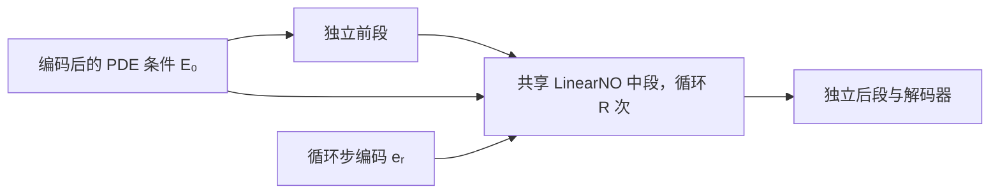

> From: https://chatgpt.com/c/6aabd59a-e5e8-83ec-acf9-69e9d2c9c26f

# you asked

message time: 2026-09-17 20:00:45

第一个附件是我和你进行的一次聊天记录，后面的三个附件是在这个聊天记录中你为我生成的三个文件，现在你要仔细阅读这份聊天记录（从头至尾一字不落），并阅读其中涉及的论文，文献和各种相关知识，同时阅读后面三个文件，最关键的是通过阅读这个聊天记录了解我和你的交互历史并知道这个对话的路基和目的，以及我最新的想法，搞懂我现在在做什么，我还会与你顺着这个对话的内容继续讨论下去，请做好准备

---

# chatgpt response

我会先把四个附件逐字读取并建立“对话脉络—研究目标—三套方案—最新想法”的对应关系，再核查聊天中提到的论文与关键知识点。由于这项任务核心是延续既有讨论，我会使用“个人上下文”技能来确保不丢失此前的决策与偏好；附件本身会直接从你提供的副本读取。

四个文件合计约 114 万字节，其中聊天记录约 2.8 万行。现在我正在并行做两层核读：一层按时间线复原你们的每次决策变化，另一层单独审阅三份实施提示词并抽取全部论文/方法名，避免只看摘要而错过后期改意或相互矛盾。

目前已经确认：这不是单一路线，而是连续演化出的多个研究分支。早期主线是 CDLNO（LRSA 前段＋persistent latent＋CDPA），随后有 KCDNO（用核化全历史读取替代 LRSA 的层内 SA），再到 MSAR-LNO（MoNo 式多尺度 latent 编解码＋成对 AttnRes skip）；而聊天最后又明确开启了一个应与旧路线隔离的新方向——以 LinearNO 为基座，研究“互补压缩＋跨深度复用＋减少 block 数”。我正在核对这些分支之间哪些是最终决定、哪些只是曾讨论后放弃的候选。

我已把“最新状态”与三份旧提示词分开了：三份文件分别是三个应继续保留的独立模型分支，但都不是当前最新 LinearNO 方向的实施规格。现在剩下的是文献原文交叉核验，重点检查哪些结论来自论文、哪些只是我们提出的候选设计，以及哪些表述不能在后续论文中说得过强。

我已经把主聊天完整时间线和四条模型路线对齐了。现在正在做最后一轮原论文核验，重点清理几处容易混淆的结论：LinearNO 的“去注意力”不能外推为 LRSA 的潜变量注意力必然冗余，历史摘要复用也只能作为新假设而非既有论文结论。

已经准备好。四个附件都已完整逐行读完：首份聊天记录共 27,994 行，后三份分阶段实施文件也已全文核对。未修改任何文件。

我还针对关键公式、架构、消融与发表状态，交叉核验了 [Transolver](https://proceedings.mlr.press/v235/wu24r.html)、[LinearNO](https://ojs.aaai.org/index.php/AAAI/article/view/37003)、[LRSA](https://arxiv.org/abs/2604.03582)、[Latent LNO](https://proceedings.neurips.cc/paper/2024/hash/39f6d5c2e310a5a629dcfc4d517aa0d1-Abstract-Conference.html)、[IPOT](https://ojs.aaai.org/index.php/AAAI/article/view/27766)、[FLARE](https://arxiv.org/abs/2508.12594)、[MoNo](https://arxiv.org/abs/2608.09764) 和 [Attention Residuals](https://arxiv.org/abs/2603.15031) 等原文及官方资料。

我对路线状态的理解如下：

| 路线 | 当前状态 |
|---|---|
| Gram/投影校正 | 你已明确“暂时放弃”，不应再作为当前方案的一部分 |
| CDLNO | 已形成结构、提示词和部分实验/消融，是重要历史路线，但不是最新方向 |
| KCDNO | 已形成全历史核读取方案和 K0–K10 提示词；是否全部实施完毕仍应以实际仓库为准 |
| MSAR-LNO | 已形成完整多尺度实施提示词；没有正式宣布放弃，但已不是当前主线，也没有证据表明阶段任务已实际执行 |
| 新 LinearNO 方向 | 当前真正的研究主线；尚未定名、定稿、生成第四份提示词或完成实验 |

你目前真正想研究的是：

> 深层 LinearNO 的多次压缩是否在学习多个互补的输入相关低秩视图；如果显式保存并复用这些视图，同时避免各层压缩核塌缩为近似重复，能否用更少的 LinearNO block 达到或超过深层基线，并取得精度—参数—计算的 Pareto 改善？

目前首选结构是保存每层的原始摘要

$$
C_\ell=K_\ell^\top V_\ell,
$$

让当前 $C_\ell$ 分别 cross-attend 每个历史 $C_i$，先完成历史内部 token 对齐，再在历史来源轴上竞争融合，随后

$$
\widehat C_\ell=C_\ell+\gamma_\ell H_\ell,\qquad
Y_\ell=Q_\ell\widehat C_\ell ,
$$

其中 $\gamma_\ell=0$ 初始化；历史库保存原始 $C_i$，而不是递归保存已经融合的 $\widehat C_i$。首版应保持固定 reconstruction rank，把多基底增秩留作第二阶段。

我也会持续遵守这些关键边界：

- LinearNO 删除 Transolver 的 slice-token self-attention，并不意味着 LRSA 的 latent SA 普遍冗余；LRSA 的消融反而显示用 MLP 替换 latent processing 会恶化其若干任务。
- AttnRes、DenseFormer 和线性注意力只分别提供“跨深度选择”与“$K^\top V$ 摘要”的组件级先例；完整的历史摘要方案仍是需要自行验证的新组合。
- $P_\ell=Q_\ell K_\ell^\top$ 的相似度应先作为诊断；只有确认层间塌缩后，才考虑 margin diversity，不能默认强制正交，因为共享的主导 PDE 模态可能有用。
- 不能仅凭参数减少宣称加速；必须分别满足参数和 FLOPs 预算，并实测 latency、显存和训练时间。
- 核心消融至少应包含浅层 LinearNO、`+Div`、`+Hist`、`+Div+Hist`，再配合等参数加宽、大 rank 和 MLP placebo。
- 三份现有提示词是三条历史路线的实施规范，不是最新 LinearNO 方案的实现说明。

目前仍未最终决定的是 5 还是 6 个 block、每头摘要如何打包、source gating 粒度、history bottleneck、diversity 是否默认启用、模型名称，以及是否正式继续使用现有 Transolver 派生仓库。

你接下来可以直接沿着原对话继续，不需要重新介绍背景；除非你明确切回旧路线，我会默认以上述最新 LinearNO 研究方向为当前上下文。

---

# you asked

message time: 2026-09-17 20:23:31

除了上面第一个附件中的内容，其实我和你的交互还有依次。我现在把它补充上：我的问题是：好的现在补充一个问题由你来回答，这个问题的关键是要指导codex参考linearNO的论文和官方仓库在transolver的官方仓库上改出完整的linearno的模型（要保证可以与论文和官方仓库（两者配合起来看）的内容吻合，可以用来在transolver已有的bench中（应该也是linearno使用的bench）复现出论文的结果），注意我实际使用的仓库是
hxh5159/Transolver.git这个仓库是我克隆下来官方仓库后进行了修改（只是增添了可视化保存模型检查点等不影响模型本身的逻辑，模型本身完全没有修改），因为有些其他复杂原因，所以 你应指导codex了解整个代码仓库后再进行修改，一定保证可以按照论文和官方代码仓库的实现复现出原论文的配置，现在给出提示词，你的回答是：附件（就是这个聊天中的附件），把这个对话也考虑进去，完成这个后就准备和我开展关于改造linearno模型在transolver使用的Bench（实际上linearno也使用了，linearno多出的burgers数据集不考虑在内）上刷sota的目的b

---

# chatgpt response

我会把这段补充视为原聊天记录之后的正式续篇。先完整读取新的 LinearNO 分阶段提示词，再把它与此前“新 LinearNO 方向”的状态合并；这次只更新共同上下文，不修改附件。由于你是在补齐既有交互历史，我会按连续对话规则核对哪些内容已经从“未决定”变成了正式决定。

新增附件已经确认不是简单的“实现 LinearNO”说明，而是一份带固定提交、任务专属变体、论文—代码冲突处理、回归保护和 L0–L10 验收门槛的严格移植规范。我正在补读刚才输出中被截断的后半部分，重点确认 AirfRANS、ShapeNet、全任务复现以及最终验收条件。

已经补全。我完整读完了新增的 439 行提示词，并将它正式接在前一份聊天记录之后。它修正了我上一条总结中的几个“未确认”状态：

| 事项 | 补充后的确定状态 |
|---|---|
| 工程基座 | 已确定为 `hxh5159/Transolver.git` |
| 第四份实施提示词 | 已存在，即此次附件 |
| 基准任务 | 六个 Standard PDE + AirfRANS + ShapeNet-Car，共八个；不考虑 Burgers |
| 第一阶段目标 | 先移植并验证忠实的纯 LinearNO，禁止混入任何新研究机制 |
| 最终目标 | 在可靠复现基线上改造 LinearNO，并在上述八个 benchmark 上冲击可信的 SOTA/Pareto 改善 |

我已经理解这份文件的核心不是“复制一个 LinearAttention 模块”，而是：

- 固定对照 `hxh5159/Transolver@66bc489`、官方 Transolver `75e0f676`、官方 LinearNO `3f2b80df` 和论文 v3。
- 按决策域区分论文真值、官方任务源码真值和你仓库的数据、checkpoint、可视化及评估真值。
- 严格实现
  $$
  Q=\operatorname{softmax}_M(XW_Q),\quad
  K=\operatorname{softmax}_N(XW_K),\quad
  C=K^\top V,\quad Y=QC,
  $$
  同时保留跨 head 共享的小投影、完整八层 block、初始化和任务专属差异。
- Standard 的 `plain/temp/conv/conv_temp`、AirfRANS 和 ShapeNet-Car 不是一套统一近似实现；它们在实际 $M$、温度、输入输出投影、位置特征和 checkpoint 键上均有差异。
- 明确区分 `official_release`、`paper_table8_on_release_model` 和公平比较用的 `transolver_matched`，尤其不能混淆两个工业任务中论文指标与发布代码实际 loss/metric。
- 通过 L0–L10 逐阶段完成仓库审计、回归夹具、数学原语、全模型 parity、八任务接入、checkpoint 转换、综合测试和独立终审。
- “实现一致”“真实数据一批通过”“短程训练成功”和“完整多 seed 论文结果复现”必须分别陈述。

后续我会把工作严格分成两层：

1. **可信基线层**：完全按照这份 L0–L10 规范，把纯 LinearNO 在 `hxh5159/Transolver` 中实现并复现；不加入历史摘要、diversity、CDPA、KCDNO 或浅层替代。
2. **研究改造层**：基线确认后，再讨论并实现“互补压缩 + $K^\top V$ 历史复用 + 减少 block 数”的新 LinearNO，围绕八个共同 benchmark 做公平的精度、参数、FLOPs、显存和实际延迟比较。

这份附件目前是实施规范，不是实施完成报告；在你提供 Codex 的阶段报告或仓库状态前，我不会假定 L0–L10 已经执行。

现在上下文已经完整。接下来你可以直接和我讨论如何改造 LinearNO、如何设计理论与消融、怎样控制参数和计算预算，以及如何在排除 Burgers 的八个 benchmark 上建立可信的 SOTA 证据链。

---

# you asked

message time: 2026-09-17 20:51:25

好的，在以前的聊天记录中你提出了多种改进思路，但我打算只保留几种（注意这次对话我跟你说这些知识想高秩你我打算保留哪些改造，提出哪些改造，以及保留或剔除的理由，并让你判断一下合理性（理由的合理性要客观的判断，批判性的看（批判是为了下一步能不能进一步优化保留的改动）），词词聊天无需详细说明每种改造如何把进行，如何实现，有何具体的原理，但当然在判断合理性时应当根据具体的原理做判断，但只是做判断不是条分缕析）：首先是方向一中的方案A：固定宽度的跨层低秩摘要融合，这个方案我打算保留，理由是：这种方式不要求不同深度latent token的对齐，且由于通过softmax的方式可以选择性的接受不同层的信息，可以在训练过程中学会保留对自己有意义的信息；“方案 B：多基底重建——真正保留多层压缩方式”不保留，不如直接增秩更为直接，增秩是器直接替代，效果可能不会理想，还会被审稿人质疑为什么不直接增秩；方案 C：Block 历史摘要  不保留，目前我只打算在blocj数在4到8之间进行实验，这种分块没必要（而且4到8个block分块后可能计算量也不会显著减小）；方向二中的2. 有余量的传播核多样性损失  不考虑，对于有的方程可能就是需要类似的核的反复处理（但这里有一点，我依然打算按你我聊天记录中你给我提供的思路，就是记录核相似度，并打算把这部分写进内容中，因为我认为这一部分与前面attenres也是有关系的，因为可以借此说明，在不同的训练阶段，在不同的数据集上不同深度的核有不同的相似度，同过attenres的跨层机制（注意这里说的attenres指的都是前面的方向一中的方案A，所以虽然借鉴了attenres但不是就指的是kimi k3的attenres本身）可以实现有选择性的把不同核联系起来，这样可以可学习的，可训练的增强或减弱核之间的相似性以适用于不同的数据集）；“3. 多温度压缩：让层关注不同空间尺度  ”不考虑（不解释，这个直接不考虑）；4. 不同层使用不同 rank 或不同粒度  不考虑（不解释，直接不考虑）；5. 历史 dropout   考虑，但你可以给我解释一下这个具体你打算怎么实现吗；它不能直接保证每层压缩不同，但能避免：

- 所有后层始终只读取某一个强历史；
- 某些层长期没有梯度；
- 跨层模块退化成固定跳跃连接。

这是低成本、无推理开销的辅助措施。

---

## 6. “创新摘要”——更强但风险更高  不考虑，风险高

---

# you asked

message time: 2026-09-17 20:52:54

好的，在以前的聊天记录中你提出了多种改进思路，但我打算只保留几种（注意这次对话我跟你说这些知识想高秩你我打算保留哪些改造，提出哪些改造，以及保留或剔除的理由，并让你判断一下合理性（理由的合理性要客观的判断，批判性的看（批判是为了下一步能不能进一步优化保留的改动）），词词聊天无需详细说明每种改造如何把进行，如何实现，有何具体的原理，但当然在判断合理性时应当根据具体的原理做判断，但只是做判断不是条分缕析）：首先是方向一中的方案A：固定宽度的跨层低秩摘要融合，这个方案我打算保留，理由是：这种方式不要求不同深度latent token的对齐，且由于通过softmax的方式可以选择性的接受不同层的信息，可以在训练过程中学会保留对自己有意义的信息；“方案 B：多基底重建——真正保留多层压缩方式”不保留，不如直接增秩更为直接，增秩是器直接替代，效果可能不会理想，还会被审稿人质疑为什么不直接增秩；方案 C：Block 历史摘要  不保留，目前我只打算在blocj数在4到8之间进行实验，这种分块没必要（而且4到8个block分块后可能计算量也不会显著减小）；方向二中的2. 有余量的传播核多样性损失  不考虑，对于有的方程可能就是需要类似的核的反复处理（但这里有一点，我依然打算按你我聊天记录中你给我提供的思路，就是记录核相似度，并打算把这部分写进内容中，因为我认为这一部分与前面attenres也是有关系的，因为可以借此说明，在不同的训练阶段，在不同的数据集上不同深度的核有不同的相似度，同过attenres的跨层机制（注意这里说的attenres指的都是前面的方向一中的方案A，所以虽然借鉴了attenres但不是就指的是kimi k3的attenres本身）可以实现有选择性的把不同核联系起来，这样可以可学习的，可训练的增强或减弱核之间的相似性以适用于不同的数据集）；“3. 多温度压缩：让层关注不同空间尺度  ”不考虑（不解释，这个直接不考虑）；4. 不同层使用不同 rank 或不同粒度  不考虑（不解释，直接不考虑）；5. 历史 dropout   考虑（是考虑于前面的不一样，不是直接保留也不是一定剔除），但你可以给我解释一下这个具体是什么意思吗 ，6 “创新摘要”  不啊空滤风险大

---

# chatgpt response

我会把这次内容当作对“候选改造集合”的正式收缩，而不是重新扩展方案。判断时我会重点检查三件事：保留理由是否在机制上成立、是否会被实验反驳、以及保留后的论文叙事是否仍然干净；唯一展开到实现层面的部分只会是你询问的 history dropout。由于这会更新我们先前的方案状态，我也会按连续对话规则核对既有定义。

目前判断里有一个需要特别收紧的概念：方案 A 实际融合的是历史摘要 $C_i=K_i^\top V_i$，不是直接融合传播核 $P_i=Q_iK_i^\top$。因此核相似度非常适合做诊断，但“跨层模块直接增强或减弱核相似性”这个说法偏强；更准确的是，它选择性复用由不同传播核产生的信息，并可能通过后续隐藏状态间接改变后层核。这个区分会直接影响论文表述是否经得住审稿。

总体判断：你的取舍是合理的，而且能把研究收缩成一个更清楚、可证伪的主问题。建议最终归纳为：

> 一个核心改造：固定宽度跨层摘要融合；  
> 一个分析工具：传播核相似度诊断；  
> 一个候选辅助正则：history dropout。

其余机制暂时剔除。

| 改造 | 判断 | 需要修正或收紧的地方 |
|---|---|---|
| 方案 A：固定宽度跨层低秩摘要融合 | 强烈赞成保留 | 不要求“同编号槽位语义一致”是对的，但 cross-attention 本身仍在学习软对齐，并非完全不需要对齐。softmax 提供选择能力，但不保证选择一定有益，也可能塌缩到单一历史 |
| 方案 B：多基底重建 | 赞成剔除 | 剔除理由合理，但它与直接增 rank 并不等价。更好的理由是它同时改变有效重建 rank、容量和计算量，会混淆“历史复用”与“容量增加”的贡献；实验中仍应保留大 rank LinearNO 作为强控制组 |
| 方案 C：Block 历史摘要 | 赞成剔除 | 4–8 层时完整历史数量很少。Block AttnRes 主要是为很深网络降低历史存储和通信成本，在这里收益有限且会损失逐层粒度。[AttnRes 原文](https://arxiv.org/abs/2603.15031)也把分块定位为规模化方案 |
| 传播核多样性损失 | 赞成不采用 | 同一或相似的核可能是在不同隐藏状态上反复细化同一 PDE 模式；强制推开反而可能有害。先观测而不施加先验更稳妥 |
| 多温度压缩 | 可以直接剔除 | 但这里仅指“不增加新的逐层多温度机制”。官方 LinearNO 各任务原本具有的 temperature 必须保留，否则不再是忠实基线 |
| 不同层使用不同 rank | 可以直接剔除 | 指不增加“逐层变化的 rank”；不同任务原有的 $M=32/64$ 等配置仍应保留 |
| History dropout | 适合保持“候选”状态 | 成本低，但只有观测到历史路由塌缩或单源依赖时，保留它才有充分理由 |
| 创新摘要 | 赞成剔除 | 它会把问题从“复用 LinearNO 已有摘要”变成“重新设计摘要算子”，风险和归因复杂度都明显增大 |

最重要的概念修正是：

$$
C_\ell=K_\ell^\top V_\ell,\qquad
P_\ell=Q_\ell K_\ell^\top .
$$

方案 A 融合的是内容摘要 $C_\ell$，不是传播核 $P_\ell$，而且历史 $C_i$ 中甚至不包含 $Q_i$。因此不能声称方案 A“直接连接不同传播核”或“直接增强、减弱核相似性”。

更严谨的论文表述应是：

> 模型对不同深度、由不同输入相关传播核产生的低秩内容摘要进行选择性复用；这种信息流改变可能通过端到端训练，间接影响后续层传播核的相似性结构。

所以你保留核相似度分析是有价值的，但它是诊断而不是训练约束。最好同时记录：

- 不同层 $P_\ell$ 的相似度随 epoch 和数据集的变化；
- 历史 source 权重、熵、top-1 来源和有效来源数；
- 有无方案 A 时相似度轨迹是否改变；
- 路由到底偏好相似核产生的摘要，还是互补核产生的摘要。

仅凭核相似度不能证明两个 block 功能冗余，因为即使 $P_i\approx P_j$，它们的 $V$、输入隐藏状态、残差和 FFN 仍可能不同。

### History dropout 的具体含义

它更准确的名字应是“历史源连接 dropout”，不是对 $C_i$ 的元素做普通 dropout，也不是随机删除整个 LinearNO block。

假设第 $\ell$ 层已经从历史 $C_i$ 得到对齐后的读取结果 $R_{\ell\leftarrow i}$，并计算历史来源 logits $a_{\ell i}$。训练时随机屏蔽部分完整历史来源：

$$
\alpha_{\ell i}
=\operatorname{MaskedSoftmax}_i(a_{\ell i},m_{\ell i}),
\qquad
H_\ell=\sum_{i<\ell}\alpha_{\ell i}R_{\ell\leftarrow i}.
$$

具体原则是：

- mask 放在来源 softmax 之前；
- 一旦历史 $i$ 被屏蔽，该连接的所有 rank slots 和 heads 一起屏蔽，避免模型绕过；
- 当前摘要 $C_\ell$ 和基础 LinearNO 残差路径永远不丢；
- 如果某次所有历史都被屏蔽，直接令 $H_\ell=0$，该层暂时退化为普通 LinearNO；
- 推理时关闭 dropout，开放全部历史，因此没有额外推理开销；
- softmax 会对剩余来源重新归一化，不需要乘 $1/(1-p)$。

对 4–8 层模型，建议先只试：

$$
p\in\{0,\;0.1,\;0.2\},
$$

以 $p=0.1$ 为候选，不建议直接使用较大的概率。如果 $\gamma_\ell=0$ 初始化，可先短暂不使用 dropout，待历史支路开始获得梯度后再升到目标概率。

它能够降低模型永久依赖某个强历史源的风险，并给其他连接更多获得路由权重和梯度的机会；但它不能保证各层压缩不同、不能保证核相似度下降，也不能保证每个历史都会被使用。若原本没有路由塌缩，或者加入后没有稳定提升泛化，就应删除它。训练期结构化丢弃已有 [Stochastic Depth](https://arxiv.org/abs/1603.09382) 和 [LayerDrop](https://arxiv.org/abs/1909.11556) 等先例，但这里的“历史来源边 dropout”仍是针对本架构的具体设计。

因此，我建议把当前正式方案定为：**方案 A 是唯一核心创新；核相似度只做无约束诊断；history dropout 暂列可关闭消融，是否进入最终模型由路由塌缩证据决定。**

---

# you asked

message time: 2026-09-17 21:21:02

还有一个我觉得可以考虑的改进是关于attenres的原有形式，它原本是用于下一层的输入，这里我想把的是可不可以直接照搬attenres形成区别于方案一的第二个残差通路（也就是新模型有两个残差通路），你先试着按我说的意思涉及第二个残差（这个于attenres更为接近，不是像方向一的方案一一样作用在latent space上），注意你的涉及要充分考虑linearno的论文和linearno的官方仓库，注意要结合kimi k3的attenres和linearno的本来架构，一定要有合理性（先专注于涉及这个残差，不用考虑它于第一种残差是否配合，不过可以在涉及之后补充思考两个参擦是否可以很好的配合），并要从刷sota的角度设计出理论上，经验上有可能提高性能的残差，好了开始分析并设计吧

---

# chatgpt response

我会先把它当作一条独立于方案 A 的“点域深度残差通路”来设计：它不读取 $K^\top V$ 摘要，而是直接重构 LinearNO 各 block 的输入来源。分析会先确定官方 LinearNO 每个 attention/FFN 子层的真实残差边界，再对照原始 AttnRes 与 Kimi K3 的 Block AttnRes，最后给出一个能够严格退化回原 LinearNO、且适合 4–8 层而非照搬大模型分块的版本；两个通路如何共存只放在最后讨论。由于这是对既有方案的继续收敛，我会按连续对话规则维护此前所有决定。

目前最关键的设计结论已经出现：不能简单写成“原 LinearNO 隐藏状态 + 一个 AttnRes 加权平均”，因为原始 AttnRes本来是替换固定残差累积；直接并联会重复注入 embedding 和历史更新，并改变随深度增长的尺度。更合理的第二通路必须做成“对原残差累积的选择性校正”，同时在初始化时严格等价于官方 LinearNO，而且新路由参数从第一步就能获得梯度。

可以，而且它与方案 A 的作用位置确实不同，有资格成为第二条独立研究方向。但必须先纠正一个概念：

> 原始 AttnRes 是用深度 softmax 聚合“替换”普通残差累积，并不是在普通残差旁边再加一条路径。

因此，如果保留 LinearNO 原残差，再增加 AttnRes，就不能称为逐字照搬；更合理的定义是“AttnRes 派生的点域并行深度残差”。直接写成 $X+\gamma R_{\text{hist}}$ 会重复注入历史并改变激活尺度，不适合作为主方案。

## 推荐设计：中心化点域 AttnRes

官方 LinearNO 的完整 block 保持不变：

$$
A_\ell=
\operatorname{LinearAttn}_\ell
\bigl(\operatorname{LN}_{1,\ell}(X_\ell)\bigr),
$$

$$
Z_\ell=X_\ell+A_\ell,
\qquad
F_\ell=
\operatorname{FFN}_\ell
\bigl(\operatorname{LN}_{2,\ell}(Z_\ell)\bigr),
$$

$$
B_{\ell+1}=Z_\ell+F_\ell .
$$

其中 `LinearAttn` 内部的 Q/K 归一化方向、$M$、temperature、卷积投影和任务专属变体全部保持官方实现，不在这里改动。[LinearNO 论文](https://arxiv.org/abs/2511.06294)、[固定版本官方仓库](https://github.com/HiPRL/LinearNO/tree/3f2b80df13c17a09e250f2ebe4d4ecdfd4acf269)

定义这一完整 block 新产生的点域更新：

$$
U_\ell=B_{\ell+1}-X_\ell=A_\ell+F_\ell .
$$

历史池保存：

$$
V_0=E,\qquad V_{i+1}=U_i ,
$$

其中 $E$ 是 preprocess、位置及可选时间嵌入之后的初始点特征。不要保存累计隐藏状态 $X_i$，因为它们共享大量早期内容，混合时会把早层信息重复计算；原始 AttnRes 保存的也是 embedding 和各子层的 residual increment $f_i(h_i)$，而不是 post-residual hidden state。[AttnRes 论文](https://arxiv.org/pdf/2603.15031)

对每个样本、每个物理点分别沿深度来源轴计算：

$$
s_{\ell i}^{(b,n)}
=
w_\ell^\top
\operatorname{RMSNorm}_\ell
\bigl(V_i^{(b,n)}\bigr),
$$

$$
\alpha_{\ell i}^{(b,n)}
=
\operatorname{softmax}_{i}
\left(s_{\ell i}^{(b,n)}\right),
\qquad
R_\ell=\sum_i\alpha_{\ell i}V_i .
$$

再定义均匀历史：

$$
\bar V_\ell=\frac{1}{m_\ell}\sum_iV_i ,
$$

第二条残差通路为：

$$
\boxed{
X_{\ell+1}
=
B_{\ell+1}
+
g_\ell\left(R_\ell-\bar V_\ell\right)
}
$$

其中：

- $B_{\ell+1}$ 是官方 LinearNO 原残差主路；
- $g_\ell(R_\ell-\bar V_\ell)$ 是新的跨深度点域残差；
- $w_\ell$ 是每个接收位置一个 $d$ 维伪查询；
- $w_\ell=0$ 初始化；
- $g_\ell$ 是非负的层级标量，建议初值为 1，并限制上界，例如不超过历史来源数 $m_\ell$；
- RMSNorm 只用于计算来源分数，真正相加的 value 仍是原始 $V_i$；
- 使用单头深度路由，不按 LinearNO 的 attention heads 再拆分；
- 不增加 $W_V/W_O$，也不从当前状态生成 $d\times d$ 动态 query。

最后一个 block 后同样执行这次点域历史校正，然后再进入官方的最终 LayerNorm 和输出 head。这与 Kimi K3 在最终输出前仍做一次历史读取的结构一致。[Kimi K3](https://arxiv.org/html/2607.24653)、[AttnRes 官方说明](https://github.com/MoonshotAI/Attention-Residuals)

## 为什么必须减去均匀历史

当 $w_\ell=0$ 时：

$$
\alpha_{\ell i}=\frac1{m_\ell},
\qquad
R_\ell=\bar V_\ell,
$$

所以新增残差严格为零：

$$
X_{\ell+1}=B_{\ell+1}.
$$

也就是说，新模型在初始化时逐张量等于同深度官方 LinearNO；原有参数的初始梯度也保持一致。

同时，因为 $g_\ell\neq0$，$w_\ell$ 通常从第一次反向传播就能获得梯度。它比“$\gamma=0$ 的普通历史分支”更好：后者虽然保持基线，却会让整个路由器第一步没有梯度。

此外，

$$
R_\ell-\bar V_\ell
$$

表示“内容相关选择相对于均匀残差累积的偏移”，因此新通路主要重新分配不同历史更新的贡献，而不是简单增加总激活量。这比直接使用

$$
B_{\ell+1}+g_\ell R_\ell
$$

更稳定，也更容易向审稿人解释。

## 为什么它可能提高 PDE 性能

它的潜在价值不应主要表述为“解决深层 PreNorm 稀释”，因为 LinearNO 只有 4–8 个 block，比 Kimi 的网络浅得多。更适合当前问题的解释是：

1. **每个物理点可以选择不同的有效深度。**  
   边界点、几何表面、尾流区域和光滑内部区域可能需要不同阶段的特征；这里的 source softmax 是逐点计算的。

2. **直接恢复历史 block 更新。**  
   后层不必只从已经混合成一个 $X_\ell$ 的累计状态中恢复早期几何、边界或高频信息。

3. **它发生在下一次压缩之前。**  
   新的 $X_{\ell+1}$ 会直接影响下一层的 $Q_{\ell+1},K_{\ell+1},V_{\ell+1}$，因而可能改变后续传播核。相比方案 A，它对传播核形成过程的影响更直接。

4. **不增加 LinearNO 的空间 rank。**  
   每层的 $M$ 和 $K^\top V$ 结构不变，因此提升不能简单归因于增 rank。

5. **函数类包含基线。**  
   $w_\ell=0$ 时模型就是官方 LinearNO，所以基线是新模型参数空间中的一个严格子情形。但这只是表达能力结论，不能保证训练和泛化一定更好。

## 与原始 AttnRes 的粒度关系

原始 AttnRes 把 attention 和 MLP 各视为一个独立 layer；Kimi K3 也分别在 attention、MLP 和最终输出前做路由。因此有两个版本：

| 版本 | 历史来源 | 判断 |
|---|---|---|
| Block 级中心化 Point-AttnRes | $E,U_1,\ldots,U_\ell$ | 推荐作为首版和论文主版本；保持完整 LinearNO block，成本和归因更干净 |
| Sublayer 级 Full Point-AttnRes | $E,A_1,F_1,A_2,F_2,\ldots$ | 更接近 Kimi 原始形式，可能更强，但历史数量、显存和计算约增加一倍，适合作为性能上界消融 |

虽然第二种更“原汁原味”，我仍建议先以 block 级为主模型。它已经保留了 AttnRes 最关键的四点：残差增量作为 value、RMSNorm key、单伪查询、逐点 source-softmax。逐 attention/FFN 路由同时混入了“改善 LinearNO 压缩输入”和“改善普通 FFN 输入”两个假设，论文归因会更复杂。

Kimi K3 使用 Block AttnRes 是为了几十上百层时降低存储和通信；你这里只有 4–8 个 block，因此这里不再对历史层分组，直接读取全部 block 更新即可。

## 成本与主要风险

新增参数很少，每层大致只有 query、RMSNorm gain 和一个 gate：

$$
\Delta P\approx L(2d+1).
$$

当 $L=8,d=256$ 时只有约四千个参数。

但计算和显存不能说“几乎没有开销”：

$$
\Delta\mathrm{FLOPs}=O(BNdL^2),\qquad
\Delta\mathrm{Memory}=O(BNdL).
$$

它仍然关于 $N$ 线性，不会产生 $N\times N$ attention；不过在 AirfRANS 的 $N\approx32\,000,d=256,L=8$ 下，9 份点域历史仅数值本身就约占：

- FP32：约 0.28 GB；
- BF16/FP16：约 0.14 GB。

Sublayer 级版本接近 17 份历史，成本约再翻倍。因此这条路线可能提高精度，却比 latent 方案 A 更容易损害显存和 latency；如果用 4–6 层的新模型超过 8 层 LinearNO，才有更强的整体价值。

其他风险包括：

- 路由始终选择当前或某个固定早层，形成 attention sink；
- 历史更新本身高度相似，softmax 接近均匀；
- 新通路绕过必要的逐层 PDE 迭代；
- 小数据任务上增加跨层捷径后过拟合；
- Kimi 的经验来自语言模型，不能直接当作 PDE 有效性的证据。

因此需要记录 source entropy、有效来源数、top-1 历史、不同空间区域的路由图、第二通路相对主路的范数，以及它们与传播核相似度的关系。

## 与方案 A 的关系

两者在结构上可能互补：

1. 点域 AttnRes 形成下一层输入；
2. 当前 LinearNO 由此生成 $Q_\ell,K_\ell,V_\ell$；
3. 方案 A 在 $C_\ell=K_\ell^\top V_\ell$ 上融合历史低秩摘要；
4. 当前 $Q_\ell$ 完成重建；
5. block 更新进入点域历史池。

因此：

- 新通路是“压缩前/重建后的点域深度复用”；
- 方案 A 是“压缩后的低秩摘要复用”。

它们可以协同，但也可能是两种重复的跨深度捷径。最终必须采用

$$
\text{Base},\quad +A,\quad
+\text{Point-AttnRes},\quad +A+\text{Point-AttnRes}
$$

的四格实验，不能预设组合一定最好。

我的最终判断是：**这个方向值得保留为第二个独立候选，而且在机制上比方案 A 更接近原始 AttnRes；首版应采用“全 block 历史、逐点 softmax、增量 value、中心化校正、零查询初始化”的 block 级设计。**它具有明确的基线退化性质和提升潜力，但由于网络较浅、点域历史成本较高，我对它的先验信心低于方案 A，应先单独验证，再决定是否与方案 A 合并。

---

# you asked

message time: 2026-09-17 22:08:00

你现在考虑这样一个问题：你可以先仔细了解transolver的设计和linearno的设计，我的目的是在linearno的基础上刷sota，我希望主要从两方面进行考虑：一方面是在跨block的计算上，另一方面是在每个block的压缩重建上，从这两方面考虑（注意之前像每层使用不同的秩，每层softmax使用不同的温度这些纯调整超参数的设计不要再考虑了，这样只靠超参调整的改动超参数搜索空间大还不适合处理不同的数据集），因为我不希望只是再linearno的基础上增加参数刷sota，所以我希望如果新的模型可以在更少的block上计算就更好了（即小于8个block，你也可以考虑一下为什么transolver和linearno默认从8个block起而都没有考虑更少的block），先不要沙鸥到之前我引导你进行的回答和我之前思路的影响（限于本次对话）考虑下从我这次说的两个方面你会考虑怎样的改动，充分思考，然后进行设计并分析设计的合理性和风险

---

# chatgpt response

我会按这次提出的两个方向重新推导：跨 block 如何传递和复用信息，以及单个 block 如何压缩与重建。先核对两篇论文、官方实现和深度消融，再筛选适合少于 8 个 block、无需扩大超参数搜索空间的结构改动；此前的候选方案不作为这次设计的前提。

目前核对到两个关键点：8 个 block 是论文实验采用的配置，并非架构下限；Transolver 的深度实验从 8 层向上增加，没有证明 8 层优于 4 或 6 层。另一个值得利用的结构特点是：LinearNO 在同一个 block 内，重建权重不会直接读取刚压缩得到的全局摘要。我正在评估，能否通过改变这一步的信息流，以及复用前一层的计算结果，让较浅模型完成更充分的处理。

候选方案已收敛为两个：跨 block 用一个轻量门控复用前一步更新；block 内让刚生成的全局摘要参与重建权重的计算。两者都能从原始浅层 LinearNO 的行为开始训练。也有两个明确风险：前一步更新可能不适合下一层，内容反馈也无法找回压缩时已经丢失的信息，因此不能把它们直接等同于“少层替代多层”。

重新从这次的目标出发，我会优先研究两个改动：

- **跨 block：让当前 block 自适应复用前一步的更新，形成轻量的两步递推。**
- **block 内：让压缩得到的全局摘要，直接参与本 block 的重建权重计算。**

前者争取减少重复计算，后者提高单个 block 的处理能力。**我更看好第二项直接改善精度，第一项则适合检验能否进一步减少深度。**以下是结构设计与研究假设，目前没有实验依据保证它们能超过八层 LinearNO。

**先说八个 block 的来源。**核对论文后，这一点比“作者为什么没有使用更少层”更明确：Transolver 正文明确将八层归因于公平比较，使参数规模与其他 Transformer 算子接近；它的深度扩展实验覆盖的是 8—40 层。LinearNO 沿用了 Transolver 的实验设置，配置表也统一使用八层，但没有报告深度消融。因此，公开结果并没有证明八层是最优深度，也不能据此断言作者私下没尝试过更浅模型。[Transolver 论文](https://arxiv.org/html/2402.02366v2)、[LinearNO 论文](https://arxiv.org/html/2511.06294v3)

所以，你提出的四层、六层方向值得研究。不过，首先需要确认：**原版四层、六层 LinearNO 到底比八层差多少，甚至是否已经能够持平。**否则，最终无法区分收益来自新结构，还是单纯减少深度带来的正则化效果。

**理解两种架构后，我认为应该针对“每次计算做得是否充分”进行改造。**

Transolver 使用相关联的切片与重建权重，中间进行 latent self-attention；LinearNO 将压缩与重建投影解耦，并去掉这部分 latent self-attention。省略 batch 和 head 维度，LinearNO 的核心是：

$$
Q=\operatorname{softmax}_{M}(L_Q),\qquad
K=\operatorname{softmax}_{N}(L_K),
$$

$$
C=K^\top V,\qquad Y=QC.
$$

其中，$C$ 是压缩摘要。实际 block 还包括输入投影、输出投影、LayerNorm、FFN 和残差；官方不同任务使用的卷积与输出投影形式也不同。[LinearNO 官方实现](https://github.com/HiPRL/LinearNO/blob/3f2b80df13c17a09e250f2ebe4d4ecdfd4acf269/Standard_PDE_Benchmark/model/LinearAttnNeuralOperator.py)

这里有两个重要判断：

1. **单个 block 已经可以进行全局信息混合。**增加深度的价值主要在于连续的非线性处理、重算压缩与重建关系，以及进一步提取特征，不能简单解释成“需要八层才能传播到远处”。
2. **$Q$ 没有直接读取本 block 刚生成的 $C$。**前层当然可能已经把全局信息带入当前特征，但本轮新摘要的内容，还没有直接参与本轮读取权重的决定。

这分别对应下面两个改动。

**跨 block，我会首先尝试“门控两步更新”。**

把一个完整 LinearNO block 对隐藏特征的更新记为：

$$
U_l=\mathcal B_l(X_l)-X_l.
$$

这里的 $\mathcal B_l$ 包括注意力与 FFN 两个残差子层，均定义在最终预测头之前。原模型就是：

$$
X_{l+1}=X_l+U_l.
$$

新模型额外保存上一轮的实际更新：

$$
D_{l-1}=X_l-X_{l-1},
$$

然后计算：

$$
\boxed{
X_{l+1}=X_l+U_l+\beta_l\odot D_{l-1}
}
$$

其中，$\beta_l$ 是**每个空间点一个标量、沿通道广播的可学习门控**。

我倾向于让门控读取两个低成本量：当前更新与上一更新的归一化相似度，以及二者的幅值比例。再通过一个很小的映射和 $\tanh$，得到有正有负的系数。门控初始化为零，第一层没有历史项。

这个设计的目的很具体：

- 前一步更新仍有价值时，当前层可以继续利用它；
- 前一步更新需要部分撤回时，可以学到负系数；
- 前后两步没有可复用关系时，可以将系数压到零。

**原始残差连接本来就携带历史。这里的新增能力，是重新调整“上一轮更新”的贡献。**不能把它描述成首次让模型看到前层信息。

它适合你的约束，因为没有增加新的空间注意力，没有多执行一个完整 block，也不需要缓存所有历史层。新增运算主要是 $O(Nd)$，参数可以少到每层几个标量。多步残差结构在视觉网络上有使用较少深度保持性能的研究先例，为这个方向提供了经验支持。[多步残差网络论文](https://proceedings.mlr.press/v80/lu18d.html)

但我对它的预期会比较克制：

- **相邻 block 的更新未必可以沿用。**各层参数独立，前一层可能负责提取特征，后一层可能负责纠正或重新组织特征。
- **历史可能反复放大。**上一轮实际更新已经包含更早的历史贡献；即使 $|\beta_l|<1$，也不代表整个网络稳定。
- **它补不回被删掉的所有非线性变换。**少两个 block，就确实少了两轮 FFN、投影和可能存在的卷积。
- **不能套用优化算法的加速定理。**这里没有同一个目标函数上的梯度下降，也没有已知收缩的固定点迭代。

因此，我把它定位为一个成本很低、值得验证的跨深度结构，而不会先宣称它具有“加速收敛”的理论保证。

**block 内，我更优先尝试“全局摘要反馈重建”。**

压缩仍采用原版：

$$
C=K^\top V.
$$

随后，让每个点根据自身的 value 特征与实际摘要内容，再校正一次重建权重：

$$
S=
\frac{
\operatorname{RMSNorm}(V)
\operatorname{RMSNorm}(C)^\top
}{\sqrt{d_h}},
$$

$$
\boxed{
\widehat Q
=
\operatorname{softmax}_{M}
\left(L_Q+\eta_l S\right),
\qquad
Y=\widehat Q C.
}
$$

这里：

- $L_Q$ 是官方实现进入 softmax 前的 logits，包含原任务变体已有的处理；
- $\eta_l$ 是每个 block 一个可学习系数，从零初始化；
- 归一化只用于计算反馈分数，重建仍使用原始 $C$，保留其幅值；
- $V$ 和 $C$ 处在同一个 value 空间，因此可以直接比较，不必另加几组大的投影矩阵。

这项改动的核心，是让重建过程知道：**“这些摘要在当前样本里实际装了什么。”**

举个与结构直接相关的例子：两个样本在某个点附近具有相同的当前特征，但远处条件不同。原版在这一层可以产生不同的全局摘要 $C$，但该点的 $Q$ 仍然相同。新结构则可以根据不同的摘要内容，改变该点对不同摘要的读取比例。

这就是它对减少 block 有吸引力的原因：**某些依赖本轮全局信息的读取调整，有机会在本轮完成。**原模型可能需要后续层进一步处理，才能形成这样的调整。当然，这不意味着新的一层等价于原来的两层。

它也符合“不靠扩大参数量”的要求：

- 摘要数 $M$ 不变；
- 通道数不变；
- 不增加 latent self-attention；
- 只增加一次点特征与摘要之间的乘法，以及很少的门控参数。

相比只学习温度，这改变了权重所依赖的信息：新增分数随空间点、摘要内容和输入样本共同变化。

它的主要风险也很明确。

**第一，它改善的是摘要的使用方式，不保证摘要本身足够好。**如果压缩已经丢失了任务需要的信息，重建端无法凭空恢复。对固定输入，单头传播矩阵仍然是：

$$
P=\widehat QK^\top,\qquad
\operatorname{rank}(P)\le M.
$$

这个秩结论只针对该空间混合矩阵，不代表整个含残差、FFN 和多头混合的网络都受同一个秩上限约束。

**第二，内容相似不一定等于物理上应该相互作用。**某些 PDE 需要关联状态不同的区域。保留原来的 $L_Q$，可以让模型同时利用原有读取规则和新增的内容反馈，但并不能保证训练总能找到合适的组合。

**第三，反馈可能重新加强聚类偏好。**LinearNO 解耦 $Q/K$ 的价值之一，就是让读取与写入拥有不同的自由度。新反馈通过 $C$ 引入了对 $K$ 的间接依赖，过强时可能让读取过度偏向相似摘要，甚至加重摘要同质化。

**第四，它有真实的运算与串行依赖成本。**需要先生成 $C$，再计算反馈分数；不能仅凭参数少，就称其几乎没有开销。

此外，LRSA 已有让点根据 latent 内容进行重建的设计。因此，“内容参与解码”本身已有先例。这里值得研究的是：保留 LinearNO 的原有读取规则，用很少的新增参数进行内容校正，能否获得更好的浅层性能。[LRSA 论文](https://arxiv.org/html/2604.03582v1)

**把两项放在一起，我会以六个 block 作为首个完整候选。**

两项机制对应不同作用：

| 改动 | 主要作用 | 额外主要运算 |
|---|---|---|
| 门控两步更新 | 调整上一轮计算结果的贡献 | $O(Nd)$ |
| 摘要反馈重建 | 根据本轮摘要内容调整读取关系 | $O(NMd)$ |

它们都可以在新增门控为零时，严格恢复**同深度**的原版 LinearNO。因此能够分别实验，也便于判断组合是否真正互补。

从预算看，这个组合有可行性。我按官方代码中的主要乘加运算估算，内容反馈对单个 block 的新增成本大约为：

| 官方任务配置 | 单 block 新增主要乘加量 |
|---|---:|
| Airfoil、Darcy、Pipe、Plasticity | 约 3.3% |
| Elasticity | 约 8.2% |
| NS、AirfRANS | 约 1.9% |
| ShapeNet-Car | 约 1.6% |

这些是代码解析估算，不是 GPU 实测；未计入新增归一化、门控等低阶运算。比例不高，是因为原版 block 中卷积、通道投影和 FFN 本来就占了大量计算。

据此，六层新模型的 **block 主体**主要乘加量大约是八层原版的 76%—82%，参数量也有望接近六层原版。整模比例还受编码器、预测头影响，真实延迟则必须实测，尤其要考虑新增的串行依赖和中间张量。

**实验上，我会先做一个小而清楚的判断链。**

先比较八层与六层原版，再在六层上比较“只加跨层更新”“只加摘要反馈”“两者同时加入”。只有组合在精度与成本上成立，再进一步检验四层版本。

判断标准应该包括：

- 超过同深度原版，证明结构有贡献；
- 接近或超过八层原版，同时减少参数、计算和实际延迟；
- 多个随机种子下收益稳定；
- 在结构网格、非结构网格和时间递推任务上，没有明显依赖某一类数据；
- 对表现最好的候选，再补一个等计算预算的简单基线，检验收益是否只是来自多做了一次计算。

我当前的优先级是：**先验证摘要反馈重建，再验证两步更新能否进一步降低所需深度。**前者更直接改变单个 block 的信息处理能力；后者成本很低，但能否有效替代部分深度，更依赖相邻层在训练中形成可复用的更新关系。

---

# you asked

message time: 2026-09-17 22:39:40

我觉得你提出的第一个想法有可取之处，但我想问一下，你觉得我可以同时保留之前的attenres式设计吗（这里指的是前面的方向一中的方案一而不是后来又设计的点域attenres）,两者是能相互配合还是会产生冲突，对于你剔除的第二中想法我觉得不合适，这种借鉴lrsa的做法并不一定适配于linearno的架构（lineano中一恒等映射替代了自注意力层，但lrsa中有明确的消融实验就是把咨询胡夷离层小日那个为mlp发现模型性能下降），你还记得在我给你展示的我们两个的聊天记录时你设计了一个验证核相似度的曲线吗，目前我的到的像是：一开始不同块之间的相似度较高，在训练的过程中不同块的相似度之间逐渐下降，（附件中展示了相似度下降的过程，你可以仔细观察，我以后也会给你发一些实验现象，除了听我描述外你更多的要能够自己观察，自己总结，这里具体的解释下这两张图的含义，你要结合之前在附件聊天记录中关于这部分的描述：图里的两条曲线分别是：

1. **Base routing similarity**

$$ P\_{\text{base}} = W D^{-1} W^\top $$

这条线只看点到 slice 的路由结构，不看 slice token 之间的 attention。它回答的问题是：

“不同层是不是把点分配/聚合到类似的物理 slice 上？”

如果这条曲线高，说明不同层的 slice 路由方式比较相似。

2. **Full kernel similarity**

$$ P\_{\text{full}} = W A D^{-1} W^\top $$

这条线同时包含：

- 点到 slice 的路由 $W$
- slice token 之间的 attention $A$
- slice 再映射回点的过程

它回答的问题是：

“不同层最终形成的完整点间传播方式是不是相似？”

这是更重要的指标，因为它更接近 Transolver 这一层真正产生的信息传播结构。

图的含义可以这样读：

- 横轴：训练 epoch。
- 纵轴：跨层平均相似度。
- 每个子图：一个数据集。
- 曲线随训练变化：说明训练过程中，不同层的传播核是在逐渐变得更重复，还是逐渐分化。

如果曲线上升，说明层间传播方式越来越相似，可能出现一定程度的层间冗余。

如果曲线下降，说明训练让不同层学到了更不同的传播结构，层间功能更分化。

如果曲线稳定，说明模型较早形成了固定的跨层组织方式。），在本次对话中你先理解我的意思，然后观察了解这个附件图展示的信息

---

# chatgpt response

我先只做两件事：重新对齐你所说的“前一个 AttnRes”究竟是哪一种设计，并逐点读取图中四个数据集、两条曲线的实际变化。这里涉及我们之前确定的方案边界，我会先调用个人上下文能力核对，避免把它和后来那个点域 AttnRes 混在一起。

我已经确认：你说的旧 AttnRes 是在每层摘要 $C_\ell=K_\ell^\top V_\ell$ 上，对历史摘要先做槽位匹配、再沿“历史来源”做 softmax，最后得到 $\widetilde C_\ell$ 后用当前 $Q_\ell$ 重建；它不是后来作用于点域状态的残差。图像本身也已读取成功。下一步我会把图里的共同规律、数据集差异，以及它究竟支持或不支持哪些结构判断分开说明。

我理解你的意思，而且重新核对了此前记录：这里的 AttnRes 固定指“固定宽度的跨层低秩摘要融合”，即历史对象是

$$
C_i=K_i^\top V_i,
$$

先把不同层未对齐的摘要槽位映射到当前层，再沿历史来源做 softmax 选择；不是后来那个直接作用于点域状态的 AttnRes。

结论先说：**它可以和新提出的门控两步更新同时保留，二者没有结构冲突，也存在互补性；但存在历史信息重复利用和放大的风险，不能预设组合一定优于单独使用。**

### 两种机制如何组合

可以把组合后的数据流写成：

$$
\widetilde C_\ell
=
C_\ell+\gamma_\ell H_\ell,
$$

$$
U_\ell
=
\mathcal B_\ell(X_\ell;\widetilde C_\ell)-X_\ell,
$$

$$
D_\ell
=
U_\ell+\beta_\ell D_{\ell-1},
\qquad
X_{\ell+1}=X_\ell+D_\ell.
$$

其中：

- $H_\ell$：方案A从多个历史摘要中选择并对齐得到的低秩历史信息；
- $\gamma_\ell$：摘要融合门；
- $U_\ell$：当前完整 block 在使用融合摘要后产生的更新；
- $D_{\ell-1}$：前一个 block 的实际点域更新；
- $\beta_\ell$：两步递推门。

二者的作用层面不同：

| 机制 | 读取对象 | 主要作用 |
|---|---|---|
| 固定宽度摘要 AttnRes | 多个历史 $C_i$ | 在低秩空间中选择和组合不同深度的全局摘要 |
| 门控两步更新 | 最近一次 $D_{\ell-1}$ | 在点域复用、延续或抵消上一轮完整更新 |

所以它们具有合理互补性：前者是“跨多层、低秩、内容选择”，后者是“单步历史、完整状态、更新方向复用”。

真正的冲突不是张量或计算流程上的，而是功能上的：

1. $D_{\ell-1}$ 已经包含前一层摘要 AttnRes 的贡献，因此同一历史信息可能从两条路径再次进入当前状态。
2. 如果摘要 AttnRes 的 source-softmax 总是偏向最近一层，同时 $\beta_\ell$ 又长期为正，两条通路可能变成重复强化。
3. 训练后也可能出现 $\gamma_\ell$ 或 $\beta_\ell$ 长期接近零，说明模型认为其中一条路径冗余。
4. 连续正向复用可能放大状态，因为 $D_{\ell-1}$ 本身已包含更早的两步历史。

因此，如果保留两者，我建议明确划分职责：**摘要 AttnRes 仍读取多层历史，门控两步更新只读取最近一步，并保持逐点标量门控；不要再把两步更新扩展成全历史或逐通道大门控。**这时重叠相对最小。

### 关于我此前提出的“内容反馈重建”

你的反驳是成立的，我同意把它从目前主线中剔除。

LRSA 的实际结构是：

$$
\text{压缩}\rightarrow
\text{latent self-attention+FFN}
\rightarrow\text{内容相关重建}.
$$

它的消融不是简单表明“内容相关重建本身有效”，而是把 latent processing 中的 self-attention 替换为 MLP 后，多个任务误差一致上升，时间相关任务尤其明显。这说明 LRSA 的重建方式是在具有显式 nonlinear latent mixing 的整体结构中被验证的，而不是可以孤立移植的模块。[LRSA 论文及消融](https://arxiv.org/html/2604.03582v1)

LinearNO 则有意令中间映射近似恒等：

$$
Y=Q(K^\top V).
$$

把刚生成的 $C=K^\top V$ 再反馈给 $Q$，不仅缺乏 LRSA 那个 latent mixing 前提，还会重新让重建与压缩发生间接耦合，改变 LinearNO 原本简洁的非对称线性注意力结构。[LinearNO 论文](https://arxiv.org/html/2511.06294v3)

严格说，LRSA 消融不能证明那个改动在 LinearNO 上一定失败；但它确实说明我此前对其迁移合理性的论证不充分。结合你希望保持 LinearNO 主体逻辑、控制结构复杂度的目标，**现在不应把它作为主要候选。**

### 我从附件图中实际观察到的现象

附件是一张包含四个数据集的四子图，每个子图包含 $P_{\text{base}}$ 和 $P_{\text{full}}$ 两条曲线。纵轴是所有不同 block 对之间的平均非对角相似度。

先指出一个图面细节：横轴实际写的是 **Validation index**，不是 Epoch。如果一次 validation 对应一个固定 epoch/checkpoint，那么两者可以换算；正式作图时最好统一名称，避免读者认为横轴是第500次验证。

四个数据集的大致终值是：

| 数据集 | $P_{\text{base}}$ | $P_{\text{full}}$ | 主要形态 |
|---|---:|---:|---|
| Darcy | 约 0.62 | 约 0.50 | 前100个记录点迅速下降，此后稳定 |
| Elasticity | 约 0.59 | 约 0.48 | 前50–100点完成主要分化，之后小幅波动 |
| Pipe | 约 0.62 | 约 0.26 | 路由较快稳定，完整核继续明显分化 |
| Standard Airfoil | 约 0.48 | 约 0.27 | 分化最缓慢，持续到约300–400点 |

这里不是“整个训练过程严格单调下降”。更准确的概括是：

> 不同 block 在训练初期快速从近似相同的传播结构中分化，随后进入数据集相关的稳定平台；Airfoil 的分化持续时间明显更长。

还有三个很重要的共同现象。

第一，四个数据集里，训练后的

$$
\operatorname{sim}(P_{\text{full}})
<
\operatorname{sim}(P_{\text{base}}).
$$

这说明不同 block 的基础 slice 路由仍保留较多共同结构，但把 $A$ 纳入以后，最终点间传播算子表现出更强的层间差异。严格地说，这是 $W$、$A$ 及其组合共同产生的结果，不能仅凭这张图把全部差异归因于 $A$。

第二，这种差距具有明显任务依赖性。Darcy、Elasticity 的 full/base 差距约为 $0.11$，Airfoil 约为 $0.21$，Pipe 接近 $0.35$。这意味着 slice 间混合对不同任务的层功能分化程度并不一致。

第三，训练后的相似度没有趋近于零。即使最分化的 Pipe 和 Airfoil，仍保留约 $0.26\!-\!0.27$ 的完整核相似度；base routing 更普遍维持在 $0.5\!-\!0.6$ 左右。因此比较合理的解释不是“每层必须完全不同”，而是：

> 各层共享一部分基本物理路由，同时在完整传播方式上形成任务所需的功能分工。

### 这张图对当前设计真正意味着什么

它首先支持你此前**不使用传播核多样性损失**的决定。训练本身已经使不同层自然分化，而且最终平台高度依赖数据集；人为规定统一的相似度阈值，可能破坏某些方程确实需要的重复传播。

它也为固定宽度摘要 AttnRes 提供了合理动机：

- 如果所有层的传播结构都相同，读取多层历史的价值有限；
- 现在观察到层间确实形成了不同的传播方式，历史摘要可能包含互补信息；
- source-softmax 可以选择性读取这些不同来源，比直接求和或平均更符合图中现象。

但它同时带来一个反方向的警告：**层间差异越大，就越不能仅凭“存在跨层复用”断言四层或六层一定能替代八层。**这些不同 block 可能承担了真正不同的功能。新模型必须证明摘要复用和两步更新能够保留这些功能，而不是把它们简单平均掉。

最后，这张图测量的是 Transolver：

$$
P_{\text{base}}=WD^{-1}W^\top,\qquad
P_{\text{full}}=WAD^{-1}W^\top.
$$

LinearNO 没有对应的 latent attention $A$，其核心传播核应写成：

$$
P_\ell=Q_\ell K_\ell^\top.
$$

所以这张图是很有价值的**结构动机和先验观察**，但还不是方案A在 LinearNO 上有效的直接证据。后面应在原始 LinearNO、摘要 AttnRes、两步更新及组合模型上，都记录 $Q_\ell K_\ell^\top$ 的同类曲线。

最稳妥的论文表述应该是：

> 训练使不同深度的传播核自然形成任务相关的共享与分化模式；跨层摘要融合允许后层自适应复用这些非同质的低秩表示，而两步更新进一步复用最近一次完整状态变化。

至于两种机制会让核相似度上升还是下降，应留给实验回答，而不能提前宣称它们会主动“增强或减弱核相似性”。

---

# you asked

message time: 2026-09-17 22:55:32

我需要补充一点，上面的这个图是基于transolver模型测试的而不是linaerno，你需要明确一下这点

---

# chatgpt response

明确记住：**这张图来自 Transolver，不是 LinearNO。**

因此图中两类核都是 Transolver 特有的：

$$
P_{\text{base}}=WD^{-1}W^\top,
\qquad
P_{\text{full}}=WAD^{-1}W^\top,
$$

其中 $W$ 是共享的 slice/deslice 路由，$A$ 是 slice token 间的 self-attention。图只能直接说明：

> Transolver 训练过程中，不同 block 的路由结构和完整传播核逐渐分化；而且加入 $A$ 后的完整传播核通常比基础路由分化得更明显。

LinearNO 没有这个 $A$，压缩和重建也不是共享的 $W$，其传播核应写成：

$$
P_\ell^{\text{LinearNO}}=Q_\ell K_\ell^\top.
$$

所以，这张图**不能作为 LinearNO 各层核已经分化的实验证据，也不能直接证明 LinearNO 的跨层摘要 AttnRes 有效**。它最多提供一个来自前身架构 Transolver 的研究动机：相近架构中的不同深度可能自然形成不同传播功能，值得在 LinearNO 上重新测量。

后续需要为 LinearNO 单独绘制：

$$
\rho_{ij}
=
\operatorname{sim}
\left(
Q_iK_i^\top,\,
Q_jK_j^\top
\right),
$$

并分别比较：

- 原始 LinearNO；
- 摘要 AttnRes；
- 门控两步更新；
- 两者组合。

以后讨论这张现有图时，我会明确称它为“**Transolver 跨 block 传播核相似度曲线**”，不会再把它与 LinearNO 的实验结果混用。

---

# you asked

message time: 2026-09-17 23:17:04

根据这种模式（这里我们先推测linearno的核相似状况应该于这张图中没有加入注意力计算的那条曲线的状况类似），对于这个问题，我的想法是可不可以在linearno的基础上设计出这样一种模型（无论是通过跨层链接还是每层的压缩重建也好，还是说你有其他更好的方式）通过更好的分化（并不是指一定要block间的差异大，而是可以更优的分化，或更好的利用block间的差异性或共性，我之前设计的attenres风格的latent space间残差连接是为了更好的利用曾与曾之间的关系，虽然放弃了鼓励多样性核的做法但哪个想法也是从不同block间的分化程度），顺着这个角度你可以多花些时间考虑有没有合理的设计可以从这个角度出发对模型及逆行改造使得模型获得更强的表达能力刷sota

---

# chatgpt response

我会把“LinearNO 的核相似度可能呈现类似橙线的走势”作为待验证假设，重点推敲如何让各层按任务需要形成分工，并利用已有的共性与差异。接下来会从保留的摘要 AttnRes 出发，检查还缺少哪些跨层信息，再筛选有机会提高表达能力、同时支持减少 block 的改动。

我找到一个更贴合你目标的切入点：现有摘要 AttnRes 在压缩完成后选择历史信息；可以进一步让历史摘要参与决定下一层的压缩方向，让“这一层收集什么”和“已有信息怎么复用”形成配合。另外需要修正一个判断：核相似度下降也可能部分来自摆脱初始化时的近似均匀传播，单凭下降曲线还不能确认功能分工更有效。

方案已经收敛到两个互补的改动：用上一层摘要轻量地调整当前 $K$ 的压缩方向，再让已有 AttnRes 的来源评分显式比较当前摘要与历史摘要的关系。这样可以继续复用有用的共同结构，也可以重新组织聚合方式，选择由任务损失学习。另外，加入历史融合后，$Q_\ell K_\ell^\top$ 只代表当前层自身的传播支路，后续分析不能把它当成包含全部历史路径的完整核。

可以。沿着你说的“让各层形成更有用的分工，并利用它们之间的共性与差异”，我认为最值得继续研究的主线是：

**保留摘要 AttnRes，并增加一条“历史摘要指导下一层压缩”的路径。**

这样，历史摘要承担两个不同角色：一方面作为内容被后层读取；另一方面参与决定后层接下来应该怎样聚合当前点特征。相比单纯增加跨层连接，这更直接地把“利用已有分工”和“形成后续分工”联系起来。

下面给出具体设计、成立的理由，以及我认为最需要警惕的问题。

**首先，需要稍微修正我们对相似度曲线的解释。**

暂时假设 LinearNO 的曲线与 Transolver 橙线走势相似，可以作为讨论起点。但我之前把曲线下降直接解释为“层功能分工更强”，说得过快。

对于行和为 1 的传播矩阵，可以写成：

$$
P_\ell=J+E_\ell,\qquad
J=\frac{1}{N}\mathbf1\mathbf1^\top.
$$

其中 $J$ 是均匀传播，$E_\ell$ 是偏离均匀传播的部分。由此有：

$$
\operatorname{cos}(P_i,P_j)
=
\frac{1+\langle E_i,E_j\rangle_F}
{\sqrt{(1+\|E_i\|_F^2)(1+\|E_j\|_F^2)}}.
$$

初始化时，只要各层都接近均匀传播，相似度就会接近 1。训练中，即使不同层偏离均匀传播的方向没有明显变化，仅仅是偏离程度发生变化，原始相似度也可能下降。

因此，我们真正希望改善的是**对预测有帮助的层间协作**。相似度是观察窗口，不能直接作为成功标准。其他架构也有相反的经验：RealFormer 在改善任务性能的同时，观察到更强的跨层注意力相关性。[RealFormer 论文](https://arxiv.org/html/2012.11747v3)

这与你现在强调的“更优的分化，而非一定更大的差异”是一致的。

---

**我最看好的新增机制，是“由历史摘要条件化当前压缩方向”。**

原始 LinearNO 在每层计算：

$$
K_\ell=\operatorname{softmax}_{N}
\left(Z_\ell W_\ell^K\right),
\qquad
C_\ell=K_\ell^\top V_\ell.
$$

这里 $Z_\ell$ 表示经过当前层归一化、输入投影后的点特征。$K_\ell$ 本来就随输入变化；固定的是训练完成后的投影参数 $W_\ell^K$。[LinearNO 论文](https://arxiv.org/html/2511.06294v3)

你保留的摘要 AttnRes 在 $C_\ell$ 已经形成以后，才进行历史匹配、来源选择和融合。因此，它能够改善摘要的使用，却没有一条直接路径去影响**本轮摘要形成之前的聚合规则**。

我建议补上这一环。

设当前压缩方向为：

$$
E_\ell=(W_\ell^K)^\top
\in\mathbb R^{M\times d_h}.
$$

让这些方向读取上一层的原始摘要 $C_{\ell-1}$，得到一个与当前 $M$ 个方向对应的调整量：

$$
\Delta E_\ell
=
\mathcal T_\ell(E_\ell,C_{\ell-1}).
$$

这里的 $\mathcal T_\ell$ 是一个很小的集合匹配模块：先把历史摘要的通道空间映射到当前空间，再由当前压缩方向查询历史摘要。它不要求前后两层同编号的 latent token 对齐。

然后：

$$
\boxed{
W_{\ell,\mathrm{eff}}^K
=
W_\ell^K+\eta_\ell\Delta E_\ell^\top
}
$$

$$
\boxed{
K_\ell
=
\operatorname{softmax}_{N}
\left(Z_\ell W_{\ell,\mathrm{eff}}^K\right).
}
$$

$\eta_\ell$ 从零初始化。首层照常计算，从第二层开始使用历史。

后面的流程仍然是：

$$
C_\ell=K_\ell^\top V_\ell
\;\longrightarrow\;
\widetilde C_\ell
\text{（摘要 AttnRes）}
\;\longrightarrow\;
Q_\ell\widetilde C_\ell.
$$

这里，我倾向于让新增压缩路径**只读取上一层未经历史融合的 $C_{\ell-1}$**；多层历史的选择继续由已有 AttnRes 负责。这样两个模块各有明确职责，也能控制成本。

**这个改变为什么可能产生更有用的分工？**

可以从两个空间点的相对聚合权重看出来。省略已有温度项，原版满足：

$$
\log\frac{K_{nm}}{K_{pm}}
=
(z_n-z_p)^\top w_m.
$$

改造后：

$$
\log\frac{K_{nm}}{K_{pm}}
=
(z_n-z_p)^\top
\left[w_m+\eta\,\Delta w_m(C_{\ell-1})\right].
$$

历史内容现在能够改变“某个摘要应该更重视哪个空间点”，甚至改变点之间的相对排序。因此，它确实改变了聚合规则，而不仅是让 softmax 更尖锐或更平滑。

这允许模型学习几种不同的行为：

- 某种组织方式仍然有用时，继续沿用相关压缩方向；
- 当前样本需要重新组织信息时，改变压缩方向；
- 历史没有帮助时，关闭这条路径。

这些行为由预测损失决定，不需要规定相邻层必须相似或者必须不同。

需要诚实地说，原始 $Z_\ell$ 已经通过残差流包含历史信息。新增机制提供的是**直接利用保存摘要来调节压缩参数的路径**，有机会让浅层网络更容易完成这种条件化决策，而不是给模型添加此前完全不存在的信息。

从相关研究看，已有摘要反馈后续分组可以参考 Slot Attention；根据状态生成部分网络权重可以参考 HyperNetworks。但它们只是机制先例，并不构成 PDE 性能保证。这里也无需采用 Slot Attention 的竞争归一化、GRU 或多轮迭代。[Slot Attention](https://arxiv.org/abs/2006.15055)、[HyperNetworks](https://arxiv.org/abs/1609.09106)

这一设计与之前被你否定的“当前摘要反馈重建”也有明确区别：**条件信息来自过去，作用位置是当前压缩 $K$；当前 $Q$ 仍采用原来的独立投影。**它不依赖 LRSA 中“latent self-attention 与内容解码共同有效”的前提。

---

**第二个改动，是把已有摘要 AttnRes 的来源选择做得更能识别关系。**

原来的流程已经很好：当前摘要查询历史集合，得到对齐后的

$$
R_{i\rightarrow\ell},
$$

再沿历史来源计算 softmax。

原来的评分大致为：

$$
s_{\ell ir}
=
w_\ell^\top\operatorname{Norm}(R_{i\rightarrow\ell,r}).
$$

由于 $R_{i\rightarrow\ell}$ 是当前摘要查询得到的，它已经间接依赖当前摘要。这里仍然有一个可以低成本增强的位置：**让评分显式看到当前摘要与候选历史之间的对应关系。**

例如，记归一化后的当前摘要和对齐历史为 $\bar C,\bar R$，可以改成：

$$
\boxed{
s_{\ell ir}
=
w_\ell^\top\bar R_{ir}
+
u_\ell^\top
\left(\bar C_r\odot\bar R_{ir}\right)
}
$$

然后照常做来源 softmax、历史聚合和残差融合。新增 $u_\ell$ 可以从零初始化。

第二项是逐通道的内容交互。它允许模型根据当前需要，决定某种相似关系是否有价值，而不是由我们提前规定“更相似加分”或“更不同加分”。

例如，同一个历史摘要中的某些通道与当前状态一致，可能表示值得强化的稳定信息；另一些通道的不同，可能提供有用补充。评分器可以学习不同的处理方式。

这里还有一个容易踩的数学问题：如果只是给所有来源分数都加上同一个当前摘要项 $f(C_\ell)$，这个项会在 source-softmax 中抵消。因此需要上面这种**当前内容与候选来源之间的交互项**，简单拼接后直接线性相加未必实现了预期效果。

我把它看作对现有方案的稳妥增强。它的创新幅度小于“历史条件化压缩”，但成本更低、归因更清楚，也更符合你希望按任务利用共性与差异的意图。

---

**这两个改动放在一起，形成的职责分工比较完整。**

| 模块 | 它让模型决定什么 |
|---|---|
| 历史条件化压缩 | 根据前一层摘要，当前这轮应该怎样聚合点特征 |
| 关系感知的摘要 AttnRes | 当前摘要形成后，哪些历史内容值得再读取 |
| 此前的门控两步更新 | 上一轮完整点域更新，应该继续利用还是部分抵消 |

前两者围绕“摘要的形成与使用”展开，互补关系比较直接。两步更新仍然可以保留为候选，但我会先验证前两者的组合，再判断它是否还能提供额外收益。否则三个历史机制同时开启，很难知道究竟是哪一种协作方式有效。

这个组合也具有减少 block 的合理动机：后层可以直接获得历史摘要，同时根据历史内容调整下一轮采集规则。**减少重复提取、缩短条件化决策所需的路径**，是可能用六层追赶八层的原因。它仍然不能代替被删除层的全部独立非线性变换，因此四层是否足够，需要实验回答。

成本方面，新增压缩模块可以先在小矩阵上合成 $W_{\mathrm{eff}}^K$，再执行一次点域投影。无需先做粗压缩、修正后再重新压缩。

若采用每个 head 内的小适配器，其额外运算主要为：

$$
O(Md_h^2+M^2d_h),
$$

原有点域的 $O(NMd_h)$ 投影次数不增加。它没有扩大 $M$，也没有新增一个完整 block。不过，按样本生成的投影矩阵可能影响 GPU 执行效率，最终仍需核算整个六层模型的参数、显存和延迟，尤其还要计入已有摘要 AttnRes。

**我最担心的风险有四个。**

1. **历史可能使后层过度追随前层。**这条路径既可能帮助形成分工，也可能让压缩模式更加重复。更高或更低的相似度都不能单独判定成败。

2. **历史摘要不是“尚未解决的问题”。**它只是一份压缩表示。不能将动态压缩解释成模型已经知道哪里存在物理误差、哪里遗漏了信息。

3. **跨层特征空间可能不好适配。**上一层的 value 通道与当前压缩方向未必具有相同语义。集合匹配解决槽位编号问题，通道适配是否足够仍需验证。

4. **空间低秩瓶颈仍然存在。**对当前本地分支，固定输入后依然有
   $$
   \operatorname{rank}(Q_\ell K_\ell^\top)\le M.
   $$
   新增能力来自输入与历史条件化方式，以及历史内容的可选择复用，不能宣称突破了该秩上限。

还有一个我不建议作为主线的做法：把历史摘要拆成“均值＋差异”，然后再做普通 softmax 加权。如果
$$
C_i=\mu+\delta_i,
$$
那么
$$
\mu+\sum_i\alpha_i\delta_i=\sum_i\alpha_iC_i
\quad(\sum_i\alpha_i=1).
$$
这只是原来加权融合的代数重写。真正增加独立门或非线性后才会改变表达能力，也随之引入新的风险。

**验证时，我会把任务效果和相似度解释分开。**

先在六层上比较：原始 LinearNO、原摘要 AttnRes、增强来源评分后的 AttnRes，以及加入历史条件化压缩后的组合；同时保留八层原版作为目标基线。

对最有希望的组合，除了预测误差，还要检查：

- 原始核相似度，以及去除均匀成分后的相似度和能量，区分模式变化与集中度变化；
- 完整层对热力图，避免跨层平均值掩盖局部重复或分组分工；
- 关闭动态压缩或某个历史来源后的性能变化，检验模型是否实际依赖这些关系。

其中还有一个必须修正的测量边界：**加入摘要 AttnRes 后，$Q_\ell K_\ell^\top$ 只是当前层自身压缩—重建支路的核。**历史路径还包含跨层匹配、来源权重和历史 value，不能继续把这个本地核称为整个模块的完整传播行为。

就当前信息而言，我会优先推进：**关系感知的摘要 AttnRes＋历史条件化压缩，以六层为主要验证对象。**前者强化你已经认可的历史利用方式，后者补上“历史如何参与形成下一轮分工”这一缺口；两者都允许任务自行选择共享或分化，且有机会在不增秩、不扩大通道的条件下提高每个 block 的有效处理能力。

---

# you asked

message time: 2026-09-17 23:43:12

先思考“我最看好的新增机制，是“由历史摘要条件化当前压缩方向”。  ”，我归纳觉这个改动的风险很低（我感觉这个该法就算是对原来的模型也就是linearno没有明显的性能上的提升至少不会带来性能上的下降是吗。客观的分析一下），接下来我来说一下我对这个改动的相关风险的思考，首先是“历史可能使后层过度追随前层  ”，我觉得则个改动这方面的风险是不是可能较小，因为调整量前面还有一个系数可以动态地调整，所以可以决定是否受到前一层的影响以及影响多少，对于“跨层特征空间可能不好适配  ”这个是不是也可以通过调整里昂前的可学习参数的设置进行缓解，不啊哟顺着我的意思回答，要客观，批判的看待，最终目的还是刷sota，所以几乎不伤害模型本身性能（或风险很小）并有希望提高模型性能的设计当然是最好的

---

# chatgpt response

我会重点区分两件事：结构是否包含原始 LinearNO 作为退化情形，以及实际训练后是否几乎不会变差。这两者并不等价。我会检查零初始化门控的梯度、动态压缩对 softmax 的放大效应，以及跨层适配器能解决和不能解决的问题。

你的判断有一部分成立：**这个改动的结构侵入性较低，风险可以控制，但不能推出“即使没有提升，基本也不会下降”。**我会把单独加入该机制的风险评为“低到中等”，而不是接近零；与摘要 AttnRes 同时开启后，风险会升到中等。

需要区分三个层次：

1. **同深度的新模型包含原版 LinearNO。**  
   当门控为零时，新模型可以严格表示同层数的原模型。

2. **零门控初始化可以复制原版初始前向。**  
   使用相同主干权重时，训练开始时输出完全一致。

3. **联合训练后的测试性能不会下降。**  
   前两点都不能保证这一点。

理想化地说，对同样的六层模型，如果优化器能找到训练目标的全局最优，那么新模型的最优训练损失不会高于六层 LinearNO，因为它可以选择关闭新增分支。但实际 SGD 不会自动在“原版解”和“新解”之间选择验证集更好的一个；新分支开启后，原来的 $W_K$、$V$、FFN 和前层摘要都会与它共同适应。以后即使门控重新接近零，主干也已经不是独立训练得到的原版主干。

更关键的是，这个“可退化保证”只针对**同深度基线**：

$$
\mathcal F_{\text{LinearNO-6}}
\subseteq
\mathcal F_{\text{DynamicK-6}}.
$$

它不能推出：

$$
\mathcal F_{\text{LinearNO-8}}
\subseteq
\mathcal F_{\text{DynamicK-6}}.
$$

所以六层新模型仍可能明显弱于八层官方 LinearNO。

关于你说的第一个风险，门控确实能显著缓解“后层过度追随前层”，但不能完全解决。

如果 $\eta_\ell$ 是每层一个可学习标量，那么它训练完成后对所有样本使用同一个强度。真正随样本变化的是历史生成的 $\Delta W_\ell(C_{\ell-1})$，不是 $\eta_\ell$ 本身。若把 $\eta_\ell$ 也设计成输入相关门控，它可以按样本关闭历史，但门控本身也可能过拟合，并在 OOD 数据上错误判断历史是否可靠。

此外，小 $\eta_\ell$ 不等于小影响。原来的写法是：

$$
L_\ell^K
=
\frac{Z_\ell
\left(W_\ell^K+\eta_\ell\Delta W_\ell^K\right)}
{\tau_\ell^K}.
$$

实际 logit 扰动为：

$$
\Delta L_\ell^K
=
\frac{\eta_\ell Z_\ell\Delta W_\ell^K}
{\tau_\ell^K}.
$$

即使 $\eta_\ell$ 很小：

- 适配器可以把 $\Delta W_\ell^K$ 放大；
- $Z_\ell$ 的幅度会影响实际扰动；
- 较小的原有温度会进一步放大它。

一个简单反例是：两个点的 value 分别为 $B$ 和 $-B$，原来各占 $1/2$，正确摘要为零。若历史只让两个 logits 产生 $(\varepsilon,-\varepsilon)$ 的微小差异，摘要就会变成：

$$
C'=B\tanh(\varepsilon).
$$

当 $B$ 较大时，较小的 logit 变化也可能形成明显输出误差。因此，真正需要限制的是**softmax 前的有效 logit 扰动**，而不仅是门控参数。

关于第二个风险，你的判断也部分正确：可学习适配器能缓解上下层特征空间不一致，但它解决不了所有情况。

它能处理的是：

- 通道坐标发生近似线性变换；
- latent 槽位顺序不一致；
- 上下层表示之间存在稳定、可学习的映射。

它无法解决的是：

- $C_{\ell-1}$ 压缩时已经丢失了决定当前路由所需的信息；
- 两种物理状态产生相同或近似的历史摘要，但当前层需要不同的压缩方式；
- 跨层关系高度依赖输入，需要的转换超过小适配器表达能力；
- 历史槽位已经坍缩，适配器只能重新变换已有内容，无法恢复不存在的差异。

增加适配器容量可以提高拟合能力，但也会增加共适应和过拟合风险。因此“再加可学习参数”不能持续降低风险。

我会把首版改成一种更安全的参数化。先计算官方 LinearNO 已包含温度处理的基础 logits：

$$
A_{\ell,nm}^{0}
=
\frac{(Z_\ell W_\ell^K)_{nm}}
{\tau_\ell^K}.
$$

然后由当前点特征与经过集合对齐的历史方向产生有界分数：

$$
S_{\ell,nm}
=
\operatorname{cos}
\left(
R_\ell^xZ_{\ell,n},
R_\ell^hH_{\ell,m}
\right),
\qquad
S_{\ell,nm}\in[-1,1].
$$

最后：

$$
\boxed{
K_\ell
=
\operatorname{softmax}_{N}
\left(
A_\ell^0+
\tanh(g_{\ell h})S_\ell
\right)
}
$$

其中 $g_{\ell h}$ 可以是每层每个 head 一个标量，初始化为零。

这个版本仍然属于“历史条件化当前压缩方向”，但有三个优势：

- 初始前向严格等于同深度 LinearNO；
- 历史扰动加在原有温度处理之后，不会再被 $1/\tau_\ell^K$ 放大；
- 有效 logit 修正被限制在有限范围内，适配器不能通过扩大权重绕过小门控。

初始化时要避免“门和生成器同时为零”：

$$
\frac{\partial L}{\partial\theta_{\text{adapter}}}
\propto \tanh(g),
\qquad
\frac{\partial L}{\partial g}
\propto S.
$$

若 $g=0$ 且 $S=0$，两边梯度都可能为零，分支无法启动。合理做法是：

- $g=0$；
- 历史适配器正常但受控地初始化，使 $S\neq0$；
- 第一阶段先更新门，门离开零以后适配器才开始获得梯度。

零初始化残差门在 ReZero 等工作中有优化先例，但这些结果只支持“降低初始扰动”，不提供任意架构上的性能保证。[ReZero](https://proceedings.mlr.press/v161/bachlechner21a.html) 在其他 Transformer 架构上的迁移也对归一化和训练设置敏感，[CaiT/LayerScale 的补充实验](https://openaccess.thecvf.com/content/ICCV2021/supplemental/Touvron_Going_Deeper_With_ICCV_2021_supplemental.pdf)正好说明零门控不是自动安全装置。

首版我建议保持以下边界：

- 只修改 $K$，保持 $Q$、$V$ 和恒等 latent processing 不变；
- 只读取前一层的原始摘要；
- 用集合匹配解决槽位不对齐；
- 使用有界的实际 logit 修正；
- 不先加入输入相关的大门控；
- 先单独验证动态压缩，再与摘要 AttnRes 组合。

验证顺序也很关键。应先做八层 LinearNO 与八层动态压缩模型的同深度对照，确认这个机制本身是否稳定；然后再比较六层版本。否则，如果六层新模型下降，我们无法判断是动态压缩有害，还是单纯少了两个 block。

实际实验至少需要：

| 对照 | 回答的问题 |
|---|---|
| 8层 LinearNO vs 8层动态 $K$ | 新机制本身是否增益或伤害 |
| 6层 LinearNO vs 6层动态 $K$ | 浅层条件下是否更有价值 |
| 6层摘要 AttnRes vs 6层组合 | 动态压缩与历史读取是否互补 |
| 6层组合 vs 8层 LinearNO | 是否形成真正的精度—效率优势 |

还应记录实际的

$$
\operatorname{RMS}
\left[
\tanh(g_{\ell h})S_\ell
\right],
$$

而不能只看 $g_{\ell h}$。训练后关闭分支的性能变化可以说明当前模型是否依赖它，但不能替代重新训练的 baseline，因为主干已经发生共适应。

我的客观判断是：**这是一个值得优先实验、风险相对可控的候选，但目前不能把它称为“几乎无掉点风险”的改动。**如果采用有界 logit 修正、零门控、只动 $K$、只读上一层，那么单独加入时的风险确实比重建整个压缩—重建模块低得多，也有合理的性能上升路径。真正比较危险的部分，是尚未验证就同时叠加动态 $K$、多层摘要 AttnRes 和两步更新；那会形成多条历史依赖，使共适应与性能归因都明显复杂化。

---

# you asked

message time: 2026-09-17 23:50:45

两步更新哪个想法我不打算采取了，可以把它从目前的主实现中去除掉

---

# chatgpt response

可以，已将“门控两步更新”从当前主实现中移除。

目前主线收敛为：

$$
X_\ell
\rightarrow
\text{历史条件化的 }K_\ell
\rightarrow
C_\ell=K_\ell^\top V_\ell
\rightarrow
\text{跨层摘要 AttnRes}
\rightarrow
Q_\ell\widetilde C_\ell
\rightarrow
\text{LinearNO 原有残差与 FFN}.
$$

因此：

- 不保存上一层点域更新 $D_{\ell-1}$；
- 不再使用 $\beta_\ell D_{\ell-1}$；
- 不增加第二条点域残差通路；
- 保留 LinearNO 原有 block 残差；
- 跨层机制只围绕低秩摘要及压缩路由展开。

这个取舍能减少不同历史机制之间的重叠，也让论文主线更统一：**历史摘要既影响当前层如何压缩，又能在压缩完成后被当前层选择性复用。**后续讨论、模型规格和实施提示词中，我都不会再把两步更新纳入主模型或必要消融。

---

# you asked

message time: 2026-09-17 23:58:16

先插入一个关于前面的话题的问题：你之前解释了历史dropout的含义，我的理解就是他是作用域方向一方案一之上的，这里的历史history是不是还可以降低计算量（因为某些历史被丢掉了），请你思考一下：如果按现在方向一安敢一的设计（考虑历史dropout）它会带来多大计算量的增加（可以分正常block数（也就是对应transolver核linearno的8）以及减少block数之后两种情况）

---

# chatgpt response

我会把“正则化意义上的历史 dropout”和“真正减少 FLOPs 的结构化历史跳过”分开计算。关键在于：如果先算完所有历史匹配再把结果置零，计算量一点也不会减少；只有在跨摘要注意力之前整份跳过历史来源，才可能节省训练计算。

按我们原来定义的 history dropout，**它不会自动降低计算量**。原公式是先得到每个历史源的匹配结果和分数，再在来源 softmax 中加入掩码：

$$
\alpha_{\ell i}
=
\operatorname{softmax}_{i}
\left(s_{\ell i}+\log m_i\right).
$$

此时 $R_{i\rightarrow\ell}$ 和 $s_{\ell i}$ 已经算完，最后再把某些来源权重置零，只起正则化作用，既不节省主要 FLOPs，也不节省对应的训练激活显存。

只有把它改成**结构化来源 dropout**才可能节省训练计算：

1. 先为整份历史来源 $C_i$ 采样掩码；
2. 被丢弃的来源不执行与当前摘要的 Cross-Attention；
3. 保留下来的来源才参与 source-softmax；
4. 掩码最好在整个 batch 和全部 head 上共享，否则稀疏、不规则的 GPU 执行可能抵消理论收益。

推理时通常关闭 dropout，仍读取全部历史，因此**不会降低推理计算量**。若希望同时降低推理量，需要固定历史窗口或学习可提前执行的 top-$k$ 选择器，那已经属于历史剪枝，而不只是 dropout。

下面计算的是当前“方向一方案A”本身，暂时不包含后来讨论的历史条件化 $K$。

设：

- block 数为 $L$；
- latent 数为 $M$；
-隐藏宽度为 $d$；
- head 数为 $h$，每个 head 宽度 $d_h=d/h$。

第 $\ell$ 层读取前面所有历史时，历史层对数量为：

$$
P_L=\sum_{\ell=2}^{L}(\ell-1)
=\frac{L(L-1)}{2}.
$$

所以：

| block 数 $L$ | 历史层对数 $P_L$ | 相对8层的历史层对数 |
|---:|---:|---:|
| 8 | 28 | 100% |
| 6 | 15 | 53.6% |
| 5 | 10 | 35.7% |
| 4 | 6 | 21.4% |

这意味着减少 block 会同时线性减少 LinearNO 主干计算，并且以近似二次速度减少全历史匹配计算。

按照原方案中“历史 K/V 投影跨来源共享并缓存，当前层 Q/O 独立”的设计，单样本前向的主要历史模块 MAC 约为：

$$
F_{\text{hist}}
\approx
\frac{L(L-1)}{2}
\left(
2M^2d+\frac{Md^2}{h}
\right)
+
3(L-1)\frac{Md^2}{h}.
$$

第一部分包含：

- 当前摘要与历史摘要的 $M\times M$ 注意力分数；
- 历史 value 聚合；
- 每个来源的输出投影。

第二部分包含：

- 当前 query 投影；
- 每份历史摘要只计算一次并缓存的 key/value 投影。

RMSNorm、来源评分、source-softmax 和最终加权求和的开销比这些矩阵乘法小得多，这里没有单独计入。

按照官方两组主要配置，估算结果为：

| 配置 | 8 block | 6 block | 5 block | 4 block |
|---|---:|---:|---:|---:|
| $d=128,h=8,M=64$ | 35.8M MAC | 19.7M | 13.4M | 8.26M |
| $d=256,h=8,M=32$ | 27.5M MAC | 15.7M | 11.0M | 7.08M |

这是单样本前向计算；batch size 为 $B$ 时大致乘 $B$。若没有缓存历史 K/V，八层会分别增加到约 41.3M 和 38.5M MAC。

相对于对应深度的 LinearNO block 主体，方案A的估算增量如下。括号内是假设采用真正跳过 Cross-Attention 的结构化 dropout，且 $p=0.5$ 时的训练增量：

| 数据集 | 8 block | 6 block | 4 block |
|---|---:|---:|---:|
| Darcy | 0.250%（0.134%） | 0.183%（0.099%） | 0.115%（0.064%） |
| Airfoil | 0.160%（0.086%） | 0.117%（0.064%） | 0.074%（0.041%） |
| Pipe | 0.108%（0.058%） | 0.079%（0.043%） | 0.050%（0.028%） |
| Plasticity | 0.576%（0.308%） | 0.422%（0.230%） | 0.266%（0.148%） |
| Elasticity | 4.586%（2.452%） | 3.359%（1.826%） | 2.116%（1.180%） |
| Navier–Stokes | 0.193%（0.114%） | 0.147%（0.090%） | 0.099%（0.063%） |
| AirfRANS | 0.025%（0.015%） | 0.019%（0.011%） | 0.013%（0.008%） |
| ShapeNet-Car | 0.021%（0.013%） | 0.016%（0.010%） | 0.011%（0.007%） |

这些比例是相对于相同层数的 block 主体计算，未计入固定编码器和预测头，因此对整网而言属于偏保守估计。

Elasticity 明显高于其他任务，因为它只有约 $N=972$ 个点，而且使用普通线性投影；历史模块的成本基本不随 $N$ 墣长。AirfRANS 和 ShapeNet-Car 有约三万多个点，原始点域投影和 FFN 很重，所以摘要间匹配几乎可以忽略。

对于你更关心的“减少 block 后是否仍然真省计算”，结论很清楚：

- 六层方案A相对于官方八层 LinearNO，推理主计算约为原来的 **75.0%—77.5%**；
- 四层方案A约为原来的 **50.0%—51.1%**；
- 最大偏移仍来自 Elasticity；
- 其他任务基本接近理想的 $6/8$ 和 $4/8$。

所以方案A增加的摘要匹配计算，不会吃掉减少完整 block 所释放的预算。

关于 history dropout，还需要注意三个现实限制。

第一，原先建议的是“小概率 history dropout”。如果 $p=0.1$，它只能省去历史匹配部分约10%以内，而历史模块本身在多数任务中不足主干的1%，因此整网计算下降几乎不可见。上表的 $p=0.5$ 只是为了展示上限附近的效果，不代表已经确定使用这个概率。

第二，如果为了稳定性而“始终保留最近一层，只随机丢弃更早历史”，计算节省会更少。以 $p=0.5$ 为例：

- 八层时历史模块大约仍保留原计算的65%—70%；
- 六层时保留约70%—75%；
- 四层时保留约79%—83%。

block 越少，可丢弃的远端历史越少，dropout 的计算收益自然越弱。

第三，小矩阵 Cross-Attention 的实际 GPU 延迟未必与 MAC 成严格比例。若实现中逐层、逐历史运行很多 Python 循环和小 kernel，即使理论计算量只有0.2%，实际延迟也可能高出这个数值。实现时应把历史来源合并为一个批量维度进行 batched matmul；若想通过 dropout 真正提速，则掩码需要让整个来源的计算被跳过。

因此，当前最准确的定位是：

> history dropout 的主要作用仍然是防止来源选择过早固定和单一历史垄断；它可以顺带降低训练计算，但只有结构化地提前跳过历史来源时才成立，而且对整网计算的影响通常很小。真正显著的计算节省仍然来自把八个完整 block 减少到六个或四个。

---

# you asked

message time: 2026-09-18 01:03:28

好的那还是按照"按我们原来定义的 history dropout  "的形式来设计这个模块把，我只是告诉你，并不是说让你

---

# chatgpt response

明白。后续仍按原始 history dropout 设计：

$$
m_i\sim\operatorname{Bernoulli}(1-p),\qquad
\alpha_{\ell i}
=
\operatorname{Softmax}_i(s_{\ell i}+\log m_i).
$$

也就是先完成历史摘要匹配和来源评分，再随机屏蔽部分历史来源。它定位为训练期正则化，不承担降低计算量的作用；推理时关闭 dropout，读取全部历史。后续设计中不会改成提前跳过计算的结构化 dropout。

---

# you asked

message time: 2026-09-18 02:55:53

对于“第二个改动”我还在考虑，现在先考虑下原来设计的attenres时跨层latent space连接（也就是原来就设计的那个模块）和  “由历史摘要条件化当前压缩方向  ”(你这个想法是否在现有的工作中有类似的操作)这两个模块是否合适同时使用，因为我注意到两者一个作用在latent token上一个作用在压缩过程上，这两者会不会相互影响互相拖累，如果不考虑计算量的话“由历史摘要条件化当前压缩方向”这个设计是不是也可以像attenres一样访问所有历史层而不是指访问相邻的上一层，这样会使这个改动效果更好吗（你可以仔细阅读下realformer,slot attention等你提到的工作，注意我不是让你一定要借鉴它们，只是作为补充，合适的话也许可以学习u部分思想）

---

# chatgpt response

我会把这次问题拆成三个判断：两条通路在数学上是否互补、全历史条件化是否真的优于只看上一层、以及现有工作中有没有足够接近的先例。由于这依赖我们已经确定和排除的方案，我先调用“个人上下文”能力核对既有决策，再结合 LinearNO 的实际算子与 RealFormer、Slot Attention 等原始论文作判断；本轮仍只做设计分析，不改代码。

我会特别区分两种“同时用”：只是把两个模块都装进去，和让它们共享同一份历史选择权。前者通常能保持基线可恢复性；后者更容易形成自强化闭环。全历史版本是否值得，不取决于“能看到更多信息”这一点，而取决于它是否提供了第一条 AttnRes 尚未覆盖的因果作用。

目前结论已经比较明确：两个模块的冲突点不在“一个在 latent、一个在压缩”，而在于后者会先改变当前摘要，而当前摘要恰好又是前者用来匹配历史的查询。因此它们是有方向性的串联耦合，不是两条彼此独立的旁路。更关键的是，全历史压缩条件化不能直接复用原 AttnRes 的对齐方式，否则会出现“必须先得到 $C_\ell$，才能决定产生 $C_\ell$ 的 $K_\ell$”这一循环。

结论先说：这两个模块可以同时使用，而且存在真实互补性；但“一个作用于压缩、一个作用于 latent”并不意味着彼此独立。它们会形成前后串联的强耦合。基于目前的低风险目标，我建议：

$$
\boxed{
K_\ell\text{ 的条件化先只读取 }C_{\ell-1}^{raw};
\qquad
\text{latent AttnRes 继续读取全部 }C_{i<\ell}^{raw}
}
$$

显式全历史 $K$ 条件化可以保留为更高表达上限的消融版本，但暂时不适合直接定为主结构。这个判断即使完全不考虑计算量也成立。

## 1. 两个模块为什么确实互补

官方 LinearNO 每头的核心是：

$$
Q_\ell=\operatorname{Softmax}_M(Z_\ell W_\ell^Q),\qquad
K_\ell=\operatorname{Softmax}_N(Z_\ell W_\ell^K),
$$

$$
C_\ell^{raw}=K_\ell^\top V_\ell,\qquad
Y_\ell=Q_\ell C_\ell^{raw}.
$$

其中 $K_\ell$ 决定当前层怎样把 $N$ 个点压缩成 $M$ 个 latent token；$Q_\ell$ 再把它们重建到点域。这也是 [LinearNO 论文](https://arxiv.org/html/2511.06294v3)的核心非对称分解。

| 模块 | 发生位置 | 真正控制的内容 |
|---|---|---|
| 历史条件化 $K_\ell$ | $C_\ell^{raw}$ 形成之前 | 当前层从当前点特征中“收集什么” |
| latent-summary AttnRes | $C_\ell^{raw}$ 形成之后 | 已经压缩完后“复用哪一层的旧内容” |

因此两者不是完全重复的：

- 如果基础 $K_\ell$ 没有把当前 $V_\ell$ 中某种重要结构收进 $C_\ell^{raw}$，后面的 AttnRes 只能补充历史内容，不能恢复这次压缩中丢失的当前信息。
- 历史条件化 $K_\ell$ 只改变当前信息的收集方式，本身不直接把历史 value 注入当前摘要；这恰好由 AttnRes 完成。

合理的联合顺序应为：

$$
Z_\ell
\rightarrow
\underbrace{K_\ell^{hist}}_{\text{历史控制当前压缩}}
\rightarrow
C_\ell^{raw}=K_\ell^\top V_\ell
\rightarrow
\underbrace{\widetilde C_\ell}_{\text{全历史 AttnRes}}
\rightarrow
Q_\ell\widetilde C_\ell.
$$

所以从表达能力角度，二者有互补基础，尤其可能适合减少到 4–6 个 block：较少的 block 需要每次压缩更有效，同时不能轻易遗失早层信息。

## 2. 它们为什么仍可能互相拖累

真正的耦合在于：历史条件化 $K_\ell$ 会改变 $C_\ell^{raw}$，而 $C_\ell^{raw}$ 又是 AttnRes 用来匹配历史的当前查询。因此会出现以下风险。

1. **相互确认**

   $K_\ell$ 被某一历史层引导，使当前摘要更像该历史；随后 AttnRes 又因为相似而再次选择同一历史，造成重复强化。

2. **历史捷径**

   AttnRes 可以直接提供有用旧内容，导致当前 $K/V$ 分支获得的训练压力下降；反过来也可能是动态 $K$ 先完成大部分工作，使 AttnRes 长期接近关闭。

3. **$Q/K$ 槽位语义失配**

   LinearNO 中 $Q_{\ell,:,m}$ 与 $K_{\ell,:,m}$ 通过同一个 $m$ 配对。若历史条件化任意旋转、重排或重生成整套 $K$ 方向，而 $Q$ 没有同步变化，就会出现“写入第 $m$ 个 latent 的内容，不再是 $Q$ 认为的第 $m$ 类内容”。

4. **梯度竞争**

   同一个历史 $C_i$ 同时通过“控制当前 $K$”和“直接注入当前摘要”两条路径接受梯度，早层可能被迫变成所有后层共同依赖的通用 memory，而不是保留各层自己的功能。

因此我的评价是：**结构兼容，理论上有协同可能，但联合优化风险属于中等，不应再称为“几乎无风险”。**

两个零初始化门只能保证初始前向等于同深度 LinearNO，不能保证联合训练后的验证性能不下降。

## 3. 一个必须解决的因果问题

原来的 AttnRes 能做到“不要求不同层 latent slot 对齐”，是因为它在 $C_\ell^{raw}$ 已形成之后，用当前 $C_\ell^{raw}$ 查询每个历史 $C_i^{raw}$。

但是历史条件化 $K_\ell$ 发生得更早。此时 $C_\ell^{raw}$ 还不存在，因此不能写成：

$$
C_\ell^{raw}\rightarrow
\text{对齐历史}\rightarrow
\Delta K_\ell\rightarrow
C_\ell^{raw},
$$

否则就是循环依赖；先算一次基础 $C_\ell$、修改 $K_\ell$、再算第二次，则重新引入了你已经放弃的两步更新。

比较合理的单遍设计是用“当前压缩方向的 anchor”代替当前摘要：

$$
E_{\ell,m}
\leftarrow \text{当前 }W_\ell^K\text{ 的第 }m\text{ 个方向或与其绑定的 route anchor},
$$

$$
G_{\ell i}
=
\operatorname{CrossAttn}
(E_\ell,C_i^{raw},C_i^{raw}),
$$

再由当前点特征和对齐后的历史方向产生逐点、逐槽的有界修正：

$$
\Delta L_{\ell,nm}
=
\cos\!\left(P_xZ_{\ell,n},P_gG_{\ell,m}\right),
$$

$$
K_\ell=
\operatorname{Softmax}_N
\left(
L_\ell^0+\tanh(g_\ell^K)\Delta L_\ell
\right),
\qquad
L_\ell^0=\frac{Z_\ell W_\ell^K}{\tau_\ell}.
$$

这里有两个关键约束：

- $\Delta L_{\ell,nm}$ 必须同时依赖点 $n$ 和方向 $m$。因为 $K$ 沿 $N$ 归一化，若只给每个 $m$ 加一个对所有点相同的偏置，它会被 softmax 完全抵消。
- 修正应当是有界的、相对于当前 $K$ 方向的残差，而不是由历史任意生成整套 $W_\ell^K$。

## 4. 能否让动态 $K$ 读取全部历史

可以，但“能看全部历史”只说明函数类更大，不意味着训练后一定更好。

如果做全历史版本，正确形式应当是：

$$
G_{\ell i}
=
\operatorname{CrossAttn}
(E_\ell,C_i^{raw},C_i^{raw}),
$$

$$
G_{\ell,m}
=
\sum_{i<\ell}
\rho_{\ell i m}G_{\ell i,m},
\qquad
\rho_{\ell i m}
=
\operatorname{Softmax}_{i}
(s_{\ell i m}).
$$

也就是先把每一层历史分别对齐到当前压缩方向，再沿历史来源做选择。不能直接：

- 按相同 slot 编号相加历史摘要；
- 把未对齐的历史平均；
- 直接把历史 $K$ logits 像 RealFormer 一样相加。

若采用 source-softmax，最好有一个 `null/no-history` 来源。否则当条件分支开启时，softmax 只能决定“必须使用哪段历史”，不能针对某个样本或 latent 方向选择“完全不用历史”。外面的标量门只能全局关闭整个分支。

全历史可能有价值的情形是：早层保留了边界、几何或局部状态，而这些模式在相邻摘要中已经被弱化。但它的边际收益会受到两点限制：

- 当前点特征本身已经通过 block residual 间接包含早期信息；
- 原来的 latent AttnRes 已经提供了全部历史的显式直达路径。

所以即使不计算 FLOPs，全历史 $K$ 仍会带来更多过期来源、早层垄断、source collapse 和双通路重复利用。8 个 block 时，单个模块就有 $8\times7/2=28$ 个跨层关系；两个模块都全历史后，相当于同时优化两组这样的历史选择关系。

## 5. 现有工作中确实有类似思想，但没有完全同构方案

- **[Slot Attention](https://arxiv.org/abs/2006.15055)** 是最接近“历史 latent 状态条件化下一次压缩方向”的工作。它用上一轮 slots 作为 query，决定下一轮输入到 slots 的分配，再更新 slots。不过它迭代的是同一组持续存在的 slots、处理同一输入，而且 softmax 先沿 slot 轴产生竞争；LinearNO 每个 block 的输入和投影都在变化，$K$ 又沿点轴归一化，因此只能借鉴其“state-conditioned routing”思想，不能照搬 slot 对应关系或经验结论。

- **[RealFormer](https://arxiv.org/html/2012.11747v3)** 是最接近“历史修正当前 pre-softmax 路由”的工作。它把上一层累计的 attention score 加到当前 score 上，因此显式只访问上一层，递归状态却隐式包含全部历史。但它要求跨层 head、query 和 key 位置天然对齐，这在 LinearNO 的独立 latent 方向间并不成立。RealFormer 还观察到跨层 attention 更相似时性能可能更好，这再次说明不应强迫核分化。另一方面，它在 WikiHop 微调时关闭 residual attention 略好，说明这种机制也不是无条件无害。

- **[Perceiver](https://arxiv.org/abs/2103.03206)** 的迭代 latent bottleneck也支持“已处理的 latent 状态指导下一次读取输入”这一高层原则，但它和 latent self-attention、反复读取同一原始输入是协同设计，不能直接移植其效果。

- 如果让历史直接生成 $\Delta W_\ell^K$，它会落入 [HyperNetworks](https://arxiv.org/abs/1609.09106) 或 [Dynamic Filter Networks](https://arxiv.org/abs/1605.09673) 的条件参数生成范式。我们现在讨论的“有界 logit residual”自由度更低，也更适合风险控制。

因此，准确定位应是：

> Slot-Attention-like、跨 operator block 的历史状态条件化压缩路由，并与一个压缩后的全历史内容融合通路协同。

在目前核对的原始论文范围内，没有看到与这两个模块组合完全同构的设计；但这不足以直接宣称文献意义上的全新，需要后续系统检索。

## 6. 我建议的主版本与消融顺序

主版本：

$$
\boxed{
K_\ell \leftarrow C_{\ell-1}^{raw},
\qquad
\widetilde C_\ell
\leftarrow
\{C_1^{raw},\ldots,C_{\ell-1}^{raw}\}
}
$$

并坚持：

- 两个模块使用独立门控和独立历史评分器；
- 不共享 source-softmax，因为“哪层适合指导当前路由”和“哪层内容值得直接注入”并不是同一个问题；
- 历史库保存融合前的 $C_i^{raw}$，避免同一早期信息在多个融合摘要中递归重复；
- 已确定的 history dropout 仍只作用于 latent AttnRes，不自动施加到动态 $K$；
- 只将门初始化为零，内部条件分支保持正常非零初始化，避免整条分支无法启动。

判别顺序建议为：

1. LinearNO；
2. 仅全历史 latent AttnRes；
3. 仅上一层 history-conditioned $K$；
4. 两者同时使用；
5. 在第 4 项确实稳定优于第 2 项后，再比较上一层 $K$ 与选择性全历史 $K$。

这应做成真正的 $2\times2$ 多随机种子消融。若记验证误差为 $E_0,E_A,E_B,E_{AB}$，则

$$
I=E_A+E_B-E_0-E_{AB}>0
$$

才说明组合存在正交于各自单独收益的正交协同，而不只是两个模块中某一个在起作用。

最后，之前的核相似度曲线来自 **Transolver，而不是 LinearNO**。它可以启发诊断，但不能作为“全历史动态 $K$ 会更好”或“核应该更分化”的证据。联合模型应记录基础 $K$ 与条件化 $K$ 的变化、两个历史选择器是否总选同一层，以及 raw 当前摘要与注入历史的相似度；仍然不需要加入鼓励核差异的损失。

---

# you asked

message time: 2026-09-18 03:12:45

现在根据你我的对话记录梳理下目前都会进行哪些改动（可以梳理的细致些，包括还不确定，或者可能改进的细节）

---

# chatgpt response

我会按“已经确定保留—仍在候选—组合时需要锁定的细节—已明确排除—实验与诊断”来梳理，避免把我们讨论过但后来放弃的方案重新混进主模型。由于其中几项决定是在附件之后的连续对话里形成的，我先核对一次完整的既有决策状态。

当前最容易混淆的一点是：目前并不是“两个改动都已确定”。已经确定的是跨层 latent-summary AttnRes 及其原定义 history dropout；“历史摘要条件化当前压缩方向”仍是候选。我们最近讨论出的“只读上一层 raw 摘要”是这个候选若进入主版本时的优先形态，不等于你已经最终批准保留它。

先给出最准确的口径：目前真正确定要进入新模型的结构改动，只有“固定宽度的跨层 latent-summary AttnRes（方向一方案A）”；与它配套的原定义 history dropout 也已确定保留。

“由历史摘要条件化当前压缩方向”仍是第二候选改动。我们已经把它的合理形式、与方案A的组合方式和主要风险分析清楚了，但你还没有最终决定是否保留。因此不能把它写成已经确定的主模型组成部分。

## 一、当前整体研究路线

| 项目 | 当前状态 | 定位 |
|---|---|---|
| 忠实复现官方 LinearNO | 已确定，先完成 | 独立、不可污染的基线 |
| 固定宽度跨层 latent-summary AttnRes | 已确定保留 | 当前核心改造 |
| 原定义 history dropout | 已确定保留 | AttnRes 的训练期正则 |
| 历史摘要条件化当前 $K$ | 仍在考虑 | 第二个候选改造 |
| $K$ 只读上一层 raw 摘要 | 当前最推荐形式 | 若保留第二改动，优先作为主版本 |
| $K$ 读取全部历史 | 可测试但不默认保留 | 高表达、高风险消融 |
| 减少 block 数 | 已确定的研究目标 | 重点考察 4–8 block，目标低于8 |
| 核相似度分析 | 已确定保留 | 只作为诊断，不进入损失 |
| 显式核多样性损失 | 已排除 | 不强迫不同层分化 |

研究对象仍是 `hxh5159/Transolver` 中与 LinearNO 共用的八个 benchmark；Burgers 不纳入。

---

# 二、基础部分：建立完全忠实的 LinearNO 基线

这不是新模型改造，而是后续所有结论成立的前提。

必须保持官方 LinearNO 每头的计算：

$$
Q_\ell=\operatorname{Softmax}_{M}(Z_\ell W_\ell^Q),
$$

$$
K_\ell=\operatorname{Softmax}_{N}(Z_\ell W_\ell^K),
$$

$$
V_\ell=Z_\ell W_\ell^V,
\qquad
C_\ell^{raw}=K_\ell^\top V_\ell,
$$

$$
Y_\ell=Q_\ell C_\ell^{raw}.
$$

同时保留：

- $Q/K$ 独立投影；
- $Q$ 沿 latent 维 $M$ softmax；
- $K$ 沿点数维 $N$ softmax；
- 官方任务对应的 plain、temp、conv、conv\_temp 差异；
- 原有 pre-LN attention residual；
- 原有 pre-LN FFN residual；
- 最后一个 block 仍是完整 attention+FFN，而不是纯输出头；
- 不重新加入 LinearNO 已删除的层内 latent self-attention。

官方 8-block LinearNO 是主要基线，但不能只与8层比较。4/5/6层的新模型还必须分别和同深度的纯 LinearNO 比较，否则无法判断改进来自机制还是深度差异。

---

# 三、已经确定保留的核心改动：跨层 latent-summary AttnRes

## 1. 基本结构

每层先按原 LinearNO 得到未经历史融合的摘要：

$$
C_\ell^{raw}=K_\ell^\top V_\ell
\in\mathbb{R}^{M\times d_h}.
$$

对每个历史层 $i<\ell$，单独把其摘要映射到当前层 latent 坐标：

$$
R_{i\rightarrow\ell}
=
\operatorname{CrossAttn}
\left(
C_\ell^{raw},
C_i^{raw},
C_i^{raw}
\right).
$$

这里当前 $C_\ell^{raw}$ 是 query，历史 $C_i^{raw}$ 是 key/value。这样不要求：

$$
C_{i,m}\leftrightarrow C_{\ell,m}
$$

具有固定的跨层 slot 对应关系。

然后对历史来源做 softmax 选择。忽略 head 维后，可写为：

$$
\alpha_{\ell i r}
=
\operatorname{Softmax}_{i<\ell}
(s_{\ell i r}),
$$

$$
H_{\ell r}
=
\sum_{i<\ell}
\alpha_{\ell i r}R_{i\rightarrow\ell,r}.
$$

最后进行残差式摘要融合：

$$
\widetilde C_\ell
=
C_\ell^{raw}+\gamma_\ell H_\ell,
\qquad
\gamma_\ell(0)=0,
$$

再由当前层自己的 $Q_\ell$ 重建：

$$
Y_\ell=Q_\ell\widetilde C_\ell.
$$

## 2. 这个模块目前已经明确的性质

- latent 宽度始终为 $M$，不会因历史层数增加而增长；
- 不直接增加 rank 上限；
- 不拼接全部历史；
- 不要求不同层 latent token 对齐；
- 可以根据样本、当前 latent token和训练阶段选择不同历史；
- 可以加强相似层之间的复用，也可以忽略无用或冲突历史；
- 目标不是强迫层间差异，而是学习如何利用层间共性和差异；
- $\gamma_\ell=0$ 使新模型初始前向等于同深度 LinearNO。

需要客观看待的是：它不增加每层的理论 rank 上限，提升来自跨层信息复用，而不是提高单层 rank。

## 3. 历史缓存的推荐形式

联合模型中，当前建议历史库保存：

$$
\{C_1^{raw},C_2^{raw},\ldots,C_{\ell-1}^{raw}\},
$$

即保存融合前的 raw summary，而不是只保存 $\widetilde C_i$。

原因是如果使用融合后的历史：

- $\widetilde C_i$ 已经包含更早历史；
- 后层又同时读取所有 $\widetilde C_i$；
- 同一个早层信息可能沿多条嵌套路径重复进入；
- source weight 将难以解释为“当前层选择了哪一个深度的原始压缩结果”。

这项目前属于联合设计中的强烈推荐细节，后续实现规格中应明确锁定。

## 4. 仍可改进但尚未最终确认的评分方式

当前基础形式只要求对不同历史来源做 source-softmax。一个还没有最终决定的增强是“关系感知来源评分”：

$$
s_{\ell i r}
=
w^\top\bar R_{\ell i r}
+
u^\top
\left(
\bar C_{\ell r}^{raw}\odot\bar R_{\ell i r}
\right).
$$

它不仅看历史内容本身，还显式看当前摘要与历史摘要之间的关系。

潜在优点是：

- 对某些 PDE 可以选择相似历史；
- 对另一些 PDE 可以选择互补历史；
- 不预设“越相似越好”或“越不同越好”。

但这还不是已确认改动，应该先用最简单的评分器建立结果，再将其作为单独消融。

---

# 四、已经确定的辅助机制：原定义 history dropout

history dropout 只作用于上述 latent-summary AttnRes。

训练时，对历史来源采样掩码：

$$
m_{\ell i}\sim\operatorname{Bernoulli}(1-p),
$$

然后在所有历史匹配与评分已经完成之后屏蔽来源：

$$
\alpha_{\ell i r}
=
\operatorname{Softmax}_{i}
\left(
s_{\ell i r}+\log m_{\ell i}
\right).
$$

它的目标是：

- 避免后层长期只读取一个强历史；
- 避免某些历史层长期得不到有效梯度；
- 避免跨层模块退化成固定跳跃连接；
- 提升删除某一个历史来源后的鲁棒性。

当前已确定的实现口径是：

- 只在训练时开启；
- 推理时完全关闭；
- 先计算所有历史匹配和评分，再做 mask；
- 不跳过被丢弃历史的前置计算；
- 因此不节省 FLOPs，也不用于降低推理开销。

仍需在实施前确定的细节包括：

- dropout 概率 $p$；
- mask 是按样本、按 head，还是按来源共享；
- 仅有一个历史来源时是否跳过 dropout；
- 多个历史全部被屏蔽时如何保证不产生全 $-\infty$ softmax。

低风险处理应当是“始终至少保留一个历史来源”，或者加入明确的 null source。不能允许出现全来源被屏蔽导致 NaN。

---

# 五、仍在考虑的第二个改动：历史摘要条件化当前压缩方向

## 1. 它改的是什么

方案A是在当前摘要形成之后复用历史；第二改动则希望在摘要形成之前，让历史影响当前 $K_\ell$，即影响：

> 当前 block 从哪些点、以什么权重收集当前信息。

基础 K logits 为：

$$
L_\ell^0=\frac{Z_\ell W_\ell^K}{\tau_\ell},
$$

候选改法是：

$$
K_\ell
=
\operatorname{Softmax}_{N}
\left(
L_\ell^0+
\tanh(g_\ell^K)\Delta L_\ell
\right),
$$

其中：

- $g_\ell^K$ 为零初始化门；
- $\Delta L_\ell$ 由当前点特征与历史摘要共同产生；
- 只修改 $K$；
- $Q$ 和 $V$ 暂时保持原 LinearNO 形式；
- 不直接生成整套自由的 $W_\ell^K$；
- 不增加 rank $M$。

它与方案A的理论分工是：

- 动态 $K$：控制当前层“收集什么”；
- summary AttnRes：控制压缩完成后“复用什么”。

## 2. 当前推荐的安全参数化

不建议让历史任意生成整个 $W_\ell^K$，因为这会带来过高自由度，并可能任意旋转或重排 latent 方向。

更安全的是生成有界的 logit residual：

$$
\Delta L_{\ell,nm}
=
\cos
\left(
P_xZ_{\ell,n},
P_hG_{\ell,m}
\right)
\in[-1,1].
$$

这样：

$$
K_\ell
=
\operatorname{Softmax}_N
\left(
L_\ell^0+
\tanh(g_\ell^K)\Delta L_\ell
\right).
$$

一个非常关键的实现要求是：

$$
\Delta L_{\ell,nm}
$$

必须同时随点 $n$ 和 latent 方向 $m$ 变化。因为 $K$ 沿 $N$ softmax，如果历史只产生一个对所有点都相同的 $m$ 维 bias，它会被 softmax 完全抵消，实际上不会改变压缩。

## 3. 当前 route anchor 仍未最终确定

这里存在一个因果约束：

- summary AttnRes 可以用已经形成的 $C_\ell^{raw}$ 对齐历史；
- 动态 $K$ 发生在 $C_\ell^{raw}$ 形成之前；
- 因此动态 $K$ 不能使用当前 $C_\ell^{raw}$ 查询历史。

否则会形成：

$$
K_\ell
\rightarrow C_\ell^{raw}
\rightarrow\Delta K_\ell
\rightarrow K_\ell
$$

的循环。

当前建议用与当前 $K$ 方向绑定的预压缩 anchor，例如：

- 由 $(W_\ell^K)^\top$ 得到的方向表示；
- 或一组与当前 K 列固定绑定的 route anchors。

再由这些 anchors 查询历史摘要，得到当前各压缩方向的历史条件。

具体选择：

- 直接使用 $W_\ell^K$ 列；
- 使用额外 learned route anchor；
- 使用怎样的共享投影进入公共匹配空间；

这些仍属于未确定实现细节。

必须明确的是：不能为了获得当前 query 先做一次基础压缩、再修改 $K$ 重算一次，因为这会重新引入已经排除的“两步更新”。

## 4. 历史范围目前的推荐

当前最推荐的低风险候选是：

$$
K_\ell
\leftarrow
C_{\ell-1}^{raw}.
$$

即动态 $K$ 只读取上一层 raw summary。

理由是：

- 相邻层语义距离较小；
- 对齐和优化更稳定；
- 与全历史 summary AttnRes 的职责重叠较少；
- 当前点特征本身已经通过原 block residual 间接包含更早信息；
- 前层 AttnRes 的输出也已经通过点域 residual 影响当前输入。

因此“只看上一层”并不等于完全不知道更早历史。

## 5. 全历史动态 $K$ 仍可作为增强消融

如果测试全历史版本，正确结构应该是先分别对齐：

$$
G_{\ell i}
=
\operatorname{CrossAttn}
(E_\ell,C_i^{raw},C_i^{raw}),
$$

再沿历史来源选择：

$$
G_{\ell,m}
=
\sum_{i<\ell}
\rho_{\ell i m}G_{\ell i,m}.
$$

不能：

- 直接按相同 slot 编号相加历史；
- 直接平均未对齐的历史摘要；
- 直接相加不同层的 $K$ logits；
- 默认认为所有历史一定比上一层更好。

全历史版本可以考虑加入 `null/no-history` 来源，使某个样本、head或 latent 方向能够明确选择“不使用任何历史”。

不过，全历史 $K$ 当前只属于高容量消融，不是默认主版本。它可能出现：

- 与全历史 AttnRes 重复利用同一来源；
- 早层历史垄断；
- 旧历史干扰当前压缩；
- 两个 source selector 相互确认；
- 当前压缩过度追随历史，降低新信息产生能力。

---

# 六、如果两个模块同时使用，当前推荐的完整结构

如果最终决定保留第二改动，推荐的模型顺序是：

$$
X_\ell
\rightarrow
\operatorname{LN}/\text{input projection}
\rightarrow
Q_\ell,V_\ell,L_\ell^0
$$

$$
\rightarrow
\underbrace{\text{history-conditioned }K_\ell}_{\text{候选第二改动}}
\rightarrow
C_\ell^{raw}=K_\ell^\top V_\ell
$$

$$
\rightarrow
\underbrace{\text{all-history summary AttnRes}}_{\text{已确定方案A}}
\rightarrow
\widetilde C_\ell
\rightarrow
Q_\ell\widetilde C_\ell
$$

$$
\rightarrow
\text{原 LinearNO 输出投影}
\rightarrow
\text{原点域 residual}
\rightarrow
\text{原 FFN residual}.
$$

联合时建议锁定以下规则：

- 两个模块均优先读取 raw 历史摘要；
- 两个模块使用独立门控；
- 两个模块使用独立 source scorer；
- 不共享 source-softmax 权重；
- “适合指导当前压缩的历史”不必等于“适合直接注入内容的历史”；
- history dropout 目前只作用于 summary AttnRes；
- 不把同一个 dropout mask同时用于两个模块；
- 只把门初始化为零，条件分支内部保持正常初始化，否则分支可能无法启动。

两者可以共用 raw history cache。是否进一步共享历史 K/V 投影，可以作为减少参数的设计，但目前没有确定；默认更安全的方式是共享缓存、不强绑两个模块的历史选择。

---

# 七、已经明确排除的改动

以下内容不应再进入当前主线。

## 1. 多基底重建

已排除。它容易被理解为间接增加 rank，审稿人可能合理质疑为什么不直接增加 $M$。

## 2. Block 历史摘要

已排除。当前只研究约 4–8 个 block，没有足够长的历史需要再分块，而且分块未必显著降低计算。

## 3. 显式传播核多样性损失

已排除。某些 PDE 可能确实需要多个 block 使用相似传播核，不能预设核越不同越好。

保留的是核相似度诊断，而不是多样性正则。

## 4. 多温度压缩

已排除，不再考虑。

## 5. 不同层使用不同 rank 或不同粒度

已排除，不再通过逐层超参数搜索扩大搜索空间。

## 6. 高风险“创新摘要”

已排除。

## 7. 两步／动量式更新

例如：

$$
D_\ell=U_\ell+\beta_\ell D_{\ell-1}
$$

已经由你明确要求从主实现删除，不应重新引入。

## 8. 后来设计的点域 AttnRes／第二点域残差

已经不属于当前主线。

当前所说的 AttnRes 始终指压缩后作用于 latent summary 的“方向一方案A”，不是后来讨论的点域残差通路。

## 9. LRSA 式当前摘要反馈重建

例如用当前摘要再次生成或修正 $Q$、执行内容感知重建的方案，目前已排除。LRSA 中这类机制和 latent self-attention 是协同设计，不能直接假设适合已经去掉 latent attention 的 LinearNO。

## 10. 把 history dropout 改成结构化跳过计算

已排除。仍按原定义做训练期 source mask，不承担计算压缩职责。

---

# 八、block 数量方面的改动

目前目标不是只在官方8个 block 上叠加模块，而是考察：

> 跨层信息利用能否让较浅的 LinearNO 达到或超过官方8-block LinearNO。

当前范围是 4–8 个 block，但精确网格尚未最终确定。比较合理的是：

- 8 block：官方深度基线；
- 6 block：主要筛选深度；
- 4 block：激进压缩深度；
- 5 block：是否加入可根据前面结果决定。

每个浅层新模型都必须同时比较：

1. 同深度纯 LinearNO；
2. 官方8层 LinearNO；
3. 参数量、FLOPs、显存和真实延迟。

这样才能区分：

- 机制本身是否提升同深度性能；
- 较浅模型是否保持官方8层精度；
- 精度提升是否只是额外参数带来的。

方案A固定 $M$，动态 $K$ 也不提高 $M$，但两个模块仍会引入少量新参数，所以不能简单宣称“没有增参”；应该准确报告增量，必要时增加参数匹配对照。

---

# 九、当前应进行的最小消融矩阵

建议把结构消融分两阶段。

## 第一阶段：确定方案A和第二候选是否真正互补

| 模型 | 用途 |
|---|---|
| LinearNO | 同深度基线 |
| LinearNO + summary AttnRes | 检验确定保留的方案A |
| LinearNO + dynamic $K$-prev-raw | 单独检验第二候选 |
| LinearNO + AttnRes + dynamic $K$-prev-raw | 判断二者组合 |

这构成严格的 $2\times2$ 因子实验，必须多随机种子。

不能只因为组合模型最好就说两者协同；还需要判断第二改动加入方案A后的增益，是否稳定超过它单独带来的波动。

## 第二阶段：只在第二改动已经有效后展开

- $K$-prev-raw；
- $K$-all-raw；
- 必要时 $K$-prev-fused，作为隐式累计历史对照；
- dynamic $K$ 的不同 anchor；
- 是否有 null source。

方案A自身还需要：

- history dropout on/off；
- 基础来源评分与 relation-aware scoring；
- 必要时 null source。

建议先在6个 block 上筛选，再把胜者扩展到4和8个 block。具体深度顺序还可以由你最终确认。

---

# 十、核相似度与新增诊断

必须始终明确：现有四数据集相似度曲线来自 **Transolver，不是 LinearNO**。目前只是推测 LinearNO 的变化可能类似 Transolver 的 base kernel，尚未验证。

LinearNO 局部分支的传播核可写为：

$$
P_\ell=Q_\ell K_\ell^\top.
$$

建议记录：

- raw kernel cosine；
- 去除公共均匀分量后的 centered cosine；
- centered energy；
- 全 layer-pair heatmap；
- 随训练过程的相似度轨迹；
- 不同数据集上的差异。

不能把 raw cosine 下降直接解释为功能分化，因为它也可能只是不同层离开共同均匀核的速度不同。

加入 dynamic $K$ 后还应记录：

- 基础 $K_\ell^{base}$ 与条件化 $K_\ell^{hist}$ 的 KL/JS 或范数差异；
- $\Delta L_\ell$ 的幅值；
- 动态门 $g_\ell^K$；
- $K$ 的熵和有效使用情况。

加入 AttnRes 后应记录：

- 各历史来源平均权重；
- source entropy；
- 是否长期只选某一层；
- history dropout 后来源是否重新分配；
- $H_\ell$ 与 $C_\ell^{raw}$ 的相似度和范数比。

两个模块同时存在时，应额外检查：

- 两个模块是否总选择同一历史；
- 两个门是否一个长期接近零；
- 是否出现一条支路承担全部工作；
- 两条历史路径对同一早层摘要的梯度是否冲突；
- 当前 $Q/K$ 槽位配对是否因动态 $K$ 扰动而恶化。

加入 AttnRes 后，单独的

$$
Q_\ell K_\ell^\top
$$

只代表当前 block 的局部分支，不再是包含所有历史通路的完整有效算子。因此论文中必须区分“local kernel similarity”和“含历史路径的完整传播行为”。

---

总的来说，目前的模型路线可以压缩成下面两层：

$$
\boxed{
\text{已经确定：LinearNO}
+
\text{全历史 latent-summary AttnRes}
+
\text{原定义 history dropout}
}
$$

以及：

$$
\boxed{
\text{仍待裁决：上一层 raw 历史条件化 }K
\quad
\text{以及其全历史增强版本}
}
$$

核心论文叙事也已经比较清楚：不是通过增加 rank、改变每层温度或强迫核多样性刷分，而是在保持固定低秩瓶颈的情况下，一方面改善跨 block 历史信息利用，另一方面探索历史是否能指导下一次压缩；最终希望这些机制让更少的 block 达到或超过官方8-block LinearNO。

---

# you asked

message time: 2026-09-18 03:33:25

首先说明：对于”跨层 latent-summary AttnRes  “我现在的考虑是：采用”关系感知来源评分  “（这里我之所以同意了这种设计，时因为游客这个设计之后这个改动的attenres是不是风险会小一些，即使没有明显效果，但有了”关系感知来源评分“可以再一定程度上抑制风险，你觉得我考虑的对不对），采用”历史缓存的推荐形式  “这种形式，并采用”已经确定的辅助机制：原定义 history dropout  “这个设计，对于其中提出的”仍需在实施前确定的细节  “中的4个问题，你有什么建议吗；其次，对于”历史摘要条件化当前压缩方向  “我的考虑是：打算让其加入修正计划，但可能不在第一版中，而是作为后续方案加入，也就是说如果接下来我让你生成知道codex完成模型改造的图是此时可能会暂时不实现这一模块，待后续再实现，还有一个问题就是：对于”Block 历史摘要  “可能现在我需要考虑，因为我后续可能扩展到16个block所以需要考虑这个设计，你可以给出对应的设计方案（注意我的block数量的波动范围在4-16之间），你额可以给出具体的设计方案，并告诉我这样大概比直接保留原始attenres可以节省多少计算量（注意还要考虑一个问题：就是在多少个block时使用没有block化的原始的历史摘要比较好，多少个block开始使用block化的历史摘要比较好）

---

# chatgpt response

我会把“Block 历史摘要”设计成分层历史库：当前 block 内仍保留逐层 raw 摘要，已经结束的 block 才压成一个固定宽度摘要。这样既不重新假设 slot 对齐，也不会把最近层的信息过早压缩。接下来我会按这一具体结构计算 4–16 层时的历史匹配次数与近似 MAC 节省，而不是只给一个笼统的 $O(L^2)\to O(L)$ 说法。

关于切换阈值，计算已经显示一个很清楚的分界：8层时分块能省约三至四成的“历史模块”计算，但历史模块在完整 LinearNO 中通常占比很小，因而不值得过早牺牲逐层历史；到12–16层，分块能省约一半以上的历史模块计算，才开始具有稳定的工程意义。质量风险和整网收益仍需与“全历史版本”并行对照。

我正在把“关系感知评分的真实保护范围”、history dropout 的四项默认值，以及 4–16 个 Block 下的分层历史方案合并成一套不互相打架的设计。计算量我会区分“历史模块内部节省”和“整模型实际节省”，避免把前者误写成端到端收益。

先给结论：

- 你对“关系感知来源评分”的判断方向正确：它确实能降低错误历史被注入的风险，但不能把它理解为“即使无收益也一定不掉点”的保险。
- “历史条件化当前压缩方向”放到第二阶段很合理。第一版应把跨层 latent-summary AttnRes 单独验证清楚。
- 现在把 Block 历史摘要重新纳入考虑也合理，但它不应在 4–8 层默认开启。若只给一个建议切换点，我会定在 $L=12$；$9\!-\!11$ 层属于过渡区。

## 一、关系感知来源评分究竟降低了多少风险

你的逻辑基本成立。原来的内容评分更容易选择“自身看起来很强”的历史；关系感知评分显式比较“当前摘要需要什么”和“该历史能提供什么”，所以更有能力拒绝错配来源。

但需要注意两点：

1. 原来的

$$
R_{i\rightarrow\ell}
=
\operatorname{CrossAttn}
(C_\ell^{raw},C_i^{raw},C_i^{raw})
$$

本身已经受到当前层 $C_\ell^{raw}$ 的条件化。因此，关系感知来源评分是在这个基础上进一步改善来源选择，而不是从“完全不感知关系”变成“感知关系”。

2. 它也可能产生新风险，例如评分过度尖锐、长期锁定某个历史，或者偏爱“相似历史”而忽略虽然不相似但具有互补性的历史。

因此建议第一版保持评分器简单：

$$
s_{\ell ir}
=
a^\top\operatorname{Norm}(R_{i\to\ell,r})
+
b^\top\left[
\operatorname{Norm}(C_{\ell,r}^{raw})
\odot
\operatorname{Norm}(R_{i\to\ell,r})
\right].
$$

第一项判断历史内容是否有用，第二项判断它与当前需求是否匹配。不要第一版就换成较深的 MLP，也不建议只用 cosine similarity，因为单纯相似性可能压制互补信息。

更准确地说，风险是由下面这套组合共同抑制的：

$$
\boxed{
\text{raw cache}
+
\text{关系感知评分}
+
\text{history dropout}
+
\text{null source}
+
\gamma_\ell=0
}
$$

其中真正提供“局部拒绝历史”能力的是 null source；$\gamma_\ell=0$ 只保证初始化时严格等于原始 LinearNO，并不保证训练完成后绝不下降。

## 二、history dropout 四个细节的建议

| 问题 | 第一版建议 |
|---|---|
| dropout 概率 | 固定 $p=0.1$，所有数据集和 4–16 层统一；$p=0$ 做必要消融。只有观察到严重来源垄断时才额外测试 $p=0.2$ |
| mask 粒度 | 每个样本、每个历史来源独立采样；在所有 head 和 latent slot 上共享 |
| 只有一个真实历史 | 不执行 dropout，直接保留 |
| 所有真实历史都被丢弃 | 加入永不被 mask 的零值 null source |

具体地：

$$
m_{b,i}\sim\operatorname{Bernoulli}(1-p),
$$

mask 应在所有 $R_{i\to\ell}$ 和来源分数已经计算完成后、source-softmax 之前施加。因此它仍然是训练正则，不能减少计算量。

我建议加入：

$$
R_{\varnothing}=0,\qquad s_{\varnothing}=0,
$$

并让 null source 永远不被 mask。这样所有真实来源同时被丢弃时，自然得到：

$$
H_\ell=0,\qquad
\widetilde C_\ell=C_\ell^{raw},
$$

不会出现全 $-\infty$ softmax 或 NaN；推理时保留 null source，还能让不同样本、不同 latent slot 主动选择“不读取历史”。

如果你不希望第一版引入 null source，次优方案是：发生全 mask 时随机恢复一个真实来源，不能恢复当前分数最高的来源，否则会强化来源垄断。

另外：

- 不需要 inverted-dropout 的 $1/(1-p)$ 缩放，因为剩余来源会重新经过 softmax 归一化。
- 推理时关闭 mask。
- 一个历史来源时不 dropout；随机关闭唯一历史属于 branch dropout，而不是我们定义的 history dropout。

## 三、“历史条件化当前压缩方向”的版本安排

我同意你的安排：

- 把它保留在整体修改计划中；
- 第一版 Codex 改造暂时不实现；
- 待 latent-summary AttnRes 的独立收益和行为验证完成后，再作为第二阶段加入。

第一版代码里也不应提前创建没有使用的动态 $K$ 参数、门或死分支，只需让 raw-history/cache 接口保持清楚，方便以后接入。这样第一版的收益能够明确归因于 AttnRes，而不会和动态压缩方向混在一起。

## 四、推荐的 Block 历史摘要：旧历史四层一组，最近两层保留 raw

考虑到目标仍然是 SOTA，而不是最大化压缩率，我不建议“一个四层块一完成就立刻把四层全部替换掉”。更稳妥的版本是：

- 历史分组大小固定为 $g=4$；
- 最近 $w=2$ 层永远保持独立的 raw summary；
- 更老的历史每四层形成一个 block summary；
- 不足四层的旧历史暂时继续以 raw 形式存在。

### 1. Block summary 的形成

设第 $j$ 个历史块是：

$$
\mathcal B_j=\{4j+1,\ldots,4j+4\},
$$

以块末层 $e_j$ 的 raw summary 为参考：

$$
A_j=C_{e_j}^{raw}.
$$

把块内其他 raw summaries 映射到该参考槽位：

$$
R_{ji}
=
\operatorname{CrossAttn}
(A_j,C_i^{raw},C_i^{raw}),
\qquad i<e_j,
$$

并定义：

$$
R_{j,e_j}=A_j.
$$

在块内使用同一类关系感知评分并重新归一化：

$$
\pi_{jir}
=
\operatorname{Softmax}_{i\in\mathcal B_j}(u_{jir}),
$$

$$
\boxed{
B_{j,r}
=
\sum_{i\in\mathcal B_j}
\pi_{jir}R_{ji,r}
}.
$$

这里采用凸组合，不再增加一个零初始化的 block gate，因为外层已经有 $\gamma_\ell=0$；再叠加一个零门可能使 block summary 内部学习启动过慢。

### 2. 当前层读取哪些来源

当前层的来源集合为：

$$
\mathcal S_\ell
=
\{\text{已经激活的 }B_j\}
\cup
\{\text{尚未被分块替代的 raw }C_i^{raw}\}.
$$

随后 block summary 和 raw summary 被统一视为来源，继续执行：

- 独立 Cross-Attention；
- 关系感知来源评分；
- history dropout；
- source-softmax；
- $\widetilde C_\ell=C_\ell^{raw}+\gamma_\ell H_\ell$。

有几个实现约束很重要：

- $B_j$ 只能由本块内的 raw summaries 构成。
- 不能使用已经融合的 $\widetilde C_i$，否则会递归包含更早历史并重复计数。
- 不能把之前的 block summaries 再混入新 block summary。
- block summary 构造阶段不使用 history dropout；dropout 只作用于未来层读取 $B_j$ 时。
- block 激活后，其四个成员不再作为独立来源，避免同一信息出现两次。
- 最后不足四层的部分不填充、不强行压缩。

为了保留最近两层 raw，一个四层块虽然在块末已经可以形成 $B_j$，但会等到该块整体离当前层超过两层后才替换其成员。

## 五、计算量大概能节省多少

令 $L$ 为 LinearNO block 数。完整历史需要的跨层匹配次数为：

$$
T_{\mathrm{full}}(L)=\frac{L(L-1)}2.
$$

采用 $g=4,w=2$ 后，在当前层之前有 $t$ 层时，可见来源数为：

$$
n_t
=
\min(t,2)
+
\left\lfloor\frac{\max(t-2,0)}4\right\rfloor
+
\big(\max(t-2,0)\bmod4\big).
$$

由此得到：

| $L$ | 完整历史匹配数 | 推荐 block 模式 | 匹配数下降 | history 子模块 MAC 约下降 |
|---:|---:|---:|---:|---:|
| 4 | 6 | 6 | 0% | 0% |
| 6 | 15 | 15 | 0% | 0% |
| 8 | 28 | 22 | 21.4% | 17%–20% |
| 10 | 45 | 33 | 26.7% | 22%–25% |
| 12 | 66 | 42 | 36.4% | 31%–34% |
| 14 | 91 | 55 | 39.6% | 35%–38% |
| 16 | 120 | 66 | 45.0% | 40%–43% |

这些估算假定复用块末层已经计算过的局部 Cross-Attention。如果重新启动一个独立 compactor 计算 block summary，16 层的匹配数节省会从约 45% 降到约 37.5%，所以“复用块末计算”应写进实现要求。

更激进的“块一完成就立即替换全部四层”在 16 层可以把匹配数从 120 降到 48，即减少 60%，history 子模块 MAC 大约减少 53%–58%；但它更早丢失逐层选择能力，我不建议将它作为主版本。

还必须区分：

- 上表是 AttnRes history 子模块的节省；
- 不是整个 LinearNO 的计算量节省。

按我们此前的理论 MAC 粗估，16 层时推荐 block 模式对多数大点数数据集的整模节省通常仍低于约 1%；在 Elasticity 这类点数较小、history 分支占比更高的任务上，可能达到约 3%–4%。真实 latency 必须实测，因为小矩阵和 Python 循环可能使 FLOPs 与时间不成比例。

训练显存也不保证同比下降，因为梯度仍可能需要保留构造 $B_j$ 的中间激活；推理缓存则可以确实减少。

## 六、什么时候使用完整历史，什么时候使用 Block 历史

我的最终建议是：

| 网络深度 | 默认方案 |
|---|---|
| $L=4\!-\!8$ | 完整 raw history |
| $L=9\!-\!11$ | 仍以完整历史为主，block 模式作为效率消融 |
| $L=12\!-\!16$ | $g=4,w=2$ block history 作为主要可扩展候选，同时保留 full-history 对照 |
| $L=16$ | 必须正式比较 full 与 block，不能预设 block 一定更好 |

如果必须设置一个统一切换点，我建议：

$$
\boxed{L\ge 12\ \text{开始使用 block history}}
$$

但从纯粹刷 SOTA 的角度，如果 full history 在某个大点数数据集上只占极少计算，完整历史即使到 16 层也可能更合适，因为 block summary 本质上是第二次有损压缩。分块的真正价值更偏向深模型的效率—精度 Pareto，而不能预设它一定提高精度。

因此目前的实现路线可以定为：

1. 第一版：完整历史 latent-summary AttnRes，采用关系感知评分、raw cache、$p=0.1$ history dropout；建议加入 null source。
2. 长深度扩展：$L\ge12$ 测试“四层旧历史摘要＋最近两层 raw”。
3. 第二阶段：再加入“历史条件化当前压缩方向”，与第一版做独立及联合消融。

---

# you asked

message time: 2026-09-18 04:00:20

好的，我准备将"block的数量改为4-8个，所以暂时还是不打算使用block化的历史摘要了，同时还有一个问题就是：对于关系感知来源评分  我在第一版中暂时不打算考虑了（可以作为后续补充大门第一版暂时决定不添加这个机制了），history dropout就按照你的建议

---

# chatgpt response

明白，当前第一版方案更新为：

- 模型深度只研究 $4\!-\!8$ 个 Block。
- 暂不使用 Block 化历史摘要，所有历史均保留为独立的 raw latent summaries。
- 暂不使用关系感知来源评分，保留原先较简单的内容来源评分；关系感知评分作为后续增强机制。
- “历史条件化当前压缩方向”仍作为第二阶段方案，第一版不实现。
- history dropout 按建议确定：
  - 固定 $p=0.1$；
  - 按“样本 × 历史来源”采样 mask，在 head 和 latent slot 间共享；
  - 只有一个真实历史来源时不执行 dropout；
  - 在完成历史匹配与评分后、source-softmax 前施加 mask；
  - 推理阶段关闭；
  - 不用于减少计算量；
  - 保留固定零值的 null/no-history source，解决全部真实来源被屏蔽的问题，并允许模型主动拒绝历史；
  - 不进行 $1/(1-p)$ 缩放。

这个取舍是合理的。对于最多8层的模型，Block 历史摘要带来的整模计算节省非常有限，却引入了第二次有损压缩；暂时删除更符合刷 SOTA 的目标。关系感知评分后移也能让第一版更干净：先验证“跨层 latent summary 复用本身是否有效”，之后再判断更复杂的来源选择是否能进一步增益。

因此，第一版的核心可以概括为：

$$
C_\ell^{raw}=K_\ell^\top V_\ell
$$

$$
R_{i\rightarrow\ell}
=
\operatorname{CrossAttn}
(C_\ell^{raw},C_i^{raw},C_i^{raw})
$$

使用简单内容评分沿历史来源进行 softmax，再经过 history dropout 得到 $H_\ell$，最终：

$$
\widetilde C_\ell
=
C_\ell^{raw}+\gamma_\ell H_\ell,
\qquad
\gamma_\ell=0\ \text{初始化},
$$

$$
Y_\ell=Q_\ell\widetilde C_\ell.
$$

缓存的始终是 $C_i^{raw}$，而不是已经融合的 $\widetilde C_i$。后续如果生成第一版 Codex 实施提示词，我会严格按这个边界编写，不把 Block history、关系感知评分和动态压缩方向暗中混入第一版。

---

# you asked

message time: 2026-09-18 04:05:56

你在简单说明一下设计的attenres式跨层在laten space间的注意力的完整架构（也就是现在准备采用的改动）和计算过程，我要判断一下你是否真的理解了这项改动

---

# chatgpt response

我会按“原始 LinearNO 层内路径—跨层读取—来源选择—重建—缓存”的顺序，把当前第一版实际采用的前向过程完整写清，并特别区分原模型的点域 $Q/K/V$ 与历史 Cross-Attention 的投影，避免符号混淆。

我对目前第一版改动的理解如下。它不是恢复 LinearNO 每层内部的 latent self-attention，而是在不同深度产生的低秩摘要之间增加一条 AttnRes 式历史读取通路。

整体计算链是：

$$
X_\ell
\rightarrow
(Q_\ell,K_\ell,V_\ell)
\rightarrow
C_\ell^{raw}
\rightarrow
\text{读取历史 }C_i^{raw}
\rightarrow
H_\ell
\rightarrow
\widetilde C_\ell
\rightarrow
Q_\ell\widetilde C_\ell.
$$

## 1. 原始 LinearNO 压缩

忽略 batch 和多头维度，第 $\ell$ 个 Block 输入为：

$$
X_\ell\in\mathbb R^{N\times d}.
$$

按照原始 LinearNO 生成：

$$
Q_\ell
=
\operatorname{Softmax}_{R}(X_\ell W_\ell^Q)
\in\mathbb R^{N\times R},
$$

$$
K_\ell
=
\operatorname{Softmax}_{N}(X_\ell W_\ell^K)
\in\mathbb R^{N\times R},
$$

$$
V_\ell=X_\ell W_\ell^V
\in\mathbb R^{N\times d_v}.
$$

得到该层自己的低秩压缩摘要：

$$
\boxed{
C_\ell^{raw}=K_\ell^\top V_\ell
}
\in\mathbb R^{R\times d_v}.
$$

这里不改变 LinearNO 原有的 $Q/K/V$ 生成和压缩方式。

## 2. 当前摘要分别读取每个历史摘要

缓存此前所有层的原始摘要：

$$
\mathcal M_\ell
=
\{C_1^{raw},\ldots,C_{\ell-1}^{raw}\}.
$$

不同层的 latent slot 不保证对齐，因此不能直接把同编号 slot 相加。对于每一个历史层 $i<\ell$，使用当前摘要作为 Query，历史摘要作为 Key/Value：

$$
A_{\ell i}
=
\operatorname{Softmax}
\left(
\frac{
(C_\ell^{raw}W_\ell^{q,m})
(C_i^{raw}W^{k,m})^\top
}{\sqrt{d_m}}
\right),
$$

$$
\boxed{
R_{i\rightarrow\ell}
=
A_{\ell i}
(C_i^{raw}W^{v,m})
W_\ell^{o,m}
}.
$$

其中：

$$
A_{\ell i}\in\mathbb R^{R_\ell\times R_i},
\qquad
R_{i\rightarrow\ell}\in\mathbb R^{R_\ell\times d_v}.
$$

这一步把第 $i$ 层的历史摘要重新表达到当前第 $\ell$ 层的 latent-slot 坐标中，所以不要求跨层 slot 编号具有相同语义。

实现上：

- 历史 $K/V$ 投影在不同来源之间共享并可缓存；
- 当前接收层的 Query 和输出投影独立；
- 历史缓存保持梯度连接，不做 `detach`。

## 3. 对历史来源做简单内容评分

第一版不采用显式关系感知评分，而是对每个当前 latent slot $r$，根据已经对齐的历史内容计算：

$$
s_{\ell ir}
=
w_\ell^\top
\operatorname{RMSNorm}
(R_{i\rightarrow\ell,r}).
$$

然后加入固定零值的 null source：

$$
R_{\varnothing}=0,\qquad
s_{\varnothing}=0.
$$

需要注意：虽然这里没有额外的

$$
C_\ell^{raw}\odot R_{i\rightarrow\ell}
$$

关系项，但 $R_{i\rightarrow\ell}$ 本身已经由当前 $C_\ell^{raw}$ 查询历史得到，所以评分仍然间接依赖当前层；我们删除的是额外的显式关系评分器。

## 4. History dropout 与来源 softmax

训练时，若至少存在两个真实历史来源，则以 $p=0.1$ 对历史来源进行随机屏蔽：

$$
m_{b,i}\sim\operatorname{Bernoulli}(0.9).
$$

mask 的粒度是“样本 × 历史来源”，在 head 和 latent slot 之间共享：

$$
\widehat s_{\ell ir}
=
\begin{cases}
s_{\ell ir},&m_{b,i}=1,\\
-\infty,&m_{b,i}=0.
\end{cases}
$$

null source 永远不被屏蔽。随后沿历史来源维度做 softmax：

$$
\alpha_{\ell ir}
=
\operatorname{Softmax}_{i\cup\{\varnothing\}}
(\widehat s_{\ell ir}).
$$

得到历史信息：

$$
\boxed{
H_{\ell,r}
=
\sum_{i<\ell}
\alpha_{\ell ir}R_{i\rightarrow\ell,r}
}.
$$

如果所有真实历史都被屏蔽，null source 权重自动变为1，于是 $H_\ell=0$。

History dropout 发生在 Cross-Attention 已经计算之后，所以它只负责防止来源垄断，不节省计算量；推理阶段关闭 dropout，但保留 null source。

## 5. 在 latent space 中残差融合

将历史结果注入当前原始摘要：

$$
\boxed{
\widetilde C_\ell
=
C_\ell^{raw}
+
\gamma_\ell H_\ell
},
\qquad
\gamma_\ell=0\ \text{初始化}.
$$

因此初始化时：

$$
\widetilde C_\ell=C_\ell^{raw},
$$

模型严格退化为同深度的原始 LinearNO。

## 6. 使用当前层的 $Q_\ell$ 重建

历史信息不会使用历史层的重建基，而是统一通过当前层自己的 $Q_\ell$ 写回点空间：

$$
\boxed{
Y_\ell=Q_\ell\widetilde C_\ell
}.
$$

随后输出投影、点域残差、归一化和 FFN 等全部沿用原始 LinearNO Block，不作改变。

最后加入历史缓存的是：

$$
\boxed{C_\ell^{raw}}
$$

而不是：

$$
\widetilde C_\ell.
$$

否则后层缓存会递归包含更早历史，造成信息重复、幅值累积和来源解释混乱。

## 7. 这一改动实际获得了什么

它让当前层的每个 latent slot：

1. 分别查询每一层历史摘要；
2. 将不同历史对齐到当前 latent 坐标；
3. 对不同深度来源进行选择；
4. 将选出的历史信息注入当前摘要；
5. 仍通过当前层的重建映射返回点空间。

但它没有把所有历史基底拼接起来，因此：

$$
\operatorname{rank}(Y_\ell)\le R_\ell.
$$

它增强的是低秩摘要的内容、跨深度记忆和非线性函数族，而不是把单层秩上界提高到 $LR$。

当前第一版明确不包含：

- Block 化历史摘要；
- 显式关系感知来源评分；
- 历史条件化当前压缩方向；
- 多基底重建；
- 点域第二条 AttnRes；
- 传播核多样性损失。

所以它的核心本质就是：**保留 LinearNO 原来的每层独立压缩和重建，但让当前低秩摘要在重建前，显式、可选择地读取此前每一次压缩得到的原始低秩摘要。**

---

# you asked

message time: 2026-09-18 06:20:38

你再仔细回顾一下之前我给你提交的那份聊天记录中的内容，其中关于attenres这部分的设计的部分，似乎你对history dropout之前的操作理解的有偏差，原来设计的attenres式跨层注意力连接机制应当是”两层token softmax

**历史内部的 token Softmax**：当前
token 应当读取该历史中的哪些 token？ 

**不同历史之间的来源 Softmax**：当前 token 应当采用哪一层的信息，以及保留多少当前表示？“，这个设计的意思是不仅 通过cross attention来比较开曾的latent token 之间，这样就可以得到当前层的token对某一历史层中每个token的分数，还有一层是不同历史来源的softmax决定不同层历史的分数，这才是这个设计的意思，你现在负数的这部分和这个设计还抑制吗，仔细找到我提供的聊天记录中的相关部分判断一下

---

# chatgpt response

你指出的是关键区别。我上一轮把“当前表示的保留”主要放在外部残差 $C_\ell^{raw}+\gamma_\ell H_\ell$ 上了；现在需要核对原聊天记录里，第二层 source-softmax 是否本来就把“当前层自身”作为一个可竞争来源。若是如此，我上一轮的复述就不完全等价。我会按原文把两层 softmax 和残差位置逐项对照。

你指出得对。重新核对聊天记录后，我上一轮的复述只正确保留了第一级 token Softmax，第二级来源 Softmax 的结构确实出现了偏差。

聊天记录中原始设计明确写的是：

> 先分别读取、对齐每一份历史 latent，再把当前表示和对齐后的历史按来源融合。

也就是说，当前表示本身必须作为第二级 Softmax 的一个候选来源，而不是在历史 Softmax 结束后再以固定系数加回来。

## 一、上一轮哪里不一致

我上一轮写的是：

$$
H_\ell=\sum_{i<\ell}\alpha_{\ell i}R_{i\rightarrow\ell},
$$

$$
\widetilde C_\ell
=
C_\ell^{raw}+\gamma_\ell H_\ell.
$$

这个版本中：

- source-softmax 只在历史层之间进行；
- 当前表示 $C_\ell^{raw}$ 不参与来源竞争；
- 当前表示始终以固定系数1保留；
- $\gamma_\ell$ 只控制总体历史增量。

所以它虽然也有两次 Softmax，但不完全是你指出的原始 CDPA/AttnRes 机制。它属于聊天记录后面出现的“历史增量残差版”。

你说的原始机制则是：

- 第一级 Softmax：决定当前 token 从某一历史层的哪些 token 读取信息；
- 第二级 Softmax：在“当前表示＋各个历史层读取结果”之间选择，因此同时决定采用哪一层以及保留多少当前表示。

## 二、正确的两级 Softmax

### 第一级：每份历史内部的 token Softmax

当前层产生原始摘要：

$$
C_\ell^{raw}=K_\ell^\top V_\ell.
$$

对于每个历史层 $i<\ell$，分别计算：

$$
A_{\ell i}
=
\operatorname{Softmax}_{n}
\left(
\frac{
(C_\ell^{raw}W_\ell^{q,m})
(C_i^{raw}W^{k,m})^\top
}{\sqrt{d_h}}
\right),
$$

$$
R_{\ell i}
=
A_{\ell i}(C_i^{raw}W^{v,m})W_\ell^{o,m}.
$$

其中 Softmax 沿历史层 $i$ 内部的 token 维度 $n$ 进行。

因此，当前第 $r$ 个 token 会读取历史层 $i$ 的全部 token，而不是只读取历史中的第 $r$ 个 token。

不同历史必须分别进行这一级 Softmax，不能把所有历史 token 拼起来做一次统一 Softmax，否则就改变了“两级选择”的定义。

### 第二级：当前表示与历史来源之间的 Softmax

首先把当前原始表示作为第0个来源：

$$
\boxed{
R_{\ell0}=C_\ell^{raw}
}.
$$

它不经过 Cross-Attention，也不经过历史输出投影。现在候选来源是：

$$
R_{\ell0},R_{\ell1},\ldots,R_{\ell,\ell-1}.
$$

第一版不使用关系感知评分，而是采用简单 AttnRes 内容评分：

$$
e_{\ell r s}
=
w_\ell^\top
\operatorname{RMSNorm}(R_{\ell s,r}).
$$

然后沿来源维度进行第二次 Softmax：

$$
\boxed{
\alpha_{\ell r s}
=
\operatorname{Softmax}_{s=0,\ldots,\ell-1}
(e_{\ell r s})
}.
$$

得到融合表示：

$$
\boxed{
F_{\ell,r}
=
\sum_{s=0}^{\ell-1}
\alpha_{\ell r s}R_{\ell s,r}
}.
$$

这里：

- $\alpha_{\ell r0}$ 决定当前 token 保留多少当前层表示；
- $\alpha_{\ell ri}$ 决定读取多少第 $i$ 层历史；
- 不同样本、不同当前 token 都可以得到不同的来源比例。

这才是你所说的完整两层 Softmax。

## 三、如何与已经确定的零初始化安全机制结合

严格照搬原始 CDPA 时，直接使用：

$$
\widetilde C_\ell=F_\ell.
$$

但若来源评分参数零初始化，就会从均匀平均开始。例如两份历史时：

$$
F_\ell
=
\frac13
\left(
C_\ell^{raw}+R_{\ell1}+R_{\ell2}
\right),
$$

这不再严格等于原始 LinearNO，初始风险相对较高。

因此，结合我们此前确定的低风险思路，更合适的第一版是：

$$
\boxed{
\widetilde C_\ell
=
C_\ell^{raw}
+
\gamma_\ell
\left(
F_\ell-C_\ell^{raw}
\right)
},
\qquad
\gamma_\ell=0\text{ 初始化}.
$$

这和上一轮的 $C_\ell^{raw}+\gamma_\ell H_\ell$ 不同。

它的有效形式是：

$$
\widetilde C_{\ell,r}
=
\left(1-\gamma_\ell+\gamma_\ell\alpha_{\ell r0}\right)
C_{\ell,r}^{raw}
+
\gamma_\ell
\sum_{i<\ell}
\alpha_{\ell ri}R_{\ell i,r}.
$$

因此：

- 第二级 Softmax 仍然逐 token 决定保留多少当前表示；
- $\gamma_\ell$ 只控制整套新机制相对原始 LinearNO 的启用程度；
- $\gamma_\ell=0$ 时严格等于原始 LinearNO；
- $\gamma_\ell=1$ 时恢复严格的两级 Softmax 融合结果 $F_\ell$。

这是我建议当前第一版采用的“安全包络版两级 AttnRes”。

## 四、History dropout 也需要相应修正

既然当前表示已经是来源 $R_{\ell0}$，那么：

- dropout 只作用于历史来源 $s\ge1$；
- 当前来源 $R_{\ell0}=C_\ell^{raw}$ 永远不被屏蔽；
- 如果所有历史都被屏蔽，自动得到：

$$
\alpha_{\ell r0}=1,\qquad
F_\ell=C_\ell^{raw}.
$$

因此，上一轮因为历史-only Softmax 而建议的零值 null source 已经没有必要，应当删除。当前表示本身就是最合理的 no-history fallback；额外加入零值来源反而可能让模型选择零向量，导致不必要的幅值收缩。

其余已经确定的 history dropout 设置可以保留：

- $p=0.1$；
- 按“样本 × 历史来源”采样；
- mask 在 head 和 latent token 间共享；
- 按此前约定，只有一份历史时暂不 dropout；
- 推理时关闭；
- mask 在历史读取和评分完成后、第二级 source-softmax 前施加，所以不减少计算量。

所以最终判断是：**你对原始设计的回忆是正确的；我上一轮描述的是另一个历史残差变体，而不是完整的原始两级 CDPA/AttnRes。当前第一版应改回“当前表示参与第二级来源 Softmax”，并采用 $C+\gamma(F-C)$ 保留零初始化安全性。**

---

# you asked

message time: 2026-09-18 07:47:30

哦，我明白了，也就死说后来设计的attenres式连接于前面设计的CDPA不同并不是因为你错误地理解了CDPA地计算过程，而是你进行地对新的基础模型linearno地适配是吗

---

# chatgpt response

对，基本是这个意思，但需要补充一个关键限定：

后来为 LinearNO 设计的版本，是有意把原 CDPA 的

$$
F_\ell=\alpha_0C_\ell^{raw}+\sum_{i<\ell}\alpha_iR_{\ell i}
$$

改成了“当前摘要作为主干、历史作为增量”的形式：

$$
H_\ell=\sum_{i<\ell}\alpha_iR_{\ell i},
\qquad
\widetilde C_\ell=C_\ell^{raw}+\gamma_\ell H_\ell.
$$

这样设计主要是为了：

- 初始化时严格退化为原始 LinearNO；
- 避免训练初期把当前低秩摘要与随机历史均匀平均；
- 强调当前 $C_\ell^{raw}$ 是本层主要压缩结果，历史只是修正量。

所以它确实是一个针对 LinearNO 提出的新变体，并不代表当时错误理解了 CDPA 的两级 Softmax。

但它也不是 LinearNO 强制要求的适配。LinearNO 完全可以采用原 CDPA 的“当前＋历史共同参加来源 Softmax”。我上一轮真正的问题，是没有明确区分这两个版本，把后来的 LinearNO 残差增量版说成了原始 CDPA 形式。

如果既想保留原 CDPA 的完整来源选择能力，又想保留 LinearNO 版本的安全初始化，最合适的是现在修正出的折中形式：

$$
F_\ell
=
\alpha_{\ell0}C_\ell^{raw}
+
\sum_{i<\ell}\alpha_{\ell i}R_{\ell i},
$$

$$
\boxed{
\widetilde C_\ell
=
C_\ell^{raw}
+
\gamma_\ell(F_\ell-C_\ell^{raw})
},
\qquad
\gamma_\ell(0)=0.
$$

也就是说：

- CDPA 决定每个 token 应保留多少当前表示、读取哪层历史；
- $\gamma_\ell$ 只控制整条跨层机制启用多少；
- 初始化仍严格等于原始 LinearNO。

所以更准确的结论是：**后来的方案不是对 CDPA 的误解，而是面向 LinearNO 的主动简化和稳定化；但这种简化损失了“当前表示参与来源 Softmax”的一部分能力，因此现在这个 $C+\gamma(F-C)$ 版本更完整。**

---

# you asked

message time: 2026-09-18 07:52:16

所以后来设计地版本实际上对CDPA中不同层的softmax进行了简化处理，意图通过更吉纳丹的打分方式完成了对不同层历史的打分是吗

---

# chatgpt response

对，但更准确地说：它简化的主要不是“打分公式”，而是第二级来源竞争与融合方式。

原 CDPA 是：

$$
R_0=C_\ell^{raw},\qquad
R_i=\operatorname{CrossAttn}(C_\ell^{raw},C_i^{raw}),
$$

然后对“当前层＋所有历史层”共同评分：

$$
\alpha_{\ell rs}
=
\operatorname{Softmax}_{s=0,\ldots,\ell-1}
\left(
w_\ell^\top\operatorname{RMSNorm}(R_{s,r})
\right),
$$

$$
F_{\ell,r}
=
\alpha_{\ell r0}C_{\ell,r}^{raw}
+
\sum_{i<\ell}\alpha_{\ell ri}R_{\ell i,r}.
$$

所以同一个 source-softmax 同时决定：

- 保留多少当前表示；
- 采用哪些历史层；
- 各历史层分别采用多少。

后来设计的 LinearNO 版本则把这两个问题拆开了：

$$
\alpha_{\ell ri}
=
\operatorname{Softmax}_{i<\ell}
\left(
w_\ell^\top\operatorname{RMSNorm}(R_{\ell i,r})
\right),
$$

$$
H_{\ell,r}
=
\sum_{i<\ell}\alpha_{\ell ri}R_{\ell i,r},
$$

$$
\widetilde C_\ell
=
C_\ell^{raw}+\gamma_\ell H_\ell.
$$

其中：

- $\alpha_{\ell ri}$ 只负责判断不同历史层之间谁更有用；
- $\gamma_\ell$ 负责控制总体历史信息注入多少；
- 当前表示不参与 source-softmax，而是始终作为固定主路径保留。

因此，它确实是对原 CDPA 第二级 Softmax 的简化和解耦，但历史层的打分公式本身并没有发生本质变化。第一层“历史内部 token Softmax”也没有被简化。

这种变化提高了稳定性，却损失了原 CDPA 的一个能力：原 CDPA 可以让不同样本、不同 latent token 动态决定保留多少当前表示；后来的 $\gamma_\ell$ 通常只是逐层标量，控制更粗。

所以目前提出的：

$$
\widetilde C_\ell
=
C_\ell^{raw}+\gamma_\ell(F_\ell-C_\ell^{raw})
$$

实际上是在二者之间取长补短：保留 CDPA 完整的逐 token 来源选择，同时利用 $\gamma_\ell=0$ 获得 LinearNO 版本的安全初始化。

---

# you asked

message time: 2026-09-18 07:57:56

好的那就采用linearno设计的版本吧，我还有对千米那一个问题的而疑惑，千米那我保留的一个修改，就是”通过历史修改压缩的“这一你设计的修改思路，但是我有一个问题，为什么这个指考虑了修改压而不是修改重建或同时修改压缩和重建

---

# chatgpt response

这个问题问到了 LinearNO 中压缩 $K$ 与重建 $Q$ 的非对称角色。我会分别判断三种情况：只条件化 $K$、只条件化 $Q$、同时条件化 $K/Q$，并特别检查它与已经保留的 latent-history 通路是否功能重复。

不是因为重建 $Q$ 不能修改，而是当时有意优先修改压缩 $K$。这是一个“先处理哪一个瓶颈”的设计选择，不是 LinearNO 的数学限制。

LinearNO 的核心过程是：

$$
C_\ell=K_\ell^\top V_\ell,
\qquad
Y_\ell=Q_\ell\widetilde C_\ell.
$$

其中：

- $K_\ell$：决定当前层从物理点中采集和保留什么信息；
- $C_\ell$：压缩后真正保存下来的有限秩统计量；
- $Q_\ell$：决定已经保存的信息如何写回不同物理点。

## 为什么首先考虑修改压缩 $K$

### 1. 压缩是更靠前、不可逆性更强的瓶颈

如果某个输入方向 $\delta V$ 满足：

$$
K_\ell^\top\delta V=0,
$$

那么它没有进入 $C_\ell$。无论后面怎样修改 $Q_\ell$，都无法从当前 $C_\ell$ 中恢复这部分信息。

因此，历史条件化 $K_\ell$ 的核心目的是：

> 根据此前各层已经压缩过的内容，调整当前层接下来应该采集什么，避免继续重复提取相同信息，并尝试覆盖此前遗漏的方向。

这与我们最初“让不同 Block 形成更有用的分化”的研究动机最一致。

### 2. 它和 latent AttnRes 的功能互补

当前保留的 AttnRes 版本做的是：

$$
\widetilde C_\ell=C_\ell^{raw}+\gamma_\ell H_\ell.
$$

它回答的是：

> 以前的压缩已经获得了什么，现在要复用哪些历史内容？

历史条件化 $K_\ell$ 回答的是：

> 看过以前获得的内容后，当前这一次新的压缩应该采集什么？

因此二者分别位于压缩前和压缩后：

$$
\text{历史}
\rightarrow
\underbrace{K_\ell^{hist}}_{\text{改变本次采集}}
\rightarrow
C_\ell^{raw}
\rightarrow
\underbrace{\text{AttnRes}}_{\text{复用过去采集结果}}
\rightarrow
\widetilde C_\ell.
$$

这种分工比同时修改所有部分更容易解释。

### 3. 历史实际上已经影响了最终重建结果

虽然没有修改 $Q_\ell$ 本身，但：

$$
Y_\ell
=
Q_\ell
\left(
C_\ell^{raw}+\gamma_\ell H_\ell
\right)
=
Q_\ell C_\ell^{raw}
+
\gamma_\ell Q_\ell H_\ell.
$$

因此，历史信息已经通过当前 $Q_\ell$ 写回点空间。我们没有修改的是“重建路由权重”，而不是历史对重建结果完全没有影响。

同时，Cross-Attention 已经将历史表示映射到当前 $C_\ell$ 的 latent-slot 坐标，所以继续使用当前 $Q_\ell$ 重建在语义上是连贯的。

## 修改 $Q$ 有什么不同

历史条件化 $Q_\ell$ 解决的是另一个问题：

> 历史或当前 latent 中已经存在的信息，应该分别写回哪些物理点？

它不会补回压缩阶段没有保存的信息，但可能改善：

- 边界区域和高梯度区域的空间分发；
- 不同物理点对 latent slot 的选择；
- AttnRes 注入的历史内容如何被点域读取；
- 当前 $Q_\ell$ 与发生变化的 $K_\ell$ 是否仍然匹配。

所以修改 $Q$ 并不是没有意义。尤其有一个客观风险必须承认：如果历史把 $K_\ell$ 改得过大，而 $Q_\ell$ 不知道这种变化，压缩槽位与重建槽位可能产生语义失配。这是 K-only 版本最值得监测的风险，零初始化门只能减小风险，不能保证训练后绝不发生。

## 三种方案的区别

| 方案 | 历史改变什么 | 优势 | 主要风险 |
|---|---|---|---|
| K-only | 当前层采集什么 | 最贴合压缩瓶颈和层间分化；与 AttnRes 互补 | $K/Q$ 槽位可能失配 |
| Q-only | 已有 latent 写到哪里 | 改善点域部署和内容相关重建 | 无法恢复压缩时丢失的信息；与 AttnRes 耦合较近 |
| K+Q | 完整低秩核 $Q_\ell K_\ell^\top$ | 表达能力最高 | 双端共同塌缩、互相补偿、难以归因、计算参数更多 |

同时修改 $K/Q$ 仍然不会自动增大瞬时秩：

$$
\operatorname{rank}
\left(
Q_\ell^{hist}(K_\ell^{hist})^\top
\right)
\le R.
$$

它增加的是输入相关低秩核的灵活性，而不是直接提高 rank。

## 为什么不直接同时修改两者

同时修改的合理顺序应当是：

$$
\text{旧历史}
\rightarrow
K_\ell\text{ 修正}
\rightarrow
C_\ell^{raw}
\rightarrow
\text{AttnRes}
\rightarrow
\widetilde C_\ell
\rightarrow
Q_\ell\text{ 修正}
\rightarrow
Y_\ell.
$$

理论上可能更强，但会产生几个问题：

- 历史同时影响压缩、latent 内容和重建，容易形成自我强化；
- $K$ 和 $Q$ 可以互相补偿，很难确定性能提升来自哪里；
- 两端 Softmax 都可能过度变尖；
- 参数、FLOPs 和实验变量同时增加；
- 偏离 LinearNO 简洁结构更多，审稿时需要更复杂的消融证明必要性。

另外，$K$ 和 $Q$ 的归一化轴不同：

$$
K_\ell=\operatorname{Softmax}_{N}(L_\ell^K),
\qquad
Q_\ell=\operatorname{Softmax}_{R}(L_\ell^Q),
$$

因此不能直接用同一个历史修正同时修改二者，必须分别设计。

特别需要注意：如果只给 $K$ 的每个 slot 加一个对所有点都相同的历史偏置：

$$
L_{nr}^{K}+b_r(\text{history}),
$$

这个偏置会被沿 $N$ 维的 Softmax 完全抵消。历史对 $K$ 的修正必须同时依赖物理点 $n$ 和槽位 $r$，否则模块实际上不起作用。

## 我的最终判断

当初只考虑 $K$，主要是因为它：

- 最直接针对压缩信息瓶颈；
- 最符合“利用历史指导当前层提取互补信息”的假设；
- 与已经采用的 latent AttnRes 分工清楚；
- 改动最小，实验归因最干净。

但你的疑问是成立的：如果 K-only 已经明显改变了压缩方向，却没有改善完整传播核 $Q_\ell K_\ell^\top$ 或最终误差，那么问题可能出在固定 $Q_\ell$ 无法有效读取新的压缩表示。此时历史条件化 $Q$ 就是合理的下一步。

因此仍建议：

1. 第一版只实现已经确定的 latent-summary AttnRes。
2. 第二阶段首先测试 K-only。
3. 若 K 的覆盖和分化改善但误差不改善，再测试 Q-only。
4. 最后用 $K+Q$ 作为表达能力上界，并做“无条件化／K-only／Q-only／K+Q”的 $2\times2$ 消融。

所以，只改压缩不是认定重建不值得修改，而是把最不可逆、最贴近当前假设的瓶颈放在第一优先级。

---

# you asked

message time: 2026-09-18 08:07:05

wo 还有一个考虑，前面给你看的那张关于transolver个核相似度的图片，可以观察到：初期快速下降而到了后期则分化越来越稳定，我有两种考虑方式：一种是：训练损失也是前期下降的快，正好对应前期块与块之间的分化速度块，是不是说明块的分化有助于训练损失的降低；第二种是：后期的分化趋于稳定，是不是说明块与块之间还是要保留一定的相似性，因为如果是快于块之间的分化越大损失越小的话就应该分化程度抑制剧烈下降来降低损失，下降到一定程度后就不再下降说明块于块之间有一定相似性能更好的表达pde。我上面的两种考虑方式对不对，你还有没有其他考虑（围绕这张图），围绕这些考虑你还能指定出怎样的随linearno的改进方向（注意只是改进方向，不是要求你设计出改进的具体方法）

---

# chatgpt response

我会把“同时下降”与“存在因果关系”严格区分开，并重新对照四个数据集的两条曲线。这里尤其要检查：后期平台究竟代表最优相似度，还是仅仅代表优化进入稳定状态；这两种解释会导向完全不同的 LinearNO 改进方向。

你的两种考虑都有合理性，但目前都只能作为“工作假设”，不能由这张图直接得出因果结论。第二种推断尤其需要更谨慎。

还要始终明确：这张图来自 Transolver，而不是 LinearNO。

## 1. 早期分化与损失快速下降

你的第一种解释是合理假设：

> 不同 Block 快速形成不同传播功能，可能有助于损失下降。

但图中只能看到核相似度，没有与同一 checkpoint 对齐的损失曲线，因此目前连严格的相关性都还没有直接展示，更不能证明因果。

至少存在三种解释：

1. 核分化促进了损失下降；
2. 为了降低损失，梯度推动不同层自然分化；
3. 早期较大的梯度同时导致损失下降和核分化，二者没有直接因果关系。

另外，初始相似度接近1很可能有明显的初始化效应：初始 Softmax 路由通常接近均匀，不同层都会形成接近平均传播的核。训练早期路由变尖、层间对称性被打破，即使没有“刻意形成互补功能”，相似度也会迅速下降。

所以第一种解释的判断是：

$$
\boxed{\text{机制上合理，但目前证据只够支持“同步演化”，不够支持因果。}}
$$

## 2. 后期平台是否说明需要保留一定相似性

你的第二种解释也有合理部分。PDE 的不同层可能确实需要共同保留：

- 主导的全局传播模式；
- 低频或平滑结构；
- 边界条件产生的共同约束；
- 类似迭代求解器的重复修正方式。

因此，合理状态可能不是“各层尽可能正交”，而是：

$$
P_\ell=P_{\mathrm{shared}}+\Delta P_\ell,
$$

即共同传播核心加上层特定修正。

但“相似度停止下降”不能证明当前非零平台就是最优点。原因是训练真正优化的是任务损失，而不是核相似度。若用 $S(\theta)$ 表示相似度、$L(\theta)$ 表示损失，则梯度下降中近似有：

$$
\frac{dS}{dt}
\approx
-\nabla_\theta S^\top\nabla_\theta L.
$$

后期 $S$ 不再下降，可能意味着：

- 损失梯度已经很小；
- 损失梯度与改变相似度的方向近似正交；
- 学习率降低；
- 模型容量或归一化限制了进一步变化；
- 相似度指标存在结构性下界。

它不等价于“继续降低相似度一定会损害性能”。

即使分化有益，也可能只是早期边际收益较大，后期继续分化已经不能进一步降低损失。因此第二种解释更准确的表述应是：

$$
\boxed{\text{平台与“共性—差异平衡”相容，但不能证明该平台就是最优平衡。}}
$$

## 3. 这张图还能读出什么

### 完整核比分配核分化得更明显

训练后四个数据集都有：

$$
\operatorname{sim}(P_{\mathrm{full}})
<
\operatorname{sim}(P_{\mathrm{base}}).
$$

而 Pipe、Standard Airfoil 的差距尤其明显：

- Pipe：$P_{\mathrm{base}}$ 约0.62，$P_{\mathrm{full}}$ 约0.27；
- Airfoil：$P_{\mathrm{base}}$ 约0.48，$P_{\mathrm{full}}$ 约0.28。

这说明不同层即使仍采用较相似的点到 slice 路由，也可以通过 slice-token attention $A$ 形成明显不同的完整传播方式。

因此，关键问题不只是“层与层差异多大”，还包括：

> 分化发生在压缩路由、latent 交互，还是最终重建的哪个部分？

这也与我们刚才讨论的 LinearNO $K$ 和 $Q$ 问题相呼应：只观察压缩端可能不足以解释完整传播行为。

### 不同数据集没有统一的理想相似度

Darcy、Elasticity 在较高的完整核相似度附近稳定，而 Pipe、Airfoil 分化得更明显。Airfoil 的下降过程也明显比 Darcy、Elasticity 更长。

这表明：

- 合理的共性—差异平衡依赖 PDE；
- 不适合设置统一目标相似度；
- 不适合直接加入固定强度的核多样性损失。

这进一步支持了你此前放弃强制核多样性损失的决定。

### 相似度下降可能部分来自核变尖

初始核接近均匀时，两层很容易高度相似。随着训练，各层 Softmax 熵下降并关注不同区域，相似度自然降低。

这可能代表有意义的功能分化，也可能只是核从“均匀”变得“尖锐”。因此还需要同时观察：

- 每层路由熵；
- 有效秩；
- centered kernel similarity；
- 核的空间覆盖范围。

### 跨层平均值可能掩盖真实结构

相同的平均相似度可能分别来自：

- 相邻层高度相似、远层差异很大；
- 前四层形成一组、后四层形成另一组；
- 大多数层相似，只有一层高度特殊。

因此不能仅凭平均 off-diagonal similarity 判断哪些 Block 冗余或互补。

## 4. 在 LinearNO 上首先需要重新验证

不能直接认为 LinearNO 会复现图中的 $P_{\mathrm{base}}$ 曲线。Transolver 的 base kernel 是：

$$
P_{\mathrm{base}}=WD^{-1}W^\top,
$$

而 LinearNO 是解耦压缩和重建：

$$
P_\ell^{\mathrm{LNO}}=Q_\ell K_\ell^\top.
$$

它通常不对称，且 $Q_\ell\neq K_\ell$，所以只是概念上与 base kernel 有联系，代数结构并不相同。

在改造前应分别记录：

- 压缩端 $K_\ell$ 的跨层关系；
- 重建端 $Q_\ell$ 的跨层关系；
- 完整核 $Q_\ell K_\ell^\top$；
- 相邻层和远距离层；
- 完整 layer-pair 热力图，而不只是一条平均曲线。

加入 latent AttnRes 后，$Q_\ell K_\ell^\top$ 又只表示当前层的局部分支，不能代表包含历史路径的完整有效算子，还需要结合历史来源权重和来源遮蔽分析。

## 5. 可以发展出的 LinearNO 改进方向

下面只给研究方向，不限定具体实现。

### 方向一：共同传播核心与层特定修正

这是最直接综合你两种观察的方向：不追求所有 Block 完全不同，而是让它们共享 PDE 的基础传播结构，同时保留各自负责的阶段性修正。

它比“强制降低相似度”更符合图中的非零平台。

### 方向二：自适应决定复用还是创新

当前确定的 latent-summary AttnRes 就属于这一方向：

- 历史相似但有用时可以复用；
- 历史包含互补信息时可以选择性读取；
- 无需预先规定合理相似度。

### 方向三：历史指导当前压缩方向

这是已经保留为后续方案的动态 $K$ 方向。其目标不应表述为“让当前核一定不同”，而应表述为：

> 根据历史已经捕获的信息，决定当前 Block 应继续强化共同模式，还是补充此前未充分覆盖的方向。

### 方向四：训练阶段自适应的跨层协同

如果 LinearNO 也表现出“早期快速分化、后期稳定”，可以考虑：

- 早期允许各 Block 自然建立功能分工；
- 后期增强跨层复用和协同；
- 避免跨层连接过早把各层拉回相同表示。

但必须先在 LinearNO 上验证相同动力学，不能直接根据 Transolver 硬编码训练阶段。

### 方向五：压缩—重建协调

如果历史条件化 $K$ 确实让压缩更加分化，但完整核 $QK^\top$ 和预测误差没有改善，那么可能是固定 $Q$ 无法有效读取新的压缩表示。

这时可以进一步考虑：

- 重建端适配；
- 压缩与重建联合协调；
- 共享部分与私有部分分别作用于 $K/Q$。

### 方向六：区分相邻历史与远层历史

相邻层可能表示连续迭代修正，远层历史可能提供更不同的压缩视图。即使当前只有4–8个 Block、无需 Block history，也值得分别研究：

- 相邻层共性；
- 远距离层互补性；
- 是否形成深度功能簇。

### 方向七：依据边际新颖性分配4–8层计算

不能仅凭核相似就删除 Block，但可以进一步研究：

> 新增一个 Block 究竟提供了不可替代的新传播能力，还是主要重复已有功能？

这可以服务于你“用更少 Block 达到或超过8层 LinearNO”的核心目标。

总体上，我认为这张图最合理的工作假设是：

> 训练早期首先打破近似均匀初始化造成的层间对称性，形成数据集相关的功能分工；随后网络达到稳定的“共同传播核心＋层特定修正”结构，后期损失下降更多依赖内容、值映射和非线性加工，而不再主要依赖传播核继续分化。

这个解释比“核越不同越好”或“保持固定相似度最好”都更符合图中现象，但仍需要在 LinearNO 上重新验证。

---

# you asked

message time: 2026-09-18 09:15:55

好的，现阶段我主要打算采用两个创新，一个是一开始确定的attenres风格的残差计算（是你专门为linearno设计的那版，不是原理啊的CDPA，另一个是保留的”历史修正压缩“这一你设计的方式）。现在开始些用来输入给codex的提示词，注意，我是在前面一直在修改的那个仓库中进行的词修改（包括卡面linearno的基本复现也是基于这个仓库，所以要注意修改时不能破坏财库原有的额模型，可以现总体浏览一遍仓库确定仓库现在的状况），注意这两个修改要能保证可以分别单独实验（也就是可以通过命令配置分别使用两个创新点完成实验，也可以组合使用（这样即方便我比较，也方便我进行消融）），好的，在仔细浏览过前面的linearno的codex提示词，以及linearno的论文，官方发仓库即kimi k3技术报告等一系列相关公所后就开始些输入给codex的提示词吧

---

# chatgpt response

我会把这次交付写成一份可直接逐阶段交给 Codex 执行的 Markdown 提示词，并把两个创新设计成四种独立可运行配置：基线、仅 AttnRes、仅历史修正压缩、二者联合。由于它必须衔接你现有仓库与此前提示词，我先加载连续上下文和文件保存规范，再核对现有提示词、仓库状态以及论文/官方实现。

我会把这份新提示词写成“纯 LinearNO 基线之上的独立扩展”，不会改写原来的复现规范。现在正在锁定两条创新的精确计算顺序、开关契约和四组消融，尤其会把“关闭创新时必须严格退化为现有 LinearNO”写成可测试的硬条件。

为避免把 Kimi K3/AttnRes 的原始机制和你已确定的 LinearNO 适配版混在一起，我会用 PDF 阅读流程核对报告中的公式与缓存语义；这些内容只用于界定借鉴来源，不会把 Kimi 的原结构照搬进新模型。

两条创新的规格已经锁定。我特别把最容易被误实现的区别写进了契约：AttnRes 分支对每份历史单独做 token-softmax、再做历史来源 softmax；而历史修正 $K$ 使用全部旧 raw summaries 形成槽位方向，并通过“当前点特征 × 历史槽位方向”的双线性交互生成 $N\times M$ 修正，避免被 $K$ 的点轴 softmax 抵消。接下来我会生成可逐阶段粘贴给 Codex 的完整文件。

文档主体已经完成，正在做最后一轮交叉审查：检查公式轴、首层/全遮蔽边界、四种 checkpoint 互斥关系，以及“远端公开仓库尚无 LinearNO、实际本地工作树才是真值”这一关键前置条件。审查通过后我会直接给你可下载的 Markdown 文件。

我正在做最后一轮“可直接交给 Codex 执行”的审计，重点收紧公式、消融开关、旧检查点兼容性和公平对照，避免提示词看似完整但在实现时产生歧义。完成后我会给你一个可下载的 Markdown 文件；不会改动你的仓库代码。

提示词主体已经完成：它把两个机制拆成独立开关，并固定了 `A0K0 / A1K0 / A0K1 / A1K1` 四种模式、4–8 层深度矩阵、联合执行顺序和严格检查点规则。现在我正核对一个容易被忽略的点：新增分支的梯度测试必须隔离主干，否则会出现“主干本来就有梯度，却被误判成历史分支有效”的假阳性。

最后审计发现并修正了三类实质性歧义：`A0K0` 不应被新 metadata 污染；`p=0` 只能用于内部一致性测试而不能成为正式搜索项；AttnRes 的双零初始化需要分阶段验证梯度，否则 RMSNorm 梯度预期会写错。现在进行文件完整性检查并保存最终版本。

已完成并保存：

[下载 ](sandbox:/workspace/scratch/047df7dc346d/LinearNO_AttnRes_HistoryK_Codex_Staged_Prompts.md)

这份提示词包含：

- `R0–R10` 分阶段实施流程，首先审计你实际使用的本地 checkout。
- 两个完全正交的开关，可运行：
  - `A0K0`：纯 LinearNO
  - `A1K0`：仅 latent-summary AttnRes
  - `A0K1`：仅历史修正压缩 K
  - `A1K1`：联合使用
- 覆盖 4–8 个完整 block，共 20 个核心配置。
- 明确你的 AttnRes 是 LinearNO 专用版本，不是原 CDPA，也不是直接照搬 Kimi。
- 固定 raw-history 缓存、两模块联合顺序、history dropout、零门初始化和梯度测试。
- 保证 `A0K0` 继续使用原纯 LinearNO 类及旧 checkpoint schema，不被新参数或 metadata 污染。
- 覆盖八个现有 benchmark 的配置、训练、恢复、评估及严格 checkpoint 闭环。
- 加入同深度、浅层对八层、八层增强对八层基线，以及参数/FLOPs 匹配的强对照。
- 禁止覆盖现有 Transolver、LinearNO、可视化、checkpoint/resume 和其他研究模型。

有一个需要你知情的设计边界：你此前确定了“历史修正压缩方向”，但没有逐项冻结其底层参数化。因此文档将首版明确命名为 `history_conditioned_k_v1`，采用 `to_k.weight` 槽方向作为 query、全局共享的独立历史投影，以及逐接收层逐 head 的 `tanh` 零门；R1 会要求 Codex 在写生产代码前复述并冻结它。

我依据 [LinearNO 论文 v3](https://arxiv.org/html/2511.06294v3)、[LinearNO 官方仓库](https://github.com/HiPRL/LinearNO/tree/3f2b80df13c17a09e250f2ebe4d4ecdfd4acf269)、[Attention Residuals v1](https://arxiv.org/abs/2603.15031v1) 和 [Kimi K3 §2.2](https://arxiv.org/html/2607.24653v2#S2.SS2) 固定了来源边界。可访问的 [hxh5159/Transolver 公开快照](https://github.com/hxh5159/Transolver/tree/66bc489fa92e9ab1fddd63ee618e1b76e8623f6b) 尚未包含你本地已完成的 LinearNO，因此 R0 会强制以实际本地工作树为准；若基线不存在或尚未验证，则停止而不是重建或覆盖。

使用时先提交文档中的“总控提示词”，随后只提交 `R0`，不要一次性执行全部阶段。

---

# you asked

message time: 2026-09-18 10:48:09

你的修改将基于（https://github.com/hxh5159/CDLNO-w.git）  仓库进行，你可以在浏览一下看看上面给出的提示词续不需要做相应的调整

---

# chatgpt response

需要调整，我已基于 [`hxh5159/CDLNO-w`](https://github.com/hxh5159/CDLNO-w) 当前 `main@eebbb3f` 的真实代码重新审查并更新了提示词。

主要修正包括：

- 将目标基座改为仓库中已经完成 L0–L10 无数据验收的纯 LinearNO，而不是重新搭建 LinearNO。
- 对齐 Standard、AirfRANS、ShapeNet-Car 三套实际模型及八个 benchmark 的入口。
- 使用真实参数名：Standard 为 `--n-layers`，AirfRANS/Car 为 `--linearno-layers`。
- A0K0 保持原 LinearNO 类、schema v1 和 checkpoint；三个创新组合使用独立 `linearno_history` family。
- 补全 metadata-first 路由、严格 checkpoint、配置哈希和 constructor 白名单。
- 修正旧续训兼容性：Standard 会检查当前源码哈希；Air/Car 的原实现并没有相同检查，不能混为一谈。
- history dropout 改用独立、可保存恢复的 RNG，避免改变原 DataLoader 的采样顺序。
- 将诊断接口安排到 R3–R5 实现，R9 只负责测量，避免阶段冲突。
- 保留两个创新的数学设计，未修改其核心方案。

更新后的完整文件：

[LinearNO_AttnRes_HistoryK_Codex_Staged_Prompts.md](sandbox:/workspace/scratch/047df7dc346d/LinearNO_AttnRes_HistoryK_Codex_Staged_Prompts.md)

本次只更新了实施提示词，没有修改 `CDLNO-w` 仓库代码。当前版本已经可以从 R0 开始执行。

---

# you asked

message time: 2026-09-18 13:33:58

好的，现在请你通过数学定理对上面的两种创新进行论证（你应当阅读ICLR等顶会论文并了解其中的原理说明以及用数学原理论证自己操作的思路，力求自己的论证和说明可以达到直接贴在顶会论文中的水平），现在开始组织语言给出你的论证说明过程吧

---

# chatgpt response

我会把论证分成三层：先证明两项机制都严格包含原 LinearNO、不会先验削弱函数类；再证明它们分别增加了怎样的跨层低秩传播能力与历史条件化压缩能力；最后分析联合使用时的可辨识性、梯度与稳定性边界。文中会明确区分“可以严格证明的结论”和“仍需实验验证的性能假设”，避免把可能提升 SOTA 写成定理。

我会把最终文字写成论文“方法理论分析”风格，但不会伪造“必然提升误差”这类无法由结构单独推出的结论。可以严格证明的是：基线嵌套、置换等变性、低秩跨层算子分解、softmax 的规范不变性、局部敏感度、梯度启动次序与复杂度；性能提升只能表述为由这些性质支持、需要消融和多随机种子实验检验的假设。

我会把论证严格分成三层：可证明的结构性质、需要附加条件的局部结论、以及只能由实验验证的性能假设。这样避免把“模型包含基线”偷换成“训练一定不退化”，也更符合顶会审稿对理论边界的要求。先核对 LinearNO、AttnRes 及集合/潜变量建模的原始论文。

---

# you asked

message time: 2026-09-18 13:54:31

好的，现在请你通过数学定理对上面的两种创新进行论证（你应当阅读ICLR等顶会论文并了解其中的原理说明以及用数学原理论证自己操作的思路，力求自己的论证和说明可以达到直接贴在顶会论文中的水平），现在开始组织语言给出你的论证说明过程吧

---

# chatgpt response

我会在上一版基础上做一次更严格的“论文级定理审校”：重点核对每个结论的假设、证明闭合性，以及哪些只能称为命题或局部结论。我也会把历史设计作为约束读取，避免把你已确定的 LSAR 与 HCC 误写成别的结构。

理论主线已经清楚：两个机制都不是“增秩”，而是在固定低秩预算下分别改变“压缩基底”和“跨深度内容”。我正在进一步核对 softmax 的局部几何、零门控训练动态，以及哪些相关工作只能作为动机而不能冒充先例。

有一个值得加入、而且比泛泛的“更稳定”更强的结论：基础 LinearNO/HCC 的点传播矩阵始终是行随机矩阵；LSAR 的所有真实历史路径合起来则是行次随机矩阵，因为剩余质量可以流向 null source。它能精确解释为什么历史数量增加时不会仅因求和而让路由质量随层数线性膨胀。

下面给出一版经过严格审校、可以作为论文“理论分析”章节主体的论证。它严格对应目前冻结的两个机制：

- **LSAR**：LinearNO-specific latent-summary AttnRes；
- **HCC**：History-Conditioned Compression，历史条件化当前 $K$ 压缩方向。

先明确理论边界：

> 以下定理能够证明基线嵌套、置换性质、低秩结构、历史条件化的非平凡性、局部稳定性以及离散一致性；不能仅凭数学结构证明测试误差一定下降或模型必然达到 SOTA。

LinearNO 将压缩—重建写成规范的线性注意力，并证明其可视为连续积分核算子的 Monte Carlo 离散近似，而不是泛泛的“万能逼近定理”。[LinearNO](https://arxiv.org/abs/2511.06294) 神经算子的低秩分析—合成解释也与低秩 Neural Operator 理论一致。[Neural Operator, JMLR 2023](https://www.jmlr.org/papers/v24/21-1524.html)

---

# 1. 基础 LinearNO

固定一个样本和一个 attention head，省略 batch/head 下标。第 $\ell$ 层输入为

$$
Z_\ell\in\mathbb R^{N\times d},
$$

其中 $N$ 为物理点数，$M_\ell\ll N$ 为 latent token 数。

基础 LinearNO 计算

$$
Q_\ell
=
\operatorname{Softmax}_{M_\ell}
\left(
\frac{L_\ell^{Q,0}}{\tau_\ell^Q}
\right)
\in\mathbb R^{N\times M_\ell},
$$

$$
K_\ell
=
\operatorname{Softmax}_{N}
\left(
\frac{L_\ell^{K,0}}{\tau_\ell^K}
\right)
\in\mathbb R^{N\times M_\ell},
$$

$$
V_\ell=Z_\ell W_\ell^V,
\qquad
C_\ell^{\mathrm{raw}}=K_\ell^\top V_\ell,
\qquad
Y_\ell=Q_\ell C_\ell^{\mathrm{raw}}.
$$

相应的即时点传播矩阵为

$$
P_\ell=Q_\ell K_\ell^\top.
$$

由于 $Q_\ell$ 每行归一化、$K_\ell$ 每列沿点轴归一化，

$$
P_\ell\ge0,\qquad
P_\ell\mathbf1_N=\mathbf1_N,
$$

所以 $P_\ell$ 是行随机矩阵，并满足

$$
\operatorname{rank}(P_\ell)\le M_\ell.
$$

全文的 rank 结论均指：**单个 head、给定输入并冻结当前路由矩阵时的即时点传播秩**。不能将其误写为整个非线性网络 Jacobian 的秩。

---

# 2. 两项机制共同的基线安全性

## 命题 1：精确基线嵌套

令 LSAR 门控为 $\gamma_\ell$，HCC 门控为

$$
\eta_\ell=\tanh(a_\ell^K).
$$

当

$$
\gamma_\ell=0,\qquad a_\ell^K=0
$$

对所有层成立时，增强模型逐层严格等价于基础 LinearNO。

因此

$$
\boxed{
\mathcal F_{\mathrm{LinearNO}}
\subseteq
\mathcal F_{\mathrm{aug}}
}
$$

但目前不能声称是严格包含 $\subsetneq$。

### 证明

LSAR 满足

$$
\widetilde C_\ell
=
C_\ell^{\mathrm{raw}}+\gamma_\ell H_\ell.
$$

当 $\gamma_\ell=0$ 时，

$$
\widetilde C_\ell=C_\ell^{\mathrm{raw}}.
$$

HCC 满足

$$
K_\ell
=
\operatorname{Softmax}_{N}
\left(
\frac{
L_\ell^{K,0}+\eta_\ell\Delta L_\ell^K
}{\tau_\ell^K}
\right).
$$

当 $a_\ell^K=0$ 时，$\eta_\ell=0$，故恢复基础 $K_\ell$。逐层归纳即得结论。 $\square$

因此，对相同且不含额外复杂度惩罚的经验风险，

$$
\inf_{f\in\mathcal F_{\mathrm{aug}}}
\widehat{\mathcal R}(f)
\le
\inf_{f\in\mathcal F_{\mathrm{LinearNO}}}
\widehat{\mathcal R}(f).
$$

这只说明原始解没有从可表示函数集合中被删除，不保证：

- SGD 实际找到不差于基线的解；
- 测试误差不下降；
- 新增容量不会过拟合；
- 有限训练预算下同样容易优化。

所以论文中不应写“理论保证性能不会下降”，而应写：

> 增强模型包含一个可精确恢复的 LinearNO 子模型；实际优化和泛化风险仍需实验验证。

---

## 命题 2：初始化处保持基础前向映射与主干 Jacobian

在两个门控均为零时，不仅有

$$
F_{\mathrm{aug}}(Z)=F_{\mathrm{base}}(Z),
$$

还满足

$$
\left.
\frac{\partial F_{\mathrm{aug}}}{\partial Z}
\right|_{\gamma=\eta=0}
=
\frac{\partial F_{\mathrm{base}}}{\partial Z}.
$$

因此新增分支在初始化时不会改变基础模型的前向值或主干输入 Jacobian。

这与零初始化残差门控的思路有关；ReZero 证明了零门控对深层残差网络信号传播的作用，但其“全网 dynamical isometry”结论不能直接移植到这里，因为我们的零门控恢复的是 LinearNO，而不是恒等网络。[ReZero](https://proceedings.mlr.press/v161/bachlechner21a.html)

---

# 3. 创新一：LSAR 的数学性质

对每个历史层 $i<\ell$，定义

$$
Q_\ell^A=C_\ell^{\mathrm{raw}}W_{q,\ell}^A,
\quad
K_i^A=C_i^{\mathrm{raw}}W_k^A,
\quad
V_i^A=C_i^{\mathrm{raw}}W_v^A,
$$

$$
A_{\ell i}
=
\operatorname{Softmax}_{M_i}
\left(
\frac{Q_\ell^A(K_i^A)^\top}{\sqrt d}
\right),
$$

$$
R_{i\rightarrow\ell}
=
A_{\ell i}V_i^AW_{o,\ell}^A.
$$

来源分数为

$$
s_{\ell i,r}
=
w_\ell^\top
\operatorname{RMSNorm}_\ell
\left(R_{i\rightarrow\ell,r}\right).
$$

加入

$$
R_{\mathrm{null}}=0,\qquad
s_{\mathrm{null}}=0,
$$

再在“真实历史来源 + null”轴上归一化：

$$
\alpha_{\ell i,r}
=
\operatorname{Softmax}_{i\cup\{\mathrm{null}\}}
(s_{\ell i,r}).
$$

令

$$
D_{\ell i}
=
\operatorname{diag}
(\alpha_{\ell i,1},\ldots,\alpha_{\ell i,M_\ell}),
$$

则

$$
H_\ell
=
\sum_{i<\ell}
D_{\ell i}R_{i\rightarrow\ell},
$$

$$
\boxed{
\widetilde C_\ell
=
C_\ell^{\mathrm{raw}}+\gamma_\ell H_\ell
}.
$$

该机制受到 AttnRes“输入相关的深度选择”思想启发，但并不是 Kimi AttnRes 的原实现：原 AttnRes 直接在不同深度的同位置表示之间做 source-softmax；LSAR 先完成历史内部 token cross-attention，再进行历史来源选择，同时保留位于 softmax 外的基础路径。[Attention Residuals](https://arxiv.org/abs/2603.15031)

---

## 定理 1：历史 latent token 重编号不变性

令 $\Pi_i$ 为任意 $M_i\times M_i$ 置换矩阵，并令

$$
C_i^{\mathrm{raw}\prime}
=
\Pi_iC_i^{\mathrm{raw}}.
$$

则

$$
R_{i\rightarrow\ell}'=R_{i\rightarrow\ell},
\qquad
H_\ell'=H_\ell.
$$

### 证明

置换后

$$
K_i^{A\prime}=\Pi_iK_i^A,
\qquad
V_i^{A\prime}=\Pi_iV_i^A.
$$

利用 softmax 的置换等变性，

$$
A_{\ell i}'
=
A_{\ell i}\Pi_i^\top.
$$

于是

$$
A_{\ell i}'V_i^{A\prime}
=
A_{\ell i}\Pi_i^\top\Pi_iV_i^A
=
A_{\ell i}V_i^A.
$$

因此该历史层的读取结果、来源分数及最终融合均不变。 $\square$

这严格支持：

> LSAR 不要求不同层 latent tokens 按索引一一对齐。

但它只排除了“token index 必须对齐”的假设，并不保证 cross-attention 一定学到正确语义关系，也不对任意通道坐标变换保持不变。

Set Transformer、Perceiver 和 Slot Attention 分别提供了集合注意力、latent bottleneck 和 exchangeable slots 的相关背景；LSAR 的上述性质仍由自身公式独立保证。[Set Transformer](https://proceedings.mlr.press/v97/lee19d.html)、[Perceiver](https://proceedings.mlr.press/v139/jaegle21a.html)、[Slot Attention](https://arxiv.org/abs/2006.15055)

---

## 定理 2：两级注意力等价于层次化次随机读取

定义当前 token $r$ 对历史 token $(i,t)$ 的联合权重

$$
\beta_{\ell,r,i,t}
=
\alpha_{\ell i,r}A_{\ell i,r,t}.
$$

由于

$$
\sum_tA_{\ell i,r,t}=1,
$$

且

$$
\alpha_{\ell,\mathrm{null},r}
+
\sum_{i<\ell}\alpha_{\ell i,r}
=1,
$$

所以

$$
\beta_{\ell,r,i,t}\ge0,
$$

$$
\sum_{i<\ell}\sum_t
\beta_{\ell,r,i,t}
=
1-\alpha_{\ell,\mathrm{null},r}
\le1.
$$

从而

$$
H_{\ell,r}
=
\left(
\sum_{i<\ell}\sum_t
\beta_{\ell,r,i,t}
C_{i,t}^{\mathrm{raw}}W_v^A
\right)
W_{o,\ell}^A.
$$

因此 LSAR 是一种层次化次随机历史读取：

1. $A_{\ell i}$ 决定某一历史层内部读取哪些 tokens；
2. $\alpha_{\ell i,r}$ 决定该历史层获得多少总质量；
3. null source 吸收未分配给真实历史的质量。

这解释了为何历史数量增加不会仅因简单求和而使路由质量随深度线性增长。

更进一步，定义所有历史的联合点域路由

$$
P_{\ell,<\ell}^{A}
=
\left[
Q_\ell D_{\ell0}A_{\ell0}K_0^\top,
\ldots,
Q_\ell D_{\ell,\ell-1}
A_{\ell,\ell-1}K_{\ell-1}^\top
\right].
$$

则它逐元素非负，并满足

$$
P_{\ell,<\ell}^{A}\mathbf1
=
Q_\ell
\left(
\sum_{i<\ell}D_{\ell i}
\right)\mathbf1
\le
Q_\ell\mathbf1
=
\mathbf1.
$$

因此，LSAR 的联合历史路由在通道投影之前是行次随机的。

---

## 定理 3：条件化跨深度低秩分解

由于

$$
C_i^{\mathrm{raw}}=K_i^\top V_i,
$$

LSAR 输出可以展开为

$$
\begin{aligned}
Y_\ell
=&\;
Q_\ell K_\ell^\top V_\ell\\
&+
\gamma_\ell
\sum_{i<\ell}
Q_\ell D_{\ell i}A_{\ell i}
K_i^\top V_i
W_v^AW_{o,\ell}^A.
\end{aligned}
$$

对固定输入和冻结的当前路由，第 $i$ 个历史层对应的条件传播矩阵为

$$
P_{\ell i}^{A}
=
Q_\ell D_{\ell i}A_{\ell i}K_i^\top,
$$

且

$$
\operatorname{rank}(P_{\ell i}^{A})
\le
\min(M_\ell,M_i).
$$

将所有历史拼接后，因为所有项共享左因子 $Q_\ell$，

$$
\operatorname{rank}
\left(P_{\ell,<\ell}^{A}\right)
\le M_\ell.
$$

因此：

> LSAR 不提高当前 head 的空间传播秩上界，而是在固定 rank 下改变写入当前 latent space 的历史内容。

不能声称多个历史层使单层有效秩上升到 $\sum_iM_i$，因为所有历史信息最终仍通过同一个 $Q_\ell$ 重建。

---

## 命题 3：条件扰动界

定义逐 token 范数

$$
\|X\|_{\infty,2}
=
\max_r\|X_r\|_2.
$$

由于两级注意力均为行随机或次随机，

$$
\|H_\ell\|_{\infty,2}
\le
\|W_{o,\ell}^A\|_2
\|W_v^A\|_2
\max_{i<\ell}
\|C_i^{\mathrm{raw}}\|_{\infty,2}.
$$

因此

$$
\|Y_\ell-Y_\ell^{\mathrm{base}}\|_{\infty,2}
\le
|\gamma_\ell|
\|W_{o,\ell}^A\|_2
\|W_v^A\|_2
\max_{i<\ell}
\|C_i^{\mathrm{raw}}\|_{\infty,2}.
$$

该结果表明 source-softmax 控制了历史混合的幅度；但 $\gamma_\ell$ 是无约束有符号标量，投影矩阵和历史表示也没有全局范数约束，所以它不是全局稳定性保证。

---

## 命题 4：零门控的门优先训练动态

令 $\phi_\ell^A$ 表示 LSAR 内部参数。则在 $\gamma_\ell=0$ 时，

$$
\frac{\partial\mathcal L}{\partial\gamma_\ell}
=
\left\langle
\nabla_{\widetilde C_\ell}\mathcal L,
H_\ell
\right\rangle_F,
$$

而

$$
\frac{\partial\mathcal L}
{\partial\phi_\ell^A}
=0.
$$

所以初始化处首先由 $\gamma_\ell$ 判断候选历史方向是否与下降方向相关，随后内部 cross-attention 才开始学习。

但门梯度只是“可以非零”，不是“必然非零”；当历史响应与损失梯度正交时，它仍可能为零。

由于初始 $w_\ell=0$，所有未被 mask 的历史来源与 null 初始分数均为零。若当前有 $k$ 个未删除的真实历史，则

$$
\alpha_{\ell i,r}
=
\alpha_{\ell,\mathrm{null},r}
=
\frac1{k+1}.
$$

历史内部 token attention 不一定均匀。

---

## History dropout 的准确理论定位

当真实历史数 $S\ge2$，每个来源独立以概率 $p$ 删除，则

$$
\Pr(\text{至少保留一个真实历史})
=
1-p^S,
$$

$$
\mathbb E[\text{保留历史数}]
=
S(1-p).
$$

但删除来源后重新执行 source-softmax，因此一般有

$$
\mathbb E_{\mathcal M}
\left[H_\ell^{(\mathcal M)}\right]
\neq
H_\ell.
$$

所以它不是完整历史融合的无偏估计，也不能数学保证来源不会塌缩。准确表述是：

> History dropout 是 source-level stochastic deletion regularizer，训练模型在部分深度来源不可用时仍完成预测，从而降低长期依赖单一来源的倾向。

因为 mask 在历史 cross-attention 已计算后才施加，它不降低当前实现的 FLOPs。

另外，有限 logits 下

$$
\alpha_{\mathrm{null}}
=
\frac1{1+\sum_i e^{s_i}}
<1.
$$

所以 eval 时 null 只能连续压低全部历史质量，不能在有限分数下精确关闭历史；精确基线恢复来自 $\gamma_\ell=0$。

---

# 4. 创新二：HCC 的数学性质

历史 bank 为

$$
\mathcal B_\ell
=
\operatorname{Concat}_{i<\ell}
C_i^{\mathrm{raw}}
\in\mathbb R^{S_\ell\times d},
\qquad
S_\ell=\sum_{i<\ell}M_i.
$$

历史注意力产生方向

$$
G_\ell
=
A_\ell^K
\operatorname{LN}_0(\mathcal B_\ell)U_v^K
\in\mathbb R^{M_\ell\times d},
$$

其中

$$
A_\ell^K
=
\operatorname{Softmax}_{S_\ell}
\left(
\frac{
E_\ell
K_{\mathrm{hist}}^\top
}{\sqrt d}
\right).
$$

令

$$
P_N
=
I_N-\frac1N\mathbf1\mathbf1^\top.
$$

实际 logit correction 为

$$
\Delta_\ell
=
P_NZ_\ell G_\ell^\top.
$$

最终

$$
K_\ell(\eta_\ell)
=
\operatorname{Softmax}_{N}
\left(
\frac{
L_\ell^{K,0}+
\eta_\ell\Delta_\ell
}{\tau_\ell^K}
\right).
$$

---

## 引理 1：Softmax gauge 与中心化

对任意 $x,y\in\mathbb R^N$，

$$
\operatorname{softmax}(x/\tau)
=
\operatorname{softmax}(y/\tau)
$$

当且仅当

$$
x-y=c\mathbf1
$$

对某个标量 $c$ 成立。

因此

$$
\operatorname{Softmax}_{N}
\left(
\frac{L+\eta\Delta}{\tau}
\right)
=
\operatorname{Softmax}_{N}
\left(
\frac{
L+\eta\left(
\Delta-\operatorname{mean}_N\Delta
\right)
}{\tau}
\right).
$$

中心化操作并不改变 $K_\ell$。它是在 softmax 等价类

$$
[\Delta]
=
\{
\Delta+\mathbf1c^\top
:
c\in\mathbb R^{M}
\}
$$

中选择唯一的点轴零均值、且 Frobenius 范数最小的代表。

所以正确表述是：

> 中心化是 gauge fixing，用来移除 softmax 不可辨识的点轴常数分量，而不是增强模型表达力。

这也严格说明：如果只由历史生成一个 slot bias $b_m$，再广播到所有点，则

$$
\operatorname{Softmax}_{N}(L_{nm}+b_m)
=
\operatorname{Softmax}_{N}(L_{nm}),
$$

该修正完全无效。

---

## 定理 4：HCC 是基础压缩分布的指数倾斜

固定 slot $m$，记

$$
k_m^0
=
\operatorname{softmax}
\left(
\frac{L_{:m}^{K,0}}{\tau}
\right),
\qquad
\delta_m=\Delta_{:m}.
$$

则

$$
\boxed{
k_{nm}(\eta)
=
\frac{
k_{nm}^0
\exp\left(
\frac{\eta}{\tau}\delta_{nm}
\right)
}{
\mathbb E_{j\sim k_m^0}
\left[
\exp\left(
\frac{\eta}{\tau}\delta_{jm}
\right)
\right]
}
}
$$

并且任意两点 $n,n'$ 的对数几率满足

$$
\log
\frac{k_{nm}(\eta)}
{k_{n'm}(\eta)}
=
\log
\frac{k_{nm}^0}
{k_{n'm}^0}
+
\frac{\eta}{\tau}
(Z_n-Z_{n'})^\top G_m.
$$

### 解释

HCC 不是给压缩矩阵添加一个普通历史 bias，而是由历史生成方向 $G_m$，根据当前点特征差异调整两个点被同一 slot 聚合的相对概率。

因此它可以被精确解释为：

> 历史条件化的指数族压缩分布。

RealFormer 也在 softmax 前传播跨层 logits，但它逐元素传递相邻层 attention scores，依赖 token 位置对应；HCC 则由全部历史摘要生成方向，再通过 $\langle Z_n,G_m\rangle$ 修改 point–slot logits，二者并不同构。[RealFormer](https://aclanthology.org/2021.findings-acl.81/)

---

## 定理 5：非平凡压缩修正的充要条件

若 $\eta\neq0$，则

$$
k_m(\eta)=k_m(0)
$$

当且仅当

$$
\delta_m=0.
$$

由于

$$
\delta_m=P_NZ_\ell G_m,
$$

HCC 对 slot $m$ 产生非平凡作用的充要条件为

$$
\boxed{
P_NZ_\ell G_m\neq0
}
$$

等价地，存在两个点 $n,n'$，使

$$
(Z_{\ell,n}-Z_{\ell,n'})^\top G_m
\neq0.
$$

因此：

- $G_m\neq0$ 本身不保证有效；
- 如果 $G_m$ 落入 $P_NZ_\ell$ 的零空间，HCC 仍严格无效；
- 历史变化也不一定改变 $K_\ell$。

对两个历史状态 $G^{(1)}$、$G^{(2)}$，它们产生相同压缩的充要条件为

$$
P_NZ_\ell
\left(
G_m^{(1)}-G_m^{(2)}
\right)=0
$$

对所有 slots 成立。

---

## 定理 6：门控 Jacobian 与局部 Fisher 几何

令

$$
J(k)=\operatorname{Diag}(k)-kk^\top.
$$

则

$$
\frac{\partial k_m}{\partial\eta}
=
\frac1\tau J(k_m)\delta_m.
$$

逐元素写为

$$
\frac{\partial k_{nm}}{\partial\eta}
=
\frac{k_{nm}}{\tau}
\left(
\delta_{nm}
-
\sum_jk_{jm}\delta_{jm}
\right).
$$

在 $a=0$、$\eta=\tanh(a)=0$ 时，

$$
\left.
\frac{\partial k_m}{\partial a}
\right|_{a=0}
=
\frac1\tau J(k_m^0)\delta_m.
$$

若

$$
r_m
=
\frac{\partial\mathcal L}{\partial k_m},
$$

则一个 head 的 gate 梯度为

$$
\left.
\frac{\partial\mathcal L}{\partial a}
\right|_{a=0}
=
\frac1\tau
\sum_m
r_m^\top
J(k_m^0)\delta_m,
$$

也可以写成

$$
\frac1\tau
\sum_m
\operatorname{Cov}_{n\sim k_m^0}
(r_{nm},\delta_{nm}).
$$

所以 gate 只有在历史修正与损失对 routing 的敏感方向具有非零协方差时才离开零点，不是必然获得非零梯度。

另一方面，在 $\eta=0$ 时，

$$
\frac{\partial\mathcal L}
{\partial U_q^K}
=
\frac{\partial\mathcal L}
{\partial U_k^K}
=
\frac{\partial\mathcal L}
{\partial U_v^K}
=0.
$$

这说明 HCC 同样具有“先训练 gate、再训练内部方向生成器”的启动过程，也解释了为什么 $U_q^K,U_k^K,U_v^K$ 不能全部零初始化：否则 $\Delta=0$，连 gate 都可能无法启动。

---

## 定理 7：局部 KL 展开

令

$$
t=\frac{\eta}{\tau},
\qquad
\psi_m(t)
=
\log
\mathbb E_{n\sim k_m^0}
[e^{t\delta_{nm}}].
$$

则

$$
D_{\mathrm{KL}}
\left(
k_m(\eta)\|k_m^0
\right)
=
t\psi_m'(t)-\psi_m(t).
$$

当 $\eta\to0$ 时，

$$
\boxed{
D_{\mathrm{KL}}
\left(
k_m(\eta)\|k_m^0
\right)
=
\frac{\eta^2}{2\tau^2}
\operatorname{Var}_{n\sim k_m^0}
[\delta_{nm}]
+
O(\eta^3)
}
$$

因此零点处关于 $\eta$ 的 Fisher information 为

$$
\mathcal I_{\eta,m}(0)
=
\frac1{\tau^2}
\operatorname{Var}_{k_m^0}
[\delta_m].
$$

这说明 HCC 在信息几何意义下沿一条连续的指数族路径偏离基础压缩分布。

需要注意：KL 距离是二阶的，不代表 $K_\ell$、$C_\ell$ 或网络输出的变化也是二阶的；这些量通常具有一阶变化。

---

## 命题 5：条件稳定界

softmax Jacobian 满足

$$
\|J(k)\|_2\le\frac12.
$$

因此

$$
\|K_\ell(\eta)-K_\ell(0)\|_F
\le
\frac{|\eta|}{2\tau_\ell^K}
\|\Delta_\ell\|_F.
$$

进一步，

$$
\|C_\ell(\eta)-C_\ell(0)\|_F
\le
\frac{|\eta|}{2\tau_\ell^K}
\|\Delta_\ell\|_F
\|V_\ell\|_2.
$$

虽然

$$
|\eta|=|\tanh(a)|\le1,
$$

但 $\Delta_\ell$ 未被全局约束，并且小温度会放大相同修正，所以 $\tanh$ 门本身不能保证全局稳定。应同时监控

$$
\frac{\|\eta_\ell\Delta_\ell\|_F}
{\|L_\ell^{K,0}\|_F},
\qquad
\tau_\ell^K,
\qquad
H(K_\ell).
$$

---

## 命题 6：历史集合不变性、点等变性与 rank

HCC 对历史 bank 中所有 tokens 的任意联合置换严格不变：

$$
\mathcal B_\ell'
=
\Pi_S\mathcal B_\ell
\quad\Longrightarrow\quad
G_\ell'=G_\ell.
$$

这同时意味着当前版本把全部历史 tokens 当作无序集合。因为没有 depth embedding 或 source identity，它不能仅凭层号区分内容完全相同、但来自不同深度的 tokens。

对非卷积点集路径，若所有点量被一致置换，

$$
Z_\ell'=\Pi_NZ_\ell,
\qquad
L_\ell^{K,0\prime}
=
\Pi_NL_\ell^{K,0},
$$

则

$$
K_\ell'=\Pi_NK_\ell,
\qquad
C_\ell'=C_\ell,
\qquad
Y_\ell'=\Pi_NY_\ell.
$$

所以 HCC 保持基础点集路径的点置换等变性。该结论不能无条件扩展到具有固定网格邻接关系的卷积变体。

同时，

$$
\operatorname{rank}
(\Delta_\ell)
=
\operatorname{rank}
(P_NZ_\ell G_\ell^\top)
\le
\min(N-1,d,M_\ell),
$$

而修改后的传播核仍满足

$$
\operatorname{rank}
(Q_\ell K_\ell^\top)
\le M_\ell.
$$

所以 HCC 并不产生任意的 $N\times M_\ell$ 修正，也不提高单层传播 rank；它在由当前特征维度约束的双线性子空间中改变低秩因子 $K_\ell$。

---

# 5. 两个机制为何结构不同，但不能直接宣称协同

## 定理 8：两种机制具有不同的 latent 可行域

固定当前 $V_\ell$。因为每个 $K_{\ell,:m}$ 都位于概率单纯形，

$$
K_{\ell,nm}\ge0,
\qquad
\sum_nK_{\ell,nm}=1,
$$

HCC-only 产生的每个 raw token 满足

$$
\boxed{
C_{\ell,m}^{\mathrm{HCC}}
=
\sum_nK_{\ell,nm}V_{\ell,n}
\in
\operatorname{conv}
\{V_{\ell,1},\ldots,V_{\ell,N}\}
}
$$

即 HCC 只能根据历史改变当前 value cloud 内部的重心坐标，它不直接注入历史内容。

LSAR 则得到

$$
\widetilde C_{\ell,m}
=
C_{\ell,m}^{\mathrm{raw}}
+
\gamma_\ell H_{\ell,m}.
$$

由于 $H_{\ell,m}$ 来自历史 summaries 的投影，且 $\gamma_\ell$ 可以有符号，$\widetilde C_{\ell,m}$ 可以离开当前 value cloud 的凸包。

因此二者最本质的区别是：

- **HCC**：改变“当前信息如何被压缩”；
- **LSAR**：在压缩后直接加入历史产生的 latent 内容。

这比简单说“一个在压缩前、一个在压缩后”更有数学说服力。

但二者最终共享 $Q_\ell$，并且通过隐藏状态相互影响，因此不是数学正交的。零门控附近可写成

$$
F(\gamma,\eta)
=
F_0
+
\gamma U_A
+
\eta U_K
+
\gamma\eta U_{AK}
+
O(\gamma^2+\eta^2),
$$

其中

$$
U_A
=
\left.
\frac{\partial F}{\partial\gamma}
\right|_{0},
\qquad
U_K
=
\left.
\frac{\partial F}{\partial\eta}
\right|_{0}.
$$

只有当 $U_A$ 与 $U_K$ 不高度共线，或者交互项 $U_{AK}$ 有利时，才能在实验上观察到互补。因此：

> 两个机制在结构上不同，但“正协同”是需要由 $2\times2$ 因子消融验证的经验假设，而不是由插入位置直接推出的定理。

---

# 6. pre-LSAR raw cache 的准确作用

联合计算顺序为

$$
C_{<\ell}^{\mathrm{raw}}
\rightarrow
\mathrm{HCC}_\ell
\rightarrow
K_\ell
\rightarrow
C_\ell^{\mathrm{raw}}
\rightarrow
\mathrm{LSAR}_\ell
\rightarrow
Y_\ell
\rightarrow
Z_{\ell+1}.
$$

因为所有历史索引均满足 $i<\ell$，计算图天然无代数循环。

缓存 pre-LSAR 的 $C_\ell^{\mathrm{raw}}$ 更准确的作用不是“让网络从有环变成无环”，而是：

- 防止已经融合过的历史 residual 被直接再次写回 history bank；
- 减少同一历史内容被显式重复计入；
- 使 LSAR 与 HCC 的归因和消融更加清晰。

它不能完全解耦两个模块，因为 LSAR 会改变下一层 $Z_{\ell+1}$，HCC 又会改变以后被缓存的 raw summaries。

---

# 7. 离散一致性：对 LinearNO 原定理的条件扩展

LinearNO 原论文在有界特征和逐渐加密的随机网格条件下，通过大数定律证明其离散线性注意力收敛到连续积分核算子。[LinearNO 定理与证明](https://arxiv.org/html/2511.06294v3)

## 定理 9：增强 attention primitive 的离散一致性

假设：

1. $x_1,\ldots,x_N\overset{\mathrm{i.i.d.}}{\sim}\mu_\Omega$；
2. 层数 $L$ 和 latent 数 $M_\ell$ 不随 $N$ 增长；
3. 当前特征场 $z_\ell(x)$、value field $v_\ell(x)$ 有界；
4. 所有投影参数有限，温度满足 $\tau_\ell^K\ge\tau_{\min}>0$；
5. 历史方向生成、RMSNorm、LayerNorm 和 latent attention 是连续有限维映射；
6. 基础 block 中 attention 以外的操作本身保持相应离散一致性。

则在关闭训练随机 dropout 的推理阶段，增强层的 raw summary 收敛到

$$
c_{\ell m}
=
\frac{
\int_\Omega
\exp\left(
\frac{
\ell_{\ell m}^{0}(z_\ell(y))
+
\eta_\ell z_\ell(y)^\top g_{\ell m}
}{\tau_\ell^K}
\right)
v_\ell(y)
\,d\mu_\Omega(y)
}{
\int_\Omega
\exp\left(
\frac{
\ell_{\ell m}^{0}(z_\ell(y))
+
\eta_\ell z_\ell(y)^\top g_{\ell m}
}{\tau_\ell^K}
\right)
\,d\mu_\Omega(y)
},
$$

其中 $g_{\ell m}$ 是由有限个历史极限 summaries 连续生成的方向。

LSAR 随后形成有限维连续映射

$$
\widetilde c_{\ell m}
=
c_{\ell m}
+
\gamma_\ell
h_{\ell m}
(c_{\le\ell}),
$$

最终输出收敛到

$$
y_\ell(x)
=
\sum_{m=1}^{M_\ell}
q_{\ell m}(x)
\widetilde c_{\ell m}.
$$

### 证明概述

对层数进行归纳：

- 第一层无历史，直接使用 LinearNO 的 Monte Carlo 比值收敛；
- 若所有 $C_i^{\mathrm{raw}},i<\ell$ 已收敛，则由连续映射定理，历史 attention 生成的 $G_\ell$ 收敛；
- 有界条件下，HCC 分子与分母的经验均值分别由大数定律收敛到相应积分；
- 分母严格为正，因此由 Slutsky 定理得到 $C_\ell^{\mathrm{raw}}$ 收敛；
- LSAR 只对有限数量、有限维度的已收敛 summaries 执行连续运算，故 $\widetilde C_\ell$ 继续收敛。

由归纳法结论对有限深度成立。 $\square$

该定理表明，在上述假设下，两项改动没有破坏 LinearNO 的连续算子解释，而是将其从固定积分核扩展为：

$$
\boxed{
\text{由历史有限维状态条件化的积分核算子}
}
$$

这不是无条件继承：如果某个卷积分支或网格操作自身不具备相应离散一致性，就不能把结论扩展到完整模型。

---

# 8. 复杂度

设所有层 $M_\ell=M$，则

$$
S_\ell=(\ell-1)M.
$$

每层额外复杂度约为：

$$
\mathrm{LSAR}:
\quad
O(MS_\ell d),
$$

$$
\mathrm{HCC}:
\quad
O(MS_\ell d)+O(NMd).
$$

跨 $L$ 层累计为

$$
O(L^2M^2d)
+
O(LNMd).
$$

因此：

- 没有引入 $N\times N$ 点域注意力；
- 对固定 $L,M,d$，关于空间点数 $N$ 仍是线性的；
- 关于 block 数的 latent-history 交互是二次的；
- HCC 的 $ZG^\top$ 增加一次与基础 point–slot 投影同阶的计算；
- history dropout 不减少 FLOPs。

论文中适合写“保持关于空间点数的线性扩展”，不适合在没有实测前笼统写“几乎无开销”。

---

# 9. 最终可用于论文的核心结论

> 本文在固定 latent-rank 预算下引入两种结构不同的历史条件化机制。HCC 将基础 LinearNO 的 compression distribution 扩展为由历史 latent set 条件化的指数倾斜族，通过改变概率单纯形中的重心坐标自适应选择当前信息的压缩方向；LSAR 则在压缩完成后，以对历史 token 重编号不敏感的层次化注意力读取历史 summaries，并将其作为有符号 latent residual 注入当前表示。  
>
> 两种机制均保持当前重建空间和单 head 传播秩上界，不依赖增大 latent rank 获得容量。零初始化门控使基础 LinearNO 成为可精确恢复的子模型，并在初始化处保持其前向映射与主干 Jacobian。进一步地，在有界性、连续性和固定 latent budget 条件下，增强模型仍可解释为连续积分核算子的 Monte Carlo 离散，只是其积分核由跨深度有限维状态条件化。  
>
> 这些结果证明了结构保持性和非平凡历史依赖，但不构成性能必然提升的保证。两个机制虽具有不同的 latent 可行域，却通过隐藏状态和 raw summaries 因果耦合；其实际互补性必须通过独立与联合消融、历史打乱实验及多随机种子统计检验确定。

最准确的创新定位是：

> **将 LinearNO 的静态低秩压缩—重建，扩展为保持相同 rank 上界的、跨深度历史条件化低秩算子族。**

这比“增加了模型表达力”“提高了传播秩”或者“理论保证不会掉点”更精确，也更能经受顶会审稿。

---

# you asked

message time: 2026-09-18 14:10:34

将上面的内容转化为markdown文档

---

# chatgpt response

我会把上一条完整理论论证整理成一份独立 Markdown 文档，保留公式、定理编号、证明与文献链接，并使用适合作为论文理论章节底稿的结构。文档完成后我会提供可直接下载的文件。

我正在将内容整理为可独立引用的论文式文档，并会把“已证明的性质”“附加假设下成立的结论”和“不能由理论保证的性能主张”明确分开，避免后续写论文时混淆。

已整理为 Markdown 文档，包含完整公式、定理、证明、理论边界、实验验证要求及参考文献：

[下载 ](sandbox:/workspace/scratch/047df7dc346d/LinearNO_LSAR_HCC_Theoretical_Analysis.md)

---

# you asked

message time: 2026-09-18 16:07:43

我要准备围绕这个模型写一篇ICLR的投稿论文，注意接下来我会与你围绕这篇论文展开讨论，这次对话你需要完成两件事，第一件事：大量阅读ICLR和ICML（将ICML也纳入其中是因为ICML也是与ICLR一样的顶会，且其中也有大量与神经算子有关的论文，如transolver）的论文，尤其可以注重阅读与神经算子有关的论文（但不是指阅读与神经算子有关的论文，一你对我关于这个模型思考和思维过程以及模型具体形式的了解，你可以补充阅读与本模型有关的其他领域的论文）；第二件事：先明确下这篇论文的意图（注意这是我设计的，但我注意到，其实之前你也有说明过模型的定位等问题，所以不用只相信、顺着我的设计，你可以把我的想法与你的想法充分结合，得到更为合理，有吸引力，让审稿人眼前一亮，更可能中稿的想法，以后关于我的设计和想法你也是采取类似的态度，有什么不确定的地方或补充的想法都可以和我随时讨论，请将这一点作为长期记忆，贯穿这篇论文的讨论和定稿等流程）：我希望设计的是可以利用跨深度条件，引入跨层交互，将不同层的反复压缩重建（linearno中提到transolver的表达能力主要来自反复的压缩和重建）不断利用，更充分的利用从而提高表达能力，transolver的表达能力既然来自反复的压缩和重建，那就利用不同层的压缩和重建（跨深度的形式）增强压缩重建的表达能力，在不改变秩上限的情况下模型表达能力的到充分的提高和发挥。好了，这次你主要完成这两个任务

---

# chatgpt response

这次我会把它当作论文立项，而不是简单复述模型：一边建立 ICLR/ICML 神经算子及相关机制的文献图谱，一边用“审稿人会如何理解贡献”的角度重构论文意图。你要求长期贯穿的原则，我会固化成一份持续更新的研究纲领，后续讨论以它和当前模型规格为准；这会用到持久文件能力来保持连续性。

我已经确认当前模型的理论规格。接下来文献阅读不会只按“神经算子”关键词堆论文，而会围绕三个真正影响中稿的问题组织：反复压缩—重建为何尚未充分利用、固定秩下还能怎样增强、跨深度交互在已有工作中做到哪里而没有做到哪里。

我会把这次工作收束成一份“论文研究纲领”，而不只是给出若干相关论文：一部分建立 ICLR/ICML 与相邻工作的文献坐标，另一部分明确论文真正要证明的中心命题、不能过度声称的边界，以及后续所有讨论采用的批判性准则。尤其会严格区分“固定单层秩”与“整体表达能力增强”，这是审稿人最可能抓住的表述点。

目前文献脉络已经出现一个很关键的结论：论文不能写成“LinearNO 上加了两个历史模块”。更有力量的科学问题是——每个 block 都在学习一个不同的低秩分析—合成视角，但标准 LinearNO 只保留重建后的点域表示，丢弃了显式的压缩状态；你的模型要把这串状态变成一个因果的跨深度记忆，并同时影响“本层压什么”与“压缩后复用什么”。我正在用最新的 Transolver++、LinearNO、HiLNO 和自适应基底工作来检验这个定位是否站得住。

我已经完成了围绕神经算子、跨层交互、动态低秩基与深度记忆的定向文献梳理。现在我在做最后一轮“审稿人视角”校准：把真正可 defend 的核心命题、不能越界的首创性表述，以及后续必须用实验闭环验证的部分明确分开，并将其整理成一份可持续更新的论文研究纲领。

文献校准后，有两点已经非常明确：你的方向成立，但论文不能把新颖性写成“首次重复压缩重建”或“首次动态低秩基”；真正能够守住、也更有吸引力的命题，是把 successive raw compression states 变成显式的计算深度记忆，并让它同时作用于下一次压缩与历史内容读取。这个边界会直接决定论文能否经受相关工作审查。

已完成这两项工作。我没有机械遍历所有 ICLR/ICML 论文，而是围绕当前模型进行了第一轮系统性定向精读，并建立了后续持续更新的文献地图与论文纲领。

## 一、文献阅读后的关键判断

我重点梳理了以下几条主线：

- 神经算子与低秩分解：[Neural Operator](https://www.jmlr.org/papers/v24/21-1524.html)、[FNO](https://openreview.net/forum?id=c8P9NQVtmnO)、Galerkin Transformer、MGNO、LSM、GNOT。
- Transolver 系列：[Transolver](https://proceedings.mlr.press/v235/wu24r.html)、[Transolver++](https://proceedings.mlr.press/v267/luo25o.html)、[LinearNO](https://ojs.aaai.org/index.php/AAAI/article/view/37003)。
- 动态基底与自适应压缩：[ONO](https://proceedings.mlr.press/v235/xiao24c.html)、Slot Attention、HyperNetworks、Dynamic Filter Networks。
- 跨层检索和深度记忆：[MRLA](https://openreview.net/forum?id=pvgEL1yS3Ql)、[Hyper-Connections](https://proceedings.iclr.cc/paper_files/paper/2025/hash/f1e8ff97057e0c3f6bcb7018c78d4df1-Abstract-Conference.html)、LAuReL、RealFormer、RLA、Attention Residuals。
- 神经算子中的记忆：[Memory Neural Operator](https://proceedings.iclr.cc/paper_files/paper/2025/hash/89379d5fc6eb34ff98488202fb52b9d0-Abstract-Conference.html)。
- 单一 latent space 路线：[Latent Neural Operator](https://proceedings.neurips.cc/paper/2024/hash/39f6d5c2e310a5a629dcfc4d517aa0d1-Abstract-Conference.html)、Perceiver、Latent Mamba Operator。

由此得到一个重要结论：

> 论文不能把创新写成“首次重复压缩—重建”“首次动态低秩基”“首次跨层注意力”或“首次带记忆的神经算子”。

这些宽泛方向都有明确先例。当前模型真正有机会守住的新颖性，是一个更窄、但也更准确的联合命题：

> 将逐层产生的、融合前的低秩压缩状态显式组织为计算深度记忆，并用它同时条件化后续 point-to-latent 压缩，以及支持不依赖跨层 slot 索引对齐的历史 latent 内容读取，同时保持每层即时空间传播的 rank budget 不变。

## 二、推荐的论文意图

我认为你的原始想法是正确的，但需要从“更充分利用不同层”提升为一个可证伪的科学问题：

> 逐层低秩压缩—重建不仅产生最终点域特征，也产生了一条随计算深度演化的压缩状态轨迹。这条轨迹是否包含仅依赖重建后点域状态难以有效保留的信息？显式访问它，能否在不提高每层 rank 上限的情况下，更有效地利用固定低秩容量？

论文最核心的一句话可以是：

> **Our goal is not to enlarge the low-rank bottleneck, but to make successive low-rank representations explicitly reusable across depth.**

更有叙事性的版本是：

> **Repeated compression should not imply repeated forgetting.**

需要注意，“forgetting”是叙事表达，不意味着 LinearNO 完全丢弃历史。准确描述是：

> 历层 raw compression summaries 在重建后不再能被后层直接寻址；它们仍可通过重建后的点域特征间接影响后续计算。

两项创新由此获得统一定位：

- HCC：历史条件化当前压缩方向，回答“当前应该如何压缩”。
- LSAR：选择性读取历层 raw summaries，回答“此前哪些压缩内容值得直接复用”。

因此，它们不是两个并列插件，而是同一“compression-trajectory memory”原则分别作用在 analysis side 和 latent-content side。

数学上，给定样本和历史状态，每层仍满足

$$
P_\ell=Q_\ell K_\ell^\top,\qquad \operatorname{rank}(P_\ell)\le M.
$$

HCC 将其变为历史条件化的

$$
P_\ell(\mathcal H_{<\ell})
=
Q_\ell K_\ell(\mathcal H_{<\ell})^\top,
\qquad
\operatorname{rank}P_\ell(\mathcal H_{<\ell})\le M.
$$

所以表达能力增加的准确来源不是 rank inflation，而是：

> 从一个深度局部的 rank-$M$ 分解，扩展为由压缩轨迹条件化的 rank-$M$ 算子族，并通过深度非线性组合复用历次低秩内容。

这不等于整个非线性网络的全局秩仍然不变，也不意味着额外容量或计算是免费的。

## 三、让论文真正有 ICLR 说服力的条件

最强的论文结果不是“8-block 新模型略微超过 8-block LinearNO”，而应当是：

- 固定 latent rank 下稳定提升；
- 4/6-block 新模型达到或超过 8-block LinearNO；
- 参数/FLOPs 匹配的增秩、增宽、额外 MLP和恢复同层 latent self-attention不能解释收益；
- all-history 优于 latest-only/current-only；
- 历史乱序、跨样本替换、置零等反事实实验能显著削弱模型；
- LSAR、HCC及其联合版本的 $2\times2$ 消融可复现；
- 在 LinearNO 本身重新测量跨层核相似度，而不能把此前 Transolver 的曲线直接当成 LinearNO 的证据。

如果实验否定 all-history、HCC 或两者协同，我们应相应收窄甚至删除主张，而不是维持预先设定的故事。

## 四、后续合作原则

我已经把你的要求固定为后续讨论的长期准则：

- 不单纯顺着你的想法，也不固守我此前提出的设计；
- 把双方想法都作为待验证假设；
- 始终区分“数学上已证明”“实验上已支持”“工作假设”和“暂时推测”；
- 主动指出新颖性重叠、论证漏洞、实验替代解释和更优方案；
- 模型、理论、实验和论文表述必须保持一一对应；
- 随着新实验和新文献出现，允许修改论文中心叙事。

完整文献地图、贡献边界、审稿风险、实验闭环和中英文论文意图已经整理在：

[](sandbox:/workspace/scratch/047df7dc346d/LinearNO_ICLR_Paper_Research_Program.md)

---

# you asked

message time: 2026-09-18 16:38:57

现在我们来明确部分动机，之前我让你看到过一张transolver核间相似度的图，我也给你解释了那张图的含义，现在的附件是一张新图，这三张图（前三个附件）也是在transolver模型在4个数据集训练时记录的，它们的具体含义依次是：”[平均相邻层相似度图]\(/home/hwz/Transolver/LINEARNO/monitor/plot/output/four\_dataset\_adjacent\_mean\_trajectories.png)：看整体趋势。
每个模型有 8 个 block，因此有 7 个相邻层对：1–2、2–3，直到 7–8。这张图把这 7 个层对的相似度取平均。
两条曲线分别表示：

- **蓝色 Full**：包含 slice attention 的空间传播核，即切片、切片之间的注意力交互、反切片这一整段传播。
- **橙色 Base**：只考察切片与反切片形成的空间路由，计算时不包含切片之间的注意力交互。

所以，它们不是训练集与测试集曲线，也不是两个独立训练的模型，而是同一个模型的两种传播核描述。
曲线下降，表示相邻层的传播模式整体变得不同。蓝线低于橙线，表示包含注意力后，各层的传播模式平均而言更加不同。
阴影表示 **4 个监测样本之间的 ±1 标准差**：先对每个样本的 7 个层对求平均，再统计样本间差异。阴影不是不同层对之间的差异，也不是多次训练的置信区间。

1. [Full 各相邻层对曲线图]\(/home/hwz/Transolver/LINEARNO/monitor/plot/output/four\_dataset\_adjacent\_full\_pair\_trajectories.png)：看具体哪些层发生变化。

   这张图把第一张图的蓝色均值曲线展开：
   - `Blocks 1–2`：比较第 1 和第 2 个 block。
   - `Blocks 2–3`：比较第 2 和第 3 个 block。
   - 其余依此类推，共 7 条彩色曲线。
   - 黑色虚线：7 个层对的平均值，对应第一张图的蓝线。
   每条彩色曲线已经对 4 个监测样本取平均。

   例如，Airfoil 的 6–7 层在 Epoch 50 时仍接近 1，之后明显下降。这表示这两个 block 的空间传播模式在早期很接近，随后逐渐分化。Elasticity 的 7–8 层一直接近 1，则表示这对层在该指标下始终保持高度相似。

   **第一张图说明平均趋势，这张图能发现平均值掩盖的层间差异。**
2. [Base 各相邻层对曲线图]\(/home/hwz/Transolver/LINEARNO/monitor/plot/output/four\_dataset\_adjacent\_base\_pair\_trajectories.png)：看切片路由本身的差异。

   读法与第二张完全相同，只是比较对象换成 Base 核。黑色虚线对应第一张图的橙线。

   把第二、第三张图中“同一数据集、同一层对、同一 epoch”的数值对照，可以判断：仅看切片路由时，这两个层是否相似；包含 slice attention 后，它们的传播模式又是否相似。

   例如，Pipe 的一些层对在 Base 图中相似度较高，在 Full 图中却明显降低，说明只看切片路由会漏掉注意力交互带来的传播差异。

计算时使用的是传播核的 Frobenius 余弦相似度，并先对两层的多个 attention head 做最优一一匹配，避免因为 head 编号不同而低估相似度。因此，接近 1 更准确地表示“匹配后的传播模式方向接近”，不要求参数、传播幅度或完整 block 功能相同。

读图时还需记住两点：曲线上的标记才是实际保存的观测，连线不代表中间每个 epoch 都被测量；Elasticity 后期涉及第 2 个 block 的 Full 数值存在前面发现的小范数／归一化疑点，所以这些局部波动暂时不能全部解释成模型功能变化。“。后面两张附图的含义分别是：第一张（就是之前给你解释过的），第二张是不同块之间的相似度热力图（注意这些测量我都选了这四个数据集，但不意味着我训练模型只使用了这些数据集，所有transolver仓库中包含的bench我都使用了，这里只是选择这四个数据集进行了对上面讲的这些信息的测量），你觉得这几张图反应出的模式与两种改进之间有没有联系（不要强行建立联系，合理才建立联系），可不可以成为我设计新模型的出发点。或者你觉得除了这些以外还有没有其他可以作为我设计的新模型（上面两个改造）的出发点，有有意思，能够吸引审稿人（我就是在提醒你不要顺着我说，要将你的想法与我的想法结合（必要时改变或淘汰我的想法，必要时，你通过自己的洞见帮我进行论文的设计，也就是我们上个对话约定的，以后我就不再提醒你了））

---

# chatgpt response

我会把这几张图分成三个层次来判断：先独立读取图中真正稳定的现象，再检验这些现象是否能分别支持 LSAR 与 HCC，最后从审稿人角度判断它们最多能支撑到“动机”“机制假设”还是“因果证据”。尤其会避免把 Transolver 的结果直接当成 LinearNO 或新模型的结论。

目前最值得保留的观察不是“相似度下降”，而是“训练把初始近似相同的 blocks 组织成了一个数据集特异、层对异质、且并非只依赖深度距离的关系图”。这会把论文动机从“鼓励核多样性”改成“让模型显式利用既有的深度组织”；两者在审稿风险上差别很大。

结论先说：这些图可以成为新模型的经验出发点，但不能成为唯一地基。它们最适合支撑的不是“block 越分化越好”，而是：

> 训练会把初始近似相同的传播核组织成数据集特异、层对异质、包含局部与非局部关系的稳定深度结构。新模型应学习利用这种结构，而不是预先规定各层必须相似或不同。

## 一、这些图真正反映出的模式

### 1. 不是持续分化，而是“早期重组，随后稳定”

四个数据集的大部分变化都发生在约前 50–150 个 epoch；之后相似度保持在非零平台附近，只有局部波动。

因此不能写成“层间传播核在训练中不断分化”，更准确的是：

> 模型从初始化附近的高度相似状态快速形成稳定的跨深度组织。

这个组织既没有塌缩成完全相同的核，也没有趋向相互正交。

### 2. Full 与 Base 的差异稳定存在，但高度依赖数据集

训练结束时，相邻层均值大致为：

| 数据集 | Full | Base | Base−Full |
|---|---:|---:|---:|
| Airfoil | 0.29 | 0.47 | 0.18 |
| Darcy | 0.52 | 0.63 | 0.11 |
| Elasticity | 0.48 | 0.65 | 0.17 |
| Pipe | 0.31 | 0.65 | 0.34 |

这说明仅用切片—反切片路由不能完整描述各层的传播差异；加入 $A$ 后，完整组合核通常形成了更不同的方向，Pipe 尤其明显。

但不能进一步说“slice attention 本身更具多样性”，因为比较的是

$$
W_iA_iD_i^{-1}W_i^\top
\quad\text{与}\quad
W_jA_jD_j^{-1}W_j^\top,
$$

差异来自 $W$ 与 $A$ 的耦合，而不是对 $A$ 的独立测量。

### 3. 平均值掩盖了很强的层对异质性

例如：

- Airfoil 中部分浅层对较早变化，而 5–6、6–7、7–8 较晚才明显下降；
- Darcy 中 1–2 较低，而 4–5、7–8 长期较高；
- Elasticity 中 4–5 很低，但 7–8 几乎始终为 1；
- Pipe 的 Base 路由呈现明显的前半段高相似、后半段较低相似结构，但 Full 中这种划分被显著改变。

所以不存在一个统一的“典型相邻层关系”，也不适合为所有数据集规定同一种层间耦合强度。

### 4. 深度邻近并不等于功能邻近

全体层对均值与相邻层均值非常接近：

- Airfoil 和 Darcy 尤其明显；
- Pipe 有一定局部连续性，但仍存在非相邻高相似和相邻低相似；
- Elasticity 热图出现明显的非局部条纹和簇结构。

因此，最终形成的更像一个任务相关的“深度关系图”，而不是只随层距离平滑变化的链。

这可能是当前图中最有价值的发现：

> **Depth is computationally a chain, but its learned propagation geometry is not necessarily local or chain-like.**

不过它只是功能相似度图，并不意味着原网络完全不能通过串行状态间接表达这些关系。

---

## 二、它们与两项改造的联系

### 1. 与 LSAR 的联系：合理，但仍是间接证据

LSAR 将不同深度的 raw latent summaries 保存为可选择读取的历史状态。

热图的非带状结构为 all-history 设计提供了合理动机：最相关的历史层未必总是上一层，因此固定相邻 skip 或 previous-only memory 可能过强地假设了深度局部性。来源 softmax 则允许模型根据样本和当前 token 选择：

- 复用相似的历史表示；
- 读取不同但可能互补的历史表示；
- 或通过 null/current path 忽略历史。

但这里有一个重要断层：

> 点域传播核的相似度不等于 latent summary 内容的互补性。

因此，这些图能说明“all-history 值得检验”，不能证明“all-history 一定有效”。最终仍需 latest-only、历史清零、跨样本替换、历史顺序置乱等干预实验。

### 2. 与 HCC 的联系：对测量对象更直接，但必要性更没有被证明

Base 曲线直接说明，切片—重建路由本身会形成数据集和层位置相关的结构。这使下面的假设具有合理性：

> 当前压缩方向不一定只需根据当前点域状态从头决定；此前实际形成的压缩状态可能有助于协调下一次分析方向。

HCC 因而不应被描述成“让各层更不相同”，而应该是：

> 让当前压缩能够参考此前已经采用过的低秩分析状态，自主决定继续细化、复用已有方向或转向新的方向。

HCC 成功后，核相似度可能上升，也可能下降。相似度变化方向本身不是成败标准。

但这些图同样提供了一个反方解释：原始 Transolver 的 Base 路由已经能自然分化，说明当前 $Z_\ell$ 可能已经足以隐式携带历史。HCC 是否有增量价值，必须与以下版本比较：

- current-only 动态修正；
- previous-only HCC；
- all-history HCC；
- 等参数但不使用历史的 logit 修正器。

如果 current-only 与 all-history 相同，HCC 的“历史条件化”主张就不成立。

此外，这些图测量的是压缩与重建的组合核，不能单独证明为什么应该只修改压缩侧而不修改重建侧。压缩侧优先仍要依靠我们此前确定的结构理由：它控制信息如何进入低秩空间，扰动更受约束，并保留当前 $Q_\ell$ 作为统一重建空间。

### 3. 对两项机制的统一启示

Full–Base 的系统差异提供了一个很整洁的“两轴”解释：

- Base 体现低秩坐标/路由如何随深度变化；
- Full 说明 latent 内容交互还能进一步重组最终传播方式；
- HCC 作用于 analysis/compression side；
- LSAR 作用于 historical latent-content side。

因此两项机制可以统一为“压缩状态的读写记忆”：

- HCC 是 history-conditioned write addressing：决定当前如何形成新的压缩状态；
- LSAR 是 content-addressed read：决定哪些历史压缩内容值得在当前层直接复用。

但这些图没有证明二者必然协同，联合效果仍必须由 $2\times2$ 消融决定。

---

## 三、这些图不能支持的结论

目前不能声称：

- 相似度下降导致了训练损失下降；
- 平台值代表最优的共性—差异平衡；
- 相似度越低，模型性能越好；
- 高相似层就是冗余层，低相似层就是互补层；
- Transolver 的规律必然适用于 LinearNO；
- Full 低于 Base 证明 slice attention 提高了性能；
- 非相邻层存在关系就证明 all-history 有用。

尤其需要注意：

- Frobenius 余弦忽略核的传播幅值；
- 它没有覆盖 MLP、归一化、残差和完整 block 输出；
- 阴影仅是 4 个样本的标准差，不是多随机种子的置信区间；
- 每个层对分别做最优 head 匹配，不能据此推断一套跨全部层一致的 head 身份；
- Elasticity 的 block 2 小范数问题，以及 7–8 长期精确接近 1，都需要额外检查；
- 第四张图横轴标成了 `Validation index`，其他图是 `Training epoch`，论文使用前必须统一。

当前这些结果更适合称为 pilot diagnostic，而不是模型有效性的因果证据。

---

## 四、比核相似度更扎实的主要出发点

我建议把论文动机分成主次两层。

### 第一层：结构性主问题——latent 可寻址性缺口

LinearNO 每一层都会产生一个新的低秩状态

$$
C_\ell^{\mathrm{raw}}=K_\ell^\top V_\ell,
\qquad
Y_\ell=Q_\ell C_\ell^{\mathrm{raw}}.
$$

历史 $C_j^{\mathrm{raw}}$ 并没有完全消失，但后层若想再次利用它，通常需要经历：

$$
C_j
\rightarrow Q_jC_j
\rightarrow \text{point-space blocks}
\rightarrow K_\ell^\top(\cdot).
$$

也就是反复的 latent-to-point 解码和 point-to-latent 再编码。缺失的不是“历史信息绝对不存在”，而是：

> 先前压缩状态不再作为彼此独立的对象被直接寻址。

LSAR 提供较短的 latent-content 读取路径，HCC 则让这些历史状态直接参与后续压缩规划。这个结构性问题即使没有相似度图也成立，因此更适合作为论文第一动机。

### 第二层：经验观察——深度状态具有结构而非随机噪声

这些 Transolver 图负责补充：

> 历层压缩和传播状态并非简单复制，也不是均匀分化，而是形成了数据集依赖、层对依赖和非局部的稳定组织。

因此，把它们保存为可学习利用的深度记忆，是一个值得检验而不是任意增加的模块。

最适合全文的核心问题可以写成：

> 能否把逐层产生、重建后不再直接可寻址的 rank-$M$ 压缩状态转化为持久的计算深度记忆，使后层协同决定“如何压缩”和“复用什么”，并在不提高每层即时空间 rank 上限的情况下提高精度与深度效率？

这里我建议优先使用 **compression-state depth memory**。因为当前 HCC 将历史 token 作为无序 bank 使用，如果没有显式层位置或顺序信息，直接声称它“建模了有序 compression trajectory”会稍显过强；可以说这些状态“沿深度生成”，但不要暗示 HCC 显式建模了轨迹顺序。

---

## 五、投稿前最关键的闭环

1. 在忠实 LinearNO 上重新测量这些现象，不能长期用 Transolver Base 代替 LinearNO。

2. 至少使用 3–5 个随机种子，并同时报告核范数、样本方差与种子方差。

3. 增加一个深度距离统计：

$$
\rho(d)=
\mathbb E_{|i-j|=d}\big[\rho(P_i,P_j)\big],
$$

以及 locality gap：

$$
\Delta_{\mathrm{local}}
=
\bar\rho_{\mathrm{adjacent}}
-
\bar\rho_{\mathrm{all}}.
$$

这能比肉眼观察热图更严格地检验“关系是否局部”。

4. 新模型中分析：

- LSAR 是否真的读取非相邻历史；
- source 权重是否随数据集、样本和 block 改变；
- 被选择的历史是相似核还是不同核；
- HCC 修正幅度与当前路由重复程度之间是否有关系。

5. 必须排除两个更简单的竞争解释：

- 高相似层是否只意味着可以剪枝、共享参数或减少 block；
- Full–Base 差距是否只需要恢复同层 slice attention。

所以少 block LinearNO、恢复同层 attention、增秩、增宽和等参数 MLP 都应成为正式对照。

综合判断是：这些图确实为模型提供了一个有辨识度的经验起点，但它们对 LSAR/HCC 的支持强度还不足以作为直接证据。最有吸引力的论文结构应是：

> **结构问题：重复生成的低秩状态缺少直接可寻址性。**  
> **经验观察：这些状态对应的跨深度传播关系具有稳定、异质且非局部的组织。**  
> **方法假设：把它们转化为可选择读写的深度记忆，可能比单纯增加 rank 或 block 更有效。**

这比“观察到核分化，所以设计跨层连接”更严谨，也更可能经得住 ICLR 审稿人的追问。

---

# you asked

message time: 2026-09-18 17:10:48

关于论文的实验设计主要是以下几个：首先是正常的刷sota，也就是在transolver的所有bench上进行训练并评估，对应有sota表（实验设计与transolver一致），然后是深度的实验，将测试新模型在不同深度时的表现，测量其在4个block，8个block,16个block（16个block时使用block化的历史attenres，这个是你之前提到的设计，这样也能说明模型在深度上具有可扩展性）时的计算，然后是切片数（秩）的实验：将测试切片数（秩）为8，16，32，64，128，256时的训练测试结果变化（论文中在三个数据集上（分别是airfoil,darcy,elasticity）的测试结果变化）。然后是消融实验（两个模块分别消融（使用的数据集为airfoil,darcy,elasticity,再比较一下将第二个历史相邻层修正压缩的那个改动如果不知有相邻层而是使用所有历史层的结果（就在airfoil和darcy数据集上）），再比较一下消融掉历史dropout的结果（两个模块军保留只是删掉历史dropout））.以上就是论文所有的实验

---

# chatgpt response

我已经记录了这套实验框架。四条主线是正确的：全基准性能、深度、切片数和模块消融。但我不建议现在把它定义为“论文的全部实验”，因为它还不能充分回答审稿人最关键的问题：

> 收益究竟来自跨深度历史，还是仅仅来自新增参数、计算量或普通的动态修正？

## 目前确定的实验

1. **SOTA 主表**

   按 Transolver 的训练与评估协议，在仓库全部 benchmark 上比较。

2. **深度实验**

   测试 4、8、16 个 operator blocks；16 层使用分组/Block 化历史 LSAR，以控制历史访问开销。

3. **切片数实验**

   在 Airfoil、Darcy、Elasticity 上测试

   $$
   M\in\{8,16,32,64,128,256\}.
   $$

4. **消融实验**

   在 Airfoil、Darcy、Elasticity 上比较：

   - LinearNO；
   - LinearNO + LSAR；
   - LinearNO + HCC；
   - LinearNO + LSAR + HCC；
   - HCC 相邻历史与全历史版本，在 Airfoil、Darcy 上比较；
   - 联合模型删除 history dropout。

这个骨架可以保留，但需要以下修正。

## 一、深度实验建议加入 6 blocks

只测 4、8、16 层会留下一个明显缺口。论文的核心目标之一是“用更少 block 获得更强表达”，但 4 层可能过浅。如果结果是：

- 4 层明显不足；
- 8 层有效；
- 16 层略好；

那么无法证明模型提高了深度效率。

因此推荐：

$$
L\in\{4,6,8,16\}.
$$

其中最有价值的结果将是：

$$
\text{New model}_{L=4/6}
\ge
\text{LinearNO}_{L=8}.
$$

深度实验必须同时画：

- 误差—block 数；
- 误差—FLOPs；
- 误差—实测推理时间；
- 峰值显存—block 数。

否则“更少 block”可能仍因历史模块而计算更贵。

## 二、16 层的 Block 化历史存在混杂因素

如果 4/6/8 层使用完整历史，而 16 层改成 Block 化历史，那么从 8 到 16 的变化同时包含：

1. 网络深度变化；
2. 历史机制变化。

因此不能直接把结果归因于深度可扩展性。

至少需要增加一个控制：

- 在 8 层上同时测试完整历史与 Block 化历史，检验这种近似本身造成的影响；
- 最好在 Airfoil、Darcy 上再比较一次 16 层完整历史与 Block 化历史；如果完整历史确实因显存不可行，则明确报告其资源需求或 OOM 情况。

Block 化历史应定位成“可扩展实现”，不要把它包装成第三项核心创新。论文中还应避免“block”一词同时指 operator block 和历史分组，可以将后者称为 grouped-history 或 chunked-history。

## 三、切片数实验必须同时跑 LinearNO 基线

不能只画新模型随 $M$ 的变化。必须在相同的

$$
M\in\{8,16,32,64,128,256\}
$$

上同时训练：

- LinearNO；
- LSAR+HCC 完整模型。

否则无法支撑“更充分利用固定 rank budget”的核心主张。

最有说服力的结果不是新模型在 $M=256$ 上最好，而是例如：

$$
\text{New}_{M=32}
\ge
\text{LinearNO}_{M=64/128}.
$$

这才能说明跨深度记忆提高了低秩容量的利用效率。

论文中最好称 $M$ 为：

> number of slices / per-head low-rank budget

而不是直接称为实际秩，因为它只是即时核秩的上界，数值有效秩可能远小于 $M$。

## 四、当前消融还缺少三个关键对照

### 1. LSAR 的 previous-only 与 all-history

你目前只计划比较 HCC 的相邻历史和全历史，但 LSAR 本身最重要的设计之一也是访问全部历史。如果不做这个实验，审稿人会问：

> LSAR 的收益是否只是普通的上一层 latent skip，而不是全历史选择？

建议在 Airfoil、Darcy 上加入：

- LSAR previous-only；
- LSAR all-history。

### 2. HCC 的 current-only 修正器

“相邻历史 HCC vs 全历史 HCC”只能说明历史范围，不能证明历史本身必要。还需要：

- 使用相同参数结构；
- 但只根据当前 $Z_\ell$ 生成 compression-logit correction；
- 不读取任何历史。

如果 current-only 与历史 HCC 表现相同，那么真正有效的是动态修正，而不是历史条件化。

### 3. 恢复同层 slice attention

Full–Base 图为审稿人提供了一个非常自然的替代解释：

> 既然 slice attention 会显著改变跨层传播核，为什么不直接把 LinearNO 删除的同层 self-attention 加回来？

因此至少在 Airfoil、Darcy 上加入参数或 FLOPs 尽量匹配的：

- LinearNO + restored same-layer slice self-attention；
- LinearNO + LSAR；
- LinearNO + HCC；
- 联合模型。

这是保护 LSAR 新颖性与必要性的关键对照。

等参数 MLP或增宽 LinearNO也建议至少保留一个，用来排除单纯参数增长。

## 五、history dropout 的消融需要准确命名

如果 history dropout 只作用于 LSAR 的历史来源，那么联合模型删除它时应写为：

> joint model without LSAR history dropout

而不能让读者误以为 HCC 也使用了同一种 dropout。

默认 $p=0.1$ 与 $p=0$ 的比较已经足够，不必把它扩展成大规模 dropout 超参数搜索。

## 六、还需要一组“机制诊断”，否则前面的核图与方法会脱节

这些诊断不需要像 SOTA 表一样在全部数据集大规模运行，但论文中必须存在：

- 在原始 LinearNO 上重新测量跨层 kernel similarity；
- 比较 LinearNO、LSAR、HCC、联合模型的相似度结构；
- 记录 LSAR 的来源权重、null 权重和来源熵；
- 记录 LSAR/HCC gate 大小；
- 记录 HCC 修正量

  $$
  \frac{\|\eta\Delta L\|}{\|L^0\|};
  $$

- 测试历史清零、深度顺序置乱和跨样本历史替换对误差的影响。

这些实验才能证明模型确实在使用正确的历史，而不是历史分支训练后近似为零。

Pipe 在现有图中具有最大的 Full–Base 差距，因此即使不加入完整 rank sweep，也建议将 Pipe 加入一次 $2\times2$ 消融或历史干预实验。否则论文用 Pipe 强化动机、但不在 Pipe 上验证机制，容易被认为存在选择性展示。

## 七、统计与公平性要求

至少需要做到：

- 核心结果使用 3–5 个随机种子；
- 报告均值与标准差；
- 所有模型使用相同数据划分和模型选择规则；
- 同时报告参数量、FLOPs、训练/推理时间、吞吐量和峰值显存；
- 区分官方论文结果与在当前仓库中重新训练的结果；
- 不用单次最优结果宣称 SOTA。

## 建议的最终实验结构

| 实验组 | 数据集 | 必要比较 |
|---|---|---|
| SOTA 主表 | Transolver 全部 benchmark | 主要已有方法、复现 LinearNO、完整模型 |
| 深度与效率 | 至少 Airfoil、Darcy、Elasticity | $L=4,6,8,16$，LinearNO 与完整模型 |
| 历史可扩展性 | Airfoil、Darcy | 完整历史 vs grouped history；8 层必须比较，16 层尽量比较 |
| Rank budget | Airfoil、Darcy、Elasticity | LinearNO 与完整模型，$M=8\sim256$ |
| 核心消融 | Airfoil、Darcy、Elasticity，建议加入 Pipe | Base、LSAR、HCC、Joint |
| 历史范围 | Airfoil、Darcy | LSAR previous/all；HCC current/previous/all |
| 辅助机制 | 三个主数据集 | Joint 有/无 history dropout |
| 强竞争对照 | Airfoil、Darcy | 恢复同层 attention、等参数 MLP/增宽 |
| 机制诊断 | 四个监测数据集 | 核相似度、来源权重、gate、历史干预 |

所以，你列出的实验可以作为论文的主体，但还不能覆盖全部证据链。最不能删掉的补充是：

1. 6-block；
2. LinearNO 与新模型的完整 rank 对照；
3. LSAR previous-only/all-history；
4. HCC current-only；
5. 恢复同层 slice attention；
6. LinearNO 上的核诊断与历史干预；
7. 参数和计算效率报告。

这些补充不是为了堆实验，而是为了保证论文的每一个核心主张都有对应证据。

---

# you asked

message time: 2026-09-18 17:24:11

现在思考数学原理部分，你觉得应当人员和组织数学原理个论证，我觉得你前面给出的论证并不是所有都适合放在ICLR的论文中，你可不可以思考一下优化一下，整理一下，结合前面我们关于论文的讨论以及你阅读过的ICLR，ICML论文，重新设计下理论部分，并为最终形成论文中的一部分做好准备

---

# chatgpt response

我会先把此前理论文档中的命题逐项审查，重点判断三件事：它是否真正解释了两项机制、是否能被严格证明、以及它是否回答了审稿人会问的问题。目标不是增加定理数量，而是留下少数能够直接支撑“可寻址深度记忆、固定单层 rank budget、跨层 slot 不对齐”这三条主张的结果。

可以。我的结论是：旧版理论不是主要“错误”，而是定理过多、贡献层级不清，一些数学结果虽然成立，却不能回答审稿人最关心的问题。ICLR 正文不应该堆积 Fisher geometry、局部 KL、dropout 概率等结果，而应围绕四个核心质疑组织一组紧凑的结构性论证。

更合适的标题不是“理论保证”，而是：

> **Structural Analysis of Compression-State Depth Memory**

正文约 1–1.5 页，保留一个动机定理和三个模型特定命题；完整证明放附录。

另外需要先统一一个架构细节：旧理论文档把 HCC 写成读取全部历史，而当前实验计划以相邻历史为默认、全部历史为扩展。理论中可以定义历史索引集

$$
\mathcal I_\ell^{K}\subseteq\{1,\ldots,\ell-1\},
$$

令默认版本为 $\mathcal I_\ell^{K}=\{\ell-1\}$，全历史实验为 $\mathcal I_\ell^{K}=\{1,\ldots,\ell-1\}$。这样同一套理论可以覆盖两者。

# 一、理论部分应回答的四个问题

1. 当前点域状态已经间接携带历史，显式历史为什么仍可能有用？
2. 性能提升是不是来自扩大空间传播 rank？
3. 不同层的 latent slots 没有天然对齐，跨层读取为什么仍然合理？
4. HCC 和 LSAR 是否只是两个重复的历史模块？

其他数学性质应服务于这四个问题，而不是独立成章。

# 二、建议保留在正文的理论结果

## 1. 动机定理：当前状态的充分性缺口

令 $Y$ 为目标 PDE 解，$Z_\ell$ 为第 $\ell$ 层当前点域状态，$\mathcal H_\ell$ 为此前的 raw compression states。定义平方损失下的最优风险：

$$
\mathcal R_Z^*
=
\inf_f
\mathbb E\|Y-f(Z_\ell)\|_2^2,
$$

$$
\mathcal R_{Z,H}^*
=
\inf_g
\mathbb E\|Y-g(Z_\ell,\mathcal H_\ell)\|_2^2.
$$

由条件期望的正交投影性质，有

$$
\boxed{
\mathcal R_Z^*-\mathcal R_{Z,H}^*
=
\mathbb E
\left\|
\mathbb E[Y\mid Z_\ell,\mathcal H_\ell]
-
\mathbb E[Y\mid Z_\ell]
\right\|_2^2
\ge 0
}
$$

并且严格改善当且仅当

$$
\mathbb E[Y\mid Z_\ell,\mathcal H_\ell]
\neq
\mathbb E[Y\mid Z_\ell]
$$

在正测度集合上成立。

### 这个定理真正说明什么

它没有声称历史带来了新的外部信息。历史和 $Z_\ell$ 都是同一个输入的确定函数。它说明的是：

> 在有限深度和有限宽度下，当前状态未必是所有历史计算的充分表示；显式历史只有在保留了当前状态中不可有效恢复的目标相关信息时才可能带来增益。

这恰好把“为什么显式历史可能有用”变成可证伪条件。

对应实验是：

- HCC current-only 与 history-conditioned；
- previous-only 与 all-history；
- 历史清零、置乱、跨样本替换；
- 可选：冻结模型后，用等容量 probe 比较 $Z_\ell$ 与 $(Z_\ell,\mathcal H_\ell)$ 对输出残差或下一层路由的预测能力。

这比笼统声称“反复重建导致信息丢失”更严谨。因为残差网络不保证真的丢失信息，我们只能讨论有限模型下的可访问性和表示效率。

---

## 2. 核心命题：历史条件化但不扩大单层空间 rank budget

基础 LinearNO 的单 head 计算为

$$
C_\ell^0=K_\ell^\top V_\ell,
\qquad
Y_\ell=Q_\ell C_\ell^0,
$$

其中

$$
Q_\ell,K_\ell\in\mathbb R^{N\times M}.
$$

HCC 将 $K_\ell$ 改写为历史的函数：

$$
K_\ell=K_\ell(\mathcal H_\ell),
$$

而 LSAR 得到

$$
\widetilde C_\ell
=
C_\ell^0+
\gamma_\ell
\sum_{j\in\mathcal I_\ell^A}
D_{\ell j}A_{\ell j}T_jC_j^0.
$$

于是

$$
Y_\ell
=
Q_\ell K_\ell(\mathcal H_\ell)^\top V_\ell
+
\gamma_\ell
\sum_j
Q_\ell D_{\ell j}A_{\ell j}T_jK_j^\top V_j.
$$

对固定样本、历史和 routing，有

$$
\operatorname{rank}
\left(
Q_\ell K_\ell(\mathcal H_\ell)^\top
\right)
\le M.
$$

由于全部 LSAR 历史项共享左因子 $Q_\ell$，

$$
\operatorname{rank}
\left(
\left[
Q_\ell D_{\ell j}A_{\ell j}K_j^\top
\right]_{j\in\mathcal I_\ell^A}
\right)
\le M.
$$

因此可以严格表述为：

> HCC 和 LSAR 没有扩大当前 head 的即时空间重建子空间；它们将一个深度局部的 rank-$M$ 分解扩展为由历史条件化的 rank-$M$ 算子族。

如果有 $H$ 个 heads，安全表述是每个 head 不超过 $M$，联合空间上界至多为 $HM$，而不是整个模型仍为 rank $M$。

### 加入非平凡性条件

仅有 rank 上界还不够，需要说明历史确实可以选择不同的算子。

若两个历史状态产生的 HCC 修正满足

$$
P_NZ_\ell
\left(
G_\ell^{(1)}-G_\ell^{(2)}
\right)^\top
\neq 0,
$$

则在门控非零时，两个 compression distributions 一般不同。若 $Q_\ell$ 满列秩，则对应的即时传播核也不同。

这给出论文核心表述：

> 相同 rank 上界不意味着相同算子。历史改变的是在 rank-$M$ 算子族中选择哪个成员，而不是简单增加 rank。

这项命题必须和 rank sweep 实验对应，而不能单独被解释成性能保证。

---

## 3. 对齐命题：LSAR 不依赖跨层 slot 索引一致性

令历史层 $j$ 的 latent tokens 被任意置换：

$$
C_j^{0\prime}=\Pi_jC_j^0.
$$

相应的 key 和 value 同时置换后，

$$
K_j^{A\prime}=\Pi_jK_j^A,
\qquad
V_j^{A\prime}=\Pi_jV_j^A.
$$

利用 row-softmax 的置换等变性，

$$
A_{\ell j}'=A_{\ell j}\Pi_j^\top,
$$

从而

$$
A_{\ell j}'V_j^{A\prime}
=
A_{\ell j}\Pi_j^\top\Pi_jV_j^A
=
A_{\ell j}V_j^A.
$$

因此

$$
\boxed{
R_{j\rightarrow\ell}'=R_{j\rightarrow\ell}
}
$$

且最终 LSAR 输出不变。

这个结果很适合放在正文，因为它直接回答：

> 为什么不能简单按相同 slot index 相加，而要先做历史内部 token attention？

它证明的是对任意 latent-token 重编号不敏感，不是对任意旋转或线性基变换不变。论文中应避免称其为完整的“basis invariance”，最好叫：

> within-history slot-permutation invariance。

还可以把点置换等变性合并进同一个命题：对点集路径施加一致点置换 $\Pi_N$ 时，raw summary 保持不变，最终点域输出满足

$$
Y_\ell'=\Pi_NY_\ell.
$$

这说明两项机制没有破坏 LinearNO 面向无序物理点集的结构属性。

---

## 4. 互补性命题：HCC 改变当前重心，LSAR扩展可用内容

HCC 中每个 compression slot 为

$$
C_{\ell,m}^{\mathrm{HCC}}
=
\sum_{n=1}^N
K_{\ell,nm}V_{\ell,n},
$$

且

$$
K_{\ell,nm}\ge0,
\qquad
\sum_nK_{\ell,nm}=1.
$$

因此

$$
\boxed{
C_{\ell,m}^{\mathrm{HCC}}
\in
\operatorname{conv}
\{V_{\ell,1},\ldots,V_{\ell,N}\}
}
$$

即 HCC 只能利用历史改变当前 value cloud 内的重心坐标。它决定的是“当前信息如何被压缩”，但不会直接把历史内容写入当前 token。

LSAR 中，两级 softmax 和 null source 使历史读取满足

$$
H_{\ell,m}
\in
\operatorname{conv}
\left(
\{0\}
\cup
\mathcal V_{\mathrm{hist}}^{\mathrm{proj}}
\right).
$$

于是

$$
\widetilde C_{\ell,m}
\in
\operatorname{conv}(\mathcal V_\ell)
+
\gamma_\ell
\operatorname{conv}
\left(
\{0\}
\cup
\mathcal V_{\mathrm{hist}}^{\mathrm{proj}}
\right).
$$

只要历史投影中存在当前 value cloud 仿射空间之外的分量，LSAR 就允许当前 latent token 离开 HCC-only 的可行域。

所以两项机制的数学区别是：

- HCC：历史条件化当前 compression barycentric coordinates；
- LSAR：直接扩大当前 latent token 可使用的内容集合。

这能证明二者结构上不同，但不能证明二者一定正协同。协同仍需 $2\times2$ 消融验证。

# 三、HCC 的指数倾斜解释可以保留，但不必升格为大定理

对一个 slot，基础 compression distribution 为

$$
k_{nm}^0
=
\frac{\exp(L_{nm}^0/\tau)}
{\sum_r\exp(L_{rm}^0/\tau)}.
$$

HCC 修正后：

$$
\boxed{
k_{nm}^{H}
=
\frac{
k_{nm}^0
\exp(\eta\delta_{nm}/\tau)
}{
\mathbb E_{r\sim k_m^0}
[\exp(\eta\delta_{rm}/\tau)]
}
}
$$

并且两点的对数几率满足

$$
\log\frac{k_{nm}^{H}}{k_{n'm}^{H}}
=
\log\frac{k_{nm}^{0}}{k_{n'm}^{0}}
+
\frac{\eta}{\tau}
(Z_{\ell,n}-Z_{\ell,n'})^\top G_{\ell,m}.
$$

这非常适合作为方法解释：

> 历史不会产生对所有点相同、因 softmax 而失效的 slot bias，而是生成一个方向 $G_{\ell,m}$，根据当前点特征差异重新倾斜该 slot 的空间聚合分布。

但局部 Fisher information、三阶 KL 展开等不必放正文。它们不会增强核心主张，反而容易被认为是理论包装。

# 四、旧理论结果如何处理

| 旧结果 | 建议位置 | 原因 |
|---|---|---|
| 精确恢复 LinearNO、函数类包含 | 方法正文一句或附录 | 正确但较标准，不能当主要理论贡献 |
| 初始化处前向与主干 Jacobian 相同 | 附录 | 只解释安全初始化，不保证优化 |
| LSAR token 重编号不变性 | 正文 | 直接回答跨层 slot 不对齐问题 |
| 两级次随机读取 | 融入方法解释 | 不值得单独称为定理 |
| 单层 rank 上界 | 正文核心命题 | 直接支撑固定 rank budget |
| LSAR/HCC 扰动界 | 附录 | 可解释门控，但不是性能理论 |
| gate-first 训练动态 | 附录或实现说明 | 不是主要贡献，而且暴露内部参数首步无梯度 |
| history dropout 概率公式 | 方法/附录简述 | 太基础，不宜作为理论贡献 |
| HCC 指数倾斜 | 正文公式与解释 | 直观且与机制高度相关 |
| HCC 非平凡条件 | 并入 rank/算子族命题 | 无需独立成章 |
| Fisher geometry、局部 KL | 删除正文，可选附录 | 数学正确但与论文主要实验关联弱 |
| 点置换等变性 | 与 slot 不变性合并进正文 | 神经算子的结构属性 |
| HCC/LSAR 可行域区别 | 正文 | 清楚解释两个模块为何不重复 |
| Monte Carlo 离散一致性 | 暂不放正文 | 假设多、容易显得继承性或装饰性 |
| 复杂度 | 方法章节 | 属于算法分析，不是理论贡献 |

## 关于离散一致性

只有在论文实际加入 resolution generalization 实验，并且能严格核对 LinearNO 原定理的全部条件时，才建议把它放进附录。

否则不要声称整个增强网络继承了 operator discretization convergence。特别是：

- history recursion 是数据依赖的；
- softmax 分母需要统一下界；
- 卷积或固定网格分支未必保持点集等变和相同离散极限；
- 有限层连续映射的递推收敛虽可证明，但容易成为“在足够强假设下一切连续”的结果。

它目前不是论文最值得承担审稿风险的部分。

# 五、理论与实验必须一一闭环

| 理论结论 | 对应实验 |
|---|---|
| 历史只有在 $Z_\ell$ 非充分时才有价值 | current-only、previous/all、历史替换与置乱 |
| 固定单层 rank budget 下选择不同算子 | LinearNO/新模型完整 rank sweep、数值谱 |
| slot-permutation invariance | token permutation 数值单元测试 |
| HCC 与 LSAR 可行域不同 | $2\times2$ 消融、HCC correction 与 LSAR source 诊断 |
| 零门控恢复基线 | 初始化输出一致性测试 |
| 历史分支为受控扰动 | gate、修正量与历史响应范数 |
| grouped history 保持可扩展性 | 8 层完整/分组历史与 16 层效率实验 |

# 六、推荐的最终理论叙事

理论部分不应声称：

> 我们证明历史机制提高了表达能力和性能。

而应准确写成：

> We characterize when explicit depth memory can provide information beyond a depth-local state, and show that the proposed mechanisms realize such conditioning without enlarging the instantaneous per-head spatial rank budget. LSAR retrieves historical content without assuming cross-layer slot alignment, whereas HCC remains a history-conditioned reweighting of the current value cloud. These results establish structural non-redundancy and rank preservation; whether the additional memory improves approximation and optimization is evaluated empirically.

中文版可以概括为：

> 我们首先刻画显式历史能够超越当前深度状态的必要且充分条件：历史必须保留当前状态中不可恢复的目标相关信息。随后证明，两项机制在保持单 head 即时空间 rank 上界不变的同时，使低秩分解成为历史条件化的算子族。LSAR 对历史 latent token 的任意重编号保持不变，而 HCC 仅改变当前 value cloud 内的压缩重心；LSAR 则允许直接引入历史内容。由此，二者在结构上分别承担历史条件化写入与内容寻址读取，但其实际互补性由实验确定。

这会比旧版九个定理的结构更像一篇成熟的 ICLR 方法论文：少量定理直接回答核心质疑，证明与实验互相对应，同时明确哪些结论仍然是经验问题。

---

# you asked

message time: 2026-09-18 18:55:33

围绕上面我们讨论的内容,组织出ICLR2027的论文框架，、你生成一份main.tex并将（如果你不能生成一份main.tex你可以直接生成latex格式），你可以先使用中文生成一版，注意虽然使用的是中文，但要符合ICLR2027的格式规范，内容要包括我能上面说的内容（前面应该已经详细地展示了论文的模型架构，出发点，设计的实验，意图，包括也让你组织过原理了，现在把它形成一片ICLR的论文框架（虽然是框架，但要像论文一样，要能成为一篇论文，需要补充sota表或图的地方可以先空着，用注释标出：这里缺少，所有非论文本身的内容（如你像提示我需要补全什么）均需使用注释标注出来）），注意完整性，要完整，结构要完整，符合ICLR的结构，内容规范，你可以再多参考几篇ICLR的论文，然后开始生成可以直接粘到overleaf中，符合ICLR规范（但使用中文）的文档

---

# chatgpt response

我会把它做成可直接放入 ICLR 2027 官方 Overleaf 模板的 `main.tex`，而不是只给一个提纲。接下来我会先核对最新官方格式与匿名投稿要求，再把模型定义、两项机制、精简后的结构理论、完整实验矩阵、限制与附录组织成论文正文；所有待补数字、图表和作者提醒都会只写在 LaTeX 注释中。为确保文件可持续使用，我也会按文件工作流保存最终版本。

我已经把结构审查和实现真值对齐了。当前我会特别避免三类容易被审稿人抓住的问题：把 Transolver 的诊断误写成 LinearNO 证据、把固定 slice 数夸大成“整个网络秩不变”、以及把尚未冻结的 16 层分组历史写成既成实现；这些都会在正文或 `% TODO` 注释中明确限定。

论文现在会按“主文可投稿、细节进附录”的方式落盘：主线是 compression-state depth memory，而不是把论文写成“给 LinearNO 加两个模块”。HCC 对应历史条件化的“写/压缩”，LSAR 对应可寻址的“读/复用”，两者的结构边界和不能过度声称的地方也会直接写进论文。

正文与附录已经形成：主文包含引言、相关工作、经验动机、两模块的精确定义、三项结构命题、完整实验矩阵、局限与 ICLR 2027 要求的声明；附录包含前向伪代码、完整证明、配置表、统计规范和诊断细节。现在我在做最后一轮编译与措辞审计，重点查公式标签、匿名规范和“计划性提示是否全部被注释”。

我会先做最后一轮一致性审校：把默认深度、默认切片数、消融固定项和复现表补齐，再用官方模板兼容的方式做一次语法编译检查。由于这份稿件依赖我们此前已确定的模型语义，我也会用“个人上下文”能力核对连续决策，避免把已淘汰的版本重新写回论文。

主体内容已经完成；我现在做的是交付前的“冻结检查”。重点不是再扩写，而是确保论文中的默认配置、公式语义、表格列数和附录口径完全一致，并确认空缺结果都只以注释或占位符存在，没有伪造实验结论。

最终审校已通过：正文结论在语法检查版第 8 页结束，参考文献后附录从第 11 页开始；未发现缺失引用、重复标签、表格列错位或可见的问号引用。我现在把冻结后的单文件 `main.tex` 保存为可直接下载的交付物。

已完成完整的中文 ICLR 2027 论文框架：

[下载 ](sandbox:/workspace/scratch/047df7dc346d/main.tex)

文档包含：

- 完整摘要、引言、相关工作、动机、方法、理论、实验、讨论与结论；
- HCC、LSAR、history dropout 及 16 层 grouped-history 的精确定义；
- 三个核心结构命题及完整附录证明；
- SOTA、深度、切片预算、消融、机制诊断和效率实验框架；
- AI 使用、伦理与可复现性声明；
- 所有待补结果和写作提醒均使用 `% TODO` 注释，没有虚构实验数据。

本地结构化语法检查已通过：正文结论位于第 8 页，附录从第 11 页开始，无缺失引用、重复标签或表格列错位。

使用时请把文件放入 [ICLR 2027 官方模板](https://media.iclr.cc/Conferences/ICLR2027/iclr-2027-style-files.zip)，在 Overleaf 选择 XeLaTeX。当前 `CompMemNO` 是暂定名称；完成英文稿和真实实验结果后，仍需依照[官方投稿规范](https://iclr.cc/Conferences/2027/AuthorGuidelines)及[生成式 AI 政策](https://iclr.cc/Conferences/2027/AIPolicyForAuthors)做最终编译和合规检查。

---

# you asked

message time: 2026-09-18 19:29:43

在哪里选择xelatex

---

# chatgpt response

在 Overleaf 中：

1. 打开项目。
2. 点击左上角的 **Menu（菜单）**。
3. 找到 **Settings → Compiler（编译器）**。
4. 在下拉菜单中选择 **XeLaTeX**。
5. 关闭菜单并点击 **Recompile（重新编译）**。

如果使用新版 Overleaf 界面，也可能在左上角的齿轮图标中找到：

**Settings → Compiler → XeLaTeX**。

---

# you asked

message time: 2026-09-18 19:33:25

在这个模板中应该怎么插入图片给出latex命令

---

# chatgpt response

模板已经加载了 `graphicx`，把图片上传到 Overleaf 项目的 `figures/` 文件夹，然后使用：

```latex
\begin{figure}[t]
    \centering
    \includegraphics[width=\linewidth]{figures/figure_name.pdf}
    \caption{图片说明。}
    \label{fig:figure_name}
\end{figure}
```

正文引用：

```latex
如图~\ref{fig:figure_name} 所示，……
```

如果图片需要横跨双栏，改用 `figure*`：

```latex
\begin{figure*}[t]
    \centering
    \includegraphics[width=0.95\textwidth]{figures/figure_name.pdf}
    \caption{跨双栏图片说明。}
    \label{fig:figure_name}
\end{figure*}
```

并排插入两张子图时，在导言区加入：

```latex
\usepackage{subcaption}
```

正文使用：

```latex
\begin{figure*}[t]
    \centering

    \begin{subfigure}[t]{0.48\textwidth}
        \centering
        \includegraphics[width=\linewidth]{figures/figure_a.pdf}
        \caption{第一张图。}
        \label{fig:figure_a}
    \end{subfigure}
    \hfill
    \begin{subfigure}[t]{0.48\textwidth}
        \centering
        \includegraphics[width=\linewidth]{figures/figure_b.pdf}
        \caption{第二张图。}
        \label{fig:figure_b}
    \end{subfigure}

    \caption{两张子图的总体说明。}
    \label{fig:combined}
\end{figure*}
```

引用整组图片和单张子图：

```latex
如图~\ref{fig:combined} 所示，图~\ref{fig:figure_a} 展示……，
图~\ref{fig:figure_b} 展示……。
```

优先使用矢量格式 `PDF`；照片或热力图可使用高分辨率 `PNG`。图片文件名建议只使用英文、数字、下划线或连字符。

---

# you asked

message time: 2026-09-18 19:45:57

iclr2027模板中插入图片应该怎么做，以文件夹的形式吗

---

# chatgpt response

可以使用文件夹管理图片，但不是强制要求。对于 ICLR 论文，推荐在 Overleaf 项目根目录建立 `figures` 文件夹，结构如下：

```text
project/
├── main.tex
├── iclr2027_conference.sty
├── iclr2027_conference.bst
├── references.bib
└── figures/
    ├── architecture.pdf
    ├── kernel_similarity.png
    └── rank_sweep.pdf
```

在 Overleaf 左上角文件区点击“新建文件夹”图标，命名为 `figures`，再把图片上传到该文件夹。

你的 `main.tex` 已经加载：

```latex
\usepackage{graphicx}
```

所以插图时直接写：

```latex
\begin{figure}[t]
    \centering
    \includegraphics[width=\linewidth]{figures/architecture.pdf}
    \caption{模型整体架构。}
    \label{fig:architecture}
\end{figure}
```

正文引用：

```latex
如图~\ref{fig:architecture} 所示，本文模型……
```

如果图片需要横跨 ICLR 的两栏：

```latex
\begin{figure*}[t]
    \centering
    \includegraphics[width=0.95\textwidth]{figures/kernel_similarity.png}
    \caption{不同数据集上的跨层传播核相似度。}
    \label{fig:kernel_similarity}
\end{figure*}
```

注意：

- `figure`：单栏图片，宽度通常写 `\linewidth`。
- `figure*`：跨双栏图片，宽度通常写 `\textwidth`。
- 文件路径和大小写必须与 Overleaf 中完全一致。
- 文件名尽量不要包含中文、空格或括号。
- 架构图和曲线图优先用 PDF；热力图等栅格图用高分辨率 PNG。
- 不需要把整个图片文件夹压缩后上传；可以直接创建 `figures` 文件夹并把图片拖进去。若一次上传很多图片，也可以上传 ZIP，Overleaf 通常会询问是否解压。

---

# you asked

message time: 2026-09-18 19:48:45

为什么修改了main.tex编译后却没有变化

---

# chatgpt response

最常见的原因是：Overleaf 当前编译的“主文件”不是你修改的 `main.tex`。

请按下面顺序检查：

1. 点击左上角 **Menu（菜单）**。
2. 找到 **Settings → Main document（主文档）**。
3. 确认选择的是：

```text
main.tex
```

4. 点击 **Recompile** 旁边的小箭头，选择：

```text
Recompile from scratch
```

另外检查以下情况：

- 编译报错时，Overleaf 可能仍显示上一次成功生成的旧 PDF。打开 **Logs and output files** 查看是否有红色错误。
- 修改的内容是否位于 `%` 注释之后。例如：

```latex
% 这部分不会出现在论文中
```

- 是否存在两个同名或类似文件，例如：

```text
main.tex
iclr2027_conference.tex
main (1).tex
```

- 如果修改的是图片，确认图片路径和文件名大小写完全一致，并从头重新编译：

```latex
\includegraphics{figures/architecture.pdf}
```

- 如果正文由其他文件引入，例如：

```latex
\input{sections/method.tex}
```

则需要修改 `sections/method.tex`，而不是修改 `main.tex` 中不存在的正文。

可以先在 `main.tex` 的 `\begin{document}` 后加入一行明显文字测试：

```latex
\begin{document}

这是主文件测试文字。

\maketitle
```

如果重新编译后仍看不到这句话，基本可以确定当前编译的不是这个 `main.tex`，或者本次编译失败后仍在显示旧 PDF。

---

# you asked

message time: 2026-09-18 19:55:54

\begin{figure}[t]
    \centering
    % TODO: 将已有 Transolver 单次训练、四监测样本的先导轨迹图放入 figures/kernel_trajectories.pdf；
    % TODO: 若主文空间不足，将该图移至附录，但不得替换成使用 QK^T 定义的 LinearNO 图而保留 Full/Base 图注。
    \IfFileExists{figures/kernel_trajectories.pdf}{
        \includegraphics[width=.98\linewidth]{iclr2027/figures/four_dataset_base_kernel_heatmaps.png}
    }{
        \rule{0pt}{3.0cm}\rule{.98\linewidth}{0pt}
    }
    \caption{\transolver 的跨层传播核先导轨迹。曲线分别给出 Base 与 Full 核的相邻层均值；阴影为四个监测样本间的标准差，不是独立训练种子的置信区间。}
    \label{fig:kernel-trajectory}
\end{figure}  没有显示图片

---

# chatgpt response

原因是 `\IfFileExists` 检查的文件和实际插入的文件不是同一个：

```latex
\IfFileExists{figures/kernel_trajectories.pdf}
```

如果这个 PDF 不存在，LaTeX 就直接执行 `{...}` 后面的空白占位符，根本不会运行 `\includegraphics`。

直接改成：

```latex
\begin{figure}[t]
    \centering
    \includegraphics[width=.98\linewidth]
    {figures/four_dataset_base_kernel_heatmaps.png}
    \caption{\transolver 的跨层 Base 传播核相似度热力图。}
    \label{fig:base-kernel-heatmaps}
\end{figure}
```

假设项目结构是：

```text
iclr2027/
├── main.tex
└── figures/
    └── four_dataset_base_kernel_heatmaps.png
```

那么相对于 `main.tex` 的路径应当写：

```latex
figures/four_dataset_base_kernel_heatmaps.png
```

不要写：

```latex
iclr2027/figures/four_dataset_base_kernel_heatmaps.png
```

因为 `main.tex` 已经在 `iclr2027` 文件夹中，否则相当于寻找：

```text
iclr2027/iclr2027/figures/...
```

如果仍希望保留自动占位逻辑，检查路径必须与插图路径一致：

```latex
\begin{figure}[t]
    \centering
    \IfFileExists{figures/four_dataset_base_kernel_heatmaps.png}{
        \includegraphics[width=.98\linewidth]
        {figures/four_dataset_base_kernel_heatmaps.png}
    }{
        \fbox{\parbox[c][3cm][c]{.92\linewidth}{
            \centering 图片文件尚未上传
        }}
    }
    \caption{\transolver 的跨层 Base 传播核相似度热力图。}
    \label{fig:base-kernel-heatmaps}
\end{figure}
```

此外，你插入的是 `base_kernel_heatmaps`，但原图注写的是“Base 与 Full 核的相邻层均值轨迹”，图注与图片内容不一致。我在上面的修正版中已经改成了 Base 核热力图。若这张图横向内容较多，建议把 `figure` 改成跨双栏的 `figure*`，同时将 `\linewidth` 改为 `\textwidth`。

---

# you asked

message time: 2026-09-18 21:31:20

现在再回到修改模型的思路当中来，我忽然发现一个问题，就是在现有保留的两个修改中第一个修改好像没有逻辑上的问题，但第二个修改（历史修正压缩这个思路）是不是存在一些问题，其是不是默认token间要对齐

---

# chatgpt response

这个疑问非常关键，因为它决定 HCC 是真正的“历史条件化压缩”，还是隐含了跨层 slice 编号对应。我先按我们当前冻结版本的具体公式检查：关键不在于是否读取历史 token，而在于历史 token 是否按同一索引直接相加，或是否经过了置换不敏感的对齐/聚合。

你的担心是对的，但需要区分两种“历史修正压缩”的实现。

结论是：我们当前在 `main.tex` 中冻结的 HCC 版本不要求历史 token 与当前 token 按编号对齐；但它仍然依赖一个更弱的假设——不同层的 latent token 在经过学习投影后具有可比较的内容表示。后一个假设确实是风险点，需要实验验证。

## 1. 哪种实现会错误地假设 token 对齐

如果采用下面这种做法：

$$
G_{\ell,m}=f(C_{\ell-1,m}^{\mathrm{raw}}),
$$

然后用第 $m$ 个历史 token 修正当前第 $m$ 个压缩方向：

$$
\Delta L_{\ell,:,m}
=
Z_\ell G_{\ell,m}^{\top},
$$

那么它确实默认了：

> 上一层第 $m$ 个 slice 与当前层第 $m$ 个 slice 具有对应语义。

这个假设不可靠。LinearNO 的 slice 是动态形成的，token 编号本身没有固定物理意义。上一层的第 3 个 token 未必对应当前层的第 3 个 token。

如果实际代码采用的是这种逐索引 MLP、逐索引相加或逐索引残差，那么你的质疑成立，需要修改。

## 2. 当前 HCC 为什么不要求编号对齐

当前设计不是让历史 token 按编号修正当前 token，而是用当前压缩方向作为 query，在全部历史 token 中进行内容检索：

$$
E_{\ell}
=
\operatorname{LN}(W_{\ell}^{K,\mathrm{base}})U_q^K,
$$

$$
A_{\ell}^{K}
=
\operatorname{softmax}
\left(
\frac{
E_{\ell}
(C_{\ell-1}^{\mathrm{raw}}U_k^K)^\top
}{\sqrt{d_h}}
\right),
$$

$$
G_{\ell}
=
A_{\ell}^{K}
(C_{\ell-1}^{\mathrm{raw}}U_v^K).
$$

其中，第 $m$ 个当前压缩方向使用第 $m$ 个当前 slice query，但它可以读取上一层的任意历史 token：

$$
G_{\ell,m}
=
\sum_{r=1}^{M}
A_{\ell,mr}^{K}
(C_{\ell-1,r}^{\mathrm{raw}}U_v^K).
$$

所以并不存在：

$$
m_{\mathrm{current}}=m_{\mathrm{history}}
$$

这样的硬对应。当前第 $m$ 个 slice 可以主要读取历史第 2、5、8 个 token，也可以混合全部历史 token。

## 3. 它对历史 token 排列是严格不敏感的

假设把历史 token 任意重新编号：

$$
C_{\ell-1}'=\Pi C_{\ell-1},
$$

其中 $\Pi$ 是置换矩阵。那么 key 和 value 都以相同方式被置换：

$$
K_H'=\Pi K_H,\qquad V_H'=\Pi V_H.
$$

注意力权重随之反向置换：

$$
A'
=
\operatorname{softmax}(E K_H^\top\Pi^\top)
=
A\Pi^\top.
$$

最终：

$$
G'
=
A'V_H'
=
A\Pi^\top\Pi V_H
=
AV_H
=
G.
$$

因此，只要实现中没有加入历史 slot-index embedding 或依赖 token 编号的参数，任意打乱历史 token 的顺序都不会改变 HCC 输出。

这证明当前 HCC 不依赖历史 token 的索引对齐。

## 4. 它仍然存在什么真实风险

不存在编号对齐假设，不等于完全没有跨层兼容性问题。当前设计仍然要求：

$$
E_{\ell,m}
\quad\text{和}\quad
C_{\ell-1,r}^{\mathrm{raw}}U_k^K
$$

能够通过点积产生有意义的内容匹配。

这里存在三个值得认真看待的风险。

第一，当前 query 来自基础压缩投影的参数方向 $W_\ell^{K,\mathrm{base}}$，历史 key 来自压缩后的特征 token。一个是参数向量，一个是数据依赖的激活状态，它们虽然维度相同，但并非天然处于同一语义空间。可学习的 $U_q^K,U_k^K$ 可以建立映射，却不能事先保证一定容易学习。

第二，不同深度的 raw summary 分布可能变化很大。逐 token LayerNorm 能缓解尺度差异，但不能消除表示语义的漂移。

第三，如果不同当前 slice query 学得过于相似，那么它们可能从历史中检索到相似内容，使 $G_{\ell,m}$ 发生塌缩，最终对不同压缩方向产生近似相同的修正。

所以更准确的说法是：

> 当前 HCC 消除了跨层 token 索引对齐假设，但保留了跨层内容可寻址性假设。

后者比“第 $m$ 个 token 必须对应第 $m$ 个 token”弱得多，也更合理，但依然需要实验验证。

## 5. 为什么不能直接用当前 raw token 做 query

LSAR 可以用当前 $C_\ell^{\mathrm{raw}}$ 查询历史，因为 LSAR 发生在当前压缩完成之后。

但是 HCC 的作用是修正当前压缩：

$$
\text{历史}
\rightarrow
K_\ell
\rightarrow
C_\ell^{\mathrm{raw}}.
$$

在计算 $K_\ell$ 时，当前 $C_\ell^{\mathrm{raw}}$ 尚未生成。如果让当前 raw token 作为 HCC query，就会形成循环依赖：

$$
C_\ell^{\mathrm{raw}}
\rightarrow K_\ell
\rightarrow C_\ell^{\mathrm{raw}}.
$$

因此，当前设计才使用基础压缩方向 $W_\ell^{K,\mathrm{base}}$ 作为“尚未压缩前”的当前 slice 锚点。这个选择在逻辑上是合理的。

## 6. 我现在对这个修改的判断

这个修改不应该因为“token 没有对齐”而被淘汰，因为当前 cross-attention 版本已经解决了硬索引对齐问题。

但它也不能被归类为几乎无风险的修改。主要风险已经从“错误的 token 对齐”转变成了：

> 参数化的当前压缩方向，是否能够稳定地从历史压缩内容中检索出有助于下一次空间划分的信息。

建议实施时必须保证：

- 不使用 $C_{\ell-1,m}\rightarrow G_{\ell,m}$ 的直接同索引映射；
- 不给历史 token 加固定 slot 编号 embedding；
- 使用当前基础压缩方向作为 query，对全部历史 token 做 softmax；
- 保留零初始化门控，使初始化时严格恢复 LinearNO；
- 默认只读取相邻上一层，all-history 作为后续消融。

还可以加入一个几乎零成本的单元测试：随机打乱历史 token 顺序，HCC 的输出和最终模型输出应在数值误差范围内保持不变。如果打乱后结果发生明显变化，就说明代码中确实意外引入了 token 编号依赖。

---

# you asked

message time: 2026-09-18 21:38:22

这样你再把这个修正的完整计算过程展示给我一遍，同时也再检查一下其是否真的不要求token间的对齐，同时我还有一个问题：它会不会与前面LSAR的设计有所冲突

---

# chatgpt response

我会把它按真实前向顺序拆开，并把“无需对齐”分成两个层次验证：一是不存在同索引对应假设，二是对历史 token 的任意重排是否保持输出不变。最后再检查它和 LSAR 在数据流、表示空间与梯度上的关系，而不仅仅判断公式能否同时运行。

重新逐步检查后，我的结论是：

> 当前冻结的 HCC 不要求跨层 token 按编号对齐。它确实执行了一次“动态软对齐”，但不假设历史第 $m$ 个 token 必须对应当前第 $m$ 个 token。它与 LSAR 在计算逻辑上不冲突，不过存在信息冗余和联合优化相互干扰的风险，需要通过消融与内部统计判断。

## 一、HCC 的完整计算过程

考虑第 $\ell$ 个 LinearNO block、注意力头 $h$。省略 batch 维：

$$
Z_{\ell,h},V_{\ell,h}\in\mathbb R^{N\times d_h},
$$

其中 $N$ 是物理点数，$M$ 是 slice 数。

### 1. 计算原始 LinearNO 路由

基础模型首先生成：

$$
L_{\ell,h}^{Q,0},L_{\ell,h}^{K,0}
\in\mathbb R^{N\times M}.
$$

重建路由保持原样：

$$
Q_{\ell,h}
=
\operatorname{softmax}_{M}
\left(
L_{\ell,h}^{Q,0}/\tau_{\ell,h}^{Q}
\right).
$$

如果不使用 HCC，压缩路由为：

$$
K_{\ell,h}^{0}
=
\operatorname{softmax}_{N}
\left(
L_{\ell,h}^{K,0}/\tau_{\ell,h}^{K}
\right).
$$

这里 $K_{\ell,h}^{0}$ 的第 $m$ 列表示各物理点进入当前第 $m$ 个 slice 的权重。

### 2. 读取历史 raw compression state

默认 HCC 只读取上一层：

$$
B_{\ell,h}^{K}
=
C_{\ell-1,h}^{\mathrm{raw}}
\in\mathbb R^{M_{\ell-1}\times d_h}.
$$

第一层没有历史，因此 HCC 直接旁路。

全历史消融则使用：

$$
B_{\ell,h}^{K}
=
\operatorname{Concat}
\left(
C_{1,h}^{\mathrm{raw}},
\ldots,
C_{\ell-1,h}^{\mathrm{raw}}
\right).
$$

当前默认仍然是 previous-only，全历史仅用于消融。

### 3. 为当前 slice 构造 query

当前 $C_{\ell}^{\mathrm{raw}}$ 尚未生成，因此不能用当前 raw token 查询历史，否则会产生循环依赖。

HCC 使用当前基础压缩投影的 $M_\ell$ 个方向作为当前 slice query：

$$
E_{\ell,h}
=
\operatorname{LN}_0
\left(
W_{\ell}^{K,\mathrm{base}}
\right)U_q^K
\in\mathbb R^{M_\ell\times d_h}.
$$

其中：

$$
W_{\ell}^{K,\mathrm{base}}
\in\mathbb R^{M_\ell\times d_h}.
$$

第 $m$ 行 $E_{\ell,h,m}$ 只定义“当前层第 $m$ 个压缩方向想从历史中寻找什么”，并不指向历史的第 $m$ 个 token。

### 4. 把历史 token 投影为 key 和 value

$$
\mathcal K_{\ell,h}^{H}
=
\operatorname{LN}_0(B_{\ell,h}^{K})U_k^K,
$$

$$
\mathcal V_{\ell,h}^{H}
=
\operatorname{LN}_0(B_{\ell,h}^{K})U_v^K.
$$

它们的形状均为：

$$
S_\ell\times d_h,
$$

其中 previous-only 时 $S_\ell=M_{\ell-1}$。

### 5. 当前压缩方向对全部历史 token 做 cross-attention

$$
A_{\ell,h}^{K}
=
\operatorname{softmax}_{S_\ell}
\left(
\frac{
E_{\ell,h}
(\mathcal K_{\ell,h}^{H})^\top
}{
\sqrt{d_h}
}
\right)
\in\mathbb R^{M_\ell\times S_\ell}.
$$

对当前第 $m$ 个 slice：

$$
A_{\ell,h,mr}^{K}
$$

表示当前第 $m$ 个压缩方向从历史第 $r$ 个 token 读取信息的权重。

然后得到历史条件化方向：

$$
G_{\ell,h}
=
A_{\ell,h}^{K}
\mathcal V_{\ell,h}^{H}
\in\mathbb R^{M_\ell\times d_h},
$$

也就是：

$$
G_{\ell,h,m}
=
\sum_{r=1}^{S_\ell}
A_{\ell,h,mr}^{K}
\mathcal V_{\ell,h,r}^{H}.
$$

因此，当前第 $m$ 个 slice 可以读取历史任意 token 的混合，而不是固定读取历史第 $m$ 个 token。

### 6. 用历史方向修正当前压缩 logits

令：

$$
P_N
=
I_N-\frac1N\mathbf 1\mathbf 1^\top.
$$

计算：

$$
\Delta L_{\ell,h}^{K}
=
P_NZ_{\ell,h}G_{\ell,h}^{\top}
\in\mathbb R^{N\times M_\ell}.
$$

其中：

$$
\Delta L_{\ell,h,nm}^{K}
$$

表示根据历史信息，当前物理点 $n$ 进入当前 slice $m$ 的 logit 应该怎样调整。

使用零初始化门控：

$$
\eta_{\ell,h}
=
\tanh(a_{\ell,h}^{K}),
\qquad
a_{\ell,h}^{K}=0
\quad\text{at initialization}.
$$

最终压缩路由为：

$$
K_{\ell,h}
=
\operatorname{softmax}_{N}
\left(
\frac{
L_{\ell,h}^{K,0}
+
\eta_{\ell,h}\Delta L_{\ell,h}^{K}
}{
\tau_{\ell,h}^{K}
}
\right).
$$

初始化时：

$$
\eta_{\ell,h}=0,
$$

因此：

$$
K_{\ell,h}=K_{\ell,h}^{0}.
$$

### 7. 完成当前压缩

$$
C_{\ell,h}^{\mathrm{raw}}
=
K_{\ell,h}^{\top}V_{\ell,h}
\in\mathbb R^{M_\ell\times d_h}.
$$

HCC 到这里结束。它只改变当前物理点如何被压缩到 $M_\ell$ 个 slice，不直接把历史 value 加入当前 token。

---

## 二、它是否真的不要求历史 token 对齐

答案是：不要求预先存在的索引对齐。

假设将历史 token 任意重新排序：

$$
B_{\ell,h}^{K\prime}
=
\Pi B_{\ell,h}^{K},
$$

其中 $\Pi$ 是任意置换矩阵。

因为 LayerNorm 和 $U_k^K,U_v^K$ 都逐 token 作用：

$$
\mathcal K_{\ell,h}^{H\prime}
=
\Pi\mathcal K_{\ell,h}^{H},
\qquad
\mathcal V_{\ell,h}^{H\prime}
=
\Pi\mathcal V_{\ell,h}^{H}.
$$

新的注意力权重为：

$$
A_{\ell,h}^{K\prime}
=
\operatorname{softmax}
\left(
E_{\ell,h}
(\mathcal K_{\ell,h}^{H})^\top
\Pi^\top
\right)
=
A_{\ell,h}^{K}\Pi^\top.
$$

于是：

$$
\begin{aligned}
G_{\ell,h}^{\prime}
&=
A_{\ell,h}^{K\prime}
\mathcal V_{\ell,h}^{H\prime}\\
&=
A_{\ell,h}^{K}\Pi^\top
\Pi\mathcal V_{\ell,h}^{H}\\
&=
A_{\ell,h}^{K}\mathcal V_{\ell,h}^{H}\\
&=
G_{\ell,h}.
\end{aligned}
$$

因此：

$$
\Delta L_{\ell,h}^{K\prime}
=
\Delta L_{\ell,h}^{K},
\qquad
K_{\ell,h}^{\prime}
=
K_{\ell,h}.
$$

也就是说，任意打乱历史 token 顺序都不会改变 HCC 的输出。

这个性质依赖以下实现条件：

- 历史 token 不使用固定 slot-index embedding；
- $U_k^K,U_v^K$ 对所有历史 token 共享；
- 不存在“历史第 $m$ 个 token 使用第 $m$ 个专属参数”的操作；
- key 和 value 以完全相同的顺序被置换。

只要代码满足这些条件，HCC 就没有跨层编号对齐假设。

更强的一点是，该公式甚至允许：

$$
M_{\ell-1}\neq M_\ell,
$$

因为注意力矩阵可以是：

$$
A_{\ell,h}^{K}
\in\mathbb R^{M_\ell\times M_{\ell-1}}.
$$

如果设计要求历史与当前 token 一一对应，那么两层的 token 数不同就无法运行；当前设计没有这个限制。

不过，它仍然进行了一次由注意力学习的“软对齐”。因此最准确的表述是：

> HCC 不要求预先给定或索引式的跨层 token 对齐，而是根据内容动态建立当前压缩方向与历史 token 之间的软对应。

## 三、LinearNO 本身已有的层内对齐不应混淆

LinearNO 同一层内本来就要求：

$$
K_{\ell,:,m}
\quad\text{压缩得到}\quad
C_{\ell,m}^{\mathrm{raw}},
$$

再由：

$$
Q_{\ell,:,m}
$$

把同一层的第 $m$ 个 token 重建回点域。

这是 LinearNO 固有的同层 analysis–synthesis 配对，不是 HCC 新增的跨层对齐假设。

HCC 只使用当前第 $m$ 个压缩方向作为输出锚点；它不假设这个方向与上一层第 $m$ 个 token 对应。

---

## 四、HCC 后面如何接 LSAR

HCC 完成当前压缩后，LSAR 才开始计算。

对每个历史层 $i<\ell$：

$$
A_{\ell\leftarrow i,h}
=
\operatorname{softmax}_{M_i}
\left(
\frac{
(C_{\ell,h}^{\mathrm{raw}}W_\ell^{A,q})
(C_{i,h}^{\mathrm{raw}}W^{A,k})^\top
}{
\sqrt{d_h}
}
\right),
$$

$$
R_{\ell\leftarrow i,h}
=
A_{\ell\leftarrow i,h}
(C_{i,h}^{\mathrm{raw}}W^{A,v})
W_\ell^{A,o}.
$$

然后在不同历史层与 null source 之间进行第二层 softmax：

$$
H_{\ell,h,m}
=
\sum_{i<\ell}
\alpha_{\ell ihm}
R_{\ell\leftarrow i,h,m}.
$$

最后：

$$
\widetilde C_{\ell,h}
=
C_{\ell,h}^{\mathrm{raw}}
+
\gamma_\ell H_{\ell,h}.
$$

点域重建为：

$$
Y_{\ell,h}
=
Q_{\ell,h}\widetilde C_{\ell,h}.
$$

缓存时只保存：

$$
C_{\ell,h}^{\mathrm{raw}},
$$

不保存：

$$
\widetilde C_{\ell,h}.
$$

完整顺序是：

$$
\boxed{
\text{历史 raw cache}
\rightarrow
\text{HCC 修正 }K_\ell
\rightarrow
C_\ell^{\mathrm{raw}}
\rightarrow
\text{LSAR 读取历史}
\rightarrow
\widetilde C_\ell
\rightarrow
Q_\ell\widetilde C_\ell
}
$$

---

## 五、HCC 与 LSAR 是否存在逻辑冲突

不存在直接的数学或数据流冲突。

两者作用的位置不同：

| 模块 | 作用位置 | 改变的对象 | 回答的问题 |
|---|---|---|---|
| HCC | 当前压缩之前 | $K_\ell$ | 当前应该怎样压缩？ |
| LSAR | 当前压缩之后 | $C_\ell^{\mathrm{raw}}$ | 哪些历史内容值得直接读取？ |

HCC 的结果始终满足：

$$
C_{\ell,m}^{\mathrm{raw}}
\in
\operatorname{conv}
\{V_{\ell,1},\ldots,V_{\ell,N}\}.
$$

它只是改变当前 value cloud 的加权方式。

而 LSAR 可以形成：

$$
\widetilde C_{\ell,m}
=
C_{\ell,m}^{\mathrm{raw}}
+
\gamma_\ell H_{\ell,m},
$$

即直接加入历史投影内容。

所以两者不是对同一变量进行两次等价修改：

- HCC 改变当前信息如何被聚合；
- LSAR 补充当前压缩中可能缺失的历史内容。

## 六、但两者可能产生三种实际干扰

### 1. 历史信息重复使用

HCC 已经让：

$$
C_\ell^{\mathrm{raw}}
$$

受到上一层历史影响；LSAR 随后又直接读取历史。

因此可能出现：

- HCC 已经把相关历史反映到当前压缩中；
- LSAR 再次读取相同内容；
- 两条路径部分冗余。

这不会导致公式错误，但可能使 LSAR 的 null 权重升高或 $\gamma_\ell$ 接近零。若出现这种现象，说明模型认为 LSAR 在部分层不再必要。

### 2. HCC 会改变 LSAR 的 query

LSAR 使用：

$$
C_\ell^{\mathrm{raw}}W_\ell^{A,q}
$$

作为 query，而当前 raw summary 已经受到 HCC 影响。

因此 HCC 不只是改变压缩结果，还会间接改变 LSAR 从历史中读取什么。这可能有两种结果：

- 正向：HCC 产生更有区分度的当前 token，使 LSAR 更准确地检索历史；
- 负向：HCC 让当前 token 过度接近上一层，使 LSAR 重复读取相似历史。

这是二者最主要的真实耦合点。

### 3. 梯度可能相互影响

当前设计不对历史缓存执行 `detach`。LSAR 的损失可以通过：

$$
\widetilde C_\ell
\rightarrow
C_\ell^{\mathrm{raw}}
\rightarrow
K_\ell
\rightarrow
\text{HCC}
$$

反向传播。

这意味着 HCC 不仅会学习“怎样改善当前压缩”，还可能受到“怎样方便 LSAR 查询”的梯度影响。这可能形成协同，也可能产生优化竞争。

---

## 七、当前设计已经采取的冲突抑制措施

当前结构中有五个有意的安全设计。

1. **参数完全分离**

HCC 与 LSAR 不共享 query/key/value 投影或门控，只共享 raw cache 数据。

2. **HCC 默认只访问上一层**

HCC 负责局部连续的压缩演化；LSAR 负责全历史选择，降低两者功能完全重叠的程度。

3. **只缓存 pre-LSAR raw state**

LSAR 注入的历史内容不会再次作为新的历史被递归缓存，避免：

$$
\text{LSAR 历史}
\rightarrow
\text{再次 LSAR}
\rightarrow
\text{再次缓存}
$$

造成历史内容反复累积。

需要注意，HCC 的影响会进入 raw cache，这是有意设计，因为 HCC 本来就是压缩过程的一部分。

4. **两条路径独立零初始化**

$$
\eta_{\ell,h}=0,\qquad \gamma_\ell=0.
$$

模型从原始 LinearNO 开始，不会在初始化时同时受到两种历史路径扰动。

5. **LSAR 具有 null source**

即使 HCC 已经充分利用历史，LSAR 也可以学习：

$$
\alpha_{\varnothing}\approx1
$$

从而拒绝重复历史，而不是被迫继续添加。

## 八、最终判断

我不认为 HCC 因为 token 对齐问题需要被删除。当前 cross-attention 版本已经严格避免了跨层同索引对齐假设。

HCC 与 LSAR也不存在结构性冲突，它们分别控制：

$$
\text{历史条件化的当前压缩}
\quad\text{和}\quad
\text{历史内容的直接读取}.
$$

但不能仅凭结构就声称二者必然协同。最需要关注的是：

- HCC 是否使 LSAR 变得冗余；
- LSAR 是否反过来干扰 HCC 学习合理的压缩路由；
- 联合模型是否稳定优于两个单模块模型。

因此原定的 $2\times2$ 消融仍然是关键：

$$
\begin{array}{c|cc}
 & \text{无 HCC} & \text{有 HCC}\\
\hline
\text{无 LSAR} & \text{LinearNO} & \text{HCC-only}\\
\text{有 LSAR} & \text{LSAR-only} & \text{HCC+LSAR}
\end{array}
$$

同时建议记录：

$$
|\eta_{\ell,h}|,\qquad
|\gamma_\ell|,\qquad
\alpha_{\varnothing},\qquad
\frac{\|\eta_{\ell,h}\Delta L_{\ell,h}^{K}\|_F}
{\|L_{\ell,h}^{K,0}\|_F}.
$$

如果联合模型中某一门控长期接近零，或者 LSAR 的 null 权重显著上升，就说明两条路径存在功能冗余；如果两条门控均被稳定使用且联合模型优于两个单模块，才有充分依据说明它们形成了经验上的互补。

---

# you asked

message time: 2026-09-18 22:16:12

我现在先要考虑一下尝试新的改动，这次改动依然保留之前的LSAR机制（完全保留，暂时不考虑调整），但将第二个改动方式：历史校正压缩的方式暂时不再考虑在内，将这个改动换一种新的方式，主要从两方面考虑：一方面可以参考我之前给你提供的一些图片反映出的现象（这个只是觉得你也许可以参考下，但你如过认为这几张图片本身无法带来有价值的思考你也可以不用考虑），第二个方向还是跨层连接，但是你要思考一下有没有可以与前面的LSAR配合的更好，两者间的冲突更小，可以更好的配合在一起，注意：我的目的还是子啊transolver使用的bench上刷sota

---

# chatgpt response

这次我会把它当作一次真正的“替换第二创新”来重新设计，而不是给 HCC 换包装。我会先锁定三个边界：LSAR 的计算与缓存完全不动；新机制尽量不再直接读取并注入同一份历史 latent 内容；它必须对固定 rank 和较少 block 的性能有明确价值。由于这个判断依赖我们此前冻结的 LSAR、核相似度图和已经淘汰的方案，我先核对连续上下文与现有材料，再给出候选方案和明确推荐。

---

# you asked

message time: 2026-09-18 22:17:59

我现在先要考虑一下尝试新的改动，这次改动依然保留之前的LSAR机制（完全保留，暂时不考虑调整），但将第二个改动方式：历史校正压缩的方式暂时不再考虑在内，将这个改动换一种新的方式，主要从两方面考虑：一方面可以参考我之前给你提供的一些图片反映出的现象（这个只是觉得你也许可以参考下，但你如过认为这几张图片本身无法带来有价值的思考你也可以不用考虑），第二个方向还是跨层连接，但是你要思考一下有没有可以与前面的LSAR配合的更好，两者间的冲突更小，可以更好的配合在一起。出这两点外，如果你有什么特别合适，特别好的想法，你坚信它极有可能对刷sota有帮助。注意：我的目的还是在transolver使用的bench上刷sota

---

# chatgpt response

从这些图中，我认为真正有价值的信号不是“层间越不同越好”，而是三点：传播关系在训练早期迅速重组后进入平台；不同数据集、不同层对的关系高度异质；Full 与 Base 的差距说明“空间路由”和“潜在内容交互”并不是同一件事。LSAR 已经负责历史内容读取，所以新的第二机制更适合处理“历史路由/算子结构”，而不是再注入一次历史 latent value。我正在核对这种分工能否在 LinearNO 中保持固定即时 rank，并避免新的 token 对齐问题。

---

# you asked

message time: 2026-09-18 22:18:19

我现在先要考虑一下尝试新的改动，这次改动依然保留之前的LSAR机制（完全保留，暂时不考虑调整），但将第二个改动方式：历史校正压缩的方式暂时不再考虑在内，将这个改动换一种新的方式，主要从两方面考虑：一方面可以参考我之前给你提供的一些图片反映出的现象（这个只是觉得你也许可以参考下，但你如过认为这几张图片本身无法带来有价值的思考你也可以不用考虑），第二个方向还是跨层连接，但是你要思考一下有没有可以与前面的LSAR配合的更好，两者间的冲突更小，可以更好的配合在一起。出这两点外，如果你有什么特别合适，特别好的想法，你坚信它极有可能对刷sota有帮助。注意：我的目的还是在transolver使用的bench上刷sota

---

# you asked

message time: 2026-09-18 22:18:35

我现在先要考虑一下尝试新的改动，这次改动依然保留之前的LSAR机制（完全保留，暂时不考虑调整），但将第二个改动方式：历史校正压缩的方式暂时不再考虑在内，将这个改动换一种新的方式，主要从两方面考虑：一方面可以参考我之前给你提供的一些图片反映出的现象（这个只是觉得你也许可以参考下，但你如过认为这几张图片本身无法带来有价值的思考你也可以不用考虑），第二个方向还是跨层连接，但是你要思考一下有没有可以与前面的LSAR配合的更好，两者间的冲突更小，可以更好的配合在一起。出这两点外，如果你有什么特别合适，特别好的想法，你坚信它极有可能对刷sota有帮助。注意：我的目的还是在transolver使用的bench上刷sota

---

# chatgpt response

目前最强的候选已经浮现出来：不再让历史 latent token 去修改当前压缩，而是复用上一层的低秩传播算子 $P_{\ell-1}=Q_{\ell-1}K_{\ell-1}^{\top}$，让它处理“当前层的 value”，再通过当前 $P_\ell$ 复合。这样 LSAR 负责“历史内容”，新支路负责“历史传播几何”；两者不读取同一种历史对象，也不改变 LSAR 的 query 或 cache。我还在比较它与更通用的 delta-residual 路线，主要看哪个更可能真正提升 benchmark，而不是只让理论更漂亮。

我的结论是：保留 LSAR 不动时，最值得作为第二项创新尝试的不是另一条“历史特征读取”通路，而是把历史层的传播几何作为一个可复用算子，与当前层传播核进行因子化复合。

我暂时将它称为：

> 跨深度传播核复合残差  
> Cross-Depth Kernel Composition Residual，CKCR

它与 LSAR 的分工比较清晰：

- LSAR：历史 latent 内容如何补充当前 latent 表示；
- CKCR：历史层学到的空间传播方式如何作用于当前内容。

因此它比“历史修正压缩方向”与 LSAR 的直接耦合更弱，也不像再增加一套 latent 基底那样隐式扩大秩。

## 1. 从已有图像中真正能得到什么

那些图来自 Transolver，而不是 LinearNO，因此不能直接证明 LinearNO 存在同样规律。尤其 Full kernel 中包含 slice attention，而 LinearNO 已经取消了这一部分。最多只能把 Base routing 的轨迹作为 LinearNO 的一个待验证类比。

但图中至少有三个值得转化为设计原则的现象：

1. 不同 block 的传播核从近似相同状态迅速分化，随后进入稳定状态；
2. 不同数据集、不同层对的最终相似度差别很大；
3. 相似与不同并非简单随深度单调变化，热力图中还存在非相邻层的簇状关系。

这不支持“强制核多样性”，也不支持“始终融合所有历史”。它更支持：

> 当前层应该能够选择继续单步传播，或者复用前一层传播几何形成复合传播，但模型必须可以把这条通路关闭。

CKCR 正好提供这种选择，而不规定核应该相似还是不同。

## 2. CKCR 的完整计算

以单个 attention head 为例。LinearNO 的低秩传播为：

$$
Q_\ell\in\mathbb{R}^{N\times M_\ell},\qquad
K_\ell\in\mathbb{R}^{N\times M_\ell},\qquad
V_\ell\in\mathbb{R}^{N\times d_h},
$$

$$
C_\ell^{\mathrm{raw}}=K_\ell^\top V_\ell,
\qquad
P_\ell=Q_\ell K_\ell^\top,
\qquad
Y_\ell^{\mathrm{base}}=P_\ell V_\ell.
$$

这里 $P_\ell$ 只是数学表示，实际实现不能生成 $N\times N$ 矩阵。

LSAR 继续按照当前已经确定的方式产生：

$$
\Delta C_\ell^{\mathrm{LSAR}},
$$

不修改它的缓存、历史来源评分、history dropout 或初始化策略。

CKCR 使用上一层传播核处理当前值特征：

$$
Z_\ell
=
P_{\ell-1}V_\ell
=
Q_{\ell-1}
\left(K_{\ell-1}^{\top}V_\ell\right).
$$

随后将其重新压缩到当前层 latent 坐标中：

$$
C_\ell^{\mathrm{comp}}
=
K_\ell^\top Z_\ell.
$$

不直接添加 $C_\ell^{\mathrm{comp}}$，而是构造“复合传播相对于当前单步传播的增量”：

$$
\Delta C_\ell^{\mathrm{CKCR}}
=
C_\ell^{\mathrm{comp}}-C_\ell^{\mathrm{raw}}
=
K_\ell^\top(P_{\ell-1}-I)V_\ell.
$$

最终输出为：

$$
Y_\ell
=
Q_\ell
\left(
C_\ell^{\mathrm{raw}}
+
\gamma_\ell\Delta C_\ell^{\mathrm{LSAR}}
+
\rho_{\ell,h}\Delta C_\ell^{\mathrm{CKCR}}
\right),
$$

其中

$$
\rho_{\ell,h}=\tanh(a_{\ell,h}),\qquad a_{\ell,h}=0
$$

按层、按 head 设置，零初始化。第一层不使用 CKCR。

当暂时忽略 LSAR 时，其空间传播等价于：

$$
\widehat P_\ell
=
(1-\rho_{\ell,h})P_\ell
+
\rho_{\ell,h}P_\ell P_{\ell-1}.
$$

所以它是在“当前单步传播”与“历史—当前两阶段传播”之间学习选择，而不是简单再添加一个历史输出。

## 3. 为什么它比历史修正压缩更适合与 LSAR 配合

历史修正压缩直接改变 $Q_\ell$ 或 $K_\ell$，因而同时改变：

- 当前原始 latent summary；
- LSAR 的当前查询；
- 当前重建；
- 后续被缓存的历史。

这形成了较强的闭环耦合。

CKCR 不修改 $Q_\ell,K_\ell,V_\ell$ 和 $C_\ell^{\mathrm{raw}}$。建议严格规定：

- LSAR 仍只缓存原定义的 raw summary；
- CKCR 输出不写入 LSAR 历史缓存；
- CKCR 不参与 LSAR 的来源 softmax；
- history dropout 只作用于原 LSAR。

这样二者分别成为：

$$
\underbrace{\text{历史内容}\rightarrow\text{当前 latent}}_{\text{LSAR}}
\qquad\text{与}\qquad
\underbrace{\text{历史传播几何}\rightarrow\text{当前内容}}_{\text{CKCR}}.
$$

当然，两者仍不是完全独立的：前一层的 $Q_{\ell-1},K_{\ell-1}$ 来自已经受到 LSAR 影响的隐藏状态，而且两条增量最终都由当前 $Q_\ell$ 重建。因此应表述为“降低直接结构冲突”，不能声称完全解耦。

## 4. 它不要求 latent token 对齐

假设上一层的 latent 槽位被任意置换：

$$
Q_{\ell-1}'=Q_{\ell-1}\Pi,\qquad
K_{\ell-1}'=K_{\ell-1}\Pi.
$$

则

$$
P_{\ell-1}'
=
Q_{\ell-1}\Pi\Pi^\top K_{\ell-1}^\top
=
P_{\ell-1}.
$$

因此 CKCR 只使用历史层在点空间中定义的传播算子，不依赖“第 $j$ 个历史 token 对应当前第 $j$ 个 token”。

甚至 $M_{\ell-1}\neq M_\ell$ 时公式仍然成立。它只要求各 block 处理同一组物理点，这在当前 Transolver benchmarks 中是自然满足的。

## 5. 不增加冻结路由下的秩上限

由于

$$
\widehat P_\ell
=
P_\ell\left[(1-\rho)I+\rho P_{\ell-1}\right],
$$

所以

$$
\operatorname{rank}(\widehat P_\ell)
\leq
\operatorname{rank}(P_\ell)
\leq M_\ell.
$$

这点很重要：CKCR 不是并联另一个 $Q_{\ell-1}K_{\ell-1}^{\top}V$ 后直接相加。后一种设计的输出空间可能扩展到

$$
\operatorname{col}(Q_\ell)+\operatorname{col}(Q_{\ell-1}),
$$

秩可能达到 $2M$，容易重新落入“为什么不直接增秩”的质疑。

这里的结论应限定为“固定特征和路由下的空间传播秩”；不能把它夸大为整个非线性神经算子的全局秩定理。

此外，由于 LinearNO 的归一化使

$$
P_\ell\mathbf 1=\mathbf 1,
$$

于是对于空间常量特征：

$$
(P_{\ell-1}-I)\mathbf 1=0.
$$

因此 CKCR 不会无意义地扰动常量空间模式。这是一个比较干净的结构性质。

## 6. 代价和主要风险

它接近零参数增加，但不是零计算量增加。每个 head 额外需要：

$$
K_{\ell-1}^{\top}V_\ell,\qquad
Q_{\ell-1}(\cdot),\qquad
K_\ell^\top(\cdot),
$$

大约增加 $3NMd_h$ 量级的乘加，并在推理时缓存上一层的 $Q,K$，空间为 $O(HNM)$。但它只访问相邻层，因此不会随深度产生全历史二次增长。

真正风险有四个：

1. 深层残差网络本身已经隐式复合相邻传播核，CKCR 可能与已有顺序计算部分重复；
2. 正的 $\rho$ 可能增强平滑，产生过平滑；
3. 负的 $\rho$ 可以起到锐化作用，但此时有效核不再保持非负；
4. 同一 head 跨层复用存在轻微的 head 语义连续性假设。

零初始化只能保证训练开始时严格退化为 LSAR 模型，不能保证训练后一定不降性能。这一点必须客观承认。

我建议第一版只使用相邻层、每层每 head 一个有界标量门控，不加入全历史来源 softmax、额外投影或相似度条件门控。否则第二个模块会逐渐复制 LSAR 的功能。

## 7. 为什么暂时不优先采用其他跨层方案

| 候选方案 | 主要问题 |
|---|---|
| 点域历史增量 AttnRes | 不要求 token 对齐，但仍是在读取历史内容，与 LSAR 功能重叠；全历史版本计算和显存增长明显 |
| 直接加入 $P_{\ell-1}V_\ell$ | 可能把输出空间扩展到两个低秩基底，接近隐式增秩 |
| 历史核加权混合 | 又需要一套跨历史 softmax，与 LSAR 的历史选择机制竞争 |
| 历史核正交化或多样性约束 | 强制不同并不符合已有图像中“数据集依赖的相似与分化并存”现象 |
| 继续修正当前压缩方向 | 对 LSAR 查询、缓存和当前路由产生更直接的反馈耦合 |

因此 CKCR 目前是我认为最平衡的选择：它足够针对 LinearNO 的低秩压缩—重建结构，而不是把通用 Transformer 技巧简单移植进来。[LinearNO](https://arxiv.org/abs/2511.06294) 的核心是因子化线性传播，[Transolver](https://proceedings.mlr.press/v235/wu24r.html) 的核心则是物理空间与 latent slice 之间的反复映射；CKCR 直接作用在二者共同对应的“点域传播核复合”上。它与 [Attention Residuals](https://arxiv.org/abs/2603.15031) 所启发的 LSAR 也具有不同的信息轴。

## 8. 在正式确定为第二创新前的最小验证

先不要直接跑完整 SOTA 表。建议在 Airfoil、Darcy、Elasticity 上完成四组、至少三个种子的因子实验：

1. LinearNO；
2. LinearNO + LSAR；
3. LinearNO + CKCR；
4. LinearNO + LSAR + CKCR。

同时记录：

- $\rho_{\ell,h}$ 的分布；
- $\|\rho\Delta C^{\mathrm{CKCR}}\|/\|C^{\mathrm{raw}}\|$；
- LSAR 与 CKCR 两个增量的余弦相似度；
- 加入 CKCR 后 LSAR 的 gate、null source 和历史来源熵是否塌缩；
- LinearNO/LSAR-LinearNO 自身的 $QK^\top$ 跨层相似度；
- 实际 FLOPs、吞吐量和显存，而不只报告参数量。

如果 LSAR 与 CKCR 的增量长期高度共线，或者加入 CKCR 后 LSAR 权重整体趋近于零，就说明二者在实际训练中仍然重复。只有组合模型稳定超过两个单模块模型，而且收益不是单纯来自额外计算，才适合把 CKCR 正式确立为第二项核心创新。

所以，我当前的明确建议是：淘汰历史修正压缩作为主方案，优先实现“LSAR + 相邻层 CKCR”，并把所有历史核复合作为暂不进入第一版的后续分支。它不能被诚实地保证一定刷到 SOTA，但在固定秩、低参数增量、无 latent 对齐、与 LSAR 功能互补这几个约束同时存在时，这是目前逻辑最完整、最值得下注的方案。

---

# you asked

message time: 2026-09-18 22:40:28

但从研究假设角度，有几个真实风险。

**1. K 的历史 token 可能不在同一语义坐标系中。**

不同 block 有各自独立的 `to_k/to_v`，所以不同层的 $C\_i^{raw}$ 可能处在不同的 latent slot 坐标系。A 用 Cross-Attention 学习对齐，这个问题相对可缓解；K 则直接把所有历史 token 放入同一个 bank，且没有 depth embedding 或 source identity。

这符合冻结规格，但意味着 K 默认假设“内容投影后的 token 可以跨层直接比较”。如果不同层的 slot 语义差异很大，K 的历史原型可能混合得不稳定。

**2. A 和 K 在联合模型中可能重复使用同一历史信息。**

K 通过旧 raw 改变当前压缩方向，A 又通过同一批旧 raw 改变当前摘要。二者参数独立，但信息来源相同，因此 A1K1 不一定是两个互补机制，也可能是两条重复的跨层捷径。

当前代码能做 A-only、K-only、A+K 消融，但还没有真实数据证据证明联合模式一定优于单独模式。

**3. K 的历史选择不是当前点内容条件化的。**

K 的历史 bank attention 使用基础 `to_k.weight` 行作为 query，因此历史 token 的聚合主要由“slot 参数”和历史内容决定。当前点 $Z$ 只在生成 $\Delta=ZG^T$ 时参与。

这使 K 保持低秩和计算简单，但比完全由当前点内容决定的动态历史读取更受限制，可能导致历史原型对所有点共享，点差异只能由最后的点×槽 dot 体现。

**4. 初始化会造成分阶段学习。**

A 中 $\gamma=0$，K 中 gate=0，因此第一次反向传播时：

- A 的 gamma 能获得梯度；
- A 的历史投影和评分参数大多暂时没有有效梯度；
- K 的 gate 能获得梯度；
- K 的 $U\_q/U\_k/U\_v$ 第一步梯度为零。

这是冻结规格要求的基线等价初始化，但优化上意味着创新分支不是从第一步完整学习。它需要经过若干步门控参数先偏离零后，内部投影才真正开始更新。

**5. 计算开销增加，但仍然没有 $N^2$。**

A 的主要新增计算约为历史层之间的：

$$ O(BHL^2M^2d\_h), $$

K 额外包含：

$$ O(BHLNMd\_h) $$

以及历史 token bank 的 $M\times S$ 读取。

所以它仍然保持对点数 $N$ 的线性结构，但相对于纯 LinearNO 会增加明显常数，尤其是 A 的多次历史 Cross-Attention。当前实现没有做历史投影缓存，每次 receiver 会重新投影旧 raw；这符合规格，却会进一步增加实际运行时间。  上述内容是我在将修改代码的提示词交给codex后它发现的问题，它觉得HCC机制可能带来的风险，其中就包括”K 的历史 token 可能不在同一语义坐标系中  “这个问题，也明确的解释了为什么LSAR的操作可能有这个问题，你觉得这个解释是否合理，是否意味着你刚才的数法（认为HCC没有不同层间token语义对齐的风险）是错误的，这里面提到的其他关于HCC的风险以及HCC和LSAR配合个在一起时带来的风险，你认为对这些风险的判断是否合理

---

# chatgpt response

我会把这段审查意见拆成两层：先核对它描述的 A（LSAR）和 K（HCC）究竟是哪种计算，再区分“严格需要 token 一一对齐”和“跨层 latent 坐标可比性”——这两个概念很容易被混为一谈。随后我会逐项判断五个风险哪些成立、哪些表述过重，以及它们是否足以淘汰 HCC。这里我会调用个人上下文技能来确保与我们已经冻结的 LSAR/HCC 规格一致。

目前可以先确认一个关键纠正：Codex 把“slot 不需要按编号一一对应”和“不同层 raw token 的通道语义天然可比”区分开了。前者在 HCC 中确实不要求；后者并没有结构保证。因此，如果我此前把“不要求硬对齐”说成“完全没有跨层语义对齐风险”，那句话需要明确收回。LSAR 的 cross-attention 也只是缓解，不是数学上消除了这一风险。

结论先说：Codex 的风险分析总体是合理的。关于“对齐”，我之前的说法需要作一个重要纠正：

> HCC 不要求不同层的 latent slot 按索引一一对应，这一点仍然正确；但如果把它进一步表述为“HCC 完全没有跨层 token 语义坐标风险”，那就是错误的。

这两个问题不是一回事。

## 1. HCC 究竟需要哪种“对齐”

### 不需要：slot 编号的一一对应

HCC 把历史 token 组成集合 $\mathcal B$，通过 attention 得到历史原型。若任意重排历史 token：

$$
\mathcal B'=\Pi\mathcal B,
$$

对应的 key、value 同步重排，则 attention 权重反向重排，最终：

$$
A'=A\Pi^\top,\qquad
G'=A'(\Pi V)=AV=G.
$$

因此 HCC 不要求：

$$
\text{第 }i\text{ 层第 }m\text{ 个 slot}
\leftrightarrow
\text{第 }\ell\text{ 层第 }m\text{ 个 slot}.
$$

所以“没有硬性的 token-index alignment”仍然成立。

### 真实存在：通道语义坐标的可比性

不同 LinearNO block 有独立的 `to_v`。即使所有 $C_i^{raw}$ 都是 $M\times d_h$，最后一维的 $d_h$ 也不一定表达相同语义。

这个风险可以用换基自由度说明。对第 $i$ 层，考虑：

$$
V_i\rightarrow V_iR_i,
\qquad
C_i^{raw}\rightarrow C_i^{raw}R_i,
$$

同时相应调整该层后续输出投影，就可能保持基础 LinearNO 的点域输出不变。也就是说，基础任务损失并不必然要求不同层选择相同的通道基底 $R_i$。

然而 HCC 对所有历史层使用共享的：

$$
U_k^K,\quad U_v^K.
$$

一组共享投影一般无法同时抵消每一层任意不同的 $R_i$。而 `LN0` 只能处理均值和尺度，不能消除通道旋转。

所以更准确的表述应当是：

> HCC 对历史 token 的重新编号具有置换不变性，但依赖共享投影学习一个跨层可比较的特征空间；这个共同语义空间可以通过端到端训练形成，却没有结构保证。

这正是 Codex 指出的真实风险。

## 2. LSAR 是否已经解决这个问题

“LSAR 使用 Cross-Attention，因此相对缓解”是合理的；但“LSAR 已经解决跨层坐标对齐”仍然过强。

LSAR 的优势在于：

- 以当前 $C_\ell^{raw}$ 作为样本相关 query；
- 每份历史单独完成 token-level Cross-Attention；
- 不按 slot 编号硬匹配；
- 保留历史来源边界；
- 第二级 source softmax 和 null source 可以拒绝不适合的历史。

因此，它比 HCC 的全历史扁平 bank 更有能力处理不同层 token 集合之间的差异。

但 LSAR 的历史 $W_k^A,W_v^A$ 仍然跨来源共享，所以面对任意的层特定通道变换 $R_i$，也没有严格的不变性保证。Cross-Attention 解决的是“哪些 token 内容相关”，并不会自动解决“不同层的通道基底是否一致”。

另外，HCC 自己其实也包含 attention；它的问题不是“完全没有对齐操作”，而是：

- query 来自当前层 `to_k.weight`，不是当前样本的 $C_\ell^{raw}$；
- 所有历史层 token 直接竞争同一个 bank softmax；
- 没有 depth/source identity；
- 没有逐来源拒绝机制。

因此 LSAR 是“风险较小”，不是“无风险”。

需要特别说明：加入 depth embedding 只能告诉模型“token 来自第几层”，不能自动对齐不同层的通道旋转。真正解决通道基底问题需要层特定 adapter、source-specific projection，或者改为不直接比较跨层 $C_i^{raw}$ 的设计。

## 3. 对其余四项风险的判断

| 风险 | 判断 | 需要修正的地方 |
|---|---|---|
| LSAR 与 HCC 重复使用历史 | 真实且重要 | 二者不数学同构，但互补性没有保证 |
| HCC 不受当前点条件化 | 部分正确 | bank 检索不受当前点条件化，但最终 logit 修正仍然是点相关的 |
| 零门导致分阶段学习 | 正确 | 通常一次门更新后即可解锁，不一定需要很多步 |
| 计算开销明显增加 | 正确 | 当前估算还漏掉了 HCC 的 bank-attention 和重复投影成本 |

### 3.1 LSAR 与 HCC 是否重复

二者在结构上确实不同：

- HCC 改变当前 $K_\ell$，所以只重新选择当前 $V_\ell$ 中哪些点进入每个 slot。每个 raw token 仍位于当前 value cloud 的凸包中：

$$
C_{\ell,m}^{HCC}
\in
\operatorname{conv}\{V_{\ell,1},\ldots,V_{\ell,N}\}.
$$

- LSAR 直接注入历史 latent 内容：

$$
\widetilde C_\ell
=
C_\ell^{raw}+\gamma_\ell H_\ell,
$$

因此可以离开当前 value cloud 的凸包。

所以不能说它们是同一个机制。

但联合时耦合比表面上更强：

1. HCC 先改变当前 $C_\ell^{raw}$；
2. 这个已经受 HCC 影响的 $C_\ell^{raw}$ 又作为 LSAR 的 query；
3. 它随后还会进入未来 raw-history cache；
4. LSAR 改变当前输出和下一层 $Z_{\ell+1}$；
5. 下一层 HCC 又受到这一变化影响。

因此可能发生：

- 双重利用同一历史；
- 一条分支压制另一条分支；
- 两个门控竞争谁先开启；
- 正反馈或历史信息重复计数。

pre-LSAR raw cache 能减少显式重复写入，但不能真正解耦二者。Codex 判断“A1K1 不一定优于 A-only 或 K-only”完全正确。

### 3.2 HCC 的历史选择是否缺少当前点条件

HCC 的 bank attention：

$$
A^K_{\ell,m,s}
=
\operatorname{softmax}_s
\left(E_{\ell,m}^{\top}K_{\mathrm{hist},s}\right)
$$

中，$E_{\ell,m}$ 来自当前层 `to_k.weight`，而不是当前点 $Z_{\ell,n}$。所以同一幅样本、同一 head、同一 slot 得到一个共享历史方向：

$$
G_{\ell,m}.
$$

这一历史检索确实不是“每个点分别读取历史”。

但最终：

$$
\Delta L_{\ell,nm}
=
\langle Z_{\ell,n},G_{\ell,m}\rangle
$$

仍然因点而异。因此更准确的描述是：

> HCC 的历史原型生成是样本条件化、slot 条件化，但不是当前点逐点条件化；最终压缩修正仍然是点相关的。

这是表达能力限制，但也是保持固定秩及 $O(NM)$ 点复杂度的有意折中，不必然导致性能下降。

### 3.3 零门初始化

对 LSAR：

$$
Y=Y_0+\gamma H_\theta.
$$

在 $\gamma=0$ 时：

$$
\frac{\partial Y}{\partial\theta}
=
\gamma\frac{\partial H_\theta}{\partial\theta}
=0,
$$

但

$$
\frac{\partial Y}{\partial\gamma}=H_\theta
$$

可能非零。

HCC 同理：

$$
L^K=L^{K,0}+\tanh(a)\Delta_\phi,
$$

在 $a=0$ 时，$U_q/U_k/U_v$ 的梯度为零，而 gate 可能获得梯度。

所以 Codex 的描述基本正确，但“需要若干步”不一定成立：只要第一次更新让门离开零点，下一次 backward 内部投影就可以获得梯度。

真正风险是门梯度可能因样本、head 或方向抵消而接近零，使分支长期处于 dormant 状态。联合模型还可能出现“先开启的分支占据优化空间，另一分支长期不开启”。

这不是 HCC 独有的逻辑错误，而是精确基线初始化换来的优化代价。

### 3.4 复杂度

设各层 rank 为 $M$，深度为 $L$。更完整的估算是：

$$
\mathrm{LSAR}:
\quad
O(BHL^2M^2d_h)
$$

的历史 token attention；若每个 receiver 重新投影旧 history，还额外包含：

$$
O(BHL^2Md_h^2).
$$

HCC 不仅有：

$$
O(BHLNMd_h)
$$

的点—槽 logit 修正，也有自己的历史 bank attention：

$$
O(BHL^2M^2d_h),
$$

以及未缓存时的历史投影：

$$
O(BHL^2Md_h^2).
$$

所以“没有 $N^2$，对点数仍保持线性”是正确的；但不能把它描述成低开销。

不过，A 的 $W_k^A/W_v^A$ 和 K 的 $U_k^K/U_v^K$ 都是跨 receiver 共享的，因此历史 token 一旦产生，就可以在同一次 forward 中缓存其派生 K/V 投影。这样可以消除大量重复投影，但不能消除 $M\times S$ 的历史 attention 本身。因而“没有做缓存”是实现优化缺口，不是冻结机制必须承担的成本。

## 4. 是否应当因此淘汰 HCC

这些风险并不能证明 HCC 一定失败，但足以推翻“HCC 是低风险、天然与 LSAR 互补”的判断。

尤其在已经确定保留 LSAR 的前提下，HCC 最大的问题不只是坐标可比性，而是：

> 它可能成为第二条读取同一 raw-history memory 的高成本 attention/hypernetwork 通路，而联合收益不足以抵偿计算、优化和论文叙事复杂度。

所以我的研究判断是：

- 不再把 HCC 默认视为论文的第二项核心创新；
- 如果代码已经完成，可保留为候选或附录方案；
- 如果还未正式完成，不建议先为它增加 depth embedding、分层 adapter、point-conditioned retrieval 等补丁，因为这些补丁会让它进一步接近 LSAR，同时增加参数和复杂度；
- 这也使前面提出的 CKCR 更有吸引力：CKCR 使用上一层的点域传播算子 $P_{\ell-1}=Q_{\ell-1}K_{\ell-1}^{\top}$，不直接比较不同层 $C_i^{raw}$ 的通道语义，因而绕开了这里最核心的 feature-basis 问题。

HCC 是否彻底删除，可以用最小筛选决定：

1. Base、LSAR、HCC、LSAR+HCC，三数据集、至少三个种子；
2. 比较 all-history HCC 与 previous-only HCC；
3. 记录 $|\eta|$、修正/base 范数比以及内部投影梯度首次非零的时间；
4. 测量 LSAR 与 HCC 一阶输出增量或梯度方向的余弦相似度；
5. 报告真实训练速度、峰值显存和推理延迟。

只有同时满足以下条件，HCC 才值得恢复为第二创新：

- HCC-only 稳定优于 Base；
- Joint 稳定优于 LSAR-only，且增益超过种子波动；
- HCC gate 确实开启而不是长期接近零；
- 联合时 LSAR/HCC 没有明显门控塌缩或高度共线；
- 收益能覆盖额外计算。

所以最终修正后的判断是：Codex 的五项风险大多成立；第一项不是“slot 对齐失败”，而是“跨层通道语义可比性没有结构保证”。我之前如果把这两者合并为“完全不存在对齐风险”，确实说得过强，应该以现在这个更严格的结论为准。

---

# you asked

message time: 2026-09-18 23:03:49

可不可以用通俗的语言解释一下CKCR  的机制，最好再给一个张量计算的例子具体的说明一下，同时借此机会你也再检查一下这个改进方法的合理性，要用客观，谨慎，批判的眼光去看，如果你仍觉得它合理可不可以给出一些理论支持（不要硬套，要有合适的理论可以比较充分的说明这种操作是有意义的）

---

# chatgpt response

可以。先用一句通俗的话概括：

> CKCR 不是把上一层“压缩出来的内容”交给当前层，而是把上一层学到的“信息在物理点之间如何流动的路线图”拿来处理当前层的新内容，然后再由当前层重新压缩和重建。

可以把它理解成“旧地图运输新货物”。它不会直接比较不同层 latent token 的语义，因此绕开了 HCC 最突出的问题。

## 1. LinearNO 原本在做什么

省略 batch 和 head。设：

- $N$：物理点数；
- $M$：latent slot 数；
- $d_h$：每个 head 的通道数。

LinearNO 一层包含：

$$
K_\ell\in\mathbb R^{N\times M},
\qquad
Q_\ell\in\mathbb R^{N\times M},
\qquad
V_\ell\in\mathbb R^{N\times d_h}.
$$

其中：

- $K_\ell^\top$：把 $N$ 个物理点压缩成 $M$ 个 summary；
- $Q_\ell$：把 $M$ 个 summary 重建回 $N$ 个物理点。

因此：

$$
C_\ell^{raw}=K_\ell^\top V_\ell
\in\mathbb R^{M\times d_h},
$$

$$
Y_\ell^{base}
=
Q_\ell C_\ell^{raw}
=
Q_\ell K_\ell^\top V_\ell.
$$

定义点域传播核：

$$
P_\ell=Q_\ell K_\ell^\top\in\mathbb R^{N\times N},
$$

于是：

$$
Y_\ell^{base}=P_\ell V_\ell.
$$

实际实现绝不能生成 $N\times N$ 的 $P_\ell$，这里只是为了理解。

## 2. CKCR 的通俗计算过程

CKCR 在当前层做两条候选路线。

第一条是 LinearNO 原路线：

$$
V_\ell
\xrightarrow{K_\ell^\top}
C_\ell^{raw}
\xrightarrow{Q_\ell}
Y_\ell^{base}.
$$

第二条先用上一层路线图处理当前内容：

$$
V_\ell
\xrightarrow{K_{\ell-1}^\top}
\text{上一层压缩}
\xrightarrow{Q_{\ell-1}}
\text{上一层传播}
\xrightarrow{K_\ell^\top}
\text{当前层重新压缩}
\xrightarrow{Q_\ell}
\text{当前层重建}.
$$

数学上：

$$
Z_\ell^{hist}
=
Q_{\ell-1}
\left(K_{\ell-1}^\top V_\ell\right)
=
P_{\ell-1}V_\ell,
$$

$$
C_\ell^{comp}
=
K_\ell^\top Z_\ell^{hist}.
$$

然后不直接添加 $C_\ell^{comp}$，而是取它相对原始压缩的差值：

$$
\Delta C_\ell^{CKCR}
=
C_\ell^{comp}-C_\ell^{raw}.
$$

最终：

$$
C_\ell^{CKCR}
=
C_\ell^{raw}
+
\rho_{\ell,h}\Delta C_\ell^{CKCR},
$$

$$
Y_\ell^{CKCR}
=
Q_\ell C_\ell^{CKCR}.
$$

若同时保留 LSAR，则是：

$$
\boxed{
C_\ell^{final}
=
C_\ell^{raw}
+
\gamma_\ell H_\ell^{LSAR}
+
\rho_{\ell,h}\Delta C_\ell^{CKCR}
}
$$

$$
Y_\ell=Q_\ell C_\ell^{final}.
$$

LSAR 的历史缓存、history dropout、来源选择等全部保持不变，CKCR 也不把自己的结果写入 LSAR 缓存。

## 3. 一个具体的张量计算例子

取一个极小例子：

$$
B=1,\quad H=1,\quad N=3,\quad M=2,\quad d_h=1.
$$

当前三个点的 value 为：

$$
V_\ell=
\begin{bmatrix}
1\\
2\\
4
\end{bmatrix}.
$$

上一层路由为：

$$
K_{\ell-1}
=
\begin{bmatrix}
0.6&0.1\\
0.3&0.3\\
0.1&0.6
\end{bmatrix},
\qquad
Q_{\ell-1}
=
\begin{bmatrix}
0.8&0.2\\
0.5&0.5\\
0.2&0.8
\end{bmatrix}.
$$

当前层路由为：

$$
K_\ell
=
\begin{bmatrix}
0.2&0.5\\
0.5&0.3\\
0.3&0.2
\end{bmatrix},
\qquad
Q_\ell
=
\begin{bmatrix}
0.7&0.3\\
0.4&0.6\\
0.1&0.9
\end{bmatrix}.
$$

这里 $K$ 的每一列沿物理点求和为 1，$Q$ 的每一行沿 slot 求和为 1。

### 原始 LinearNO 路径

先用当前 $K_\ell$ 压缩：

$$
C_\ell^{raw}
=
K_\ell^\top V_\ell
=
\begin{bmatrix}
0.2&0.5&0.3\\
0.5&0.3&0.2
\end{bmatrix}
\begin{bmatrix}
1\\2\\4
\end{bmatrix}
=
\begin{bmatrix}
2.4\\
1.9
\end{bmatrix}.
$$

再用当前 $Q_\ell$ 重建：

$$
Y_\ell^{base}
=
Q_\ell C_\ell^{raw}
=
\begin{bmatrix}
2.25\\
2.10\\
1.95
\end{bmatrix}.
$$

### CKCR 的历史传播路径

先用上一层 $K_{\ell-1}$ 压缩当前内容：

$$
K_{\ell-1}^{\top}V_\ell
=
\begin{bmatrix}
1.6\\
3.1
\end{bmatrix}.
$$

再用上一层 $Q_{\ell-1}$ 重建：

$$
Z_\ell^{hist}
=
Q_{\ell-1}
\begin{bmatrix}
1.6\\
3.1
\end{bmatrix}
=
\begin{bmatrix}
1.90\\
2.35\\
2.80
\end{bmatrix}.
$$

这一步的含义是：上一层的传播路线已经作用在当前的新内容上。

随后用当前 $K_\ell$ 重新压缩：

$$
C_\ell^{comp}
=
K_\ell^\top Z_\ell^{hist}
=
\begin{bmatrix}
2.395\\
2.215
\end{bmatrix}.
$$

因此：

$$
\Delta C_\ell^{CKCR}
=
C_\ell^{comp}-C_\ell^{raw}
=
\begin{bmatrix}
-0.005\\
0.315
\end{bmatrix}.
$$

假设门控：

$$
\rho_{\ell,h}=0.5,
$$

则：

$$
C_\ell^{CKCR}
=
\begin{bmatrix}
2.4\\1.9
\end{bmatrix}
+
0.5
\begin{bmatrix}
-0.005\\0.315
\end{bmatrix}
=
\begin{bmatrix}
2.3975\\
2.0575
\end{bmatrix}.
$$

最终输出：

$$
Y_\ell^{CKCR}
=
Q_\ell C_\ell^{CKCR}
=
\begin{bmatrix}
2.2955\\
2.1935\\
2.0915
\end{bmatrix}.
$$

所以 CKCR 没有把上一层的旧 value 或旧 summary 直接加入当前层，而是用上一层的空间路由重新组织当前 $V_\ell$。

整个过程始终只需要 $N\times M$、$M\times d_h$ 和 $N\times d_h$ 张量，不需要生成 $N\times N$ 的传播矩阵。

## 4. 它为什么不需要跨层 latent token 对齐

假设上一层的 slot 被重新编号，令 $\Pi$ 为置换矩阵：

$$
Q_{\ell-1}'=Q_{\ell-1}\Pi,
\qquad
K_{\ell-1}'=K_{\ell-1}\Pi.
$$

那么：

$$
Q_{\ell-1}'K_{\ell-1}'^\top
=
Q_{\ell-1}\Pi\Pi^\top K_{\ell-1}^\top
=
Q_{\ell-1}K_{\ell-1}^\top.
$$

因此 CKCR 看到的点域传播路线完全不变。

更重要的是，它没有拿：

$$
C_{\ell-1}^{raw}
\quad\text{与}\quad
C_\ell^{raw}
$$

做向量比较。它只把上一层的点域权重作用于当前 $V_\ell$。所以即使上一层和当前层的 `to_v` 处在不同通道坐标系，也不会像 HCC 那样直接要求这些历史 token 可比较。

不过它仍有一个假设：

> 上一层学到的点间传播几何，在当前层仍然具有一定意义。

这比“不同层 latent 内容必须在同一个语义坐标系中”弱，但不是完全没有假设。

## 5. 合适的理论支持

### 5.1 固定秩下的传播核复合

忽略 LSAR，有：

$$
Y_\ell^{CKCR}
=
P_\ell V_\ell
+
\rho P_\ell(P_{\ell-1}-I)V_\ell.
$$

因此有效传播核为：

$$
\widehat P_\ell
=
(1-\rho)P_\ell+\rho P_\ell P_{\ell-1}
=
P_\ell\left[(1-\rho)I+\rho P_{\ell-1}\right].
$$

所以：

$$
\operatorname{rank}(\widehat P_\ell)
\leq
\operatorname{rank}(P_\ell)
\leq M_\ell.
$$

这说明 CKCR 不是并联另一个 rank-$M$ 输出，也不是把有效秩扩展到 $2M$。无论经过怎样的历史传播，最终输出仍由当前 $Q_\ell$ 的 $M$ 个空间基底重建。

但这个结论只适用于给定输入、冻结路由时的即时空间传播秩，不能夸大为整个非线性网络的全局秩定理。

### 5.2 常量模式保持

LinearNO 的归一化满足：

$$
P_{\ell-1}\mathbf 1=\mathbf 1.
$$

因此对空间常量特征：

$$
(P_{\ell-1}-I)\mathbf1=0,
$$

进而：

$$
\Delta C_\ell^{CKCR}=0.
$$

也就是说，CKCR 只修正非均匀空间模式，不会因为复用历史核而任意改变常量场。这是一个真实且有价值的结构性质。

### 5.3 条件性的稳定性

如果：

$$
0\leq\rho\leq1,
$$

那么：

$$
\widehat P_\ell
=
(1-\rho)P_\ell+\rho P_\ell P_{\ell-1}
$$

仍然是非负行随机矩阵。因此：

$$
\widehat P_\ell\mathbf1=\mathbf1,
$$

并且对标量特征有：

$$
\|\widehat P_\ell x\|_\infty
\leq
\|x\|_\infty.
$$

这意味着 CKCR 的路由本身不会在 $L_\infty$ 意义下任意放大信号。

但我们之前提出的是零初始化的：

$$
\rho=\tanh(a),
$$

它允许 $\rho<0$。负值可能提供反平滑或锐化能力，但此时有效核可能出现负元素，上面的非扩张性就不再保证。

所以论文中最多可以写：

- rank 上界和常量保持对有符号 $\rho$ 仍成立；
- 行随机非负性及 $L_\infty$ 稳定性只在 $0\leq\rho\leq1$ 时成立。

不能把稳定性无条件套在当前 tanh 版本上。

### 5.4 它是显式的两阶段传播路径

$$
P_\ell P_{\ell-1}V_\ell
$$

表示信息先按上一层路线传播，再按当前层路线传播。

如果两层核相似，它近似于对同一种传播模式进行迭代细化；如果两层核不同，则表示把两种互补的空间传播顺序复合起来。

这与 PDE 迭代求解或时间演化算子的复合具有一定联系。但必须谨慎：

- block 深度不一定对应物理时间；
- Darcy、Elasticity 等静态问题不具有普遍的时间半群解释；
- LinearNO 的 $P_\ell$ 也不是经过证明的离散 PDE 求解步骤。

因此“迭代传播”是合理的结构解释，不能写成“CKCR 等价于某种数值 PDE 算法”。

## 6. 重新批判性检查后的主要风险

### 风险一：可能重复模型已经隐式完成的核复合

这是最严重的风险。

第 $\ell$ 层输入 $Z_\ell$ 已经包含了前一层的输出，所以基础深层 LinearNO 本身已经隐式进行：

$$
\text{上一层传播}\rightarrow
\text{非线性/残差}\rightarrow
\text{当前层传播}.
$$

CKCR 又显式把 $P_{\ell-1}$ 作用于当前 $V_\ell$，可能重复使用上一层传播模式。它是否提供新信息，还是只进行重复平滑，不能由公式直接决定。

### 风险二：可能产生过平滑

$P_{\ell-1}$ 和 $P_\ell$ 都是归一化聚合算子。连续复合：

$$
P_\ell P_{\ell-1}
$$

通常会比单独 $P_\ell$ 更容易削弱空间高频成分。

这可能有利于平滑的 Darcy 场，也可能伤害：

- Airfoil 中的边界层；
- Pipe 中的局部变化；
- Navier–Stokes 的小尺度结构；
- 带尖锐应力集中的 Elasticity。

因此必须监测点间特征方差、高频能量或局部梯度，而不能只看最终误差。

### 风险三：不保证严格扩大单层可表示算子集合

对于 $0\leq\rho\leq1$，可以把 CKCR 写成：

$$
\widehat P_\ell
=
Q_\ell K_{\ell,\mathrm{eff}}^\top,
$$

其中：

$$
K_{\ell,\mathrm{eff}}^\top
=
K_\ell^\top
\left[(1-\rho)I+\rho P_{\ell-1}\right].
$$

这个 $K_{\ell,\mathrm{eff}}$ 仍是合法的归一化低秩压缩。

因此，从静态单层算子集合来看，一个足够强的基础 `to_k` 理论上也可能直接学到类似的 $K_{\ell,\mathrm{eff}}$。所以 CKCR 的价值不能表述为“严格扩大 rank-$M$ 算子集合”。

它更合理的定位是：

> 利用已经学习到的历史传播几何，对当前压缩进行显式的跨深度条件化和结构化重参数化，使某些复合传播更容易被优化出来。

这是归纳偏置和优化路径上的优势，不是已经证明的函数类严格扩张。

### 风险四：head 语义可能跨层漂移

若按相同 head 编号使用：

$$
P_{\ell-1,h}\rightarrow P_{\ell,h},
$$

仍然隐含“相邻层第 $h$ 个 head 具有一定连续性”的假设。

它不像 latent slot 对齐那么严重，但确实存在。第一版可以先保持同 head 对应，因为 LSAR 本身也在 head 内处理；若诊断显示 head 功能跨层变化很大，再考虑 head 平均或轻量 head matching。

### 风险五：计算量不是很小

每个 head 额外需要：

$$
K_{\ell-1}^\top V_\ell,
\qquad
Q_{\ell-1}(\cdot),
\qquad
K_\ell^\top(\cdot),
$$

约为额外：

$$
3NMd_h
$$

量级的乘加。参数几乎只增加 gate，但 FLOPs 和激活显存不是“几乎不增加”。

## 7. 与 LSAR 的配合判断

CKCR 与 LSAR 比 HCC 更容易形成清晰分工：

- LSAR：读取历史内容；
- CKCR：复用历史空间传播几何。

CKCR 不读取历史 $C_i^{raw}$，不改变当前 $K_\ell$，也不改变 LSAR 的 query、source softmax、缓存和 dropout，所以直接冲突确实更小。

但它们仍然不是正交的：

- 两个增量最终都加入当前 latent summary；
- 都由当前 $Q_\ell$ 重建；
- 前一层 $Q/K$ 已经间接受到早期 LSAR 输出影响；
- 两个增量可能同向、反向或重复。

因此仍然需要：

$$
\text{Base},\quad
\text{LSAR},\quad
\text{CKCR},\quad
\text{LSAR+CKCR}
$$

的完整 $2\times2$ 消融。

## 最终判断

我重新检查后，仍然认为 CKCR 是一个合理、值得实现验证的候选，而且从逻辑完整性上比当前 HCC 更适合作为 LSAR 的搭档：

- 不要求跨层 latent 内容处于同一语义坐标；
- 不增加当前重建基底的 rank 上限；
- 保持常量模式；
- 在非负门控条件下具有明确的随机核稳定性；
- 参数增加极少；
- 与 LSAR 的“历史内容读取”有相对清楚的功能区别。

但我会把它从“很可能提升性能的第二创新”降格为：

> 理论上自洽、结构上干净、具有合理归纳偏置，但存在明显重复传播和过平滑风险的高价值实验候选。

最需要实验回答的问题不是“它能不能计算”，而是：

> 基础深层 LinearNO 是否已经隐式完成了足够的核复合，以至于 CKCR 只是重复计算？

只有 CKCR-only 稳定优于 LinearNO、LSAR+CKCR 稳定优于 LSAR，并且在计算匹配的额外 block 对照下仍有优势，才足以把它确立为论文的第二项核心创新。

---

# you asked

message time: 2026-09-18 23:59:39

现在我想要补充设计依据，主要体现在：就是更少的层数就可以达到不错的效果，（我是这样想的，如果深度降下来，那么参数量自然也就减少了，是不是相应的推理延迟，训练时长，峰值显存之类的贡藕对有所下降）所以对于linearno而言，它论证了这种架构（transolver类的架构）的表达能力来自于反复的压缩和重建，如果我可以通过次数更少的压缩重建来实现于更多次压缩重建接近，甚至更好的性能，我之前设计的LSAR你觉得对这一目标的实现有帮助，对于这一问题，你有没有什么考虑，你觉得这个研究有价值吗，，有一个实现的方向吗（注意首先不要受到我之前设计的影响和限制，另外你要参考我以前的附图，linearno的一些结论，以及以前对这个方向的思考），想一想有没有什么指的考虑的路径可能可以达到这一目的

---

# chatgpt response

我会先把“更少 block 是否真的带来更低参数、延迟、训练时间和显存”拆开判断，因为这些指标不会等比例下降；再从 LinearNO 的“反复压缩—重建”论点和你已有的跨层核图中反推：浅层模型真正缺少的是重复次数、跨深度记忆，还是传播路径长度。然后我会独立比较几类可能路线，而不是默认 LSAR 或 CKCR 就是答案。

---

# you asked

message time: 2026-09-19 00:01:42

现在我想要补充设计依据，主要体现在：就是更少的层数就可以达到不错的效果，（我是这样想的，如果深度降下来，那么参数量自然也就减少了，是不是相应的推理延迟，训练时长，峰值显存之类的贡藕对有所下降）所以对于linearno而言，它论证了这种架构（transolver类的架构）的表达能力来自于反复的压缩和重建，如果我可以通过次数更少的压缩重建来实现于更多次压缩重建接近，甚至更好的性能，我之前设计的LSAR你觉得对这一目标的实现有帮助，对于这一问题，你有没有什么考虑，你觉得这个研究有价值吗，，有一个实现的方向吗（注意首先不要受到我之前设计的影响和限制，另外你要参考我以前的附图，linearno的一些结论，以及以前对这个方向的思考），想一想有没有什么指的考虑的路径可能可以达到这一目的

---

# chatgpt response

有一个需要先纠正的表述：LinearNO 论文确实论证并实验支持“核心收益主要来自 slice/deslice（低秩压缩—重建），而 slice 内注意力并非必要”，但它没有证明“8 次压缩—重建必然优于更少次数”，也没有给出深度单调提升定理。因此“少层能否匹配 8 层”恰好是一个尚未被论文回答、而且可被明确证伪的研究问题。更有意思的是，官方所有主要任务统一用了 8 层，但论文并未给出系统的层数消融。

我会先用“个人上下文”能力核对我们已经冻结的 LSAR 设定与此前取舍，避免把已淘汰的 HCC/CKCR 混回主线；随后我会把“资源收益、LSAR 能补偿什么、还缺什么、最值得试的路径”分开判断。

先给你一个阶段性结论：这个研究命题是成立且有价值的，但要把“少层”定义为更少的完整、昂贵、参数化 block，而不能把它写成“少层天然等价深层”。LSAR 很可能提高每次压缩—重建的利用率，不过它无法补回被删掉的全部新路由与非线性阶段；这正决定了后续机制应补“传播阶数”还是只做“历史复用”。

结论先说：这个研究方向有价值，而且比“在 8 层 LinearNO 上继续叠模块刷精度”更有辨识度。LSAR 确实可能帮助较浅模型接近深模型，但它只能补偿“历史低秩信息没有被充分复用”这一部分深度，不能自动补回被删除层所提供的新传播核和非线性计算。

更稳妥的目标应当是：

> 通过跨深度低秩记忆，提高每一次压缩—重建的利用效率，使模型用更少的完整参数化 block，达到接近甚至超过深层 LinearNO 的精度，并改善精度—延迟—显存的 Pareto 前沿。

## 一、先修正一个重要前提

LinearNO 论文证明和实验支持的是：

- Transolver 的主要有效性更可能来自 slice/deslice，即低秩压缩—重建；
- slice attention 并非必要，在不少任务上甚至有害；
- LinearNO 可以解释为积分核算子的 Monte Carlo 近似。

但它没有证明“网络表达力主要由压缩—重建的重复次数决定”，也没有证明 8 层是最优深度。论文实际上对各任务统一使用 8 层，主要消融是 slice 数量、归一化方式及 generalization/simplification，而没有系统的 4/6/8 层深度消融。[LinearNO 论文](https://arxiv.org/html/2511.06294v3)

因此，你提出的是一个新的、尚未被 LinearNO 回答的研究问题：

> 深层 LinearNO 的收益中，有多少来自真正不可替代的新算子变换，又有多少只是为了反复恢复、传递和重新组合早期已经形成的低秩信息？

这恰好是 LSAR 可以验证的问题。

## 二、减少深度是否真的降低资源

答案是基本会，但不同指标下降幅度不同。

按当前仓库的模块拓扑和官方宽度/rank配置解析统计：

| 从 8 层变为 | 参数量变化 | 主干计算量 | 预期训练显存 | 预期推理延迟 |
|---|---:|---:|---:|---:|
| 6 层 | 约减少 23.5%–24.5% | 接近但略少于 25% | 明显下降 | 通常下降，但未必正好 25% |
| 4 层 | 约减少 47.1%–49.0% | 接近但略少于 50% | 大幅下降 | 通常显著下降，但未必达到 2 倍加速 |

不能简单宣称“层数减半，所有成本减半”，原因是：

- embedding、decoder、数据处理等固定成本不随深度下降；
- 推理时普通 block 激活本来就可以逐层释放，因此推理峰值显存下降通常小于训练显存；
- LSAR 带来额外的历史 Cross-Attention 和缓存；
- 单 epoch 训练会更快，但浅模型若需要更多 epoch，总训练时间未必同比下降；
- GPU kernel launch、显存访问和小矩阵运算会让真实延迟偏离 FLOPs 比例。

LSAR 的全历史关系数为

$$
E_L=\frac{L(L-1)}{2},
$$

所以：

$$
E_8=28,\qquad E_6=15,\qquad E_4=6.
$$

这意味着浅层化不仅减少主干 block，LSAR 自身的跨层计算也下降得更快。另一方面，4 层模型能够利用的历史也更少，这是一个真实的表达风险。

还应注意：history dropout 只是在计算完成后屏蔽来源，按当前定义并不节省 FLOPs。

## 三、LSAR 为什么可能帮助减少层数

LinearNO 每层的核心可以简化为

$$
C_\ell^{\mathrm{raw}}=K_\ell^\top V_\ell,\qquad
Y_\ell=Q_\ell C_\ell^{\mathrm{raw}}.
$$

普通 LinearNO 中，早期压缩结果若要影响较深层，只能经历：

$$
\text{重建到点空间}
\rightarrow
\text{中间 block}
\rightarrow
\text{再次压缩}.
$$

LSAR 则让当前层通过 token-level Cross-Attention 读取各历史 raw summary，再通过来源 softmax 选择历史层，形成

$$
Y_\ell
=
Q_\ell
\left(
C_\ell^{\mathrm{raw}}
+\gamma_\ell H_\ell^{\mathrm{LSAR}}
\right).
$$

它对浅层化有三个合理帮助：

1. **避免反复重新发现早期信息。**  
   一个早层已经提取出的低秩物理模式，可以被后层直接访问，而不必依靠所有中间点域状态完整保存。

2. **把瞬时中间量变为可寻址的深度记忆。**  
   模型不再只有一条长度为 $L$ 的串行路径，而是包含多条不同长度的历史复用路径。

3. **将部分跨深度组合放在 $M$ 个 latent token 上。**  
   当 $N\gg M$ 时，$O(M^2d)$ 的历史组合通常比新增一个完整的 $O(NMd)$ 点域 block 便宜。LSM 等工作也说明了将复杂算子计算移入紧凑 latent 空间的可行性，但这只能作为先例，不能直接证明 LSAR 有效。[LSM，ICML 2023](https://proceedings.mlr.press/v202/wu23f.html)

所以，LSAR 最合理的论文定位是：

> LSAR 将顺序网络中的低秩中间表示转化为可直接访问的跨深度记忆，使较少的昂贵点域压缩—重建步骤可以复用多个阶段形成的信息。

## 四、LSAR 不能补回什么

LSAR 的输出仍然通过当前层的 $Q_\ell$ 重建：

$$
Y_\ell=Q_\ell\widetilde C_\ell.
$$

因此它主要改变当前重建基底的系数，不能凭空生成被删除 block 原本拥有的：

- 新的 $Q_\ell,K_\ell$ 和新的空间传播核；
- 新的点域 FFN、归一化和非线性阶段；
- 必须经过串行迭代才能逐步形成的高频或边界特征；
- 已经在早期压缩中完全丢失的点级信息。

所以我的成功概率判断是：

- **6-LSAR 接近或超过 8-Base：中等偏高的合理目标；**
- **4-LSAR 在若干任务超过 8-Base：有可能；**
- **4-LSAR 在所有 benchmark 上稳定超过 8-Base：风险较高，可能需要额外机制或训练策略。**

浅层网络本来梯度路径就短，因此 LSAR 在这里的主要价值应当是“历史信息复用”，而不是“缓解梯度消失”。

## 五、以前的 Transolver 图能支持什么

那些图来自 Transolver，而不是 LinearNO，并且横轴是训练 epoch，不是网络深度，所以不能推出：

- 后期相似度稳定意味着后层可以删除；
- 核相似意味着整个 block 冗余；
- 前期快速分化导致了损失快速下降。

它们能支持的谨慎动机是：

> 不同层的传播既存在可复用的共性，也存在数据集依赖和层对依赖的分化，因此合理机制应当自适应读取历史，而不是强制核相似或强制核多样。

这与 LSAR 是有联系的，但只能作为启发性现象，不能作为浅层模型有效的直接证据。

下一步应在 LinearNO 和 LSAR-LinearNO 上重新测量：

$$
P_\ell=Q_\ell K_\ell^\top,
$$

同时加入：

- $P_\ell V_\ell$ 的作用相似度；
- 每层残差增量
  $$
  r_\ell=\frac{\|X_{\ell+1}-X_\ell\|_F}{\|X_\ell\|_F};
  $$
- 跳过单个 block 后的误差变化；
- 后层状态能否由前几层 summary 预测；
- 不同层残差增量沿深度方向的有效秩。

只有“核相似度较高、残差增量较小、删除该层影响也小”同时出现，才是真正的深度可压缩证据。

## 六、最值得考虑的实现路径

### 1. 先单独验证 LSAR，不急着增加第二机制

首先做：

$$
L\in\{4,6,8\}
\times
\{\text{Base},\text{LSAR}\}.
$$

这一步非常重要。若 6-LSAR 已能匹配 8-Base，LSAR 本身就形成了完整而干净的“深度效率”贡献。

你此前计划的 4/8/16 深度实验中，建议必须加入 6 层：

- 4 层是强压缩点；
- 6 层很可能是精度—效率的实际拐点；
- 8 层是标准基线；
- 16 层回答可扩展性，但不能定位浅层压缩的临界点。

### 2. 最符合“真正减少推理层数”的路径：复合算子蒸馏

对纯线性传播核，

$$
P_a=Q_aK_a^\top,\qquad P_b=Q_bK_b^\top,
$$

有

$$
P_bP_a
=
Q_b(K_b^\top Q_a)K_a^\top,
$$

因此

$$
\operatorname{rank}(P_bP_a)\le M.
$$

这说明：在线性传播部分，把两个 rank-$M$ 核复合后压入一个 rank-$M$ 学生核，并不存在必然的秩障碍。

可以用 8 层 teacher 指导 4 层 student，让学生第 $j$ 层近似教师第 $2j-1,2j$ 两层的复合作用：

$$
\mathcal L_{\mathrm{op}}
=
\sum_j
\left\|
P_j^S R_j-
P_{2j}^T P_{2j-1}^T R_j
\right\|_F^2,
$$

其中 $R_j$ 是少量随机探针或实际 value 特征。该损失可以因子化计算，不构造 $N\times N$ 矩阵，也不要求 teacher/student latent token 对齐。

优点是学生推理时仍是原生 4 层，没有额外延迟；不足是训练 teacher 增加总训练成本，而且蒸馏本身创新性有限。它更适合作为浅层性能保障策略，而非唯一核心创新。

### 3. 更有架构特色的路径：latent 多阶虚拟传播

令

$$
P=QK^\top,\qquad S=K^\top Q,\qquad C_0=K^\top V,
$$

则存在精确恒等式：

$$
P^rV
=
Q(K^\top Q)^{r-1}K^\top V
=
QS^{r-1}C_0.
$$

因此一次压缩和一次重建之间，可以在 latent 空间构造

$$
C_*=\sum_{r=0}^{R-1}\alpha_r S^rC_0,\qquad
Y=QC_*.
$$

这很符合“少做昂贵的点域压缩—重建，但保留较高传播阶数”的目标，并且不需要跨层 token 对齐。

不过它有明显风险：

- 重复的是同一个核，不能模拟不同深度核的分化；
- 高阶 $P^r$ 可能过平滑；
- $K^\top Q$ 的计算为 $O(NM^2)$，在 $M=128/256$ 时可能吞掉加速收益；
- 它不能补回中间非线性。

所以我建议把它作为第二阶段候选或关键消融，而不是马上替换 LSAR 主线。

### 4. FTR/CKCR 应作为后续方案而非首选

使用两个不同低秩核的折叠传播：

$$
P\bar PV
=
Q(K^\top\bar Q)(\bar K^\top V)
$$

比同核多项式更能表示核分化，而且最终秩仍不超过 $M$。但它实际上执行了第二次有效传播，因此只能声称“减少完整 block 和非线性阶段”，不能严格声称“减少压缩—重建次数”。

如果你的论文核心坚持“真正更少的传播轮次”，复合算子蒸馏比 FTR 更干净；如果核心改为“更少完整参数化 block”，FTR 才更合适。

## 七、实验上怎样证明这个命题

建议把两个目标拆成两个工作点：

- **8-LSAR：**追求原始精度与 SOTA；
- **4/6-LSAR：**追求精度—效率 Pareto 最优。

关键比较应包括：

1. 4-Base vs 4-LSAR；
2. 6-LSAR vs 8-Base；
3. 4-LSAR vs 8-Base；
4. 8-LSAR vs 8-Base；
5. 4 层加宽或增秩、且参数/FLOPs匹配的 LinearNO；
6. 浅层 Base 训练更久、达到与深层相同总训练 FLOPs；
7. 无真实历史的 latent 计算对照，证明收益来自历史而不只是多了一些参数。

“接近 8 层”最好预先定义为等效性，例如：

$$
E_{\mathrm{shallow}}
\le
(1+\epsilon)E_{\mathrm{8-base}},
\qquad
\epsilon=1\%\sim2\%.
$$

并报告至少三个种子的置信区间。不能只用“统计上没有显著差异”替代等效性检验。

效率必须分别报告：

- 参数量和 checkpoint 大小；
- MAC/FLOPs；
- 同硬件下 median/p90 推理延迟；
- throughput；
- 单 epoch 时间；
- time-to-target-error；
- 训练和推理的 `max_memory_allocated`。

## 最终建议

目前我建议不立即加入新的复杂模块，而按以下顺序推进：

1. 完成 4/6/8 层 Base 与 LSAR 的真实深度曲线；
2. 同时进行 LinearNO 专属的核、残差增量和逐层删除诊断；
3. 如果 6-LSAR 能匹配 8-Base，优先把 LSAR 定位为“压缩—重建深度利用机制”；
4. 如果 4 层仍有明显差距，先尝试复合算子蒸馏；
5. 如果还需要第二个架构创新，再测试 latent 多阶传播，并把 FTR/CKCR 作为对照。

还要提醒一个最新的竞争态势：2026 年 9 月 16 日发布的 HiLNO 预印本已经通过层次化 latent 表示宣称相对 LinearNO 平均减少 84.4% 参数和 69.2% FLOPs。因此你的论文不宜再以笼统的“更高效 LinearNO”为核心，而应突出“完整计算深度/压缩轮次利用率”这一不同维度。[HiLNO 预印本](https://arxiv.org/abs/2609.18419)

一句话概括最有吸引力的论文命题：

> LSAR 将易逝的低秩中间状态转化为可寻址的跨深度记忆，使神经算子能够以更少的完整分析—综合 block，复用不同计算阶段形成的物理表示。

如果有帮助，我还可以设置“每周跟踪浅层神经算子新论文”，避免 ICLR 2027 准备期间漏掉 HiLNO 一类直接竞品。

---

# you asked

message time: 2026-09-19 12:11:27

我现在想换一种研究思路，将linearno与looped transformer的思想结合，先阅读一下looped transformer相关的论文：一、综述与早期奠基工作
**Universal Transformers (ICLR 2019)**

- **作者**：Mostafa Dehghani, Stephan Gouws, Oriol Vinyals, Jakob Uszkoreit, Łukasz Kaiser
- **链接**：arXiv:1807.03819
- **说明**：Looped Transformer 的奠基之作。首次将 Transformer 与循环归纳偏置结合，提出权重共享的 Universal Transformer，并引入自适应计算时间机制（ACT）实现动态停机。

**Awesome-Loop-Models (2026)**

- **作者**：Shijie Wang, Xiangzhao Hao, Yueti Li 等
- **链接**：GitHub 仓库
- **说明**：该领域的精选论文与技术博客合集，系统追踪了循环模型在架构、推理算法、多模态、检索、效率等方向的最新进展。

**Implicit Reasoning in Large Language Models: A Comprehensive Survey**

- **链接**：[ar5iv.labs.arxiv.org](https://ar5iv.labs.arxiv.org/)
- **说明**：综述了 LLM 隐式推理的完整图景，将 Looped Transformer 作为核心范式之一进行讨论。

### 二、理论分析：表达能力、稳定性与形式化比较

**Looped Transformers as Programmable Computers (ICML 2023)**

- **作者**：Angeliki Giannou, Shashank Rajput, Jy-yong Sohn, Kangwook Lee, Jason D. Lee, Dimitris Papailiopoulos
- **链接**：[proceedings.mlr.press/v202/giannou23a.html](https://proceedings.mlr.press/v202/giannou23a.html)
- **说明**：从计算理论角度证明循环 Transformer 可作为通用计算机。一个冻结的 Transformer 在循环中即可模拟基本计算器、线性代数库甚至完整的反向传播算法。

**Looped Transformers are Better at Learning Learning Algorithms (ICLR 2024)**

- **作者**：Liu Yang, Kangwook Lee, Robert Nowak, Dimitris Papailiopoulos
- **链接**：arXiv:2311.12424 / OpenReview: HHbRxoDTxE
- **说明**：实验证明循环 Transformer 在上下文数据拟合任务中，以不到 10% 的参数量即可达到标准 Transformer 的性能，并表现出偏向简单解的归纳偏置。

**On Expressive Power of Looped Transformers: Theoretical Analysis and Enhancement via Timestep Encoding (ICML 2025)**

- **作者**：Kevin Xu, Issei Sato
- **链接**：arXiv:2410.01405 / ICML 2025 Poster
- **说明**：建立了 Looped Transformer 的函数逼近率理论，揭示了循环架构特有的表达瓶颈，并提出**时间步编码**方案突破该瓶颈。

**To CoT or To Loop? A Formal Comparison Between Chain-of-Thought and Looped Transformers**

- **作者**：Kevin Xu, Issei Sato
- **链接**：arXiv:2509.25239
- **说明**：形式化比较了 Chain-of-Thought 与 Looped Transformer 在表达能力上的差异，证明 Latent Thought 在 Looped Transformer 中能实现并行计算，比 CoT 的顺序过程更高效。

**Stability and Generalization in Looped Transformers (2026)**

- **作者**：Asher Labovich
- **链接**：arXiv:2604.15259
- **说明**：引入基于不动点的分析框架，从可达性、输入依赖性和几何稳定性三个维度分析循环架构。

**How Much Is One Recurrence Worth? Iso-Depth Scaling Laws for Looped Language Models (2026)**

- **作者**：Kristian Schwethelm 等
- **链接**：arXiv:2604.21106
- **说明**：将循环次数与独特参数深度、训练计算量三者分离，建立了等深度缩放定律，定量回答“增加一次循环是否优于增加一个独立层”。

**On the Residual Scaling of Looped Transformers: Stability and Transferability (2026)**

- **作者**：Shaowen Wang, Bingrui Li, Ge Zhang, Wenhao Huang, Shen Yan, Jian Li
- **链接**：arXiv:2606.18524
- **说明**：指出权重共享导致残差更新在迭代间高度相关，需要比标准深度网络更强的 **ε = 1/N** 缩放策略，而非常用的 1/√N。

**Loop, Think, & Generalize: Implicit Reasoning in Recurrent-Depth Transformers (2026)**

- **作者**：Harsh Kohli, Srinivasan Parthasarathy, Huan Sun, Yuekun Yao（Ohio State University）
- **链接**：arXiv:2604.07822
- **说明**：在受控的循环深度推理任务上展示了系统性泛化和深度外推能力，同时记录了“过度思考”现象。

### 三、架构变体与规模化

**LoopCoder: Scaling Code Intelligence via Looped Language Models (ACL 2026 Findings)**

- **作者**：Jian Yang, Wei Zhang, Shawn Guo 等（北航 & IQuest Research）
- **链接**：[aclanthology.org/2026.findings-acl.796/](https://aclanthology.org/2026.findings-acl.796/)
- **说明**：**首个大规模循环 Transformer 的成功训练范式**。发布 40B-A80B 模型，在 12T+ 代码与通用 token 上预训练。核心贡献是**稠密到循环的转换策略**。

**Sparse Layers are Critical to Scaling Looped Language Models (2026)**

- **作者**：Ryan Lee, Jacob Biloki, Edward J. Hu, Jonathan May（USC ISI / Netflix）
- **链接**：arXiv:2605.09165
- **说明**：系统比较了稠密与 MoE 循环模型的缩放行为。**Looped-MoE 的缩放性优于标准基线，而稠密循环模型则不能**；循环模型在早退出场景下具有更好的计算-质量权衡。

**LoopMoE: Unifying Iterative Computation with Mixture-of-Experts for Language Modeling (2026)**

- **作者**：Wenkai Chen, Tianshu Li 等（HKUST-GZ / 华为）
- **链接**：arXiv:2606.04438
- **说明**：将迭代计算与混合专家统一，在循环层中引入 MoE 路由，使每次循环的计算路径随输入动态变化。

**MoEUT: Mixture-of-Experts Universal Transformers (NeurIPS 2024)**

- **作者**：Róbert Csordás, Kazuki Irie, Jürgen Schmidhuber, Christopher Potts, Christopher D. Manning
- **链接**：arXiv:2405.16039
- **说明**：首个在参数计数主导的任务中具有竞争力的共享层 Transformer，在 BLiMP 和 PIQA 等语言建模任务上略微超越标准 Transformer，同时计算和内存消耗显著更少。

**SMELT: Scaling Laws for Compute-Matched MoE Looped Transformers (2026)**

- **作者**：Shaowen Wang, Ge Zhang, Kairong Luo 等（清华大学 & 字节跳动 Seed）
- **链接**：arXiv:2609.01343
- **说明**：首次在**同时对齐每token FLOPs、总参数量和KV cache**的前提下，公平比较循环架构与标准架构。最优配方为**循环中间50%的层两次**，在计算最优前沿上节省 6.8%–18.0% 的训练 FLOPs。

**Relaxed Recursive Transformers: Effective Parameter Sharing with Layer-wise LoRA (ICLR 2025)**

- **作者**：Sangmin Bae, Adam Fisch, Hrayr Harutyunyan, Ziwei Ji, Seungyeon Kim, Tal Schuster
- **链接**：arXiv:2410.20672
- **说明**：在共享主干上为每个循环位置添加轻量级的 LoRA 模块，以增加迭代间的灵活性，同时保持模型的紧凑性。

### 四、效率与推理优化

**Parallel Loop Transformer for Efficient Test-Time Computation Scaling (2025)**

- **作者**：ByteDance Seed 团队（Bohong Wu, Xingyan Bin 等）
- **链接**：arXiv:2510.24824
- **说明**：提出**跨循环并行（CLP）** 和**门控滑动窗口注意力（G-SWA）**，使不同 token 的不同循环在单次前向传播中并行计算，实现与标准 Transformer 几乎相同的延迟和内存开销。

**Looped Latent Attention: Cross-Loop KV Compression for Looped Transformers (2026)**

- **作者**：James O‘Neill, Fergal Reid 等
- **链接**：arXiv:2607.15456
- **说明**：提出跨循环 KV 缓存压缩方法 LLA，利用循环缓存的低秩结构，存储紧凑的 K/V 潜变量，仅在注意力读取时重建循环特定的 K/V 向量。

**DeepLoop: Depth Scaling for Looped Transformers (2026)**

- **作者**：Shuzhen Li, Yifan Zhang, Jiacheng Guo, Quanquan Gu, Mengdi Wang（普林斯顿 & UCLA）
- **链接**：arXiv:2607.13491
- **说明**：研究循环 Transformer 的深度缩放问题，推导了考虑**参数重复访问**的残差缩放规则。

**Training-Free Looped Transformers (2026)**

- **作者**：Lizhang Chen, Jonathan Li, Chen Liang, Ni Lao, Qiang Liu（UT Austin）
- **链接**：arXiv:2605.23872
- **说明**：提出在**冻结的预训练模型**上直接加装循环机制，通过将中间层块以阻尼方式作为更小的精炼步骤应用，无需微调即可在推理时利用循环。

**LoopCoder-v2: Only Loop Once for Efficient Test-Time Computation Scaling (2026)**

- **作者**：澜舟科技、北航、IQuest Research、中国人民大学联合团队
- **链接**：arXiv:2606.18023
- **说明**：提出反直觉发现：7B 模型只需在正常计算之外“多循环一次”（总共 2 次），即可在 SWE-bench Verified 上从 43.0 分显著提升。

**Adaptive Loops and Memory in Transformers: Think Harder or Know More? (ICLR 2026 Workshop)**

- **作者**：Markus Frey, Behzad Shomali, Ali Hamza Bashir, David Berghaus, Joachim Koehler, Mehdi Ali
- **链接**：arXiv:2603.08391
- **说明**：探讨循环 Transformer 中自适应循环与存储容量的权衡，为“增加循环”与“增加参数”之间的设计抉择提供了分析框架。

### 五、弹性深度与自适应计算

**LoopFormer: Elastic-Depth Looped Transformers for Latent Reasoning via Shortcut Modulation (ICLR 2026)**

- **作者**：Ahmadreza Jeddi, Marco Ciccone, Babak Taati
- **链接**：ICLR 2026 Poster / arXiv:2602.11451
- **说明**：实现**弹性深度（Elastic-Depth）** 推理的代表性工作。将迭代精炼建模为表示空间中的轨迹，通过**捷径一致性训练**使不同长度的轨迹对齐到同一终点，单个模型即可在任意推理预算下有效工作。

**Think-at-Hard (TaH): Selective Latent Iterations to Improve Reasoning Language Models (ICML 2026)**

- **作者**：Tianyu Fu, Yichen You, Zekai Chen, Guohao Dai, Huazhong Yang, Yu Wang（清华大学电子系 NICS-EFC 实验室）
- **链接**：arXiv:2511.08577
- **说明**：揭示 **“潜空间过度思考”** 现象，提出 TaH 通过 iteration decider、duo-causal attention 与 depth-aware LoRA，实现 token 级别的动态思考。

### 六、特定架构与领域应用

**SpiralFormer: Looped Transformers Can Learn Hierarchical Dependencies via Multi-Resolution Recursion (2026)**

- **作者**：Chengting Yu 等
- **链接**：arXiv:2602.11698
- **说明**：提出多分辨率递归机制，循环过程中在逐步压缩的表示上进行，使重复层在不同分辨率上专门化。

**Loop the Loopies! (2026)**

- **作者**：Zitian Gao, Yilong Chen, Yihao Xiao 等（IQuest Research）
- **链接**：arXiv:2607.16051 / GitHub
- **说明**：提出 **Loopie MoE** 循环 Transformer 系列（20B-A2B 和 6B-A0.6B），论证紧凑 Transformer 块的重复重用可以超越计算量匹配的普通 Transformer 基线。

**Looped World Models (2026)**

- **作者**：Hongyuan Adam Lu 等（FaceMind Research Asia）
- **链接**：arXiv:2606.18208
- **说明**：提出 LoopWM，将循环精炼机制引入世界模型，反复精炼动作条件化的表示，实现 100 倍参数效率的同时自适应调整计算深度。

**HRM-Text: Efficient Pretraining Beyond Scaling (2026)**

- **作者**：清华00后校友王冠团队
- **链接**：arXiv:2605.20613
- **说明**：提出**分层循环模型（HRM）** 替代标准 Transformer，仅需原 baseline 约 1/100 至 1/900 的训练 token 量、1/96 至 1/432 的计算量，却实现性能超越。    如果有你觉得其他相关的looped transformer相关的论文，你也可以仔细阅读作为补充

---

# chatgpt response

我会把这批文献分成四组核查：循环共享的理论、稳定性与残差缩放、循环位置差异化、弹性深度与效率。重点不是照搬语言模型机制，而是提炼哪些结论能够迁移到 LinearNO 的低秩传播 $QK^\top$、残差 block 和 PDE benchmark；同时我会核对你列出的 2026 年论文是否存在、题名与结论是否准确，并补充真正影响模型设计的遗漏工作。

目前已经确认一个对 LinearNO 很关键的共同结论：简单地把同一 block 重复 $T$ 次并不等价于 $T$ 个独立 block。文献反复指出必须处理三件事——持续注入原始输入、给循环提供步骤身份、按循环次数重新缩放残差；否则容易收敛到与输入弱相关的不动点、表达受限或在额外循环时发散。接下来我在核对“部分共享、LoRA/MoE 差异化、弹性退出”这些更接近可落地架构的工作。

我已经完成了对清单中大部分论文的逐项核验。接下来补齐两类更关键、但你当前清单相对缺少的工作：一是参数共享/不动点模型的基础文献，二是迭代式与隐式神经算子文献。对 LinearNO 而言，后者往往比更多语言模型循环论文更能决定设计是否成立。

目前最重要的结论已经很清楚：把 LinearNO “简单地绑权重并重复执行”并不是一个充分的研究方案。现有工作反复指出，真正决定成败的是输入回注、循环步身份、残差缩放、循环位置选择和停止策略；而神经算子文献还要求区分稳态固定点问题与一次性算子回归问题。我再补查几篇可能被当前清单遗漏、会影响论文新颖性定位的工作。

我已完成第一轮系统阅读与交叉核验。结论很明确：**LinearNO 与 Looped Transformer 的结合具有研究价值，但不能简单表述成“把若干 LinearNO block 绑权重后重复执行”**。已有文献已经证明这种朴素方案存在表达受限、训练不稳、循环过度以及“参数减少但计算并未减少”等问题。

更关键的是：神经算子领域已经存在 IFNO、FNO-DEQ 等权重共享或固定点模型，因此论文也不能声称“首次把循环引入神经算子”。真正有潜力的创新，应当落在：

> 如何把 LinearNO 的低秩压缩—重建过程重新解释为可控的迭代算子，使同一组有限参数在不同循环中产生不同但稳定的物理传播，并支持参数深度、计算深度与推理预算解耦。

## 1. 文献给出的核心共识

### 循环不是单纯的参数压缩

[Universal Transformer](https://arxiv.org/abs/1807.03819) 已经建立了“跨深度递归 + 时间步编码 + 可选动态停机”的基本范式。但后续工作表明，权重共享本身并不能保证性能。

[Looped Transformers are Better at Learning Learning Algorithms](https://arxiv.org/abs/2311.12424) 的一个非常重要、且适合迁移到 LinearNO 的结论是：循环过程中必须持续回注原始输入，否则隐藏状态可能逐渐遗忘输入，增加测试时循环次数还可能发散。这对应到 PDE 中，不应只递归更新隐藏场，而应持续提供坐标、几何、边界条件、方程系数和原始输入场。

### 完全共享会带来表达瓶颈

[On Expressive Power of Looped Transformers](https://arxiv.org/abs/2410.01405) 从理论上说明了纯权重绑定的逼近限制，并通过循环步编码和循环条件化缩放缓解这一问题。

需要澄清的是：循环步编码并非这篇论文首次提出，Universal Transformer 已经使用时间步编码；这篇工作的核心价值是进一步从逼近理论出发，用循环条件化的归一化或缩放突破共享模型的表达瓶颈。

早期的 [ALBERT](https://arxiv.org/abs/1909.11942) 也提供了直接警示：完全跨层共享会损害性能，部分共享通常是更合理的折中。

### 循环次数不等价于独立层数

[How Much Is One Recurrence Worth?](https://arxiv.org/abs/2604.21106) 将独立参数深度与循环次数分离，得到一个很值得警惕的结果：在其语言模型实验中，一次共享递归的价值显著低于一个独立层。也就是说，不能默认“1 个共享 block 循环 8 次”等价于“8 个独立 block”。

因此，LinearNO 的研究必须明确区分：

- 独立参数深度 $U$
- 循环次数 $R$
- 展开计算深度 $D$
- 参数量
- 实际 FLOPs、训练时间与推理延迟

**权重共享主要降低参数量和优化器状态，不会自动降低同一展开深度下的 FLOPs 或延迟。**

### 循环系统需要专门的稳定性设计

[On the Residual Scaling of Looped Transformers](https://arxiv.org/abs/2606.18524) 指出，共享参数使不同循环的残差更新高度相关，因此标准深层网络常用的 $1/\sqrt{R}$ 缩放可能不再合适，循环模型可能需要接近 $1/R$ 的阻尼。

[DeepLoop](https://arxiv.org/abs/2607.13491) 也从参数重复访问角度推导了深度缩放策略。不过两篇工作的参数化和归一化设置不同，不能直接把公式机械移植到 LinearNO。我们以后需要针对 LinearNO 的实际 Pre-Norm/Post-Norm 结构重新推导并实验验证。

[Training-Free Looped Transformers](https://arxiv.org/abs/2605.23872) 的结论也很重要：直接重复一个现成 block 往往会使结果变差；把重复过程解释为较小的阻尼精炼步，才更容易保持稳定。

### 循环越多不一定越好

[LoopCoder-v2](https://arxiv.org/abs/2606.18023) 和 [Loop, Think, & Generalize](https://arxiv.org/abs/2604.07822) 都观察到过度循环：适量循环改善结果，继续增加循环次数反而造成表示退化、振荡或预测恶化。

因此，即便最终不使用动态停机，也应该训练并测试多个循环预算，而不是只训练固定 $R$ 后假定更大的 $R$ 一定更好。

### 部分循环可能比全模型循环更合理

最新的 [SMELT](https://arxiv.org/abs/2609.01343) 在同时匹配参数量、每 token FLOPs 和缓存后，得到的较优方案不是循环整个模型，而是保留非共享的输入、输出阶段，只循环中间部分。

这与 LinearNO 很契合：输入端负责把异构 PDE 条件编码进统一特征空间，输出端负责恢复目标物理量，它们的功能与中间反复压缩—重建不同，不一定适合一起共享。

## 2. 对 LinearNO 最关键的补充文献

你的列表主要来自语言模型，但对我们的研究而言，下面几篇更直接。

### IFNO

[Learning Deep Implicit Fourier Neural Operators](https://arxiv.org/abs/2203.08205) 已经把共享的算子增量反复应用，并将深度极限解释为固定点。因此，我们不能把“神经算子使用权重共享迭代”作为新的概念。

### FNO-DEQ

[Deep Equilibrium Based Neural Operators for Steady-State PDEs](https://arxiv.org/abs/2312.00234) 更直接：它将稳态 PDE 解写成非线性算子的固定点，使用权重共享的 FNO 与隐式微分，在 Darcy Flow 等稳态问题上优于更大参数量的 FNO。

但其结论不能无条件推广到 LinearNO 使用的全部 benchmark：

- 固定点解释对稳态 PDE 最自然；
- 一些几何场回归或瞬态映射不一定对应收敛到同一固定点；
- DEQ 使用求根器和隐式微分，而有限循环 LinearNO 是显式展开模型；
- “循环表示迭代求解器”必须有结构或实验依据，不能只作修辞。

### PDE-Refiner

[PDE-Refiner](https://arxiv.org/abs/2308.05732) 说明多步精炼确实可以改善 PDE 预测，尤其是逐步恢复容易被单次预测忽略的频率成分。但它使用的是扩散式多步修正，与 LinearNO 的层内压缩—重建不是同一种机制，只能作为“迭代精炼有价值”的旁证，不能作为直接理论等价物。

### DEQ

[Deep Equilibrium Models](https://arxiv.org/abs/1909.01377) 提供了无限深度权重共享网络、固定点求解和隐式梯度的完整基础。它对我们最重要的不是要求改成 DEQ，而是提供三个分析工具：

- 隐藏状态是否趋于稳定；
- 更新映射的 Jacobian 是否导致收缩、振荡或发散；
- 继续增加循环时，输出误差和更新范数是否趋于饱和。

## 3. 对你列出文献的证据分级

| 层级 | 文献类型 | 对 LinearNO 的用途 |
|---|---|---|
| 最高相关 | Universal Transformer、循环学习算法、时间步编码、残差缩放、Relaxed Recursive Transformer、SMELT、LoopFormer | 决定基础循环架构、输入回注、循环身份、部分共享与弹性深度 |
| 直接 PDE 相关 | IFNO、FNO-DEQ、PDE-Refiner、DEQ | 决定迭代算子解释、稳定性边界和论文新颖性定位 |
| 原则可迁移 | MoEUT、LoopMoE、Sparse Layers、LoopCoder | 说明共享模型需要循环间功能分化，但不意味着我们也应该使用 MoE |
| 间接相关 | CoT 与 latent thought 比较、Looped Latent Attention、Parallel Loop Transformer | 更偏语言生成、KV cache 或 token 调度，不适合直接移植 |
| 证据较弱 | 2026 年尚未经过充分同行评审的技术报告 | 可以启发设计，但不能承担论文的主要理论或经验论据 |

“Awesome-Loop-Models”更适合作为动态文献索引，不应作为论文论据。[Implicit Reasoning in Large Language Models](https://arxiv.org/abs/2509.02350) 则适合帮助建立循环执行、隐式优化和信号控制的分类，但它仍是 LLM 综述，不能替代神经算子文献。

## 4. 对 LinearNO-loop 方向的初步判断

一个合理的抽象形式可能是：

$$
H^{(t+1)}
=
H^{(t)}
+
\varepsilon_R\,
\mathcal{F}_{\theta}
\left(
\operatorname{Norm}_{t}(H^{(t)}),
E_{\mathrm{PDE}},
e_t
\right),
$$

其中：

- $\mathcal{F}_{\theta}$ 是共享的 LinearNO 压缩—重建更新；
- $E_{\mathrm{PDE}}$ 是持续回注的原始 PDE 条件；
- $e_t$ 是循环步身份；
- $\operatorname{Norm}_{t}$ 或轻量调制参数让不同循环不完全同质；
- $\varepsilon_R$ 控制共享更新累计时的稳定性。

这只是文献推导出的最低合理骨架，不是最终模型。

我目前更看好的研究路径是：

1. 保留独立的输入编码器和输出解码器。
2. 只循环中间的 LinearNO 物理传播单元，而不是循环完整模型。
3. 不采用完全裸共享，加入极轻量的循环步条件化。
4. 每次循环持续回注静态 PDE 条件。
5. 使用与循环次数相关的阻尼或残差缩放。
6. 训练时覆盖多个循环预算，使同一模型能够在不同推理成本下工作。
7. 最终再考虑全局动态停止，而不是一开始就上复杂的逐点 ACT。

这条路线与此前 LSAR 的研究逻辑不同：LSAR 是通过跨深度历史访问增强独立 block；looped LinearNO 则是用共享动力系统反复精炼状态。**现阶段不应默认保留 LSAR**，否则会同时引入跨历史记忆和循环递归，难以判断性能来源，也会削弱新论文的主线。

## 5. 与以前传播核实验的关系

以前的 Transolver 图显示，不同深度的传播核在训练中会形成非均匀、数据集相关的分化。它对循环设计形成了一项约束：

- 不能让权重共享强迫各循环产生完全相同的传播；
- 但共享权重并不等于共享传播核，因为 LinearNO 的压缩方向仍由当前 $H^{(t)}$ 决定；
- 只要状态、输入回注和循环步调制不同，同一个共享 block 仍可能在不同循环产生不同的有效传播核。

不过这些图来自 Transolver，而不是 LinearNO，更不是 looped LinearNO，所以只能构成研究假设。后续必须重新测量：

$$
K^{(t)},\qquad
\operatorname{sim}\!\left(K^{(t)},K^{(s)}\right),\qquad
\|H^{(t+1)}-H^{(t)}\|,
$$

并联合观察预测误差、更新幅度和循环间核差异。

因此，我建议把新的论文主问题暂时确定为：

> 能否将 LinearNO 的重复压缩—重建重新参数化为一个输入条件化、循环感知且稳定的共享迭代算子，以更少的独立参数达到或超过深层 LinearNO，并允许推理时连续调节计算深度？

这个问题既比“减少参数”更完整，也比“简单循环 LinearNO”更有研究价值。下一步可以在这些文献约束下，正式比较全共享、部分循环、循环步调制和弹性深度几条具体架构路线。

---

# you asked

message time: 2026-09-19 12:36:20

我初步觉得：Looped Transformers are Better at Learning Learning Algorithms ，**On Expressive Power of Looped Transformers: Theoretical Analysis and Enhancement via Timestep Encoding (ICML 2025)**  ，**On the Residual Scaling of Looped Transformers: Stability and Transferability (2026)**    ，LoopCoder-v2 ，[Loop, Think, & Generalize](https://arxiv.org/abs/2604.07822?utm_source=chatgpt.com)  ，[SMELT](https://arxiv.org/abs/2609.01343?utm_source=chatgpt.com)  ，这几篇论文的内容指的重点参考，请你仔细阅读他们，标注出来它们是在哪里发表的，什么团队发表的，然后可以设计一个基本骨架（你前面已经设计了一个最低合理骨架，我并不是说你这个设计的有问题，只是让你些一个出来（如果你觉得你前面写的已经足够好了可以直接复制过来，注意只是基本骨架，不是完整架构））

---

# chatgpt response

我会先把这六篇论文逐篇核验到最新版，重点确认正式发表场所、作者/机构团队以及真正能迁移到 LinearNO 的设计结论；同时沿用我们刚才形成的最低骨架，只在文献证据明确支持的地方做调整。由于你引用了我们前面共同确定的骨架，我会先调用对话连续性信息，避免把旧方案或已放弃的设计混进来。

这六篇可以分成三组：循环学习与表达、稳定性与过度循环、规模化与部分循环。我会并行核验每篇的正式发表信息、作者机构和可迁移结论，尤其区分“已经同行评审发表”与“截至当前仍是预印本”，避免把 arXiv 技术报告误写成顶会论文。

目前的证据已经收敛到一个很自然的基本形态：不是全栈循环，而是“独立前段—共享中段—独立后段”；第一版优先只让共享中段执行两次，并在每次执行时回注原始 PDE 条件、加入循环步调制，同时将每次共享残差初始化为约 $1/2$。不过我会把 $1/R$ 明确写成来自语言模型理论的安全初始化，而不是宣称它已经被证明对 LinearNO 必然最优。

我已按正式论文页、OpenReview/PMLR 与最新 arXiv 版本逐篇核对。一个需要先澄清的点是：这六篇的证据等级并不相同——两篇是 ICLR/ICML 主会论文，一篇是 COLM 录用，残差缩放有 ICLR workshop 版本，而 LoopCoder-v2 与 SMELT 目前仍是预印本；下面会把它们在骨架中的作用和可信边界分开写。

可以。这六篇论文能组成一条比较完整的设计依据，但证据等级和对 LinearNO 的可迁移性不同。我的判断是：保留我们之前的“独立前段—共享中段循环—独立后段”最低骨架，并用输入回注、循环步调制和残差缩放把它补全；暂时不要引入更复杂的动态停机、并行循环或 MoE。

## 一、论文发表信息与团队

截至 2026 年 9 月 19 日：

| 论文 | 发表状态 | 作者与团队 | 对 LinearNO 的主要价值 |
|---|---|---|---|
| *Looped Transformers are Better at Learning Learning Algorithms* | **ICLR 2024 主会论文 / Poster** | Liu Yang、Kangwook Lee、Robert D. Nowak、Dimitris Papailiopoulos；**威斯康星大学麦迪逊分校** | 输入每轮回注、多循环监督、权重共享带来的参数效率与迭代归纳偏置。[ICLR 论文](https://proceedings.iclr.cc/paper_files/paper/2024/file/b8402301e7f06bdc97a31bfaa653dc32-Paper-Conference.pdf) |
| *On Expressive Power of Looped Transformers: Theoretical Analysis and Enhancement via Timestep Encoding* | **ICML 2025 主会论文，PMLR 267** | Kevin Xu、Issei Sato；**东京大学** | 指出裸权重共享存在表达瓶颈，并用轻量的循环步调制区分不同迭代。[ICML/PMLR](https://proceedings.mlr.press/v267/xu25x.html) |
| *On the Residual Scaling of Looped Transformers: Stability and Transferability* | 早期版本进入 **ICLR 2026 LIT Workshop**；目前扩展版为 **arXiv v2**，不是 ICLR 主会论文 | Shaowen Wang、Bingrui Li、Ge Zhang、Wenhao Huang、Shen Yan、Jian Li；**清华大学、ByteDance Seed、M-A-P** | 共享更新之间高度相关，残差应优先按 $1/R$ 而非 $1/\sqrt R$ 缩放。[arXiv](https://arxiv.org/abs/2606.18524)、[LIT Workshop](https://openreview.net/group?id=ICLR.cc%2F2026%2FWorkshop%2FLIT) |
| *LoopCoder-v2: Only Loop Once for Efficient Test-Time Computation Scaling* | 目前仅为 **arXiv v1 预印本**，尚无正式会议录用信息 | **北京航空航天大学、IQuest Research、澜舟科技、中国人民大学** | 最优结果来自“额外循环一次”，即总共执行两遍；更多循环反而明显退化，为 $R=2$ 提供经验先验。[arXiv](https://arxiv.org/abs/2606.18023) |
| *Loop, Think, & Generalize: Implicit Reasoning in Recurrent-Depth Transformers* | **COLM 2026 录用论文** | Harsh Kohli、Srinivasan Parthasarathy、Huan Sun、Yuekun Yao；**俄亥俄州立大学** | 揭示 overthinking：循环增加并不保证性能单调上升；动态循环训练只能缓解而不能消除该问题。[arXiv](https://arxiv.org/abs/2604.07822) |
| *SMELT: Scaling Laws for Compute-Matched MoE Looped Transformers* | 目前为 **arXiv v3 预印本**，尚无正式会议录用信息 | **清华大学、ByteDance Seed、M-A-P、TokenWave.AI** | 支持“保留独立前后段，只循环中间层”和“两次访问”的设计，但其公平计算匹配依赖 MoE，不能直接照搬到稠密 LinearNO。[arXiv](https://arxiv.org/abs/2609.01343) |

其中证据权重最高的是前两篇正式 ICLR/ICML 论文；LoopCoder-v2 和 SMELT 很有启发性，但当前仍应作为经验先验，而不是已确立结论。

## 二、六篇论文共同支持的设计判断

这几篇工作并不支持“把一个 LinearNO block 简单重复几次就能提高性能”。它们共同指向五个必要因素：

1. 循环应放在网络的中间传播阶段，而不是让整个模型完全共享。
2. 每轮需要重新看到原始 PDE 条件，避免表示逐步遗忘输入。
3. 不同循环需要轻量的步数身份，否则所有循环只能执行完全相同的变换。
4. 共享残差更新需要按循环次数缩放，防止相关更新线性累积。
5. 循环次数不能默认越多越好，应首先采用 $R=2$，并显式监测 over-looping。

这和我们之前的最低骨架一致，因此没有必要推翻原设计，只需要把理论上缺少的几个部件补齐。

## 三、建议的 LinearNO–Loop 基本骨架



设输入包括场变量、坐标、几何、方程参数和边界条件：

$$
E_0=\operatorname{Encoder}(x,\mathrm{coord},\mathrm{geom},\mathrm{BC}),
\qquad
H_0=\mathcal B_{\mathrm{pre}}(E_0).
$$

对第 $r$ 次循环：

$$
e_r=g_\phi(\operatorname{PE}(r)),
$$

$$
Z_r=
\operatorname{Mod}_r\!\left(\operatorname{Norm}(H_r)\right)
+\rho_r\,P(E_0),
$$

$$
\Delta_r=\mathcal F_\theta(Z_r),
$$

$$
H_{r+1}
=
H_r+
\frac{\lambda}{R}\,
\gamma_r\odot\Delta_r,
\qquad r=0,\ldots,R-1.
$$

最后：

$$
\widehat u
=
\operatorname{Decoder}
\left(
\mathcal B_{\mathrm{post}}(H_R)
\right).
$$

这里：

- $\mathcal F_\theta$ 是跨循环共享的 LinearNO 压缩—重建更新分支，LinearNO 原本的低秩结构和切片数不变。
- $P(E_0)$ 是原始 PDE 条件的共享投影，每轮重新提供给循环核心，但不在状态中无控制地逐轮累加。
- $\operatorname{Mod}_r$ 只做轻量的循环步条件化，例如通道级 scale/shift，而不是为每一轮复制完整 block 参数。
- $\rho_r,\gamma_r$ 可以是由 $e_r$ 生成的标量或通道向量，并对全部空间点共享，因此不会破坏点集置换等变性。
- $1/R$ 只缩放共享更新分支，不缩放恒等残差，也不缩放输入回注。它是一个强初始化先验，并不是已经对 LinearNO 证明的定理。
- 第一版固定 $R=2$。动态循环和停止器以后单独研究，因为动态停机与预先确定的 $1/R$ 缩放存在真实冲突。

可以使用同一个解码头监督中间循环：

$$
\mathcal L
=
\mathcal L_R(\widehat u_R,u)
+
\mu\sum_{r=1}^{R-1}
w_r\mathcal L_r(\widehat u_r,u),
$$

但辅助权重应较小，避免为了让第一轮立即准确而抑制第二轮的有效精炼。

## 四、深度与参数的两个首选实例

设循环核心包含 $U$ 个共享 block，则：

$$
D_{\mathrm{unique}}
=d_{\mathrm{pre}}+U+d_{\mathrm{post}},
$$

$$
D_{\mathrm{executed}}
=d_{\mathrm{pre}}+RU+d_{\mathrm{post}}.
$$

相对原始 8-block LinearNO，可以先测试：

| 配置 | 唯一 block 数 | 实际执行数 | 用途 |
|---|---:|---:|---|
| $2+2\times2+2$ | 6 | 8 | 与 8-block 基线近似计算量匹配，先验证权重共享和循环机制本身 |
| $1+2\times2+1$ | 4 | 6 | 主要效率目标，同时减少参数量和实际 block 执行次数 |

在忽略编码器、解码器和微小调制模块时，第一种约减少 25% 的 block 参数，但 FLOPs 接近不变；第二种约减少 50% 的 block 参数和 25% 的 block 执行量。真实延迟、峰值显存和训练时间仍需实际测量，不能只由参数量推断。

## 五、首版应明确排除的内容

为了让研究假设干净，首版建议：

- 不混入 LSAR、HCC 或其他旧跨层机制；
- 不照搬 LoopCoder-v2 的 token shift、KV cache 和滑动窗口，因为无序 PDE 点不存在自然的“前一个 token”；
- 不照搬 SMELT 的 MoE 配平方案；
- 不做自适应停机；
- 不把 $R=2$ 宣称为普适最优，只把它作为当前证据最充分的起点。

因此，这个方向最清楚的核心命题是：

> 通过重复调用一个带有输入回注和循环步条件化的共享 LinearNO 中间算子，以较少的独立参数深度实现多阶段压缩—重建精炼；同时利用残差缩放控制共享更新的稳定性，并保留独立前后段以避免全模型硬共享造成的表达瓶颈。

如果后续实验成立，这比“单纯共享参数”更有论文价值：它研究的是如何把 LinearNO 的重复压缩—重建转化为一个稳定、可区分且能够提前输出的迭代算子。

如果有帮助，我可以设置“跟踪循环模型论文录用与版本”，避免投稿时引用状态过期。

---

# you asked

message time: 2026-09-19 14:33:46

你设计的模型为什么循环的block是2而不是3,可不可以两端只有1个而中间有3个block是循环的

---

# chatgpt response

可以，而且“前后各 1 个独立 block，中间 3 个 block 组成循环单元”是一个很合理的配置。前面选择 2 个中间 block 只是为了构造低计算量示例，不是理论限制。

需要区分两个数字：

- $U$：循环单元内部有多少个不同参数的 block。
- $R$：整个循环单元被执行多少遍。

你提出的是 $U=3,\ R=2$：

$$
B_{\mathrm{in}}
\rightarrow
[\mathcal B_1\rightarrow\mathcal B_2\rightarrow\mathcal B_3]_{r=1}
\rightarrow
[\mathcal B_1\rightarrow\mathcal B_2\rightarrow\mathcal B_3]_{r=2}
\rightarrow
B_{\mathrm{out}}.
$$

其中 $\mathcal B_1,\mathcal B_2,\mathcal B_3$ 彼此参数不同，但第二次循环复用第一次的三组参数。不是三个 block 共享同一套参数。

## 这个配置的账目非常漂亮

相对于原始 8-block LinearNO：

| 模型 | 唯一 block 数 | 实际执行数 |
|---|---:|---:|
| 原始 LinearNO | 8 | 8 |
| $1+3\times1+1$ | 5 | 5 |
| $1+3\times2+1$ | 5 | 8 |

因此 $1+3\times2+1$：

- 实际仍完成 8 次压缩—重建；
- 只有 5 个独立 block；
- 等宽情况下，block 部分参数量约下降 $37.5\%$；
- 与 8-block 基线的主要计算深度基本一致；
- 比我之前的 $2+2\times2+2$（6 个唯一 block）共享得更充分；
- 又比只循环一个或两个 block 具有更强的单轮变换能力。

我现在认为，它比 $2+2\times2+2$ 更适合作为第一组“计算量近似匹配”的核心实验。

## 为什么它可能更适合 LinearNO

LinearNO 强调表达能力来自反复压缩与重建。三个不同的中间 block 可以形成一个更完整的宏观迭代：

$$
\mathcal G_\theta
=
\mathcal B_3\circ\mathcal B_2\circ\mathcal B_1.
$$

模型执行的是：

$$
H_{r+1}
=
\mathcal G_\theta(H_r;E_0,e_r).
$$

相比单个 block 不断重复，三 block 循环单元具有两个优势：

- 单次循环内部已经包含三种不同的压缩—重建变换，不容易形成过强的硬共享瓶颈。
- 循环共享发生在宏观迭代之间，更接近“用同一个多阶段算子继续精炼当前解”，而不是让同一层机械地反复作用。

这也更符合 SMELT 和 relaxed recursive model 所体现的经验：共享一个小型层组，通常比让整个模型只重复单层更灵活。

## 两端各一个 block 是否足够

大概率是足够的，因为 LinearNO 还有独立的输入嵌入和输出投影：

$$
E_0=\operatorname{Encoder}(x),\qquad
H_0=B_{\mathrm{in}}(E_0),
$$

$$
\widehat u
=
\operatorname{Decoder}(B_{\mathrm{out}}(H_R)).
$$

这里：

- $B_{\mathrm{in}}$ 负责把初始点特征调整到适合迭代精炼的状态；
- 三 block 循环单元承担主要的算子学习；
- $B_{\mathrm{out}}$ 负责把精炼后的表示调整到输出空间。

真正的风险是：如果某些数据集特别依赖早期几何编码或者末端输出适配，一个前段和一个后段 block 可能略显不足。但这属于需要实验验证的结构分配问题，不是逻辑缺陷。

## 我建议的具体循环边界

原始条件 $E_0$ 建议只在每一轮三-block循环开始时回注一次：

$$
Z_r
=
H_r+\rho_rP(E_0),
$$

$$
H_{r+1}
=
\mathcal G_\theta(Z_r,e_r).
$$

不建议在三个 block 前分别重复回注，以免原始输入过强地压制中间状态的逐步精炼。循环步编码 $e_r$ 则可以作用于三个 block，但每个 block 使用自己的轻量投影头。

残差缩放可先采用：

$$
\epsilon_R=\frac{\lambda}{R},
\qquad R=2,
$$

即从约 $1/2$ 的循环残差尺度开始，同时必须保留“不缩放”的消融。暂时不建议机械地再乘 $1/\sqrt3$，因为该理论尚未在 LinearNO 的压缩—重建结构上成立。

## 最干净的首轮对照

建议至少比较这三项：

1. 8 个完全独立 block：原始 LinearNO 基线。
2. $1+3\times1+1$：5-block 浅层模型。
3. $1+3\times2+1$：相同 5 组 block 参数，但中间单元循环两遍，总执行深度为 8。

这样可以直接回答最关键的问题：

> 第二次调用相同的三-block压缩—重建算子，能否弥补 5 个独立 block 与 8 个独立 block 之间的表达能力差距？

如果第三项接近或超过 8-block 基线，就能形成很干净的研究结论：提升不是来自增加独立参数，而是来自对共享压缩—重建过程的迭代复用。至于真正减少计算量，则可以在这个验证成功后，再测试 $1+2\times2+1$ 等实际只执行 6 个 block 的配置。

---

# you asked

message time: 2026-09-19 14:42:35

好的，那关于这部分形成两种配置，我设计实验是会分别进行并比较结果（即首位各2，然后中间2个block循环2次，还有一种就是首尾各1，中间3各block循环2次）

---

# chatgpt response

好的，这两种配置可以正式确定为同一循环框架下的两个结构变体：

| 配置 | 前段 | 循环核心 | 循环次数 | 后段 | 唯一 block | 实际执行 |
|---|---:|---:|---:|---:|---:|---:|
| 配置 A | 2 | 2 | 2 | 2 | 6 | 8 |
| 配置 B | 1 | 3 | 2 | 1 | 5 | 8 |

即：

$$
\text{A}: 2+2\times2+2=8,
$$

$$
\text{B}: 1+3\times2+1=8.
$$

两者都执行 8 次压缩—重建，因此可以与原始 8-block LinearNO 做近似等计算深度比较。

它们的定位不同：

- 配置 A 更保守：前后各保留两个独立 block，输入适配和输出精炼能力更强，共享程度较低。
- 配置 B 更激进：把更多计算放入三-block循环核心，仅保留一个入口和一个出口 block，参数更少，也更能检验“共享迭代压缩—重建”的有效性。

结果可以这样解释：

- 若 B 优于 A：说明更大的循环核心和更强的参数复用更适合 LinearNO，前后不需要太多独立层。
- 若 A 优于 B：可能说明 PDE 表示需要更充分的独立输入处理和输出适配，或者三-block核心重复带来了过强共享。
- 若二者接近：B 更有价值，因为它只使用 5 个唯一 block，参数效率更高。

不过需要注意，A 与 B 同时改变了“前后段深度”和“循环核心长度”，所以二者比较可以用于选择最佳架构，但不能单独证明性能差异究竟由哪一个因素造成。建议增加各自的非循环浅层对照：

| 对照 | 结构 | 唯一 block | 实际执行 |
|---|---|---:|---:|
| LinearNO-8 | 8 个独立 block | 8 | 8 |
| A-Shallow | $2+2+2$ | 6 | 6 |
| A-Loop | $2+2\times2+2$ | 6 | 8 |
| B-Shallow | $1+3+1$ | 5 | 5 |
| B-Loop | $1+3\times2+1$ | 5 | 8 |

这样：

$$
\text{A-Loop}-\text{A-Shallow}
$$

衡量第二次执行两-block核心的贡献；

$$
\text{B-Loop}-\text{B-Shallow}
$$

衡量第二次执行三-block核心的贡献；

而 A-Loop 与 B-Loop 用于比较不同参数分配方式。

实现时建议统一使用配置字段：

```yaml
pre_blocks: 2
loop_blocks: 2
loop_steps: 2
post_blocks: 2
```

以及：

```yaml
pre_blocks: 1
loop_blocks: 3
loop_steps: 2
post_blocks: 1
```

两个配置的其他部分必须保持一致：

- 相同宽度和切片数；
- 相同输入回注方式；
- 相同循环步编码；
- 相同残差缩放；
- 相同训练轮数、优化器和学习率策略；
- 相同数据划分与随机种子。

还有一点需要明确：A 和 B 都把参数量降下来了，但仍执行 8 个 block，因此推理 FLOPs 和延迟未必显著低于原始 8-block。它们首先验证的是“用共享深度替代独立参数深度”。真正的计算效率结果，则来自 A-Shallow、B-Shallow，或者后续让同一个模型支持 $R=1$ 的提前退出。

---

# you asked

message time: 2026-09-19 15:06:40

我也考虑tramsolver进行loop transformer化依然是考虑首尾各1，中间3个block循环2次，以及首尾各2个block中间2个block循环2次两种操作方式

---

# chatgpt response

这个设计同样适用于 Transolver，而且比只在 LinearNO 上验证更有研究价值。两种骨架保持一致：

$$
\text{配置 A}: 2+2\times2+2,
$$

$$
\text{配置 B}: 1+3\times2+1.
$$

| 配置 | 唯一 block | 实际执行 | 相对原始 8-block |
|---|---:|---:|---|
| Transolver-A | 6 | 8 | 参数减少，执行深度基本不变 |
| Transolver-B | 5 | 8 | 参数进一步减少，执行深度基本不变 |

但 Transolver 的循环含义和 LinearNO 不完全相同：

- LinearNO 循环的是低秩压缩—latent 映射—重建过程。
- Transolver 循环的是动态切片—slice attention—反切片过程。

因此，Transolver 第二次调用同一个共享 block 时，虽然参数相同，但输入特征已经变化，所以切片矩阵 $W$、slice attention $A$ 和完整传播核

$$
P_{\mathrm{full}}=WAD^{-1}W^\top
$$

仍然可以发生变化。也就是说：

> 权重共享不等于传播核相同；共享的 Physics-Attention block 可以在不同循环步产生不同的输入条件化传播方式。

这一点恰好能和你之前观察到的 Transolver 跨层传播核分化现象建立合理联系。循环模型需要回答的是：独立 block 之间通过不同参数形成的传播分化，能否部分由“相同参数在不同状态和不同循环步下产生的动态核分化”替代。

## Transolver 中建议的基本计算

设静态编码条件为 $E_0$，包括输入场、坐标、几何和边界信息：

$$
H_0=\mathcal B_{\mathrm{pre}}(E_0).
$$

每个循环开始时：

$$
Z_r=H_r+\rho_rP(E_0),
$$

然后执行共享的 Transolver 中间层组：

$$
H_{r+1}
=
\mathcal G_\theta(Z_r,e_r),
$$

其中：

$$
\mathcal G_\theta=
\begin{cases}
\mathcal T_2\circ\mathcal T_1, & \text{配置 A},\\
\mathcal T_3\circ\mathcal T_2\circ\mathcal T_1, & \text{配置 B}.
\end{cases}
$$

$\mathcal T_i$ 是完整的 Transolver Physics-Attention block；组内各 block 参数不同，但整个层组在两次循环间共享参数。

建议：

- 原始条件只在每轮循环开始时回注一次；
- 循环步编码作用于共享 block 的通道调制或残差分支；
- 第一版不要直接修改切片温度、head 数或 slice attention 结构；
- 共享核心中的 attention 和 FFN 残差分支统一考虑 $1/R$ 缩放；
- 前后非循环 block 保持原始 Transolver 实现。

## 两种配置在 Transolver 中的预期差异

配置 A 更稳妥：

- 四个独立边界 block 提供更充分的前期路由建立和后期输出精炼；
- 循环核心较短，重复带来的约束较弱；
- 更可能接近原始 8-block Transolver。

配置 B 更有研究性：

- 三-block核心能够构成更完整的动态传播迭代；
- 只使用五组 block 参数；
- 更能检验动态 Physics-Attention 是否可以通过输入状态变化实现“同参数、不同传播核”；
- 但如果不同深度确实需要显著不同的 attention 参数，B 的风险会高于 A。

## 建议增加的 Transolver 专属诊断

除了最终误差，还应记录同一个共享 block 在两次循环中的：

$$
\operatorname{sim}
\left(
P_{\mathrm{full}}^{(1)},
P_{\mathrm{full}}^{(2)}
\right),
\qquad
\operatorname{sim}
\left(
P_{\mathrm{base}}^{(1)},
P_{\mathrm{base}}^{(2)}
\right).
$$

并同时记录：

- 第一次与第二次循环的预测误差；
- $\|H_{r+1}-H_r\|$；
- 两次循环更新方向的余弦相似度；
- slice 分配变化；
- attention 后传播核变化。

这能区分两种情况：

1. 第二次循环产生新的有效传播方式，因此循环真正完成了精炼；
2. 第二次循环几乎复现第一次传播，主要增加了冗余计算。

## 对论文定位的影响

建议暂时仍以 LinearNO-loop 为主模型，把 Transolver-loop 作为架构迁移实验。根据结果再决定是否提升论文定位：

- 如果两种骨架在 LinearNO 和 Transolver 上都有效，可以将贡献提升为“面向 Transolver-family 神经算子的循环深度框架”。
- 如果只对 LinearNO 有效，说明无 attention 的低秩压缩—重建更适合显式循环。
- 如果只对 Transolver 有效，说明动态 slice attention 为共享参数提供了足够的循环步适应能力。
- 如果 B 在两种模型上都接近或优于 A，则说明较大的共享中间算子比更多独立边界层更重要。

两类模型都应保留原始 8-block、对应浅层模型和两个循环配置。否则只能说明循环模型是否有效，不能判断提升来自循环复用，还是仅仅来自执行了 8 次 block。

---

# you asked

message time: 2026-09-19 15:13:02

On Expressive Power of Looped Transformers: Theoretical Analysis and Enhancement via Timestep Encoding (ICML 2025)  中提到了transformer架构的通用逼近定理，并对loop transformer架构的通用逼近进行咯额补充说明，对于循环的transolver架构（也就是loop transformer化的transolver可不可以证明其具有通用逼近性质，离散不变性等，函数空间间的映射等一系列神经算子相关的性质）可不可以证明，尤其是通用逼近性质，结合transformer本社的通用逼近性质，On Expressive Power of Looped Transformers: Theoretical Analysis and Enhancement via Timestep Encoding对loop transformer架构本身通用逼近性质的补充可不可以类似的证明loop transformer化的transolver和linearno也具有通用逼近性质（分别说明）

---

# chatgpt response

这个问题可以论证，但必须先把三种不同结论严格分开：固定点数上的置换等变函数逼近、跨离散分辨率的一致性，以及真正的函数空间算子逼近。前两篇 Transformer 定理通常只能直接覆盖第一种；我会核对 ICML 2025 定理的精确假设、Transolver/LinearNO 的实际算子形式，以及神经算子通用逼近定理能否把论证提升到函数空间层面，避免把“有限维通用逼近”误写成“神经算子通用逼近”。

目前已经可以确认一个关键点：LinearNO 论文中的定理证明的是离散层收敛到它所定义的连续积分核算子，并不是“能够逼近任意连续算子”的通用逼近定理；Transolver 的定理同样主要建立 Physics-Attention 与积分算子的联系。因此，要证明循环版本的通用逼近，不能只在原论文定理后面加一句“有限次复合仍成立”，而需要额外建立“该受限核族在目标算子类中稠密”这一层。

可以分别为 Looped Transolver 和 Looped LinearNO 建立通用逼近、函数空间映射、点排列等变性以及条件式离散化一致性。但必须明确：

> 这些结论不能由标准 Transformer 或 Xu–Sato 的 Looped Transformer 定理直接推出，而需要针对 Physics-Attention 和 LinearNO 的低秩聚合结构重新证明。

尤其不能写成“Transolver/LinearNO 是 Transformer 的变体，所以自动继承 Transformer 的通用逼近定理”。

## 一、首先区分四种不同性质

| 性质 | Looped Transolver | Looped LinearNO | 结论性质 |
|---|---:|---:|---|
| 点编号置换等变 | 可以严格证明 | pointwise 版本可以严格证明 | 基本不需额外假设 |
| 固定点数 $N$ 的等变函数 UAT | 可以证明 | 可以证明 | 需要宽度/MLP 容量可增长 |
| 连续函数空间映射 | 可以建立 | 原论文已有单层积分极限，可扩展到循环 | 需要连续化定义 |
| 网格细化下的离散一致性 | 条件性可证 | 条件性可证 | 需要求积或固定采样测度 |
| 连续算子的 UAT | 条件性可证 | 条件性可证 | 需要坐标、紧集、容量增长等假设 |
| 直接套用 Xu–Sato 定理 | 不可以 | 更不可以 | 架构与定理对象不同 |

这里还必须区分：

- permutation equivariance：点重新排序，输出随之重新排序；
- 能输入不同 $N$：代码层面的 resolution-agnostic；
- discretization invariance：同一组参数在网格细化时收敛到同一个连续算子。

三者不是同一件事。

## 二、为什么 Xu–Sato 定理不能直接套用

标准 Transformer UAT 主要证明：在固定序列长度 $N$ 下，标准全自注意力 Transformer 能逼近连续的置换等变有限维映射；加入位置编码后可逼近更一般的序列映射。[Yun et al., ICLR 2020](https://arxiv.org/abs/1912.10077)

[Xu 与 Sato, ICML 2025](https://proceedings.mlr.press/v267/xu25x.html) 进一步说明权重共享的 Looped Transformer 仍可具有有限维通用逼近能力，并研究 timestep encoding 对逼近率的改善。但其结论具有几个关键限制：

- 输入长度 $N$ 固定；
- 使用标准 full self-attention；
- 主要是有限维 $L^p$ 逼近，不是函数空间算子逼近；
- 理论模型不包含实际架构中的 LayerNorm；
- 其构造要求循环次数随目标精度增长，相关定理还使用 $r>N$；
- 不能覆盖当前 $R=2$、$M\ll N$ 的循环 Physics-Attention 或 LinearNO。

因此，你目前的两种结构

$$
2+(2\text{-block core})\times2+2,
$$

以及

$$
1+(3\text{-block core})\times2+1
$$

都不能直接用该论文证明“两个循环已经通用”。

Xu–Sato 能给我们的主要启示是：

> 权重共享本身并不必然破坏通用性，但需要证明共享块如何利用循环步信息实现不同阶段的计算。

## 三、点排列等变性可以严格证明

### 1. Looped Transolver

记 Physics-Attention 中

$$
W(X)\in\mathbb R^{N\times M},\qquad
D(X)=\operatorname{diag}(W(X)^\top\mathbf 1),
$$

$$
Z(X)=D(X)^{-1}W(X)^\top V(X),
\qquad
Y(X)=W(X)\mathcal A(Z(X)),
$$

其中 $\mathcal A$ 是 slice token 间的注意力。

对于任意点排列矩阵 $P$，若 slicer 和 value projection 都逐点共享，则

$$
W(PX)=PW(X),\qquad V(PX)=PV(X).
$$

因此

$$
D(PX)=D(X),\qquad Z(PX)=Z(X),
$$

进而

$$
Y(PX)=PY(X).
$$

逐点 FFN、LayerNorm、残差连接、广播式 timestep encoding 以及有限次循环都会保持这一性质。所以

$$
\mathcal T_{\mathrm{loop}}(PX)
=
P\mathcal T_{\mathrm{loop}}(X).
$$

这是置换等变，不是置换不变；若最终再做对称全局池化，标量输出才是置换不变的。

### 2. Looped LinearNO

LinearNO 可写为

$$
\mathcal L_N(H)=Q(H)\bigl(K(H)^\top V(H)\bigr).
$$

对点排列 $P$，

$$
Q(PH)=PQ(H),\quad
K(PH)=PK(H),\quad
V(PH)=PV(H),
$$

因此

$$
\mathcal L_N(PH)
=
PQ(H)K(H)^\top P^\top PV(H)
=
P\mathcal L_N(H).
$$

所以纯 pointwise LinearNO 及其有限循环也严格置换等变。

但官方 LinearNO 部分 benchmark 使用 Conv2d 和固定网格 reshape；这些分支不能声称对任意点排列等变。理论应明确限定为 pointwise/irregular-mesh core。

## 四、固定 $N$ 下，两种模型都可以证明 UAT

最稳妥的证明不是让它们模拟 full attention，而是证明它们都包含一个通用的 DeepSets 式子类。

已知固定 $N$ 上，具有如下形式的集合网络在适当条件下可以通用逼近连续置换等变函数：

$$
f_i(X)
\approx
\rho\left(
x_i,\sum_{j=1}^{N}\phi(x_j)
\right).
$$

相关理论可参考 [Segol 与 Lipman](https://arxiv.org/abs/1910.02421)。

### Looped Transolver

将 slice logits 设为相同值，甚至令 $M=1$，即可得到

$$
z=\frac1N\sum_{j=1}^{N}\phi(x_j).
$$

单个 slice 的注意力可设为恒等，反切片把 $z$ 广播给所有点。结合残差保留的 $x_i$ 和逐点 FFN，便可实现

$$
y_i=\rho(x_i,z).
$$

因此，具有充分宽度的完整 Transolver 模型族包含通用等变 DeepSets 子类。

### Looped LinearNO

令 $K$ 在点维上均匀，且取 $M=1$，则

$$
K_j=\frac1N,\qquad Q_i=1,
$$

于是 LinearNO 输出

$$
z=\frac1N\sum_{j=1}^{N}\phi(x_j)
$$

并广播到每个点。同样结合局部残差和逐点 FFN，可实现上述 DeepSets 形式。

所以，LinearNO 没有 latent self-attention 并不妨碍这种存在性 UAT；它主要影响的是逼近效率和所需宽度，而不是渐近意义上的可能性。

相应定理可以写成：

> 对固定 $N$、紧集 $K_N\subset(\mathbb R^d)^N$ 以及任意连续置换等变函数 $f$，只要逐点网络宽度允许增长、激活函数满足标准非多项式条件，并妥善处理归一化层，则存在 Looped Transolver 或 Looped LinearNO，使其在 $K_N$ 上一致逼近 $f$。

不过这是模型族的 UAT，不是固定宽度、固定 rank、固定两次循环的某个具体模型的 UAT。

## 五、函数空间之间的算子 UAT 也可以证明

更重要的是，可以在神经算子的框架下建立真正的函数空间通用逼近。

设

$$
K\subset C(\Omega;\mathbb R^{d_a})
$$

为紧集，目标算子

$$
\mathcal G^\dagger:
K\rightarrow C(\Omega';\mathbb R^{d_u})
$$

连续。标准神经算子理论说明，连续算子在紧集上可以通过有限维统计量进行逼近。[Kovachki et al., JMLR 2023](https://www.jmlr.org/papers/v24/21-1524.html)

核心形式是

$$
\mathcal G^\dagger(a)(x)
\approx
\rho\left(
x,\ell_1(a),\ldots,\ell_J(a)
\right),
$$

其中

$$
\ell_j(a)
=
\int_\Omega
\phi_j(y,a(y))\,d\mu(y).
$$

证明思路分三步：

1. 利用紧性，将目标算子有限维化为有限个输入泛函和有限个输出基函数；
2. 用积分矩 $\ell_j(a)$ 逼近这些输入泛函；
3. 用逐点网络 $\rho$ 根据输出坐标和这些全局统计量重建输出函数。

Transolver 和 LinearNO 都能在均匀 slice/key 配置下计算这些积分矩；多个 $\ell_j$ 可以存放在不同 channel 中，不一定要求增加 slice 数量。因此可以建立共同母定理：

> 若 $\Omega,\Omega'$ 紧，测度具有适当支撑，输入紧集 $K$ 上的函数一致有界且等度连续，坐标及几何信息作为输入，pointwise lifting/readout 具有充分容量，并允许通道宽度或全局统计量数量随精度增长，则 Looped Transolver 和 Looped LinearNO 模型族对 $K$ 上的连续算子一致稠密：
> $$
> \forall\varepsilon>0,\quad
> \exists\theta:
> \sup_{a\in K}
> \|\mathcal G_\theta(a)-\mathcal G^\dagger(a)\|_{\mathcal U}
> <\varepsilon.
> $$

这类证明与 [Continuum Attention for Neural Operators](https://arxiv.org/abs/2406.06486) 的算子 UAT 路线是一致的。

如果模型只能在输入点上产生输出，则最直接的定理是 $\Omega'=\Omega$。若希望覆盖不同输入/输出网格，需要额外的 coordinate-conditioned query decoder 或 cross-operator readout。

## 六、循环结构怎样继承 UAT

最简单而完全正确的证明是“包含关系证明”。

令共享循环为

$$
H_{r+1}
=
H_r+g(e_r)\,\mathcal B_\theta(H_r,e_r),
$$

其中 $e_r$ 是 timestep encoding。只要门控能够实现，例如

$$
g(e_1)=1,\qquad g(e_2)=0,
$$

那么第一轮可以完成通用逼近构造，第二轮为恒等映射。因此固定 $R=2$ 的循环模型类仍包含非循环的通用子类。

对于你的两种布局，也可以把循环 core 设为恒等，由非共享首尾 block 实现全局矩编码和逐点解码。

但必须坦率说明：

- 这证明的是循环没有破坏通用性；
- 它不证明第二次循环提高了表达能力或参数效率；
- 不带 timestep/clock、且要求两次都使用同一非平凡映射时，不能直接证明任意目标都可写成 $F_\theta\circ F_\theta$，因为一般连续映射不一定存在连续迭代平方根；
- 如果希望证明共享 core 能模拟不同 untied blocks，最好采用 channel-wise FiLM/gating 或显式时钟状态，而不只是一个过弱的标量偏置。

## 七、离散化一致性可以扩展到有限循环

先定义单步离散误差：

$$
\eta_N
=
\sup_{a\in K}
\left\|
\mathcal B_{\theta,N}(S_Na)
-
S_N\mathcal B_\theta(a)
\right\|,
\qquad
\eta_N\rightarrow0,
$$

其中 $S_N$ 是连续函数到网格点的采样。

若连续 block 的 Lipschitz 常数为 $L$，固定循环次数为 $R$，则

$$
e_R
\leq
\eta_N\sum_{r=0}^{R-1}L^r.
$$

更一般地，不同步的误差和 Lipschitz 常数满足

$$
e_R
\leq
\sum_{r=1}^{R}
\eta_{r,N}
\prod_{s=r+1}^{R}L_s.
$$

因此只要每个基础 block 的离散化是一致的，固定次数的循环仍然一致。当前 $R=2$ 不构成理论困难。

但非均匀网格需要显式求积权：

$$
z_{m,N}
=
\frac{
\sum_i q_i^{(N)}w_m(x_i)v(x_i)
}{
\sum_i q_i^{(N)}w_m(x_i)
}.
$$

否则等权 softmax 聚合逼近的是采样分布，而不一定是物理体积测度。LinearNO 原论文的 Theorem 1 本质上只是在 $x_i\overset{iid}{\sim}\mu_\Omega$ 条件下，对其特定积分核给出依概率收敛；它不是 arbitrary-mesh discretization invariance，更不是 UAT。[LinearNO, AAAI 2026](https://ojs.aaai.org/index.php/AAAI/article/view/37003)

若循环数以后随分辨率增长，还需要收缩性、统一稳定性或 $R\eta_N\to0$。如果采用

$$
H_{r+1}
=
H_r+\frac1R\mathcal B_\theta(H_r,e_r),
$$

则整体 Lipschitz 墨守估计为

$$
\left(1+\frac LR\right)^R\leq e^L,
$$

这可以成为循环残差缩放的理论依据。

## 八、两种模型分别能安全声称什么

### Looped Transolver

可以证明：

- irregular/pointwise 分支的点排列等变性；
- 固定 $N$ 的连续等变函数 UAT；
- 连续化 Physics-Attention 是函数空间映射；
- 加权求积条件下的固定循环离散一致性；
- 容量可增长条件下的连续算子 UAT。

但 [Transolver 原论文](https://proceedings.mlr.press/v235/wu24r.html) 的 Theorem 3.4 主要是积分算子解释，不是任意连续算子的 UAT，也不是完整的任意网格离散不变性证明。

### Looped LinearNO

同样可以证明上述性质，但应明确：

- 证明对象是包含 pointwise lifting、残差 FFN 和 readout 的完整模型，不是裸 $QK^\top V$ 单层；
- LinearNO 原定理是单层 Monte-Carlo 积分一致性，不是通用逼近；
- 它缺少 latent self-attention，所以不能套用 Xu–Sato 的 contextual mapping 构造；
- 但其均匀 key 聚合足以包含通用的全局矩/DeepSets 子类；
- 固定低秩不必然阻止渐近 UAT，因为统计量可放入更多 channel，但固定 rank、固定宽度、固定循环数的实际模型当然不是对所有连续算子的通用逼近器。

最终最严谨的结论是：

> Looped Transolver 和 Looped LinearNO 都可以在标准紧性、连续性、坐标输入、容量增长、有限循环及一致求积条件下，证明点排列等变性、连续函数空间映射、离散一致性和算子通用逼近性质；但这些是需要针对其低秩结构重新建立的新定理，而不是标准或 Looped Transformer UAT 的直接推论。Xu–Sato 的工作主要为“权重共享为何不必损失通用性”提供理论启发，而不是现成证明。

---

# you asked

message time: 2026-09-19 15:30:59

关于时间步注入的方式，我了解到每篇论文都有所不同，**On Expressive Power of Looped Transformers: Theoretical Analysis and Enhancement via Timestep Encoding (ICML 2025**  采用了显示的时间注入，而smelt则采用了moe的隐式时间注入的方式，你应该已经仔细阅读过前面展示出来的论文了，可不可以判断哪些论文对不同的循环次数进行了时间步的注入，又采用了怎样的方式

---

# chatgpt response

我会把“时间步注入”分成三类来核对：显式的 step/loop embedding、用每轮独立参数或 LoRA/MoE 路由形成的隐式轮次身份，以及完全不区分轮次的纯共享循环。重点检查你列出的几篇论文，避免把“循环次数作为训练超参数”误判成“向模型注入时间步”。

目前最关键的区分已经很清楚：SMELT 严格来说并没有把“第几轮”作为输入注入模型。它的 MoE 路由器只看到每轮更新后的 hidden state，因此不同轮选择不同专家属于“状态诱导的隐式分化”，而不是显式 loop-ID conditioning；这一点会直接影响我们给循环 Transolver/LinearNO 选方案时的理论表述。

可以。先给出一个关键判断：你把 SMELT 理解成“MoE 的隐式时间注入”在直觉上基本合理，但严格来说更准确的说法是：

> SMELT 没有注入循环编号，而是通过循环后状态的变化，让同一个 MoE router 在不同轮选择不同专家，即“状态条件化的隐式轮次分化”。

这和显式告诉模型“现在是第 $t$ 轮”存在本质区别。

## 一、几类不同的时间步机制

可以把相关论文分成五类：

$$
\begin{aligned}
\text{显式时间注入：}\quad
&h_{t+1}=F_\theta(h_t,e_t),\\
\text{轮次专属参数：}\quad
&h_{t+1}=F_{\theta+\Delta\theta_t}(h_t),\\
\text{隐式状态分化：}\quad
&h_{t+1}=F_\theta(h_t),\\
\text{总循环数缩放：}\quad
&h_{t+1}=h_t+\alpha(R)F_\theta(h_t),\\
\text{阶段结构分化：}\quad
&h_1=F_{\mathrm{first}}(h_0),\quad
h_{t+1}=F_{\mathrm{refine}}(h_t).
\end{aligned}
$$

其中只有第一种严格属于 timestep encoding；第二种虽然没有输入时间向量，但轮次身份被直接编码进了参数。

## 二、主要论文的具体做法

| 论文 | 是否知道当前轮次 $t$ | 具体方式 | 准确分类 |
|---|---:|---|---|
| Universal Transformers | 是 | 位置正弦编码与循环时间正弦编码相加，并在每轮注意力前加入状态 | 显式加法时间注入 |
| On Expressive Power… / TMLT | 是 | 正弦时间编码经 MLP，生成 RMSNorm 和残差支路的逐通道缩放 | 显式调制式时间注入 |
| Relaxed Recursive Transformers | 是 | 每个虚拟深度/循环位置使用独立的低秩 LoRA adapter | 轮次专属参数 |
| Looped Transformers are Better… | 否 | 每轮重新注入相同原始输入 $P$，没有注入 $t$ | 输入回注，不是时间注入 |
| Reasoning with Latent Thoughts | 实验模型中否 | 纯共享循环；理论构造中可在隐藏状态内维护计数器 | 内部时钟，而非外部注入 |
| Loop, Think, & Generalize | 否 | 固定或随机采样循环次数，但共享块不接收循环编号 | 纯状态递归 |
| On the Residual Scaling… | 否 | 使用 $1/R$ 或 $\lambda/(R\sqrt L)$ 缩放；各轮系数相同 | 总循环数缩放 |
| MoEUT | 否 | router 根据当前 hidden state 选择 FFN/attention 专家 | 隐式状态分化 |
| SMELT | 否 | 相同 MoE router 在第二次访问时看到更新后的状态，从而改变专家选择 | 隐式状态分化 |
| LoopCoder-v2 | 部分 | 第一次循环建立全局 KV，后续循环使用共享 KV、G-SWA 和 CLP 位移 | 首轮/后续轮的结构分化 |

### 1. Universal Transformers：直接把时间加到 token 上

[Universal Transformers](https://arxiv.org/abs/1807.03819) 是最直接的显式时间注入。论文定义二维“位置—时间”编码：

$$
P^t_{i,2j}
=
\sin\left(\frac{i}{10000^{2j/d}}\right)
+
\sin\left(\frac{t}{10000^{2j/d}}\right),
$$

$$
P^t_{i,2j+1}
=
\cos\left(\frac{i}{10000^{2j/d}}\right)
+
\cos\left(\frac{t}{10000^{2j/d}}\right).
$$

然后在第 $t$ 轮将它直接加入隐藏状态：

$$
A^t=
\operatorname{LN}
\left(
H^{t-1}+P^t+
\operatorname{Attn}(H^{t-1}+P^t)
\right).
$$

因此共享 block 明确知道“当前位置”和“当前循环轮次”。ACT 动态停机是另一套机制，不能与时间编码混为一谈。

### 2. TMLT：不用时间向量改 token，而是调制计算路径

[On Expressive Power of Looped Transformers, ICML 2025](https://proceedings.mlr.press/v267/xu25x.html) 的方式更精细。

首先产生正弦时间编码：

$$
\operatorname{PE}(t)_{2i}
=
\sin(t/10000^{2i/d}),\qquad
\operatorname{PE}(t)_{2i+1}
=
\cos(t/10000^{2i/d}),
$$

再经过两层 SiLU MLP：

$$
\operatorname{TE}(t)
=
W_3\operatorname{SiLU}
\bigl(W_4\operatorname{PE}(t)+b_4\bigr)+b_3.
$$

随后由 $\operatorname{TE}(t)$ 生成四个逐通道向量：

$$
\alpha_1(t),\alpha_2(t),\gamma_1(t),\gamma_2(t).
$$

其中：

- $\alpha_1(t),\alpha_2(t)$ 调制两个 RMSNorm；
- $\gamma_1(t),\gamma_2(t)$ 调制 attention 和 FFN 的残差更新。

即：

$$
X'
=
X+
\gamma_1(t)\odot
\operatorname{Attn}
\bigl(\operatorname{RMSN}_1(X,t)\bigr),
$$

$$
X_{t+1}
=
X'+
\gamma_2(t)\odot
\operatorname{FFN}
\bigl(\operatorname{RMSN}_2(X',t)\bigr).
$$

所以它并非简单执行

$$
X\leftarrow X+\operatorname{TE}(t),
$$

而是采用类似 AdaLN/FiLM 的方式，让相同共享参数在不同轮具有不同的归一化和残差步长。这个设计对理论证明也更有用，因为 $\gamma(t)$ 可以选择性开启或关闭不同计算通路。

### 3. Relaxed Recursive Transformers：每轮使用不同 LoRA

[Relaxed Recursive Transformers, ICLR 2025](https://arxiv.org/abs/2410.20672) 没有把 $e_t$ 加入表示，而是在共享权重上叠加 loop-specific LoRA：

$$
W_t
=
W_{\mathrm{shared}}+\Delta W_t,
\qquad
\Delta W_t=B_tA_t.
$$

因此：

- 主干参数仍然共享；
- 每个虚拟深度拥有独立低秩修正；
- 当前轮次由“选择哪个 LoRA”直接确定。

这属于显式的轮次专门化，但代价是参数量随循环位置增加；它不像 TMLT 那样可以自然外推到训练时没有见过的循环编号。

### 4. Looped Transformers are Better：没有时间注入

[Looped Transformers are Better at Learning Learning Algorithms, ICLR 2024](https://proceedings.iclr.cc/paper_files/paper/2024/file/b8402301e7f06bdc97a31bfaa653dc32-Paper-Conference.pdf) 使用

$$
Y_{t+1}=M(Y_t+P),
$$

其中 $P$ 是相同的原始 prompt。

这属于 input injection：防止循环过程中原始输入逐渐被遗忘。但 $P$ 在所有循环中完全相同，因此模型没有直接得到 $t$。

论文中的：

- 循环次数 $b$；
- 截断损失窗口 $T$；
- 逐渐增加训练循环数的 schedule；

都属于训练策略，不是时间步注入。

### 5. Loop, Think, & Generalize：改变循环次数，但不注入轮次

[Loop, Think, & Generalize, COLM 2026](https://arxiv.org/abs/2604.07822) 明确采用简单 recurrent-depth model，没有 input injection、gated halting 或 middle looping。

它比较两种训练方法：

- 固定 $R$；
- 每个 batch 从截断 Poisson 分布中采样 $R$。

但 block 本身仍是

$$
h_{t+1}=F_\theta(h_t),
$$

不接收 $t$。因此“随机循环次数训练”也不能称为 timestep encoding。

### 6. Residual Scaling：知道总循环数，不知道当前循环位置

[On the Residual Scaling of Looped Transformers](https://arxiv.org/abs/2606.18524) 建议

$$
h_{t+1}
=
h_t+\frac1R F_\theta(h_t),
$$

多层共享核心时为

$$
\varepsilon=\frac{\lambda}{R\sqrt L}.
$$

这里系数依赖总循环数 $R$，但同一模型运行中的每一轮使用相同缩放：

$$
\alpha_1=\alpha_2=\cdots=\alpha_R=\frac1R.
$$

因此它是 loop-count conditioning 或数值步长缩放，不是当前时间步 $t$ 的编码。

### 7. SMELT：MoE 产生隐式轮次分化，但没有注入时间

[SMELT](https://arxiv.org/abs/2609.01343) 重复中间一半层两次，并在循环区间使用

$$
\Delta h_t=\frac1R F_\theta(h_t).
$$

其 MoE router 可写成

$$
p_t=\operatorname{Router}(h_t),
\qquad
\mathcal E_t=\operatorname{TopK}(p_t).
$$

第二次访问时，因为

$$
h_2\neq h_1,
$$

所以一般会有

$$
\mathcal E_2\neq\mathcal E_1.
$$

论文确实观察到第二次访问只复用部分第一次选择的专家，其余专家发生变化。但需要注意：

$$
\operatorname{Router}(h,t)
\quad\text{并不存在，实际是}\quad
\operatorname{Router}(h).
$$

因此，如果两个循环恰好收到相同状态，它们就会产生相同路由；router 没有独立识别“我是第一轮还是第二轮”的能力。

所以论文中更严谨的表述应是：

> SMELT realizes state-dependent cross-visit specialization through sparse expert routing.

而不宜直接写成：

> SMELT injects timestep information through MoE.

### 8. MoEUT：与 SMELT 类似，也是状态路由

[MoEUT](https://arxiv.org/abs/2405.16039) 在 FFN 以及 attention 的 value/output projection 中引入专家路由，例如

$$
s(h)=\sigma(hW_S),\qquad
\mathcal E(h)=\operatorname{TopK}(s(h)).
$$

循环后 hidden state 改变，路由也可能改变，但没有 $t$ 或 loop embedding。因此它同样属于隐式状态分化，而不是显式时间注入。

### 9. LoopCoder-v2：第一轮与后续轮采用不同的信息流

[LoopCoder-v2](https://arxiv.org/abs/2606.18023) 没有加入一般的 loop embedding，但它让第一轮和后续轮在结构上不同：

- 第一次循环执行全局注意力并建立共享 KV；
- 后续循环读取冻结的第一轮 KV；
- 同时使用当前轮局部滑窗注意力；
- 两条路径通过 gate 融合；
- 轮间输入还采用 CLP right-shift：

$$
B^{(r)}
=
\operatorname{Embed}(x)
+
\operatorname{shift}(h^{(r-1)}).
$$

因此它能显式区分“第一轮”和“精炼轮”，但第 2、3、4 轮之间仍没有独立的 $e_r$。更准确地说，它是 phase-aware，而不是 fully timestep-aware。

## 三、对这些论文最准确的归纳

真正显式提供当前循环编号的主要是：

1. Universal Transformer：把时间正弦编码直接加入表示；
2. TMLT：用时间编码调制 Norm 和残差分支；
3. Relaxed Recursive Transformer：每个循环位置使用独立 LoRA，轮次被编码进参数选择。

没有显式时间编号、依靠状态演化区分轮次的包括：

- Looped Transformers are Better；
- Reasoning with Latent Thoughts；
- Loop, Think, & Generalize；
- MoEUT；
- SMELT。

介于两者之间的包括：

- Residual Scaling：知道总循环次数 $R$，不知道当前 $t$；
- LoopCoder-v2：知道“首次访问还是后续访问”，但不编码每个具体 $t$。

## 四、对你的循环 Transolver/LinearNO 的启示

对于你目前只有两次循环的两种配置，我认为第一版最合理的不是直接引入 MoE，而是采用轻量的 TMLT 风格显式调制：

$$
e_t=\operatorname{MLP}(\operatorname{PE}(t)),
$$

$$
\widehat H_t
=
\alpha_t\odot\operatorname{Norm}(H_t)+\beta_t,
$$

$$
H_{t+1}
=
H_t+
\gamma_t\odot
\mathcal B_\theta(\widehat H_t).
$$

理由是：

- 参数量远小于 MoE；
- 明确区分两次压缩—重建的职责；
- 不依赖 hidden state 自发形成可分辨的轮次轨迹；
- 可以零初始化 $\gamma_t$，降低破坏 LinearNO/Transolver 基线的风险；
- 将 $e_t$ 对所有空间点广播，不会破坏点排列等变性；
- $e_t$ 与网格点数、网格位置无关，也不会直接破坏离散一致性。

如果只做两轮，甚至不一定需要正弦编码；一个包含两行的 learned embedding table 就足够。但从理论表述和未来外推到更多循环次数的角度，正弦/连续频率编码更完整。

实验上最好至少比较：

- 无任何时间注入；
- TMLT 式显式调制；
- 仅使用 $1/R$ residual scaling；
- 显式调制 $+\;1/R$ scaling。

而“SMELT 式隐式分化”实际上已经天然存在于任何

$$
H_{t+1}=F_\theta(H_t)
$$

的循环 Transolver/LinearNO 中——即使没有 MoE，两轮输入状态不同，也会产生不同的压缩权重和传播核。MoE只是显著扩大了这种状态条件化路径选择能力。

---

# you asked

message time: 2026-09-19 15:42:00

我认为因为无论是linearno还是tansolver由于其切片的操作会导致在不同的循环次数不同切片在不同点上的权重不同，所以会带来隐式的时间偏置，所以不用时间编码（隐式，显式均不需要），所以在接下来的实验设计中不加入时间编码的考虑，同时注意我loop transformer化transolver/linearno的目的还是为了是在transolver的bench上刷sota ,所以前面提到的每步时间注入的方式因为使用的bench不同所以没办法考虑，所以这一点也放弃了，但是接下来我打算设计下残差连接的方式来优化这一点，你可以做好准备

---

# chatgpt response

我先把这项决定固定为后续架构与实验的约束，并明确它在论文中“可以主张什么、不能主张什么”，这样下一步设计循环残差时不会又悄悄引入等价的时间编码。按连续研究任务的要求，我会先核对我们已经确定的模型状态。

明白，后续方案固定为：

- Transolver 与 LinearNO 的循环版本都不加入显式 timestep embedding。
- 不加入 MoE 路由、逐循环 LoRA、循环位置专属参数等人为的隐式时间编码。
- 各次循环完全共享循环体参数；差异只来自隐藏状态演化以及由当前状态重新生成的切片/低秩路由。
- 继续比较两种有效深度均为 8 的骨架：
  - $1+3\times2+1$：5 组独立参数；
  - $2+2\times2+2$：6 组独立参数。
- 研究目标仍是 Transolver 全部 benchmark 上的精度与效率，而不是复现语言模型中的循环推理设置。

你的判断有合理基础：第 $t$ 次循环的输入 $X_t$ 不同，会产生不同的切片或低秩路由，例如

$$
W_t=\operatorname{softmax}(f_\theta(X_t)),
$$

因此即使循环体参数相同，实际传播算子仍会随循环状态变化。这能自然打破“每次循环执行完全相同运算”的简单重复。

不过论文中要谨慎表述：这属于“状态诱导的迭代差异”，不能直接等同于时间编码。它不能保证模型唯一识别循环编号；若两个循环状态接近，则其路由也可能接近。因此可以把它写成我们的设计假设，而不能宣称它已经从理论上完全替代 timestep encoding。最好额外记录各循环的 $W_t$ 或有效传播核相似度，验证循环次数之间是否确实形成了不同路由；这只是诊断，不需要加入时间编码消融。

另外，“因为 benchmark 不同，所以时间编码无法考虑”不适合作为论文理由——时间编码本身与数据集类型无关。更可靠的理由是：我们的目标是检验物理状态驱动的动态压缩/重建是否已经足以区分迭代，并保持模型简洁和参数共享的纯粹性。

下一步设计残差时，我会遵守三个边界：

1. 不使用循环编号专属的残差系数或参数，避免变相引入时间编码。
2. 分别考虑 Transolver 的“切片—latent attention—反切片”和 LinearNO 的“非对称低秩压缩—重建”，不能机械共用同一残差公式。
3. 重点处理共享更新高度相关导致的累积放大、表示停滞和过度循环，同时保留原模型基线的稳定优化路径。

因此，下一步真正需要解决的是：如何仅依靠共享、与状态有关但与循环编号无关的残差机制，让每次循环成为稳定的迭代精炼，而不是简单重复或持续放大。

---

# you asked

message time: 2026-09-19 15:52:20

考虑这样一件事情，就是如果对于linearno/transolver进行loop transformer化之后参数量会减少，但我希望遵循smelt的原则进行同flops计算效果比较，我的考虑是增加transolver/linearno的秩（也就是中间的latent token数），按照transolver/linearno的原始设置，你觉得我将原始切片数扩大为原来的2倍（比如在某个bench上的切片数为64，就扩大为128）可不可以保证flops数不变，保证公平比较的原则

---

# chatgpt response

我会把这个问题拆成两部分核算：先推导 Transolver 与 LinearNO 单个 block 对 $N,M,d,h$ 的 FLOPs 依赖，再代入你确定的两种 8 层等效循环骨架，判断“秩翻倍”在什么条件下能计算匹配。这里的结论很可能对两种模型不同。

已经确认一个决定性的点：你当前两种循环骨架虽然只存储 5 或 6 个独立 block，但一次前向仍执行 8 个 block。权重共享减少的是“独立参数”，不会省掉第二次访问的矩阵乘法。因此在原秩下，它们本来就已经接近 8-block 基线的 FLOPs；把 $M$ 翻倍只会增加计算，不能自动实现 compute matching。接下来我在核算两类算子增加多少，以及怎样建立真正公平的实验组。

结论：不可以。对你目前设计的两种循环骨架而言，保持原始切片数 $M$ 时，FLOPs 已经基本与原始 8-block 模型相同；将 $M$ 从 64 扩大到 128 会增加 FLOPs，而不是保持不变。

## 关键原因：参数深度不等于执行深度

| 架构 | 独立参数 block 数 | 一次前向实际执行 block 数 |
|---|---:|---:|
| 原始 8-block | 8 | 8 |
| $1+3\times2+1$ | 5 | 8 |
| $2+2\times2+2$ | 6 | 8 |

循环 block 虽然复用同一组参数，但第二次访问仍然需要重新执行压缩、传播、重建和 FFN。因此：

$$
F_{\mathrm{base}}
\approx F_{\mathrm{io}}+8F_{\mathrm{block}}(M_0),
$$

$$
F_{\mathrm{loop}}
\approx F_{\mathrm{io}}+8F_{\mathrm{block}}(M').
$$

忽略很小的循环控制开销，要求两者 FLOPs 相同，就得到：

$$
M'=M_0.
$$

也就是说，当前两个循环模型使用原始 $M$，才是最自然的 iso-FLOP 配置。

## LinearNO 与 Transolver 中翻倍 $M$ 的影响

设点数为 $N$、隐藏维度为 $d$、head 数为 $h$。

### LinearNO

按照官方实现，单个 block 中与秩 $M$ 有关的主要 MACs 约为

$$
F_{\mathrm{LinearNO}}(M)
=
A_{\mathrm L}+4NdM,
$$

其中 $A_{\mathrm L}$ 包含输入投影、Value 投影、输出投影和 FFN 等与 $M$ 无关的部分。

因此：

$$
F_{\mathrm{LinearNO}}(2M)-F_{\mathrm{LinearNO}}(M)
=4NdM>0.
$$

秩相关计算会翻倍，但完整 block 还有大量固定计算，所以整网 FLOPs 不会翻倍，却一定会上升。

### Transolver

根据官方 Physics-Attention 的实际张量路径，单 block 的主要 MACs 可近似为

$$
F_{\mathrm{Transolver}}(M)
=
A_{\mathrm T}
+
\left(3Nd+\frac{3d^2}{h}\right)M
+
2dM^2.
$$

其中：

- $3NdM$：slice 权重生成、聚合和反切片；
- $3Md^2/h$：slice token 的 Q/K/V；
- $2dM^2$：slice attention；
- $A_{\mathrm T}$：投影、卷积和 FFN 等。

所以 $M\rightarrow2M$ 后：

- $NM$ 项变成 2 倍；
- $M^2$ 项变成 4 倍；
- 整个模型 FLOPs 必然上升。

这与 Transolver 的 $O(NM+M^2)$ 和 LinearNO 的 $O(NM)$ 复杂度结论一致。[Transolver 论文与官方实现](https://proceedings.mlr.press/v235/wu24r.html)、[LinearNO 论文](https://ojs.aaai.org/index.php/AAAI/article/view/37003/40965)

按照六个 Standard PDE benchmark 的官方配置估算，$M$ 翻倍造成的 block 主体 MACs 增幅大约为：

- LinearNO：约 $7.6\%\sim32.7\%$；
- Transolver：约 $1.8\%\sim26.1\%$。

跨度很大，是因为不同任务的 $N,d,M$、FFN ratio 以及是否使用卷积都不同。因此不能统一规定“所有任务都把 $M$ 翻倍”来实现计算匹配。

## 它甚至也不能有效匹配参数量

在官方实现中，$M$ 对参数量的影响很小：

- LinearNO 的 `to_q/to_k` 是跨 head 共享的 `Linear(d/h, M)`；
- Transolver 主要只有跨 head 共享的 `Linear(d/h, M)` slice 投影；
- 动态产生的 $M\times M$ attention 矩阵不是模型参数。

所以增大 $M$ 的特点是：

> 增加较多的运行计算，但只能补回很少的存储参数。

即使把 $M$ 翻倍：

- $1+3\times2+1$ 的 block 参数仍大约只有原始 8-block 的 $63\%$；
- $2+2\times2+2$ 仍大约只有原始模型的 $75\%$。

因此它既不能匹配 FLOPs，也不能真正匹配参数量。

## 与 SMELT 的区别

SMELT 并不是“循环省下参数后把某个维度翻倍”。它让中间层多执行一次，导致有效深度增加，然后：

1. 缩小隐藏宽度 $H$，补偿额外执行带来的 FLOPs；
2. 增加稀疏 MoE 专家数，恢复总存储参数但不同比例增加单 token 计算；
3. 调整 head size/GQA，匹配 KV cache。

它同时近似匹配每 token 训练 FLOPs、总非嵌入参数和 KV cache，而不是只匹配一个指标。[SMELT §3.2](https://arxiv.org/html/2609.01343v3#S3.SS2)

你的模型没有 MoE 提供的“增加存储容量但不全部激活”的自由度，因此仅靠 $M$ 很难同时匹配参数和计算。

## 推荐的实验设置

我建议把实验明确拆成两组。

### 1. 主 iso-FLOP 对照

保持所有模型的原始 $M$：

- 原始 8-block；
- $1+3\times2+1$，原始 $M$；
- $2+2\times2+2$，原始 $M$。

这组实验具有最干净的解释：

> 在几乎相同的执行计算下，循环模型能否使用更少的独立参数达到更高精度。

### 2. Rank-reinvestment 扩展实验

再额外测试：

- 循环模型，$M\rightarrow2M$；
- 或 $M\in\{M_0,1.5M_0,2M_0\}$。

但这组应称为“rank-reinvestment”或“capacity-enhanced loop”，不能称为 iso-FLOP。

如果一定要在 $M>M_0$ 时严格保持 FLOPs，就必须同步：

- 减少实际执行次数；
- 或缩小隐藏维度 $d$；
- 或缩小 FFN 宽度；

然后针对每个 benchmark 用 profiler 搜索满足

$$
F_{\mathrm{loop}}(N,d',M',E')
\approx
F_{\mathrm{base}}(N,d,M_0,8)
$$

的配置，不能预设 $M'=2M_0$。

最后还要注意：当前循环化主要减少参数、梯度和优化器状态显存；由于仍执行 8 次 block，推理延迟、训练主干 FLOPs和激活显存不会按参数量同比下降。论文中应同时报告独立参数深度、实际执行深度、参数量、FLOPs、延迟和峰值显存。

---

# you asked

message time: 2026-09-19 16:15:30

我现在的想法是仿照前面给你列举出的论文，也就是smelt这篇论文，我的目的是希望可以像smelt一样，保留“缩小隐藏宽度 `H`，补偿额外执行带来的 FLOPs； 

1.  增加稀疏 MoE 专家数，恢复总存储参数但不同比例增加单 token 计算；”中类似的想法，“缩小隐藏宽度 $H$，补偿额外执行带来的 FLOPs；

   增加稀疏 MoE 专家数，恢复总存储参数但不同比例增加单 token 计算；”的做法不再保留，注意对于保留的两点，首先是“增加稀疏 MoE 专家数，恢复总存储参数但不同比例增加单 token 计算；  ”，我的考虑是通过增加transolver/linearno的秩（也就是latent token的个数）来替代这一设计，也就是通过这种方式来补足参数的问题），对于”缩窄隐藏维度，抵消循环带来的额外计算“我打算采用类似的方式进行，现在请你针对transolver使用的每个bench分别考虑，每个都要有针对性的设计，注意transolver/linearno应该对每个bench都设置了默认的秩数（latent token的个数），我的想法是在我的loop transformer中每个都要翻倍（默认latemt token数），所以就靠缩小隐藏宽度 H  来保证单个token的flops数不变，请针对每个数据集（两个模型分别考虑（一个是linearno,一个是transolver））设计出相应的H 减小后的数值，保证我的操作后改动前后的单个token的flops数相近，可以仔细参考下smelt，同时对我的清醒进行详细地考虑和计算

---

# chatgpt response

我会按你已经确定的两个循环骨架来计算：$1+3\times2+1$ 与 $2+2\times2+2$ 都实际执行 8 个 block，因此两者的等 FLOPs 隐藏宽度相同；本轮要抵消的是 $M\!\to\!2M$ 增加的计算，而不是参数共享本身。接下来我会逐项核对六个 Standard PDE、AirfRANS 和 ShapeNet-Car 在 Transolver/LinearNO 官方实现中的 $N,M,H,h,$ FFN ratio、卷积/线性投影和输出投影，再求每个任务可实现的 $H'$，并检查整除 head 数等工程约束。

我已经把公平性拆成三个彼此不能混淆的预算：实际执行 FLOPs、总存储参数、以及循环后的执行深度。这里有一个关键点会影响最终结论：你设定的两种循环骨架都恰好执行 8 次 block，因此缩窄 $H$ 实际是在抵消“秩翻倍”的计算，而不是抵消循环本身；我正在据此分别求每个 benchmark 的离散可用宽度。

结论先说：这个方向可以做，但应准确定位为“等计算预算下的宽度—秩重分配”，不能把“秩翻倍”解释成 SMELT 中“增加 MoE 专家恢复总参数量”的等价替代。

[SMELT](https://arxiv.org/abs/2609.01343) 同时近似匹配了单 token FLOPs、非嵌入参数量和 KV cache；而你的方案能够近似匹配 FLOPs，却不会恢复参数量。它真正做的是：

> 通过循环共享减少存储参数，同时把一部分通道计算预算从 hidden width 重新投入更高的空间压缩秩。

这仍然是很合理的研究设计，而且如果效果好，得到的是比“等参数”更有吸引力的结论：在相近计算量和明显更少参数下超过 8 个独立 block。

另外，下面用 $d$ 表示隐藏宽度，对应代码里的 `n_hidden`/`hidden_dim`。不要与结构网格代码中的空间尺寸 `H, W` 混淆。

## 1. 一个必须先纠正的计算事实

你确定的两种循环骨架都是：

$$
1+3\times2+1=8,
\qquad
2+2\times2+2=8.
$$

它们都实际执行 8 次 block，原始 Transolver/LinearNO 也是 8 个 block。

因此：

- 循环本身没有增加 block 执行 FLOPs；
- 第一种骨架只有 5 套独立 block 参数；
- 第二种骨架只有 6 套独立 block 参数；
- 两者都执行 8 次，所以二者应使用相同的 $d'$；
- 下面缩小 $d$，是在抵消 $M\rightarrow2M$ 带来的计算，而不是抵消循环。

如果将来加入额外的循环残差投影、step conditioner 或其他矩阵投影，必须重新计算。

## 2. 计算口径

以下计算根据 [Transolver 官方实现](https://github.com/thuml/Transolver)、[LinearNO 官方实现](https://github.com/HiPRL/LinearNO)以及当前的 [CDLNO-w](https://github.com/hxh5159/CDLNO-w) 逐项核对。

我计算的是：

- 完整一次模型前向；
- 输入 lift；
- 8 次实际 block 执行；
- 最终预测头；
- Plasticity 的时间嵌入 MLP；
- Conv、Linear、einsum、矩阵乘的主要 MAC；
- 暂不计 LayerNorm、Softmax、GELU、bias addition 等较小逐元素开销。

表中单位是 MMAC/空间点。若采用 $1\mathrm{MAC}=2\mathrm{FLOPs}$，数值乘 2 即可，比例不变。

### Transolver

单个 block 的主计算量为

$$
\begin{aligned}
C_{\mathrm T}^{\mathrm{block}}
={}&N(2\kappa+1+2r)d^2
+3NMd\\
&+\frac{3Md^2}{h}
+2M^2d ,
\end{aligned}
$$

其中：

- 规则二维网格使用 $3\times3$ Conv，$\kappa=9$；
- 不规则网格使用 Linear，$\kappa=1$；
- $h=8$；
- $r$ 为 FFN ratio；
- $M$ 是每个 head 的 slice 数；
- $N$ 是空间点数。

按点平均的完整模型计算量可以写成

$$
\bar C_{\mathrm T}(d,M)=A_{\mathrm T}(M)d^2+B_{\mathrm T}(M)d.
$$

### LinearNO

单 block 主计算量为

$$
C_{\mathrm L}^{\mathrm{block}}
=
N\left(\kappa_{\mathrm{in}}+n_{\mathrm{out}}
+2r+\frac1h\right)d^2
+4NMd.
$$

这里 $4NMd$ 来自 Q、K 的秩投影和两次低秩收缩。

对每个 benchmark，先计算原配置目标 $C_0$，然后令 $M_1=2M_0$，求解

$$
A(M_1)d^{*2}+B(M_1)d^*=C_0,
$$

即

$$
d^*
=
\frac{-B(M_1)+
\sqrt{B(M_1)^2+4A(M_1)C_0}}
{2A(M_1)}.
$$

最后再将连续解 $d^*$ 离散到能被 8 heads 整除的宽度。

## 3. Transolver 的逐 benchmark 配置

| Benchmark | 类型、$N$、$r$ | 原 $d/M$ | 连续解 $d^*$ | 推荐 $d'/M'$ | MMAC/点：原→新 | 偏差 |
|---|---:|---:|---:|---:|---:|---:|
| Airfoil | Structured, 11271, 1 | 128/64 | 123.661 | **120/128** | 2.984→2.821 | −5.46% |
| Darcy | Structured, 7225, 1 | 128/64 | 123.644 | **120/128** | 3.000→2.837 | −5.43% |
| Elasticity | Irregular, 972, 1 | 128/64 | 111.267 | **112/128** | 0.897→0.907 | +1.05% |
| Pipe | Structured, 16641, 2 | 128/64 | 124.032 | **120/128** | 3.245→3.050 | −6.02% |
| Plasticity | Structured, 3131, 1 | 128/64 | 123.574 | **120/128** | 3.020→2.858 | −5.34% |
| Navier–Stokes | Structured, 4096, 1 | 256/32 | 253.723 | **256/64** | 11.378→11.580 | +1.77% |
| AirfRANS | Irregular, 32000, 2 | 256/32 | 249.642 | **248/64** | 4.035→3.985 | −1.24% |
| ShapeNet-Car | Irregular, $N_i$ 可变 | 256/32 | 约249.63 | **248/64** | 约4.002→3.953 | 约−1.24% |

几个重要解释：

1. Navier–Stokes 最接近等计算量的配置是 $d=256$，即不缩宽。若强制所有模型都缩宽，可用 $d=248$，但会低于原预算约 4.38%。为了公平，我建议保留 256。

2. Airfoil、Darcy、Pipe、Plasticity 的连续解约为 124，但在固定 8 heads 下，120 和 128 之间没有合法宽度。120 少算约 5%–6%，128 则多算约 6%–7%。因此，仅靠隐藏宽度无法把这些任务做到严格的 ±1% iso-FLOP。

3. ShapeNet-Car 的 $N_i$ 随车辆网格变化。上面的数值接近大 $N$ 极限；最终应使用真实训练 fold 的

$$
\frac{\sum_i C(N_i)}{\sum_i N_i}
$$

重新校准，而不能使用那个仅属于未被主模型读取的 8192 点几何点云。

## 4. LinearNO 的逐 benchmark 配置

| Benchmark | LinearNO 变体、$r$ | 原 $d/M$ | 连续解 $d^*$ | 推荐 $d'/M'$ | MMAC/点：原→新 | 偏差 |
|---|---:|---:|---:|---:|---:|---:|
| Airfoil | Conv-temp, 1 | 128/64 | 119.426 | **120/128** | 2.016→2.033 | +0.85% |
| Darcy | Conv-temp, 1 | 128/64 | 119.427 | **120/128** | 2.016→2.033 | +0.84% |
| Elasticity | Temp/pointwise, 1 | 128/64 | 106.715 | **104/128** | 0.836→0.805 | −3.73% |
| Pipe | Conv-temp, 1 | 128/64 | 119.426 | **120/128** | 2.016→2.033 | +0.85% |
| Plasticity | Conv, 1 | 128/64 | 119.568 | **120/128** | 2.049→2.062 | +0.64% |
| Navier–Stokes | Plain, 2 | 256/32 | 246.605 | **248/64** | 3.661→3.699 | +1.05% |
| AirfRANS | Pointwise, 2 | 256/32 | 246.579 | **248/64** | 3.642→3.681 | +1.07% |
| ShapeNet-Car | Pointwise+双输出投影, 2 | 256/32 | 247.753 | **248/64** | 4.133→4.141 | +0.19% |

LinearNO 的匹配总体比 Transolver 更好，因为 $M$ 在其 $O(NMd)$ 计算中所占比例更明显，而规则网格 Transolver 的两个 $3\times3$ Conv 往往主导总计算。

### ShapeNet-Car 的特殊问题

官方 ShapeNet LinearNO 使用

$$
M=\texttt{key\_ratio}\times(d/h).
$$

原设置是 $d=256,h=8,\texttt{key\_ratio}=1$，所以 $M=32$。

当 $d=248$ 时，head dimension 为 31：

- `key_ratio=2` 只得到 $M=62$；
- 若要严格翻倍到 $M=64$，需要将 loop 版本改为绝对秩接口；
- 当前 CDLNO-w 还有 `M % head_dim == 0` 的转换校验，需要只对新 loop 模型放宽，不能破坏原始 LinearNO baseline。

我的推荐是使用明确的绝对 `linearno_rank=64`，并把旧 `key_ratio` 校验限制在官方 checkpoint 转换路径中。若不想改接口，可以用 $d=248,M=62$，其计算偏差约为 −0.20%，但论文只能写 1.9375 倍秩，不能写严格翻倍。

## 5. 秩翻倍不能恢复参数量

这是你当前设想中最需要修正的地方。

Transolver 中与 $M$ 相关的可学习参数主要只有共享的 slice projection：

$$
P_{\mathrm T,M}
=
M\left(\frac dh+1\right).
$$

LinearNO 中主要是共享的 `to_q/to_k`：

$$
P_{\mathrm L,M}
=
2M\frac dh.
$$

latent token 本身是由输入动态生成的激活，不是 $M\times d$ 个独立存储参数；Transolver 的 $M\times M$ attention 也是动态矩阵，不是参数。

例如：

- Transolver 的 $d=256,h=8,M:32\to64$，每个独立 block 只增加约 1056 个参数；
- LinearNO 同配置每个 block 只增加约 2048 个参数；
- 而少掉两个或三个独立 block，会减少几十万到数百万参数。

采用上面推荐配置后，总注册参数约为原 8-block 模型的：

| Benchmark | Transolver：5套/6套独立block | LinearNO：5套/6套独立block |
|---|---:|---:|
| Airfoil | 55.5% / 66.4% | 56.2% / 67.1% |
| Darcy | 55.8% / 66.6% | 56.2% / 67.1% |
| Elasticity | 50.1% / 59.4% | 44.6% / 52.7% |
| Pipe | 55.5% / 66.4% | 56.2% / 67.1% |
| Plasticity | 55.9% / 66.7% | 56.8% / 67.5% |
| Navier–Stokes | 63.1% / 75.4% | 61.0% / 72.1% |
| AirfRANS | 59.8% / 71.2% | 60.8% / 72.0% |
| ShapeNet-Car | 60.1% / 71.4% | 60.2% / 71.6% |

这说明它不能称为 SMELT 式 parameter matching。SMELT 能恢复参数，是因为稀疏专家增加大量 $O(d^2)$ 的非激活参数，而每个 token 只访问少量专家；增秩则增加的是所有样本都会执行的活跃计算。

更准确的论文表述应是：

> We reinvest the compute saved by recurrent parameter sharing into a larger spatial rank while retaining substantially fewer stored parameters.

## 6. 我对这套配置的最终建议

主实验建议采用：

- Transolver：

  - Airfoil/Darcy/Pipe/Plasticity：$d=120,M=128$
  - Elasticity：$d=112,M=128$
  - NS：$d=256,M=64$
  - AirfRANS/ShapeNet-Car：$d=248,M=64$

- LinearNO：

  - Airfoil/Darcy/Pipe/Plasticity：$d=120,M=128$
  - Elasticity：$d=104,M=128$
  - NS/AirfRANS/ShapeNet-Car：$d=248,M=64$

两种循环骨架使用完全相同的宽度配置。

如果论文要求把计算差控制在 ±1%，仅改变 $d$ 是做不到的。可以把 FFN inner width 作为纯粹的计算校准变量，例如：

- Transolver $d=120,M=128$：
  - Airfoil/Darcy：FFN inner 取 208；
  - Plasticity：200；
  - Pipe：344；
  - 主 MAC 偏差都可降到约 0.35% 内。
- LinearNO Elasticity $d=104,M=128$：FFN inner 取 120，偏差约 −0.54%。

但这已经不再是“只缩 hidden width”，必须在论文中披露。我建议第一轮先采用表中的 H-only 配置，用真实 profiler 决定是否需要该校准。

## 7. 必须补做的真实测量

解析 FLOPs 只能用于生成候选配置，不能保证实际延迟相同。最终应统一记录：

- forward MAC/FLOPs；
- 完整训练 step FLOPs；
- latency 和 points/s；
- 峰值 allocated/reserved memory；
- registered parameters；
- 实际参与反向传播的参数量。

特别注意：

- $d=120,104,248$ 虽能被 8 heads 整除，但 head dimension 分别是 15、13、31，不是典型 Tensor Core 友好形状；理论 FLOPs 下降不保证延迟下降。
- LinearNO 的 $N\times M$ Q/K 激活约翻倍。
- Transolver 的 $N\times M$ slice weights 约翻倍，$M\times M$ attention 激活约变成 4 倍。
- 权重共享减少参数和优化器状态，但不会自动减少 8 次执行在反向传播中保存的激活。
- AirfRANS 应按 $B=1,N=32000$ 测量。
- ShapeNet-Car 应按真实 $N_i$ 分布测量，不能使用固定 8192。
- 官方 AirfRANS Transolver 中存在注册却未参与 forward 的 `mlp_new`，应同时报告 registered params 和 forward-used params。

论文中最有说服力的四组控制应是：

1. Dense-8：$(d_0,M_0)$；
2. Loop：$(d_0,M_0)$，隔离纯参数共享；
3. Loop-Rank：$(d',2M_0)$，检验等计算秩重分配；
4. Dense-8-Rank：$(d',2M_0)$，隔离增秩/缩宽本身与循环的作用。

因此，我赞成实施这个方向，但建议彻底放弃“用秩恢复 SMELT 式总参数”的表述。它最强、也最诚实的卖点是：**相近执行计算、更高空间秩、更少存储参数，以及循环参数复用。**

---

# you asked

message time: 2026-09-19 16:36:37

现在开始设计残差连接的形式，我并不打算采用1/R scaling的方法，因为我的transolver模型实际上是每进入一个阶段都会重新进行分片，所以实际上我的loop transformer的目的并不是为了精炼，而是与被循环的那一步几乎具有几乎一样重要的意义（因为完全承担着几乎等价的功能，因为划分token的功能是同时存在的），所以我的残差连接不打算采用1/R scaling 的设计方式，而是打算采用前面让你度过的kimi k3的残差连接的方式（attenres）,注我之前进行过很多与attenres类似的设计，这次你要重新考虑，因为设计形式与意义完全不同，所以你可以暂时忘掉前面关于attenres的所有设计，重新审视kimi k3中关于attenres的设计，现在我需要把它借鉴到我改造过后的loop transformer化的transolver.linearno中，注意这次额设计的结构将与kimi k3本身的attenres高度一致，也就是在点域上通过attenres的形式调整下一层的输入，现在开始补全这一部分的设计

---

# chatgpt response

这次我会把此前为 LinearNO 设计的 latent-summary AttnRes 全部视为无关方案，从零开始：先精确还原 Kimi 报告里点域 AttnRes 的公式、初始化和缓存语义，再分别嵌入 looped Transolver 与 looped LinearNO。重点会检查“每次重分片使循环访问具有独立功能”这一判断是否真的排除了 $1/R$ 缩放，以及同一共享 block 在第二次访问时残差来源应如何编号。

原始公式已经明确：Kimi K3 实际采用的是 Block AttnRes，而不是“在普通残差之外再加一条跨层支路”。它以 embedding、已完成 block 的输出和当前 block 的 partial sum 为值，在每个空间位置上对“深度来源轴”做 softmax；K3 明确使用 8 个 AttnRes blocks。对你的模型，最自然且最忠实的映射恰好是：8 次实际 PDE-block 执行对应 8 个 AttnRes blocks，每个 PDE block 内的 Physics-Attention/LinearNO 算子和 FFN 对应两个子层。

我已经确认一个关键结构选择：这次最贴近 Kimi K3 的不是把旧 hidden state 简单加权，也不是在原残差旁再挂一条支路，而是用点域的 **Block AttnRes 直接替换常规残差累加**。我正在分别核对它落到 Transolver 与 LinearNO 后，每次重新分片/压缩的输入、循环参数共享和初始化是否严格一致。

现在设计已收敛为一个很明确的版本：把 8 次“实际执行”各自视作一个 Kimi 式 AttnRes block；每次内部仍有“物理算子/LinearNO 算子”和“MLP”两个 residual sublayer。这样既完整保留每次重新分片，也只在反切片后的同一物理点之间沿深度路由，不会重新引入 latent-token 对齐问题。

可以。重新从 Kimi K3 出发后，我认为主版本应当采用：

> **点域 Kimi-style Block AttnRes**：把每一次实际执行的 Transolver/LinearNO block 视为一个 AttnRes block，在点域沿执行深度选择历史信息，并用它直接替换原来的标准残差累加。

这与此前的 latent-space AttnRes、LSAR、历史校正压缩都不是同一个机制。

先给出一个关键判断：不采用固定 $1/R$ scaling 是合理的，但严格理由不能只是“每次都会重新分片”。重新分片说明每次循环具有独立功能，却不能保证共享 block 的多次更新互不相关。真正替代 $1/R$ 稳定作用的是 AttnRes 的归一化深度混合：它不再把所有历史更新无条件相加，而是在历史来源上做 softmax。

Kimi K3 实际采用的是 Block AttnRes；完整定义来自独立的 [Attention Residuals 报告](https://arxiv.org/abs/2603.15031)，K3 的具体使用见 [Kimi K3 §2.2](https://arxiv.org/html/2607.24653#S2.SS2)，官方伪代码见 [Attention-Residuals 仓库](https://github.com/MoonshotAI/Attention-Residuals)。

## 1. Kimi AttnRes 的核心计算

给定同一物理点上的历史来源

$$
\mathcal S=\{S_0,S_1,\ldots,S_{K-1}\},
\qquad
S_i\in\mathbb R^{B\times N\times d},
$$

接收位置 $r$ 有一个可学习、与输入无关的伪查询

$$
q_r\in\mathbb R^d.
$$

对每个样本、每个物理点独立计算：

$$
e_{r,i}(b,n)
=
q_r^\top
\operatorname{RMSNorm}_r
\left(S_i[b,n,:]\right),
$$

$$
\alpha_{r,i}(b,n)
=
\operatorname{softmax}_{i}
\left(e_{r,i}(b,n)\right),
$$

$$
\operatorname{AR}_r(\mathcal S)[b,n,:]
=
\sum_{i=0}^{K-1}
\alpha_{r,i}(b,n)S_i[b,n,:].
$$

必须保留的 Kimi 细节是：

- softmax 只沿历史来源维进行，不沿点维进行；
- RMSNorm 只用于产生打分用的 key；
- value 使用未经归一化的原始 $S_i$；
- 一个来源产生一个标量权重，作用于完整 $d$ 维特征；
- 单头，不添加 $Q/K/V$ 投影；
- 不使用 $1/\sqrt d$、temperature、额外 gate 或 source bias；
- 伪查询全部零初始化；
- AttnRes 替换标准残差，而不是叠加在标准残差旁边。

因此它不产生任何 $N\times N$ 点间注意力矩阵。

## 2. 与 looped Transolver/LinearNO 的对应关系

| Kimi K3 | Looped Transolver/LinearNO |
|---|---|
| 文本 token | 物理点 |
| attention residual sublayer | Physics-Attention / LinearNO operator |
| MLP residual sublayer | 点式 MLP |
| decoder layer | 一次实际执行的 NO block |
| block representation | 本次执行的 operator 与 MLP 更新之和 |
| embedding source | lift/preprocess 后的初始点表示 |
| layer-specific query | execution-position-specific query |

虽然 K3 的一个 AttnRes block 包含多个 decoder layers，但当前模型总共只有 8 次实际 block 执行。如果继续合并，历史来源会减少到两三个。因此最自然的领域适配是：

> 一个实际执行的 NO block 对应一个 AttnRes block。

这样最终同样得到 8 个完成 block source，加上初始 embedding，共 9 个来源。

## 3. 完整前向计算

设 lift/preprocess 后的点域表示为

$$
B_0=Z_0\in\mathbb R^{B\times N\times d}.
$$

这里 $B_0$ 始终作为独立历史来源。

一共执行 $R=8$ 次 block。第 $t$ 次执行使用哪个共享核心模块由 $u(t)$ 指定。

### 3.1 空间算子前的 AttnRes

已有完成历史：

$$
\mathcal H_{t-1}
=
\{B_0,B_1,\ldots,B_{t-1}\}.
$$

首先计算：

$$
H_t^{\mathrm{op}}
=
\operatorname{AR}^{\mathrm{op}}_t
(B_0,\ldots,B_{t-1}).
$$

然后经过当前共享核心的原始 PreNorm 和空间算子：

$$
A_t=
\mathcal O_{\theta_{u(t)}}
\left(
\operatorname{LN}^{\mathrm{op}}_{\theta_{u(t)}}
(H_t^{\mathrm{op}})
\right).
$$

其中：

- 对 Transolver，$\mathcal O$ 是完整的 slice–attention–deslice；
- 对 LinearNO，$\mathcal O$ 是低秩压缩—传播—重建；
- $A_t\in\mathbb R^{B\times N\times d}$ 是原始 operator branch 输出；
- 这里不能再做 `A_t + H_t^{op}`。

### 3.2 MLP 前的 AttnRes

按照 Kimi Block AttnRes，当前 block 已经有一个 partial block representation，即 $A_t$。因此 MLP 读取：

$$
H_t^{\mathrm{ffn}}
=
\operatorname{AR}^{\mathrm{ffn}}_t
(B_0,\ldots,B_{t-1},A_t).
$$

随后：

$$
M_t=
\operatorname{MLP}_{\theta_{u(t)}}
\left(
\operatorname{LN}^{\mathrm{ffn}}_{\theta_{u(t)}}
(H_t^{\mathrm{ffn}})
\right).
$$

### 3.3 完成本次 block source

严格按照 Block AttnRes 的块内求和：

$$
B_t=A_t+M_t.
$$

需要特别注意：

- $B_t$ 是本次执行产生的 residual update summary；
- 它不是累计 hidden state；
- 它也不是 latent/slice token；
- 第二次访问共享 block 时必须产生新的 $B_t$，不能覆盖第一次访问的结果。

### 3.4 最终输出聚合

完成 8 次执行后，还要使用一个独立的 output AttnRes：

$$
H_{\mathrm{out}}
=
\operatorname{AR}_{\mathrm{out}}
(B_0,B_1,\ldots,B_8),
$$

$$
\widehat y
=
\operatorname{Head}
\left(
\operatorname{LN}_{\mathrm{out}}
(H_{\mathrm{out}})
\right).
$$

这意味着当前代码中最后一个 block 内部的 `ln_3 + mlp2` 必须移到模型级别。所有核心 block 都应保持 hidden-to-hidden。

## 4. 两种 loop 骨架

### 首尾各 1，中间 3 个 block 循环两次

$$
u(t)=
[U_0,U_1,U_2,U_3,U_1,U_2,U_3,U_4].
$$

### 首尾各 2，中间 2 个 block 循环两次

$$
u(t)=
[U_0,U_1,U_2,U_3,U_2,U_3,U_4,U_5].
$$

在两种配置中：

- $U_i$ 的 operator、MLP、原始 LayerNorm 按模块共享；
- 历史 $B_t$ 按实际执行位置分别保存；
- AttnRes 的 $q_t^{\mathrm{op}}$、$q_t^{\mathrm{ffn}}$ 及相应 RMSNorm 按执行位置独立。

因此，共享核心的两次访问满足：

$$
\theta_{u(t_1)}=\theta_{u(t_2)},
\qquad
q_{t_1}\neq q_{t_2}.
$$

这是最接近 Kimi 的方式，因为 Kimi 的 pseudo-query 是 layer-specific。

这里需要如实说明：它没有把时间步向量注入点特征、slice logits 或共享算子，但 residual router 确实具有执行位置特定参数。因此不能宣称整个模型“完全不知道执行位置”。如果连 router 也必须严格共享 query，可以作为消融，但不应作为 Kimi 高一致性的主配置。

## 5. 为什么它适合重新分片

对于 Transolver：

$$
H_t^{\mathrm{op}}
\longrightarrow
W_t
\longrightarrow
\text{slice tokens}
\longrightarrow
A_t^{\mathrm{slice}}
\longrightarrow
A_t .
$$

即使两次访问使用相同的核心参数，因为 $H_t^{\mathrm{op}}$ 不同，一般也有：

$$
W_{t_1}\neq W_{t_2},
\qquad
P_{t_1}\neq P_{t_2}.
$$

对于 LinearNO，同一个共享核心也会根据新的 $H_t^{\mathrm{op}}$ 重新产生低秩 $Q_t,K_t$：

$$
Q_t=\operatorname{softmax}_M(\Phi_tW_q),
\qquad
K_t=\operatorname{softmax}_N(\Phi_tW_k).
$$

所以不同循环仍可形成不同的低秩传播核。

AttnRes 混合发生在 deslice/重建后的点域，因此完全不要求不同循环中的 slice token 或 rank token 对齐。它只要求同一次 forward 中物理点的编号保持一致。

它仍然假设不同 block 的通道处在共同的 residual feature space，但标准残差加法本来就已经作出了这个假设，因此风险远小于直接混合跨层 latent slots。

## 6. 初始化与 $1/R$ 的关系

所有 pseudo-query 显式初始化为零：

$$
q_t^{\mathrm{op}}
=
q_t^{\mathrm{ffn}}
=
q_{\mathrm{out}}
=0.
$$

于是初始时：

$$
H_t^{\mathrm{op}}
=
\frac1t
\left(
B_0+\sum_{j=1}^{t-1}B_j
\right).
$$

这确实包含 $1/t$ 的等权平均，但它与固定 $1/R$ residual scaling 不同：

- 它没有把每次 operator/MLP 输出固定乘以 $1/R$；
- 它只是 softmax router 的均匀初态；
- 训练后权重可以集中在任意来源；
- 不同物理点可以采用不同深度权重。

更重要的是，当前 Transolver/LinearNO 是 PreNorm 架构。标准残差状态为

$$
X_{t-1}
=
B_0+\sum_{j=1}^{t-1}B_j,
$$

所以零初始化时

$$
H_t^{\mathrm{op}}=\frac{X_{t-1}}{t}.
$$

由于 LayerNorm 对正比例缩放近似不变：

$$
\operatorname{LN}
\left(
\frac{X_{t-1}}t
\right)
\approx
\operatorname{LN}(X_{t-1}),
$$

MLP 输入和最终输出也有同样性质。因此该初始化虽然不是数值上的严格 baseline 等价，但在忽略归一化 $\epsilon$ 时近似保持原模型的 branch computation。这能明显降低突然改变模型函数的风险。

不应为了恢复“求和”再把 AttnRes 输出乘以来源数，否则会重新引入随深度增长的幅值，并偏离 Kimi 的核心设计。

## 7. 为什么不需要额外的 $1/R$

更严谨的稳定性依据是，对任意点：

$$
\alpha_i\ge0,\qquad
\sum_i\alpha_i=1,
$$

因此：

$$
\left\|
\sum_i\alpha_iB_i
\right\|
\le
\sum_i\alpha_i\|B_i\|
\le
\max_i\|B_i\|.
$$

历史来源增加不会仅仅因为“数量增加”而使下一子层的输入线性增长。

所以结论应表述为：

> 重新分片赋予各次执行近似对等的功能地位；AttnRes 的归一化深度选择负责控制累积幅值，因此不再需要固定 $1/R$ residual scaling。

而不能表述成“只要重新分片，重复执行就一定稳定”。

## 8. 开销

当 $R=8$ 时：

- operator 前来源总数：$1+\cdots+8=36$；
- MLP 前来源总数：$2+\cdots+9=44$；
- output AttnRes：9；
- 合计 89 次 source evaluation。

只计算 query–key 点积和 value 累加，约为：

$$
178BNd
$$

次主要 MAC，不产生 $N^2$ 项。

需要缓存：

$$
B_0,\ldots,B_8,
$$

即 $9BNd$ 个元素，外加当前 partial $A_t$。例如 AirfRANS 中 $B=1,N=32000,d=248$，9 个 BF16 source 约为 136 MiB。实际延迟可能主要受显存带宽影响，而不是理论 FLOPs。

因此此前为了 SMELT-style 同 FLOPs 比较计算出的隐藏宽度，需要在加入 AttnRes 后重新 profiling 校准。

## 9. 第一版规格建议

第一版建议冻结为：

- 点域 Block AttnRes；
- 一个实际执行的 NO block 对应一个 AttnRes block；
- operator 与 MLP 前分别执行一次 AttnRes；
- $B_t=A_t+M_t$；
- 单头、静态 pseudo-query；
- query 零初始化；
- key-only RMSNorm，raw value；
- source-axis softmax；
- query/RMSNorm 按执行位置独立；
- 保留独立 final output AttnRes；
- 不使用 $1/R$；
- 不使用原有标准残差；
- 不加入 history dropout、gate、关系评分、深度 embedding、Q/K/V 投影或多头 depth attention。

模型配置应至少支持：

```text
residual_mode = standard
residual_mode = block_attnres
```

以便在相同 loop 骨架、相同 rank、相同宽度下直接比较。

最需要观察的不是单纯训练损失，而是：

- 两次共享 block 访问分别获得多少权重；
- router entropy 是否过快塌缩；
- embedding、早期执行、最近执行的权重分布；
- 每个 $B_t$ 的 RMS 与梯度范数；
- AttnRes 后重新生成的 slice/kernel 是否确实不同；
- 大点数数据集上的峰值显存和真实延迟。

总体判断：这个版本在逻辑上是成立的，而且比此前的 latent-space AttnRes 更贴合 looped Transolver/LinearNO。它让每次重新分片产生的结果作为独立点域来源被后续执行选择，同时用 Kimi 式归一化深度路由代替固定残差累积；但它是否能提高 SOTA，关键取决于第二次共享访问是否学到新的传播模式，而不是被 router 长期忽略。

---

# you asked

message time: 2026-09-19 16:52:25

我发现一个问题：你前面在修改隐藏层H维数时我发现了一个问题，就是实际上即使调整，调整的幅度也很小是吗，为什么调整幅度这样小，明明秩变为了原来的2倍，为什么控制计算差只需要降低这么少的程度就可以解决，如果真是这样的话我打算不调整隐藏层维数了暂时，还用原来的，因为即使这样计算flops差距也很小不是吗（也不会比原来多多少），然后补充一个问题：就是：因为采用了loop化的做法，所以参数量减少了，那秩变为原来的2倍，会不会导致参数量少的优势消失了

---

# chatgpt response

我会先把前面“同 FLOPs 宽度”的计算口径重新核对一遍，重点拆开三件容易混淆的事：循环是否真的增加执行次数、秩 $M$ 对单层 FLOPs 的占比，以及 $M$ 对参数量的影响。这里引用了我们前一次的具体配置，所以我会先恢复那部分上下文，再给你判断“是否可以完全不缩窄 $H$”。

初步核对已经发现一个关键区别：你的两个 loop 骨架虽然只保存 5/6 套 block 参数，但都仍然执行 8 次，所以循环本身只减少参数和优化器状态，并不减少主干 FLOPs。把秩翻倍后，参数只增加很少，但运行计算会增加得更明显——因为大部分 rank 相关矩阵是“少量参数在所有点上反复使用”。我正在把这个差异按 Transolver 与 LinearNO 分开量化。

可以暂时不缩小 $H$，但要修正两个判断：

1. 秩翻倍后的 FLOPs 增量在多数 Transolver 任务上确实不大；对 LinearNO 则更明显。
2. 秩翻倍几乎不会抵消 loop 带来的参数节省。相反，它根本不足以像 SMELT 的稀疏 MoE 那样“补回总参数量”。

## 为什么 $H$ 只需降低一点

令隐藏宽度为 $H$、head 数为 $h$、秩为 $M$、点数为 $N$。

LinearNO 单个 block 的主要计算近似为

$$
C_{\mathrm{LinearNO}}
\approx
N\left(\alpha H^2+4HM\right),
$$

其中 $\alpha H^2$ 包括输入/输出投影、FFN，以及结构化任务中的卷积。

Transolver 则近似为

$$
C_{\mathrm{Transolver}}
\approx
N\left(\beta H^2+3HM\right)
+\frac{3MH^2}{h}
+2M^2H.
$$

虽然 $M$ 翻倍，但它只增加含 $M$ 的部分；大量计算仍然来自 $H^2$ 项。

而小幅缩小 $H$ 会对所有 $H^2$ 项同时产生较大影响：

$$
128\rightarrow120
$$

看起来只下降了 $6.25\%$，但

$$
120^2/128^2\approx0.879,
$$

即所有 $H^2$ 计算下降约 $12.1\%$。

类似地，

$$
256\rightarrow248
$$

宽度只下降 $3.125\%$，但 $H^2$ 项下降约 $6.15\%$。所以小幅缩宽足以抵消秩相关计算的增长。

另外，$H$ 必须能被 8 个 head 整除，只能按 8 为单位调整，因此此前的配置本身也是“最接近同 FLOPs”，并非每项严格相等。

## 保持原 $H$ 时，FLOPs 到底增加多少

下面是保持原始 $H$、把 $M$ 翻倍、仍执行8次 block 时，相对原8层模型的主要矩阵/卷积 MAC 增幅。暂未计入新设计的点域 Block AttnRes。

| 数据集 | Transolver | LinearNO |
|---|---:|---:|
| Airfoil | +6.7% | +13.0% |
| Darcy | +6.7% | +13.0% |
| Elasticity | +25.2% | +31.4% |
| Pipe | +6.1% | +13.0% |
| Plasticity | +6.9% | +12.8% |
| Navier–Stokes | +1.8% | +7.2% |
| AirfRANS | +4.9% | +7.2% |
| ShapeNet-Car | +4.9% | +6.3% |

所以你的判断需要分情况：

- 对 Transolver，除 Elasticity 外，增加约 $2\%-7\%$，可以称为较小。
- 对 LinearNO，约 $6\%-13\%$ 属于可接受但不能忽略的增加。
- Elasticity 是明确例外，增加约 $25\%-31\%$，不能称为“差不多”。

刚刚确定的点域 Block AttnRes 还会增加大约 $0.4\%-2.7\%$ 的主要矩阵计算，并带来 RMSNorm、softmax 和历史读取开销。实际延迟可能比理论 MAC 增幅更明显，因此最终仍需 profiler 测量。

## loop 本身不会降低 FLOPs

这点尤其重要。两种骨架都是执行8次：

$$
1+3\times2+1=8,
$$

$$
2+2\times2+2=8.
$$

它们分别只有5套、6套独立 block 参数，但共享 block 仍然被执行两次。因此：

- 参数量下降；
- 梯度和优化器状态内存下降；
- 主干 FLOPs 不会因权重共享而下降；
- 推理延迟和训练激活显存也不会自动下降。

秩翻倍之后，FLOPs 会按上表进一步增加。

## 秩翻倍会不会消除参数优势

不会，而且距离消除还很远。

### LinearNO

LinearNO 中与秩有关的可学习参数主要只有：

$$
P_M^{\mathrm{LinearNO}}
\approx
2M\frac{H}{h},
$$

即 `to_q` 和 `to_k`。它们跨所有 head 共享。

在当前所有官方配置中，$M\cdot H/h=1024$，因此 $M$ 翻倍时，每个独特 block 只增加：

$$
2M\frac{H}{h}=2048
$$

个参数。

### Transolver

Transolver 中秩相关参数主要是 slice projection：

$$
P_M^{\mathrm{Transolver}}
\approx
M\left(\frac{H}{h}+1\right).
$$

Transolver 中的 $M\times M$ slice attention 会增加计算和激活，但它不是一个 $M^2$ 的可学习参数矩阵。

因此秩翻倍后，粗略的总参数节省仍为：

| 循环骨架 | LinearNO 参数节省 | Transolver 参数节省 |
|---|---:|---:|
| 5套独特 block | 约 33%–36% | 约 34%–37% |
| 6套独特 block | 约 21%–24% | 约 22%–24% |

新 AttnRes 只有约 $34H$ 个参数：$H=128$ 时约4352个，$H=256$ 时约8704个，对上述比例影响很小。

所以结论非常明确：

> 秩翻倍不会使参数量优势消失，但也无法像增加稀疏 MoE 专家那样恢复总存储参数量。

换句话说，把 rank 翻倍应该解释为“扩大压缩传播容量”，不能再解释成“恢复被权重共享减少的参数量”。

## 我建议的实验定位

主模型可以采用：

$$
H=H_{\mathrm{official}},\qquad M=2M_{\mathrm{official}}.
$$

这样保留完整通道宽度，更偏向刷 SOTA，也避免为了少量理论 FLOPs而损伤宽度容量。但它应命名为“same-width / doubled-rank”，不能称为同 FLOPs 模型。

同时至少保留两个强对照：

1. `Loop + 原H + 原M`：判断收益是否来自循环与 AttnRes。
2. `Loop + 原H + 2M`：你的主模型。
3. `Loop + 缩H + 2M`：同 FLOPs 对照，至少在 Airfoil、Darcy、Elasticity 上保留。

最终我的判断是：你现在可以暂时取消 $H$ 缩减，把原宽度作为主配置；但不能据此宣称计算完全匹配。尤其 Elasticity 必须单独说明，而参数高效性的结论仍然成立。

---

# you asked

message time: 2026-09-19 17:22:04

好的，那么我初版设计打算采用linearno为基础进行改动。而且暂时先考虑不调整H ，只翻倍M（后续可能会补充transolver，并不是完全放弃了这种做法），但还有一个问题就是：你前面设计的attenres是不是对于每一个层之间都使用了attenres(无论是独立的block还是不独立的block)，这样会不会带来明显更多的参数量和flops数，而且对于每个层都使用是不是还有更好的优化方式（对于loop transolver式的设计），我的想法式在单个循环内的独立block间使用正常的残差连接（也就是递归式的），而对于循环块之间再采用attenres式的设计（这个设计是与你前面已经提出的设计保持一致的，暂时不用修改），在**On the Residual Scaling of Looped Transformers: Stability and Transferability (2026)**  中是不是也采用了类似的设计（即循环间递归残差，独立块间attenres式残差），如果是你可以再体会一下它的设计然后机型设计，如果不是，说明它是如何设计的，但先按我的想法进行设计

---

# chatgpt response

我先把两个问题分开核对：一是那篇 residual-scaling 论文是否真的采用了“循环内普通残差、循环间 AttnRes”；二是按你的边界式思路，AttnRes 到底应该放在“整段循环体的再次进入处”还是每个共享 block 的再次访问处。前者是文献事实，后者会直接决定机制和开销。

已经核实了一个关键点：那篇 residual-scaling 论文并没有采用这种混合式残差；文中所谓 “attention residual branch” 只是标准 Transformer 注意力子层的加法残差，不是 Kimi 的 AttnRes。它能支持“共享循环更新可能高度相关、边界处值得专门处理”这个动机，但不能充当我们结构的先例。接下来我会把你提出的放置方式精确到两种循环骨架，并量化它相对“每层都用 AttnRes”的开销。

结论：你的思路是合理的，而且比“每个执行层都使用 AttnRes”更适合作为第一版。这里先澄清一个表述：你前一句说的是“轮内独立 block 使用普通残差、循环轮次之间使用 AttnRes”，但括号里写反了。下面我按前一句来设计。

## 1. 前一版确实是每个执行层都使用 AttnRes

此前的完整 Kimi 化方案中，8 次 block 执行里：

- 每次进入 LinearNO operator 前做一次 AttnRes；
- 每次进入 MLP 前再做一次 AttnRes；
- 最后输出前再做一次；
- 无论 block 参数是否与前一轮共享，只要是一个新的执行位置，就有自己的 receiver/query。

因此共有：

$$
8\times 2+1=17
$$

个 AttnRes receiver。

它增加的参数其实不大。若每个 receiver 有一个 $H$ 维 pseudo-query 和一个 $H$ 维 RMSNorm scale，大约增加：

$$
34H
$$

个参数，即：

- $H=128$：4352 个参数；
- $H=256$：8704 个参数。

真正值得担心的不是参数，而是每个点都要反复读取历史点域特征、归一化、计算来源 softmax。尤其在点数 $N$ 很大的数据集上，显存带宽、历史缓存和 kernel launch 的实际延迟可能比理论 FLOPs 更明显。

## 2. residual-scaling 论文并没有采用这种设计

[On the Residual Scaling of Looped Transformers](https://arxiv.org/abs/2606.18524) 没有使用 Kimi AttnRes，也没有区分“轮内残差”和“轮间残差”。它在所有 attention/MLP 分支上统一使用缩放后的普通加法残差：

$$
h_{n,\ell+1}
=
h_{n,\ell}
+
\frac{\lambda}{N\sqrt L}f_\ell(h_{n,\ell}),
\qquad
h_{n+1,0}=h_{n,L}.
$$

其中：

- $L$ 是一轮中的独立层数；
- $N$ 是循环次数；
- $1/N$ 抑制共享权重造成的跨循环相关累积；
- $1/\sqrt L$ 控制不同独立层的方差增长。

文中的 “attention residual branch” 指 attention 子层的普通加法残差，不是 Kimi 的 Attention Residuals。

所以，不能说该论文已经采用或验证了你的结构。它只能为你的动机提供间接依据：

> 共享权重的循环更新可能具有较强正相关，因此循环轮次的连接方式值得区别于一轮内部不同参数 block 的连接方式。

另外，LinearNO 每轮重新切片并不能自动消除这种相关性，因为共享的投影和算子参数仍可能产生方向相近的更新。

## 3. 建议结构：Loop-Boundary AttnRes

我建议把一整轮共享核心看成一个“宏观 block”。一轮内部完全保留原始 LinearNO 的标准 PreNorm 残差，只在循环轮次边界进行点域 AttnRes。

设共享循环体为：

$$
\Phi_\theta=C_K\circ\cdots\circ C_2\circ C_1,
$$

每个 $C_j$ 内部仍然是：

$$
u=x+\mathcal L_{\theta_j}\bigl(\operatorname{LN}_1(x);\,M'=2M\bigr),
$$

$$
C_j(x)=u+\operatorname{MLP}_{\theta_j}
\bigl(\operatorname{LN}_2(u)\bigr).
$$

这里不使用 $1/R$ scaling，也不改变 LinearNO block 内部残差。

### 第一轮

入口部分输出：

$$
S_0=\operatorname{EntryStack}(Z).
$$

第一轮共享核心：

$$
Y_1=\Phi_\theta(S_0),
\qquad
\Delta_1=Y_1-S_0.
$$

$\Delta_1$ 表示第一轮所有 LinearNO/MLP 残差分支产生的总更新。实现时最好直接累加这些分支输出，而不是最后用两个大张量相减。

### 第二轮入口 AttnRes

沿用此前确定的 Kimi 式点域路由：

$$
\operatorname{AR}_{q}(V_0,\ldots,V_m)_{b,n}
=
\sum_i\alpha_i^{b,n}V_i^{b,n},
$$

$$
\alpha_i^{b,n}
=
\operatorname{softmax}_i
\left[
q^\top\operatorname{RMSNorm}(V_i^{b,n})
\right].
$$

第二轮输入为：

$$
H_2
=
\operatorname{AR}_{q_{\mathrm{loop}}}
(S_0,\Delta_1).
$$

随后再次执行同一个共享核心：

$$
Y_2=\Phi_\theta(H_2),
\qquad
\Delta_2=Y_2-H_2.
$$

### 循环体输出 AttnRes

我建议在离开循环体、进入独立尾部 block 前再使用一次：

$$
H_{\mathrm{out}}
=
\operatorname{AR}_{q_{\mathrm{out}}}
(S_0,\Delta_1,\Delta_2).
$$

最后：

$$
\widehat y
=
\operatorname{Head}
\left(
\operatorname{ExitStack}(H_{\mathrm{out}})
\right).
$$

使用 $[S_0,\Delta_1,\Delta_2]$ 而不是累计状态 $[S_0,Y_1,Y_2]$，是因为累计状态会反复包含 $S_0$，导致入口信息被重复计数；残差增量更符合 [Kimi Block AttnRes](https://arxiv.org/html/2607.24653#S2.SS2) 的 source 语义。

## 4. 两种循环骨架的具体位置

| 骨架 | 计算顺序 |
|---|---|
| $1+3\times2+1$ | $E\rightarrow(C_1,C_2,C_3)\rightarrow\mathrm{AR}_{loop}\rightarrow(C_1,C_2,C_3)\rightarrow\mathrm{AR}_{out}\rightarrow X$ |
| $2+2\times2+2$ | $(E_1,E_2)\rightarrow(C_1,C_2)\rightarrow\mathrm{AR}_{loop}\rightarrow(C_1,C_2)\rightarrow\mathrm{AR}_{out}\rightarrow(X_1,X_2)$ |

两个配置都只有两个非平凡 AttnRes。共享核心里的 $C_j$ 在两轮之间共享参数，其余 entry/exit blocks 独立。

严格按照“只在第一轮和第二轮之间使用一次”也可以，即删除 $\mathrm{AR}_{out}$，直接让 $Y_2$ 进入尾部。但我不建议将其作为主版本，因为这样：

- 第一轮与第二轮之间可选择；
- 第二轮与尾部之间却又恢复固定累加；
- 尾部不能分别判断两轮更新的价值。

它更适合作为消融版本。

## 5. 开销变化

以下以 MAC 计数；若按一个乘加等于两个 FLOPs，则数值乘二。

| 方案 | receiver 数 | source evaluations | 参数 | 路由 MAC | 最大历史缓存 |
|---|---:|---:|---:|---:|---:|
| 前一版逐执行层 AttnRes | 17 | 89 | 约 $34H$ | 约 $178BNH$ | $9BNH$ |
| 推荐的循环边界方案 | 2 | 5 | 约 $4H$ | 约 $10BNH$ | $3BNH$ |
| 仅轮间一次 AttnRes | 1 | 2 | 约 $2H$ | 约 $4BNH$ | $2BNH$ |

因此推荐版本相对旧版：

- 路由参数减少约 $88.2\%$；
- 路由乘加减少约 $94.4\%$；
- 历史缓存减少约 $66.7\%$。

当 $H=128/256$ 时，推荐版本只增加约 512/1024 个参数。AttnRes 位于点域，其开销与 $M$ 无关，所以你将 $M$ 翻倍不会增加这部分计算；相反，它在总计算中的相对占比会更低。

## 6. 客观判断与真实风险

我认为这个版本比逐层 AttnRes 更适合作为初版，原因是：

- 它只干预真正存在权重共享的循环维度；
- 不破坏一轮内部 LinearNO 已验证的压缩—重建顺序；
- 不涉及不同轮次 latent token 对齐；
- 参数和计算开销几乎可以忽略；
- 更容易解释为“独立变换用标准残差，重复计算用可选择的跨轮次聚合”。

但需要保留三点警惕：

1. 两轮循环下只有 2/3 个来源，AttnRes 在功能上更接近点依赖的凸门控，收益可能不如深层 Kimi 场景显著。

2. 每轮只保留一个 $\Delta_r$，会失去区分 $C_1,C_2,C_3$ 各自贡献的能力。这是低开销换来的表达粒度损失。

3. 零 query 会产生均匀混合，例如

$$
H_2=\frac{S_0+\Delta_1}{2}=\frac{Y_1}{2}.
$$

PreNorm 会削弱整体缩放的影响，但后续标准残差加法使它并不严格等价于原始 loop。因此不能宣称这是“完全基线等价初始化”。

最后还要准确定位：官方 [Attention Residuals](https://arxiv.org/abs/2603.15031) 的 Block AttnRes 即使进行了 block 化，仍会在 block 内各子层前调用路由器；我们这里只保留它的 pseudo-query、key-only RMSNorm、来源 softmax 和 raw value 计算，而把调用位置稀疏到循环边界。因此它应称为 **Loop-Boundary AttnRes**，而不是声称直接复现 Kimi Block AttnRes。

我的建议是把“轮间 + 循环出口两个 AttnRes”确定为主版本，同时保留“纯标准循环”和“仅轮间一个 AttnRes”两个对照。这样设计在逻辑、开销和论文叙事上都更干净。

---

# you asked

message time: 2026-09-19 18:42:22

对于前面的与loop transformer有关的论文中，在仔细了解之后说明它们的残差连接都采用了什么样的形式

---

# chatgpt response

我会以你前面明确列为“重点参考”的六篇为主，并把 Universal Transformer 作为源头对照。这里要特别区分三件事：普通子层残差、整轮循环的状态递推、以及是否另设跨循环残差；很多论文只共享层参数，并没有单独设计“循环间残差”。我会按论文原式逐篇核对，避免把“重复执行”误写成一种新的残差。

仔细核对后，一个最重要的结论是：

> 绝大多数 Looped Transformer 论文并没有在“循环轮次之间”额外加一条残差。它们通常只保留 Transformer block 内部的普通残差，然后让上一轮输出直接成为下一轮输入。

因此必须区分：

$$
h^{(r+1)}=F_\theta(h^{(r)})
$$

是循环递推；而

$$
h^{(r+1)}=h^{(r)}+F_\theta(h^{(r)})
$$

才是额外的循环级 outer residual。大部分论文采用前者，$F_\theta$ 内部再包含标准残差。

下面主要覆盖你重点关注的论文，并补充几篇直接相关工作。

## 一、重点论文的残差形式

| 论文 | block 内残差 | 循环之间 | 特殊处理 |
|---|---|---|---|
| Universal Transformer | Post-LN 普通残差 | 上轮输出直接进入下一轮 | 每轮加入时间/位置编码；ACT 不改变残差 |
| Looped Transformers as Programmable Computers | 无 LN 的理论双残差 | $X_{t+1}=\mathrm{TF}(X_t)$ | 无缩放、门控或 outer residual |
| Better at Learning Learning Algorithms | GPT-2 Pre-LN 普通残差 | $Y_{t+1}=M(Y_t+P)$ | 每轮重新注入固定输入 $P$ |
| Expressive Power / TMLT | 普通残差；增强版为时间条件门控残差 | 直接递推 | $\gamma(t)$ 调节分支，$\alpha(t)$ 调节 RMSNorm |
| Loop, Think, & Generalize | GPT-2 Pre-LN 普通残差 | $h^{r+1}=f_\theta(h^r)$ | residual branch 输出投影零初始化 |
| Residual Scaling | Pre-RMSNorm 缩放残差 | 直接递推 | 每个子层分支乘 $\lambda/(N\sqrt L)$ |
| SMELT | Pre-RMSNorm 缩放残差 | 第一遍末状态直接进入第二遍 | 循环区每个 Attention/MoE 更新乘 $1/r$ |
| LoopCoder-v2 | Pre-RMSNorm 普通残差 | embedding 与右移的上一轮状态相加 | CLP 边界连接；不是同位置 residual |

### 1. Universal Transformer：Post-LN 普通残差

[Universal Transformer](https://arxiv.org/pdf/1807.03819) 在每个 recurrent step 中使用原始 Transformer 风格的 Post-LN：

$$
\widetilde H_t=H_{t-1}+P_t,
$$

$$
A_t=\operatorname{LN}
\left(
\widetilde H_t+
\operatorname{MHSA}(\widetilde H_t)
\right),
$$

$$
H_t=\operatorname{LN}
\left(
A_t+\operatorname{FFN}(A_t)
\right).
$$

其中 $P_t$ 包含位置和时间步编码。参数在不同 $t$ 之间共享，但没有额外的：

$$
H_t=H_{t-1}+\operatorname{Block}(H_{t-1})
$$

这种循环级残差。

ACT 只是决定各 token 执行多少轮，并对停止前后的状态做概率加权，不属于 Kimi 式跨深度残差。

### 2. Looped Transformers as Programmable Computers：理论标准残差

[ICML 2023 论文](https://proceedings.mlr.press/v202/giannou23a.html)使用为了理论构造而简化的 Transformer，不包含 LayerNorm：

$$
\operatorname{Attn}(X)=X+A(X),
$$

$$
\operatorname{TF}(X)
=
\operatorname{Attn}(X)
+
\operatorname{FFN}(\operatorname{Attn}(X)).
$$

循环只是：

$$
X_{t+1}=\operatorname{TF}(X_t).
$$

所以它是“block 内普通残差 + block 整体直接循环”，没有循环级 skip、门控或缩放。

### 3. Better at Learning Learning Algorithms：输入重注入

[ICLR 2024 论文](https://arxiv.org/html/2311.12424v3)的共享模型内部是 GPT-2 Pre-LN 残差：

$$
u=x+\operatorname{Attn}(\operatorname{LN}_1(x)),
$$

$$
x'=u+\operatorname{MLP}(\operatorname{LN}_2(u)).
$$

但循环关系不是简单的 $Y_{t+1}=M(Y_t)$，主方案为：

$$
Y_0=0,\qquad
Y_{t+1}=M(Y_t+P),
$$

其中 $P$ 是原始 prompt embedding。

这里的 $+P$ 是每轮固定输入注入，用于防止原始问题信息随着循环逐渐消失；它不是：

$$
Y_t+M(Y_t)
$$

这种 outer residual，也没有历史选择、门控或 $1/R$ scaling。

### 4. Expressive Power / TMLT：时间条件化残差分支

[ICML 2025 论文](https://proceedings.mlr.press/v267/xu25x.html)的理论基线为：

$$
X'=X+\operatorname{Attn}(X),
$$

$$
\operatorname{TF}(X)=X'+\operatorname{FF}(X'),
$$

循环为 $\operatorname{TF}^{\circ r}$，没有单独跨轮残差。

它提出的 Timestep Encoding 版本则是：

$$
\bar X_t
=
\alpha_1(t)\odot
\frac{X_t}{\operatorname{RMS}(X_t)},
$$

$$
U_t
=
X_t+
\gamma_1(t)\odot
\operatorname{Attn}(\bar X_t),
$$

$$
\bar U_t
=
\alpha_2(t)\odot
\frac{U_t}{\operatorname{RMS}(U_t)},
$$

$$
X_{t+1}
=
U_t+
\gamma_2(t)\odot
\operatorname{FF}(\bar U_t).
$$

因此它是：

- identity path 仍为普通残差；
- $\gamma_1(t),\gamma_2(t)$ 是逐通道、逐时间步 residual branch gate；
- $\alpha_1(t),\alpha_2(t)$ 是逐时间步 RMSNorm scale；
- 没有读取历史轮状态；
- 不是跨轮 AttnRes。

### 5. Loop, Think, & Generalize：普通残差加零输出初始化

[COLM 2026 论文](https://arxiv.org/abs/2604.07822)循环整个 GPT-2-style Pre-LN stack：

$$
a_\ell^{(r)}
=
h_\ell^{(r)}
+
\operatorname{MHA}_\ell
\left(
\operatorname{LN}_{1,\ell}(h_\ell^{(r)})
\right),
$$

$$
h_{\ell+1}^{(r)}
=
a_\ell^{(r)}
+
\operatorname{MLP}_\ell
\left(
\operatorname{LN}_{2,\ell}(a_\ell^{(r)})
\right),
$$

$$
h^{(r+1)}=f_\theta(h^{(r)}).
$$

它没有：

- $1/R$ scaling；
- 循环间 gate；
- input injection；
- timestep encoding；
- outer residual。

其主要稳定措施是将 attention 和 MLP 的输出投影零初始化，使共享核心在初始化时接近恒等映射。这属于 residual branch 初始化，而不是新的残差拓扑。

### 6. Residual Scaling：所有重复子层都做 $1/N$ 缩放

[On the Residual Scaling of Looped Transformers](https://arxiv.org/abs/2606.18524)采用 Llama-style Pre-RMSNorm：

$$
z_{n,\ell}
=
x_{n,\ell}
+
\varepsilon\,
\operatorname{Attn}_{\ell}
\left(
\operatorname{RMSNorm}(x_{n,\ell})
\right),
$$

$$
x_{n,\ell+1}
=
z_{n,\ell}
+
\varepsilon\,
\operatorname{MLP}_{\ell}
\left(
\operatorname{RMSNorm}(z_{n,\ell})
\right).
$$

其中：

$$
\varepsilon=\frac{\lambda}{N\sqrt L}.
$$

这个系数施加在每一轮、每一个 Attention/MLP residual branch 上，而不是只放在循环边界。轮间仍然只是：

$$
x_{n+1,0}=x_{n,L}.
$$

因此它没有 AttnRes，也没有“轮内一种残差、轮间另一种残差”。

### 7. SMELT：循环区所有子层统一乘 $1/r$

[SMELT](https://arxiv.org/pdf/2609.01343)循环中间约 50% 的层。每个循环层采用：

$$
u
=
x+
\frac1r
\operatorname{Attn}(\operatorname{RMSNorm}(x)),
$$

$$
x'
=
u+
\frac1r
\operatorname{MoE}(\operatorname{RMSNorm}(u)).
$$

正式配置循环两遍，所以：

$$
r=2,\qquad \frac1r=\frac12.
$$

第一遍和第二遍都乘 $1/2$，不是只缩放第二遍，也没有循环级 AttnRes。

需要修正一个容易出现的表述：SMELT 的 MoE routing 不是严格的“隐式时间步编码”。两遍可能因为输入状态不同而选择不同专家，但 router 本身没有接收 loop index；如果两遍输入相同，它会产生相同路由。因此更准确的说法是：

> MoE 提供状态条件化的跨轮计算路径分化，而不是显式或严格意义上的时间步注入。

### 8. LoopCoder-v2：循环边界有特殊连接，但不是残差注意力

[LoopCoder-v2](https://arxiv.org/pdf/2606.18023)内部仍是标准 Pre-RMSNorm 双残差：

$$
u=x+\operatorname{Attn}(\operatorname{RMSNorm}(x)),
$$

$$
x'=u+\operatorname{MLP}(\operatorname{RMSNorm}(u)).
$$

但 PLT 循环边界使用 Cross-Loop Position Offset：

$$
B^{(r)}
=
\operatorname{Embed}(x)
+
\operatorname{shift}(h^{(r-1)}),
$$

$$
h^{(r)}=f_\theta(B^{(r)}).
$$

所以它最接近“层内普通残差、循环边界特殊连接”，但这个连接：

- 将上一轮状态右移一个 token；
- 重新加入 embedding；
- 不读取多个历史来源；
- 不使用来源 softmax；
- 不是 Kimi AttnRes。

而且论文公式是简化式；[发布 checkpoint 配置](https://huggingface.co/Multilingual-Multimodal-NLP/LoopCoder-V2/blob/main/config.json)实际近似为：

$$
B^{(r)}
=
0.707\,\operatorname{Embed}(x)
+
0.053\,
\operatorname{shift}
\left(
\operatorname{RMSNorm}(h^{(r-1)})
\right).
$$

它还有 global/local attention gate，但该 gate 混合两种 attention 输出，随后仍通过普通 residual 接回主干，不能称为 residual gate。

## 二、其他相关工作

- [Relaxed Recursive Transformers](https://arxiv.org/abs/2410.20672)：继承原始 backbone 的普通残差；循环间直接传递。Layer-wise LoRA 修改的是共享权重，不是 residual stream。

- [MoEUT](https://arxiv.org/abs/2405.16039)：Attention 和 MoE-FFN 仍使用普通加法残差，但使用 peri-layernorm，只在 Q/K、专家 router 等需要 softmax/sigmoid 的位置归一化。没有循环边界残差。

- [LoopFormer](https://arxiv.org/abs/2602.11451)：每个 Attention/MLP residual branch 都由 $t,\Delta t$ 条件化的 $\alpha(t,\Delta t)$ 门控，并调制 RMSNorm；不是只在循环边界处理。

- [Training-Free Looped Transformers](https://arxiv.org/abs/2605.23872)：最接近宏观循环残差。将一个完整中间 stack 记为 $g$，定义：

  $$
  F_g(x)=g(x)-x,
  $$

  然后使用阻尼 Euler 更新：

  $$
  x_{k+1}
  =
  x_k+\frac1K F_g(x_k).
  $$

  它是在整轮级别控制残差，但使用固定阻尼或 Runge–Kutta，不是历史 AttnRes。

- [DeepLoop](https://arxiv.org/abs/2607.13491)：每次子层访问均使用 DeepNorm 式 Post-LN：

  $$
  x_{i+1}
  =
  \operatorname{Norm}
  \left(
  \alpha x_i+f_j(x_i)
  \right),
  $$

  没有专门的循环边界连接。

## 对我们当前设计的结论

现有文献大致形成四类：

1. 普通残差直接循环：Universal Transformer、Programmable Computers、Loop Think。
2. 每轮重新注入锚点：Yang 2024、LoopCoder-v2。
3. 在每个重复子层缩放或门控：Residual Scaling、SMELT、TMLT、LoopFormer、DeepLoop。
4. 将整轮视为宏观残差再阻尼：Training-Free Looped Transformers。

没有一篇采用我们现在提出的：

> 循环内部独立 LinearNO blocks 保留普通残差，只在完整循环轮次之间和循环出口使用 Kimi-style、点域、来源选择式 AttnRes。

因此，这个结构不能表述为复现某篇 Looped Transformer 的残差形式。更准确的论文定位应当是：

> 借鉴 recurrent-depth 文献对跨轮相关累积的观察，并借鉴 AttnRes 的深度来源选择机制，提出专门作用于神经算子循环边界的混合残差拓扑。

实验上，最有价值的三个直接对照将是：

- 普通直接循环；
- SMELT 式循环区 $1/2$ residual scaling；
- 我们的 Loop-Boundary AttnRes。

这样才能证明性能提升来自“可学习的跨轮来源选择”，而不仅仅是对循环残差幅值进行了缩小。

---

# you asked

message time: 2026-09-19 19:03:47

对于”两轮循环下只有 2/3 个来源，AttnRes 在功能上更接近点依赖的凸门控，收益可能不如深层 Kimi 场景显著  “，我的目的是：对于循环块让其可以持续的注入前面的信息，这个好像也是kimi k3的目的之一，同时我还能通过这种方式加入偏置，而且不是缩放残差这样的有顺序的（因为实际上对于linearno/transolver的loop化并不存在先后（因为即使是用同样的权重由于输入不一样也会带来不同的分片（压缩）方式，所以不应该像前面loop transformer的缩放残差设计一样进行单调的缩放））；对于”两轮循环下只有 2/3 个来源，AttnRes 在功能上更接近点依赖的凸门控，收益可能不如深层 Kimi 场景显著“这里采用的其实就是transolver/linearno本身的设计，所以是带有递归式的残差的，并没有不考虑C1​,C2​,C3  各自的贡献能力，对于”零 query 会产生均匀混合，例如 


H2​=2S0​+Δ1​​=2Y1​​.  “，在kimi k3中就不存在这个问题吗，它是怎么解决的，这个问题可能会带来什么负面影响，会对模型的性能带来灾难性的损伤吗说到这里，你可以阐述一下现在适配于这个模型的attenres与kimi k3有什么区别（我的理解是架构和计算方式本身应该是完全一致的），

---

# chatgpt response

你这里指出了两个需要纠正我此前措辞的地方：第一，“宏观只保存一轮摘要”不等于忽略 $C_1,C_2,C_3$，因为它们的更新已经递归累积在轮次摘要中；第二，零 query 的均匀混合并不是我们适配后才出现的问题，Kimi AttnRes 本身也从均匀来源权重起步。真正要核对的是：Kimi 为什么仍能稳定训练，以及我们把一个“block”放大成完整循环轮次后，哪些等价性还保留、哪些不再保留。

从原论文可以先确认一个关键事实：Kimi 没有用额外倍率把均匀平均“还原成求和”。它明确要求 pseudo-query 零初始化，使所有来源从等权平均开始，并把这视为防止训练波动的稳定策略。它之所以可行，不只是因为 PreNorm，而是因为 Kimi 把“历史源的混合”和“当前 block 内原始分支输出的累加”分开维护；这一点正是当前边界稀疏版与原版并不完全相同的地方。

我会把三个容易混在一起的问题拆开核对：轮内普通残差是否已经保留 $C_1,C_2,C_3$；Kimi 的零 query 是否也确实从均匀平均开始；以及“局部 AttnRes 公式相同”和“整体残差拓扑相同”是否是一回事。这里最后一点会直接决定当前方案能否称为 Kimi 的原样适配。

结论先说：

1. 你对 $C_1,C_2,C_3$ 的纠正是成立的：它们的贡献没有丢失。
2. Kimi K3 确实存在 zero-query 导致均匀平均的现象，而且这是有意设计。
3. 这个均匀平均在 Kimi 中通常不会造成灾难，但当前“只在循环边界使用 AttnRes”的版本，不能完整继承 Kimi 的稳定性理由。
4. 当前设计与 Kimi 是“AttnRes 原子算子相同”，但“整体调用拓扑不同”，因此不能说架构和计算过程完全一致。

## 1. $C_1,C_2,C_3$ 的贡献确实都保留了

假设一轮循环包含三个普通残差 block：

$$
x_{r,j+1}=x_{r,j}+u_j(x_{r,j}),\qquad j=1,2,3,
$$

则这一轮的输出为

$$
Y_r=H_r+
u_1(x_{r,1})+
u_2(x_{r,2})+
u_3(x_{r,3}),
$$

所以轮次增量

$$
\Delta_r=Y_r-H_r
=\sum_{j=1}^{3}u_j(x_{r,j})
$$

包含了三个 block 的全部非线性贡献。普通递归残差也会继续把它们传递下去。因此，如果我以前表述成“AttnRes 没有考虑 $C_1,C_2,C_3$ 的贡献”，这个表述是不准确的。

真正损失的是“独立可寻址性”：

- 边界 AttnRes 可以选择整个 $\Delta_r$；
- 但不能单独增强 $C_1$、抑制 $C_2$、保留 $C_3$。

如果你的目的只是把“上一轮的整体计算成果”持续带入下一轮，那么这种粒度完全可能足够。两来源时它虽然近似点依赖门控，但不是普通全局标量门：

$$
H_2(p)
=
\alpha(p)S_0(p)+[1-\alpha(p)]\Delta_1(p),
$$

$$
\alpha(p)
=
\sigma\!\left(
q^\top[
\operatorname{RMSNorm}(S_0(p))
-\operatorname{RMSNorm}(\Delta_1(p))]
\right).
$$

因此，不同空间点仍然可以选择不同的入口信息与轮次更新比例。来源少意味着选择自由度较低，并不意味着机制没有意义。

## 2. 动态重新分片支持你的动机，但不意味着循环“没有先后”

即便共享同一组参数，仍然有

$$
X_1=\Phi_\theta(X_0),\qquad
X_2=\Phi_\theta(X_1),
$$

第二轮的切片权重由 $X_1$ 决定，而 $X_1$ 又取决于第一轮。因此这是严格有序、通常不可交换的非线性复合。

不过，你的核心动机仍然合理，只是应该换一种表达：

> 每轮重新分片使不同点、样本和轮次上的有效更新具有异质性，所以不希望用固定、与内容无关的缩放统一压低所有循环更新，而希望采用内容依赖、非单调的跨轮来源选择。

另外，$1/R$ scaling 通常是让每轮都乘相同的 $1/R$，并不是随轮次单调减小。因此，动态分片不能从理论上否定 $1/R$，但足以支持“不把它作为默认主方案”。实验中仍值得保留 $1/2$ scaling 作为强对照，并记录两轮增量的范数和余弦相似度。

## 3. Kimi 中确实有均匀平均，而且它没有“消除”这个现象

Kimi AttnRes 使用

$$
e_i=q_l^\top\operatorname{RMSNorm}(v_i),
\qquad
\alpha_i=\operatorname{softmax}_i(e),
$$

$$
h_l=\sum_i\alpha_i v_i.
$$

论文明确要求所有 pseudo-query 初始化为零。因此，有 $m$ 个来源时：

$$
q_l=0
\Longrightarrow
\alpha_i=\frac1m
\Longrightarrow
h_l=\frac1m\sum_i v_i.
$$

Kimi 没有乘回 $m$，也没有额外 gate 或 source bias 来恢复普通残差的求和。论文明确表示，均匀初始化是为了避免随机来源偏好造成训练波动。[Attention Residuals 论文](https://arxiv.org/pdf/2603.15031)和 [Kimi K3 §2.2](https://arxiv.org/html/2607.24653#S2.SS2) 都给出了这一计算。

所以在我们的两来源情形中，确实有

$$
H_2
=
\frac{S_0+\Delta_1}{2}
=
\frac{Y_1}{2}.
$$

这不是实现错误，而是原始 Kimi 机制本身的行为。

## 4. 为什么 Kimi 中通常不会因此崩溃

主要有三个原因。

第一，PreNorm/RMSNorm 对正比例缩放近似不敏感：

$$
\operatorname{RMSNorm}(Y_1/2)
\approx
\operatorname{RMSNorm}(Y_1).
$$

所以虽然 residual state 缩小了，下一子层的变换分支最初看到的归一化方向基本相同。

第二，Kimi 会在每一个 Attention 和 MLP 之前重新执行 AttnRes。Block AttnRes 只是把已完成 block 的输出压成摘要，并维护当前 block 的 partial sum；它不是只在 block 边界平均一次，然后让后面所有层走普通残差。官方伪代码明确展示了 Attention 前一次、MLP 前再一次的重新读取。[Attention Residuals 官方实现](https://github.com/MoonshotAI/Attention-Residuals)

第三，zero query 不会冻结路由。softmax 在均匀点的导数不是零，只要不同来源的 key 不完全相同，pseudo-query 第一次反向传播就能获得梯度并离开均匀状态。

## 5. 为什么当前边界版本的风险比 Kimi 大一些

当前版本是：

$$
H_2=\frac{Y_1}{2},
$$

随后整轮内部恢复普通残差。第一个子层通常问题不大：

$$
u_1'
=
f_1(\operatorname{Norm}(Y_1/2))
\approx
f_1(\operatorname{Norm}(Y_1)).
$$

但经过第一个普通残差以后：

$$
z'=\frac12Y_1+u_1',
$$

而普通循环基线是

$$
z=Y_1+u_1.
$$

二者一般不再只是整体比例不同。换句话说，第二轮新产生的更新 $u_1$ 相对于历史载体 $Y_1$ 被隐式放大了，后续 block 看到的归一化方向也可能改变。

这不太可能造成“灾难性损伤”，因为：

- 模型是从头训练的，可以适应新的幅值关系；
- 第一子层仍受 PreNorm 保护；
- 路由器不是零梯度；
- 凸组合本身有界，不会直接造成数值爆炸。

但它也不能被视为严格安全，尤其 PDE 回归比语言模型更可能依赖绝对幅值，输出头也未必有能够完全吸收尺度变化的最终 RMSNorm。真正需要警惕的是：

- 早期训练中历史载体过度缩小；
- 新一轮更新相对历史过强；
- $S_0$ 与 $\Delta_r$ 的原始范数差异很大；
- 循环出口的三来源平均直接改变解场幅值。

因此我会把它判断为“非灾难性但真实存在的优化风险”，而不是理论漏洞。

## 6. 当前方案与 Kimi K3 的准确区别

| 方面 | Kimi K3 Block AttnRes | 当前 Loop-Boundary AttnRes |
|---|---|---|
| 路由公式 | pseudo-query、key RMSNorm、raw value、来源 softmax | 相同 |
| 作用对象 | 语言 token | PDE 空间点 |
| 历史来源 | embedding、完成 block 摘要、当前 partial sum | 循环入口、完成轮次增量 |
| 调用频率 | 每个 Attention/MLP 前 | 循环边界和循环出口 |
| 轮内状态 | raw branch partial sum | 普通累计 residual state |
| 参数关系 | 不同深度层通常不共享 | 循环核心跨轮共享 |
| 来源数量 | 约 8 个 block 来源 | 两轮时主要为 2/3 个来源 |
| 历史注入 | 每个子层直接重新读取 | 边界注入后由普通残差间接携带 |

所以最准确的表述是：

> 当前方案使用了与 Kimi 完全相同的 AttnRes 局部路由算子，但采用了面向共享循环神经算子的宏观边界拓扑。

它应称为 **Loop-Boundary AttnRes**，而不能说整体结构完全等同于 Kimi Block AttnRes。

如果你所说的“持续注入”是严格的 Kimi 含义，那么应当在每个 LinearNO operator 和 MLP 前都重新执行：

$$
h_{r,j}
=
\operatorname{AR}_{q_{r,j}}
\left(
S_0,\Delta_1,\ldots,\Delta_{r-1},p_{r,j}
\right),
$$

其中

$$
p_{r,j}=\sum_{\ell<j}u_{r,\ell}
$$

是当前轮已经产生的 partial sum。这样才是拓扑上真正忠实于 Kimi 的版本。

如果你的意思是“每轮入口重新注入一次，然后依靠原有递归残差继续传递”，那么当前边界方案逻辑上成立、计算更省，但它是一种有意简化，而不是 Kimi 的原样复制。两种版本之间的选择，本质上是“直接持续读取历史”与“低成本边界重路由”的取舍。

---

# you asked

message time: 2026-09-19 19:34:06

我想确定三种残差设计方式：第一种：纯粹的1/R（也就是你之前说的1/2）式标准残差连接，第二种是纯粹的attenres式残差连接，也就是完全借鉴kimi k3的block attenres计算方式（我设计一个block就是一个循环块的大小，一个循环块作为block attenres的一个block）；第三种就是两者混合，也就是之前设计的Loop-Boundary AttnRes  ，注意这个方案中不使用attenres风格的残差连接使用的也是1/R scail的残差连接（这是不是就是我们之前讨论的设计？），但这里需要考虑一个问题，就是1/R式的残差连接的目时是为了针对共享参数的循环块来稳定训练，那么attenre在计算时需不需要加入缩放因子呢（客观分析，从理论出发，你可以参考：**On the Residual Scaling of Looped Transformers: Stability and Transferability (2026)**  ，**SMELT: Scaling Laws for Compute-Matched MoE Looped Transformers (2026)**  ，以及其他的关于训练稳定性，缩放的文章和理论），另外比较一下这第三种方式增加的参数量和flops，并相较于loop化后的transolver和linearno的参数量和flops进行分析

---

# chatgpt response

我会先把三种方案严格形式化，因为第三种和我们上一轮的边界版并不完全相同：上一轮边界版的循环体内部仍是未缩放的原生残差；现在你提出的是“边界用 AttnRes、循环体内部用 $1/R$ 残差”的新混合版。随后我会分别核对循环残差缩放理论、SMELT 的实际做法，以及 Transolver/LinearNO 单层主计算，给出可落到 $R=2$ 两种骨架上的参数量和 FLOPs 公式。

可以将三种方案正式冻结下来。但有两个关键修正：

- 第三种不是此前 Loop-Boundary AttnRes 的完全原版；此前轮内是系数 $1$ 的原生残差，现在应称为加入 $1/R$ 后的修订混合版。
- 无论纯 Kimi Block AttnRes，还是混合版中的边界 AttnRes，AttnRes 聚合器本身都不应再乘 $1/R$。$1/R$ 只施加在共享循环区间里的普通残差分支上。

下面按“AttnRes 只替换中间循环段，首尾非共享块仍用原始残差”来定义。

## 一、三种残差方案的严格定义

设：

- 循环次数 $R=2$；
- 每轮共享核心含 $K$ 个 LinearNO/Transolver block；
- 每个 block 有 operator/attention 和 MLP 两条残差分支，所以每轮共有 $J=2K$ 个 residual sublayer；
- $a$ 是进入循环段前的点域表示；
- 非循环首尾块不做 $1/R$ 缩放。

### 方案一：SR-$1/R$

循环区间内每个残差分支均使用

$$
x_{r,j+1}
=
x_{r,j}
+
\frac{1}{R}
F_j\!\left(\operatorname{Norm}(x_{r,j})\right).
$$

对于一个 LinearNO/Transolver block，具体是：

$$
x\leftarrow x+\frac1R\operatorname{Operator}(\operatorname{Norm}_1(x)),
$$

$$
x\leftarrow x+\frac1R\operatorname{MLP}(\operatorname{Norm}_2(x)).
$$

注意它不是

$$
x\leftarrow \frac{x+F(x)}R,
$$

也不是只缩放第二次循环。两次 visit 中的每条共享残差分支都乘同一个 $1/2$。

这是最干净的共享循环稳定性基线。

---

### 方案二：RB-AttnRes，完全忠实于 Kimi Block AttnRes

这里将“一次完整循环 pass”视为一个 AttnRes block。

但这不意味着只在循环边界调用一次 AttnRes。Kimi Block AttnRes 的 block 只决定历史表示的存储粒度；在 block 内，每个 operator/attention 和 MLP 前仍然重新执行 AttnRes。

定义：

$$
b_0=a,
$$

第 $r$ 轮中，第 $j$ 个子层之前的当前轮 partial sum 为

$$
p_{r,j-1}
=
\sum_{\ell<j}u_{r,\ell},
\qquad
u_{r,\ell}
=
F_\ell(\operatorname{Norm}(h_{r,\ell})).
$$

第一个子层读取：

$$
V_{r,1}
=
[b_0,b_1,\ldots,b_{r-1}],
$$

其余子层读取：

$$
V_{r,j}
=
[b_0,b_1,\ldots,b_{r-1},p_{r,j-1}],
$$

并计算

$$
h_{r,j}
=
\operatorname{AR}_{q_{r,j}}(V_{r,j}).
$$

一轮完成后：

$$
b_r=\sum_{j=1}^{J}u_{r,j}.
$$

最终循环输出为

$$
h_{\mathrm{out}}
=
\operatorname{AR}_{q_{\mathrm{out}}}
(b_0,b_1,\ldots,b_R).
$$

这一方案中：

- anchor $b_0$：不缩放；
- raw branch outputs $u_{r,j}$：不缩放；
- partial sum：不缩放；
- 完成轮摘要 $b_r$：不缩放；
- AttnRes 输出：不缩放。

即完全保持 [Kimi Attention Residuals](https://arxiv.org/pdf/2603.15031) 的原始定义。

即使核心 $F_j$ 跨轮共享，pseudo-query $q_{r,j}$ 也应按执行位置独立，否则就不再完全等价于 Kimi 的 layer-specific query。这会提供很小的循环位置归纳偏置，但不是显式时间编码。

---

### 方案三：LB-AttnRes-$1/R$

这是修订后的混合版：轮内采用 $1/R$ 普通残差，只在循环边界和循环出口使用 AttnRes。

令 $\Phi_{\epsilon}$ 表示所有普通分支都使用

$$
\epsilon=\frac1R
$$

的共享循环核心。对于 $R=2$：

$$
Y_1=\Phi_{\epsilon}(a),
\qquad
\Delta_1=Y_1-a,
$$

其中

$$
\Delta_1
=
\frac1R\sum_{j=1}^{J}u_{1,j}
$$

已经包含了 $1/R$。

第二轮输入为

$$
H_2
=
\operatorname{AR}_{q_2}(a,\Delta_1),
$$

第二轮计算：

$$
Y_2=\Phi_{\epsilon}(H_2),
\qquad
\Delta_2=Y_2-H_2,
$$

最终循环输出：

$$
H_{\mathrm{out}}
=
\operatorname{AR}_{q_{\mathrm{out}}}
(a,\Delta_1,\Delta_2).
$$

因此第三种应正式命名为：

> Loop-Boundary AttnRes with $1/R$-Scaled Inner Residuals，简称 LB-AttnRes-$1/R$。

它与我们此前讨论的 Loop-Boundary AttnRes 的区别是：此前 $\epsilon=1$，现在 $\epsilon=1/R$。

## 二、为什么共享普通残差需要考虑 $1/R$

残差缩放论文分析的是

$$
h_{r+1}=h_r+\epsilon f_\theta(h_r),
$$

其中同一个 $f_\theta$ 被重复调用。若跨轮更新正相关，则

$$
\left\|
\sum_{r=1}^{R}\Delta_r
\right\|^2
=
\sum_r\|\Delta_r\|^2
+
2\sum_{r<s}\langle\Delta_r,\Delta_s\rangle
$$

会包含大量正交叉项。

若每轮更新具有相同方差 $\sigma^2$，平均相关系数为 $\rho$，则

$$
\mathbb E
\left\|
\epsilon\sum_{r=1}^{R}\Delta_r
\right\|^2
=
\epsilon^2\sigma^2
\left[
R+\rho R(R-1)
\right].
$$

当共享权重导致 $\rho>0$ 且不随 $R$ 消失时，平方范数接近 $O(\epsilon^2R^2)$，所以取

$$
\epsilon=\frac1R
$$

可以控制增长。[On the Residual Scaling of Looped Transformers](https://arxiv.org/pdf/2606.18524) 的完整多层公式其实是

$$
\epsilon=\frac{\lambda}{R\sqrt L},
$$

其中 $L$ 是不同参数层的数量；而 [SMELT](https://arxiv.org/html/2609.01343v2) 在实际架构中采用的是循环区间每个 attention/MoE residual write 乘 $1/R$。

因此，我们现在使用的是“loop-axis $1/R$ scaling”，不是照搬完整的 $1/(R\sqrt L)$ 参数化。

还要强调：动态重新切片不能证明 $1/R$ 不需要。残差缩放论文里的 $h_r$ 本来就在随循环改变；SMELT 第二轮的 attention 和 MoE 路由也会改变，但仍观察到共享 visit 间更新正相关。

不过对 $R=2$，$1/2$ 是有理论动机的保守选择，而不是已经证明的 PDE 最优值。若两轮等范数、余弦相似度为 $\rho$，使总更新与单轮同尺度的系数是

$$
\epsilon_\rho
=
\frac{1}{\sqrt{2(1+\rho)}}.
$$

因此：

- $\rho=1$：$\epsilon_\rho=1/2$；
- $\rho=0$：$\epsilon_\rho=1/\sqrt2$；
- 若重新分片使两轮近似正交，$1/2$ 可能偏保守。

所以需要记录 $\cos(\Delta_1,\Delta_2)$、增量范数和 hidden RMS。

## 三、AttnRes 本身是否需要乘 $1/R$

结论是：不需要，也不建议。

AttnRes 为

$$
\operatorname{AR}(V)
=
\sum_i\alpha_iV_i,
\qquad
\alpha_i\geq0,\quad
\sum_i\alpha_i=1.
$$

因此，对任意范数：

$$
\left\|
\operatorname{AR}(V)
\right\|
\leq
\sum_i\alpha_i\|V_i\|
\leq
\max_i\|V_i\|.
$$

普通残差是把所有更新直接相加；AttnRes 是有界凸组合。Residual Scaling 的定理针对

$$
h\leftarrow h+\epsilon f(h)
$$

这种加性递归，并不覆盖 AttnRes 对历史来源的替换式重构。

在第三种方案中，正确原则是：

| 对象 | 缩放 |
|---|---:|
| anchor / identity $a$ | $1$ |
| 轮内每个普通 residual branch | $1/R$ |
| 缓存的 $\Delta_r$ | 已经包含 $1/R$，不再缩放 |
| AttnRes 输出 | $1$ |

如果再对 AttnRes 输出乘 $1/R$，会产生两个问题。

第一，缩放了不应缩放的 anchor。它不再是“缩放残差更新”，而是把整个状态收缩。

第二，形成 double scaling。以 $R=2$、zero-query 为例：

$$
H_2
=
\frac{a+\Delta_1}{2}.
$$

若再乘 $1/2$，得到

$$
H_2'
=
\frac{a+\Delta_1}{4}.
$$

这不是更稳定的残差，而是把 carrier 再缩小一次，并可能使后续新分支相对于历史状态变得更强。

唯一需要给 AttnRes 乘 $1/R$ 的情况，是把它写成

$$
h\leftarrow h+\operatorname{AR}(\cdot)
$$

并把这个加性分支重复 $R$ 次。但我们的方案二、三都不是这种形式。

需要保留一项理论限制：凸组合主要控制前向表示幅值，并不能保证共享核心参数的梯度不会跨轮累加。因此纯 Kimi AttnRes 在共享循环模型中，还没有与 $1/R$ 同等级的稳定性定理。若方案二出现梯度异常，应新增一个 `RB-AttnRes-scaled` 诊断项，而不是悄悄把 $1/R$ 塞进“纯 Kimi”定义中。

## 四、第三种方案的参数量和 FLOPs

记：

- $B$：batch size；
- $N$：空间点数；
- $H$：隐藏宽度；
- $M$：LinearNO rank 或 Transolver slice 数；
- $h$：head 数；
- $\rho$：MLP ratio。

对于 $R=2$，第三种有两个 AttnRes receiver：

1. 第二轮入口：2 个来源 $[a,\Delta_1]$；
2. 循环出口：3 个来源 $[a,\Delta_1,\Delta_2]$。

总来源访问次数为 $2+3=5$。

### 参数量

按照 Kimi 的每个 receiver 一条 pseudo-query 和一个 affine RMSNorm：

$$
\Delta P_{\mathrm{LB}}
=
2\times(H+H)
=
4H.
$$

因此：

- $H=128$：新增 512 参数；
- $H=256$：新增 1024 参数。

按当前 CDLNO-w 六个标准 LinearNO profile、且 $M$ 已翻倍计算，新增比例约为：

$$
0.038\%\sim0.132\%.
$$

Transolver 中通常也低于约 $0.2\%$。所以这一机制不会实质削弱循环带来的参数优势。

两种骨架的主干参数为：

$$
P_{\mathrm{loop}}
=
P_{\mathrm{IO}}
+
U P_{\mathrm{block}},
$$

其中：

| 循环骨架 | 独立参数 block 数 $U$ | 实际执行次数 |
|---|---:|---:|
| $1+3\times2+1$ | 5 | 8 |
| $2+2\times2+2$ | 6 | 8 |

第三种均只额外增加 $4H$。

即使 $M$ 翻倍，block-body 参数节省通常仍接近：

- $1+3\times2+1$：约 35%–37%；
- $2+2\times2+2$：约 23%–25%。

AttnRes 的 $4H$ 几乎不会改变这一结果。

### AttnRes 计算量

每个来源需要一次 query-key 点积和一次 value 加权，所以主要计算为

$$
\Delta C_{\mathrm{AR}}
\approx
10BNH\ \mathrm{MAC},
$$

即约

$$
20BNH\ \mathrm{FLOPs},
$$

另有 5 次 RMSNorm 和两个很小的 source-softmax。完整算术仍然是

$$
O(BNH),
$$

不会产生 $N^2$、$NM$ 或 $M^2$ 新项。

### $1/R$ 缩放的计算量

每个核心 block 有两条残差分支，因此标量乘法为

$$
2KRBNH.
$$

在 $R=2$ 时：

- $K=3$：$12BNH$ 次标量乘法；
- $K=2$：$8BNH$ 次标量乘法。

这些操作没有参数，而且通常可以融合进 branch 输出或 residual-add kernel。方案一和方案三都有这些操作，所以“第三种相对第一种”的净新增仍只是 AttnRes 路由。

## 五、相对 LinearNO 和 Transolver 的比例

官方 [LinearNO](https://arxiv.org/html/2511.06294v3) plain block 的主要 MAC 约为

$$
C_{\mathrm{LNO}}
\approx
BN
\left[
\left(2+\frac1h+2\rho\right)H^2
+
4HM
\right].
$$

两个循环骨架都执行 8 个 block，所以第三种的路由占比近似为

$$
\eta_{\mathrm{LNO}}
\approx
\frac{10}{
8\left[
\left(2+\frac1h+2\rho\right)H+4M
\right]}.
$$

当前典型配置中，仅 dot/mix 部分大约为：

- $H=128,h=8,\rho=1,M=128$：约 $0.12\%$；
- $H=256,h=8,\rho=2,M=64$：约 $0.07\%$。

将 RMSNorm、softmax 计入后，通常仍在约 $0.2\%$–$0.5\%$ 的算术量级。

官方 [Transolver Physics-Attention](https://github.com/thuml/Transolver/blob/main/Physics_Attention.py) 的 irregular block 主 MAC 为

$$
C_{\mathrm{Trans}}
\approx
B\left[
(3+2\rho)NH^2
+
3NMH
+
\frac{3MH^2}{h}
+
2M^2H
\right].
$$

因此：

$$
\eta_{\mathrm{Trans}}
\approx
\frac{10}{
8\left[
(3+2\rho)H
+
3M
+
\frac{3MH}{hN}
+
\frac{2M^2}{N}
\right]}.
$$

常用配置下 dot/mix 通常约为 $0.06\%$–$0.25\%$，完整算术一般仍低于约 $0.5\%$。结构网格版本有卷积，AttnRes 相对比例更低。

实际延迟可能高于 FLOPs 比例，因为 stack、RMSNorm 和小规模 softmax 更受访存与 kernel-launch 影响，所以论文中仍应报告实测 latency，而不能只写理论 FLOPs。

### 显存

最终边界最多存在三个逻辑来源：

$$
a,\Delta_1,\Delta_2,
$$

共约 $3BNH$ 个元素。由于 $\Delta_2$ 可以视为当前状态，相对普通 streaming loop 真正额外常驻的主要是 $a,\Delta_1$，约 $2BNH$ 个元素：

- FP32：约 $8BNH$ bytes；
- BF16/FP16：约 $4BNH$ bytes。

实现时应避免同时物化完整 `stack(V)` 和归一化后的 `K`，否则实际峰值会高于理论缓存。

## 六、最终建议

三种主配置可以正式固定为：

| 名称 | 轮内普通分支 | AttnRes | AttnRes 额外缩放 |
|---|---:|---|---:|
| SR-$1/R$ | $1/R$ | 无 | — |
| RB-AttnRes | 不缩放 | 每个子层前，Kimi-faithful | 无 |
| LB-AttnRes-$1/R$ | $1/R$ | 循环边界与出口 | 无 |

定位上：

- SR-$1/R$：理论最干净的稳定性基线；
- RB-AttnRes：历史直接访问能力最强，最忠实于 Kimi；
- LB-AttnRes-$1/R$：开销最低的折中，但它并不同时继承两套方法的完整理论保证。

为了论文归因，我建议额外保留两个只用于诊断的小消融，而不是扩展成超参数搜索：

- `SR-1`：普通未缩放循环；
- `LB-AttnRes-1`：边界 AttnRes，但轮内不做 $1/R$。

否则，如果第三种优于第一种或第二种，将无法判断提升究竟来自 AttnRes、$1/R$，还是二者的交互。

最后还要明确：两个循环骨架都执行 8 次 block，所以权重共享减少的是参数量，不会自动减少 FLOPs。当前再将 $M$ 翻倍后：

- LinearNO 的 $NMH$ 相关项约翻倍；
- Transolver 的 $NMH$ 项约翻倍，$M^2H$ slice-attention 项约变为四倍。

第三种残差机制本身只增加极小开销；真正决定其是否仍然 compute-matched 的，是 $M$ 翻倍，而不是这 $4H$ 参数和 $O(BNH)$ 的边界路由。

---

# you asked

message time: 2026-09-19 20:01:26

好的，就按照你的建议来，attenres不使用1/R缩放，但是对于“为了论文归因，我建议额外保留两个只用于诊断的小消融，而不是扩展成超参数搜索：

SR-1：普通未缩放循环；
LB-AttnRes-1：边界 AttnRes，但轮内不做 $1/R$。”，这个不采纳，还是按照我设置的三种方案来，在把这个确定好之后，我就完成了transolver/linearno的loop化改动设计，现在我要准备让你生成指导codex修改模型的提示词了，但在此之前你还需要再为我梳理一遍模型的完整改动，告诉我修改后的模型架构，transolver,linearno分别展示，同时与loop transformer的论文们比较看看我的linearno/transolver的loop化还有做的不到位的地方吗，现在先不要生成计划，而是按我说的先梳理检查一遍

---

# chatgpt response

我会把这次检查分成三层：先冻结两种循环骨架和三种残差变体；再分别把它们嵌入 LinearNO 与 Transolver 的真实 block 计算；最后对照 looped Transformer 文献检查“哪些是有意不做、哪些仍是结构缺口、哪些只是论文表述不能越界”。这一步只做架构审计，不生成 Codex 实施计划。

我会把这次检查分成三层：先冻结两种循环骨架与三种残差方案的精确定义，再分别沿 LinearNO 与 Transolver 的真实计算路径展开，最后用循环 Transformer 文献逐项审计“哪些已覆盖、哪些只是有意不做、哪些会限制论文中的可宣称范围”。我也会特别区分“独立参数深度”和“实际执行深度”，避免把参数减少误写成计算减少。

目前有一个需要在最终表述里明确的边界：你的两种骨架都仍执行 8 个算子 block，只是独立参数块分别降为 5 个和 6 个。因此它们首先是“参数共享与容量重分配”方案，不是天然的 FLOPs 压缩方案；而 $M$ 翻倍后更不能称为 SMELT 意义上的 compute-matched。这个不妨碍架构成立，但会直接约束论文的效率主张。

结论先说：当前设计已经可以冻结，并进入下一步 Codex 实施提示词阶段。它的准确定位应当是：

> 固定 $R=2$、只共享中间核心、保持 8 次有效 block 执行、减少独立参数深度，并将低秩/切片容量扩大到 $2M$ 的 PDE recurrent-depth 模型。

它不是“更少执行层的模型”，也不是严格复现 SMELT 的 compute-matched 模型。当前真正需要锁死的是架构语义和论文声明边界，而不是继续增加机制。

以下只做架构梳理与检查，不生成实施计划。

---

## 一、全局架构已经确定的部分

### 1. 两种循环骨架

设每个 LinearNO/Transolver block 都包含一个算子分支和一个 MLP 分支。

| 骨架 | 计算顺序 | 独立参数 block 数 $P$ | 实际执行 block 数 $E$ |
|---|---|---:|---:|
| A | $P_1\rightarrow(C_1,C_2,C_3)^{\times2}\rightarrow E_1$ | 5 | 8 |
| B | $P_1,P_2\rightarrow(C_1,C_2)^{\times2}\rightarrow E_1,E_2$ | 6 | 8 |
| 原始基线 | 8 个独立 block | 8 | 8 |

其中：

- $P_i$：独立前缀 block；
- $C_i$：共享循环核心 block；
- $E_i$：独立后缀 block；
- 第二轮严格复用同一组 $C_i$，而不是复制一份同初始化模块；
- 循环核心中的 operator、MLP、LayerNorm、投影层等全部共享；
- 前缀、循环核心、后缀之间不共享参数；
- 前缀和后缀始终使用原模型的普通、未缩放残差。

因此应始终区分：

$$
\text{physical/unique depth}=5\ \text{或}\ 6,
\qquad
\text{effective/executed depth}=8.
$$

不能把它表述成“只计算 5 层或 6 层”。

### 2. 其他统一设定

- 循环次数固定为 $R=2$；
- 隐藏宽度 $H$ 保持各数据集原始配置；
- 全模型所有 block 的 $M$ 均改为对应官方配置的 $2M$，不只是循环核心；
- 不向算子隐藏状态注入 loop timestep embedding；
- 不采用 ACT、early exit、动态循环数或测试时增加循环次数；
- 不加入 LoRA、MoE 或其他轮次专用 operator adapter；
- 旧的 LSAR、HCC、history dropout、latent-space cross-attention、关系感知打分等机制均不进入这条 loop 模型分支。

还要区分两种“时间”：

- 不加入的是循环轮次编码；
- NS、Plasticity 等任务原本输入中的物理时间 $t$ 必须原样保留，不能删掉。

---

## 二、三种残差体系的最终定义

首先统一定义点域 AttnRes。设来源为

$$
\mathcal V=(V_1,\ldots,V_S),\qquad
V_s\in\mathbb R^{B\times N\times H}.
$$

对每个物理点独立计算：

$$
e_s=q^\top\operatorname{RMSNorm}(V_s),
\qquad
\alpha_s=\operatorname{softmax}_{s}(e_s),
$$

$$
\operatorname{AR}_{q}(\mathcal V)
=\sum_{s=1}^{S}\alpha_sV_s.
$$

冻结的 Kimi 语义是：

- 只对 key 做 RMSNorm；
- value 保留原始张量；
- 没有 value projection；
- softmax 只沿历史来源维；
- pseudo-query $q$ 初始化为零；
- RMSNorm gain 初始化为 1；
- 不乘来源数量；
- 不加 gate、temperature、source bias 或 history dropout；
- AttnRes 输出不乘 $1/R$。

这与 Kimi 的 Block AttnRes 定义一致：[Attention Residuals](https://arxiv.org/pdf/2603.15031)。

### 方案一：SR-$1/R$

仅共享循环核心采用 $1/R$ 缩放。对第 $c$ 个核心 block，$R=2$：

$$
X^{a}
=
X+\frac12\,\mathcal O_c(\operatorname{Norm}_{c,1}(X)),
$$

$$
X^{+}
=
X^{a}+\frac12\,\operatorname{MLP}_c(
\operatorname{Norm}_{c,2}(X^{a})).
$$

关键点：

- operator 和 MLP 两条分支都乘 $1/2$；
- 第一轮和第二轮都乘 $1/2$；
- identity 不缩放；
- 不是 $(X+F(X))/2$；
- 不是只缩放第二轮；
- 前缀和后缀不缩放。

这采用的是 loop-axis $1/R$，不是 Residual Scaling 论文更完整的 $\lambda/(R\sqrt L)$ 参数化。它是理论启发，而不是对 PDE 模型稳定性的数学保证。[Residual Scaling](https://arxiv.org/abs/2606.18524)

### 方案二：RB-AttnRes

准确名称应当是：

> Kimi-faithful Block AttnRes within the recurrent core。

“一次完整循环核心 pass”被定义为一个 AttnRes block，但这只决定历史摘要的粒度，不代表每轮只调用一次 AttnRes。

如果循环核心包含 $K$ 个 operator block，则每轮包含

$$
J=2K
$$

个 residual sublayer，即每个 block 的 operator 和 MLP 各算一个。

令循环入口为

$$
b_0=a\in\mathbb R^{B\times N\times H}.
$$

第 $r$ 轮的 raw partial sum 为

$$
p_{r,j}=\sum_{\ell=1}^{j}u_{r,\ell},
\qquad p_{r,0}=0.
$$

第 $r$ 轮第一个子层读取：

$$
\mathcal V_{r,1}
=
[b_0,b_1,\ldots,b_{r-1}],
$$

其余子层读取：

$$
\mathcal V_{r,j}
=
[b_0,b_1,\ldots,b_{r-1},p_{r,j-1}].
$$

每个子层先计算

$$
h_{r,j}
=
\operatorname{AR}_{q_{r,j}}(\mathcal V_{r,j}),
$$

再由当前 operator 或 MLP 生成 raw branch output：

$$
u_{r,j}=F_j(\operatorname{Norm}(h_{r,j})).
$$

一轮结束后：

$$
b_r=p_{r,J}.
$$

两轮完成后的循环输出为：

$$
X_{\mathrm{loop}}
=
\operatorname{AR}_{q_{\mathrm{out}}}(b_0,b_1,b_2).
$$

这一方案中：

- 不再使用普通的 $h+F(h)$；
- partial sum 累加的是 raw branch output；
- 每个 operator 和每个 MLP 前都重新执行 AttnRes；
- 所有 branch、partial、block summary 和 AttnRes 输出均不乘 $1/R$。

若只在两轮之间调用 AttnRes，那就不是这个方案，而是下面的 LB-AttnRes。

### 方案三：LB-AttnRes-$1/R$

这是此前 Loop-Boundary AttnRes 的修订版：轮内残差系数已从 1 改为 $1/R$。

设 $\Phi_{1/R}$ 为共享核心完整执行一轮，并且其每个 operator/MLP 分支都使用 $1/R$。

第一轮：

$$
Y_1=\Phi_{1/R}(a),
\qquad
\Delta_1=Y_1-a.
$$

第二轮入口：

$$
H_2=\operatorname{AR}_{q_2}(a,\Delta_1).
$$

第二轮：

$$
Y_2=\Phi_{1/R}(H_2),
\qquad
\Delta_2=Y_2-H_2.
$$

循环出口：

$$
X_{\mathrm{loop}}
=
\operatorname{AR}_{q_{\mathrm{out}}}
(a,\Delta_1,\Delta_2).
$$

这里必须严格遵守：

- $\Delta_1,\Delta_2$ 已包含 $1/R$；
- 不能再次缩放 $\Delta_r$；
- AttnRes 输出不能再乘 $1/R$；
- $q_2$ 与 $q_{\mathrm{out}}$ 独立；
- 新增参数约为 $4H$。

AttnRes 是归一化凸聚合：

$$
\left\|\operatorname{AR}(V_1,\ldots,V_S)\right\|
\leq
\max_s\|V_s\|,
$$

因此没有必要再对整个聚合结果乘 $1/R$。否则会同时缩小入口 anchor，并在 LB 中对已缩放的 $\Delta_r$ 二次缩放。

### 三种方案最终对照

| 属性 | SR-$1/R$ | RB-AttnRes | LB-AttnRes-$1/R$ |
|---|---|---|---|
| 核心 operator 权重 | 两轮共享 | 两轮共享 | 两轮共享 |
| 核心 Norm/MLP | 两轮共享 | 两轮共享 | 两轮共享 |
| 轮内普通残差 | $1/R$ | 被 AttnRes 替代 | $1/R$ |
| AttnRes 粒度 | 无 | 每个 operator/MLP 前 | 第二轮入口和循环出口 |
| AttnRes 自身缩放 | — | 无 | 无 |
| 直接访问入口 $a$ | 仅经递归状态间接保留 | 是 | 是 |
| 新增路由参数 | 0 | 约 $18H/26H$ | 约 $4H$ |

其中 RB：

- $K=2$ 时有 9 个逻辑 receiver，约 $18H$ 参数；
- $K=3$ 时有 13 个逻辑 receiver，约 $26H$ 参数。

---

## 三、Looped LinearNO 的完整架构

LinearNO 单个 operator block 接收

$$
X\in\mathbb R^{B\times N\times H}.
$$

令 head 数为 $h$，每头维度为 $d=H/h$，每头 rank 为 $M$。经过输入投影后：

$$
Q=\operatorname{softmax}_{M}(W_QX)
\in\mathbb R^{B\times h\times N\times M},
$$

$$
K=\operatorname{softmax}_{N}(W_KX)
\in\mathbb R^{B\times h\times N\times M},
$$

$$
V=W_VX
\in\mathbb R^{B\times h\times N\times d}.
$$

压缩为：

$$
C=K^\top V
\in\mathbb R^{B\times h\times M\times d},
$$

再重建为：

$$
O=QC
\in\mathbb R^{B\times h\times N\times d}.
$$

合并 heads 并经过输出投影，得到点域 branch output

$$
\mathcal O_{\mathrm{LinearNO}}(X)
\in\mathbb R^{B\times N\times H}.
$$

LinearNO 没有 Transolver 中的 $M\times M$ latent self-attention；其核心是非对称 $Q/K$ 的反复压缩和重建。[LinearNO 论文](https://arxiv.org/html/2511.06294v3)

循环化后：

$$
\text{官方 Stem}
\rightarrow
\text{独立前缀}
\rightarrow
\Phi_\theta^{\circ2}
\rightarrow
\text{独立后缀}
\rightarrow
\text{官方 Head}.
$$

第二轮虽然复用同一个 $\Phi_\theta$，但输入已经改变，因此会重新计算新的 $Q,K,V$：

$$
Q_2=Q_\theta(X_2),\qquad K_2=K_\theta(X_2).
$$

所以两轮可以产生不同的压缩方向；不过这是状态依赖，并不等同于显式 loop-index conditioning。

### LinearNO 中 AttnRes 的位置

所有 AttnRes source 都位于点域：

$$
[B,N,H].
$$

RB 使用的是 operator/MLP 的点域 raw branch output；LB 使用的是点域轮次增量。它不跨轮直接比较

$$
[B,h,M,d]
$$

的 latent token，因此不存在不同轮 latent slot 必须一一对齐的问题。

### 输出头约束

当前仓库的最后一个 LinearNO block 在两条 residual branch 之后，还执行 `ln_3 + mlp2` 输出投影。因此：

- 所有循环核心 block 必须 `last_layer=False`；
- 输出 head 只能位于最后一个独立后缀 block；
- 骨架 A 放在 $E_1$ 后；
- 骨架 B 放在 $E_2$ 后；
- 不能把带输出 head 的 block 放入循环。

---

## 四、Looped Transolver 的完整架构

Transolver 的 Physics-Attention 对当前点表示 $X$ 计算 slice 权重：

$$
W=\operatorname{softmax}_{M}(G(X))
\in\mathbb R^{B\times h\times N\times M}.
$$

令

$$
D=\operatorname{diag}(W^\top\mathbf 1),
$$

则压缩后的 slice token 可写为：

$$
S=D^{-1}W^\top V
\in\mathbb R^{B\times h\times M\times d}.
$$

在 slice token 上进行 attention：

$$
S'
=
\operatorname{Attention}(Q_S,K_S,V_S),
$$

然后反切片回点域：

$$
O=WS'
\in\mathbb R^{B\times h\times N\times d}.
$$

最后经过输出投影得到点域 Physics-Attention branch output。其完整过程是：

$$
\text{point}
\rightarrow
\text{slice}
\rightarrow
\text{slice attention}
\rightarrow
\text{deslice}
\rightarrow
\text{point}.
$$

这就是 Transolver Physics-Attention 的原始结构。[Transolver，ICML 2024](https://proceedings.mlr.press/v235/wu24r.html)

循环化后的宏观路径与 LinearNO 相同：

$$
\text{官方 Stem}
\rightarrow
\text{独立前缀}
\rightarrow
\Phi_\theta^{\circ2}
\rightarrow
\text{独立后缀}
\rightarrow
\text{官方 Head}.
$$

每次 visit 都从新的点状态重新计算：

- point-to-slice 权重 $W$；
- slice token；
- slice-to-slice attention；
- deslice 结果。

因此共享权重不意味着两轮采用相同分片。

### Transolver 中 AttnRes 的位置

AttnRes 必须作用在完整 deslice 后的点域张量：

$$
[B,N,H].
$$

不能把不同轮的 slice token

$$
[B,h,M,d]
$$

直接作为历史来源，否则会重新引入 latent slice 语义对齐问题。

### 结构化与非结构化数据

必须保留原仓库的任务差异：

- irregular mesh 继续使用线性点投影；
- structured 2D/3D 继续使用原来的 Conv2d/Conv3d 局部投影；
- temperature、checkpoint、坐标输入、物理时间输入、统一位置编码和输出头全部沿用；
- AttnRes 始终在展平后的点域工作，不改变点或网格顺序。

---

## 五、$M$ 翻倍的准确含义

两种模型中的 $M$ 不能完全混称：

- LinearNO：每个 head 的低秩通道数/rank token 数；
- Transolver：slice count，它控制潜在空间规模，但不应无条件称为严格矩阵秩。

按当前任务配置，预期是：

| 数据集 | 原 $M$ | 新模型 $M$ |
|---|---:|---:|
| Airfoil、Darcy、Elasticity、Pipe、Plasticity | 64 | 128 |
| NS、AirfRANS、ShapeNet-Car | 32 | 64 |

最终以各任务 launcher 的实际有效值为准，而不是 argparse 的裸默认值。

需要纠正此前一种容易产生误解的说法：

- $M$ 翻倍不会像 SMELT 增加稀疏专家那样补回大量存储参数；
- LinearNO 每个独立 block 的 $M$-相关参数只增加约 $2dM$；
- Transolver 每个独立 block 只增加约 $(d+1)M$；
- 因此循环后的参数优势基本仍然存在。

但计算量会明显增加：

- LinearNO 的主要 $NMH$ 项约翻倍；
- Transolver 的 $NMH$ 项约翻倍；
- Transolver 的 $M^2H$ slice-attention 项约变为原来的四倍。

所以这是“fixed-width、rank-expanded、parameter-reduced”模型，不是 compute-matched 模型。

---

## 六、与循环 Transformer 文献的对照检查

| 工作 | 文献中的关键设计 | 当前模型的关系 |
|---|---|---|
| [Universal Transformer](https://arxiv.org/abs/1807.03819) | 完整 transition 共享、显式 step signal、可选 ACT | 当前只共享中段、固定 $R=2$，不做 ACT；对固定 PDE bench 不是缺陷，但不能宣称弹性深度 |
| [Looped Transformers Are Better at Learning Learning Algorithms](https://proceedings.iclr.cc/paper_files/paper/2024/file/b8402301e7f06bdc97a31bfaa653dc32-Paper-Conference.pdf) | 每轮重新注入原始 prompt，针对多轮固定点与深度外推训练 | RB/LB 的 anchor 访问具有相似作用；SR 没有 fresh anchor。固定两轮下可以接受，但三方案差异不仅是缩放方式 |
| [Xu–Sato, ICML 2025](https://proceedings.mlr.press/v267/xu25x.html) | 无 timestep 的 looped Transformer 仍具有有限序列上的通用逼近性，但 timestep conditioning 改善逼近率 | 不加入 timestep 不会让架构无效；但动态分片不等同 timestep，且该定理不能直接移植成神经算子定理 |
| [Residual Scaling](https://arxiv.org/abs/2606.18524) | 权重共享使跨轮更新相关，推荐 $1/R$ | SR 和 LB 采用其 loop-axis 思路；RB 不是加性递推，不受该定理直接覆盖 |
| [SMELT](https://arxiv.org/html/2609.01343v2) | 中间约 50% 循环两次、残差 $1/2$，同时匹配 FLOPs、参数和 KV cache | 当前采用“中段循环两次”和 $1/2$，但不缩 $H$、无 MoE、$M$ 翻倍，因此不是 SMELT 式预算匹配 |
| [Relaxed Recursive Transformers](https://arxiv.org/abs/2410.20672) | 用逐深度 LoRA 缓解严格共享的表达限制 | 当前刻意保持 operator 严格共享；这是参数效率取舍，不是实现遗漏 |
| [LoopCoder-v2](https://arxiv.org/abs/2606.18023) | 在其 PLT 设置中两轮最好，更多轮可能发生振荡和收益衰减 | 支持 $R=2$ 是合理先验，但其 CLP/自回归结论不能证明 PDE 中两轮最优 |
| [Loop, Think, & Generalize](https://arxiv.org/abs/2604.07822) | 可通过增加推理循环做深度外推，同时存在 overthinking | 当前训练和推理都固定两轮，因此不具备这类 test-time scaling 能力 |
| [Attention Residuals](https://arxiv.org/pdf/2603.15031) | 深度来源 softmax、Block AttnRes、receiver-specific query | RB 在循环核心内忠实采用；但这里只有两个 round block，历史来源远少于 Kimi 的深层场景，收益不能直接照搬 |

### 哪些“没有采用”并不构成架构缺陷

对于当前“在 Transolver benchmarks 上刷 SOTA”的目标，以下机制暂时不加是合理的：

- ACT/动态停机；
- 测试时改变循环次数；
- loop curriculum 或逐轮辅助损失；
- timestep-conditioned Norm；
- step-specific LoRA；
- MoE；
- Parallel Loop Transformer 的 CLP/KV 技术。

这些主要服务于多轮推理、弹性深度、预训练模型转换或语言模型推理，并不是固定 $R=2$ PDE 模型的必要组件。

---

## 七、目前仍然存在的真实问题

### 1. 最大问题是实验归因，而不是架构不完整

如果只比较：

$$
\text{原始 8-block, }M
$$

与

$$
\text{looped 5/6-unique-block, }2M,
$$

那么精度提升可能来自：

- 循环权重共享；
- 残差设计；
- $M$ 翻倍；
- 更高计算量；

无法单独归因于 loop。

因此论文若没有未循环的 $8$-block、$2M$ 控制，只能声称“组合模型性能更好”，不能证明提升来自循环设计本身。这不是要求增加你已经拒绝的 `SR-1` 或 `LB-AttnRes-1`，而是独立的 rank 公平性问题。

### 2. 不能声称循环自动降低 FLOPs 或延迟

两种骨架都执行 8 个 block，压缩—重建次数仍是 8 次。减少的是：

- 模型参数；
- 模型文件；
- 参数梯度；
- optimizer state。

并不自动减少：

- 顺序计算深度；
- operator/MLP FLOPs；
- 训练激活；
- 推理延迟。

$M$ 翻倍还会增加激活和计算。因此峰值显存也不能预先声称必然降低。

### 3. “无 timestep”需要准确措辞

冻结的实现应采用 Kimi 的 receiver-specific query：

$$
q_{r,j}\neq q_{r',j'}.
$$

因此：

- operator/MLP/Norm 主干严格跨轮共享；
- AttnRes residual router 按逻辑执行位置拥有少量独立参数。

准确说法应是：

> No timestep embedding is injected into the operator state; only Kimi’s receiver-specific residual queries are retained.

不能同时声称“完全没有任何深度特定参数”和“完全忠实 Kimi”。

### 4. RB-AttnRes 的稳定性没有现成循环理论保证

AttnRes 的凸聚合可以约束前向来源幅值，但不能推出：

- 共享核心的反向梯度一定稳定；
- 两轮更新一定不相关；
- 训练一定优于 $1/R$。

Kimi 的实验是在非共享深层 LLM 上完成的；当前模型是共享 operator 的 PDE 网络。这是合理但需要实验验证的假设。

### 5. 三种方案不是完整因果分解

由于你已经决定不加入 `SR-1` 和 `LB-AttnRes-1`：

- SR-$1/R$ 同时包含权重共享与 residual scaling；
- RB 同时改变 residual topology 并去掉 $1/R$；
- LB 同时包含 $1/R$、入口 anchor 和边界 AttnRes。

因此实验可以称为“三种残差体系比较”，但不能把差异唯一归因于 AttnRes 或 $1/R$。接受这一声明边界即可，不需要重新加入被你否决的两个方案。

### 6. 两种骨架也不是单变量对照

$1+3\times2+1$ 与 $2+2\times2+2$ 同时改变了：

- 共享核心长度；
- 首尾独立深度；
- 独立参数量。

所以其差异应解释为两种完整 topology 的比较，不能只解释成“循环 3 个 block 优于循环 2 个 block”。

---

## 八、最终冻结后的架构契约

现在可以把模型定义正式冻结为：

1. 两种 topology：

   $$
   1+(3\times2)+1,
   \qquad
   2+(2\times2)+2.
   $$

2. $R=2$，$H$ 使用原任务配置，所有 block 的 $M$ 为原配置的两倍。

3. 仅循环核心共享全部 operator、MLP、主干 Norm 和相关投影参数。

4. 三种且仅三种残差模式：

   - SR-$1/R$；
   - recurrent-core Kimi-faithful RB-AttnRes；
   - LB-AttnRes-$1/R$。

5. 任何 AttnRes 聚合都不乘 $1/R$。

6. RB 必须在每个 operator/MLP 前执行 AttnRes，而不是只在轮次边界执行。

7. RB 的 partial 和 block summary 均由 raw branch output 累加。

8. AttnRes 只在点域 $[B,N,H]$ 工作。

9. Kimi pseudo-query 与 AttnRes RMSNorm 按逻辑 receiver 独立；主干 operator 仍严格共享。

10. 所有 query 零初始化，AttnRes RMSNorm gain 初始化为 1。

11. 所有历史只存在于当前一次 forward：

    - 不跨 batch；
    - 不跨物理时间步；
    - 不跨 rollout；
    - 不注册为持久 buffer；
    - 不 detach。

12. 循环核心永远不包含输出 head；输出 head 只位于最后一个独立后缀 block。

13. 原 Transolver/LinearNO、旧 LSAR/HCC 模型及其

---

# you asked

message time: 2026-09-19 20:14:17

你前面的生成不小心被我打断了，继续完成生成，我的大段时不小心的

---

# chatgpt response

我会沿用刚才已经冻结的两种循环骨架、三种残差方案和文献审计结论继续，不把你这句“大段”理解为新的架构修改。我先恢复上一段的精确落点，再补齐被打断的结论。这里会使用个人上下文能力来保证续写不发生版本漂移。

明白，你刚才的大段内容不视为新的修改要求。继续前面被打断的生成，补齐最终结论如下。

## 最终检查结论

当前 Looped LinearNO/Transolver 已经形成完整、可实现的架构，不需要再加入 timestep encoding、MoE、LoRA、ACT 或新的残差变体。下一步可以直接编写指导 Codex 修改仓库的提示词。

模型最终由三部分组成：

1. 两种中段循环骨架；
2. $H$ 保持原配置、全模型 $M$ 翻倍；
3. 三种互斥可选的残差体系。

旧的 LSAR、HCC、history dropout、latent-space AttnRes 等不属于当前 loop 模型，后续实施时必须与这条新分支隔离。

## 需要最终消除的一个歧义

纯 RB-AttnRes 若要忠实于 Kimi，就必须保留每个逻辑 receiver 独立的：

$$
q_{r,j}\in\mathbb R^H
$$

以及对应的 AttnRes RMSNorm。

因此冻结为：

- 循环核心的 LinearNO/Physics-Attention、MLP、主干 Norm 完全跨轮共享；
- AttnRes 的 pseudo-query 和新增 RMSNorm 按逻辑执行位置独立；
- 不向 point feature 或 operator state 注入 timestep embedding；
- 不加入 sinusoidal timestep、轮次 embedding、MoE 时间路由等。

准确表述是：

> 模型不向算子状态注入显式循环时间编码，但保留 Kimi 式 receiver-specific residual routing parameters。

因此不能宣称“所有参数均跨轮共享”或“模型完全没有任何深度位置参数”；应宣称“核心算子严格共享，残差路由器按接收位置区分”。

## 最终冻结的三种残差方案

### 1. SR-$1/R$

循环核心每条 operator/MLP branch 均缩放：

$$
x\leftarrow x+\frac{1}{2}F(x).
$$

- 两轮均缩放；
- identity 不缩放；
- 前缀和后缀不缩放；
- 没有 AttnRes。

### 2. RB-AttnRes

一次完整循环核心 pass 是一个 AttnRes block，但每个 operator 和 MLP 前均重新执行 AttnRes。

- 第一次循环维护 raw partial sum $p_1$；
- 完成后得到 block summary $b_1$；
- 第二次循环访问入口 $b_0$、第一轮摘要 $b_1$ 和当前 partial $p_2$；
- 最终通过

$$
\operatorname{AR}(b_0,b_1,b_2)
$$

形成循环输出；

- 不保留普通 $h+F(h)$；
- 不使用 $1/R$；
- AttnRes 不乘额外系数。

### 3. LB-AttnRes-$1/R$

轮内采用 SR-$1/R$，只在第二轮入口和循环出口执行 AttnRes：

$$
Y_1=\Phi_{1/2}(a),\qquad \Delta_1=Y_1-a,
$$

$$
H_2=\operatorname{AR}(a,\Delta_1),
$$

$$
Y_2=\Phi_{1/2}(H_2),\qquad \Delta_2=Y_2-H_2,
$$

$$
X_{\mathrm{loop}}
=\operatorname{AR}(a,\Delta_1,\Delta_2).
$$

$\Delta_1,\Delta_2$ 已包含 $1/2$，所以 AttnRes 和增量都不能再次缩放。

不再考虑此前建议的 `SR-1` 和 `LB-AttnRes-1`。

## 两种模型的最终结构

### Looped LinearNO

$$
\text{官方输入处理}
\rightarrow
\text{独立前缀}
\rightarrow
\text{共享 LinearNO 核心}^{\times2}
\rightarrow
\text{独立后缀}
\rightarrow
\text{官方输出头}.
$$

每次循环都从新的点表示重新计算：

$$
Q_r,\ K_r,\ V_r,\qquad
C_r=K_r^\top V_r,\qquad
O_r=Q_rC_r.
$$

因此共享参数不意味着两轮使用相同压缩方向。

所有 AttnRes source 均是点域张量：

$$
[B,N,H],
$$

不能把跨轮 latent representation

$$
[B,h,M,d]
$$

直接作为 AttnRes source。

### Looped Transolver

$$
\text{官方输入处理}
\rightarrow
\text{独立前缀}
\rightarrow
\text{共享 Physics-Attention 核心}^{\times2}
\rightarrow
\text{独立后缀}
\rightarrow
\text{官方输出头}.
$$

每次循环重新执行：

$$
X_r\rightarrow W_r
\rightarrow S_r=D_r^{-1}W_r^\top V_r
\rightarrow \operatorname{Attention}(S_r)
\rightarrow W_rS'_r.
$$

因此第二轮会根据新点状态重新分片。不过，这只是 state-dependent slicing，不等价于显式循环时间编码。

AttnRes 也只能访问 deslice 后的点域 branch output，不能直接混合不同轮的 slice token。

## 最终实现边界

后续 Codex 提示词必须锁定：

- 骨架 A：

  $$
  1+(3\times2)+1,
  \qquad P=5,\ E=8;
  $$

- 骨架 B：

  $$
  2+(2\times2)+2,
  \qquad P=6,\ E=8;
  $$

- 原始基线：

  $$
  P=8,\ E=8.
  $$

其中 $P$ 是独立参数深度，$E$ 是实际执行深度。

循环核心 block 永远不能带输出 head；原仓库中的 `last_layer=True` 只能出现在最后一个独立后缀 block。

所有历史状态必须：

- 只存在于当前 forward；
- 不跨 batch；
- 不跨 NS rollout；
- 不跨物理时间步；
- 不注册为持久 buffer；
- 不 `detach`；
- 不保存到下一次模型调用。

## 与 looped Transformer 文献相比的最终评价

当前设计已经吸收了最适合 PDE 目标的部分：

- 中间层循环，而不是全模型循环；
- 首尾保留独立参数；
- 循环两次；
- 对加性循环使用 $1/R$；
- 提供可选择的入口信息重访；
- 通过参数共享降低独立参数深度。

没有采用的 timestep encoding、ACT、LoRA、MoE 和动态循环数，不构成固定 $R=2$、PDE SOTA 目标下的结构缺陷。[SMELT](https://arxiv.org/html/2609.01343v2) 支持中段循环两次和 $1/2$ 残差缩放；[Xu–Sato](https://proceedings.mlr.press/v267/xu25x.html) 表明无 timestep 的 looped Transformer 仍可具有通用逼近性，只是有限循环的逼近效率可能受限；[Kimi AttnRes](https://arxiv.org/pdf/2603.15031) 则提供了 RB 的来源聚合结构。

但需要严格限定以下声明：

- 不能声称执行层数从 8 降到 5 或 6；
- 不能声称压缩—重建次数减少；
- 不能声称天然降低推理延迟；
- 不能声称与原模型 FLOPs 相同；
- 不能声称已经实现 SMELT 式参数/FLOPs/KV 三预算匹配；
- 不能把 Xu–Sato 的有限序列定理直接当作 Looped LinearNO/Transolver 的神经算子通用逼近定理；
- 不能把三种残差结果严格归因于某一个单独因素。

尤其是 $M$ 翻倍后：

- LinearNO 的 $M$-相关计算约翻倍；
- Transolver 的线性 $M$ 项约翻倍；
- Transolver 的 $M^2$ slice-attention 项约变为四倍。

所以最终最准确的模型定位是：

> 在保持八次有效算子计算的条件下，通过中段参数共享降低独立参数深度，并将节省出的参数预算重新分配给更高的低秩/切片容量，再通过循环稳定化残差或深度选择性聚合改善共享核心的信息传播。

至此，模型架构可以正式冻结。下一步即可生成面向 `hxh5159/CDLNO-w` 的分阶段 Codex 修改提示词。

---

# you asked

message time: 2026-09-19 20:17:59

在生成提示词之前先生成一份介绍这个模型架构的ppt（把我和你讨论的内容考虑进去，作为分析的内容，可以将研究分析的过程，思路，参考整合进去）

---

# chatgpt response

我会先做一份“研究型架构介绍”而不是代码汇报型 PPT：既展示 Looped LinearNO/Transolver 的完整结构，也保留从 LinearNO 的压缩—重建观点、looped Transformer、Residual Scaling、SMELT 与 Kimi AttnRes 逐步收敛到当前设计的分析链条。为保证它既适合组会讨论，也能成为后续论文叙事和 Codex 实施的共同蓝本，我会使用演示文稿技能完成排版与逐页渲染检查，并用个人上下文核对我们已经冻结的约束。

我已经把内容定位为一份约 16–18 页的中文学术汇报稿，主线是“观察与问题定义、设计选择收敛、两类算子循环化、三种残差体系、复杂度与声明边界、实验与论文叙事”。现有的跨层核相似度轨迹和热力图会作为先导证据使用，但会明确标注它们来自 Transolver，而不是把它们误写成 LinearNO 的实测结果。

我会把这份 PPT 做成“研究叙事 + 完整架构规格 + 风险边界 + 实验归因”的版本。当前重点不是把若干模块堆在一起，而是清楚回答：为什么循环化、两种骨架如何执行、三种残差如何严格定义、LinearNO 与 Transolver 分别怎样落地，以及哪些结论目前能说、哪些必须等实验后再说。

内容取舍已经固定：PPT 会把当前主线与早期已淘汰的 LSAR、HCC 方案严格分开，并把“参数共享深度减少”和“执行深度仍为 8”放在核心位置。这样可以避免把循环化误写成减少压缩重建次数，也避免把 $M$ 翻倍误写成严格的 FLOPs 对齐。

架构内容已完成并通过结构校验。现在进入逐页视觉检查，重点看三类问题：复杂公式和张量形状是否清晰、连接线是否遮挡文字、两张原始实验图在投影尺寸下是否仍可读。若发现问题我会直接回到生成代码修正。

版式和内容已经逐页检查完成，关键图示的箭头方向、长标题遮挡、表格断词都已修正。接下来只做最终文件保存与交付，不再改动模型定义。

正在保存最终 PPT。

PPT 已完成，共 19 页，正文采用适合论文汇报的英文，包含：

- 研究动机与核相似度现象
- 两种循环骨架
- LinearNO 与 Transolver 的完整循环化架构
- 三种残差方案
- 参数量、秩与计算开销分析
- 实验及归因控制
- 论文主张边界与参考文献

[下载模型架构介绍 PPT](sandbox:/workspace/scratch/047df7dc346d/output/Looped_LinearNO_Transolver_Architecture_Final.pptx)

---

# you asked

message time: 2026-09-19 20:44:43

好的接下来生成面向 `hxh5159/CDLNO-w` 的分阶段 Codex 修改提示词  ，在生成之前你可以再浏览一遍现在的https://github.com/hxh5159/CDLNO-w.git，同时生成的提示词也应当注意让codex先仔细浏览一下当前的仓库，明确当前仓库的内容。注意这次生成的提示次应是基于linearno架构的（相信你还记得：linearno也是原来基于https://github.com/hxh5159/CDLNO-w.git改的，现在的https://github.com/hxh5159/CDLNO-w.git已经包含了这部分实现），这次先不考虑改造transolver，这次应当兼容三种残差形式，分别可以展开训练评估，这次应当支持首尾各1，中间3个block循环2次，以及首尾各2各block中间2各block循环2次两种形式（甚至应当可以支持自己设定首尾，和中间循环块的大小以及数量），现在开始生成吧

---

# chatgpt response

我会先重新核对当前 `hxh5159/CDLNO-w` 的目录结构、LinearNO 实现位置、配置入口和训练脚本，再把提示词写成可逐阶段交给 Codex 执行的文档。提示词会把“先审计仓库、保持基线等价、两种循环拓扑、三种残差模式、通用自定义循环配置、独立训练评估与回归测试”都设为硬性验收条件。  
这次我会使用个人上下文来保持与前面已冻结架构一致，并用文档保存流程交付可复用的 Markdown 文件。

---

# you asked

message time: 2026-09-19 20:46:16

插入一个问题，把前面的ppt改为中文版

---

# chatgpt response

可以。我先暂停分阶段提示词，优先把上一版模型架构 PPT 完整改为中文版；我会保留原有结构、公式和图示，只把标题、正文、图注与讲解信息统一中文化，并重新检查排版。

---

# you asked

message time: 2026-09-19 20:46:41

好的接下来生成面向 hxh5159/CDLNO-w 的分阶段 Codex 修改提示词 ，在生成之前你可以再浏览一遍现在的hxh5159/CDLNO-w.git，同时生成的提示词也应当注意让codex先仔细浏览一下当前的仓库，明确当前仓库的内容。注意这次生成的提示次应是基于linearno架构的（相信你还记得：linearno也是原来基于hxh5159/CDLNO-w.git改的，现在的hxh5159/CDLNO-w.git已经包含了这部分实现），这次先不考虑改造transolver，这次应当兼容三种残差形式，分别可以展开训练评估，这次应当支持首尾各1，中间3个block循环2次，以及首尾各2各block中间2各block循环2次两种形式（甚至应当可以支持自己设定首尾，和中间循环块的大小以及数量），现在开始生成吧

---

# chatgpt response

好的，先回到分阶段提示词任务。中文版 PPT 暂停处理，不会混入这份实现规格。接下来我会以仓库当前代码为准核对 LinearNO 的模型入口、配置、训练评估脚本和已有改动，再把三种残差、两套预设拓扑及通用拓扑参数写成可逐阶段交给 Codex 执行的 Markdown 文档。

仓库当前状态已经核对：主分支最新可见提交为 `5b991226…`，其中不仅已有八任务 LinearNO，还包含此前的 `linearno_history`、严格 checkpoint/续训协议和监测代码。新实现若直接改旧 `blocks` 或复用旧历史模块，极易把三条研究线混在一起。因此我会在提示词中把新模型固定为独立的 `linearno_loop` family，并要求旧 LinearNO、旧 history 扩展和 Transolver 全部保持兼容。

主体提示词文档已经完成；我正在做最后一轮一致性校验，重点补齐 AttnRes 的精确来源序列、单来源接收器的梯度例外，以及三种残差方案在论文归因上的边界，避免 Codex 实现时“看似合理但悄悄改了规格”。

复核结果已经稳定：文档明确把 `P/C/R/S` 作为唯一拓扑真值，两个默认配置都执行 8 次 block body，但分别只存 5/6 个独立 block；三种残差方案均可单独训练、恢复和评估。同时也把“参数共享不等于 FLOPs 自动下降”和“秩翻倍并非 compute-matched”写成了强制报告边界。现在只剩文件级校验与保存。

已生成完整的分阶段 Codex 修改提示词：

[下载 ](sandbox:/workspace/scratch/047df7dc346d/deliverables/Looped_LinearNO_Codex_Staged_Prompts_CDLNO-w.md)

我重新检查了 [`hxh5159/CDLNO-w`](https://github.com/hxh5159/CDLNO-w) 当前 `main`；编写时观察到的 HEAD 为 `5b991226c5354af3332b2f7306b370aef0950c79`。提示词同时要求 Codex 在实际执行前重新审计用户 checkout、dirty 状态和 `AGENTS.md`，而不是依赖该固定提交。

文档已经冻结：

- 仅改造现有 LinearNO，暂不改动 Transolver。
- 两个默认拓扑：
  - `P1-C3-R2-S1`：5 个独立 block，实际执行 8 次。
  - `P2-C2-R2-S2`：6 个独立 block，实际执行 8 次。
- 支持自定义 `P/C/R/S`。
- 三种互斥残差架构：
  - `sr_1_over_r`
  - `rb_attnres`
  - `lb_attnres_1_over_r`
- 支持三种模式分别训练、恢复、评估和严格 checkpoint 校验。
- 主实验默认保持 $H$ 不变、令 $M=2M_{\text{base}}$，同时保留 $M\times1$ 控制组。
- 明确隔离原有纯 LinearNO、`linearno_history`、Transolver 和其他模型。
- 包含 LL0–LL10：仓库审计、配置合同、AttnRes 原语、三种残差实现、八个 benchmark 接入、命令封装、测试、性能核算及最终源码审计。
- 明确了 Kimi 风格 Block AttnRes 的来源顺序、零 query 初始化、receiver 数量、参数量、source visits 和梯度例外，依据 [Attention Residuals](https://arxiv.org/abs/2603.15031)；$1/R$ 只作为循环残差稳定性的设计依据，未错误套用为 LinearNO 定理。[Residual Scaling 论文](https://arxiv.org/abs/2606.18524)

使用时先把“总控提示词”和 `LL0` 一起交给 Codex；检查 LL0 报告后，再逐阶段发送 LL1、LL2……不要一次性让 Codex 连续执行全部阶段。