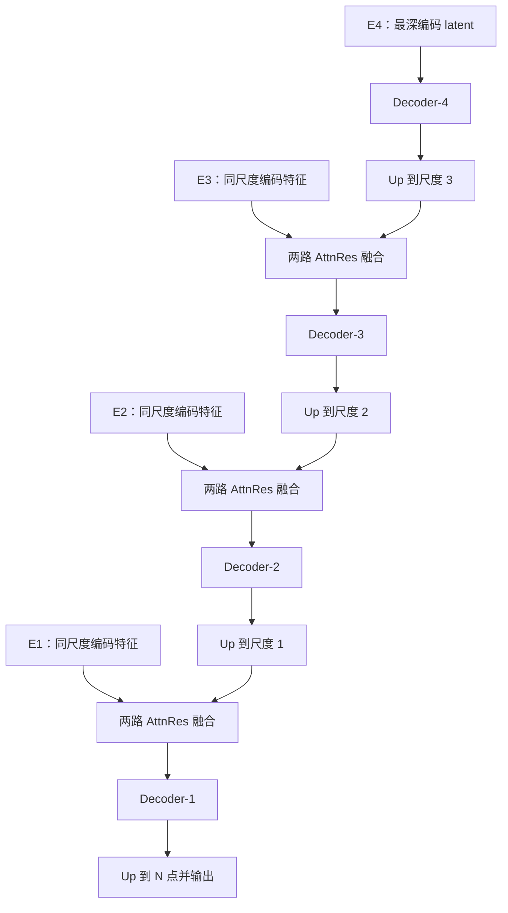
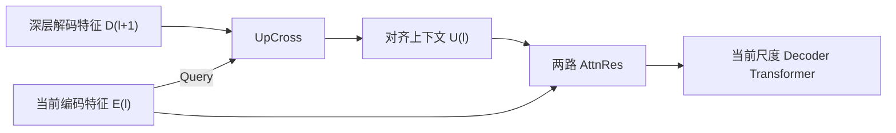

> From: https://chatgpt.com/c/6aa3a56a-d58c-83ea-a6ba-ee664ea9a005

# you asked

message time: 2026-09-16 11:04:34

我现在想要设计一个新的架构，这个架构有些类似于MoNo，但又有所区别，具体如下：像MoNo一样分为不同尺度，每个尺度的latent中的token数可以参考MoNo（MoNo有不同尺度的模型，这里可以完全参考它的设置，也就是light版本和原版本（参数量更大的模型），但默认训练应使用light版本）的设置，同时像MoNo一样只在latent空间中计算（每个尺度内），但两者有以下不同：首先在编码和解码阶段：编码阶段中每次压缩仍是按照LRSA原来的做法（也就是可学习查询的做法，你可以判断一下是不是这样），将latent token逐层级进行压缩，但在解码阶段应当怎么逐层级解码回原始的token数，你先设计一个方式，要充分考虑合理性共和效果；3.对于MoNO中原有的编码器和解码器间的跳跃连接，我注意到其其实并不是u-net风格的跳跃连接而是有些类似于残差连接，那可不可以把attenres的思想迁移过来，在设计新模型的跳跃连接时采用attenres的方式，使解码器中本来需要跳跃连接的节点可以通过attenres查询编码器中latent token数量比它多的层级（有些类似于attenres的可以访问历史中的所有block，但这里是从解码器连接至编码器中所有latent token s数大于它的层级）。同时还需要注意两个问题，就是：1. 如果仿照MoNo的设计（你应当在仔细阅读这篇论文后再仔细阅读它对应的代码仓库），是不是没有卷积层了，如果是那新模型也不加卷积层，如果不是，那就保留LRSA原来设计的卷积层；2. 其他没有提到的问题可以直接仿照LRSA和MoNo的设计，比如在每个层级中每个atten计算上下仍然有ffn(也就是与LRSA一致的设计)，在最深层的处理方式直接参考MoNo的设计，现在根据我的描述写出新模型的架构，再给出一张模型架构图

---

# chatgpt response

我会先核对 MoNo 论文和官方代码中的尺度配置、跳跃连接、最深层处理及卷积使用情况，再据此设计逐级解码和跨尺度历史读取。架构图会标明哪些部分沿用 MoNo/LRSA，哪些是这次新增的设计。

---

# you asked

message time: 2026-09-16 14:15:04

我现在想要设计一个新的架构，这个架构有些类似于MoNo，但又有所区别，具体如下：像MoNo一样分为不同尺度，每个尺度的latent中的token数可以参考MoNo（MoNo有不同尺度的模型，这里可以完全参考它的设置，也就是light版本和原版本（参数量更大的模型），但默认训练应使用light版本）的设置，同时像MoNo一样只在latent空间中计算（每个尺度内），但两者有以下不同：首先在编码和解码阶段：编码阶段中每次压缩仍是按照LRSA原来的做法（也就是可学习查询的做法，你可以判断一下是不是这样），将latent token逐层级进行压缩，但在解码阶段应当怎么逐层级解码回原始的token数，你先设计一个方式，要充分考虑合理性共和效果；3.对于MoNO中原有的编码器和解码器间的跳跃连接，我注意到其其实并不是u-net风格的跳跃连接而是有些类似于残差连接，那可不可以把attenres的思想迁移过来，在设计新模型的跳跃连接时采用attenres的方式，使解码器中本来需要跳跃连接的节点可以通过attenres查询编码器中latent token数量比它多的层级（有些类似于attenres的可以访问历史中的所有block，但这里是从解码器连接至编码器中所有latent token s数大于它的层级）。同时还需要注意两个问题，就是：1. 如果仿照MoNo的设计（你应当在仔细阅读这篇论文后再仔细阅读它对应的代码仓库），是不是没有卷积层了，如果是那新模型也不加卷积层，如果不是，那就保留LRSA原来设计的卷积层；2. 其他没有提到的问题可以直接仿照LRSA和MoNo的设计，比如在每个层级中每个atten计算上下仍然有ffn(也就是与LRSA一致的设计)，在最深层的处理方式直接参考MoNo的设计，现在根据我的描述写出新模型的架构，再给出一张模型架构图

---

# chatgpt response

MoNo 的 Light 版确实使用 $512\!\to\!256\!\to\!128\!\to\!64$ 个 latent，原版为 $1024\!\to\!512\!\to\!256\!\to\!128$。另外，它的跳跃连接虽然采用相加而非拼接，但仍连接编码器与解码器的对应尺度，属于多尺度跳跃连接，不能仅因相加就归为普通层内残差。我会用 PDF 技能核对架构图和公式，并把新架构图保存成可下载文件。

我建议采用“同尺度编码特征提供解码 query，较粗尺度解码结果提供 key/value”的逐级重建方式。新增跳连先用 cross-attention 把更细尺度的历史对齐到当前 token 数，再用 AttnRes 风格选择来源；粗尺度解码主干单独保留，避免被多份历史平均稀释。MoNo 的模型路径没有卷积，因此这版也不加入卷积。

这里需要区分两件事：MoNo 的跳连虽然采用相加，仍属于编码器到解码器的同尺度跳跃连接；而你新增的是跨尺度历史读取。我会保留同尺度跳连，并让新增历史先对齐 token，再做来源选择。另外，替换掉 MoNo 的最优传输压缩后，其平衡分配性质不会自动保留，这会是新模型需要验证的一个重点。

可以。按照你的要求，我建议把新模型确定为：

**四级 latent 编码器—解码器；用 LRSA 式 learned-query cross-attention 逐级压缩，用目标尺度的编码特征作为 query 逐级重建；尺度内部保留“FFN—自注意力—FFN”；解码阶段引入“先跨尺度对齐、再按来源加权”的注意力跳连。默认使用 Light 配置。**

这个设计保留了 MoNo 的多尺度计算框架，但压缩、重建以及跳连的具体算子都有明确变化。下面区分参考模型的事实与本次提出的设计。

**一、先核对 MoNo：尺度配置、跳连和卷积**

我核对了上传的论文及其官方仓库，四个尺度的配置如下。表中尺度顺序均为“细 → 粗”。

| 配置 | Light，默认 | Full |
|---|---:|---:|
| Latent token 数 | 512、256、128、64 | 1024、512、256、128 |
| 各尺度通道宽度 $d$ | 96 | 192 |
| 各尺度注意力头数 | 4、4、8、8 | 4、4、8、8 |
| 各尺度 encoder block 数 | 3、1、1、1 | 3、1、1、1 |
| 各尺度 decoder block 数 | 3、1、1、1 | 3、1、1、1 |
| Encoder、decoder 的 block 总数 | 6＋6＝12 | 6＋6＝12 |

这些设置可以直接作为新模型的两档配置。但由于更换了压缩、重建和跳连模块，**新模型的参数量不能直接引用 MoNo 的参数量**。[MoNo 论文](https://arxiv.org/html/2608.09764v1)、[官方仓库](https://github.com/ZijiangY1116/MoNo)

关于你提出的两个判断，需要明确：

- **MoNo 的模型计算路径没有卷积层。**输入嵌入、尺度映射、latent processor 和输出投影都没有使用卷积。因此按照你的要求，**新模型也不加入卷积，包括规则网格任务**。
- MoNo 的同尺度跳连采用相加，代码中是 `x + skip`。但“相加而非拼接”并不意味着它不是 U-Net 风格的连接：**从拓扑上看，它仍然是编码器到对应解码器的跳跃连接**，只是融合方式不同于经典 U-Net 的通道拼接。[MoNo 核心实现](https://github.com/ZijiangY1116/MoNo/blob/60d086a45d4929769796fb3b2dfacc6680528f3b/utils/models/mono.py)

这里的“尺度”首先表示 **latent token 数量不同**，不能直接等同于物理空间中的网格尺度，也不能预先保证每一级分别对应某个频段。

**二、编码器：采用 LRSA 的 learned-query 压缩**

你的理解正确：**LRSA 的 down-projection 使用可学习查询，输入特征提供 key/value。**不同样本共享查询参数，但注意力权重随样本内容改变。[LRSA §3.4](https://arxiv.org/html/2604.03582v1#S3.SS4)

设输入包含坐标 $x$、物理输入 $a$，首先逐点嵌入：

$$
E_0=\operatorname{Lift}(x,a)
\in\mathbb R^{B\times N\times d}.
$$

Lift 使用 MLP，不使用卷积。时间任务需要的时间信息可以沿用现有输入约定。

第 $\ell$ 个尺度的压缩为：

$$
C_\ell=
\operatorname{DownCross}_\ell
\left(
Q=P_\ell,\;
K=\operatorname{Norm}(E_{\ell-1}),\;
V=\operatorname{Norm}(E_{\ell-1})
\right),
$$

其中：

$$
P_\ell\in\mathbb R^{M_\ell\times d},
\qquad
C_\ell\in\mathbb R^{B\times M_\ell\times d}.
$$

然后在这个尺度内计算：

$$
E_\ell=\operatorname{EncoderStack}_\ell(C_\ell).
$$

Light 版的 token 数变化为：

$$
N\rightarrow512\rightarrow256\rightarrow128\rightarrow64.
$$

这里有三个明确约定：

1. 每个尺度拥有独立的 learned queries 和压缩参数。
2. DownCross 输出的是压缩结果，本方案不额外加上 $P_\ell$ 的 query 残差。
3. 得到 $E_\ell$ 后保存它，供解码器查询；尺度内部的多个 block 不再反复压缩、重建。

因此，512-token 尺度连续执行三个 latent block 后，才进入 256-token 尺度。

**三、每个尺度内部的 block：保留 LRSA 的双 FFN 结构**

按照你的要求，每个 block 为：

$$
\begin{aligned}
Z^{(1)}
&=Z+\operatorname{FFN}_1(\operatorname{Norm}_1(Z)),\\
Z^{(2)}
&=Z^{(1)}
+\operatorname{SA}(\operatorname{Norm}_2(Z^{(1)})),\\
Z_{\mathrm{out}}
&=Z^{(2)}
+\operatorname{FFN}_2(\operatorname{Norm}_3(Z^{(2)})).
\end{aligned}
$$

也就是：

$$
\boxed{\text{FFN 残差}\rightarrow
\text{latent SA 残差}\rightarrow
\text{FFN 残差}}
$$

两个 FFN 参数独立，分别负责注意力前后的非线性变换。**这次设计保留所有尺度内的自注意力，不沿用之前删除 SA 的消融设置。**

我建议第一版每个 FFN 使用：

$$
d\rightarrow2d\rightarrow d,
\qquad \text{激活函数采用 GELU}.
$$

这是本次推荐的配置，不是声称逐字复现 MoNo。原因是：

- MoNo 的一个标准 latent block 使用一个隐藏宽度为 $4d$ 的 FFN。
- 本方案使用两个隐藏宽度为 $2d$ 的 FFN。
- 忽略偏置，两者的 FFN 线性层参数量均约为 $8d^2$。

这样既满足双 FFN 设计，又避免仅因为 FFN 数量增加就把这部分参数翻倍。不过，两个独立非线性残差子层与一个宽 FFN 的表达并不等价。

**四、最深层：沿用 MoNo 的处理拓扑**

Light 最深层为 64 tokens，Full 为 128 tokens。

编码器最深层输出 $E_4$ 后，直接进入最深层的 decoder stack：

$$
D_4=\operatorname{DecoderStack}_4(E_4).
$$

具体为：

$$
\text{最深层 Encoder block}\times1
\rightarrow
\text{最深层 Decoder block}\times1.
$$

**不额外增加第三组 bottleneck blocks，也不在这里加入跨尺度历史融合。**

这样处理是因为 MoNo 的最深层没有对应的跳连融合节点；你要求“最深层直接参考 MoNo”，所以新增跳连从后续逐级重建处开始。[MoNo 方法与实现](https://arxiv.org/html/2608.09764v1)

**五、解码器：用同尺度编码特征确定“重建到哪些 token”**

这是新架构最需要明确的部分。

我建议采用 **LRSA up-projection 的推广形式**：目标尺度的编码特征提供 query，较粗尺度的解码结果提供 key/value。

对于 $\ell=3,2,1$，先计算：

$$
B_\ell=
\operatorname{UpCross}_\ell
\left(
Q=\operatorname{Norm}(E_\ell),\;
K=\operatorname{Norm}(D_{\ell+1}),\;
V=\operatorname{Norm}(D_{\ell+1})
\right).
$$

输出形状为：

$$
B_\ell\in\mathbb R^{B\times M_\ell\times d}.
$$

例如：

$$
E_3:128\text{ tokens},\qquad D_4:64\text{ tokens},
$$

则：

$$
\operatorname{UpCross}(E_3,D_4)
\rightarrow B_3:128\text{ tokens}.
$$

这里的分工是：

| 信息 | 作用 |
|---|---|
| $E_\ell$ | 指定目标尺度有哪些 token，以及各 token 应查询什么 |
| $D_{\ell+1}$ | 提供经过较粗尺度处理后的全局信息 |
| $B_\ell$ | 把粗尺度信息重新组织到目标尺度的 token 集合中 |

这比对 latent token 的下标做插值更合理，因为这些 token 没有天然的规则空间邻接关系。

同时，**编码和解码的参数独立**。UpCross 不被约束为 DownCross 的转置或逆映射；压缩本身一般不可逆，解码应学习任务所需的重建关系。

这里定义的 UpCross **只返回注意力分支 $B_\ell$**，不自动加 query 残差。同尺度信息稍后通过跳连加入，避免重复相加。

**六、新跳连：先对齐更细尺度历史，再进行 AttnRes 风格的来源选择**

你的迁移思路合理，但不能直接把不同尺度的特征逐 token 相加：它们的 token 数不同，token 身份也没有天然对应关系。

因此新增模块分两步。

第一步，**跨尺度对齐**。

在解码尺度 $\ell$，允许访问的额外编码器历史为：

$$
\mathcal H_\ell=
\{E_s:M_s>M_\ell,\;s\geq1\}.
$$

对于本方案严格递减的 token 配置，就是 $s<\ell$。

首先构造一个包含当前细尺度信息和粗尺度解码信息的临时查询：

$$
F_\ell=E_\ell+B_\ell.
$$

然后分别读取每个更细尺度的历史：

$$
R_{\ell,s}=
\operatorname{HistoryCross}_\ell
\left(
Q=\operatorname{Norm}(F_\ell),\;
K=\operatorname{Norm}(E_s),\;
V=\operatorname{Norm}(E_s)
\right),
\qquad s<\ell.
$$

所有读取结果都变成：

$$
R_{\ell,s}\in\mathbb R^{B\times M_\ell\times d}.
$$

例如在 128-token 解码节点：

$$
E_1:512\rightarrow R_{3,1}:128,
\qquad
E_2:256\rightarrow R_{3,2}:128.
$$

建议同一个接收尺度的 HistoryCross 在不同历史来源间共享投影参数，不同接收尺度之间独立。这样参数不会随历史来源数量线性增加。

注意，**$F_\ell$ 只用于产生查询，不再额外加到最终输出中。**

第二步，**来源维度上的注意力融合**。

保留原有同尺度跳连 $E_\ell$，并加入已经对齐的更细尺度历史：

$$
V_{\ell,s}=
\begin{cases}
R_{\ell,s},&s<\ell,\\
E_\ell,&s=\ell.
\end{cases}
$$

对每个目标 token $i$，计算：

$$
e_{\ell,i,s}
=
w_\ell^\top
\operatorname{RMSNorm}
\left(V_{\ell,s,i}\right),
$$

$$
\alpha_{\ell,i,s}
=
\frac{\exp(e_{\ell,i,s})}
{\sum_{t=1}^{\ell}\exp(e_{\ell,i,t})},
$$

$$
S_{\ell,i}
=
\sum_{s=1}^{\ell}
\alpha_{\ell,i,s}V_{\ell,s,i}.
$$

最后：

$$
\boxed{
D_\ell=
\operatorname{DecoderStack}_\ell
\left(B_\ell+S_\ell\right)
}
$$

这里有 **两种不同的 softmax**：

- HistoryCross 内部：在某一历史尺度的 token 之间选择信息。
- 来源融合：在不同编码尺度之间选择信息。

归一化用于来源评分，加权求和使用原始候选特征。这借鉴了 AttnRes 的来源选择方式，但增加了不同 token 集合之间的 cross-attention 对齐，**不能称为直接照搬 AttnRes**。[Attention Residuals](https://arxiv.org/abs/2603.15031)

我特别建议把粗尺度主分支 $B_\ell$ 放在来源竞争之外。否则初始化均匀融合时，多份编码历史可能直接稀释深层解码结果。现在它始终以：

$$
B_\ell+S_\ell
$$

的形式进入 decoder block。

若 $w_\ell=0$ 初始化，均匀的只是跳连分支。例如：

$$
S_3=\frac{E_3+R_{3,1}+R_{3,2}}{3},
$$

而完整输入为：

$$
B_3+\frac{E_3+R_{3,1}+R_{3,2}}{3}.
$$

这仍然不是整个模块的恒等初始化，但粗尺度主路径没有被平均缩小。

**各节点到底读取什么，明确如下：**

| Light 解码节点 | 粗尺度主输入 | 保留的同尺度跳连 | 新增历史读取 |
|---|---|---|---|
| $D_4$：64 tokens | $E_4$ | 不进行跳连融合 | 无，最深层沿用 MoNo |
| $D_3$：128 tokens | $D_4$ | $E_3$ | $E_1$：512；$E_2$：256 |
| $D_2$：256 tokens | $D_3$ | $E_2$ | $E_1$：512 |
| $D_1$：512 tokens | $D_2$ | $E_1$ | 无更细的编码 latent |
| 最终 $N$ 点输出 | $D_1$ | 本版不加直接特征残差 | $E_0$ 仅提供解码 query |

因此，“严格大于当前 token 数”约束适用于**新增历史**；同尺度跳连是保留 MoNo 原有的信息路径。

原始 $N$ 点特征 $E_0$ 不进入跨尺度历史池。这样既符合“查询编码器 latent 层级”的设想，也避免多个解码尺度重新访问全部原始点。

**七、最后恢复到原始点数**

最后一次重建仍然采用 feature-query 解码：

$$
B_0=
\operatorname{UpCross}_0
\left(
Q=\operatorname{Norm}(E_0),\;
K=\operatorname{Norm}(D_1),\;
V=\operatorname{Norm}(D_1)
\right),
$$

$$
\widehat u=\operatorname{Head}(B_0).
$$

因此：

$$
B_0\in\mathbb R^{B\times N\times d},
\qquad
\widehat u\in\mathbb R^{B\times N\times d_{\mathrm{out}}}.
$$

Head 使用逐点 MLP，不使用卷积，也不在 $N$ 点域增加自注意力。

这个版本适合你当前主要考虑的输入、输出位置对应的正向求解任务。它不能仅凭该定义就宣称支持任意新输出位置；那需要另行定义输出 query。

**八、这个构造的合理性，以及需要正视的风险**

合理性主要来自三个方面。

第一，**逐级重建有明确的目标 token 身份**。UpCross 的 query 来自 $E_\ell$，所以输出天然与该尺度的编码 token 对应，同尺度跳连可以直接融合。

第二，**跨尺度读取不依赖历史 token 的排列**。若同时用置换矩阵 $\Pi$ 重排历史 key/value，标准注意力满足：

$$
\operatorname{Attn}(Q,\Pi K,\Pi V)
=
\operatorname{Attn}(Q,K,V).
$$

因此，不需要假设不同尺度的第 $i$ 个 token 表示同一个对象；cross-attention 负责内容对齐。

第三，**细尺度历史提供绕过最粗瓶颈的信息路径**。如果某些信息未被保留在 $E_4$ 中，但仍存在于 $E_1,E_2$，解码器可以重新读取它们。不过，这只能说明存在补充信息的通道，不能保证所有压缩损失都会被恢复。

最重要的风险是：**LRSA learned-query attention 不自动保留 MoNo 的最优传输平衡性质。**例如压缩注意力矩阵

$$
A_\ell\in\mathbb R^{M_\ell\times M_{\ell-1}}
$$

经过逐行 softmax 后满足：

$$
A_\ell\mathbf1=\mathbf1,
$$

但通常没有相应的列边际约束。因此，不同 learned queries 可能关注高度相似的区域。MoNo 的 CoTAP 约束不能直接迁移成这个新模型的理论保证。

此外：

- 更细尺度跳连可能让模型过度依赖浅层信息。保留粗尺度主分支能缓解直接稀释，但不能保证深层一定被充分利用。
- Light 已有 512-token 尺度，不能仅因减少原始点域压缩次数，就断言比 LRSA 更快。
- Full 的第一层有 1024 tokens；对输入点数小于 1024 的任务，第一步实际是 latent 扩展，后续才逐级压缩。

按当前构造，一次前向包括 **4 次 Down、4 次 Up、12 个 latent SA、24 个 latent FFN，以及 3 次额外历史 cross-attention**。额外历史读取只涉及 latent，不随原始点数 $N$ 直接增长。这是它在保持跨尺度信息访问时控制开销的主要依据；实际精度和速度仍需实验验证。

下面是完整架构图。左侧展示四级编解码路径，右侧展开 128-token 解码节点的具体计算。


可下载并用于后续汇报的矢量版本：[Hierarchical_Latent_Architecture_Light.svg](sandbox:/workspace/scratch/755f4425b6a6/deliverables/hierarchical_latent_design/Hierarchical_Latent_Architecture_Light.svg)。

---

# you asked

message time: 2026-09-16 14:36:42

有两个问题，第一个问题是：MoNO之所以能够构建逐层编码，家吗的结构是因为其通过cotap的方式进行了token间的均衡，我需不需要对新模型设计方式来避免这个问题，比如：加一个**平衡正则项**：

```math
Lbalance=∥∑iAij−NM∥F2+∥∑jAij−MN∥F2（）
```

（注意我只是提供你的思路，你完全可以确定自己合适的方式来解决这个问题，只要你觉得合理即可，包括我提到的这个问题本身以及我的解决思路，如果有道理你姐对词问题进行思考，如果你就觉得没有道理你也可以反馈给我）

---

# chatgpt response

我会先把注意力矩阵的形状和边际条件写清楚，因为你给出的正则项中 $N/M$ 与 $M/N$ 的位置取决于矩阵定义，其中一项在行 softmax 下其实恒为零。随后再判断应当做“严格 Sinkhorn 平衡”还是“软覆盖约束”，以及它对 PDE 中非均匀重要区域会不会形成反作用。

你的担心有道理，但要把结论分成两层：

1. **MoNo 能在结构上逐级压缩，并不完全依赖 CoTAP。**普通 cross-attention 同样可以实现 $N\to512\to256\to128\to64$。
2. **MoNo 能让多级 latent 保持稳定、避免越压缩越集中，CoTAP 确实起了关键作用。**MoNo 的消融也显示：只有多尺度、没有 CoTAP 时仍有一定提升，但加入 CoTAP 后提升明显增大，尤其是 Elasticity。[MoNo 论文](https://arxiv.org/html/2608.09764v1)

因此，新模型不一定必须复制 CoTAP，但最好加入专门的防坍缩机制。你写的平衡正则方向正确，不过原公式需要修正，而且**只约束边际平衡仍不足以排除 latent token 坍缩**。

**先把注意力矩阵定义清楚。**

设某一级从 $N$ 个源 token 压缩为 $M$ 个 latent token，单个注意力头的压缩矩阵为：

$$
A\in\mathbb R^{M\times N},
$$

其中 $i$ 表示 latent query，$j$ 表示源 token。LRSA 的行 softmax 保证：

$$
\sum_{j=1}^{N}A_{ij}=1.
$$

如果希望所有源 token 的总使用量均衡，则列和应满足：

$$
\sum_{i=1}^{M}A_{ij}\approx \frac{M}{N}.
$$

所以在这个矩阵定义下，直接的均衡正则应为：

$$
\mathcal L_{\mathrm{column}}
=
\left\|
A^\top\mathbf 1_M-
\frac{M}{N}\mathbf 1_N
\right\|_2^2.
$$

而下面这一项：

$$
\left\|
A\mathbf 1_N-\mathbf 1_M
\right\|_2^2
$$

在标准 row-softmax 下恒等于零，没有必要再加入。你原式中的 $N/M$ 与 $M/N$ 位置需要按照矩阵方向重新调整。

也可以把注意力转成总质量为 1 的联合分布：

$$
P=\frac{1}{M}A.
$$

此时正确的均匀边际条件是：

$$
P\mathbf 1_N=\frac1M\mathbf 1_M,
\qquad
P^\top\mathbf 1_M=\frac1N\mathbf 1_N.
$$

这正是矩形最优传输中的均匀边际形式。

但是，**仅有边际均衡不能保证 latent 不坍缩。**

考虑：

$$
A_{ij}=\frac1N,\qquad \forall i,j.
$$

这时：

$$
\sum_j A_{ij}=1,
\qquad
\sum_i A_{ij}=\frac MN.
$$

所有边际条件都完全满足，平衡损失为零，但每个 latent 得到的结果都是：

$$
C_i=\frac1N\sum_{j=1}^{N}V_j.
$$

于是：

$$
C_1=C_2=\cdots=C_M,
$$

所有 latent token 完全相同。这说明：

$$
\boxed{\text{边际平衡解决覆盖不足，但不能单独解决 latent 重复。}}
$$

MoNo 的 CoTAP 之所以实际有效，是因为它不仅有均匀边际，还包含：

- 由输入 anchor 产生的样本相关 transport scores；
- 熵正则最优传输；
- 多次 Sinkhorn 归一化；
- 从同一个 transport plan 构造编码和解码；
- anchor 在不同尺度间继续传播。

所以，一个简单的 L2 边际损失不能被解释为“等价于 CoTAP”。

我更推荐新模型采用下面两个互补的训练正则，并保持原来的 LRSA learned-query forward 不变。

---

**第一项是源 token 覆盖约束。**

多头注意力为：

$$
A^{(h)}\in\mathbb R^{M\times N},
\qquad h=1,\ldots,H.
$$

先在注意力头之间取平均：

$$
\bar A=\frac1H\sum_{h=1}^{H}A^{(h)}.
$$

定义源 token 获得的总概率质量：

$$
p_j=\frac1M\sum_{i=1}^{M}\bar A_{ij},
\qquad
\sum_jp_j=1.
$$

规则网格可以取：

$$
\mu_j=\frac1N.
$$

如果不规则网格中能够获得节点面积、单元体积或者其他积分权重，则应取：

$$
\mu_j=\frac{w_j}{\sum_k w_k}.
$$

这是因为“不规则点集上的均匀点权重”并不一定对应“物理区域上的均匀测度”。

我不建议一开始就强制 $p=\mu$，因为 PDE 中的边界层、激波和高梯度区域可能确实需要更多 attention。更合理的是只防止某些区域完全不被使用：

$$
\boxed{
\mathcal L_{\mathrm{cover}}
=
\sum_{j=1}^{N}
\frac{
\left[\max\left(0,\kappa\mu_j-p_j\right)\right]^2
}{
\mu_j+\varepsilon
}
}
$$

其中 $0<\kappa<1$。

例如：

$$
\kappa=0.25
$$

表示至少保留约四分之一的注意力质量用于覆盖整个输入域，剩余质量仍然可以自适应地集中在高梯度或关键区域。

如果希望做更接近 CoTAP 的消融，则可以换成对称边际匹配：

$$
\mathcal L_{\mathrm{balance}}
=
\operatorname{JS}(p\Vert\mu),
$$

或者：

$$
\mathcal L_{\mathrm{balance}}
=
\sum_j
\frac{(p_j-\mu_j)^2}{\mu_j+\varepsilon}.
$$

其中，覆盖下界更灵活；完整边际匹配更接近 CoTAP 的均衡思想。

---

**第二项是 latent query 专门化约束。**

对每个注意力头定义联合分布：

$$
P^{(h)}_{ij}=\frac1M A^{(h)}_{ij},
$$

源 token 边际为：

$$
p_j^{(h)}=\sum_iP^{(h)}_{ij}.
$$

latent 编号 $I$ 和源 token 编号 $J$ 之间的互信息为：

$$
\mathcal I_h(I;J)
=
\sum_{i,j}
P^{(h)}_{ij}
\log
\frac{
P^{(h)}_{ij}+\varepsilon
}{
\frac1M p_j^{(h)}+\varepsilon
}.
$$

如果所有 latent attention 行完全相同，那么：

$$
\mathcal I_h(I;J)=0.
$$

不同 latent 学到不同区域或不同物理模式时，互信息才会增大。因此可以使用一个温和的下界约束：

$$
\boxed{
\mathcal L_{\mathrm{specialize}}
=
\frac1H\sum_{h=1}^{H}
\left[
\max
\left(
0,\,
\rho-
\frac{\mathcal I_h(I;J)}
{\log\min(M,N)}
\right)
\right]^2
}
$$

其中 $\rho$ 不宜过大。建议从：

$$
\rho=0.05\sim0.1
$$

开始。使用下界而非直接最大化互信息，是为了防止 assignments 过度变硬，从而破坏 PDE 解所需的平滑聚合。

于是总训练目标可以写为：

$$
\boxed{
\mathcal L
=
\mathcal L_{\mathrm{PDE}}
+
\lambda_{\mathrm{cover}}
\frac1L\sum_{\ell=1}^{L}
\mathcal L_{\mathrm{cover}}^{(\ell)}
+
\lambda_{\mathrm{specialize}}
\frac1L\sum_{\ell=1}^{L}
\mathcal L_{\mathrm{specialize}}^{(\ell)}
}
$$

第一版可以从下面的量级开始：

$$
\lambda_{\mathrm{cover}}=10^{-2},
\qquad
\lambda_{\mathrm{specialize}}=10^{-3},
\qquad
\kappa=0.25,
\qquad
\rho=0.05.
$$

这些只是合理起点，正式实验应至少比较：

| 版本 | 覆盖约束 | 专门化约束 |
|---|---:|---:|
| 基础模型 | 无 | 无 |
| 只防覆盖缺失 | 有 | 无 |
| 只防 latent 重复 | 无 | 有 |
| 完整版本 | 有 | 有 |
| 严格均衡版本 | JS/L2 全边际 | 有 |
| CoTAP 参考版本 | Sinkhorn | 由 OT scores 隐式形成 |

建议在前 $5\%\sim10\%$ 的训练 epoch 内把正则系数从 0 线性增加到目标值，避免随机初始化阶段由路由正则主导优化。

**这些正则只应施加在四个 Encoder DownCross 上。**

不建议第一版对以下模块进行均衡约束：

- Decoder UpCross；
- 跨尺度历史读取 HistoryCross；
- 来源选择 attention。

这些模块的目的本来就是选择性读取。若强迫 decoder 平均使用所有粗尺度 token，可能会削弱其根据目标位置重组信息的能力。

还要注意，多头处理最好采用：

- 覆盖约束作用于所有 head 的平均注意力 $\bar A$，允许不同 head 互相补充；
- 专门化约束分别作用于每个 head，防止某一个 head 内部所有 learned queries 都相同。

**我暂时不推荐把 Sinkhorn 直接作为新模型默认压缩算子。**

原因是它会带来三个变化：

1. 改变 LRSA learned-query softmax 的实际 forward；
2. 训练和推理都需要多次交替归一化；
3. 难以继续使用不返回注意力矩阵的高效 SDPA 路径。

你的环境又明确不希望依赖自定义 Triton kernel。标准 PyTorch log-Sinkhorn 可以实现，但第一层 $N\to512$ 的传输矩阵较大，多次迭代会明显增加训练和推理成本。

软正则只在训练时使用，推理时仍然是原来的 LRSA cross-attention，因此不会增加推理延迟。它也保留了你设计中“编码和解码独立参数化”的特点。

不过，训练时为了计算这些正则，需要得到 DownCross 的 attention weights。PyTorch 的高效 SDPA 默认不返回权重。可以采用：

- latent-to-latent 的后三级每一步都计算正则；
- 第一层 $N\to M_1$ 在 $N$ 很大时，每隔 4 个 optimizer steps 计算一次；
- 辅助损失用 FP32 计算；
- padding 点在 $\mu$ 和 attention 中同时屏蔽。

这样可以减少第一层显式保存 $M_1N$ 注意力矩阵造成的训练开销。

建议同时记录两个诊断量：

$$
\mathrm{CoverageRatio}
=
\frac{\exp(H(p))}{N},
$$

以及：

$$
\mathrm{DiversityRatio}
=
\frac{\operatorname{erank}(\bar A\bar A^\top)}{M}.
$$

它们能区分三种情况：

| 情况 | CoverageRatio | DiversityRatio |
|---|---:|---:|
| 部分输入区域被忽略 | 低 | 可能高 |
| 所有 latent 都变成同一个全局平均 | 高 | 极低 |
| 覆盖完整且 latent 分工不同 | 高 | 较高 |

最终建议是：**这个问题需要处理，但不要直接照搬你写的双边 L2 正则。新模型第一版采用“软覆盖下界＋温和的 latent 专门化约束”更合理；标准 learned-query 压缩作为无正则基线，严格 Sinkhorn 作为强平衡消融。**

这可以保留 LRSA 的自适应压缩能力，同时针对多级压缩最危险的两种退化——输入覆盖缺失和 latent 重复——分别施加约束。你这条消息里目前只写出了第一个问题，第二个问题可以在这个定义基础上继续提出。

---

# you asked

message time: 2026-09-16 15:43:56

好的没有问题，这部分就按你说明的进行设计，下一个问题：关于跳跃连接的设计，你好像误会了我的意思。首先考虑MoNo原模型的跳跃连接方式：是将编码特征直接加到解码特征上，我认为这一构造虽然目的和想法与U-Net仍类似但做法和结构已有本质的不同，因为实际上MoNo是在加入下一个尺度的transformer块之前就做了跳跃连接，且MoNo中并没有卷积构造（我的模型也没有）。，所以我希望对此借鉴kimi k3中attenres的做法进行改进（这个改进不用再参考以前CDPA的改造方式，与哪个模块的设计有很大区别，所以在这个模型的设计中暂时不要受那个模块设计的影响），也就是在跳跃连接的摆放位置上（在解码器中）仍与MoNo一致，但在执行连接时采用kimi k3中的方式（但注意这里并不再是像刚才设计的那样是解码器中一次性对编码器中的所有更高层进行跳跃连接而是直接像MoNo一样在对应层级进行跳跃连接但是不再像MoNo一样直接加和而是像KIMI K3的attenres一样学习一个权重（这里你判断以下可以直接采用与attenres一样的方式吗）在求和作为解码器中下一层的输入），你觉得这种设计合理吗，如果合理，将这个方式加入到原有方案中，完善原有的而模型（注意如果这个方案成立原来设计的多层attenres就被取消了，同时跳跃连接就以这种方式进行）

---

# chatgpt response

我理解这次修正了：跳连仍然严格位于 MoNo 的对应尺度解码入口，只把固定的 `decoder feature + encoder skip` 改成 AttnRes 式可学习加权融合；不再跨多个编码尺度读取，也不沿用 CDPA 的对齐与历史汇聚。我会先核对 Kimi K3 AttnRes 的准确权重计算，再判断它能否原样迁移到“两路同尺度特征”。

核对后，这种迁移成立，但有一个关键前提：AttnRes 融合前，两路特征必须已经位于同一组 latent slots。当前解码中的 UpCross 正好先把深层结果映射到 $M_\ell$ 个、以 $E_\ell$ 为 query 的槽位，因此随后可以逐 token 做两路 AttnRes；不再需要任何跨尺度 HistoryCross。Kimi 的 pseudo-query 还应当零初始化，使两路初始权重严格为 $1/2$。

你的修正是合理的。我前一版把它理解成“解码器同时读取多个更细编码尺度”，这确实偏离了你的本意。现在应当恢复 MoNo 原来的逐级对应关系：

$$
\text{粗尺度解码结果}
\xrightarrow{\text{Up}}
\text{当前尺度}
\xrightarrow{\text{与同尺度编码特征融合}}
\text{当前尺度 Decoder Transformer}.
$$

只把 MoNo 中固定的逐元素加法替换为 AttnRes 式动态加权。此前设计的多尺度 HistoryCross、跨多个编码层的来源 softmax 和相关分支全部取消。

你对 MoNo 跳连的理解也是准确的：它在拓扑上存在编码器到解码器的横向连接，但计算上并不是 CNN U-Net 的卷积特征拼接，而是：

$$
F_{\mathrm{dec}}^\ell
=
M_{\mathrm{dec}}^\ell
\left(
F_{\mathrm{enc}}^\ell+
S_{\mathrm{dec}}^{\ell,\ell+1}
F_{\mathrm{dec}}^{\ell+1}
\right).
$$

也就是先把深层 latent 解码到当前尺度，与同尺度编码特征相加，再送入当前尺度的 Transformer block。[MoNo 论文](https://arxiv.org/html/2608.09764v1)

你的新跳连正好只替换其中的“加号”。

设：

$$
E^\ell=F_{\mathrm{enc}}^\ell
\in\mathbb R^{B\times M_\ell\times d}
$$

是第 $\ell$ 个尺度的编码特征；深一层解码结果先经过 UpCross：

$$
U^\ell
=
\operatorname{Up}_\ell
\left(
Q=E^\ell,\;
K=D^{\ell+1},\;
V=D^{\ell+1}
\right)
\in\mathbb R^{B\times M_\ell\times d}.
$$

由于 UpCross 以 $E^\ell$ 为目标 query，$U^\ell_i$ 与 $E^\ell_i$ 已经对应同一个当前尺度 latent slot，因此两者可以直接逐 token 融合，不需要额外的 token 对齐注意力。

Kimi AttnRes 的核心形式可以迁移过来。对每个解码尺度设置一个可学习 pseudo-query：

$$
w^\ell\in\mathbb R^d.
$$

对第 $n$ 个 latent token，计算两路来源分数：

$$
s_{\mathrm{enc},n}^{\ell}
=
(w^\ell)^\top
\operatorname{RMSNorm}(E_n^\ell),
$$

$$
s_{\mathrm{dec},n}^{\ell}
=
(w^\ell)^\top
\operatorname{RMSNorm}(U_n^\ell).
$$

然后只在“编码来源／解码来源”两个维度上做 softmax：

$$
\begin{bmatrix}
\alpha_{\mathrm{enc},n}^{\ell}\\
\alpha_{\mathrm{dec},n}^{\ell}
\end{bmatrix}
=
\operatorname{softmax}
\begin{bmatrix}
s_{\mathrm{enc},n}^{\ell}\\
s_{\mathrm{dec},n}^{\ell}
\end{bmatrix}.
$$

两个权重满足：

$$
\alpha_{\mathrm{enc},n}^{\ell}
+
\alpha_{\mathrm{dec},n}^{\ell}=1.
$$

两来源时，它也可以写成 sigmoid：

$$
\alpha_{\mathrm{enc},n}^{\ell}
=
\sigma\left(
(w^\ell)^\top
\left[
\operatorname{RMSNorm}(E_n^\ell)
-
\operatorname{RMSNorm}(U_n^\ell)
\right]
\right),
$$

$$
\alpha_{\mathrm{dec},n}^{\ell}
=1-\alpha_{\mathrm{enc},n}^{\ell}.
$$

因此，它本质上是一个逐样本、逐 latent token 变化的动态门控，而不是每个尺度只有一个固定标量。

Kimi 的原始 AttnRes 直接使用：

$$
Z_n^\ell
=
\alpha_{\mathrm{enc},n}^{\ell}E_n^\ell
+
\alpha_{\mathrm{dec},n}^{\ell}U_n^\ell.
$$

但我不建议在这里逐字照搬这个尺度。原因是，当 $w^\ell=0$ 时：

$$
\alpha_{\mathrm{enc}}^\ell
=
\alpha_{\mathrm{dec}}^\ell
=\frac12,
$$

得到的是：

$$
Z^\ell=\frac12(E^\ell+U^\ell),
$$

而 MoNo 原来的输入是：

$$
E^\ell+U^\ell.
$$

这会把“是否需要动态选择来源”和“是否需要把输入幅值除以 2”混在同一个实验中。

因此，新模型建议采用尺度保持版本：

$$
\boxed{
Z_n^\ell
=
2\left(
\alpha_{\mathrm{enc},n}^{\ell}E_n^\ell
+
\alpha_{\mathrm{dec},n}^{\ell}U_n^\ell
\right)
}
$$

并令：

$$
\boxed{w^\ell=0}
$$

初始化。原始 Attention Residuals 也要求 pseudo-query 零初始化，使训练初期来源权重均匀。[Attention Residuals](https://arxiv.org/abs/2603.15031)

这样初始化时：

$$
Z_n^\ell
=
2\left(
\frac12E_n^\ell+\frac12U_n^\ell
\right)
=
E_n^\ell+U_n^\ell.
$$

所以新跳连在初始化时严格等于 MoNo 的固定加法。更强的是，在 $w^\ell=0$ 时，权重对输入的导数为零，因此两条直接梯度路径也满足：

$$
\frac{\partial Z^\ell}{\partial E^\ell}=I,
\qquad
\frac{\partial Z^\ell}{\partial U^\ell}=I.
$$

也就是说，它从 MoNo 的前向行为和主要梯度通路出发，再逐步学习应该偏向哪一路。这比直接使用 Kimi 的平均形式更适合作为 MoNo 跳连的替代。

这里的固定系数 2 是新模型为了兼容 MoNo 加法而增加的设计，不属于 Kimi K3 原始 AttnRes。后续可以把“原始凸组合，即系数 1”作为消融实验。

融合完成后，再执行当前尺度的 Decoder Transformer：

$$
\boxed{
D^\ell
=
\operatorname{DecoderStack}_\ell(Z^\ell)
}
$$

其中 Decoder block 仍保持：

$$
\text{FFN}
\rightarrow
\text{Self-Attention}
\rightarrow
\text{FFN},
$$

每个子层都有 PreNorm 和自身的普通残差连接。AttnRes 只替换尺度间的横向 skip 加法，不替换 Transformer block 内部残差。

完整解码过程更新为：

$$
D^4=\operatorname{DecoderStack}_4(E^4),
$$

然后对 $\ell=3,2,1$：

$$
U^\ell=\operatorname{Up}_\ell(D^{\ell+1};Q=E^\ell),
$$

$$
Z^\ell
=
2\operatorname{AttnResPair}
\left(E^\ell,U^\ell;w^\ell\right),
$$

$$
D^\ell=\operatorname{DecoderStack}_\ell(Z^\ell).
$$

最后：

$$
U^0=
\operatorname{Up}_0
\left(
Q=E^0,\;
K=D^1,\;
V=D^1
\right),
\qquad
\widehat Y=\operatorname{Head}(U^0).
$$

最终恢复到 $N$ 个原始点时，继续遵循 MoNo 的拓扑，不额外加入 $E^0$ 跳连。



这项改动的合理性主要来自以下几点：

- $E^\ell$ 保留当前尺度在编码阶段获得的较细信息；
- $U^\ell$ 携带经过更深、更粗 latent 处理后的全局信息；
- 固定加法始终以相同比例使用两者；
- 新融合允许不同样本、不同空间位置和不同 latent token 选择不同的信息比例。

例如，边界层或局部高梯度区域可能得到：

$$
\alpha_{\mathrm{enc}}\approx0.8,
$$

而主要受全局流动结构影响的区域可能得到：

$$
\alpha_{\mathrm{dec}}\approx0.8.
$$

这种逐 token 的选择能力是单个全局门控参数无法提供的。

它的开销也很小。新模型只有三个同尺度跳连，对应 $E_3,E_2,E_1$。每个尺度增加一个 $d$ 维 pseudo-query，因此新增参数为：

$$
3d.
$$

Light 版 $d=96$：

$$
3d=288.
$$

Full 版 $d=192$：

$$
3d=576.
$$

即使每个尺度的 RMSNorm 使用独立可学习缩放参数，总新增参数也只有 $6d$。计算复杂度约为：

$$
O\left(
Bd(M_1+M_2+M_3)
\right),
$$

远低于尺度内 self-attention 的 $O(BM_\ell^2d)$，也明显低于上一版额外的多个 HistoryCross。

修订后的模型因此为：

| 模块 | 最终设计 |
|---|---|
| 编码压缩 | LRSA learned-query DownCross |
| 防坍缩 | 前述覆盖约束＋latent 专门化约束 |
| 尺度配置 | MoNo Light／Full |
| 尺度内计算 | FFN–SA–FFN |
| 最深层 | 沿用 MoNo 的 Encoder-4 → Decoder-4 |
| 解码扩张 | 逐级 UpCross |
| 跳跃连接 | 当前尺度 Encoder 与当前尺度 Up 特征做两路 AttnRes |
| 多尺度历史访问 | 取消 |
| HistoryCross | 取消 |
| Block AttnRes | 不需要 |
| 卷积 | 无 |
| 最终点域恢复 | $D^1\to N$ 点，不添加 $E^0$ 跳连 |

编码器中的平衡正则也不应施加到这个跳连上。编码器正则处理的是“多个 latent 是否覆盖源 token、是否互相重复”；这里的 softmax 只是在两个语义来源之间选择，模型长期偏向其中一路可能是合理行为。

训练时只需要监控三个尺度的：

$$
\mathbb E[\alpha_{\mathrm{enc}}^\ell],
\qquad
\mathbb E[\alpha_{\mathrm{dec}}^\ell],
\qquad
H(\alpha^\ell)
=
-\sum_s\alpha_s^\ell\log\alpha_s^\ell.
$$

如果某个尺度在训练早期就几乎全部变成 $1/0$，再考虑短期的熵下界约束；第一版不需要默认加入。

为了证明提升来自“学习来源权重”，而不是简单的幅值改变，最关键的消融应为：

| 跳连形式 | 公式 |
|---|---|
| MoNo 固定加法 | $E+U$ |
| 固定平均 | $(E+U)/2$ |
| 原始 Kimi 形式 | $\alpha_EE+\alpha_UU$ |
| 推荐形式 | $2(\alpha_EE+\alpha_UU)$ |

正式新模型采用最后一种。它保留原 MoNo 跳连作为 $w^\ell=0$ 的特例，同时增加输入相关、逐 token 的编码／解码来源选择能力。

---

# you asked

message time: 2026-09-16 16:00:33

对于“因此，新模型建议采用尺度保持版本 ”就按照你的建议即可，但是需要注意的是：“因此，它本质上是一个逐样本、逐 latent token 变化的动态门控    ”，这里是不是有问题的，因为编码器中和解码器中对应层级的latent token语义是对齐的吗，如果逐位置相加对应位置的token语义是对齐的吗，可以直接相加吗（这里MoNO可以直接相加是因为通过最优传输构建了对称的编，解码矩阵，折对于新模型来说也成立吗）

---

# chatgpt response

你的质疑成立：**token 数相同并不自动代表语义对齐**。这里必须把“同形状”与“同一目标 slot”分开。当前方案能够逐位置融合的依据只能来自 UpCross 的 query：如果当前尺度编码特征 $E^\ell$ 本身作为 UpCross query，那么输出 $U^\ell_i$ 就是专门为 $E^\ell_i$ 读取的深层上下文；如果改成一组与 $E^\ell$ 无关的 decoder queries，逐位置 AttnRes 就不再有充分依据。

你指出了上一版表述中的一个关键漏洞：**相同的 token 数量不等于 token 语义天然对齐。**

更准确地说，新模型里 MoNo 的“对称最优传输对齐”并不成立。新模型能够逐位置融合的依据，应当是 **UpCross 由当前编码特征提供 query，从而形成目标 slot 对齐**。这比 MoNo 的保证弱，但足以支持逐位置 AttnRes。

需要区分三种“对齐”：

| 对齐含义 | 新模型是否满足 |
|---|---:|
| 两个张量形状相同 | 是 |
| 第 $i$ 个解码输出专门对应第 $i$ 个编码 query | 是，前提是 $Q=E^\ell$ |
| 编码和解码来自同一传输矩阵，满足质量一致性 | 否 |
| 解码矩阵是编码矩阵的归一化转置 | 否 |
| 编码、解码互为逆映射 | 否 |

因此，之前“latent token 语义对齐”的说法过强，应当改为：

$$
\boxed{\text{编码和解码特征具有相同的目标 slot 地址}}
$$

而不是说它们拥有 MoNo 那样的对称传输语义。

设深层解码特征为：

$$
D^{\ell+1}\in
\mathbb R^{B\times M_{\ell+1}\times d},
$$

当前编码特征为：

$$
E^\ell\in
\mathbb R^{B\times M_\ell\times d}.
$$

UpCross 必须明确写成：

$$
\boxed{
U^\ell
=
\operatorname{CrossAttn}
\left(
Q=E^\ell,\;
K=D^{\ell+1},\;
V=D^{\ell+1}
\right)
}
$$

其中：

$$
U^\ell\in
\mathbb R^{B\times M_\ell\times d}.
$$

展开第 $i$ 个 token：

$$
\beta_{ij}^{\ell}
=
\operatorname{softmax}_{j}
\left(
\frac{
(E_i^\ell W_Q)
(D_j^{\ell+1}W_K)^\top
}{
\sqrt{d_h}
}
\right),
$$

$$
U_i^\ell
=
W_O
\left(
\sum_{j=1}^{M_{\ell+1}}
\beta_{ij}^{\ell}
D_j^{\ell+1}W_V
\right).
$$

这里的关键点是：

$$
U_i^\ell
$$

不是“深层解码器中原本的第 $i$ 个 token”，而是：

> 由当前尺度第 $i$ 个编码 token $E_i^\ell$ 发起查询，从深层特征中读取出来、专门返回给 $E_i^\ell$ 的上下文。

因此：

$$
(E_i^\ell,U_i^\ell)
$$

可以视为同一个目标 slot 的两种信息：

- $E_i^\ell$：编码路径保留的当前尺度信息；
- $U_i^\ell$：针对该 slot 从更深层读取的全局信息。

这和标准 Transformer cross-attention 后把 attention output 加回 query residual 的原理相同：key/value token 与 query token 不需要一一对应，但 cross-attention 的输出顺序由 query 决定。

它还满足一个明确的排列性质。若对编码 token 使用排列矩阵 $\Pi$：

$$
E^\ell\rightarrow\Pi E^\ell,
$$

则：

$$
\operatorname{UpCross}
\left(
\Pi E^\ell,D^{\ell+1}
\right)
=
\Pi\operatorname{UpCross}
\left(
E^\ell,D^{\ell+1}
\right).
$$

也就是：

$$
U^\ell\rightarrow\Pi U^\ell.
$$

编码特征和 UpCross 输出会以相同方式排列，因此逐位置融合保持成立。

这也说明一个必须固定的架构约束：

$$
\boxed{
\text{所有存在同尺度 AttnRes 跳连的 UpCross，都必须以 }E^\ell\text{ 作为 query。}
}
$$

如果以后把 UpCross query 改成一组与 $E^\ell$ 无关的 decoder learned queries，那么即使输出仍然有 $M_\ell$ 个 token，也不能直接假设：

$$
U_i^\ell\leftrightarrow E_i^\ell.
$$

那时必须重新增加对齐机制，或者让两组 query 共享同一个 slot anchor。

MoNo 的情况比上述 query 对齐更强。它通过一个共同的最优传输计划：

$$
S_{\mathrm{ot}}^{\ell-1,\ell}
$$

同时构造：

$$
S_{\mathrm{enc}}^{\ell-1,\ell}
\quad\text{和}\quad
S_{\mathrm{dec}}^{\ell-1,\ell}.
$$

因此，MoNo 的编码与解码共享同一组跨尺度匹配关系，并且具有边际质量一致性。

新模型则是：

$$
E^{\ell+1}
=
\operatorname{DownCross}_{\ell+1}
(P_{\ell+1},E^\ell),
$$

$$
U^\ell
=
\operatorname{UpCross}_{\ell}
(E^\ell,D^{\ell+1}).
$$

DownCross 与 UpCross 参数独立，也没有要求：

$$
A_{\mathrm{up}}^\ell
\approx
\left(A_{\mathrm{down}}^{\ell+1}\right)^\top.
$$

所以，新模型不能声称拥有：

- CoTAP 的双向质量守恒；
- 编码、解码矩阵对称；
- 相同 transport plan；
- MoNo 关于 CoTAP 的理论性质。

前面确定的覆盖正则与 latent 专门化正则只改善 DownCross 的覆盖和坍缩问题，也不会自动产生双向对称性。

不过，**逐位置 AttnRes 并不要求完整的双向最优传输对称性**。它要求的是：

$$
U_i^\ell
$$

确实是为：

$$
E_i^\ell
$$

生成的上下文。当前的 $Q=E^\ell$ 正好满足这一条件。

因此，同尺度 AttnRes 应更新为：

$$
s_{\mathrm{enc},i}^{\ell}
=
(w^\ell)^\top
\operatorname{RMSNorm}(E_i^\ell),
$$

$$
s_{\mathrm{dec},i}^{\ell}
=
(w^\ell)^\top
\operatorname{RMSNorm}(U_i^\ell),
$$

$$
\begin{bmatrix}
\alpha_{\mathrm{enc},i}^{\ell}\\
\alpha_{\mathrm{dec},i}^{\ell}
\end{bmatrix}
=
\operatorname{softmax}
\begin{bmatrix}
s_{\mathrm{enc},i}^{\ell}\\
s_{\mathrm{dec},i}^{\ell}
\end{bmatrix},
$$

$$
\boxed{
Z_i^\ell
=
2\left(
\alpha_{\mathrm{enc},i}^{\ell}E_i^\ell+
\alpha_{\mathrm{dec},i}^{\ell}U_i^\ell
\right)
}
$$

随后：

$$
D^\ell
=
\operatorname{DecoderStack}_\ell(Z^\ell).
$$

这里的“逐 latent token 动态门控”现在有了更严格的解释：

> 它是在同一个目标 query slot 内，选择保留编码信息还是采用从深层读取的上下文。

它不是在两个未经对齐的 latent 集合之间直接按下标混合。

还要修正上一版的一个说法。令 $w^\ell=0$ 时：

$$
Z^\ell=E^\ell+U^\ell.
$$

这只表示它初始化为**新模型内部的固定加法跳连**，并不表示完整复现 MoNo，因为这里的 $U^\ell$ 来自独立的 UpCross，而 MoNo 的对应特征来自与编码共享的 CoTAP transport plan。

新的完整解码顺序应固定为：



为了避免实现时再次产生歧义，需要在模型规范中写明以下约束：

1. `UpCross.query = encoder_feature`。
2. UpCross 只返回 cross-attention 读取结果，不在内部再次加上 $E^\ell$。
3. UpCross 的输出投影 $W_O$ 将特征映射回同一个 $d$ 维残差空间。
4. AttnRes 在 $E_i^\ell$ 和对应的 $U_i^\ell$ 之间做来源 softmax。
5. pseudo-query $w^\ell$ 零初始化。
6. 融合结果乘固定系数 2。
7. AttnRes 后才进入当前尺度 Decoder Transformer。
8. 不使用独立、无关联的 decoder learned queries。
9. 不加入原来设计的跨尺度 HistoryCross。

如果以后希望进一步接近 MoNo 的双向一致性，可以增加一个可选的软约束。设：

$$
A_{\mathrm{down}}^{\ell+1}
\in
\mathbb R^{M_{\ell+1}\times M_\ell}
$$

是从当前尺度压缩到深层的注意力矩阵，构造其行归一化反向分布：

$$
R^\ell
=
\operatorname{RowNorm}
\left(
(A_{\mathrm{down}}^{\ell+1})^\top
\right),
$$

并令 UpCross 权重为：

$$
A_{\mathrm{up}}^\ell
\in
\mathbb R^{M_\ell\times M_{\ell+1}}.
$$

可以使用：

$$
\mathcal L_{\mathrm{bi}}
=
\frac1{M_\ell}
\sum_i
\operatorname{JS}
\left(
A_{\mathrm{up},i}^\ell
\Vert
R_i^\ell
\right).
$$

但我不建议把它放进默认模型。它会重新耦合压缩与重建，可能削弱独立 UpCross 的表达能力。更适合作为“软双向一致性”的补充消融。

所以最终判断是：

$$
\boxed{
\text{新模型不具备 MoNo 的 OT 对称性，但通过 }Q=E^\ell
\text{ 获得了足够的目标 slot 对齐。}
}
$$

在严格保持这一 UpCross 定义的情况下，逐位置的尺度保持 AttnRes 融合是合理的；如果 query 设计发生变化，就必须重新检查 token 对齐，不能只因为两个张量形状相同就直接相加。

---

# you asked

message time: 2026-09-16 16:09:15

简单判断一下现在这个模型的设计是否合理，是否有明确的且可以改进的缺陷，又有哪些缺陷让你觉得额避免

---

# you asked

message time: 2026-09-16 16:09:29

简单判断一下现在这个模型的设计是否合理，是否有明确的且可以改进的缺陷，又有哪些缺陷让你觉得不可避免

---

# chatgpt response

总体设计是合理的，可以作为第一版正式实现，没有明显的结构矛盾：

$$
\text{LRSA 逐级压缩}
\rightarrow
\text{多尺度 latent 处理}
\rightarrow
\text{逐级 UpCross}
\rightarrow
\text{同尺度 AttnRes 融合}
\rightarrow
\text{输出}.
$$

它兼顾了 MoNo 的多尺度结构、LRSA 的灵活压缩，以及比固定加法更有选择性的跳跃连接。不过，现在还不能仅凭结构断言它会优于 MoNo 或 LRSA。

**明确且可以改进的缺陷**

| 缺陷 | 影响 | 建议 |
|---|---|---|
| learned-query 多级压缩可能出现覆盖不均和 latent 重复 | 越深层信息越集中 | 使用已确定的覆盖约束和专门化约束，并记录 coverage/diversity |
| UpCross 与 DownCross 不共享传输关系 | 解码不是编码的稳定反向映射 | 当前先保持解耦；把软双向一致性作为消融 |
| $E^\ell$ 同时用于 UpCross query 和 AttnRes skip | 解码器可能过度依赖浅层编码路径 | 监控 $\alpha_{\rm enc},\alpha_{\rm dec}$，必要时加入轻量 skip dropout |
| AttnRes 可能迅速饱和到只用一路 | 深层路径或编码路径可能被长期忽略 | 零初始化 pseudo-query；监控权重熵，出现早期饱和后再加入短期熵约束 |
| 固定系数 2 在单路权重接近 1 时会把该路放大到 2 倍 | 可能带来特征幅值和训练稳定性问题 | 对比固定 2、可学习正尺度和原始凸组合 |
| Light/Full 的 token 数对所有数据集固定 | 某些任务过度压缩，另一些任务计算冗余 | 对 $M=[512,256,128,64]$ 做任务级敏感性实验 |
| 平衡损失需要显式注意力矩阵 | 大 $N$ 时增加训练显存和时长 | 第一层间隔若干 step 计算，后三级正常计算；推理时完全关闭 |
| 无卷积、无显式局部几何算子 | 边界层、高频场和局部突变可能不足 | 可通过坐标编码、几何距离 bias、边界条件特征增强，不必立即加入卷积 |

其中最值得优先检查的是“深层路径是否真的被使用”。如果训练后出现：

$$
\alpha_{\mathrm{enc}}^\ell\approx1,\qquad
\alpha_{\mathrm{dec}}^\ell\approx0,
$$

模型实际上退化成依赖编码跳连的浅层网络。即使最终误差不错，也不能证明多尺度 bottleneck 有效。

**当前设计中较难避免的缺陷**

1. **低秩压缩的信息损失**

   只要：

   $$
   M_\ell<M_{\ell-1},
   $$

   就存在无法注入的方向。平衡正则只能防止明显的覆盖坍缩，不能保证所有与目标相关的高频模式都被保留。

2. **平衡覆盖和自适应聚焦存在冲突**

   严格均衡希望所有区域获得相似的总注意力，但 PDE 中边界层、激波和奇异区域确实应获得更多容量。当前采用软覆盖下界只能缓解这个矛盾，不能消除。

3. **query 对齐不等于最优传输对称**

   $Q=E^\ell$ 能保证目标 slot 对齐，使逐位置 AttnRes 合法；但它无法得到 MoNo 的质量守恒和双向 transport consistency。若要求这些性质，就必须重新引入共享传输计划，从而改变当前模型。

4. **多尺度数量依赖任务的有效秩**

   Darcy、Elasticity、Airfoil 和 Navier–Stokes 的谱衰减、局部复杂度不同，不可能存在一个 token 配置在所有任务上都最优。

5. **全局 learned-query 压缩有最低计算成本**

   第一层至少需要：

   $$
   O(NM_1d)
   $$

   的输入—latent 交互；尺度内部仍有：

   $$
   O(M_\ell^2d)
   $$

   的 self-attention。只要保留全局内容相关路由，这部分成本无法完全消除。

6. **AttnRes 的收益没有理论上的准确率保证**

   新融合的函数族包含原来的固定加法状态，但更大的函数空间不保证优化更容易，也不保证泛化更好。它是否真正学到“局部信息与深层信息的合理分工”只能通过实验判断。

我的判断是：**值得实现，没有必须推翻的缺陷。**第一版保持当前结构即可，重点记录各级压缩覆盖率、latent 有效秩、AttnRes 权重熵和深层路径梯度。若效果不好，最先检查路由坍缩和浅层跳连主导，而不是继续增加新模块。

---

# you asked

message time: 2026-09-16 16:16:27

如果按照“于是总训练目标可以写为：

L=LPDE​+λcover​L1​ℓ=1∑L​Lcover(ℓ)​+λspecialize​L1​ℓ=1∑L​Lspecialize(ℓ)​  ”进行设计会不会导致优化目标过于复杂，或者导致强制所有token分布的过于均匀，你有没有觉得这个损失设计的过于复杂，你觉得还有没有优化的空间

---

# chatgpt response

是的，之前同时加入 $\mathcal L_{\mathrm{cover}}$ 和 $\mathcal L_{\mathrm{specialize}}$ 作为默认目标，略显复杂。它引入了 $\lambda_{\mathrm{cover}},\lambda_{\mathrm{specialize}},\kappa,\rho$ 四个超参数，而且两个约束共同作用时，可能把 soft attention 推向接近硬聚类的分配，不一定适合需要平滑、重叠基函数的 PDE。

不过，原来的覆盖下界并不会强迫完全均匀：

$$
\mathcal L_{\mathrm{cover}}
=
\sum_j
\frac{
[\max(0,\kappa\mu_j-p_j)]^2
}{
\mu_j+\varepsilon
}.
$$

因为：

$$
\sum_j\kappa\mu_j=\kappa.
$$

当 $\kappa=0.25$ 时，只有约 $25\%$ 的总注意力质量受到最低覆盖约束，剩余 $75\%$ 仍可集中到边界层、高梯度区域等重要位置。真正容易导致过度均匀的是：

$$
\operatorname{JS}(p\Vert\mu)
$$

或完整的列边际 L2 匹配，因为它们试图让 $p$ 全面接近 $\mu$。

我建议把默认训练目标简化为：

$$
\boxed{
\mathcal L
=
\mathcal L_{\mathrm{PDE}}
+
\lambda_{\mathrm{cover}}
\frac1L
\sum_{\ell=1}^{L}
\mathcal L_{\mathrm{cover}}^{(\ell)}
}
$$

即：

- 默认保留一个温和的覆盖下界；
- 删除默认的 $\mathcal L_{\mathrm{specialize}}$；
- specialization 只作为出现 latent 重复后的补充实验。

建议初始设置为：

$$
\kappa=0.1\sim0.25,
\qquad
\lambda_{\mathrm{cover}}=10^{-3}\sim10^{-2}.
$$

第一版可以选择：

$$
\kappa=0.2,\qquad \lambda_{\mathrm{cover}}=10^{-2}.
$$

这个目标只防止部分输入 token 几乎完全被忽略，不要求所有 latent 形成均匀、互斥的空间分区。

与此同时，只监控而不优化以下指标：

$$
\mathrm{CoverageRatio}
=
\frac{\exp(H(p))}{N},
$$

$$
\mathrm{DiversityRatio}
=
\frac{\operatorname{erank}(\bar A\bar A^\top)}{M}.
$$

如果 CoverageRatio 正常但 DiversityRatio 持续很低，说明所有 latent 虽然覆盖了输入，却学习了近似相同的注意力。这时再单独实验：

$$
\mathcal L
=
\mathcal L_{\mathrm{PDE}}
+
\lambda_{\mathrm{cover}}\mathcal L_{\mathrm{cover}}
+
\lambda_{\mathrm{specialize}}\mathcal L_{\mathrm{specialize}},
$$

并设置较小的：

$$
\lambda_{\mathrm{specialize}}\approx10^{-4}\sim10^{-3}.
$$

推荐的实验层次是：

| 版本 | 训练目标 | 用途 |
|---|---|---|
| A | $\mathcal L_{\mathrm{PDE}}$ | 判断任务损失本身是否足以避免坍缩 |
| B，默认 | $\mathcal L_{\mathrm{PDE}}+\lambda_{\mathrm{cover}}\mathcal L_{\mathrm{cover}}$ | 温和防止输入区域被忽略 |
| C | B $+\lambda_{\mathrm{specialize}}\mathcal L_{\mathrm{specialize}}$ | 验证 latent 重复是否确实存在 |
| D | PDE＋严格边际平衡 | 与 CoTAP 式均衡思想比较 |

因此，当前方案应当调整为：**单一覆盖下界作为默认正则，specialization 从默认组件降为诊断驱动的消融选项。**这样训练目标更容易解释，也更容易判断性能提升究竟来自多尺度架构、AttnRes 跳连，还是额外正则。

---

# you asked

message time: 2026-09-16 16:30:44

好的，现在我准备在原有的仓库的基础上（也就是之前按照你给出的提示词进行修改的KCDLNO的哪个仓库，可以回顾拟合我的对话记录，我的修改一直是基于此仓库）继续补充这个模型，请写出提示词用来指导vscode中的codex完成代码的修改，注意要与原有仓库的逻辑兼容，不要破话掉原有仓库的模型（如果原来的仓库中有可以复用的模块可以及逆行复用但注意不要影响原有模型的正常训练），同时注意前面你提到的补充的损失应该在这次编辑代码的过程中就保证可以直接及逆行消融，从而可以选择不加入这些损失，另外在你给我提供的总控提示词中应加入一个强调：必须在修改前仔细浏览完整的仓库确定现有仓库的结构，逻辑，已有的功能，类和函数等信息，好的现在请开始设计提示词

---

# chatgpt response

我会把它写成“总控提示词＋分阶段提示词”，让 Codex 每一阶段只完成一个可审查目标，并明确要求先完整审计现有 KCDLNO 仓库、复用已有模块、以新增模型注册方式接入、保留所有旧模型与消融开关。为了让提示词与之前的分阶段改造约束一致，我会先核对已有上下文中的固定设计，再生成可直接复制的 Markdown 版本。

我已经把新模型与旧仓库的边界固定下来：新家族暂用代码标识 `msar_lno`，采用 MoNo Light/Full 配置、LRSA learned-query 多尺度编码、query 对齐的逐级解码、两路尺度保持 AttnRes，以及可完全关闭的单一 coverage-floor 辅助损失。原 KCDLNO/CDLNO/Transolver 的类、入口、权重和默认命令都作为回归对象保留。

提示词文档已经完成，包含总控和 M0–M9 十个阶段。M0 被明确限定为“完整仓库审计后停止”，后续才依次增加独立 family、数学原语、四级 core、训练损失适配和八任务入口；coverage 的 `off` 路径要求不物化注意力矩阵，从计算上也是真正的消融。现在我在保存可直接下载的 Markdown 版本。

已生成完整的分阶段修改提示词：

[](sandbox:/workspace/scratch/755f4425b6a6/deliverables/MSAR_LNO_Codex_Staged_Prompts.md)

暂用 `MSAR-LNO / msar_lno` 作为代码标识，包含：

- 持续有效的总控提示词；
- M0–M9 十个可独立审查的阶段；
- 强制在修改前系统浏览完整仓库；
- 保留 Transolver、CDLNO、既有消融、KCDLNO 和 matched LRSA；
- Light／Full 两套配置；
- learned-query 多级编码；
- `Q=E_l` 的 query 对齐解码；
- 尺度保持的两路 AttnRes；
- 可直接消融的 coverage-floor 损失；
- 八个任务的分阶段接入；
- 无真实数据验证、checkpoint 回归和性能核查；
- 阶段返修、只读审查和会话恢复提示词。

现在向 VS Code Codex 依次发送：

1. 文档中的“总控提示词”；
2. 文档中的“M0：完整浏览仓库，建立修改前依据”。

M0 只允许审计和保存修改前依据，不允许修改生产代码。审查并接受 M0 后，再发送 M1。这样 Codex 会先以实际 KCDLNO 仓库为准识别已有类、函数、入口和用户修改，避免按照提示词臆造仓库结构。

coverage 消融也设置成了真正的计算消融：

- `coverage_mode=floor`：计算辅助损失；
- `coverage_mode=off` 或 `coverage_weight=0`：只优化原 PDE loss，并且不物化 Down attention weights。

如果准备更换模型名称，最好在发送总控和 M1 前统一替换 `MSAR-LNO/msar_lno`，避免后续再修改类路径和 checkpoint family。