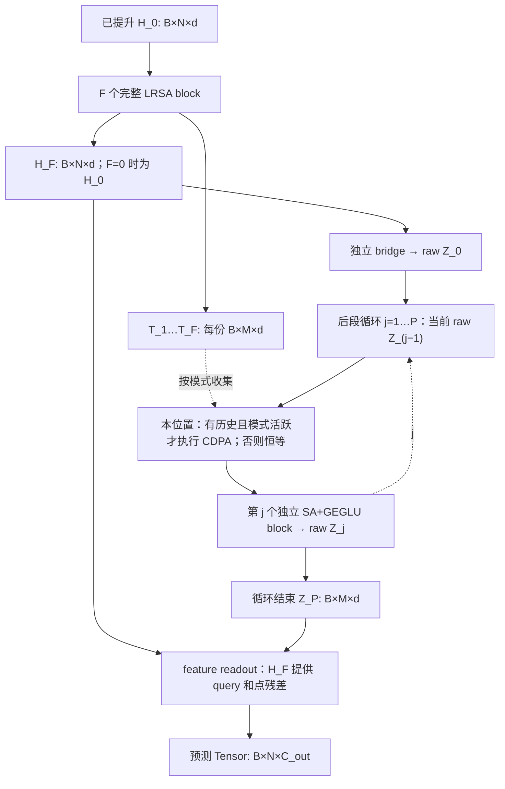

# CDLNO 阶段4：核心组装与历史调度

日期：2026-09-13。阶段0–3已获用户审查通过；阶段4实现及本地合成验收完成，等待用户审查。只组装共享核心，不接入八任务 wrapper、数据或训练入口。依据为用户本阶段指令及 [v1.2](../PLAN_CDLNO/CDPA_Transolver_Implementation_Plan_v1_2.md) §2–4、§8.3–8.4。

## A. 完成范围

API：`from cdlno import CDLNO`；`CDLNO(config, source_chunk_size=0)(H_0)` 返回单个预测 Tensor。默认 `L=8,F=2,P=6,cdpa_mode='entry'`；P 永远派生为 L−F，没有独立 rear-depth，没有 F≤6 的限制。

核心接受已经提升的 `H_0[B,N,d]`。原任务的坐标/reference-distance、placeholder、时间条件及输入提升留给后续 wrapper；本阶段未添加这些结构。阶段1通用配置的 `d=64,h=4,M=64,output_dim=1` 仅供未指定任务时构造；不代表 v1.2 的八任务默认值，也没有改写原 parser 默认值。



| 模式 | 活跃位置（j 从1开始） | 第 j 个位置的历史 | 历史生命周期 |
|---|---|---|---|
| off | 无 | 无 | 不收集T，不注册CDPA |
| entry | 仅 j=1 且 F>0 | `T_1…T_F` | 使用后释放Python历史列表，不建立后段历史 |
| every_block | `F+j−1>0` | `T_1…T_F,Z_0…Z_(j−2)` | 只追加有后续消费者的raw状态 |

F=0/entry 与 off 使用相同权重时具有完全相同的模块集合、调用路径、输出和梯度，没有CDPA参数。F=0/every 的第一个位置同样不注册CDPA；L1/F0三模式均无活跃融合位置。

每次 forward 都重新创建本地历史列表，传递不可变 tuple 快照。训练不detach，不跨forward或真实时间缓存。不同活跃位置独立实例化，不缓存跨位置投影K/V。融合值、SA/FFN中间值、当前重复和未来状态均不加入历史。正式forward不返回或保存历史、注意力矩阵、retain_grad或CPU调试统计；所有追踪hook只在测试中使用并移除。

## B. 修改文件、理由和diff摘要

| 文件 | 本阶段差异 / 理由 |
|---|---|
| [cdlno/core.py](../cdlno/core.py) | 新增核心；绑定已有模块、三模式历史调度、输入和配置检查 |
| [cdlno/config.py](../cdlno/config.py) | 在阶段1基础上绑定核心版本、历史规则、独立后段ratio、网格形状；加强整数/ratio/网格校验与JSON往返 |
| [cdlno/__init__.py](../cdlno/__init__.py) | 懒加载导出CDLNO，保留配置/sidecar导入不加载torch |
| [tests/test_core.py](../tests/test_core.py) | 新增13项核心测试：计算图、实际SDPA调用、精确历史对象、梯度、初始化、权重和GPU |
| [tests/test_core_config.py](../tests/test_core_config.py) | 新增6项配置/输入/sidecar测试及新进程权重恢复、三个任务cwd导入 |
| 本报告、[STATUS](CDLNO_IMPLEMENTATION_STATUS.md)、[AGENTS](../AGENTS.md)、[memory/current-state.md](../memory/current-state.md) | 更新架构、证据、限制与阶段边界 |

配置增量没有改变数学设计：`ffn_ratio` 映射计划的 `front_ffn_ratio`，作用于前段两次latent FFN及前段/最终点FFN；`latent_ffn_ratio` 只作用于后段GEGLU。默认两者均为2。`grid_shape=(H,W)` 属于架构语义，JSON中保存为数组，加载恢复tuple；不从sqrt(N)猜测形状。

核心版本改为 `cdlno-core-v1`，固定 `history_rule='front-t-after-ffn2-before-up-v1'`。该字段描述T截取点，完整后段时序由核心版本与cdpa_mode共同绑定。旧 `phase1` 是基础协议占位，不静默升级成已实现模型；旧sidecar仍先读取/校验且不会被覆盖，缺少必要网格等信息时明确拒绝。配置层保留原有norm/dropout可表达范围，当前核心明确只接受计划的LRSA RMSNorm策略和attention_dropout=0，避免忽略未实现的变体。

`chunk/device/dtype/SDPA backend` 仍为运行字段；checkpoint.py和运行配置类未编辑。直接 `state_dict` 加载只核对PyTorch权重键/形状，架构语义仍需调用既有sidecar校验。即便F0/entry与off数学等价，用户要求的严格sidecar模式比较仍会拒绝跨模式加载。

## C. 公式、张量流和调用计数

以下模块计算均复用未编辑的阶段2/3实现；没有在core重写注意力、FFN、norm或初始化。

| 位置 / 对应代码 | 运算与形状 |
|---|---|
| `front_blocks[i]` | `[B,N,d] → (H_i[B,N,d],T_i[B,M,d])`；down无query residual → latent FFN1 → latent SA → latent FFN2后取T → up → 点FFN/ConvFFN |
| `bridge(h_f)` | `Z_0=Q_0+Cross(LN(Q_0),LN(H_F),LN(H_F))`，`[B,M,d]`；没有额外encoder FFN |
| `cdpa_at[str(j-1)]` | 当前 `Z_(j−1)[B,M,d]` 逐来源对齐历史；depth权重 `[B,M,S_j+1]`，融合RAW候选；无活跃模块则原样送入后段 |
| `latent_blocks[j-1]` | `A=X+SA(LN_1(X))`；`Z_j=A+GEGLU(LN_2(A))`，始终 `[B,M,d]`；各层独立 |
| `readout(h_f,current)` | `H_D=H_F+Up(Norm(H_F),Norm_z(Z_P))`；`H_out=H_D+PointFFN/ConvFFN(Norm(H_D))`；`Linear_out(LN_out(H_out)) → [B,N,C_out]` |

前段/最终外层RMSNorm及每头QK norm，bridge/后段LayerNorm，无后段/CDPA QK norm，O+b、零w、norm scale=1及特殊query初始化均保留阶段2/3定义。父模型不递归重新初始化子模块。规则路径ConvFFN为groups=1的3×3卷积，只在前段和readout中出现；5×7网格按既有点序恢复。

| 每次forward的项目 | 一般公式 | 默认 F2/P6 |
|---|---|---:|
| down + bridge | F+1 | 3 |
| up + readout up | F+1 | 3 |
| latent SA | F+P=L | 8 |
| 规则点ConvFFN | F+1 | 3 |
| entry逻辑历史 | F | 2 |
| every逻辑历史 | PF+P(P−1)/2 | 27 |

对每个有历史位置，chunk0的历史SDPA为1次；chunk=k>0时为 `ceil(S_j/k)` 次。实际spy拦截CDPA内部SDPA及其LNq/Q/LNkv/K/V/O，验证Q每位置投影一次，K/V长度一直为M；随后统一来源融合。下表是默认配置chunk0的**实际调用**，来源数不含当前恒等候选R0：

| 模式 | 逻辑历史份数 | CDPA历史SDPA次数 | 全核心SDPA次数 |
|---|---:|---:|---:|
| off | 0 | 0 | 14 |
| entry | 2 | 1 | 15 |
| every_block | 27 | 6 | 20 |

全核心SDPA为 `2(F+1)+L+历史SDPA次数`。L8/F0/every 的P是8，历史总数28，chunk0历史SDPA为7次。一次API调用不代表一个CUDA kernel，批处理不减少逻辑来源计算量；本阶段未测速度提升。

## D. 实际验证、失败记录与边界

在仓库根目录执行：

```bash
python -B -m unittest discover -s tests -p test_core.py -v
python -B -m unittest discover -s tests -p test_core_config.py -v
CDLNO_LRSA_ROOT=/home/hwz/LRSA-Operator python -B -m unittest discover -s tests -p 'test_*.py' -v > /tmp/cdlno-phase4-final-tests.log 2>&1
```

最终完整回归：**60/60通过，0失败、0错误、0跳过，12.912秒**。分为阶段4核心13项+配置6项，阶段3 CDPA 21项，阶段2模块18项，原LRSA同配置对照2项。完整日志在 `/tmp/cdlno-phase4-final-tests.log`，上述命令可重跑。

实际测试环境：Python3.13.9、torch2.13.0+cu130、CUDA runtime13.0、NVIDIA GeForce RTX 5090 Laptop GPU。只使用现有环境，未安装依赖；本地环境不替代用户远端Python3.10/torch2.11/cu128的兼容性结论。三个任务工作目录新进程用显式PYTHONPATH指向共享根目录，没有执行editable安装，也没有导入exp/main/train/数据模块。

| 验收 | 实际覆盖 |
|---|---|
| 基本配置 | L8 × F0…6 × 三模式 × 点/5×7网格，共42组，B2/d8/M4/h2；全部前反向、所有注册参数和H0梯度非None且有限 |
| 扩展与非法值 | L12/F2、L16/F6、L1/F0、L8/F7、L10/F8的三模式；非法L/F/M/d/h、bool/非整数、ratio、grid、mode、版本、norm/dropout及chunk拒绝；输入错误在front/bridge前报错 |
| F0等价 | L1/L8、点/网格；entry复制off同一state_dict，输出及所有输入/参数梯度逐位相同，SDPA形状调用序列相同，没有调用/注册CDPA |
| 独立性和初始化 | `named_parameters(remove_duplicate=False)`检查对象/storage不共享；前段、后段、各CDPA独立；每个Linear的trunc_normal调用恰好一次；CDPA零w/scale1未被重置 |
| 时序和生命期 | 每位置全部历史对象ID等于前段T与已完成raw状态前缀，保留raw Z0；HF作为bridge/readout的同一对象；两次不同N的forward对象和输入梯度图隔离；no_grad弱引用验证off丢弃T、entry一次使用后释放Python历史 |
| 数学调度和梯度 | 独立raw状态前缀reference复用已验证phase2模块，并调用不依赖CDPA.forward的显式数学reference；非零w下输出及全部梯度一致；直接检查T、bridge、rear、HF、每份CDPA来源梯度；零w首步scale梯度0，合成更新w后该梯度非零 |
| chunk和权重 | 三模式、点/网格，实际chunk0/1/2/99严格加载同权重，输出及全部梯度一致；新进程先读sidecar，构造核心，再加载权重并复现输出 |
| 架构/运行边界 | JSON网格往返，P仅派生，front ratio3/rear ratio1.5实际层宽绑定；chunk/device/dtype/AMP/backend变化允许；M/F/L/mode/ratio/grid等语义变化拒绝，已有sidecar逐字节不变 |
| GPU | 核心点/网格 × 三模式 × FP32/FP16 autocast/BF16 autocast，共18组前反向有限；完整回归还运行阶段2/3精度对照 |

核心数学reference和跨chunk输出/所有梯度容差为 `atol=1e-5, rtol=3e-4`；点置换/逐样本对照为 `2e-6,2e-5`。这是小张量CPU容差，核心GPU新增测试验证有限性，没有宣称整个核心FP16/BF16与FP32逐位或误差界等价。模块/CDPA的精度reference沿用阶段2/3测试；最终CDPA矩阵打印最大梯度绝对误差 `2.17e-05`。

LRSA参考checkout为 `47b03f8c8c8da30bbcc0737b008dc4548f9cb98e`，来源 `git@github.com:Adversarr/LRSA-Operator.git`。参考代码捕获并打印缺少可选xformers/liger_kernel，PyTorch对照路径仍通过，点/网格输出、T及梯度最大误差均为0；没有安装这些可选库。

过程中的失败/修正如实记录：初版核心测试曾有两项计数期望错误（只计后段SA，以及把L8/F0的活跃位置数按旧P误算），修正测试后通过。复核又发现仅统计CDPA模块、未全量核对历史对象、跨chunk测试被覆盖回chunk0、参数去重可能漏检共享，已替换为上述直接证据。新增配置测试首次为5通过/1错误：冻结slots配置给只读P赋值在当前Python抛TypeError，原测试只接收AttributeError；修正为两类均代表拒绝赋值后，最终60项全部通过。这些测试修正没有改变核心数学实现。

按v1.2 §8.3逐条定位：

| 条目 | 本阶段后的验收状态 |
|---:|---|
| 1 空历史恒等 | 独立CDPA已通过；核心补齐F0/entry无参数、同权重等路径等梯度 |
| 2 均匀初始化 | 沿用阶段3RAW均值reference通过；核心确认构造不重置零w |
| 3 两个softmax轴 | 沿用阶段3通过；核心实际chunk调用及M长度检查通过 |
| 4 参考一致 | 阶段3数学reference通过；核心再核对独立raw前缀调度+数学CDPA输出/全部梯度 |
| 5 来源交换 | 阶段3通过，核心未修改机制 |
| 6 历史token置换 | 阶段3通过，核心未修改机制 |
| 7 当前token等变 | 阶段3通过；核心另验点输入置换等变（非结构任务） |
| 8 batch独立 | 阶段3通过；核心B2和逐样本运行一致 |
| 9 梯度可达 | 核心补齐全部T、bridge、后段、HF decoder及活跃CDPA路径；wrapper输入提升/原loss仍待后续阶段 |
| 10 零w梯度 | 阶段3通过；核心再验首步scale=0梯度及w更新后非零梯度 |
| 11 历史时序 | 核心全部来源ID/raw Z0/当前不重复/无中间值或未来值/两forward隔离通过 |
| 12 精度 | 阶段3极端幅值及GPU对照回归通过；核心GPU18组有限性通过；远端未运行 |
| 13 执行路径 | 阶段3数学对照通过；核心实际chunk调用、同权重输出及全部梯度通过 |
| 14 加载边界 | 核心state_dict+sidecar、新进程恢复及跨chunk通过；八任务保存/加载入口未接入，不能宣称入口eval已验收 |

输入dtype沿用标准PyTorch约定：无autocast时输入与参数dtype一致，或由调用方开启autocast。未实施此前未经批准的自动转dtype提案。没有activation-checkpoint重计算、torch.compile或真实时间循环验收；本阶段checkpoint指模型权重序列化与既有架构sidecar。

## E. 冻结区域与证据

分支 `main`，HEAD `75e0f67643806a81cd1d3f6adc88dd8c02416fe7`。阶段4前的 `/tmp/cdlno-phase4-baseline/hashes.json` 包含98个文件哈希及5个可更新文件的原始副本；清单SHA256为 `fa6fca1c865a077d795ad9bb0f9ddcc5c5a6d81042f4ab76048809d982d39233`。

阶段结束比较：**93个非目标文件逐字节不变**。五个现有允许更新文件是config、包导出、AGENTS、STATUS和current-state；本阶段新增三个Python文件和本报告。阶段2 modules、阶段3 cdpa/reference/tests、checkpoint.py、全部计划材料、依赖及三个任务目录均未改。

`git diff --name-only HEAD`为空；71个原tracked文件全部不变。`git status --short`仍只显示既有根级未跟踪工程目录/文件，因此不能仅凭git diff断言新文件正确；另行做SHA256比较、Python3.10语法AST解析、目标文件空白/末尾换行及Markdown本地链接检查。语法解析使用当前解释器的 `feature_version=(3,10)`，不是Python3.10实际运行或editable安装证明。

冻结的数据读取、字段、划分、采样、点序、归一化、标签通道、loss、时间循环、optimizer/scheduler、评价与原Transolver模型/脚本全部未编辑。未下载数据、启动真实训练、安装/替换依赖、commit/push、建PR或reset。

## F. 未解决边界与建议审查点

本阶段未发现需要改变已确认架构或数据协议的冲突。norm/dropout固定策略、网格元数据和核心版本是将已有模块绑定到配置的显式约束。八任务wrapper、按任务d/h/M初始值与原输入提升、原loss连接、任务checkpoint/模型选择接入、远端Python3.10/torch2.11/cu128以及真实数据效果仍未验收；不提前进入下一阶段。

建议优先审查以下5点：

1. `every_block` 精确历史及raw Z0追加时刻，F0首位置无闲置参数，训练图不detach且不跨forward。
2. F0/entry与off同权重完全等价；前后段、bridge/readout及CDPA位置的对象/storage独立，初始化只执行一次。
3. default 2+6的3/3/8/3模块计数，entry 2份/1次、every 27份/6次的来源与SDPA区别。
4. `ffn_ratio`/`latent_ffn_ratio`、grid_shape和版本的sidecar语义；运行chunk可换，但不能用直接state_dict形状匹配替代架构校验。
5. HF同时提供最终query和点残差；核心只接收H0并返回Tensor，原任务输入提升/损失/训练/checkpoint入口仍留在后续授权范围。

**本阶段结束，未执行下一阶段**

## 补充自审（2026-09-13）

**结论更新：四项重点已经自行审查；发现1处运行配置校验缺口，尚未修复。** 原先“核心范围内未发现待修复问题”应限定为当时已覆盖的核心计算和合法配置路径，不能扩大到全部配置输入。用户要求今后每阶段先完成自审，再仅提出剩余问题或需要其判断的决定；本次仍属于阶段4复审。

### A/C. 四项审查结果与源码依据

| 审查重点 | 本次结论与证据 |
|---|---|
| every的raw Z0及追加时刻 | 未发现错误。`core.py:96`保存bridge结果，位置入口`previous=current`保留raw对象；完成后段后，且仅有后续消费者时追加previous。按1起始j，每位置为 `T_1…T_F,Z_0…Z_(j−2)`。源码无原地更新raw历史；完整对象ID、两forward图隔离及独立前缀数学reference均通过。 |
| F0等价、参数独立、单次初始化 | 未发现错误。F0/entry和off均不注册CDPA，复制同权重后输出、全部梯度、实际SDPA形状序列完全相同。各前后段/融合位置独立实例化，参数检查关闭去重并核对storage。父级没有递归reset，Linear截断正态初始化调用一次；特殊queries及Conv原生初始化也有单独对照。 |
| 来源与SDPA次数 | 未发现错误。`cdpa.py`按batch和来源折叠，K/V长度保持M；每个chunk一次SDPA、位置内最后统一融合。默认entry为2份/1次；every来源依次2,3,4,5,6,7，总27份/6次（chunk0）。核心总SDPA分别15/20。实际spy穿透CDPA内部统计，并验证Q每位置仅投影一次。 |
| HF读出与配置/sidecar | HF读出及合法配置路径未发现错误：core传入同一HF对象，readout以Norm(HF)查询ZP并直接加HF残差。sidecar先读后比较，真实架构字段变化拒绝，合法runtime变化允许且原文件不变。**额外发现runtime非法chunk类型被放行，见下项。** |

### F. 唯一确认问题及待审修复方案

位置：[cdlno/config.py](../cdlno/config.py) 的 `CDLNORuntimeConfig.validate`（当前第124–127行）。只检查 `source_chunk_size < 0`，没有约束整数类型。相比之下，`cdpa.py:_check_chunk_size` 正确要求 `type(value) is int` 且非负，核心构造及forward调用了该检查。

v1.2 §4.1 明确要求chunk是非负整数。实际复现表明，以下值通过runtime的validate、sidecar保存、加载及请求配置比较，随后被核心构造拒绝：

```text
True runtime/save/load/validate: ACCEPTED; core: ValueError
1.5 runtime/save/load/validate: ACCEPTED; core: ValueError
nan runtime/save/load/validate: ACCEPTED; core: ValueError
inf runtime/save/load/validate: ACCEPTED; core: ValueError
```

影响：非法运行元数据可被写入并报告校验通过，错误延迟到构造/执行核心时才出现；配置层与实际执行层的合同不一致。合法整数chunk及已验证的核心数学结果不受此问题影响。它来自阶段1基础协议，阶段4核心已正确拒绝非法chunk，现有测试却只覆盖了核心非法chunk和sidecar合法runtime变化，未覆盖两层交界的非法输入。

最小修复方案（**本轮未执行**）：

1. 仅在运行配置validate中补 `type(source_chunk_size) is int`，再检查非负；拒绝bool、float（含NaN/Inf）、字符串等，接受0/1/2/大于S的合法整数。
2. 配置文件保持不依赖torch，不为复用检查而从CDPA导入；不改变模型数学、参数、state_dict或架构/运行字段划分。
3. 增加运行配置validate/from_dict、sidecar保存/读取/请求比较的非法输入回归；验证失败不创建或覆盖文件、既有sidecar字节不变；保留合法chunk跨权重加载及配置导入不加载torch检查。

按用户此前“有误先报告并说明修改计划，由用户决定是否执行修改”的要求，先交付本次确认问题与上述具体方案，未改config或实现。此项不是下一阶段任务授权，也不需要改变架构方案。

### D. 本轮实际执行

定向重跑以下15个既有CPU测试（没有改写测试来规避问题）：

```bash
PYTHONPATH=tests:. python -B -m unittest -v \
  test_core.CoreChecks.test_history_objects_timing_readout_and_two_forward_graph_isolation \
  test_core.CoreChecks.test_off_discards_t_and_entry_releases_history_after_only_use \
  test_core.CoreChecks.test_explicit_raw_state_schedule_output_and_all_gradient_parity \
  test_core.CoreChecks.test_f0_entry_off_same_weights_exact_outputs_gradients_and_calls \
  test_core.CoreChecks.test_registration_storage_independence_and_single_initialization \
  test_core.CoreChecks.test_operation_counts_and_constant_m_all_front_depths \
  test_core.CoreChecks.test_actual_history_sdpa_counts_chunks_and_each_location_projections \
  test_core.CoreChecks.test_direct_history_readout_gradients_zero_w_then_updated_w \
  test_core.CoreChecks.test_state_dict_roundtrip_actual_chunk_changes_and_all_gradients \
  test_core_config.CoreConfigChecks.test_sidecar_runtime_allowed_architecture_rejected_bytes_preserved \
  test_core_config.CoreConfigChecks.test_derived_p_ratios_and_json_grid_roundtrip \
  test_core_config.CoreConfigChecks.test_strict_weights_and_existing_sidecar_in_fresh_process \
  test_modules.ModuleChecks.test_readout_formula_and_gradients \
  test_modules.ModuleChecks.test_readout_query_context_residual_and_output_norm \
  test_modules.ModuleChecks.test_initialization_once_queries_and_default_conv \
  > /tmp/cdlno-phase4-self-review-tests.log 2>&1
```

结果：15/15通过，0失败/错误/跳过，4.991秒；另有上面的4个非法chunk案例复现了配置合同缺陷。使用前次相同的本地Python3.13.9/torch2.13.0+cu130，CPU执行。本轮不重跑GPU、远端或全60项；这些历史通过记录不代表本次新发现的漏洞已经解决。

非法输入复现只创建临时sidecar，调用链为 `CDLNORuntimeConfig(value).validate → save_sidecar → load_sidecar → validate_sidecar → CDLNO(source_chunk_size=value)`，每个文件在读取/比较前后逐字节核对一致；True/1.5/NaN/Inf均出现相同分层不一致。

### B/E. 本轮文件和冻结证据

本次仅编辑四份Markdown：AGENTS新增“交付前自审、仅提出剩余问题”的持续约束；STATUS/current-state记录本次问题和未执行修复；本报告增加依据、复现和修复范围。审查前102文件快照位于 `/tmp/cdlno-phase4-self-review-6ac3ba44/hashes.json`，其中其余98文件保持不变。原71个tracked文件无diff；模型、配置实现、测试、训练/数据/依赖均未编辑。

**本阶段结束，未执行下一阶段**
