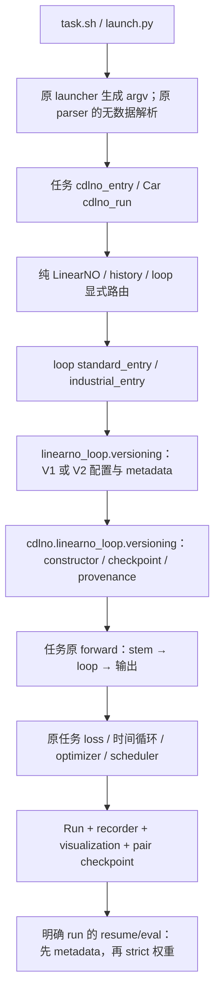
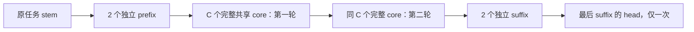

# Looped LinearNO V3 — LAA0 reference and compatibility audit

本报告只覆盖 LAA0：当前代码审计、旧模型数值档案、无数据闭环、独立成本复算及后续文件预算。V3 schema、模型、CLI 和训练功能均未实现。最终检查结果见文末及独立状态文档。

## A. 起点与证据范围

实际仓库 `/home/hwz/CDLNO`，origin `git@github.com:hxh5159/CDLNO-w.git`，branch `main`，HEAD `c02e671506f706910e0a1d58f03c310abf188345`。起点 tracked 2,130、untracked 2、ignored 1,245，共 3,377 个文件；无 staged diff。原有修改为 `check_checkpoints/check_pipe_loop_resume.sh`，两个新设计文档为用户 untracked 文件。全部内容分类和 SHA256、原始 git diff 保存在 [start-manifest.json](loop_linearno_latent_adapter_audit/laa0/start-manifest.json)。这些文件不能被本阶段重写。

阅读记录见 [reading-ledger.json](loop_linearno_latent_adapter_audit/laa0/reading-ledger.json)，113 个源码文件的 import、类/函数位置和 hash 见 [source-map.json](loop_linearno_latent_adapter_audit/laa0/source-map.json)。已核对当前 AGENTS、memory/current-state、LL9R/LL10、LF0–LF7 报告和证据、V1/V2 提示词、完整 V3 分阶段规格。25,424 行讨论导出按设计演变建立索引，重点逐段核对最终 V3 决定所在的 22449–25424 行；不把历史提案或聊天中的论文结论当作已实现事实。

AGENTS 的多条“当前阶段”描述属于旧 CDLNO 历史，且其中 26 个文档引用在当前工作树中缺失；清单保留在 ledger。实际源码已有 V1 和 V2，不能按旧文字退回早期状态，也不补造被删除的历史材料。当前用户的 LAA 分阶段授权优先；不延续早先 LF 的自动跨阶段授权。

## B. 文献与设计边界

文献副本、URL、内容 hash 和固定 commit 见 [reference-sources.json](loop_linearno_latent_adapter_audit/laa0/reference-sources.json)、[reference-code-fetch.json](loop_linearno_latent_adapter_audit/laa0/reference-code-fetch.json)。外部代码只读，未执行、安装或导入。

| 来源 | 本设计取用的知识 | 不据此宣称的内容 |
|---|---|---|
| LinearNO，arXiv 2511.06294v3；已固定官方代码 | Q 在 M 轴归一化、K 在 N 轴归一化，先 KᵀV 再 Q readout；variant 和 release 初始化 | 不能把 LinearNO 写成 Transolver 的 slice self-attention |
| Attention Residuals，2603.15031v1；Kimi K3，2607.24653v2 | receiver-specific query、RMSNorm key、raw value、来源 softmax；RB block 边界 | 来源凸混合不自动获得 SR 的 1/R 稳定性保证 |
| Residual scaling，2606.18524v1 | 循环深度与 residual scaling 的分析动机 | 不把理论条件外推为本八任务的精度/收敛证明 |
| LoRA，2106.09685；microsoft/LoRA 固定源码 | A 随机、B 零，α/r 低秩增量 | 本任务从头共同训练 base；并非冻结预训练模型的原始 LoRA 流程，也不做权重 merge |
| Relaxed Recursive Transformers，2410.20672v3 | 共享权重配合深度特异低秩修正的动机 | 本方案是第二轮 Q/K logits 双端修正，非其预训练压缩/SVD 方案复刻 |
| ICML 2025 timestep encoding；kevin671/tmlt | 共享网络的轮次区分能力 | 本 V3 不增加 timestep embedding/modulation |
| Latent Neural Operator，2406.03923v3 | 潜域非线性处理的背景 | LNO 的 attention、性能结果不是本 latent FFN 的实验证据 |
| SMELT，2609.01343v2 | 循环/共享模型相关背景 | 旧证据文件名 `k3_v2.html` 实为 SMELT，不混同 Kimi K3；不恢复已取消的 MoE |

已检查固定 Transolver 40 个文件、LinearNO 39 个文件及 AttnRes README 的来源 hash。额外抓取 LoRA `layers.py`、TMLT README、LNO README 的固定 commit，未把 README 宣称当作本模型结果。AttnRes PDF 初次转换因无 `pdftotext` 失败，随后使用已安装 PyMuPDF 提取 21 页成功；原失败和成功分别保留，见 `reference-fallback.json`。

## C. 当前真实调用链



`tran_evaluate/linearno_loop/entry.py` 安装当前 recording，再运行实际 entry。`launch.py:native_parse` 只执行入口 parser 的 AST，不在 dry-run 中导入会读取数据的整个 `exp_*.py`。普通纯 LinearNO 使用自身 launcher/adapter，不经过 loop launcher 的 family 限制。

| 任务 | 实际入口 | 当前任务合同 / attention | loop Run / 可视化 |
|---|---|---|---|
| Airfoil | `PDE-Solving-StandardBenchmark/exp_airfoil.py` | `Model(x,fx,T=None)`，conv_temp，二维网格，输出 1 通道 | `LoopStandardRun`；原 recorder.visualize |
| Darcy | `exp_darcy.py`（同上目录） | conv_temp，输入 coefficient，输出 1 通道，保存训练 normalizer | 同上 |
| Elasticity | `exp_elas.py` | temp，不规则点，输出 1 通道 | 同上 |
| Pipe | `exp_pipe.py` | conv_temp，二维网格，输出 1 通道 | 同上 |
| NS | `exp_ns.py` | plain，10 步输入→10 步预测；rollout 每次重建局部 loop 状态 | 同上；逐时间场和误差图 |
| Plasticity | `exp_plas.py` | conv，独立 T 查询、20 次随机时间顺序；输入 field normalizer | 同上；逐时间场和误差图 |
| AirfRANS | `Airfoil-Design-AirfRANS/main.py` / `main_evaluation.py` | `forward(Data)→[N,4]`，单图/变 N，reference-distance 拼接；原 dead temperature 保留 | `linearno_loop.air_entry.AirRun`；`linearno.air_visualization.AirFields`；独立 ensemble 成员 |
| ShapeNet-Car | `Car-Design-ShapeNetCar/main.py` / `main_evaluation.py` | `forward((cfd_data,geom))→[N,4]`，7 通道，原 fold/surface/drag 接口 | `linearno_loop.car_entry.CarRun`；原工业 recorder/periodic visualization |

Standard 的实际公共绘图文件是 `cdlno/periodic_visualization.py`；不凭旧提示词猜出不存在的 `cdlno/linearno/visualization.py`。Air 保留入口实际使用的 `MSE_weighted` 和 ensemble；Car 保留原 sampling、fold、drag 边界。合成图/损失不等于真实 VTK 气动力指标。

稳定 class path：

| 类别 | Standard | AirfRANS | Car |
|---|---|---|---|
| pure | `PDE-Solving-StandardBenchmark.model.LinearNO.Model`，由本地型号 wrapper 暴露 | `cdlno.linearno.airfrans.AirfRANSLinearNO` | `cdlno.linearno.shapenet.ShapeNetLinearNO` |
| V1 | `cdlno.linearno_loop.standard.LoopedStandardModel` | `cdlno.linearno_loop.airfrans.LoopedAirfRANSModel` | `cdlno.linearno_loop.shapenet.LoopedShapeNetModel` |
| V2 | `cdlno.linearno_loop.v2.standard.LoopedStandardModelV2` | `cdlno.linearno_loop.v2.airfrans.LoopedAirfRANSModelV2` | `cdlno.linearno_loop.v2.shapenet.LoopedShapeNetModelV2` |

V1/V2 wrapper 继承纯模型 forward，通过 `LoopForwardView.blocks` / `LoopForwardViewV2.blocks` 提供只含 `self.loop` 的视图。原 stem、位置/reference、T 编码和输出形状验证因此继续执行；没有第二次注册共享模块。构造时直接创建需要的物理模块，执行一次 release `.apply(...)`，然后创建 placeholder。V2 特性模块在公共初始化后隔离安装。后续不能“先造更深 dense 模型再删除”或 `.apply` 第二次而覆盖零初始化。

### 当前数学与版本边界

| 合同 | 当前实现位置 | 必须冻结的事实 |
|---|---|---|
| SR | `body.py:43`、`core.py:161` | core 两条 raw branch 分别乘 1/R；identity/prefix/suffix/head 不缩放 |
| RB | `core.py:122–146` | 每 sublayer 前独立 AR；partial 只含当轮 raw sum；最终 AR；无 1/R |
| RB AMP | `_rb_receive`，同上 | 只将 receiver 当次来源引用转为 anchor dtype；不修改权威 partial，不 detach，不全模型 FP32 |
| LB | `core.py:148` | 轮内 1/R，实际出口减入口得到 Delta；boundary/final 只读 anchor+Delta |
| AR | `attnres.py:53` | eps1e-6，query0/scale1，source 轴 softmax，raw value，无 sqrt/projection/source-count scale |
| V2 所有权 | `v2/core.py:13,33,54` | operator/ln_1 共享；每位置×每轮独立 ln_2+MLP；不可被 V3 改回去 |
| latent primitive | `v2/latent.py:8` | [B,h,M,dh]↔[B,M,H]，LN eps1e-5，GELU，residual，W2/b2 零 |
| 温度 | `linearno/attention.py`、`v2/attention.py:19` | temp/conv_temp clamp .01–1；Car `tempreature_q/k` clamp .1–2；Air dead temperature 不激活 |
| rank | `linearno/profiles.py`、`linearno_loop/construction.py:13` | pure/V1/V2 Car 的 M%dh 约束不动；底层 attention/ShapeNetBlock 已支持独立 M |

当前 `linearno_loop/versioning.py` 以 `core_ffn_mode` 的存在选择 V2，其他走 V1；运行时 `cdlno/linearno_loop/versioning.py` 也只有两分支。V3 不能伪装成 V2 FFN mode。当前 recording 对非 V2 视为 V1；必须未来显式增加 V3 的 feature/parameter/schedule 归属，否则模型虽然运行，记录也会不准确。成本工具同理。

### checkpoint、恢复和输出

纯/loop family guard 先于构造和数据读取。loop eval/resume 从指定 run 的 `architecture.json` 恢复结构，再把用户显式字段当一致性断言。`checkpoint.inspect_checkpoint` 先检查指针、manifest、pair 路径/hash、schema、完整 config/immutable sections，再进入 `read_pair` 的 `torch.load(weights_only=True)`，最后 `load_state_dict(strict=True)`。V1 pair format 为 `linearno-loop-epoch-pair-v1`，V2 为 `linearno-loop-epoch-pair-v2`。

“metadata-first”不等于能在读取 tensor 前知道任意 tensor 的形状/内容：CLI/结构/metadata/hash 冲突可提前拒绝；payload 和实际 state key/shape 仍要在安全 tensor load 后、应用权重或 forward 前严格检查。后续 V3 不能省略其中任一层。

Standard 复用 `LoopStandardRun.prepare/load/save`、数据 generator 和 normalizer restore；工业复用 `industrial_state.restore_training/inspect_members`、Air 的成员内及成员间边界和 Car generator state。已有协议保存 optimizer、scheduler、可选 scaler、Python/NumPy/Torch RNG、DataLoader generators，恢复 RNG 的时点必须保持。

未来 V3 复用现有 `config.json`、`architecture.json`、日志/status、epoch JSONL、train results、`weights/epoch_XXXX.pt`、`checkpoints/epoch_XXXX.pt/.metadata.json/.json` 与 latest/final 指针、`visualizations/`、独立 `evaluations/<id>/results.json` 及 eval index。成员路径按当前 Air 逻辑；不另建简化训练器，不覆盖旧 run，不让 eval 改训练 sidecar 或重拟合 normalizer。

## D. V3 冻结架构的实施解释



上图表示 visit 顺序。SR 直接传递状态；RB/LB 在同一位置按原公式决定来源和 round/boundary 状态，并非把它们改成 SR 串联。

每个 core 位置共享 **ln_1 + LinearNO operator + ln_2 + point FFN**。新 latent FFN 属于该物理位置，跨两轮共享。adapter 也只存一套，但只有 `round_index=1` 时使用。每次 visit 仍重新计算当前输入的 Q/K/V/KᵀV/QC；不缓存跨轮、跨 batch、rollout、时间查询或 ensemble 成员的 latent/history。

设 head features 为 X∈R[B,h,N,dh]：

```
Lq = base_q(X) + I[round=1] * (X Aq^T) Bq^T * alpha/r
Lk = base_k(X) + I[round=1] * (X Ak^T) Bk^T * alpha/r
Q  = softmax_M(original_temperature_rule(Lq))
K  = softmax_N(original_temperature_rule(Lk))
C  = K^T V
Z  = merge_heads(C)                              # [B,M,H]
Z' = Z + W2 GELU(W1 LN(Z,eps=1e-5) + b1) + b2
O  = original_to_out(merge_points(Q split_heads(Z')))
```

Aq/Ak∈R[r,dh]、Bq/Bk∈R[M,r]，跨 head 共享；base Q/K 的 bias/温度/归一化保持 variant 原合同，V 不变。没有 N×N/M×M attention，也没有 latent M 轴混合。merge/split 的 head 顺序固定；这里允许同 token 的 channel/head 信息混合，并不声称对每个 head 各自任意重排 token 仍等变。

latent off 不注册 latent 参数；adapter none 不注册 A/B。两开关独立、四消融完整可恢复。默认 r=alpha=4，A 隔离随机、B=0；latent W2/b2=0，首次更新中 A 或 latent W1/LN 梯度为零可以是正确现象，应先验证 B/W2 学习，再检查后续梯度。初始化的等价比较对象是**相同 H/Dz 拓扑的无特性 loop**；不能声称降宽后仍与原宽度纯模型等价。低秩 logits 增量经 softmax 后，其 routing 差值不必低秩。

| 对照纯模型深度 L | V3 executed D | P/C/R/S | unique block 数 |
|---|---|---|---|
| 8 | 12 | 2/4/2/2 | 8 |
| 12 | 20 | 2/8/2/2 | 12 |
| 16 | 28 | 2/12/2/2 | 16 |
| 32 | 60 | 2/28/2/2 | 32 |

这些是 V3 的成本表拓扑，不扩展 V1/V2 两个旧 preset。custom 可显式指定合法拓扑/H/Dz；adapter on 要求 R=2。无特性或不同 residual 不能继续套 on/on+r4/a4+SR 的 matched 数字。

计划固定 `family=linearno_loop`、`architecture_extension=loop_linearno_latent_adapter_v3`、config/schema version=3、pair format=`linearno-loop-epoch-pair-v3`。CLI `--linearno-loop-architecture operator_latent_adapter_v3` 显式映射到该 extension；这是不同层的字段名映射，不构成数学冲突。`cost_profile=matched_v1|efficient_v1|custom` 只选择成本表，绝不选择版本。未提供 V3 architecture 的旧命令仍保持原 V1/V2 解析/hash/默认 rank 语义。

## E. 后续阶段的最小文件预算（本轮均未创建）

| 阶段 | 新增独立文件区域 / 必要共享修改 | 本阶段验收后才能进入的工作 |
|---|---|---|
| LAA1 | `linearno_loop/v3/{contracts,config,schema,profiles,costs,matrix}.py`；独立 config/oracle 测试 | 无 torch 的版本、来源、表格、hash/metadata 合同；不接生产 parser |
| LAA2 | `cdlno/linearno_loop/v3/adapter.py`；独立 oracle/负向测试 | 不修改 `v2/latent.py`；直接复用已审计 LatentContextFFN、验证初始化/AMP |
| LAA3 | `cdlno/linearno_loop/v3/attention.py`；六 variant oracle | 无特性直接委托旧 attention；新路由验证温度前增量和 context 插入 |
| LAA4 | `v3/{core,construction,standard,airfrans,shapenet}.py` | 完整共享 core、三 residual、四消融；不采用 V2 的轮次 FFN 所有权 |
| LAA5 | `v3/{checkpoint,provenance}.py`；两处 `versioning.py` 最小第三分支 | 元数据优先、独立 format、strict、负向冲突；旧 provenance 精确投影仍须旧 fixture 证明 |
| LAA6 | 必要的 `linearno_loop/standard_entry.py` loop parser/route | Standard 六任务，复用原 Run/训练 AST；不改六个 exp/data/loss/metric |
| LAA7 | 必要的 `industrial_entry.py`；Air/Car Run 仅有证据需要时最小接线 | 独立 M 的 Car wrapper；真实 PyG 合成和 Air ensemble；不改原 main/train/science |
| LAA8 | `tran_evaluate/linearno_loop/` 下 16 个 profile/task 薄入口或等价布局；`launch.py/entry.py/recording.py` 必要分支 | 公共解析一处、真实 parser dry-run、记录完整 ownership；path.sh/旧 launcher 行为冻结 |
| LAA9 | `tools/linearno_loop_accounting.py` 独立 V3 分派及新综合/性能工具 | 参数/矩阵 MAC/标量/router 分列，实际 hooks；CPU/CUDA 合成测量 |
| LAA10 | 独立报告、状态、回归和冻结证据 | 无新增功能，最终复核和交付 |

以上为文件预算，不是创建空模块的授权。若某共享 helper 无须改变则保留；优先由版本层注入 Run/checkpoint，而不是复制训练器。V3 若复制 residual 控制壳以传 round_index，必须逐张量 oracle 对照 V1，不能顺手重构 RB/LB 或修改其 AMP helper；可复用现有原语，不能让旧实现导入 V3。

需要重点防止：H（hidden）和旧构造参数 H/W（空间网格）混淆；M%dh 仅在 V3 Car 解耦；adapter 加在温度之后；AMP base/delta dtype 不兼容；开关消费公共 RNG；全树 `.apply` 覆盖 W2/B 零；off 注册空闲参数；profile 静默覆盖显式值；eval 自动猜目录；记录层错误标成 V1/V2；把矩阵成本或理论误当训练速度/稳定性证明。

## F. 独立成本复算

`laa0/cost_audit.py` 直接按张量尺寸求和，不调用现有 `tools/linearno_loop_accounting.py`，不构造 V3 模型。H/Dz 表作为冻结输入；参数/MAC 及范围独立算出后才与提示词的 expected 表比较。八个纯 L8 模型实际构造计数与公式相等。全部 64 个 V3 表项（8任务×2profile×4深度）与提示词的百分比/范围按原精度相符，没有自行修表。

设 f 为 point MLP ratio、h 为 heads、dh=H/h，k=9（conv/conv_temp）否则1，o=2（conv/conv_temp/Car 的输出两层）否则1。每物理 body 的参数：

```
attention = k H² + H + 2 dh M + dh² + o(H²+H) + temperature_parameters
point_FFN = 2 f H² + (f+1)H
norms = 4H
latent_per_core = Dz(2H+1) + 3H
adapter_per_core = 2r(dh+M)
matrix_MAC_per_body_visit = B N [(k+o+2f)H² + H dh + 4HM]
latent_MAC_all_R2 = 4 B C M H Dz
adapter_MAC_second_visit = 2 B C h N r(dh+M)
```

stem、placeholder、time 和最后 head 分别计算；矩阵 MAC 对每次实际 visit 累加，参数对物理实例只计一次。1 MAC=2 FLOPs；不包含 softmax、clamp、LN/RMSNorm、GELU、bias/add/dropout 等非矩阵操作，也不等同 backward/optimizer FLOPs。RB router 参数为 2H(2CR+1)，LB 为 2HR；其 source contraction 与非矩阵工作另报。本表只比较 SR/on/on/r4/a4，不含 router。

精确成本表、测试记录及最终冻结检查在以下自动汇总中；原始机器可读计算见 [cost-recalculation.json](loop_linearno_latent_adapter_audit/laa0/cost-recalculation.json)。

### 八任务 L8 基线与 D12 精确结果

此处均为表中指定 B/N 的**一次 forward 矩阵 MAC**。参数 baseline 同时经实际 module 测量；V3 是解析预测，不能标为 V3 实测。

| Task | B/N | 原 H / h / f / M | 原 L8 参数 | 原 L8 MAC |
|---|---|---|---:|---:|
| airfoil | 4/11271 | 128/8/1/64 | 1,765,889 | 90,883,573,248 |
| darcy | 4/7225 | 128/8/1/64 | 1,766,145 | 58,266,099,200 |
| elasticity | 1/972 | 128/8/1/64 | 585,217 | 812,809,728 |
| pipe | 4/16641 | 128/8/1/64 | 1,765,889 | 134,184,503,808 |
| plasticity | 8/3131 | 128/8/1/64 | 1,799,428 | 51,330,365,440 |
| ns | 2/4096 | 256/8/2/32 | 3,377,921 | 29,991,370,752 |
| airfrans | 1/32000 | 256/8/2/32 | 3,358,788 | 116,539,392,000 |
| car | 1/32186 | 256/8/2/32 | 3,852,420 | 133,036,839,936 |

**matched_v1，P2/C4/R2/S2，D12**

| Task | H/Dz | 参数 | 参数 / 原L8 | 矩阵 MAC | MAC / 原L8 |
|---|---|---:|---:|---:|---:|
| airfoil | 104/704 | 1,762,177 | 99.789794% | 93,392,581,984 | 102.760685% |
| darcy | 104/704 | 1,762,385 | 99.787107% | 59,980,704,736 | 102.942716% |
| elasticity | 96/320 | 584,737 | 99.917979% | 798,824,064 | 98.279343% |
| pipe | 104/704 | 1,762,177 | 99.789794% | 137,746,032,544 | 102.654203% |
| plasticity | 104/720 | 1,797,788 | 99.908860% | 52,889,194,112 | 103.036855% |
| ns | 208/680 | 3,382,705 | 100.141626% | 30,018,895,872 | 100.091777% |
| airfrans | 208/672 | 3,353,828 | 99.852328% | 116,267,917,312 | 99.767053% |
| car | 208/776 | 3,848,516 | 99.898661% | 132,807,405,376 | 99.827541% |

**efficient_v1，P2/C4/R2/S2，D12**

| Task | H/Dz | 参数 | 参数 / 原L8 | 矩阵 MAC | MAC / 原L8 |
|---|---|---:|---:|---:|---:|
| airfoil | 96/512 | 1,397,281 | 79.126208% | 80,667,249,792 | 88.758889% |
| darcy | 96/512 | 1,397,473 | 79.125610% | 51,787,595,392 | 88.881178% |
| elasticity | 88/256 | 466,961 | 79.792795% | 692,574,496 | 85.207457% |
| pipe | 96/512 | 1,397,281 | 79.126208% | 119,004,753,792 | 88.687405% |
| plasticity | 96/512 | 1,416,260 | 78.706122% | 45,582,031,360 | 88.801299% |
| ns | 192/512 | 2,710,081 | 80.229259% | 25,781,862,400 | 85.964268% |
| airfrans | 192/512 | 2,695,748 | 80.259546% | 99,906,715,648 | 85.727850% |
| car | 192/512 | 2,967,684 | 77.034280% | 113,934,184,192 | 85.641078% |

### 更深表全部复算范围

matched 为相对原模型百分比；efficient 为相对原模型减少百分比。原始逐任务64项含完整 H/Dz、参数分区和 MAC 分区，保存在 JSON。

| profile | L→D | 参数范围 % | MAC 范围 % |
|---|---|---:|---:|
| matched_v1 | 8→12 | 99.787107–100.141626 | 98.279343–103.036855 |
| matched_v1 | 12→20 | 99.778693–100.362945 | 97.090062–103.653812 |
| matched_v1 | 16→28 | 99.749332–100.214552 | 100.469063–104.991520 |
| matched_v1 | 32→60 | 99.164380–100.116857 | 95.789907–100.550064 |
| efficient_v1 | 8→12 | 19.740454–22.965720 | 11.118822–14.792543 |
| efficient_v1 | 12→20 | 17.292540–24.944883 | 11.472759–16.627941 |
| efficient_v1 | 16→28 | 19.077071–23.694213 | 10.451483–14.877296 |
| efficient_v1 | 32→60 | 19.042013–27.253288 | 15.303325–19.225945 |

## G. 实际执行的检查与结果

环境：Python 3.13.9（`/home/hwz/anaconda3/bin/python`），torch 2.13.0 / CUDA 13.0，NumPy 2.2.6，PyG 2.3.1，timm 1.0.28，WSL2 / NVIDIA RTX 5090 Laptop GPU。完整记录见 `environment.json`。与远端 Python3.10 / torch2.11 / cu128 不是同一环境。

以下命令均在 `/home/hwz/CDLNO` 执行；日志和输出目录统一为 `docs/loop_linearno_latent_adapter_audit/laa0/`（下称 A）。

```bash
A=docs/loop_linearno_latent_adapter_audit/laa0
CUBLAS_WORKSPACE_CONFIG=:4096:8 PYTHONDONTWRITEBYTECODE=1 OMP_NUM_THREADS=1 OPENBLAS_NUM_THREADS=1 MKL_NUM_THREADS=1 python -B "$A/capture_baselines.py" > "$A/baseline-fixtures.log" 2>&1
PYTHONDONTWRITEBYTECODE=1 OMP_NUM_THREADS=1 OPENBLAS_NUM_THREADS=1 MKL_NUM_THREADS=1 python -B "$A/cost_audit.py" > "$A/cost-audit-final.log" 2>&1
PYTHONDONTWRITEBYTECODE=1 python -B "$A/run_closures.py" > "$A/native-closures.log" 2>&1
PYTHONDONTWRITEBYTECODE=1 CUDA_VISIBLE_DEVICES='' PYTHONPATH=tests:tests/loop_linearno_ffn:. OMP_NUM_THREADS=1 OPENBLAS_NUM_THREADS=1 MKL_NUM_THREADS=1 MPLBACKEND=Agg python -B -m unittest discover -s tests/loop_linearno_ffn -p 'test_*.py' -v > "$A/v2-regression.log" 2>&1
LL9R_REGRESSION_DIR="$A/regressions" PYTHONDONTWRITEBYTECODE=1 python -B docs/loop_linearno_audit/ll9r/run_regressions.py > "$A/regression-driver.log" 2>&1
PYTHONDONTWRITEBYTECODE=1 python -B "$A/summarize_audit.py" > "$A/summary-checks.log" 2>&1
```

| 检查 | 实际结果 | 耗时与范围 |
|---|---|---|
| 修改前数值档案 | 540 PASS，0 failed/skip | case 时间累计 45.424s；CPU FP64/FP32 各180，CUDA FP32/FP16 AMP/BF16 AMP 各60 |
| 成本复算 | 8 baseline 实例计数；64 V3 解析行；0 表格差异 | 最终复算 1.106s |
| 当前 V1 八任务原生合成闭环 | 8/8 PASS，连续与续训精确相等 | Standard worker 114.786s；工业 worker 95.215s，内部任务并行 |
| V2 LF 专项 | 34 passed / 0 failed / 0 skipped | unittest 20.847s |
| 旧相关完整回归 | 689 methods：644 passed / 9 failed / 36 skipped | 80 modules，累计 module wall 2723.074s，3 worker 并行；不是整体 wall |
| 静态检查 | 497 个 Python 文件内存 compile、9 个 shell bash -n、git diff --check 均通过 | 逐命令秒数见 static-checks.json；不写 pyc |

540 项档案包含 pure 54、V1 162、V2 round_specific 162、V2 round_specific_latent 162。CPU 覆盖六 variant、两个原 preset 和 P0/C2/R3/S1 custom、三 residual（pure 无 residual 枚举）；CUDA 是 preset B 的有限三精度矩阵。小模型 H8/h2/M4，Standard 3×5，工业 N37；包含非零 AR query、dropout、输入/参数梯度、AdamW 一步、CPU/CUDA RNG、call schedule 和 strict reload。所有 reload 最大输出误差为 **0**。这是旧模型修改前档案，不是 V3 oracle/实现验收，也不是跨精度输出相等声明。

CUDA 档案采用 deterministic algorithms、TF32 off、`CUBLAS_WORKSPACE_CONFIG=:4096:8`；仅在独立进程内设置，未改生产后端默认值。34 项 LF 测试覆盖 V2 数学/配置、wrapper/真实 PyG、parser、checkpoint、launcher/recording；其部分短训练使用 synthetic MSE，不等于八任务真实 loss 全矩阵。

V1 原生闭环只选 preset B + SR；四个静态 PDE 使用原 batch AST/原损失，NS 10 步/Plasticity 20 时间查询保留；六题使用真实空间 N、合成4train/2test、H8/h2/M4、3 epoch。训练、interrupt、resume、eval 是新进程；optimizer/scheduler/RNG/shuffle、eval prediction 精确一致，normalizer 未重拟合、训练 sidecar 未改，真实输出及最终可视化产物 hash 留档。Car/Air 使用真实 PyG 内存对象；Car 非零 fold，Air 两成员和两个中断边界。没有真实 loader/VTK 指标。

`native-matrix.json` / `industrial-matrix.json` 保存逐任务秒数、报告、产物路径。工作目录为本次新建的 `/home/hwz/CDLNO-artifacts/loop-ll9r-standard-xwyp5oo9` 与 `loop-ll9r-industrial-w92lzcqd`；前缀来自复用的旧 runner，但这些是本次新证据，未覆盖 LL9R 旧目录。

### 失败、skip 和一次审计脚本修正

新失败方法数 **0**，消失的旧失败数 **0**，skip 方法集合也与 LF7 相同。9 个失败方法跨8模块；unittest 将一个方法的很多 subTest 分别计数，因此原始 failure/error 子项共484，不能与9个方法混为一谈。逐项 traceback 见 `regression-failure-details.json`，对照见 `regression-summary.json`。

| 模块 | 失败方法数 | 具体原因 |
|---|---:|---|
| test_kcdno_tasks | 1 | `docs/kcdno_audit/k4/before.json` 缺失 |
| test_kcdno_temporal | 1 | `docs/kcdno_audit/k5/before.json` 缺失 |
| test_kcdno_car | 1 | `docs/kcdno_audit/k6/before.json` 缺失 |
| test_kcdno_airfrans | 1 | `docs/kcdno_audit/k7/before.json` 缺失 |
| linearno.test_legacy | 2 | 旧 CDLNO/KCDNO 文档/日志及 `docs/kcdno_audit/audit_static.py` 缺失；尚未进入模型计算 |
| loop_linearno.test_isolation | 1（259子项） | LL0/LL6 旧冻结清单中的文档删除、文件分类及既有 `.claude/settings.json` 等差异；与本轮起点相同 |
| loop_linearno.test_launchers | 1 | 旧冻结清单把 ignored `cdlno/__pycache__/experiment.cpython-313.pyc` 当源码 hash 比较；该缓存本轮未变 |
| loop_linearno.test_standard_entry | 1 | 旧 LL6 provenance normalized patch hash 与当前提交不一致；不是本轮源码漂移 |

36 skip 中33项来自该历史 CPU runner 显式设置 `CUDA_VISIBLE_DEVICES=''` 后的 CUDA 条件跳过，3项因 `torch_cluster` 缺失而跳过原 Air sampled-epoch/graph rebuild。GPU 本机可用，另有180项 GPU 档案，不能用它替代所有这些被跳过的 GPU/原 sampled 测试。当前 Car entry 及 history industrial 测试通过，没有本轮 timeout。

独立 cost 脚本首轮从文档提取表格时误匹配另一张 M 表而 AssertionError，未涉及生产代码；只修正本轮新审计脚本的 §3.2 表范围，并增加表项数量断言，随后复算通过。首轮 `cost-audit.log`、第二轮 `cost-audit-attempt2.log`、最终 `cost-audit-final.log` 均保留。

## H. 修改、冻结与自审

本轮只新增这份报告、独立 LAA 状态文档、`docs/loop_linearno_latent_adapter_audit/laa0/` 中的脚本/文献快照/档案/日志/JSON。没有修改任何既有生产、入口、launcher、测试、golden、LL/LF 证据或用户文件；原有 tracked diff 和 staged 状态保持。起点3,377个 tracked/untracked/ignored 文件逐字节 SHA256 全部一致，无删除。最终清单见 `end-freeze.json`。

旧 `test_airfrans.py:213` 和 `test_shapenet_car.py:186` 的自动目录测试通过现有 default_directory 另产生4个 **新 ignored synthetic architecture.json**（Air/Car各2）在 `output/`。这些只有小型 CDLNO metadata，未训练真实数据；完整路径、hash、来源见 `generated-output-inventory.json`。保留这些产物，不删除或把它们隐瞒为用户已有文件。

| 优先自审点 | 结论及证据 |
|---|---|
| 版本隔离与完整共享 | V3 方案显式第三分支，cost profile 不选版本；V2 round FFN keys/旧 parser 未动；source-map/540档案 |
| 公式位置与数值边界 | latent 在 KᵀV 后；adapter 在温度前、第二轮；RB dtype helper 原封不动；无隐式 gate/缩放；当前源码映射与新公式分开 |
| 成本和 Car M | 8实际 baseline + 64独立计算吻合；Car 限制仅规划在 V3 wrapper 解耦，不放宽旧路径 |
| 初始化与恢复 | 当前初始化/placeholder 时序留档；隔离 feature RNG 和零初始化为后续验收；8闭环、34 LF、strict档案通过 |
| 冻结与失败归因 | 3,377起点文件无漂移，9旧失败/36旧skip透明保留；无新增失败，无真实实验或性能宣称 |

**结论：LAA0 PASS（审计范围）；完整旧回归并非全绿。** 未发现需要用户裁决的数学规格冲突。LAA1–LAA10、V3 实际模型/参数 hooks/AMP/恢复、真实数据、完整 epoch、三 seed、远端目标环境、真实精度/延迟/显存/SOTA均 **NOT RUN**。本阶段不支持直接启动 V3 训练。

本 LAA0 阶段结束，未执行下一阶段。
