# LinearNO ResMLP 双端自适应温度 v4

公开 selector 为 `resmlp_dual_temp_v4`，属于 `linearno_loop` family，extension 为 `resmlp_dual_temp`，version=4。这里的 loop 只复用点域 ResMLP 参数。它不继承 V3 的 D12/D20、latent FFN 或 adapter。

```mermaid
flowchart LR
  Stem[原任务 lifting / 时间输入] --> First[first: O0 + F_first]
  First --> A1[A1: O1 + F_A]
  A1 --> B1[B1: O2 + F_B]
  B1 --> C1[C1: O3 + F_C]
  C1 --> A2[A2: O4 + F_A]
  A2 --> B2[B2: O5 + F_B]
  B2 --> C2[C2: O6 + F_C]
  C2 --> Last[last: O7 + F_last]
  Last --> Head[原任务 final LN + head]
```

八套 operator、八个 LN1、八个 LN2 均独立；仅五个 ResMLP owner 注册在 `loop.rmlp`。不可注册的字符串 schedule 指向同一 A/B/C，不重复注册 alias。operator 的 Q/K 温度 predictor 按逻辑深度独立，与 FFN 共享无关。

`u = x + s_j O_j(LN1_j(x))`，`x_next = u + s_j F_owner(LN2_j(u))`。首尾 `s_j=1`，中间六次 `s_j=1/sqrt(2)`。系数只乘两条 raw branch，各一次；identity 与 ResMLP 内部短接都不缩放。新 residual 标识是 `sr_1_over_sqrt_r`，旧 `sr_1_over_r` 未改。

令 W=H×task FFN ratio：`h=GELU_tanh(fc1(x))`；当 W=H 时加 x。之后执行 L 次 `h=h+GELU_tanh(fc_l(h))`；输出 `y=fc2(h)`，当 W=H 时加 h。不含内部 LN/dropout/最终激活。首尾 L=2、A/B/C L=3；实际分别有 4/5 个 Linear。ratio=2 的 NS/AirfRANS/Car 保留宽度，输入输出端点短接不生效，内部同宽短接始终生效。

这是对 FLARE ResidualMLP 拓扑的适配。FLARE 的 input/output projection L=2 是模型外部投影；本模型的首尾点域 FFN L=2 不替换 LinearNO 的原 stem/head。官方 FLARE 用 normal(std=.02)；本模型沿用 LinearNO 的一次外层 trunc_normal(std=.02)、LN 初始化和 Conv 初始化。

温度模块接收输入投影后的 `S[B,Hd,N,d_h]`。Q 为逐点 `Linear(d_h,M)→GELU(tanh)→Linear(M,1)`。K 可为 mean_N 后的 `Linear(d_h,M)→GELU(tanh)→Linear(M,M)`，输出 `[B,Hd,1,M]`；或与 Q 同形但参数独立，输出 `[B,Hd,N,1]`。predictor 权重跨 head 共享，跨深度、跨 K/Q 独立。

`tau=tau_base exp(log(2)tanh(delta))`，`Q=softmax_M(L_Q/tau_Q)`，`K=softmax_N(L_K/tau_K)`，`Z=K^T V`，`Y=QZ`。合法静态 base clamp 在乘有界调制之前执行，不把动态 tau 再 clamp 回旧上界。乘数数学范围 `(1/2,2)`；有限浮点下 tanh 饱和可能达到端点。

| 变体 | base tau / 输出 |
|---|---|
| plain | 1；原单 Linear 输出投影 |
| temp | temperature_q/k clamp(.01,1)；原单 Linear 输出投影 |
| conv | 1；原 Conv2d 输入、双 Linear 输出投影 |
| conv_temp | temperature_q/k clamp(.01,1)；原 Conv2d 输入、双 Linear 输出 |
| AirfRANS | 1；保留声明但不进入 forward 的原 temperature；contiguous head layout |
| ShapeNet | tempreature_q/k clamp(.1,2)，保留拼写；原双 Linear 输出投影 |

`base` 直接调用原 LinearNOAttention.forward。它是 v4 的静态温度消融，并不是纯 LinearNO 整模型的数值等价。两个动态模式在 delta=0 时与同权重 v4 base 对齐。latent-K 对固定 latent 的空间 logits 施加同一正温度，保持其点排序；point-K 属于逐点异质温度/有界 logit 调制，可能改变点排序。

初始化生命周期：构造完整公共 wrapper→仅一次原 LinearNO 全树初始化→按原时序创建 placeholder→CPU generator 隔离安装 predictor→末层 weight/bias 置零→统一迁移 device/dtype。SHA-256 seed 与 Python hash 无关；Q seed 不含 K strategy。公共 CPU/CUDA RNG 和同名同形公共 tensor 均有配对测试。安装前动态 forward、重复安装、完成后的 wrapper.apply 初始化被拒绝。

所有特征、Q/K/V/context 是 forward 局部变量，无历史 cache，无 Gumbel、AttnRes、LoRA、latent FFN、N×N 或 M×M 注意力。见 REQUIREMENTS.md 和 evidence/stage7/costs.json。
